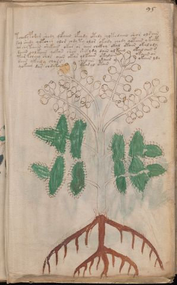

# Voynich Speculative Procedural Protocol — f95v2

IMPORTANT: this is NOT a real or validated translation of the Voynich Manuscript. It is a speculative/procedural model that interprets EVA using a user-defined grammar to generate experimental recipes using safe, known edible substitutes.

This file is generated automatically from IVTFF/EVA transliteration plus a user-defined procedural grammar.



## Page / Folio
- currier: B
- folio: f95v2
- page_number: 197
- section: herbal

## EVA Text (Transliteration)
```text
tchody podar shody qofaiin ofchdy otedy qotedaiin shor olsain
sol shedy qotchey alor chdyty olor ok[a:o]dy chody qotaiin y kaipy
archytaiin shekoiin okar or aiin chckhy okal otain okalody
daiin olkain qokan shar shekydy dain alkain okalaiin s
tar fcheey shos aiin okar olkaiin otalain okaiin ar
dain ykaly chals shedain olaiin y okain ldy
qokeey dar chdykain ytasal otain
```

## Domain Context (Heuristic; Not a Translation)

This section summarizes recurring **basewords** in this IVTFF domain and shows simple substring evidence that the token markers used by the procedural grammar occur inside frequent words.

Any Italian anagram / English gloss is a best-effort lexicon match, not a decipherment.


### Associated basewords (non-generic; top by frequency in this domain)
- `daiin` (count=461) → Italian anagram `piani`; English: plans (arrangements)
- `okaiin` (count=59) → Italian anagram `coniai`; English: [n/a]
- `chaiin` (count=39) → Italian anagram `acini`; English: [n/a]
- `saiin` (count=37) → Italian anagram `asini`; English: [n/a]
- `qokaiin` (count=34) → Italian anagram `ciancio`; English: [n/a]
- `qokar` (count=29) → Italian anagram `carco`; English: [n/a]
- `odaiin` (count=27) → Italian anagram `inopia`; English: poverty
- `otchol` (count=25) → Italian anagram `colto`; English: cultivated
- `kaiin` (count=24) → Italian anagram `acini`; English: [n/a]
- `chodaiin` (count=24) → Italian anagram `apocini`; English: [n/a]
- `qotol` (count=20) → Italian anagram `colto`; English: cultivated
- `okain` (count=19) → Italian anagram `acino`; English: a berry
- `qotor` (count=18) → Italian anagram `corto`; English: short
- `ykaiin` (count=16) → Italian anagram `acini`; English: [n/a]
- `qodaiin` (count=15) → Italian anagram `apocini`; English: [n/a]

### Marker evidence (substring in frequent basewords)
- `qo`: 57 basewords; examples: `qotchy`, `qokchy`, `qokedy`, `qokaiin`, `qoky`, `qokol`
- `q`: 58 basewords; examples: `qotchy`, `qokchy`, `qokedy`, `qokaiin`, `qoky`, `qokol`
- `o`: 252 basewords; examples: `chol`, `o`, `chor`, `or`, `shol`, `ol`
- `k`: 142 basewords; examples: `okaiin`, `oky`, `chckhy`, `qokchy`, `qokedy`, `okal`
- `t`: 102 basewords; examples: `cthy`, `oty`, `qotchy`, `cthol`, `cthor`, `otaiin`
- `p`: 15 basewords; examples: `cphy`, `ypchedy`, `opchy`, `opchey`, `pchor`, `qopchy`
- `ch`: 138 basewords; examples: `chol`, `chor`, `chy`, `chey`, `chedy`, `chdy`
- `sh`: 46 basewords; examples: `shol`, `sho`, `shy`, `shor`, `shey`, `shedy`
- `f`: 1 basewords; examples: `f`
- `cth`: 17 basewords; examples: `cthy`, `cthol`, `cthor`, `cthey`, `chcthy`, `ctho`
- `ckh`: 15 basewords; examples: `chckhy`, `ckhy`, `ckhol`, `ckhey`, `checkhy`, `shckhy`
- `cph`: 2 basewords; examples: `cphy`, `cphol`
- `dy`: 78 basewords; examples: `dy`, `chedy`, `chdy`, `chody`, `qokedy`, `shedy`
- `iin`: 39 basewords; examples: `daiin`, `aiin`, `okaiin`, `chaiin`, `saiin`, `qokaiin`
- `aiin`: 32 basewords; examples: `daiin`, `aiin`, `okaiin`, `chaiin`, `saiin`, `qokaiin`

## Recipes Index (This Page)
- [f95v2.1,@P0](#f95v2-1-f95v2-1-p0)
- [f95v2.2,+P0](#f95v2-2-f95v2-2-p0)
- [f95v2.3,+P0](#f95v2-3-f95v2-3-p0)
- [f95v2.4,+P0](#f95v2-4-f95v2-4-p0)
- [f95v2.5,+P0](#f95v2-5-f95v2-5-p0)
- [f95v2.6,+P0](#f95v2-6-f95v2-6-p0)
- [f95v2.7,+P0](#f95v2-7-f95v2-7-p0)

## Line Glosses (Procedural Gloss Only; Not a Translation)

<a id="f95v2-1-f95v2-1-p0"></a>

### f95v2.1,@P0

EVA: tchody podar shody qofaiin ofchdy otedy qotedaiin shor olsain

Direct Gloss (Procedural, Not a Real Translation):
- tchody: tokens: t ch o p
- podar: tokens: p o p a r → connectors: r → vowel_run: a (level 1; class a)
- shody: tokens: sh o p
- qofaiin: tokens: qo f aiin → vowel_run: a (level 1; class a) → suffix: aiin
- ofchdy: tokens: o f ch p
- otedy: tokens: o t e p → vowel_run: e (level 1; class e)
- qotedaiin: tokens: qo t e p aiin → vowel_run: e (level 1; class e) → suffix: aiin (lexicon-context: `daiin` → `piani`; plans (arrangements))
- shor: tokens: sh o r → connectors: r
- olsain: tokens: o l s a i n → connectors: l s n → vowel_run: a (level 1; class a)

<a id="f95v2-2-f95v2-2-p0"></a>

### f95v2.2,+P0

EVA: sol shedy qotchey alor chdyty olor ok[a:o]dy chody qotaiin y kaipy

Direct Gloss (Procedural, Not a Real Translation):
- sol: tokens: s o l → connectors: s l
- shedy: tokens: sh e p → vowel_run: e (level 1; class e)
- qotchey: tokens: qo t ch e → vowel_run: e (level 1; class e)
- alor: tokens: a l o r → connectors: l r → vowel_run: a (level 1; class a)
- chdyty: tokens: ch p t
- olor: tokens: o l o r → connectors: l r
- ok: tokens: o k
- a: tokens: a → vowel_run: a (level 1; class a)
- o: tokens: o
- dy: tokens: p
- chody: tokens: ch o p
- qotaiin: tokens: qo t aiin → vowel_run: a (level 1; class a) → suffix: aiin (lexicon-context: `qotaiin` → `cationi`; [n/a])
- y: [unparsed]
- kaipy: tokens: k a i p → vowel_run: a (level 1; class a)

<a id="f95v2-3-f95v2-3-p0"></a>

### f95v2.3,+P0

EVA: archytaiin shekoiin okar or aiin chckhy okal otain okalody

Direct Gloss (Procedural, Not a Real Translation):
- archytaiin: tokens: a r ch t aiin → connectors: r → vowel_run: a (level 1; class a) → suffix: aiin
- shekoiin: tokens: sh e k o iin → vowel_run: e (level 1; class e) → suffix: iin
- okar: tokens: o k a r → connectors: r → vowel_run: a (level 1; class a)
- or: tokens: o r → connectors: r
- aiin: tokens: aiin → vowel_run: a (level 1; class a) → suffix: aiin
- chckhy: tokens: ch ckh
- okal: tokens: o k a l → connectors: l → vowel_run: a (level 1; class a)
- otain: tokens: o t a i n → connectors: n → vowel_run: a (level 1; class a) (lexicon-context: `otain` → `anito`; [n/a])
- okalody: tokens: o k a l o p → connectors: l → vowel_run: a (level 1; class a)

<a id="f95v2-4-f95v2-4-p0"></a>

### f95v2.4,+P0

EVA: daiin olkain qokan shar shekydy dain alkain okalaiin s

Direct Gloss (Procedural, Not a Real Translation):
- daiin: tokens: p aiin → vowel_run: a (level 1; class a) → suffix: aiin (lexicon-context: `daiin` → `piani`; plans (arrangements))
- olkain: tokens: o l k a i n → connectors: l n → vowel_run: a (level 1; class a)
- qokan: tokens: qo k a n → connectors: n → vowel_run: a (level 1; class a)
- shar: tokens: sh a r → connectors: r → vowel_run: a (level 1; class a)
- shekydy: tokens: sh e k p → vowel_run: e (level 1; class e)
- dain: tokens: p a i n → connectors: n → vowel_run: a (level 1; class a)
- alkain: tokens: a l k a i n → connectors: l n → vowel_run: a (level 1; class a)
- okalaiin: tokens: o k a l aiin → connectors: l → vowel_run: a (level 1; class a) → suffix: aiin
- s: tokens: s → connectors: s

<a id="f95v2-5-f95v2-5-p0"></a>

### f95v2.5,+P0

EVA: tar fcheey shos aiin okar olkaiin otalain okaiin ar

Direct Gloss (Procedural, Not a Real Translation):
- tar: tokens: t a r → connectors: r → vowel_run: a (level 1; class a)
- fcheey: tokens: f ch ee → vowel_run: ee (level 2; class e)
- shos: tokens: sh o s → connectors: s
- aiin: tokens: aiin → vowel_run: a (level 1; class a) → suffix: aiin
- okar: tokens: o k a r → connectors: r → vowel_run: a (level 1; class a)
- olkaiin: tokens: o l k aiin → connectors: l → vowel_run: a (level 1; class a) → suffix: aiin (lexicon-context: `kaiin` → `acini`; [n/a])
- otalain: tokens: o t a l a i n → connectors: l n → vowel_run: a (level 1; class a)
- okaiin: tokens: o k aiin → vowel_run: a (level 1; class a) → suffix: aiin (lexicon-context: `okaiin` → `coniai`; [n/a])
- ar: tokens: a r → connectors: r → vowel_run: a (level 1; class a)

<a id="f95v2-6-f95v2-6-p0"></a>

### f95v2.6,+P0

EVA: dain ykaly chals shedain olaiin y okain ldy

Direct Gloss (Procedural, Not a Real Translation):
- dain: tokens: p a i n → connectors: n → vowel_run: a (level 1; class a)
- ykaly: tokens: k a l → connectors: l → vowel_run: a (level 1; class a)
- chals: tokens: ch a l s → connectors: l s → vowel_run: a (level 1; class a)
- shedain: tokens: sh e p a i n → connectors: n → vowel_run: e (level 1; class e)
- olaiin: tokens: o l aiin → connectors: l → vowel_run: a (level 1; class a) → suffix: aiin (lexicon-context: `olaiin` → `ialino`; hyaline, glassy)
- y: [unparsed]
- okain: tokens: o k a i n → connectors: n → vowel_run: a (level 1; class a) (lexicon-context: `okain` → `acino`; a berry)
- ldy: tokens: l p → connectors: l

<a id="f95v2-7-f95v2-7-p0"></a>

### f95v2.7,+P0

EVA: qokeey dar chdykain ytasal otain

Direct Gloss (Procedural, Not a Real Translation):
- qokeey: tokens: qo k ee → vowel_run: ee (level 2; class e)
- dar: tokens: p a r → connectors: r → vowel_run: a (level 1; class a)
- chdykain: tokens: ch p k a i n → connectors: n → vowel_run: a (level 1; class a)
- ytasal: tokens: t a s a l → connectors: s l → vowel_run: a (level 1; class a)
- otain: tokens: o t a i n → connectors: n → vowel_run: a (level 1; class a) (lexicon-context: `otain` → `anito`; [n/a])
