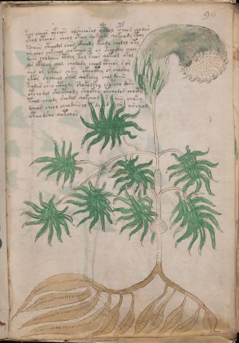

# Voynich Speculative Herbal Ferment Recipe — f96r

IMPORTANT: this is NOT a real or validated translation of the Voynich Manuscript. It is a speculative/procedural model that interprets EVA using a user-defined grammar to generate experimental recipes using safe, known edible substitutes.

This file is generated automatically from IVTFF/EVA transliteration plus a user-defined procedural grammar.



## Page / Folio
- currier: A
- folio: f96r
- page_number: 199
- section: herbal

## EVA Text (Transliteration)
```text
tor cheeor ckheos olsheeosol cpheol cpheor chodar
ytol oteeor sheol oteey qokeody qokeeody cthey
toaiin cthhodal chos ckheody keody chodol oty
or chor chkchol chokchor s or sheockhy choly
daiin chodaiin cthey tol sheor qokeol okol
lor ckheey chol cholody cheol ctheor sor
oiir or ckhor chkey ckhocthy or chockhy
ykeor [se:sh]cheeol sheol qokeeey chol daiin
todar sheo cthody shokocfhy chopcho dory
otchodol shocthody shockhy otchodor chocty
teol cheody shodol qokchod s aiin chokey
dcheor cheol cheodaiin ol dy d chs archeody
oteodsho qotchos
```

## Domain Context (Heuristic; Not a Translation)

This section summarizes recurring **basewords** in this IVTFF domain and shows simple substring evidence that the token markers used by the procedural grammar occur inside frequent words.

Any Italian anagram / English gloss is a best-effort lexicon match, not a decipherment.


### Associated basewords (non-generic; top by frequency in this domain)
- `daiin` (count=461) → Italian anagram `piani`; English: plans (arrangements)
- `okaiin` (count=59) → Italian anagram `coniai`; English: [n/a]
- `chaiin` (count=39) → Italian anagram `acini`; English: [n/a]
- `saiin` (count=37) → Italian anagram `asini`; English: [n/a]
- `qokaiin` (count=34) → Italian anagram `ciancio`; English: [n/a]
- `qokar` (count=29) → Italian anagram `carco`; English: [n/a]
- `odaiin` (count=27) → Italian anagram `inopia`; English: poverty
- `otchol` (count=25) → Italian anagram `colto`; English: cultivated
- `kaiin` (count=24) → Italian anagram `acini`; English: [n/a]
- `chodaiin` (count=24) → Italian anagram `apocini`; English: [n/a]
- `qotol` (count=20) → Italian anagram `colto`; English: cultivated
- `okain` (count=19) → Italian anagram `acino`; English: a berry
- `qotor` (count=18) → Italian anagram `corto`; English: short
- `ykaiin` (count=16) → Italian anagram `acini`; English: [n/a]
- `qodaiin` (count=15) → Italian anagram `apocini`; English: [n/a]

### Marker evidence (substring in frequent basewords)
- `qo`: 57 basewords; examples: `qotchy`, `qokchy`, `qokedy`, `qokaiin`, `qoky`, `qokol`
- `q`: 58 basewords; examples: `qotchy`, `qokchy`, `qokedy`, `qokaiin`, `qoky`, `qokol`
- `o`: 252 basewords; examples: `chol`, `o`, `chor`, `or`, `shol`, `ol`
- `k`: 142 basewords; examples: `okaiin`, `oky`, `chckhy`, `qokchy`, `qokedy`, `okal`
- `t`: 102 basewords; examples: `cthy`, `oty`, `qotchy`, `cthol`, `cthor`, `otaiin`
- `p`: 15 basewords; examples: `cphy`, `ypchedy`, `opchy`, `opchey`, `pchor`, `qopchy`
- `ch`: 138 basewords; examples: `chol`, `chor`, `chy`, `chey`, `chedy`, `chdy`
- `sh`: 46 basewords; examples: `shol`, `sho`, `shy`, `shor`, `shey`, `shedy`
- `f`: 1 basewords; examples: `f`
- `cth`: 17 basewords; examples: `cthy`, `cthol`, `cthor`, `cthey`, `chcthy`, `ctho`
- `ckh`: 15 basewords; examples: `chckhy`, `ckhy`, `ckhol`, `ckhey`, `checkhy`, `shckhy`
- `cph`: 2 basewords; examples: `cphy`, `cphol`
- `dy`: 78 basewords; examples: `dy`, `chedy`, `chdy`, `chody`, `qokedy`, `shedy`
- `iin`: 39 basewords; examples: `daiin`, `aiin`, `okaiin`, `chaiin`, `saiin`, `qokaiin`
- `aiin`: 32 basewords; examples: `daiin`, `aiin`, `okaiin`, `chaiin`, `saiin`, `qokaiin`

## Recipes Index (This Page)
- [f96r.1,@P0](#f96r-1-f96r-1-p0)
- [f96r.2,+P0](#f96r-2-f96r-2-p0)
- [f96r.3,+P0](#f96r-3-f96r-3-p0)
- [f96r.4,+P0](#f96r-4-f96r-4-p0)
- [f96r.5,+P0](#f96r-5-f96r-5-p0)
- [f96r.6,+P0](#f96r-6-f96r-6-p0)
- [f96r.7,+P0](#f96r-7-f96r-7-p0)
- [f96r.8,+P0](#f96r-8-f96r-8-p0)
- [f96r.9,+P0](#f96r-9-f96r-9-p0)
- [f96r.10,+P0](#f96r-10-f96r-10-p0)
- [f96r.11,+P0](#f96r-11-f96r-11-p0)
- [f96r.12,+P0](#f96r-12-f96r-12-p0)
- [f96r.13,+P0](#f96r-13-f96r-13-p0)

## Line Glosses (Procedural Gloss Only; Not a Translation)

<a id="f96r-1-f96r-1-p0"></a>

### f96r.1,@P0

EVA: tor cheeor ckheos olsheeosol cpheol cpheor chodar

Direct Gloss (Procedural, Not a Real Translation):
- tor: apply heat/cooking → mix / transfer
- cheeor: add main plant (safe substitute) → mix / transfer → duration level 2 → state: active extraction
- ckheos: mix / transfer → add complex herbal compound (safe blend) → duration level 1 → state: active extraction
- olsheeosol: add secondary herb (safe substitute) → mix / transfer → duration level 2 → state: active extraction
- cpheol: mix / transfer → add complex herbal compound (safe blend) → duration level 1 → state: active extraction
- cpheor: mix / transfer → add complex herbal compound (safe blend) → duration level 1 → state: active extraction
- chodar: add main plant (safe substitute) → mix / transfer → start fermentation (yeast) → duration level 1 → state: fermentation start

<a id="f96r-2-f96r-2-p0"></a>

### f96r.2,+P0

EVA: ytol oteeor sheol oteey qokeody qokeeody cthey

Direct Gloss (Procedural, Not a Real Translation):
- ytol: apply heat/cooking → mix / transfer
- oteeor: apply heat/cooking → mix / transfer → duration level 2 → state: active extraction
- sheol: add secondary herb (safe substitute) → mix / transfer → duration level 1 → state: active extraction
- oteey: apply heat/cooking → mix / transfer → duration level 2 → state: active extraction
- qokeody: prepare liquid base → add fermentable sugars → mix / transfer → start fermentation (yeast) → duration level 1 → state: active extraction
- qokeeody: prepare liquid base → add fermentable sugars → mix / transfer → start fermentation (yeast) → duration level 2 → state: active extraction
- cthey: add complex herbal compound (safe blend) → duration level 1 → state: active extraction

<a id="f96r-3-f96r-3-p0"></a>

### f96r.3,+P0

EVA: toaiin cthhodal chos ckheody keody chodol oty

Direct Gloss (Procedural, Not a Real Translation):
- toaiin: apply heat/cooking → mix / transfer → duration level 1 → state: fermentation start → long fermentation / aging phase
- cthhodal: mix / transfer → start fermentation (yeast) → add complex herbal compound (safe blend) → duration level 1 → state: fermentation start
- chos: add main plant (safe substitute) → mix / transfer
- ckheody: mix / transfer → start fermentation (yeast) → add complex herbal compound (safe blend) → duration level 1 → state: active extraction
- keody: add fermentable sugars → mix / transfer → start fermentation (yeast) → duration level 1 → state: active extraction
- chodol: add main plant (safe substitute) → mix / transfer → start fermentation (yeast)
- oty: apply heat/cooking → mix / transfer

<a id="f96r-4-f96r-4-p0"></a>

### f96r.4,+P0

EVA: or chor chkchol chokchor s or sheockhy choly

Direct Gloss (Procedural, Not a Real Translation):
- or: mix / transfer
- chor: add main plant (safe substitute) → mix / transfer
- chkchol: add fermentable sugars → add main plant (safe substitute) → mix / transfer
- chokchor: add fermentable sugars → add main plant (safe substitute) → mix / transfer
- s: [unparsed]
- or: mix / transfer
- sheockhy: add secondary herb (safe substitute) → mix / transfer → add complex herbal compound (safe blend) → duration level 1 → state: active extraction
- choly: add main plant (safe substitute) → mix / transfer

<a id="f96r-5-f96r-5-p0"></a>

### f96r.5,+P0

EVA: daiin chodaiin cthey tol sheor qokeol okol

Direct Gloss (Procedural, Not a Real Translation):
- daiin: start fermentation (yeast) → duration level 1 → state: fermentation start → long fermentation / aging phase
- chodaiin: add main plant (safe substitute) → mix / transfer → start fermentation (yeast) → duration level 1 → state: fermentation start → long fermentation / aging phase
- cthey: add complex herbal compound (safe blend) → duration level 1 → state: active extraction
- tol: apply heat/cooking → mix / transfer
- sheor: add secondary herb (safe substitute) → mix / transfer → duration level 1 → state: active extraction
- qokeol: prepare liquid base → add fermentable sugars → mix / transfer → duration level 1 → state: active extraction
- okol: add fermentable sugars → mix / transfer

<a id="f96r-6-f96r-6-p0"></a>

### f96r.6,+P0

EVA: lor ckheey chol cholody cheol ctheor sor

Direct Gloss (Procedural, Not a Real Translation):
- lor: mix / transfer
- ckheey: add complex herbal compound (safe blend) → duration level 2 → state: active extraction
- chol: add main plant (safe substitute) → mix / transfer
- cholody: add main plant (safe substitute) → mix / transfer → start fermentation (yeast)
- cheol: add main plant (safe substitute) → mix / transfer → duration level 1 → state: active extraction
- ctheor: mix / transfer → add complex herbal compound (safe blend) → duration level 1 → state: active extraction
- sor: mix / transfer

<a id="f96r-7-f96r-7-p0"></a>

### f96r.7,+P0

EVA: oiir or ckhor chkey ckhocthy or chockhy

Direct Gloss (Procedural, Not a Real Translation):
- oiir: mix / transfer → duration level 2 → state: cooling/rest
- or: mix / transfer
- ckhor: mix / transfer → add complex herbal compound (safe blend)
- chkey: add fermentable sugars → add main plant (safe substitute) → duration level 1 → state: active extraction
- ckhocthy: mix / transfer → add complex herbal compound (safe blend)
- or: mix / transfer
- chockhy: add main plant (safe substitute) → mix / transfer → add complex herbal compound (safe blend)

<a id="f96r-8-f96r-8-p0"></a>

### f96r.8,+P0

EVA: ykeor [se:sh]cheeol sheol qokeeey chol daiin

Direct Gloss (Procedural, Not a Real Translation):
- ykeor: add fermentable sugars → mix / transfer → duration level 1 → state: active extraction
- se: duration level 1 → state: active extraction
- sh: add secondary herb (safe substitute)
- cheeol: add main plant (safe substitute) → mix / transfer → duration level 2 → state: active extraction
- sheol: add secondary herb (safe substitute) → mix / transfer → duration level 1 → state: active extraction
- qokeeey: prepare liquid base → add fermentable sugars → duration level 3 → state: active extraction
- chol: add main plant (safe substitute) → mix / transfer
- daiin: start fermentation (yeast) → duration level 1 → state: fermentation start → long fermentation / aging phase

<a id="f96r-9-f96r-9-p0"></a>

### f96r.9,+P0

EVA: todar sheo cthody shokocfhy chopcho dory

Direct Gloss (Procedural, Not a Real Translation):
- todar: apply heat/cooking → mix / transfer → start fermentation (yeast) → duration level 1 → state: fermentation start
- sheo: add secondary herb (safe substitute) → mix / transfer → duration level 1 → state: active extraction
- cthody: mix / transfer → start fermentation (yeast) → add complex herbal compound (safe blend)
- shokocfhy: add fermentable sugars → add secondary herb (safe substitute) → mix / transfer → add complex herbal compound (safe blend)
- chopcho: add main plant (safe substitute) → mix / transfer → start fermentation (yeast)
- dory: mix / transfer → start fermentation (yeast)

<a id="f96r-10-f96r-10-p0"></a>

### f96r.10,+P0

EVA: otchodol shocthody shockhy otchodor chocty

Direct Gloss (Procedural, Not a Real Translation):
- otchodol: apply heat/cooking → add main plant (safe substitute) → mix / transfer → start fermentation (yeast)
- shocthody: add secondary herb (safe substitute) → mix / transfer → start fermentation (yeast) → add complex herbal compound (safe blend)
- shockhy: add secondary herb (safe substitute) → mix / transfer → add complex herbal compound (safe blend)
- otchodor: apply heat/cooking → add main plant (safe substitute) → mix / transfer → start fermentation (yeast)
- chocty: apply heat/cooking → add main plant (safe substitute) → mix / transfer

<a id="f96r-11-f96r-11-p0"></a>

### f96r.11,+P0

EVA: teol cheody shodol qokchod s aiin chokey

Direct Gloss (Procedural, Not a Real Translation):
- teol: apply heat/cooking → mix / transfer → duration level 1 → state: active extraction
- cheody: add main plant (safe substitute) → mix / transfer → start fermentation (yeast) → duration level 1 → state: active extraction
- shodol: add secondary herb (safe substitute) → mix / transfer → start fermentation (yeast)
- qokchod: prepare liquid base → add fermentable sugars → add main plant (safe substitute) → mix / transfer → start fermentation (yeast)
- s: [unparsed]
- aiin: duration level 1 → state: fermentation start → long fermentation / aging phase
- chokey: add fermentable sugars → add main plant (safe substitute) → mix / transfer → duration level 1 → state: active extraction

<a id="f96r-12-f96r-12-p0"></a>

### f96r.12,+P0

EVA: dcheor cheol cheodaiin ol dy d chs archeody

Direct Gloss (Procedural, Not a Real Translation):
- dcheor: add main plant (safe substitute) → mix / transfer → start fermentation (yeast) → duration level 1 → state: active extraction
- cheol: add main plant (safe substitute) → mix / transfer → duration level 1 → state: active extraction
- cheodaiin: add main plant (safe substitute) → mix / transfer → start fermentation (yeast) → duration level 1 → state: active extraction → long fermentation / aging phase
- ol: mix / transfer
- dy: start fermentation (yeast)
- d: start fermentation (yeast)
- chs: add main plant (safe substitute)
- archeody: add main plant (safe substitute) → mix / transfer → start fermentation (yeast) → duration level 1 → state: fermentation start

<a id="f96r-13-f96r-13-p0"></a>

### f96r.13,+P0

EVA: oteodsho qotchos

Direct Gloss (Procedural, Not a Real Translation):
- oteodsho: apply heat/cooking → add secondary herb (safe substitute) → mix / transfer → start fermentation (yeast) → duration level 1 → state: active extraction
- qotchos: prepare liquid base → apply heat/cooking → add main plant (safe substitute) → mix / transfer
