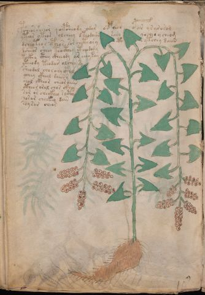

# Voynich Speculative Procedural Protocol — f96v

IMPORTANT: this is NOT a real or validated translation of the Voynich Manuscript. It is a speculative/procedural model that interprets EVA using a user-defined grammar to generate experimental recipes using safe, known edible substitutes.

This file is generated automatically from IVTFF/EVA transliteration plus a user-defined procedural grammar.



## Page / Folio
- currier: A
- folio: f96v
- page_number: 200
- section: herbal

## EVA Text (Transliteration)
```text
psheessheeor qoepsheody odar ocpheeo opar ysar osoj
ytear yteor olcheey dteodoiin saro qoches y cheom
dcheoteos cpheos sor chcthory cth ytchey daiin
dsheos sheey teocthey cteeodody
tockhy cthey ckheeody ar eeeykey
yteeody teodar alchey sy
sheodal choraryctol
ycheey ckheal daiins
oeol ckheor cheoraiin
ctheor oral char ckhey
sar os checkhey socthh
sosar cheekeo dain
soysar cheor
```

## Domain Context (Heuristic; Not a Translation)

This section summarizes recurring **basewords** in this IVTFF domain and shows simple substring evidence that the token markers used by the procedural grammar occur inside frequent words.

Any Italian anagram / English gloss is a best-effort lexicon match, not a decipherment.


### Associated basewords (non-generic; top by frequency in this domain)
- `paiin` (count=477) → Italian anagram `piani`; English: plans (arrangements)
- `okaiin` (count=59) → Italian anagram `coniai`; English: [n/a]
- `qokep` (count=41) → Italian anagram `pecco`; English: [n/a]
- `saiin` (count=40) → Italian anagram `asini`; English: [n/a]
- `kaiin` (count=40) → Italian anagram `acini`; English: [n/a]
- `chaiin` (count=39) → Italian anagram `acini`; English: [n/a]
- `qokaiin` (count=34) → Italian anagram `ciancio`; English: [n/a]
- `qokar` (count=29) → Italian anagram `carco`; English: [n/a]
- `opaiin` (count=29) → Italian anagram `inopia`; English: poverty
- `otchol` (count=25) → Italian anagram `colto`; English: cultivated
- `chopaiin` (count=24) → Italian anagram `apocini`; English: [n/a]
- `qotol` (count=20) → Italian anagram `colto`; English: cultivated
- `okain` (count=19) → Italian anagram `acino`; English: a berry
- `qotor` (count=18) → Italian anagram `corto`; English: short
- `qopaiin` (count=15) → Italian anagram `apocini`; English: [n/a]

### Marker evidence (substring in frequent basewords)
- `qo`: 58 basewords; examples: `qotch`, `qok`, `qot`, `qokch`, `qokep`, `qokaiin`
- `q`: 59 basewords; examples: `qotch`, `qok`, `qot`, `qokch`, `qokep`, `qokaiin`
- `o`: 274 basewords; examples: `chol`, `o`, `chor`, `or`, `shol`, `ol`
- `k`: 146 basewords; examples: `ok`, `k`, `okaiin`, `kch`, `chckh`, `qok`
- `t`: 101 basewords; examples: `cth`, `ot`, `t`, `qotch`, `cthol`, `qot`
- `p`: 152 basewords; examples: `paiin`, `p`, `par`, `pain`, `pal`, `chep`
- `ch`: 145 basewords; examples: `chol`, `chor`, `ch`, `che`, `chep`, `cho`
- `sh`: 51 basewords; examples: `shol`, `sh`, `sho`, `shor`, `she`, `shep`
- `f`: 2 basewords; examples: `fchep`, `f`
- `cth`: 18 basewords; examples: `cth`, `cthol`, `cthor`, `cthe`, `chcth`, `ctho`
- `ckh`: 18 basewords; examples: `chckh`, `ckh`, `ckhe`, `ckhol`, `shckh`, `checkh`
- `cph`: 3 basewords; examples: `cph`, `cphol`, `cphe`
- `iin`: 39 basewords; examples: `paiin`, `aiin`, `okaiin`, `saiin`, `kaiin`, `chaiin`
- `aiin`: 31 basewords; examples: `paiin`, `aiin`, `okaiin`, `saiin`, `kaiin`, `chaiin`

## Recipes Index (This Page)
- [f96v.1,@P0](#f96v-1-f96v-1-p0)
- [f96v.2,+P0](#f96v-2-f96v-2-p0)
- [f96v.3,+P0](#f96v-3-f96v-3-p0)
- [f96v.4,+P0](#f96v-4-f96v-4-p0)
- [f96v.5,+P0](#f96v-5-f96v-5-p0)
- [f96v.6,+P0](#f96v-6-f96v-6-p0)
- [f96v.7,+P0](#f96v-7-f96v-7-p0)
- [f96v.8,+P0](#f96v-8-f96v-8-p0)
- [f96v.9,+P0](#f96v-9-f96v-9-p0)
- [f96v.10,+P0](#f96v-10-f96v-10-p0)
- [f96v.11,+P0](#f96v-11-f96v-11-p0)
- [f96v.12,+P0](#f96v-12-f96v-12-p0)
- [f96v.13,+P0](#f96v-13-f96v-13-p0)

## Line Glosses (Procedural Gloss Only; Not a Translation)

<a id="f96v-1-f96v-1-p0"></a>

### f96v.1,@P0

EVA: psheessheeor qoepsheody odar ocpheeo opar ysar osoj

Direct Gloss (Procedural, Not a Real Translation):
- psheessheeor: tokens: p sh ee s sh ee o r → connectors: s r → vowel_run: ee (level 2; class e)
- qoepsheody: tokens: qo e p sh e o p → vowel_run: e (level 1; class e)
- odar: tokens: o p a r → connectors: r → vowel_run: a (level 1; class a)
- ocpheeo: tokens: o cph ee o → vowel_run: ee (level 2; class e)
- opar: tokens: o p a r → connectors: r → vowel_run: a (level 1; class a)
- ysar: tokens: s a r → connectors: s r → vowel_run: a (level 1; class a)
- osoj: tokens: o s o j → connectors: s

<a id="f96v-2-f96v-2-p0"></a>

### f96v.2,+P0

EVA: ytear yteor olcheey dteodoiin saro qoches y cheom

Direct Gloss (Procedural, Not a Real Translation):
- ytear: tokens: t e a r → connectors: r → vowel_run: e (level 1; class e)
- yteor: tokens: t e o r → connectors: r → vowel_run: e (level 1; class e)
- olcheey: tokens: o l ch ee → connectors: l → vowel_run: ee (level 2; class e)
- dteodoiin: tokens: p t e o p o iin → vowel_run: e (level 1; class e) → suffix: iin
- saro: tokens: s a r o → connectors: s r → vowel_run: a (level 1; class a)
- qoches: tokens: qo ch e s → connectors: s → vowel_run: e (level 1; class e)
- y: [unparsed]
- cheom: tokens: ch e o m → connectors: m → vowel_run: e (level 1; class e)

<a id="f96v-3-f96v-3-p0"></a>

### f96v.3,+P0

EVA: dcheoteos cpheos sor chcthory cth ytchey daiin

Direct Gloss (Procedural, Not a Real Translation):
- dcheoteos: tokens: p ch e o t e o s → connectors: s → vowel_run: e (level 1; class e)
- cpheos: tokens: cph e o s → connectors: s → vowel_run: e (level 1; class e)
- sor: tokens: s o r → connectors: s r
- chcthory: tokens: ch cth o r → connectors: r
- cth: tokens: cth
- ytchey: tokens: t ch e → vowel_run: e (level 1; class e)
- daiin: tokens: p aiin → vowel_run: a (level 1; class a) → suffix: aiin (lexicon-context: `paiin` → `piani`; plans (arrangements))

<a id="f96v-4-f96v-4-p0"></a>

### f96v.4,+P0

EVA: dsheos sheey teocthey cteeodody

Direct Gloss (Procedural, Not a Real Translation):
- dsheos: tokens: p sh e o s → connectors: s → vowel_run: e (level 1; class e)
- sheey: tokens: sh ee → vowel_run: ee (level 2; class e)
- teocthey: tokens: t e o cth e → vowel_run: e (level 1; class e)
- cteeodody: tokens: c t ee o p o p → vowel_run: ee (level 2; class e)

<a id="f96v-5-f96v-5-p0"></a>

### f96v.5,+P0

EVA: tockhy cthey ckheeody ar eeeykey

Direct Gloss (Procedural, Not a Real Translation):
- tockhy: tokens: t o ckh
- cthey: tokens: cth e → vowel_run: e (level 1; class e)
- ckheeody: tokens: ckh ee o p → vowel_run: ee (level 2; class e)
- ar: tokens: a r → connectors: r → vowel_run: a (level 1; class a)
- eeeykey: tokens: eee k e → vowel_run: eee (level 3; class e)

<a id="f96v-6-f96v-6-p0"></a>

### f96v.6,+P0

EVA: yteeody teodar alchey sy

Direct Gloss (Procedural, Not a Real Translation):
- yteeody: tokens: t ee o p → vowel_run: ee (level 2; class e)
- teodar: tokens: t e o p a r → connectors: r → vowel_run: e (level 1; class e)
- alchey: tokens: a l ch e → connectors: l → vowel_run: a (level 1; class a)
- sy: tokens: s → connectors: s

<a id="f96v-7-f96v-7-p0"></a>

### f96v.7,+P0

EVA: sheodal choraryctol

Direct Gloss (Procedural, Not a Real Translation):
- sheodal: tokens: sh e o p a l → connectors: l → vowel_run: e (level 1; class e)
- choraryctol: tokens: ch o r a r c t o l → connectors: r r l → vowel_run: a (level 1; class a)

<a id="f96v-8-f96v-8-p0"></a>

### f96v.8,+P0

EVA: ycheey ckheal daiins

Direct Gloss (Procedural, Not a Real Translation):
- ycheey: tokens: ch ee → vowel_run: ee (level 2; class e)
- ckheal: tokens: ckh e a l → connectors: l → vowel_run: e (level 1; class e)
- daiins: tokens: p aiin s → connectors: s → vowel_run: a (level 1; class a) → suffix: aiin (lexicon-context: `paiin` → `piani`; plans (arrangements))

<a id="f96v-9-f96v-9-p0"></a>

### f96v.9,+P0

EVA: oeol ckheor cheoraiin

Direct Gloss (Procedural, Not a Real Translation):
- oeol: tokens: o e o l → connectors: l → vowel_run: e (level 1; class e)
- ckheor: tokens: ckh e o r → connectors: r → vowel_run: e (level 1; class e)
- cheoraiin: tokens: ch e o r aiin → connectors: r → vowel_run: e (level 1; class e) → suffix: aiin

<a id="f96v-10-f96v-10-p0"></a>

### f96v.10,+P0

EVA: ctheor oral char ckhey

Direct Gloss (Procedural, Not a Real Translation):
- ctheor: tokens: cth e o r → connectors: r → vowel_run: e (level 1; class e)
- oral: tokens: o r a l → connectors: r l → vowel_run: a (level 1; class a)
- char: tokens: ch a r → connectors: r → vowel_run: a (level 1; class a)
- ckhey: tokens: ckh e → vowel_run: e (level 1; class e)

<a id="f96v-11-f96v-11-p0"></a>

### f96v.11,+P0

EVA: sar os checkhey socthh

Direct Gloss (Procedural, Not a Real Translation):
- sar: tokens: s a r → connectors: s r → vowel_run: a (level 1; class a)
- os: tokens: o s → connectors: s
- checkhey: tokens: ch e ckh e → vowel_run: e (level 1; class e)
- socthh: tokens: s o cth h → connectors: s → unmodeled_tokens: h

<a id="f96v-12-f96v-12-p0"></a>

### f96v.12,+P0

EVA: sosar cheekeo dain

Direct Gloss (Procedural, Not a Real Translation):
- sosar: tokens: s o s a r → connectors: s s r → vowel_run: a (level 1; class a)
- cheekeo: tokens: ch ee k e o → vowel_run: ee (level 2; class e)
- dain: tokens: p a i n → connectors: n → vowel_run: a (level 1; class a)

<a id="f96v-13-f96v-13-p0"></a>

### f96v.13,+P0

EVA: soysar cheor

Direct Gloss (Procedural, Not a Real Translation):
- soysar: tokens: s o s a r → connectors: s s r → vowel_run: a (level 1; class a)
- cheor: tokens: ch e o r → connectors: r → vowel_run: e (level 1; class e)
