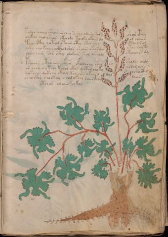

# Voynich Speculative Procedural Protocol — f9r

IMPORTANT: this is NOT a real or validated translation of the Voynich Manuscript. It is a speculative/procedural model that interprets EVA using a user-defined grammar to generate experimental recipes using safe, known edible substitutes.

This file is generated automatically from IVTFF/EVA transliteration plus a user-defined procedural grammar.



## Page / Folio
- currier: A
- folio: f9r
- page_number: 17
- section: herbal

## EVA Text (Transliteration)
```text
tydlo choly cthor orchey s shy odaiin sary shor cthy
oykeey chol ytaiin okchody toeoky okoiin dy or chaiin
toiin cphy qotod otaiin cthy okor chey ctho d ram
[y:o]shy chokcho chcthod shor shaiin otar dor ytol dayty
daiin chor sor cthy chokoiin shol dsholdy otchol ot dy
pshoain cthoaiin okaiir c@134;hodoral shar sy shydal chdy
or chol chy tchy tchol ytor qotol chyky chodar aiin
qotcho qokchy cthey koraiin okain d dal s olshocth[y:g]
ocho cthy choctoy chodykchy saiin dchy daiin
ytcha[s:r] oraiin chkor
```

## Domain Context (Heuristic; Not a Translation)

This section summarizes recurring **basewords** in this IVTFF domain and shows simple substring evidence that the token markers used by the procedural grammar occur inside frequent words.

Any Italian anagram / English gloss is a best-effort lexicon match, not a decipherment.


### Associated basewords (non-generic; top by frequency in this domain)
- `daiin` (count=461) → Italian anagram `piani`; English: plans (arrangements)
- `okaiin` (count=59) → Italian anagram `coniai`; English: [n/a]
- `chaiin` (count=39) → Italian anagram `acini`; English: [n/a]
- `saiin` (count=37) → Italian anagram `asini`; English: [n/a]
- `qokaiin` (count=34) → Italian anagram `ciancio`; English: [n/a]
- `qokar` (count=29) → Italian anagram `carco`; English: [n/a]
- `odaiin` (count=27) → Italian anagram `inopia`; English: poverty
- `otchol` (count=25) → Italian anagram `colto`; English: cultivated
- `kaiin` (count=24) → Italian anagram `acini`; English: [n/a]
- `chodaiin` (count=24) → Italian anagram `apocini`; English: [n/a]
- `qotol` (count=20) → Italian anagram `colto`; English: cultivated
- `okain` (count=19) → Italian anagram `acino`; English: a berry
- `qotor` (count=18) → Italian anagram `corto`; English: short
- `ykaiin` (count=16) → Italian anagram `acini`; English: [n/a]
- `qodaiin` (count=15) → Italian anagram `apocini`; English: [n/a]

### Marker evidence (substring in frequent basewords)
- `qo`: 57 basewords; examples: `qotchy`, `qokchy`, `qokedy`, `qokaiin`, `qoky`, `qokol`
- `q`: 58 basewords; examples: `qotchy`, `qokchy`, `qokedy`, `qokaiin`, `qoky`, `qokol`
- `o`: 252 basewords; examples: `chol`, `o`, `chor`, `or`, `shol`, `ol`
- `k`: 142 basewords; examples: `okaiin`, `oky`, `chckhy`, `qokchy`, `qokedy`, `okal`
- `t`: 102 basewords; examples: `cthy`, `oty`, `qotchy`, `cthol`, `cthor`, `otaiin`
- `p`: 15 basewords; examples: `cphy`, `ypchedy`, `opchy`, `opchey`, `pchor`, `qopchy`
- `ch`: 138 basewords; examples: `chol`, `chor`, `chy`, `chey`, `chedy`, `chdy`
- `sh`: 46 basewords; examples: `shol`, `sho`, `shy`, `shor`, `shey`, `shedy`
- `f`: 1 basewords; examples: `f`
- `cth`: 17 basewords; examples: `cthy`, `cthol`, `cthor`, `cthey`, `chcthy`, `ctho`
- `ckh`: 15 basewords; examples: `chckhy`, `ckhy`, `ckhol`, `ckhey`, `checkhy`, `shckhy`
- `cph`: 2 basewords; examples: `cphy`, `cphol`
- `dy`: 78 basewords; examples: `dy`, `chedy`, `chdy`, `chody`, `qokedy`, `shedy`
- `iin`: 39 basewords; examples: `daiin`, `aiin`, `okaiin`, `chaiin`, `saiin`, `qokaiin`
- `aiin`: 32 basewords; examples: `daiin`, `aiin`, `okaiin`, `chaiin`, `saiin`, `qokaiin`

## Recipes Index (This Page)
- [f9r.1,@P0](#f9r-1-f9r-1-p0)
- [f9r.2,+P0](#f9r-2-f9r-2-p0)
- [f9r.3,+P0](#f9r-3-f9r-3-p0)
- [f9r.4,+P0](#f9r-4-f9r-4-p0)
- [f9r.5,+P0](#f9r-5-f9r-5-p0)
- [f9r.6,+P0](#f9r-6-f9r-6-p0)
- [f9r.7,+P0](#f9r-7-f9r-7-p0)
- [f9r.8,+P0](#f9r-8-f9r-8-p0)
- [f9r.9,+P0](#f9r-9-f9r-9-p0)
- [f9r.10,+Pc](#f9r-10-f9r-10-pc)

## Line Glosses (Procedural Gloss Only; Not a Translation)

<a id="f9r-1-f9r-1-p0"></a>

### f9r.1,@P0

EVA: tydlo choly cthor orchey s shy odaiin sary shor cthy

Direct Gloss (Procedural, Not a Real Translation):
- tydlo: tokens: t p l o → connectors: l
- choly: tokens: ch o l → connectors: l
- cthor: tokens: cth o r → connectors: r
- orchey: tokens: o r ch e → connectors: r → vowel_run: e (level 1; class e)
- s: tokens: s → connectors: s
- shy: tokens: sh
- odaiin: tokens: o p aiin → vowel_run: a (level 1; class a) → suffix: aiin (lexicon-context: `odaiin` → `inopia`; poverty)
- sary: tokens: s a r → connectors: s r → vowel_run: a (level 1; class a)
- shor: tokens: sh o r → connectors: r
- cthy: tokens: cth

<a id="f9r-2-f9r-2-p0"></a>

### f9r.2,+P0

EVA: oykeey chol ytaiin okchody toeoky okoiin dy or chaiin

Direct Gloss (Procedural, Not a Real Translation):
- oykeey: tokens: o k ee → vowel_run: ee (level 2; class e)
- chol: tokens: ch o l → connectors: l
- ytaiin: tokens: t aiin → vowel_run: a (level 1; class a) → suffix: aiin
- okchody: tokens: o k ch o p
- toeoky: tokens: t o e o k → vowel_run: e (level 1; class e)
- okoiin: tokens: o k o iin → vowel_run: ii (level 2; class i) → suffix: iin
- dy: tokens: p
- or: tokens: o r → connectors: r
- chaiin: tokens: ch aiin → vowel_run: a (level 1; class a) → suffix: aiin (lexicon-context: `chaiin` → `acini`; [n/a])

<a id="f9r-3-f9r-3-p0"></a>

### f9r.3,+P0

EVA: toiin cphy qotod otaiin cthy okor chey ctho d ram

Direct Gloss (Procedural, Not a Real Translation):
- toiin: tokens: t o iin → vowel_run: ii (level 2; class i) → suffix: iin
- cphy: tokens: cph
- qotod: tokens: qo t o p
- otaiin: tokens: o t aiin → vowel_run: a (level 1; class a) → suffix: aiin
- cthy: tokens: cth
- okor: tokens: o k o r → connectors: r
- chey: tokens: ch e → vowel_run: e (level 1; class e)
- ctho: tokens: cth o
- d: tokens: p
- ram: tokens: r a m → connectors: r m → vowel_run: a (level 1; class a)

<a id="f9r-4-f9r-4-p0"></a>

### f9r.4,+P0

EVA: [y:o]shy chokcho chcthod shor shaiin otar dor ytol dayty

Direct Gloss (Procedural, Not a Real Translation):
- y: [unparsed]
- o: tokens: o
- shy: tokens: sh
- chokcho: tokens: ch o k ch o
- chcthod: tokens: ch cth o p
- shor: tokens: sh o r → connectors: r
- shaiin: tokens: sh aiin → vowel_run: a (level 1; class a) → suffix: aiin (lexicon-context: `shaiin` → `asini`; [n/a])
- otar: tokens: o t a r → connectors: r → vowel_run: a (level 1; class a)
- dor: tokens: p o r → connectors: r
- ytol: tokens: t o l → connectors: l
- dayty: tokens: p a t → vowel_run: a (level 1; class a)

<a id="f9r-5-f9r-5-p0"></a>

### f9r.5,+P0

EVA: daiin chor sor cthy chokoiin shol dsholdy otchol ot dy

Direct Gloss (Procedural, Not a Real Translation):
- daiin: tokens: p aiin → vowel_run: a (level 1; class a) → suffix: aiin (lexicon-context: `daiin` → `piani`; plans (arrangements))
- chor: tokens: ch o r → connectors: r
- sor: tokens: s o r → connectors: s r
- cthy: tokens: cth
- chokoiin: tokens: ch o k o iin → vowel_run: ii (level 2; class i) → suffix: iin
- shol: tokens: sh o l → connectors: l
- dsholdy: tokens: p sh o l p → connectors: l
- otchol: tokens: o t ch o l → connectors: l (lexicon-context: `otchol` → `colto`; cultivated)
- ot: tokens: o t
- dy: tokens: p

<a id="f9r-6-f9r-6-p0"></a>

### f9r.6,+P0

EVA: pshoain cthoaiin okaiir c@134;hodoral shar sy shydal chdy

Direct Gloss (Procedural, Not a Real Translation):
- pshoain: tokens: p sh o a i n → connectors: n → vowel_run: a (level 1; class a)
- cthoaiin: tokens: cth o aiin → vowel_run: a (level 1; class a) → suffix: aiin
- okaiir: tokens: o k a ii r → connectors: r → vowel_run: a (level 1; class a)
- c: tokens: c
- hodoral: tokens: h o p o r a l → connectors: r l → vowel_run: a (level 1; class a) → unmodeled_tokens: h
- shar: tokens: sh a r → connectors: r → vowel_run: a (level 1; class a)
- sy: tokens: s → connectors: s
- shydal: tokens: sh p a l → connectors: l → vowel_run: a (level 1; class a)
- chdy: tokens: ch p

<a id="f9r-7-f9r-7-p0"></a>

### f9r.7,+P0

EVA: or chol chy tchy tchol ytor qotol chyky chodar aiin

Direct Gloss (Procedural, Not a Real Translation):
- or: tokens: o r → connectors: r
- chol: tokens: ch o l → connectors: l
- chy: tokens: ch
- tchy: tokens: t ch
- tchol: tokens: t ch o l → connectors: l
- ytor: tokens: t o r → connectors: r
- qotol: tokens: qo t o l → connectors: l (lexicon-context: `qotol` → `colto`; cultivated)
- chyky: tokens: ch k
- chodar: tokens: ch o p a r → connectors: r → vowel_run: a (level 1; class a)
- aiin: tokens: aiin → vowel_run: a (level 1; class a) → suffix: aiin

<a id="f9r-8-f9r-8-p0"></a>

### f9r.8,+P0

EVA: qotcho qokchy cthey koraiin okain d dal s olshocth[y:g]

Direct Gloss (Procedural, Not a Real Translation):
- qotcho: tokens: qo t ch o
- qokchy: tokens: qo k ch
- cthey: tokens: cth e → vowel_run: e (level 1; class e)
- koraiin: tokens: k o r aiin → connectors: r → vowel_run: a (level 1; class a) → suffix: aiin
- okain: tokens: o k a i n → connectors: n → vowel_run: a (level 1; class a) (lexicon-context: `okain` → `acino`; a berry)
- d: tokens: p
- dal: tokens: p a l → connectors: l → vowel_run: a (level 1; class a)
- s: tokens: s → connectors: s
- olshocth: tokens: o l sh o cth → connectors: l
- y: [unparsed]
- g: tokens: g

<a id="f9r-9-f9r-9-p0"></a>

### f9r.9,+P0

EVA: ocho cthy choctoy chodykchy saiin dchy daiin

Direct Gloss (Procedural, Not a Real Translation):
- ocho: tokens: o ch o
- cthy: tokens: cth
- choctoy: tokens: ch o c t o
- chodykchy: tokens: ch o p k ch
- saiin: tokens: s aiin → connectors: s → vowel_run: a (level 1; class a) → suffix: aiin (lexicon-context: `saiin` → `asini`; [n/a])
- dchy: tokens: p ch
- daiin: tokens: p aiin → vowel_run: a (level 1; class a) → suffix: aiin (lexicon-context: `daiin` → `piani`; plans (arrangements))

<a id="f9r-10-f9r-10-pc"></a>

### f9r.10,+Pc

EVA: ytcha[s:r] oraiin chkor

Direct Gloss (Procedural, Not a Real Translation):
- ytcha: tokens: t ch a → vowel_run: a (level 1; class a)
- s: tokens: s → connectors: s
- r: tokens: r → connectors: r
- oraiin: tokens: o r aiin → connectors: r → vowel_run: a (level 1; class a) → suffix: aiin
- chkor: tokens: ch k o r → connectors: r
