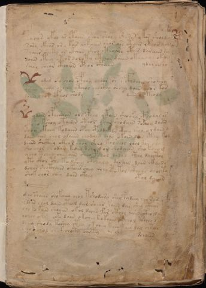

# Voynich Speculative Procedural Protocol — f1r

IMPORTANT: this is NOT a real or validated translation of the Voynich Manuscript. It is a speculative/procedural model that interprets EVA using a user-defined grammar to generate experimental recipes using safe, known edible substitutes.

This file is generated automatically from IVTFF/EVA transliteration plus a user-defined procedural grammar.



## Page / Folio
- currier: A
- folio: f1r
- page_number: 1
- section: text only

## EVA Text (Transliteration)
```text
fachys ykal ar ataiin shol shory [cth:oto]res y kor sholdy
sory ckhar or y kair chtaiin shar ase cthar cthar dan
syaiir sheky or ykaiin shod cthoary cthes daraiin sy
soiin oteey oteo[s:r] roloty cthiar daiin okaiin or okan
sair y chear cthaiin cphar cfhaiin
ydaraishy
odar c'y shol cphoy oydar sh s cfhoaiin shodary
yshey shody okchoy otchol chocthy os chy dain chor kos
daiin shos cfhol shody
dain os teody
ydain cphesaiin ols cphey ytain shoshy cphodal es
oksho kshoy otairin oteol okan shodain sckhey daiin
shoy ckhey kodaiin cphy cphodaiils cthey sho oldain d
dain oiin chol odaiin chodain chdy ok[a:o]in d?n cthy kod
daiin shckhey ckeo r char shey kol chol chol kor chal
sho chol shodan kshy kchy d or chodaiin sho koeam
ycho tchey chekain sheo pshol dydyd cthy dai[cto:@194;]y
yto shol she kodshey cphealy dar ain dain ckhyds
dchar shcthaiin okaiir chey @192;chy @130;tol cthols dlocto
shok chor chey dain ckhey
otol daiiin
cpho shaiin shokcheey chol tshodeesy shey pydeey cha ro dar
ydoin chol dain cthal dar shear kaiin dar shey cthar
cho ?o kaiin shoaiin okol daiin far cthol daiin ctholdar
ycheey okeey oky daiin okchey kokaiin o?chol k?dchy dal
dcheo shody koshey cthy ok chey keey keey dal chtor
?eo? chol chok choty chotey
dchaiin
```

## Domain Context (Heuristic; Not a Translation)

This section summarizes recurring **basewords** in this IVTFF domain and shows simple substring evidence that the token markers used by the procedural grammar occur inside frequent words.

Any Italian anagram / English gloss is a best-effort lexicon match, not a decipherment.


### Associated basewords (non-generic; top by frequency in this domain)
- `daiin` (count=40) → Italian anagram `piani`; English: plans (arrangements)
- `qokar` (count=31) → Italian anagram `carco`; English: [n/a]
- `qokaiin` (count=25) → Italian anagram `ciancio`; English: [n/a]
- `qokal` (count=23) → Italian anagram `calco`; English: cast (of sculpture)
- `ykaiin` (count=15) → Italian anagram `acini`; English: [n/a]
- `okaiin` (count=12) → Italian anagram `coniai`; English: [n/a]
- `qokain` (count=10) → Italian anagram `acconi`; English: [n/a]
- `okain` (count=10) → Italian anagram `acino`; English: a berry
- `saiin` (count=10) → Italian anagram `asini`; English: [n/a]
- `kaiin` (count=9) → Italian anagram `acini`; English: [n/a]
- `odaiin` (count=9) → Italian anagram `inopia`; English: poverty
- `qotaiin` (count=8) → Italian anagram `cationi`; English: [n/a]
- `qotar` (count=8) → Italian anagram `corta`; English: [n/a]
- `qotal` (count=8) → Italian anagram `colta`; English: [n/a]
- `otain` (count=7) → Italian anagram `anito`; English: [n/a]

### Marker evidence (substring in frequent basewords)
- `qo`: 52 basewords; examples: `qokar`, `qokaiin`, `qokal`, `qokeey`, `qoky`, `qokey`
- `q`: 53 basewords; examples: `qokar`, `qokaiin`, `qokal`, `qokeey`, `qoky`, `qokey`
- `o`: 206 basewords; examples: `or`, `ol`, `o`, `qokar`, `chol`, `qokaiin`
- `k`: 119 basewords; examples: `qokar`, `qokaiin`, `qokal`, `okal`, `okar`, `qokeey`
- `t`: 81 basewords; examples: `otal`, `otar`, `otaiin`, `otedy`, `ytaiin`, `otam`
- `p`: 13 basewords; examples: `opchey`, `opchedy`, `pchedy`, `qopchedy`, `opchdy`, `qopchy`
- `ch`: 102 basewords; examples: `chedy`, `chey`, `chol`, `chdy`, `chor`, `chckhy`
- `sh`: 44 basewords; examples: `shedy`, `shey`, `sheey`, `shol`, `sheol`, `shckhy`
- `f`: 1 basewords; examples: `f`
- `cth`: 11 basewords; examples: `chcthy`, `shcthy`, `cthy`, `cthar`, `shecthy`, `chocthy`
- `ckh`: 14 basewords; examples: `chckhy`, `shckhy`, `ckhey`, `qockhy`, `chckhdy`, `checkhy`
- `cph`: 2 basewords; examples: `cphy`, `cphol`
- `dy`: 72 basewords; examples: `shedy`, `chedy`, `dy`, `chdy`, `qokedy`, `okedy`
- `iin`: 35 basewords; examples: `aiin`, `daiin`, `qokaiin`, `ykaiin`, `okaiin`, `otaiin`
- `aiin`: 30 basewords; examples: `aiin`, `daiin`, `qokaiin`, `ykaiin`, `okaiin`, `otaiin`

## Recipes Index (This Page)
- [f1r.1,@P0](#f1r-1-f1r-1-p0)
- [f1r.2,+P0](#f1r-2-f1r-2-p0)
- [f1r.3,+P0](#f1r-3-f1r-3-p0)
- [f1r.4,+P0](#f1r-4-f1r-4-p0)
- [f1r.5,+P0](#f1r-5-f1r-5-p0)
- [f1r.6,=Pt](#f1r-6-f1r-6-pt)
- [f1r.7,*P0](#f1r-7-f1r-7-p0)
- [f1r.8,+P0](#f1r-8-f1r-8-p0)
- [f1r.9,+P0](#f1r-9-f1r-9-p0)
- [f1r.10,=Pt](#f1r-10-f1r-10-pt)
- [f1r.11,*P0](#f1r-11-f1r-11-p0)
- [f1r.12,+P0](#f1r-12-f1r-12-p0)
- [f1r.13,+P0](#f1r-13-f1r-13-p0)
- [f1r.14,+P0](#f1r-14-f1r-14-p0)
- [f1r.15,+P0](#f1r-15-f1r-15-p0)
- [f1r.16,+P0](#f1r-16-f1r-16-p0)
- [f1r.17,+P0](#f1r-17-f1r-17-p0)
- [f1r.18,+P0](#f1r-18-f1r-18-p0)
- [f1r.19,+P0](#f1r-19-f1r-19-p0)
- [f1r.20,+P0](#f1r-20-f1r-20-p0)
- [f1r.21,=Pt](#f1r-21-f1r-21-pt)
- [f1r.22,*P0](#f1r-22-f1r-22-p0)
- [f1r.23,+P0](#f1r-23-f1r-23-p0)
- [f1r.24,+P0](#f1r-24-f1r-24-p0)
- [f1r.25,+P0](#f1r-25-f1r-25-p0)
- [f1r.26,+P0](#f1r-26-f1r-26-p0)
- [f1r.27,+P0](#f1r-27-f1r-27-p0)
- [f1r.28,=Pt](#f1r-28-f1r-28-pt)

## Line Glosses (Procedural Gloss Only; Not a Translation)

<a id="f1r-1-f1r-1-p0"></a>

### f1r.1,@P0

EVA: fachys ykal ar ataiin shol shory [cth:oto]res y kor sholdy

Direct Gloss (Procedural, Not a Real Translation):
- fachys: add main plant (safe substitute) → add aroma modifier → duration level 1 → state: phase transition/start
- ykal: add fermentable sugars → duration level 1 → state: phase transition/start
- ar: duration level 1 → state: phase transition/start
- ataiin: apply heat/cooking → duration level 1 → state: phase transition/start → long phase
- shol: add secondary herb (safe substitute) → mix / transfer
- shory: add secondary herb (safe substitute) → mix / transfer
- cth: add complex herbal compound (safe blend)
- oto: apply heat/cooking → mix / transfer
- res: duration level 1 → state: active extraction
- y: [unparsed]
- kor: add fermentable sugars → mix / transfer
- sholdy: add secondary herb (safe substitute) → mix / transfer → add starter / activate

<a id="f1r-2-f1r-2-p0"></a>

### f1r.2,+P0

EVA: sory ckhar or y kair chtaiin shar ase cthar cthar dan

Direct Gloss (Procedural, Not a Real Translation):
- sory: mix / transfer
- ckhar: add complex herbal compound (safe blend) → duration level 1 → state: phase transition/start
- or: mix / transfer
- y: [unparsed]
- kair: add fermentable sugars → duration level 1 → state: phase transition/start
- chtaiin: apply heat/cooking → add main plant (safe substitute) → duration level 1 → state: phase transition/start → long phase
- shar: add secondary herb (safe substitute) → duration level 1 → state: phase transition/start
- ase: duration level 1 → state: phase transition/start
- cthar: add complex herbal compound (safe blend) → duration level 1 → state: phase transition/start
- cthar: add complex herbal compound (safe blend) → duration level 1 → state: phase transition/start
- dan: add starter / activate → duration level 1 → state: phase transition/start

<a id="f1r-3-f1r-3-p0"></a>

### f1r.3,+P0

EVA: syaiir sheky or ykaiin shod cthoary cthes daraiin sy

Direct Gloss (Procedural, Not a Real Translation):
- syaiir: duration level 1 → state: phase transition/start
- sheky: add fermentable sugars → add secondary herb (safe substitute) → duration level 1 → state: active extraction
- or: mix / transfer
- ykaiin: add fermentable sugars → duration level 1 → state: phase transition/start → long phase
- shod: add secondary herb (safe substitute) → mix / transfer → add starter / activate
- cthoary: mix / transfer → add complex herbal compound (safe blend) → duration level 1 → state: phase transition/start
- cthes: add complex herbal compound (safe blend) → duration level 1 → state: active extraction
- daraiin: add starter / activate → duration level 1 → state: phase transition/start → long phase
- sy: [unparsed]

<a id="f1r-4-f1r-4-p0"></a>

### f1r.4,+P0

EVA: soiin oteey oteo[s:r] roloty cthiar daiin okaiin or okan

Direct Gloss (Procedural, Not a Real Translation):
- soiin: mix / transfer → duration level 2 → state: cooling/rest → medium phase
- oteey: apply heat/cooking → mix / transfer → duration level 2 → state: active extraction
- oteo: apply heat/cooking → mix / transfer → duration level 1 → state: active extraction
- s: [unparsed]
- r: [unparsed]
- roloty: apply heat/cooking → mix / transfer
- cthiar: add complex herbal compound (safe blend) → duration level 1 → state: cooling/rest
- daiin: add starter / activate → duration level 1 → state: phase transition/start → long phase
- okaiin: add fermentable sugars → mix / transfer → duration level 1 → state: phase transition/start → long phase
- or: mix / transfer
- okan: add fermentable sugars → mix / transfer → duration level 1 → state: phase transition/start

<a id="f1r-5-f1r-5-p0"></a>

### f1r.5,+P0

EVA: sair y chear cthaiin cphar cfhaiin

Direct Gloss (Procedural, Not a Real Translation):
- sair: duration level 1 → state: phase transition/start
- y: [unparsed]
- chear: add main plant (safe substitute) → duration level 1 → state: active extraction
- cthaiin: add complex herbal compound (safe blend) → duration level 1 → state: phase transition/start → long phase
- cphar: add complex herbal compound (safe blend) → duration level 1 → state: phase transition/start
- cfhaiin: add complex herbal compound (safe blend) → duration level 1 → state: phase transition/start → long phase

<a id="f1r-6-f1r-6-pt"></a>

### f1r.6,=Pt

EVA: ydaraishy

Direct Gloss (Procedural, Not a Real Translation):
- ydaraishy: add secondary herb (safe substitute) → add starter / activate → duration level 1 → state: phase transition/start

<a id="f1r-7-f1r-7-p0"></a>

### f1r.7,*P0

EVA: odar c'y shol cphoy oydar sh s cfhoaiin shodary

Direct Gloss (Procedural, Not a Real Translation):
- odar: mix / transfer → add starter / activate → duration level 1 → state: phase transition/start
- c: [unparsed]
- y: [unparsed]
- shol: add secondary herb (safe substitute) → mix / transfer
- cphoy: mix / transfer → add complex herbal compound (safe blend)
- oydar: mix / transfer → add starter / activate → duration level 1 → state: phase transition/start
- sh: add secondary herb (safe substitute)
- s: [unparsed]
- cfhoaiin: mix / transfer → add complex herbal compound (safe blend) → duration level 1 → state: phase transition/start → long phase
- shodary: add secondary herb (safe substitute) → mix / transfer → add starter / activate → duration level 1 → state: phase transition/start

<a id="f1r-8-f1r-8-p0"></a>

### f1r.8,+P0

EVA: yshey shody okchoy otchol chocthy os chy dain chor kos

Direct Gloss (Procedural, Not a Real Translation):
- yshey: add secondary herb (safe substitute) → duration level 1 → state: active extraction
- shody: add secondary herb (safe substitute) → mix / transfer → add starter / activate
- okchoy: add fermentable sugars → add main plant (safe substitute) → mix / transfer
- otchol: apply heat/cooking → add main plant (safe substitute) → mix / transfer
- chocthy: add main plant (safe substitute) → mix / transfer → add complex herbal compound (safe blend)
- os: mix / transfer
- chy: add main plant (safe substitute)
- dain: add starter / activate → duration level 1 → state: phase transition/start
- chor: add main plant (safe substitute) → mix / transfer
- kos: add fermentable sugars → mix / transfer

<a id="f1r-9-f1r-9-p0"></a>

### f1r.9,+P0

EVA: daiin shos cfhol shody

Direct Gloss (Procedural, Not a Real Translation):
- daiin: add starter / activate → duration level 1 → state: phase transition/start → long phase
- shos: add secondary herb (safe substitute) → mix / transfer
- cfhol: mix / transfer → add complex herbal compound (safe blend)
- shody: add secondary herb (safe substitute) → mix / transfer → add starter / activate

<a id="f1r-10-f1r-10-pt"></a>

### f1r.10,=Pt

EVA: dain os teody

Direct Gloss (Procedural, Not a Real Translation):
- dain: add starter / activate → duration level 1 → state: phase transition/start
- os: mix / transfer
- teody: apply heat/cooking → mix / transfer → add starter / activate → duration level 1 → state: active extraction

<a id="f1r-11-f1r-11-p0"></a>

### f1r.11,*P0

EVA: ydain cphesaiin ols cphey ytain shoshy cphodal es

Direct Gloss (Procedural, Not a Real Translation):
- ydain: add starter / activate → duration level 1 → state: phase transition/start
- cphesaiin: add complex herbal compound (safe blend) → duration level 1 → state: active extraction → long phase
- ols: mix / transfer
- cphey: add complex herbal compound (safe blend) → duration level 1 → state: active extraction
- ytain: apply heat/cooking → duration level 1 → state: phase transition/start
- shoshy: add secondary herb (safe substitute) → mix / transfer
- cphodal: mix / transfer → add starter / activate → add complex herbal compound (safe blend) → duration level 1 → state: phase transition/start
- es: duration level 1 → state: active extraction

<a id="f1r-12-f1r-12-p0"></a>

### f1r.12,+P0

EVA: oksho kshoy otairin oteol okan shodain sckhey daiin

Direct Gloss (Procedural, Not a Real Translation):
- oksho: add fermentable sugars → add secondary herb (safe substitute) → mix / transfer
- kshoy: add fermentable sugars → add secondary herb (safe substitute) → mix / transfer
- otairin: apply heat/cooking → mix / transfer → duration level 1 → state: phase transition/start
- oteol: apply heat/cooking → mix / transfer → duration level 1 → state: active extraction
- okan: add fermentable sugars → mix / transfer → duration level 1 → state: phase transition/start
- shodain: add secondary herb (safe substitute) → mix / transfer → add starter / activate → duration level 1 → state: phase transition/start
- sckhey: add complex herbal compound (safe blend) → duration level 1 → state: active extraction
- daiin: add starter / activate → duration level 1 → state: phase transition/start → long phase

<a id="f1r-13-f1r-13-p0"></a>

### f1r.13,+P0

EVA: shoy ckhey kodaiin cphy cphodaiils cthey sho oldain d

Direct Gloss (Procedural, Not a Real Translation):
- shoy: add secondary herb (safe substitute) → mix / transfer
- ckhey: add complex herbal compound (safe blend) → duration level 1 → state: active extraction
- kodaiin: add fermentable sugars → mix / transfer → add starter / activate → duration level 1 → state: phase transition/start → long phase
- cphy: add complex herbal compound (safe blend)
- cphodaiils: mix / transfer → add starter / activate → add complex herbal compound (safe blend) → duration level 1 → state: phase transition/start
- cthey: add complex herbal compound (safe blend) → duration level 1 → state: active extraction
- sho: add secondary herb (safe substitute) → mix / transfer
- oldain: mix / transfer → add starter / activate → duration level 1 → state: phase transition/start
- d: add starter / activate

<a id="f1r-14-f1r-14-p0"></a>

### f1r.14,+P0

EVA: dain oiin chol odaiin chodain chdy ok[a:o]in d?n cthy kod

Direct Gloss (Procedural, Not a Real Translation):
- dain: add starter / activate → duration level 1 → state: phase transition/start
- oiin: mix / transfer → duration level 2 → state: cooling/rest → medium phase
- chol: add main plant (safe substitute) → mix / transfer
- odaiin: mix / transfer → add starter / activate → duration level 1 → state: phase transition/start → long phase
- chodain: add main plant (safe substitute) → mix / transfer → add starter / activate → duration level 1 → state: phase transition/start
- chdy: add main plant (safe substitute) → add starter / activate
- ok: add fermentable sugars → mix / transfer
- a: duration level 1 → state: phase transition/start
- o: mix / transfer
- in: duration level 1 → state: cooling/rest
- d: add starter / activate
- n: [unparsed]
- cthy: add complex herbal compound (safe blend)
- kod: add fermentable sugars → mix / transfer → add starter / activate

<a id="f1r-15-f1r-15-p0"></a>

### f1r.15,+P0

EVA: daiin shckhey ckeo r char shey kol chol chol kor chal

Direct Gloss (Procedural, Not a Real Translation):
- daiin: add starter / activate → duration level 1 → state: phase transition/start → long phase
- shckhey: add secondary herb (safe substitute) → add complex herbal compound (safe blend) → duration level 1 → state: active extraction
- ckeo: add fermentable sugars → mix / transfer → duration level 1 → state: active extraction
- r: [unparsed]
- char: add main plant (safe substitute) → duration level 1 → state: phase transition/start
- shey: add secondary herb (safe substitute) → duration level 1 → state: active extraction
- kol: add fermentable sugars → mix / transfer
- chol: add main plant (safe substitute) → mix / transfer
- chol: add main plant (safe substitute) → mix / transfer
- kor: add fermentable sugars → mix / transfer
- chal: add main plant (safe substitute) → duration level 1 → state: phase transition/start

<a id="f1r-16-f1r-16-p0"></a>

### f1r.16,+P0

EVA: sho chol shodan kshy kchy d or chodaiin sho koeam

Direct Gloss (Procedural, Not a Real Translation):
- sho: add secondary herb (safe substitute) → mix / transfer
- chol: add main plant (safe substitute) → mix / transfer
- shodan: add secondary herb (safe substitute) → mix / transfer → add starter / activate → duration level 1 → state: phase transition/start
- kshy: add fermentable sugars → add secondary herb (safe substitute)
- kchy: add fermentable sugars → add main plant (safe substitute)
- d: add starter / activate
- or: mix / transfer
- chodaiin: add main plant (safe substitute) → mix / transfer → add starter / activate → duration level 1 → state: phase transition/start → long phase
- sho: add secondary herb (safe substitute) → mix / transfer
- koeam: add fermentable sugars → mix / transfer → duration level 1 → state: active extraction

<a id="f1r-17-f1r-17-p0"></a>

### f1r.17,+P0

EVA: ycho tchey chekain sheo pshol dydyd cthy dai[cto:@194;]y

Direct Gloss (Procedural, Not a Real Translation):
- ycho: add main plant (safe substitute) → mix / transfer
- tchey: apply heat/cooking → add main plant (safe substitute) → duration level 1 → state: active extraction
- chekain: add fermentable sugars → add main plant (safe substitute) → duration level 1 → state: active extraction
- sheo: add secondary herb (safe substitute) → mix / transfer → duration level 1 → state: active extraction
- pshol: add secondary herb (safe substitute) → mix / transfer → add starter / activate
- dydyd: add starter / activate
- cthy: add complex herbal compound (safe blend)
- dai: add starter / activate → duration level 1 → state: phase transition/start
- cto: apply heat/cooking → mix / transfer
- y: [unparsed]

<a id="f1r-18-f1r-18-p0"></a>

### f1r.18,+P0

EVA: yto shol she kodshey cphealy dar ain dain ckhyds

Direct Gloss (Procedural, Not a Real Translation):
- yto: apply heat/cooking → mix / transfer
- shol: add secondary herb (safe substitute) → mix / transfer
- she: add secondary herb (safe substitute) → duration level 1 → state: active extraction
- kodshey: add fermentable sugars → add secondary herb (safe substitute) → mix / transfer → add starter / activate → duration level 1 → state: active extraction
- cphealy: add complex herbal compound (safe blend) → duration level 1 → state: active extraction
- dar: add starter / activate → duration level 1 → state: phase transition/start
- ain: duration level 1 → state: phase transition/start
- dain: add starter / activate → duration level 1 → state: phase transition/start
- ckhyds: add starter / activate → add complex herbal compound (safe blend)

<a id="f1r-19-f1r-19-p0"></a>

### f1r.19,+P0

EVA: dchar shcthaiin okaiir chey @192;chy @130;tol cthols dlocto

Direct Gloss (Procedural, Not a Real Translation):
- dchar: add main plant (safe substitute) → add starter / activate → duration level 1 → state: phase transition/start
- shcthaiin: add secondary herb (safe substitute) → add complex herbal compound (safe blend) → duration level 1 → state: phase transition/start → long phase
- okaiir: add fermentable sugars → mix / transfer → duration level 1 → state: phase transition/start
- chey: add main plant (safe substitute) → duration level 1 → state: active extraction
- chy: add main plant (safe substitute)
- tol: apply heat/cooking → mix / transfer
- cthols: mix / transfer → add complex herbal compound (safe blend)
- dlocto: apply heat/cooking → mix / transfer → add starter / activate

<a id="f1r-20-f1r-20-p0"></a>

### f1r.20,+P0

EVA: shok chor chey dain ckhey

Direct Gloss (Procedural, Not a Real Translation):
- shok: add fermentable sugars → add secondary herb (safe substitute) → mix / transfer
- chor: add main plant (safe substitute) → mix / transfer
- chey: add main plant (safe substitute) → duration level 1 → state: active extraction
- dain: add starter / activate → duration level 1 → state: phase transition/start
- ckhey: add complex herbal compound (safe blend) → duration level 1 → state: active extraction

<a id="f1r-21-f1r-21-pt"></a>

### f1r.21,=Pt

EVA: otol daiiin

Direct Gloss (Procedural, Not a Real Translation):
- otol: apply heat/cooking → mix / transfer
- daiiin: add starter / activate → duration level 1 → state: phase transition/start → medium phase

<a id="f1r-22-f1r-22-p0"></a>

### f1r.22,*P0

EVA: cpho shaiin shokcheey chol tshodeesy shey pydeey cha ro dar

Direct Gloss (Procedural, Not a Real Translation):
- cpho: mix / transfer → add complex herbal compound (safe blend)
- shaiin: add secondary herb (safe substitute) → duration level 1 → state: phase transition/start → long phase
- shokcheey: add fermentable sugars → add main plant (safe substitute) → add secondary herb (safe substitute) → mix / transfer → duration level 2 → state: active extraction
- chol: add main plant (safe substitute) → mix / transfer
- tshodeesy: apply heat/cooking → add secondary herb (safe substitute) → mix / transfer → add starter / activate → duration level 2 → state: active extraction
- shey: add secondary herb (safe substitute) → duration level 1 → state: active extraction
- pydeey: add starter / activate → duration level 2 → state: active extraction
- cha: add main plant (safe substitute) → duration level 1 → state: phase transition/start
- ro: mix / transfer
- dar: add starter / activate → duration level 1 → state: phase transition/start

<a id="f1r-23-f1r-23-p0"></a>

### f1r.23,+P0

EVA: ydoin chol dain cthal dar shear kaiin dar shey cthar

Direct Gloss (Procedural, Not a Real Translation):
- ydoin: mix / transfer → add starter / activate → duration level 1 → state: cooling/rest
- chol: add main plant (safe substitute) → mix / transfer
- dain: add starter / activate → duration level 1 → state: phase transition/start
- cthal: add complex herbal compound (safe blend) → duration level 1 → state: phase transition/start
- dar: add starter / activate → duration level 1 → state: phase transition/start
- shear: add secondary herb (safe substitute) → duration level 1 → state: active extraction
- kaiin: add fermentable sugars → duration level 1 → state: phase transition/start → long phase
- dar: add starter / activate → duration level 1 → state: phase transition/start
- shey: add secondary herb (safe substitute) → duration level 1 → state: active extraction
- cthar: add complex herbal compound (safe blend) → duration level 1 → state: phase transition/start

<a id="f1r-24-f1r-24-p0"></a>

### f1r.24,+P0

EVA: cho ?o kaiin shoaiin okol daiin far cthol daiin ctholdar

Direct Gloss (Procedural, Not a Real Translation):
- cho: add main plant (safe substitute) → mix / transfer
- o: mix / transfer
- kaiin: add fermentable sugars → duration level 1 → state: phase transition/start → long phase
- shoaiin: add secondary herb (safe substitute) → mix / transfer → duration level 1 → state: phase transition/start → long phase
- okol: add fermentable sugars → mix / transfer
- daiin: add starter / activate → duration level 1 → state: phase transition/start → long phase
- far: add aroma modifier → duration level 1 → state: phase transition/start
- cthol: mix / transfer → add complex herbal compound (safe blend)
- daiin: add starter / activate → duration level 1 → state: phase transition/start → long phase
- ctholdar: mix / transfer → add starter / activate → add complex herbal compound (safe blend) → duration level 1 → state: phase transition/start

<a id="f1r-25-f1r-25-p0"></a>

### f1r.25,+P0

EVA: ycheey okeey oky daiin okchey kokaiin o?chol k?dchy dal

Direct Gloss (Procedural, Not a Real Translation):
- ycheey: add main plant (safe substitute) → duration level 2 → state: active extraction
- okeey: add fermentable sugars → mix / transfer → duration level 2 → state: active extraction
- oky: add fermentable sugars → mix / transfer
- daiin: add starter / activate → duration level 1 → state: phase transition/start → long phase
- okchey: add fermentable sugars → add main plant (safe substitute) → mix / transfer → duration level 1 → state: active extraction
- kokaiin: add fermentable sugars → mix / transfer → duration level 1 → state: phase transition/start → long phase
- o: mix / transfer
- chol: add main plant (safe substitute) → mix / transfer
- k: add fermentable sugars
- dchy: add main plant (safe substitute) → add starter / activate
- dal: add starter / activate → duration level 1 → state: phase transition/start

<a id="f1r-26-f1r-26-p0"></a>

### f1r.26,+P0

EVA: dcheo shody koshey cthy ok chey keey keey dal chtor

Direct Gloss (Procedural, Not a Real Translation):
- dcheo: add main plant (safe substitute) → mix / transfer → add starter / activate → duration level 1 → state: active extraction
- shody: add secondary herb (safe substitute) → mix / transfer → add starter / activate
- koshey: add fermentable sugars → add secondary herb (safe substitute) → mix / transfer → duration level 1 → state: active extraction
- cthy: add complex herbal compound (safe blend)
- ok: add fermentable sugars → mix / transfer
- chey: add main plant (safe substitute) → duration level 1 → state: active extraction
- keey: add fermentable sugars → duration level 2 → state: active extraction
- keey: add fermentable sugars → duration level 2 → state: active extraction
- dal: add starter / activate → duration level 1 → state: phase transition/start
- chtor: apply heat/cooking → add main plant (safe substitute) → mix / transfer

<a id="f1r-27-f1r-27-p0"></a>

### f1r.27,+P0

EVA: ?eo? chol chok choty chotey

Direct Gloss (Procedural, Not a Real Translation):
- eo: mix / transfer → duration level 1 → state: active extraction
- chol: add main plant (safe substitute) → mix / transfer
- chok: add fermentable sugars → add main plant (safe substitute) → mix / transfer
- choty: apply heat/cooking → add main plant (safe substitute) → mix / transfer
- chotey: apply heat/cooking → add main plant (safe substitute) → mix / transfer → duration level 1 → state: active extraction

<a id="f1r-28-f1r-28-pt"></a>

### f1r.28,=Pt

EVA: dchaiin

Direct Gloss (Procedural, Not a Real Translation):
- dchaiin: add main plant (safe substitute) → add starter / activate → duration level 1 → state: phase transition/start → long phase
