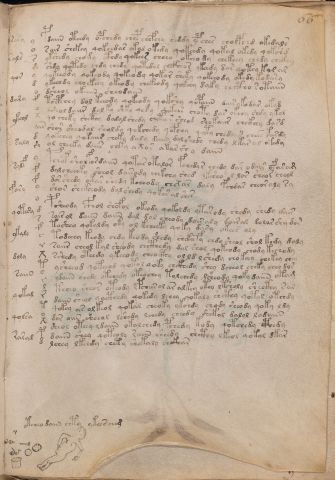

# Voynich Speculative Herbal Ferment Recipe — f66r

IMPORTANT: this is NOT a real or validated translation of the Voynich Manuscript. It is a speculative/procedural model that interprets EVA using a user-defined grammar to generate experimental recipes using safe, known edible substitutes.

This file is generated automatically from IVTFF/EVA transliteration plus a user-defined procedural grammar.



## Page / Folio
- currier: B
- folio: f66r
- page_number: 117
- section: text only

## EVA Text (Transliteration)
```text
rary
[r:s]als
qo[r:n]
dary
ykeol
saly
salf
fary
qotesy
ykaly
doly
saiin
qokal
qolsa
raral
y
o
s
sh
y
d
o
f
@169;
x
air
d
sh
y
f
f
y
o
d
s
f
c
@172;
x
t
o
@195;
l
r
t
o
x
p
d
pdaiin oteedy opchedy chap chefchy shddy ypches cholpchd okedals
sair shekey qokeedar okal okedy qokeedy qokal okedy qokshd
ykshedy chady cthdy qokees cheeo okcho dy chekeey chedy chckhy
shdy qotedy chdy chedy qotedal chcpheor ykady dar qotey k[o:a]l ar
qokeeody qokeody qokeody qokar sheky qokeeody okedy kodary
ykeeody choekeey okeody chekeody qokeey dyky chctho rotaiin
dsheol okaiin sheodaiin
tocpheey dol kchody qokeody qokshy qopaiin dairykodas okyd
dsholdaiir dalky shky qoky shekair choty dar okeey shdy ykol
qo cheky shcthy dalalshedy cheta r sheod shokaiir chckhhy da[r:s]d
shor sheodal sholdy qokchedy qopchy qoty chedaiir chees kardy
qokchey qokaiir cheky daly daiin dal shedy chedy lkar ol okedy
ol cheeky daiir chky axor akar i'h y daiin
pchof sholfordaiin qotar otalor fchedy[r:s] chedy dar odair ofaram
dalcheeeky sheol dairody chekchy shed ykesho l lor sheor che[a:o]l
dor shedy okar shedy kcheody chxar daly fchdar cheor aly [r:s]y
shor shckheody dal shedy qokor al shes
psheody cfhol shofol okeody qokaldy ytarody shedy shedy dair
sair ol daiin daiin dal dol cheody dair aly dairal dolarshy dor
tosheo qokaldy oky ol kcheeky qoky dary okees oly
todeeey keody chdy keody shedy shekeefy chdy sheol shol kedy daly
saiir cheol kal sheody chcthedy dal shol qokeody chody kechody
sshedy oteedy ykeeody sheocthy ol ld lshedy chokeey chekey chey
ysheeod qoteeod qotol qoky chckhedy shey dcheol cheky cheo dor
ydaiin shedy otchedy oteochey tolchedy lsheody qoky daiin otam
tcheo sheor oteody lpchees ol ar alkey otey ltsholy shecthy r ol
daiin sheol qocthedy qokedy lchey qokaly shcthy qotal otchdy
qokey ar olkeol qokal cheoky ykchdy chody sheody qoky ldy
dor aiin sheeol lshedy lchedy cheedy shekol dalol lodaiin
sheol oteey ldaiin okalchedy pchedy kody qotchedy cphedy
daiin shey qoteoly raiin sheedy shcthy lkeol qokol dkar
lchey lkeedy chety shekaly shckhar
otcheo daiin chty ykees cheg
```

## Recipes Index (This Page)
- [f66r.1,@L0](#f66r-1-f66r-1-l0)
- [f66r.2,+L0](#f66r-2-f66r-2-l0)
- [f66r.3,+L0](#f66r-3-f66r-3-l0)
- [f66r.4,+L0](#f66r-4-f66r-4-l0)
- [f66r.5,+L0](#f66r-5-f66r-5-l0)
- [f66r.6,+L0](#f66r-6-f66r-6-l0)
- [f66r.7,+L0](#f66r-7-f66r-7-l0)
- [f66r.8,+L0](#f66r-8-f66r-8-l0)
- [f66r.9,+L0](#f66r-9-f66r-9-l0)
- [f66r.10,+L0](#f66r-10-f66r-10-l0)
- [f66r.11,+L0](#f66r-11-f66r-11-l0)
- [f66r.12,+L0](#f66r-12-f66r-12-l0)
- [f66r.13,+L0](#f66r-13-f66r-13-l0)
- [f66r.14,+L0](#f66r-14-f66r-14-l0)
- [f66r.15,+L0](#f66r-15-f66r-15-l0)
- [f66r.16,@L0](#f66r-16-f66r-16-l0)
- [f66r.17,+L0](#f66r-17-f66r-17-l0)
- [f66r.18,+L0](#f66r-18-f66r-18-l0)
- [f66r.19,+L0](#f66r-19-f66r-19-l0)
- [f66r.20,+L0](#f66r-20-f66r-20-l0)
- [f66r.21,+L0](#f66r-21-f66r-21-l0)
- [f66r.22,+L0](#f66r-22-f66r-22-l0)
- [f66r.23,+L0](#f66r-23-f66r-23-l0)
- [f66r.24,+L0](#f66r-24-f66r-24-l0)
- [f66r.25,+L0](#f66r-25-f66r-25-l0)
- [f66r.26,+L0](#f66r-26-f66r-26-l0)
- [f66r.27,+L0](#f66r-27-f66r-27-l0)
- [f66r.28,+L0](#f66r-28-f66r-28-l0)
- [f66r.29,+L0](#f66r-29-f66r-29-l0)
- [f66r.30,+L0](#f66r-30-f66r-30-l0)
- [f66r.31,+L0](#f66r-31-f66r-31-l0)
- [f66r.32,+L0](#f66r-32-f66r-32-l0)
- [f66r.33,+L0](#f66r-33-f66r-33-l0)
- [f66r.34,+L0](#f66r-34-f66r-34-l0)
- [f66r.35,+L0](#f66r-35-f66r-35-l0)
- [f66r.36,+L0](#f66r-36-f66r-36-l0)
- [f66r.37,+L0](#f66r-37-f66r-37-l0)
- [f66r.38,+L0](#f66r-38-f66r-38-l0)
- [f66r.39,+L0](#f66r-39-f66r-39-l0)
- [f66r.40,+L0](#f66r-40-f66r-40-l0)
- [f66r.41,+L0](#f66r-41-f66r-41-l0)
- [f66r.42,+L0](#f66r-42-f66r-42-l0)
- [f66r.43,+L0](#f66r-43-f66r-43-l0)
- [f66r.44,+L0](#f66r-44-f66r-44-l0)
- [f66r.45,+L0](#f66r-45-f66r-45-l0)
- [f66r.46,+L0](#f66r-46-f66r-46-l0)
- [f66r.47,+L0](#f66r-47-f66r-47-l0)
- [f66r.48,+L0](#f66r-48-f66r-48-l0)
- [f66r.49,+L0](#f66r-49-f66r-49-l0)
- [f66r.50,@P0](#f66r-50-f66r-50-p0)
- [f66r.51,+P0](#f66r-51-f66r-51-p0)
- [f66r.52,+P0](#f66r-52-f66r-52-p0)
- [f66r.53,+P0](#f66r-53-f66r-53-p0)
- [f66r.54,+P0](#f66r-54-f66r-54-p0)
- [f66r.55,+P0](#f66r-55-f66r-55-p0)
- [f66r.56,+P0](#f66r-56-f66r-56-p0)
- [f66r.57,+P0](#f66r-57-f66r-57-p0)
- [f66r.58,+P0](#f66r-58-f66r-58-p0)
- [f66r.59,+P0](#f66r-59-f66r-59-p0)
- [f66r.60,+P0](#f66r-60-f66r-60-p0)
- [f66r.61,+P0](#f66r-61-f66r-61-p0)
- [f66r.62,+P0](#f66r-62-f66r-62-p0)
- [f66r.63,+P0](#f66r-63-f66r-63-p0)
- [f66r.64,+P0](#f66r-64-f66r-64-p0)
- [f66r.65,+P0](#f66r-65-f66r-65-p0)
- [f66r.66,+P0](#f66r-66-f66r-66-p0)
- [f66r.67,+P0](#f66r-67-f66r-67-p0)
- [f66r.68,+P0](#f66r-68-f66r-68-p0)
- [f66r.69,+P0](#f66r-69-f66r-69-p0)
- [f66r.70,+P0](#f66r-70-f66r-70-p0)
- [f66r.71,+P0](#f66r-71-f66r-71-p0)
- [f66r.72,+P0](#f66r-72-f66r-72-p0)
- [f66r.73,+P0](#f66r-73-f66r-73-p0)
- [f66r.74,+P0](#f66r-74-f66r-74-p0)
- [f66r.75,+P0](#f66r-75-f66r-75-p0)
- [f66r.76,+P0](#f66r-76-f66r-76-p0)
- [f66r.77,+P0](#f66r-77-f66r-77-p0)
- [f66r.78,+P0](#f66r-78-f66r-78-p0)
- [f66r.79,+P0](#f66r-79-f66r-79-p0)
- [f66r.80,+P0](#f66r-80-f66r-80-p0)
- [f66r.81,+P0](#f66r-81-f66r-81-p0)
- [f66r.82,@Lx](#f66r-82-f66r-82-lx)

## Line Glosses (Procedural Gloss Only; Not a Translation)

<a id="f66r-1-f66r-1-l0"></a>

### f66r.1,@L0

EVA: rary

Direct Gloss (Procedural, Not a Real Translation):
- rary: duration level 1 → state: fermentation start

<a id="f66r-2-f66r-2-l0"></a>

### f66r.2,+L0

EVA: [r:s]als

Direct Gloss (Procedural, Not a Real Translation):
- r: [unparsed]
- s: [unparsed]
- als: duration level 1 → state: fermentation start

<a id="f66r-3-f66r-3-l0"></a>

### f66r.3,+L0

EVA: qo[r:n]

Direct Gloss (Procedural, Not a Real Translation):
- qo: prepare liquid base
- r: [unparsed]
- n: [unparsed]

<a id="f66r-4-f66r-4-l0"></a>

### f66r.4,+L0

EVA: dary

Direct Gloss (Procedural, Not a Real Translation):
- dary: start fermentation (yeast) → duration level 1 → state: fermentation start

<a id="f66r-5-f66r-5-l0"></a>

### f66r.5,+L0

EVA: ykeol

Direct Gloss (Procedural, Not a Real Translation):
- ykeol: add fermentable sugars → mix / transfer → duration level 1 → state: active extraction

<a id="f66r-6-f66r-6-l0"></a>

### f66r.6,+L0

EVA: saly

Direct Gloss (Procedural, Not a Real Translation):
- saly: duration level 1 → state: fermentation start

<a id="f66r-7-f66r-7-l0"></a>

### f66r.7,+L0

EVA: salf

Direct Gloss (Procedural, Not a Real Translation):
- salf: add aroma modifier → duration level 1 → state: fermentation start

<a id="f66r-8-f66r-8-l0"></a>

### f66r.8,+L0

EVA: fary

Direct Gloss (Procedural, Not a Real Translation):
- fary: add aroma modifier → duration level 1 → state: fermentation start

<a id="f66r-9-f66r-9-l0"></a>

### f66r.9,+L0

EVA: qotesy

Direct Gloss (Procedural, Not a Real Translation):
- qotesy: prepare liquid base → apply heat/cooking → duration level 1 → state: active extraction

<a id="f66r-10-f66r-10-l0"></a>

### f66r.10,+L0

EVA: ykaly

Direct Gloss (Procedural, Not a Real Translation):
- ykaly: add fermentable sugars → duration level 1 → state: fermentation start

<a id="f66r-11-f66r-11-l0"></a>

### f66r.11,+L0

EVA: doly

Direct Gloss (Procedural, Not a Real Translation):
- doly: mix / transfer → start fermentation (yeast)

<a id="f66r-12-f66r-12-l0"></a>

### f66r.12,+L0

EVA: saiin

Direct Gloss (Procedural, Not a Real Translation):
- saiin: duration level 1 → state: fermentation start → long fermentation / aging phase

<a id="f66r-13-f66r-13-l0"></a>

### f66r.13,+L0

EVA: qokal

Direct Gloss (Procedural, Not a Real Translation):
- qokal: prepare liquid base → add fermentable sugars → duration level 1 → state: fermentation start

<a id="f66r-14-f66r-14-l0"></a>

### f66r.14,+L0

EVA: qolsa

Direct Gloss (Procedural, Not a Real Translation):
- qolsa: prepare liquid base → duration level 1 → state: fermentation start

<a id="f66r-15-f66r-15-l0"></a>

### f66r.15,+L0

EVA: raral

Direct Gloss (Procedural, Not a Real Translation):
- raral: duration level 1 → state: fermentation start

<a id="f66r-16-f66r-16-l0"></a>

### f66r.16,@L0

EVA: y

Direct Gloss (Procedural, Not a Real Translation):
- y: [unparsed]

<a id="f66r-17-f66r-17-l0"></a>

### f66r.17,+L0

EVA: o

Direct Gloss (Procedural, Not a Real Translation):
- o: mix / transfer

<a id="f66r-18-f66r-18-l0"></a>

### f66r.18,+L0

EVA: s

Direct Gloss (Procedural, Not a Real Translation):
- s: [unparsed]

<a id="f66r-19-f66r-19-l0"></a>

### f66r.19,+L0

EVA: sh

Direct Gloss (Procedural, Not a Real Translation):
- sh: add secondary herb (safe substitute)

<a id="f66r-20-f66r-20-l0"></a>

### f66r.20,+L0

EVA: y

Direct Gloss (Procedural, Not a Real Translation):
- y: [unparsed]

<a id="f66r-21-f66r-21-l0"></a>

### f66r.21,+L0

EVA: d

Direct Gloss (Procedural, Not a Real Translation):
- d: start fermentation (yeast)

<a id="f66r-22-f66r-22-l0"></a>

### f66r.22,+L0

EVA: o

Direct Gloss (Procedural, Not a Real Translation):
- o: mix / transfer

<a id="f66r-23-f66r-23-l0"></a>

### f66r.23,+L0

EVA: f

Direct Gloss (Procedural, Not a Real Translation):
- f: add aroma modifier

<a id="f66r-24-f66r-24-l0"></a>

### f66r.24,+L0

EVA: @169;

Direct Gloss (Procedural, Not a Real Translation):
- [no parsed tokens]

<a id="f66r-25-f66r-25-l0"></a>

### f66r.25,+L0

EVA: x

Direct Gloss (Procedural, Not a Real Translation):
- x: [unparsed]

<a id="f66r-26-f66r-26-l0"></a>

### f66r.26,+L0

EVA: air

Direct Gloss (Procedural, Not a Real Translation):
- air: duration level 1 → state: fermentation start

<a id="f66r-27-f66r-27-l0"></a>

### f66r.27,+L0

EVA: d

Direct Gloss (Procedural, Not a Real Translation):
- d: start fermentation (yeast)

<a id="f66r-28-f66r-28-l0"></a>

### f66r.28,+L0

EVA: sh

Direct Gloss (Procedural, Not a Real Translation):
- sh: add secondary herb (safe substitute)

<a id="f66r-29-f66r-29-l0"></a>

### f66r.29,+L0

EVA: y

Direct Gloss (Procedural, Not a Real Translation):
- y: [unparsed]

<a id="f66r-30-f66r-30-l0"></a>

### f66r.30,+L0

EVA: f

Direct Gloss (Procedural, Not a Real Translation):
- f: add aroma modifier

<a id="f66r-31-f66r-31-l0"></a>

### f66r.31,+L0

EVA: f

Direct Gloss (Procedural, Not a Real Translation):
- f: add aroma modifier

<a id="f66r-32-f66r-32-l0"></a>

### f66r.32,+L0

EVA: y

Direct Gloss (Procedural, Not a Real Translation):
- y: [unparsed]

<a id="f66r-33-f66r-33-l0"></a>

### f66r.33,+L0

EVA: o

Direct Gloss (Procedural, Not a Real Translation):
- o: mix / transfer

<a id="f66r-34-f66r-34-l0"></a>

### f66r.34,+L0

EVA: d

Direct Gloss (Procedural, Not a Real Translation):
- d: start fermentation (yeast)

<a id="f66r-35-f66r-35-l0"></a>

### f66r.35,+L0

EVA: s

Direct Gloss (Procedural, Not a Real Translation):
- s: [unparsed]

<a id="f66r-36-f66r-36-l0"></a>

### f66r.36,+L0

EVA: f

Direct Gloss (Procedural, Not a Real Translation):
- f: add aroma modifier

<a id="f66r-37-f66r-37-l0"></a>

### f66r.37,+L0

EVA: c

Direct Gloss (Procedural, Not a Real Translation):
- c: [unparsed]

<a id="f66r-38-f66r-38-l0"></a>

### f66r.38,+L0

EVA: @172;

Direct Gloss (Procedural, Not a Real Translation):
- [no parsed tokens]

<a id="f66r-39-f66r-39-l0"></a>

### f66r.39,+L0

EVA: x

Direct Gloss (Procedural, Not a Real Translation):
- x: [unparsed]

<a id="f66r-40-f66r-40-l0"></a>

### f66r.40,+L0

EVA: t

Direct Gloss (Procedural, Not a Real Translation):
- t: apply heat/cooking

<a id="f66r-41-f66r-41-l0"></a>

### f66r.41,+L0

EVA: o

Direct Gloss (Procedural, Not a Real Translation):
- o: mix / transfer

<a id="f66r-42-f66r-42-l0"></a>

### f66r.42,+L0

EVA: @195;

Direct Gloss (Procedural, Not a Real Translation):
- [no parsed tokens]

<a id="f66r-43-f66r-43-l0"></a>

### f66r.43,+L0

EVA: l

Direct Gloss (Procedural, Not a Real Translation):
- l: [unparsed]

<a id="f66r-44-f66r-44-l0"></a>

### f66r.44,+L0

EVA: r

Direct Gloss (Procedural, Not a Real Translation):
- r: [unparsed]

<a id="f66r-45-f66r-45-l0"></a>

### f66r.45,+L0

EVA: t

Direct Gloss (Procedural, Not a Real Translation):
- t: apply heat/cooking

<a id="f66r-46-f66r-46-l0"></a>

### f66r.46,+L0

EVA: o

Direct Gloss (Procedural, Not a Real Translation):
- o: mix / transfer

<a id="f66r-47-f66r-47-l0"></a>

### f66r.47,+L0

EVA: x

Direct Gloss (Procedural, Not a Real Translation):
- x: [unparsed]

<a id="f66r-48-f66r-48-l0"></a>

### f66r.48,+L0

EVA: p

Direct Gloss (Procedural, Not a Real Translation):
- p: start fermentation (yeast)

<a id="f66r-49-f66r-49-l0"></a>

### f66r.49,+L0

EVA: d

Direct Gloss (Procedural, Not a Real Translation):
- d: start fermentation (yeast)

<a id="f66r-50-f66r-50-p0"></a>

### f66r.50,@P0

EVA: pdaiin oteedy opchedy chap chefchy shddy ypches cholpchd okedals

Direct Gloss (Procedural, Not a Real Translation):
- pdaiin: start fermentation (yeast) → duration level 1 → state: fermentation start → long fermentation / aging phase
- oteedy: apply heat/cooking → mix / transfer → start fermentation (yeast) → duration level 2 → state: active extraction
- opchedy: add main plant (safe substitute) → mix / transfer → start fermentation (yeast) → duration level 1 → state: active extraction
- chap: add main plant (safe substitute) → start fermentation (yeast) → duration level 1 → state: fermentation start
- chefchy: add main plant (safe substitute) → add aroma modifier → duration level 1 → state: active extraction
- shddy: add secondary herb (safe substitute) → start fermentation (yeast)
- ypches: add main plant (safe substitute) → start fermentation (yeast) → duration level 1 → state: active extraction
- cholpchd: add main plant (safe substitute) → mix / transfer → start fermentation (yeast)
- okedals: add fermentable sugars → mix / transfer → start fermentation (yeast) → duration level 1 → state: active extraction

<a id="f66r-51-f66r-51-p0"></a>

### f66r.51,+P0

EVA: sair shekey qokeedar okal okedy qokeedy qokal okedy qokshd

Direct Gloss (Procedural, Not a Real Translation):
- sair: duration level 1 → state: fermentation start
- shekey: add fermentable sugars → add secondary herb (safe substitute) → duration level 1 → state: active extraction
- qokeedar: prepare liquid base → add fermentable sugars → start fermentation (yeast) → duration level 2 → state: active extraction
- okal: add fermentable sugars → mix / transfer → duration level 1 → state: fermentation start
- okedy: add fermentable sugars → mix / transfer → start fermentation (yeast) → duration level 1 → state: active extraction
- qokeedy: prepare liquid base → add fermentable sugars → start fermentation (yeast) → duration level 2 → state: active extraction
- qokal: prepare liquid base → add fermentable sugars → duration level 1 → state: fermentation start
- okedy: add fermentable sugars → mix / transfer → start fermentation (yeast) → duration level 1 → state: active extraction
- qokshd: prepare liquid base → add fermentable sugars → add secondary herb (safe substitute) → start fermentation (yeast)

<a id="f66r-52-f66r-52-p0"></a>

### f66r.52,+P0

EVA: ykshedy chady cthdy qokees cheeo okcho dy chekeey chedy chckhy

Direct Gloss (Procedural, Not a Real Translation):
- ykshedy: add fermentable sugars → add secondary herb (safe substitute) → start fermentation (yeast) → duration level 1 → state: active extraction
- chady: add main plant (safe substitute) → start fermentation (yeast) → duration level 1 → state: fermentation start
- cthdy: start fermentation (yeast) → add complex herbal compound (safe blend)
- qokees: prepare liquid base → add fermentable sugars → duration level 2 → state: active extraction
- cheeo: add main plant (safe substitute) → mix / transfer → duration level 2 → state: active extraction
- okcho: add fermentable sugars → add main plant (safe substitute) → mix / transfer
- dy: start fermentation (yeast)
- chekeey: add fermentable sugars → add main plant (safe substitute) → duration level 1 → state: active extraction
- chedy: add main plant (safe substitute) → start fermentation (yeast) → duration level 1 → state: active extraction
- chckhy: add main plant (safe substitute) → add complex herbal compound (safe blend)

<a id="f66r-53-f66r-53-p0"></a>

### f66r.53,+P0

EVA: shdy qotedy chdy chedy qotedal chcpheor ykady dar qotey k[o:a]l ar

Direct Gloss (Procedural, Not a Real Translation):
- shdy: add secondary herb (safe substitute) → start fermentation (yeast)
- qotedy: prepare liquid base → apply heat/cooking → start fermentation (yeast) → duration level 1 → state: active extraction
- chdy: add main plant (safe substitute) → start fermentation (yeast)
- chedy: add main plant (safe substitute) → start fermentation (yeast) → duration level 1 → state: active extraction
- qotedal: prepare liquid base → apply heat/cooking → start fermentation (yeast) → duration level 1 → state: active extraction
- chcpheor: add main plant (safe substitute) → mix / transfer → add complex herbal compound (safe blend) → duration level 1 → state: active extraction
- ykady: add fermentable sugars → start fermentation (yeast) → duration level 1 → state: fermentation start
- dar: start fermentation (yeast) → duration level 1 → state: fermentation start
- qotey: prepare liquid base → apply heat/cooking → duration level 1 → state: active extraction
- k: add fermentable sugars
- o: mix / transfer
- a: duration level 1 → state: fermentation start
- l: [unparsed]
- ar: duration level 1 → state: fermentation start

<a id="f66r-54-f66r-54-p0"></a>

### f66r.54,+P0

EVA: qokeeody qokeody qokeody qokar sheky qokeeody okedy kodary

Direct Gloss (Procedural, Not a Real Translation):
- qokeeody: prepare liquid base → add fermentable sugars → mix / transfer → start fermentation (yeast) → duration level 2 → state: active extraction
- qokeody: prepare liquid base → add fermentable sugars → mix / transfer → start fermentation (yeast) → duration level 1 → state: active extraction
- qokeody: prepare liquid base → add fermentable sugars → mix / transfer → start fermentation (yeast) → duration level 1 → state: active extraction
- qokar: prepare liquid base → add fermentable sugars → duration level 1 → state: fermentation start
- sheky: add fermentable sugars → add secondary herb (safe substitute) → duration level 1 → state: active extraction
- qokeeody: prepare liquid base → add fermentable sugars → mix / transfer → start fermentation (yeast) → duration level 2 → state: active extraction
- okedy: add fermentable sugars → mix / transfer → start fermentation (yeast) → duration level 1 → state: active extraction
- kodary: add fermentable sugars → mix / transfer → start fermentation (yeast) → duration level 1 → state: fermentation start

<a id="f66r-55-f66r-55-p0"></a>

### f66r.55,+P0

EVA: ykeeody choekeey okeody chekeody qokeey dyky chctho rotaiin

Direct Gloss (Procedural, Not a Real Translation):
- ykeeody: add fermentable sugars → mix / transfer → start fermentation (yeast) → duration level 2 → state: active extraction
- choekeey: add fermentable sugars → add main plant (safe substitute) → mix / transfer → duration level 1 → state: active extraction
- okeody: add fermentable sugars → mix / transfer → start fermentation (yeast) → duration level 1 → state: active extraction
- chekeody: add fermentable sugars → add main plant (safe substitute) → mix / transfer → start fermentation (yeast) → duration level 1 → state: active extraction
- qokeey: prepare liquid base → add fermentable sugars → duration level 2 → state: active extraction
- dyky: add fermentable sugars → start fermentation (yeast)
- chctho: add main plant (safe substitute) → mix / transfer → add complex herbal compound (safe blend)
- rotaiin: apply heat/cooking → mix / transfer → duration level 1 → state: fermentation start → long fermentation / aging phase

<a id="f66r-56-f66r-56-p0"></a>

### f66r.56,+P0

EVA: dsheol okaiin sheodaiin

Direct Gloss (Procedural, Not a Real Translation):
- dsheol: add secondary herb (safe substitute) → mix / transfer → start fermentation (yeast) → duration level 1 → state: active extraction
- okaiin: add fermentable sugars → mix / transfer → duration level 1 → state: fermentation start → long fermentation / aging phase
- sheodaiin: add secondary herb (safe substitute) → mix / transfer → start fermentation (yeast) → duration level 1 → state: active extraction → long fermentation / aging phase

<a id="f66r-57-f66r-57-p0"></a>

### f66r.57,+P0

EVA: tocpheey dol kchody qokeody qokshy qopaiin dairykodas okyd

Direct Gloss (Procedural, Not a Real Translation):
- tocpheey: apply heat/cooking → mix / transfer → add complex herbal compound (safe blend) → duration level 2 → state: active extraction
- dol: mix / transfer → start fermentation (yeast)
- kchody: add fermentable sugars → add main plant (safe substitute) → mix / transfer → start fermentation (yeast)
- qokeody: prepare liquid base → add fermentable sugars → mix / transfer → start fermentation (yeast) → duration level 1 → state: active extraction
- qokshy: prepare liquid base → add fermentable sugars → add secondary herb (safe substitute)
- qopaiin: prepare liquid base → start fermentation (yeast) → duration level 1 → state: fermentation start → long fermentation / aging phase
- dairykodas: add fermentable sugars → mix / transfer → start fermentation (yeast) → duration level 1 → state: fermentation start
- okyd: add fermentable sugars → mix / transfer → start fermentation (yeast)

<a id="f66r-58-f66r-58-p0"></a>

### f66r.58,+P0

EVA: dsholdaiir dalky shky qoky shekair choty dar okeey shdy ykol

Direct Gloss (Procedural, Not a Real Translation):
- dsholdaiir: add secondary herb (safe substitute) → mix / transfer → start fermentation (yeast) → duration level 1 → state: fermentation start
- dalky: add fermentable sugars → start fermentation (yeast) → duration level 1 → state: fermentation start
- shky: add fermentable sugars → add secondary herb (safe substitute)
- qoky: prepare liquid base → add fermentable sugars
- shekair: add fermentable sugars → add secondary herb (safe substitute) → duration level 1 → state: active extraction
- choty: apply heat/cooking → add main plant (safe substitute) → mix / transfer
- dar: start fermentation (yeast) → duration level 1 → state: fermentation start
- okeey: add fermentable sugars → mix / transfer → duration level 2 → state: active extraction
- shdy: add secondary herb (safe substitute) → start fermentation (yeast)
- ykol: add fermentable sugars → mix / transfer

<a id="f66r-59-f66r-59-p0"></a>

### f66r.59,+P0

EVA: qo cheky shcthy dalalshedy cheta r sheod shokaiir chckhhy da[r:s]d

Direct Gloss (Procedural, Not a Real Translation):
- qo: prepare liquid base
- cheky: add fermentable sugars → add main plant (safe substitute) → duration level 1 → state: active extraction
- shcthy: add secondary herb (safe substitute) → add complex herbal compound (safe blend)
- dalalshedy: add secondary herb (safe substitute) → start fermentation (yeast) → duration level 1 → state: fermentation start
- cheta: apply heat/cooking → add main plant (safe substitute) → duration level 1 → state: active extraction
- r: [unparsed]
- sheod: add secondary herb (safe substitute) → mix / transfer → start fermentation (yeast) → duration level 1 → state: active extraction
- shokaiir: add fermentable sugars → add secondary herb (safe substitute) → mix / transfer → duration level 1 → state: fermentation start
- chckhhy: add main plant (safe substitute) → add complex herbal compound (safe blend)
- da: start fermentation (yeast) → duration level 1 → state: fermentation start
- r: [unparsed]
- s: [unparsed]
- d: start fermentation (yeast)

<a id="f66r-60-f66r-60-p0"></a>

### f66r.60,+P0

EVA: shor sheodal sholdy qokchedy qopchy qoty chedaiir chees kardy

Direct Gloss (Procedural, Not a Real Translation):
- shor: add secondary herb (safe substitute) → mix / transfer
- sheodal: add secondary herb (safe substitute) → mix / transfer → start fermentation (yeast) → duration level 1 → state: active extraction
- sholdy: add secondary herb (safe substitute) → mix / transfer → start fermentation (yeast)
- qokchedy: prepare liquid base → add fermentable sugars → add main plant (safe substitute) → start fermentation (yeast) → duration level 1 → state: active extraction
- qopchy: prepare liquid base → add main plant (safe substitute) → start fermentation (yeast)
- qoty: prepare liquid base → apply heat/cooking
- chedaiir: add main plant (safe substitute) → start fermentation (yeast) → duration level 1 → state: active extraction
- chees: add main plant (safe substitute) → duration level 2 → state: active extraction
- kardy: add fermentable sugars → start fermentation (yeast) → duration level 1 → state: fermentation start

<a id="f66r-61-f66r-61-p0"></a>

### f66r.61,+P0

EVA: qokchey qokaiir cheky daly daiin dal shedy chedy lkar ol okedy

Direct Gloss (Procedural, Not a Real Translation):
- qokchey: prepare liquid base → add fermentable sugars → add main plant (safe substitute) → duration level 1 → state: active extraction
- qokaiir: prepare liquid base → add fermentable sugars → duration level 1 → state: fermentation start
- cheky: add fermentable sugars → add main plant (safe substitute) → duration level 1 → state: active extraction
- daly: start fermentation (yeast) → duration level 1 → state: fermentation start
- daiin: start fermentation (yeast) → duration level 1 → state: fermentation start → long fermentation / aging phase
- dal: start fermentation (yeast) → duration level 1 → state: fermentation start
- shedy: add secondary herb (safe substitute) → start fermentation (yeast) → duration level 1 → state: active extraction
- chedy: add main plant (safe substitute) → start fermentation (yeast) → duration level 1 → state: active extraction
- lkar: add fermentable sugars → duration level 1 → state: fermentation start
- ol: mix / transfer
- okedy: add fermentable sugars → mix / transfer → start fermentation (yeast) → duration level 1 → state: active extraction

<a id="f66r-62-f66r-62-p0"></a>

### f66r.62,+P0

EVA: ol cheeky daiir chky axor akar i'h y daiin

Direct Gloss (Procedural, Not a Real Translation):
- ol: mix / transfer
- cheeky: add fermentable sugars → add main plant (safe substitute) → duration level 2 → state: active extraction
- daiir: start fermentation (yeast) → duration level 1 → state: fermentation start
- chky: add fermentable sugars → add main plant (safe substitute)
- axor: mix / transfer → duration level 1 → state: fermentation start
- akar: add fermentable sugars → duration level 1 → state: fermentation start
- i: duration level 1 → state: cooling/rest
- h: [unparsed]
- y: [unparsed]
- daiin: start fermentation (yeast) → duration level 1 → state: fermentation start → long fermentation / aging phase

<a id="f66r-63-f66r-63-p0"></a>

### f66r.63,+P0

EVA: pchof sholfordaiin qotar otalor fchedy[r:s] chedy dar odair ofaram

Direct Gloss (Procedural, Not a Real Translation):
- pchof: add main plant (safe substitute) → add aroma modifier → mix / transfer → start fermentation (yeast)
- sholfordaiin: add secondary herb (safe substitute) → add aroma modifier → mix / transfer → start fermentation (yeast) → duration level 1 → state: fermentation start → long fermentation / aging phase
- qotar: prepare liquid base → apply heat/cooking → duration level 1 → state: fermentation start
- otalor: apply heat/cooking → mix / transfer → duration level 1 → state: fermentation start
- fchedy: add main plant (safe substitute) → add aroma modifier → start fermentation (yeast) → duration level 1 → state: active extraction
- r: [unparsed]
- s: [unparsed]
- chedy: add main plant (safe substitute) → start fermentation (yeast) → duration level 1 → state: active extraction
- dar: start fermentation (yeast) → duration level 1 → state: fermentation start
- odair: mix / transfer → start fermentation (yeast) → duration level 1 → state: fermentation start
- ofaram: add aroma modifier → mix / transfer → duration level 1 → state: fermentation start

<a id="f66r-64-f66r-64-p0"></a>

### f66r.64,+P0

EVA: dalcheeeky sheol dairody chekchy shed ykesho l lor sheor che[a:o]l

Direct Gloss (Procedural, Not a Real Translation):
- dalcheeeky: add fermentable sugars → add main plant (safe substitute) → start fermentation (yeast) → duration level 1 → state: fermentation start
- sheol: add secondary herb (safe substitute) → mix / transfer → duration level 1 → state: active extraction
- dairody: mix / transfer → start fermentation (yeast) → duration level 1 → state: fermentation start
- chekchy: add fermentable sugars → add main plant (safe substitute) → duration level 1 → state: active extraction
- shed: add secondary herb (safe substitute) → start fermentation (yeast) → duration level 1 → state: active extraction
- ykesho: add fermentable sugars → add secondary herb (safe substitute) → mix / transfer → duration level 1 → state: active extraction
- l: [unparsed]
- lor: mix / transfer
- sheor: add secondary herb (safe substitute) → mix / transfer → duration level 1 → state: active extraction
- che: add main plant (safe substitute) → duration level 1 → state: active extraction
- a: duration level 1 → state: fermentation start
- o: mix / transfer
- l: [unparsed]

<a id="f66r-65-f66r-65-p0"></a>

### f66r.65,+P0

EVA: dor shedy okar shedy kcheody chxar daly fchdar cheor aly [r:s]y

Direct Gloss (Procedural, Not a Real Translation):
- dor: mix / transfer → start fermentation (yeast)
- shedy: add secondary herb (safe substitute) → start fermentation (yeast) → duration level 1 → state: active extraction
- okar: add fermentable sugars → mix / transfer → duration level 1 → state: fermentation start
- shedy: add secondary herb (safe substitute) → start fermentation (yeast) → duration level 1 → state: active extraction
- kcheody: add fermentable sugars → add main plant (safe substitute) → mix / transfer → start fermentation (yeast) → duration level 1 → state: active extraction
- chxar: add main plant (safe substitute) → duration level 1 → state: fermentation start
- daly: start fermentation (yeast) → duration level 1 → state: fermentation start
- fchdar: add main plant (safe substitute) → add aroma modifier → start fermentation (yeast) → duration level 1 → state: fermentation start
- cheor: add main plant (safe substitute) → mix / transfer → duration level 1 → state: active extraction
- aly: duration level 1 → state: fermentation start
- r: [unparsed]
- s: [unparsed]
- y: [unparsed]

<a id="f66r-66-f66r-66-p0"></a>

### f66r.66,+P0

EVA: shor shckheody dal shedy qokor al shes

Direct Gloss (Procedural, Not a Real Translation):
- shor: add secondary herb (safe substitute) → mix / transfer
- shckheody: add secondary herb (safe substitute) → mix / transfer → start fermentation (yeast) → add complex herbal compound (safe blend) → duration level 1 → state: active extraction
- dal: start fermentation (yeast) → duration level 1 → state: fermentation start
- shedy: add secondary herb (safe substitute) → start fermentation (yeast) → duration level 1 → state: active extraction
- qokor: prepare liquid base → add fermentable sugars → mix / transfer
- al: duration level 1 → state: fermentation start
- shes: add secondary herb (safe substitute) → duration level 1 → state: active extraction

<a id="f66r-67-f66r-67-p0"></a>

### f66r.67,+P0

EVA: psheody cfhol shofol okeody qokaldy ytarody shedy shedy dair

Direct Gloss (Procedural, Not a Real Translation):
- psheody: add secondary herb (safe substitute) → mix / transfer → start fermentation (yeast) → duration level 1 → state: active extraction
- cfhol: mix / transfer → add complex herbal compound (safe blend)
- shofol: add secondary herb (safe substitute) → add aroma modifier → mix / transfer
- okeody: add fermentable sugars → mix / transfer → start fermentation (yeast) → duration level 1 → state: active extraction
- qokaldy: prepare liquid base → add fermentable sugars → start fermentation (yeast) → duration level 1 → state: fermentation start
- ytarody: apply heat/cooking → mix / transfer → start fermentation (yeast) → duration level 1 → state: fermentation start
- shedy: add secondary herb (safe substitute) → start fermentation (yeast) → duration level 1 → state: active extraction
- shedy: add secondary herb (safe substitute) → start fermentation (yeast) → duration level 1 → state: active extraction
- dair: start fermentation (yeast) → duration level 1 → state: fermentation start

<a id="f66r-68-f66r-68-p0"></a>

### f66r.68,+P0

EVA: sair ol daiin daiin dal dol cheody dair aly dairal dolarshy dor

Direct Gloss (Procedural, Not a Real Translation):
- sair: duration level 1 → state: fermentation start
- ol: mix / transfer
- daiin: start fermentation (yeast) → duration level 1 → state: fermentation start → long fermentation / aging phase
- daiin: start fermentation (yeast) → duration level 1 → state: fermentation start → long fermentation / aging phase
- dal: start fermentation (yeast) → duration level 1 → state: fermentation start
- dol: mix / transfer → start fermentation (yeast)
- cheody: add main plant (safe substitute) → mix / transfer → start fermentation (yeast) → duration level 1 → state: active extraction
- dair: start fermentation (yeast) → duration level 1 → state: fermentation start
- aly: duration level 1 → state: fermentation start
- dairal: start fermentation (yeast) → duration level 1 → state: fermentation start
- dolarshy: add secondary herb (safe substitute) → mix / transfer → start fermentation (yeast) → duration level 1 → state: fermentation start
- dor: mix / transfer → start fermentation (yeast)

<a id="f66r-69-f66r-69-p0"></a>

### f66r.69,+P0

EVA: tosheo qokaldy oky ol kcheeky qoky dary okees oly

Direct Gloss (Procedural, Not a Real Translation):
- tosheo: apply heat/cooking → add secondary herb (safe substitute) → mix / transfer → duration level 1 → state: active extraction
- qokaldy: prepare liquid base → add fermentable sugars → start fermentation (yeast) → duration level 1 → state: fermentation start
- oky: add fermentable sugars → mix / transfer
- ol: mix / transfer
- kcheeky: add fermentable sugars → add main plant (safe substitute) → duration level 2 → state: active extraction
- qoky: prepare liquid base → add fermentable sugars
- dary: start fermentation (yeast) → duration level 1 → state: fermentation start
- okees: add fermentable sugars → mix / transfer → duration level 2 → state: active extraction
- oly: mix / transfer

<a id="f66r-70-f66r-70-p0"></a>

### f66r.70,+P0

EVA: todeeey keody chdy keody shedy shekeefy chdy sheol shol kedy daly

Direct Gloss (Procedural, Not a Real Translation):
- todeeey: apply heat/cooking → mix / transfer → start fermentation (yeast) → duration level 3 → state: active extraction
- keody: add fermentable sugars → mix / transfer → start fermentation (yeast) → duration level 1 → state: active extraction
- chdy: add main plant (safe substitute) → start fermentation (yeast)
- keody: add fermentable sugars → mix / transfer → start fermentation (yeast) → duration level 1 → state: active extraction
- shedy: add secondary herb (safe substitute) → start fermentation (yeast) → duration level 1 → state: active extraction
- shekeefy: add fermentable sugars → add secondary herb (safe substitute) → add aroma modifier → duration level 1 → state: active extraction
- chdy: add main plant (safe substitute) → start fermentation (yeast)
- sheol: add secondary herb (safe substitute) → mix / transfer → duration level 1 → state: active extraction
- shol: add secondary herb (safe substitute) → mix / transfer
- kedy: add fermentable sugars → start fermentation (yeast) → duration level 1 → state: active extraction
- daly: start fermentation (yeast) → duration level 1 → state: fermentation start

<a id="f66r-71-f66r-71-p0"></a>

### f66r.71,+P0

EVA: saiir cheol kal sheody chcthedy dal shol qokeody chody kechody

Direct Gloss (Procedural, Not a Real Translation):
- saiir: duration level 1 → state: fermentation start
- cheol: add main plant (safe substitute) → mix / transfer → duration level 1 → state: active extraction
- kal: add fermentable sugars → duration level 1 → state: fermentation start
- sheody: add secondary herb (safe substitute) → mix / transfer → start fermentation (yeast) → duration level 1 → state: active extraction
- chcthedy: add main plant (safe substitute) → start fermentation (yeast) → add complex herbal compound (safe blend) → duration level 1 → state: active extraction
- dal: start fermentation (yeast) → duration level 1 → state: fermentation start
- shol: add secondary herb (safe substitute) → mix / transfer
- qokeody: prepare liquid base → add fermentable sugars → mix / transfer → start fermentation (yeast) → duration level 1 → state: active extraction
- chody: add main plant (safe substitute) → mix / transfer → start fermentation (yeast)
- kechody: add fermentable sugars → add main plant (safe substitute) → mix / transfer → start fermentation (yeast) → duration level 1 → state: active extraction

<a id="f66r-72-f66r-72-p0"></a>

### f66r.72,+P0

EVA: sshedy oteedy ykeeody sheocthy ol ld lshedy chokeey chekey chey

Direct Gloss (Procedural, Not a Real Translation):
- sshedy: add secondary herb (safe substitute) → start fermentation (yeast) → duration level 1 → state: active extraction
- oteedy: apply heat/cooking → mix / transfer → start fermentation (yeast) → duration level 2 → state: active extraction
- ykeeody: add fermentable sugars → mix / transfer → start fermentation (yeast) → duration level 2 → state: active extraction
- sheocthy: add secondary herb (safe substitute) → mix / transfer → add complex herbal compound (safe blend) → duration level 1 → state: active extraction
- ol: mix / transfer
- ld: start fermentation (yeast)
- lshedy: add secondary herb (safe substitute) → start fermentation (yeast) → duration level 1 → state: active extraction
- chokeey: add fermentable sugars → add main plant (safe substitute) → mix / transfer → duration level 2 → state: active extraction
- chekey: add fermentable sugars → add main plant (safe substitute) → duration level 1 → state: active extraction
- chey: add main plant (safe substitute) → duration level 1 → state: active extraction

<a id="f66r-73-f66r-73-p0"></a>

### f66r.73,+P0

EVA: ysheeod qoteeod qotol qoky chckhedy shey dcheol cheky cheo dor

Direct Gloss (Procedural, Not a Real Translation):
- ysheeod: add secondary herb (safe substitute) → mix / transfer → start fermentation (yeast) → duration level 2 → state: active extraction
- qoteeod: prepare liquid base → apply heat/cooking → mix / transfer → start fermentation (yeast) → duration level 2 → state: active extraction
- qotol: prepare liquid base → apply heat/cooking → mix / transfer
- qoky: prepare liquid base → add fermentable sugars
- chckhedy: add main plant (safe substitute) → start fermentation (yeast) → add complex herbal compound (safe blend) → duration level 1 → state: active extraction
- shey: add secondary herb (safe substitute) → duration level 1 → state: active extraction
- dcheol: add main plant (safe substitute) → mix / transfer → start fermentation (yeast) → duration level 1 → state: active extraction
- cheky: add fermentable sugars → add main plant (safe substitute) → duration level 1 → state: active extraction
- cheo: add main plant (safe substitute) → mix / transfer → duration level 1 → state: active extraction
- dor: mix / transfer → start fermentation (yeast)

<a id="f66r-74-f66r-74-p0"></a>

### f66r.74,+P0

EVA: ydaiin shedy otchedy oteochey tolchedy lsheody qoky daiin otam

Direct Gloss (Procedural, Not a Real Translation):
- ydaiin: start fermentation (yeast) → duration level 1 → state: fermentation start → long fermentation / aging phase
- shedy: add secondary herb (safe substitute) → start fermentation (yeast) → duration level 1 → state: active extraction
- otchedy: apply heat/cooking → add main plant (safe substitute) → mix / transfer → start fermentation (yeast) → duration level 1 → state: active extraction
- oteochey: apply heat/cooking → add main plant (safe substitute) → mix / transfer → duration level 1 → state: active extraction
- tolchedy: apply heat/cooking → add main plant (safe substitute) → mix / transfer → start fermentation (yeast) → duration level 1 → state: active extraction
- lsheody: add secondary herb (safe substitute) → mix / transfer → start fermentation (yeast) → duration level 1 → state: active extraction
- qoky: prepare liquid base → add fermentable sugars
- daiin: start fermentation (yeast) → duration level 1 → state: fermentation start → long fermentation / aging phase
- otam: apply heat/cooking → mix / transfer → duration level 1 → state: fermentation start

<a id="f66r-75-f66r-75-p0"></a>

### f66r.75,+P0

EVA: tcheo sheor oteody lpchees ol ar alkey otey ltsholy shecthy r ol

Direct Gloss (Procedural, Not a Real Translation):
- tcheo: apply heat/cooking → add main plant (safe substitute) → mix / transfer → duration level 1 → state: active extraction
- sheor: add secondary herb (safe substitute) → mix / transfer → duration level 1 → state: active extraction
- oteody: apply heat/cooking → mix / transfer → start fermentation (yeast) → duration level 1 → state: active extraction
- lpchees: add main plant (safe substitute) → start fermentation (yeast) → duration level 2 → state: active extraction
- ol: mix / transfer
- ar: duration level 1 → state: fermentation start
- alkey: add fermentable sugars → duration level 1 → state: fermentation start
- otey: apply heat/cooking → mix / transfer → duration level 1 → state: active extraction
- ltsholy: apply heat/cooking → add secondary herb (safe substitute) → mix / transfer
- shecthy: add secondary herb (safe substitute) → add complex herbal compound (safe blend) → duration level 1 → state: active extraction
- r: [unparsed]
- ol: mix / transfer

<a id="f66r-76-f66r-76-p0"></a>

### f66r.76,+P0

EVA: daiin sheol qocthedy qokedy lchey qokaly shcthy qotal otchdy

Direct Gloss (Procedural, Not a Real Translation):
- daiin: start fermentation (yeast) → duration level 1 → state: fermentation start → long fermentation / aging phase
- sheol: add secondary herb (safe substitute) → mix / transfer → duration level 1 → state: active extraction
- qocthedy: prepare liquid base → start fermentation (yeast) → add complex herbal compound (safe blend) → duration level 1 → state: active extraction
- qokedy: prepare liquid base → add fermentable sugars → start fermentation (yeast) → duration level 1 → state: active extraction
- lchey: add main plant (safe substitute) → duration level 1 → state: active extraction
- qokaly: prepare liquid base → add fermentable sugars → duration level 1 → state: fermentation start
- shcthy: add secondary herb (safe substitute) → add complex herbal compound (safe blend)
- qotal: prepare liquid base → apply heat/cooking → duration level 1 → state: fermentation start
- otchdy: apply heat/cooking → add main plant (safe substitute) → mix / transfer → start fermentation (yeast)

<a id="f66r-77-f66r-77-p0"></a>

### f66r.77,+P0

EVA: qokey ar olkeol qokal cheoky ykchdy chody sheody qoky ldy

Direct Gloss (Procedural, Not a Real Translation):
- qokey: prepare liquid base → add fermentable sugars → duration level 1 → state: active extraction
- ar: duration level 1 → state: fermentation start
- olkeol: add fermentable sugars → mix / transfer → duration level 1 → state: active extraction
- qokal: prepare liquid base → add fermentable sugars → duration level 1 → state: fermentation start
- cheoky: add fermentable sugars → add main plant (safe substitute) → mix / transfer → duration level 1 → state: active extraction
- ykchdy: add fermentable sugars → add main plant (safe substitute) → start fermentation (yeast)
- chody: add main plant (safe substitute) → mix / transfer → start fermentation (yeast)
- sheody: add secondary herb (safe substitute) → mix / transfer → start fermentation (yeast) → duration level 1 → state: active extraction
- qoky: prepare liquid base → add fermentable sugars
- ldy: start fermentation (yeast)

<a id="f66r-78-f66r-78-p0"></a>

### f66r.78,+P0

EVA: dor aiin sheeol lshedy lchedy cheedy shekol dalol lodaiin

Direct Gloss (Procedural, Not a Real Translation):
- dor: mix / transfer → start fermentation (yeast)
- aiin: duration level 1 → state: fermentation start → long fermentation / aging phase
- sheeol: add secondary herb (safe substitute) → mix / transfer → duration level 2 → state: active extraction
- lshedy: add secondary herb (safe substitute) → start fermentation (yeast) → duration level 1 → state: active extraction
- lchedy: add main plant (safe substitute) → start fermentation (yeast) → duration level 1 → state: active extraction
- cheedy: add main plant (safe substitute) → start fermentation (yeast) → duration level 2 → state: active extraction
- shekol: add fermentable sugars → add secondary herb (safe substitute) → mix / transfer → duration level 1 → state: active extraction
- dalol: mix / transfer → start fermentation (yeast) → duration level 1 → state: fermentation start
- lodaiin: mix / transfer → start fermentation (yeast) → duration level 1 → state: fermentation start → long fermentation / aging phase

<a id="f66r-79-f66r-79-p0"></a>

### f66r.79,+P0

EVA: sheol oteey ldaiin okalchedy pchedy kody qotchedy cphedy

Direct Gloss (Procedural, Not a Real Translation):
- sheol: add secondary herb (safe substitute) → mix / transfer → duration level 1 → state: active extraction
- oteey: apply heat/cooking → mix / transfer → duration level 2 → state: active extraction
- ldaiin: start fermentation (yeast) → duration level 1 → state: fermentation start → long fermentation / aging phase
- okalchedy: add fermentable sugars → add main plant (safe substitute) → mix / transfer → start fermentation (yeast) → duration level 1 → state: fermentation start
- pchedy: add main plant (safe substitute) → start fermentation (yeast) → duration level 1 → state: active extraction
- kody: add fermentable sugars → mix / transfer → start fermentation (yeast)
- qotchedy: prepare liquid base → apply heat/cooking → add main plant (safe substitute) → start fermentation (yeast) → duration level 1 → state: active extraction
- cphedy: start fermentation (yeast) → add complex herbal compound (safe blend) → duration level 1 → state: active extraction

<a id="f66r-80-f66r-80-p0"></a>

### f66r.80,+P0

EVA: daiin shey qoteoly raiin sheedy shcthy lkeol qokol dkar

Direct Gloss (Procedural, Not a Real Translation):
- daiin: start fermentation (yeast) → duration level 1 → state: fermentation start → long fermentation / aging phase
- shey: add secondary herb (safe substitute) → duration level 1 → state: active extraction
- qoteoly: prepare liquid base → apply heat/cooking → mix / transfer → duration level 1 → state: active extraction
- raiin: duration level 1 → state: fermentation start → long fermentation / aging phase
- sheedy: add secondary herb (safe substitute) → start fermentation (yeast) → duration level 2 → state: active extraction
- shcthy: add secondary herb (safe substitute) → add complex herbal compound (safe blend)
- lkeol: add fermentable sugars → mix / transfer → duration level 1 → state: active extraction
- qokol: prepare liquid base → add fermentable sugars → mix / transfer
- dkar: add fermentable sugars → start fermentation (yeast) → duration level 1 → state: fermentation start

<a id="f66r-81-f66r-81-p0"></a>

### f66r.81,+P0

EVA: lchey lkeedy chety shekaly shckhar

Direct Gloss (Procedural, Not a Real Translation):
- lchey: add main plant (safe substitute) → duration level 1 → state: active extraction
- lkeedy: add fermentable sugars → start fermentation (yeast) → duration level 2 → state: active extraction
- chety: apply heat/cooking → add main plant (safe substitute) → duration level 1 → state: active extraction
- shekaly: add fermentable sugars → add secondary herb (safe substitute) → duration level 1 → state: active extraction
- shckhar: add secondary herb (safe substitute) → add complex herbal compound (safe blend) → duration level 1 → state: fermentation start

<a id="f66r-82-f66r-82-lx"></a>

### f66r.82,@Lx

EVA: otcheo daiin chty ykees cheg

Direct Gloss (Procedural, Not a Real Translation):
- otcheo: apply heat/cooking → add main plant (safe substitute) → mix / transfer → duration level 1 → state: active extraction
- daiin: start fermentation (yeast) → duration level 1 → state: fermentation start → long fermentation / aging phase
- chty: apply heat/cooking → add main plant (safe substitute)
- ykees: add fermentable sugars → duration level 2 → state: active extraction
- cheg: add main plant (safe substitute) → duration level 1 → state: active extraction
