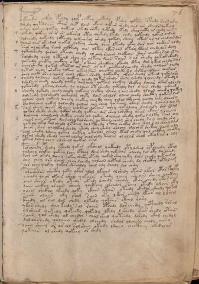

# Voynich Speculative Herbal Ferment Recipe — f76r

IMPORTANT: this is NOT a real or validated translation of the Voynich Manuscript. It is a speculative/procedural model that interprets EVA using a user-defined grammar to generate experimental recipes using safe, known edible substitutes.

This file is generated automatically from IVTFF/EVA transliteration plus a user-defined procedural grammar.



## Page / Folio
- currier: B
- folio: f76r
- page_number: 149
- section: text only

## EVA Text (Transliteration)
```text
potchokor chcfhdy opshdy qolp chcphy chcphdy opshey qofshy opchdy sain as y
dshedy qotddyar cthar chep dain okain qokeor shedy qol ain sheals qokeey
yshey qokeey qokey qokeed okedy shky qotedy otedy shol qoty ol chedy aiiny
s
qokedy qokeey or or or chkorol otey qokedy lkedy chdy qokchdy qokal chdam
solchedy qokeedy qopchedy qokeeo rol shedy qokedy sheey okees al al chedain dar
d
qoaiin ches okeedal qoked qokeey shedy chey lkeedy okey dar aiin chekain oldy
shed al shckhy [r:s] ain chcphedy ain olkeey lkar ain otchy lkain chedy dar daly
q
qotedshedy qorain oteedy chedy ol chdy raiiin chekain dain chckhy sal oty
solshedy qool qctheed shdy qa ol keey dain saiin s ar shedy qokeor okeedy
qokeedy checthy chckhey okal okaiin sheckhey okeedy otey dal y kal chedy sar
s
chorshedy qoked okees al ar aiin ar ain chckheed lchedy shedy qolair chedy
qotes chedy shckhy qokeey okeey kain checkhy qokeedy qotey qotain chekair
chey chckh shey qeeey chol lkain shedy qokeedy okain chedy okeed qokaloro
o
dcheedy qolchey qokeey qokeey chedy qokar shedy shedy lshedy qolchedy otedyl
dshedy qo chedy lchedy qokey qolchey qotain chckhy shckhy lchar okar alchdy
qokch[s:?]dy okeey lchedy qo olain ot shedy qotaly dar sain shedy oleeed
l
sheedy qokedy chedy chedy qokain chckhy olchy l ain shedy olaiin chedy qokey
dalshedy qol sheedy qokaldy chepy dain alolor olain chedy shecthy qokey lor
qoloin chey qokeey lchedy chckhy chey ky chey qolal lklchey lchedy chey llaiir y
shedal shey qokey qolchedy qolain ain chey qokaiin okain cheedy lchey l oly dy
k
soin sheey chear ol aiin chodaiin qokaiin chey qokalchey dal chdy dal ytal
qokar shedy shedy qokar shedy qokain dar shey lshcthy okar okain y laiin y
darchey cheolchey shcthy chedy qo qokey dalaiin sheeky qokain olky sain chy
r
che[o:a] r ain okaiin dain chey dalshedy qokaiin che[o:a]l shy chedy rain chedy shy
qokedy lkey kal shedy qopchey qo l pchedy okchy chckhy shey lol r ol sheey dar
cheor shey qoolkal shedy shedy shey shedy ollchy shlches shcthy sain oly
sain shedy lshey qokal chcthy okeolor cheol otar chedy qol chcthy chckhy
qok[a:o]l shedy sheol cheol alshy chol chdy talor ol alor chol okeor ar o oly
s
oteey lchey chey olsheol qokal chal
polalchdy pshedy opchedy qokas yksheol qokeedy oty lshed chpsheedy ytal
qolchey shckhy qokey lchy opchey dain shdy qokedar olchdy sor oty dy lchedy
sain ar okedy lcheey qokey shckhy otedy qokal shey qoky dain chedy qokchd[y:a]l
dain chey lsh daiin chey lchedy qol[a:o]in qotal shedy dy shecthy otalam
sor shey qokey qokar sheeoldy chol oly chaly lol chdy
poleedaran shckhy qoty ykar alol lkaiin ol shedy otain okar opar kolpy
y shedy qo or okain shey qokaiin okeedy qochy as [o:a]in sheey chckhy
dain shear okedy otedy okedy lchedy chedy okar chedy otarain
dain chckhy [o:a]r aiin sheey qockhey olchdar sheey otedy olain oky
saiin shckhy lkeedy qoky okain ytain oteedy okedor shedy qokal
saiin olaiin oky shol sain oky l kar chedy lkar al loral
[p:f]chedy @174; sal dol shdy olkedy qokaiin otal rory
qkor shedy shey keedy sal raiin opchdy dar chedy qopchedy ro[r:s]ol
olsheed qokedy qokeedy qokedy lkedy lsheedy okar shedy otain
saiin qol shedy ol chedor chal shed qoteedy dshdy okal chedyl
dal or chedy qolaiin okedal olchedy chdol olchedy choly aiin y
sain sheey or ar al solshey okeedy ldaiin checkhey okedalor
qokaiin ol shedy qokeey or shdy
```

## Domain Context (Heuristic; Not a Translation)

This section summarizes recurring **basewords** in this IVTFF domain and shows simple substring evidence that the token markers used by the procedural grammar occur inside frequent words.

Any Italian anagram / English gloss is a best-effort lexicon match, not a decipherment.


### Associated basewords (non-generic; top by frequency in this domain)
- `daiin` (count=40) → Italian anagram `piani`; English: plans (arrangements)
- `qokar` (count=31) → Italian anagram `carco`; English: [n/a]
- `qokaiin` (count=25) → Italian anagram `ciancio`; English: [n/a]
- `qokal` (count=23) → Italian anagram `calco`; English: cast (of sculpture)
- `ykaiin` (count=15) → Italian anagram `acini`; English: [n/a]
- `okaiin` (count=12) → Italian anagram `coniai`; English: [n/a]
- `qokain` (count=10) → Italian anagram `acconi`; English: [n/a]
- `okain` (count=10) → Italian anagram `acino`; English: a berry
- `saiin` (count=10) → Italian anagram `asini`; English: [n/a]
- `kaiin` (count=9) → Italian anagram `acini`; English: [n/a]
- `odaiin` (count=9) → Italian anagram `inopia`; English: poverty
- `qotaiin` (count=8) → Italian anagram `cationi`; English: [n/a]
- `qotar` (count=8) → Italian anagram `corta`; English: [n/a]
- `qotal` (count=8) → Italian anagram `colta`; English: [n/a]
- `otain` (count=7) → Italian anagram `anito`; English: [n/a]

### Marker evidence (substring in frequent basewords)
- `qo`: 52 basewords; examples: `qokar`, `qokaiin`, `qokal`, `qokeey`, `qoky`, `qokey`
- `q`: 53 basewords; examples: `qokar`, `qokaiin`, `qokal`, `qokeey`, `qoky`, `qokey`
- `o`: 206 basewords; examples: `or`, `ol`, `o`, `qokar`, `chol`, `qokaiin`
- `k`: 119 basewords; examples: `qokar`, `qokaiin`, `qokal`, `okal`, `okar`, `qokeey`
- `t`: 81 basewords; examples: `otal`, `otar`, `otaiin`, `otedy`, `ytaiin`, `otam`
- `p`: 13 basewords; examples: `opchey`, `opchedy`, `pchedy`, `qopchedy`, `opchdy`, `qopchy`
- `ch`: 102 basewords; examples: `chedy`, `chey`, `chol`, `chdy`, `chor`, `chckhy`
- `sh`: 44 basewords; examples: `shedy`, `shey`, `sheey`, `shol`, `sheol`, `shckhy`
- `f`: 1 basewords; examples: `f`
- `cth`: 11 basewords; examples: `chcthy`, `shcthy`, `cthy`, `cthar`, `shecthy`, `chocthy`
- `ckh`: 14 basewords; examples: `chckhy`, `shckhy`, `ckhey`, `qockhy`, `chckhdy`, `checkhy`
- `cph`: 2 basewords; examples: `cphy`, `cphol`
- `dy`: 72 basewords; examples: `shedy`, `chedy`, `dy`, `chdy`, `qokedy`, `okedy`
- `iin`: 35 basewords; examples: `aiin`, `daiin`, `qokaiin`, `ykaiin`, `okaiin`, `otaiin`
- `aiin`: 30 basewords; examples: `aiin`, `daiin`, `qokaiin`, `ykaiin`, `okaiin`, `otaiin`

## Recipes Index (This Page)
- [f76r.1,@P0](#f76r-1-f76r-1-p0)
- [f76r.2,+P0](#f76r-2-f76r-2-p0)
- [f76r.3,+P0](#f76r-3-f76r-3-p0)
- [f76r.4,*L0](#f76r-4-f76r-4-l0)
- [f76r.5,=P0](#f76r-5-f76r-5-p0)
- [f76r.6,+P0](#f76r-6-f76r-6-p0)
- [f76r.7,*L0](#f76r-7-f76r-7-l0)
- [f76r.8,=P0](#f76r-8-f76r-8-p0)
- [f76r.9,+P0](#f76r-9-f76r-9-p0)
- [f76r.10,*L0](#f76r-10-f76r-10-l0)
- [f76r.11,=P0](#f76r-11-f76r-11-p0)
- [f76r.12,+P0](#f76r-12-f76r-12-p0)
- [f76r.13,+P0](#f76r-13-f76r-13-p0)
- [f76r.14,*L0](#f76r-14-f76r-14-l0)
- [f76r.15,=P0](#f76r-15-f76r-15-p0)
- [f76r.16,+P0](#f76r-16-f76r-16-p0)
- [f76r.17,+P0](#f76r-17-f76r-17-p0)
- [f76r.18,*L0](#f76r-18-f76r-18-l0)
- [f76r.19,=P0](#f76r-19-f76r-19-p0)
- [f76r.20,+P0](#f76r-20-f76r-20-p0)
- [f76r.21,+P0](#f76r-21-f76r-21-p0)
- [f76r.22,*L0](#f76r-22-f76r-22-l0)
- [f76r.23,=P0](#f76r-23-f76r-23-p0)
- [f76r.24,+P0](#f76r-24-f76r-24-p0)
- [f76r.25,+P0](#f76r-25-f76r-25-p0)
- [f76r.26,+P0](#f76r-26-f76r-26-p0)
- [f76r.27,*L0](#f76r-27-f76r-27-l0)
- [f76r.28,=P0](#f76r-28-f76r-28-p0)
- [f76r.29,+P0](#f76r-29-f76r-29-p0)
- [f76r.30,+P0](#f76r-30-f76r-30-p0)
- [f76r.31,*L0](#f76r-31-f76r-31-l0)
- [f76r.32,=P0](#f76r-32-f76r-32-p0)
- [f76r.33,+P0](#f76r-33-f76r-33-p0)
- [f76r.34,+P0](#f76r-34-f76r-34-p0)
- [f76r.35,+P0](#f76r-35-f76r-35-p0)
- [f76r.36,+P0](#f76r-36-f76r-36-p0)
- [f76r.37,*L0](#f76r-37-f76r-37-l0)
- [f76r.38,=P0](#f76r-38-f76r-38-p0)
- [f76r.39,+P0](#f76r-39-f76r-39-p0)
- [f76r.40,+P0](#f76r-40-f76r-40-p0)
- [f76r.41,+P0](#f76r-41-f76r-41-p0)
- [f76r.42,+P0](#f76r-42-f76r-42-p0)
- [f76r.43,+P0](#f76r-43-f76r-43-p0)
- [f76r.44,+P0](#f76r-44-f76r-44-p0)
- [f76r.45,+P0](#f76r-45-f76r-45-p0)
- [f76r.46,+P0](#f76r-46-f76r-46-p0)
- [f76r.47,+P0](#f76r-47-f76r-47-p0)
- [f76r.48,+P0](#f76r-48-f76r-48-p0)
- [f76r.49,+P0](#f76r-49-f76r-49-p0)
- [f76r.50,+P0](#f76r-50-f76r-50-p0)
- [f76r.51,+P0](#f76r-51-f76r-51-p0)
- [f76r.52,+P0](#f76r-52-f76r-52-p0)
- [f76r.53,+P0](#f76r-53-f76r-53-p0)
- [f76r.54,+P0](#f76r-54-f76r-54-p0)
- [f76r.55,+P0](#f76r-55-f76r-55-p0)
- [f76r.56,+P0](#f76r-56-f76r-56-p0)

## Line Glosses (Procedural Gloss Only; Not a Translation)

<a id="f76r-1-f76r-1-p0"></a>

### f76r.1,@P0

EVA: potchokor chcfhdy opshdy qolp chcphy chcphdy opshey qofshy opchdy sain as y

Direct Gloss (Procedural, Not a Real Translation):
- potchokor: add fermentable sugars → apply heat/cooking → add main plant (safe substitute) → mix / transfer → start fermentation (yeast)
- chcfhdy: add main plant (safe substitute) → start fermentation (yeast) → add complex herbal compound (safe blend)
- opshdy: add secondary herb (safe substitute) → mix / transfer → start fermentation (yeast)
- qolp: prepare liquid base → start fermentation (yeast)
- chcphy: add main plant (safe substitute) → add complex herbal compound (safe blend)
- chcphdy: add main plant (safe substitute) → start fermentation (yeast) → add complex herbal compound (safe blend)
- opshey: add secondary herb (safe substitute) → mix / transfer → start fermentation (yeast) → duration level 1 → state: active extraction
- qofshy: prepare liquid base → add secondary herb (safe substitute) → add aroma modifier
- opchdy: add main plant (safe substitute) → mix / transfer → start fermentation (yeast)
- sain: duration level 1 → state: fermentation start
- as: duration level 1 → state: fermentation start
- y: [unparsed]

<a id="f76r-2-f76r-2-p0"></a>

### f76r.2,+P0

EVA: dshedy qotddyar cthar chep dain okain qokeor shedy qol ain sheals qokeey

Direct Gloss (Procedural, Not a Real Translation):
- dshedy: add secondary herb (safe substitute) → start fermentation (yeast) → duration level 1 → state: active extraction
- qotddyar: prepare liquid base → apply heat/cooking → start fermentation (yeast) → duration level 1 → state: fermentation start
- cthar: add complex herbal compound (safe blend) → duration level 1 → state: fermentation start
- chep: add main plant (safe substitute) → start fermentation (yeast) → duration level 1 → state: active extraction
- dain: start fermentation (yeast) → duration level 1 → state: fermentation start
- okain: add fermentable sugars → mix / transfer → duration level 1 → state: fermentation start
- qokeor: prepare liquid base → add fermentable sugars → mix / transfer → duration level 1 → state: active extraction
- shedy: add secondary herb (safe substitute) → start fermentation (yeast) → duration level 1 → state: active extraction
- qol: prepare liquid base
- ain: duration level 1 → state: fermentation start
- sheals: add secondary herb (safe substitute) → duration level 1 → state: active extraction
- qokeey: prepare liquid base → add fermentable sugars → duration level 2 → state: active extraction

<a id="f76r-3-f76r-3-p0"></a>

### f76r.3,+P0

EVA: yshey qokeey qokey qokeed okedy shky qotedy otedy shol qoty ol chedy aiiny

Direct Gloss (Procedural, Not a Real Translation):
- yshey: add secondary herb (safe substitute) → duration level 1 → state: active extraction
- qokeey: prepare liquid base → add fermentable sugars → duration level 2 → state: active extraction
- qokey: prepare liquid base → add fermentable sugars → duration level 1 → state: active extraction
- qokeed: prepare liquid base → add fermentable sugars → start fermentation (yeast) → duration level 2 → state: active extraction
- okedy: add fermentable sugars → mix / transfer → start fermentation (yeast) → duration level 1 → state: active extraction
- shky: add fermentable sugars → add secondary herb (safe substitute)
- qotedy: prepare liquid base → apply heat/cooking → start fermentation (yeast) → duration level 1 → state: active extraction
- otedy: apply heat/cooking → mix / transfer → start fermentation (yeast) → duration level 1 → state: active extraction
- shol: add secondary herb (safe substitute) → mix / transfer
- qoty: prepare liquid base → apply heat/cooking
- ol: mix / transfer
- chedy: add main plant (safe substitute) → start fermentation (yeast) → duration level 1 → state: active extraction
- aiiny: duration level 1 → state: fermentation start → long fermentation / aging phase

<a id="f76r-4-f76r-4-l0"></a>

### f76r.4,*L0

EVA: s

Direct Gloss (Procedural, Not a Real Translation):
- s: [unparsed]

<a id="f76r-5-f76r-5-p0"></a>

### f76r.5,=P0

EVA: qokedy qokeey or or or chkorol otey qokedy lkedy chdy qokchdy qokal chdam

Direct Gloss (Procedural, Not a Real Translation):
- qokedy: prepare liquid base → add fermentable sugars → start fermentation (yeast) → duration level 1 → state: active extraction
- qokeey: prepare liquid base → add fermentable sugars → duration level 2 → state: active extraction
- or: mix / transfer
- or: mix / transfer
- or: mix / transfer
- chkorol: add fermentable sugars → add main plant (safe substitute) → mix / transfer
- otey: apply heat/cooking → mix / transfer → duration level 1 → state: active extraction
- qokedy: prepare liquid base → add fermentable sugars → start fermentation (yeast) → duration level 1 → state: active extraction
- lkedy: add fermentable sugars → start fermentation (yeast) → duration level 1 → state: active extraction
- chdy: add main plant (safe substitute) → start fermentation (yeast)
- qokchdy: prepare liquid base → add fermentable sugars → add main plant (safe substitute) → start fermentation (yeast)
- qokal: prepare liquid base → add fermentable sugars → duration level 1 → state: fermentation start
- chdam: add main plant (safe substitute) → start fermentation (yeast) → duration level 1 → state: fermentation start

<a id="f76r-6-f76r-6-p0"></a>

### f76r.6,+P0

EVA: solchedy qokeedy qopchedy qokeeo rol shedy qokedy sheey okees al al chedain dar

Direct Gloss (Procedural, Not a Real Translation):
- solchedy: add main plant (safe substitute) → mix / transfer → start fermentation (yeast) → duration level 1 → state: active extraction
- qokeedy: prepare liquid base → add fermentable sugars → start fermentation (yeast) → duration level 2 → state: active extraction
- qopchedy: prepare liquid base → add main plant (safe substitute) → start fermentation (yeast) → duration level 1 → state: active extraction
- qokeeo: prepare liquid base → add fermentable sugars → mix / transfer → duration level 2 → state: active extraction
- rol: mix / transfer
- shedy: add secondary herb (safe substitute) → start fermentation (yeast) → duration level 1 → state: active extraction
- qokedy: prepare liquid base → add fermentable sugars → start fermentation (yeast) → duration level 1 → state: active extraction
- sheey: add secondary herb (safe substitute) → duration level 2 → state: active extraction
- okees: add fermentable sugars → mix / transfer → duration level 2 → state: active extraction
- al: duration level 1 → state: fermentation start
- al: duration level 1 → state: fermentation start
- chedain: add main plant (safe substitute) → start fermentation (yeast) → duration level 1 → state: active extraction
- dar: start fermentation (yeast) → duration level 1 → state: fermentation start

<a id="f76r-7-f76r-7-l0"></a>

### f76r.7,*L0

EVA: d

Direct Gloss (Procedural, Not a Real Translation):
- d: start fermentation (yeast)

<a id="f76r-8-f76r-8-p0"></a>

### f76r.8,=P0

EVA: qoaiin ches okeedal qoked qokeey shedy chey lkeedy okey dar aiin chekain oldy

Direct Gloss (Procedural, Not a Real Translation):
- qoaiin: prepare liquid base → duration level 1 → state: fermentation start → long fermentation / aging phase
- ches: add main plant (safe substitute) → duration level 1 → state: active extraction
- okeedal: add fermentable sugars → mix / transfer → start fermentation (yeast) → duration level 2 → state: active extraction
- qoked: prepare liquid base → add fermentable sugars → start fermentation (yeast) → duration level 1 → state: active extraction
- qokeey: prepare liquid base → add fermentable sugars → duration level 2 → state: active extraction
- shedy: add secondary herb (safe substitute) → start fermentation (yeast) → duration level 1 → state: active extraction
- chey: add main plant (safe substitute) → duration level 1 → state: active extraction
- lkeedy: add fermentable sugars → start fermentation (yeast) → duration level 2 → state: active extraction
- okey: add fermentable sugars → mix / transfer → duration level 1 → state: active extraction
- dar: start fermentation (yeast) → duration level 1 → state: fermentation start
- aiin: duration level 1 → state: fermentation start → long fermentation / aging phase
- chekain: add fermentable sugars → add main plant (safe substitute) → duration level 1 → state: active extraction
- oldy: mix / transfer → start fermentation (yeast)

<a id="f76r-9-f76r-9-p0"></a>

### f76r.9,+P0

EVA: shed al shckhy [r:s] ain chcphedy ain olkeey lkar ain otchy lkain chedy dar daly

Direct Gloss (Procedural, Not a Real Translation):
- shed: add secondary herb (safe substitute) → start fermentation (yeast) → duration level 1 → state: active extraction
- al: duration level 1 → state: fermentation start
- shckhy: add secondary herb (safe substitute) → add complex herbal compound (safe blend)
- r: [unparsed]
- s: [unparsed]
- ain: duration level 1 → state: fermentation start
- chcphedy: add main plant (safe substitute) → start fermentation (yeast) → add complex herbal compound (safe blend) → duration level 1 → state: active extraction
- ain: duration level 1 → state: fermentation start
- olkeey: add fermentable sugars → mix / transfer → duration level 2 → state: active extraction
- lkar: add fermentable sugars → duration level 1 → state: fermentation start
- ain: duration level 1 → state: fermentation start
- otchy: apply heat/cooking → add main plant (safe substitute) → mix / transfer
- lkain: add fermentable sugars → duration level 1 → state: fermentation start
- chedy: add main plant (safe substitute) → start fermentation (yeast) → duration level 1 → state: active extraction
- dar: start fermentation (yeast) → duration level 1 → state: fermentation start
- daly: start fermentation (yeast) → duration level 1 → state: fermentation start

<a id="f76r-10-f76r-10-l0"></a>

### f76r.10,*L0

EVA: q

Direct Gloss (Procedural, Not a Real Translation):
- q: prepare base (generic)

<a id="f76r-11-f76r-11-p0"></a>

### f76r.11,=P0

EVA: qotedshedy qorain oteedy chedy ol chdy raiiin chekain dain chckhy sal oty

Direct Gloss (Procedural, Not a Real Translation):
- qotedshedy: prepare liquid base → apply heat/cooking → add secondary herb (safe substitute) → start fermentation (yeast) → duration level 1 → state: active extraction
- qorain: prepare liquid base → duration level 1 → state: fermentation start
- oteedy: apply heat/cooking → mix / transfer → start fermentation (yeast) → duration level 2 → state: active extraction
- chedy: add main plant (safe substitute) → start fermentation (yeast) → duration level 1 → state: active extraction
- ol: mix / transfer
- chdy: add main plant (safe substitute) → start fermentation (yeast)
- raiiin: duration level 1 → state: fermentation start → medium fermentation phase
- chekain: add fermentable sugars → add main plant (safe substitute) → duration level 1 → state: active extraction
- dain: start fermentation (yeast) → duration level 1 → state: fermentation start
- chckhy: add main plant (safe substitute) → add complex herbal compound (safe blend)
- sal: duration level 1 → state: fermentation start
- oty: apply heat/cooking → mix / transfer

<a id="f76r-12-f76r-12-p0"></a>

### f76r.12,+P0

EVA: solshedy qool qctheed shdy qa ol keey dain saiin s ar shedy qokeor okeedy

Direct Gloss (Procedural, Not a Real Translation):
- solshedy: add secondary herb (safe substitute) → mix / transfer → start fermentation (yeast) → duration level 1 → state: active extraction
- qool: prepare liquid base → mix / transfer
- qctheed: prepare base (generic) → start fermentation (yeast) → add complex herbal compound (safe blend) → duration level 2 → state: active extraction
- shdy: add secondary herb (safe substitute) → start fermentation (yeast)
- qa: prepare base (generic) → duration level 1 → state: fermentation start
- ol: mix / transfer
- keey: add fermentable sugars → duration level 2 → state: active extraction
- dain: start fermentation (yeast) → duration level 1 → state: fermentation start
- saiin: duration level 1 → state: fermentation start → long fermentation / aging phase
- s: [unparsed]
- ar: duration level 1 → state: fermentation start
- shedy: add secondary herb (safe substitute) → start fermentation (yeast) → duration level 1 → state: active extraction
- qokeor: prepare liquid base → add fermentable sugars → mix / transfer → duration level 1 → state: active extraction
- okeedy: add fermentable sugars → mix / transfer → start fermentation (yeast) → duration level 2 → state: active extraction

<a id="f76r-13-f76r-13-p0"></a>

### f76r.13,+P0

EVA: qokeedy checthy chckhey okal okaiin sheckhey okeedy otey dal y kal chedy sar

Direct Gloss (Procedural, Not a Real Translation):
- qokeedy: prepare liquid base → add fermentable sugars → start fermentation (yeast) → duration level 2 → state: active extraction
- checthy: add main plant (safe substitute) → add complex herbal compound (safe blend) → duration level 1 → state: active extraction
- chckhey: add main plant (safe substitute) → add complex herbal compound (safe blend) → duration level 1 → state: active extraction
- okal: add fermentable sugars → mix / transfer → duration level 1 → state: fermentation start
- okaiin: add fermentable sugars → mix / transfer → duration level 1 → state: fermentation start → long fermentation / aging phase
- sheckhey: add secondary herb (safe substitute) → add complex herbal compound (safe blend) → duration level 1 → state: active extraction
- okeedy: add fermentable sugars → mix / transfer → start fermentation (yeast) → duration level 2 → state: active extraction
- otey: apply heat/cooking → mix / transfer → duration level 1 → state: active extraction
- dal: start fermentation (yeast) → duration level 1 → state: fermentation start
- y: [unparsed]
- kal: add fermentable sugars → duration level 1 → state: fermentation start
- chedy: add main plant (safe substitute) → start fermentation (yeast) → duration level 1 → state: active extraction
- sar: duration level 1 → state: fermentation start

<a id="f76r-14-f76r-14-l0"></a>

### f76r.14,*L0

EVA: s

Direct Gloss (Procedural, Not a Real Translation):
- s: [unparsed]

<a id="f76r-15-f76r-15-p0"></a>

### f76r.15,=P0

EVA: chorshedy qoked okees al ar aiin ar ain chckheed lchedy shedy qolair chedy

Direct Gloss (Procedural, Not a Real Translation):
- chorshedy: add main plant (safe substitute) → add secondary herb (safe substitute) → mix / transfer → start fermentation (yeast) → duration level 1 → state: active extraction
- qoked: prepare liquid base → add fermentable sugars → start fermentation (yeast) → duration level 1 → state: active extraction
- okees: add fermentable sugars → mix / transfer → duration level 2 → state: active extraction
- al: duration level 1 → state: fermentation start
- ar: duration level 1 → state: fermentation start
- aiin: duration level 1 → state: fermentation start → long fermentation / aging phase
- ar: duration level 1 → state: fermentation start
- ain: duration level 1 → state: fermentation start
- chckheed: add main plant (safe substitute) → start fermentation (yeast) → add complex herbal compound (safe blend) → duration level 2 → state: active extraction
- lchedy: add main plant (safe substitute) → start fermentation (yeast) → duration level 1 → state: active extraction
- shedy: add secondary herb (safe substitute) → start fermentation (yeast) → duration level 1 → state: active extraction
- qolair: prepare liquid base → duration level 1 → state: fermentation start
- chedy: add main plant (safe substitute) → start fermentation (yeast) → duration level 1 → state: active extraction

<a id="f76r-16-f76r-16-p0"></a>

### f76r.16,+P0

EVA: qotes chedy shckhy qokeey okeey kain checkhy qokeedy qotey qotain chekair

Direct Gloss (Procedural, Not a Real Translation):
- qotes: prepare liquid base → apply heat/cooking → duration level 1 → state: active extraction
- chedy: add main plant (safe substitute) → start fermentation (yeast) → duration level 1 → state: active extraction
- shckhy: add secondary herb (safe substitute) → add complex herbal compound (safe blend)
- qokeey: prepare liquid base → add fermentable sugars → duration level 2 → state: active extraction
- okeey: add fermentable sugars → mix / transfer → duration level 2 → state: active extraction
- kain: add fermentable sugars → duration level 1 → state: fermentation start
- checkhy: add main plant (safe substitute) → add complex herbal compound (safe blend) → duration level 1 → state: active extraction
- qokeedy: prepare liquid base → add fermentable sugars → start fermentation (yeast) → duration level 2 → state: active extraction
- qotey: prepare liquid base → apply heat/cooking → duration level 1 → state: active extraction
- qotain: prepare liquid base → apply heat/cooking → duration level 1 → state: fermentation start
- chekair: add fermentable sugars → add main plant (safe substitute) → duration level 1 → state: active extraction

<a id="f76r-17-f76r-17-p0"></a>

### f76r.17,+P0

EVA: chey chckh shey qeeey chol lkain shedy qokeedy okain chedy okeed qokaloro

Direct Gloss (Procedural, Not a Real Translation):
- chey: add main plant (safe substitute) → duration level 1 → state: active extraction
- chckh: add main plant (safe substitute) → add complex herbal compound (safe blend)
- shey: add secondary herb (safe substitute) → duration level 1 → state: active extraction
- qeeey: prepare base (generic) → duration level 3 → state: active extraction
- chol: add main plant (safe substitute) → mix / transfer
- lkain: add fermentable sugars → duration level 1 → state: fermentation start
- shedy: add secondary herb (safe substitute) → start fermentation (yeast) → duration level 1 → state: active extraction
- qokeedy: prepare liquid base → add fermentable sugars → start fermentation (yeast) → duration level 2 → state: active extraction
- okain: add fermentable sugars → mix / transfer → duration level 1 → state: fermentation start
- chedy: add main plant (safe substitute) → start fermentation (yeast) → duration level 1 → state: active extraction
- okeed: add fermentable sugars → mix / transfer → start fermentation (yeast) → duration level 2 → state: active extraction
- qokaloro: prepare liquid base → add fermentable sugars → mix / transfer → duration level 1 → state: fermentation start

<a id="f76r-18-f76r-18-l0"></a>

### f76r.18,*L0

EVA: o

Direct Gloss (Procedural, Not a Real Translation):
- o: mix / transfer

<a id="f76r-19-f76r-19-p0"></a>

### f76r.19,=P0

EVA: dcheedy qolchey qokeey qokeey chedy qokar shedy shedy lshedy qolchedy otedyl

Direct Gloss (Procedural, Not a Real Translation):
- dcheedy: add main plant (safe substitute) → start fermentation (yeast) → duration level 2 → state: active extraction
- qolchey: prepare liquid base → add main plant (safe substitute) → duration level 1 → state: active extraction
- qokeey: prepare liquid base → add fermentable sugars → duration level 2 → state: active extraction
- qokeey: prepare liquid base → add fermentable sugars → duration level 2 → state: active extraction
- chedy: add main plant (safe substitute) → start fermentation (yeast) → duration level 1 → state: active extraction
- qokar: prepare liquid base → add fermentable sugars → duration level 1 → state: fermentation start
- shedy: add secondary herb (safe substitute) → start fermentation (yeast) → duration level 1 → state: active extraction
- shedy: add secondary herb (safe substitute) → start fermentation (yeast) → duration level 1 → state: active extraction
- lshedy: add secondary herb (safe substitute) → start fermentation (yeast) → duration level 1 → state: active extraction
- qolchedy: prepare liquid base → add main plant (safe substitute) → start fermentation (yeast) → duration level 1 → state: active extraction
- otedyl: apply heat/cooking → mix / transfer → start fermentation (yeast) → duration level 1 → state: active extraction

<a id="f76r-20-f76r-20-p0"></a>

### f76r.20,+P0

EVA: dshedy qo chedy lchedy qokey qolchey qotain chckhy shckhy lchar okar alchdy

Direct Gloss (Procedural, Not a Real Translation):
- dshedy: add secondary herb (safe substitute) → start fermentation (yeast) → duration level 1 → state: active extraction
- qo: prepare liquid base
- chedy: add main plant (safe substitute) → start fermentation (yeast) → duration level 1 → state: active extraction
- lchedy: add main plant (safe substitute) → start fermentation (yeast) → duration level 1 → state: active extraction
- qokey: prepare liquid base → add fermentable sugars → duration level 1 → state: active extraction
- qolchey: prepare liquid base → add main plant (safe substitute) → duration level 1 → state: active extraction
- qotain: prepare liquid base → apply heat/cooking → duration level 1 → state: fermentation start
- chckhy: add main plant (safe substitute) → add complex herbal compound (safe blend)
- shckhy: add secondary herb (safe substitute) → add complex herbal compound (safe blend)
- lchar: add main plant (safe substitute) → duration level 1 → state: fermentation start
- okar: add fermentable sugars → mix / transfer → duration level 1 → state: fermentation start
- alchdy: add main plant (safe substitute) → start fermentation (yeast) → duration level 1 → state: fermentation start

<a id="f76r-21-f76r-21-p0"></a>

### f76r.21,+P0

EVA: qokch[s:?]dy okeey lchedy qo olain ot shedy qotaly dar sain shedy oleeed

Direct Gloss (Procedural, Not a Real Translation):
- qokch: prepare liquid base → add fermentable sugars → add main plant (safe substitute)
- s: [unparsed]
- dy: start fermentation (yeast)
- okeey: add fermentable sugars → mix / transfer → duration level 2 → state: active extraction
- lchedy: add main plant (safe substitute) → start fermentation (yeast) → duration level 1 → state: active extraction
- qo: prepare liquid base
- olain: mix / transfer → duration level 1 → state: fermentation start
- ot: apply heat/cooking → mix / transfer
- shedy: add secondary herb (safe substitute) → start fermentation (yeast) → duration level 1 → state: active extraction
- qotaly: prepare liquid base → apply heat/cooking → duration level 1 → state: fermentation start
- dar: start fermentation (yeast) → duration level 1 → state: fermentation start
- sain: duration level 1 → state: fermentation start
- shedy: add secondary herb (safe substitute) → start fermentation (yeast) → duration level 1 → state: active extraction
- oleeed: mix / transfer → start fermentation (yeast) → duration level 3 → state: active extraction

<a id="f76r-22-f76r-22-l0"></a>

### f76r.22,*L0

EVA: l

Direct Gloss (Procedural, Not a Real Translation):
- l: [unparsed]

<a id="f76r-23-f76r-23-p0"></a>

### f76r.23,=P0

EVA: sheedy qokedy chedy chedy qokain chckhy olchy l ain shedy olaiin chedy qokey

Direct Gloss (Procedural, Not a Real Translation):
- sheedy: add secondary herb (safe substitute) → start fermentation (yeast) → duration level 2 → state: active extraction
- qokedy: prepare liquid base → add fermentable sugars → start fermentation (yeast) → duration level 1 → state: active extraction
- chedy: add main plant (safe substitute) → start fermentation (yeast) → duration level 1 → state: active extraction
- chedy: add main plant (safe substitute) → start fermentation (yeast) → duration level 1 → state: active extraction
- qokain: prepare liquid base → add fermentable sugars → duration level 1 → state: fermentation start
- chckhy: add main plant (safe substitute) → add complex herbal compound (safe blend)
- olchy: add main plant (safe substitute) → mix / transfer
- l: [unparsed]
- ain: duration level 1 → state: fermentation start
- shedy: add secondary herb (safe substitute) → start fermentation (yeast) → duration level 1 → state: active extraction
- olaiin: mix / transfer → duration level 1 → state: fermentation start → long fermentation / aging phase
- chedy: add main plant (safe substitute) → start fermentation (yeast) → duration level 1 → state: active extraction
- qokey: prepare liquid base → add fermentable sugars → duration level 1 → state: active extraction

<a id="f76r-24-f76r-24-p0"></a>

### f76r.24,+P0

EVA: dalshedy qol sheedy qokaldy chepy dain alolor olain chedy shecthy qokey lor

Direct Gloss (Procedural, Not a Real Translation):
- dalshedy: add secondary herb (safe substitute) → start fermentation (yeast) → duration level 1 → state: fermentation start
- qol: prepare liquid base
- sheedy: add secondary herb (safe substitute) → start fermentation (yeast) → duration level 2 → state: active extraction
- qokaldy: prepare liquid base → add fermentable sugars → start fermentation (yeast) → duration level 1 → state: fermentation start
- chepy: add main plant (safe substitute) → start fermentation (yeast) → duration level 1 → state: active extraction
- dain: start fermentation (yeast) → duration level 1 → state: fermentation start
- alolor: mix / transfer → duration level 1 → state: fermentation start
- olain: mix / transfer → duration level 1 → state: fermentation start
- chedy: add main plant (safe substitute) → start fermentation (yeast) → duration level 1 → state: active extraction
- shecthy: add secondary herb (safe substitute) → add complex herbal compound (safe blend) → duration level 1 → state: active extraction
- qokey: prepare liquid base → add fermentable sugars → duration level 1 → state: active extraction
- lor: mix / transfer

<a id="f76r-25-f76r-25-p0"></a>

### f76r.25,+P0

EVA: qoloin chey qokeey lchedy chckhy chey ky chey qolal lklchey lchedy chey llaiir y

Direct Gloss (Procedural, Not a Real Translation):
- qoloin: prepare liquid base → mix / transfer → duration level 1 → state: cooling/rest
- chey: add main plant (safe substitute) → duration level 1 → state: active extraction
- qokeey: prepare liquid base → add fermentable sugars → duration level 2 → state: active extraction
- lchedy: add main plant (safe substitute) → start fermentation (yeast) → duration level 1 → state: active extraction
- chckhy: add main plant (safe substitute) → add complex herbal compound (safe blend)
- chey: add main plant (safe substitute) → duration level 1 → state: active extraction
- ky: add fermentable sugars
- chey: add main plant (safe substitute) → duration level 1 → state: active extraction
- qolal: prepare liquid base → duration level 1 → state: fermentation start
- lklchey: add fermentable sugars → add main plant (safe substitute) → duration level 1 → state: active extraction
- lchedy: add main plant (safe substitute) → start fermentation (yeast) → duration level 1 → state: active extraction
- chey: add main plant (safe substitute) → duration level 1 → state: active extraction
- llaiir: duration level 1 → state: fermentation start
- y: [unparsed]

<a id="f76r-26-f76r-26-p0"></a>

### f76r.26,+P0

EVA: shedal shey qokey qolchedy qolain ain chey qokaiin okain cheedy lchey l oly dy

Direct Gloss (Procedural, Not a Real Translation):
- shedal: add secondary herb (safe substitute) → start fermentation (yeast) → duration level 1 → state: active extraction
- shey: add secondary herb (safe substitute) → duration level 1 → state: active extraction
- qokey: prepare liquid base → add fermentable sugars → duration level 1 → state: active extraction
- qolchedy: prepare liquid base → add main plant (safe substitute) → start fermentation (yeast) → duration level 1 → state: active extraction
- qolain: prepare liquid base → duration level 1 → state: fermentation start
- ain: duration level 1 → state: fermentation start
- chey: add main plant (safe substitute) → duration level 1 → state: active extraction
- qokaiin: prepare liquid base → add fermentable sugars → duration level 1 → state: fermentation start → long fermentation / aging phase
- okain: add fermentable sugars → mix / transfer → duration level 1 → state: fermentation start
- cheedy: add main plant (safe substitute) → start fermentation (yeast) → duration level 2 → state: active extraction
- lchey: add main plant (safe substitute) → duration level 1 → state: active extraction
- l: [unparsed]
- oly: mix / transfer
- dy: start fermentation (yeast)

<a id="f76r-27-f76r-27-l0"></a>

### f76r.27,*L0

EVA: k

Direct Gloss (Procedural, Not a Real Translation):
- k: add fermentable sugars

<a id="f76r-28-f76r-28-p0"></a>

### f76r.28,=P0

EVA: soin sheey chear ol aiin chodaiin qokaiin chey qokalchey dal chdy dal ytal

Direct Gloss (Procedural, Not a Real Translation):
- soin: mix / transfer → duration level 1 → state: cooling/rest
- sheey: add secondary herb (safe substitute) → duration level 2 → state: active extraction
- chear: add main plant (safe substitute) → duration level 1 → state: active extraction
- ol: mix / transfer
- aiin: duration level 1 → state: fermentation start → long fermentation / aging phase
- chodaiin: add main plant (safe substitute) → mix / transfer → start fermentation (yeast) → duration level 1 → state: fermentation start → long fermentation / aging phase
- qokaiin: prepare liquid base → add fermentable sugars → duration level 1 → state: fermentation start → long fermentation / aging phase
- chey: add main plant (safe substitute) → duration level 1 → state: active extraction
- qokalchey: prepare liquid base → add fermentable sugars → add main plant (safe substitute) → duration level 1 → state: fermentation start
- dal: start fermentation (yeast) → duration level 1 → state: fermentation start
- chdy: add main plant (safe substitute) → start fermentation (yeast)
- dal: start fermentation (yeast) → duration level 1 → state: fermentation start
- ytal: apply heat/cooking → duration level 1 → state: fermentation start

<a id="f76r-29-f76r-29-p0"></a>

### f76r.29,+P0

EVA: qokar shedy shedy qokar shedy qokain dar shey lshcthy okar okain y laiin y

Direct Gloss (Procedural, Not a Real Translation):
- qokar: prepare liquid base → add fermentable sugars → duration level 1 → state: fermentation start
- shedy: add secondary herb (safe substitute) → start fermentation (yeast) → duration level 1 → state: active extraction
- shedy: add secondary herb (safe substitute) → start fermentation (yeast) → duration level 1 → state: active extraction
- qokar: prepare liquid base → add fermentable sugars → duration level 1 → state: fermentation start
- shedy: add secondary herb (safe substitute) → start fermentation (yeast) → duration level 1 → state: active extraction
- qokain: prepare liquid base → add fermentable sugars → duration level 1 → state: fermentation start
- dar: start fermentation (yeast) → duration level 1 → state: fermentation start
- shey: add secondary herb (safe substitute) → duration level 1 → state: active extraction
- lshcthy: add secondary herb (safe substitute) → add complex herbal compound (safe blend)
- okar: add fermentable sugars → mix / transfer → duration level 1 → state: fermentation start
- okain: add fermentable sugars → mix / transfer → duration level 1 → state: fermentation start
- y: [unparsed]
- laiin: duration level 1 → state: fermentation start → long fermentation / aging phase
- y: [unparsed]

<a id="f76r-30-f76r-30-p0"></a>

### f76r.30,+P0

EVA: darchey cheolchey shcthy chedy qo qokey dalaiin sheeky qokain olky sain chy

Direct Gloss (Procedural, Not a Real Translation):
- darchey: add main plant (safe substitute) → start fermentation (yeast) → duration level 1 → state: fermentation start
- cheolchey: add main plant (safe substitute) → mix / transfer → duration level 1 → state: active extraction
- shcthy: add secondary herb (safe substitute) → add complex herbal compound (safe blend)
- chedy: add main plant (safe substitute) → start fermentation (yeast) → duration level 1 → state: active extraction
- qo: prepare liquid base
- qokey: prepare liquid base → add fermentable sugars → duration level 1 → state: active extraction
- dalaiin: start fermentation (yeast) → duration level 1 → state: fermentation start → long fermentation / aging phase
- sheeky: add fermentable sugars → add secondary herb (safe substitute) → duration level 2 → state: active extraction
- qokain: prepare liquid base → add fermentable sugars → duration level 1 → state: fermentation start
- olky: add fermentable sugars → mix / transfer
- sain: duration level 1 → state: fermentation start
- chy: add main plant (safe substitute)

<a id="f76r-31-f76r-31-l0"></a>

### f76r.31,*L0

EVA: r

Direct Gloss (Procedural, Not a Real Translation):
- r: [unparsed]

<a id="f76r-32-f76r-32-p0"></a>

### f76r.32,=P0

EVA: che[o:a] r ain okaiin dain chey dalshedy qokaiin che[o:a]l shy chedy rain chedy shy

Direct Gloss (Procedural, Not a Real Translation):
- che: add main plant (safe substitute) → duration level 1 → state: active extraction
- o: mix / transfer
- a: duration level 1 → state: fermentation start
- r: [unparsed]
- ain: duration level 1 → state: fermentation start
- okaiin: add fermentable sugars → mix / transfer → duration level 1 → state: fermentation start → long fermentation / aging phase
- dain: start fermentation (yeast) → duration level 1 → state: fermentation start
- chey: add main plant (safe substitute) → duration level 1 → state: active extraction
- dalshedy: add secondary herb (safe substitute) → start fermentation (yeast) → duration level 1 → state: fermentation start
- qokaiin: prepare liquid base → add fermentable sugars → duration level 1 → state: fermentation start → long fermentation / aging phase
- che: add main plant (safe substitute) → duration level 1 → state: active extraction
- o: mix / transfer
- a: duration level 1 → state: fermentation start
- l: [unparsed]
- shy: add secondary herb (safe substitute)
- chedy: add main plant (safe substitute) → start fermentation (yeast) → duration level 1 → state: active extraction
- rain: duration level 1 → state: fermentation start
- chedy: add main plant (safe substitute) → start fermentation (yeast) → duration level 1 → state: active extraction
- shy: add secondary herb (safe substitute)

<a id="f76r-33-f76r-33-p0"></a>

### f76r.33,+P0

EVA: qokedy lkey kal shedy qopchey qo l pchedy okchy chckhy shey lol r ol sheey dar

Direct Gloss (Procedural, Not a Real Translation):
- qokedy: prepare liquid base → add fermentable sugars → start fermentation (yeast) → duration level 1 → state: active extraction
- lkey: add fermentable sugars → duration level 1 → state: active extraction
- kal: add fermentable sugars → duration level 1 → state: fermentation start
- shedy: add secondary herb (safe substitute) → start fermentation (yeast) → duration level 1 → state: active extraction
- qopchey: prepare liquid base → add main plant (safe substitute) → start fermentation (yeast) → duration level 1 → state: active extraction
- qo: prepare liquid base
- l: [unparsed]
- pchedy: add main plant (safe substitute) → start fermentation (yeast) → duration level 1 → state: active extraction
- okchy: add fermentable sugars → add main plant (safe substitute) → mix / transfer
- chckhy: add main plant (safe substitute) → add complex herbal compound (safe blend)
- shey: add secondary herb (safe substitute) → duration level 1 → state: active extraction
- lol: mix / transfer
- r: [unparsed]
- ol: mix / transfer
- sheey: add secondary herb (safe substitute) → duration level 2 → state: active extraction
- dar: start fermentation (yeast) → duration level 1 → state: fermentation start

<a id="f76r-34-f76r-34-p0"></a>

### f76r.34,+P0

EVA: cheor shey qoolkal shedy shedy shey shedy ollchy shlches shcthy sain oly

Direct Gloss (Procedural, Not a Real Translation):
- cheor: add main plant (safe substitute) → mix / transfer → duration level 1 → state: active extraction
- shey: add secondary herb (safe substitute) → duration level 1 → state: active extraction
- qoolkal: prepare liquid base → add fermentable sugars → mix / transfer → duration level 1 → state: fermentation start
- shedy: add secondary herb (safe substitute) → start fermentation (yeast) → duration level 1 → state: active extraction
- shedy: add secondary herb (safe substitute) → start fermentation (yeast) → duration level 1 → state: active extraction
- shey: add secondary herb (safe substitute) → duration level 1 → state: active extraction
- shedy: add secondary herb (safe substitute) → start fermentation (yeast) → duration level 1 → state: active extraction
- ollchy: add main plant (safe substitute) → mix / transfer
- shlches: add main plant (safe substitute) → add secondary herb (safe substitute) → duration level 1 → state: active extraction
- shcthy: add secondary herb (safe substitute) → add complex herbal compound (safe blend)
- sain: duration level 1 → state: fermentation start
- oly: mix / transfer

<a id="f76r-35-f76r-35-p0"></a>

### f76r.35,+P0

EVA: sain shedy lshey qokal chcthy okeolor cheol otar chedy qol chcthy chckhy

Direct Gloss (Procedural, Not a Real Translation):
- sain: duration level 1 → state: fermentation start
- shedy: add secondary herb (safe substitute) → start fermentation (yeast) → duration level 1 → state: active extraction
- lshey: add secondary herb (safe substitute) → duration level 1 → state: active extraction
- qokal: prepare liquid base → add fermentable sugars → duration level 1 → state: fermentation start
- chcthy: add main plant (safe substitute) → add complex herbal compound (safe blend)
- okeolor: add fermentable sugars → mix / transfer → duration level 1 → state: active extraction
- cheol: add main plant (safe substitute) → mix / transfer → duration level 1 → state: active extraction
- otar: apply heat/cooking → mix / transfer → duration level 1 → state: fermentation start
- chedy: add main plant (safe substitute) → start fermentation (yeast) → duration level 1 → state: active extraction
- qol: prepare liquid base
- chcthy: add main plant (safe substitute) → add complex herbal compound (safe blend)
- chckhy: add main plant (safe substitute) → add complex herbal compound (safe blend)

<a id="f76r-36-f76r-36-p0"></a>

### f76r.36,+P0

EVA: qok[a:o]l shedy sheol cheol alshy chol chdy talor ol alor chol okeor ar o oly

Direct Gloss (Procedural, Not a Real Translation):
- qok: prepare liquid base → add fermentable sugars
- a: duration level 1 → state: fermentation start
- o: mix / transfer
- l: [unparsed]
- shedy: add secondary herb (safe substitute) → start fermentation (yeast) → duration level 1 → state: active extraction
- sheol: add secondary herb (safe substitute) → mix / transfer → duration level 1 → state: active extraction
- cheol: add main plant (safe substitute) → mix / transfer → duration level 1 → state: active extraction
- alshy: add secondary herb (safe substitute) → duration level 1 → state: fermentation start
- chol: add main plant (safe substitute) → mix / transfer
- chdy: add main plant (safe substitute) → start fermentation (yeast)
- talor: apply heat/cooking → mix / transfer → duration level 1 → state: fermentation start
- ol: mix / transfer
- alor: mix / transfer → duration level 1 → state: fermentation start
- chol: add main plant (safe substitute) → mix / transfer
- okeor: add fermentable sugars → mix / transfer → duration level 1 → state: active extraction
- ar: duration level 1 → state: fermentation start
- o: mix / transfer
- oly: mix / transfer

<a id="f76r-37-f76r-37-l0"></a>

### f76r.37,*L0

EVA: s

Direct Gloss (Procedural, Not a Real Translation):
- s: [unparsed]

<a id="f76r-38-f76r-38-p0"></a>

### f76r.38,=P0

EVA: oteey lchey chey olsheol qokal chal

Direct Gloss (Procedural, Not a Real Translation):
- oteey: apply heat/cooking → mix / transfer → duration level 2 → state: active extraction
- lchey: add main plant (safe substitute) → duration level 1 → state: active extraction
- chey: add main plant (safe substitute) → duration level 1 → state: active extraction
- olsheol: add secondary herb (safe substitute) → mix / transfer → duration level 1 → state: active extraction
- qokal: prepare liquid base → add fermentable sugars → duration level 1 → state: fermentation start
- chal: add main plant (safe substitute) → duration level 1 → state: fermentation start

<a id="f76r-39-f76r-39-p0"></a>

### f76r.39,+P0

EVA: polalchdy pshedy opchedy qokas yksheol qokeedy oty lshed chpsheedy ytal

Direct Gloss (Procedural, Not a Real Translation):
- polalchdy: add main plant (safe substitute) → mix / transfer → start fermentation (yeast) → duration level 1 → state: fermentation start
- pshedy: add secondary herb (safe substitute) → start fermentation (yeast) → duration level 1 → state: active extraction
- opchedy: add main plant (safe substitute) → mix / transfer → start fermentation (yeast) → duration level 1 → state: active extraction
- qokas: prepare liquid base → add fermentable sugars → duration level 1 → state: fermentation start
- yksheol: add fermentable sugars → add secondary herb (safe substitute) → mix / transfer → duration level 1 → state: active extraction
- qokeedy: prepare liquid base → add fermentable sugars → start fermentation (yeast) → duration level 2 → state: active extraction
- oty: apply heat/cooking → mix / transfer
- lshed: add secondary herb (safe substitute) → start fermentation (yeast) → duration level 1 → state: active extraction
- chpsheedy: add main plant (safe substitute) → add secondary herb (safe substitute) → start fermentation (yeast) → duration level 2 → state: active extraction
- ytal: apply heat/cooking → duration level 1 → state: fermentation start

<a id="f76r-40-f76r-40-p0"></a>

### f76r.40,+P0

EVA: qolchey shckhy qokey lchy opchey dain shdy qokedar olchdy sor oty dy lchedy

Direct Gloss (Procedural, Not a Real Translation):
- qolchey: prepare liquid base → add main plant (safe substitute) → duration level 1 → state: active extraction
- shckhy: add secondary herb (safe substitute) → add complex herbal compound (safe blend)
- qokey: prepare liquid base → add fermentable sugars → duration level 1 → state: active extraction
- lchy: add main plant (safe substitute)
- opchey: add main plant (safe substitute) → mix / transfer → start fermentation (yeast) → duration level 1 → state: active extraction
- dain: start fermentation (yeast) → duration level 1 → state: fermentation start
- shdy: add secondary herb (safe substitute) → start fermentation (yeast)
- qokedar: prepare liquid base → add fermentable sugars → start fermentation (yeast) → duration level 1 → state: active extraction
- olchdy: add main plant (safe substitute) → mix / transfer → start fermentation (yeast)
- sor: mix / transfer
- oty: apply heat/cooking → mix / transfer
- dy: start fermentation (yeast)
- lchedy: add main plant (safe substitute) → start fermentation (yeast) → duration level 1 → state: active extraction

<a id="f76r-41-f76r-41-p0"></a>

### f76r.41,+P0

EVA: sain ar okedy lcheey qokey shckhy otedy qokal shey qoky dain chedy qokchd[y:a]l

Direct Gloss (Procedural, Not a Real Translation):
- sain: duration level 1 → state: fermentation start
- ar: duration level 1 → state: fermentation start
- okedy: add fermentable sugars → mix / transfer → start fermentation (yeast) → duration level 1 → state: active extraction
- lcheey: add main plant (safe substitute) → duration level 2 → state: active extraction
- qokey: prepare liquid base → add fermentable sugars → duration level 1 → state: active extraction
- shckhy: add secondary herb (safe substitute) → add complex herbal compound (safe blend)
- otedy: apply heat/cooking → mix / transfer → start fermentation (yeast) → duration level 1 → state: active extraction
- qokal: prepare liquid base → add fermentable sugars → duration level 1 → state: fermentation start
- shey: add secondary herb (safe substitute) → duration level 1 → state: active extraction
- qoky: prepare liquid base → add fermentable sugars
- dain: start fermentation (yeast) → duration level 1 → state: fermentation start
- chedy: add main plant (safe substitute) → start fermentation (yeast) → duration level 1 → state: active extraction
- qokchd: prepare liquid base → add fermentable sugars → add main plant (safe substitute) → start fermentation (yeast)
- y: [unparsed]
- a: duration level 1 → state: fermentation start
- l: [unparsed]

<a id="f76r-42-f76r-42-p0"></a>

### f76r.42,+P0

EVA: dain chey lsh daiin chey lchedy qol[a:o]in qotal shedy dy shecthy otalam

Direct Gloss (Procedural, Not a Real Translation):
- dain: start fermentation (yeast) → duration level 1 → state: fermentation start
- chey: add main plant (safe substitute) → duration level 1 → state: active extraction
- lsh: add secondary herb (safe substitute)
- daiin: start fermentation (yeast) → duration level 1 → state: fermentation start → long fermentation / aging phase
- chey: add main plant (safe substitute) → duration level 1 → state: active extraction
- lchedy: add main plant (safe substitute) → start fermentation (yeast) → duration level 1 → state: active extraction
- qol: prepare liquid base
- a: duration level 1 → state: fermentation start
- o: mix / transfer
- in: duration level 1 → state: cooling/rest
- qotal: prepare liquid base → apply heat/cooking → duration level 1 → state: fermentation start
- shedy: add secondary herb (safe substitute) → start fermentation (yeast) → duration level 1 → state: active extraction
- dy: start fermentation (yeast)
- shecthy: add secondary herb (safe substitute) → add complex herbal compound (safe blend) → duration level 1 → state: active extraction
- otalam: apply heat/cooking → mix / transfer → duration level 1 → state: fermentation start

<a id="f76r-43-f76r-43-p0"></a>

### f76r.43,+P0

EVA: sor shey qokey qokar sheeoldy chol oly chaly lol chdy

Direct Gloss (Procedural, Not a Real Translation):
- sor: mix / transfer
- shey: add secondary herb (safe substitute) → duration level 1 → state: active extraction
- qokey: prepare liquid base → add fermentable sugars → duration level 1 → state: active extraction
- qokar: prepare liquid base → add fermentable sugars → duration level 1 → state: fermentation start
- sheeoldy: add secondary herb (safe substitute) → mix / transfer → start fermentation (yeast) → duration level 2 → state: active extraction
- chol: add main plant (safe substitute) → mix / transfer
- oly: mix / transfer
- chaly: add main plant (safe substitute) → duration level 1 → state: fermentation start
- lol: mix / transfer
- chdy: add main plant (safe substitute) → start fermentation (yeast)

<a id="f76r-44-f76r-44-p0"></a>

### f76r.44,+P0

EVA: poleedaran shckhy qoty ykar alol lkaiin ol shedy otain okar opar kolpy

Direct Gloss (Procedural, Not a Real Translation):
- poleedaran: mix / transfer → start fermentation (yeast) → duration level 2 → state: active extraction
- shckhy: add secondary herb (safe substitute) → add complex herbal compound (safe blend)
- qoty: prepare liquid base → apply heat/cooking
- ykar: add fermentable sugars → duration level 1 → state: fermentation start
- alol: mix / transfer → duration level 1 → state: fermentation start
- lkaiin: add fermentable sugars → duration level 1 → state: fermentation start → long fermentation / aging phase
- ol: mix / transfer
- shedy: add secondary herb (safe substitute) → start fermentation (yeast) → duration level 1 → state: active extraction
- otain: apply heat/cooking → mix / transfer → duration level 1 → state: fermentation start
- okar: add fermentable sugars → mix / transfer → duration level 1 → state: fermentation start
- opar: mix / transfer → start fermentation (yeast) → duration level 1 → state: fermentation start
- kolpy: add fermentable sugars → mix / transfer → start fermentation (yeast)

<a id="f76r-45-f76r-45-p0"></a>

### f76r.45,+P0

EVA: y shedy qo or okain shey qokaiin okeedy qochy as [o:a]in sheey chckhy

Direct Gloss (Procedural, Not a Real Translation):
- y: [unparsed]
- shedy: add secondary herb (safe substitute) → start fermentation (yeast) → duration level 1 → state: active extraction
- qo: prepare liquid base
- or: mix / transfer
- okain: add fermentable sugars → mix / transfer → duration level 1 → state: fermentation start
- shey: add secondary herb (safe substitute) → duration level 1 → state: active extraction
- qokaiin: prepare liquid base → add fermentable sugars → duration level 1 → state: fermentation start → long fermentation / aging phase
- okeedy: add fermentable sugars → mix / transfer → start fermentation (yeast) → duration level 2 → state: active extraction
- qochy: prepare liquid base → add main plant (safe substitute)
- as: duration level 1 → state: fermentation start
- o: mix / transfer
- a: duration level 1 → state: fermentation start
- in: duration level 1 → state: cooling/rest
- sheey: add secondary herb (safe substitute) → duration level 2 → state: active extraction
- chckhy: add main plant (safe substitute) → add complex herbal compound (safe blend)

<a id="f76r-46-f76r-46-p0"></a>

### f76r.46,+P0

EVA: dain shear okedy otedy okedy lchedy chedy okar chedy otarain

Direct Gloss (Procedural, Not a Real Translation):
- dain: start fermentation (yeast) → duration level 1 → state: fermentation start
- shear: add secondary herb (safe substitute) → duration level 1 → state: active extraction
- okedy: add fermentable sugars → mix / transfer → start fermentation (yeast) → duration level 1 → state: active extraction
- otedy: apply heat/cooking → mix / transfer → start fermentation (yeast) → duration level 1 → state: active extraction
- okedy: add fermentable sugars → mix / transfer → start fermentation (yeast) → duration level 1 → state: active extraction
- lchedy: add main plant (safe substitute) → start fermentation (yeast) → duration level 1 → state: active extraction
- chedy: add main plant (safe substitute) → start fermentation (yeast) → duration level 1 → state: active extraction
- okar: add fermentable sugars → mix / transfer → duration level 1 → state: fermentation start
- chedy: add main plant (safe substitute) → start fermentation (yeast) → duration level 1 → state: active extraction
- otarain: apply heat/cooking → mix / transfer → duration level 1 → state: fermentation start

<a id="f76r-47-f76r-47-p0"></a>

### f76r.47,+P0

EVA: dain chckhy [o:a]r aiin sheey qockhey olchdar sheey otedy olain oky

Direct Gloss (Procedural, Not a Real Translation):
- dain: start fermentation (yeast) → duration level 1 → state: fermentation start
- chckhy: add main plant (safe substitute) → add complex herbal compound (safe blend)
- o: mix / transfer
- a: duration level 1 → state: fermentation start
- r: [unparsed]
- aiin: duration level 1 → state: fermentation start → long fermentation / aging phase
- sheey: add secondary herb (safe substitute) → duration level 2 → state: active extraction
- qockhey: prepare liquid base → add complex herbal compound (safe blend) → duration level 1 → state: active extraction
- olchdar: add main plant (safe substitute) → mix / transfer → start fermentation (yeast) → duration level 1 → state: fermentation start
- sheey: add secondary herb (safe substitute) → duration level 2 → state: active extraction
- otedy: apply heat/cooking → mix / transfer → start fermentation (yeast) → duration level 1 → state: active extraction
- olain: mix / transfer → duration level 1 → state: fermentation start
- oky: add fermentable sugars → mix / transfer

<a id="f76r-48-f76r-48-p0"></a>

### f76r.48,+P0

EVA: saiin shckhy lkeedy qoky okain ytain oteedy okedor shedy qokal

Direct Gloss (Procedural, Not a Real Translation):
- saiin: duration level 1 → state: fermentation start → long fermentation / aging phase
- shckhy: add secondary herb (safe substitute) → add complex herbal compound (safe blend)
- lkeedy: add fermentable sugars → start fermentation (yeast) → duration level 2 → state: active extraction
- qoky: prepare liquid base → add fermentable sugars
- okain: add fermentable sugars → mix / transfer → duration level 1 → state: fermentation start
- ytain: apply heat/cooking → duration level 1 → state: fermentation start
- oteedy: apply heat/cooking → mix / transfer → start fermentation (yeast) → duration level 2 → state: active extraction
- okedor: add fermentable sugars → mix / transfer → start fermentation (yeast) → duration level 1 → state: active extraction
- shedy: add secondary herb (safe substitute) → start fermentation (yeast) → duration level 1 → state: active extraction
- qokal: prepare liquid base → add fermentable sugars → duration level 1 → state: fermentation start

<a id="f76r-49-f76r-49-p0"></a>

### f76r.49,+P0

EVA: saiin olaiin oky shol sain oky l kar chedy lkar al loral

Direct Gloss (Procedural, Not a Real Translation):
- saiin: duration level 1 → state: fermentation start → long fermentation / aging phase
- olaiin: mix / transfer → duration level 1 → state: fermentation start → long fermentation / aging phase
- oky: add fermentable sugars → mix / transfer
- shol: add secondary herb (safe substitute) → mix / transfer
- sain: duration level 1 → state: fermentation start
- oky: add fermentable sugars → mix / transfer
- l: [unparsed]
- kar: add fermentable sugars → duration level 1 → state: fermentation start
- chedy: add main plant (safe substitute) → start fermentation (yeast) → duration level 1 → state: active extraction
- lkar: add fermentable sugars → duration level 1 → state: fermentation start
- al: duration level 1 → state: fermentation start
- loral: mix / transfer → duration level 1 → state: fermentation start

<a id="f76r-50-f76r-50-p0"></a>

### f76r.50,+P0

EVA: [p:f]chedy @174; sal dol shdy olkedy qokaiin otal rory

Direct Gloss (Procedural, Not a Real Translation):
- p: start fermentation (yeast)
- f: add aroma modifier
- chedy: add main plant (safe substitute) → start fermentation (yeast) → duration level 1 → state: active extraction
- sal: duration level 1 → state: fermentation start
- dol: mix / transfer → start fermentation (yeast)
- shdy: add secondary herb (safe substitute) → start fermentation (yeast)
- olkedy: add fermentable sugars → mix / transfer → start fermentation (yeast) → duration level 1 → state: active extraction
- qokaiin: prepare liquid base → add fermentable sugars → duration level 1 → state: fermentation start → long fermentation / aging phase
- otal: apply heat/cooking → mix / transfer → duration level 1 → state: fermentation start
- rory: mix / transfer

<a id="f76r-51-f76r-51-p0"></a>

### f76r.51,+P0

EVA: qkor shedy shey keedy sal raiin opchdy dar chedy qopchedy ro[r:s]ol

Direct Gloss (Procedural, Not a Real Translation):
- qkor: prepare base (generic) → add fermentable sugars → mix / transfer
- shedy: add secondary herb (safe substitute) → start fermentation (yeast) → duration level 1 → state: active extraction
- shey: add secondary herb (safe substitute) → duration level 1 → state: active extraction
- keedy: add fermentable sugars → start fermentation (yeast) → duration level 2 → state: active extraction
- sal: duration level 1 → state: fermentation start
- raiin: duration level 1 → state: fermentation start → long fermentation / aging phase
- opchdy: add main plant (safe substitute) → mix / transfer → start fermentation (yeast)
- dar: start fermentation (yeast) → duration level 1 → state: fermentation start
- chedy: add main plant (safe substitute) → start fermentation (yeast) → duration level 1 → state: active extraction
- qopchedy: prepare liquid base → add main plant (safe substitute) → start fermentation (yeast) → duration level 1 → state: active extraction
- ro: mix / transfer
- r: [unparsed]
- s: [unparsed]
- ol: mix / transfer

<a id="f76r-52-f76r-52-p0"></a>

### f76r.52,+P0

EVA: olsheed qokedy qokeedy qokedy lkedy lsheedy okar shedy otain

Direct Gloss (Procedural, Not a Real Translation):
- olsheed: add secondary herb (safe substitute) → mix / transfer → start fermentation (yeast) → duration level 2 → state: active extraction
- qokedy: prepare liquid base → add fermentable sugars → start fermentation (yeast) → duration level 1 → state: active extraction
- qokeedy: prepare liquid base → add fermentable sugars → start fermentation (yeast) → duration level 2 → state: active extraction
- qokedy: prepare liquid base → add fermentable sugars → start fermentation (yeast) → duration level 1 → state: active extraction
- lkedy: add fermentable sugars → start fermentation (yeast) → duration level 1 → state: active extraction
- lsheedy: add secondary herb (safe substitute) → start fermentation (yeast) → duration level 2 → state: active extraction
- okar: add fermentable sugars → mix / transfer → duration level 1 → state: fermentation start
- shedy: add secondary herb (safe substitute) → start fermentation (yeast) → duration level 1 → state: active extraction
- otain: apply heat/cooking → mix / transfer → duration level 1 → state: fermentation start

<a id="f76r-53-f76r-53-p0"></a>

### f76r.53,+P0

EVA: saiin qol shedy ol chedor chal shed qoteedy dshdy okal chedyl

Direct Gloss (Procedural, Not a Real Translation):
- saiin: duration level 1 → state: fermentation start → long fermentation / aging phase
- qol: prepare liquid base
- shedy: add secondary herb (safe substitute) → start fermentation (yeast) → duration level 1 → state: active extraction
- ol: mix / transfer
- chedor: add main plant (safe substitute) → mix / transfer → start fermentation (yeast) → duration level 1 → state: active extraction
- chal: add main plant (safe substitute) → duration level 1 → state: fermentation start
- shed: add secondary herb (safe substitute) → start fermentation (yeast) → duration level 1 → state: active extraction
- qoteedy: prepare liquid base → apply heat/cooking → start fermentation (yeast) → duration level 2 → state: active extraction
- dshdy: add secondary herb (safe substitute) → start fermentation (yeast)
- okal: add fermentable sugars → mix / transfer → duration level 1 → state: fermentation start
- chedyl: add main plant (safe substitute) → start fermentation (yeast) → duration level 1 → state: active extraction

<a id="f76r-54-f76r-54-p0"></a>

### f76r.54,+P0

EVA: dal or chedy qolaiin okedal olchedy chdol olchedy choly aiin y

Direct Gloss (Procedural, Not a Real Translation):
- dal: start fermentation (yeast) → duration level 1 → state: fermentation start
- or: mix / transfer
- chedy: add main plant (safe substitute) → start fermentation (yeast) → duration level 1 → state: active extraction
- qolaiin: prepare liquid base → duration level 1 → state: fermentation start → long fermentation / aging phase
- okedal: add fermentable sugars → mix / transfer → start fermentation (yeast) → duration level 1 → state: active extraction
- olchedy: add main plant (safe substitute) → mix / transfer → start fermentation (yeast) → duration level 1 → state: active extraction
- chdol: add main plant (safe substitute) → mix / transfer → start fermentation (yeast)
- olchedy: add main plant (safe substitute) → mix / transfer → start fermentation (yeast) → duration level 1 → state: active extraction
- choly: add main plant (safe substitute) → mix / transfer
- aiin: duration level 1 → state: fermentation start → long fermentation / aging phase
- y: [unparsed]

<a id="f76r-55-f76r-55-p0"></a>

### f76r.55,+P0

EVA: sain sheey or ar al solshey okeedy ldaiin checkhey okedalor

Direct Gloss (Procedural, Not a Real Translation):
- sain: duration level 1 → state: fermentation start
- sheey: add secondary herb (safe substitute) → duration level 2 → state: active extraction
- or: mix / transfer
- ar: duration level 1 → state: fermentation start
- al: duration level 1 → state: fermentation start
- solshey: add secondary herb (safe substitute) → mix / transfer → duration level 1 → state: active extraction
- okeedy: add fermentable sugars → mix / transfer → start fermentation (yeast) → duration level 2 → state: active extraction
- ldaiin: start fermentation (yeast) → duration level 1 → state: fermentation start → long fermentation / aging phase
- checkhey: add main plant (safe substitute) → add complex herbal compound (safe blend) → duration level 1 → state: active extraction
- okedalor: add fermentable sugars → mix / transfer → start fermentation (yeast) → duration level 1 → state: active extraction

<a id="f76r-56-f76r-56-p0"></a>

### f76r.56,+P0

EVA: qokaiin ol shedy qokeey or shdy

Direct Gloss (Procedural, Not a Real Translation):
- qokaiin: prepare liquid base → add fermentable sugars → duration level 1 → state: fermentation start → long fermentation / aging phase
- ol: mix / transfer
- shedy: add secondary herb (safe substitute) → start fermentation (yeast) → duration level 1 → state: active extraction
- qokeey: prepare liquid base → add fermentable sugars → duration level 2 → state: active extraction
- or: mix / transfer
- shdy: add secondary herb (safe substitute) → start fermentation (yeast)
