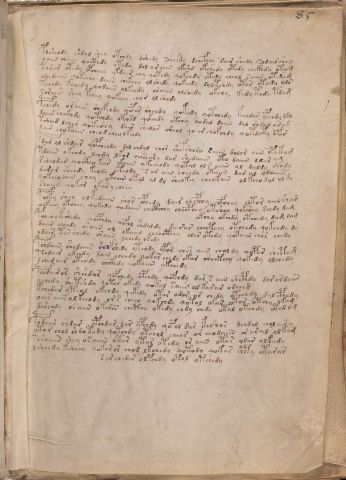

# Voynich Speculative Procedural Protocol — f85r1

IMPORTANT: this is NOT a real or validated translation of the Voynich Manuscript. It is a speculative/procedural model that interprets EVA using a user-defined grammar to generate experimental recipes using safe, known edible substitutes.

This file is generated automatically from IVTFF/EVA transliteration plus a user-defined procedural grammar.



## Page / Folio
- currier: B
- folio: f85r1
- page_number: 167
- section: text only

## EVA Text (Transliteration)
```text
pdsheody shdol shey otchdy dshedy soeeedy dchefoey sair shedy sodair shey
yoiin cheey qocthdy otedy dol ar aiin okshd okchedy otedy chckhdy otam
tarar otedy opcheey ykdair chy qotedy qokchdy otedy cheol saiin otedam
odeedaiin qokechy daiin chekchy olshedy qokeedy doltshdy otar otchdy ols
tchedy kchedy qodaiin olkeedy oraiin olshedy okchy kedy tedy tdam
roraiin shey pchey qokeey chor ol shedy
pchedy oraiin shefchdy qopar sheedy qokedy qotchedy kchdar ypchdy ldo
daiin chckhdy qotchdy opchsd qokchdy otchy qodal daiin dal shdar oram
tsheed lchey qokeshy da[ir:in] shedar sheol qo [ar:iir] chofchdy qotdc@178;y ofar
dair chotaiin cheod cheolkeedy
pdar ol shdair qopcheedy dal chdal chor shefshoro raiin dolor aiin opakam
tdain okeody lchdy lkor oeeseary dar shedaiin oto daiin dlar am
rsheodar qocth[y:o] kar okaiin ykeeeody qotal ol s aiin ol daldy shody
daror sheedy keody oteody s ar aiin cheedy otaiin dar al odaiiin
qokeeodaiin chey okaiin okal al dl sheokey cheokaiin ol keeo dal olky
shoiin qokar okar y cheey
polky shey olkedaiin shor cphedy dair shcphhy opchey shtor aiinsham
olkeey otchey qokedy qodaiin chctahy checphey otshey qokshey schdy dam
okchy okchdy otchedy dam lam
pcheo y kshedy qocphdy qofol shdaldy dairar cheeteey otchedy qokchdy dy
daiir cheody oraiin ol okaiin cheocthey olor otedy qotaiin chor chedy
ydair tar chedy oraiin ychedy okedy
pchdaiin shodaiin shofshedy yteody ypar ches aiin chol dy qopar shetam
tedair ykeedy dain cheedy qokar chedy okar shee[k:t]eey qokedy olchedy
schedaiir oteody chcthdy qokaiin ykchedy
pchdair or shshdar qopchedy opchdy qofchdy dar s aiin chcphdy dar or daiin
ychedy shetshdy qotar okedy qokal saiin ol karar odeeeg
kchedar yteol okchdy q[e:o]kedy otor odor ar chedy otechdy dal cphedy
oees aiin ol keeody or s cheey qokchdy qotol okar otar otchy okam
dorchdy o[r:s]aiin okeder chcthy okedy chdy chdy otal otchdy otalom
podaiin shdar ypchdar dar ypchdy qopol dar keshar dchdal chol air y
ytor chol shdy tody qotchdy otchol chees or eeodaiin or aral olkam
raraiiin shey osaiin otar ytar otedy or aiin otar olar olkeedy
ysheedy ksheey qokor or chod lkchedy qotody qokar shty otarar
s ar chedar olpchdy otol otchedy
```

## Domain Context (Heuristic; Not a Translation)

This section summarizes recurring **basewords** in this IVTFF domain and shows simple substring evidence that the token markers used by the procedural grammar occur inside frequent words.

Any Italian anagram / English gloss is a best-effort lexicon match, not a decipherment.


### Associated basewords (non-generic; top by frequency in this domain)
- `daiin` (count=40) → Italian anagram `piani`; English: plans (arrangements)
- `qokar` (count=31) → Italian anagram `carco`; English: [n/a]
- `qokaiin` (count=25) → Italian anagram `ciancio`; English: [n/a]
- `qokal` (count=23) → Italian anagram `calco`; English: cast (of sculpture)
- `ykaiin` (count=15) → Italian anagram `acini`; English: [n/a]
- `okaiin` (count=12) → Italian anagram `coniai`; English: [n/a]
- `qokain` (count=10) → Italian anagram `acconi`; English: [n/a]
- `okain` (count=10) → Italian anagram `acino`; English: a berry
- `saiin` (count=10) → Italian anagram `asini`; English: [n/a]
- `kaiin` (count=9) → Italian anagram `acini`; English: [n/a]
- `odaiin` (count=9) → Italian anagram `inopia`; English: poverty
- `qotaiin` (count=8) → Italian anagram `cationi`; English: [n/a]
- `qotar` (count=8) → Italian anagram `corta`; English: [n/a]
- `qotal` (count=8) → Italian anagram `colta`; English: [n/a]
- `otain` (count=7) → Italian anagram `anito`; English: [n/a]

### Marker evidence (substring in frequent basewords)
- `qo`: 52 basewords; examples: `qokar`, `qokaiin`, `qokal`, `qokeey`, `qoky`, `qokey`
- `q`: 53 basewords; examples: `qokar`, `qokaiin`, `qokal`, `qokeey`, `qoky`, `qokey`
- `o`: 206 basewords; examples: `or`, `ol`, `o`, `qokar`, `chol`, `qokaiin`
- `k`: 119 basewords; examples: `qokar`, `qokaiin`, `qokal`, `okal`, `okar`, `qokeey`
- `t`: 81 basewords; examples: `otal`, `otar`, `otaiin`, `otedy`, `ytaiin`, `otam`
- `p`: 13 basewords; examples: `opchey`, `opchedy`, `pchedy`, `qopchedy`, `opchdy`, `qopchy`
- `ch`: 102 basewords; examples: `chedy`, `chey`, `chol`, `chdy`, `chor`, `chckhy`
- `sh`: 44 basewords; examples: `shedy`, `shey`, `sheey`, `shol`, `sheol`, `shckhy`
- `f`: 1 basewords; examples: `f`
- `cth`: 11 basewords; examples: `chcthy`, `shcthy`, `cthy`, `cthar`, `shecthy`, `chocthy`
- `ckh`: 14 basewords; examples: `chckhy`, `shckhy`, `ckhey`, `qockhy`, `chckhdy`, `checkhy`
- `cph`: 2 basewords; examples: `cphy`, `cphol`
- `dy`: 72 basewords; examples: `shedy`, `chedy`, `dy`, `chdy`, `qokedy`, `okedy`
- `iin`: 35 basewords; examples: `aiin`, `daiin`, `qokaiin`, `ykaiin`, `okaiin`, `otaiin`
- `aiin`: 30 basewords; examples: `aiin`, `daiin`, `qokaiin`, `ykaiin`, `okaiin`, `otaiin`

## Recipes Index (This Page)
- [f85r1.1,@P0](#f85r1-1-f85r1-1-p0)
- [f85r1.2,+P0](#f85r1-2-f85r1-2-p0)
- [f85r1.3,+P0](#f85r1-3-f85r1-3-p0)
- [f85r1.4,+P0](#f85r1-4-f85r1-4-p0)
- [f85r1.5,+P0](#f85r1-5-f85r1-5-p0)
- [f85r1.6,+P0](#f85r1-6-f85r1-6-p0)
- [f85r1.7,+P0](#f85r1-7-f85r1-7-p0)
- [f85r1.8,+P0](#f85r1-8-f85r1-8-p0)
- [f85r1.9,+P0](#f85r1-9-f85r1-9-p0)
- [f85r1.10,+P0](#f85r1-10-f85r1-10-p0)
- [f85r1.11,+P0](#f85r1-11-f85r1-11-p0)
- [f85r1.12,+P0](#f85r1-12-f85r1-12-p0)
- [f85r1.13,+P0](#f85r1-13-f85r1-13-p0)
- [f85r1.14,+P0](#f85r1-14-f85r1-14-p0)
- [f85r1.15,+P0](#f85r1-15-f85r1-15-p0)
- [f85r1.16,+P0](#f85r1-16-f85r1-16-p0)
- [f85r1.17,+P0](#f85r1-17-f85r1-17-p0)
- [f85r1.18,+P0](#f85r1-18-f85r1-18-p0)
- [f85r1.19,+Pr](#f85r1-19-f85r1-19-pr)
- [f85r1.20,*P0](#f85r1-20-f85r1-20-p0)
- [f85r1.21,+P0](#f85r1-21-f85r1-21-p0)
- [f85r1.22,+P0](#f85r1-22-f85r1-22-p0)
- [f85r1.23,+P0](#f85r1-23-f85r1-23-p0)
- [f85r1.24,+P0](#f85r1-24-f85r1-24-p0)
- [f85r1.25,+P0](#f85r1-25-f85r1-25-p0)
- [f85r1.26,+P0](#f85r1-26-f85r1-26-p0)
- [f85r1.27,+P0](#f85r1-27-f85r1-27-p0)
- [f85r1.28,+P0](#f85r1-28-f85r1-28-p0)
- [f85r1.29,+P0](#f85r1-29-f85r1-29-p0)
- [f85r1.30,+P0](#f85r1-30-f85r1-30-p0)
- [f85r1.31,+P0](#f85r1-31-f85r1-31-p0)
- [f85r1.32,+P0](#f85r1-32-f85r1-32-p0)
- [f85r1.33,+P0](#f85r1-33-f85r1-33-p0)
- [f85r1.34,+P0](#f85r1-34-f85r1-34-p0)
- [f85r1.35,+Pc](#f85r1-35-f85r1-35-pc)

## Line Glosses (Procedural Gloss Only; Not a Translation)

<a id="f85r1-1-f85r1-1-p0"></a>

### f85r1.1,@P0

EVA: pdsheody shdol shey otchdy dshedy soeeedy dchefoey sair shedy sodair shey

Direct Gloss (Procedural, Not a Real Translation):
- pdsheody: add secondary herb (safe substitute) → mix / transfer → add starter / activate → duration level 1 → state: active extraction
- shdol: add secondary herb (safe substitute) → mix / transfer → add starter / activate
- shey: add secondary herb (safe substitute) → duration level 1 → state: active extraction
- otchdy: apply heat/cooking → add main plant (safe substitute) → mix / transfer → add starter / activate
- dshedy: add secondary herb (safe substitute) → add starter / activate → duration level 1 → state: active extraction
- soeeedy: mix / transfer → add starter / activate → duration level 3 → state: active extraction
- dchefoey: add main plant (safe substitute) → add aroma modifier → mix / transfer → add starter / activate → duration level 1 → state: active extraction
- sair: duration level 1 → state: phase transition/start
- shedy: add secondary herb (safe substitute) → add starter / activate → duration level 1 → state: active extraction
- sodair: mix / transfer → add starter / activate → duration level 1 → state: phase transition/start
- shey: add secondary herb (safe substitute) → duration level 1 → state: active extraction

<a id="f85r1-2-f85r1-2-p0"></a>

### f85r1.2,+P0

EVA: yoiin cheey qocthdy otedy dol ar aiin okshd okchedy otedy chckhdy otam

Direct Gloss (Procedural, Not a Real Translation):
- yoiin: mix / transfer → duration level 2 → state: cooling/rest → medium phase
- cheey: add main plant (safe substitute) → duration level 2 → state: active extraction
- qocthdy: prepare liquid base → add starter / activate → add complex herbal compound (safe blend)
- otedy: apply heat/cooking → mix / transfer → add starter / activate → duration level 1 → state: active extraction
- dol: mix / transfer → add starter / activate
- ar: duration level 1 → state: phase transition/start
- aiin: duration level 1 → state: phase transition/start → long phase
- okshd: add fermentable sugars → add secondary herb (safe substitute) → mix / transfer → add starter / activate
- okchedy: add fermentable sugars → add main plant (safe substitute) → mix / transfer → add starter / activate → duration level 1 → state: active extraction
- otedy: apply heat/cooking → mix / transfer → add starter / activate → duration level 1 → state: active extraction
- chckhdy: add main plant (safe substitute) → add starter / activate → add complex herbal compound (safe blend)
- otam: apply heat/cooking → mix / transfer → duration level 1 → state: phase transition/start

<a id="f85r1-3-f85r1-3-p0"></a>

### f85r1.3,+P0

EVA: tarar otedy opcheey ykdair chy qotedy qokchdy otedy cheol saiin otedam

Direct Gloss (Procedural, Not a Real Translation):
- tarar: apply heat/cooking → duration level 1 → state: phase transition/start
- otedy: apply heat/cooking → mix / transfer → add starter / activate → duration level 1 → state: active extraction
- opcheey: add main plant (safe substitute) → mix / transfer → add starter / activate → duration level 2 → state: active extraction
- ykdair: add fermentable sugars → add starter / activate → duration level 1 → state: phase transition/start
- chy: add main plant (safe substitute)
- qotedy: prepare liquid base → apply heat/cooking → add starter / activate → duration level 1 → state: active extraction
- qokchdy: prepare liquid base → add fermentable sugars → add main plant (safe substitute) → add starter / activate
- otedy: apply heat/cooking → mix / transfer → add starter / activate → duration level 1 → state: active extraction
- cheol: add main plant (safe substitute) → mix / transfer → duration level 1 → state: active extraction
- saiin: duration level 1 → state: phase transition/start → long phase
- otedam: apply heat/cooking → mix / transfer → add starter / activate → duration level 1 → state: active extraction

<a id="f85r1-4-f85r1-4-p0"></a>

### f85r1.4,+P0

EVA: odeedaiin qokechy daiin chekchy olshedy qokeedy doltshdy otar otchdy ols

Direct Gloss (Procedural, Not a Real Translation):
- odeedaiin: mix / transfer → add starter / activate → duration level 2 → state: active extraction → long phase
- qokechy: prepare liquid base → add fermentable sugars → add main plant (safe substitute) → duration level 1 → state: active extraction
- daiin: add starter / activate → duration level 1 → state: phase transition/start → long phase
- chekchy: add fermentable sugars → add main plant (safe substitute) → duration level 1 → state: active extraction
- olshedy: add secondary herb (safe substitute) → mix / transfer → add starter / activate → duration level 1 → state: active extraction
- qokeedy: prepare liquid base → add fermentable sugars → add starter / activate → duration level 2 → state: active extraction
- doltshdy: apply heat/cooking → add secondary herb (safe substitute) → mix / transfer → add starter / activate
- otar: apply heat/cooking → mix / transfer → duration level 1 → state: phase transition/start
- otchdy: apply heat/cooking → add main plant (safe substitute) → mix / transfer → add starter / activate
- ols: mix / transfer

<a id="f85r1-5-f85r1-5-p0"></a>

### f85r1.5,+P0

EVA: tchedy kchedy qodaiin olkeedy oraiin olshedy okchy kedy tedy tdam

Direct Gloss (Procedural, Not a Real Translation):
- tchedy: apply heat/cooking → add main plant (safe substitute) → add starter / activate → duration level 1 → state: active extraction
- kchedy: add fermentable sugars → add main plant (safe substitute) → add starter / activate → duration level 1 → state: active extraction
- qodaiin: prepare liquid base → add starter / activate → duration level 1 → state: phase transition/start → long phase
- olkeedy: add fermentable sugars → mix / transfer → add starter / activate → duration level 2 → state: active extraction
- oraiin: mix / transfer → duration level 1 → state: phase transition/start → long phase
- olshedy: add secondary herb (safe substitute) → mix / transfer → add starter / activate → duration level 1 → state: active extraction
- okchy: add fermentable sugars → add main plant (safe substitute) → mix / transfer
- kedy: add fermentable sugars → add starter / activate → duration level 1 → state: active extraction
- tedy: apply heat/cooking → add starter / activate → duration level 1 → state: active extraction
- tdam: apply heat/cooking → add starter / activate → duration level 1 → state: phase transition/start

<a id="f85r1-6-f85r1-6-p0"></a>

### f85r1.6,+P0

EVA: roraiin shey pchey qokeey chor ol shedy

Direct Gloss (Procedural, Not a Real Translation):
- roraiin: mix / transfer → duration level 1 → state: phase transition/start → long phase
- shey: add secondary herb (safe substitute) → duration level 1 → state: active extraction
- pchey: add main plant (safe substitute) → add starter / activate → duration level 1 → state: active extraction
- qokeey: prepare liquid base → add fermentable sugars → duration level 2 → state: active extraction
- chor: add main plant (safe substitute) → mix / transfer
- ol: mix / transfer
- shedy: add secondary herb (safe substitute) → add starter / activate → duration level 1 → state: active extraction

<a id="f85r1-7-f85r1-7-p0"></a>

### f85r1.7,+P0

EVA: pchedy oraiin shefchdy qopar sheedy qokedy qotchedy kchdar ypchdy ldo

Direct Gloss (Procedural, Not a Real Translation):
- pchedy: add main plant (safe substitute) → add starter / activate → duration level 1 → state: active extraction
- oraiin: mix / transfer → duration level 1 → state: phase transition/start → long phase
- shefchdy: add main plant (safe substitute) → add secondary herb (safe substitute) → add aroma modifier → add starter / activate → duration level 1 → state: active extraction
- qopar: prepare liquid base → add starter / activate → duration level 1 → state: phase transition/start
- sheedy: add secondary herb (safe substitute) → add starter / activate → duration level 2 → state: active extraction
- qokedy: prepare liquid base → add fermentable sugars → add starter / activate → duration level 1 → state: active extraction
- qotchedy: prepare liquid base → apply heat/cooking → add main plant (safe substitute) → add starter / activate → duration level 1 → state: active extraction
- kchdar: add fermentable sugars → add main plant (safe substitute) → add starter / activate → duration level 1 → state: phase transition/start
- ypchdy: add main plant (safe substitute) → add starter / activate
- ldo: mix / transfer → add starter / activate

<a id="f85r1-8-f85r1-8-p0"></a>

### f85r1.8,+P0

EVA: daiin chckhdy qotchdy opchsd qokchdy otchy qodal daiin dal shdar oram

Direct Gloss (Procedural, Not a Real Translation):
- daiin: add starter / activate → duration level 1 → state: phase transition/start → long phase
- chckhdy: add main plant (safe substitute) → add starter / activate → add complex herbal compound (safe blend)
- qotchdy: prepare liquid base → apply heat/cooking → add main plant (safe substitute) → add starter / activate
- opchsd: add main plant (safe substitute) → mix / transfer → add starter / activate
- qokchdy: prepare liquid base → add fermentable sugars → add main plant (safe substitute) → add starter / activate
- otchy: apply heat/cooking → add main plant (safe substitute) → mix / transfer
- qodal: prepare liquid base → add starter / activate → duration level 1 → state: phase transition/start
- daiin: add starter / activate → duration level 1 → state: phase transition/start → long phase
- dal: add starter / activate → duration level 1 → state: phase transition/start
- shdar: add secondary herb (safe substitute) → add starter / activate → duration level 1 → state: phase transition/start
- oram: mix / transfer → duration level 1 → state: phase transition/start

<a id="f85r1-9-f85r1-9-p0"></a>

### f85r1.9,+P0

EVA: tsheed lchey qokeshy da[ir:in] shedar sheol qo [ar:iir] chofchdy qotdc@178;y ofar

Direct Gloss (Procedural, Not a Real Translation):
- tsheed: apply heat/cooking → add secondary herb (safe substitute) → add starter / activate → duration level 2 → state: active extraction
- lchey: add main plant (safe substitute) → duration level 1 → state: active extraction
- qokeshy: prepare liquid base → add fermentable sugars → add secondary herb (safe substitute) → duration level 1 → state: active extraction
- da: add starter / activate → duration level 1 → state: phase transition/start
- ir: duration level 1 → state: cooling/rest
- in: duration level 1 → state: cooling/rest
- shedar: add secondary herb (safe substitute) → add starter / activate → duration level 1 → state: active extraction
- sheol: add secondary herb (safe substitute) → mix / transfer → duration level 1 → state: active extraction
- qo: prepare liquid base
- ar: duration level 1 → state: phase transition/start
- iir: duration level 2 → state: cooling/rest
- chofchdy: add main plant (safe substitute) → add aroma modifier → mix / transfer → add starter / activate
- qotdc: prepare liquid base → apply heat/cooking → add starter / activate
- y: [unparsed]
- ofar: add aroma modifier → mix / transfer → duration level 1 → state: phase transition/start

<a id="f85r1-10-f85r1-10-p0"></a>

### f85r1.10,+P0

EVA: dair chotaiin cheod cheolkeedy

Direct Gloss (Procedural, Not a Real Translation):
- dair: add starter / activate → duration level 1 → state: phase transition/start
- chotaiin: apply heat/cooking → add main plant (safe substitute) → mix / transfer → duration level 1 → state: phase transition/start → long phase
- cheod: add main plant (safe substitute) → mix / transfer → add starter / activate → duration level 1 → state: active extraction
- cheolkeedy: add fermentable sugars → add main plant (safe substitute) → mix / transfer → add starter / activate → duration level 1 → state: active extraction

<a id="f85r1-11-f85r1-11-p0"></a>

### f85r1.11,+P0

EVA: pdar ol shdair qopcheedy dal chdal chor shefshoro raiin dolor aiin opakam

Direct Gloss (Procedural, Not a Real Translation):
- pdar: add starter / activate → duration level 1 → state: phase transition/start
- ol: mix / transfer
- shdair: add secondary herb (safe substitute) → add starter / activate → duration level 1 → state: phase transition/start
- qopcheedy: prepare liquid base → add main plant (safe substitute) → add starter / activate → duration level 2 → state: active extraction
- dal: add starter / activate → duration level 1 → state: phase transition/start
- chdal: add main plant (safe substitute) → add starter / activate → duration level 1 → state: phase transition/start
- chor: add main plant (safe substitute) → mix / transfer
- shefshoro: add secondary herb (safe substitute) → add aroma modifier → mix / transfer → duration level 1 → state: active extraction
- raiin: duration level 1 → state: phase transition/start → long phase
- dolor: mix / transfer → add starter / activate
- aiin: duration level 1 → state: phase transition/start → long phase
- opakam: add fermentable sugars → mix / transfer → add starter / activate → duration level 1 → state: phase transition/start

<a id="f85r1-12-f85r1-12-p0"></a>

### f85r1.12,+P0

EVA: tdain okeody lchdy lkor oeeseary dar shedaiin oto daiin dlar am

Direct Gloss (Procedural, Not a Real Translation):
- tdain: apply heat/cooking → add starter / activate → duration level 1 → state: phase transition/start
- okeody: add fermentable sugars → mix / transfer → add starter / activate → duration level 1 → state: active extraction
- lchdy: add main plant (safe substitute) → add starter / activate
- lkor: add fermentable sugars → mix / transfer
- oeeseary: mix / transfer → duration level 2 → state: active extraction
- dar: add starter / activate → duration level 1 → state: phase transition/start
- shedaiin: add secondary herb (safe substitute) → add starter / activate → duration level 1 → state: active extraction → long phase
- oto: apply heat/cooking → mix / transfer
- daiin: add starter / activate → duration level 1 → state: phase transition/start → long phase
- dlar: add starter / activate → duration level 1 → state: phase transition/start
- am: duration level 1 → state: phase transition/start

<a id="f85r1-13-f85r1-13-p0"></a>

### f85r1.13,+P0

EVA: rsheodar qocth[y:o] kar okaiin ykeeeody qotal ol s aiin ol daldy shody

Direct Gloss (Procedural, Not a Real Translation):
- rsheodar: add secondary herb (safe substitute) → mix / transfer → add starter / activate → duration level 1 → state: active extraction
- qocth: prepare liquid base → add complex herbal compound (safe blend)
- y: [unparsed]
- o: mix / transfer
- kar: add fermentable sugars → duration level 1 → state: phase transition/start
- okaiin: add fermentable sugars → mix / transfer → duration level 1 → state: phase transition/start → long phase
- ykeeeody: add fermentable sugars → mix / transfer → add starter / activate → duration level 3 → state: active extraction
- qotal: prepare liquid base → apply heat/cooking → duration level 1 → state: phase transition/start
- ol: mix / transfer
- s: [unparsed]
- aiin: duration level 1 → state: phase transition/start → long phase
- ol: mix / transfer
- daldy: add starter / activate → duration level 1 → state: phase transition/start
- shody: add secondary herb (safe substitute) → mix / transfer → add starter / activate

<a id="f85r1-14-f85r1-14-p0"></a>

### f85r1.14,+P0

EVA: daror sheedy keody oteody s ar aiin cheedy otaiin dar al odaiiin

Direct Gloss (Procedural, Not a Real Translation):
- daror: mix / transfer → add starter / activate → duration level 1 → state: phase transition/start
- sheedy: add secondary herb (safe substitute) → add starter / activate → duration level 2 → state: active extraction
- keody: add fermentable sugars → mix / transfer → add starter / activate → duration level 1 → state: active extraction
- oteody: apply heat/cooking → mix / transfer → add starter / activate → duration level 1 → state: active extraction
- s: [unparsed]
- ar: duration level 1 → state: phase transition/start
- aiin: duration level 1 → state: phase transition/start → long phase
- cheedy: add main plant (safe substitute) → add starter / activate → duration level 2 → state: active extraction
- otaiin: apply heat/cooking → mix / transfer → duration level 1 → state: phase transition/start → long phase
- dar: add starter / activate → duration level 1 → state: phase transition/start
- al: duration level 1 → state: phase transition/start
- odaiiin: mix / transfer → add starter / activate → duration level 1 → state: phase transition/start → medium phase

<a id="f85r1-15-f85r1-15-p0"></a>

### f85r1.15,+P0

EVA: qokeeodaiin chey okaiin okal al dl sheokey cheokaiin ol keeo dal olky

Direct Gloss (Procedural, Not a Real Translation):
- qokeeodaiin: prepare liquid base → add fermentable sugars → mix / transfer → add starter / activate → duration level 2 → state: active extraction → long phase
- chey: add main plant (safe substitute) → duration level 1 → state: active extraction
- okaiin: add fermentable sugars → mix / transfer → duration level 1 → state: phase transition/start → long phase
- okal: add fermentable sugars → mix / transfer → duration level 1 → state: phase transition/start
- al: duration level 1 → state: phase transition/start
- dl: add starter / activate
- sheokey: add fermentable sugars → add secondary herb (safe substitute) → mix / transfer → duration level 1 → state: active extraction
- cheokaiin: add fermentable sugars → add main plant (safe substitute) → mix / transfer → duration level 1 → state: active extraction → long phase
- ol: mix / transfer
- keeo: add fermentable sugars → mix / transfer → duration level 2 → state: active extraction
- dal: add starter / activate → duration level 1 → state: phase transition/start
- olky: add fermentable sugars → mix / transfer

<a id="f85r1-16-f85r1-16-p0"></a>

### f85r1.16,+P0

EVA: shoiin qokar okar y cheey

Direct Gloss (Procedural, Not a Real Translation):
- shoiin: add secondary herb (safe substitute) → mix / transfer → duration level 2 → state: cooling/rest → medium phase
- qokar: prepare liquid base → add fermentable sugars → duration level 1 → state: phase transition/start
- okar: add fermentable sugars → mix / transfer → duration level 1 → state: phase transition/start
- y: [unparsed]
- cheey: add main plant (safe substitute) → duration level 2 → state: active extraction

<a id="f85r1-17-f85r1-17-p0"></a>

### f85r1.17,+P0

EVA: polky shey olkedaiin shor cphedy dair shcphhy opchey shtor aiinsham

Direct Gloss (Procedural, Not a Real Translation):
- polky: add fermentable sugars → mix / transfer → add starter / activate
- shey: add secondary herb (safe substitute) → duration level 1 → state: active extraction
- olkedaiin: add fermentable sugars → mix / transfer → add starter / activate → duration level 1 → state: active extraction → long phase
- shor: add secondary herb (safe substitute) → mix / transfer
- cphedy: add starter / activate → add complex herbal compound (safe blend) → duration level 1 → state: active extraction
- dair: add starter / activate → duration level 1 → state: phase transition/start
- shcphhy: add secondary herb (safe substitute) → add complex herbal compound (safe blend) → unmodeled token(s) present: h
- opchey: add main plant (safe substitute) → mix / transfer → add starter / activate → duration level 1 → state: active extraction
- shtor: apply heat/cooking → add secondary herb (safe substitute) → mix / transfer
- aiinsham: add secondary herb (safe substitute) → duration level 1 → state: phase transition/start → long phase

<a id="f85r1-18-f85r1-18-p0"></a>

### f85r1.18,+P0

EVA: olkeey otchey qokedy qodaiin chctahy checphey otshey qokshey schdy dam

Direct Gloss (Procedural, Not a Real Translation):
- olkeey: add fermentable sugars → mix / transfer → duration level 2 → state: active extraction
- otchey: apply heat/cooking → add main plant (safe substitute) → mix / transfer → duration level 1 → state: active extraction
- qokedy: prepare liquid base → add fermentable sugars → add starter / activate → duration level 1 → state: active extraction
- qodaiin: prepare liquid base → add starter / activate → duration level 1 → state: phase transition/start → long phase
- chctahy: apply heat/cooking → add main plant (safe substitute) → duration level 1 → state: phase transition/start → unmodeled token(s) present: h
- checphey: add main plant (safe substitute) → add complex herbal compound (safe blend) → duration level 1 → state: active extraction
- otshey: apply heat/cooking → add secondary herb (safe substitute) → mix / transfer → duration level 1 → state: active extraction
- qokshey: prepare liquid base → add fermentable sugars → add secondary herb (safe substitute) → duration level 1 → state: active extraction
- schdy: add main plant (safe substitute) → add starter / activate
- dam: add starter / activate → duration level 1 → state: phase transition/start

<a id="f85r1-19-f85r1-19-pr"></a>

### f85r1.19,+Pr

EVA: okchy okchdy otchedy dam lam

Direct Gloss (Procedural, Not a Real Translation):
- okchy: add fermentable sugars → add main plant (safe substitute) → mix / transfer
- okchdy: add fermentable sugars → add main plant (safe substitute) → mix / transfer → add starter / activate
- otchedy: apply heat/cooking → add main plant (safe substitute) → mix / transfer → add starter / activate → duration level 1 → state: active extraction
- dam: add starter / activate → duration level 1 → state: phase transition/start
- lam: duration level 1 → state: phase transition/start

<a id="f85r1-20-f85r1-20-p0"></a>

### f85r1.20,*P0

EVA: pcheo y kshedy qocphdy qofol shdaldy dairar cheeteey otchedy qokchdy dy

Direct Gloss (Procedural, Not a Real Translation):
- pcheo: add main plant (safe substitute) → mix / transfer → add starter / activate → duration level 1 → state: active extraction
- y: [unparsed]
- kshedy: add fermentable sugars → add secondary herb (safe substitute) → add starter / activate → duration level 1 → state: active extraction
- qocphdy: prepare liquid base → add starter / activate → add complex herbal compound (safe blend)
- qofol: prepare liquid base → add aroma modifier → mix / transfer
- shdaldy: add secondary herb (safe substitute) → add starter / activate → duration level 1 → state: phase transition/start
- dairar: add starter / activate → duration level 1 → state: phase transition/start
- cheeteey: apply heat/cooking → add main plant (safe substitute) → duration level 2 → state: active extraction
- otchedy: apply heat/cooking → add main plant (safe substitute) → mix / transfer → add starter / activate → duration level 1 → state: active extraction
- qokchdy: prepare liquid base → add fermentable sugars → add main plant (safe substitute) → add starter / activate
- dy: add starter / activate

<a id="f85r1-21-f85r1-21-p0"></a>

### f85r1.21,+P0

EVA: daiir cheody oraiin ol okaiin cheocthey olor otedy qotaiin chor chedy

Direct Gloss (Procedural, Not a Real Translation):
- daiir: add starter / activate → duration level 1 → state: phase transition/start
- cheody: add main plant (safe substitute) → mix / transfer → add starter / activate → duration level 1 → state: active extraction
- oraiin: mix / transfer → duration level 1 → state: phase transition/start → long phase
- ol: mix / transfer
- okaiin: add fermentable sugars → mix / transfer → duration level 1 → state: phase transition/start → long phase
- cheocthey: add main plant (safe substitute) → mix / transfer → add complex herbal compound (safe blend) → duration level 1 → state: active extraction
- olor: mix / transfer
- otedy: apply heat/cooking → mix / transfer → add starter / activate → duration level 1 → state: active extraction
- qotaiin: prepare liquid base → apply heat/cooking → duration level 1 → state: phase transition/start → long phase
- chor: add main plant (safe substitute) → mix / transfer
- chedy: add main plant (safe substitute) → add starter / activate → duration level 1 → state: active extraction

<a id="f85r1-22-f85r1-22-p0"></a>

### f85r1.22,+P0

EVA: ydair tar chedy oraiin ychedy okedy

Direct Gloss (Procedural, Not a Real Translation):
- ydair: add starter / activate → duration level 1 → state: phase transition/start
- tar: apply heat/cooking → duration level 1 → state: phase transition/start
- chedy: add main plant (safe substitute) → add starter / activate → duration level 1 → state: active extraction
- oraiin: mix / transfer → duration level 1 → state: phase transition/start → long phase
- ychedy: add main plant (safe substitute) → add starter / activate → duration level 1 → state: active extraction
- okedy: add fermentable sugars → mix / transfer → add starter / activate → duration level 1 → state: active extraction

<a id="f85r1-23-f85r1-23-p0"></a>

### f85r1.23,+P0

EVA: pchdaiin shodaiin shofshedy yteody ypar ches aiin chol dy qopar shetam

Direct Gloss (Procedural, Not a Real Translation):
- pchdaiin: add main plant (safe substitute) → add starter / activate → duration level 1 → state: phase transition/start → long phase
- shodaiin: add secondary herb (safe substitute) → mix / transfer → add starter / activate → duration level 1 → state: phase transition/start → long phase
- shofshedy: add secondary herb (safe substitute) → add aroma modifier → mix / transfer → add starter / activate → duration level 1 → state: active extraction
- yteody: apply heat/cooking → mix / transfer → add starter / activate → duration level 1 → state: active extraction
- ypar: add starter / activate → duration level 1 → state: phase transition/start
- ches: add main plant (safe substitute) → duration level 1 → state: active extraction
- aiin: duration level 1 → state: phase transition/start → long phase
- chol: add main plant (safe substitute) → mix / transfer
- dy: add starter / activate
- qopar: prepare liquid base → add starter / activate → duration level 1 → state: phase transition/start
- shetam: apply heat/cooking → add secondary herb (safe substitute) → duration level 1 → state: active extraction

<a id="f85r1-24-f85r1-24-p0"></a>

### f85r1.24,+P0

EVA: tedair ykeedy dain cheedy qokar chedy okar shee[k:t]eey qokedy olchedy

Direct Gloss (Procedural, Not a Real Translation):
- tedair: apply heat/cooking → add starter / activate → duration level 1 → state: active extraction
- ykeedy: add fermentable sugars → add starter / activate → duration level 2 → state: active extraction
- dain: add starter / activate → duration level 1 → state: phase transition/start
- cheedy: add main plant (safe substitute) → add starter / activate → duration level 2 → state: active extraction
- qokar: prepare liquid base → add fermentable sugars → duration level 1 → state: phase transition/start
- chedy: add main plant (safe substitute) → add starter / activate → duration level 1 → state: active extraction
- okar: add fermentable sugars → mix / transfer → duration level 1 → state: phase transition/start
- shee: add secondary herb (safe substitute) → duration level 2 → state: active extraction
- k: add fermentable sugars
- t: apply heat/cooking
- eey: duration level 2 → state: active extraction
- qokedy: prepare liquid base → add fermentable sugars → add starter / activate → duration level 1 → state: active extraction
- olchedy: add main plant (safe substitute) → mix / transfer → add starter / activate → duration level 1 → state: active extraction

<a id="f85r1-25-f85r1-25-p0"></a>

### f85r1.25,+P0

EVA: schedaiir oteody chcthdy qokaiin ykchedy

Direct Gloss (Procedural, Not a Real Translation):
- schedaiir: add main plant (safe substitute) → add starter / activate → duration level 1 → state: active extraction
- oteody: apply heat/cooking → mix / transfer → add starter / activate → duration level 1 → state: active extraction
- chcthdy: add main plant (safe substitute) → add starter / activate → add complex herbal compound (safe blend)
- qokaiin: prepare liquid base → add fermentable sugars → duration level 1 → state: phase transition/start → long phase
- ykchedy: add fermentable sugars → add main plant (safe substitute) → add starter / activate → duration level 1 → state: active extraction

<a id="f85r1-26-f85r1-26-p0"></a>

### f85r1.26,+P0

EVA: pchdair or shshdar qopchedy opchdy qofchdy dar s aiin chcphdy dar or daiin

Direct Gloss (Procedural, Not a Real Translation):
- pchdair: add main plant (safe substitute) → add starter / activate → duration level 1 → state: phase transition/start
- or: mix / transfer
- shshdar: add secondary herb (safe substitute) → add starter / activate → duration level 1 → state: phase transition/start
- qopchedy: prepare liquid base → add main plant (safe substitute) → add starter / activate → duration level 1 → state: active extraction
- opchdy: add main plant (safe substitute) → mix / transfer → add starter / activate
- qofchdy: prepare liquid base → add main plant (safe substitute) → add aroma modifier → add starter / activate
- dar: add starter / activate → duration level 1 → state: phase transition/start
- s: [unparsed]
- aiin: duration level 1 → state: phase transition/start → long phase
- chcphdy: add main plant (safe substitute) → add starter / activate → add complex herbal compound (safe blend)
- dar: add starter / activate → duration level 1 → state: phase transition/start
- or: mix / transfer
- daiin: add starter / activate → duration level 1 → state: phase transition/start → long phase

<a id="f85r1-27-f85r1-27-p0"></a>

### f85r1.27,+P0

EVA: ychedy shetshdy qotar okedy qokal saiin ol karar odeeeg

Direct Gloss (Procedural, Not a Real Translation):
- ychedy: add main plant (safe substitute) → add starter / activate → duration level 1 → state: active extraction
- shetshdy: apply heat/cooking → add secondary herb (safe substitute) → add starter / activate → duration level 1 → state: active extraction
- qotar: prepare liquid base → apply heat/cooking → duration level 1 → state: phase transition/start
- okedy: add fermentable sugars → mix / transfer → add starter / activate → duration level 1 → state: active extraction
- qokal: prepare liquid base → add fermentable sugars → duration level 1 → state: phase transition/start
- saiin: duration level 1 → state: phase transition/start → long phase
- ol: mix / transfer
- karar: add fermentable sugars → duration level 1 → state: phase transition/start
- odeeeg: mix / transfer → add starter / activate → duration level 3 → state: active extraction

<a id="f85r1-28-f85r1-28-p0"></a>

### f85r1.28,+P0

EVA: kchedar yteol okchdy q[e:o]kedy otor odor ar chedy otechdy dal cphedy

Direct Gloss (Procedural, Not a Real Translation):
- kchedar: add fermentable sugars → add main plant (safe substitute) → add starter / activate → duration level 1 → state: active extraction
- yteol: apply heat/cooking → mix / transfer → duration level 1 → state: active extraction
- okchdy: add fermentable sugars → add main plant (safe substitute) → mix / transfer → add starter / activate
- q: prepare base (generic)
- e: duration level 1 → state: active extraction
- o: mix / transfer
- kedy: add fermentable sugars → add starter / activate → duration level 1 → state: active extraction
- otor: apply heat/cooking → mix / transfer
- odor: mix / transfer → add starter / activate
- ar: duration level 1 → state: phase transition/start
- chedy: add main plant (safe substitute) → add starter / activate → duration level 1 → state: active extraction
- otechdy: apply heat/cooking → add main plant (safe substitute) → mix / transfer → add starter / activate → duration level 1 → state: active extraction
- dal: add starter / activate → duration level 1 → state: phase transition/start
- cphedy: add starter / activate → add complex herbal compound (safe blend) → duration level 1 → state: active extraction

<a id="f85r1-29-f85r1-29-p0"></a>

### f85r1.29,+P0

EVA: oees aiin ol keeody or s cheey qokchdy qotol okar otar otchy okam

Direct Gloss (Procedural, Not a Real Translation):
- oees: mix / transfer → duration level 2 → state: active extraction
- aiin: duration level 1 → state: phase transition/start → long phase
- ol: mix / transfer
- keeody: add fermentable sugars → mix / transfer → add starter / activate → duration level 2 → state: active extraction
- or: mix / transfer
- s: [unparsed]
- cheey: add main plant (safe substitute) → duration level 2 → state: active extraction
- qokchdy: prepare liquid base → add fermentable sugars → add main plant (safe substitute) → add starter / activate
- qotol: prepare liquid base → apply heat/cooking → mix / transfer
- okar: add fermentable sugars → mix / transfer → duration level 1 → state: phase transition/start
- otar: apply heat/cooking → mix / transfer → duration level 1 → state: phase transition/start
- otchy: apply heat/cooking → add main plant (safe substitute) → mix / transfer
- okam: add fermentable sugars → mix / transfer → duration level 1 → state: phase transition/start

<a id="f85r1-30-f85r1-30-p0"></a>

### f85r1.30,+P0

EVA: dorchdy o[r:s]aiin okeder chcthy okedy chdy chdy otal otchdy otalom

Direct Gloss (Procedural, Not a Real Translation):
- dorchdy: add main plant (safe substitute) → mix / transfer → add starter / activate
- o: mix / transfer
- r: [unparsed]
- s: [unparsed]
- aiin: duration level 1 → state: phase transition/start → long phase
- okeder: add fermentable sugars → mix / transfer → add starter / activate → duration level 1 → state: active extraction
- chcthy: add main plant (safe substitute) → add complex herbal compound (safe blend)
- okedy: add fermentable sugars → mix / transfer → add starter / activate → duration level 1 → state: active extraction
- chdy: add main plant (safe substitute) → add starter / activate
- chdy: add main plant (safe substitute) → add starter / activate
- otal: apply heat/cooking → mix / transfer → duration level 1 → state: phase transition/start
- otchdy: apply heat/cooking → add main plant (safe substitute) → mix / transfer → add starter / activate
- otalom: apply heat/cooking → mix / transfer → duration level 1 → state: phase transition/start

<a id="f85r1-31-f85r1-31-p0"></a>

### f85r1.31,+P0

EVA: podaiin shdar ypchdar dar ypchdy qopol dar keshar dchdal chol air y

Direct Gloss (Procedural, Not a Real Translation):
- podaiin: mix / transfer → add starter / activate → duration level 1 → state: phase transition/start → long phase
- shdar: add secondary herb (safe substitute) → add starter / activate → duration level 1 → state: phase transition/start
- ypchdar: add main plant (safe substitute) → add starter / activate → duration level 1 → state: phase transition/start
- dar: add starter / activate → duration level 1 → state: phase transition/start
- ypchdy: add main plant (safe substitute) → add starter / activate
- qopol: prepare liquid base → mix / transfer → add starter / activate
- dar: add starter / activate → duration level 1 → state: phase transition/start
- keshar: add fermentable sugars → add secondary herb (safe substitute) → duration level 1 → state: active extraction
- dchdal: add main plant (safe substitute) → add starter / activate → duration level 1 → state: phase transition/start
- chol: add main plant (safe substitute) → mix / transfer
- air: duration level 1 → state: phase transition/start
- y: [unparsed]

<a id="f85r1-32-f85r1-32-p0"></a>

### f85r1.32,+P0

EVA: ytor chol shdy tody qotchdy otchol chees or eeodaiin or aral olkam

Direct Gloss (Procedural, Not a Real Translation):
- ytor: apply heat/cooking → mix / transfer
- chol: add main plant (safe substitute) → mix / transfer
- shdy: add secondary herb (safe substitute) → add starter / activate
- tody: apply heat/cooking → mix / transfer → add starter / activate
- qotchdy: prepare liquid base → apply heat/cooking → add main plant (safe substitute) → add starter / activate
- otchol: apply heat/cooking → add main plant (safe substitute) → mix / transfer
- chees: add main plant (safe substitute) → duration level 2 → state: active extraction
- or: mix / transfer
- eeodaiin: mix / transfer → add starter / activate → duration level 2 → state: active extraction → long phase
- or: mix / transfer
- aral: duration level 1 → state: phase transition/start
- olkam: add fermentable sugars → mix / transfer → duration level 1 → state: phase transition/start

<a id="f85r1-33-f85r1-33-p0"></a>

### f85r1.33,+P0

EVA: raraiiin shey osaiin otar ytar otedy or aiin otar olar olkeedy

Direct Gloss (Procedural, Not a Real Translation):
- raraiiin: duration level 1 → state: phase transition/start → medium phase
- shey: add secondary herb (safe substitute) → duration level 1 → state: active extraction
- osaiin: mix / transfer → duration level 1 → state: phase transition/start → long phase
- otar: apply heat/cooking → mix / transfer → duration level 1 → state: phase transition/start
- ytar: apply heat/cooking → duration level 1 → state: phase transition/start
- otedy: apply heat/cooking → mix / transfer → add starter / activate → duration level 1 → state: active extraction
- or: mix / transfer
- aiin: duration level 1 → state: phase transition/start → long phase
- otar: apply heat/cooking → mix / transfer → duration level 1 → state: phase transition/start
- olar: mix / transfer → duration level 1 → state: phase transition/start
- olkeedy: add fermentable sugars → mix / transfer → add starter / activate → duration level 2 → state: active extraction

<a id="f85r1-34-f85r1-34-p0"></a>

### f85r1.34,+P0

EVA: ysheedy ksheey qokor or chod lkchedy qotody qokar shty otarar

Direct Gloss (Procedural, Not a Real Translation):
- ysheedy: add secondary herb (safe substitute) → add starter / activate → duration level 2 → state: active extraction
- ksheey: add fermentable sugars → add secondary herb (safe substitute) → duration level 2 → state: active extraction
- qokor: prepare liquid base → add fermentable sugars → mix / transfer
- or: mix / transfer
- chod: add main plant (safe substitute) → mix / transfer → add starter / activate
- lkchedy: add fermentable sugars → add main plant (safe substitute) → add starter / activate → duration level 1 → state: active extraction
- qotody: prepare liquid base → apply heat/cooking → mix / transfer → add starter / activate
- qokar: prepare liquid base → add fermentable sugars → duration level 1 → state: phase transition/start
- shty: apply heat/cooking → add secondary herb (safe substitute)
- otarar: apply heat/cooking → mix / transfer → duration level 1 → state: phase transition/start

<a id="f85r1-35-f85r1-35-pc"></a>

### f85r1.35,+Pc

EVA: s ar chedar olpchdy otol otchedy

Direct Gloss (Procedural, Not a Real Translation):
- s: [unparsed]
- ar: duration level 1 → state: phase transition/start
- chedar: add main plant (safe substitute) → add starter / activate → duration level 1 → state: active extraction
- olpchdy: add main plant (safe substitute) → mix / transfer → add starter / activate
- otol: apply heat/cooking → mix / transfer
- otchedy: apply heat/cooking → add main plant (safe substitute) → mix / transfer → add starter / activate → duration level 1 → state: active extraction
