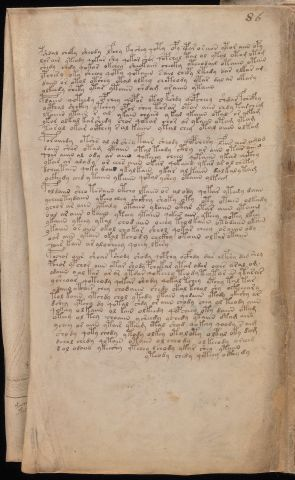

# Voynich Speculative Procedural Protocol — f86v5

IMPORTANT: this is NOT a real or validated translation of the Voynich Manuscript. It is a speculative/procedural model that interprets EVA using a user-defined grammar to generate experimental recipes using safe, known edible substitutes.

This file is generated automatically from IVTFF/EVA transliteration plus a user-defined procedural grammar.



## Page / Folio
- currier: B
- folio: f86v5
- page_number: 172
- section: text only

## EVA Text (Transliteration)
```text
pshdal choky sheody lfchy fyshey qoty opy ypar o raiin ytor aiin opy
losair yteody qokar shy qokar shor qopchol tal ol ytol otam otam
shedy chdy qokar okeeey sheokaiin cheoky oteeodail otaiin otain
ypchesy oky sheeey qoty qotaiin sail chepy ltedy dar olkar am
daiin or otol otshey otal olkey chcthody ytar dal ar okary
olkeedy shety ytar ytaiin shdam araiiin ytaiin
pdaiin qoteedy opchey qopor otol kshdy qopcheey shdar fchcfhy
octhal shckhy otshey opor shey tor ar otar aiin chdy tarcheeg
lkaiiin otain r al ykain chaiin y tal ykaiin otal ar alkam
ykar olkal kar shedy shor qokar chor or ykaiin otam ytam
taral okar octhey sal kaiin ytal chey otal aiiin olkam
poraiiidy otshs al ar shey tair sheody qopchesy lfar air amod
daiin shar otam ytaiin otal teody cthy or aiin otar aiiin
qoar aiiin al ody ar aiin qokeeey cheey qotaiin ykar acthy
ykar ar alody or eees aiin okar qokaiin ykar ar ol chsky
dcheytain qoka daiin ykalkain ykar al kaiin dalkalytam
ockhedy ched y taiin ykaiin qotal yshey otaiin olkam
poldaiin shea teraiin otcho lkaiin os al ody qotar ytedy daiin
ycheeytydaiin ykeeo chey shckhy shoky oty oty otain olkchdy
ychor ar aiin ytaly otaiin ykaiin otal ytar aiin ytaiiil
oar ar aiin okaiin yteey ytaiin qokees aiin yteey qotey lkey
ykaiin ykeey ykal chod aiin oeey teodkaiin otodaiin okain
ykaiin or aiin okol chokar sheol qokar cheey or aiin ody
oar aiin ykain okal kchody chckhy otaiin olkar otaiin
sair kain ar alosheey qoeey lkesy
pochor aiir shoar pshody shody qopchy ocfhdy dar olpshy dam shey
pchor ypchor aiin otar shody pchykar ytar odar oeees aral om
odaiin o al kar ar or ytdar qokeeey teo dy tey tar a[?:n] ytarar
ysheoar qoteody qokar shody qokal tchey ytchy tal tar
odaiin otchees chey chodaiin shedy otal kchol shy olkeeeary
tol kaiin ytchdy chol ytedy ytain qodaiin ytody ykeshy ar
dshey ytchy dy qotal shdy or aiin chody chey ol teody aiin
qokeey ol kaiin ol kain olkeedy qopcheey oty daiin otam
oteey ol tey choaiin ysheedy ychedy ytaiin otam aiin
ychey or aiin ytair ytaim otal shod qokchy qoody s aim
shody qoty chody ytody olkey otoloty oltal oky dam
dchol chedy qotain otaiin ol cheody olkeeody oreeeg
sol odaiin ykeeshy ytchey lchody ykar shey ytaiin
yteody chedy qoteey octhy dy
```

## Domain Context (Heuristic; Not a Translation)

This section summarizes recurring **basewords** in this IVTFF domain and shows simple substring evidence that the token markers used by the procedural grammar occur inside frequent words.

Any Italian anagram / English gloss is a best-effort lexicon match, not a decipherment.


### Associated basewords (non-generic; top by frequency in this domain)
- `daiin` (count=40) → Italian anagram `piani`; English: plans (arrangements)
- `qokar` (count=31) → Italian anagram `carco`; English: [n/a]
- `qokaiin` (count=25) → Italian anagram `ciancio`; English: [n/a]
- `qokal` (count=23) → Italian anagram `calco`; English: cast (of sculpture)
- `ykaiin` (count=15) → Italian anagram `acini`; English: [n/a]
- `okaiin` (count=12) → Italian anagram `coniai`; English: [n/a]
- `qokain` (count=10) → Italian anagram `acconi`; English: [n/a]
- `okain` (count=10) → Italian anagram `acino`; English: a berry
- `saiin` (count=10) → Italian anagram `asini`; English: [n/a]
- `kaiin` (count=9) → Italian anagram `acini`; English: [n/a]
- `odaiin` (count=9) → Italian anagram `inopia`; English: poverty
- `qotaiin` (count=8) → Italian anagram `cationi`; English: [n/a]
- `qotar` (count=8) → Italian anagram `corta`; English: [n/a]
- `qotal` (count=8) → Italian anagram `colta`; English: [n/a]
- `otain` (count=7) → Italian anagram `anito`; English: [n/a]

### Marker evidence (substring in frequent basewords)
- `qo`: 52 basewords; examples: `qokar`, `qokaiin`, `qokal`, `qokeey`, `qoky`, `qokey`
- `q`: 53 basewords; examples: `qokar`, `qokaiin`, `qokal`, `qokeey`, `qoky`, `qokey`
- `o`: 206 basewords; examples: `or`, `ol`, `o`, `qokar`, `chol`, `qokaiin`
- `k`: 119 basewords; examples: `qokar`, `qokaiin`, `qokal`, `okal`, `okar`, `qokeey`
- `t`: 81 basewords; examples: `otal`, `otar`, `otaiin`, `otedy`, `ytaiin`, `otam`
- `p`: 13 basewords; examples: `opchey`, `opchedy`, `pchedy`, `qopchedy`, `opchdy`, `qopchy`
- `ch`: 102 basewords; examples: `chedy`, `chey`, `chol`, `chdy`, `chor`, `chckhy`
- `sh`: 44 basewords; examples: `shedy`, `shey`, `sheey`, `shol`, `sheol`, `shckhy`
- `f`: 1 basewords; examples: `f`
- `cth`: 11 basewords; examples: `chcthy`, `shcthy`, `cthy`, `cthar`, `shecthy`, `chocthy`
- `ckh`: 14 basewords; examples: `chckhy`, `shckhy`, `ckhey`, `qockhy`, `chckhdy`, `checkhy`
- `cph`: 2 basewords; examples: `cphy`, `cphol`
- `dy`: 72 basewords; examples: `shedy`, `chedy`, `dy`, `chdy`, `qokedy`, `okedy`
- `iin`: 35 basewords; examples: `aiin`, `daiin`, `qokaiin`, `ykaiin`, `okaiin`, `otaiin`
- `aiin`: 30 basewords; examples: `aiin`, `daiin`, `qokaiin`, `ykaiin`, `okaiin`, `otaiin`

## Recipes Index (This Page)
- [f86v5.1,@P0](#f86v5-1-f86v5-1-p0)
- [f86v5.2,+P0](#f86v5-2-f86v5-2-p0)
- [f86v5.3,+P0](#f86v5-3-f86v5-3-p0)
- [f86v5.4,+P0](#f86v5-4-f86v5-4-p0)
- [f86v5.5,+P0](#f86v5-5-f86v5-5-p0)
- [f86v5.6,+P0](#f86v5-6-f86v5-6-p0)
- [f86v5.7,+P0](#f86v5-7-f86v5-7-p0)
- [f86v5.8,+P0](#f86v5-8-f86v5-8-p0)
- [f86v5.9,+P0](#f86v5-9-f86v5-9-p0)
- [f86v5.10,+P0](#f86v5-10-f86v5-10-p0)
- [f86v5.11,+P0](#f86v5-11-f86v5-11-p0)
- [f86v5.12,+P0](#f86v5-12-f86v5-12-p0)
- [f86v5.13,+P0](#f86v5-13-f86v5-13-p0)
- [f86v5.14,+P0](#f86v5-14-f86v5-14-p0)
- [f86v5.15,+P0](#f86v5-15-f86v5-15-p0)
- [f86v5.16,+P0](#f86v5-16-f86v5-16-p0)
- [f86v5.17,+P0](#f86v5-17-f86v5-17-p0)
- [f86v5.18,+P0](#f86v5-18-f86v5-18-p0)
- [f86v5.19,+P0](#f86v5-19-f86v5-19-p0)
- [f86v5.20,+P0](#f86v5-20-f86v5-20-p0)
- [f86v5.21,+P0](#f86v5-21-f86v5-21-p0)
- [f86v5.22,+P0](#f86v5-22-f86v5-22-p0)
- [f86v5.23,+P0](#f86v5-23-f86v5-23-p0)
- [f86v5.24,+P0](#f86v5-24-f86v5-24-p0)
- [f86v5.25,+P0](#f86v5-25-f86v5-25-p0)
- [f86v5.26,+P0](#f86v5-26-f86v5-26-p0)
- [f86v5.27,+P0](#f86v5-27-f86v5-27-p0)
- [f86v5.28,+P0](#f86v5-28-f86v5-28-p0)
- [f86v5.29,+P0](#f86v5-29-f86v5-29-p0)
- [f86v5.30,+P0](#f86v5-30-f86v5-30-p0)
- [f86v5.31,+P0](#f86v5-31-f86v5-31-p0)
- [f86v5.32,+P0](#f86v5-32-f86v5-32-p0)
- [f86v5.33,+P0](#f86v5-33-f86v5-33-p0)
- [f86v5.34,+P0](#f86v5-34-f86v5-34-p0)
- [f86v5.35,+P0](#f86v5-35-f86v5-35-p0)
- [f86v5.36,+P0](#f86v5-36-f86v5-36-p0)
- [f86v5.37,+P0](#f86v5-37-f86v5-37-p0)
- [f86v5.38,+P0](#f86v5-38-f86v5-38-p0)
- [f86v5.39,+Pr](#f86v5-39-f86v5-39-pr)

## Line Glosses (Procedural Gloss Only; Not a Translation)

<a id="f86v5-1-f86v5-1-p0"></a>

### f86v5.1,@P0

EVA: pshdal choky sheody lfchy fyshey qoty opy ypar o raiin ytor aiin opy

Direct Gloss (Procedural, Not a Real Translation):
- pshdal: tokens: p sh p a l → connectors: l → vowel_run: a (level 1; class a)
- choky: tokens: ch o k
- sheody: tokens: sh e o p → vowel_run: e (level 1; class e)
- lfchy: tokens: l f ch → connectors: l
- fyshey: tokens: f sh e → vowel_run: e (level 1; class e)
- qoty: tokens: qo t
- opy: tokens: o p
- ypar: tokens: p a r → connectors: r → vowel_run: a (level 1; class a)
- o: tokens: o
- raiin: tokens: r aiin → connectors: r → vowel_run: a (level 1; class a) → suffix: aiin
- ytor: tokens: t o r → connectors: r
- aiin: tokens: aiin → vowel_run: a (level 1; class a) → suffix: aiin
- opy: tokens: o p

<a id="f86v5-2-f86v5-2-p0"></a>

### f86v5.2,+P0

EVA: losair yteody qokar shy qokar shor qopchol tal ol ytol otam otam

Direct Gloss (Procedural, Not a Real Translation):
- losair: tokens: l o s a i r → connectors: l s r → vowel_run: a (level 1; class a)
- yteody: tokens: t e o p → vowel_run: e (level 1; class e)
- qokar: tokens: qo k a r → connectors: r → vowel_run: a (level 1; class a)
- shy: tokens: sh
- qokar: tokens: qo k a r → connectors: r → vowel_run: a (level 1; class a)
- shor: tokens: sh o r → connectors: r
- qopchol: tokens: qo p ch o l → connectors: l
- tal: tokens: t a l → connectors: l → vowel_run: a (level 1; class a)
- ol: tokens: o l → connectors: l
- ytol: tokens: t o l → connectors: l
- otam: tokens: o t a m → connectors: m → vowel_run: a (level 1; class a)
- otam: tokens: o t a m → connectors: m → vowel_run: a (level 1; class a)

<a id="f86v5-3-f86v5-3-p0"></a>

### f86v5.3,+P0

EVA: shedy chdy qokar okeeey sheokaiin cheoky oteeodail otaiin otain

Direct Gloss (Procedural, Not a Real Translation):
- shedy: tokens: sh e p → vowel_run: e (level 1; class e)
- chdy: tokens: ch p
- qokar: tokens: qo k a r → connectors: r → vowel_run: a (level 1; class a)
- okeeey: tokens: o k eee → vowel_run: eee (level 3; class e)
- sheokaiin: tokens: sh e o k aiin → vowel_run: e (level 1; class e) → suffix: aiin
- cheoky: tokens: ch e o k → vowel_run: e (level 1; class e)
- oteeodail: tokens: o t ee o p a i l → connectors: l → vowel_run: ee (level 2; class e)
- otaiin: tokens: o t aiin → vowel_run: a (level 1; class a) → suffix: aiin
- otain: tokens: o t a i n → connectors: n → vowel_run: a (level 1; class a)

<a id="f86v5-4-f86v5-4-p0"></a>

### f86v5.4,+P0

EVA: ypchesy oky sheeey qoty qotaiin sail chepy ltedy dar olkar am

Direct Gloss (Procedural, Not a Real Translation):
- ypchesy: tokens: p ch e s → connectors: s → vowel_run: e (level 1; class e)
- oky: tokens: o k
- sheeey: tokens: sh eee → vowel_run: eee (level 3; class e)
- qoty: tokens: qo t
- qotaiin: tokens: qo t aiin → vowel_run: a (level 1; class a) → suffix: aiin
- sail: tokens: s a i l → connectors: s l → vowel_run: a (level 1; class a)
- chepy: tokens: ch e p → vowel_run: e (level 1; class e)
- ltedy: tokens: l t e p → connectors: l → vowel_run: e (level 1; class e)
- dar: tokens: p a r → connectors: r → vowel_run: a (level 1; class a)
- olkar: tokens: o l k a r → connectors: l r → vowel_run: a (level 1; class a)
- am: tokens: a m → connectors: m → vowel_run: a (level 1; class a)

<a id="f86v5-5-f86v5-5-p0"></a>

### f86v5.5,+P0

EVA: daiin or otol otshey otal olkey chcthody ytar dal ar okary

Direct Gloss (Procedural, Not a Real Translation):
- daiin: tokens: p aiin → vowel_run: a (level 1; class a) → suffix: aiin
- or: tokens: o r → connectors: r
- otol: tokens: o t o l → connectors: l
- otshey: tokens: o t sh e → vowel_run: e (level 1; class e)
- otal: tokens: o t a l → connectors: l → vowel_run: a (level 1; class a)
- olkey: tokens: o l k e → connectors: l → vowel_run: e (level 1; class e)
- chcthody: tokens: ch cth o p
- ytar: tokens: t a r → connectors: r → vowel_run: a (level 1; class a)
- dal: tokens: p a l → connectors: l → vowel_run: a (level 1; class a)
- ar: tokens: a r → connectors: r → vowel_run: a (level 1; class a)
- okary: tokens: o k a r → connectors: r → vowel_run: a (level 1; class a)

<a id="f86v5-6-f86v5-6-p0"></a>

### f86v5.6,+P0

EVA: olkeedy shety ytar ytaiin shdam araiiin ytaiin

Direct Gloss (Procedural, Not a Real Translation):
- olkeedy: tokens: o l k ee p → connectors: l → vowel_run: ee (level 2; class e)
- shety: tokens: sh e t → vowel_run: e (level 1; class e)
- ytar: tokens: t a r → connectors: r → vowel_run: a (level 1; class a)
- ytaiin: tokens: t aiin → vowel_run: a (level 1; class a) → suffix: aiin
- shdam: tokens: sh p a m → connectors: m → vowel_run: a (level 1; class a)
- araiiin: tokens: a r a iii n → connectors: r n → vowel_run: a (level 1; class a) → suffix: iin
- ytaiin: tokens: t aiin → vowel_run: a (level 1; class a) → suffix: aiin

<a id="f86v5-7-f86v5-7-p0"></a>

### f86v5.7,+P0

EVA: pdaiin qoteedy opchey qopor otol kshdy qopcheey shdar fchcfhy

Direct Gloss (Procedural, Not a Real Translation):
- pdaiin: tokens: p p aiin → vowel_run: a (level 1; class a) → suffix: aiin
- qoteedy: tokens: qo t ee p → vowel_run: ee (level 2; class e)
- opchey: tokens: o p ch e → vowel_run: e (level 1; class e)
- qopor: tokens: qo p o r → connectors: r
- otol: tokens: o t o l → connectors: l
- kshdy: tokens: k sh p
- qopcheey: tokens: qo p ch ee → vowel_run: ee (level 2; class e)
- shdar: tokens: sh p a r → connectors: r → vowel_run: a (level 1; class a)
- fchcfhy: tokens: f ch cfh

<a id="f86v5-8-f86v5-8-p0"></a>

### f86v5.8,+P0

EVA: octhal shckhy otshey opor shey tor ar otar aiin chdy tarcheeg

Direct Gloss (Procedural, Not a Real Translation):
- octhal: tokens: o cth a l → connectors: l → vowel_run: a (level 1; class a)
- shckhy: tokens: sh ckh
- otshey: tokens: o t sh e → vowel_run: e (level 1; class e)
- opor: tokens: o p o r → connectors: r
- shey: tokens: sh e → vowel_run: e (level 1; class e)
- tor: tokens: t o r → connectors: r
- ar: tokens: a r → connectors: r → vowel_run: a (level 1; class a)
- otar: tokens: o t a r → connectors: r → vowel_run: a (level 1; class a)
- aiin: tokens: aiin → vowel_run: a (level 1; class a) → suffix: aiin
- chdy: tokens: ch p
- tarcheeg: tokens: t a r ch ee g → connectors: r → vowel_run: a (level 1; class a)

<a id="f86v5-9-f86v5-9-p0"></a>

### f86v5.9,+P0

EVA: lkaiiin otain r al ykain chaiin y tal ykaiin otal ar alkam

Direct Gloss (Procedural, Not a Real Translation):
- lkaiiin: tokens: l k a iii n → connectors: l n → vowel_run: a (level 1; class a) → suffix: iin
- otain: tokens: o t a i n → connectors: n → vowel_run: a (level 1; class a)
- r: tokens: r → connectors: r
- al: tokens: a l → connectors: l → vowel_run: a (level 1; class a)
- ykain: tokens: k a i n → connectors: n → vowel_run: a (level 1; class a)
- chaiin: tokens: ch aiin → vowel_run: a (level 1; class a) → suffix: aiin
- y: [unparsed]
- tal: tokens: t a l → connectors: l → vowel_run: a (level 1; class a)
- ykaiin: tokens: k aiin → vowel_run: a (level 1; class a) → suffix: aiin
- otal: tokens: o t a l → connectors: l → vowel_run: a (level 1; class a)
- ar: tokens: a r → connectors: r → vowel_run: a (level 1; class a)
- alkam: tokens: a l k a m → connectors: l m → vowel_run: a (level 1; class a)

<a id="f86v5-10-f86v5-10-p0"></a>

### f86v5.10,+P0

EVA: ykar olkal kar shedy shor qokar chor or ykaiin otam ytam

Direct Gloss (Procedural, Not a Real Translation):
- ykar: tokens: k a r → connectors: r → vowel_run: a (level 1; class a)
- olkal: tokens: o l k a l → connectors: l l → vowel_run: a (level 1; class a)
- kar: tokens: k a r → connectors: r → vowel_run: a (level 1; class a)
- shedy: tokens: sh e p → vowel_run: e (level 1; class e)
- shor: tokens: sh o r → connectors: r
- qokar: tokens: qo k a r → connectors: r → vowel_run: a (level 1; class a)
- chor: tokens: ch o r → connectors: r
- or: tokens: o r → connectors: r
- ykaiin: tokens: k aiin → vowel_run: a (level 1; class a) → suffix: aiin
- otam: tokens: o t a m → connectors: m → vowel_run: a (level 1; class a)
- ytam: tokens: t a m → connectors: m → vowel_run: a (level 1; class a)

<a id="f86v5-11-f86v5-11-p0"></a>

### f86v5.11,+P0

EVA: taral okar octhey sal kaiin ytal chey otal aiiin olkam

Direct Gloss (Procedural, Not a Real Translation):
- taral: tokens: t a r a l → connectors: r l → vowel_run: a (level 1; class a)
- okar: tokens: o k a r → connectors: r → vowel_run: a (level 1; class a)
- octhey: tokens: o cth e → vowel_run: e (level 1; class e)
- sal: tokens: s a l → connectors: s l → vowel_run: a (level 1; class a)
- kaiin: tokens: k aiin → vowel_run: a (level 1; class a) → suffix: aiin
- ytal: tokens: t a l → connectors: l → vowel_run: a (level 1; class a)
- chey: tokens: ch e → vowel_run: e (level 1; class e)
- otal: tokens: o t a l → connectors: l → vowel_run: a (level 1; class a)
- aiiin: tokens: a iii n → connectors: n → vowel_run: a (level 1; class a) → suffix: iin
- olkam: tokens: o l k a m → connectors: l m → vowel_run: a (level 1; class a)

<a id="f86v5-12-f86v5-12-p0"></a>

### f86v5.12,+P0

EVA: poraiiidy otshs al ar shey tair sheody qopchesy lfar air amod

Direct Gloss (Procedural, Not a Real Translation):
- poraiiidy: tokens: p o r a iii p → connectors: r → vowel_run: a (level 1; class a)
- otshs: tokens: o t sh s → connectors: s
- al: tokens: a l → connectors: l → vowel_run: a (level 1; class a)
- ar: tokens: a r → connectors: r → vowel_run: a (level 1; class a)
- shey: tokens: sh e → vowel_run: e (level 1; class e)
- tair: tokens: t a i r → connectors: r → vowel_run: a (level 1; class a)
- sheody: tokens: sh e o p → vowel_run: e (level 1; class e)
- qopchesy: tokens: qo p ch e s → connectors: s → vowel_run: e (level 1; class e)
- lfar: tokens: l f a r → connectors: l r → vowel_run: a (level 1; class a)
- air: tokens: a i r → connectors: r → vowel_run: a (level 1; class a)
- amod: tokens: a m o p → connectors: m → vowel_run: a (level 1; class a)

<a id="f86v5-13-f86v5-13-p0"></a>

### f86v5.13,+P0

EVA: daiin shar otam ytaiin otal teody cthy or aiin otar aiiin

Direct Gloss (Procedural, Not a Real Translation):
- daiin: tokens: p aiin → vowel_run: a (level 1; class a) → suffix: aiin
- shar: tokens: sh a r → connectors: r → vowel_run: a (level 1; class a)
- otam: tokens: o t a m → connectors: m → vowel_run: a (level 1; class a)
- ytaiin: tokens: t aiin → vowel_run: a (level 1; class a) → suffix: aiin
- otal: tokens: o t a l → connectors: l → vowel_run: a (level 1; class a)
- teody: tokens: t e o p → vowel_run: e (level 1; class e)
- cthy: tokens: cth
- or: tokens: o r → connectors: r
- aiin: tokens: aiin → vowel_run: a (level 1; class a) → suffix: aiin
- otar: tokens: o t a r → connectors: r → vowel_run: a (level 1; class a)
- aiiin: tokens: a iii n → connectors: n → vowel_run: a (level 1; class a) → suffix: iin

<a id="f86v5-14-f86v5-14-p0"></a>

### f86v5.14,+P0

EVA: qoar aiiin al ody ar aiin qokeeey cheey qotaiin ykar acthy

Direct Gloss (Procedural, Not a Real Translation):
- qoar: tokens: qo a r → connectors: r → vowel_run: a (level 1; class a)
- aiiin: tokens: a iii n → connectors: n → vowel_run: a (level 1; class a) → suffix: iin
- al: tokens: a l → connectors: l → vowel_run: a (level 1; class a)
- ody: tokens: o p
- ar: tokens: a r → connectors: r → vowel_run: a (level 1; class a)
- aiin: tokens: aiin → vowel_run: a (level 1; class a) → suffix: aiin
- qokeeey: tokens: qo k eee → vowel_run: eee (level 3; class e)
- cheey: tokens: ch ee → vowel_run: ee (level 2; class e)
- qotaiin: tokens: qo t aiin → vowel_run: a (level 1; class a) → suffix: aiin
- ykar: tokens: k a r → connectors: r → vowel_run: a (level 1; class a)
- acthy: tokens: a cth → vowel_run: a (level 1; class a)

<a id="f86v5-15-f86v5-15-p0"></a>

### f86v5.15,+P0

EVA: ykar ar alody or eees aiin okar qokaiin ykar ar ol chsky

Direct Gloss (Procedural, Not a Real Translation):
- ykar: tokens: k a r → connectors: r → vowel_run: a (level 1; class a)
- ar: tokens: a r → connectors: r → vowel_run: a (level 1; class a)
- alody: tokens: a l o p → connectors: l → vowel_run: a (level 1; class a)
- or: tokens: o r → connectors: r
- eees: tokens: eee s → connectors: s → vowel_run: eee (level 3; class e)
- aiin: tokens: aiin → vowel_run: a (level 1; class a) → suffix: aiin
- okar: tokens: o k a r → connectors: r → vowel_run: a (level 1; class a)
- qokaiin: tokens: qo k aiin → vowel_run: a (level 1; class a) → suffix: aiin
- ykar: tokens: k a r → connectors: r → vowel_run: a (level 1; class a)
- ar: tokens: a r → connectors: r → vowel_run: a (level 1; class a)
- ol: tokens: o l → connectors: l
- chsky: tokens: ch s k → connectors: s

<a id="f86v5-16-f86v5-16-p0"></a>

### f86v5.16,+P0

EVA: dcheytain qoka daiin ykalkain ykar al kaiin dalkalytam

Direct Gloss (Procedural, Not a Real Translation):
- dcheytain: tokens: p ch e t a i n → connectors: n → vowel_run: e (level 1; class e)
- qoka: tokens: qo k a → vowel_run: a (level 1; class a)
- daiin: tokens: p aiin → vowel_run: a (level 1; class a) → suffix: aiin
- ykalkain: tokens: k a l k a i n → connectors: l n → vowel_run: a (level 1; class a)
- ykar: tokens: k a r → connectors: r → vowel_run: a (level 1; class a)
- al: tokens: a l → connectors: l → vowel_run: a (level 1; class a)
- kaiin: tokens: k aiin → vowel_run: a (level 1; class a) → suffix: aiin
- dalkalytam: tokens: p a l k a l t a m → connectors: l l m → vowel_run: a (level 1; class a)

<a id="f86v5-17-f86v5-17-p0"></a>

### f86v5.17,+P0

EVA: ockhedy ched y taiin ykaiin qotal yshey otaiin olkam

Direct Gloss (Procedural, Not a Real Translation):
- ockhedy: tokens: o ckh e p → vowel_run: e (level 1; class e)
- ched: tokens: ch e p → vowel_run: e (level 1; class e)
- y: [unparsed]
- taiin: tokens: t aiin → vowel_run: a (level 1; class a) → suffix: aiin
- ykaiin: tokens: k aiin → vowel_run: a (level 1; class a) → suffix: aiin
- qotal: tokens: qo t a l → connectors: l → vowel_run: a (level 1; class a)
- yshey: tokens: sh e → vowel_run: e (level 1; class e)
- otaiin: tokens: o t aiin → vowel_run: a (level 1; class a) → suffix: aiin
- olkam: tokens: o l k a m → connectors: l m → vowel_run: a (level 1; class a)

<a id="f86v5-18-f86v5-18-p0"></a>

### f86v5.18,+P0

EVA: poldaiin shea teraiin otcho lkaiin os al ody qotar ytedy daiin

Direct Gloss (Procedural, Not a Real Translation):
- poldaiin: tokens: p o l p aiin → connectors: l → vowel_run: a (level 1; class a) → suffix: aiin
- shea: tokens: sh e a → vowel_run: e (level 1; class e)
- teraiin: tokens: t e r aiin → connectors: r → vowel_run: e (level 1; class e) → suffix: aiin
- otcho: tokens: o t ch o
- lkaiin: tokens: l k aiin → connectors: l → vowel_run: a (level 1; class a) → suffix: aiin
- os: tokens: o s → connectors: s
- al: tokens: a l → connectors: l → vowel_run: a (level 1; class a)
- ody: tokens: o p
- qotar: tokens: qo t a r → connectors: r → vowel_run: a (level 1; class a)
- ytedy: tokens: t e p → vowel_run: e (level 1; class e)
- daiin: tokens: p aiin → vowel_run: a (level 1; class a) → suffix: aiin

<a id="f86v5-19-f86v5-19-p0"></a>

### f86v5.19,+P0

EVA: ycheeytydaiin ykeeo chey shckhy shoky oty oty otain olkchdy

Direct Gloss (Procedural, Not a Real Translation):
- ycheeytydaiin: tokens: ch ee t p aiin → vowel_run: ee (level 2; class e) → suffix: aiin
- ykeeo: tokens: k ee o → vowel_run: ee (level 2; class e)
- chey: tokens: ch e → vowel_run: e (level 1; class e)
- shckhy: tokens: sh ckh
- shoky: tokens: sh o k
- oty: tokens: o t
- oty: tokens: o t
- otain: tokens: o t a i n → connectors: n → vowel_run: a (level 1; class a)
- olkchdy: tokens: o l k ch p → connectors: l

<a id="f86v5-20-f86v5-20-p0"></a>

### f86v5.20,+P0

EVA: ychor ar aiin ytaly otaiin ykaiin otal ytar aiin ytaiiil

Direct Gloss (Procedural, Not a Real Translation):
- ychor: tokens: ch o r → connectors: r
- ar: tokens: a r → connectors: r → vowel_run: a (level 1; class a)
- aiin: tokens: aiin → vowel_run: a (level 1; class a) → suffix: aiin
- ytaly: tokens: t a l → connectors: l → vowel_run: a (level 1; class a)
- otaiin: tokens: o t aiin → vowel_run: a (level 1; class a) → suffix: aiin
- ykaiin: tokens: k aiin → vowel_run: a (level 1; class a) → suffix: aiin
- otal: tokens: o t a l → connectors: l → vowel_run: a (level 1; class a)
- ytar: tokens: t a r → connectors: r → vowel_run: a (level 1; class a)
- aiin: tokens: aiin → vowel_run: a (level 1; class a) → suffix: aiin
- ytaiiil: tokens: t a iii l → connectors: l → vowel_run: a (level 1; class a)

<a id="f86v5-21-f86v5-21-p0"></a>

### f86v5.21,+P0

EVA: oar ar aiin okaiin yteey ytaiin qokees aiin yteey qotey lkey

Direct Gloss (Procedural, Not a Real Translation):
- oar: tokens: o a r → connectors: r → vowel_run: a (level 1; class a)
- ar: tokens: a r → connectors: r → vowel_run: a (level 1; class a)
- aiin: tokens: aiin → vowel_run: a (level 1; class a) → suffix: aiin
- okaiin: tokens: o k aiin → vowel_run: a (level 1; class a) → suffix: aiin
- yteey: tokens: t ee → vowel_run: ee (level 2; class e)
- ytaiin: tokens: t aiin → vowel_run: a (level 1; class a) → suffix: aiin
- qokees: tokens: qo k ee s → connectors: s → vowel_run: ee (level 2; class e)
- aiin: tokens: aiin → vowel_run: a (level 1; class a) → suffix: aiin
- yteey: tokens: t ee → vowel_run: ee (level 2; class e)
- qotey: tokens: qo t e → vowel_run: e (level 1; class e)
- lkey: tokens: l k e → connectors: l → vowel_run: e (level 1; class e)

<a id="f86v5-22-f86v5-22-p0"></a>

### f86v5.22,+P0

EVA: ykaiin ykeey ykal chod aiin oeey teodkaiin otodaiin okain

Direct Gloss (Procedural, Not a Real Translation):
- ykaiin: tokens: k aiin → vowel_run: a (level 1; class a) → suffix: aiin
- ykeey: tokens: k ee → vowel_run: ee (level 2; class e)
- ykal: tokens: k a l → connectors: l → vowel_run: a (level 1; class a)
- chod: tokens: ch o p
- aiin: tokens: aiin → vowel_run: a (level 1; class a) → suffix: aiin
- oeey: tokens: o ee → vowel_run: ee (level 2; class e)
- teodkaiin: tokens: t e o p k aiin → vowel_run: e (level 1; class e) → suffix: aiin
- otodaiin: tokens: o t o p aiin → vowel_run: a (level 1; class a) → suffix: aiin
- okain: tokens: o k a i n → connectors: n → vowel_run: a (level 1; class a)

<a id="f86v5-23-f86v5-23-p0"></a>

### f86v5.23,+P0

EVA: ykaiin or aiin okol chokar sheol qokar cheey or aiin ody

Direct Gloss (Procedural, Not a Real Translation):
- ykaiin: tokens: k aiin → vowel_run: a (level 1; class a) → suffix: aiin
- or: tokens: o r → connectors: r
- aiin: tokens: aiin → vowel_run: a (level 1; class a) → suffix: aiin
- okol: tokens: o k o l → connectors: l
- chokar: tokens: ch o k a r → connectors: r → vowel_run: a (level 1; class a)
- sheol: tokens: sh e o l → connectors: l → vowel_run: e (level 1; class e)
- qokar: tokens: qo k a r → connectors: r → vowel_run: a (level 1; class a)
- cheey: tokens: ch ee → vowel_run: ee (level 2; class e)
- or: tokens: o r → connectors: r
- aiin: tokens: aiin → vowel_run: a (level 1; class a) → suffix: aiin
- ody: tokens: o p

<a id="f86v5-24-f86v5-24-p0"></a>

### f86v5.24,+P0

EVA: oar aiin ykain okal kchody chckhy otaiin olkar otaiin

Direct Gloss (Procedural, Not a Real Translation):
- oar: tokens: o a r → connectors: r → vowel_run: a (level 1; class a)
- aiin: tokens: aiin → vowel_run: a (level 1; class a) → suffix: aiin
- ykain: tokens: k a i n → connectors: n → vowel_run: a (level 1; class a)
- okal: tokens: o k a l → connectors: l → vowel_run: a (level 1; class a)
- kchody: tokens: k ch o p
- chckhy: tokens: ch ckh
- otaiin: tokens: o t aiin → vowel_run: a (level 1; class a) → suffix: aiin
- olkar: tokens: o l k a r → connectors: l r → vowel_run: a (level 1; class a)
- otaiin: tokens: o t aiin → vowel_run: a (level 1; class a) → suffix: aiin

<a id="f86v5-25-f86v5-25-p0"></a>

### f86v5.25,+P0

EVA: sair kain ar alosheey qoeey lkesy

Direct Gloss (Procedural, Not a Real Translation):
- sair: tokens: s a i r → connectors: s r → vowel_run: a (level 1; class a)
- kain: tokens: k a i n → connectors: n → vowel_run: a (level 1; class a)
- ar: tokens: a r → connectors: r → vowel_run: a (level 1; class a)
- alosheey: tokens: a l o sh ee → connectors: l → vowel_run: a (level 1; class a)
- qoeey: tokens: qo ee → vowel_run: ee (level 2; class e)
- lkesy: tokens: l k e s → connectors: l s → vowel_run: e (level 1; class e)

<a id="f86v5-26-f86v5-26-p0"></a>

### f86v5.26,+P0

EVA: pochor aiir shoar pshody shody qopchy ocfhdy dar olpshy dam shey

Direct Gloss (Procedural, Not a Real Translation):
- pochor: tokens: p o ch o r → connectors: r
- aiir: tokens: a ii r → connectors: r → vowel_run: a (level 1; class a)
- shoar: tokens: sh o a r → connectors: r → vowel_run: a (level 1; class a)
- pshody: tokens: p sh o p
- shody: tokens: sh o p
- qopchy: tokens: qo p ch
- ocfhdy: tokens: o cfh p
- dar: tokens: p a r → connectors: r → vowel_run: a (level 1; class a)
- olpshy: tokens: o l p sh → connectors: l
- dam: tokens: p a m → connectors: m → vowel_run: a (level 1; class a)
- shey: tokens: sh e → vowel_run: e (level 1; class e)

<a id="f86v5-27-f86v5-27-p0"></a>

### f86v5.27,+P0

EVA: pchor ypchor aiin otar shody pchykar ytar odar oeees aral om

Direct Gloss (Procedural, Not a Real Translation):
- pchor: tokens: p ch o r → connectors: r
- ypchor: tokens: p ch o r → connectors: r
- aiin: tokens: aiin → vowel_run: a (level 1; class a) → suffix: aiin
- otar: tokens: o t a r → connectors: r → vowel_run: a (level 1; class a)
- shody: tokens: sh o p
- pchykar: tokens: p ch k a r → connectors: r → vowel_run: a (level 1; class a)
- ytar: tokens: t a r → connectors: r → vowel_run: a (level 1; class a)
- odar: tokens: o p a r → connectors: r → vowel_run: a (level 1; class a)
- oeees: tokens: o eee s → connectors: s → vowel_run: eee (level 3; class e)
- aral: tokens: a r a l → connectors: r l → vowel_run: a (level 1; class a)
- om: tokens: o m → connectors: m

<a id="f86v5-28-f86v5-28-p0"></a>

### f86v5.28,+P0

EVA: odaiin o al kar ar or ytdar qokeeey teo dy tey tar a[?:n] ytarar

Direct Gloss (Procedural, Not a Real Translation):
- odaiin: tokens: o p aiin → vowel_run: a (level 1; class a) → suffix: aiin
- o: tokens: o
- al: tokens: a l → connectors: l → vowel_run: a (level 1; class a)
- kar: tokens: k a r → connectors: r → vowel_run: a (level 1; class a)
- ar: tokens: a r → connectors: r → vowel_run: a (level 1; class a)
- or: tokens: o r → connectors: r
- ytdar: tokens: t p a r → connectors: r → vowel_run: a (level 1; class a)
- qokeeey: tokens: qo k eee → vowel_run: eee (level 3; class e)
- teo: tokens: t e o → vowel_run: e (level 1; class e)
- dy: tokens: p
- tey: tokens: t e → vowel_run: e (level 1; class e)
- tar: tokens: t a r → connectors: r → vowel_run: a (level 1; class a)
- a: tokens: a → vowel_run: a (level 1; class a)
- n: tokens: n → connectors: n
- ytarar: tokens: t a r a r → connectors: r r → vowel_run: a (level 1; class a)

<a id="f86v5-29-f86v5-29-p0"></a>

### f86v5.29,+P0

EVA: ysheoar qoteody qokar shody qokal tchey ytchy tal tar

Direct Gloss (Procedural, Not a Real Translation):
- ysheoar: tokens: sh e o a r → connectors: r → vowel_run: e (level 1; class e)
- qoteody: tokens: qo t e o p → vowel_run: e (level 1; class e)
- qokar: tokens: qo k a r → connectors: r → vowel_run: a (level 1; class a)
- shody: tokens: sh o p
- qokal: tokens: qo k a l → connectors: l → vowel_run: a (level 1; class a)
- tchey: tokens: t ch e → vowel_run: e (level 1; class e)
- ytchy: tokens: t ch
- tal: tokens: t a l → connectors: l → vowel_run: a (level 1; class a)
- tar: tokens: t a r → connectors: r → vowel_run: a (level 1; class a)

<a id="f86v5-30-f86v5-30-p0"></a>

### f86v5.30,+P0

EVA: odaiin otchees chey chodaiin shedy otal kchol shy olkeeeary

Direct Gloss (Procedural, Not a Real Translation):
- odaiin: tokens: o p aiin → vowel_run: a (level 1; class a) → suffix: aiin
- otchees: tokens: o t ch ee s → connectors: s → vowel_run: ee (level 2; class e)
- chey: tokens: ch e → vowel_run: e (level 1; class e)
- chodaiin: tokens: ch o p aiin → vowel_run: a (level 1; class a) → suffix: aiin
- shedy: tokens: sh e p → vowel_run: e (level 1; class e)
- otal: tokens: o t a l → connectors: l → vowel_run: a (level 1; class a)
- kchol: tokens: k ch o l → connectors: l
- shy: tokens: sh
- olkeeeary: tokens: o l k eee a r → connectors: l r → vowel_run: eee (level 3; class e)

<a id="f86v5-31-f86v5-31-p0"></a>

### f86v5.31,+P0

EVA: tol kaiin ytchdy chol ytedy ytain qodaiin ytody ykeshy ar

Direct Gloss (Procedural, Not a Real Translation):
- tol: tokens: t o l → connectors: l
- kaiin: tokens: k aiin → vowel_run: a (level 1; class a) → suffix: aiin
- ytchdy: tokens: t ch p
- chol: tokens: ch o l → connectors: l
- ytedy: tokens: t e p → vowel_run: e (level 1; class e)
- ytain: tokens: t a i n → connectors: n → vowel_run: a (level 1; class a)
- qodaiin: tokens: qo p aiin → vowel_run: a (level 1; class a) → suffix: aiin
- ytody: tokens: t o p
- ykeshy: tokens: k e sh → vowel_run: e (level 1; class e)
- ar: tokens: a r → connectors: r → vowel_run: a (level 1; class a)

<a id="f86v5-32-f86v5-32-p0"></a>

### f86v5.32,+P0

EVA: dshey ytchy dy qotal shdy or aiin chody chey ol teody aiin

Direct Gloss (Procedural, Not a Real Translation):
- dshey: tokens: p sh e → vowel_run: e (level 1; class e)
- ytchy: tokens: t ch
- dy: tokens: p
- qotal: tokens: qo t a l → connectors: l → vowel_run: a (level 1; class a)
- shdy: tokens: sh p
- or: tokens: o r → connectors: r
- aiin: tokens: aiin → vowel_run: a (level 1; class a) → suffix: aiin
- chody: tokens: ch o p
- chey: tokens: ch e → vowel_run: e (level 1; class e)
- ol: tokens: o l → connectors: l
- teody: tokens: t e o p → vowel_run: e (level 1; class e)
- aiin: tokens: aiin → vowel_run: a (level 1; class a) → suffix: aiin

<a id="f86v5-33-f86v5-33-p0"></a>

### f86v5.33,+P0

EVA: qokeey ol kaiin ol kain olkeedy qopcheey oty daiin otam

Direct Gloss (Procedural, Not a Real Translation):
- qokeey: tokens: qo k ee → vowel_run: ee (level 2; class e)
- ol: tokens: o l → connectors: l
- kaiin: tokens: k aiin → vowel_run: a (level 1; class a) → suffix: aiin
- ol: tokens: o l → connectors: l
- kain: tokens: k a i n → connectors: n → vowel_run: a (level 1; class a)
- olkeedy: tokens: o l k ee p → connectors: l → vowel_run: ee (level 2; class e)
- qopcheey: tokens: qo p ch ee → vowel_run: ee (level 2; class e)
- oty: tokens: o t
- daiin: tokens: p aiin → vowel_run: a (level 1; class a) → suffix: aiin
- otam: tokens: o t a m → connectors: m → vowel_run: a (level 1; class a)

<a id="f86v5-34-f86v5-34-p0"></a>

### f86v5.34,+P0

EVA: oteey ol tey choaiin ysheedy ychedy ytaiin otam aiin

Direct Gloss (Procedural, Not a Real Translation):
- oteey: tokens: o t ee → vowel_run: ee (level 2; class e)
- ol: tokens: o l → connectors: l
- tey: tokens: t e → vowel_run: e (level 1; class e)
- choaiin: tokens: ch o aiin → vowel_run: a (level 1; class a) → suffix: aiin
- ysheedy: tokens: sh ee p → vowel_run: ee (level 2; class e)
- ychedy: tokens: ch e p → vowel_run: e (level 1; class e)
- ytaiin: tokens: t aiin → vowel_run: a (level 1; class a) → suffix: aiin
- otam: tokens: o t a m → connectors: m → vowel_run: a (level 1; class a)
- aiin: tokens: aiin → vowel_run: a (level 1; class a) → suffix: aiin

<a id="f86v5-35-f86v5-35-p0"></a>

### f86v5.35,+P0

EVA: ychey or aiin ytair ytaim otal shod qokchy qoody s aim

Direct Gloss (Procedural, Not a Real Translation):
- ychey: tokens: ch e → vowel_run: e (level 1; class e)
- or: tokens: o r → connectors: r
- aiin: tokens: aiin → vowel_run: a (level 1; class a) → suffix: aiin
- ytair: tokens: t a i r → connectors: r → vowel_run: a (level 1; class a)
- ytaim: tokens: t a i m → connectors: m → vowel_run: a (level 1; class a)
- otal: tokens: o t a l → connectors: l → vowel_run: a (level 1; class a)
- shod: tokens: sh o p
- qokchy: tokens: qo k ch
- qoody: tokens: qo o p
- s: tokens: s → connectors: s
- aim: tokens: a i m → connectors: m → vowel_run: a (level 1; class a)

<a id="f86v5-36-f86v5-36-p0"></a>

### f86v5.36,+P0

EVA: shody qoty chody ytody olkey otoloty oltal oky dam

Direct Gloss (Procedural, Not a Real Translation):
- shody: tokens: sh o p
- qoty: tokens: qo t
- chody: tokens: ch o p
- ytody: tokens: t o p
- olkey: tokens: o l k e → connectors: l → vowel_run: e (level 1; class e)
- otoloty: tokens: o t o l o t → connectors: l
- oltal: tokens: o l t a l → connectors: l l → vowel_run: a (level 1; class a)
- oky: tokens: o k
- dam: tokens: p a m → connectors: m → vowel_run: a (level 1; class a)

<a id="f86v5-37-f86v5-37-p0"></a>

### f86v5.37,+P0

EVA: dchol chedy qotain otaiin ol cheody olkeeody oreeeg

Direct Gloss (Procedural, Not a Real Translation):
- dchol: tokens: p ch o l → connectors: l
- chedy: tokens: ch e p → vowel_run: e (level 1; class e)
- qotain: tokens: qo t a i n → connectors: n → vowel_run: a (level 1; class a)
- otaiin: tokens: o t aiin → vowel_run: a (level 1; class a) → suffix: aiin
- ol: tokens: o l → connectors: l
- cheody: tokens: ch e o p → vowel_run: e (level 1; class e)
- olkeeody: tokens: o l k ee o p → connectors: l → vowel_run: ee (level 2; class e)
- oreeeg: tokens: o r eee g → connectors: r → vowel_run: eee (level 3; class e)

<a id="f86v5-38-f86v5-38-p0"></a>

### f86v5.38,+P0

EVA: sol odaiin ykeeshy ytchey lchody ykar shey ytaiin

Direct Gloss (Procedural, Not a Real Translation):
- sol: tokens: s o l → connectors: s l
- odaiin: tokens: o p aiin → vowel_run: a (level 1; class a) → suffix: aiin
- ykeeshy: tokens: k ee sh → vowel_run: ee (level 2; class e)
- ytchey: tokens: t ch e → vowel_run: e (level 1; class e)
- lchody: tokens: l ch o p → connectors: l
- ykar: tokens: k a r → connectors: r → vowel_run: a (level 1; class a)
- shey: tokens: sh e → vowel_run: e (level 1; class e)
- ytaiin: tokens: t aiin → vowel_run: a (level 1; class a) → suffix: aiin

<a id="f86v5-39-f86v5-39-pr"></a>

### f86v5.39,+Pr

EVA: yteody chedy qoteey octhy dy

Direct Gloss (Procedural, Not a Real Translation):
- yteody: tokens: t e o p → vowel_run: e (level 1; class e)
- chedy: tokens: ch e p → vowel_run: e (level 1; class e)
- qoteey: tokens: qo t ee → vowel_run: ee (level 2; class e)
- octhy: tokens: o cth
- dy: tokens: p
