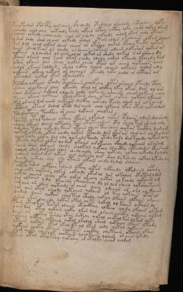

# Voynich Speculative Procedural Protocol — f86v6

IMPORTANT: this is NOT a real or validated translation of the Voynich Manuscript. It is a speculative/procedural model that interprets EVA using a user-defined grammar to generate experimental recipes using safe, known edible substitutes.

This file is generated automatically from IVTFF/EVA transliteration plus a user-defined procedural grammar.



## Page / Folio
- currier: B
- folio: f86v6
- page_number: 169
- section: text only

## EVA Text (Transliteration)
```text
pcheypchdar op[o:a]rc@179;hy ches aiin ofy chedy otedalol orairody qotchdaiin qopy
ochody chol chey qotchdy kchdy qopchd chpchy qopchy qoky chedy qokol lray
qolchy olkeedy chdal chedy chor ar arody qokchdy chdal okar chdy otaiin
dshor shdy shor ol aiin olkeedy shdal oteor chdar l karchees olkar dalam
tar lol chol olkar daiin chear or otshey qokar opchey taiky qotar
daiin sheol keear or chedy ar sheeeb qotain odaiin olkeshar qokar or
qokaiin y lchedor or aiin ol or olkal or shedy qokal s ar archey dy
ykaiin odaiin chal sair ytar chody ldaly chdal ykchedy ltchedy dar
dshor ykaiin dar sheey qokol cheol otar ar aiiin qoteeos aiin
sarar ykaiin soldam sheol qckhy dalor olaiin olkaiin qodar o@185;y
qokaiin olkeey qokeor or cheeaiin yteedy qoko lchdol or chcphar ar
ykeealor qokal otar ykairolky
c@132;holc@133;hy qopaiin yfchdy cpholkaiin cholfchy qopar aroiiin opchedy opoly
ykchy cholkaiin chey ykeedy okal or chcfhy lkey okar dar ol a[in:iin]
shol shotaiin shckhor olaiin chdy qokain odaiiin cheor ol kaiin chey
taiin okaiin qokaiin ykeey otain chey okam qokar qokain okaiin
par or aiin dar aiiin qckhear shoifhy qotedy opchdy olain ar alkar am
ytaiin ytair dalol ytal dar aiiin chol olkchey lkar otal qotardam
pol sheopchey pchecfhey or aiiin qokaiin cholkar
pdaiiiy otol podaiin ocphey opchor olkshed qofod opdaiin [o:a]dar dairody
oreeey lkeeor daiin olteody tar otyteeodaiin yty sheey tar ar am ody
lshechy tshy qokeedy kain ytaiin chees tairoar qotar taikhy d amom
qokar olkedy otor chedy qokar opchedy dar ykar ar dair ain ol keodar
chey keody choty dal ody qokeedy pchedy ytsh[y:q] tody dal tchedy qokar oly
yteedy qokar olkar qodar ykaiin or okeeeey ofchedy qokaiin araram
saiin shor shekaiin chedy cholkeog qokchy orchcthy olteedydar otar aim
alshdr lkar dal kshd shdar shedy qody sheey qotedy olkeey qokchdy ramshy
qokaiin qokar okar qotar lor qokchdy dar shey d y tshedy qotol dytshy dy
dchedy chcthdy shol oky ytaiin ykaiin chedy dy dal shdaiin
polkeey tshed qopchey paroiin chefchy qopar qopchedy qopydaiin qopary
dair chepy qokaiin olkar olkchdy okar al dar olkchey otytam orom
qokeey qoeear chsey oky qokar or chey qotar ol kchedy qokaiin am
dar olkaiin ydy lkchedy okeeeykeey dl ld lo l sheey qokshey taiin g
soraiin ar shey qoteody or aiiin oeey ldaiiin or oro ol kaiiin
sar aiin otar cheody qotaiin qokaiin ol tey qokaiin okar ol
dairal daiin qokar chol tal cthdy qokeey lkaiin olkaiin araiin
lshar [o:y]kar qoeedy qotar otal olky qokal ol kaiin octhear lo
poiin otal kal toror olaiin okeockhey olkeey qoedy lkaiin oltam
y aiin dar otol qokain qoky lkor dal oraiin cheoty qotaiin olkam
daiin ar qotal tshdy otar shcthdy qokol chotal kar ol kar alky
qokaiin octhy oltchey qotal lkalol sheol qotaiin ytain ytody
otaiin qokain otal otal lt al lkar chdy qotol qokain
qokaiin choty ytaiin chokain chocthy chy taiin okaiin okan
shor qoky chorolk chokaiin qoal kaiin qoaiin or aiiin ykedy
paiin otar otolkshy qokshey ar otalky chear ai[o:a]dam
```

## Domain Context (Heuristic; Not a Translation)

This section summarizes recurring **basewords** in this IVTFF domain and shows simple substring evidence that the token markers used by the procedural grammar occur inside frequent words.

Any Italian anagram / English gloss is a best-effort lexicon match, not a decipherment.


### Associated basewords (non-generic; top by frequency in this domain)
- `daiin` (count=40) → Italian anagram `piani`; English: plans (arrangements)
- `qokar` (count=31) → Italian anagram `carco`; English: [n/a]
- `qokaiin` (count=25) → Italian anagram `ciancio`; English: [n/a]
- `qokal` (count=23) → Italian anagram `calco`; English: cast (of sculpture)
- `ykaiin` (count=15) → Italian anagram `acini`; English: [n/a]
- `okaiin` (count=12) → Italian anagram `coniai`; English: [n/a]
- `qokain` (count=10) → Italian anagram `acconi`; English: [n/a]
- `okain` (count=10) → Italian anagram `acino`; English: a berry
- `saiin` (count=10) → Italian anagram `asini`; English: [n/a]
- `kaiin` (count=9) → Italian anagram `acini`; English: [n/a]
- `odaiin` (count=9) → Italian anagram `inopia`; English: poverty
- `qotaiin` (count=8) → Italian anagram `cationi`; English: [n/a]
- `qotar` (count=8) → Italian anagram `corta`; English: [n/a]
- `qotal` (count=8) → Italian anagram `colta`; English: [n/a]
- `otain` (count=7) → Italian anagram `anito`; English: [n/a]

### Marker evidence (substring in frequent basewords)
- `qo`: 52 basewords; examples: `qokar`, `qokaiin`, `qokal`, `qokeey`, `qoky`, `qokey`
- `q`: 53 basewords; examples: `qokar`, `qokaiin`, `qokal`, `qokeey`, `qoky`, `qokey`
- `o`: 206 basewords; examples: `or`, `ol`, `o`, `qokar`, `chol`, `qokaiin`
- `k`: 119 basewords; examples: `qokar`, `qokaiin`, `qokal`, `okal`, `okar`, `qokeey`
- `t`: 81 basewords; examples: `otal`, `otar`, `otaiin`, `otedy`, `ytaiin`, `otam`
- `p`: 13 basewords; examples: `opchey`, `opchedy`, `pchedy`, `qopchedy`, `opchdy`, `qopchy`
- `ch`: 102 basewords; examples: `chedy`, `chey`, `chol`, `chdy`, `chor`, `chckhy`
- `sh`: 44 basewords; examples: `shedy`, `shey`, `sheey`, `shol`, `sheol`, `shckhy`
- `f`: 1 basewords; examples: `f`
- `cth`: 11 basewords; examples: `chcthy`, `shcthy`, `cthy`, `cthar`, `shecthy`, `chocthy`
- `ckh`: 14 basewords; examples: `chckhy`, `shckhy`, `ckhey`, `qockhy`, `chckhdy`, `checkhy`
- `cph`: 2 basewords; examples: `cphy`, `cphol`
- `dy`: 72 basewords; examples: `shedy`, `chedy`, `dy`, `chdy`, `qokedy`, `okedy`
- `iin`: 35 basewords; examples: `aiin`, `daiin`, `qokaiin`, `ykaiin`, `okaiin`, `otaiin`
- `aiin`: 30 basewords; examples: `aiin`, `daiin`, `qokaiin`, `ykaiin`, `okaiin`, `otaiin`

## Recipes Index (This Page)
- [f86v6.1,@P0](#f86v6-1-f86v6-1-p0)
- [f86v6.2,+P0](#f86v6-2-f86v6-2-p0)
- [f86v6.3,+P0](#f86v6-3-f86v6-3-p0)
- [f86v6.4,+P0](#f86v6-4-f86v6-4-p0)
- [f86v6.5,+P0](#f86v6-5-f86v6-5-p0)
- [f86v6.6,+P0](#f86v6-6-f86v6-6-p0)
- [f86v6.7,+P0](#f86v6-7-f86v6-7-p0)
- [f86v6.8,+P0](#f86v6-8-f86v6-8-p0)
- [f86v6.9,+P0](#f86v6-9-f86v6-9-p0)
- [f86v6.10,+P0](#f86v6-10-f86v6-10-p0)
- [f86v6.11,+P0](#f86v6-11-f86v6-11-p0)
- [f86v6.12,+P0](#f86v6-12-f86v6-12-p0)
- [f86v6.13,+P0](#f86v6-13-f86v6-13-p0)
- [f86v6.14,+P0](#f86v6-14-f86v6-14-p0)
- [f86v6.15,+P0](#f86v6-15-f86v6-15-p0)
- [f86v6.16,+P0](#f86v6-16-f86v6-16-p0)
- [f86v6.17,+P0](#f86v6-17-f86v6-17-p0)
- [f86v6.18,+P0](#f86v6-18-f86v6-18-p0)
- [f86v6.19,+P0](#f86v6-19-f86v6-19-p0)
- [f86v6.20,+P0](#f86v6-20-f86v6-20-p0)
- [f86v6.21,+P0](#f86v6-21-f86v6-21-p0)
- [f86v6.22,+P0](#f86v6-22-f86v6-22-p0)
- [f86v6.23,+P0](#f86v6-23-f86v6-23-p0)
- [f86v6.24,+P0](#f86v6-24-f86v6-24-p0)
- [f86v6.25,+P0](#f86v6-25-f86v6-25-p0)
- [f86v6.26,+P0](#f86v6-26-f86v6-26-p0)
- [f86v6.27,+P0](#f86v6-27-f86v6-27-p0)
- [f86v6.28,+P0](#f86v6-28-f86v6-28-p0)
- [f86v6.29,+P0](#f86v6-29-f86v6-29-p0)
- [f86v6.30,+P0](#f86v6-30-f86v6-30-p0)
- [f86v6.31,+P0](#f86v6-31-f86v6-31-p0)
- [f86v6.32,+P0](#f86v6-32-f86v6-32-p0)
- [f86v6.33,+P0](#f86v6-33-f86v6-33-p0)
- [f86v6.34,+P0](#f86v6-34-f86v6-34-p0)
- [f86v6.35,+P0](#f86v6-35-f86v6-35-p0)
- [f86v6.36,+P0](#f86v6-36-f86v6-36-p0)
- [f86v6.37,+P0](#f86v6-37-f86v6-37-p0)
- [f86v6.38,+P0](#f86v6-38-f86v6-38-p0)
- [f86v6.39,+P0](#f86v6-39-f86v6-39-p0)
- [f86v6.40,+P0](#f86v6-40-f86v6-40-p0)
- [f86v6.41,+P0](#f86v6-41-f86v6-41-p0)
- [f86v6.42,+P0](#f86v6-42-f86v6-42-p0)
- [f86v6.43,+P0](#f86v6-43-f86v6-43-p0)
- [f86v6.44,+P0](#f86v6-44-f86v6-44-p0)
- [f86v6.45,+P0](#f86v6-45-f86v6-45-p0)

## Line Glosses (Procedural Gloss Only; Not a Translation)

<a id="f86v6-1-f86v6-1-p0"></a>

### f86v6.1,@P0

EVA: pcheypchdar op[o:a]rc@179;hy ches aiin ofy chedy otedalol orairody qotchdaiin qopy

Direct Gloss (Procedural, Not a Real Translation):
- pcheypchdar: tokens: p ch e p ch p a r → connectors: r → vowel_run: e (level 1; class e)
- op: tokens: o p
- o: tokens: o
- a: tokens: a → vowel_run: a (level 1; class a)
- rc: tokens: r c → connectors: r
- hy: tokens: h → unmodeled_tokens: h
- ches: tokens: ch e s → connectors: s → vowel_run: e (level 1; class e)
- aiin: tokens: aiin → vowel_run: a (level 1; class a) → suffix: aiin
- ofy: tokens: o f
- chedy: tokens: ch e p → vowel_run: e (level 1; class e)
- otedalol: tokens: o t e p a l o l → connectors: l l → vowel_run: e (level 1; class e)
- orairody: tokens: o r a i r o p → connectors: r r → vowel_run: a (level 1; class a)
- qotchdaiin: tokens: qo t ch p aiin → vowel_run: a (level 1; class a) → suffix: aiin (lexicon-context: `daiin` → `piani`; plans (arrangements))
- qopy: tokens: qo p

<a id="f86v6-2-f86v6-2-p0"></a>

### f86v6.2,+P0

EVA: ochody chol chey qotchdy kchdy qopchd chpchy qopchy qoky chedy qokol lray

Direct Gloss (Procedural, Not a Real Translation):
- ochody: tokens: o ch o p
- chol: tokens: ch o l → connectors: l
- chey: tokens: ch e → vowel_run: e (level 1; class e)
- qotchdy: tokens: qo t ch p
- kchdy: tokens: k ch p
- qopchd: tokens: qo p ch p
- chpchy: tokens: ch p ch
- qopchy: tokens: qo p ch
- qoky: tokens: qo k
- chedy: tokens: ch e p → vowel_run: e (level 1; class e)
- qokol: tokens: qo k o l → connectors: l
- lray: tokens: l r a → connectors: l r → vowel_run: a (level 1; class a)

<a id="f86v6-3-f86v6-3-p0"></a>

### f86v6.3,+P0

EVA: qolchy olkeedy chdal chedy chor ar arody qokchdy chdal okar chdy otaiin

Direct Gloss (Procedural, Not a Real Translation):
- qolchy: tokens: qo l ch → connectors: l
- olkeedy: tokens: o l k ee p → connectors: l → vowel_run: ee (level 2; class e)
- chdal: tokens: ch p a l → connectors: l → vowel_run: a (level 1; class a)
- chedy: tokens: ch e p → vowel_run: e (level 1; class e)
- chor: tokens: ch o r → connectors: r
- ar: tokens: a r → connectors: r → vowel_run: a (level 1; class a)
- arody: tokens: a r o p → connectors: r → vowel_run: a (level 1; class a)
- qokchdy: tokens: qo k ch p
- chdal: tokens: ch p a l → connectors: l → vowel_run: a (level 1; class a)
- okar: tokens: o k a r → connectors: r → vowel_run: a (level 1; class a)
- chdy: tokens: ch p
- otaiin: tokens: o t aiin → vowel_run: a (level 1; class a) → suffix: aiin

<a id="f86v6-4-f86v6-4-p0"></a>

### f86v6.4,+P0

EVA: dshor shdy shor ol aiin olkeedy shdal oteor chdar l karchees olkar dalam

Direct Gloss (Procedural, Not a Real Translation):
- dshor: tokens: p sh o r → connectors: r
- shdy: tokens: sh p
- shor: tokens: sh o r → connectors: r
- ol: tokens: o l → connectors: l
- aiin: tokens: aiin → vowel_run: a (level 1; class a) → suffix: aiin
- olkeedy: tokens: o l k ee p → connectors: l → vowel_run: ee (level 2; class e)
- shdal: tokens: sh p a l → connectors: l → vowel_run: a (level 1; class a)
- oteor: tokens: o t e o r → connectors: r → vowel_run: e (level 1; class e)
- chdar: tokens: ch p a r → connectors: r → vowel_run: a (level 1; class a)
- l: tokens: l → connectors: l
- karchees: tokens: k a r ch ee s → connectors: r s → vowel_run: a (level 1; class a)
- olkar: tokens: o l k a r → connectors: l r → vowel_run: a (level 1; class a) (lexicon-context: `olkar` → `carlo`; [n/a])
- dalam: tokens: p a l a m → connectors: l m → vowel_run: a (level 1; class a)

<a id="f86v6-5-f86v6-5-p0"></a>

### f86v6.5,+P0

EVA: tar lol chol olkar daiin chear or otshey qokar opchey taiky qotar

Direct Gloss (Procedural, Not a Real Translation):
- tar: tokens: t a r → connectors: r → vowel_run: a (level 1; class a)
- lol: tokens: l o l → connectors: l l
- chol: tokens: ch o l → connectors: l
- olkar: tokens: o l k a r → connectors: l r → vowel_run: a (level 1; class a) (lexicon-context: `olkar` → `carlo`; [n/a])
- daiin: tokens: p aiin → vowel_run: a (level 1; class a) → suffix: aiin (lexicon-context: `daiin` → `piani`; plans (arrangements))
- chear: tokens: ch e a r → connectors: r → vowel_run: e (level 1; class e)
- or: tokens: o r → connectors: r
- otshey: tokens: o t sh e → vowel_run: e (level 1; class e)
- qokar: tokens: qo k a r → connectors: r → vowel_run: a (level 1; class a) (lexicon-context: `qokar` → `carco`; [n/a])
- opchey: tokens: o p ch e → vowel_run: e (level 1; class e)
- taiky: tokens: t a i k → vowel_run: a (level 1; class a)
- qotar: tokens: qo t a r → connectors: r → vowel_run: a (level 1; class a) (lexicon-context: `qotar` → `corta`; [n/a])

<a id="f86v6-6-f86v6-6-p0"></a>

### f86v6.6,+P0

EVA: daiin sheol keear or chedy ar sheeeb qotain odaiin olkeshar qokar or

Direct Gloss (Procedural, Not a Real Translation):
- daiin: tokens: p aiin → vowel_run: a (level 1; class a) → suffix: aiin (lexicon-context: `daiin` → `piani`; plans (arrangements))
- sheol: tokens: sh e o l → connectors: l → vowel_run: e (level 1; class e)
- keear: tokens: k ee a r → connectors: r → vowel_run: ee (level 2; class e)
- or: tokens: o r → connectors: r
- chedy: tokens: ch e p → vowel_run: e (level 1; class e)
- ar: tokens: a r → connectors: r → vowel_run: a (level 1; class a)
- sheeeb: tokens: sh eee b → vowel_run: eee (level 3; class e) → unmodeled_tokens: b
- qotain: tokens: qo t a i n → connectors: n → vowel_run: a (level 1; class a) (lexicon-context: `qotain` → `antico`; ancient)
- odaiin: tokens: o p aiin → vowel_run: a (level 1; class a) → suffix: aiin (lexicon-context: `odaiin` → `inopia`; poverty)
- olkeshar: tokens: o l k e sh a r → connectors: l r → vowel_run: e (level 1; class e)
- qokar: tokens: qo k a r → connectors: r → vowel_run: a (level 1; class a) (lexicon-context: `qokar` → `carco`; [n/a])
- or: tokens: o r → connectors: r

<a id="f86v6-7-f86v6-7-p0"></a>

### f86v6.7,+P0

EVA: qokaiin y lchedor or aiin ol or olkal or shedy qokal s ar archey dy

Direct Gloss (Procedural, Not a Real Translation):
- qokaiin: tokens: qo k aiin → vowel_run: a (level 1; class a) → suffix: aiin (lexicon-context: `qokaiin` → `ciancio`; [n/a])
- y: [unparsed]
- lchedor: tokens: l ch e p o r → connectors: l r → vowel_run: e (level 1; class e)
- or: tokens: o r → connectors: r
- aiin: tokens: aiin → vowel_run: a (level 1; class a) → suffix: aiin
- ol: tokens: o l → connectors: l
- or: tokens: o r → connectors: r
- olkal: tokens: o l k a l → connectors: l l → vowel_run: a (level 1; class a)
- or: tokens: o r → connectors: r
- shedy: tokens: sh e p → vowel_run: e (level 1; class e)
- qokal: tokens: qo k a l → connectors: l → vowel_run: a (level 1; class a) (lexicon-context: `qokal` → `calco`; cast (of sculpture))
- s: tokens: s → connectors: s
- ar: tokens: a r → connectors: r → vowel_run: a (level 1; class a)
- archey: tokens: a r ch e → connectors: r → vowel_run: a (level 1; class a)
- dy: tokens: p

<a id="f86v6-8-f86v6-8-p0"></a>

### f86v6.8,+P0

EVA: ykaiin odaiin chal sair ytar chody ldaly chdal ykchedy ltchedy dar

Direct Gloss (Procedural, Not a Real Translation):
- ykaiin: tokens: k aiin → vowel_run: a (level 1; class a) → suffix: aiin (lexicon-context: `ykaiin` → `acini`; [n/a])
- odaiin: tokens: o p aiin → vowel_run: a (level 1; class a) → suffix: aiin (lexicon-context: `odaiin` → `inopia`; poverty)
- chal: tokens: ch a l → connectors: l → vowel_run: a (level 1; class a)
- sair: tokens: s a i r → connectors: s r → vowel_run: a (level 1; class a)
- ytar: tokens: t a r → connectors: r → vowel_run: a (level 1; class a)
- chody: tokens: ch o p
- ldaly: tokens: l p a l → connectors: l l → vowel_run: a (level 1; class a)
- chdal: tokens: ch p a l → connectors: l → vowel_run: a (level 1; class a)
- ykchedy: tokens: k ch e p → vowel_run: e (level 1; class e)
- ltchedy: tokens: l t ch e p → connectors: l → vowel_run: e (level 1; class e)
- dar: tokens: p a r → connectors: r → vowel_run: a (level 1; class a)

<a id="f86v6-9-f86v6-9-p0"></a>

### f86v6.9,+P0

EVA: dshor ykaiin dar sheey qokol cheol otar ar aiiin qoteeos aiin

Direct Gloss (Procedural, Not a Real Translation):
- dshor: tokens: p sh o r → connectors: r
- ykaiin: tokens: k aiin → vowel_run: a (level 1; class a) → suffix: aiin (lexicon-context: `ykaiin` → `acini`; [n/a])
- dar: tokens: p a r → connectors: r → vowel_run: a (level 1; class a)
- sheey: tokens: sh ee → vowel_run: ee (level 2; class e)
- qokol: tokens: qo k o l → connectors: l
- cheol: tokens: ch e o l → connectors: l → vowel_run: e (level 1; class e)
- otar: tokens: o t a r → connectors: r → vowel_run: a (level 1; class a)
- ar: tokens: a r → connectors: r → vowel_run: a (level 1; class a)
- aiiin: tokens: a iii n → connectors: n → vowel_run: a (level 1; class a) → suffix: iin
- qoteeos: tokens: qo t ee o s → connectors: s → vowel_run: ee (level 2; class e)
- aiin: tokens: aiin → vowel_run: a (level 1; class a) → suffix: aiin

<a id="f86v6-10-f86v6-10-p0"></a>

### f86v6.10,+P0

EVA: sarar ykaiin soldam sheol qckhy dalor olaiin olkaiin qodar o@185;y

Direct Gloss (Procedural, Not a Real Translation):
- sarar: tokens: s a r a r → connectors: s r r → vowel_run: a (level 1; class a)
- ykaiin: tokens: k aiin → vowel_run: a (level 1; class a) → suffix: aiin (lexicon-context: `ykaiin` → `acini`; [n/a])
- soldam: tokens: s o l p a m → connectors: s l m → vowel_run: a (level 1; class a)
- sheol: tokens: sh e o l → connectors: l → vowel_run: e (level 1; class e)
- qckhy: tokens: q ckh
- dalor: tokens: p a l o r → connectors: l r → vowel_run: a (level 1; class a)
- olaiin: tokens: o l aiin → connectors: l → vowel_run: a (level 1; class a) → suffix: aiin (lexicon-context: `olaiin` → `ialino`; hyaline, glassy)
- olkaiin: tokens: o l k aiin → connectors: l → vowel_run: a (level 1; class a) → suffix: aiin (lexicon-context: `olkaiin` → `caolini`; [n/a])
- qodar: tokens: qo p a r → connectors: r → vowel_run: a (level 1; class a)
- o: tokens: o
- y: [unparsed]

<a id="f86v6-11-f86v6-11-p0"></a>

### f86v6.11,+P0

EVA: qokaiin olkeey qokeor or cheeaiin yteedy qoko lchdol or chcphar ar

Direct Gloss (Procedural, Not a Real Translation):
- qokaiin: tokens: qo k aiin → vowel_run: a (level 1; class a) → suffix: aiin (lexicon-context: `qokaiin` → `ciancio`; [n/a])
- olkeey: tokens: o l k ee → connectors: l → vowel_run: ee (level 2; class e)
- qokeor: tokens: qo k e o r → connectors: r → vowel_run: e (level 1; class e)
- or: tokens: o r → connectors: r
- cheeaiin: tokens: ch ee aiin → vowel_run: ee (level 2; class e) → suffix: aiin
- yteedy: tokens: t ee p → vowel_run: ee (level 2; class e)
- qoko: tokens: qo k o
- lchdol: tokens: l ch p o l → connectors: l l
- or: tokens: o r → connectors: r
- chcphar: tokens: ch cph a r → connectors: r → vowel_run: a (level 1; class a)
- ar: tokens: a r → connectors: r → vowel_run: a (level 1; class a)

<a id="f86v6-12-f86v6-12-p0"></a>

### f86v6.12,+P0

EVA: ykeealor qokal otar ykairolky

Direct Gloss (Procedural, Not a Real Translation):
- ykeealor: tokens: k ee a l o r → connectors: l r → vowel_run: ee (level 2; class e)
- qokal: tokens: qo k a l → connectors: l → vowel_run: a (level 1; class a) (lexicon-context: `qokal` → `calco`; cast (of sculpture))
- otar: tokens: o t a r → connectors: r → vowel_run: a (level 1; class a)
- ykairolky: tokens: k a i r o l k → connectors: r l → vowel_run: a (level 1; class a)

<a id="f86v6-13-f86v6-13-p0"></a>

### f86v6.13,+P0

EVA: c@132;holc@133;hy qopaiin yfchdy cpholkaiin cholfchy qopar aroiiin opchedy opoly

Direct Gloss (Procedural, Not a Real Translation):
- c: tokens: c
- holc: tokens: h o l c → connectors: l → unmodeled_tokens: h
- hy: tokens: h → unmodeled_tokens: h
- qopaiin: tokens: qo p aiin → vowel_run: a (level 1; class a) → suffix: aiin
- yfchdy: tokens: f ch p
- cpholkaiin: tokens: cph o l k aiin → connectors: l → vowel_run: a (level 1; class a) → suffix: aiin (lexicon-context: `olkaiin` → `caolini`; [n/a])
- cholfchy: tokens: ch o l f ch → connectors: l
- qopar: tokens: qo p a r → connectors: r → vowel_run: a (level 1; class a)
- aroiiin: tokens: a r o iii n → connectors: r n → vowel_run: a (level 1; class a) → suffix: iin
- opchedy: tokens: o p ch e p → vowel_run: e (level 1; class e)
- opoly: tokens: o p o l → connectors: l

<a id="f86v6-14-f86v6-14-p0"></a>

### f86v6.14,+P0

EVA: ykchy cholkaiin chey ykeedy okal or chcfhy lkey okar dar ol a[in:iin]

Direct Gloss (Procedural, Not a Real Translation):
- ykchy: tokens: k ch
- cholkaiin: tokens: ch o l k aiin → connectors: l → vowel_run: a (level 1; class a) → suffix: aiin (lexicon-context: `olkaiin` → `caolini`; [n/a])
- chey: tokens: ch e → vowel_run: e (level 1; class e)
- ykeedy: tokens: k ee p → vowel_run: ee (level 2; class e)
- okal: tokens: o k a l → connectors: l → vowel_run: a (level 1; class a)
- or: tokens: o r → connectors: r
- chcfhy: tokens: ch cfh
- lkey: tokens: l k e → connectors: l → vowel_run: e (level 1; class e)
- okar: tokens: o k a r → connectors: r → vowel_run: a (level 1; class a)
- dar: tokens: p a r → connectors: r → vowel_run: a (level 1; class a)
- ol: tokens: o l → connectors: l
- a: tokens: a → vowel_run: a (level 1; class a)
- in: tokens: i n → connectors: n → vowel_run: i (level 1; class i)
- iin: tokens: iin → vowel_run: ii (level 2; class i) → suffix: iin

<a id="f86v6-15-f86v6-15-p0"></a>

### f86v6.15,+P0

EVA: shol shotaiin shckhor olaiin chdy qokain odaiiin cheor ol kaiin chey

Direct Gloss (Procedural, Not a Real Translation):
- shol: tokens: sh o l → connectors: l
- shotaiin: tokens: sh o t aiin → vowel_run: a (level 1; class a) → suffix: aiin
- shckhor: tokens: sh ckh o r → connectors: r
- olaiin: tokens: o l aiin → connectors: l → vowel_run: a (level 1; class a) → suffix: aiin (lexicon-context: `olaiin` → `ialino`; hyaline, glassy)
- chdy: tokens: ch p
- qokain: tokens: qo k a i n → connectors: n → vowel_run: a (level 1; class a) (lexicon-context: `qokain` → `acconi`; [n/a])
- odaiiin: tokens: o p a iii n → connectors: n → vowel_run: a (level 1; class a) → suffix: iin
- cheor: tokens: ch e o r → connectors: r → vowel_run: e (level 1; class e)
- ol: tokens: o l → connectors: l
- kaiin: tokens: k aiin → vowel_run: a (level 1; class a) → suffix: aiin (lexicon-context: `kaiin` → `acini`; [n/a])
- chey: tokens: ch e → vowel_run: e (level 1; class e)

<a id="f86v6-16-f86v6-16-p0"></a>

### f86v6.16,+P0

EVA: taiin okaiin qokaiin ykeey otain chey okam qokar qokain okaiin

Direct Gloss (Procedural, Not a Real Translation):
- taiin: tokens: t aiin → vowel_run: a (level 1; class a) → suffix: aiin
- okaiin: tokens: o k aiin → vowel_run: a (level 1; class a) → suffix: aiin (lexicon-context: `okaiin` → `coniai`; [n/a])
- qokaiin: tokens: qo k aiin → vowel_run: a (level 1; class a) → suffix: aiin (lexicon-context: `qokaiin` → `ciancio`; [n/a])
- ykeey: tokens: k ee → vowel_run: ee (level 2; class e)
- otain: tokens: o t a i n → connectors: n → vowel_run: a (level 1; class a) (lexicon-context: `otain` → `anito`; [n/a])
- chey: tokens: ch e → vowel_run: e (level 1; class e)
- okam: tokens: o k a m → connectors: m → vowel_run: a (level 1; class a)
- qokar: tokens: qo k a r → connectors: r → vowel_run: a (level 1; class a) (lexicon-context: `qokar` → `carco`; [n/a])
- qokain: tokens: qo k a i n → connectors: n → vowel_run: a (level 1; class a) (lexicon-context: `qokain` → `acconi`; [n/a])
- okaiin: tokens: o k aiin → vowel_run: a (level 1; class a) → suffix: aiin (lexicon-context: `okaiin` → `coniai`; [n/a])

<a id="f86v6-17-f86v6-17-p0"></a>

### f86v6.17,+P0

EVA: par or aiin dar aiiin qckhear shoifhy qotedy opchdy olain ar alkar am

Direct Gloss (Procedural, Not a Real Translation):
- par: tokens: p a r → connectors: r → vowel_run: a (level 1; class a)
- or: tokens: o r → connectors: r
- aiin: tokens: aiin → vowel_run: a (level 1; class a) → suffix: aiin
- dar: tokens: p a r → connectors: r → vowel_run: a (level 1; class a)
- aiiin: tokens: a iii n → connectors: n → vowel_run: a (level 1; class a) → suffix: iin
- qckhear: tokens: q ckh e a r → connectors: r → vowel_run: e (level 1; class e)
- shoifhy: tokens: sh o i f h → vowel_run: i (level 1; class i) → unmodeled_tokens: h
- qotedy: tokens: qo t e p → vowel_run: e (level 1; class e)
- opchdy: tokens: o p ch p
- olain: tokens: o l a i n → connectors: l n → vowel_run: a (level 1; class a) (lexicon-context: `olain` → `alino`; [n/a])
- ar: tokens: a r → connectors: r → vowel_run: a (level 1; class a)
- alkar: tokens: a l k a r → connectors: l r → vowel_run: a (level 1; class a)
- am: tokens: a m → connectors: m → vowel_run: a (level 1; class a)

<a id="f86v6-18-f86v6-18-p0"></a>

### f86v6.18,+P0

EVA: ytaiin ytair dalol ytal dar aiiin chol olkchey lkar otal qotardam

Direct Gloss (Procedural, Not a Real Translation):
- ytaiin: tokens: t aiin → vowel_run: a (level 1; class a) → suffix: aiin
- ytair: tokens: t a i r → connectors: r → vowel_run: a (level 1; class a)
- dalol: tokens: p a l o l → connectors: l l → vowel_run: a (level 1; class a)
- ytal: tokens: t a l → connectors: l → vowel_run: a (level 1; class a)
- dar: tokens: p a r → connectors: r → vowel_run: a (level 1; class a)
- aiiin: tokens: a iii n → connectors: n → vowel_run: a (level 1; class a) → suffix: iin
- chol: tokens: ch o l → connectors: l
- olkchey: tokens: o l k ch e → connectors: l → vowel_run: e (level 1; class e)
- lkar: tokens: l k a r → connectors: l r → vowel_run: a (level 1; class a)
- otal: tokens: o t a l → connectors: l → vowel_run: a (level 1; class a)
- qotardam: tokens: qo t a r p a m → connectors: r m → vowel_run: a (level 1; class a) (lexicon-context: `qotar` → `corta`; [n/a])

<a id="f86v6-19-f86v6-19-p0"></a>

### f86v6.19,+P0

EVA: pol sheopchey pchecfhey or aiiin qokaiin cholkar

Direct Gloss (Procedural, Not a Real Translation):
- pol: tokens: p o l → connectors: l
- sheopchey: tokens: sh e o p ch e → vowel_run: e (level 1; class e)
- pchecfhey: tokens: p ch e cfh e → vowel_run: e (level 1; class e)
- or: tokens: o r → connectors: r
- aiiin: tokens: a iii n → connectors: n → vowel_run: a (level 1; class a) → suffix: iin
- qokaiin: tokens: qo k aiin → vowel_run: a (level 1; class a) → suffix: aiin (lexicon-context: `qokaiin` → `ciancio`; [n/a])
- cholkar: tokens: ch o l k a r → connectors: l r → vowel_run: a (level 1; class a) (lexicon-context: `olkar` → `carlo`; [n/a])

<a id="f86v6-20-f86v6-20-p0"></a>

### f86v6.20,+P0

EVA: pdaiiiy otol podaiin ocphey opchor olkshed qofod opdaiin [o:a]dar dairody

Direct Gloss (Procedural, Not a Real Translation):
- pdaiiiy: tokens: p p a iii → vowel_run: a (level 1; class a)
- otol: tokens: o t o l → connectors: l
- podaiin: tokens: p o p aiin → vowel_run: a (level 1; class a) → suffix: aiin (lexicon-context: `odaiin` → `inopia`; poverty)
- ocphey: tokens: o cph e → vowel_run: e (level 1; class e)
- opchor: tokens: o p ch o r → connectors: r
- olkshed: tokens: o l k sh e p → connectors: l → vowel_run: e (level 1; class e)
- qofod: tokens: qo f o p
- opdaiin: tokens: o p p aiin → vowel_run: a (level 1; class a) → suffix: aiin (lexicon-context: `daiin` → `piani`; plans (arrangements))
- o: tokens: o
- a: tokens: a → vowel_run: a (level 1; class a)
- dar: tokens: p a r → connectors: r → vowel_run: a (level 1; class a)
- dairody: tokens: p a i r o p → connectors: r → vowel_run: a (level 1; class a)

<a id="f86v6-21-f86v6-21-p0"></a>

### f86v6.21,+P0

EVA: oreeey lkeeor daiin olteody tar otyteeodaiin yty sheey tar ar am ody

Direct Gloss (Procedural, Not a Real Translation):
- oreeey: tokens: o r eee → connectors: r → vowel_run: eee (level 3; class e)
- lkeeor: tokens: l k ee o r → connectors: l r → vowel_run: ee (level 2; class e)
- daiin: tokens: p aiin → vowel_run: a (level 1; class a) → suffix: aiin (lexicon-context: `daiin` → `piani`; plans (arrangements))
- olteody: tokens: o l t e o p → connectors: l → vowel_run: e (level 1; class e)
- tar: tokens: t a r → connectors: r → vowel_run: a (level 1; class a)
- otyteeodaiin: tokens: o t t ee o p aiin → vowel_run: ee (level 2; class e) → suffix: aiin (lexicon-context: `odaiin` → `inopia`; poverty)
- yty: tokens: t
- sheey: tokens: sh ee → vowel_run: ee (level 2; class e)
- tar: tokens: t a r → connectors: r → vowel_run: a (level 1; class a)
- ar: tokens: a r → connectors: r → vowel_run: a (level 1; class a)
- am: tokens: a m → connectors: m → vowel_run: a (level 1; class a)
- ody: tokens: o p

<a id="f86v6-22-f86v6-22-p0"></a>

### f86v6.22,+P0

EVA: lshechy tshy qokeedy kain ytaiin chees tairoar qotar taikhy d amom

Direct Gloss (Procedural, Not a Real Translation):
- lshechy: tokens: l sh e ch → connectors: l → vowel_run: e (level 1; class e)
- tshy: tokens: t sh
- qokeedy: tokens: qo k ee p → vowel_run: ee (level 2; class e)
- kain: tokens: k a i n → connectors: n → vowel_run: a (level 1; class a)
- ytaiin: tokens: t aiin → vowel_run: a (level 1; class a) → suffix: aiin
- chees: tokens: ch ee s → connectors: s → vowel_run: ee (level 2; class e)
- tairoar: tokens: t a i r o a r → connectors: r r → vowel_run: a (level 1; class a)
- qotar: tokens: qo t a r → connectors: r → vowel_run: a (level 1; class a) (lexicon-context: `qotar` → `corta`; [n/a])
- taikhy: tokens: t a i k h → vowel_run: a (level 1; class a) → unmodeled_tokens: h
- d: tokens: p
- amom: tokens: a m o m → connectors: m m → vowel_run: a (level 1; class a)

<a id="f86v6-23-f86v6-23-p0"></a>

### f86v6.23,+P0

EVA: qokar olkedy otor chedy qokar opchedy dar ykar ar dair ain ol keodar

Direct Gloss (Procedural, Not a Real Translation):
- qokar: tokens: qo k a r → connectors: r → vowel_run: a (level 1; class a) (lexicon-context: `qokar` → `carco`; [n/a])
- olkedy: tokens: o l k e p → connectors: l → vowel_run: e (level 1; class e)
- otor: tokens: o t o r → connectors: r
- chedy: tokens: ch e p → vowel_run: e (level 1; class e)
- qokar: tokens: qo k a r → connectors: r → vowel_run: a (level 1; class a) (lexicon-context: `qokar` → `carco`; [n/a])
- opchedy: tokens: o p ch e p → vowel_run: e (level 1; class e)
- dar: tokens: p a r → connectors: r → vowel_run: a (level 1; class a)
- ykar: tokens: k a r → connectors: r → vowel_run: a (level 1; class a)
- ar: tokens: a r → connectors: r → vowel_run: a (level 1; class a)
- dair: tokens: p a i r → connectors: r → vowel_run: a (level 1; class a)
- ain: tokens: a i n → connectors: n → vowel_run: a (level 1; class a)
- ol: tokens: o l → connectors: l
- keodar: tokens: k e o p a r → connectors: r → vowel_run: e (level 1; class e)

<a id="f86v6-24-f86v6-24-p0"></a>

### f86v6.24,+P0

EVA: chey keody choty dal ody qokeedy pchedy ytsh[y:q] tody dal tchedy qokar oly

Direct Gloss (Procedural, Not a Real Translation):
- chey: tokens: ch e → vowel_run: e (level 1; class e)
- keody: tokens: k e o p → vowel_run: e (level 1; class e)
- choty: tokens: ch o t
- dal: tokens: p a l → connectors: l → vowel_run: a (level 1; class a)
- ody: tokens: o p
- qokeedy: tokens: qo k ee p → vowel_run: ee (level 2; class e)
- pchedy: tokens: p ch e p → vowel_run: e (level 1; class e)
- ytsh: tokens: t sh
- y: [unparsed]
- q: tokens: q
- tody: tokens: t o p
- dal: tokens: p a l → connectors: l → vowel_run: a (level 1; class a)
- tchedy: tokens: t ch e p → vowel_run: e (level 1; class e)
- qokar: tokens: qo k a r → connectors: r → vowel_run: a (level 1; class a) (lexicon-context: `qokar` → `carco`; [n/a])
- oly: tokens: o l → connectors: l

<a id="f86v6-25-f86v6-25-p0"></a>

### f86v6.25,+P0

EVA: yteedy qokar olkar qodar ykaiin or okeeeey ofchedy qokaiin araram

Direct Gloss (Procedural, Not a Real Translation):
- yteedy: tokens: t ee p → vowel_run: ee (level 2; class e)
- qokar: tokens: qo k a r → connectors: r → vowel_run: a (level 1; class a) (lexicon-context: `qokar` → `carco`; [n/a])
- olkar: tokens: o l k a r → connectors: l r → vowel_run: a (level 1; class a) (lexicon-context: `olkar` → `carlo`; [n/a])
- qodar: tokens: qo p a r → connectors: r → vowel_run: a (level 1; class a)
- ykaiin: tokens: k aiin → vowel_run: a (level 1; class a) → suffix: aiin (lexicon-context: `ykaiin` → `acini`; [n/a])
- or: tokens: o r → connectors: r
- okeeeey: tokens: o k eee e → vowel_run: eeee (level 4; class e)
- ofchedy: tokens: o f ch e p → vowel_run: e (level 1; class e)
- qokaiin: tokens: qo k aiin → vowel_run: a (level 1; class a) → suffix: aiin (lexicon-context: `qokaiin` → `ciancio`; [n/a])
- araram: tokens: a r a r a m → connectors: r r m → vowel_run: a (level 1; class a)

<a id="f86v6-26-f86v6-26-p0"></a>

### f86v6.26,+P0

EVA: saiin shor shekaiin chedy cholkeog qokchy orchcthy olteedydar otar aim

Direct Gloss (Procedural, Not a Real Translation):
- saiin: tokens: s aiin → connectors: s → vowel_run: a (level 1; class a) → suffix: aiin (lexicon-context: `saiin` → `asini`; [n/a])
- shor: tokens: sh o r → connectors: r
- shekaiin: tokens: sh e k aiin → vowel_run: e (level 1; class e) → suffix: aiin (lexicon-context: `kaiin` → `acini`; [n/a])
- chedy: tokens: ch e p → vowel_run: e (level 1; class e)
- cholkeog: tokens: ch o l k e o g → connectors: l → vowel_run: e (level 1; class e)
- qokchy: tokens: qo k ch
- orchcthy: tokens: o r ch cth → connectors: r
- olteedydar: tokens: o l t ee p p a r → connectors: l r → vowel_run: ee (level 2; class e)
- otar: tokens: o t a r → connectors: r → vowel_run: a (level 1; class a)
- aim: tokens: a i m → connectors: m → vowel_run: a (level 1; class a)

<a id="f86v6-27-f86v6-27-p0"></a>

### f86v6.27,+P0

EVA: alshdr lkar dal kshd shdar shedy qody sheey qotedy olkeey qokchdy ramshy

Direct Gloss (Procedural, Not a Real Translation):
- alshdr: tokens: a l sh p r → connectors: l r → vowel_run: a (level 1; class a)
- lkar: tokens: l k a r → connectors: l r → vowel_run: a (level 1; class a)
- dal: tokens: p a l → connectors: l → vowel_run: a (level 1; class a)
- kshd: tokens: k sh p
- shdar: tokens: sh p a r → connectors: r → vowel_run: a (level 1; class a)
- shedy: tokens: sh e p → vowel_run: e (level 1; class e)
- qody: tokens: qo p
- sheey: tokens: sh ee → vowel_run: ee (level 2; class e)
- qotedy: tokens: qo t e p → vowel_run: e (level 1; class e)
- olkeey: tokens: o l k ee → connectors: l → vowel_run: ee (level 2; class e)
- qokchdy: tokens: qo k ch p
- ramshy: tokens: r a m sh → connectors: r m → vowel_run: a (level 1; class a)

<a id="f86v6-28-f86v6-28-p0"></a>

### f86v6.28,+P0

EVA: qokaiin qokar okar qotar lor qokchdy dar shey d y tshedy qotol dytshy dy

Direct Gloss (Procedural, Not a Real Translation):
- qokaiin: tokens: qo k aiin → vowel_run: a (level 1; class a) → suffix: aiin (lexicon-context: `qokaiin` → `ciancio`; [n/a])
- qokar: tokens: qo k a r → connectors: r → vowel_run: a (level 1; class a) (lexicon-context: `qokar` → `carco`; [n/a])
- okar: tokens: o k a r → connectors: r → vowel_run: a (level 1; class a)
- qotar: tokens: qo t a r → connectors: r → vowel_run: a (level 1; class a) (lexicon-context: `qotar` → `corta`; [n/a])
- lor: tokens: l o r → connectors: l r
- qokchdy: tokens: qo k ch p
- dar: tokens: p a r → connectors: r → vowel_run: a (level 1; class a)
- shey: tokens: sh e → vowel_run: e (level 1; class e)
- d: tokens: p
- y: [unparsed]
- tshedy: tokens: t sh e p → vowel_run: e (level 1; class e)
- qotol: tokens: qo t o l → connectors: l (lexicon-context: `qotol` → `colto`; cultivated)
- dytshy: tokens: p t sh
- dy: tokens: p

<a id="f86v6-29-f86v6-29-p0"></a>

### f86v6.29,+P0

EVA: dchedy chcthdy shol oky ytaiin ykaiin chedy dy dal shdaiin

Direct Gloss (Procedural, Not a Real Translation):
- dchedy: tokens: p ch e p → vowel_run: e (level 1; class e)
- chcthdy: tokens: ch cth p
- shol: tokens: sh o l → connectors: l
- oky: tokens: o k
- ytaiin: tokens: t aiin → vowel_run: a (level 1; class a) → suffix: aiin
- ykaiin: tokens: k aiin → vowel_run: a (level 1; class a) → suffix: aiin (lexicon-context: `ykaiin` → `acini`; [n/a])
- chedy: tokens: ch e p → vowel_run: e (level 1; class e)
- dy: tokens: p
- dal: tokens: p a l → connectors: l → vowel_run: a (level 1; class a)
- shdaiin: tokens: sh p aiin → vowel_run: a (level 1; class a) → suffix: aiin (lexicon-context: `daiin` → `piani`; plans (arrangements))

<a id="f86v6-30-f86v6-30-p0"></a>

### f86v6.30,+P0

EVA: polkeey tshed qopchey paroiin chefchy qopar qopchedy qopydaiin qopary

Direct Gloss (Procedural, Not a Real Translation):
- polkeey: tokens: p o l k ee → connectors: l → vowel_run: ee (level 2; class e)
- tshed: tokens: t sh e p → vowel_run: e (level 1; class e)
- qopchey: tokens: qo p ch e → vowel_run: e (level 1; class e)
- paroiin: tokens: p a r o iin → connectors: r → vowel_run: a (level 1; class a) → suffix: iin
- chefchy: tokens: ch e f ch → vowel_run: e (level 1; class e)
- qopar: tokens: qo p a r → connectors: r → vowel_run: a (level 1; class a)
- qopchedy: tokens: qo p ch e p → vowel_run: e (level 1; class e)
- qopydaiin: tokens: qo p p aiin → vowel_run: a (level 1; class a) → suffix: aiin (lexicon-context: `daiin` → `piani`; plans (arrangements))
- qopary: tokens: qo p a r → connectors: r → vowel_run: a (level 1; class a)

<a id="f86v6-31-f86v6-31-p0"></a>

### f86v6.31,+P0

EVA: dair chepy qokaiin olkar olkchdy okar al dar olkchey otytam orom

Direct Gloss (Procedural, Not a Real Translation):
- dair: tokens: p a i r → connectors: r → vowel_run: a (level 1; class a)
- chepy: tokens: ch e p → vowel_run: e (level 1; class e)
- qokaiin: tokens: qo k aiin → vowel_run: a (level 1; class a) → suffix: aiin (lexicon-context: `qokaiin` → `ciancio`; [n/a])
- olkar: tokens: o l k a r → connectors: l r → vowel_run: a (level 1; class a) (lexicon-context: `olkar` → `carlo`; [n/a])
- olkchdy: tokens: o l k ch p → connectors: l
- okar: tokens: o k a r → connectors: r → vowel_run: a (level 1; class a)
- al: tokens: a l → connectors: l → vowel_run: a (level 1; class a)
- dar: tokens: p a r → connectors: r → vowel_run: a (level 1; class a)
- olkchey: tokens: o l k ch e → connectors: l → vowel_run: e (level 1; class e)
- otytam: tokens: o t t a m → connectors: m → vowel_run: a (level 1; class a)
- orom: tokens: o r o m → connectors: r m

<a id="f86v6-32-f86v6-32-p0"></a>

### f86v6.32,+P0

EVA: qokeey qoeear chsey oky qokar or chey qotar ol kchedy qokaiin am

Direct Gloss (Procedural, Not a Real Translation):
- qokeey: tokens: qo k ee → vowel_run: ee (level 2; class e)
- qoeear: tokens: qo ee a r → connectors: r → vowel_run: ee (level 2; class e)
- chsey: tokens: ch s e → connectors: s → vowel_run: e (level 1; class e)
- oky: tokens: o k
- qokar: tokens: qo k a r → connectors: r → vowel_run: a (level 1; class a) (lexicon-context: `qokar` → `carco`; [n/a])
- or: tokens: o r → connectors: r
- chey: tokens: ch e → vowel_run: e (level 1; class e)
- qotar: tokens: qo t a r → connectors: r → vowel_run: a (level 1; class a) (lexicon-context: `qotar` → `corta`; [n/a])
- ol: tokens: o l → connectors: l
- kchedy: tokens: k ch e p → vowel_run: e (level 1; class e)
- qokaiin: tokens: qo k aiin → vowel_run: a (level 1; class a) → suffix: aiin (lexicon-context: `qokaiin` → `ciancio`; [n/a])
- am: tokens: a m → connectors: m → vowel_run: a (level 1; class a)

<a id="f86v6-33-f86v6-33-p0"></a>

### f86v6.33,+P0

EVA: dar olkaiin ydy lkchedy okeeeykeey dl ld lo l sheey qokshey taiin g

Direct Gloss (Procedural, Not a Real Translation):
- dar: tokens: p a r → connectors: r → vowel_run: a (level 1; class a)
- olkaiin: tokens: o l k aiin → connectors: l → vowel_run: a (level 1; class a) → suffix: aiin (lexicon-context: `olkaiin` → `caolini`; [n/a])
- ydy: tokens: p
- lkchedy: tokens: l k ch e p → connectors: l → vowel_run: e (level 1; class e)
- okeeeykeey: tokens: o k eee k ee → vowel_run: eee (level 3; class e)
- dl: tokens: p l → connectors: l
- ld: tokens: l p → connectors: l
- lo: tokens: l o → connectors: l
- l: tokens: l → connectors: l
- sheey: tokens: sh ee → vowel_run: ee (level 2; class e)
- qokshey: tokens: qo k sh e → vowel_run: e (level 1; class e)
- taiin: tokens: t aiin → vowel_run: a (level 1; class a) → suffix: aiin
- g: tokens: g

<a id="f86v6-34-f86v6-34-p0"></a>

### f86v6.34,+P0

EVA: soraiin ar shey qoteody or aiiin oeey ldaiiin or oro ol kaiiin

Direct Gloss (Procedural, Not a Real Translation):
- soraiin: tokens: s o r aiin → connectors: s r → vowel_run: a (level 1; class a) → suffix: aiin (lexicon-context: `oraiin` → `aironi`; [n/a])
- ar: tokens: a r → connectors: r → vowel_run: a (level 1; class a)
- shey: tokens: sh e → vowel_run: e (level 1; class e)
- qoteody: tokens: qo t e o p → vowel_run: e (level 1; class e)
- or: tokens: o r → connectors: r
- aiiin: tokens: a iii n → connectors: n → vowel_run: a (level 1; class a) → suffix: iin
- oeey: tokens: o ee → vowel_run: ee (level 2; class e)
- ldaiiin: tokens: l p a iii n → connectors: l n → vowel_run: a (level 1; class a) → suffix: iin
- or: tokens: o r → connectors: r
- oro: tokens: o r o → connectors: r
- ol: tokens: o l → connectors: l
- kaiiin: tokens: k a iii n → connectors: n → vowel_run: a (level 1; class a) → suffix: iin

<a id="f86v6-35-f86v6-35-p0"></a>

### f86v6.35,+P0

EVA: sar aiin otar cheody qotaiin qokaiin ol tey qokaiin okar ol

Direct Gloss (Procedural, Not a Real Translation):
- sar: tokens: s a r → connectors: s r → vowel_run: a (level 1; class a)
- aiin: tokens: aiin → vowel_run: a (level 1; class a) → suffix: aiin
- otar: tokens: o t a r → connectors: r → vowel_run: a (level 1; class a)
- cheody: tokens: ch e o p → vowel_run: e (level 1; class e)
- qotaiin: tokens: qo t aiin → vowel_run: a (level 1; class a) → suffix: aiin (lexicon-context: `qotaiin` → `cationi`; [n/a])
- qokaiin: tokens: qo k aiin → vowel_run: a (level 1; class a) → suffix: aiin (lexicon-context: `qokaiin` → `ciancio`; [n/a])
- ol: tokens: o l → connectors: l
- tey: tokens: t e → vowel_run: e (level 1; class e)
- qokaiin: tokens: qo k aiin → vowel_run: a (level 1; class a) → suffix: aiin (lexicon-context: `qokaiin` → `ciancio`; [n/a])
- okar: tokens: o k a r → connectors: r → vowel_run: a (level 1; class a)
- ol: tokens: o l → connectors: l

<a id="f86v6-36-f86v6-36-p0"></a>

### f86v6.36,+P0

EVA: dairal daiin qokar chol tal cthdy qokeey lkaiin olkaiin araiin

Direct Gloss (Procedural, Not a Real Translation):
- dairal: tokens: p a i r a l → connectors: r l → vowel_run: a (level 1; class a)
- daiin: tokens: p aiin → vowel_run: a (level 1; class a) → suffix: aiin (lexicon-context: `daiin` → `piani`; plans (arrangements))
- qokar: tokens: qo k a r → connectors: r → vowel_run: a (level 1; class a) (lexicon-context: `qokar` → `carco`; [n/a])
- chol: tokens: ch o l → connectors: l
- tal: tokens: t a l → connectors: l → vowel_run: a (level 1; class a)
- cthdy: tokens: cth p
- qokeey: tokens: qo k ee → vowel_run: ee (level 2; class e)
- lkaiin: tokens: l k aiin → connectors: l → vowel_run: a (level 1; class a) → suffix: aiin (lexicon-context: `lkaiin` → `ancili`; [n/a])
- olkaiin: tokens: o l k aiin → connectors: l → vowel_run: a (level 1; class a) → suffix: aiin (lexicon-context: `olkaiin` → `caolini`; [n/a])
- araiin: tokens: a r aiin → connectors: r → vowel_run: a (level 1; class a) → suffix: aiin

<a id="f86v6-37-f86v6-37-p0"></a>

### f86v6.37,+P0

EVA: lshar [o:y]kar qoeedy qotar otal olky qokal ol kaiin octhear lo

Direct Gloss (Procedural, Not a Real Translation):
- lshar: tokens: l sh a r → connectors: l r → vowel_run: a (level 1; class a)
- o: tokens: o
- y: [unparsed]
- kar: tokens: k a r → connectors: r → vowel_run: a (level 1; class a)
- qoeedy: tokens: qo ee p → vowel_run: ee (level 2; class e)
- qotar: tokens: qo t a r → connectors: r → vowel_run: a (level 1; class a) (lexicon-context: `qotar` → `corta`; [n/a])
- otal: tokens: o t a l → connectors: l → vowel_run: a (level 1; class a)
- olky: tokens: o l k → connectors: l
- qokal: tokens: qo k a l → connectors: l → vowel_run: a (level 1; class a) (lexicon-context: `qokal` → `calco`; cast (of sculpture))
- ol: tokens: o l → connectors: l
- kaiin: tokens: k aiin → vowel_run: a (level 1; class a) → suffix: aiin (lexicon-context: `kaiin` → `acini`; [n/a])
- octhear: tokens: o cth e a r → connectors: r → vowel_run: e (level 1; class e)
- lo: tokens: l o → connectors: l

<a id="f86v6-38-f86v6-38-p0"></a>

### f86v6.38,+P0

EVA: poiin otal kal toror olaiin okeockhey olkeey qoedy lkaiin oltam

Direct Gloss (Procedural, Not a Real Translation):
- poiin: tokens: p o iin → vowel_run: ii (level 2; class i) → suffix: iin
- otal: tokens: o t a l → connectors: l → vowel_run: a (level 1; class a)
- kal: tokens: k a l → connectors: l → vowel_run: a (level 1; class a)
- toror: tokens: t o r o r → connectors: r r
- olaiin: tokens: o l aiin → connectors: l → vowel_run: a (level 1; class a) → suffix: aiin (lexicon-context: `olaiin` → `ialino`; hyaline, glassy)
- okeockhey: tokens: o k e o ckh e → vowel_run: e (level 1; class e)
- olkeey: tokens: o l k ee → connectors: l → vowel_run: ee (level 2; class e)
- qoedy: tokens: qo e p → vowel_run: e (level 1; class e)
- lkaiin: tokens: l k aiin → connectors: l → vowel_run: a (level 1; class a) → suffix: aiin (lexicon-context: `lkaiin` → `ancili`; [n/a])
- oltam: tokens: o l t a m → connectors: l m → vowel_run: a (level 1; class a)

<a id="f86v6-39-f86v6-39-p0"></a>

### f86v6.39,+P0

EVA: y aiin dar otol qokain qoky lkor dal oraiin cheoty qotaiin olkam

Direct Gloss (Procedural, Not a Real Translation):
- y: [unparsed]
- aiin: tokens: aiin → vowel_run: a (level 1; class a) → suffix: aiin
- dar: tokens: p a r → connectors: r → vowel_run: a (level 1; class a)
- otol: tokens: o t o l → connectors: l
- qokain: tokens: qo k a i n → connectors: n → vowel_run: a (level 1; class a) (lexicon-context: `qokain` → `acconi`; [n/a])
- qoky: tokens: qo k
- lkor: tokens: l k o r → connectors: l r
- dal: tokens: p a l → connectors: l → vowel_run: a (level 1; class a)
- oraiin: tokens: o r aiin → connectors: r → vowel_run: a (level 1; class a) → suffix: aiin (lexicon-context: `oraiin` → `aironi`; [n/a])
- cheoty: tokens: ch e o t → vowel_run: e (level 1; class e)
- qotaiin: tokens: qo t aiin → vowel_run: a (level 1; class a) → suffix: aiin (lexicon-context: `qotaiin` → `cationi`; [n/a])
- olkam: tokens: o l k a m → connectors: l m → vowel_run: a (level 1; class a)

<a id="f86v6-40-f86v6-40-p0"></a>

### f86v6.40,+P0

EVA: daiin ar qotal tshdy otar shcthdy qokol chotal kar ol kar alky

Direct Gloss (Procedural, Not a Real Translation):
- daiin: tokens: p aiin → vowel_run: a (level 1; class a) → suffix: aiin (lexicon-context: `daiin` → `piani`; plans (arrangements))
- ar: tokens: a r → connectors: r → vowel_run: a (level 1; class a)
- qotal: tokens: qo t a l → connectors: l → vowel_run: a (level 1; class a) (lexicon-context: `qotal` → `colta`; [n/a])
- tshdy: tokens: t sh p
- otar: tokens: o t a r → connectors: r → vowel_run: a (level 1; class a)
- shcthdy: tokens: sh cth p
- qokol: tokens: qo k o l → connectors: l
- chotal: tokens: ch o t a l → connectors: l → vowel_run: a (level 1; class a)
- kar: tokens: k a r → connectors: r → vowel_run: a (level 1; class a)
- ol: tokens: o l → connectors: l
- kar: tokens: k a r → connectors: r → vowel_run: a (level 1; class a)
- alky: tokens: a l k → connectors: l → vowel_run: a (level 1; class a)

<a id="f86v6-41-f86v6-41-p0"></a>

### f86v6.41,+P0

EVA: qokaiin octhy oltchey qotal lkalol sheol qotaiin ytain ytody

Direct Gloss (Procedural, Not a Real Translation):
- qokaiin: tokens: qo k aiin → vowel_run: a (level 1; class a) → suffix: aiin (lexicon-context: `qokaiin` → `ciancio`; [n/a])
- octhy: tokens: o cth
- oltchey: tokens: o l t ch e → connectors: l → vowel_run: e (level 1; class e)
- qotal: tokens: qo t a l → connectors: l → vowel_run: a (level 1; class a) (lexicon-context: `qotal` → `colta`; [n/a])
- lkalol: tokens: l k a l o l → connectors: l l l → vowel_run: a (level 1; class a)
- sheol: tokens: sh e o l → connectors: l → vowel_run: e (level 1; class e)
- qotaiin: tokens: qo t aiin → vowel_run: a (level 1; class a) → suffix: aiin (lexicon-context: `qotaiin` → `cationi`; [n/a])
- ytain: tokens: t a i n → connectors: n → vowel_run: a (level 1; class a)
- ytody: tokens: t o p

<a id="f86v6-42-f86v6-42-p0"></a>

### f86v6.42,+P0

EVA: otaiin qokain otal otal lt al lkar chdy qotol qokain

Direct Gloss (Procedural, Not a Real Translation):
- otaiin: tokens: o t aiin → vowel_run: a (level 1; class a) → suffix: aiin
- qokain: tokens: qo k a i n → connectors: n → vowel_run: a (level 1; class a) (lexicon-context: `qokain` → `acconi`; [n/a])
- otal: tokens: o t a l → connectors: l → vowel_run: a (level 1; class a)
- otal: tokens: o t a l → connectors: l → vowel_run: a (level 1; class a)
- lt: tokens: l t → connectors: l
- al: tokens: a l → connectors: l → vowel_run: a (level 1; class a)
- lkar: tokens: l k a r → connectors: l r → vowel_run: a (level 1; class a)
- chdy: tokens: ch p
- qotol: tokens: qo t o l → connectors: l (lexicon-context: `qotol` → `colto`; cultivated)
- qokain: tokens: qo k a i n → connectors: n → vowel_run: a (level 1; class a) (lexicon-context: `qokain` → `acconi`; [n/a])

<a id="f86v6-43-f86v6-43-p0"></a>

### f86v6.43,+P0

EVA: qokaiin choty ytaiin chokain chocthy chy taiin okaiin okan

Direct Gloss (Procedural, Not a Real Translation):
- qokaiin: tokens: qo k aiin → vowel_run: a (level 1; class a) → suffix: aiin (lexicon-context: `qokaiin` → `ciancio`; [n/a])
- choty: tokens: ch o t
- ytaiin: tokens: t aiin → vowel_run: a (level 1; class a) → suffix: aiin
- chokain: tokens: ch o k a i n → connectors: n → vowel_run: a (level 1; class a) (lexicon-context: `okain` → `acino`; a berry)
- chocthy: tokens: ch o cth
- chy: tokens: ch
- taiin: tokens: t aiin → vowel_run: a (level 1; class a) → suffix: aiin
- okaiin: tokens: o k aiin → vowel_run: a (level 1; class a) → suffix: aiin (lexicon-context: `okaiin` → `coniai`; [n/a])
- okan: tokens: o k a n → connectors: n → vowel_run: a (level 1; class a)

<a id="f86v6-44-f86v6-44-p0"></a>

### f86v6.44,+P0

EVA: shor qoky chorolk chokaiin qoal kaiin qoaiin or aiiin ykedy

Direct Gloss (Procedural, Not a Real Translation):
- shor: tokens: sh o r → connectors: r
- qoky: tokens: qo k
- chorolk: tokens: ch o r o l k → connectors: r l
- chokaiin: tokens: ch o k aiin → vowel_run: a (level 1; class a) → suffix: aiin (lexicon-context: `okaiin` → `coniai`; [n/a])
- qoal: tokens: qo a l → connectors: l → vowel_run: a (level 1; class a)
- kaiin: tokens: k aiin → vowel_run: a (level 1; class a) → suffix: aiin (lexicon-context: `kaiin` → `acini`; [n/a])
- qoaiin: tokens: qo aiin → vowel_run: a (level 1; class a) → suffix: aiin (lexicon-context: `qoaiin` → `coniai`; [n/a])
- or: tokens: o r → connectors: r
- aiiin: tokens: a iii n → connectors: n → vowel_run: a (level 1; class a) → suffix: iin
- ykedy: tokens: k e p → vowel_run: e (level 1; class e)

<a id="f86v6-45-f86v6-45-p0"></a>

### f86v6.45,+P0

EVA: paiin otar otolkshy qokshey ar otalky chear ai[o:a]dam

Direct Gloss (Procedural, Not a Real Translation):
- paiin: tokens: p aiin → vowel_run: a (level 1; class a) → suffix: aiin
- otar: tokens: o t a r → connectors: r → vowel_run: a (level 1; class a)
- otolkshy: tokens: o t o l k sh → connectors: l
- qokshey: tokens: qo k sh e → vowel_run: e (level 1; class e)
- ar: tokens: a r → connectors: r → vowel_run: a (level 1; class a)
- otalky: tokens: o t a l k → connectors: l → vowel_run: a (level 1; class a)
- chear: tokens: ch e a r → connectors: r → vowel_run: e (level 1; class e)
- ai: tokens: a i → vowel_run: a (level 1; class a)
- o: tokens: o
- a: tokens: a → vowel_run: a (level 1; class a)
- dam: tokens: p a m → connectors: m → vowel_run: a (level 1; class a)
