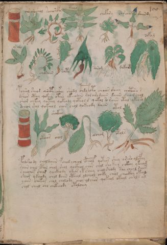

# Voynich Speculative Herbal Ferment Recipe — f100r

IMPORTANT: this is NOT a real or validated translation of the Voynich Manuscript. It is a speculative/procedural model that interprets EVA using a user-defined grammar to generate experimental recipes using safe, known edible substitutes.

This file is generated automatically from IVTFF/EVA transliteration plus a user-defined procedural grammar.



## Page / Folio
- currier: A
- folio: f100r
- page_number: 203

## EVA Text (Transliteration)
```text
chosaroshol
sochorcfhy
otear
chofa[r:n]y
sar char daiindy
o[r:s]aro
chalsain
soity
sosam
dakocth
sofam
pcheol sheod qocpheeckhy shodol c@132;hda @168;oto cho[?:ch]os sheey chcthh'o s
dsheor cthey qokeey oteey ykeeodain [r:s]orarydaiin daiin deeomchol
shor chkeey qoteey qokeody qoteold qokeol so raiin otal yk[eee:ech]o
dcheor shol qokeeol chor chol qokeeody dareu
okeeos
shockhey
orol
olcheom
oteol
okols
folshody choldaiin fchod ycheol cphol qotees shey aseso alcfhy
soiin chol cphol shol shol qockhol chor chol sho keey chkhhy ykeeam
saiichor sheor qockhody odeor yk sheey cholsheody sai cheol raiin
sheor qkeeody chol daiin ctheol olcheol cheky cheol cheockhy okeol
yaiin chekeey chol cholody chos olchor qokeol okeeol cheols al
chol cheol cho chckheody otolchey
```

## Domain Context (Heuristic; Not a Translation)

This section summarizes recurring **basewords** in this IVTFF domain and shows simple substring evidence that the token markers used by the procedural grammar occur inside frequent words.

Any Italian anagram / English gloss is a best-effort lexicon match, not a decipherment.


### Associated basewords (non-generic; top by frequency in this domain)
- `daiin` (count=231) → Italian anagram `piani`; English: plans (arrangements)
- `qokaiin` (count=122) → Italian anagram `ciancio`; English: [n/a]
- `okaiin` (count=109) → Italian anagram `coniai`; English: [n/a]
- `qokain` (count=101) → Italian anagram `acconi`; English: [n/a]
- `okain` (count=69) → Italian anagram `acino`; English: a berry
- `otain` (count=53) → Italian anagram `anito`; English: [n/a]
- `qokar` (count=48) → Italian anagram `carco`; English: [n/a]
- `saiin` (count=46) → Italian anagram `asini`; English: [n/a]
- `qokal` (count=43) → Italian anagram `calco`; English: cast (of sculpture)
- `qotaiin` (count=40) → Italian anagram `cationi`; English: [n/a]
- `lkaiin` (count=39) → Italian anagram `ancili`; English: [n/a]
- `kaiin` (count=37) → Italian anagram `acini`; English: [n/a]
- `qokeol` (count=37) → Italian anagram `eccolo`; English: [n/a]
- `qotain` (count=34) → Italian anagram `antico`; English: ancient
- `qotar` (count=29) → Italian anagram `corta`; English: [n/a]

### Marker evidence (substring in frequent basewords)
- `qo`: 60 basewords; examples: `qokeey`, `qokeedy`, `qokaiin`, `qokain`, `qokedy`, `qokey`
- `q`: 61 basewords; examples: `qokeey`, `qokeedy`, `qokaiin`, `qokain`, `qokedy`, `qokey`
- `o`: 262 basewords; examples: `qokeey`, `ol`, `o`, `qokeedy`, `okeey`, `qokaiin`
- `k`: 147 basewords; examples: `qokeey`, `qokeedy`, `okeey`, `qokaiin`, `okaiin`, `qokain`
- `t`: 102 basewords; examples: `otaiin`, `oteey`, `otar`, `otedy`, `otal`, `oteedy`
- `p`: 17 basewords; examples: `opchedy`, `qopchedy`, `opchey`, `pchedy`, `qopchdy`, `opchdy`
- `ch`: 137 basewords; examples: `chedy`, `chey`, `chol`, `cheey`, `cheol`, `cheody`
- `sh`: 50 basewords; examples: `shedy`, `shey`, `sheey`, `sheol`, `shol`, `sheedy`
- `f`: 1 basewords; examples: `f`
- `cth`: 16 basewords; examples: `chcthy`, `cthey`, `shcthy`, `checthy`, `cthol`, `ctheey`
- `ckh`: 15 basewords; examples: `chckhy`, `shckhy`, `checkhy`, `chckhey`, `chockhy`, `sheckhy`
- `cph`: 2 basewords; examples: `cphol`, `cphy`
- `dy`: 84 basewords; examples: `chedy`, `qokeedy`, `shedy`, `otedy`, `oteedy`, `qokedy`
- `iin`: 39 basewords; examples: `aiin`, `daiin`, `qokaiin`, `okaiin`, `otaiin`, `saiin`
- `aiin`: 33 basewords; examples: `aiin`, `daiin`, `qokaiin`, `okaiin`, `otaiin`, `saiin`

## Recipes Index (This Page)
- [f100r.1,@Lf](#f100r-1-f100r-1-lf)
- [f100r.2,@Lf](#f100r-2-f100r-2-lf)
- [f100r.3,@Lf](#f100r-3-f100r-3-lf)
- [f100r.4,@Lf](#f100r-4-f100r-4-lf)
- [f100r.5,@Lf](#f100r-5-f100r-5-lf)
- [f100r.6,@Lf](#f100r-6-f100r-6-lf)
- [f100r.7,@Lf](#f100r-7-f100r-7-lf)
- [f100r.8,@Lf](#f100r-8-f100r-8-lf)
- [f100r.9,@Lf](#f100r-9-f100r-9-lf)
- [f100r.10,@Lf](#f100r-10-f100r-10-lf)
- [f100r.11,@Lf](#f100r-11-f100r-11-lf)
- [f100r.12,@P0](#f100r-12-f100r-12-p0)
- [f100r.13,+P0](#f100r-13-f100r-13-p0)
- [f100r.14,+P0](#f100r-14-f100r-14-p0)
- [f100r.15,+P0](#f100r-15-f100r-15-p0)
- [f100r.16,@Lf](#f100r-16-f100r-16-lf)
- [f100r.17,@Lf](#f100r-17-f100r-17-lf)
- [f100r.18,@Lf](#f100r-18-f100r-18-lf)
- [f100r.19,@Lf](#f100r-19-f100r-19-lf)
- [f100r.20,@Lf](#f100r-20-f100r-20-lf)
- [f100r.21,@Lf](#f100r-21-f100r-21-lf)
- [f100r.22,@P0](#f100r-22-f100r-22-p0)
- [f100r.23,+P0](#f100r-23-f100r-23-p0)
- [f100r.24,+P0](#f100r-24-f100r-24-p0)
- [f100r.25,+P0](#f100r-25-f100r-25-p0)
- [f100r.26,+P0](#f100r-26-f100r-26-p0)
- [f100r.27,+P0](#f100r-27-f100r-27-p0)

## Line Glosses (Procedural Gloss Only; Not a Translation)

<a id="f100r-1-f100r-1-lf"></a>

### f100r.1,@Lf

EVA: chosaroshol

Direct Gloss (Procedural, Not a Real Translation):
- chosaroshol: add main plant (safe substitute) → add secondary herb (safe substitute) → mix / transfer → duration level 1 → state: fermentation start

<a id="f100r-2-f100r-2-lf"></a>

### f100r.2,@Lf

EVA: sochorcfhy

Direct Gloss (Procedural, Not a Real Translation):
- sochorcfhy: add main plant (safe substitute) → mix / transfer → add complex herbal compound (safe blend)

<a id="f100r-3-f100r-3-lf"></a>

### f100r.3,@Lf

EVA: otear

Direct Gloss (Procedural, Not a Real Translation):
- otear: apply heat/cooking → mix / transfer → duration level 1 → state: active extraction

<a id="f100r-4-f100r-4-lf"></a>

### f100r.4,@Lf

EVA: chofa[r:n]y

Direct Gloss (Procedural, Not a Real Translation):
- chofa: add main plant (safe substitute) → add aroma modifier → mix / transfer → duration level 1 → state: fermentation start
- r: [unparsed]
- n: [unparsed]
- y: [unparsed]

<a id="f100r-5-f100r-5-lf"></a>

### f100r.5,@Lf

EVA: sar char daiindy

Direct Gloss (Procedural, Not a Real Translation):
- sar: duration level 1 → state: fermentation start
- char: add main plant (safe substitute) → duration level 1 → state: fermentation start
- daiindy: start fermentation (yeast) → duration level 1 → state: fermentation start → long fermentation / aging phase

<a id="f100r-6-f100r-6-lf"></a>

### f100r.6,@Lf

EVA: o[r:s]aro

Direct Gloss (Procedural, Not a Real Translation):
- o: mix / transfer
- r: [unparsed]
- s: [unparsed]
- aro: mix / transfer → duration level 1 → state: fermentation start

<a id="f100r-7-f100r-7-lf"></a>

### f100r.7,@Lf

EVA: chalsain

Direct Gloss (Procedural, Not a Real Translation):
- chalsain: add main plant (safe substitute) → duration level 1 → state: fermentation start

<a id="f100r-8-f100r-8-lf"></a>

### f100r.8,@Lf

EVA: soity

Direct Gloss (Procedural, Not a Real Translation):
- soity: apply heat/cooking → mix / transfer → duration level 1 → state: cooling/rest

<a id="f100r-9-f100r-9-lf"></a>

### f100r.9,@Lf

EVA: sosam

Direct Gloss (Procedural, Not a Real Translation):
- sosam: mix / transfer → duration level 1 → state: fermentation start

<a id="f100r-10-f100r-10-lf"></a>

### f100r.10,@Lf

EVA: dakocth

Direct Gloss (Procedural, Not a Real Translation):
- dakocth: add fermentable sugars → mix / transfer → start fermentation (yeast) → add complex herbal compound (safe blend) → duration level 1 → state: fermentation start

<a id="f100r-11-f100r-11-lf"></a>

### f100r.11,@Lf

EVA: sofam

Direct Gloss (Procedural, Not a Real Translation):
- sofam: add aroma modifier → mix / transfer → duration level 1 → state: fermentation start

<a id="f100r-12-f100r-12-p0"></a>

### f100r.12,@P0

EVA: pcheol sheod qocpheeckhy shodol c@132;hda @168;oto cho[?:ch]os sheey chcthh'o s

Direct Gloss (Procedural, Not a Real Translation):
- pcheol: add main plant (safe substitute) → mix / transfer → start fermentation (yeast) → duration level 1 → state: active extraction
- sheod: add secondary herb (safe substitute) → mix / transfer → start fermentation (yeast) → duration level 1 → state: active extraction
- qocpheeckhy: prepare liquid base → add complex herbal compound (safe blend) → duration level 2 → state: active extraction
- shodol: add secondary herb (safe substitute) → mix / transfer → start fermentation (yeast)
- c: [unparsed]
- hda: start fermentation (yeast) → duration level 1 → state: fermentation start
- oto: apply heat/cooking → mix / transfer
- cho: add main plant (safe substitute) → mix / transfer
- ch: add main plant (safe substitute)
- os: mix / transfer
- sheey: add secondary herb (safe substitute) → duration level 2 → state: active extraction
- chcthh: add main plant (safe substitute) → add complex herbal compound (safe blend)
- o: mix / transfer
- s: [unparsed]

<a id="f100r-13-f100r-13-p0"></a>

### f100r.13,+P0

EVA: dsheor cthey qokeey oteey ykeeodain [r:s]orarydaiin daiin deeomchol

Direct Gloss (Procedural, Not a Real Translation):
- dsheor: add secondary herb (safe substitute) → mix / transfer → start fermentation (yeast) → duration level 1 → state: active extraction
- cthey: add complex herbal compound (safe blend) → duration level 1 → state: active extraction
- qokeey: prepare liquid base → add fermentable sugars → duration level 2 → state: active extraction
- oteey: apply heat/cooking → mix / transfer → duration level 2 → state: active extraction
- ykeeodain: add fermentable sugars → mix / transfer → start fermentation (yeast) → duration level 2 → state: active extraction
- r: [unparsed]
- s: [unparsed]
- orarydaiin: mix / transfer → start fermentation (yeast) → duration level 1 → state: fermentation start → long fermentation / aging phase
- daiin: start fermentation (yeast) → duration level 1 → state: fermentation start → long fermentation / aging phase
- deeomchol: add main plant (safe substitute) → mix / transfer → start fermentation (yeast) → duration level 2 → state: active extraction

<a id="f100r-14-f100r-14-p0"></a>

### f100r.14,+P0

EVA: shor chkeey qoteey qokeody qoteold qokeol so raiin otal yk[eee:ech]o

Direct Gloss (Procedural, Not a Real Translation):
- shor: add secondary herb (safe substitute) → mix / transfer
- chkeey: add fermentable sugars → add main plant (safe substitute) → duration level 2 → state: active extraction
- qoteey: prepare liquid base → apply heat/cooking → duration level 2 → state: active extraction
- qokeody: prepare liquid base → add fermentable sugars → mix / transfer → start fermentation (yeast) → duration level 1 → state: active extraction
- qoteold: prepare liquid base → apply heat/cooking → mix / transfer → start fermentation (yeast) → duration level 1 → state: active extraction
- qokeol: prepare liquid base → add fermentable sugars → mix / transfer → duration level 1 → state: active extraction
- so: mix / transfer
- raiin: duration level 1 → state: fermentation start → long fermentation / aging phase
- otal: apply heat/cooking → mix / transfer → duration level 1 → state: fermentation start
- yk: add fermentable sugars
- eee: duration level 3 → state: active extraction
- ech: add main plant (safe substitute) → duration level 1 → state: active extraction
- o: mix / transfer

<a id="f100r-15-f100r-15-p0"></a>

### f100r.15,+P0

EVA: dcheor shol qokeeol chor chol qokeeody dareu

Direct Gloss (Procedural, Not a Real Translation):
- dcheor: add main plant (safe substitute) → mix / transfer → start fermentation (yeast) → duration level 1 → state: active extraction
- shol: add secondary herb (safe substitute) → mix / transfer
- qokeeol: prepare liquid base → add fermentable sugars → mix / transfer → duration level 2 → state: active extraction
- chor: add main plant (safe substitute) → mix / transfer
- chol: add main plant (safe substitute) → mix / transfer
- qokeeody: prepare liquid base → add fermentable sugars → mix / transfer → start fermentation (yeast) → duration level 2 → state: active extraction
- dareu: start fermentation (yeast) → duration level 1 → state: fermentation start

<a id="f100r-16-f100r-16-lf"></a>

### f100r.16,@Lf

EVA: okeeos

Direct Gloss (Procedural, Not a Real Translation):
- okeeos: add fermentable sugars → mix / transfer → duration level 2 → state: active extraction

<a id="f100r-17-f100r-17-lf"></a>

### f100r.17,@Lf

EVA: shockhey

Direct Gloss (Procedural, Not a Real Translation):
- shockhey: add secondary herb (safe substitute) → mix / transfer → add complex herbal compound (safe blend) → duration level 1 → state: active extraction

<a id="f100r-18-f100r-18-lf"></a>

### f100r.18,@Lf

EVA: orol

Direct Gloss (Procedural, Not a Real Translation):
- orol: mix / transfer

<a id="f100r-19-f100r-19-lf"></a>

### f100r.19,@Lf

EVA: olcheom

Direct Gloss (Procedural, Not a Real Translation):
- olcheom: add main plant (safe substitute) → mix / transfer → duration level 1 → state: active extraction

<a id="f100r-20-f100r-20-lf"></a>

### f100r.20,@Lf

EVA: oteol

Direct Gloss (Procedural, Not a Real Translation):
- oteol: apply heat/cooking → mix / transfer → duration level 1 → state: active extraction

<a id="f100r-21-f100r-21-lf"></a>

### f100r.21,@Lf

EVA: okols

Direct Gloss (Procedural, Not a Real Translation):
- okols: add fermentable sugars → mix / transfer

<a id="f100r-22-f100r-22-p0"></a>

### f100r.22,@P0

EVA: folshody choldaiin fchod ycheol cphol qotees shey aseso alcfhy

Direct Gloss (Procedural, Not a Real Translation):
- folshody: add secondary herb (safe substitute) → add aroma modifier → mix / transfer → start fermentation (yeast)
- choldaiin: add main plant (safe substitute) → mix / transfer → start fermentation (yeast) → duration level 1 → state: fermentation start → long fermentation / aging phase
- fchod: add main plant (safe substitute) → add aroma modifier → mix / transfer → start fermentation (yeast)
- ycheol: add main plant (safe substitute) → mix / transfer → duration level 1 → state: active extraction
- cphol: mix / transfer → add complex herbal compound (safe blend)
- qotees: prepare liquid base → apply heat/cooking → duration level 2 → state: active extraction
- shey: add secondary herb (safe substitute) → duration level 1 → state: active extraction
- aseso: mix / transfer → duration level 1 → state: fermentation start
- alcfhy: add complex herbal compound (safe blend) → duration level 1 → state: fermentation start

<a id="f100r-23-f100r-23-p0"></a>

### f100r.23,+P0

EVA: soiin chol cphol shol shol qockhol chor chol sho keey chkhhy ykeeam

Direct Gloss (Procedural, Not a Real Translation):
- soiin: mix / transfer → duration level 2 → state: cooling/rest → medium fermentation phase
- chol: add main plant (safe substitute) → mix / transfer
- cphol: mix / transfer → add complex herbal compound (safe blend)
- shol: add secondary herb (safe substitute) → mix / transfer
- shol: add secondary herb (safe substitute) → mix / transfer
- qockhol: prepare liquid base → mix / transfer → add complex herbal compound (safe blend)
- chor: add main plant (safe substitute) → mix / transfer
- chol: add main plant (safe substitute) → mix / transfer
- sho: add secondary herb (safe substitute) → mix / transfer
- keey: add fermentable sugars → duration level 2 → state: active extraction
- chkhhy: add fermentable sugars → add main plant (safe substitute)
- ykeeam: add fermentable sugars → duration level 2 → state: active extraction

<a id="f100r-24-f100r-24-p0"></a>

### f100r.24,+P0

EVA: saiichor sheor qockhody odeor yk sheey cholsheody sai cheol raiin

Direct Gloss (Procedural, Not a Real Translation):
- saiichor: add main plant (safe substitute) → mix / transfer → duration level 1 → state: fermentation start
- sheor: add secondary herb (safe substitute) → mix / transfer → duration level 1 → state: active extraction
- qockhody: prepare liquid base → mix / transfer → start fermentation (yeast) → add complex herbal compound (safe blend)
- odeor: mix / transfer → start fermentation (yeast) → duration level 1 → state: active extraction
- yk: add fermentable sugars
- sheey: add secondary herb (safe substitute) → duration level 2 → state: active extraction
- cholsheody: add main plant (safe substitute) → add secondary herb (safe substitute) → mix / transfer → start fermentation (yeast) → duration level 1 → state: active extraction
- sai: duration level 1 → state: fermentation start
- cheol: add main plant (safe substitute) → mix / transfer → duration level 1 → state: active extraction
- raiin: duration level 1 → state: fermentation start → long fermentation / aging phase

<a id="f100r-25-f100r-25-p0"></a>

### f100r.25,+P0

EVA: sheor qkeeody chol daiin ctheol olcheol cheky cheol cheockhy okeol

Direct Gloss (Procedural, Not a Real Translation):
- sheor: add secondary herb (safe substitute) → mix / transfer → duration level 1 → state: active extraction
- qkeeody: prepare base (generic) → add fermentable sugars → mix / transfer → start fermentation (yeast) → duration level 2 → state: active extraction
- chol: add main plant (safe substitute) → mix / transfer
- daiin: start fermentation (yeast) → duration level 1 → state: fermentation start → long fermentation / aging phase
- ctheol: mix / transfer → add complex herbal compound (safe blend) → duration level 1 → state: active extraction
- olcheol: add main plant (safe substitute) → mix / transfer → duration level 1 → state: active extraction
- cheky: add fermentable sugars → add main plant (safe substitute) → duration level 1 → state: active extraction
- cheol: add main plant (safe substitute) → mix / transfer → duration level 1 → state: active extraction
- cheockhy: add main plant (safe substitute) → mix / transfer → add complex herbal compound (safe blend) → duration level 1 → state: active extraction
- okeol: add fermentable sugars → mix / transfer → duration level 1 → state: active extraction

<a id="f100r-26-f100r-26-p0"></a>

### f100r.26,+P0

EVA: yaiin chekeey chol cholody chos olchor qokeol okeeol cheols al

Direct Gloss (Procedural, Not a Real Translation):
- yaiin: duration level 1 → state: fermentation start → long fermentation / aging phase
- chekeey: add fermentable sugars → add main plant (safe substitute) → duration level 1 → state: active extraction
- chol: add main plant (safe substitute) → mix / transfer
- cholody: add main plant (safe substitute) → mix / transfer → start fermentation (yeast)
- chos: add main plant (safe substitute) → mix / transfer
- olchor: add main plant (safe substitute) → mix / transfer
- qokeol: prepare liquid base → add fermentable sugars → mix / transfer → duration level 1 → state: active extraction
- okeeol: add fermentable sugars → mix / transfer → duration level 2 → state: active extraction
- cheols: add main plant (safe substitute) → mix / transfer → duration level 1 → state: active extraction
- al: duration level 1 → state: fermentation start

<a id="f100r-27-f100r-27-p0"></a>

### f100r.27,+P0

EVA: chol cheol cho chckheody otolchey

Direct Gloss (Procedural, Not a Real Translation):
- chol: add main plant (safe substitute) → mix / transfer
- cheol: add main plant (safe substitute) → mix / transfer → duration level 1 → state: active extraction
- cho: add main plant (safe substitute) → mix / transfer
- chckheody: add main plant (safe substitute) → mix / transfer → start fermentation (yeast) → add complex herbal compound (safe blend) → duration level 1 → state: active extraction
- otolchey: apply heat/cooking → add main plant (safe substitute) → mix / transfer → duration level 1 → state: active extraction
