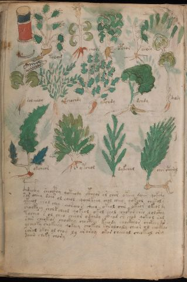

# Voynich Speculative Procedural Protocol — f100v

IMPORTANT: this is NOT a real or validated translation of the Voynich Manuscript. It is a speculative/procedural model that interprets EVA using a user-defined grammar to generate experimental recipes using safe, known edible substitutes.

This file is generated automatically from IVTFF/EVA transliteration plus a user-defined procedural grammar.



## Page / Folio
- currier: A
- folio: f100v
- page_number: 204

## EVA Text (Transliteration)
```text
tolchd
chols
opchor
solsy
soleesos
ykchochdy
ykchdy
dchdy
dalsy
okcheor
ytchol
dykchal
chos ctharal
c@132;hdeec@133;hy sheocphy qoteody ckhoor ar chor oteey daiin qokomo
sor cheey dair ol cheol qoolkeey chol cheey qokeol chotol s
ykeeol chol chey eeoseeo s sheeo okeol ches okeor okeol dy
chockhey sholkcheol qokeol okol chol chotor chso solcthy
tachso s ol cheo cheeor odaidy ckhod sh chod qokeol sal
sain cheokeos chockhy chocthey keody chockhhor chckhey du
ycheoky shokeesy qokeey chokeol saraloaly cheor ol chockhar
soral okor ol choy ly araroy okar cheeeal cheokeol orey
daiin cheky chory
```

## Domain Context (Heuristic; Not a Translation)

This section summarizes recurring **basewords** in this IVTFF domain and shows simple substring evidence that the token markers used by the procedural grammar occur inside frequent words.

Any Italian anagram / English gloss is a best-effort lexicon match, not a decipherment.


### Associated basewords (non-generic; top by frequency in this domain)
- `daiin` (count=231) → Italian anagram `piani`; English: plans (arrangements)
- `qokaiin` (count=122) → Italian anagram `ciancio`; English: [n/a]
- `okaiin` (count=109) → Italian anagram `coniai`; English: [n/a]
- `qokain` (count=101) → Italian anagram `acconi`; English: [n/a]
- `okain` (count=69) → Italian anagram `acino`; English: a berry
- `otain` (count=53) → Italian anagram `anito`; English: [n/a]
- `qokar` (count=48) → Italian anagram `carco`; English: [n/a]
- `saiin` (count=46) → Italian anagram `asini`; English: [n/a]
- `qokal` (count=43) → Italian anagram `calco`; English: cast (of sculpture)
- `qotaiin` (count=40) → Italian anagram `cationi`; English: [n/a]
- `lkaiin` (count=39) → Italian anagram `ancili`; English: [n/a]
- `kaiin` (count=37) → Italian anagram `acini`; English: [n/a]
- `qokeol` (count=37) → Italian anagram `eccolo`; English: [n/a]
- `qotain` (count=34) → Italian anagram `antico`; English: ancient
- `qotar` (count=29) → Italian anagram `corta`; English: [n/a]

### Marker evidence (substring in frequent basewords)
- `qo`: 60 basewords; examples: `qokeey`, `qokeedy`, `qokaiin`, `qokain`, `qokedy`, `qokey`
- `q`: 61 basewords; examples: `qokeey`, `qokeedy`, `qokaiin`, `qokain`, `qokedy`, `qokey`
- `o`: 262 basewords; examples: `qokeey`, `ol`, `o`, `qokeedy`, `okeey`, `qokaiin`
- `k`: 147 basewords; examples: `qokeey`, `qokeedy`, `okeey`, `qokaiin`, `okaiin`, `qokain`
- `t`: 102 basewords; examples: `otaiin`, `oteey`, `otar`, `otedy`, `otal`, `oteedy`
- `p`: 17 basewords; examples: `opchedy`, `qopchedy`, `opchey`, `pchedy`, `qopchdy`, `opchdy`
- `ch`: 137 basewords; examples: `chedy`, `chey`, `chol`, `cheey`, `cheol`, `cheody`
- `sh`: 50 basewords; examples: `shedy`, `shey`, `sheey`, `sheol`, `shol`, `sheedy`
- `f`: 1 basewords; examples: `f`
- `cth`: 16 basewords; examples: `chcthy`, `cthey`, `shcthy`, `checthy`, `cthol`, `ctheey`
- `ckh`: 15 basewords; examples: `chckhy`, `shckhy`, `checkhy`, `chckhey`, `chockhy`, `sheckhy`
- `cph`: 2 basewords; examples: `cphol`, `cphy`
- `dy`: 84 basewords; examples: `chedy`, `qokeedy`, `shedy`, `otedy`, `oteedy`, `qokedy`
- `iin`: 39 basewords; examples: `aiin`, `daiin`, `qokaiin`, `okaiin`, `otaiin`, `saiin`
- `aiin`: 33 basewords; examples: `aiin`, `daiin`, `qokaiin`, `okaiin`, `otaiin`, `saiin`

## Recipes Index (This Page)
- [f100v.1,@Lf](#f100v-1-f100v-1-lf)
- [f100v.2,@Lf](#f100v-2-f100v-2-lf)
- [f100v.3,@Lf](#f100v-3-f100v-3-lf)
- [f100v.4,@Lf](#f100v-4-f100v-4-lf)
- [f100v.5,@Lf](#f100v-5-f100v-5-lf)
- [f100v.6,@Lf](#f100v-6-f100v-6-lf)
- [f100v.7,@Lf](#f100v-7-f100v-7-lf)
- [f100v.8,@Lf](#f100v-8-f100v-8-lf)
- [f100v.9,@Lf](#f100v-9-f100v-9-lf)
- [f100v.10,@Lf](#f100v-10-f100v-10-lf)
- [f100v.11,@Lf](#f100v-11-f100v-11-lf)
- [f100v.12,@Lf](#f100v-12-f100v-12-lf)
- [f100v.13,@Lf](#f100v-13-f100v-13-lf)
- [f100v.14,@P0](#f100v-14-f100v-14-p0)
- [f100v.15,+P0](#f100v-15-f100v-15-p0)
- [f100v.16,+P0](#f100v-16-f100v-16-p0)
- [f100v.17,+P0](#f100v-17-f100v-17-p0)
- [f100v.18,+P0](#f100v-18-f100v-18-p0)
- [f100v.19,+P0](#f100v-19-f100v-19-p0)
- [f100v.20,+P0](#f100v-20-f100v-20-p0)
- [f100v.21,+P0](#f100v-21-f100v-21-p0)
- [f100v.22,+P0](#f100v-22-f100v-22-p0)

## Line Glosses (Procedural Gloss Only; Not a Translation)

<a id="f100v-1-f100v-1-lf"></a>

### f100v.1,@Lf

EVA: tolchd

Direct Gloss (Procedural, Not a Real Translation):
- tolchd: apply heat/cooking → add main plant (safe substitute) → mix / transfer → add starter / activate

<a id="f100v-2-f100v-2-lf"></a>

### f100v.2,@Lf

EVA: chols

Direct Gloss (Procedural, Not a Real Translation):
- chols: add main plant (safe substitute) → mix / transfer

<a id="f100v-3-f100v-3-lf"></a>

### f100v.3,@Lf

EVA: opchor

Direct Gloss (Procedural, Not a Real Translation):
- opchor: add main plant (safe substitute) → mix / transfer → add starter / activate

<a id="f100v-4-f100v-4-lf"></a>

### f100v.4,@Lf

EVA: solsy

Direct Gloss (Procedural, Not a Real Translation):
- solsy: mix / transfer

<a id="f100v-5-f100v-5-lf"></a>

### f100v.5,@Lf

EVA: soleesos

Direct Gloss (Procedural, Not a Real Translation):
- soleesos: mix / transfer → duration level 2 → state: active extraction

<a id="f100v-6-f100v-6-lf"></a>

### f100v.6,@Lf

EVA: ykchochdy

Direct Gloss (Procedural, Not a Real Translation):
- ykchochdy: add fermentable sugars → add main plant (safe substitute) → mix / transfer → add starter / activate

<a id="f100v-7-f100v-7-lf"></a>

### f100v.7,@Lf

EVA: ykchdy

Direct Gloss (Procedural, Not a Real Translation):
- ykchdy: add fermentable sugars → add main plant (safe substitute) → add starter / activate

<a id="f100v-8-f100v-8-lf"></a>

### f100v.8,@Lf

EVA: dchdy

Direct Gloss (Procedural, Not a Real Translation):
- dchdy: add main plant (safe substitute) → add starter / activate

<a id="f100v-9-f100v-9-lf"></a>

### f100v.9,@Lf

EVA: dalsy

Direct Gloss (Procedural, Not a Real Translation):
- dalsy: add starter / activate → duration level 1 → state: phase transition/start

<a id="f100v-10-f100v-10-lf"></a>

### f100v.10,@Lf

EVA: okcheor

Direct Gloss (Procedural, Not a Real Translation):
- okcheor: add fermentable sugars → add main plant (safe substitute) → mix / transfer → duration level 1 → state: active extraction

<a id="f100v-11-f100v-11-lf"></a>

### f100v.11,@Lf

EVA: ytchol

Direct Gloss (Procedural, Not a Real Translation):
- ytchol: apply heat/cooking → add main plant (safe substitute) → mix / transfer

<a id="f100v-12-f100v-12-lf"></a>

### f100v.12,@Lf

EVA: dykchal

Direct Gloss (Procedural, Not a Real Translation):
- dykchal: add fermentable sugars → add main plant (safe substitute) → add starter / activate → duration level 1 → state: phase transition/start

<a id="f100v-13-f100v-13-lf"></a>

### f100v.13,@Lf

EVA: chos ctharal

Direct Gloss (Procedural, Not a Real Translation):
- chos: add main plant (safe substitute) → mix / transfer
- ctharal: add complex herbal compound (safe blend) → duration level 1 → state: phase transition/start

<a id="f100v-14-f100v-14-p0"></a>

### f100v.14,@P0

EVA: c@132;hdeec@133;hy sheocphy qoteody ckhoor ar chor oteey daiin qokomo

Direct Gloss (Procedural, Not a Real Translation):
- c: [unparsed]
- hdeec: add starter / activate → duration level 2 → state: active extraction → unmodeled token(s) present: h
- hy: unmodeled token(s) present: h
- sheocphy: add secondary herb (safe substitute) → mix / transfer → add complex herbal compound (safe blend) → duration level 1 → state: active extraction
- qoteody: prepare liquid base → apply heat/cooking → mix / transfer → add starter / activate → duration level 1 → state: active extraction
- ckhoor: mix / transfer → add complex herbal compound (safe blend)
- ar: duration level 1 → state: phase transition/start
- chor: add main plant (safe substitute) → mix / transfer
- oteey: apply heat/cooking → mix / transfer → duration level 2 → state: active extraction
- daiin: add starter / activate → duration level 1 → state: phase transition/start → long phase
- qokomo: prepare liquid base → add fermentable sugars → mix / transfer

<a id="f100v-15-f100v-15-p0"></a>

### f100v.15,+P0

EVA: sor cheey dair ol cheol qoolkeey chol cheey qokeol chotol s

Direct Gloss (Procedural, Not a Real Translation):
- sor: mix / transfer
- cheey: add main plant (safe substitute) → duration level 2 → state: active extraction
- dair: add starter / activate → duration level 1 → state: phase transition/start
- ol: mix / transfer
- cheol: add main plant (safe substitute) → mix / transfer → duration level 1 → state: active extraction
- qoolkeey: prepare liquid base → add fermentable sugars → mix / transfer → duration level 2 → state: active extraction
- chol: add main plant (safe substitute) → mix / transfer
- cheey: add main plant (safe substitute) → duration level 2 → state: active extraction
- qokeol: prepare liquid base → add fermentable sugars → mix / transfer → duration level 1 → state: active extraction
- chotol: apply heat/cooking → add main plant (safe substitute) → mix / transfer
- s: [unparsed]

<a id="f100v-16-f100v-16-p0"></a>

### f100v.16,+P0

EVA: ykeeol chol chey eeoseeo s sheeo okeol ches okeor okeol dy

Direct Gloss (Procedural, Not a Real Translation):
- ykeeol: add fermentable sugars → mix / transfer → duration level 2 → state: active extraction
- chol: add main plant (safe substitute) → mix / transfer
- chey: add main plant (safe substitute) → duration level 1 → state: active extraction
- eeoseeo: mix / transfer → duration level 2 → state: active extraction
- s: [unparsed]
- sheeo: add secondary herb (safe substitute) → mix / transfer → duration level 2 → state: active extraction
- okeol: add fermentable sugars → mix / transfer → duration level 1 → state: active extraction
- ches: add main plant (safe substitute) → duration level 1 → state: active extraction
- okeor: add fermentable sugars → mix / transfer → duration level 1 → state: active extraction
- okeol: add fermentable sugars → mix / transfer → duration level 1 → state: active extraction
- dy: add starter / activate

<a id="f100v-17-f100v-17-p0"></a>

### f100v.17,+P0

EVA: chockhey sholkcheol qokeol okol chol chotor chso solcthy

Direct Gloss (Procedural, Not a Real Translation):
- chockhey: add main plant (safe substitute) → mix / transfer → add complex herbal compound (safe blend) → duration level 1 → state: active extraction
- sholkcheol: add fermentable sugars → add main plant (safe substitute) → add secondary herb (safe substitute) → mix / transfer → duration level 1 → state: active extraction
- qokeol: prepare liquid base → add fermentable sugars → mix / transfer → duration level 1 → state: active extraction
- okol: add fermentable sugars → mix / transfer
- chol: add main plant (safe substitute) → mix / transfer
- chotor: apply heat/cooking → add main plant (safe substitute) → mix / transfer
- chso: add main plant (safe substitute) → mix / transfer
- solcthy: mix / transfer → add complex herbal compound (safe blend)

<a id="f100v-18-f100v-18-p0"></a>

### f100v.18,+P0

EVA: tachso s ol cheo cheeor odaidy ckhod sh chod qokeol sal

Direct Gloss (Procedural, Not a Real Translation):
- tachso: apply heat/cooking → add main plant (safe substitute) → mix / transfer → duration level 1 → state: phase transition/start
- s: [unparsed]
- ol: mix / transfer
- cheo: add main plant (safe substitute) → mix / transfer → duration level 1 → state: active extraction
- cheeor: add main plant (safe substitute) → mix / transfer → duration level 2 → state: active extraction
- odaidy: mix / transfer → add starter / activate → duration level 1 → state: phase transition/start
- ckhod: mix / transfer → add starter / activate → add complex herbal compound (safe blend)
- sh: add secondary herb (safe substitute)
- chod: add main plant (safe substitute) → mix / transfer → add starter / activate
- qokeol: prepare liquid base → add fermentable sugars → mix / transfer → duration level 1 → state: active extraction
- sal: duration level 1 → state: phase transition/start

<a id="f100v-19-f100v-19-p0"></a>

### f100v.19,+P0

EVA: sain cheokeos chockhy chocthey keody chockhhor chckhey du

Direct Gloss (Procedural, Not a Real Translation):
- sain: duration level 1 → state: phase transition/start
- cheokeos: add fermentable sugars → add main plant (safe substitute) → mix / transfer → duration level 1 → state: active extraction
- chockhy: add main plant (safe substitute) → mix / transfer → add complex herbal compound (safe blend)
- chocthey: add main plant (safe substitute) → mix / transfer → add complex herbal compound (safe blend) → duration level 1 → state: active extraction
- keody: add fermentable sugars → mix / transfer → add starter / activate → duration level 1 → state: active extraction
- chockhhor: add main plant (safe substitute) → mix / transfer → add complex herbal compound (safe blend) → unmodeled token(s) present: h
- chckhey: add main plant (safe substitute) → add complex herbal compound (safe blend) → duration level 1 → state: active extraction
- du: add starter / activate → unmodeled token(s) present: u

<a id="f100v-20-f100v-20-p0"></a>

### f100v.20,+P0

EVA: ycheoky shokeesy qokeey chokeol saraloaly cheor ol chockhar

Direct Gloss (Procedural, Not a Real Translation):
- ycheoky: add fermentable sugars → add main plant (safe substitute) → mix / transfer → duration level 1 → state: active extraction
- shokeesy: add fermentable sugars → add secondary herb (safe substitute) → mix / transfer → duration level 2 → state: active extraction
- qokeey: prepare liquid base → add fermentable sugars → duration level 2 → state: active extraction
- chokeol: add fermentable sugars → add main plant (safe substitute) → mix / transfer → duration level 1 → state: active extraction
- saraloaly: mix / transfer → duration level 1 → state: phase transition/start
- cheor: add main plant (safe substitute) → mix / transfer → duration level 1 → state: active extraction
- ol: mix / transfer
- chockhar: add main plant (safe substitute) → mix / transfer → add complex herbal compound (safe blend) → duration level 1 → state: phase transition/start

<a id="f100v-21-f100v-21-p0"></a>

### f100v.21,+P0

EVA: soral okor ol choy ly araroy okar cheeeal cheokeol orey

Direct Gloss (Procedural, Not a Real Translation):
- soral: mix / transfer → duration level 1 → state: phase transition/start
- okor: add fermentable sugars → mix / transfer
- ol: mix / transfer
- choy: add main plant (safe substitute) → mix / transfer
- ly: [unparsed]
- araroy: mix / transfer → duration level 1 → state: phase transition/start
- okar: add fermentable sugars → mix / transfer → duration level 1 → state: phase transition/start
- cheeeal: add main plant (safe substitute) → duration level 3 → state: active extraction
- cheokeol: add fermentable sugars → add main plant (safe substitute) → mix / transfer → duration level 1 → state: active extraction
- orey: mix / transfer → duration level 1 → state: active extraction

<a id="f100v-22-f100v-22-p0"></a>

### f100v.22,+P0

EVA: daiin cheky chory

Direct Gloss (Procedural, Not a Real Translation):
- daiin: add starter / activate → duration level 1 → state: phase transition/start → long phase
- cheky: add fermentable sugars → add main plant (safe substitute) → duration level 1 → state: active extraction
- chory: add main plant (safe substitute) → mix / transfer
