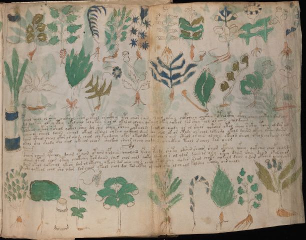

# Voynich Speculative Procedural Protocol — f101r

IMPORTANT: this is NOT a real or validated translation of the Voynich Manuscript. It is a speculative/procedural model that interprets EVA using a user-defined grammar to generate experimental recipes using safe, known edible substitutes.

This file is generated automatically from IVTFF/EVA transliteration plus a user-defined procedural grammar.



## Page / Folio
- currier: A
- folio: f101r
- page_number: 205

## EVA Text (Transliteration)
```text
pcheol sheol ol shey qockhol shor yteol sheockhey qpol chear s aiin oleeey qkeey chopcheey checkhey cpheocthy ykchy cheey chekeey dal chey
dol chokeey chkey cthey okalchol kol o keey r or ol okol ol olchey qok chal okey qokeol kar shey teol or oiiin chol daiin
@183;olc@133;heol okeor r sheol qokol shey dol shey okeey ctheey yteeoldy kchol ol sheody or ol sheor qotoiir otol sheey s sheo tchey ol dar am
ycheeo or sheeol daiin sheeol okeol ctheol c'ykeeo qockheol daiin shy chol okeeor ctody chkchol dateody okeol dairin okeey okeey dairin
daiin ctheol cheol okor or aiin cheol cho keeodchey okol okeol dor chol ch[y:a] r aiin oteol or aiin ol chey oteeod sheol okeol chosaiin sheam
okeeol sho shody sho shol okeeeol che[a:y]s sheokeey sheeor chchy chodaiin cheeckhey teeol s cheol rar oeeor
cphoar oaiin ypcholy daiin otaiin otaiin yfolaiin @184;cheolain ypchey yphody shotey odariin sheo[o:a]r sheor ckheey ykhey qokchey cholp cheol dy
olaiin oteol chor oteey chokchey kor daiin shok chol chol qoky daiin ol s al ydar daiin or ory okeey daiin shey daiin okol cheor
daiin okeol qokcheol ykeor dar ol otechy ykeor dor aiin chl s cheol okeol shey qodar soiin choko qokeol daiin [o:y] dar okchol cheo rcheky
ysho qykeeol chol sho odor dor chees ykeol chol dol kor aithy ol chso sha olcheeol kolshey okeoly oiin aiioly
```

## Domain Context (Heuristic; Not a Translation)

This section summarizes recurring **basewords** in this IVTFF domain and shows simple substring evidence that the token markers used by the procedural grammar occur inside frequent words.

Any Italian anagram / English gloss is a best-effort lexicon match, not a decipherment.


### Associated basewords (non-generic; top by frequency in this domain)
- `daiin` (count=231) → Italian anagram `piani`; English: plans (arrangements)
- `qokaiin` (count=122) → Italian anagram `ciancio`; English: [n/a]
- `okaiin` (count=109) → Italian anagram `coniai`; English: [n/a]
- `qokain` (count=101) → Italian anagram `acconi`; English: [n/a]
- `okain` (count=69) → Italian anagram `acino`; English: a berry
- `otain` (count=53) → Italian anagram `anito`; English: [n/a]
- `qokar` (count=48) → Italian anagram `carco`; English: [n/a]
- `saiin` (count=46) → Italian anagram `asini`; English: [n/a]
- `qokal` (count=43) → Italian anagram `calco`; English: cast (of sculpture)
- `qotaiin` (count=40) → Italian anagram `cationi`; English: [n/a]
- `lkaiin` (count=39) → Italian anagram `ancili`; English: [n/a]
- `kaiin` (count=37) → Italian anagram `acini`; English: [n/a]
- `qokeol` (count=37) → Italian anagram `eccolo`; English: [n/a]
- `qotain` (count=34) → Italian anagram `antico`; English: ancient
- `qotar` (count=29) → Italian anagram `corta`; English: [n/a]

### Marker evidence (substring in frequent basewords)
- `qo`: 60 basewords; examples: `qokeey`, `qokeedy`, `qokaiin`, `qokain`, `qokedy`, `qokey`
- `q`: 61 basewords; examples: `qokeey`, `qokeedy`, `qokaiin`, `qokain`, `qokedy`, `qokey`
- `o`: 262 basewords; examples: `qokeey`, `ol`, `o`, `qokeedy`, `okeey`, `qokaiin`
- `k`: 147 basewords; examples: `qokeey`, `qokeedy`, `okeey`, `qokaiin`, `okaiin`, `qokain`
- `t`: 102 basewords; examples: `otaiin`, `oteey`, `otar`, `otedy`, `otal`, `oteedy`
- `p`: 17 basewords; examples: `opchedy`, `qopchedy`, `opchey`, `pchedy`, `qopchdy`, `opchdy`
- `ch`: 137 basewords; examples: `chedy`, `chey`, `chol`, `cheey`, `cheol`, `cheody`
- `sh`: 50 basewords; examples: `shedy`, `shey`, `sheey`, `sheol`, `shol`, `sheedy`
- `f`: 1 basewords; examples: `f`
- `cth`: 16 basewords; examples: `chcthy`, `cthey`, `shcthy`, `checthy`, `cthol`, `ctheey`
- `ckh`: 15 basewords; examples: `chckhy`, `shckhy`, `checkhy`, `chckhey`, `chockhy`, `sheckhy`
- `cph`: 2 basewords; examples: `cphol`, `cphy`
- `dy`: 84 basewords; examples: `chedy`, `qokeedy`, `shedy`, `otedy`, `oteedy`, `qokedy`
- `iin`: 39 basewords; examples: `aiin`, `daiin`, `qokaiin`, `okaiin`, `otaiin`, `saiin`
- `aiin`: 33 basewords; examples: `aiin`, `daiin`, `qokaiin`, `okaiin`, `otaiin`, `saiin`

## Recipes Index (This Page)
- [f101r.1,@P0](#f101r-1-f101r-1-p0)
- [f101r.2,+P0](#f101r-2-f101r-2-p0)
- [f101r.3,+P0](#f101r-3-f101r-3-p0)
- [f101r.4,+P0](#f101r-4-f101r-4-p0)
- [f101r.5,+P0](#f101r-5-f101r-5-p0)
- [f101r.6,+P0](#f101r-6-f101r-6-p0)
- [f101r.7,+P0](#f101r-7-f101r-7-p0)
- [f101r.8,+P0](#f101r-8-f101r-8-p0)
- [f101r.9,+P0](#f101r-9-f101r-9-p0)
- [f101r.10,+P0](#f101r-10-f101r-10-p0)

## Line Glosses (Procedural Gloss Only; Not a Translation)

<a id="f101r-1-f101r-1-p0"></a>

### f101r.1,@P0

EVA: pcheol sheol ol shey qockhol shor yteol sheockhey qpol chear s aiin oleeey qkeey chopcheey checkhey cpheocthy ykchy cheey chekeey dal chey

Direct Gloss (Procedural, Not a Real Translation):
- pcheol: add main plant (safe substitute) → mix / transfer → add starter / activate → duration level 1 → state: active extraction
- sheol: add secondary herb (safe substitute) → mix / transfer → duration level 1 → state: active extraction
- ol: mix / transfer
- shey: add secondary herb (safe substitute) → duration level 1 → state: active extraction
- qockhol: prepare liquid base → mix / transfer → add complex herbal compound (safe blend)
- shor: add secondary herb (safe substitute) → mix / transfer
- yteol: apply heat/cooking → mix / transfer → duration level 1 → state: active extraction
- sheockhey: add secondary herb (safe substitute) → mix / transfer → add complex herbal compound (safe blend) → duration level 1 → state: active extraction
- qpol: prepare base (generic) → mix / transfer → add starter / activate
- chear: add main plant (safe substitute) → duration level 1 → state: active extraction
- s: [unparsed]
- aiin: duration level 1 → state: phase transition/start → long phase
- oleeey: mix / transfer → duration level 3 → state: active extraction
- qkeey: prepare base (generic) → add fermentable sugars → duration level 2 → state: active extraction
- chopcheey: add main plant (safe substitute) → mix / transfer → add starter / activate → duration level 2 → state: active extraction
- checkhey: add main plant (safe substitute) → add complex herbal compound (safe blend) → duration level 1 → state: active extraction
- cpheocthy: mix / transfer → add complex herbal compound (safe blend) → duration level 1 → state: active extraction
- ykchy: add fermentable sugars → add main plant (safe substitute)
- cheey: add main plant (safe substitute) → duration level 2 → state: active extraction
- chekeey: add fermentable sugars → add main plant (safe substitute) → duration level 1 → state: active extraction
- dal: add starter / activate → duration level 1 → state: phase transition/start
- chey: add main plant (safe substitute) → duration level 1 → state: active extraction

<a id="f101r-2-f101r-2-p0"></a>

### f101r.2,+P0

EVA: dol chokeey chkey cthey okalchol kol o keey r or ol okol ol olchey qok chal okey qokeol kar shey teol or oiiin chol daiin

Direct Gloss (Procedural, Not a Real Translation):
- dol: mix / transfer → add starter / activate
- chokeey: add fermentable sugars → add main plant (safe substitute) → mix / transfer → duration level 2 → state: active extraction
- chkey: add fermentable sugars → add main plant (safe substitute) → duration level 1 → state: active extraction
- cthey: add complex herbal compound (safe blend) → duration level 1 → state: active extraction
- okalchol: add fermentable sugars → add main plant (safe substitute) → mix / transfer → duration level 1 → state: phase transition/start
- kol: add fermentable sugars → mix / transfer
- o: mix / transfer
- keey: add fermentable sugars → duration level 2 → state: active extraction
- r: [unparsed]
- or: mix / transfer
- ol: mix / transfer
- okol: add fermentable sugars → mix / transfer
- ol: mix / transfer
- olchey: add main plant (safe substitute) → mix / transfer → duration level 1 → state: active extraction
- qok: prepare liquid base → add fermentable sugars
- chal: add main plant (safe substitute) → duration level 1 → state: phase transition/start
- okey: add fermentable sugars → mix / transfer → duration level 1 → state: active extraction
- qokeol: prepare liquid base → add fermentable sugars → mix / transfer → duration level 1 → state: active extraction
- kar: add fermentable sugars → duration level 1 → state: phase transition/start
- shey: add secondary herb (safe substitute) → duration level 1 → state: active extraction
- teol: apply heat/cooking → mix / transfer → duration level 1 → state: active extraction
- or: mix / transfer
- oiiin: mix / transfer → duration level 3 → state: cooling/rest → medium phase
- chol: add main plant (safe substitute) → mix / transfer
- daiin: add starter / activate → duration level 1 → state: phase transition/start → long phase

<a id="f101r-3-f101r-3-p0"></a>

### f101r.3,+P0

EVA: @183;olc@133;heol okeor r sheol qokol shey dol shey okeey ctheey yteeoldy kchol ol sheody or ol sheor qotoiir otol sheey s sheo tchey ol dar am

Direct Gloss (Procedural, Not a Real Translation):
- olc: mix / transfer
- heol: mix / transfer → duration level 1 → state: active extraction → unmodeled token(s) present: h
- okeor: add fermentable sugars → mix / transfer → duration level 1 → state: active extraction
- r: [unparsed]
- sheol: add secondary herb (safe substitute) → mix / transfer → duration level 1 → state: active extraction
- qokol: prepare liquid base → add fermentable sugars → mix / transfer
- shey: add secondary herb (safe substitute) → duration level 1 → state: active extraction
- dol: mix / transfer → add starter / activate
- shey: add secondary herb (safe substitute) → duration level 1 → state: active extraction
- okeey: add fermentable sugars → mix / transfer → duration level 2 → state: active extraction
- ctheey: add complex herbal compound (safe blend) → duration level 2 → state: active extraction
- yteeoldy: apply heat/cooking → mix / transfer → add starter / activate → duration level 2 → state: active extraction
- kchol: add fermentable sugars → add main plant (safe substitute) → mix / transfer
- ol: mix / transfer
- sheody: add secondary herb (safe substitute) → mix / transfer → add starter / activate → duration level 1 → state: active extraction
- or: mix / transfer
- ol: mix / transfer
- sheor: add secondary herb (safe substitute) → mix / transfer → duration level 1 → state: active extraction
- qotoiir: prepare liquid base → apply heat/cooking → mix / transfer → duration level 2 → state: cooling/rest
- otol: apply heat/cooking → mix / transfer
- sheey: add secondary herb (safe substitute) → duration level 2 → state: active extraction
- s: [unparsed]
- sheo: add secondary herb (safe substitute) → mix / transfer → duration level 1 → state: active extraction
- tchey: apply heat/cooking → add main plant (safe substitute) → duration level 1 → state: active extraction
- ol: mix / transfer
- dar: add starter / activate → duration level 1 → state: phase transition/start
- am: duration level 1 → state: phase transition/start

<a id="f101r-4-f101r-4-p0"></a>

### f101r.4,+P0

EVA: ycheeo or sheeol daiin sheeol okeol ctheol c'ykeeo qockheol daiin shy chol okeeor ctody chkchol dateody okeol dairin okeey okeey dairin

Direct Gloss (Procedural, Not a Real Translation):
- ycheeo: add main plant (safe substitute) → mix / transfer → duration level 2 → state: active extraction
- or: mix / transfer
- sheeol: add secondary herb (safe substitute) → mix / transfer → duration level 2 → state: active extraction
- daiin: add starter / activate → duration level 1 → state: phase transition/start → long phase
- sheeol: add secondary herb (safe substitute) → mix / transfer → duration level 2 → state: active extraction
- okeol: add fermentable sugars → mix / transfer → duration level 1 → state: active extraction
- ctheol: mix / transfer → add complex herbal compound (safe blend) → duration level 1 → state: active extraction
- c: [unparsed]
- ykeeo: add fermentable sugars → mix / transfer → duration level 2 → state: active extraction
- qockheol: prepare liquid base → mix / transfer → add complex herbal compound (safe blend) → duration level 1 → state: active extraction
- daiin: add starter / activate → duration level 1 → state: phase transition/start → long phase
- shy: add secondary herb (safe substitute)
- chol: add main plant (safe substitute) → mix / transfer
- okeeor: add fermentable sugars → mix / transfer → duration level 2 → state: active extraction
- ctody: apply heat/cooking → mix / transfer → add starter / activate
- chkchol: add fermentable sugars → add main plant (safe substitute) → mix / transfer
- dateody: apply heat/cooking → mix / transfer → add starter / activate → duration level 1 → state: phase transition/start
- okeol: add fermentable sugars → mix / transfer → duration level 1 → state: active extraction
- dairin: add starter / activate → duration level 1 → state: phase transition/start
- okeey: add fermentable sugars → mix / transfer → duration level 2 → state: active extraction
- okeey: add fermentable sugars → mix / transfer → duration level 2 → state: active extraction
- dairin: add starter / activate → duration level 1 → state: phase transition/start

<a id="f101r-5-f101r-5-p0"></a>

### f101r.5,+P0

EVA: daiin ctheol cheol okor or aiin cheol cho keeodchey okol okeol dor chol ch[y:a] r aiin oteol or aiin ol chey oteeod sheol okeol chosaiin sheam

Direct Gloss (Procedural, Not a Real Translation):
- daiin: add starter / activate → duration level 1 → state: phase transition/start → long phase
- ctheol: mix / transfer → add complex herbal compound (safe blend) → duration level 1 → state: active extraction
- cheol: add main plant (safe substitute) → mix / transfer → duration level 1 → state: active extraction
- okor: add fermentable sugars → mix / transfer
- or: mix / transfer
- aiin: duration level 1 → state: phase transition/start → long phase
- cheol: add main plant (safe substitute) → mix / transfer → duration level 1 → state: active extraction
- cho: add main plant (safe substitute) → mix / transfer
- keeodchey: add fermentable sugars → add main plant (safe substitute) → mix / transfer → add starter / activate → duration level 2 → state: active extraction
- okol: add fermentable sugars → mix / transfer
- okeol: add fermentable sugars → mix / transfer → duration level 1 → state: active extraction
- dor: mix / transfer → add starter / activate
- chol: add main plant (safe substitute) → mix / transfer
- ch: add main plant (safe substitute)
- y: [unparsed]
- a: duration level 1 → state: phase transition/start
- r: [unparsed]
- aiin: duration level 1 → state: phase transition/start → long phase
- oteol: apply heat/cooking → mix / transfer → duration level 1 → state: active extraction
- or: mix / transfer
- aiin: duration level 1 → state: phase transition/start → long phase
- ol: mix / transfer
- chey: add main plant (safe substitute) → duration level 1 → state: active extraction
- oteeod: apply heat/cooking → mix / transfer → add starter / activate → duration level 2 → state: active extraction
- sheol: add secondary herb (safe substitute) → mix / transfer → duration level 1 → state: active extraction
- okeol: add fermentable sugars → mix / transfer → duration level 1 → state: active extraction
- chosaiin: add main plant (safe substitute) → mix / transfer → duration level 1 → state: phase transition/start → long phase
- sheam: add secondary herb (safe substitute) → duration level 1 → state: active extraction

<a id="f101r-6-f101r-6-p0"></a>

### f101r.6,+P0

EVA: okeeol sho shody sho shol okeeeol che[a:y]s sheokeey sheeor chchy chodaiin cheeckhey teeol s cheol rar oeeor

Direct Gloss (Procedural, Not a Real Translation):
- okeeol: add fermentable sugars → mix / transfer → duration level 2 → state: active extraction
- sho: add secondary herb (safe substitute) → mix / transfer
- shody: add secondary herb (safe substitute) → mix / transfer → add starter / activate
- sho: add secondary herb (safe substitute) → mix / transfer
- shol: add secondary herb (safe substitute) → mix / transfer
- okeeeol: add fermentable sugars → mix / transfer → duration level 3 → state: active extraction
- che: add main plant (safe substitute) → duration level 1 → state: active extraction
- a: duration level 1 → state: phase transition/start
- y: [unparsed]
- s: [unparsed]
- sheokeey: add fermentable sugars → add secondary herb (safe substitute) → mix / transfer → duration level 1 → state: active extraction
- sheeor: add secondary herb (safe substitute) → mix / transfer → duration level 2 → state: active extraction
- chchy: add main plant (safe substitute)
- chodaiin: add main plant (safe substitute) → mix / transfer → add starter / activate → duration level 1 → state: phase transition/start → long phase
- cheeckhey: add main plant (safe substitute) → add complex herbal compound (safe blend) → duration level 2 → state: active extraction
- teeol: apply heat/cooking → mix / transfer → duration level 2 → state: active extraction
- s: [unparsed]
- cheol: add main plant (safe substitute) → mix / transfer → duration level 1 → state: active extraction
- rar: duration level 1 → state: phase transition/start
- oeeor: mix / transfer → duration level 2 → state: active extraction

<a id="f101r-7-f101r-7-p0"></a>

### f101r.7,+P0

EVA: cphoar oaiin ypcholy daiin otaiin otaiin yfolaiin @184;cheolain ypchey yphody shotey odariin sheo[o:a]r sheor ckheey ykhey qokchey cholp cheol dy

Direct Gloss (Procedural, Not a Real Translation):
- cphoar: mix / transfer → add complex herbal compound (safe blend) → duration level 1 → state: phase transition/start
- oaiin: mix / transfer → duration level 1 → state: phase transition/start → long phase
- ypcholy: add main plant (safe substitute) → mix / transfer → add starter / activate
- daiin: add starter / activate → duration level 1 → state: phase transition/start → long phase
- otaiin: apply heat/cooking → mix / transfer → duration level 1 → state: phase transition/start → long phase
- otaiin: apply heat/cooking → mix / transfer → duration level 1 → state: phase transition/start → long phase
- yfolaiin: add aroma modifier → mix / transfer → duration level 1 → state: phase transition/start → long phase
- cheolain: add main plant (safe substitute) → mix / transfer → duration level 1 → state: active extraction
- ypchey: add main plant (safe substitute) → add starter / activate → duration level 1 → state: active extraction
- yphody: mix / transfer → add starter / activate → unmodeled token(s) present: h
- shotey: apply heat/cooking → add secondary herb (safe substitute) → mix / transfer → duration level 1 → state: active extraction
- odariin: mix / transfer → add starter / activate → duration level 1 → state: phase transition/start → medium phase
- sheo: add secondary herb (safe substitute) → mix / transfer → duration level 1 → state: active extraction
- o: mix / transfer
- a: duration level 1 → state: phase transition/start
- r: [unparsed]
- sheor: add secondary herb (safe substitute) → mix / transfer → duration level 1 → state: active extraction
- ckheey: add complex herbal compound (safe blend) → duration level 2 → state: active extraction
- ykhey: add fermentable sugars → duration level 1 → state: active extraction → unmodeled token(s) present: h
- qokchey: prepare liquid base → add fermentable sugars → add main plant (safe substitute) → duration level 1 → state: active extraction
- cholp: add main plant (safe substitute) → mix / transfer → add starter / activate
- cheol: add main plant (safe substitute) → mix / transfer → duration level 1 → state: active extraction
- dy: add starter / activate

<a id="f101r-8-f101r-8-p0"></a>

### f101r.8,+P0

EVA: olaiin oteol chor oteey chokchey kor daiin shok chol chol qoky daiin ol s al ydar daiin or ory okeey daiin shey daiin okol cheor

Direct Gloss (Procedural, Not a Real Translation):
- olaiin: mix / transfer → duration level 1 → state: phase transition/start → long phase
- oteol: apply heat/cooking → mix / transfer → duration level 1 → state: active extraction
- chor: add main plant (safe substitute) → mix / transfer
- oteey: apply heat/cooking → mix / transfer → duration level 2 → state: active extraction
- chokchey: add fermentable sugars → add main plant (safe substitute) → mix / transfer → duration level 1 → state: active extraction
- kor: add fermentable sugars → mix / transfer
- daiin: add starter / activate → duration level 1 → state: phase transition/start → long phase
- shok: add fermentable sugars → add secondary herb (safe substitute) → mix / transfer
- chol: add main plant (safe substitute) → mix / transfer
- chol: add main plant (safe substitute) → mix / transfer
- qoky: prepare liquid base → add fermentable sugars
- daiin: add starter / activate → duration level 1 → state: phase transition/start → long phase
- ol: mix / transfer
- s: [unparsed]
- al: duration level 1 → state: phase transition/start
- ydar: add starter / activate → duration level 1 → state: phase transition/start
- daiin: add starter / activate → duration level 1 → state: phase transition/start → long phase
- or: mix / transfer
- ory: mix / transfer
- okeey: add fermentable sugars → mix / transfer → duration level 2 → state: active extraction
- daiin: add starter / activate → duration level 1 → state: phase transition/start → long phase
- shey: add secondary herb (safe substitute) → duration level 1 → state: active extraction
- daiin: add starter / activate → duration level 1 → state: phase transition/start → long phase
- okol: add fermentable sugars → mix / transfer
- cheor: add main plant (safe substitute) → mix / transfer → duration level 1 → state: active extraction

<a id="f101r-9-f101r-9-p0"></a>

### f101r.9,+P0

EVA: daiin okeol qokcheol ykeor dar ol otechy ykeor dor aiin chl s cheol okeol shey qodar soiin choko qokeol daiin [o:y] dar okchol cheo rcheky

Direct Gloss (Procedural, Not a Real Translation):
- daiin: add starter / activate → duration level 1 → state: phase transition/start → long phase
- okeol: add fermentable sugars → mix / transfer → duration level 1 → state: active extraction
- qokcheol: prepare liquid base → add fermentable sugars → add main plant (safe substitute) → mix / transfer → duration level 1 → state: active extraction
- ykeor: add fermentable sugars → mix / transfer → duration level 1 → state: active extraction
- dar: add starter / activate → duration level 1 → state: phase transition/start
- ol: mix / transfer
- otechy: apply heat/cooking → add main plant (safe substitute) → mix / transfer → duration level 1 → state: active extraction
- ykeor: add fermentable sugars → mix / transfer → duration level 1 → state: active extraction
- dor: mix / transfer → add starter / activate
- aiin: duration level 1 → state: phase transition/start → long phase
- chl: add main plant (safe substitute)
- s: [unparsed]
- cheol: add main plant (safe substitute) → mix / transfer → duration level 1 → state: active extraction
- okeol: add fermentable sugars → mix / transfer → duration level 1 → state: active extraction
- shey: add secondary herb (safe substitute) → duration level 1 → state: active extraction
- qodar: prepare liquid base → add starter / activate → duration level 1 → state: phase transition/start
- soiin: mix / transfer → duration level 2 → state: cooling/rest → medium phase
- choko: add fermentable sugars → add main plant (safe substitute) → mix / transfer
- qokeol: prepare liquid base → add fermentable sugars → mix / transfer → duration level 1 → state: active extraction
- daiin: add starter / activate → duration level 1 → state: phase transition/start → long phase
- o: mix / transfer
- y: [unparsed]
- dar: add starter / activate → duration level 1 → state: phase transition/start
- okchol: add fermentable sugars → add main plant (safe substitute) → mix / transfer
- cheo: add main plant (safe substitute) → mix / transfer → duration level 1 → state: active extraction
- rcheky: add fermentable sugars → add main plant (safe substitute) → duration level 1 → state: active extraction

<a id="f101r-10-f101r-10-p0"></a>

### f101r.10,+P0

EVA: ysho qykeeol chol sho odor dor chees ykeol chol dol kor aithy ol chso sha olcheeol kolshey okeoly oiin aiioly

Direct Gloss (Procedural, Not a Real Translation):
- ysho: add secondary herb (safe substitute) → mix / transfer
- qykeeol: prepare base (generic) → add fermentable sugars → mix / transfer → duration level 2 → state: active extraction
- chol: add main plant (safe substitute) → mix / transfer
- sho: add secondary herb (safe substitute) → mix / transfer
- odor: mix / transfer → add starter / activate
- dor: mix / transfer → add starter / activate
- chees: add main plant (safe substitute) → duration level 2 → state: active extraction
- ykeol: add fermentable sugars → mix / transfer → duration level 1 → state: active extraction
- chol: add main plant (safe substitute) → mix / transfer
- dol: mix / transfer → add starter / activate
- kor: add fermentable sugars → mix / transfer
- aithy: apply heat/cooking → duration level 1 → state: phase transition/start → unmodeled token(s) present: h
- ol: mix / transfer
- chso: add main plant (safe substitute) → mix / transfer
- sha: add secondary herb (safe substitute) → duration level 1 → state: phase transition/start
- olcheeol: add main plant (safe substitute) → mix / transfer → duration level 2 → state: active extraction
- kolshey: add fermentable sugars → add secondary herb (safe substitute) → mix / transfer → duration level 1 → state: active extraction
- okeoly: add fermentable sugars → mix / transfer → duration level 1 → state: active extraction
- oiin: mix / transfer → duration level 2 → state: cooling/rest → medium phase
- aiioly: mix / transfer → duration level 1 → state: phase transition/start
