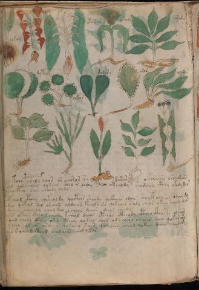
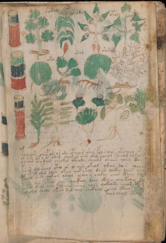

# Voynich Speculative Procedural Protocol — f101v

IMPORTANT: this is NOT a real or validated translation of the Voynich Manuscript. It is a speculative/procedural model that interprets EVA using a user-defined grammar to generate experimental recipes using safe, known edible substitutes.

This file is generated automatically from IVTFF/EVA transliteration plus a user-defined procedural grammar.





## Page / Folio
- currier: A
- folio: f101v
- page_number: 206

## EVA Text (Transliteration)
```text
[s:r]airaly
otaldy
otol
ytal
dokor
orar
otarar
ot[o:a]ly
soraly
okol
arom
oraram
oraeep
dytolg
olkor
dolary
odor
olaran
tolchor cheopor or ody cphey r shee fol s oiin otsheey otch???y kcho pcholy chor or choror sy dorar okoraiin orolodain
or aiin or o or odam chor s aiin okor cheeor sheeol qokol et???ol qoor cheey qykeod oeeo r choy s okeeody chodaiin cthy okody dar
ycheor o[?:e]o dain cheokal ykhody cheeods oraiin qoeey cthey ???eocthy dain cheod? dydy
ksear lol keeol otal or ol aiin okeod ykhey dain olcheol ???opcheol cthey qekeoldy qocthor sheody qockhhey odaiin shoytolaiin ?sodaiin dy
yaiin ol olor daiin okeey qok ykeol daiin qockhy daiin olch???dar qokeol dol oraiin oldaiin keeol@138; rch qokeeeor s ydy cheor okeey choldy dar
teeeol sheol qokeor ykhol olcho r chokey chor ctheey daiin???daiin cheeody cheey keo cheol daiiin deeor cheedy
daiin dair yteol chor qockhol daiin ckheey chey kchey da???oiin okeey ckheo l cheody kcheol daiin etee[o:y]s ctheody ctheo ckhosh[?:e] olchor
olaiin okeol cheo kol ches sheey qoor qokeody cheor okeo ???oiin cheey cthey ory ctheey qokeey shol ody cheol oralar shey qokar ary
sal chol choly okeey dal qol shckheol chol cthear keeol ???cheeo ol chs oraiin qokeeey soiin qodaiin cheol qokeey daiin cheodam
teol cheol etchey ???cheo r cheol cthol cholaiin chol qkar
```

## Domain Context (Heuristic; Not a Translation)

This section summarizes recurring **basewords** in this IVTFF domain and shows simple substring evidence that the token markers used by the procedural grammar occur inside frequent words.

Any Italian anagram / English gloss is a best-effort lexicon match, not a decipherment.


### Associated basewords (non-generic; top by frequency in this domain)
- `paiin` (count=241) → Italian anagram `piani`; English: plans (arrangements)
- `qokaiin` (count=122) → Italian anagram `ciancio`; English: [n/a]
- `okaiin` (count=109) → Italian anagram `coniai`; English: [n/a]
- `qokain` (count=101) → Italian anagram `acconi`; English: [n/a]
- `okain` (count=69) → Italian anagram `acino`; English: a berry
- `qokep` (count=65) → Italian anagram `pecco`; English: [n/a]
- `otain` (count=54) → Italian anagram `anito`; English: [n/a]
- `qokar` (count=48) → Italian anagram `carco`; English: [n/a]
- `saiin` (count=48) → Italian anagram `asini`; English: [n/a]
- `qokal` (count=46) → Italian anagram `calco`; English: cast (of sculpture)
- `kaiin` (count=45) → Italian anagram `acini`; English: [n/a]
- `qotaiin` (count=40) → Italian anagram `cationi`; English: [n/a]
- `lkaiin` (count=40) → Italian anagram `ancili`; English: [n/a]
- `qokeol` (count=38) → Italian anagram `eccolo`; English: [n/a]
- `qotain` (count=34) → Italian anagram `antico`; English: ancient

### Marker evidence (substring in frequent basewords)
- `qo`: 63 basewords; examples: `qokee`, `qokeep`, `qokaiin`, `qokain`, `qokep`, `qoke`
- `q`: 64 basewords; examples: `qokee`, `qokeep`, `qokaiin`, `qokain`, `qokep`, `qoke`
- `o`: 281 basewords; examples: `qokee`, `ol`, `o`, `qokeep`, `okee`, `qokaiin`
- `k`: 150 basewords; examples: `qokee`, `qokeep`, `okee`, `qokaiin`, `okaiin`, `qokain`
- `t`: 100 basewords; examples: `otaiin`, `otee`, `otal`, `otar`, `oteep`, `otep`
- `p`: 154 basewords; examples: `paiin`, `chep`, `qokeep`, `shep`, `par`, `oteep`
- `ch`: 144 basewords; examples: `chep`, `che`, `chol`, `chee`, `cheol`, `cheo`
- `sh`: 52 basewords; examples: `shep`, `she`, `shee`, `sheol`, `sheep`, `shol`
- `f`: 2 basewords; examples: `fchep`, `f`
- `cth`: 17 basewords; examples: `chcth`, `cthe`, `shcth`, `checth`, `cthol`, `cthee`
- `ckh`: 18 basewords; examples: `chckh`, `shckh`, `checkh`, `chckhe`, `chockh`, `sheckh`
- `cph`: 3 basewords; examples: `cphol`, `cph`, `cphe`
- `iin`: 38 basewords; examples: `aiin`, `paiin`, `qokaiin`, `okaiin`, `otaiin`, `saiin`
- `aiin`: 31 basewords; examples: `aiin`, `paiin`, `qokaiin`, `okaiin`, `otaiin`, `saiin`

## Recipes Index (This Page)
- [f101v.1,@Lf](#f101v-1-f101v-1-lf)
- [f101v.2,@Lf](#f101v-2-f101v-2-lf)
- [f101v.3,@Lf](#f101v-3-f101v-3-lf)
- [f101v.4,@Lf](#f101v-4-f101v-4-lf)
- [f101v.5,@Lf](#f101v-5-f101v-5-lf)
- [f101v.6,@Lf](#f101v-6-f101v-6-lf)
- [f101v.7,@Lf](#f101v-7-f101v-7-lf)
- [f101v.8,@Lf](#f101v-8-f101v-8-lf)
- [f101v.9,@Lf](#f101v-9-f101v-9-lf)
- [f101v.10,@Lf](#f101v-10-f101v-10-lf)
- [f101v.11,@Lf](#f101v-11-f101v-11-lf)
- [f101v.12,@Lf](#f101v-12-f101v-12-lf)
- [f101v.13,@Lf](#f101v-13-f101v-13-lf)
- [f101v.14,@Lf](#f101v-14-f101v-14-lf)
- [f101v.15,@Lf](#f101v-15-f101v-15-lf)
- [f101v.16,@Lf](#f101v-16-f101v-16-lf)
- [f101v.17,@Lf](#f101v-17-f101v-17-lf)
- [f101v.18,@Lf](#f101v-18-f101v-18-lf)
- [f101v.19,@P0](#f101v-19-f101v-19-p0)
- [f101v.20,+P0](#f101v-20-f101v-20-p0)
- [f101v.21,+P0](#f101v-21-f101v-21-p0)
- [f101v.22,+P0](#f101v-22-f101v-22-p0)
- [f101v.23,+P0](#f101v-23-f101v-23-p0)
- [f101v.24,+P0](#f101v-24-f101v-24-p0)
- [f101v.25,+P0](#f101v-25-f101v-25-p0)
- [f101v.26,+P0](#f101v-26-f101v-26-p0)
- [f101v.27,+P0](#f101v-27-f101v-27-p0)
- [f101v.28,+Pc](#f101v-28-f101v-28-pc)

## Line Glosses (Procedural Gloss Only; Not a Translation)

<a id="f101v-1-f101v-1-lf"></a>

### f101v.1,@Lf

EVA (original line):
```text
[s:r]airaly
```

English structural gloss (generated):

- s: tokens: s → connectors: s
- r: tokens: r → connectors: r
- airaly: tokens: a i r a l → connectors: r l → vowel_run: a (level 1; class a)

<a id="f101v-2-f101v-2-lf"></a>

### f101v.2,@Lf

EVA (original line):
```text
otaldy
```

English structural gloss (generated):

- otaldy: tokens: o t a l p → connectors: l → vowel_run: a (level 1; class a)

<a id="f101v-3-f101v-3-lf"></a>

### f101v.3,@Lf

EVA (original line):
```text
otol
```

English structural gloss (generated):

- otol: tokens: o t o l → connectors: l

<a id="f101v-4-f101v-4-lf"></a>

### f101v.4,@Lf

EVA (original line):
```text
ytal
```

English structural gloss (generated):

- ytal: tokens: t a l → connectors: l → vowel_run: a (level 1; class a)

<a id="f101v-5-f101v-5-lf"></a>

### f101v.5,@Lf

EVA (original line):
```text
dokor
```

English structural gloss (generated):

- dokor: tokens: p o k o r → connectors: r

<a id="f101v-6-f101v-6-lf"></a>

### f101v.6,@Lf

EVA (original line):
```text
orar
```

English structural gloss (generated):

- orar: tokens: o r a r → connectors: r r → vowel_run: a (level 1; class a)

<a id="f101v-7-f101v-7-lf"></a>

### f101v.7,@Lf

EVA (original line):
```text
otarar
```

English structural gloss (generated):

- otarar: tokens: o t a r a r → connectors: r r → vowel_run: a (level 1; class a)

<a id="f101v-8-f101v-8-lf"></a>

### f101v.8,@Lf

EVA (original line):
```text
ot[o:a]ly
```

English structural gloss (generated):

- ot: tokens: o t
- o: tokens: o
- a: tokens: a → vowel_run: a (level 1; class a)
- ly: tokens: l → connectors: l

<a id="f101v-9-f101v-9-lf"></a>

### f101v.9,@Lf

EVA (original line):
```text
soraly
```

English structural gloss (generated):

- soraly: tokens: s o r a l → connectors: s r l → vowel_run: a (level 1; class a)

<a id="f101v-10-f101v-10-lf"></a>

### f101v.10,@Lf

EVA (original line):
```text
okol
```

English structural gloss (generated):

- okol: tokens: o k o l → connectors: l

<a id="f101v-11-f101v-11-lf"></a>

### f101v.11,@Lf

EVA (original line):
```text
arom
```

English structural gloss (generated):

- arom: tokens: a r o m → connectors: r m → vowel_run: a (level 1; class a)

<a id="f101v-12-f101v-12-lf"></a>

### f101v.12,@Lf

EVA (original line):
```text
oraram
```

English structural gloss (generated):

- oraram: tokens: o r a r a m → connectors: r r m → vowel_run: a (level 1; class a)

<a id="f101v-13-f101v-13-lf"></a>

### f101v.13,@Lf

EVA (original line):
```text
oraeep
```

English structural gloss (generated):

- oraeep: tokens: o r a ee p → connectors: r → vowel_run: a (level 1; class a)

<a id="f101v-14-f101v-14-lf"></a>

### f101v.14,@Lf

EVA (original line):
```text
dytolg
```

English structural gloss (generated):

- dytolg: tokens: p t o l g → connectors: l

<a id="f101v-15-f101v-15-lf"></a>

### f101v.15,@Lf

EVA (original line):
```text
olkor
```

English structural gloss (generated):

- olkor: tokens: o l k o r → connectors: l r

<a id="f101v-16-f101v-16-lf"></a>

### f101v.16,@Lf

EVA (original line):
```text
dolary
```

English structural gloss (generated):

- dolary: tokens: p o l a r → connectors: l r → vowel_run: a (level 1; class a)

<a id="f101v-17-f101v-17-lf"></a>

### f101v.17,@Lf

EVA (original line):
```text
odor
```

English structural gloss (generated):

- odor: tokens: o p o r → connectors: r

<a id="f101v-18-f101v-18-lf"></a>

### f101v.18,@Lf

EVA (original line):
```text
olaran
```

English structural gloss (generated):

- olaran: tokens: o l a r a n → connectors: l r n → vowel_run: a (level 1; class a)

<a id="f101v-19-f101v-19-p0"></a>

### f101v.19,@P0

EVA (original line):
```text
tolchor cheopor or ody cphey r shee fol s oiin otsheey otch???y kcho pcholy chor or choror sy dorar okoraiin orolodain
```

English structural gloss (generated):

- tolchor: tokens: t o l ch o r → connectors: l r
- cheopor: tokens: ch e o p o r → connectors: r → vowel_run: e (level 1; class e)
- or: tokens: o r → connectors: r
- ody: tokens: o p
- cphey: tokens: cph e → vowel_run: e (level 1; class e)
- r: tokens: r → connectors: r
- shee: tokens: sh ee → vowel_run: ee (level 2; class e)
- fol: tokens: f o l → connectors: l
- s: tokens: s → connectors: s
- oiin: tokens: o iin → vowel_run: ii (level 2; class i) → suffix: iin
- otsheey: tokens: o t sh ee → vowel_run: ee (level 2; class e)
- otch: tokens: o t ch
- y: [unparsed]
- kcho: tokens: k ch o
- pcholy: tokens: p ch o l → connectors: l
- chor: tokens: ch o r → connectors: r
- or: tokens: o r → connectors: r
- choror: tokens: ch o r o r → connectors: r r
- sy: tokens: s → connectors: s
- dorar: tokens: p o r a r → connectors: r r → vowel_run: a (level 1; class a)
- okoraiin: tokens: o k o r aiin → connectors: r → vowel_run: a (level 1; class a) → suffix: aiin (lexicon-context: `oraiin` → `ironia`; irony)
- orolodain: tokens: o r o l o p a i n → connectors: r l n → vowel_run: a (level 1; class a)

<a id="f101v-20-f101v-20-p0"></a>

### f101v.20,+P0

EVA (original line):
```text
or aiin or o or odam chor s aiin okor cheeor sheeol qokol et???ol qoor cheey qykeod oeeo r choy s okeeody chodaiin cthy okody dar
```

English structural gloss (generated):

- or: tokens: o r → connectors: r
- aiin: tokens: aiin → vowel_run: a (level 1; class a) → suffix: aiin
- or: tokens: o r → connectors: r
- o: tokens: o
- or: tokens: o r → connectors: r
- odam: tokens: o p a m → connectors: m → vowel_run: a (level 1; class a)
- chor: tokens: ch o r → connectors: r
- s: tokens: s → connectors: s
- aiin: tokens: aiin → vowel_run: a (level 1; class a) → suffix: aiin
- okor: tokens: o k o r → connectors: r
- cheeor: tokens: ch ee o r → connectors: r → vowel_run: ee (level 2; class e)
- sheeol: tokens: sh ee o l → connectors: l → vowel_run: ee (level 2; class e)
- qokol: tokens: qo k o l → connectors: l
- et: tokens: e t → vowel_run: e (level 1; class e)
- ol: tokens: o l → connectors: l
- qoor: tokens: qo o r → connectors: r
- cheey: tokens: ch ee → vowel_run: ee (level 2; class e)
- qykeod: tokens: q k e o p → vowel_run: e (level 1; class e)
- oeeo: tokens: o ee o → vowel_run: ee (level 2; class e)
- r: tokens: r → connectors: r
- choy: tokens: ch o
- s: tokens: s → connectors: s
- okeeody: tokens: o k ee o p → vowel_run: ee (level 2; class e)
- chodaiin: tokens: ch o p aiin → vowel_run: a (level 1; class a) → suffix: aiin
- cthy: tokens: cth
- okody: tokens: o k o p
- dar: tokens: p a r → connectors: r → vowel_run: a (level 1; class a)

<a id="f101v-21-f101v-21-p0"></a>

### f101v.21,+P0

EVA (original line):
```text
ycheor o[?:e]o dain cheokal ykhody cheeods oraiin qoeey cthey ???eocthy dain cheod? dydy
```

English structural gloss (generated):

- ycheor: tokens: ch e o r → connectors: r → vowel_run: e (level 1; class e)
- o: tokens: o
- e: tokens: e → vowel_run: e (level 1; class e)
- o: tokens: o
- dain: tokens: p a i n → connectors: n → vowel_run: a (level 1; class a)
- cheokal: tokens: ch e o k a l → connectors: l → vowel_run: e (level 1; class e)
- ykhody: tokens: k h o p → unmodeled_tokens: h
- cheeods: tokens: ch ee o p s → connectors: s → vowel_run: ee (level 2; class e)
- oraiin: tokens: o r aiin → connectors: r → vowel_run: a (level 1; class a) → suffix: aiin (lexicon-context: `oraiin` → `ironia`; irony)
- qoeey: tokens: qo ee → vowel_run: ee (level 2; class e)
- cthey: tokens: cth e → vowel_run: e (level 1; class e)
- eocthy: tokens: e o cth → vowel_run: e (level 1; class e)
- dain: tokens: p a i n → connectors: n → vowel_run: a (level 1; class a)
- cheod: tokens: ch e o p → vowel_run: e (level 1; class e)
- dydy: tokens: p p

<a id="f101v-22-f101v-22-p0"></a>

### f101v.22,+P0

EVA (original line):
```text
ksear lol keeol otal or ol aiin okeod ykhey dain olcheol ???opcheol cthey qekeoldy qocthor sheody qockhhey odaiin shoytolaiin ?sodaiin dy
```

English structural gloss (generated):

- ksear: tokens: k s e a r → connectors: s r → vowel_run: e (level 1; class e)
- lol: tokens: l o l → connectors: l l
- keeol: tokens: k ee o l → connectors: l → vowel_run: ee (level 2; class e)
- otal: tokens: o t a l → connectors: l → vowel_run: a (level 1; class a)
- or: tokens: o r → connectors: r
- ol: tokens: o l → connectors: l
- aiin: tokens: aiin → vowel_run: a (level 1; class a) → suffix: aiin
- okeod: tokens: o k e o p → vowel_run: e (level 1; class e)
- ykhey: tokens: k h e → vowel_run: e (level 1; class e) → unmodeled_tokens: h
- dain: tokens: p a i n → connectors: n → vowel_run: a (level 1; class a)
- olcheol: tokens: o l ch e o l → connectors: l l → vowel_run: e (level 1; class e)
- opcheol: tokens: o p ch e o l → connectors: l → vowel_run: e (level 1; class e)
- cthey: tokens: cth e → vowel_run: e (level 1; class e)
- qekeoldy: tokens: q e k e o l p → connectors: l → vowel_run: e (level 1; class e)
- qocthor: tokens: qo cth o r → connectors: r
- sheody: tokens: sh e o p → vowel_run: e (level 1; class e)
- qockhhey: tokens: qo ckh h e → vowel_run: e (level 1; class e) → unmodeled_tokens: h
- odaiin: tokens: o p aiin → vowel_run: a (level 1; class a) → suffix: aiin (lexicon-context: `opaiin` → `opinai`; [n/a])
- shoytolaiin: tokens: sh o t o l aiin → connectors: l → vowel_run: a (level 1; class a) → suffix: aiin
- sodaiin: tokens: s o p aiin → connectors: s → vowel_run: a (level 1; class a) → suffix: aiin (lexicon-context: `opaiin` → `opinai`; [n/a])
- dy: tokens: p

<a id="f101v-23-f101v-23-p0"></a>

### f101v.23,+P0

EVA (original line):
```text
yaiin ol olor daiin okeey qok ykeol daiin qockhy daiin olch???dar qokeol dol oraiin oldaiin keeol@138; rch qokeeeor s ydy cheor okeey choldy dar
```

English structural gloss (generated):

- yaiin: tokens: aiin → vowel_run: a (level 1; class a) → suffix: aiin
- ol: tokens: o l → connectors: l
- olor: tokens: o l o r → connectors: l r
- daiin: tokens: p aiin → vowel_run: a (level 1; class a) → suffix: aiin (lexicon-context: `paiin` → `piani`; plans (arrangements))
- okeey: tokens: o k ee → vowel_run: ee (level 2; class e)
- qok: tokens: qo k
- ykeol: tokens: k e o l → connectors: l → vowel_run: e (level 1; class e)
- daiin: tokens: p aiin → vowel_run: a (level 1; class a) → suffix: aiin (lexicon-context: `paiin` → `piani`; plans (arrangements))
- qockhy: tokens: qo ckh
- daiin: tokens: p aiin → vowel_run: a (level 1; class a) → suffix: aiin (lexicon-context: `paiin` → `piani`; plans (arrangements))
- olch: tokens: o l ch → connectors: l
- dar: tokens: p a r → connectors: r → vowel_run: a (level 1; class a)
- qokeol: tokens: qo k e o l → connectors: l → vowel_run: e (level 1; class e)
- dol: tokens: p o l → connectors: l
- oraiin: tokens: o r aiin → connectors: r → vowel_run: a (level 1; class a) → suffix: aiin (lexicon-context: `oraiin` → `ironia`; irony)
- oldaiin: tokens: o l p aiin → connectors: l → vowel_run: a (level 1; class a) → suffix: aiin (lexicon-context: `paiin` → `piani`; plans (arrangements))
- keeol: tokens: k ee o l → connectors: l → vowel_run: ee (level 2; class e)
- rch: tokens: r ch → connectors: r
- qokeeeor: tokens: qo k eee o r → connectors: r → vowel_run: eee (level 3; class e)
- s: tokens: s → connectors: s
- ydy: tokens: p
- cheor: tokens: ch e o r → connectors: r → vowel_run: e (level 1; class e)
- okeey: tokens: o k ee → vowel_run: ee (level 2; class e)
- choldy: tokens: ch o l p → connectors: l
- dar: tokens: p a r → connectors: r → vowel_run: a (level 1; class a)

<a id="f101v-24-f101v-24-p0"></a>

### f101v.24,+P0

EVA (original line):
```text
teeeol sheol qokeor ykhol olcho r chokey chor ctheey daiin???daiin cheeody cheey keo cheol daiiin deeor cheedy
```

English structural gloss (generated):

- teeeol: tokens: t eee o l → connectors: l → vowel_run: eee (level 3; class e)
- sheol: tokens: sh e o l → connectors: l → vowel_run: e (level 1; class e)
- qokeor: tokens: qo k e o r → connectors: r → vowel_run: e (level 1; class e)
- ykhol: tokens: k h o l → connectors: l → unmodeled_tokens: h
- olcho: tokens: o l ch o → connectors: l
- r: tokens: r → connectors: r
- chokey: tokens: ch o k e → vowel_run: e (level 1; class e)
- chor: tokens: ch o r → connectors: r
- ctheey: tokens: cth ee → vowel_run: ee (level 2; class e)
- daiin: tokens: p aiin → vowel_run: a (level 1; class a) → suffix: aiin (lexicon-context: `paiin` → `piani`; plans (arrangements))
- daiin: tokens: p aiin → vowel_run: a (level 1; class a) → suffix: aiin (lexicon-context: `paiin` → `piani`; plans (arrangements))
- cheeody: tokens: ch ee o p → vowel_run: ee (level 2; class e)
- cheey: tokens: ch ee → vowel_run: ee (level 2; class e)
- keo: tokens: k e o → vowel_run: e (level 1; class e)
- cheol: tokens: ch e o l → connectors: l → vowel_run: e (level 1; class e)
- daiiin: tokens: p a iii n → connectors: n → vowel_run: a (level 1; class a) → suffix: iin
- deeor: tokens: p ee o r → connectors: r → vowel_run: ee (level 2; class e)
- cheedy: tokens: ch ee p → vowel_run: ee (level 2; class e)

<a id="f101v-25-f101v-25-p0"></a>

### f101v.25,+P0

EVA (original line):
```text
daiin dair yteol chor qockhol daiin ckheey chey kchey da???oiin okeey ckheo l cheody kcheol daiin etee[o:y]s ctheody ctheo ckhosh[?:e] olchor
```

English structural gloss (generated):

- daiin: tokens: p aiin → vowel_run: a (level 1; class a) → suffix: aiin (lexicon-context: `paiin` → `piani`; plans (arrangements))
- dair: tokens: p a i r → connectors: r → vowel_run: a (level 1; class a)
- yteol: tokens: t e o l → connectors: l → vowel_run: e (level 1; class e)
- chor: tokens: ch o r → connectors: r
- qockhol: tokens: qo ckh o l → connectors: l
- daiin: tokens: p aiin → vowel_run: a (level 1; class a) → suffix: aiin (lexicon-context: `paiin` → `piani`; plans (arrangements))
- ckheey: tokens: ckh ee → vowel_run: ee (level 2; class e)
- chey: tokens: ch e → vowel_run: e (level 1; class e)
- kchey: tokens: k ch e → vowel_run: e (level 1; class e)
- da: tokens: p a → vowel_run: a (level 1; class a)
- oiin: tokens: o iin → vowel_run: ii (level 2; class i) → suffix: iin
- okeey: tokens: o k ee → vowel_run: ee (level 2; class e)
- ckheo: tokens: ckh e o → vowel_run: e (level 1; class e)
- l: tokens: l → connectors: l
- cheody: tokens: ch e o p → vowel_run: e (level 1; class e)
- kcheol: tokens: k ch e o l → connectors: l → vowel_run: e (level 1; class e)
- daiin: tokens: p aiin → vowel_run: a (level 1; class a) → suffix: aiin (lexicon-context: `paiin` → `piani`; plans (arrangements))
- etee: tokens: e t ee → vowel_run: e (level 1; class e)
- o: tokens: o
- y: [unparsed]
- s: tokens: s → connectors: s
- ctheody: tokens: cth e o p → vowel_run: e (level 1; class e)
- ctheo: tokens: cth e o → vowel_run: e (level 1; class e)
- ckhosh: tokens: ckh o sh
- e: tokens: e → vowel_run: e (level 1; class e)
- olchor: tokens: o l ch o r → connectors: l r

<a id="f101v-26-f101v-26-p0"></a>

### f101v.26,+P0

EVA (original line):
```text
olaiin okeol cheo kol ches sheey qoor qokeody cheor okeo ???oiin cheey cthey ory ctheey qokeey shol ody cheol oralar shey qokar ary
```

English structural gloss (generated):

- olaiin: tokens: o l aiin → connectors: l → vowel_run: a (level 1; class a) → suffix: aiin
- okeol: tokens: o k e o l → connectors: l → vowel_run: e (level 1; class e)
- cheo: tokens: ch e o → vowel_run: e (level 1; class e)
- kol: tokens: k o l → connectors: l
- ches: tokens: ch e s → connectors: s → vowel_run: e (level 1; class e)
- sheey: tokens: sh ee → vowel_run: ee (level 2; class e)
- qoor: tokens: qo o r → connectors: r
- qokeody: tokens: qo k e o p → vowel_run: e (level 1; class e)
- cheor: tokens: ch e o r → connectors: r → vowel_run: e (level 1; class e)
- okeo: tokens: o k e o → vowel_run: e (level 1; class e)
- oiin: tokens: o iin → vowel_run: ii (level 2; class i) → suffix: iin
- cheey: tokens: ch ee → vowel_run: ee (level 2; class e)
- cthey: tokens: cth e → vowel_run: e (level 1; class e)
- ory: tokens: o r → connectors: r
- ctheey: tokens: cth ee → vowel_run: ee (level 2; class e)
- qokeey: tokens: qo k ee → vowel_run: ee (level 2; class e)
- shol: tokens: sh o l → connectors: l
- ody: tokens: o p
- cheol: tokens: ch e o l → connectors: l → vowel_run: e (level 1; class e)
- oralar: tokens: o r a l a r → connectors: r l r → vowel_run: a (level 1; class a)
- shey: tokens: sh e → vowel_run: e (level 1; class e)
- qokar: tokens: qo k a r → connectors: r → vowel_run: a (level 1; class a)
- ary: tokens: a r → connectors: r → vowel_run: a (level 1; class a)

<a id="f101v-27-f101v-27-p0"></a>

### f101v.27,+P0

EVA (original line):
```text
sal chol choly okeey dal qol shckheol chol cthear keeol ???cheeo ol chs oraiin qokeeey soiin qodaiin cheol qokeey daiin cheodam
```

English structural gloss (generated):

- sal: tokens: s a l → connectors: s l → vowel_run: a (level 1; class a)
- chol: tokens: ch o l → connectors: l
- choly: tokens: ch o l → connectors: l
- okeey: tokens: o k ee → vowel_run: ee (level 2; class e)
- dal: tokens: p a l → connectors: l → vowel_run: a (level 1; class a)
- qol: tokens: qo l → connectors: l
- shckheol: tokens: sh ckh e o l → connectors: l → vowel_run: e (level 1; class e)
- chol: tokens: ch o l → connectors: l
- cthear: tokens: cth e a r → connectors: r → vowel_run: e (level 1; class e)
- keeol: tokens: k ee o l → connectors: l → vowel_run: ee (level 2; class e)
- cheeo: tokens: ch ee o → vowel_run: ee (level 2; class e)
- ol: tokens: o l → connectors: l
- chs: tokens: ch s → connectors: s
- oraiin: tokens: o r aiin → connectors: r → vowel_run: a (level 1; class a) → suffix: aiin (lexicon-context: `oraiin` → `ironia`; irony)
- qokeeey: tokens: qo k eee → vowel_run: eee (level 3; class e)
- soiin: tokens: s o iin → connectors: s → vowel_run: ii (level 2; class i) → suffix: iin
- qodaiin: tokens: qo p aiin → vowel_run: a (level 1; class a) → suffix: aiin
- cheol: tokens: ch e o l → connectors: l → vowel_run: e (level 1; class e)
- qokeey: tokens: qo k ee → vowel_run: ee (level 2; class e)
- daiin: tokens: p aiin → vowel_run: a (level 1; class a) → suffix: aiin (lexicon-context: `paiin` → `piani`; plans (arrangements))
- cheodam: tokens: ch e o p a m → connectors: m → vowel_run: e (level 1; class e)

<a id="f101v-28-f101v-28-pc"></a>

### f101v.28,+Pc

EVA (original line):
```text
teol cheol etchey ???cheo r cheol cthol cholaiin chol qkar
```

English structural gloss (generated):

- teol: tokens: t e o l → connectors: l → vowel_run: e (level 1; class e)
- cheol: tokens: ch e o l → connectors: l → vowel_run: e (level 1; class e)
- etchey: tokens: e t ch e → vowel_run: e (level 1; class e)
- cheo: tokens: ch e o → vowel_run: e (level 1; class e)
- r: tokens: r → connectors: r
- cheol: tokens: ch e o l → connectors: l → vowel_run: e (level 1; class e)
- cthol: tokens: cth o l → connectors: l
- cholaiin: tokens: ch o l aiin → connectors: l → vowel_run: a (level 1; class a) → suffix: aiin
- chol: tokens: ch o l → connectors: l
- qkar: tokens: q k a r → connectors: r → vowel_run: a (level 1; class a)
