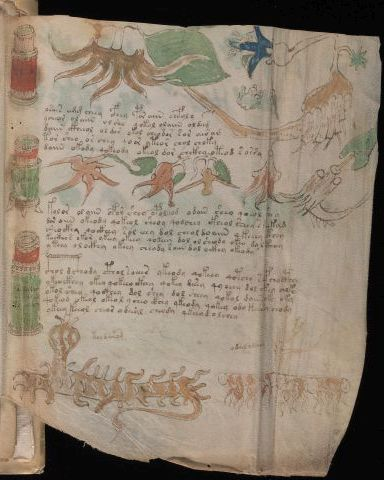

# Voynich Speculative Procedural Protocol — f102r2

IMPORTANT: this is NOT a real or validated translation of the Voynich Manuscript. It is a speculative/procedural model that interprets EVA using a user-defined grammar to generate experimental recipes using safe, known edible substitutes.

This file is generated automatically from IVTFF/EVA transliteration plus a user-defined procedural grammar.



## Page / Folio
- currier: A
- folio: f102r2
- page_number: 209

## EVA Text (Transliteration)
```text
kodaiig
lsais azg cheey cfhey por aiin chefol y
ycheor olaiin olsho qokol olaiin oldam
daiin ckheeol oldor okol cheodor sor airam
tor sheo or chey qoor yteor chol choky
daiin okody qokeody okeol dor chckhy oteod s orsy
ok[?:o]rolda
kolor olaiin opor shey opolkod odain sheo qoeol shey
dor oiin okeody qokeol sheoy qo[o:d]chey ckheol sheey skeekyd
shockhy qockhey sol eeey dol cheol doaiin qkeeey cthey
kockhas okor ykeey okeey qokeey dol ol sheody okey da l cthhhy
ytchy o l ockhy okeey cheody saiin dol ockhy okeady
loeekadag
oshea??l
so???dch
c@132;hol dc@133;hody cthol soeees ykeody qokeey qotchy soefchocphy
ykeockhey okey qokeeo ckhey qokey desey qyoeey dol chkey choky
otol shey qockhey dol shey dol sheey qokol daiin oky oky
qokeod okeal okeo l y cheo ckhey qkhody qokey ody keeody chody
ykeey keeol cheos ydeeal cheody ykeea d o lchey
koldarod
odalydary
```

## Domain Context (Heuristic; Not a Translation)

This section summarizes recurring **basewords** in this IVTFF domain and shows simple substring evidence that the token markers used by the procedural grammar occur inside frequent words.

Any Italian anagram / English gloss is a best-effort lexicon match, not a decipherment.


### Associated basewords (non-generic; top by frequency in this domain)
- `paiin` (count=241) → Italian anagram `piani`; English: plans (arrangements)
- `qokaiin` (count=122) → Italian anagram `ciancio`; English: [n/a]
- `okaiin` (count=109) → Italian anagram `coniai`; English: [n/a]
- `qokain` (count=101) → Italian anagram `acconi`; English: [n/a]
- `okain` (count=69) → Italian anagram `acino`; English: a berry
- `qokep` (count=65) → Italian anagram `pecco`; English: [n/a]
- `otain` (count=54) → Italian anagram `anito`; English: [n/a]
- `qokar` (count=48) → Italian anagram `carco`; English: [n/a]
- `saiin` (count=48) → Italian anagram `asini`; English: [n/a]
- `qokal` (count=46) → Italian anagram `calco`; English: cast (of sculpture)
- `kaiin` (count=45) → Italian anagram `acini`; English: [n/a]
- `qotaiin` (count=40) → Italian anagram `cationi`; English: [n/a]
- `lkaiin` (count=40) → Italian anagram `ancili`; English: [n/a]
- `qokeol` (count=38) → Italian anagram `eccolo`; English: [n/a]
- `qotain` (count=34) → Italian anagram `antico`; English: ancient

### Marker evidence (substring in frequent basewords)
- `qo`: 63 basewords; examples: `qokee`, `qokeep`, `qokaiin`, `qokain`, `qokep`, `qoke`
- `q`: 64 basewords; examples: `qokee`, `qokeep`, `qokaiin`, `qokain`, `qokep`, `qoke`
- `o`: 281 basewords; examples: `qokee`, `ol`, `o`, `qokeep`, `okee`, `qokaiin`
- `k`: 150 basewords; examples: `qokee`, `qokeep`, `okee`, `qokaiin`, `okaiin`, `qokain`
- `t`: 100 basewords; examples: `otaiin`, `otee`, `otal`, `otar`, `oteep`, `otep`
- `p`: 154 basewords; examples: `paiin`, `chep`, `qokeep`, `shep`, `par`, `oteep`
- `ch`: 144 basewords; examples: `chep`, `che`, `chol`, `chee`, `cheol`, `cheo`
- `sh`: 52 basewords; examples: `shep`, `she`, `shee`, `sheol`, `sheep`, `shol`
- `f`: 2 basewords; examples: `fchep`, `f`
- `cth`: 17 basewords; examples: `chcth`, `cthe`, `shcth`, `checth`, `cthol`, `cthee`
- `ckh`: 18 basewords; examples: `chckh`, `shckh`, `checkh`, `chckhe`, `chockh`, `sheckh`
- `cph`: 3 basewords; examples: `cphol`, `cph`, `cphe`
- `iin`: 38 basewords; examples: `aiin`, `paiin`, `qokaiin`, `okaiin`, `otaiin`, `saiin`
- `aiin`: 31 basewords; examples: `aiin`, `paiin`, `qokaiin`, `okaiin`, `otaiin`, `saiin`

## Recipes Index (This Page)
- [f102r2.1,@Lc](#f102r2-1-f102r2-1-lc)
- [f102r2.2,@P0](#f102r2-2-f102r2-2-p0)
- [f102r2.3,+P0](#f102r2-3-f102r2-3-p0)
- [f102r2.4,+P0](#f102r2-4-f102r2-4-p0)
- [f102r2.5,+P0](#f102r2-5-f102r2-5-p0)
- [f102r2.6,+P0](#f102r2-6-f102r2-6-p0)
- [f102r2.7,@Lc](#f102r2-7-f102r2-7-lc)
- [f102r2.8,@P0](#f102r2-8-f102r2-8-p0)
- [f102r2.9,+P0](#f102r2-9-f102r2-9-p0)
- [f102r2.10,+P0](#f102r2-10-f102r2-10-p0)
- [f102r2.11,+P0](#f102r2-11-f102r2-11-p0)
- [f102r2.12,+P0](#f102r2-12-f102r2-12-p0)
- [f102r2.13,@Lc](#f102r2-13-f102r2-13-lc)
- [f102r2.14,+Lc](#f102r2-14-f102r2-14-lc)
- [f102r2.15,+Lc](#f102r2-15-f102r2-15-lc)
- [f102r2.16,@P0](#f102r2-16-f102r2-16-p0)
- [f102r2.17,+P0](#f102r2-17-f102r2-17-p0)
- [f102r2.18,+P0](#f102r2-18-f102r2-18-p0)
- [f102r2.19,+P0](#f102r2-19-f102r2-19-p0)
- [f102r2.20,+P0](#f102r2-20-f102r2-20-p0)
- [f102r2.21,@Lf](#f102r2-21-f102r2-21-lf)
- [f102r2.22,@Lf](#f102r2-22-f102r2-22-lf)

## Line Glosses (Procedural Gloss Only; Not a Translation)

<a id="f102r2-1-f102r2-1-lc"></a>

### f102r2.1,@Lc

EVA (original line):
```text
kodaiig
```

English structural gloss (generated):

- kodaiig: tokens: k o p a ii g → vowel_run: a (level 1; class a)

<a id="f102r2-2-f102r2-2-p0"></a>

### f102r2.2,@P0

EVA (original line):
```text
lsais azg cheey cfhey por aiin chefol y
```

English structural gloss (generated):

- lsais: tokens: l s a i s → connectors: l s s → vowel_run: a (level 1; class a)
- azg: tokens: a z g → vowel_run: a (level 1; class a) → unmodeled_tokens: z
- cheey: tokens: ch ee → vowel_run: ee (level 2; class e)
- cfhey: tokens: cfh e → vowel_run: e (level 1; class e)
- por: tokens: p o r → connectors: r
- aiin: tokens: aiin → vowel_run: a (level 1; class a) → suffix: aiin
- chefol: tokens: ch e f o l → connectors: l → vowel_run: e (level 1; class e)
- y: [unparsed]

<a id="f102r2-3-f102r2-3-p0"></a>

### f102r2.3,+P0

EVA (original line):
```text
ycheor olaiin olsho qokol olaiin oldam
```

English structural gloss (generated):

- ycheor: tokens: ch e o r → connectors: r → vowel_run: e (level 1; class e)
- olaiin: tokens: o l aiin → connectors: l → vowel_run: a (level 1; class a) → suffix: aiin
- olsho: tokens: o l sh o → connectors: l
- qokol: tokens: qo k o l → connectors: l
- olaiin: tokens: o l aiin → connectors: l → vowel_run: a (level 1; class a) → suffix: aiin
- oldam: tokens: o l p a m → connectors: l m → vowel_run: a (level 1; class a)

<a id="f102r2-4-f102r2-4-p0"></a>

### f102r2.4,+P0

EVA (original line):
```text
daiin ckheeol oldor okol cheodor sor airam
```

English structural gloss (generated):

- daiin: tokens: p aiin → vowel_run: a (level 1; class a) → suffix: aiin (lexicon-context: `paiin` → `piani`; plans (arrangements))
- ckheeol: tokens: ckh ee o l → connectors: l → vowel_run: ee (level 2; class e)
- oldor: tokens: o l p o r → connectors: l r
- okol: tokens: o k o l → connectors: l
- cheodor: tokens: ch e o p o r → connectors: r → vowel_run: e (level 1; class e)
- sor: tokens: s o r → connectors: s r
- airam: tokens: a i r a m → connectors: r m → vowel_run: a (level 1; class a)

<a id="f102r2-5-f102r2-5-p0"></a>

### f102r2.5,+P0

EVA (original line):
```text
tor sheo or chey qoor yteor chol choky
```

English structural gloss (generated):

- tor: tokens: t o r → connectors: r
- sheo: tokens: sh e o → vowel_run: e (level 1; class e)
- or: tokens: o r → connectors: r
- chey: tokens: ch e → vowel_run: e (level 1; class e)
- qoor: tokens: qo o r → connectors: r
- yteor: tokens: t e o r → connectors: r → vowel_run: e (level 1; class e)
- chol: tokens: ch o l → connectors: l
- choky: tokens: ch o k

<a id="f102r2-6-f102r2-6-p0"></a>

### f102r2.6,+P0

EVA (original line):
```text
daiin okody qokeody okeol dor chckhy oteod s orsy
```

English structural gloss (generated):

- daiin: tokens: p aiin → vowel_run: a (level 1; class a) → suffix: aiin (lexicon-context: `paiin` → `piani`; plans (arrangements))
- okody: tokens: o k o p
- qokeody: tokens: qo k e o p → vowel_run: e (level 1; class e)
- okeol: tokens: o k e o l → connectors: l → vowel_run: e (level 1; class e)
- dor: tokens: p o r → connectors: r
- chckhy: tokens: ch ckh
- oteod: tokens: o t e o p → vowel_run: e (level 1; class e)
- s: tokens: s → connectors: s
- orsy: tokens: o r s → connectors: r s

<a id="f102r2-7-f102r2-7-lc"></a>

### f102r2.7,@Lc

EVA (original line):
```text
ok[?:o]rolda
```

English structural gloss (generated):

- ok: tokens: o k
- o: tokens: o
- rolda: tokens: r o l p a → connectors: r l → vowel_run: a (level 1; class a)

<a id="f102r2-8-f102r2-8-p0"></a>

### f102r2.8,@P0

EVA (original line):
```text
kolor olaiin opor shey opolkod odain sheo qoeol shey
```

English structural gloss (generated):

- kolor: tokens: k o l o r → connectors: l r
- olaiin: tokens: o l aiin → connectors: l → vowel_run: a (level 1; class a) → suffix: aiin
- opor: tokens: o p o r → connectors: r
- shey: tokens: sh e → vowel_run: e (level 1; class e)
- opolkod: tokens: o p o l k o p → connectors: l
- odain: tokens: o p a i n → connectors: n → vowel_run: a (level 1; class a)
- sheo: tokens: sh e o → vowel_run: e (level 1; class e)
- qoeol: tokens: qo e o l → connectors: l → vowel_run: e (level 1; class e)
- shey: tokens: sh e → vowel_run: e (level 1; class e)

<a id="f102r2-9-f102r2-9-p0"></a>

### f102r2.9,+P0

EVA (original line):
```text
dor oiin okeody qokeol sheoy qo[o:d]chey ckheol sheey skeekyd
```

English structural gloss (generated):

- dor: tokens: p o r → connectors: r
- oiin: tokens: o iin → vowel_run: ii (level 2; class i) → suffix: iin
- okeody: tokens: o k e o p → vowel_run: e (level 1; class e)
- qokeol: tokens: qo k e o l → connectors: l → vowel_run: e (level 1; class e)
- sheoy: tokens: sh e o → vowel_run: e (level 1; class e)
- qo: tokens: qo
- o: tokens: o
- d: tokens: p
- chey: tokens: ch e → vowel_run: e (level 1; class e)
- ckheol: tokens: ckh e o l → connectors: l → vowel_run: e (level 1; class e)
- sheey: tokens: sh ee → vowel_run: ee (level 2; class e)
- skeekyd: tokens: s k ee k p → connectors: s → vowel_run: ee (level 2; class e)

<a id="f102r2-10-f102r2-10-p0"></a>

### f102r2.10,+P0

EVA (original line):
```text
shockhy qockhey sol eeey dol cheol doaiin qkeeey cthey
```

English structural gloss (generated):

- shockhy: tokens: sh o ckh
- qockhey: tokens: qo ckh e → vowel_run: e (level 1; class e)
- sol: tokens: s o l → connectors: s l
- eeey: tokens: eee → vowel_run: eee (level 3; class e)
- dol: tokens: p o l → connectors: l
- cheol: tokens: ch e o l → connectors: l → vowel_run: e (level 1; class e)
- doaiin: tokens: p o aiin → vowel_run: a (level 1; class a) → suffix: aiin
- qkeeey: tokens: q k eee → vowel_run: eee (level 3; class e)
- cthey: tokens: cth e → vowel_run: e (level 1; class e)

<a id="f102r2-11-f102r2-11-p0"></a>

### f102r2.11,+P0

EVA (original line):
```text
kockhas okor ykeey okeey qokeey dol ol sheody okey da l cthhhy
```

English structural gloss (generated):

- kockhas: tokens: k o ckh a s → connectors: s → vowel_run: a (level 1; class a)
- okor: tokens: o k o r → connectors: r
- ykeey: tokens: k ee → vowel_run: ee (level 2; class e)
- okeey: tokens: o k ee → vowel_run: ee (level 2; class e)
- qokeey: tokens: qo k ee → vowel_run: ee (level 2; class e)
- dol: tokens: p o l → connectors: l
- ol: tokens: o l → connectors: l
- sheody: tokens: sh e o p → vowel_run: e (level 1; class e)
- okey: tokens: o k e → vowel_run: e (level 1; class e)
- da: tokens: p a → vowel_run: a (level 1; class a)
- l: tokens: l → connectors: l
- cthhhy: tokens: cth h h → unmodeled_tokens: h

<a id="f102r2-12-f102r2-12-p0"></a>

### f102r2.12,+P0

EVA (original line):
```text
ytchy o l ockhy okeey cheody saiin dol ockhy okeady
```

English structural gloss (generated):

- ytchy: tokens: t ch
- o: tokens: o
- l: tokens: l → connectors: l
- ockhy: tokens: o ckh
- okeey: tokens: o k ee → vowel_run: ee (level 2; class e)
- cheody: tokens: ch e o p → vowel_run: e (level 1; class e)
- saiin: tokens: s aiin → connectors: s → vowel_run: a (level 1; class a) → suffix: aiin (lexicon-context: `saiin` → `asini`; [n/a])
- dol: tokens: p o l → connectors: l
- ockhy: tokens: o ckh
- okeady: tokens: o k e a p → vowel_run: e (level 1; class e)

<a id="f102r2-13-f102r2-13-lc"></a>

### f102r2.13,@Lc

EVA (original line):
```text
loeekadag
```

English structural gloss (generated):

- loeekadag: tokens: l o ee k a p a g → connectors: l → vowel_run: ee (level 2; class e)

<a id="f102r2-14-f102r2-14-lc"></a>

### f102r2.14,+Lc

EVA (original line):
```text
oshea??l
```

English structural gloss (generated):

- oshea: tokens: o sh e a → vowel_run: e (level 1; class e)
- l: tokens: l → connectors: l

<a id="f102r2-15-f102r2-15-lc"></a>

### f102r2.15,+Lc

EVA (original line):
```text
so???dch
```

English structural gloss (generated):

- so: tokens: s o → connectors: s
- dch: tokens: p ch

<a id="f102r2-16-f102r2-16-p0"></a>

### f102r2.16,@P0

EVA (original line):
```text
c@132;hol dc@133;hody cthol soeees ykeody qokeey qotchy soefchocphy
```

English structural gloss (generated):

- c: tokens: c
- hol: tokens: h o l → connectors: l → unmodeled_tokens: h
- dc: tokens: p c
- hody: tokens: h o p → unmodeled_tokens: h
- cthol: tokens: cth o l → connectors: l
- soeees: tokens: s o eee s → connectors: s s → vowel_run: eee (level 3; class e)
- ykeody: tokens: k e o p → vowel_run: e (level 1; class e)
- qokeey: tokens: qo k ee → vowel_run: ee (level 2; class e)
- qotchy: tokens: qo t ch
- soefchocphy: tokens: s o e f ch o cph → connectors: s → vowel_run: e (level 1; class e)

<a id="f102r2-17-f102r2-17-p0"></a>

### f102r2.17,+P0

EVA (original line):
```text
ykeockhey okey qokeeo ckhey qokey desey qyoeey dol chkey choky
```

English structural gloss (generated):

- ykeockhey: tokens: k e o ckh e → vowel_run: e (level 1; class e)
- okey: tokens: o k e → vowel_run: e (level 1; class e)
- qokeeo: tokens: qo k ee o → vowel_run: ee (level 2; class e)
- ckhey: tokens: ckh e → vowel_run: e (level 1; class e)
- qokey: tokens: qo k e → vowel_run: e (level 1; class e)
- desey: tokens: p e s e → connectors: s → vowel_run: e (level 1; class e)
- qyoeey: tokens: qo ee → vowel_run: ee (level 2; class e)
- dol: tokens: p o l → connectors: l
- chkey: tokens: ch k e → vowel_run: e (level 1; class e)
- choky: tokens: ch o k

<a id="f102r2-18-f102r2-18-p0"></a>

### f102r2.18,+P0

EVA (original line):
```text
otol shey qockhey dol shey dol sheey qokol daiin oky oky
```

English structural gloss (generated):

- otol: tokens: o t o l → connectors: l
- shey: tokens: sh e → vowel_run: e (level 1; class e)
- qockhey: tokens: qo ckh e → vowel_run: e (level 1; class e)
- dol: tokens: p o l → connectors: l
- shey: tokens: sh e → vowel_run: e (level 1; class e)
- dol: tokens: p o l → connectors: l
- sheey: tokens: sh ee → vowel_run: ee (level 2; class e)
- qokol: tokens: qo k o l → connectors: l
- daiin: tokens: p aiin → vowel_run: a (level 1; class a) → suffix: aiin (lexicon-context: `paiin` → `piani`; plans (arrangements))
- oky: tokens: o k
- oky: tokens: o k

<a id="f102r2-19-f102r2-19-p0"></a>

### f102r2.19,+P0

EVA (original line):
```text
qokeod okeal okeo l y cheo ckhey qkhody qokey ody keeody chody
```

English structural gloss (generated):

- qokeod: tokens: qo k e o p → vowel_run: e (level 1; class e)
- okeal: tokens: o k e a l → connectors: l → vowel_run: e (level 1; class e)
- okeo: tokens: o k e o → vowel_run: e (level 1; class e)
- l: tokens: l → connectors: l
- y: [unparsed]
- cheo: tokens: ch e o → vowel_run: e (level 1; class e)
- ckhey: tokens: ckh e → vowel_run: e (level 1; class e)
- qkhody: tokens: q k h o p → unmodeled_tokens: h
- qokey: tokens: qo k e → vowel_run: e (level 1; class e)
- ody: tokens: o p
- keeody: tokens: k ee o p → vowel_run: ee (level 2; class e)
- chody: tokens: ch o p

<a id="f102r2-20-f102r2-20-p0"></a>

### f102r2.20,+P0

EVA (original line):
```text
ykeey keeol cheos ydeeal cheody ykeea d o lchey
```

English structural gloss (generated):

- ykeey: tokens: k ee → vowel_run: ee (level 2; class e)
- keeol: tokens: k ee o l → connectors: l → vowel_run: ee (level 2; class e)
- cheos: tokens: ch e o s → connectors: s → vowel_run: e (level 1; class e)
- ydeeal: tokens: p ee a l → connectors: l → vowel_run: ee (level 2; class e)
- cheody: tokens: ch e o p → vowel_run: e (level 1; class e)
- ykeea: tokens: k ee a → vowel_run: ee (level 2; class e)
- d: tokens: p
- o: tokens: o
- lchey: tokens: l ch e → connectors: l → vowel_run: e (level 1; class e)

<a id="f102r2-21-f102r2-21-lf"></a>

### f102r2.21,@Lf

EVA (original line):
```text
koldarod
```

English structural gloss (generated):

- koldarod: tokens: k o l p a r o p → connectors: l r → vowel_run: a (level 1; class a)

<a id="f102r2-22-f102r2-22-lf"></a>

### f102r2.22,@Lf

EVA (original line):
```text
odalydary
```

English structural gloss (generated):

- odalydary: tokens: o p a l p a r → connectors: l r → vowel_run: a (level 1; class a)
