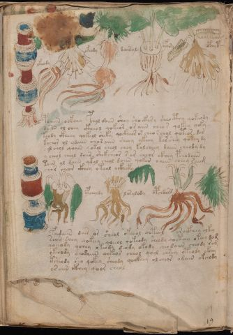

# Voynich Speculative Procedural Protocol — f102v1

IMPORTANT: this is NOT a real or validated translation of the Voynich Manuscript. It is a speculative/procedural model that interprets EVA using a user-defined grammar to generate experimental recipes using safe, known edible substitutes.

This file is generated automatically from IVTFF/EVA transliteration plus a user-defined procedural grammar.



## Page / Folio
- currier: A
- folio: f102v1
- page_number: 211

## EVA Text (Transliteration)
```text
keoraiiin
okeody
okeody
daiisaly
ypary
opchytcy
poaiin ockhey pchol doiin shey shockhsy sheocthy qokeody
dairn ol chey [cth:ckh]eol qokeor os aiin cheor qokey choky
teody ckheey qokeol sheky qockheor or cheo rchol qoteor dar
kochor ol ydaiin choraiin sheey ykeey kor shey qokey dy
sol chol qooiin qokol cheol chey kolcheey daiin cheody dy
y cheol cheol doiir shekcheor s ar cheor @246;khey pchodaiin
toiin ol daiin qkol cheol daiin qokar oaiin cheey [s:r]aiim
chor cheor ckhey oteol aikheky
d?indy
ypcholdy
loralody
opchdard
fo[i:e]daiin dair or sheol okeeol qoteol oroikhey olkey
soiin shey qokeey qoeeol qokeody sheody qoeteey okeey dam
qoeeody ychey okeody deody okody cheodaiin cheody [r:s]am
yk[ee:ch]ody chodaiin qokeos cheol qool chsey oteody okchy
ksheody sho qokey sheody qockhey olcheor odain okchody
ysaiin ckhey qoor cheol
```

## Domain Context (Heuristic; Not a Translation)

This section summarizes recurring **basewords** in this IVTFF domain and shows simple substring evidence that the token markers used by the procedural grammar occur inside frequent words.

Any Italian anagram / English gloss is a best-effort lexicon match, not a decipherment.


### Associated basewords (non-generic; top by frequency in this domain)
- `daiin` (count=231) → Italian anagram `piani`; English: plans (arrangements)
- `qokaiin` (count=122) → Italian anagram `ciancio`; English: [n/a]
- `okaiin` (count=109) → Italian anagram `coniai`; English: [n/a]
- `qokain` (count=101) → Italian anagram `acconi`; English: [n/a]
- `okain` (count=69) → Italian anagram `acino`; English: a berry
- `otain` (count=53) → Italian anagram `anito`; English: [n/a]
- `qokar` (count=48) → Italian anagram `carco`; English: [n/a]
- `saiin` (count=46) → Italian anagram `asini`; English: [n/a]
- `qokal` (count=43) → Italian anagram `calco`; English: cast (of sculpture)
- `qotaiin` (count=40) → Italian anagram `cationi`; English: [n/a]
- `lkaiin` (count=39) → Italian anagram `ancili`; English: [n/a]
- `kaiin` (count=37) → Italian anagram `acini`; English: [n/a]
- `qokeol` (count=37) → Italian anagram `eccolo`; English: [n/a]
- `qotain` (count=34) → Italian anagram `antico`; English: ancient
- `qotar` (count=29) → Italian anagram `corta`; English: [n/a]

### Marker evidence (substring in frequent basewords)
- `qo`: 60 basewords; examples: `qokeey`, `qokeedy`, `qokaiin`, `qokain`, `qokedy`, `qokey`
- `q`: 61 basewords; examples: `qokeey`, `qokeedy`, `qokaiin`, `qokain`, `qokedy`, `qokey`
- `o`: 262 basewords; examples: `qokeey`, `ol`, `o`, `qokeedy`, `okeey`, `qokaiin`
- `k`: 147 basewords; examples: `qokeey`, `qokeedy`, `okeey`, `qokaiin`, `okaiin`, `qokain`
- `t`: 102 basewords; examples: `otaiin`, `oteey`, `otar`, `otedy`, `otal`, `oteedy`
- `p`: 17 basewords; examples: `opchedy`, `qopchedy`, `opchey`, `pchedy`, `qopchdy`, `opchdy`
- `ch`: 137 basewords; examples: `chedy`, `chey`, `chol`, `cheey`, `cheol`, `cheody`
- `sh`: 50 basewords; examples: `shedy`, `shey`, `sheey`, `sheol`, `shol`, `sheedy`
- `f`: 1 basewords; examples: `f`
- `cth`: 16 basewords; examples: `chcthy`, `cthey`, `shcthy`, `checthy`, `cthol`, `ctheey`
- `ckh`: 15 basewords; examples: `chckhy`, `shckhy`, `checkhy`, `chckhey`, `chockhy`, `sheckhy`
- `cph`: 2 basewords; examples: `cphol`, `cphy`
- `dy`: 84 basewords; examples: `chedy`, `qokeedy`, `shedy`, `otedy`, `oteedy`, `qokedy`
- `iin`: 39 basewords; examples: `aiin`, `daiin`, `qokaiin`, `okaiin`, `otaiin`, `saiin`
- `aiin`: 33 basewords; examples: `aiin`, `daiin`, `qokaiin`, `okaiin`, `otaiin`, `saiin`

## Recipes Index (This Page)
- [f102v1.1,@Lc](#f102v1-1-f102v1-1-lc)
- [f102v1.2,@Lf](#f102v1-2-f102v1-2-lf)
- [f102v1.3,@Lf](#f102v1-3-f102v1-3-lf)
- [f102v1.4,@Lf](#f102v1-4-f102v1-4-lf)
- [f102v1.5,@Lf](#f102v1-5-f102v1-5-lf)
- [f102v1.6,@Lf](#f102v1-6-f102v1-6-lf)
- [f102v1.7,@P0](#f102v1-7-f102v1-7-p0)
- [f102v1.8,+P0](#f102v1-8-f102v1-8-p0)
- [f102v1.9,+P0](#f102v1-9-f102v1-9-p0)
- [f102v1.10,+P0](#f102v1-10-f102v1-10-p0)
- [f102v1.11,+P0](#f102v1-11-f102v1-11-p0)
- [f102v1.12,+P0](#f102v1-12-f102v1-12-p0)
- [f102v1.13,+P0](#f102v1-13-f102v1-13-p0)
- [f102v1.14,+P0](#f102v1-14-f102v1-14-p0)
- [f102v1.15,@Lc](#f102v1-15-f102v1-15-lc)
- [f102v1.16,@Lf](#f102v1-16-f102v1-16-lf)
- [f102v1.17,@Lf](#f102v1-17-f102v1-17-lf)
- [f102v1.18,@Lf](#f102v1-18-f102v1-18-lf)
- [f102v1.19,@P0](#f102v1-19-f102v1-19-p0)
- [f102v1.20,+P0](#f102v1-20-f102v1-20-p0)
- [f102v1.21,+P0](#f102v1-21-f102v1-21-p0)
- [f102v1.22,+P0](#f102v1-22-f102v1-22-p0)
- [f102v1.23,+P0](#f102v1-23-f102v1-23-p0)
- [f102v1.24,+P0](#f102v1-24-f102v1-24-p0)

## Line Glosses (Procedural Gloss Only; Not a Translation)

<a id="f102v1-1-f102v1-1-lc"></a>

### f102v1.1,@Lc

EVA: keoraiiin

Direct Gloss (Procedural, Not a Real Translation):
- keoraiiin: tokens: k e o r a iii n → connectors: r n → vowel_run: e (level 1; class e) → suffix: iin

<a id="f102v1-2-f102v1-2-lf"></a>

### f102v1.2,@Lf

EVA: okeody

Direct Gloss (Procedural, Not a Real Translation):
- okeody: tokens: o k e o p → vowel_run: e (level 1; class e)

<a id="f102v1-3-f102v1-3-lf"></a>

### f102v1.3,@Lf

EVA: okeody

Direct Gloss (Procedural, Not a Real Translation):
- okeody: tokens: o k e o p → vowel_run: e (level 1; class e)

<a id="f102v1-4-f102v1-4-lf"></a>

### f102v1.4,@Lf

EVA: daiisaly

Direct Gloss (Procedural, Not a Real Translation):
- daiisaly: tokens: p a ii s a l → connectors: s l → vowel_run: a (level 1; class a)

<a id="f102v1-5-f102v1-5-lf"></a>

### f102v1.5,@Lf

EVA: ypary

Direct Gloss (Procedural, Not a Real Translation):
- ypary: tokens: p a r → connectors: r → vowel_run: a (level 1; class a)

<a id="f102v1-6-f102v1-6-lf"></a>

### f102v1.6,@Lf

EVA: opchytcy

Direct Gloss (Procedural, Not a Real Translation):
- opchytcy: tokens: o p ch t c

<a id="f102v1-7-f102v1-7-p0"></a>

### f102v1.7,@P0

EVA: poaiin ockhey pchol doiin shey shockhsy sheocthy qokeody

Direct Gloss (Procedural, Not a Real Translation):
- poaiin: tokens: p o aiin → vowel_run: a (level 1; class a) → suffix: aiin
- ockhey: tokens: o ckh e → vowel_run: e (level 1; class e)
- pchol: tokens: p ch o l → connectors: l
- doiin: tokens: p o iin → vowel_run: ii (level 2; class i) → suffix: iin
- shey: tokens: sh e → vowel_run: e (level 1; class e)
- shockhsy: tokens: sh o ckh s → connectors: s
- sheocthy: tokens: sh e o cth → vowel_run: e (level 1; class e)
- qokeody: tokens: qo k e o p → vowel_run: e (level 1; class e)

<a id="f102v1-8-f102v1-8-p0"></a>

### f102v1.8,+P0

EVA: dairn ol chey [cth:ckh]eol qokeor os aiin cheor qokey choky

Direct Gloss (Procedural, Not a Real Translation):
- dairn: tokens: p a i r n → connectors: r n → vowel_run: a (level 1; class a)
- ol: tokens: o l → connectors: l
- chey: tokens: ch e → vowel_run: e (level 1; class e)
- cth: tokens: cth
- ckh: tokens: ckh
- eol: tokens: e o l → connectors: l → vowel_run: e (level 1; class e)
- qokeor: tokens: qo k e o r → connectors: r → vowel_run: e (level 1; class e)
- os: tokens: o s → connectors: s
- aiin: tokens: aiin → vowel_run: a (level 1; class a) → suffix: aiin
- cheor: tokens: ch e o r → connectors: r → vowel_run: e (level 1; class e)
- qokey: tokens: qo k e → vowel_run: e (level 1; class e)
- choky: tokens: ch o k

<a id="f102v1-9-f102v1-9-p0"></a>

### f102v1.9,+P0

EVA: teody ckheey qokeol sheky qockheor or cheo rchol qoteor dar

Direct Gloss (Procedural, Not a Real Translation):
- teody: tokens: t e o p → vowel_run: e (level 1; class e)
- ckheey: tokens: ckh ee → vowel_run: ee (level 2; class e)
- qokeol: tokens: qo k e o l → connectors: l → vowel_run: e (level 1; class e)
- sheky: tokens: sh e k → vowel_run: e (level 1; class e)
- qockheor: tokens: qo ckh e o r → connectors: r → vowel_run: e (level 1; class e)
- or: tokens: o r → connectors: r
- cheo: tokens: ch e o → vowel_run: e (level 1; class e)
- rchol: tokens: r ch o l → connectors: r l
- qoteor: tokens: qo t e o r → connectors: r → vowel_run: e (level 1; class e)
- dar: tokens: p a r → connectors: r → vowel_run: a (level 1; class a)

<a id="f102v1-10-f102v1-10-p0"></a>

### f102v1.10,+P0

EVA: kochor ol ydaiin choraiin sheey ykeey kor shey qokey dy

Direct Gloss (Procedural, Not a Real Translation):
- kochor: tokens: k o ch o r → connectors: r
- ol: tokens: o l → connectors: l
- ydaiin: tokens: p aiin → vowel_run: a (level 1; class a) → suffix: aiin
- choraiin: tokens: ch o r aiin → connectors: r → vowel_run: a (level 1; class a) → suffix: aiin
- sheey: tokens: sh ee → vowel_run: ee (level 2; class e)
- ykeey: tokens: k ee → vowel_run: ee (level 2; class e)
- kor: tokens: k o r → connectors: r
- shey: tokens: sh e → vowel_run: e (level 1; class e)
- qokey: tokens: qo k e → vowel_run: e (level 1; class e)
- dy: tokens: p

<a id="f102v1-11-f102v1-11-p0"></a>

### f102v1.11,+P0

EVA: sol chol qooiin qokol cheol chey kolcheey daiin cheody dy

Direct Gloss (Procedural, Not a Real Translation):
- sol: tokens: s o l → connectors: s l
- chol: tokens: ch o l → connectors: l
- qooiin: tokens: qo o iin → vowel_run: ii (level 2; class i) → suffix: iin
- qokol: tokens: qo k o l → connectors: l
- cheol: tokens: ch e o l → connectors: l → vowel_run: e (level 1; class e)
- chey: tokens: ch e → vowel_run: e (level 1; class e)
- kolcheey: tokens: k o l ch ee → connectors: l → vowel_run: ee (level 2; class e)
- daiin: tokens: p aiin → vowel_run: a (level 1; class a) → suffix: aiin
- cheody: tokens: ch e o p → vowel_run: e (level 1; class e)
- dy: tokens: p

<a id="f102v1-12-f102v1-12-p0"></a>

### f102v1.12,+P0

EVA: y cheol cheol doiir shekcheor s ar cheor @246;khey pchodaiin

Direct Gloss (Procedural, Not a Real Translation):
- y: [unparsed]
- cheol: tokens: ch e o l → connectors: l → vowel_run: e (level 1; class e)
- cheol: tokens: ch e o l → connectors: l → vowel_run: e (level 1; class e)
- doiir: tokens: p o ii r → connectors: r → vowel_run: ii (level 2; class i)
- shekcheor: tokens: sh e k ch e o r → connectors: r → vowel_run: e (level 1; class e)
- s: tokens: s → connectors: s
- ar: tokens: a r → connectors: r → vowel_run: a (level 1; class a)
- cheor: tokens: ch e o r → connectors: r → vowel_run: e (level 1; class e)
- khey: tokens: k h e → vowel_run: e (level 1; class e) → unmodeled_tokens: h
- pchodaiin: tokens: p ch o p aiin → vowel_run: a (level 1; class a) → suffix: aiin

<a id="f102v1-13-f102v1-13-p0"></a>

### f102v1.13,+P0

EVA: toiin ol daiin qkol cheol daiin qokar oaiin cheey [s:r]aiim

Direct Gloss (Procedural, Not a Real Translation):
- toiin: tokens: t o iin → vowel_run: ii (level 2; class i) → suffix: iin
- ol: tokens: o l → connectors: l
- daiin: tokens: p aiin → vowel_run: a (level 1; class a) → suffix: aiin
- qkol: tokens: q k o l → connectors: l
- cheol: tokens: ch e o l → connectors: l → vowel_run: e (level 1; class e)
- daiin: tokens: p aiin → vowel_run: a (level 1; class a) → suffix: aiin
- qokar: tokens: qo k a r → connectors: r → vowel_run: a (level 1; class a)
- oaiin: tokens: o aiin → vowel_run: a (level 1; class a) → suffix: aiin
- cheey: tokens: ch ee → vowel_run: ee (level 2; class e)
- s: tokens: s → connectors: s
- r: tokens: r → connectors: r
- aiim: tokens: a ii m → connectors: m → vowel_run: a (level 1; class a)

<a id="f102v1-14-f102v1-14-p0"></a>

### f102v1.14,+P0

EVA: chor cheor ckhey oteol aikheky

Direct Gloss (Procedural, Not a Real Translation):
- chor: tokens: ch o r → connectors: r
- cheor: tokens: ch e o r → connectors: r → vowel_run: e (level 1; class e)
- ckhey: tokens: ckh e → vowel_run: e (level 1; class e)
- oteol: tokens: o t e o l → connectors: l → vowel_run: e (level 1; class e)
- aikheky: tokens: a i k h e k → vowel_run: a (level 1; class a) → unmodeled_tokens: h

<a id="f102v1-15-f102v1-15-lc"></a>

### f102v1.15,@Lc

EVA: d?indy

Direct Gloss (Procedural, Not a Real Translation):
- d: tokens: p
- indy: tokens: i n p → connectors: n → vowel_run: i (level 1; class i)

<a id="f102v1-16-f102v1-16-lf"></a>

### f102v1.16,@Lf

EVA: ypcholdy

Direct Gloss (Procedural, Not a Real Translation):
- ypcholdy: tokens: p ch o l p → connectors: l

<a id="f102v1-17-f102v1-17-lf"></a>

### f102v1.17,@Lf

EVA: loralody

Direct Gloss (Procedural, Not a Real Translation):
- loralody: tokens: l o r a l o p → connectors: l r l → vowel_run: a (level 1; class a)

<a id="f102v1-18-f102v1-18-lf"></a>

### f102v1.18,@Lf

EVA: opchdard

Direct Gloss (Procedural, Not a Real Translation):
- opchdard: tokens: o p ch p a r p → connectors: r → vowel_run: a (level 1; class a)

<a id="f102v1-19-f102v1-19-p0"></a>

### f102v1.19,@P0

EVA: fo[i:e]daiin dair or sheol okeeol qoteol oroikhey olkey

Direct Gloss (Procedural, Not a Real Translation):
- fo: tokens: f o
- i: tokens: i → vowel_run: i (level 1; class i)
- e: tokens: e → vowel_run: e (level 1; class e)
- daiin: tokens: p aiin → vowel_run: a (level 1; class a) → suffix: aiin
- dair: tokens: p a i r → connectors: r → vowel_run: a (level 1; class a)
- or: tokens: o r → connectors: r
- sheol: tokens: sh e o l → connectors: l → vowel_run: e (level 1; class e)
- okeeol: tokens: o k ee o l → connectors: l → vowel_run: ee (level 2; class e)
- qoteol: tokens: qo t e o l → connectors: l → vowel_run: e (level 1; class e)
- oroikhey: tokens: o r o i k h e → connectors: r → vowel_run: i (level 1; class i) → unmodeled_tokens: h
- olkey: tokens: o l k e → connectors: l → vowel_run: e (level 1; class e)

<a id="f102v1-20-f102v1-20-p0"></a>

### f102v1.20,+P0

EVA: soiin shey qokeey qoeeol qokeody sheody qoeteey okeey dam

Direct Gloss (Procedural, Not a Real Translation):
- soiin: tokens: s o iin → connectors: s → vowel_run: ii (level 2; class i) → suffix: iin
- shey: tokens: sh e → vowel_run: e (level 1; class e)
- qokeey: tokens: qo k ee → vowel_run: ee (level 2; class e)
- qoeeol: tokens: qo ee o l → connectors: l → vowel_run: ee (level 2; class e)
- qokeody: tokens: qo k e o p → vowel_run: e (level 1; class e)
- sheody: tokens: sh e o p → vowel_run: e (level 1; class e)
- qoeteey: tokens: qo e t ee → vowel_run: e (level 1; class e)
- okeey: tokens: o k ee → vowel_run: ee (level 2; class e)
- dam: tokens: p a m → connectors: m → vowel_run: a (level 1; class a)

<a id="f102v1-21-f102v1-21-p0"></a>

### f102v1.21,+P0

EVA: qoeeody ychey okeody deody okody cheodaiin cheody [r:s]am

Direct Gloss (Procedural, Not a Real Translation):
- qoeeody: tokens: qo ee o p → vowel_run: ee (level 2; class e)
- ychey: tokens: ch e → vowel_run: e (level 1; class e)
- okeody: tokens: o k e o p → vowel_run: e (level 1; class e)
- deody: tokens: p e o p → vowel_run: e (level 1; class e)
- okody: tokens: o k o p
- cheodaiin: tokens: ch e o p aiin → vowel_run: e (level 1; class e) → suffix: aiin
- cheody: tokens: ch e o p → vowel_run: e (level 1; class e)
- r: tokens: r → connectors: r
- s: tokens: s → connectors: s
- am: tokens: a m → connectors: m → vowel_run: a (level 1; class a)

<a id="f102v1-22-f102v1-22-p0"></a>

### f102v1.22,+P0

EVA: yk[ee:ch]ody chodaiin qokeos cheol qool chsey oteody okchy

Direct Gloss (Procedural, Not a Real Translation):
- yk: tokens: k
- ee: tokens: ee → vowel_run: ee (level 2; class e)
- ch: tokens: ch
- ody: tokens: o p
- chodaiin: tokens: ch o p aiin → vowel_run: a (level 1; class a) → suffix: aiin
- qokeos: tokens: qo k e o s → connectors: s → vowel_run: e (level 1; class e)
- cheol: tokens: ch e o l → connectors: l → vowel_run: e (level 1; class e)
- qool: tokens: qo o l → connectors: l
- chsey: tokens: ch s e → connectors: s → vowel_run: e (level 1; class e)
- oteody: tokens: o t e o p → vowel_run: e (level 1; class e)
- okchy: tokens: o k ch

<a id="f102v1-23-f102v1-23-p0"></a>

### f102v1.23,+P0

EVA: ksheody sho qokey sheody qockhey olcheor odain okchody

Direct Gloss (Procedural, Not a Real Translation):
- ksheody: tokens: k sh e o p → vowel_run: e (level 1; class e)
- sho: tokens: sh o
- qokey: tokens: qo k e → vowel_run: e (level 1; class e)
- sheody: tokens: sh e o p → vowel_run: e (level 1; class e)
- qockhey: tokens: qo ckh e → vowel_run: e (level 1; class e)
- olcheor: tokens: o l ch e o r → connectors: l r → vowel_run: e (level 1; class e)
- odain: tokens: o p a i n → connectors: n → vowel_run: a (level 1; class a)
- okchody: tokens: o k ch o p

<a id="f102v1-24-f102v1-24-p0"></a>

### f102v1.24,+P0

EVA: ysaiin ckhey qoor cheol

Direct Gloss (Procedural, Not a Real Translation):
- ysaiin: tokens: s aiin → connectors: s → vowel_run: a (level 1; class a) → suffix: aiin
- ckhey: tokens: ckh e → vowel_run: e (level 1; class e)
- qoor: tokens: qo o r → connectors: r
- cheol: tokens: ch e o l → connectors: l → vowel_run: e (level 1; class e)
