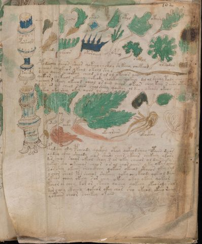

# Voynich Speculative Procedural Protocol — f102v2

IMPORTANT: this is NOT a real or validated translation of the Voynich Manuscript. It is a speculative/procedural model that interprets EVA using a user-defined grammar to generate experimental recipes using safe, known edible substitutes.

This file is generated automatically from IVTFF/EVA transliteration plus a user-defined procedural grammar.



## Page / Folio
- currier: A
- folio: f102v2
- page_number: 210

## EVA Text (Transliteration)
```text
porshols
soaimy
oror
chor
sachy
okeo[s:r]
okol
otory
ok?
okody
cheor
okoroeey
opchy
sarol
olrodar
to[d:?]?
podeesho oteeos sheor qo[t:k]eeo ch ckhhy shkeey chekeod
ocheos chyokeor okeol okeol shy y
deeeo qoeeor o eoikhy cheos o l o r o l okeeos ain
qokeor cho keeol okeeey qokeody chockhey qokeey dol ol sheeoy tody cheoc?
ycheey s od eey okeeor cheol os oiin oeees okear chey keey saiin oteo
dain or aiin cheol s oiir chol sheey qockhy ol keo r okeody okeor cho?
okey okey shey okey oiees or eey
okolky
osain
aiky
okeeoraiin
okockhy
os
pyd[ch:?]y od[i:e]y pcheady qoekeey oteey qokeod sheey opaiin deear
oldeey ckhy sheeody eeos sheshe oeeor ykeear chekeey ykory
dar cheor shoar okeol shoy s ar oky cheeor ol daiin sy
qokeor sho ?keeeos cheor o s al chos aiiin o ky okaraiin
sorshey okeeor sheockhey qokeos okchol ctheor okey sal
ychor sheol por sheeor shekeey qoky cheo teody qokeol daiin
okeeor cheey okeey sor eeey okey okey okeey qokeor
tchor ar chey kor or cthey qoeeey qokeey okeoroly sar
dar cheey ckheey qokeor okey chos sho ykeey okeeo ra[in:i?]
yotaiin cheor cheekey orain
```

## Domain Context (Heuristic; Not a Translation)

This section summarizes recurring **basewords** in this IVTFF domain and shows simple substring evidence that the token markers used by the procedural grammar occur inside frequent words.

Any Italian anagram / English gloss is a best-effort lexicon match, not a decipherment.


### Associated basewords (non-generic; top by frequency in this domain)
- `daiin` (count=231) → Italian anagram `piani`; English: plans (arrangements)
- `qokaiin` (count=122) → Italian anagram `ciancio`; English: [n/a]
- `okaiin` (count=109) → Italian anagram `coniai`; English: [n/a]
- `qokain` (count=101) → Italian anagram `acconi`; English: [n/a]
- `okain` (count=69) → Italian anagram `acino`; English: a berry
- `otain` (count=53) → Italian anagram `anito`; English: [n/a]
- `qokar` (count=48) → Italian anagram `carco`; English: [n/a]
- `saiin` (count=46) → Italian anagram `asini`; English: [n/a]
- `qokal` (count=43) → Italian anagram `calco`; English: cast (of sculpture)
- `qotaiin` (count=40) → Italian anagram `cationi`; English: [n/a]
- `lkaiin` (count=39) → Italian anagram `ancili`; English: [n/a]
- `kaiin` (count=37) → Italian anagram `acini`; English: [n/a]
- `qokeol` (count=37) → Italian anagram `eccolo`; English: [n/a]
- `qotain` (count=34) → Italian anagram `antico`; English: ancient
- `qotar` (count=29) → Italian anagram `corta`; English: [n/a]

### Marker evidence (substring in frequent basewords)
- `qo`: 60 basewords; examples: `qokeey`, `qokeedy`, `qokaiin`, `qokain`, `qokedy`, `qokey`
- `q`: 61 basewords; examples: `qokeey`, `qokeedy`, `qokaiin`, `qokain`, `qokedy`, `qokey`
- `o`: 262 basewords; examples: `qokeey`, `ol`, `o`, `qokeedy`, `okeey`, `qokaiin`
- `k`: 147 basewords; examples: `qokeey`, `qokeedy`, `okeey`, `qokaiin`, `okaiin`, `qokain`
- `t`: 102 basewords; examples: `otaiin`, `oteey`, `otar`, `otedy`, `otal`, `oteedy`
- `p`: 17 basewords; examples: `opchedy`, `qopchedy`, `opchey`, `pchedy`, `qopchdy`, `opchdy`
- `ch`: 137 basewords; examples: `chedy`, `chey`, `chol`, `cheey`, `cheol`, `cheody`
- `sh`: 50 basewords; examples: `shedy`, `shey`, `sheey`, `sheol`, `shol`, `sheedy`
- `f`: 1 basewords; examples: `f`
- `cth`: 16 basewords; examples: `chcthy`, `cthey`, `shcthy`, `checthy`, `cthol`, `ctheey`
- `ckh`: 15 basewords; examples: `chckhy`, `shckhy`, `checkhy`, `chckhey`, `chockhy`, `sheckhy`
- `cph`: 2 basewords; examples: `cphol`, `cphy`
- `dy`: 84 basewords; examples: `chedy`, `qokeedy`, `shedy`, `otedy`, `oteedy`, `qokedy`
- `iin`: 39 basewords; examples: `aiin`, `daiin`, `qokaiin`, `okaiin`, `otaiin`, `saiin`
- `aiin`: 33 basewords; examples: `aiin`, `daiin`, `qokaiin`, `okaiin`, `otaiin`, `saiin`

## Recipes Index (This Page)
- [f102v2.1,@Lc](#f102v2-1-f102v2-1-lc)
- [f102v2.2,+Lc](#f102v2-2-f102v2-2-lc)
- [f102v2.3,@Lf](#f102v2-3-f102v2-3-lf)
- [f102v2.4,@Lf](#f102v2-4-f102v2-4-lf)
- [f102v2.5,@Lf](#f102v2-5-f102v2-5-lf)
- [f102v2.6,@Lf](#f102v2-6-f102v2-6-lf)
- [f102v2.7,@Lf](#f102v2-7-f102v2-7-lf)
- [f102v2.8,@Lf](#f102v2-8-f102v2-8-lf)
- [f102v2.9,@Lf](#f102v2-9-f102v2-9-lf)
- [f102v2.10,@Lf](#f102v2-10-f102v2-10-lf)
- [f102v2.11,@Lf](#f102v2-11-f102v2-11-lf)
- [f102v2.12,@Lf](#f102v2-12-f102v2-12-lf)
- [f102v2.13,@Lf](#f102v2-13-f102v2-13-lf)
- [f102v2.14,@Lf](#f102v2-14-f102v2-14-lf)
- [f102v2.15,@Lf](#f102v2-15-f102v2-15-lf)
- [f102v2.16,@Lf](#f102v2-16-f102v2-16-lf)
- [f102v2.17,@P0](#f102v2-17-f102v2-17-p0)
- [f102v2.18,+P0](#f102v2-18-f102v2-18-p0)
- [f102v2.19,+P0](#f102v2-19-f102v2-19-p0)
- [f102v2.20,+P0](#f102v2-20-f102v2-20-p0)
- [f102v2.21,+P0](#f102v2-21-f102v2-21-p0)
- [f102v2.22,+P0](#f102v2-22-f102v2-22-p0)
- [f102v2.23,+P0](#f102v2-23-f102v2-23-p0)
- [f102v2.24,@Lc](#f102v2-24-f102v2-24-lc)
- [f102v2.25,@Lf](#f102v2-25-f102v2-25-lf)
- [f102v2.26,@Lf](#f102v2-26-f102v2-26-lf)
- [f102v2.27,@Lf](#f102v2-27-f102v2-27-lf)
- [f102v2.28,@Lf](#f102v2-28-f102v2-28-lf)
- [f102v2.29,@Lf](#f102v2-29-f102v2-29-lf)
- [f102v2.30,@P0](#f102v2-30-f102v2-30-p0)
- [f102v2.31,+P0](#f102v2-31-f102v2-31-p0)
- [f102v2.32,+P0](#f102v2-32-f102v2-32-p0)
- [f102v2.33,+P0](#f102v2-33-f102v2-33-p0)
- [f102v2.34,+P0](#f102v2-34-f102v2-34-p0)
- [f102v2.35,+P0](#f102v2-35-f102v2-35-p0)
- [f102v2.36,+P0](#f102v2-36-f102v2-36-p0)
- [f102v2.37,+P0](#f102v2-37-f102v2-37-p0)
- [f102v2.38,+P0](#f102v2-38-f102v2-38-p0)
- [f102v2.39,+P0](#f102v2-39-f102v2-39-p0)

## Line Glosses (Procedural Gloss Only; Not a Translation)

<a id="f102v2-1-f102v2-1-lc"></a>

### f102v2.1,@Lc

EVA: porshols

Direct Gloss (Procedural, Not a Real Translation):
- porshols: tokens: p o r sh o l s → connectors: r l s

<a id="f102v2-2-f102v2-2-lc"></a>

### f102v2.2,+Lc

EVA: soaimy

Direct Gloss (Procedural, Not a Real Translation):
- soaimy: tokens: s o a i m → connectors: s m → vowel_run: a (level 1; class a)

<a id="f102v2-3-f102v2-3-lf"></a>

### f102v2.3,@Lf

EVA: oror

Direct Gloss (Procedural, Not a Real Translation):
- oror: tokens: o r o r → connectors: r r

<a id="f102v2-4-f102v2-4-lf"></a>

### f102v2.4,@Lf

EVA: chor

Direct Gloss (Procedural, Not a Real Translation):
- chor: tokens: ch o r → connectors: r

<a id="f102v2-5-f102v2-5-lf"></a>

### f102v2.5,@Lf

EVA: sachy

Direct Gloss (Procedural, Not a Real Translation):
- sachy: tokens: s a ch → connectors: s → vowel_run: a (level 1; class a)

<a id="f102v2-6-f102v2-6-lf"></a>

### f102v2.6,@Lf

EVA: okeo[s:r]

Direct Gloss (Procedural, Not a Real Translation):
- okeo: tokens: o k e o → vowel_run: e (level 1; class e)
- s: tokens: s → connectors: s
- r: tokens: r → connectors: r

<a id="f102v2-7-f102v2-7-lf"></a>

### f102v2.7,@Lf

EVA: okol

Direct Gloss (Procedural, Not a Real Translation):
- okol: tokens: o k o l → connectors: l

<a id="f102v2-8-f102v2-8-lf"></a>

### f102v2.8,@Lf

EVA: otory

Direct Gloss (Procedural, Not a Real Translation):
- otory: tokens: o t o r → connectors: r

<a id="f102v2-9-f102v2-9-lf"></a>

### f102v2.9,@Lf

EVA: ok?

Direct Gloss (Procedural, Not a Real Translation):
- ok: tokens: o k

<a id="f102v2-10-f102v2-10-lf"></a>

### f102v2.10,@Lf

EVA: okody

Direct Gloss (Procedural, Not a Real Translation):
- okody: tokens: o k o p

<a id="f102v2-11-f102v2-11-lf"></a>

### f102v2.11,@Lf

EVA: cheor

Direct Gloss (Procedural, Not a Real Translation):
- cheor: tokens: ch e o r → connectors: r → vowel_run: e (level 1; class e)

<a id="f102v2-12-f102v2-12-lf"></a>

### f102v2.12,@Lf

EVA: okoroeey

Direct Gloss (Procedural, Not a Real Translation):
- okoroeey: tokens: o k o r o ee → connectors: r → vowel_run: ee (level 2; class e)

<a id="f102v2-13-f102v2-13-lf"></a>

### f102v2.13,@Lf

EVA: opchy

Direct Gloss (Procedural, Not a Real Translation):
- opchy: tokens: o p ch

<a id="f102v2-14-f102v2-14-lf"></a>

### f102v2.14,@Lf

EVA: sarol

Direct Gloss (Procedural, Not a Real Translation):
- sarol: tokens: s a r o l → connectors: s r l → vowel_run: a (level 1; class a)

<a id="f102v2-15-f102v2-15-lf"></a>

### f102v2.15,@Lf

EVA: olrodar

Direct Gloss (Procedural, Not a Real Translation):
- olrodar: tokens: o l r o p a r → connectors: l r r → vowel_run: a (level 1; class a)

<a id="f102v2-16-f102v2-16-lf"></a>

### f102v2.16,@Lf

EVA: to[d:?]?

Direct Gloss (Procedural, Not a Real Translation):
- to: tokens: t o
- d: tokens: p

<a id="f102v2-17-f102v2-17-p0"></a>

### f102v2.17,@P0

EVA: podeesho oteeos sheor qo[t:k]eeo ch ckhhy shkeey chekeod

Direct Gloss (Procedural, Not a Real Translation):
- podeesho: tokens: p o p ee sh o → vowel_run: ee (level 2; class e)
- oteeos: tokens: o t ee o s → connectors: s → vowel_run: ee (level 2; class e)
- sheor: tokens: sh e o r → connectors: r → vowel_run: e (level 1; class e)
- qo: tokens: qo
- t: tokens: t
- k: tokens: k
- eeo: tokens: ee o → vowel_run: ee (level 2; class e)
- ch: tokens: ch
- ckhhy: tokens: ckh h → unmodeled_tokens: h
- shkeey: tokens: sh k ee → vowel_run: ee (level 2; class e)
- chekeod: tokens: ch e k e o p → vowel_run: e (level 1; class e)

<a id="f102v2-18-f102v2-18-p0"></a>

### f102v2.18,+P0

EVA: ocheos chyokeor okeol okeol shy y

Direct Gloss (Procedural, Not a Real Translation):
- ocheos: tokens: o ch e o s → connectors: s → vowel_run: e (level 1; class e)
- chyokeor: tokens: ch o k e o r → connectors: r → vowel_run: e (level 1; class e)
- okeol: tokens: o k e o l → connectors: l → vowel_run: e (level 1; class e)
- okeol: tokens: o k e o l → connectors: l → vowel_run: e (level 1; class e)
- shy: tokens: sh
- y: [unparsed]

<a id="f102v2-19-f102v2-19-p0"></a>

### f102v2.19,+P0

EVA: deeeo qoeeor o eoikhy cheos o l o r o l okeeos ain

Direct Gloss (Procedural, Not a Real Translation):
- deeeo: tokens: p eee o → vowel_run: eee (level 3; class e)
- qoeeor: tokens: qo ee o r → connectors: r → vowel_run: ee (level 2; class e)
- o: tokens: o
- eoikhy: tokens: e o i k h → vowel_run: e (level 1; class e) → unmodeled_tokens: h
- cheos: tokens: ch e o s → connectors: s → vowel_run: e (level 1; class e)
- o: tokens: o
- l: tokens: l → connectors: l
- o: tokens: o
- r: tokens: r → connectors: r
- o: tokens: o
- l: tokens: l → connectors: l
- okeeos: tokens: o k ee o s → connectors: s → vowel_run: ee (level 2; class e)
- ain: tokens: a i n → connectors: n → vowel_run: a (level 1; class a)

<a id="f102v2-20-f102v2-20-p0"></a>

### f102v2.20,+P0

EVA: qokeor cho keeol okeeey qokeody chockhey qokeey dol ol sheeoy tody cheoc?

Direct Gloss (Procedural, Not a Real Translation):
- qokeor: tokens: qo k e o r → connectors: r → vowel_run: e (level 1; class e)
- cho: tokens: ch o
- keeol: tokens: k ee o l → connectors: l → vowel_run: ee (level 2; class e)
- okeeey: tokens: o k eee → vowel_run: eee (level 3; class e)
- qokeody: tokens: qo k e o p → vowel_run: e (level 1; class e)
- chockhey: tokens: ch o ckh e → vowel_run: e (level 1; class e)
- qokeey: tokens: qo k ee → vowel_run: ee (level 2; class e)
- dol: tokens: p o l → connectors: l
- ol: tokens: o l → connectors: l
- sheeoy: tokens: sh ee o → vowel_run: ee (level 2; class e)
- tody: tokens: t o p
- cheoc: tokens: ch e o c → vowel_run: e (level 1; class e)

<a id="f102v2-21-f102v2-21-p0"></a>

### f102v2.21,+P0

EVA: ycheey s od eey okeeor cheol os oiin oeees okear chey keey saiin oteo

Direct Gloss (Procedural, Not a Real Translation):
- ycheey: tokens: ch ee → vowel_run: ee (level 2; class e)
- s: tokens: s → connectors: s
- od: tokens: o p
- eey: tokens: ee → vowel_run: ee (level 2; class e)
- okeeor: tokens: o k ee o r → connectors: r → vowel_run: ee (level 2; class e)
- cheol: tokens: ch e o l → connectors: l → vowel_run: e (level 1; class e)
- os: tokens: o s → connectors: s
- oiin: tokens: o iin → vowel_run: ii (level 2; class i) → suffix: iin
- oeees: tokens: o eee s → connectors: s → vowel_run: eee (level 3; class e)
- okear: tokens: o k e a r → connectors: r → vowel_run: e (level 1; class e)
- chey: tokens: ch e → vowel_run: e (level 1; class e)
- keey: tokens: k ee → vowel_run: ee (level 2; class e)
- saiin: tokens: s aiin → connectors: s → vowel_run: a (level 1; class a) → suffix: aiin (lexicon-context: `saiin` → `asini`; [n/a])
- oteo: tokens: o t e o → vowel_run: e (level 1; class e)

<a id="f102v2-22-f102v2-22-p0"></a>

### f102v2.22,+P0

EVA: dain or aiin cheol s oiir chol sheey qockhy ol keo r okeody okeor cho?

Direct Gloss (Procedural, Not a Real Translation):
- dain: tokens: p a i n → connectors: n → vowel_run: a (level 1; class a)
- or: tokens: o r → connectors: r
- aiin: tokens: aiin → vowel_run: a (level 1; class a) → suffix: aiin
- cheol: tokens: ch e o l → connectors: l → vowel_run: e (level 1; class e)
- s: tokens: s → connectors: s
- oiir: tokens: o ii r → connectors: r → vowel_run: ii (level 2; class i)
- chol: tokens: ch o l → connectors: l
- sheey: tokens: sh ee → vowel_run: ee (level 2; class e)
- qockhy: tokens: qo ckh
- ol: tokens: o l → connectors: l
- keo: tokens: k e o → vowel_run: e (level 1; class e)
- r: tokens: r → connectors: r
- okeody: tokens: o k e o p → vowel_run: e (level 1; class e)
- okeor: tokens: o k e o r → connectors: r → vowel_run: e (level 1; class e)
- cho: tokens: ch o

<a id="f102v2-23-f102v2-23-p0"></a>

### f102v2.23,+P0

EVA: okey okey shey okey oiees or eey

Direct Gloss (Procedural, Not a Real Translation):
- okey: tokens: o k e → vowel_run: e (level 1; class e)
- okey: tokens: o k e → vowel_run: e (level 1; class e)
- shey: tokens: sh e → vowel_run: e (level 1; class e)
- okey: tokens: o k e → vowel_run: e (level 1; class e)
- oiees: tokens: o i ee s → connectors: s → vowel_run: i (level 1; class i)
- or: tokens: o r → connectors: r
- eey: tokens: ee → vowel_run: ee (level 2; class e)

<a id="f102v2-24-f102v2-24-lc"></a>

### f102v2.24,@Lc

EVA: okolky

Direct Gloss (Procedural, Not a Real Translation):
- okolky: tokens: o k o l k → connectors: l

<a id="f102v2-25-f102v2-25-lf"></a>

### f102v2.25,@Lf

EVA: osain

Direct Gloss (Procedural, Not a Real Translation):
- osain: tokens: o s a i n → connectors: s n → vowel_run: a (level 1; class a)

<a id="f102v2-26-f102v2-26-lf"></a>

### f102v2.26,@Lf

EVA: aiky

Direct Gloss (Procedural, Not a Real Translation):
- aiky: tokens: a i k → vowel_run: a (level 1; class a)

<a id="f102v2-27-f102v2-27-lf"></a>

### f102v2.27,@Lf

EVA: okeeoraiin

Direct Gloss (Procedural, Not a Real Translation):
- okeeoraiin: tokens: o k ee o r aiin → connectors: r → vowel_run: ee (level 2; class e) → suffix: aiin (lexicon-context: `oraiin` → `aironi`; [n/a])

<a id="f102v2-28-f102v2-28-lf"></a>

### f102v2.28,@Lf

EVA: okockhy

Direct Gloss (Procedural, Not a Real Translation):
- okockhy: tokens: o k o ckh

<a id="f102v2-29-f102v2-29-lf"></a>

### f102v2.29,@Lf

EVA: os

Direct Gloss (Procedural, Not a Real Translation):
- os: tokens: o s → connectors: s

<a id="f102v2-30-f102v2-30-p0"></a>

### f102v2.30,@P0

EVA: pyd[ch:?]y od[i:e]y pcheady qoekeey oteey qokeod sheey opaiin deear

Direct Gloss (Procedural, Not a Real Translation):
- pyd: tokens: p p
- ch: tokens: ch
- y: [unparsed]
- od: tokens: o p
- i: tokens: i → vowel_run: i (level 1; class i)
- e: tokens: e → vowel_run: e (level 1; class e)
- y: [unparsed]
- pcheady: tokens: p ch e a p → vowel_run: e (level 1; class e)
- qoekeey: tokens: qo e k ee → vowel_run: e (level 1; class e)
- oteey: tokens: o t ee → vowel_run: ee (level 2; class e)
- qokeod: tokens: qo k e o p → vowel_run: e (level 1; class e)
- sheey: tokens: sh ee → vowel_run: ee (level 2; class e)
- opaiin: tokens: o p aiin → vowel_run: a (level 1; class a) → suffix: aiin
- deear: tokens: p ee a r → connectors: r → vowel_run: ee (level 2; class e)

<a id="f102v2-31-f102v2-31-p0"></a>

### f102v2.31,+P0

EVA: oldeey ckhy sheeody eeos sheshe oeeor ykeear chekeey ykory

Direct Gloss (Procedural, Not a Real Translation):
- oldeey: tokens: o l p ee → connectors: l → vowel_run: ee (level 2; class e)
- ckhy: tokens: ckh
- sheeody: tokens: sh ee o p → vowel_run: ee (level 2; class e)
- eeos: tokens: ee o s → connectors: s → vowel_run: ee (level 2; class e)
- sheshe: tokens: sh e sh e → vowel_run: e (level 1; class e)
- oeeor: tokens: o ee o r → connectors: r → vowel_run: ee (level 2; class e)
- ykeear: tokens: k ee a r → connectors: r → vowel_run: ee (level 2; class e)
- chekeey: tokens: ch e k ee → vowel_run: e (level 1; class e)
- ykory: tokens: k o r → connectors: r

<a id="f102v2-32-f102v2-32-p0"></a>

### f102v2.32,+P0

EVA: dar cheor shoar okeol shoy s ar oky cheeor ol daiin sy

Direct Gloss (Procedural, Not a Real Translation):
- dar: tokens: p a r → connectors: r → vowel_run: a (level 1; class a)
- cheor: tokens: ch e o r → connectors: r → vowel_run: e (level 1; class e)
- shoar: tokens: sh o a r → connectors: r → vowel_run: a (level 1; class a)
- okeol: tokens: o k e o l → connectors: l → vowel_run: e (level 1; class e)
- shoy: tokens: sh o
- s: tokens: s → connectors: s
- ar: tokens: a r → connectors: r → vowel_run: a (level 1; class a)
- oky: tokens: o k
- cheeor: tokens: ch ee o r → connectors: r → vowel_run: ee (level 2; class e)
- ol: tokens: o l → connectors: l
- daiin: tokens: p aiin → vowel_run: a (level 1; class a) → suffix: aiin (lexicon-context: `daiin` → `piani`; plans (arrangements))
- sy: tokens: s → connectors: s

<a id="f102v2-33-f102v2-33-p0"></a>

### f102v2.33,+P0

EVA: qokeor sho ?keeeos cheor o s al chos aiiin o ky okaraiin

Direct Gloss (Procedural, Not a Real Translation):
- qokeor: tokens: qo k e o r → connectors: r → vowel_run: e (level 1; class e)
- sho: tokens: sh o
- keeeos: tokens: k eee o s → connectors: s → vowel_run: eee (level 3; class e)
- cheor: tokens: ch e o r → connectors: r → vowel_run: e (level 1; class e)
- o: tokens: o
- s: tokens: s → connectors: s
- al: tokens: a l → connectors: l → vowel_run: a (level 1; class a)
- chos: tokens: ch o s → connectors: s
- aiiin: tokens: a iii n → connectors: n → vowel_run: a (level 1; class a) → suffix: iin
- o: tokens: o
- ky: tokens: k
- okaraiin: tokens: o k a r aiin → connectors: r → vowel_run: a (level 1; class a) → suffix: aiin

<a id="f102v2-34-f102v2-34-p0"></a>

### f102v2.34,+P0

EVA: sorshey okeeor sheockhey qokeos okchol ctheor okey sal

Direct Gloss (Procedural, Not a Real Translation):
- sorshey: tokens: s o r sh e → connectors: s r → vowel_run: e (level 1; class e)
- okeeor: tokens: o k ee o r → connectors: r → vowel_run: ee (level 2; class e)
- sheockhey: tokens: sh e o ckh e → vowel_run: e (level 1; class e)
- qokeos: tokens: qo k e o s → connectors: s → vowel_run: e (level 1; class e)
- okchol: tokens: o k ch o l → connectors: l
- ctheor: tokens: cth e o r → connectors: r → vowel_run: e (level 1; class e)
- okey: tokens: o k e → vowel_run: e (level 1; class e)
- sal: tokens: s a l → connectors: s l → vowel_run: a (level 1; class a)

<a id="f102v2-35-f102v2-35-p0"></a>

### f102v2.35,+P0

EVA: ychor sheol por sheeor shekeey qoky cheo teody qokeol daiin

Direct Gloss (Procedural, Not a Real Translation):
- ychor: tokens: ch o r → connectors: r
- sheol: tokens: sh e o l → connectors: l → vowel_run: e (level 1; class e)
- por: tokens: p o r → connectors: r
- sheeor: tokens: sh ee o r → connectors: r → vowel_run: ee (level 2; class e)
- shekeey: tokens: sh e k ee → vowel_run: e (level 1; class e)
- qoky: tokens: qo k
- cheo: tokens: ch e o → vowel_run: e (level 1; class e)
- teody: tokens: t e o p → vowel_run: e (level 1; class e)
- qokeol: tokens: qo k e o l → connectors: l → vowel_run: e (level 1; class e) (lexicon-context: `qokeol` → `eccolo`; [n/a])
- daiin: tokens: p aiin → vowel_run: a (level 1; class a) → suffix: aiin (lexicon-context: `daiin` → `piani`; plans (arrangements))

<a id="f102v2-36-f102v2-36-p0"></a>

### f102v2.36,+P0

EVA: okeeor cheey okeey sor eeey okey okey okeey qokeor

Direct Gloss (Procedural, Not a Real Translation):
- okeeor: tokens: o k ee o r → connectors: r → vowel_run: ee (level 2; class e)
- cheey: tokens: ch ee → vowel_run: ee (level 2; class e)
- okeey: tokens: o k ee → vowel_run: ee (level 2; class e)
- sor: tokens: s o r → connectors: s r
- eeey: tokens: eee → vowel_run: eee (level 3; class e)
- okey: tokens: o k e → vowel_run: e (level 1; class e)
- okey: tokens: o k e → vowel_run: e (level 1; class e)
- okeey: tokens: o k ee → vowel_run: ee (level 2; class e)
- qokeor: tokens: qo k e o r → connectors: r → vowel_run: e (level 1; class e)

<a id="f102v2-37-f102v2-37-p0"></a>

### f102v2.37,+P0

EVA: tchor ar chey kor or cthey qoeeey qokeey okeoroly sar

Direct Gloss (Procedural, Not a Real Translation):
- tchor: tokens: t ch o r → connectors: r
- ar: tokens: a r → connectors: r → vowel_run: a (level 1; class a)
- chey: tokens: ch e → vowel_run: e (level 1; class e)
- kor: tokens: k o r → connectors: r
- or: tokens: o r → connectors: r
- cthey: tokens: cth e → vowel_run: e (level 1; class e)
- qoeeey: tokens: qo eee → vowel_run: eee (level 3; class e)
- qokeey: tokens: qo k ee → vowel_run: ee (level 2; class e)
- okeoroly: tokens: o k e o r o l → connectors: r l → vowel_run: e (level 1; class e)
- sar: tokens: s a r → connectors: s r → vowel_run: a (level 1; class a)

<a id="f102v2-38-f102v2-38-p0"></a>

### f102v2.38,+P0

EVA: dar cheey ckheey qokeor okey chos sho ykeey okeeo ra[in:i?]

Direct Gloss (Procedural, Not a Real Translation):
- dar: tokens: p a r → connectors: r → vowel_run: a (level 1; class a)
- cheey: tokens: ch ee → vowel_run: ee (level 2; class e)
- ckheey: tokens: ckh ee → vowel_run: ee (level 2; class e)
- qokeor: tokens: qo k e o r → connectors: r → vowel_run: e (level 1; class e)
- okey: tokens: o k e → vowel_run: e (level 1; class e)
- chos: tokens: ch o s → connectors: s
- sho: tokens: sh o
- ykeey: tokens: k ee → vowel_run: ee (level 2; class e)
- okeeo: tokens: o k ee o → vowel_run: ee (level 2; class e)
- ra: tokens: r a → connectors: r → vowel_run: a (level 1; class a)
- in: tokens: i n → connectors: n → vowel_run: i (level 1; class i)
- i: tokens: i → vowel_run: i (level 1; class i)

<a id="f102v2-39-f102v2-39-p0"></a>

### f102v2.39,+P0

EVA: yotaiin cheor cheekey orain

Direct Gloss (Procedural, Not a Real Translation):
- yotaiin: tokens: o t aiin → vowel_run: a (level 1; class a) → suffix: aiin
- cheor: tokens: ch e o r → connectors: r → vowel_run: e (level 1; class e)
- cheekey: tokens: ch ee k e → vowel_run: ee (level 2; class e)
- orain: tokens: o r a i n → connectors: r n → vowel_run: a (level 1; class a)
