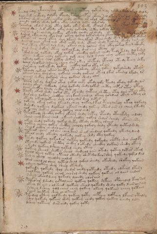

# Voynich Speculative Procedural Protocol — f103r

IMPORTANT: this is NOT a real or validated translation of the Voynich Manuscript. It is a speculative/procedural model that interprets EVA using a user-defined grammar to generate experimental recipes using safe, known edible substitutes.

This file is generated automatically from IVTFF/EVA transliteration plus a user-defined procedural grammar.



## Page / Folio
- currier: B
- folio: f103r
- page_number: 212

## EVA Text (Transliteration)
```text
pchedal shdy ytechypchy otey ?lshey qoteey qotal shedy yshdal dain okal daldy
dain shek chcphhdy daloky opchedy peshol chep ar otchy sal lkeey sar ain ok?? chedy
yshdain sheek cheoty eeokal chedy chckhy or orol okaiin eeal ot kar otar cha[l:?]
ychedy qokedy okedy qokeey okey chdar ol loty chedaraly
pocharal okedar shedy oteey qokey lkar sheeky okalor shedy yt??? rkar ota? okdy
ocheey dain shek okeedy okey shedy qokealdy shcthy qotedy qoto??? ota ??? san am
saiin chey shs olshedy qokeey okeeody qoedy ol shedy
daroal okey chedy okey rain okechy qoisal qotar adchey of[ee:ch]o lt??dy ??olkechdy lo
oteeos ar cheal okeey shey lkaiin shey lkeor otaiin shedy otey l ?dy okeedaram
daiin ol oain okeol chol okam chety shedy otaiin shedy teolshy oteedy sor ain
dar oteey otain lolshedy okain chey qorain shey otoy qokeol key daikhyky
oain shey shckhy oteey qokeol keedy shar aiin otedy
podar sheor qotedy okeey qokar checkhy qokain chedy pchdy tshdy dal kasol
okain shekain chedy qokeechy qok[y:?] shey lol s aiin chey eekain chcthy qoky
qotedy qokeey sh[o:a]l qotey shkaiin
dshol sholkar shdaiin [chee:eeee]y rar okeey shcfhedy opcheol oteedy tchey shky
sar shey qokey keedy qokeey chckhy qokal oty or aiin
polchedy qokeol okain checthy oteeylshedy okain qokain qokalshedy oteys
okaiin chey qoy shey qokaiin chedy qokain oteol lkar okaral lkldy lr
ychain shckhy qokaiin shey qokaiin shedy olor
pcheam sokedy dalkar otal qokal chepy okedy qoky pchedy okaly qokeedy lor
dalshy okain shckhody shdal qokeedy shedy qotar chcthy chep ar otar opchy
daiin sheckhy lchedy chckhy shol
tchoky okeal shedy qokal oty opchedy qotain shcthy otey dain oteey oky
dar shey qokain chckhey chey kain chedal okeeey qoodain okain [o:?]teey ol
oteedy okeey qot[ch:ee]y shey olcheedar shey lotor
qokechy okeey qokeey lkeeody sheey qokeey lkeol tchey qokeey okeey qokaly
deshedy qokeeey dalkain okaiin chedy qokeey otain ain ol cheey lkeedy
qokeeechy shokeey qochey qokeey chal chedy
pcholkchdy sheckhy qokey okaiin shedy chpchy opchedy oteeykshy chdaly
soiin chol kaiin chal okaiin shckhy qokal shdar shchdy okaiin chty
okeey shedy qokedy qokal shety otedy shcthy oraiin
qokeey chechy qokey shckhy choldy qokal y shedy yteedy qotail shedy
sheod oshey cheedalaiin
qokecar chain olain chey kain sheol shedain qokeedy ykeedy lcheg
okool chedy okeedy qokeedy qokeey shdy otey qokeey
pchedy qokeey qokeodair qokshy qokeedy qokchdy chsky ee'ey shalky
otechedy qokain shcthy chckhy lokeedy checkhy lokain shedy okeey
ykeedy qokeey lsheey qotal shedy oteey
qokeey sheeol shckhy sheol shodyol aiin otedy qoteey lotar otam
cheol sheeey qotey oteeal oteedy shet sho keeo s shey qokeedy qokal dal
tshey sheol cheolshy chalal
tar cheal ol sheey qotal sheal qokal sheedy okeshedy shokey qokaiin
odeeey qokeey shey sheal otshedy
qokeedy qokeedy shol shedar chedy qoteedy oteedy olkeol ltar y
chol keey qokeey cheol chorol shedy qokeey qokeey ol loiin chedan
ssheey okeeo l lchey qokaly lcheedy oloraiin
polarar lshedy qotolaiin qokeey qokeey shkchy opchealol kchy sam
okeey lr ain l ol sheed qokeey sheol qokeedy shedy qoky leeesain am
ssheey l shey qol cheey chey qokeey okeey qokain cheey qotain
saiin cheteey shey cheosaiin
pchedal oteey qol keedy qokeey qoty chepchy qopchey lkaiin otalsy
sshey qokedy qokaiin shdy qokeey chedy qokeey qokeey lchedy loty
dsheey qoteeey darchedy qokey qoty
```

## Domain Context (Heuristic; Not a Translation)

This section summarizes recurring **basewords** in this IVTFF domain and shows simple substring evidence that the token markers used by the procedural grammar occur inside frequent words.

Any Italian anagram / English gloss is a best-effort lexicon match, not a decipherment.


### Associated basewords (non-generic; top by frequency in this domain)
- `daiin` (count=231) → Italian anagram `piani`; English: plans (arrangements)
- `qokaiin` (count=122) → Italian anagram `ciancio`; English: [n/a]
- `okaiin` (count=109) → Italian anagram `coniai`; English: [n/a]
- `qokain` (count=101) → Italian anagram `acconi`; English: [n/a]
- `okain` (count=69) → Italian anagram `acino`; English: a berry
- `otain` (count=53) → Italian anagram `anito`; English: [n/a]
- `qokar` (count=48) → Italian anagram `carco`; English: [n/a]
- `saiin` (count=46) → Italian anagram `asini`; English: [n/a]
- `qokal` (count=43) → Italian anagram `calco`; English: cast (of sculpture)
- `qotaiin` (count=40) → Italian anagram `cationi`; English: [n/a]
- `lkaiin` (count=39) → Italian anagram `ancili`; English: [n/a]
- `kaiin` (count=37) → Italian anagram `acini`; English: [n/a]
- `qokeol` (count=37) → Italian anagram `eccolo`; English: [n/a]
- `qotain` (count=34) → Italian anagram `antico`; English: ancient
- `qotar` (count=29) → Italian anagram `corta`; English: [n/a]

### Marker evidence (substring in frequent basewords)
- `qo`: 60 basewords; examples: `qokeey`, `qokeedy`, `qokaiin`, `qokain`, `qokedy`, `qokey`
- `q`: 61 basewords; examples: `qokeey`, `qokeedy`, `qokaiin`, `qokain`, `qokedy`, `qokey`
- `o`: 262 basewords; examples: `qokeey`, `ol`, `o`, `qokeedy`, `okeey`, `qokaiin`
- `k`: 147 basewords; examples: `qokeey`, `qokeedy`, `okeey`, `qokaiin`, `okaiin`, `qokain`
- `t`: 102 basewords; examples: `otaiin`, `oteey`, `otar`, `otedy`, `otal`, `oteedy`
- `p`: 17 basewords; examples: `opchedy`, `qopchedy`, `opchey`, `pchedy`, `qopchdy`, `opchdy`
- `ch`: 137 basewords; examples: `chedy`, `chey`, `chol`, `cheey`, `cheol`, `cheody`
- `sh`: 50 basewords; examples: `shedy`, `shey`, `sheey`, `sheol`, `shol`, `sheedy`
- `f`: 1 basewords; examples: `f`
- `cth`: 16 basewords; examples: `chcthy`, `cthey`, `shcthy`, `checthy`, `cthol`, `ctheey`
- `ckh`: 15 basewords; examples: `chckhy`, `shckhy`, `checkhy`, `chckhey`, `chockhy`, `sheckhy`
- `cph`: 2 basewords; examples: `cphol`, `cphy`
- `dy`: 84 basewords; examples: `chedy`, `qokeedy`, `shedy`, `otedy`, `oteedy`, `qokedy`
- `iin`: 39 basewords; examples: `aiin`, `daiin`, `qokaiin`, `okaiin`, `otaiin`, `saiin`
- `aiin`: 33 basewords; examples: `aiin`, `daiin`, `qokaiin`, `okaiin`, `otaiin`, `saiin`

## Recipes Index (This Page)
- [f103r.1,@P0](#f103r-1-f103r-1-p0)
- [f103r.2,+P0](#f103r-2-f103r-2-p0)
- [f103r.3,+P0](#f103r-3-f103r-3-p0)
- [f103r.4,+P0](#f103r-4-f103r-4-p0)
- [f103r.5,+P0](#f103r-5-f103r-5-p0)
- [f103r.6,+P0](#f103r-6-f103r-6-p0)
- [f103r.7,+P0](#f103r-7-f103r-7-p0)
- [f103r.8,+P0](#f103r-8-f103r-8-p0)
- [f103r.9,+P0](#f103r-9-f103r-9-p0)
- [f103r.10,+P0](#f103r-10-f103r-10-p0)
- [f103r.11,+P0](#f103r-11-f103r-11-p0)
- [f103r.12,+P0](#f103r-12-f103r-12-p0)
- [f103r.13,+P0](#f103r-13-f103r-13-p0)
- [f103r.14,+P0](#f103r-14-f103r-14-p0)
- [f103r.15,+P0](#f103r-15-f103r-15-p0)
- [f103r.16,+P0](#f103r-16-f103r-16-p0)
- [f103r.17,+P0](#f103r-17-f103r-17-p0)
- [f103r.18,+P0](#f103r-18-f103r-18-p0)
- [f103r.19,+P0](#f103r-19-f103r-19-p0)
- [f103r.20,+P0](#f103r-20-f103r-20-p0)
- [f103r.21,+P0](#f103r-21-f103r-21-p0)
- [f103r.22,+P0](#f103r-22-f103r-22-p0)
- [f103r.23,+P0](#f103r-23-f103r-23-p0)
- [f103r.24,+P0](#f103r-24-f103r-24-p0)
- [f103r.25,+P0](#f103r-25-f103r-25-p0)
- [f103r.26,+P0](#f103r-26-f103r-26-p0)
- [f103r.27,+P0](#f103r-27-f103r-27-p0)
- [f103r.28,+P0](#f103r-28-f103r-28-p0)
- [f103r.29,+P0](#f103r-29-f103r-29-p0)
- [f103r.30,+P0](#f103r-30-f103r-30-p0)
- [f103r.31,+P0](#f103r-31-f103r-31-p0)
- [f103r.32,+P0](#f103r-32-f103r-32-p0)
- [f103r.33,+P0](#f103r-33-f103r-33-p0)
- [f103r.34,+P0](#f103r-34-f103r-34-p0)
- [f103r.35,+P0](#f103r-35-f103r-35-p0)
- [f103r.36,+P0](#f103r-36-f103r-36-p0)
- [f103r.37,+P0](#f103r-37-f103r-37-p0)
- [f103r.38,+P0](#f103r-38-f103r-38-p0)
- [f103r.39,+P0](#f103r-39-f103r-39-p0)
- [f103r.40,+P0](#f103r-40-f103r-40-p0)
- [f103r.41,+P0](#f103r-41-f103r-41-p0)
- [f103r.42,+P0](#f103r-42-f103r-42-p0)
- [f103r.43,+P0](#f103r-43-f103r-43-p0)
- [f103r.44,+P0](#f103r-44-f103r-44-p0)
- [f103r.45,+P0](#f103r-45-f103r-45-p0)
- [f103r.46,+P0](#f103r-46-f103r-46-p0)
- [f103r.47,+P0](#f103r-47-f103r-47-p0)
- [f103r.48,+P0](#f103r-48-f103r-48-p0)
- [f103r.49,+P0](#f103r-49-f103r-49-p0)
- [f103r.50,+P0](#f103r-50-f103r-50-p0)
- [f103r.51,+P0](#f103r-51-f103r-51-p0)
- [f103r.52,+P0](#f103r-52-f103r-52-p0)
- [f103r.53,+P0](#f103r-53-f103r-53-p0)
- [f103r.54,+P0](#f103r-54-f103r-54-p0)

## Line Glosses (Procedural Gloss Only; Not a Translation)

<a id="f103r-1-f103r-1-p0"></a>

### f103r.1,@P0

EVA: pchedal shdy ytechypchy otey ?lshey qoteey qotal shedy yshdal dain okal daldy

Direct Gloss (Procedural, Not a Real Translation):
- pchedal: add main plant (safe substitute) → add starter / activate → duration level 1 → state: active extraction
- shdy: add secondary herb (safe substitute) → add starter / activate
- ytechypchy: apply heat/cooking → add main plant (safe substitute) → add starter / activate → duration level 1 → state: active extraction
- otey: apply heat/cooking → mix / transfer → duration level 1 → state: active extraction
- lshey: add secondary herb (safe substitute) → duration level 1 → state: active extraction
- qoteey: prepare liquid base → apply heat/cooking → duration level 2 → state: active extraction
- qotal: prepare liquid base → apply heat/cooking → duration level 1 → state: phase transition/start
- shedy: add secondary herb (safe substitute) → add starter / activate → duration level 1 → state: active extraction
- yshdal: add secondary herb (safe substitute) → add starter / activate → duration level 1 → state: phase transition/start
- dain: add starter / activate → duration level 1 → state: phase transition/start
- okal: add fermentable sugars → mix / transfer → duration level 1 → state: phase transition/start
- daldy: add starter / activate → duration level 1 → state: phase transition/start

<a id="f103r-2-f103r-2-p0"></a>

### f103r.2,+P0

EVA: dain shek chcphhdy daloky opchedy peshol chep ar otchy sal lkeey sar ain ok?? chedy

Direct Gloss (Procedural, Not a Real Translation):
- dain: add starter / activate → duration level 1 → state: phase transition/start
- shek: add fermentable sugars → add secondary herb (safe substitute) → duration level 1 → state: active extraction
- chcphhdy: add main plant (safe substitute) → add starter / activate → add complex herbal compound (safe blend) → unmodeled token(s) present: h
- daloky: add fermentable sugars → mix / transfer → add starter / activate → duration level 1 → state: phase transition/start
- opchedy: add main plant (safe substitute) → mix / transfer → add starter / activate → duration level 1 → state: active extraction
- peshol: add secondary herb (safe substitute) → mix / transfer → add starter / activate → duration level 1 → state: active extraction
- chep: add main plant (safe substitute) → add starter / activate → duration level 1 → state: active extraction
- ar: duration level 1 → state: phase transition/start
- otchy: apply heat/cooking → add main plant (safe substitute) → mix / transfer
- sal: duration level 1 → state: phase transition/start
- lkeey: add fermentable sugars → duration level 2 → state: active extraction
- sar: duration level 1 → state: phase transition/start
- ain: duration level 1 → state: phase transition/start
- ok: add fermentable sugars → mix / transfer
- chedy: add main plant (safe substitute) → add starter / activate → duration level 1 → state: active extraction

<a id="f103r-3-f103r-3-p0"></a>

### f103r.3,+P0

EVA: yshdain sheek cheoty eeokal chedy chckhy or orol okaiin eeal ot kar otar cha[l:?]

Direct Gloss (Procedural, Not a Real Translation):
- yshdain: add secondary herb (safe substitute) → add starter / activate → duration level 1 → state: phase transition/start
- sheek: add fermentable sugars → add secondary herb (safe substitute) → duration level 2 → state: active extraction
- cheoty: apply heat/cooking → add main plant (safe substitute) → mix / transfer → duration level 1 → state: active extraction
- eeokal: add fermentable sugars → mix / transfer → duration level 2 → state: active extraction
- chedy: add main plant (safe substitute) → add starter / activate → duration level 1 → state: active extraction
- chckhy: add main plant (safe substitute) → add complex herbal compound (safe blend)
- or: mix / transfer
- orol: mix / transfer
- okaiin: add fermentable sugars → mix / transfer → duration level 1 → state: phase transition/start → long phase
- eeal: duration level 2 → state: active extraction
- ot: apply heat/cooking → mix / transfer
- kar: add fermentable sugars → duration level 1 → state: phase transition/start
- otar: apply heat/cooking → mix / transfer → duration level 1 → state: phase transition/start
- cha: add main plant (safe substitute) → duration level 1 → state: phase transition/start
- l: [unparsed]

<a id="f103r-4-f103r-4-p0"></a>

### f103r.4,+P0

EVA: ychedy qokedy okedy qokeey okey chdar ol loty chedaraly

Direct Gloss (Procedural, Not a Real Translation):
- ychedy: add main plant (safe substitute) → add starter / activate → duration level 1 → state: active extraction
- qokedy: prepare liquid base → add fermentable sugars → add starter / activate → duration level 1 → state: active extraction
- okedy: add fermentable sugars → mix / transfer → add starter / activate → duration level 1 → state: active extraction
- qokeey: prepare liquid base → add fermentable sugars → duration level 2 → state: active extraction
- okey: add fermentable sugars → mix / transfer → duration level 1 → state: active extraction
- chdar: add main plant (safe substitute) → add starter / activate → duration level 1 → state: phase transition/start
- ol: mix / transfer
- loty: apply heat/cooking → mix / transfer
- chedaraly: add main plant (safe substitute) → add starter / activate → duration level 1 → state: active extraction

<a id="f103r-5-f103r-5-p0"></a>

### f103r.5,+P0

EVA: pocharal okedar shedy oteey qokey lkar sheeky okalor shedy yt??? rkar ota? okdy

Direct Gloss (Procedural, Not a Real Translation):
- pocharal: add main plant (safe substitute) → mix / transfer → add starter / activate → duration level 1 → state: phase transition/start
- okedar: add fermentable sugars → mix / transfer → add starter / activate → duration level 1 → state: active extraction
- shedy: add secondary herb (safe substitute) → add starter / activate → duration level 1 → state: active extraction
- oteey: apply heat/cooking → mix / transfer → duration level 2 → state: active extraction
- qokey: prepare liquid base → add fermentable sugars → duration level 1 → state: active extraction
- lkar: add fermentable sugars → duration level 1 → state: phase transition/start
- sheeky: add fermentable sugars → add secondary herb (safe substitute) → duration level 2 → state: active extraction
- okalor: add fermentable sugars → mix / transfer → duration level 1 → state: phase transition/start
- shedy: add secondary herb (safe substitute) → add starter / activate → duration level 1 → state: active extraction
- yt: apply heat/cooking
- rkar: add fermentable sugars → duration level 1 → state: phase transition/start
- ota: apply heat/cooking → mix / transfer → duration level 1 → state: phase transition/start
- okdy: add fermentable sugars → mix / transfer → add starter / activate

<a id="f103r-6-f103r-6-p0"></a>

### f103r.6,+P0

EVA: ocheey dain shek okeedy okey shedy qokealdy shcthy qotedy qoto??? ota ??? san am

Direct Gloss (Procedural, Not a Real Translation):
- ocheey: add main plant (safe substitute) → mix / transfer → duration level 2 → state: active extraction
- dain: add starter / activate → duration level 1 → state: phase transition/start
- shek: add fermentable sugars → add secondary herb (safe substitute) → duration level 1 → state: active extraction
- okeedy: add fermentable sugars → mix / transfer → add starter / activate → duration level 2 → state: active extraction
- okey: add fermentable sugars → mix / transfer → duration level 1 → state: active extraction
- shedy: add secondary herb (safe substitute) → add starter / activate → duration level 1 → state: active extraction
- qokealdy: prepare liquid base → add fermentable sugars → add starter / activate → duration level 1 → state: active extraction
- shcthy: add secondary herb (safe substitute) → add complex herbal compound (safe blend)
- qotedy: prepare liquid base → apply heat/cooking → add starter / activate → duration level 1 → state: active extraction
- qoto: prepare liquid base → apply heat/cooking → mix / transfer
- ota: apply heat/cooking → mix / transfer → duration level 1 → state: phase transition/start
- san: duration level 1 → state: phase transition/start
- am: duration level 1 → state: phase transition/start

<a id="f103r-7-f103r-7-p0"></a>

### f103r.7,+P0

EVA: saiin chey shs olshedy qokeey okeeody qoedy ol shedy

Direct Gloss (Procedural, Not a Real Translation):
- saiin: duration level 1 → state: phase transition/start → long phase
- chey: add main plant (safe substitute) → duration level 1 → state: active extraction
- shs: add secondary herb (safe substitute)
- olshedy: add secondary herb (safe substitute) → mix / transfer → add starter / activate → duration level 1 → state: active extraction
- qokeey: prepare liquid base → add fermentable sugars → duration level 2 → state: active extraction
- okeeody: add fermentable sugars → mix / transfer → add starter / activate → duration level 2 → state: active extraction
- qoedy: prepare liquid base → add starter / activate → duration level 1 → state: active extraction
- ol: mix / transfer
- shedy: add secondary herb (safe substitute) → add starter / activate → duration level 1 → state: active extraction

<a id="f103r-8-f103r-8-p0"></a>

### f103r.8,+P0

EVA: daroal okey chedy okey rain okechy qoisal qotar adchey of[ee:ch]o lt??dy ??olkechdy lo

Direct Gloss (Procedural, Not a Real Translation):
- daroal: mix / transfer → add starter / activate → duration level 1 → state: phase transition/start
- okey: add fermentable sugars → mix / transfer → duration level 1 → state: active extraction
- chedy: add main plant (safe substitute) → add starter / activate → duration level 1 → state: active extraction
- okey: add fermentable sugars → mix / transfer → duration level 1 → state: active extraction
- rain: duration level 1 → state: phase transition/start
- okechy: add fermentable sugars → add main plant (safe substitute) → mix / transfer → duration level 1 → state: active extraction
- qoisal: prepare liquid base → duration level 1 → state: cooling/rest
- qotar: prepare liquid base → apply heat/cooking → duration level 1 → state: phase transition/start
- adchey: add main plant (safe substitute) → add starter / activate → duration level 1 → state: phase transition/start
- of: add aroma modifier → mix / transfer
- ee: duration level 2 → state: active extraction
- ch: add main plant (safe substitute)
- o: mix / transfer
- lt: apply heat/cooking
- dy: add starter / activate
- olkechdy: add fermentable sugars → add main plant (safe substitute) → mix / transfer → add starter / activate → duration level 1 → state: active extraction
- lo: mix / transfer

<a id="f103r-9-f103r-9-p0"></a>

### f103r.9,+P0

EVA: oteeos ar cheal okeey shey lkaiin shey lkeor otaiin shedy otey l ?dy okeedaram

Direct Gloss (Procedural, Not a Real Translation):
- oteeos: apply heat/cooking → mix / transfer → duration level 2 → state: active extraction
- ar: duration level 1 → state: phase transition/start
- cheal: add main plant (safe substitute) → duration level 1 → state: active extraction
- okeey: add fermentable sugars → mix / transfer → duration level 2 → state: active extraction
- shey: add secondary herb (safe substitute) → duration level 1 → state: active extraction
- lkaiin: add fermentable sugars → duration level 1 → state: phase transition/start → long phase
- shey: add secondary herb (safe substitute) → duration level 1 → state: active extraction
- lkeor: add fermentable sugars → mix / transfer → duration level 1 → state: active extraction
- otaiin: apply heat/cooking → mix / transfer → duration level 1 → state: phase transition/start → long phase
- shedy: add secondary herb (safe substitute) → add starter / activate → duration level 1 → state: active extraction
- otey: apply heat/cooking → mix / transfer → duration level 1 → state: active extraction
- l: [unparsed]
- dy: add starter / activate
- okeedaram: add fermentable sugars → mix / transfer → add starter / activate → duration level 2 → state: active extraction

<a id="f103r-10-f103r-10-p0"></a>

### f103r.10,+P0

EVA: daiin ol oain okeol chol okam chety shedy otaiin shedy teolshy oteedy sor ain

Direct Gloss (Procedural, Not a Real Translation):
- daiin: add starter / activate → duration level 1 → state: phase transition/start → long phase
- ol: mix / transfer
- oain: mix / transfer → duration level 1 → state: phase transition/start
- okeol: add fermentable sugars → mix / transfer → duration level 1 → state: active extraction
- chol: add main plant (safe substitute) → mix / transfer
- okam: add fermentable sugars → mix / transfer → duration level 1 → state: phase transition/start
- chety: apply heat/cooking → add main plant (safe substitute) → duration level 1 → state: active extraction
- shedy: add secondary herb (safe substitute) → add starter / activate → duration level 1 → state: active extraction
- otaiin: apply heat/cooking → mix / transfer → duration level 1 → state: phase transition/start → long phase
- shedy: add secondary herb (safe substitute) → add starter / activate → duration level 1 → state: active extraction
- teolshy: apply heat/cooking → add secondary herb (safe substitute) → mix / transfer → duration level 1 → state: active extraction
- oteedy: apply heat/cooking → mix / transfer → add starter / activate → duration level 2 → state: active extraction
- sor: mix / transfer
- ain: duration level 1 → state: phase transition/start

<a id="f103r-11-f103r-11-p0"></a>

### f103r.11,+P0

EVA: dar oteey otain lolshedy okain chey qorain shey otoy qokeol key daikhyky

Direct Gloss (Procedural, Not a Real Translation):
- dar: add starter / activate → duration level 1 → state: phase transition/start
- oteey: apply heat/cooking → mix / transfer → duration level 2 → state: active extraction
- otain: apply heat/cooking → mix / transfer → duration level 1 → state: phase transition/start
- lolshedy: add secondary herb (safe substitute) → mix / transfer → add starter / activate → duration level 1 → state: active extraction
- okain: add fermentable sugars → mix / transfer → duration level 1 → state: phase transition/start
- chey: add main plant (safe substitute) → duration level 1 → state: active extraction
- qorain: prepare liquid base → duration level 1 → state: phase transition/start
- shey: add secondary herb (safe substitute) → duration level 1 → state: active extraction
- otoy: apply heat/cooking → mix / transfer
- qokeol: prepare liquid base → add fermentable sugars → mix / transfer → duration level 1 → state: active extraction
- key: add fermentable sugars → duration level 1 → state: active extraction
- daikhyky: add fermentable sugars → add starter / activate → duration level 1 → state: phase transition/start → unmodeled token(s) present: h

<a id="f103r-12-f103r-12-p0"></a>

### f103r.12,+P0

EVA: oain shey shckhy oteey qokeol keedy shar aiin otedy

Direct Gloss (Procedural, Not a Real Translation):
- oain: mix / transfer → duration level 1 → state: phase transition/start
- shey: add secondary herb (safe substitute) → duration level 1 → state: active extraction
- shckhy: add secondary herb (safe substitute) → add complex herbal compound (safe blend)
- oteey: apply heat/cooking → mix / transfer → duration level 2 → state: active extraction
- qokeol: prepare liquid base → add fermentable sugars → mix / transfer → duration level 1 → state: active extraction
- keedy: add fermentable sugars → add starter / activate → duration level 2 → state: active extraction
- shar: add secondary herb (safe substitute) → duration level 1 → state: phase transition/start
- aiin: duration level 1 → state: phase transition/start → long phase
- otedy: apply heat/cooking → mix / transfer → add starter / activate → duration level 1 → state: active extraction

<a id="f103r-13-f103r-13-p0"></a>

### f103r.13,+P0

EVA: podar sheor qotedy okeey qokar checkhy qokain chedy pchdy tshdy dal kasol

Direct Gloss (Procedural, Not a Real Translation):
- podar: mix / transfer → add starter / activate → duration level 1 → state: phase transition/start
- sheor: add secondary herb (safe substitute) → mix / transfer → duration level 1 → state: active extraction
- qotedy: prepare liquid base → apply heat/cooking → add starter / activate → duration level 1 → state: active extraction
- okeey: add fermentable sugars → mix / transfer → duration level 2 → state: active extraction
- qokar: prepare liquid base → add fermentable sugars → duration level 1 → state: phase transition/start
- checkhy: add main plant (safe substitute) → add complex herbal compound (safe blend) → duration level 1 → state: active extraction
- qokain: prepare liquid base → add fermentable sugars → duration level 1 → state: phase transition/start
- chedy: add main plant (safe substitute) → add starter / activate → duration level 1 → state: active extraction
- pchdy: add main plant (safe substitute) → add starter / activate
- tshdy: apply heat/cooking → add secondary herb (safe substitute) → add starter / activate
- dal: add starter / activate → duration level 1 → state: phase transition/start
- kasol: add fermentable sugars → mix / transfer → duration level 1 → state: phase transition/start

<a id="f103r-14-f103r-14-p0"></a>

### f103r.14,+P0

EVA: okain shekain chedy qokeechy qok[y:?] shey lol s aiin chey eekain chcthy qoky

Direct Gloss (Procedural, Not a Real Translation):
- okain: add fermentable sugars → mix / transfer → duration level 1 → state: phase transition/start
- shekain: add fermentable sugars → add secondary herb (safe substitute) → duration level 1 → state: active extraction
- chedy: add main plant (safe substitute) → add starter / activate → duration level 1 → state: active extraction
- qokeechy: prepare liquid base → add fermentable sugars → add main plant (safe substitute) → duration level 2 → state: active extraction
- qok: prepare liquid base → add fermentable sugars
- y: [unparsed]
- shey: add secondary herb (safe substitute) → duration level 1 → state: active extraction
- lol: mix / transfer
- s: [unparsed]
- aiin: duration level 1 → state: phase transition/start → long phase
- chey: add main plant (safe substitute) → duration level 1 → state: active extraction
- eekain: add fermentable sugars → duration level 2 → state: active extraction
- chcthy: add main plant (safe substitute) → add complex herbal compound (safe blend)
- qoky: prepare liquid base → add fermentable sugars

<a id="f103r-15-f103r-15-p0"></a>

### f103r.15,+P0

EVA: qotedy qokeey sh[o:a]l qotey shkaiin

Direct Gloss (Procedural, Not a Real Translation):
- qotedy: prepare liquid base → apply heat/cooking → add starter / activate → duration level 1 → state: active extraction
- qokeey: prepare liquid base → add fermentable sugars → duration level 2 → state: active extraction
- sh: add secondary herb (safe substitute)
- o: mix / transfer
- a: duration level 1 → state: phase transition/start
- l: [unparsed]
- qotey: prepare liquid base → apply heat/cooking → duration level 1 → state: active extraction
- shkaiin: add fermentable sugars → add secondary herb (safe substitute) → duration level 1 → state: phase transition/start → long phase

<a id="f103r-16-f103r-16-p0"></a>

### f103r.16,+P0

EVA: dshol sholkar shdaiin [chee:eeee]y rar okeey shcfhedy opcheol oteedy tchey shky

Direct Gloss (Procedural, Not a Real Translation):
- dshol: add secondary herb (safe substitute) → mix / transfer → add starter / activate
- sholkar: add fermentable sugars → add secondary herb (safe substitute) → mix / transfer → duration level 1 → state: phase transition/start
- shdaiin: add secondary herb (safe substitute) → add starter / activate → duration level 1 → state: phase transition/start → long phase
- chee: add main plant (safe substitute) → duration level 2 → state: active extraction
- eeee: duration level 4 → state: active extraction
- y: [unparsed]
- rar: duration level 1 → state: phase transition/start
- okeey: add fermentable sugars → mix / transfer → duration level 2 → state: active extraction
- shcfhedy: add secondary herb (safe substitute) → add starter / activate → add complex herbal compound (safe blend) → duration level 1 → state: active extraction
- opcheol: add main plant (safe substitute) → mix / transfer → add starter / activate → duration level 1 → state: active extraction
- oteedy: apply heat/cooking → mix / transfer → add starter / activate → duration level 2 → state: active extraction
- tchey: apply heat/cooking → add main plant (safe substitute) → duration level 1 → state: active extraction
- shky: add fermentable sugars → add secondary herb (safe substitute)

<a id="f103r-17-f103r-17-p0"></a>

### f103r.17,+P0

EVA: sar shey qokey keedy qokeey chckhy qokal oty or aiin

Direct Gloss (Procedural, Not a Real Translation):
- sar: duration level 1 → state: phase transition/start
- shey: add secondary herb (safe substitute) → duration level 1 → state: active extraction
- qokey: prepare liquid base → add fermentable sugars → duration level 1 → state: active extraction
- keedy: add fermentable sugars → add starter / activate → duration level 2 → state: active extraction
- qokeey: prepare liquid base → add fermentable sugars → duration level 2 → state: active extraction
- chckhy: add main plant (safe substitute) → add complex herbal compound (safe blend)
- qokal: prepare liquid base → add fermentable sugars → duration level 1 → state: phase transition/start
- oty: apply heat/cooking → mix / transfer
- or: mix / transfer
- aiin: duration level 1 → state: phase transition/start → long phase

<a id="f103r-18-f103r-18-p0"></a>

### f103r.18,+P0

EVA: polchedy qokeol okain checthy oteeylshedy okain qokain qokalshedy oteys

Direct Gloss (Procedural, Not a Real Translation):
- polchedy: add main plant (safe substitute) → mix / transfer → add starter / activate → duration level 1 → state: active extraction
- qokeol: prepare liquid base → add fermentable sugars → mix / transfer → duration level 1 → state: active extraction
- okain: add fermentable sugars → mix / transfer → duration level 1 → state: phase transition/start
- checthy: add main plant (safe substitute) → add complex herbal compound (safe blend) → duration level 1 → state: active extraction
- oteeylshedy: apply heat/cooking → add secondary herb (safe substitute) → mix / transfer → add starter / activate → duration level 2 → state: active extraction
- okain: add fermentable sugars → mix / transfer → duration level 1 → state: phase transition/start
- qokain: prepare liquid base → add fermentable sugars → duration level 1 → state: phase transition/start
- qokalshedy: prepare liquid base → add fermentable sugars → add secondary herb (safe substitute) → add starter / activate → duration level 1 → state: phase transition/start
- oteys: apply heat/cooking → mix / transfer → duration level 1 → state: active extraction

<a id="f103r-19-f103r-19-p0"></a>

### f103r.19,+P0

EVA: okaiin chey qoy shey qokaiin chedy qokain oteol lkar okaral lkldy lr

Direct Gloss (Procedural, Not a Real Translation):
- okaiin: add fermentable sugars → mix / transfer → duration level 1 → state: phase transition/start → long phase
- chey: add main plant (safe substitute) → duration level 1 → state: active extraction
- qoy: prepare liquid base
- shey: add secondary herb (safe substitute) → duration level 1 → state: active extraction
- qokaiin: prepare liquid base → add fermentable sugars → duration level 1 → state: phase transition/start → long phase
- chedy: add main plant (safe substitute) → add starter / activate → duration level 1 → state: active extraction
- qokain: prepare liquid base → add fermentable sugars → duration level 1 → state: phase transition/start
- oteol: apply heat/cooking → mix / transfer → duration level 1 → state: active extraction
- lkar: add fermentable sugars → duration level 1 → state: phase transition/start
- okaral: add fermentable sugars → mix / transfer → duration level 1 → state: phase transition/start
- lkldy: add fermentable sugars → add starter / activate
- lr: [unparsed]

<a id="f103r-20-f103r-20-p0"></a>

### f103r.20,+P0

EVA: ychain shckhy qokaiin shey qokaiin shedy olor

Direct Gloss (Procedural, Not a Real Translation):
- ychain: add main plant (safe substitute) → duration level 1 → state: phase transition/start
- shckhy: add secondary herb (safe substitute) → add complex herbal compound (safe blend)
- qokaiin: prepare liquid base → add fermentable sugars → duration level 1 → state: phase transition/start → long phase
- shey: add secondary herb (safe substitute) → duration level 1 → state: active extraction
- qokaiin: prepare liquid base → add fermentable sugars → duration level 1 → state: phase transition/start → long phase
- shedy: add secondary herb (safe substitute) → add starter / activate → duration level 1 → state: active extraction
- olor: mix / transfer

<a id="f103r-21-f103r-21-p0"></a>

### f103r.21,+P0

EVA: pcheam sokedy dalkar otal qokal chepy okedy qoky pchedy okaly qokeedy lor

Direct Gloss (Procedural, Not a Real Translation):
- pcheam: add main plant (safe substitute) → add starter / activate → duration level 1 → state: active extraction
- sokedy: add fermentable sugars → mix / transfer → add starter / activate → duration level 1 → state: active extraction
- dalkar: add fermentable sugars → add starter / activate → duration level 1 → state: phase transition/start
- otal: apply heat/cooking → mix / transfer → duration level 1 → state: phase transition/start
- qokal: prepare liquid base → add fermentable sugars → duration level 1 → state: phase transition/start
- chepy: add main plant (safe substitute) → add starter / activate → duration level 1 → state: active extraction
- okedy: add fermentable sugars → mix / transfer → add starter / activate → duration level 1 → state: active extraction
- qoky: prepare liquid base → add fermentable sugars
- pchedy: add main plant (safe substitute) → add starter / activate → duration level 1 → state: active extraction
- okaly: add fermentable sugars → mix / transfer → duration level 1 → state: phase transition/start
- qokeedy: prepare liquid base → add fermentable sugars → add starter / activate → duration level 2 → state: active extraction
- lor: mix / transfer

<a id="f103r-22-f103r-22-p0"></a>

### f103r.22,+P0

EVA: dalshy okain shckhody shdal qokeedy shedy qotar chcthy chep ar otar opchy

Direct Gloss (Procedural, Not a Real Translation):
- dalshy: add secondary herb (safe substitute) → add starter / activate → duration level 1 → state: phase transition/start
- okain: add fermentable sugars → mix / transfer → duration level 1 → state: phase transition/start
- shckhody: add secondary herb (safe substitute) → mix / transfer → add starter / activate → add complex herbal compound (safe blend)
- shdal: add secondary herb (safe substitute) → add starter / activate → duration level 1 → state: phase transition/start
- qokeedy: prepare liquid base → add fermentable sugars → add starter / activate → duration level 2 → state: active extraction
- shedy: add secondary herb (safe substitute) → add starter / activate → duration level 1 → state: active extraction
- qotar: prepare liquid base → apply heat/cooking → duration level 1 → state: phase transition/start
- chcthy: add main plant (safe substitute) → add complex herbal compound (safe blend)
- chep: add main plant (safe substitute) → add starter / activate → duration level 1 → state: active extraction
- ar: duration level 1 → state: phase transition/start
- otar: apply heat/cooking → mix / transfer → duration level 1 → state: phase transition/start
- opchy: add main plant (safe substitute) → mix / transfer → add starter / activate

<a id="f103r-23-f103r-23-p0"></a>

### f103r.23,+P0

EVA: daiin sheckhy lchedy chckhy shol

Direct Gloss (Procedural, Not a Real Translation):
- daiin: add starter / activate → duration level 1 → state: phase transition/start → long phase
- sheckhy: add secondary herb (safe substitute) → add complex herbal compound (safe blend) → duration level 1 → state: active extraction
- lchedy: add main plant (safe substitute) → add starter / activate → duration level 1 → state: active extraction
- chckhy: add main plant (safe substitute) → add complex herbal compound (safe blend)
- shol: add secondary herb (safe substitute) → mix / transfer

<a id="f103r-24-f103r-24-p0"></a>

### f103r.24,+P0

EVA: tchoky okeal shedy qokal oty opchedy qotain shcthy otey dain oteey oky

Direct Gloss (Procedural, Not a Real Translation):
- tchoky: add fermentable sugars → apply heat/cooking → add main plant (safe substitute) → mix / transfer
- okeal: add fermentable sugars → mix / transfer → duration level 1 → state: active extraction
- shedy: add secondary herb (safe substitute) → add starter / activate → duration level 1 → state: active extraction
- qokal: prepare liquid base → add fermentable sugars → duration level 1 → state: phase transition/start
- oty: apply heat/cooking → mix / transfer
- opchedy: add main plant (safe substitute) → mix / transfer → add starter / activate → duration level 1 → state: active extraction
- qotain: prepare liquid base → apply heat/cooking → duration level 1 → state: phase transition/start
- shcthy: add secondary herb (safe substitute) → add complex herbal compound (safe blend)
- otey: apply heat/cooking → mix / transfer → duration level 1 → state: active extraction
- dain: add starter / activate → duration level 1 → state: phase transition/start
- oteey: apply heat/cooking → mix / transfer → duration level 2 → state: active extraction
- oky: add fermentable sugars → mix / transfer

<a id="f103r-25-f103r-25-p0"></a>

### f103r.25,+P0

EVA: dar shey qokain chckhey chey kain chedal okeeey qoodain okain [o:?]teey ol

Direct Gloss (Procedural, Not a Real Translation):
- dar: add starter / activate → duration level 1 → state: phase transition/start
- shey: add secondary herb (safe substitute) → duration level 1 → state: active extraction
- qokain: prepare liquid base → add fermentable sugars → duration level 1 → state: phase transition/start
- chckhey: add main plant (safe substitute) → add complex herbal compound (safe blend) → duration level 1 → state: active extraction
- chey: add main plant (safe substitute) → duration level 1 → state: active extraction
- kain: add fermentable sugars → duration level 1 → state: phase transition/start
- chedal: add main plant (safe substitute) → add starter / activate → duration level 1 → state: active extraction
- okeeey: add fermentable sugars → mix / transfer → duration level 3 → state: active extraction
- qoodain: prepare liquid base → mix / transfer → add starter / activate → duration level 1 → state: phase transition/start
- okain: add fermentable sugars → mix / transfer → duration level 1 → state: phase transition/start
- o: mix / transfer
- teey: apply heat/cooking → duration level 2 → state: active extraction
- ol: mix / transfer

<a id="f103r-26-f103r-26-p0"></a>

### f103r.26,+P0

EVA: oteedy okeey qot[ch:ee]y shey olcheedar shey lotor

Direct Gloss (Procedural, Not a Real Translation):
- oteedy: apply heat/cooking → mix / transfer → add starter / activate → duration level 2 → state: active extraction
- okeey: add fermentable sugars → mix / transfer → duration level 2 → state: active extraction
- qot: prepare liquid base → apply heat/cooking
- ch: add main plant (safe substitute)
- ee: duration level 2 → state: active extraction
- y: [unparsed]
- shey: add secondary herb (safe substitute) → duration level 1 → state: active extraction
- olcheedar: add main plant (safe substitute) → mix / transfer → add starter / activate → duration level 2 → state: active extraction
- shey: add secondary herb (safe substitute) → duration level 1 → state: active extraction
- lotor: apply heat/cooking → mix / transfer

<a id="f103r-27-f103r-27-p0"></a>

### f103r.27,+P0

EVA: qokechy okeey qokeey lkeeody sheey qokeey lkeol tchey qokeey okeey qokaly

Direct Gloss (Procedural, Not a Real Translation):
- qokechy: prepare liquid base → add fermentable sugars → add main plant (safe substitute) → duration level 1 → state: active extraction
- okeey: add fermentable sugars → mix / transfer → duration level 2 → state: active extraction
- qokeey: prepare liquid base → add fermentable sugars → duration level 2 → state: active extraction
- lkeeody: add fermentable sugars → mix / transfer → add starter / activate → duration level 2 → state: active extraction
- sheey: add secondary herb (safe substitute) → duration level 2 → state: active extraction
- qokeey: prepare liquid base → add fermentable sugars → duration level 2 → state: active extraction
- lkeol: add fermentable sugars → mix / transfer → duration level 1 → state: active extraction
- tchey: apply heat/cooking → add main plant (safe substitute) → duration level 1 → state: active extraction
- qokeey: prepare liquid base → add fermentable sugars → duration level 2 → state: active extraction
- okeey: add fermentable sugars → mix / transfer → duration level 2 → state: active extraction
- qokaly: prepare liquid base → add fermentable sugars → duration level 1 → state: phase transition/start

<a id="f103r-28-f103r-28-p0"></a>

### f103r.28,+P0

EVA: deshedy qokeeey dalkain okaiin chedy qokeey otain ain ol cheey lkeedy

Direct Gloss (Procedural, Not a Real Translation):
- deshedy: add secondary herb (safe substitute) → add starter / activate → duration level 1 → state: active extraction
- qokeeey: prepare liquid base → add fermentable sugars → duration level 3 → state: active extraction
- dalkain: add fermentable sugars → add starter / activate → duration level 1 → state: phase transition/start
- okaiin: add fermentable sugars → mix / transfer → duration level 1 → state: phase transition/start → long phase
- chedy: add main plant (safe substitute) → add starter / activate → duration level 1 → state: active extraction
- qokeey: prepare liquid base → add fermentable sugars → duration level 2 → state: active extraction
- otain: apply heat/cooking → mix / transfer → duration level 1 → state: phase transition/start
- ain: duration level 1 → state: phase transition/start
- ol: mix / transfer
- cheey: add main plant (safe substitute) → duration level 2 → state: active extraction
- lkeedy: add fermentable sugars → add starter / activate → duration level 2 → state: active extraction

<a id="f103r-29-f103r-29-p0"></a>

### f103r.29,+P0

EVA: qokeeechy shokeey qochey qokeey chal chedy

Direct Gloss (Procedural, Not a Real Translation):
- qokeeechy: prepare liquid base → add fermentable sugars → add main plant (safe substitute) → duration level 3 → state: active extraction
- shokeey: add fermentable sugars → add secondary herb (safe substitute) → mix / transfer → duration level 2 → state: active extraction
- qochey: prepare liquid base → add main plant (safe substitute) → duration level 1 → state: active extraction
- qokeey: prepare liquid base → add fermentable sugars → duration level 2 → state: active extraction
- chal: add main plant (safe substitute) → duration level 1 → state: phase transition/start
- chedy: add main plant (safe substitute) → add starter / activate → duration level 1 → state: active extraction

<a id="f103r-30-f103r-30-p0"></a>

### f103r.30,+P0

EVA: pcholkchdy sheckhy qokey okaiin shedy chpchy opchedy oteeykshy chdaly

Direct Gloss (Procedural, Not a Real Translation):
- pcholkchdy: add fermentable sugars → add main plant (safe substitute) → mix / transfer → add starter / activate
- sheckhy: add secondary herb (safe substitute) → add complex herbal compound (safe blend) → duration level 1 → state: active extraction
- qokey: prepare liquid base → add fermentable sugars → duration level 1 → state: active extraction
- okaiin: add fermentable sugars → mix / transfer → duration level 1 → state: phase transition/start → long phase
- shedy: add secondary herb (safe substitute) → add starter / activate → duration level 1 → state: active extraction
- chpchy: add main plant (safe substitute) → add starter / activate
- opchedy: add main plant (safe substitute) → mix / transfer → add starter / activate → duration level 1 → state: active extraction
- oteeykshy: add fermentable sugars → apply heat/cooking → add secondary herb (safe substitute) → mix / transfer → duration level 2 → state: active extraction
- chdaly: add main plant (safe substitute) → add starter / activate → duration level 1 → state: phase transition/start

<a id="f103r-31-f103r-31-p0"></a>

### f103r.31,+P0

EVA: soiin chol kaiin chal okaiin shckhy qokal shdar shchdy okaiin chty

Direct Gloss (Procedural, Not a Real Translation):
- soiin: mix / transfer → duration level 2 → state: cooling/rest → medium phase
- chol: add main plant (safe substitute) → mix / transfer
- kaiin: add fermentable sugars → duration level 1 → state: phase transition/start → long phase
- chal: add main plant (safe substitute) → duration level 1 → state: phase transition/start
- okaiin: add fermentable sugars → mix / transfer → duration level 1 → state: phase transition/start → long phase
- shckhy: add secondary herb (safe substitute) → add complex herbal compound (safe blend)
- qokal: prepare liquid base → add fermentable sugars → duration level 1 → state: phase transition/start
- shdar: add secondary herb (safe substitute) → add starter / activate → duration level 1 → state: phase transition/start
- shchdy: add main plant (safe substitute) → add secondary herb (safe substitute) → add starter / activate
- okaiin: add fermentable sugars → mix / transfer → duration level 1 → state: phase transition/start → long phase
- chty: apply heat/cooking → add main plant (safe substitute)

<a id="f103r-32-f103r-32-p0"></a>

### f103r.32,+P0

EVA: okeey shedy qokedy qokal shety otedy shcthy oraiin

Direct Gloss (Procedural, Not a Real Translation):
- okeey: add fermentable sugars → mix / transfer → duration level 2 → state: active extraction
- shedy: add secondary herb (safe substitute) → add starter / activate → duration level 1 → state: active extraction
- qokedy: prepare liquid base → add fermentable sugars → add starter / activate → duration level 1 → state: active extraction
- qokal: prepare liquid base → add fermentable sugars → duration level 1 → state: phase transition/start
- shety: apply heat/cooking → add secondary herb (safe substitute) → duration level 1 → state: active extraction
- otedy: apply heat/cooking → mix / transfer → add starter / activate → duration level 1 → state: active extraction
- shcthy: add secondary herb (safe substitute) → add complex herbal compound (safe blend)
- oraiin: mix / transfer → duration level 1 → state: phase transition/start → long phase

<a id="f103r-33-f103r-33-p0"></a>

### f103r.33,+P0

EVA: qokeey chechy qokey shckhy choldy qokal y shedy yteedy qotail shedy

Direct Gloss (Procedural, Not a Real Translation):
- qokeey: prepare liquid base → add fermentable sugars → duration level 2 → state: active extraction
- chechy: add main plant (safe substitute) → duration level 1 → state: active extraction
- qokey: prepare liquid base → add fermentable sugars → duration level 1 → state: active extraction
- shckhy: add secondary herb (safe substitute) → add complex herbal compound (safe blend)
- choldy: add main plant (safe substitute) → mix / transfer → add starter / activate
- qokal: prepare liquid base → add fermentable sugars → duration level 1 → state: phase transition/start
- y: [unparsed]
- shedy: add secondary herb (safe substitute) → add starter / activate → duration level 1 → state: active extraction
- yteedy: apply heat/cooking → add starter / activate → duration level 2 → state: active extraction
- qotail: prepare liquid base → apply heat/cooking → duration level 1 → state: phase transition/start
- shedy: add secondary herb (safe substitute) → add starter / activate → duration level 1 → state: active extraction

<a id="f103r-34-f103r-34-p0"></a>

### f103r.34,+P0

EVA: sheod oshey cheedalaiin

Direct Gloss (Procedural, Not a Real Translation):
- sheod: add secondary herb (safe substitute) → mix / transfer → add starter / activate → duration level 1 → state: active extraction
- oshey: add secondary herb (safe substitute) → mix / transfer → duration level 1 → state: active extraction
- cheedalaiin: add main plant (safe substitute) → add starter / activate → duration level 2 → state: active extraction → long phase

<a id="f103r-35-f103r-35-p0"></a>

### f103r.35,+P0

EVA: qokecar chain olain chey kain sheol shedain qokeedy ykeedy lcheg

Direct Gloss (Procedural, Not a Real Translation):
- qokecar: prepare liquid base → add fermentable sugars → duration level 1 → state: active extraction
- chain: add main plant (safe substitute) → duration level 1 → state: phase transition/start
- olain: mix / transfer → duration level 1 → state: phase transition/start
- chey: add main plant (safe substitute) → duration level 1 → state: active extraction
- kain: add fermentable sugars → duration level 1 → state: phase transition/start
- sheol: add secondary herb (safe substitute) → mix / transfer → duration level 1 → state: active extraction
- shedain: add secondary herb (safe substitute) → add starter / activate → duration level 1 → state: active extraction
- qokeedy: prepare liquid base → add fermentable sugars → add starter / activate → duration level 2 → state: active extraction
- ykeedy: add fermentable sugars → add starter / activate → duration level 2 → state: active extraction
- lcheg: add main plant (safe substitute) → duration level 1 → state: active extraction

<a id="f103r-36-f103r-36-p0"></a>

### f103r.36,+P0

EVA: okool chedy okeedy qokeedy qokeey shdy otey qokeey

Direct Gloss (Procedural, Not a Real Translation):
- okool: add fermentable sugars → mix / transfer
- chedy: add main plant (safe substitute) → add starter / activate → duration level 1 → state: active extraction
- okeedy: add fermentable sugars → mix / transfer → add starter / activate → duration level 2 → state: active extraction
- qokeedy: prepare liquid base → add fermentable sugars → add starter / activate → duration level 2 → state: active extraction
- qokeey: prepare liquid base → add fermentable sugars → duration level 2 → state: active extraction
- shdy: add secondary herb (safe substitute) → add starter / activate
- otey: apply heat/cooking → mix / transfer → duration level 1 → state: active extraction
- qokeey: prepare liquid base → add fermentable sugars → duration level 2 → state: active extraction

<a id="f103r-37-f103r-37-p0"></a>

### f103r.37,+P0

EVA: pchedy qokeey qokeodair qokshy qokeedy qokchdy chsky ee'ey shalky

Direct Gloss (Procedural, Not a Real Translation):
- pchedy: add main plant (safe substitute) → add starter / activate → duration level 1 → state: active extraction
- qokeey: prepare liquid base → add fermentable sugars → duration level 2 → state: active extraction
- qokeodair: prepare liquid base → add fermentable sugars → mix / transfer → add starter / activate → duration level 1 → state: active extraction
- qokshy: prepare liquid base → add fermentable sugars → add secondary herb (safe substitute)
- qokeedy: prepare liquid base → add fermentable sugars → add starter / activate → duration level 2 → state: active extraction
- qokchdy: prepare liquid base → add fermentable sugars → add main plant (safe substitute) → add starter / activate
- chsky: add fermentable sugars → add main plant (safe substitute)
- ee: duration level 2 → state: active extraction
- ey: duration level 1 → state: active extraction
- shalky: add fermentable sugars → add secondary herb (safe substitute) → duration level 1 → state: phase transition/start

<a id="f103r-38-f103r-38-p0"></a>

### f103r.38,+P0

EVA: otechedy qokain shcthy chckhy lokeedy checkhy lokain shedy okeey

Direct Gloss (Procedural, Not a Real Translation):
- otechedy: apply heat/cooking → add main plant (safe substitute) → mix / transfer → add starter / activate → duration level 1 → state: active extraction
- qokain: prepare liquid base → add fermentable sugars → duration level 1 → state: phase transition/start
- shcthy: add secondary herb (safe substitute) → add complex herbal compound (safe blend)
- chckhy: add main plant (safe substitute) → add complex herbal compound (safe blend)
- lokeedy: add fermentable sugars → mix / transfer → add starter / activate → duration level 2 → state: active extraction
- checkhy: add main plant (safe substitute) → add complex herbal compound (safe blend) → duration level 1 → state: active extraction
- lokain: add fermentable sugars → mix / transfer → duration level 1 → state: phase transition/start
- shedy: add secondary herb (safe substitute) → add starter / activate → duration level 1 → state: active extraction
- okeey: add fermentable sugars → mix / transfer → duration level 2 → state: active extraction

<a id="f103r-39-f103r-39-p0"></a>

### f103r.39,+P0

EVA: ykeedy qokeey lsheey qotal shedy oteey

Direct Gloss (Procedural, Not a Real Translation):
- ykeedy: add fermentable sugars → add starter / activate → duration level 2 → state: active extraction
- qokeey: prepare liquid base → add fermentable sugars → duration level 2 → state: active extraction
- lsheey: add secondary herb (safe substitute) → duration level 2 → state: active extraction
- qotal: prepare liquid base → apply heat/cooking → duration level 1 → state: phase transition/start
- shedy: add secondary herb (safe substitute) → add starter / activate → duration level 1 → state: active extraction
- oteey: apply heat/cooking → mix / transfer → duration level 2 → state: active extraction

<a id="f103r-40-f103r-40-p0"></a>

### f103r.40,+P0

EVA: qokeey sheeol shckhy sheol shodyol aiin otedy qoteey lotar otam

Direct Gloss (Procedural, Not a Real Translation):
- qokeey: prepare liquid base → add fermentable sugars → duration level 2 → state: active extraction
- sheeol: add secondary herb (safe substitute) → mix / transfer → duration level 2 → state: active extraction
- shckhy: add secondary herb (safe substitute) → add complex herbal compound (safe blend)
- sheol: add secondary herb (safe substitute) → mix / transfer → duration level 1 → state: active extraction
- shodyol: add secondary herb (safe substitute) → mix / transfer → add starter / activate
- aiin: duration level 1 → state: phase transition/start → long phase
- otedy: apply heat/cooking → mix / transfer → add starter / activate → duration level 1 → state: active extraction
- qoteey: prepare liquid base → apply heat/cooking → duration level 2 → state: active extraction
- lotar: apply heat/cooking → mix / transfer → duration level 1 → state: phase transition/start
- otam: apply heat/cooking → mix / transfer → duration level 1 → state: phase transition/start

<a id="f103r-41-f103r-41-p0"></a>

### f103r.41,+P0

EVA: cheol sheeey qotey oteeal oteedy shet sho keeo s shey qokeedy qokal dal

Direct Gloss (Procedural, Not a Real Translation):
- cheol: add main plant (safe substitute) → mix / transfer → duration level 1 → state: active extraction
- sheeey: add secondary herb (safe substitute) → duration level 3 → state: active extraction
- qotey: prepare liquid base → apply heat/cooking → duration level 1 → state: active extraction
- oteeal: apply heat/cooking → mix / transfer → duration level 2 → state: active extraction
- oteedy: apply heat/cooking → mix / transfer → add starter / activate → duration level 2 → state: active extraction
- shet: apply heat/cooking → add secondary herb (safe substitute) → duration level 1 → state: active extraction
- sho: add secondary herb (safe substitute) → mix / transfer
- keeo: add fermentable sugars → mix / transfer → duration level 2 → state: active extraction
- s: [unparsed]
- shey: add secondary herb (safe substitute) → duration level 1 → state: active extraction
- qokeedy: prepare liquid base → add fermentable sugars → add starter / activate → duration level 2 → state: active extraction
- qokal: prepare liquid base → add fermentable sugars → duration level 1 → state: phase transition/start
- dal: add starter / activate → duration level 1 → state: phase transition/start

<a id="f103r-42-f103r-42-p0"></a>

### f103r.42,+P0

EVA: tshey sheol cheolshy chalal

Direct Gloss (Procedural, Not a Real Translation):
- tshey: apply heat/cooking → add secondary herb (safe substitute) → duration level 1 → state: active extraction
- sheol: add secondary herb (safe substitute) → mix / transfer → duration level 1 → state: active extraction
- cheolshy: add main plant (safe substitute) → add secondary herb (safe substitute) → mix / transfer → duration level 1 → state: active extraction
- chalal: add main plant (safe substitute) → duration level 1 → state: phase transition/start

<a id="f103r-43-f103r-43-p0"></a>

### f103r.43,+P0

EVA: tar cheal ol sheey qotal sheal qokal sheedy okeshedy shokey qokaiin

Direct Gloss (Procedural, Not a Real Translation):
- tar: apply heat/cooking → duration level 1 → state: phase transition/start
- cheal: add main plant (safe substitute) → duration level 1 → state: active extraction
- ol: mix / transfer
- sheey: add secondary herb (safe substitute) → duration level 2 → state: active extraction
- qotal: prepare liquid base → apply heat/cooking → duration level 1 → state: phase transition/start
- sheal: add secondary herb (safe substitute) → duration level 1 → state: active extraction
- qokal: prepare liquid base → add fermentable sugars → duration level 1 → state: phase transition/start
- sheedy: add secondary herb (safe substitute) → add starter / activate → duration level 2 → state: active extraction
- okeshedy: add fermentable sugars → add secondary herb (safe substitute) → mix / transfer → add starter / activate → duration level 1 → state: active extraction
- shokey: add fermentable sugars → add secondary herb (safe substitute) → mix / transfer → duration level 1 → state: active extraction
- qokaiin: prepare liquid base → add fermentable sugars → duration level 1 → state: phase transition/start → long phase

<a id="f103r-44-f103r-44-p0"></a>

### f103r.44,+P0

EVA: odeeey qokeey shey sheal otshedy

Direct Gloss (Procedural, Not a Real Translation):
- odeeey: mix / transfer → add starter / activate → duration level 3 → state: active extraction
- qokeey: prepare liquid base → add fermentable sugars → duration level 2 → state: active extraction
- shey: add secondary herb (safe substitute) → duration level 1 → state: active extraction
- sheal: add secondary herb (safe substitute) → duration level 1 → state: active extraction
- otshedy: apply heat/cooking → add secondary herb (safe substitute) → mix / transfer → add starter / activate → duration level 1 → state: active extraction

<a id="f103r-45-f103r-45-p0"></a>

### f103r.45,+P0

EVA: qokeedy qokeedy shol shedar chedy qoteedy oteedy olkeol ltar y

Direct Gloss (Procedural, Not a Real Translation):
- qokeedy: prepare liquid base → add fermentable sugars → add starter / activate → duration level 2 → state: active extraction
- qokeedy: prepare liquid base → add fermentable sugars → add starter / activate → duration level 2 → state: active extraction
- shol: add secondary herb (safe substitute) → mix / transfer
- shedar: add secondary herb (safe substitute) → add starter / activate → duration level 1 → state: active extraction
- chedy: add main plant (safe substitute) → add starter / activate → duration level 1 → state: active extraction
- qoteedy: prepare liquid base → apply heat/cooking → add starter / activate → duration level 2 → state: active extraction
- oteedy: apply heat/cooking → mix / transfer → add starter / activate → duration level 2 → state: active extraction
- olkeol: add fermentable sugars → mix / transfer → duration level 1 → state: active extraction
- ltar: apply heat/cooking → duration level 1 → state: phase transition/start
- y: [unparsed]

<a id="f103r-46-f103r-46-p0"></a>

### f103r.46,+P0

EVA: chol keey qokeey cheol chorol shedy qokeey qokeey ol loiin chedan

Direct Gloss (Procedural, Not a Real Translation):
- chol: add main plant (safe substitute) → mix / transfer
- keey: add fermentable sugars → duration level 2 → state: active extraction
- qokeey: prepare liquid base → add fermentable sugars → duration level 2 → state: active extraction
- cheol: add main plant (safe substitute) → mix / transfer → duration level 1 → state: active extraction
- chorol: add main plant (safe substitute) → mix / transfer
- shedy: add secondary herb (safe substitute) → add starter / activate → duration level 1 → state: active extraction
- qokeey: prepare liquid base → add fermentable sugars → duration level 2 → state: active extraction
- qokeey: prepare liquid base → add fermentable sugars → duration level 2 → state: active extraction
- ol: mix / transfer
- loiin: mix / transfer → duration level 2 → state: cooling/rest → medium phase
- chedan: add main plant (safe substitute) → add starter / activate → duration level 1 → state: active extraction

<a id="f103r-47-f103r-47-p0"></a>

### f103r.47,+P0

EVA: ssheey okeeo l lchey qokaly lcheedy oloraiin

Direct Gloss (Procedural, Not a Real Translation):
- ssheey: add secondary herb (safe substitute) → duration level 2 → state: active extraction
- okeeo: add fermentable sugars → mix / transfer → duration level 2 → state: active extraction
- l: [unparsed]
- lchey: add main plant (safe substitute) → duration level 1 → state: active extraction
- qokaly: prepare liquid base → add fermentable sugars → duration level 1 → state: phase transition/start
- lcheedy: add main plant (safe substitute) → add starter / activate → duration level 2 → state: active extraction
- oloraiin: mix / transfer → duration level 1 → state: phase transition/start → long phase

<a id="f103r-48-f103r-48-p0"></a>

### f103r.48,+P0

EVA: polarar lshedy qotolaiin qokeey qokeey shkchy opchealol kchy sam

Direct Gloss (Procedural, Not a Real Translation):
- polarar: mix / transfer → add starter / activate → duration level 1 → state: phase transition/start
- lshedy: add secondary herb (safe substitute) → add starter / activate → duration level 1 → state: active extraction
- qotolaiin: prepare liquid base → apply heat/cooking → mix / transfer → duration level 1 → state: phase transition/start → long phase
- qokeey: prepare liquid base → add fermentable sugars → duration level 2 → state: active extraction
- qokeey: prepare liquid base → add fermentable sugars → duration level 2 → state: active extraction
- shkchy: add fermentable sugars → add main plant (safe substitute) → add secondary herb (safe substitute)
- opchealol: add main plant (safe substitute) → mix / transfer → add starter / activate → duration level 1 → state: active extraction
- kchy: add fermentable sugars → add main plant (safe substitute)
- sam: duration level 1 → state: phase transition/start

<a id="f103r-49-f103r-49-p0"></a>

### f103r.49,+P0

EVA: okeey lr ain l ol sheed qokeey sheol qokeedy shedy qoky leeesain am

Direct Gloss (Procedural, Not a Real Translation):
- okeey: add fermentable sugars → mix / transfer → duration level 2 → state: active extraction
- lr: [unparsed]
- ain: duration level 1 → state: phase transition/start
- l: [unparsed]
- ol: mix / transfer
- sheed: add secondary herb (safe substitute) → add starter / activate → duration level 2 → state: active extraction
- qokeey: prepare liquid base → add fermentable sugars → duration level 2 → state: active extraction
- sheol: add secondary herb (safe substitute) → mix / transfer → duration level 1 → state: active extraction
- qokeedy: prepare liquid base → add fermentable sugars → add starter / activate → duration level 2 → state: active extraction
- shedy: add secondary herb (safe substitute) → add starter / activate → duration level 1 → state: active extraction
- qoky: prepare liquid base → add fermentable sugars
- leeesain: duration level 3 → state: active extraction
- am: duration level 1 → state: phase transition/start

<a id="f103r-50-f103r-50-p0"></a>

### f103r.50,+P0

EVA: ssheey l shey qol cheey chey qokeey okeey qokain cheey qotain

Direct Gloss (Procedural, Not a Real Translation):
- ssheey: add secondary herb (safe substitute) → duration level 2 → state: active extraction
- l: [unparsed]
- shey: add secondary herb (safe substitute) → duration level 1 → state: active extraction
- qol: prepare liquid base
- cheey: add main plant (safe substitute) → duration level 2 → state: active extraction
- chey: add main plant (safe substitute) → duration level 1 → state: active extraction
- qokeey: prepare liquid base → add fermentable sugars → duration level 2 → state: active extraction
- okeey: add fermentable sugars → mix / transfer → duration level 2 → state: active extraction
- qokain: prepare liquid base → add fermentable sugars → duration level 1 → state: phase transition/start
- cheey: add main plant (safe substitute) → duration level 2 → state: active extraction
- qotain: prepare liquid base → apply heat/cooking → duration level 1 → state: phase transition/start

<a id="f103r-51-f103r-51-p0"></a>

### f103r.51,+P0

EVA: saiin cheteey shey cheosaiin

Direct Gloss (Procedural, Not a Real Translation):
- saiin: duration level 1 → state: phase transition/start → long phase
- cheteey: apply heat/cooking → add main plant (safe substitute) → duration level 1 → state: active extraction
- shey: add secondary herb (safe substitute) → duration level 1 → state: active extraction
- cheosaiin: add main plant (safe substitute) → mix / transfer → duration level 1 → state: active extraction → long phase

<a id="f103r-52-f103r-52-p0"></a>

### f103r.52,+P0

EVA: pchedal oteey qol keedy qokeey qoty chepchy qopchey lkaiin otalsy

Direct Gloss (Procedural, Not a Real Translation):
- pchedal: add main plant (safe substitute) → add starter / activate → duration level 1 → state: active extraction
- oteey: apply heat/cooking → mix / transfer → duration level 2 → state: active extraction
- qol: prepare liquid base
- keedy: add fermentable sugars → add starter / activate → duration level 2 → state: active extraction
- qokeey: prepare liquid base → add fermentable sugars → duration level 2 → state: active extraction
- qoty: prepare liquid base → apply heat/cooking
- chepchy: add main plant (safe substitute) → add starter / activate → duration level 1 → state: active extraction
- qopchey: prepare liquid base → add main plant (safe substitute) → add starter / activate → duration level 1 → state: active extraction
- lkaiin: add fermentable sugars → duration level 1 → state: phase transition/start → long phase
- otalsy: apply heat/cooking → mix / transfer → duration level 1 → state: phase transition/start

<a id="f103r-53-f103r-53-p0"></a>

### f103r.53,+P0

EVA: sshey qokedy qokaiin shdy qokeey chedy qokeey qokeey lchedy loty

Direct Gloss (Procedural, Not a Real Translation):
- sshey: add secondary herb (safe substitute) → duration level 1 → state: active extraction
- qokedy: prepare liquid base → add fermentable sugars → add starter / activate → duration level 1 → state: active extraction
- qokaiin: prepare liquid base → add fermentable sugars → duration level 1 → state: phase transition/start → long phase
- shdy: add secondary herb (safe substitute) → add starter / activate
- qokeey: prepare liquid base → add fermentable sugars → duration level 2 → state: active extraction
- chedy: add main plant (safe substitute) → add starter / activate → duration level 1 → state: active extraction
- qokeey: prepare liquid base → add fermentable sugars → duration level 2 → state: active extraction
- qokeey: prepare liquid base → add fermentable sugars → duration level 2 → state: active extraction
- lchedy: add main plant (safe substitute) → add starter / activate → duration level 1 → state: active extraction
- loty: apply heat/cooking → mix / transfer

<a id="f103r-54-f103r-54-p0"></a>

### f103r.54,+P0

EVA: dsheey qoteeey darchedy qokey qoty

Direct Gloss (Procedural, Not a Real Translation):
- dsheey: add secondary herb (safe substitute) → add starter / activate → duration level 2 → state: active extraction
- qoteeey: prepare liquid base → apply heat/cooking → duration level 3 → state: active extraction
- darchedy: add main plant (safe substitute) → add starter / activate → duration level 1 → state: phase transition/start
- qokey: prepare liquid base → add fermentable sugars → duration level 1 → state: active extraction
- qoty: prepare liquid base → apply heat/cooking
