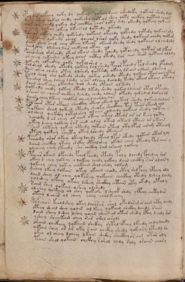

# Voynich Speculative Herbal Ferment Recipe — f103v

IMPORTANT: this is NOT a real or validated translation of the Voynich Manuscript. It is a speculative/procedural model that interprets EVA using a user-defined grammar to generate experimental recipes using safe, known edible substitutes.

This file is generated automatically from IVTFF/EVA transliteration plus a user-defined procedural grammar.



## Page / Folio
- currier: B
- folio: f103v
- page_number: 213

## EVA Text (Transliteration)
```text
pol dar olfchey qoky dy qokeey qokeey daiin okeedaky qote[iir:ar] shedy dal
daiin shey qokal shedy qokeedy qoteor shey qoty chckhy qotain cha[l:?]r
qo[k:t] or chedy qokey dar chcthy char qoty shdy okeedy qokeey qokain
y cheey qokeey okeey lkees ol qoteedy ykeedy
pcheor olkeey cheky qokshdy qokaiin okechdy qopchdy qotedy qokaiin oly
dain shey qokeedy cheol qoeeor lshor qoky shedy qokaiin chedy qokam
daiin shey chol chey oteey lkeeor okaiin shedy shedy qokaiin ol chedydy
sain shey olsheey dair chekoal okeey
pchal shal shorchdy okeor okaiin shedy pchedy qotchedy qotar ol lkar
or cheey qokeeshy o[k:t]eey loiin oithy otedy lor aiin sheor qotain olldy
qokeedy olkeeshy qoky qokal shed
sal sheal shedy okeedy qokeey l ol shedy pchor pchedy pol sheedy opalam
dain ch'eey olshy otey olshedy qotshdy okeey lr ain okan olshey
teeol sheol sho qokeedy shedy qokey oshedy oteedy qokain otar aiin otam
tchedal shey lcheey lchdy ch ar olchey lcheody tedy otain otain ota[?:l]y
daiin sheekchy okeeshy qol shedy otain ol kedy
qokeedy chedy qoteey oteedy lkedy shedy qokal ol char otal opchedy
yshear ol oqaiin chckhey lchedy chedy olaiin oteedy qokeedal larorol
daiin chey lkeey chalkar cheeey l chealainor
pol char otar okaiin shaikhy oteal okain qotal shedy qokeey lolain
tokain shal qokeed oteedy sheoky shaikhhy tar teor otam oll
olshey qokshy qotalsheey [o:a]loiin oleeedy qokain shedy qokey
ycheody l ar cheey or aiiin oteey otal otear [o:a]r ar keey qoty
ykeey lchey qokeey ror aiin olan otan otain otain ar y kain
sain olkeeey qokan oteedy qotain otal oty opar aram oteeam
yteey qokeey sheety oteey lshedy oteaiin
fcheody arar okeey okeey lchedy oteal lpar otedy qotar otaryly
daiin checkhy ykeey shckhy otealshey okain chey oteedy por aiin y
olcheeey chey lkchdy sho chcthy sal araiin qokeey
pchear okain opchedy pchol fchedy otedy poly lchedy fchedey rar
okeey l chey qokeey o qokeey chedy qekchy daiin chckhy sar olainy
qokeeey chey qotey chokaiin shal chedy olkam
yshey lkeey qokain okey okaiin cheody otey shdpchy opchey oly
daiin sheey ol chey qok shey qokaiin checkhy otedy lshey lchdy
qol shey ykeey okeey lshey sheckhy chtain oty okedy otaly
saiin shey qokeey oshey olshedy
olshey qokain ol sh[e:?]y qokeshe lsheok shdy qcphey chetydar
oteey l chees ol chey chey chol keechy
polshor keeolshey okey lcharar shol okeedar shes aiin oty lchdy
yteey sheal shey qoain ol keey qokaiin shckhy lchedy rain
daiin shey l shey lshey qoar sha[s:r] al otar shedy ithy lchdy rar
yshey sheykain chey rar arol chsaly
orain chckhey qokaiin shckhy shtal opchy lkeedy chdy lchedy
qkain shey ar ar oky rain chckhy shedy qokeory lteedy ro
okey ol cheey lcheey lkain shckhy sheckhy or ain otar oly
tain shol qokain chckhy rorol chdy raly osaiin chary
```

## Domain Context (Heuristic; Not a Translation)

This section summarizes recurring **basewords** in this IVTFF domain and shows simple substring evidence that the token markers used by the procedural grammar occur inside frequent words.

Any Italian anagram / English gloss is a best-effort lexicon match, not a decipherment.


### Associated basewords (non-generic; top by frequency in this domain)
- `daiin` (count=231) → Italian anagram `piani`; English: plans (arrangements)
- `qokaiin` (count=122) → Italian anagram `ciancio`; English: [n/a]
- `okaiin` (count=109) → Italian anagram `coniai`; English: [n/a]
- `qokain` (count=101) → Italian anagram `acconi`; English: [n/a]
- `okain` (count=69) → Italian anagram `acino`; English: a berry
- `otain` (count=53) → Italian anagram `anito`; English: [n/a]
- `qokar` (count=48) → Italian anagram `carco`; English: [n/a]
- `saiin` (count=46) → Italian anagram `asini`; English: [n/a]
- `qokal` (count=43) → Italian anagram `calco`; English: cast (of sculpture)
- `qotaiin` (count=40) → Italian anagram `cationi`; English: [n/a]
- `lkaiin` (count=39) → Italian anagram `ancili`; English: [n/a]
- `kaiin` (count=37) → Italian anagram `acini`; English: [n/a]
- `qokeol` (count=37) → Italian anagram `eccolo`; English: [n/a]
- `qotain` (count=34) → Italian anagram `antico`; English: ancient
- `qotar` (count=29) → Italian anagram `corta`; English: [n/a]

### Marker evidence (substring in frequent basewords)
- `qo`: 60 basewords; examples: `qokeey`, `qokeedy`, `qokaiin`, `qokain`, `qokedy`, `qokey`
- `q`: 61 basewords; examples: `qokeey`, `qokeedy`, `qokaiin`, `qokain`, `qokedy`, `qokey`
- `o`: 262 basewords; examples: `qokeey`, `ol`, `o`, `qokeedy`, `okeey`, `qokaiin`
- `k`: 147 basewords; examples: `qokeey`, `qokeedy`, `okeey`, `qokaiin`, `okaiin`, `qokain`
- `t`: 102 basewords; examples: `otaiin`, `oteey`, `otar`, `otedy`, `otal`, `oteedy`
- `p`: 17 basewords; examples: `opchedy`, `qopchedy`, `opchey`, `pchedy`, `qopchdy`, `opchdy`
- `ch`: 137 basewords; examples: `chedy`, `chey`, `chol`, `cheey`, `cheol`, `cheody`
- `sh`: 50 basewords; examples: `shedy`, `shey`, `sheey`, `sheol`, `shol`, `sheedy`
- `f`: 1 basewords; examples: `f`
- `cth`: 16 basewords; examples: `chcthy`, `cthey`, `shcthy`, `checthy`, `cthol`, `ctheey`
- `ckh`: 15 basewords; examples: `chckhy`, `shckhy`, `checkhy`, `chckhey`, `chockhy`, `sheckhy`
- `cph`: 2 basewords; examples: `cphol`, `cphy`
- `dy`: 84 basewords; examples: `chedy`, `qokeedy`, `shedy`, `otedy`, `oteedy`, `qokedy`
- `iin`: 39 basewords; examples: `aiin`, `daiin`, `qokaiin`, `okaiin`, `otaiin`, `saiin`
- `aiin`: 33 basewords; examples: `aiin`, `daiin`, `qokaiin`, `okaiin`, `otaiin`, `saiin`

## Recipes Index (This Page)
- [f103v.1,@P0](#f103v-1-f103v-1-p0)
- [f103v.2,+P0](#f103v-2-f103v-2-p0)
- [f103v.3,+P0](#f103v-3-f103v-3-p0)
- [f103v.4,+P0](#f103v-4-f103v-4-p0)
- [f103v.5,+P0](#f103v-5-f103v-5-p0)
- [f103v.6,+P0](#f103v-6-f103v-6-p0)
- [f103v.7,+P0](#f103v-7-f103v-7-p0)
- [f103v.8,+P0](#f103v-8-f103v-8-p0)
- [f103v.9,+P0](#f103v-9-f103v-9-p0)
- [f103v.10,+P0](#f103v-10-f103v-10-p0)
- [f103v.11,+P0](#f103v-11-f103v-11-p0)
- [f103v.12,+P0](#f103v-12-f103v-12-p0)
- [f103v.13,+P0](#f103v-13-f103v-13-p0)
- [f103v.14,+P0](#f103v-14-f103v-14-p0)
- [f103v.15,+P0](#f103v-15-f103v-15-p0)
- [f103v.16,+P0](#f103v-16-f103v-16-p0)
- [f103v.17,+P0](#f103v-17-f103v-17-p0)
- [f103v.18,+P0](#f103v-18-f103v-18-p0)
- [f103v.19,+P0](#f103v-19-f103v-19-p0)
- [f103v.20,+P0](#f103v-20-f103v-20-p0)
- [f103v.21,+P0](#f103v-21-f103v-21-p0)
- [f103v.22,+P0](#f103v-22-f103v-22-p0)
- [f103v.23,+P0](#f103v-23-f103v-23-p0)
- [f103v.24,+P0](#f103v-24-f103v-24-p0)
- [f103v.25,+P0](#f103v-25-f103v-25-p0)
- [f103v.26,+P0](#f103v-26-f103v-26-p0)
- [f103v.27,+P0](#f103v-27-f103v-27-p0)
- [f103v.28,+P0](#f103v-28-f103v-28-p0)
- [f103v.29,+P0](#f103v-29-f103v-29-p0)
- [f103v.30,+P0](#f103v-30-f103v-30-p0)
- [f103v.31,+P0](#f103v-31-f103v-31-p0)
- [f103v.32,+P0](#f103v-32-f103v-32-p0)
- [f103v.33,+P0](#f103v-33-f103v-33-p0)
- [f103v.34,+P0](#f103v-34-f103v-34-p0)
- [f103v.35,+P0](#f103v-35-f103v-35-p0)
- [f103v.36,+P0](#f103v-36-f103v-36-p0)
- [f103v.37,+P0](#f103v-37-f103v-37-p0)
- [f103v.38,+P0](#f103v-38-f103v-38-p0)
- [f103v.39,+P0](#f103v-39-f103v-39-p0)
- [f103v.40,+P0](#f103v-40-f103v-40-p0)
- [f103v.41,+P0](#f103v-41-f103v-41-p0)
- [f103v.42,+P0](#f103v-42-f103v-42-p0)
- [f103v.43,+P0](#f103v-43-f103v-43-p0)
- [f103v.44,+P0](#f103v-44-f103v-44-p0)
- [f103v.45,+P0](#f103v-45-f103v-45-p0)
- [f103v.46,+P0](#f103v-46-f103v-46-p0)

## Line Glosses (Procedural Gloss Only; Not a Translation)

<a id="f103v-1-f103v-1-p0"></a>

### f103v.1,@P0

EVA: pol dar olfchey qoky dy qokeey qokeey daiin okeedaky qote[iir:ar] shedy dal

Direct Gloss (Procedural, Not a Real Translation):
- pol: mix / transfer → start fermentation (yeast)
- dar: start fermentation (yeast) → duration level 1 → state: fermentation start
- olfchey: add main plant (safe substitute) → add aroma modifier → mix / transfer → duration level 1 → state: active extraction
- qoky: prepare liquid base → add fermentable sugars
- dy: start fermentation (yeast)
- qokeey: prepare liquid base → add fermentable sugars → duration level 2 → state: active extraction
- qokeey: prepare liquid base → add fermentable sugars → duration level 2 → state: active extraction
- daiin: start fermentation (yeast) → duration level 1 → state: fermentation start → long fermentation / aging phase
- okeedaky: add fermentable sugars → mix / transfer → start fermentation (yeast) → duration level 2 → state: active extraction
- qote: prepare liquid base → apply heat/cooking → duration level 1 → state: active extraction
- iir: duration level 2 → state: cooling/rest
- ar: duration level 1 → state: fermentation start
- shedy: add secondary herb (safe substitute) → start fermentation (yeast) → duration level 1 → state: active extraction
- dal: start fermentation (yeast) → duration level 1 → state: fermentation start

<a id="f103v-2-f103v-2-p0"></a>

### f103v.2,+P0

EVA: daiin shey qokal shedy qokeedy qoteor shey qoty chckhy qotain cha[l:?]r

Direct Gloss (Procedural, Not a Real Translation):
- daiin: start fermentation (yeast) → duration level 1 → state: fermentation start → long fermentation / aging phase
- shey: add secondary herb (safe substitute) → duration level 1 → state: active extraction
- qokal: prepare liquid base → add fermentable sugars → duration level 1 → state: fermentation start
- shedy: add secondary herb (safe substitute) → start fermentation (yeast) → duration level 1 → state: active extraction
- qokeedy: prepare liquid base → add fermentable sugars → start fermentation (yeast) → duration level 2 → state: active extraction
- qoteor: prepare liquid base → apply heat/cooking → mix / transfer → duration level 1 → state: active extraction
- shey: add secondary herb (safe substitute) → duration level 1 → state: active extraction
- qoty: prepare liquid base → apply heat/cooking
- chckhy: add main plant (safe substitute) → add complex herbal compound (safe blend)
- qotain: prepare liquid base → apply heat/cooking → duration level 1 → state: fermentation start
- cha: add main plant (safe substitute) → duration level 1 → state: fermentation start
- l: [unparsed]
- r: [unparsed]

<a id="f103v-3-f103v-3-p0"></a>

### f103v.3,+P0

EVA: qo[k:t] or chedy qokey dar chcthy char qoty shdy okeedy qokeey qokain

Direct Gloss (Procedural, Not a Real Translation):
- qo: prepare liquid base
- k: add fermentable sugars
- t: apply heat/cooking
- or: mix / transfer
- chedy: add main plant (safe substitute) → start fermentation (yeast) → duration level 1 → state: active extraction
- qokey: prepare liquid base → add fermentable sugars → duration level 1 → state: active extraction
- dar: start fermentation (yeast) → duration level 1 → state: fermentation start
- chcthy: add main plant (safe substitute) → add complex herbal compound (safe blend)
- char: add main plant (safe substitute) → duration level 1 → state: fermentation start
- qoty: prepare liquid base → apply heat/cooking
- shdy: add secondary herb (safe substitute) → start fermentation (yeast)
- okeedy: add fermentable sugars → mix / transfer → start fermentation (yeast) → duration level 2 → state: active extraction
- qokeey: prepare liquid base → add fermentable sugars → duration level 2 → state: active extraction
- qokain: prepare liquid base → add fermentable sugars → duration level 1 → state: fermentation start

<a id="f103v-4-f103v-4-p0"></a>

### f103v.4,+P0

EVA: y cheey qokeey okeey lkees ol qoteedy ykeedy

Direct Gloss (Procedural, Not a Real Translation):
- y: [unparsed]
- cheey: add main plant (safe substitute) → duration level 2 → state: active extraction
- qokeey: prepare liquid base → add fermentable sugars → duration level 2 → state: active extraction
- okeey: add fermentable sugars → mix / transfer → duration level 2 → state: active extraction
- lkees: add fermentable sugars → duration level 2 → state: active extraction
- ol: mix / transfer
- qoteedy: prepare liquid base → apply heat/cooking → start fermentation (yeast) → duration level 2 → state: active extraction
- ykeedy: add fermentable sugars → start fermentation (yeast) → duration level 2 → state: active extraction

<a id="f103v-5-f103v-5-p0"></a>

### f103v.5,+P0

EVA: pcheor olkeey cheky qokshdy qokaiin okechdy qopchdy qotedy qokaiin oly

Direct Gloss (Procedural, Not a Real Translation):
- pcheor: add main plant (safe substitute) → mix / transfer → start fermentation (yeast) → duration level 1 → state: active extraction
- olkeey: add fermentable sugars → mix / transfer → duration level 2 → state: active extraction
- cheky: add fermentable sugars → add main plant (safe substitute) → duration level 1 → state: active extraction
- qokshdy: prepare liquid base → add fermentable sugars → add secondary herb (safe substitute) → start fermentation (yeast)
- qokaiin: prepare liquid base → add fermentable sugars → duration level 1 → state: fermentation start → long fermentation / aging phase
- okechdy: add fermentable sugars → add main plant (safe substitute) → mix / transfer → start fermentation (yeast) → duration level 1 → state: active extraction
- qopchdy: prepare liquid base → add main plant (safe substitute) → start fermentation (yeast)
- qotedy: prepare liquid base → apply heat/cooking → start fermentation (yeast) → duration level 1 → state: active extraction
- qokaiin: prepare liquid base → add fermentable sugars → duration level 1 → state: fermentation start → long fermentation / aging phase
- oly: mix / transfer

<a id="f103v-6-f103v-6-p0"></a>

### f103v.6,+P0

EVA: dain shey qokeedy cheol qoeeor lshor qoky shedy qokaiin chedy qokam

Direct Gloss (Procedural, Not a Real Translation):
- dain: start fermentation (yeast) → duration level 1 → state: fermentation start
- shey: add secondary herb (safe substitute) → duration level 1 → state: active extraction
- qokeedy: prepare liquid base → add fermentable sugars → start fermentation (yeast) → duration level 2 → state: active extraction
- cheol: add main plant (safe substitute) → mix / transfer → duration level 1 → state: active extraction
- qoeeor: prepare liquid base → mix / transfer → duration level 2 → state: active extraction
- lshor: add secondary herb (safe substitute) → mix / transfer
- qoky: prepare liquid base → add fermentable sugars
- shedy: add secondary herb (safe substitute) → start fermentation (yeast) → duration level 1 → state: active extraction
- qokaiin: prepare liquid base → add fermentable sugars → duration level 1 → state: fermentation start → long fermentation / aging phase
- chedy: add main plant (safe substitute) → start fermentation (yeast) → duration level 1 → state: active extraction
- qokam: prepare liquid base → add fermentable sugars → duration level 1 → state: fermentation start

<a id="f103v-7-f103v-7-p0"></a>

### f103v.7,+P0

EVA: daiin shey chol chey oteey lkeeor okaiin shedy shedy qokaiin ol chedydy

Direct Gloss (Procedural, Not a Real Translation):
- daiin: start fermentation (yeast) → duration level 1 → state: fermentation start → long fermentation / aging phase
- shey: add secondary herb (safe substitute) → duration level 1 → state: active extraction
- chol: add main plant (safe substitute) → mix / transfer
- chey: add main plant (safe substitute) → duration level 1 → state: active extraction
- oteey: apply heat/cooking → mix / transfer → duration level 2 → state: active extraction
- lkeeor: add fermentable sugars → mix / transfer → duration level 2 → state: active extraction
- okaiin: add fermentable sugars → mix / transfer → duration level 1 → state: fermentation start → long fermentation / aging phase
- shedy: add secondary herb (safe substitute) → start fermentation (yeast) → duration level 1 → state: active extraction
- shedy: add secondary herb (safe substitute) → start fermentation (yeast) → duration level 1 → state: active extraction
- qokaiin: prepare liquid base → add fermentable sugars → duration level 1 → state: fermentation start → long fermentation / aging phase
- ol: mix / transfer
- chedydy: add main plant (safe substitute) → start fermentation (yeast) → duration level 1 → state: active extraction

<a id="f103v-8-f103v-8-p0"></a>

### f103v.8,+P0

EVA: sain shey olsheey dair chekoal okeey

Direct Gloss (Procedural, Not a Real Translation):
- sain: duration level 1 → state: fermentation start
- shey: add secondary herb (safe substitute) → duration level 1 → state: active extraction
- olsheey: add secondary herb (safe substitute) → mix / transfer → duration level 2 → state: active extraction
- dair: start fermentation (yeast) → duration level 1 → state: fermentation start
- chekoal: add fermentable sugars → add main plant (safe substitute) → mix / transfer → duration level 1 → state: active extraction
- okeey: add fermentable sugars → mix / transfer → duration level 2 → state: active extraction

<a id="f103v-9-f103v-9-p0"></a>

### f103v.9,+P0

EVA: pchal shal shorchdy okeor okaiin shedy pchedy qotchedy qotar ol lkar

Direct Gloss (Procedural, Not a Real Translation):
- pchal: add main plant (safe substitute) → start fermentation (yeast) → duration level 1 → state: fermentation start
- shal: add secondary herb (safe substitute) → duration level 1 → state: fermentation start
- shorchdy: add main plant (safe substitute) → add secondary herb (safe substitute) → mix / transfer → start fermentation (yeast)
- okeor: add fermentable sugars → mix / transfer → duration level 1 → state: active extraction
- okaiin: add fermentable sugars → mix / transfer → duration level 1 → state: fermentation start → long fermentation / aging phase
- shedy: add secondary herb (safe substitute) → start fermentation (yeast) → duration level 1 → state: active extraction
- pchedy: add main plant (safe substitute) → start fermentation (yeast) → duration level 1 → state: active extraction
- qotchedy: prepare liquid base → apply heat/cooking → add main plant (safe substitute) → start fermentation (yeast) → duration level 1 → state: active extraction
- qotar: prepare liquid base → apply heat/cooking → duration level 1 → state: fermentation start
- ol: mix / transfer
- lkar: add fermentable sugars → duration level 1 → state: fermentation start

<a id="f103v-10-f103v-10-p0"></a>

### f103v.10,+P0

EVA: or cheey qokeeshy o[k:t]eey loiin oithy otedy lor aiin sheor qotain olldy

Direct Gloss (Procedural, Not a Real Translation):
- or: mix / transfer
- cheey: add main plant (safe substitute) → duration level 2 → state: active extraction
- qokeeshy: prepare liquid base → add fermentable sugars → add secondary herb (safe substitute) → duration level 2 → state: active extraction
- o: mix / transfer
- k: add fermentable sugars
- t: apply heat/cooking
- eey: duration level 2 → state: active extraction
- loiin: mix / transfer → duration level 2 → state: cooling/rest → medium fermentation phase
- oithy: apply heat/cooking → mix / transfer → duration level 1 → state: cooling/rest
- otedy: apply heat/cooking → mix / transfer → start fermentation (yeast) → duration level 1 → state: active extraction
- lor: mix / transfer
- aiin: duration level 1 → state: fermentation start → long fermentation / aging phase
- sheor: add secondary herb (safe substitute) → mix / transfer → duration level 1 → state: active extraction
- qotain: prepare liquid base → apply heat/cooking → duration level 1 → state: fermentation start
- olldy: mix / transfer → start fermentation (yeast)

<a id="f103v-11-f103v-11-p0"></a>

### f103v.11,+P0

EVA: qokeedy olkeeshy qoky qokal shed

Direct Gloss (Procedural, Not a Real Translation):
- qokeedy: prepare liquid base → add fermentable sugars → start fermentation (yeast) → duration level 2 → state: active extraction
- olkeeshy: add fermentable sugars → add secondary herb (safe substitute) → mix / transfer → duration level 2 → state: active extraction
- qoky: prepare liquid base → add fermentable sugars
- qokal: prepare liquid base → add fermentable sugars → duration level 1 → state: fermentation start
- shed: add secondary herb (safe substitute) → start fermentation (yeast) → duration level 1 → state: active extraction

<a id="f103v-12-f103v-12-p0"></a>

### f103v.12,+P0

EVA: sal sheal shedy okeedy qokeey l ol shedy pchor pchedy pol sheedy opalam

Direct Gloss (Procedural, Not a Real Translation):
- sal: duration level 1 → state: fermentation start
- sheal: add secondary herb (safe substitute) → duration level 1 → state: active extraction
- shedy: add secondary herb (safe substitute) → start fermentation (yeast) → duration level 1 → state: active extraction
- okeedy: add fermentable sugars → mix / transfer → start fermentation (yeast) → duration level 2 → state: active extraction
- qokeey: prepare liquid base → add fermentable sugars → duration level 2 → state: active extraction
- l: [unparsed]
- ol: mix / transfer
- shedy: add secondary herb (safe substitute) → start fermentation (yeast) → duration level 1 → state: active extraction
- pchor: add main plant (safe substitute) → mix / transfer → start fermentation (yeast)
- pchedy: add main plant (safe substitute) → start fermentation (yeast) → duration level 1 → state: active extraction
- pol: mix / transfer → start fermentation (yeast)
- sheedy: add secondary herb (safe substitute) → start fermentation (yeast) → duration level 2 → state: active extraction
- opalam: mix / transfer → start fermentation (yeast) → duration level 1 → state: fermentation start

<a id="f103v-13-f103v-13-p0"></a>

### f103v.13,+P0

EVA: dain ch'eey olshy otey olshedy qotshdy okeey lr ain okan olshey

Direct Gloss (Procedural, Not a Real Translation):
- dain: start fermentation (yeast) → duration level 1 → state: fermentation start
- ch: add main plant (safe substitute)
- eey: duration level 2 → state: active extraction
- olshy: add secondary herb (safe substitute) → mix / transfer
- otey: apply heat/cooking → mix / transfer → duration level 1 → state: active extraction
- olshedy: add secondary herb (safe substitute) → mix / transfer → start fermentation (yeast) → duration level 1 → state: active extraction
- qotshdy: prepare liquid base → apply heat/cooking → add secondary herb (safe substitute) → start fermentation (yeast)
- okeey: add fermentable sugars → mix / transfer → duration level 2 → state: active extraction
- lr: [unparsed]
- ain: duration level 1 → state: fermentation start
- okan: add fermentable sugars → mix / transfer → duration level 1 → state: fermentation start
- olshey: add secondary herb (safe substitute) → mix / transfer → duration level 1 → state: active extraction

<a id="f103v-14-f103v-14-p0"></a>

### f103v.14,+P0

EVA: teeol sheol sho qokeedy shedy qokey oshedy oteedy qokain otar aiin otam

Direct Gloss (Procedural, Not a Real Translation):
- teeol: apply heat/cooking → mix / transfer → duration level 2 → state: active extraction
- sheol: add secondary herb (safe substitute) → mix / transfer → duration level 1 → state: active extraction
- sho: add secondary herb (safe substitute) → mix / transfer
- qokeedy: prepare liquid base → add fermentable sugars → start fermentation (yeast) → duration level 2 → state: active extraction
- shedy: add secondary herb (safe substitute) → start fermentation (yeast) → duration level 1 → state: active extraction
- qokey: prepare liquid base → add fermentable sugars → duration level 1 → state: active extraction
- oshedy: add secondary herb (safe substitute) → mix / transfer → start fermentation (yeast) → duration level 1 → state: active extraction
- oteedy: apply heat/cooking → mix / transfer → start fermentation (yeast) → duration level 2 → state: active extraction
- qokain: prepare liquid base → add fermentable sugars → duration level 1 → state: fermentation start
- otar: apply heat/cooking → mix / transfer → duration level 1 → state: fermentation start
- aiin: duration level 1 → state: fermentation start → long fermentation / aging phase
- otam: apply heat/cooking → mix / transfer → duration level 1 → state: fermentation start

<a id="f103v-15-f103v-15-p0"></a>

### f103v.15,+P0

EVA: tchedal shey lcheey lchdy ch ar olchey lcheody tedy otain otain ota[?:l]y

Direct Gloss (Procedural, Not a Real Translation):
- tchedal: apply heat/cooking → add main plant (safe substitute) → start fermentation (yeast) → duration level 1 → state: active extraction
- shey: add secondary herb (safe substitute) → duration level 1 → state: active extraction
- lcheey: add main plant (safe substitute) → duration level 2 → state: active extraction
- lchdy: add main plant (safe substitute) → start fermentation (yeast)
- ch: add main plant (safe substitute)
- ar: duration level 1 → state: fermentation start
- olchey: add main plant (safe substitute) → mix / transfer → duration level 1 → state: active extraction
- lcheody: add main plant (safe substitute) → mix / transfer → start fermentation (yeast) → duration level 1 → state: active extraction
- tedy: apply heat/cooking → start fermentation (yeast) → duration level 1 → state: active extraction
- otain: apply heat/cooking → mix / transfer → duration level 1 → state: fermentation start
- otain: apply heat/cooking → mix / transfer → duration level 1 → state: fermentation start
- ota: apply heat/cooking → mix / transfer → duration level 1 → state: fermentation start
- l: [unparsed]
- y: [unparsed]

<a id="f103v-16-f103v-16-p0"></a>

### f103v.16,+P0

EVA: daiin sheekchy okeeshy qol shedy otain ol kedy

Direct Gloss (Procedural, Not a Real Translation):
- daiin: start fermentation (yeast) → duration level 1 → state: fermentation start → long fermentation / aging phase
- sheekchy: add fermentable sugars → add main plant (safe substitute) → add secondary herb (safe substitute) → duration level 2 → state: active extraction
- okeeshy: add fermentable sugars → add secondary herb (safe substitute) → mix / transfer → duration level 2 → state: active extraction
- qol: prepare liquid base
- shedy: add secondary herb (safe substitute) → start fermentation (yeast) → duration level 1 → state: active extraction
- otain: apply heat/cooking → mix / transfer → duration level 1 → state: fermentation start
- ol: mix / transfer
- kedy: add fermentable sugars → start fermentation (yeast) → duration level 1 → state: active extraction

<a id="f103v-17-f103v-17-p0"></a>

### f103v.17,+P0

EVA: qokeedy chedy qoteey oteedy lkedy shedy qokal ol char otal opchedy

Direct Gloss (Procedural, Not a Real Translation):
- qokeedy: prepare liquid base → add fermentable sugars → start fermentation (yeast) → duration level 2 → state: active extraction
- chedy: add main plant (safe substitute) → start fermentation (yeast) → duration level 1 → state: active extraction
- qoteey: prepare liquid base → apply heat/cooking → duration level 2 → state: active extraction
- oteedy: apply heat/cooking → mix / transfer → start fermentation (yeast) → duration level 2 → state: active extraction
- lkedy: add fermentable sugars → start fermentation (yeast) → duration level 1 → state: active extraction
- shedy: add secondary herb (safe substitute) → start fermentation (yeast) → duration level 1 → state: active extraction
- qokal: prepare liquid base → add fermentable sugars → duration level 1 → state: fermentation start
- ol: mix / transfer
- char: add main plant (safe substitute) → duration level 1 → state: fermentation start
- otal: apply heat/cooking → mix / transfer → duration level 1 → state: fermentation start
- opchedy: add main plant (safe substitute) → mix / transfer → start fermentation (yeast) → duration level 1 → state: active extraction

<a id="f103v-18-f103v-18-p0"></a>

### f103v.18,+P0

EVA: yshear ol oqaiin chckhey lchedy chedy olaiin oteedy qokeedal larorol

Direct Gloss (Procedural, Not a Real Translation):
- yshear: add secondary herb (safe substitute) → duration level 1 → state: active extraction
- ol: mix / transfer
- oqaiin: prepare base (generic) → mix / transfer → duration level 1 → state: fermentation start → long fermentation / aging phase
- chckhey: add main plant (safe substitute) → add complex herbal compound (safe blend) → duration level 1 → state: active extraction
- lchedy: add main plant (safe substitute) → start fermentation (yeast) → duration level 1 → state: active extraction
- chedy: add main plant (safe substitute) → start fermentation (yeast) → duration level 1 → state: active extraction
- olaiin: mix / transfer → duration level 1 → state: fermentation start → long fermentation / aging phase
- oteedy: apply heat/cooking → mix / transfer → start fermentation (yeast) → duration level 2 → state: active extraction
- qokeedal: prepare liquid base → add fermentable sugars → start fermentation (yeast) → duration level 2 → state: active extraction
- larorol: mix / transfer → duration level 1 → state: fermentation start

<a id="f103v-19-f103v-19-p0"></a>

### f103v.19,+P0

EVA: daiin chey lkeey chalkar cheeey l chealainor

Direct Gloss (Procedural, Not a Real Translation):
- daiin: start fermentation (yeast) → duration level 1 → state: fermentation start → long fermentation / aging phase
- chey: add main plant (safe substitute) → duration level 1 → state: active extraction
- lkeey: add fermentable sugars → duration level 2 → state: active extraction
- chalkar: add fermentable sugars → add main plant (safe substitute) → duration level 1 → state: fermentation start
- cheeey: add main plant (safe substitute) → duration level 3 → state: active extraction
- l: [unparsed]
- chealainor: add main plant (safe substitute) → mix / transfer → duration level 1 → state: active extraction

<a id="f103v-20-f103v-20-p0"></a>

### f103v.20,+P0

EVA: pol char otar okaiin shaikhy oteal okain qotal shedy qokeey lolain

Direct Gloss (Procedural, Not a Real Translation):
- pol: mix / transfer → start fermentation (yeast)
- char: add main plant (safe substitute) → duration level 1 → state: fermentation start
- otar: apply heat/cooking → mix / transfer → duration level 1 → state: fermentation start
- okaiin: add fermentable sugars → mix / transfer → duration level 1 → state: fermentation start → long fermentation / aging phase
- shaikhy: add fermentable sugars → add secondary herb (safe substitute) → duration level 1 → state: fermentation start
- oteal: apply heat/cooking → mix / transfer → duration level 1 → state: active extraction
- okain: add fermentable sugars → mix / transfer → duration level 1 → state: fermentation start
- qotal: prepare liquid base → apply heat/cooking → duration level 1 → state: fermentation start
- shedy: add secondary herb (safe substitute) → start fermentation (yeast) → duration level 1 → state: active extraction
- qokeey: prepare liquid base → add fermentable sugars → duration level 2 → state: active extraction
- lolain: mix / transfer → duration level 1 → state: fermentation start

<a id="f103v-21-f103v-21-p0"></a>

### f103v.21,+P0

EVA: tokain shal qokeed oteedy sheoky shaikhhy tar teor otam oll

Direct Gloss (Procedural, Not a Real Translation):
- tokain: add fermentable sugars → apply heat/cooking → mix / transfer → duration level 1 → state: fermentation start
- shal: add secondary herb (safe substitute) → duration level 1 → state: fermentation start
- qokeed: prepare liquid base → add fermentable sugars → start fermentation (yeast) → duration level 2 → state: active extraction
- oteedy: apply heat/cooking → mix / transfer → start fermentation (yeast) → duration level 2 → state: active extraction
- sheoky: add fermentable sugars → add secondary herb (safe substitute) → mix / transfer → duration level 1 → state: active extraction
- shaikhhy: add fermentable sugars → add secondary herb (safe substitute) → duration level 1 → state: fermentation start
- tar: apply heat/cooking → duration level 1 → state: fermentation start
- teor: apply heat/cooking → mix / transfer → duration level 1 → state: active extraction
- otam: apply heat/cooking → mix / transfer → duration level 1 → state: fermentation start
- oll: mix / transfer

<a id="f103v-22-f103v-22-p0"></a>

### f103v.22,+P0

EVA: olshey qokshy qotalsheey [o:a]loiin oleeedy qokain shedy qokey

Direct Gloss (Procedural, Not a Real Translation):
- olshey: add secondary herb (safe substitute) → mix / transfer → duration level 1 → state: active extraction
- qokshy: prepare liquid base → add fermentable sugars → add secondary herb (safe substitute)
- qotalsheey: prepare liquid base → apply heat/cooking → add secondary herb (safe substitute) → duration level 1 → state: fermentation start
- o: mix / transfer
- a: duration level 1 → state: fermentation start
- loiin: mix / transfer → duration level 2 → state: cooling/rest → medium fermentation phase
- oleeedy: mix / transfer → start fermentation (yeast) → duration level 3 → state: active extraction
- qokain: prepare liquid base → add fermentable sugars → duration level 1 → state: fermentation start
- shedy: add secondary herb (safe substitute) → start fermentation (yeast) → duration level 1 → state: active extraction
- qokey: prepare liquid base → add fermentable sugars → duration level 1 → state: active extraction

<a id="f103v-23-f103v-23-p0"></a>

### f103v.23,+P0

EVA: ycheody l ar cheey or aiiin oteey otal otear [o:a]r ar keey qoty

Direct Gloss (Procedural, Not a Real Translation):
- ycheody: add main plant (safe substitute) → mix / transfer → start fermentation (yeast) → duration level 1 → state: active extraction
- l: [unparsed]
- ar: duration level 1 → state: fermentation start
- cheey: add main plant (safe substitute) → duration level 2 → state: active extraction
- or: mix / transfer
- aiiin: duration level 1 → state: fermentation start → medium fermentation phase
- oteey: apply heat/cooking → mix / transfer → duration level 2 → state: active extraction
- otal: apply heat/cooking → mix / transfer → duration level 1 → state: fermentation start
- otear: apply heat/cooking → mix / transfer → duration level 1 → state: active extraction
- o: mix / transfer
- a: duration level 1 → state: fermentation start
- r: [unparsed]
- ar: duration level 1 → state: fermentation start
- keey: add fermentable sugars → duration level 2 → state: active extraction
- qoty: prepare liquid base → apply heat/cooking

<a id="f103v-24-f103v-24-p0"></a>

### f103v.24,+P0

EVA: ykeey lchey qokeey ror aiin olan otan otain otain ar y kain

Direct Gloss (Procedural, Not a Real Translation):
- ykeey: add fermentable sugars → duration level 2 → state: active extraction
- lchey: add main plant (safe substitute) → duration level 1 → state: active extraction
- qokeey: prepare liquid base → add fermentable sugars → duration level 2 → state: active extraction
- ror: mix / transfer
- aiin: duration level 1 → state: fermentation start → long fermentation / aging phase
- olan: mix / transfer → duration level 1 → state: fermentation start
- otan: apply heat/cooking → mix / transfer → duration level 1 → state: fermentation start
- otain: apply heat/cooking → mix / transfer → duration level 1 → state: fermentation start
- otain: apply heat/cooking → mix / transfer → duration level 1 → state: fermentation start
- ar: duration level 1 → state: fermentation start
- y: [unparsed]
- kain: add fermentable sugars → duration level 1 → state: fermentation start

<a id="f103v-25-f103v-25-p0"></a>

### f103v.25,+P0

EVA: sain olkeeey qokan oteedy qotain otal oty opar aram oteeam

Direct Gloss (Procedural, Not a Real Translation):
- sain: duration level 1 → state: fermentation start
- olkeeey: add fermentable sugars → mix / transfer → duration level 3 → state: active extraction
- qokan: prepare liquid base → add fermentable sugars → duration level 1 → state: fermentation start
- oteedy: apply heat/cooking → mix / transfer → start fermentation (yeast) → duration level 2 → state: active extraction
- qotain: prepare liquid base → apply heat/cooking → duration level 1 → state: fermentation start
- otal: apply heat/cooking → mix / transfer → duration level 1 → state: fermentation start
- oty: apply heat/cooking → mix / transfer
- opar: mix / transfer → start fermentation (yeast) → duration level 1 → state: fermentation start
- aram: duration level 1 → state: fermentation start
- oteeam: apply heat/cooking → mix / transfer → duration level 2 → state: active extraction

<a id="f103v-26-f103v-26-p0"></a>

### f103v.26,+P0

EVA: yteey qokeey sheety oteey lshedy oteaiin

Direct Gloss (Procedural, Not a Real Translation):
- yteey: apply heat/cooking → duration level 2 → state: active extraction
- qokeey: prepare liquid base → add fermentable sugars → duration level 2 → state: active extraction
- sheety: apply heat/cooking → add secondary herb (safe substitute) → duration level 2 → state: active extraction
- oteey: apply heat/cooking → mix / transfer → duration level 2 → state: active extraction
- lshedy: add secondary herb (safe substitute) → start fermentation (yeast) → duration level 1 → state: active extraction
- oteaiin: apply heat/cooking → mix / transfer → duration level 1 → state: active extraction → long fermentation / aging phase

<a id="f103v-27-f103v-27-p0"></a>

### f103v.27,+P0

EVA: fcheody arar okeey okeey lchedy oteal lpar otedy qotar otaryly

Direct Gloss (Procedural, Not a Real Translation):
- fcheody: add main plant (safe substitute) → add aroma modifier → mix / transfer → start fermentation (yeast) → duration level 1 → state: active extraction
- arar: duration level 1 → state: fermentation start
- okeey: add fermentable sugars → mix / transfer → duration level 2 → state: active extraction
- okeey: add fermentable sugars → mix / transfer → duration level 2 → state: active extraction
- lchedy: add main plant (safe substitute) → start fermentation (yeast) → duration level 1 → state: active extraction
- oteal: apply heat/cooking → mix / transfer → duration level 1 → state: active extraction
- lpar: start fermentation (yeast) → duration level 1 → state: fermentation start
- otedy: apply heat/cooking → mix / transfer → start fermentation (yeast) → duration level 1 → state: active extraction
- qotar: prepare liquid base → apply heat/cooking → duration level 1 → state: fermentation start
- otaryly: apply heat/cooking → mix / transfer → duration level 1 → state: fermentation start

<a id="f103v-28-f103v-28-p0"></a>

### f103v.28,+P0

EVA: daiin checkhy ykeey shckhy otealshey okain chey oteedy por aiin y

Direct Gloss (Procedural, Not a Real Translation):
- daiin: start fermentation (yeast) → duration level 1 → state: fermentation start → long fermentation / aging phase
- checkhy: add main plant (safe substitute) → add complex herbal compound (safe blend) → duration level 1 → state: active extraction
- ykeey: add fermentable sugars → duration level 2 → state: active extraction
- shckhy: add secondary herb (safe substitute) → add complex herbal compound (safe blend)
- otealshey: apply heat/cooking → add secondary herb (safe substitute) → mix / transfer → duration level 1 → state: active extraction
- okain: add fermentable sugars → mix / transfer → duration level 1 → state: fermentation start
- chey: add main plant (safe substitute) → duration level 1 → state: active extraction
- oteedy: apply heat/cooking → mix / transfer → start fermentation (yeast) → duration level 2 → state: active extraction
- por: mix / transfer → start fermentation (yeast)
- aiin: duration level 1 → state: fermentation start → long fermentation / aging phase
- y: [unparsed]

<a id="f103v-29-f103v-29-p0"></a>

### f103v.29,+P0

EVA: olcheeey chey lkchdy sho chcthy sal araiin qokeey

Direct Gloss (Procedural, Not a Real Translation):
- olcheeey: add main plant (safe substitute) → mix / transfer → duration level 3 → state: active extraction
- chey: add main plant (safe substitute) → duration level 1 → state: active extraction
- lkchdy: add fermentable sugars → add main plant (safe substitute) → start fermentation (yeast)
- sho: add secondary herb (safe substitute) → mix / transfer
- chcthy: add main plant (safe substitute) → add complex herbal compound (safe blend)
- sal: duration level 1 → state: fermentation start
- araiin: duration level 1 → state: fermentation start → long fermentation / aging phase
- qokeey: prepare liquid base → add fermentable sugars → duration level 2 → state: active extraction

<a id="f103v-30-f103v-30-p0"></a>

### f103v.30,+P0

EVA: pchear okain opchedy pchol fchedy otedy poly lchedy fchedey rar

Direct Gloss (Procedural, Not a Real Translation):
- pchear: add main plant (safe substitute) → start fermentation (yeast) → duration level 1 → state: active extraction
- okain: add fermentable sugars → mix / transfer → duration level 1 → state: fermentation start
- opchedy: add main plant (safe substitute) → mix / transfer → start fermentation (yeast) → duration level 1 → state: active extraction
- pchol: add main plant (safe substitute) → mix / transfer → start fermentation (yeast)
- fchedy: add main plant (safe substitute) → add aroma modifier → start fermentation (yeast) → duration level 1 → state: active extraction
- otedy: apply heat/cooking → mix / transfer → start fermentation (yeast) → duration level 1 → state: active extraction
- poly: mix / transfer → start fermentation (yeast)
- lchedy: add main plant (safe substitute) → start fermentation (yeast) → duration level 1 → state: active extraction
- fchedey: add main plant (safe substitute) → add aroma modifier → start fermentation (yeast) → duration level 1 → state: active extraction
- rar: duration level 1 → state: fermentation start

<a id="f103v-31-f103v-31-p0"></a>

### f103v.31,+P0

EVA: okeey l chey qokeey o qokeey chedy qekchy daiin chckhy sar olainy

Direct Gloss (Procedural, Not a Real Translation):
- okeey: add fermentable sugars → mix / transfer → duration level 2 → state: active extraction
- l: [unparsed]
- chey: add main plant (safe substitute) → duration level 1 → state: active extraction
- qokeey: prepare liquid base → add fermentable sugars → duration level 2 → state: active extraction
- o: mix / transfer
- qokeey: prepare liquid base → add fermentable sugars → duration level 2 → state: active extraction
- chedy: add main plant (safe substitute) → start fermentation (yeast) → duration level 1 → state: active extraction
- qekchy: prepare base (generic) → add fermentable sugars → add main plant (safe substitute) → duration level 1 → state: active extraction
- daiin: start fermentation (yeast) → duration level 1 → state: fermentation start → long fermentation / aging phase
- chckhy: add main plant (safe substitute) → add complex herbal compound (safe blend)
- sar: duration level 1 → state: fermentation start
- olainy: mix / transfer → duration level 1 → state: fermentation start

<a id="f103v-32-f103v-32-p0"></a>

### f103v.32,+P0

EVA: qokeeey chey qotey chokaiin shal chedy olkam

Direct Gloss (Procedural, Not a Real Translation):
- qokeeey: prepare liquid base → add fermentable sugars → duration level 3 → state: active extraction
- chey: add main plant (safe substitute) → duration level 1 → state: active extraction
- qotey: prepare liquid base → apply heat/cooking → duration level 1 → state: active extraction
- chokaiin: add fermentable sugars → add main plant (safe substitute) → mix / transfer → duration level 1 → state: fermentation start → long fermentation / aging phase
- shal: add secondary herb (safe substitute) → duration level 1 → state: fermentation start
- chedy: add main plant (safe substitute) → start fermentation (yeast) → duration level 1 → state: active extraction
- olkam: add fermentable sugars → mix / transfer → duration level 1 → state: fermentation start

<a id="f103v-33-f103v-33-p0"></a>

### f103v.33,+P0

EVA: yshey lkeey qokain okey okaiin cheody otey shdpchy opchey oly

Direct Gloss (Procedural, Not a Real Translation):
- yshey: add secondary herb (safe substitute) → duration level 1 → state: active extraction
- lkeey: add fermentable sugars → duration level 2 → state: active extraction
- qokain: prepare liquid base → add fermentable sugars → duration level 1 → state: fermentation start
- okey: add fermentable sugars → mix / transfer → duration level 1 → state: active extraction
- okaiin: add fermentable sugars → mix / transfer → duration level 1 → state: fermentation start → long fermentation / aging phase
- cheody: add main plant (safe substitute) → mix / transfer → start fermentation (yeast) → duration level 1 → state: active extraction
- otey: apply heat/cooking → mix / transfer → duration level 1 → state: active extraction
- shdpchy: add main plant (safe substitute) → add secondary herb (safe substitute) → start fermentation (yeast)
- opchey: add main plant (safe substitute) → mix / transfer → start fermentation (yeast) → duration level 1 → state: active extraction
- oly: mix / transfer

<a id="f103v-34-f103v-34-p0"></a>

### f103v.34,+P0

EVA: daiin sheey ol chey qok shey qokaiin checkhy otedy lshey lchdy

Direct Gloss (Procedural, Not a Real Translation):
- daiin: start fermentation (yeast) → duration level 1 → state: fermentation start → long fermentation / aging phase
- sheey: add secondary herb (safe substitute) → duration level 2 → state: active extraction
- ol: mix / transfer
- chey: add main plant (safe substitute) → duration level 1 → state: active extraction
- qok: prepare liquid base → add fermentable sugars
- shey: add secondary herb (safe substitute) → duration level 1 → state: active extraction
- qokaiin: prepare liquid base → add fermentable sugars → duration level 1 → state: fermentation start → long fermentation / aging phase
- checkhy: add main plant (safe substitute) → add complex herbal compound (safe blend) → duration level 1 → state: active extraction
- otedy: apply heat/cooking → mix / transfer → start fermentation (yeast) → duration level 1 → state: active extraction
- lshey: add secondary herb (safe substitute) → duration level 1 → state: active extraction
- lchdy: add main plant (safe substitute) → start fermentation (yeast)

<a id="f103v-35-f103v-35-p0"></a>

### f103v.35,+P0

EVA: qol shey ykeey okeey lshey sheckhy chtain oty okedy otaly

Direct Gloss (Procedural, Not a Real Translation):
- qol: prepare liquid base
- shey: add secondary herb (safe substitute) → duration level 1 → state: active extraction
- ykeey: add fermentable sugars → duration level 2 → state: active extraction
- okeey: add fermentable sugars → mix / transfer → duration level 2 → state: active extraction
- lshey: add secondary herb (safe substitute) → duration level 1 → state: active extraction
- sheckhy: add secondary herb (safe substitute) → add complex herbal compound (safe blend) → duration level 1 → state: active extraction
- chtain: apply heat/cooking → add main plant (safe substitute) → duration level 1 → state: fermentation start
- oty: apply heat/cooking → mix / transfer
- okedy: add fermentable sugars → mix / transfer → start fermentation (yeast) → duration level 1 → state: active extraction
- otaly: apply heat/cooking → mix / transfer → duration level 1 → state: fermentation start

<a id="f103v-36-f103v-36-p0"></a>

### f103v.36,+P0

EVA: saiin shey qokeey oshey olshedy

Direct Gloss (Procedural, Not a Real Translation):
- saiin: duration level 1 → state: fermentation start → long fermentation / aging phase
- shey: add secondary herb (safe substitute) → duration level 1 → state: active extraction
- qokeey: prepare liquid base → add fermentable sugars → duration level 2 → state: active extraction
- oshey: add secondary herb (safe substitute) → mix / transfer → duration level 1 → state: active extraction
- olshedy: add secondary herb (safe substitute) → mix / transfer → start fermentation (yeast) → duration level 1 → state: active extraction

<a id="f103v-37-f103v-37-p0"></a>

### f103v.37,+P0

EVA: olshey qokain ol sh[e:?]y qokeshe lsheok shdy qcphey chetydar

Direct Gloss (Procedural, Not a Real Translation):
- olshey: add secondary herb (safe substitute) → mix / transfer → duration level 1 → state: active extraction
- qokain: prepare liquid base → add fermentable sugars → duration level 1 → state: fermentation start
- ol: mix / transfer
- sh: add secondary herb (safe substitute)
- e: duration level 1 → state: active extraction
- y: [unparsed]
- qokeshe: prepare liquid base → add fermentable sugars → add secondary herb (safe substitute) → duration level 1 → state: active extraction
- lsheok: add fermentable sugars → add secondary herb (safe substitute) → mix / transfer → duration level 1 → state: active extraction
- shdy: add secondary herb (safe substitute) → start fermentation (yeast)
- qcphey: prepare base (generic) → add complex herbal compound (safe blend) → duration level 1 → state: active extraction
- chetydar: apply heat/cooking → add main plant (safe substitute) → start fermentation (yeast) → duration level 1 → state: active extraction

<a id="f103v-38-f103v-38-p0"></a>

### f103v.38,+P0

EVA: oteey l chees ol chey chey chol keechy

Direct Gloss (Procedural, Not a Real Translation):
- oteey: apply heat/cooking → mix / transfer → duration level 2 → state: active extraction
- l: [unparsed]
- chees: add main plant (safe substitute) → duration level 2 → state: active extraction
- ol: mix / transfer
- chey: add main plant (safe substitute) → duration level 1 → state: active extraction
- chey: add main plant (safe substitute) → duration level 1 → state: active extraction
- chol: add main plant (safe substitute) → mix / transfer
- keechy: add fermentable sugars → add main plant (safe substitute) → duration level 2 → state: active extraction

<a id="f103v-39-f103v-39-p0"></a>

### f103v.39,+P0

EVA: polshor keeolshey okey lcharar shol okeedar shes aiin oty lchdy

Direct Gloss (Procedural, Not a Real Translation):
- polshor: add secondary herb (safe substitute) → mix / transfer → start fermentation (yeast)
- keeolshey: add fermentable sugars → add secondary herb (safe substitute) → mix / transfer → duration level 2 → state: active extraction
- okey: add fermentable sugars → mix / transfer → duration level 1 → state: active extraction
- lcharar: add main plant (safe substitute) → duration level 1 → state: fermentation start
- shol: add secondary herb (safe substitute) → mix / transfer
- okeedar: add fermentable sugars → mix / transfer → start fermentation (yeast) → duration level 2 → state: active extraction
- shes: add secondary herb (safe substitute) → duration level 1 → state: active extraction
- aiin: duration level 1 → state: fermentation start → long fermentation / aging phase
- oty: apply heat/cooking → mix / transfer
- lchdy: add main plant (safe substitute) → start fermentation (yeast)

<a id="f103v-40-f103v-40-p0"></a>

### f103v.40,+P0

EVA: yteey sheal shey qoain ol keey qokaiin shckhy lchedy rain

Direct Gloss (Procedural, Not a Real Translation):
- yteey: apply heat/cooking → duration level 2 → state: active extraction
- sheal: add secondary herb (safe substitute) → duration level 1 → state: active extraction
- shey: add secondary herb (safe substitute) → duration level 1 → state: active extraction
- qoain: prepare liquid base → duration level 1 → state: fermentation start
- ol: mix / transfer
- keey: add fermentable sugars → duration level 2 → state: active extraction
- qokaiin: prepare liquid base → add fermentable sugars → duration level 1 → state: fermentation start → long fermentation / aging phase
- shckhy: add secondary herb (safe substitute) → add complex herbal compound (safe blend)
- lchedy: add main plant (safe substitute) → start fermentation (yeast) → duration level 1 → state: active extraction
- rain: duration level 1 → state: fermentation start

<a id="f103v-41-f103v-41-p0"></a>

### f103v.41,+P0

EVA: daiin shey l shey lshey qoar sha[s:r] al otar shedy ithy lchdy rar

Direct Gloss (Procedural, Not a Real Translation):
- daiin: start fermentation (yeast) → duration level 1 → state: fermentation start → long fermentation / aging phase
- shey: add secondary herb (safe substitute) → duration level 1 → state: active extraction
- l: [unparsed]
- shey: add secondary herb (safe substitute) → duration level 1 → state: active extraction
- lshey: add secondary herb (safe substitute) → duration level 1 → state: active extraction
- qoar: prepare liquid base → duration level 1 → state: fermentation start
- sha: add secondary herb (safe substitute) → duration level 1 → state: fermentation start
- s: [unparsed]
- r: [unparsed]
- al: duration level 1 → state: fermentation start
- otar: apply heat/cooking → mix / transfer → duration level 1 → state: fermentation start
- shedy: add secondary herb (safe substitute) → start fermentation (yeast) → duration level 1 → state: active extraction
- ithy: apply heat/cooking → duration level 1 → state: cooling/rest
- lchdy: add main plant (safe substitute) → start fermentation (yeast)
- rar: duration level 1 → state: fermentation start

<a id="f103v-42-f103v-42-p0"></a>

### f103v.42,+P0

EVA: yshey sheykain chey rar arol chsaly

Direct Gloss (Procedural, Not a Real Translation):
- yshey: add secondary herb (safe substitute) → duration level 1 → state: active extraction
- sheykain: add fermentable sugars → add secondary herb (safe substitute) → duration level 1 → state: active extraction
- chey: add main plant (safe substitute) → duration level 1 → state: active extraction
- rar: duration level 1 → state: fermentation start
- arol: mix / transfer → duration level 1 → state: fermentation start
- chsaly: add main plant (safe substitute) → duration level 1 → state: fermentation start

<a id="f103v-43-f103v-43-p0"></a>

### f103v.43,+P0

EVA: orain chckhey qokaiin shckhy shtal opchy lkeedy chdy lchedy

Direct Gloss (Procedural, Not a Real Translation):
- orain: mix / transfer → duration level 1 → state: fermentation start
- chckhey: add main plant (safe substitute) → add complex herbal compound (safe blend) → duration level 1 → state: active extraction
- qokaiin: prepare liquid base → add fermentable sugars → duration level 1 → state: fermentation start → long fermentation / aging phase
- shckhy: add secondary herb (safe substitute) → add complex herbal compound (safe blend)
- shtal: apply heat/cooking → add secondary herb (safe substitute) → duration level 1 → state: fermentation start
- opchy: add main plant (safe substitute) → mix / transfer → start fermentation (yeast)
- lkeedy: add fermentable sugars → start fermentation (yeast) → duration level 2 → state: active extraction
- chdy: add main plant (safe substitute) → start fermentation (yeast)
- lchedy: add main plant (safe substitute) → start fermentation (yeast) → duration level 1 → state: active extraction

<a id="f103v-44-f103v-44-p0"></a>

### f103v.44,+P0

EVA: qkain shey ar ar oky rain chckhy shedy qokeory lteedy ro

Direct Gloss (Procedural, Not a Real Translation):
- qkain: prepare base (generic) → add fermentable sugars → duration level 1 → state: fermentation start
- shey: add secondary herb (safe substitute) → duration level 1 → state: active extraction
- ar: duration level 1 → state: fermentation start
- ar: duration level 1 → state: fermentation start
- oky: add fermentable sugars → mix / transfer
- rain: duration level 1 → state: fermentation start
- chckhy: add main plant (safe substitute) → add complex herbal compound (safe blend)
- shedy: add secondary herb (safe substitute) → start fermentation (yeast) → duration level 1 → state: active extraction
- qokeory: prepare liquid base → add fermentable sugars → mix / transfer → duration level 1 → state: active extraction
- lteedy: apply heat/cooking → start fermentation (yeast) → duration level 2 → state: active extraction
- ro: mix / transfer

<a id="f103v-45-f103v-45-p0"></a>

### f103v.45,+P0

EVA: okey ol cheey lcheey lkain shckhy sheckhy or ain otar oly

Direct Gloss (Procedural, Not a Real Translation):
- okey: add fermentable sugars → mix / transfer → duration level 1 → state: active extraction
- ol: mix / transfer
- cheey: add main plant (safe substitute) → duration level 2 → state: active extraction
- lcheey: add main plant (safe substitute) → duration level 2 → state: active extraction
- lkain: add fermentable sugars → duration level 1 → state: fermentation start
- shckhy: add secondary herb (safe substitute) → add complex herbal compound (safe blend)
- sheckhy: add secondary herb (safe substitute) → add complex herbal compound (safe blend) → duration level 1 → state: active extraction
- or: mix / transfer
- ain: duration level 1 → state: fermentation start
- otar: apply heat/cooking → mix / transfer → duration level 1 → state: fermentation start
- oly: mix / transfer

<a id="f103v-46-f103v-46-p0"></a>

### f103v.46,+P0

EVA: tain shol qokain chckhy rorol chdy raly osaiin chary

Direct Gloss (Procedural, Not a Real Translation):
- tain: apply heat/cooking → duration level 1 → state: fermentation start
- shol: add secondary herb (safe substitute) → mix / transfer
- qokain: prepare liquid base → add fermentable sugars → duration level 1 → state: fermentation start
- chckhy: add main plant (safe substitute) → add complex herbal compound (safe blend)
- rorol: mix / transfer
- chdy: add main plant (safe substitute) → start fermentation (yeast)
- raly: duration level 1 → state: fermentation start
- osaiin: mix / transfer → duration level 1 → state: fermentation start → long fermentation / aging phase
- chary: add main plant (safe substitute) → duration level 1 → state: fermentation start
