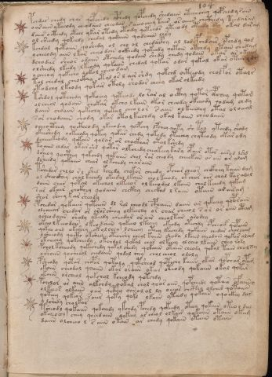

# Voynich Speculative Herbal Ferment Recipe — f104r

IMPORTANT: this is NOT a real or validated translation of the Voynich Manuscript. It is a speculative/procedural model that interprets EVA using a user-defined grammar to generate experimental recipes using safe, known edible substitutes.

This file is generated automatically from IVTFF/EVA transliteration plus a user-defined procedural grammar.



## Page / Folio
- currier: B
- folio: f104r
- page_number: 214

## EVA Text (Transliteration)
```text
pchdar chedy char qopchedy ocphedy qopchedy shedaiin oteeochey qopchedy sain
o ar aiin yteeody cheedaiin cheodar s aiin chey tair os aiin chcthedy teedaram
daiir o cthedy otech ykar otedy otody qoteeor yteeody oteedy aky okal daram
o l sheedy qokeedy chedal qodaiin qodaiin chry
kchdal qotaiin qoshedy ol chl ol chedaiphy al lod pchdair opchdy qod
y cheeody aiin lkar cheeo dain ockhedy qokeedy qotain otchdy otain chedam
dchodees sheos odaiin otchedy qodain shedy chedy qodain okar ar okaim
o lsheedy lkeedy lkeody qokaiin chedal qokar odar qokal okar otar odr
ycheeoy qokecho qokol cheeo dam
tol chedal cheockay otyd os l air shdy qokchd octheody cholfor otalr
otodchy lkeody qokair otoly shodar cheey okar olkeedy
tshdol qotchedy qokoeey qoteode lo sar al octhy qotor opchey qotam
olcheol qodain chokar okcho lkain okar cheody okeeody qodam chdy
daiin choaiin qokechy qotal cheolor saiin olkeechey otal ol oeeal
sor chodaiin chody okar otolkeechdy okal kaiin cheodaiin
ocheoithey qoctheody ykeeodey qoepchy opchey qoty sh tey yteedy shody
ykeeshedy olkeeody qotey qokar chedy qokedy oteechy chyteody okar ody
dcheeokeody qokain qolar or chockhar otalkshedy
toaiin chdar otar shd qotar olkchedy cheokeey kary opair otor airod lshd
dsheoy qocthey qokchdy qokaiin chol rar cheody cheeekan ar ain ar alam
dsheedy qokaiin chear olkchedy charaiin
tshedar chllo rl shed kchedy chokor cheedy opchar cheor chckhey taiin dam
ol sheockhey chol kechdy okeedal lkain chol keeody otchor aiir chol kar alol
daiin char qotal okechol olkeeor olkeeodal lkaiin chal keeedy qokam
sar okair chckhey qodaiin chckhy checkhd l raiin otain ar airam
shar sheey kar sheody
pchedar qokaiin qotaiin dl ral cheodl cphaiin daiin ar qekeeey qoparaiin
olcheear chedar or aror sheey olkeechy or char cheeo l s or or aiin atam
ysheodaiin shody yteedy cheedar or air cheoltar arodly
okeeo l keeo dain lkeodaiin qokeeo lkeeeey okeody otechdy opcheof qopaiin
qokeeo aiin okch'eey okolchey lcheeey oteey lkechedy qokaiin chedar cholcham
ysheeody qo[cth:et?] okshey otechshy cheol kaiin shoda lkaiin cheodain qokar alchd
okchechy qokcheedy okchdal qokal char olkeeey olcheo lkaiin chey raly
pchol ksheody qokeshedy qokal chedy qokaiin otaiin cheody qokal taiin cholxy
yshoiin qocheol chedaiin qodal chey chol cheol olaly
psheody qotar chopar qotaly qotsheod qotechy kaiin okar qopchar opam
okaiin cheodal qoaiin okar oraiin okar oteody qokaiin okal qotir
okaiin [o:a]rcheol qokchol kcheody qotchdy
pcholor ar aiin alkchdy qotal chol qoar aiin qopcheedy qotair ofaiino
olkeeos olkaiin oair qcthy oiinol al ly oeear chcthy olched qotaiiin
qoteey qokeor soiir qoty qokl lkaiin yteedy qokain oqockhy dar
y lshedy cholkar
tsheodl qokaiin qokchedy ykchdy pchedy qokeedy oteey qokain oteo l dal
okcheochy cheey qoeedaiin qokeey ar cheol olkair qokaiin otaiin okam
daiin olcheeo l s aiin otain ar chedy qokaiin otaiin otaiin
```

## Domain Context (Heuristic; Not a Translation)

This section summarizes recurring **basewords** in this IVTFF domain and shows simple substring evidence that the token markers used by the procedural grammar occur inside frequent words.

Any Italian anagram / English gloss is a best-effort lexicon match, not a decipherment.


### Associated basewords (non-generic; top by frequency in this domain)
- `daiin` (count=231) → Italian anagram `piani`; English: plans (arrangements)
- `qokaiin` (count=122) → Italian anagram `ciancio`; English: [n/a]
- `okaiin` (count=109) → Italian anagram `coniai`; English: [n/a]
- `qokain` (count=101) → Italian anagram `acconi`; English: [n/a]
- `okain` (count=69) → Italian anagram `acino`; English: a berry
- `otain` (count=53) → Italian anagram `anito`; English: [n/a]
- `qokar` (count=48) → Italian anagram `carco`; English: [n/a]
- `saiin` (count=46) → Italian anagram `asini`; English: [n/a]
- `qokal` (count=43) → Italian anagram `calco`; English: cast (of sculpture)
- `qotaiin` (count=40) → Italian anagram `cationi`; English: [n/a]
- `lkaiin` (count=39) → Italian anagram `ancili`; English: [n/a]
- `kaiin` (count=37) → Italian anagram `acini`; English: [n/a]
- `qokeol` (count=37) → Italian anagram `eccolo`; English: [n/a]
- `qotain` (count=34) → Italian anagram `antico`; English: ancient
- `qotar` (count=29) → Italian anagram `corta`; English: [n/a]

### Marker evidence (substring in frequent basewords)
- `qo`: 60 basewords; examples: `qokeey`, `qokeedy`, `qokaiin`, `qokain`, `qokedy`, `qokey`
- `q`: 61 basewords; examples: `qokeey`, `qokeedy`, `qokaiin`, `qokain`, `qokedy`, `qokey`
- `o`: 262 basewords; examples: `qokeey`, `ol`, `o`, `qokeedy`, `okeey`, `qokaiin`
- `k`: 147 basewords; examples: `qokeey`, `qokeedy`, `okeey`, `qokaiin`, `okaiin`, `qokain`
- `t`: 102 basewords; examples: `otaiin`, `oteey`, `otar`, `otedy`, `otal`, `oteedy`
- `p`: 17 basewords; examples: `opchedy`, `qopchedy`, `opchey`, `pchedy`, `qopchdy`, `opchdy`
- `ch`: 137 basewords; examples: `chedy`, `chey`, `chol`, `cheey`, `cheol`, `cheody`
- `sh`: 50 basewords; examples: `shedy`, `shey`, `sheey`, `sheol`, `shol`, `sheedy`
- `f`: 1 basewords; examples: `f`
- `cth`: 16 basewords; examples: `chcthy`, `cthey`, `shcthy`, `checthy`, `cthol`, `ctheey`
- `ckh`: 15 basewords; examples: `chckhy`, `shckhy`, `checkhy`, `chckhey`, `chockhy`, `sheckhy`
- `cph`: 2 basewords; examples: `cphol`, `cphy`
- `dy`: 84 basewords; examples: `chedy`, `qokeedy`, `shedy`, `otedy`, `oteedy`, `qokedy`
- `iin`: 39 basewords; examples: `aiin`, `daiin`, `qokaiin`, `okaiin`, `otaiin`, `saiin`
- `aiin`: 33 basewords; examples: `aiin`, `daiin`, `qokaiin`, `okaiin`, `otaiin`, `saiin`

## Recipes Index (This Page)
- [f104r.1,@P0](#f104r-1-f104r-1-p0)
- [f104r.2,+P0](#f104r-2-f104r-2-p0)
- [f104r.3,+P0](#f104r-3-f104r-3-p0)
- [f104r.4,+P0](#f104r-4-f104r-4-p0)
- [f104r.5,+P0](#f104r-5-f104r-5-p0)
- [f104r.6,+P0](#f104r-6-f104r-6-p0)
- [f104r.7,+P0](#f104r-7-f104r-7-p0)
- [f104r.8,+P0](#f104r-8-f104r-8-p0)
- [f104r.9,+P0](#f104r-9-f104r-9-p0)
- [f104r.10,+P0](#f104r-10-f104r-10-p0)
- [f104r.11,+P0](#f104r-11-f104r-11-p0)
- [f104r.12,+P0](#f104r-12-f104r-12-p0)
- [f104r.13,+P0](#f104r-13-f104r-13-p0)
- [f104r.14,+P0](#f104r-14-f104r-14-p0)
- [f104r.15,+P0](#f104r-15-f104r-15-p0)
- [f104r.16,+P0](#f104r-16-f104r-16-p0)
- [f104r.17,+P0](#f104r-17-f104r-17-p0)
- [f104r.18,+P0](#f104r-18-f104r-18-p0)
- [f104r.19,+P0](#f104r-19-f104r-19-p0)
- [f104r.20,+P0](#f104r-20-f104r-20-p0)
- [f104r.21,+P0](#f104r-21-f104r-21-p0)
- [f104r.22,+P0](#f104r-22-f104r-22-p0)
- [f104r.23,+P0](#f104r-23-f104r-23-p0)
- [f104r.24,+P0](#f104r-24-f104r-24-p0)
- [f104r.25,+P0](#f104r-25-f104r-25-p0)
- [f104r.26,+P0](#f104r-26-f104r-26-p0)
- [f104r.27,+P0](#f104r-27-f104r-27-p0)
- [f104r.28,+P0](#f104r-28-f104r-28-p0)
- [f104r.29,+P0](#f104r-29-f104r-29-p0)
- [f104r.30,+P0](#f104r-30-f104r-30-p0)
- [f104r.31,+P0](#f104r-31-f104r-31-p0)
- [f104r.32,+P0](#f104r-32-f104r-32-p0)
- [f104r.33,+P0](#f104r-33-f104r-33-p0)
- [f104r.34,+P0](#f104r-34-f104r-34-p0)
- [f104r.35,+P0](#f104r-35-f104r-35-p0)
- [f104r.36,+P0](#f104r-36-f104r-36-p0)
- [f104r.37,+P0](#f104r-37-f104r-37-p0)
- [f104r.38,+P0](#f104r-38-f104r-38-p0)
- [f104r.39,+P0](#f104r-39-f104r-39-p0)
- [f104r.40,+P0](#f104r-40-f104r-40-p0)
- [f104r.41,+P0](#f104r-41-f104r-41-p0)
- [f104r.42,+P0](#f104r-42-f104r-42-p0)
- [f104r.43,+P0](#f104r-43-f104r-43-p0)
- [f104r.44,+P0](#f104r-44-f104r-44-p0)
- [f104r.45,+P0](#f104r-45-f104r-45-p0)

## Line Glosses (Procedural Gloss Only; Not a Translation)

<a id="f104r-1-f104r-1-p0"></a>

### f104r.1,@P0

EVA: pchdar chedy char qopchedy ocphedy qopchedy shedaiin oteeochey qopchedy sain

Direct Gloss (Procedural, Not a Real Translation):
- pchdar: add main plant (safe substitute) → start fermentation (yeast) → duration level 1 → state: fermentation start
- chedy: add main plant (safe substitute) → start fermentation (yeast) → duration level 1 → state: active extraction
- char: add main plant (safe substitute) → duration level 1 → state: fermentation start
- qopchedy: prepare liquid base → add main plant (safe substitute) → start fermentation (yeast) → duration level 1 → state: active extraction
- ocphedy: mix / transfer → start fermentation (yeast) → add complex herbal compound (safe blend) → duration level 1 → state: active extraction
- qopchedy: prepare liquid base → add main plant (safe substitute) → start fermentation (yeast) → duration level 1 → state: active extraction
- shedaiin: add secondary herb (safe substitute) → start fermentation (yeast) → duration level 1 → state: active extraction → long fermentation / aging phase
- oteeochey: apply heat/cooking → add main plant (safe substitute) → mix / transfer → duration level 2 → state: active extraction
- qopchedy: prepare liquid base → add main plant (safe substitute) → start fermentation (yeast) → duration level 1 → state: active extraction
- sain: duration level 1 → state: fermentation start

<a id="f104r-2-f104r-2-p0"></a>

### f104r.2,+P0

EVA: o ar aiin yteeody cheedaiin cheodar s aiin chey tair os aiin chcthedy teedaram

Direct Gloss (Procedural, Not a Real Translation):
- o: mix / transfer
- ar: duration level 1 → state: fermentation start
- aiin: duration level 1 → state: fermentation start → long fermentation / aging phase
- yteeody: apply heat/cooking → mix / transfer → start fermentation (yeast) → duration level 2 → state: active extraction
- cheedaiin: add main plant (safe substitute) → start fermentation (yeast) → duration level 2 → state: active extraction → long fermentation / aging phase
- cheodar: add main plant (safe substitute) → mix / transfer → start fermentation (yeast) → duration level 1 → state: active extraction
- s: [unparsed]
- aiin: duration level 1 → state: fermentation start → long fermentation / aging phase
- chey: add main plant (safe substitute) → duration level 1 → state: active extraction
- tair: apply heat/cooking → duration level 1 → state: fermentation start
- os: mix / transfer
- aiin: duration level 1 → state: fermentation start → long fermentation / aging phase
- chcthedy: add main plant (safe substitute) → start fermentation (yeast) → add complex herbal compound (safe blend) → duration level 1 → state: active extraction
- teedaram: apply heat/cooking → start fermentation (yeast) → duration level 2 → state: active extraction

<a id="f104r-3-f104r-3-p0"></a>

### f104r.3,+P0

EVA: daiir o cthedy otech ykar otedy otody qoteeor yteeody oteedy aky okal daram

Direct Gloss (Procedural, Not a Real Translation):
- daiir: start fermentation (yeast) → duration level 1 → state: fermentation start
- o: mix / transfer
- cthedy: start fermentation (yeast) → add complex herbal compound (safe blend) → duration level 1 → state: active extraction
- otech: apply heat/cooking → add main plant (safe substitute) → mix / transfer → duration level 1 → state: active extraction
- ykar: add fermentable sugars → duration level 1 → state: fermentation start
- otedy: apply heat/cooking → mix / transfer → start fermentation (yeast) → duration level 1 → state: active extraction
- otody: apply heat/cooking → mix / transfer → start fermentation (yeast)
- qoteeor: prepare liquid base → apply heat/cooking → mix / transfer → duration level 2 → state: active extraction
- yteeody: apply heat/cooking → mix / transfer → start fermentation (yeast) → duration level 2 → state: active extraction
- oteedy: apply heat/cooking → mix / transfer → start fermentation (yeast) → duration level 2 → state: active extraction
- aky: add fermentable sugars → duration level 1 → state: fermentation start
- okal: add fermentable sugars → mix / transfer → duration level 1 → state: fermentation start
- daram: start fermentation (yeast) → duration level 1 → state: fermentation start

<a id="f104r-4-f104r-4-p0"></a>

### f104r.4,+P0

EVA: o l sheedy qokeedy chedal qodaiin qodaiin chry

Direct Gloss (Procedural, Not a Real Translation):
- o: mix / transfer
- l: [unparsed]
- sheedy: add secondary herb (safe substitute) → start fermentation (yeast) → duration level 2 → state: active extraction
- qokeedy: prepare liquid base → add fermentable sugars → start fermentation (yeast) → duration level 2 → state: active extraction
- chedal: add main plant (safe substitute) → start fermentation (yeast) → duration level 1 → state: active extraction
- qodaiin: prepare liquid base → start fermentation (yeast) → duration level 1 → state: fermentation start → long fermentation / aging phase
- qodaiin: prepare liquid base → start fermentation (yeast) → duration level 1 → state: fermentation start → long fermentation / aging phase
- chry: add main plant (safe substitute)

<a id="f104r-5-f104r-5-p0"></a>

### f104r.5,+P0

EVA: kchdal qotaiin qoshedy ol chl ol chedaiphy al lod pchdair opchdy qod

Direct Gloss (Procedural, Not a Real Translation):
- kchdal: add fermentable sugars → add main plant (safe substitute) → start fermentation (yeast) → duration level 1 → state: fermentation start
- qotaiin: prepare liquid base → apply heat/cooking → duration level 1 → state: fermentation start → long fermentation / aging phase
- qoshedy: prepare liquid base → add secondary herb (safe substitute) → start fermentation (yeast) → duration level 1 → state: active extraction
- ol: mix / transfer
- chl: add main plant (safe substitute)
- ol: mix / transfer
- chedaiphy: add main plant (safe substitute) → start fermentation (yeast) → duration level 1 → state: active extraction
- al: duration level 1 → state: fermentation start
- lod: mix / transfer → start fermentation (yeast)
- pchdair: add main plant (safe substitute) → start fermentation (yeast) → duration level 1 → state: fermentation start
- opchdy: add main plant (safe substitute) → mix / transfer → start fermentation (yeast)
- qod: prepare liquid base → start fermentation (yeast)

<a id="f104r-6-f104r-6-p0"></a>

### f104r.6,+P0

EVA: y cheeody aiin lkar cheeo dain ockhedy qokeedy qotain otchdy otain chedam

Direct Gloss (Procedural, Not a Real Translation):
- y: [unparsed]
- cheeody: add main plant (safe substitute) → mix / transfer → start fermentation (yeast) → duration level 2 → state: active extraction
- aiin: duration level 1 → state: fermentation start → long fermentation / aging phase
- lkar: add fermentable sugars → duration level 1 → state: fermentation start
- cheeo: add main plant (safe substitute) → mix / transfer → duration level 2 → state: active extraction
- dain: start fermentation (yeast) → duration level 1 → state: fermentation start
- ockhedy: mix / transfer → start fermentation (yeast) → add complex herbal compound (safe blend) → duration level 1 → state: active extraction
- qokeedy: prepare liquid base → add fermentable sugars → start fermentation (yeast) → duration level 2 → state: active extraction
- qotain: prepare liquid base → apply heat/cooking → duration level 1 → state: fermentation start
- otchdy: apply heat/cooking → add main plant (safe substitute) → mix / transfer → start fermentation (yeast)
- otain: apply heat/cooking → mix / transfer → duration level 1 → state: fermentation start
- chedam: add main plant (safe substitute) → start fermentation (yeast) → duration level 1 → state: active extraction

<a id="f104r-7-f104r-7-p0"></a>

### f104r.7,+P0

EVA: dchodees sheos odaiin otchedy qodain shedy chedy qodain okar ar okaim

Direct Gloss (Procedural, Not a Real Translation):
- dchodees: add main plant (safe substitute) → mix / transfer → start fermentation (yeast) → duration level 2 → state: active extraction
- sheos: add secondary herb (safe substitute) → mix / transfer → duration level 1 → state: active extraction
- odaiin: mix / transfer → start fermentation (yeast) → duration level 1 → state: fermentation start → long fermentation / aging phase
- otchedy: apply heat/cooking → add main plant (safe substitute) → mix / transfer → start fermentation (yeast) → duration level 1 → state: active extraction
- qodain: prepare liquid base → start fermentation (yeast) → duration level 1 → state: fermentation start
- shedy: add secondary herb (safe substitute) → start fermentation (yeast) → duration level 1 → state: active extraction
- chedy: add main plant (safe substitute) → start fermentation (yeast) → duration level 1 → state: active extraction
- qodain: prepare liquid base → start fermentation (yeast) → duration level 1 → state: fermentation start
- okar: add fermentable sugars → mix / transfer → duration level 1 → state: fermentation start
- ar: duration level 1 → state: fermentation start
- okaim: add fermentable sugars → mix / transfer → duration level 1 → state: fermentation start

<a id="f104r-8-f104r-8-p0"></a>

### f104r.8,+P0

EVA: o lsheedy lkeedy lkeody qokaiin chedal qokar odar qokal okar otar odr

Direct Gloss (Procedural, Not a Real Translation):
- o: mix / transfer
- lsheedy: add secondary herb (safe substitute) → start fermentation (yeast) → duration level 2 → state: active extraction
- lkeedy: add fermentable sugars → start fermentation (yeast) → duration level 2 → state: active extraction
- lkeody: add fermentable sugars → mix / transfer → start fermentation (yeast) → duration level 1 → state: active extraction
- qokaiin: prepare liquid base → add fermentable sugars → duration level 1 → state: fermentation start → long fermentation / aging phase
- chedal: add main plant (safe substitute) → start fermentation (yeast) → duration level 1 → state: active extraction
- qokar: prepare liquid base → add fermentable sugars → duration level 1 → state: fermentation start
- odar: mix / transfer → start fermentation (yeast) → duration level 1 → state: fermentation start
- qokal: prepare liquid base → add fermentable sugars → duration level 1 → state: fermentation start
- okar: add fermentable sugars → mix / transfer → duration level 1 → state: fermentation start
- otar: apply heat/cooking → mix / transfer → duration level 1 → state: fermentation start
- odr: mix / transfer → start fermentation (yeast)

<a id="f104r-9-f104r-9-p0"></a>

### f104r.9,+P0

EVA: ycheeoy qokecho qokol cheeo dam

Direct Gloss (Procedural, Not a Real Translation):
- ycheeoy: add main plant (safe substitute) → mix / transfer → duration level 2 → state: active extraction
- qokecho: prepare liquid base → add fermentable sugars → add main plant (safe substitute) → mix / transfer → duration level 1 → state: active extraction
- qokol: prepare liquid base → add fermentable sugars → mix / transfer
- cheeo: add main plant (safe substitute) → mix / transfer → duration level 2 → state: active extraction
- dam: start fermentation (yeast) → duration level 1 → state: fermentation start

<a id="f104r-10-f104r-10-p0"></a>

### f104r.10,+P0

EVA: tol chedal cheockay otyd os l air shdy qokchd octheody cholfor otalr

Direct Gloss (Procedural, Not a Real Translation):
- tol: apply heat/cooking → mix / transfer
- chedal: add main plant (safe substitute) → start fermentation (yeast) → duration level 1 → state: active extraction
- cheockay: add fermentable sugars → add main plant (safe substitute) → mix / transfer → duration level 1 → state: active extraction
- otyd: apply heat/cooking → mix / transfer → start fermentation (yeast)
- os: mix / transfer
- l: [unparsed]
- air: duration level 1 → state: fermentation start
- shdy: add secondary herb (safe substitute) → start fermentation (yeast)
- qokchd: prepare liquid base → add fermentable sugars → add main plant (safe substitute) → start fermentation (yeast)
- octheody: mix / transfer → start fermentation (yeast) → add complex herbal compound (safe blend) → duration level 1 → state: active extraction
- cholfor: add main plant (safe substitute) → add aroma modifier → mix / transfer
- otalr: apply heat/cooking → mix / transfer → duration level 1 → state: fermentation start

<a id="f104r-11-f104r-11-p0"></a>

### f104r.11,+P0

EVA: otodchy lkeody qokair otoly shodar cheey okar olkeedy

Direct Gloss (Procedural, Not a Real Translation):
- otodchy: apply heat/cooking → add main plant (safe substitute) → mix / transfer → start fermentation (yeast)
- lkeody: add fermentable sugars → mix / transfer → start fermentation (yeast) → duration level 1 → state: active extraction
- qokair: prepare liquid base → add fermentable sugars → duration level 1 → state: fermentation start
- otoly: apply heat/cooking → mix / transfer
- shodar: add secondary herb (safe substitute) → mix / transfer → start fermentation (yeast) → duration level 1 → state: fermentation start
- cheey: add main plant (safe substitute) → duration level 2 → state: active extraction
- okar: add fermentable sugars → mix / transfer → duration level 1 → state: fermentation start
- olkeedy: add fermentable sugars → mix / transfer → start fermentation (yeast) → duration level 2 → state: active extraction

<a id="f104r-12-f104r-12-p0"></a>

### f104r.12,+P0

EVA: tshdol qotchedy qokoeey qoteode lo sar al octhy qotor opchey qotam

Direct Gloss (Procedural, Not a Real Translation):
- tshdol: apply heat/cooking → add secondary herb (safe substitute) → mix / transfer → start fermentation (yeast)
- qotchedy: prepare liquid base → apply heat/cooking → add main plant (safe substitute) → start fermentation (yeast) → duration level 1 → state: active extraction
- qokoeey: prepare liquid base → add fermentable sugars → mix / transfer → duration level 2 → state: active extraction
- qoteode: prepare liquid base → apply heat/cooking → mix / transfer → start fermentation (yeast) → duration level 1 → state: active extraction
- lo: mix / transfer
- sar: duration level 1 → state: fermentation start
- al: duration level 1 → state: fermentation start
- octhy: mix / transfer → add complex herbal compound (safe blend)
- qotor: prepare liquid base → apply heat/cooking → mix / transfer
- opchey: add main plant (safe substitute) → mix / transfer → start fermentation (yeast) → duration level 1 → state: active extraction
- qotam: prepare liquid base → apply heat/cooking → duration level 1 → state: fermentation start

<a id="f104r-13-f104r-13-p0"></a>

### f104r.13,+P0

EVA: olcheol qodain chokar okcho lkain okar cheody okeeody qodam chdy

Direct Gloss (Procedural, Not a Real Translation):
- olcheol: add main plant (safe substitute) → mix / transfer → duration level 1 → state: active extraction
- qodain: prepare liquid base → start fermentation (yeast) → duration level 1 → state: fermentation start
- chokar: add fermentable sugars → add main plant (safe substitute) → mix / transfer → duration level 1 → state: fermentation start
- okcho: add fermentable sugars → add main plant (safe substitute) → mix / transfer
- lkain: add fermentable sugars → duration level 1 → state: fermentation start
- okar: add fermentable sugars → mix / transfer → duration level 1 → state: fermentation start
- cheody: add main plant (safe substitute) → mix / transfer → start fermentation (yeast) → duration level 1 → state: active extraction
- okeeody: add fermentable sugars → mix / transfer → start fermentation (yeast) → duration level 2 → state: active extraction
- qodam: prepare liquid base → start fermentation (yeast) → duration level 1 → state: fermentation start
- chdy: add main plant (safe substitute) → start fermentation (yeast)

<a id="f104r-14-f104r-14-p0"></a>

### f104r.14,+P0

EVA: daiin choaiin qokechy qotal cheolor saiin olkeechey otal ol oeeal

Direct Gloss (Procedural, Not a Real Translation):
- daiin: start fermentation (yeast) → duration level 1 → state: fermentation start → long fermentation / aging phase
- choaiin: add main plant (safe substitute) → mix / transfer → duration level 1 → state: fermentation start → long fermentation / aging phase
- qokechy: prepare liquid base → add fermentable sugars → add main plant (safe substitute) → duration level 1 → state: active extraction
- qotal: prepare liquid base → apply heat/cooking → duration level 1 → state: fermentation start
- cheolor: add main plant (safe substitute) → mix / transfer → duration level 1 → state: active extraction
- saiin: duration level 1 → state: fermentation start → long fermentation / aging phase
- olkeechey: add fermentable sugars → add main plant (safe substitute) → mix / transfer → duration level 2 → state: active extraction
- otal: apply heat/cooking → mix / transfer → duration level 1 → state: fermentation start
- ol: mix / transfer
- oeeal: mix / transfer → duration level 2 → state: active extraction

<a id="f104r-15-f104r-15-p0"></a>

### f104r.15,+P0

EVA: sor chodaiin chody okar otolkeechdy okal kaiin cheodaiin

Direct Gloss (Procedural, Not a Real Translation):
- sor: mix / transfer
- chodaiin: add main plant (safe substitute) → mix / transfer → start fermentation (yeast) → duration level 1 → state: fermentation start → long fermentation / aging phase
- chody: add main plant (safe substitute) → mix / transfer → start fermentation (yeast)
- okar: add fermentable sugars → mix / transfer → duration level 1 → state: fermentation start
- otolkeechdy: add fermentable sugars → apply heat/cooking → add main plant (safe substitute) → mix / transfer → start fermentation (yeast) → duration level 2 → state: active extraction
- okal: add fermentable sugars → mix / transfer → duration level 1 → state: fermentation start
- kaiin: add fermentable sugars → duration level 1 → state: fermentation start → long fermentation / aging phase
- cheodaiin: add main plant (safe substitute) → mix / transfer → start fermentation (yeast) → duration level 1 → state: active extraction → long fermentation / aging phase

<a id="f104r-16-f104r-16-p0"></a>

### f104r.16,+P0

EVA: ocheoithey qoctheody ykeeodey qoepchy opchey qoty sh tey yteedy shody

Direct Gloss (Procedural, Not a Real Translation):
- ocheoithey: apply heat/cooking → add main plant (safe substitute) → mix / transfer → duration level 1 → state: active extraction
- qoctheody: prepare liquid base → mix / transfer → start fermentation (yeast) → add complex herbal compound (safe blend) → duration level 1 → state: active extraction
- ykeeodey: add fermentable sugars → mix / transfer → start fermentation (yeast) → duration level 2 → state: active extraction
- qoepchy: prepare liquid base → add main plant (safe substitute) → start fermentation (yeast) → duration level 1 → state: active extraction
- opchey: add main plant (safe substitute) → mix / transfer → start fermentation (yeast) → duration level 1 → state: active extraction
- qoty: prepare liquid base → apply heat/cooking
- sh: add secondary herb (safe substitute)
- tey: apply heat/cooking → duration level 1 → state: active extraction
- yteedy: apply heat/cooking → start fermentation (yeast) → duration level 2 → state: active extraction
- shody: add secondary herb (safe substitute) → mix / transfer → start fermentation (yeast)

<a id="f104r-17-f104r-17-p0"></a>

### f104r.17,+P0

EVA: ykeeshedy olkeeody qotey qokar chedy qokedy oteechy chyteody okar ody

Direct Gloss (Procedural, Not a Real Translation):
- ykeeshedy: add fermentable sugars → add secondary herb (safe substitute) → start fermentation (yeast) → duration level 2 → state: active extraction
- olkeeody: add fermentable sugars → mix / transfer → start fermentation (yeast) → duration level 2 → state: active extraction
- qotey: prepare liquid base → apply heat/cooking → duration level 1 → state: active extraction
- qokar: prepare liquid base → add fermentable sugars → duration level 1 → state: fermentation start
- chedy: add main plant (safe substitute) → start fermentation (yeast) → duration level 1 → state: active extraction
- qokedy: prepare liquid base → add fermentable sugars → start fermentation (yeast) → duration level 1 → state: active extraction
- oteechy: apply heat/cooking → add main plant (safe substitute) → mix / transfer → duration level 2 → state: active extraction
- chyteody: apply heat/cooking → add main plant (safe substitute) → mix / transfer → start fermentation (yeast) → duration level 1 → state: active extraction
- okar: add fermentable sugars → mix / transfer → duration level 1 → state: fermentation start
- ody: mix / transfer → start fermentation (yeast)

<a id="f104r-18-f104r-18-p0"></a>

### f104r.18,+P0

EVA: dcheeokeody qokain qolar or chockhar otalkshedy

Direct Gloss (Procedural, Not a Real Translation):
- dcheeokeody: add fermentable sugars → add main plant (safe substitute) → mix / transfer → start fermentation (yeast) → duration level 2 → state: active extraction
- qokain: prepare liquid base → add fermentable sugars → duration level 1 → state: fermentation start
- qolar: prepare liquid base → duration level 1 → state: fermentation start
- or: mix / transfer
- chockhar: add main plant (safe substitute) → mix / transfer → add complex herbal compound (safe blend) → duration level 1 → state: fermentation start
- otalkshedy: add fermentable sugars → apply heat/cooking → add secondary herb (safe substitute) → mix / transfer → start fermentation (yeast) → duration level 1 → state: fermentation start

<a id="f104r-19-f104r-19-p0"></a>

### f104r.19,+P0

EVA: toaiin chdar otar shd qotar olkchedy cheokeey kary opair otor airod lshd

Direct Gloss (Procedural, Not a Real Translation):
- toaiin: apply heat/cooking → mix / transfer → duration level 1 → state: fermentation start → long fermentation / aging phase
- chdar: add main plant (safe substitute) → start fermentation (yeast) → duration level 1 → state: fermentation start
- otar: apply heat/cooking → mix / transfer → duration level 1 → state: fermentation start
- shd: add secondary herb (safe substitute) → start fermentation (yeast)
- qotar: prepare liquid base → apply heat/cooking → duration level 1 → state: fermentation start
- olkchedy: add fermentable sugars → add main plant (safe substitute) → mix / transfer → start fermentation (yeast) → duration level 1 → state: active extraction
- cheokeey: add fermentable sugars → add main plant (safe substitute) → mix / transfer → duration level 1 → state: active extraction
- kary: add fermentable sugars → duration level 1 → state: fermentation start
- opair: mix / transfer → start fermentation (yeast) → duration level 1 → state: fermentation start
- otor: apply heat/cooking → mix / transfer
- airod: mix / transfer → start fermentation (yeast) → duration level 1 → state: fermentation start
- lshd: add secondary herb (safe substitute) → start fermentation (yeast)

<a id="f104r-20-f104r-20-p0"></a>

### f104r.20,+P0

EVA: dsheoy qocthey qokchdy qokaiin chol rar cheody cheeekan ar ain ar alam

Direct Gloss (Procedural, Not a Real Translation):
- dsheoy: add secondary herb (safe substitute) → mix / transfer → start fermentation (yeast) → duration level 1 → state: active extraction
- qocthey: prepare liquid base → add complex herbal compound (safe blend) → duration level 1 → state: active extraction
- qokchdy: prepare liquid base → add fermentable sugars → add main plant (safe substitute) → start fermentation (yeast)
- qokaiin: prepare liquid base → add fermentable sugars → duration level 1 → state: fermentation start → long fermentation / aging phase
- chol: add main plant (safe substitute) → mix / transfer
- rar: duration level 1 → state: fermentation start
- cheody: add main plant (safe substitute) → mix / transfer → start fermentation (yeast) → duration level 1 → state: active extraction
- cheeekan: add fermentable sugars → add main plant (safe substitute) → duration level 3 → state: active extraction
- ar: duration level 1 → state: fermentation start
- ain: duration level 1 → state: fermentation start
- ar: duration level 1 → state: fermentation start
- alam: duration level 1 → state: fermentation start

<a id="f104r-21-f104r-21-p0"></a>

### f104r.21,+P0

EVA: dsheedy qokaiin chear olkchedy charaiin

Direct Gloss (Procedural, Not a Real Translation):
- dsheedy: add secondary herb (safe substitute) → start fermentation (yeast) → duration level 2 → state: active extraction
- qokaiin: prepare liquid base → add fermentable sugars → duration level 1 → state: fermentation start → long fermentation / aging phase
- chear: add main plant (safe substitute) → duration level 1 → state: active extraction
- olkchedy: add fermentable sugars → add main plant (safe substitute) → mix / transfer → start fermentation (yeast) → duration level 1 → state: active extraction
- charaiin: add main plant (safe substitute) → duration level 1 → state: fermentation start → long fermentation / aging phase

<a id="f104r-22-f104r-22-p0"></a>

### f104r.22,+P0

EVA: tshedar chllo rl shed kchedy chokor cheedy opchar cheor chckhey taiin dam

Direct Gloss (Procedural, Not a Real Translation):
- tshedar: apply heat/cooking → add secondary herb (safe substitute) → start fermentation (yeast) → duration level 1 → state: active extraction
- chllo: add main plant (safe substitute) → mix / transfer
- rl: [unparsed]
- shed: add secondary herb (safe substitute) → start fermentation (yeast) → duration level 1 → state: active extraction
- kchedy: add fermentable sugars → add main plant (safe substitute) → start fermentation (yeast) → duration level 1 → state: active extraction
- chokor: add fermentable sugars → add main plant (safe substitute) → mix / transfer
- cheedy: add main plant (safe substitute) → start fermentation (yeast) → duration level 2 → state: active extraction
- opchar: add main plant (safe substitute) → mix / transfer → start fermentation (yeast) → duration level 1 → state: fermentation start
- cheor: add main plant (safe substitute) → mix / transfer → duration level 1 → state: active extraction
- chckhey: add main plant (safe substitute) → add complex herbal compound (safe blend) → duration level 1 → state: active extraction
- taiin: apply heat/cooking → duration level 1 → state: fermentation start → long fermentation / aging phase
- dam: start fermentation (yeast) → duration level 1 → state: fermentation start

<a id="f104r-23-f104r-23-p0"></a>

### f104r.23,+P0

EVA: ol sheockhey chol kechdy okeedal lkain chol keeody otchor aiir chol kar alol

Direct Gloss (Procedural, Not a Real Translation):
- ol: mix / transfer
- sheockhey: add secondary herb (safe substitute) → mix / transfer → add complex herbal compound (safe blend) → duration level 1 → state: active extraction
- chol: add main plant (safe substitute) → mix / transfer
- kechdy: add fermentable sugars → add main plant (safe substitute) → start fermentation (yeast) → duration level 1 → state: active extraction
- okeedal: add fermentable sugars → mix / transfer → start fermentation (yeast) → duration level 2 → state: active extraction
- lkain: add fermentable sugars → duration level 1 → state: fermentation start
- chol: add main plant (safe substitute) → mix / transfer
- keeody: add fermentable sugars → mix / transfer → start fermentation (yeast) → duration level 2 → state: active extraction
- otchor: apply heat/cooking → add main plant (safe substitute) → mix / transfer
- aiir: duration level 1 → state: fermentation start
- chol: add main plant (safe substitute) → mix / transfer
- kar: add fermentable sugars → duration level 1 → state: fermentation start
- alol: mix / transfer → duration level 1 → state: fermentation start

<a id="f104r-24-f104r-24-p0"></a>

### f104r.24,+P0

EVA: daiin char qotal okechol olkeeor olkeeodal lkaiin chal keeedy qokam

Direct Gloss (Procedural, Not a Real Translation):
- daiin: start fermentation (yeast) → duration level 1 → state: fermentation start → long fermentation / aging phase
- char: add main plant (safe substitute) → duration level 1 → state: fermentation start
- qotal: prepare liquid base → apply heat/cooking → duration level 1 → state: fermentation start
- okechol: add fermentable sugars → add main plant (safe substitute) → mix / transfer → duration level 1 → state: active extraction
- olkeeor: add fermentable sugars → mix / transfer → duration level 2 → state: active extraction
- olkeeodal: add fermentable sugars → mix / transfer → start fermentation (yeast) → duration level 2 → state: active extraction
- lkaiin: add fermentable sugars → duration level 1 → state: fermentation start → long fermentation / aging phase
- chal: add main plant (safe substitute) → duration level 1 → state: fermentation start
- keeedy: add fermentable sugars → start fermentation (yeast) → duration level 3 → state: active extraction
- qokam: prepare liquid base → add fermentable sugars → duration level 1 → state: fermentation start

<a id="f104r-25-f104r-25-p0"></a>

### f104r.25,+P0

EVA: sar okair chckhey qodaiin chckhy checkhd l raiin otain ar airam

Direct Gloss (Procedural, Not a Real Translation):
- sar: duration level 1 → state: fermentation start
- okair: add fermentable sugars → mix / transfer → duration level 1 → state: fermentation start
- chckhey: add main plant (safe substitute) → add complex herbal compound (safe blend) → duration level 1 → state: active extraction
- qodaiin: prepare liquid base → start fermentation (yeast) → duration level 1 → state: fermentation start → long fermentation / aging phase
- chckhy: add main plant (safe substitute) → add complex herbal compound (safe blend)
- checkhd: add main plant (safe substitute) → start fermentation (yeast) → add complex herbal compound (safe blend) → duration level 1 → state: active extraction
- l: [unparsed]
- raiin: duration level 1 → state: fermentation start → long fermentation / aging phase
- otain: apply heat/cooking → mix / transfer → duration level 1 → state: fermentation start
- ar: duration level 1 → state: fermentation start
- airam: duration level 1 → state: fermentation start

<a id="f104r-26-f104r-26-p0"></a>

### f104r.26,+P0

EVA: shar sheey kar sheody

Direct Gloss (Procedural, Not a Real Translation):
- shar: add secondary herb (safe substitute) → duration level 1 → state: fermentation start
- sheey: add secondary herb (safe substitute) → duration level 2 → state: active extraction
- kar: add fermentable sugars → duration level 1 → state: fermentation start
- sheody: add secondary herb (safe substitute) → mix / transfer → start fermentation (yeast) → duration level 1 → state: active extraction

<a id="f104r-27-f104r-27-p0"></a>

### f104r.27,+P0

EVA: pchedar qokaiin qotaiin dl ral cheodl cphaiin daiin ar qekeeey qoparaiin

Direct Gloss (Procedural, Not a Real Translation):
- pchedar: add main plant (safe substitute) → start fermentation (yeast) → duration level 1 → state: active extraction
- qokaiin: prepare liquid base → add fermentable sugars → duration level 1 → state: fermentation start → long fermentation / aging phase
- qotaiin: prepare liquid base → apply heat/cooking → duration level 1 → state: fermentation start → long fermentation / aging phase
- dl: start fermentation (yeast)
- ral: duration level 1 → state: fermentation start
- cheodl: add main plant (safe substitute) → mix / transfer → start fermentation (yeast) → duration level 1 → state: active extraction
- cphaiin: add complex herbal compound (safe blend) → duration level 1 → state: fermentation start → long fermentation / aging phase
- daiin: start fermentation (yeast) → duration level 1 → state: fermentation start → long fermentation / aging phase
- ar: duration level 1 → state: fermentation start
- qekeeey: prepare base (generic) → add fermentable sugars → duration level 1 → state: active extraction
- qoparaiin: prepare liquid base → start fermentation (yeast) → duration level 1 → state: fermentation start → long fermentation / aging phase

<a id="f104r-28-f104r-28-p0"></a>

### f104r.28,+P0

EVA: olcheear chedar or aror sheey olkeechy or char cheeo l s or or aiin atam

Direct Gloss (Procedural, Not a Real Translation):
- olcheear: add main plant (safe substitute) → mix / transfer → duration level 2 → state: active extraction
- chedar: add main plant (safe substitute) → start fermentation (yeast) → duration level 1 → state: active extraction
- or: mix / transfer
- aror: mix / transfer → duration level 1 → state: fermentation start
- sheey: add secondary herb (safe substitute) → duration level 2 → state: active extraction
- olkeechy: add fermentable sugars → add main plant (safe substitute) → mix / transfer → duration level 2 → state: active extraction
- or: mix / transfer
- char: add main plant (safe substitute) → duration level 1 → state: fermentation start
- cheeo: add main plant (safe substitute) → mix / transfer → duration level 2 → state: active extraction
- l: [unparsed]
- s: [unparsed]
- or: mix / transfer
- or: mix / transfer
- aiin: duration level 1 → state: fermentation start → long fermentation / aging phase
- atam: apply heat/cooking → duration level 1 → state: fermentation start

<a id="f104r-29-f104r-29-p0"></a>

### f104r.29,+P0

EVA: ysheodaiin shody yteedy cheedar or air cheoltar arodly

Direct Gloss (Procedural, Not a Real Translation):
- ysheodaiin: add secondary herb (safe substitute) → mix / transfer → start fermentation (yeast) → duration level 1 → state: active extraction → long fermentation / aging phase
- shody: add secondary herb (safe substitute) → mix / transfer → start fermentation (yeast)
- yteedy: apply heat/cooking → start fermentation (yeast) → duration level 2 → state: active extraction
- cheedar: add main plant (safe substitute) → start fermentation (yeast) → duration level 2 → state: active extraction
- or: mix / transfer
- air: duration level 1 → state: fermentation start
- cheoltar: apply heat/cooking → add main plant (safe substitute) → mix / transfer → duration level 1 → state: active extraction
- arodly: mix / transfer → start fermentation (yeast) → duration level 1 → state: fermentation start

<a id="f104r-30-f104r-30-p0"></a>

### f104r.30,+P0

EVA: okeeo l keeo dain lkeodaiin qokeeo lkeeeey okeody otechdy opcheof qopaiin

Direct Gloss (Procedural, Not a Real Translation):
- okeeo: add fermentable sugars → mix / transfer → duration level 2 → state: active extraction
- l: [unparsed]
- keeo: add fermentable sugars → mix / transfer → duration level 2 → state: active extraction
- dain: start fermentation (yeast) → duration level 1 → state: fermentation start
- lkeodaiin: add fermentable sugars → mix / transfer → start fermentation (yeast) → duration level 1 → state: active extraction → long fermentation / aging phase
- qokeeo: prepare liquid base → add fermentable sugars → mix / transfer → duration level 2 → state: active extraction
- lkeeeey: add fermentable sugars → duration level 4 → state: active extraction
- okeody: add fermentable sugars → mix / transfer → start fermentation (yeast) → duration level 1 → state: active extraction
- otechdy: apply heat/cooking → add main plant (safe substitute) → mix / transfer → start fermentation (yeast) → duration level 1 → state: active extraction
- opcheof: add main plant (safe substitute) → add aroma modifier → mix / transfer → start fermentation (yeast) → duration level 1 → state: active extraction
- qopaiin: prepare liquid base → start fermentation (yeast) → duration level 1 → state: fermentation start → long fermentation / aging phase

<a id="f104r-31-f104r-31-p0"></a>

### f104r.31,+P0

EVA: qokeeo aiin okch'eey okolchey lcheeey oteey lkechedy qokaiin chedar cholcham

Direct Gloss (Procedural, Not a Real Translation):
- qokeeo: prepare liquid base → add fermentable sugars → mix / transfer → duration level 2 → state: active extraction
- aiin: duration level 1 → state: fermentation start → long fermentation / aging phase
- okch: add fermentable sugars → add main plant (safe substitute) → mix / transfer
- eey: duration level 2 → state: active extraction
- okolchey: add fermentable sugars → add main plant (safe substitute) → mix / transfer → duration level 1 → state: active extraction
- lcheeey: add main plant (safe substitute) → duration level 3 → state: active extraction
- oteey: apply heat/cooking → mix / transfer → duration level 2 → state: active extraction
- lkechedy: add fermentable sugars → add main plant (safe substitute) → start fermentation (yeast) → duration level 1 → state: active extraction
- qokaiin: prepare liquid base → add fermentable sugars → duration level 1 → state: fermentation start → long fermentation / aging phase
- chedar: add main plant (safe substitute) → start fermentation (yeast) → duration level 1 → state: active extraction
- cholcham: add main plant (safe substitute) → mix / transfer → duration level 1 → state: fermentation start

<a id="f104r-32-f104r-32-p0"></a>

### f104r.32,+P0

EVA: ysheeody qo[cth:et?] okshey otechshy cheol kaiin shoda lkaiin cheodain qokar alchd

Direct Gloss (Procedural, Not a Real Translation):
- ysheeody: add secondary herb (safe substitute) → mix / transfer → start fermentation (yeast) → duration level 2 → state: active extraction
- qo: prepare liquid base
- cth: add complex herbal compound (safe blend)
- et: apply heat/cooking → duration level 1 → state: active extraction
- okshey: add fermentable sugars → add secondary herb (safe substitute) → mix / transfer → duration level 1 → state: active extraction
- otechshy: apply heat/cooking → add main plant (safe substitute) → add secondary herb (safe substitute) → mix / transfer → duration level 1 → state: active extraction
- cheol: add main plant (safe substitute) → mix / transfer → duration level 1 → state: active extraction
- kaiin: add fermentable sugars → duration level 1 → state: fermentation start → long fermentation / aging phase
- shoda: add secondary herb (safe substitute) → mix / transfer → start fermentation (yeast) → duration level 1 → state: fermentation start
- lkaiin: add fermentable sugars → duration level 1 → state: fermentation start → long fermentation / aging phase
- cheodain: add main plant (safe substitute) → mix / transfer → start fermentation (yeast) → duration level 1 → state: active extraction
- qokar: prepare liquid base → add fermentable sugars → duration level 1 → state: fermentation start
- alchd: add main plant (safe substitute) → start fermentation (yeast) → duration level 1 → state: fermentation start

<a id="f104r-33-f104r-33-p0"></a>

### f104r.33,+P0

EVA: okchechy qokcheedy okchdal qokal char olkeeey olcheo lkaiin chey raly

Direct Gloss (Procedural, Not a Real Translation):
- okchechy: add fermentable sugars → add main plant (safe substitute) → mix / transfer → duration level 1 → state: active extraction
- qokcheedy: prepare liquid base → add fermentable sugars → add main plant (safe substitute) → start fermentation (yeast) → duration level 2 → state: active extraction
- okchdal: add fermentable sugars → add main plant (safe substitute) → mix / transfer → start fermentation (yeast) → duration level 1 → state: fermentation start
- qokal: prepare liquid base → add fermentable sugars → duration level 1 → state: fermentation start
- char: add main plant (safe substitute) → duration level 1 → state: fermentation start
- olkeeey: add fermentable sugars → mix / transfer → duration level 3 → state: active extraction
- olcheo: add main plant (safe substitute) → mix / transfer → duration level 1 → state: active extraction
- lkaiin: add fermentable sugars → duration level 1 → state: fermentation start → long fermentation / aging phase
- chey: add main plant (safe substitute) → duration level 1 → state: active extraction
- raly: duration level 1 → state: fermentation start

<a id="f104r-34-f104r-34-p0"></a>

### f104r.34,+P0

EVA: pchol ksheody qokeshedy qokal chedy qokaiin otaiin cheody qokal taiin cholxy

Direct Gloss (Procedural, Not a Real Translation):
- pchol: add main plant (safe substitute) → mix / transfer → start fermentation (yeast)
- ksheody: add fermentable sugars → add secondary herb (safe substitute) → mix / transfer → start fermentation (yeast) → duration level 1 → state: active extraction
- qokeshedy: prepare liquid base → add fermentable sugars → add secondary herb (safe substitute) → start fermentation (yeast) → duration level 1 → state: active extraction
- qokal: prepare liquid base → add fermentable sugars → duration level 1 → state: fermentation start
- chedy: add main plant (safe substitute) → start fermentation (yeast) → duration level 1 → state: active extraction
- qokaiin: prepare liquid base → add fermentable sugars → duration level 1 → state: fermentation start → long fermentation / aging phase
- otaiin: apply heat/cooking → mix / transfer → duration level 1 → state: fermentation start → long fermentation / aging phase
- cheody: add main plant (safe substitute) → mix / transfer → start fermentation (yeast) → duration level 1 → state: active extraction
- qokal: prepare liquid base → add fermentable sugars → duration level 1 → state: fermentation start
- taiin: apply heat/cooking → duration level 1 → state: fermentation start → long fermentation / aging phase
- cholxy: add main plant (safe substitute) → mix / transfer

<a id="f104r-35-f104r-35-p0"></a>

### f104r.35,+P0

EVA: yshoiin qocheol chedaiin qodal chey chol cheol olaly

Direct Gloss (Procedural, Not a Real Translation):
- yshoiin: add secondary herb (safe substitute) → mix / transfer → duration level 2 → state: cooling/rest → medium fermentation phase
- qocheol: prepare liquid base → add main plant (safe substitute) → mix / transfer → duration level 1 → state: active extraction
- chedaiin: add main plant (safe substitute) → start fermentation (yeast) → duration level 1 → state: active extraction → long fermentation / aging phase
- qodal: prepare liquid base → start fermentation (yeast) → duration level 1 → state: fermentation start
- chey: add main plant (safe substitute) → duration level 1 → state: active extraction
- chol: add main plant (safe substitute) → mix / transfer
- cheol: add main plant (safe substitute) → mix / transfer → duration level 1 → state: active extraction
- olaly: mix / transfer → duration level 1 → state: fermentation start

<a id="f104r-36-f104r-36-p0"></a>

### f104r.36,+P0

EVA: psheody qotar chopar qotaly qotsheod qotechy kaiin okar qopchar opam

Direct Gloss (Procedural, Not a Real Translation):
- psheody: add secondary herb (safe substitute) → mix / transfer → start fermentation (yeast) → duration level 1 → state: active extraction
- qotar: prepare liquid base → apply heat/cooking → duration level 1 → state: fermentation start
- chopar: add main plant (safe substitute) → mix / transfer → start fermentation (yeast) → duration level 1 → state: fermentation start
- qotaly: prepare liquid base → apply heat/cooking → duration level 1 → state: fermentation start
- qotsheod: prepare liquid base → apply heat/cooking → add secondary herb (safe substitute) → mix / transfer → start fermentation (yeast) → duration level 1 → state: active extraction
- qotechy: prepare liquid base → apply heat/cooking → add main plant (safe substitute) → duration level 1 → state: active extraction
- kaiin: add fermentable sugars → duration level 1 → state: fermentation start → long fermentation / aging phase
- okar: add fermentable sugars → mix / transfer → duration level 1 → state: fermentation start
- qopchar: prepare liquid base → add main plant (safe substitute) → start fermentation (yeast) → duration level 1 → state: fermentation start
- opam: mix / transfer → start fermentation (yeast) → duration level 1 → state: fermentation start

<a id="f104r-37-f104r-37-p0"></a>

### f104r.37,+P0

EVA: okaiin cheodal qoaiin okar oraiin okar oteody qokaiin okal qotir

Direct Gloss (Procedural, Not a Real Translation):
- okaiin: add fermentable sugars → mix / transfer → duration level 1 → state: fermentation start → long fermentation / aging phase
- cheodal: add main plant (safe substitute) → mix / transfer → start fermentation (yeast) → duration level 1 → state: active extraction
- qoaiin: prepare liquid base → duration level 1 → state: fermentation start → long fermentation / aging phase
- okar: add fermentable sugars → mix / transfer → duration level 1 → state: fermentation start
- oraiin: mix / transfer → duration level 1 → state: fermentation start → long fermentation / aging phase
- okar: add fermentable sugars → mix / transfer → duration level 1 → state: fermentation start
- oteody: apply heat/cooking → mix / transfer → start fermentation (yeast) → duration level 1 → state: active extraction
- qokaiin: prepare liquid base → add fermentable sugars → duration level 1 → state: fermentation start → long fermentation / aging phase
- okal: add fermentable sugars → mix / transfer → duration level 1 → state: fermentation start
- qotir: prepare liquid base → apply heat/cooking → duration level 1 → state: cooling/rest

<a id="f104r-38-f104r-38-p0"></a>

### f104r.38,+P0

EVA: okaiin [o:a]rcheol qokchol kcheody qotchdy

Direct Gloss (Procedural, Not a Real Translation):
- okaiin: add fermentable sugars → mix / transfer → duration level 1 → state: fermentation start → long fermentation / aging phase
- o: mix / transfer
- a: duration level 1 → state: fermentation start
- rcheol: add main plant (safe substitute) → mix / transfer → duration level 1 → state: active extraction
- qokchol: prepare liquid base → add fermentable sugars → add main plant (safe substitute) → mix / transfer
- kcheody: add fermentable sugars → add main plant (safe substitute) → mix / transfer → start fermentation (yeast) → duration level 1 → state: active extraction
- qotchdy: prepare liquid base → apply heat/cooking → add main plant (safe substitute) → start fermentation (yeast)

<a id="f104r-39-f104r-39-p0"></a>

### f104r.39,+P0

EVA: pcholor ar aiin alkchdy qotal chol qoar aiin qopcheedy qotair ofaiino

Direct Gloss (Procedural, Not a Real Translation):
- pcholor: add main plant (safe substitute) → mix / transfer → start fermentation (yeast)
- ar: duration level 1 → state: fermentation start
- aiin: duration level 1 → state: fermentation start → long fermentation / aging phase
- alkchdy: add fermentable sugars → add main plant (safe substitute) → start fermentation (yeast) → duration level 1 → state: fermentation start
- qotal: prepare liquid base → apply heat/cooking → duration level 1 → state: fermentation start
- chol: add main plant (safe substitute) → mix / transfer
- qoar: prepare liquid base → duration level 1 → state: fermentation start
- aiin: duration level 1 → state: fermentation start → long fermentation / aging phase
- qopcheedy: prepare liquid base → add main plant (safe substitute) → start fermentation (yeast) → duration level 2 → state: active extraction
- qotair: prepare liquid base → apply heat/cooking → duration level 1 → state: fermentation start
- ofaiino: add aroma modifier → mix / transfer → duration level 1 → state: fermentation start → long fermentation / aging phase

<a id="f104r-40-f104r-40-p0"></a>

### f104r.40,+P0

EVA: olkeeos olkaiin oair qcthy oiinol al ly oeear chcthy olched qotaiiin

Direct Gloss (Procedural, Not a Real Translation):
- olkeeos: add fermentable sugars → mix / transfer → duration level 2 → state: active extraction
- olkaiin: add fermentable sugars → mix / transfer → duration level 1 → state: fermentation start → long fermentation / aging phase
- oair: mix / transfer → duration level 1 → state: fermentation start
- qcthy: prepare base (generic) → add complex herbal compound (safe blend)
- oiinol: mix / transfer → duration level 2 → state: cooling/rest → medium fermentation phase
- al: duration level 1 → state: fermentation start
- ly: [unparsed]
- oeear: mix / transfer → duration level 2 → state: active extraction
- chcthy: add main plant (safe substitute) → add complex herbal compound (safe blend)
- olched: add main plant (safe substitute) → mix / transfer → start fermentation (yeast) → duration level 1 → state: active extraction
- qotaiiin: prepare liquid base → apply heat/cooking → duration level 1 → state: fermentation start → medium fermentation phase

<a id="f104r-41-f104r-41-p0"></a>

### f104r.41,+P0

EVA: qoteey qokeor soiir qoty qokl lkaiin yteedy qokain oqockhy dar

Direct Gloss (Procedural, Not a Real Translation):
- qoteey: prepare liquid base → apply heat/cooking → duration level 2 → state: active extraction
- qokeor: prepare liquid base → add fermentable sugars → mix / transfer → duration level 1 → state: active extraction
- soiir: mix / transfer → duration level 2 → state: cooling/rest
- qoty: prepare liquid base → apply heat/cooking
- qokl: prepare liquid base → add fermentable sugars
- lkaiin: add fermentable sugars → duration level 1 → state: fermentation start → long fermentation / aging phase
- yteedy: apply heat/cooking → start fermentation (yeast) → duration level 2 → state: active extraction
- qokain: prepare liquid base → add fermentable sugars → duration level 1 → state: fermentation start
- oqockhy: prepare liquid base → mix / transfer → add complex herbal compound (safe blend)
- dar: start fermentation (yeast) → duration level 1 → state: fermentation start

<a id="f104r-42-f104r-42-p0"></a>

### f104r.42,+P0

EVA: y lshedy cholkar

Direct Gloss (Procedural, Not a Real Translation):
- y: [unparsed]
- lshedy: add secondary herb (safe substitute) → start fermentation (yeast) → duration level 1 → state: active extraction
- cholkar: add fermentable sugars → add main plant (safe substitute) → mix / transfer → duration level 1 → state: fermentation start

<a id="f104r-43-f104r-43-p0"></a>

### f104r.43,+P0

EVA: tsheodl qokaiin qokchedy ykchdy pchedy qokeedy oteey qokain oteo l dal

Direct Gloss (Procedural, Not a Real Translation):
- tsheodl: apply heat/cooking → add secondary herb (safe substitute) → mix / transfer → start fermentation (yeast) → duration level 1 → state: active extraction
- qokaiin: prepare liquid base → add fermentable sugars → duration level 1 → state: fermentation start → long fermentation / aging phase
- qokchedy: prepare liquid base → add fermentable sugars → add main plant (safe substitute) → start fermentation (yeast) → duration level 1 → state: active extraction
- ykchdy: add fermentable sugars → add main plant (safe substitute) → start fermentation (yeast)
- pchedy: add main plant (safe substitute) → start fermentation (yeast) → duration level 1 → state: active extraction
- qokeedy: prepare liquid base → add fermentable sugars → start fermentation (yeast) → duration level 2 → state: active extraction
- oteey: apply heat/cooking → mix / transfer → duration level 2 → state: active extraction
- qokain: prepare liquid base → add fermentable sugars → duration level 1 → state: fermentation start
- oteo: apply heat/cooking → mix / transfer → duration level 1 → state: active extraction
- l: [unparsed]
- dal: start fermentation (yeast) → duration level 1 → state: fermentation start

<a id="f104r-44-f104r-44-p0"></a>

### f104r.44,+P0

EVA: okcheochy cheey qoeedaiin qokeey ar cheol olkair qokaiin otaiin okam

Direct Gloss (Procedural, Not a Real Translation):
- okcheochy: add fermentable sugars → add main plant (safe substitute) → mix / transfer → duration level 1 → state: active extraction
- cheey: add main plant (safe substitute) → duration level 2 → state: active extraction
- qoeedaiin: prepare liquid base → start fermentation (yeast) → duration level 2 → state: active extraction → long fermentation / aging phase
- qokeey: prepare liquid base → add fermentable sugars → duration level 2 → state: active extraction
- ar: duration level 1 → state: fermentation start
- cheol: add main plant (safe substitute) → mix / transfer → duration level 1 → state: active extraction
- olkair: add fermentable sugars → mix / transfer → duration level 1 → state: fermentation start
- qokaiin: prepare liquid base → add fermentable sugars → duration level 1 → state: fermentation start → long fermentation / aging phase
- otaiin: apply heat/cooking → mix / transfer → duration level 1 → state: fermentation start → long fermentation / aging phase
- okam: add fermentable sugars → mix / transfer → duration level 1 → state: fermentation start

<a id="f104r-45-f104r-45-p0"></a>

### f104r.45,+P0

EVA: daiin olcheeo l s aiin otain ar chedy qokaiin otaiin otaiin

Direct Gloss (Procedural, Not a Real Translation):
- daiin: start fermentation (yeast) → duration level 1 → state: fermentation start → long fermentation / aging phase
- olcheeo: add main plant (safe substitute) → mix / transfer → duration level 2 → state: active extraction
- l: [unparsed]
- s: [unparsed]
- aiin: duration level 1 → state: fermentation start → long fermentation / aging phase
- otain: apply heat/cooking → mix / transfer → duration level 1 → state: fermentation start
- ar: duration level 1 → state: fermentation start
- chedy: add main plant (safe substitute) → start fermentation (yeast) → duration level 1 → state: active extraction
- qokaiin: prepare liquid base → add fermentable sugars → duration level 1 → state: fermentation start → long fermentation / aging phase
- otaiin: apply heat/cooking → mix / transfer → duration level 1 → state: fermentation start → long fermentation / aging phase
- otaiin: apply heat/cooking → mix / transfer → duration level 1 → state: fermentation start → long fermentation / aging phase
