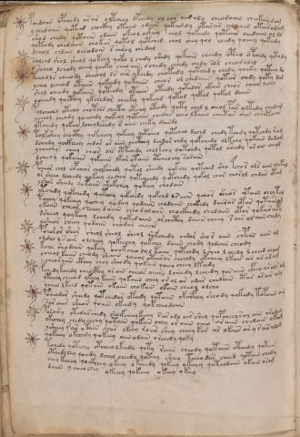

# Voynich Speculative Procedural Protocol — f104v

IMPORTANT: this is NOT a real or validated translation of the Voynich Manuscript. It is a speculative/procedural model that interprets EVA using a user-defined grammar to generate experimental recipes using safe, known edible substitutes.

This file is generated automatically from IVTFF/EVA transliteration plus a user-defined procedural grammar.



## Page / Folio
- currier: B
- folio: f104v
- page_number: 215

## EVA Text (Transliteration)
```text
pchdoiin opcheedy orar oltcheey opchedy ol ear aiir aly cheodaiin cheekain dam
ychedaiin qoteed chockhy otaiin ydaiin qokamdy otarar alched otair oram
shod chedy qotaiin odaiin okeol ockhey chol qokeedy qotair oeedaiin ol d[l:o]
qoteedy chedaiin chokar qotol qotched chol chey qol chedy qoeeey qokeedy
dcheol chdeey oeeodain s airol chedal
solchd shol sheol qokchy qoka l chedy shedy qokain cheedy cpheo apchedy qotady
o scheo lchody cheey qocky cheo ain o chedy cheedy chedy sol cheodalol
tchodls cheeody cheeool ls air ykeedy chotedy qotchedy chedy qoeky qoteeo lo
ycheo lcheod otaiin qokeedy qokaiin cheor ol chedaiin qotar chedy qoty dal
shol cheedy qokaiin qoteedy otaiin oteedy qotedor okain cheos cheeo lchey
ycheedy qocthhy ykchedor cheeky qokchd qotol qokol qokol daiin
polchechy oteoy chotchs cheeta ot[eee:ech]y oteedy qoty ched l cheol par oltedy chedam
ycheol cheody qoeechdy qokeol qotaiin chedar cheo lkaiin cheetar aiin ch[ei:a]taiin
ytohedy qokeeo lcheolshedy s aiin cheky daindl
tolkshey chocthy qokeochy qokchy qotcheo qotcheo dlchd chedy tchdy qotchdy ram
dcheedy qockheey chdor as aiin chcthhy dchdar chdy qokchedy olkchy qokain dadam
ycheechy cheey cheos ais otkchedy cholkchy qotchdy qotol sheedy or ain cheol
dcheeoy qokaiiin qokaiin lkar ytaiin otcheochy sarain
pcheor chol chpcheor cholkshedy qotol sheedy qokchy qotched sho fchor ols aiin chekal
or sheeo lcheedy qokeey qochey qotcheedy qotchedy qokol chor chorol chdar otam
yshor sheedy qokaiin shokchey qokeey chodain
ytchedy qokchedy qotchy qokchedy qokchd ls aiin qchor sheor ytaiin chey tal
tchey qokchey qochey qodeey qodaiin chodaiin chckhdy dairar otar qotai@208; ?l
ykaiin cheor cheeey daiiin cheo dalaiin chockhedy chedaiin otor qokar ary
dsheey qoykeey lchedy qokedaiin ar chcthy daiin cheey sair ol aiin chedy
ysheor sheey qodaiin chodar chochs
pchoror shor sheol sheol sheol qokchedy chdor sho r aiin chpchs aiin al
olsho l[s:?]air olcheey qokeechy qokchy daiin chody qodaiin cheody
kche shodaiin qokeey cheokcheo lol kaiin qotchdy lcheo l chedy l cheed chaim
ycheol kaiin cheody shaiin qoeeol otair or cheeody okcheey lkair ar ar adam
y cheoraiin cthey chol sheody qokair qoeey cheey lkeedy
pchedy kchedy cheocphey or ain cheeos aiiiro lcheedy lcheedy qosaiin cfheo ar als am
yteeey cheeod ykeey kaiin qokaiin cheey or ol ar odar chedain etar ar air ary
ycheo lkeed qotain okaiin chokain okain cheol olcho
psheodar sheedy qotchedar oteedy qotaiin okaifhhy sheody qokedy topaiin am
sar aiir sheos qoiiin okeedy qokcheodaiin
posairy ytedar chedy shoefcheey kechy sar odl air shey qopcheey sol ain arodam
okechey chedy chchy qotain qokain chey or aiin cheo or aiin chedain okam
yshey @206;ar a kain char lkeey roiir shey cheey kar ar lkchs ar y @206; ais alod
qokeeey okchedy qokeey aiin odain orchedy qoky
tchedy qotechy otcheeo l keedy qoty raiin cheedy qotaiin otchdy qotain
oteedchey qoeeda lchal cheedy qoteey sheey teeeo dar cheed qotain chedy
chey keeey qockheey lkeey o keeedy qokeey okchey qot[?:e]odaiin okain orom
daiin y cheeo chey okeeey qokeeey okeey okeey
```

## Domain Context (Heuristic; Not a Translation)

This section summarizes recurring **basewords** in this IVTFF domain and shows simple substring evidence that the token markers used by the procedural grammar occur inside frequent words.

Any Italian anagram / English gloss is a best-effort lexicon match, not a decipherment.


### Associated basewords (non-generic; top by frequency in this domain)
- `daiin` (count=231) → Italian anagram `piani`; English: plans (arrangements)
- `qokaiin` (count=122) → Italian anagram `ciancio`; English: [n/a]
- `okaiin` (count=109) → Italian anagram `coniai`; English: [n/a]
- `qokain` (count=101) → Italian anagram `acconi`; English: [n/a]
- `okain` (count=69) → Italian anagram `acino`; English: a berry
- `otain` (count=53) → Italian anagram `anito`; English: [n/a]
- `qokar` (count=48) → Italian anagram `carco`; English: [n/a]
- `saiin` (count=46) → Italian anagram `asini`; English: [n/a]
- `qokal` (count=43) → Italian anagram `calco`; English: cast (of sculpture)
- `qotaiin` (count=40) → Italian anagram `cationi`; English: [n/a]
- `lkaiin` (count=39) → Italian anagram `ancili`; English: [n/a]
- `kaiin` (count=37) → Italian anagram `acini`; English: [n/a]
- `qokeol` (count=37) → Italian anagram `eccolo`; English: [n/a]
- `qotain` (count=34) → Italian anagram `antico`; English: ancient
- `qotar` (count=29) → Italian anagram `corta`; English: [n/a]

### Marker evidence (substring in frequent basewords)
- `qo`: 60 basewords; examples: `qokeey`, `qokeedy`, `qokaiin`, `qokain`, `qokedy`, `qokey`
- `q`: 61 basewords; examples: `qokeey`, `qokeedy`, `qokaiin`, `qokain`, `qokedy`, `qokey`
- `o`: 262 basewords; examples: `qokeey`, `ol`, `o`, `qokeedy`, `okeey`, `qokaiin`
- `k`: 147 basewords; examples: `qokeey`, `qokeedy`, `okeey`, `qokaiin`, `okaiin`, `qokain`
- `t`: 102 basewords; examples: `otaiin`, `oteey`, `otar`, `otedy`, `otal`, `oteedy`
- `p`: 17 basewords; examples: `opchedy`, `qopchedy`, `opchey`, `pchedy`, `qopchdy`, `opchdy`
- `ch`: 137 basewords; examples: `chedy`, `chey`, `chol`, `cheey`, `cheol`, `cheody`
- `sh`: 50 basewords; examples: `shedy`, `shey`, `sheey`, `sheol`, `shol`, `sheedy`
- `f`: 1 basewords; examples: `f`
- `cth`: 16 basewords; examples: `chcthy`, `cthey`, `shcthy`, `checthy`, `cthol`, `ctheey`
- `ckh`: 15 basewords; examples: `chckhy`, `shckhy`, `checkhy`, `chckhey`, `chockhy`, `sheckhy`
- `cph`: 2 basewords; examples: `cphol`, `cphy`
- `dy`: 84 basewords; examples: `chedy`, `qokeedy`, `shedy`, `otedy`, `oteedy`, `qokedy`
- `iin`: 39 basewords; examples: `aiin`, `daiin`, `qokaiin`, `okaiin`, `otaiin`, `saiin`
- `aiin`: 33 basewords; examples: `aiin`, `daiin`, `qokaiin`, `okaiin`, `otaiin`, `saiin`

## Recipes Index (This Page)
- [f104v.1,@P0](#f104v-1-f104v-1-p0)
- [f104v.2,+P0](#f104v-2-f104v-2-p0)
- [f104v.3,+P0](#f104v-3-f104v-3-p0)
- [f104v.4,+P0](#f104v-4-f104v-4-p0)
- [f104v.5,+P0](#f104v-5-f104v-5-p0)
- [f104v.6,+P0](#f104v-6-f104v-6-p0)
- [f104v.7,+P0](#f104v-7-f104v-7-p0)
- [f104v.8,+P0](#f104v-8-f104v-8-p0)
- [f104v.9,+P0](#f104v-9-f104v-9-p0)
- [f104v.10,+P0](#f104v-10-f104v-10-p0)
- [f104v.11,+P0](#f104v-11-f104v-11-p0)
- [f104v.12,+P0](#f104v-12-f104v-12-p0)
- [f104v.13,+P0](#f104v-13-f104v-13-p0)
- [f104v.14,+P0](#f104v-14-f104v-14-p0)
- [f104v.15,+P0](#f104v-15-f104v-15-p0)
- [f104v.16,+P0](#f104v-16-f104v-16-p0)
- [f104v.17,+P0](#f104v-17-f104v-17-p0)
- [f104v.18,+P0](#f104v-18-f104v-18-p0)
- [f104v.19,+P0](#f104v-19-f104v-19-p0)
- [f104v.20,+P0](#f104v-20-f104v-20-p0)
- [f104v.21,+P0](#f104v-21-f104v-21-p0)
- [f104v.22,+P0](#f104v-22-f104v-22-p0)
- [f104v.23,+P0](#f104v-23-f104v-23-p0)
- [f104v.24,+P0](#f104v-24-f104v-24-p0)
- [f104v.25,+P0](#f104v-25-f104v-25-p0)
- [f104v.26,+P0](#f104v-26-f104v-26-p0)
- [f104v.27,+P0](#f104v-27-f104v-27-p0)
- [f104v.28,+P0](#f104v-28-f104v-28-p0)
- [f104v.29,+P0](#f104v-29-f104v-29-p0)
- [f104v.30,+P0](#f104v-30-f104v-30-p0)
- [f104v.31,+P0](#f104v-31-f104v-31-p0)
- [f104v.32,+P0](#f104v-32-f104v-32-p0)
- [f104v.33,+P0](#f104v-33-f104v-33-p0)
- [f104v.34,+P0](#f104v-34-f104v-34-p0)
- [f104v.35,+P0](#f104v-35-f104v-35-p0)
- [f104v.36,+P0](#f104v-36-f104v-36-p0)
- [f104v.37,+P0](#f104v-37-f104v-37-p0)
- [f104v.38,+P0](#f104v-38-f104v-38-p0)
- [f104v.39,+P0](#f104v-39-f104v-39-p0)
- [f104v.40,+P0](#f104v-40-f104v-40-p0)
- [f104v.41,+P0](#f104v-41-f104v-41-p0)
- [f104v.42,+P0](#f104v-42-f104v-42-p0)
- [f104v.43,+P0](#f104v-43-f104v-43-p0)
- [f104v.44,+P0](#f104v-44-f104v-44-p0)

## Line Glosses (Procedural Gloss Only; Not a Translation)

<a id="f104v-1-f104v-1-p0"></a>

### f104v.1,@P0

EVA: pchdoiin opcheedy orar oltcheey opchedy ol ear aiir aly cheodaiin cheekain dam

Direct Gloss (Procedural, Not a Real Translation):
- pchdoiin: add main plant (safe substitute) → mix / transfer → add starter / activate → duration level 2 → state: cooling/rest → medium phase
- opcheedy: add main plant (safe substitute) → mix / transfer → add starter / activate → duration level 2 → state: active extraction
- orar: mix / transfer → duration level 1 → state: phase transition/start
- oltcheey: apply heat/cooking → add main plant (safe substitute) → mix / transfer → duration level 2 → state: active extraction
- opchedy: add main plant (safe substitute) → mix / transfer → add starter / activate → duration level 1 → state: active extraction
- ol: mix / transfer
- ear: duration level 1 → state: active extraction
- aiir: duration level 1 → state: phase transition/start
- aly: duration level 1 → state: phase transition/start
- cheodaiin: add main plant (safe substitute) → mix / transfer → add starter / activate → duration level 1 → state: active extraction → long phase
- cheekain: add fermentable sugars → add main plant (safe substitute) → duration level 2 → state: active extraction
- dam: add starter / activate → duration level 1 → state: phase transition/start

<a id="f104v-2-f104v-2-p0"></a>

### f104v.2,+P0

EVA: ychedaiin qoteed chockhy otaiin ydaiin qokamdy otarar alched otair oram

Direct Gloss (Procedural, Not a Real Translation):
- ychedaiin: add main plant (safe substitute) → add starter / activate → duration level 1 → state: active extraction → long phase
- qoteed: prepare liquid base → apply heat/cooking → add starter / activate → duration level 2 → state: active extraction
- chockhy: add main plant (safe substitute) → mix / transfer → add complex herbal compound (safe blend)
- otaiin: apply heat/cooking → mix / transfer → duration level 1 → state: phase transition/start → long phase
- ydaiin: add starter / activate → duration level 1 → state: phase transition/start → long phase
- qokamdy: prepare liquid base → add fermentable sugars → add starter / activate → duration level 1 → state: phase transition/start
- otarar: apply heat/cooking → mix / transfer → duration level 1 → state: phase transition/start
- alched: add main plant (safe substitute) → add starter / activate → duration level 1 → state: phase transition/start
- otair: apply heat/cooking → mix / transfer → duration level 1 → state: phase transition/start
- oram: mix / transfer → duration level 1 → state: phase transition/start

<a id="f104v-3-f104v-3-p0"></a>

### f104v.3,+P0

EVA: shod chedy qotaiin odaiin okeol ockhey chol qokeedy qotair oeedaiin ol d[l:o]

Direct Gloss (Procedural, Not a Real Translation):
- shod: add secondary herb (safe substitute) → mix / transfer → add starter / activate
- chedy: add main plant (safe substitute) → add starter / activate → duration level 1 → state: active extraction
- qotaiin: prepare liquid base → apply heat/cooking → duration level 1 → state: phase transition/start → long phase
- odaiin: mix / transfer → add starter / activate → duration level 1 → state: phase transition/start → long phase
- okeol: add fermentable sugars → mix / transfer → duration level 1 → state: active extraction
- ockhey: mix / transfer → add complex herbal compound (safe blend) → duration level 1 → state: active extraction
- chol: add main plant (safe substitute) → mix / transfer
- qokeedy: prepare liquid base → add fermentable sugars → add starter / activate → duration level 2 → state: active extraction
- qotair: prepare liquid base → apply heat/cooking → duration level 1 → state: phase transition/start
- oeedaiin: mix / transfer → add starter / activate → duration level 2 → state: active extraction → long phase
- ol: mix / transfer
- d: add starter / activate
- l: [unparsed]
- o: mix / transfer

<a id="f104v-4-f104v-4-p0"></a>

### f104v.4,+P0

EVA: qoteedy chedaiin chokar qotol qotched chol chey qol chedy qoeeey qokeedy

Direct Gloss (Procedural, Not a Real Translation):
- qoteedy: prepare liquid base → apply heat/cooking → add starter / activate → duration level 2 → state: active extraction
- chedaiin: add main plant (safe substitute) → add starter / activate → duration level 1 → state: active extraction → long phase
- chokar: add fermentable sugars → add main plant (safe substitute) → mix / transfer → duration level 1 → state: phase transition/start
- qotol: prepare liquid base → apply heat/cooking → mix / transfer
- qotched: prepare liquid base → apply heat/cooking → add main plant (safe substitute) → add starter / activate → duration level 1 → state: active extraction
- chol: add main plant (safe substitute) → mix / transfer
- chey: add main plant (safe substitute) → duration level 1 → state: active extraction
- qol: prepare liquid base
- chedy: add main plant (safe substitute) → add starter / activate → duration level 1 → state: active extraction
- qoeeey: prepare liquid base → duration level 3 → state: active extraction
- qokeedy: prepare liquid base → add fermentable sugars → add starter / activate → duration level 2 → state: active extraction

<a id="f104v-5-f104v-5-p0"></a>

### f104v.5,+P0

EVA: dcheol chdeey oeeodain s airol chedal

Direct Gloss (Procedural, Not a Real Translation):
- dcheol: add main plant (safe substitute) → mix / transfer → add starter / activate → duration level 1 → state: active extraction
- chdeey: add main plant (safe substitute) → add starter / activate → duration level 2 → state: active extraction
- oeeodain: mix / transfer → add starter / activate → duration level 2 → state: active extraction
- s: [unparsed]
- airol: mix / transfer → duration level 1 → state: phase transition/start
- chedal: add main plant (safe substitute) → add starter / activate → duration level 1 → state: active extraction

<a id="f104v-6-f104v-6-p0"></a>

### f104v.6,+P0

EVA: solchd shol sheol qokchy qoka l chedy shedy qokain cheedy cpheo apchedy qotady

Direct Gloss (Procedural, Not a Real Translation):
- solchd: add main plant (safe substitute) → mix / transfer → add starter / activate
- shol: add secondary herb (safe substitute) → mix / transfer
- sheol: add secondary herb (safe substitute) → mix / transfer → duration level 1 → state: active extraction
- qokchy: prepare liquid base → add fermentable sugars → add main plant (safe substitute)
- qoka: prepare liquid base → add fermentable sugars → duration level 1 → state: phase transition/start
- l: [unparsed]
- chedy: add main plant (safe substitute) → add starter / activate → duration level 1 → state: active extraction
- shedy: add secondary herb (safe substitute) → add starter / activate → duration level 1 → state: active extraction
- qokain: prepare liquid base → add fermentable sugars → duration level 1 → state: phase transition/start
- cheedy: add main plant (safe substitute) → add starter / activate → duration level 2 → state: active extraction
- cpheo: mix / transfer → add complex herbal compound (safe blend) → duration level 1 → state: active extraction
- apchedy: add main plant (safe substitute) → add starter / activate → duration level 1 → state: phase transition/start
- qotady: prepare liquid base → apply heat/cooking → add starter / activate → duration level 1 → state: phase transition/start

<a id="f104v-7-f104v-7-p0"></a>

### f104v.7,+P0

EVA: o scheo lchody cheey qocky cheo ain o chedy cheedy chedy sol cheodalol

Direct Gloss (Procedural, Not a Real Translation):
- o: mix / transfer
- scheo: add main plant (safe substitute) → mix / transfer → duration level 1 → state: active extraction
- lchody: add main plant (safe substitute) → mix / transfer → add starter / activate
- cheey: add main plant (safe substitute) → duration level 2 → state: active extraction
- qocky: prepare liquid base → add fermentable sugars
- cheo: add main plant (safe substitute) → mix / transfer → duration level 1 → state: active extraction
- ain: duration level 1 → state: phase transition/start
- o: mix / transfer
- chedy: add main plant (safe substitute) → add starter / activate → duration level 1 → state: active extraction
- cheedy: add main plant (safe substitute) → add starter / activate → duration level 2 → state: active extraction
- chedy: add main plant (safe substitute) → add starter / activate → duration level 1 → state: active extraction
- sol: mix / transfer
- cheodalol: add main plant (safe substitute) → mix / transfer → add starter / activate → duration level 1 → state: active extraction

<a id="f104v-8-f104v-8-p0"></a>

### f104v.8,+P0

EVA: tchodls cheeody cheeool ls air ykeedy chotedy qotchedy chedy qoeky qoteeo lo

Direct Gloss (Procedural, Not a Real Translation):
- tchodls: apply heat/cooking → add main plant (safe substitute) → mix / transfer → add starter / activate
- cheeody: add main plant (safe substitute) → mix / transfer → add starter / activate → duration level 2 → state: active extraction
- cheeool: add main plant (safe substitute) → mix / transfer → duration level 2 → state: active extraction
- ls: [unparsed]
- air: duration level 1 → state: phase transition/start
- ykeedy: add fermentable sugars → add starter / activate → duration level 2 → state: active extraction
- chotedy: apply heat/cooking → add main plant (safe substitute) → mix / transfer → add starter / activate → duration level 1 → state: active extraction
- qotchedy: prepare liquid base → apply heat/cooking → add main plant (safe substitute) → add starter / activate → duration level 1 → state: active extraction
- chedy: add main plant (safe substitute) → add starter / activate → duration level 1 → state: active extraction
- qoeky: prepare liquid base → add fermentable sugars → duration level 1 → state: active extraction
- qoteeo: prepare liquid base → apply heat/cooking → mix / transfer → duration level 2 → state: active extraction
- lo: mix / transfer

<a id="f104v-9-f104v-9-p0"></a>

### f104v.9,+P0

EVA: ycheo lcheod otaiin qokeedy qokaiin cheor ol chedaiin qotar chedy qoty dal

Direct Gloss (Procedural, Not a Real Translation):
- ycheo: add main plant (safe substitute) → mix / transfer → duration level 1 → state: active extraction
- lcheod: add main plant (safe substitute) → mix / transfer → add starter / activate → duration level 1 → state: active extraction
- otaiin: apply heat/cooking → mix / transfer → duration level 1 → state: phase transition/start → long phase
- qokeedy: prepare liquid base → add fermentable sugars → add starter / activate → duration level 2 → state: active extraction
- qokaiin: prepare liquid base → add fermentable sugars → duration level 1 → state: phase transition/start → long phase
- cheor: add main plant (safe substitute) → mix / transfer → duration level 1 → state: active extraction
- ol: mix / transfer
- chedaiin: add main plant (safe substitute) → add starter / activate → duration level 1 → state: active extraction → long phase
- qotar: prepare liquid base → apply heat/cooking → duration level 1 → state: phase transition/start
- chedy: add main plant (safe substitute) → add starter / activate → duration level 1 → state: active extraction
- qoty: prepare liquid base → apply heat/cooking
- dal: add starter / activate → duration level 1 → state: phase transition/start

<a id="f104v-10-f104v-10-p0"></a>

### f104v.10,+P0

EVA: shol cheedy qokaiin qoteedy otaiin oteedy qotedor okain cheos cheeo lchey

Direct Gloss (Procedural, Not a Real Translation):
- shol: add secondary herb (safe substitute) → mix / transfer
- cheedy: add main plant (safe substitute) → add starter / activate → duration level 2 → state: active extraction
- qokaiin: prepare liquid base → add fermentable sugars → duration level 1 → state: phase transition/start → long phase
- qoteedy: prepare liquid base → apply heat/cooking → add starter / activate → duration level 2 → state: active extraction
- otaiin: apply heat/cooking → mix / transfer → duration level 1 → state: phase transition/start → long phase
- oteedy: apply heat/cooking → mix / transfer → add starter / activate → duration level 2 → state: active extraction
- qotedor: prepare liquid base → apply heat/cooking → mix / transfer → add starter / activate → duration level 1 → state: active extraction
- okain: add fermentable sugars → mix / transfer → duration level 1 → state: phase transition/start
- cheos: add main plant (safe substitute) → mix / transfer → duration level 1 → state: active extraction
- cheeo: add main plant (safe substitute) → mix / transfer → duration level 2 → state: active extraction
- lchey: add main plant (safe substitute) → duration level 1 → state: active extraction

<a id="f104v-11-f104v-11-p0"></a>

### f104v.11,+P0

EVA: ycheedy qocthhy ykchedor cheeky qokchd qotol qokol qokol daiin

Direct Gloss (Procedural, Not a Real Translation):
- ycheedy: add main plant (safe substitute) → add starter / activate → duration level 2 → state: active extraction
- qocthhy: prepare liquid base → add complex herbal compound (safe blend) → unmodeled token(s) present: h
- ykchedor: add fermentable sugars → add main plant (safe substitute) → mix / transfer → add starter / activate → duration level 1 → state: active extraction
- cheeky: add fermentable sugars → add main plant (safe substitute) → duration level 2 → state: active extraction
- qokchd: prepare liquid base → add fermentable sugars → add main plant (safe substitute) → add starter / activate
- qotol: prepare liquid base → apply heat/cooking → mix / transfer
- qokol: prepare liquid base → add fermentable sugars → mix / transfer
- qokol: prepare liquid base → add fermentable sugars → mix / transfer
- daiin: add starter / activate → duration level 1 → state: phase transition/start → long phase

<a id="f104v-12-f104v-12-p0"></a>

### f104v.12,+P0

EVA: polchechy oteoy chotchs cheeta ot[eee:ech]y oteedy qoty ched l cheol par oltedy chedam

Direct Gloss (Procedural, Not a Real Translation):
- polchechy: add main plant (safe substitute) → mix / transfer → add starter / activate → duration level 1 → state: active extraction
- oteoy: apply heat/cooking → mix / transfer → duration level 1 → state: active extraction
- chotchs: apply heat/cooking → add main plant (safe substitute) → mix / transfer
- cheeta: apply heat/cooking → add main plant (safe substitute) → duration level 2 → state: active extraction
- ot: apply heat/cooking → mix / transfer
- eee: duration level 3 → state: active extraction
- ech: add main plant (safe substitute) → duration level 1 → state: active extraction
- y: [unparsed]
- oteedy: apply heat/cooking → mix / transfer → add starter / activate → duration level 2 → state: active extraction
- qoty: prepare liquid base → apply heat/cooking
- ched: add main plant (safe substitute) → add starter / activate → duration level 1 → state: active extraction
- l: [unparsed]
- cheol: add main plant (safe substitute) → mix / transfer → duration level 1 → state: active extraction
- par: add starter / activate → duration level 1 → state: phase transition/start
- oltedy: apply heat/cooking → mix / transfer → add starter / activate → duration level 1 → state: active extraction
- chedam: add main plant (safe substitute) → add starter / activate → duration level 1 → state: active extraction

<a id="f104v-13-f104v-13-p0"></a>

### f104v.13,+P0

EVA: ycheol cheody qoeechdy qokeol qotaiin chedar cheo lkaiin cheetar aiin ch[ei:a]taiin

Direct Gloss (Procedural, Not a Real Translation):
- ycheol: add main plant (safe substitute) → mix / transfer → duration level 1 → state: active extraction
- cheody: add main plant (safe substitute) → mix / transfer → add starter / activate → duration level 1 → state: active extraction
- qoeechdy: prepare liquid base → add main plant (safe substitute) → add starter / activate → duration level 2 → state: active extraction
- qokeol: prepare liquid base → add fermentable sugars → mix / transfer → duration level 1 → state: active extraction
- qotaiin: prepare liquid base → apply heat/cooking → duration level 1 → state: phase transition/start → long phase
- chedar: add main plant (safe substitute) → add starter / activate → duration level 1 → state: active extraction
- cheo: add main plant (safe substitute) → mix / transfer → duration level 1 → state: active extraction
- lkaiin: add fermentable sugars → duration level 1 → state: phase transition/start → long phase
- cheetar: apply heat/cooking → add main plant (safe substitute) → duration level 2 → state: active extraction
- aiin: duration level 1 → state: phase transition/start → long phase
- ch: add main plant (safe substitute)
- ei: duration level 1 → state: active extraction
- a: duration level 1 → state: phase transition/start
- taiin: apply heat/cooking → duration level 1 → state: phase transition/start → long phase

<a id="f104v-14-f104v-14-p0"></a>

### f104v.14,+P0

EVA: ytohedy qokeeo lcheolshedy s aiin cheky daindl

Direct Gloss (Procedural, Not a Real Translation):
- ytohedy: apply heat/cooking → mix / transfer → add starter / activate → duration level 1 → state: active extraction → unmodeled token(s) present: h
- qokeeo: prepare liquid base → add fermentable sugars → mix / transfer → duration level 2 → state: active extraction
- lcheolshedy: add main plant (safe substitute) → add secondary herb (safe substitute) → mix / transfer → add starter / activate → duration level 1 → state: active extraction
- s: [unparsed]
- aiin: duration level 1 → state: phase transition/start → long phase
- cheky: add fermentable sugars → add main plant (safe substitute) → duration level 1 → state: active extraction
- daindl: add starter / activate → duration level 1 → state: phase transition/start

<a id="f104v-15-f104v-15-p0"></a>

### f104v.15,+P0

EVA: tolkshey chocthy qokeochy qokchy qotcheo qotcheo dlchd chedy tchdy qotchdy ram

Direct Gloss (Procedural, Not a Real Translation):
- tolkshey: add fermentable sugars → apply heat/cooking → add secondary herb (safe substitute) → mix / transfer → duration level 1 → state: active extraction
- chocthy: add main plant (safe substitute) → mix / transfer → add complex herbal compound (safe blend)
- qokeochy: prepare liquid base → add fermentable sugars → add main plant (safe substitute) → mix / transfer → duration level 1 → state: active extraction
- qokchy: prepare liquid base → add fermentable sugars → add main plant (safe substitute)
- qotcheo: prepare liquid base → apply heat/cooking → add main plant (safe substitute) → mix / transfer → duration level 1 → state: active extraction
- qotcheo: prepare liquid base → apply heat/cooking → add main plant (safe substitute) → mix / transfer → duration level 1 → state: active extraction
- dlchd: add main plant (safe substitute) → add starter / activate
- chedy: add main plant (safe substitute) → add starter / activate → duration level 1 → state: active extraction
- tchdy: apply heat/cooking → add main plant (safe substitute) → add starter / activate
- qotchdy: prepare liquid base → apply heat/cooking → add main plant (safe substitute) → add starter / activate
- ram: duration level 1 → state: phase transition/start

<a id="f104v-16-f104v-16-p0"></a>

### f104v.16,+P0

EVA: dcheedy qockheey chdor as aiin chcthhy dchdar chdy qokchedy olkchy qokain dadam

Direct Gloss (Procedural, Not a Real Translation):
- dcheedy: add main plant (safe substitute) → add starter / activate → duration level 2 → state: active extraction
- qockheey: prepare liquid base → add complex herbal compound (safe blend) → duration level 2 → state: active extraction
- chdor: add main plant (safe substitute) → mix / transfer → add starter / activate
- as: duration level 1 → state: phase transition/start
- aiin: duration level 1 → state: phase transition/start → long phase
- chcthhy: add main plant (safe substitute) → add complex herbal compound (safe blend) → unmodeled token(s) present: h
- dchdar: add main plant (safe substitute) → add starter / activate → duration level 1 → state: phase transition/start
- chdy: add main plant (safe substitute) → add starter / activate
- qokchedy: prepare liquid base → add fermentable sugars → add main plant (safe substitute) → add starter / activate → duration level 1 → state: active extraction
- olkchy: add fermentable sugars → add main plant (safe substitute) → mix / transfer
- qokain: prepare liquid base → add fermentable sugars → duration level 1 → state: phase transition/start
- dadam: add starter / activate → duration level 1 → state: phase transition/start

<a id="f104v-17-f104v-17-p0"></a>

### f104v.17,+P0

EVA: ycheechy cheey cheos ais otkchedy cholkchy qotchdy qotol sheedy or ain cheol

Direct Gloss (Procedural, Not a Real Translation):
- ycheechy: add main plant (safe substitute) → duration level 2 → state: active extraction
- cheey: add main plant (safe substitute) → duration level 2 → state: active extraction
- cheos: add main plant (safe substitute) → mix / transfer → duration level 1 → state: active extraction
- ais: duration level 1 → state: phase transition/start
- otkchedy: add fermentable sugars → apply heat/cooking → add main plant (safe substitute) → mix / transfer → add starter / activate → duration level 1 → state: active extraction
- cholkchy: add fermentable sugars → add main plant (safe substitute) → mix / transfer
- qotchdy: prepare liquid base → apply heat/cooking → add main plant (safe substitute) → add starter / activate
- qotol: prepare liquid base → apply heat/cooking → mix / transfer
- sheedy: add secondary herb (safe substitute) → add starter / activate → duration level 2 → state: active extraction
- or: mix / transfer
- ain: duration level 1 → state: phase transition/start
- cheol: add main plant (safe substitute) → mix / transfer → duration level 1 → state: active extraction

<a id="f104v-18-f104v-18-p0"></a>

### f104v.18,+P0

EVA: dcheeoy qokaiiin qokaiin lkar ytaiin otcheochy sarain

Direct Gloss (Procedural, Not a Real Translation):
- dcheeoy: add main plant (safe substitute) → mix / transfer → add starter / activate → duration level 2 → state: active extraction
- qokaiiin: prepare liquid base → add fermentable sugars → duration level 1 → state: phase transition/start → medium phase
- qokaiin: prepare liquid base → add fermentable sugars → duration level 1 → state: phase transition/start → long phase
- lkar: add fermentable sugars → duration level 1 → state: phase transition/start
- ytaiin: apply heat/cooking → duration level 1 → state: phase transition/start → long phase
- otcheochy: apply heat/cooking → add main plant (safe substitute) → mix / transfer → duration level 1 → state: active extraction
- sarain: duration level 1 → state: phase transition/start

<a id="f104v-19-f104v-19-p0"></a>

### f104v.19,+P0

EVA: pcheor chol chpcheor cholkshedy qotol sheedy qokchy qotched sho fchor ols aiin chekal

Direct Gloss (Procedural, Not a Real Translation):
- pcheor: add main plant (safe substitute) → mix / transfer → add starter / activate → duration level 1 → state: active extraction
- chol: add main plant (safe substitute) → mix / transfer
- chpcheor: add main plant (safe substitute) → mix / transfer → add starter / activate → duration level 1 → state: active extraction
- cholkshedy: add fermentable sugars → add main plant (safe substitute) → add secondary herb (safe substitute) → mix / transfer → add starter / activate → duration level 1 → state: active extraction
- qotol: prepare liquid base → apply heat/cooking → mix / transfer
- sheedy: add secondary herb (safe substitute) → add starter / activate → duration level 2 → state: active extraction
- qokchy: prepare liquid base → add fermentable sugars → add main plant (safe substitute)
- qotched: prepare liquid base → apply heat/cooking → add main plant (safe substitute) → add starter / activate → duration level 1 → state: active extraction
- sho: add secondary herb (safe substitute) → mix / transfer
- fchor: add main plant (safe substitute) → add aroma modifier → mix / transfer
- ols: mix / transfer
- aiin: duration level 1 → state: phase transition/start → long phase
- chekal: add fermentable sugars → add main plant (safe substitute) → duration level 1 → state: active extraction

<a id="f104v-20-f104v-20-p0"></a>

### f104v.20,+P0

EVA: or sheeo lcheedy qokeey qochey qotcheedy qotchedy qokol chor chorol chdar otam

Direct Gloss (Procedural, Not a Real Translation):
- or: mix / transfer
- sheeo: add secondary herb (safe substitute) → mix / transfer → duration level 2 → state: active extraction
- lcheedy: add main plant (safe substitute) → add starter / activate → duration level 2 → state: active extraction
- qokeey: prepare liquid base → add fermentable sugars → duration level 2 → state: active extraction
- qochey: prepare liquid base → add main plant (safe substitute) → duration level 1 → state: active extraction
- qotcheedy: prepare liquid base → apply heat/cooking → add main plant (safe substitute) → add starter / activate → duration level 2 → state: active extraction
- qotchedy: prepare liquid base → apply heat/cooking → add main plant (safe substitute) → add starter / activate → duration level 1 → state: active extraction
- qokol: prepare liquid base → add fermentable sugars → mix / transfer
- chor: add main plant (safe substitute) → mix / transfer
- chorol: add main plant (safe substitute) → mix / transfer
- chdar: add main plant (safe substitute) → add starter / activate → duration level 1 → state: phase transition/start
- otam: apply heat/cooking → mix / transfer → duration level 1 → state: phase transition/start

<a id="f104v-21-f104v-21-p0"></a>

### f104v.21,+P0

EVA: yshor sheedy qokaiin shokchey qokeey chodain

Direct Gloss (Procedural, Not a Real Translation):
- yshor: add secondary herb (safe substitute) → mix / transfer
- sheedy: add secondary herb (safe substitute) → add starter / activate → duration level 2 → state: active extraction
- qokaiin: prepare liquid base → add fermentable sugars → duration level 1 → state: phase transition/start → long phase
- shokchey: add fermentable sugars → add main plant (safe substitute) → add secondary herb (safe substitute) → mix / transfer → duration level 1 → state: active extraction
- qokeey: prepare liquid base → add fermentable sugars → duration level 2 → state: active extraction
- chodain: add main plant (safe substitute) → mix / transfer → add starter / activate → duration level 1 → state: phase transition/start

<a id="f104v-22-f104v-22-p0"></a>

### f104v.22,+P0

EVA: ytchedy qokchedy qotchy qokchedy qokchd ls aiin qchor sheor ytaiin chey tal

Direct Gloss (Procedural, Not a Real Translation):
- ytchedy: apply heat/cooking → add main plant (safe substitute) → add starter / activate → duration level 1 → state: active extraction
- qokchedy: prepare liquid base → add fermentable sugars → add main plant (safe substitute) → add starter / activate → duration level 1 → state: active extraction
- qotchy: prepare liquid base → apply heat/cooking → add main plant (safe substitute)
- qokchedy: prepare liquid base → add fermentable sugars → add main plant (safe substitute) → add starter / activate → duration level 1 → state: active extraction
- qokchd: prepare liquid base → add fermentable sugars → add main plant (safe substitute) → add starter / activate
- ls: [unparsed]
- aiin: duration level 1 → state: phase transition/start → long phase
- qchor: prepare base (generic) → add main plant (safe substitute) → mix / transfer
- sheor: add secondary herb (safe substitute) → mix / transfer → duration level 1 → state: active extraction
- ytaiin: apply heat/cooking → duration level 1 → state: phase transition/start → long phase
- chey: add main plant (safe substitute) → duration level 1 → state: active extraction
- tal: apply heat/cooking → duration level 1 → state: phase transition/start

<a id="f104v-23-f104v-23-p0"></a>

### f104v.23,+P0

EVA: tchey qokchey qochey qodeey qodaiin chodaiin chckhdy dairar otar qotai@208; ?l

Direct Gloss (Procedural, Not a Real Translation):
- tchey: apply heat/cooking → add main plant (safe substitute) → duration level 1 → state: active extraction
- qokchey: prepare liquid base → add fermentable sugars → add main plant (safe substitute) → duration level 1 → state: active extraction
- qochey: prepare liquid base → add main plant (safe substitute) → duration level 1 → state: active extraction
- qodeey: prepare liquid base → add starter / activate → duration level 2 → state: active extraction
- qodaiin: prepare liquid base → add starter / activate → duration level 1 → state: phase transition/start → long phase
- chodaiin: add main plant (safe substitute) → mix / transfer → add starter / activate → duration level 1 → state: phase transition/start → long phase
- chckhdy: add main plant (safe substitute) → add starter / activate → add complex herbal compound (safe blend)
- dairar: add starter / activate → duration level 1 → state: phase transition/start
- otar: apply heat/cooking → mix / transfer → duration level 1 → state: phase transition/start
- qotai: prepare liquid base → apply heat/cooking → duration level 1 → state: phase transition/start
- l: [unparsed]

<a id="f104v-24-f104v-24-p0"></a>

### f104v.24,+P0

EVA: ykaiin cheor cheeey daiiin cheo dalaiin chockhedy chedaiin otor qokar ary

Direct Gloss (Procedural, Not a Real Translation):
- ykaiin: add fermentable sugars → duration level 1 → state: phase transition/start → long phase
- cheor: add main plant (safe substitute) → mix / transfer → duration level 1 → state: active extraction
- cheeey: add main plant (safe substitute) → duration level 3 → state: active extraction
- daiiin: add starter / activate → duration level 1 → state: phase transition/start → medium phase
- cheo: add main plant (safe substitute) → mix / transfer → duration level 1 → state: active extraction
- dalaiin: add starter / activate → duration level 1 → state: phase transition/start → long phase
- chockhedy: add main plant (safe substitute) → mix / transfer → add starter / activate → add complex herbal compound (safe blend) → duration level 1 → state: active extraction
- chedaiin: add main plant (safe substitute) → add starter / activate → duration level 1 → state: active extraction → long phase
- otor: apply heat/cooking → mix / transfer
- qokar: prepare liquid base → add fermentable sugars → duration level 1 → state: phase transition/start
- ary: duration level 1 → state: phase transition/start

<a id="f104v-25-f104v-25-p0"></a>

### f104v.25,+P0

EVA: dsheey qoykeey lchedy qokedaiin ar chcthy daiin cheey sair ol aiin chedy

Direct Gloss (Procedural, Not a Real Translation):
- dsheey: add secondary herb (safe substitute) → add starter / activate → duration level 2 → state: active extraction
- qoykeey: prepare liquid base → add fermentable sugars → duration level 2 → state: active extraction
- lchedy: add main plant (safe substitute) → add starter / activate → duration level 1 → state: active extraction
- qokedaiin: prepare liquid base → add fermentable sugars → add starter / activate → duration level 1 → state: active extraction → long phase
- ar: duration level 1 → state: phase transition/start
- chcthy: add main plant (safe substitute) → add complex herbal compound (safe blend)
- daiin: add starter / activate → duration level 1 → state: phase transition/start → long phase
- cheey: add main plant (safe substitute) → duration level 2 → state: active extraction
- sair: duration level 1 → state: phase transition/start
- ol: mix / transfer
- aiin: duration level 1 → state: phase transition/start → long phase
- chedy: add main plant (safe substitute) → add starter / activate → duration level 1 → state: active extraction

<a id="f104v-26-f104v-26-p0"></a>

### f104v.26,+P0

EVA: ysheor sheey qodaiin chodar chochs

Direct Gloss (Procedural, Not a Real Translation):
- ysheor: add secondary herb (safe substitute) → mix / transfer → duration level 1 → state: active extraction
- sheey: add secondary herb (safe substitute) → duration level 2 → state: active extraction
- qodaiin: prepare liquid base → add starter / activate → duration level 1 → state: phase transition/start → long phase
- chodar: add main plant (safe substitute) → mix / transfer → add starter / activate → duration level 1 → state: phase transition/start
- chochs: add main plant (safe substitute) → mix / transfer

<a id="f104v-27-f104v-27-p0"></a>

### f104v.27,+P0

EVA: pchoror shor sheol sheol sheol qokchedy chdor sho r aiin chpchs aiin al

Direct Gloss (Procedural, Not a Real Translation):
- pchoror: add main plant (safe substitute) → mix / transfer → add starter / activate
- shor: add secondary herb (safe substitute) → mix / transfer
- sheol: add secondary herb (safe substitute) → mix / transfer → duration level 1 → state: active extraction
- sheol: add secondary herb (safe substitute) → mix / transfer → duration level 1 → state: active extraction
- sheol: add secondary herb (safe substitute) → mix / transfer → duration level 1 → state: active extraction
- qokchedy: prepare liquid base → add fermentable sugars → add main plant (safe substitute) → add starter / activate → duration level 1 → state: active extraction
- chdor: add main plant (safe substitute) → mix / transfer → add starter / activate
- sho: add secondary herb (safe substitute) → mix / transfer
- r: [unparsed]
- aiin: duration level 1 → state: phase transition/start → long phase
- chpchs: add main plant (safe substitute) → add starter / activate
- aiin: duration level 1 → state: phase transition/start → long phase
- al: duration level 1 → state: phase transition/start

<a id="f104v-28-f104v-28-p0"></a>

### f104v.28,+P0

EVA: olsho l[s:?]air olcheey qokeechy qokchy daiin chody qodaiin cheody

Direct Gloss (Procedural, Not a Real Translation):
- olsho: add secondary herb (safe substitute) → mix / transfer
- l: [unparsed]
- s: [unparsed]
- air: duration level 1 → state: phase transition/start
- olcheey: add main plant (safe substitute) → mix / transfer → duration level 2 → state: active extraction
- qokeechy: prepare liquid base → add fermentable sugars → add main plant (safe substitute) → duration level 2 → state: active extraction
- qokchy: prepare liquid base → add fermentable sugars → add main plant (safe substitute)
- daiin: add starter / activate → duration level 1 → state: phase transition/start → long phase
- chody: add main plant (safe substitute) → mix / transfer → add starter / activate
- qodaiin: prepare liquid base → add starter / activate → duration level 1 → state: phase transition/start → long phase
- cheody: add main plant (safe substitute) → mix / transfer → add starter / activate → duration level 1 → state: active extraction

<a id="f104v-29-f104v-29-p0"></a>

### f104v.29,+P0

EVA: kche shodaiin qokeey cheokcheo lol kaiin qotchdy lcheo l chedy l cheed chaim

Direct Gloss (Procedural, Not a Real Translation):
- kche: add fermentable sugars → add main plant (safe substitute) → duration level 1 → state: active extraction
- shodaiin: add secondary herb (safe substitute) → mix / transfer → add starter / activate → duration level 1 → state: phase transition/start → long phase
- qokeey: prepare liquid base → add fermentable sugars → duration level 2 → state: active extraction
- cheokcheo: add fermentable sugars → add main plant (safe substitute) → mix / transfer → duration level 1 → state: active extraction
- lol: mix / transfer
- kaiin: add fermentable sugars → duration level 1 → state: phase transition/start → long phase
- qotchdy: prepare liquid base → apply heat/cooking → add main plant (safe substitute) → add starter / activate
- lcheo: add main plant (safe substitute) → mix / transfer → duration level 1 → state: active extraction
- l: [unparsed]
- chedy: add main plant (safe substitute) → add starter / activate → duration level 1 → state: active extraction
- l: [unparsed]
- cheed: add main plant (safe substitute) → add starter / activate → duration level 2 → state: active extraction
- chaim: add main plant (safe substitute) → duration level 1 → state: phase transition/start

<a id="f104v-30-f104v-30-p0"></a>

### f104v.30,+P0

EVA: ycheol kaiin cheody shaiin qoeeol otair or cheeody okcheey lkair ar ar adam

Direct Gloss (Procedural, Not a Real Translation):
- ycheol: add main plant (safe substitute) → mix / transfer → duration level 1 → state: active extraction
- kaiin: add fermentable sugars → duration level 1 → state: phase transition/start → long phase
- cheody: add main plant (safe substitute) → mix / transfer → add starter / activate → duration level 1 → state: active extraction
- shaiin: add secondary herb (safe substitute) → duration level 1 → state: phase transition/start → long phase
- qoeeol: prepare liquid base → mix / transfer → duration level 2 → state: active extraction
- otair: apply heat/cooking → mix / transfer → duration level 1 → state: phase transition/start
- or: mix / transfer
- cheeody: add main plant (safe substitute) → mix / transfer → add starter / activate → duration level 2 → state: active extraction
- okcheey: add fermentable sugars → add main plant (safe substitute) → mix / transfer → duration level 2 → state: active extraction
- lkair: add fermentable sugars → duration level 1 → state: phase transition/start
- ar: duration level 1 → state: phase transition/start
- ar: duration level 1 → state: phase transition/start
- adam: add starter / activate → duration level 1 → state: phase transition/start

<a id="f104v-31-f104v-31-p0"></a>

### f104v.31,+P0

EVA: y cheoraiin cthey chol sheody qokair qoeey cheey lkeedy

Direct Gloss (Procedural, Not a Real Translation):
- y: [unparsed]
- cheoraiin: add main plant (safe substitute) → mix / transfer → duration level 1 → state: active extraction → long phase
- cthey: add complex herbal compound (safe blend) → duration level 1 → state: active extraction
- chol: add main plant (safe substitute) → mix / transfer
- sheody: add secondary herb (safe substitute) → mix / transfer → add starter / activate → duration level 1 → state: active extraction
- qokair: prepare liquid base → add fermentable sugars → duration level 1 → state: phase transition/start
- qoeey: prepare liquid base → duration level 2 → state: active extraction
- cheey: add main plant (safe substitute) → duration level 2 → state: active extraction
- lkeedy: add fermentable sugars → add starter / activate → duration level 2 → state: active extraction

<a id="f104v-32-f104v-32-p0"></a>

### f104v.32,+P0

EVA: pchedy kchedy cheocphey or ain cheeos aiiiro lcheedy lcheedy qosaiin cfheo ar als am

Direct Gloss (Procedural, Not a Real Translation):
- pchedy: add main plant (safe substitute) → add starter / activate → duration level 1 → state: active extraction
- kchedy: add fermentable sugars → add main plant (safe substitute) → add starter / activate → duration level 1 → state: active extraction
- cheocphey: add main plant (safe substitute) → mix / transfer → add complex herbal compound (safe blend) → duration level 1 → state: active extraction
- or: mix / transfer
- ain: duration level 1 → state: phase transition/start
- cheeos: add main plant (safe substitute) → mix / transfer → duration level 2 → state: active extraction
- aiiiro: mix / transfer → duration level 1 → state: phase transition/start
- lcheedy: add main plant (safe substitute) → add starter / activate → duration level 2 → state: active extraction
- lcheedy: add main plant (safe substitute) → add starter / activate → duration level 2 → state: active extraction
- qosaiin: prepare liquid base → duration level 1 → state: phase transition/start → long phase
- cfheo: mix / transfer → add complex herbal compound (safe blend) → duration level 1 → state: active extraction
- ar: duration level 1 → state: phase transition/start
- als: duration level 1 → state: phase transition/start
- am: duration level 1 → state: phase transition/start

<a id="f104v-33-f104v-33-p0"></a>

### f104v.33,+P0

EVA: yteeey cheeod ykeey kaiin qokaiin cheey or ol ar odar chedain etar ar air ary

Direct Gloss (Procedural, Not a Real Translation):
- yteeey: apply heat/cooking → duration level 3 → state: active extraction
- cheeod: add main plant (safe substitute) → mix / transfer → add starter / activate → duration level 2 → state: active extraction
- ykeey: add fermentable sugars → duration level 2 → state: active extraction
- kaiin: add fermentable sugars → duration level 1 → state: phase transition/start → long phase
- qokaiin: prepare liquid base → add fermentable sugars → duration level 1 → state: phase transition/start → long phase
- cheey: add main plant (safe substitute) → duration level 2 → state: active extraction
- or: mix / transfer
- ol: mix / transfer
- ar: duration level 1 → state: phase transition/start
- odar: mix / transfer → add starter / activate → duration level 1 → state: phase transition/start
- chedain: add main plant (safe substitute) → add starter / activate → duration level 1 → state: active extraction
- etar: apply heat/cooking → duration level 1 → state: active extraction
- ar: duration level 1 → state: phase transition/start
- air: duration level 1 → state: phase transition/start
- ary: duration level 1 → state: phase transition/start

<a id="f104v-34-f104v-34-p0"></a>

### f104v.34,+P0

EVA: ycheo lkeed qotain okaiin chokain okain cheol olcho

Direct Gloss (Procedural, Not a Real Translation):
- ycheo: add main plant (safe substitute) → mix / transfer → duration level 1 → state: active extraction
- lkeed: add fermentable sugars → add starter / activate → duration level 2 → state: active extraction
- qotain: prepare liquid base → apply heat/cooking → duration level 1 → state: phase transition/start
- okaiin: add fermentable sugars → mix / transfer → duration level 1 → state: phase transition/start → long phase
- chokain: add fermentable sugars → add main plant (safe substitute) → mix / transfer → duration level 1 → state: phase transition/start
- okain: add fermentable sugars → mix / transfer → duration level 1 → state: phase transition/start
- cheol: add main plant (safe substitute) → mix / transfer → duration level 1 → state: active extraction
- olcho: add main plant (safe substitute) → mix / transfer

<a id="f104v-35-f104v-35-p0"></a>

### f104v.35,+P0

EVA: psheodar sheedy qotchedar oteedy qotaiin okaifhhy sheody qokedy topaiin am

Direct Gloss (Procedural, Not a Real Translation):
- psheodar: add secondary herb (safe substitute) → mix / transfer → add starter / activate → duration level 1 → state: active extraction
- sheedy: add secondary herb (safe substitute) → add starter / activate → duration level 2 → state: active extraction
- qotchedar: prepare liquid base → apply heat/cooking → add main plant (safe substitute) → add starter / activate → duration level 1 → state: active extraction
- oteedy: apply heat/cooking → mix / transfer → add starter / activate → duration level 2 → state: active extraction
- qotaiin: prepare liquid base → apply heat/cooking → duration level 1 → state: phase transition/start → long phase
- okaifhhy: add fermentable sugars → add aroma modifier → mix / transfer → duration level 1 → state: phase transition/start → unmodeled token(s) present: h
- sheody: add secondary herb (safe substitute) → mix / transfer → add starter / activate → duration level 1 → state: active extraction
- qokedy: prepare liquid base → add fermentable sugars → add starter / activate → duration level 1 → state: active extraction
- topaiin: apply heat/cooking → mix / transfer → add starter / activate → duration level 1 → state: phase transition/start → long phase
- am: duration level 1 → state: phase transition/start

<a id="f104v-36-f104v-36-p0"></a>

### f104v.36,+P0

EVA: sar aiir sheos qoiiin okeedy qokcheodaiin

Direct Gloss (Procedural, Not a Real Translation):
- sar: duration level 1 → state: phase transition/start
- aiir: duration level 1 → state: phase transition/start
- sheos: add secondary herb (safe substitute) → mix / transfer → duration level 1 → state: active extraction
- qoiiin: prepare liquid base → duration level 3 → state: cooling/rest → medium phase
- okeedy: add fermentable sugars → mix / transfer → add starter / activate → duration level 2 → state: active extraction
- qokcheodaiin: prepare liquid base → add fermentable sugars → add main plant (safe substitute) → mix / transfer → add starter / activate → duration level 1 → state: active extraction → long phase

<a id="f104v-37-f104v-37-p0"></a>

### f104v.37,+P0

EVA: posairy ytedar chedy shoefcheey kechy sar odl air shey qopcheey sol ain arodam

Direct Gloss (Procedural, Not a Real Translation):
- posairy: mix / transfer → add starter / activate → duration level 1 → state: phase transition/start
- ytedar: apply heat/cooking → add starter / activate → duration level 1 → state: active extraction
- chedy: add main plant (safe substitute) → add starter / activate → duration level 1 → state: active extraction
- shoefcheey: add main plant (safe substitute) → add secondary herb (safe substitute) → add aroma modifier → mix / transfer → duration level 1 → state: active extraction
- kechy: add fermentable sugars → add main plant (safe substitute) → duration level 1 → state: active extraction
- sar: duration level 1 → state: phase transition/start
- odl: mix / transfer → add starter / activate
- air: duration level 1 → state: phase transition/start
- shey: add secondary herb (safe substitute) → duration level 1 → state: active extraction
- qopcheey: prepare liquid base → add main plant (safe substitute) → add starter / activate → duration level 2 → state: active extraction
- sol: mix / transfer
- ain: duration level 1 → state: phase transition/start
- arodam: mix / transfer → add starter / activate → duration level 1 → state: phase transition/start

<a id="f104v-38-f104v-38-p0"></a>

### f104v.38,+P0

EVA: okechey chedy chchy qotain qokain chey or aiin cheo or aiin chedain okam

Direct Gloss (Procedural, Not a Real Translation):
- okechey: add fermentable sugars → add main plant (safe substitute) → mix / transfer → duration level 1 → state: active extraction
- chedy: add main plant (safe substitute) → add starter / activate → duration level 1 → state: active extraction
- chchy: add main plant (safe substitute)
- qotain: prepare liquid base → apply heat/cooking → duration level 1 → state: phase transition/start
- qokain: prepare liquid base → add fermentable sugars → duration level 1 → state: phase transition/start
- chey: add main plant (safe substitute) → duration level 1 → state: active extraction
- or: mix / transfer
- aiin: duration level 1 → state: phase transition/start → long phase
- cheo: add main plant (safe substitute) → mix / transfer → duration level 1 → state: active extraction
- or: mix / transfer
- aiin: duration level 1 → state: phase transition/start → long phase
- chedain: add main plant (safe substitute) → add starter / activate → duration level 1 → state: active extraction
- okam: add fermentable sugars → mix / transfer → duration level 1 → state: phase transition/start

<a id="f104v-39-f104v-39-p0"></a>

### f104v.39,+P0

EVA: yshey @206;ar a kain char lkeey roiir shey cheey kar ar lkchs ar y @206; ais alod

Direct Gloss (Procedural, Not a Real Translation):
- yshey: add secondary herb (safe substitute) → duration level 1 → state: active extraction
- ar: duration level 1 → state: phase transition/start
- a: duration level 1 → state: phase transition/start
- kain: add fermentable sugars → duration level 1 → state: phase transition/start
- char: add main plant (safe substitute) → duration level 1 → state: phase transition/start
- lkeey: add fermentable sugars → duration level 2 → state: active extraction
- roiir: mix / transfer → duration level 2 → state: cooling/rest
- shey: add secondary herb (safe substitute) → duration level 1 → state: active extraction
- cheey: add main plant (safe substitute) → duration level 2 → state: active extraction
- kar: add fermentable sugars → duration level 1 → state: phase transition/start
- ar: duration level 1 → state: phase transition/start
- lkchs: add fermentable sugars → add main plant (safe substitute)
- ar: duration level 1 → state: phase transition/start
- y: [unparsed]
- ais: duration level 1 → state: phase transition/start
- alod: mix / transfer → add starter / activate → duration level 1 → state: phase transition/start

<a id="f104v-40-f104v-40-p0"></a>

### f104v.40,+P0

EVA: qokeeey okchedy qokeey aiin odain orchedy qoky

Direct Gloss (Procedural, Not a Real Translation):
- qokeeey: prepare liquid base → add fermentable sugars → duration level 3 → state: active extraction
- okchedy: add fermentable sugars → add main plant (safe substitute) → mix / transfer → add starter / activate → duration level 1 → state: active extraction
- qokeey: prepare liquid base → add fermentable sugars → duration level 2 → state: active extraction
- aiin: duration level 1 → state: phase transition/start → long phase
- odain: mix / transfer → add starter / activate → duration level 1 → state: phase transition/start
- orchedy: add main plant (safe substitute) → mix / transfer → add starter / activate → duration level 1 → state: active extraction
- qoky: prepare liquid base → add fermentable sugars

<a id="f104v-41-f104v-41-p0"></a>

### f104v.41,+P0

EVA: tchedy qotechy otcheeo l keedy qoty raiin cheedy qotaiin otchdy qotain

Direct Gloss (Procedural, Not a Real Translation):
- tchedy: apply heat/cooking → add main plant (safe substitute) → add starter / activate → duration level 1 → state: active extraction
- qotechy: prepare liquid base → apply heat/cooking → add main plant (safe substitute) → duration level 1 → state: active extraction
- otcheeo: apply heat/cooking → add main plant (safe substitute) → mix / transfer → duration level 2 → state: active extraction
- l: [unparsed]
- keedy: add fermentable sugars → add starter / activate → duration level 2 → state: active extraction
- qoty: prepare liquid base → apply heat/cooking
- raiin: duration level 1 → state: phase transition/start → long phase
- cheedy: add main plant (safe substitute) → add starter / activate → duration level 2 → state: active extraction
- qotaiin: prepare liquid base → apply heat/cooking → duration level 1 → state: phase transition/start → long phase
- otchdy: apply heat/cooking → add main plant (safe substitute) → mix / transfer → add starter / activate
- qotain: prepare liquid base → apply heat/cooking → duration level 1 → state: phase transition/start

<a id="f104v-42-f104v-42-p0"></a>

### f104v.42,+P0

EVA: oteedchey qoeeda lchal cheedy qoteey sheey teeeo dar cheed qotain chedy

Direct Gloss (Procedural, Not a Real Translation):
- oteedchey: apply heat/cooking → add main plant (safe substitute) → mix / transfer → add starter / activate → duration level 2 → state: active extraction
- qoeeda: prepare liquid base → add starter / activate → duration level 2 → state: active extraction
- lchal: add main plant (safe substitute) → duration level 1 → state: phase transition/start
- cheedy: add main plant (safe substitute) → add starter / activate → duration level 2 → state: active extraction
- qoteey: prepare liquid base → apply heat/cooking → duration level 2 → state: active extraction
- sheey: add secondary herb (safe substitute) → duration level 2 → state: active extraction
- teeeo: apply heat/cooking → mix / transfer → duration level 3 → state: active extraction
- dar: add starter / activate → duration level 1 → state: phase transition/start
- cheed: add main plant (safe substitute) → add starter / activate → duration level 2 → state: active extraction
- qotain: prepare liquid base → apply heat/cooking → duration level 1 → state: phase transition/start
- chedy: add main plant (safe substitute) → add starter / activate → duration level 1 → state: active extraction

<a id="f104v-43-f104v-43-p0"></a>

### f104v.43,+P0

EVA: chey keeey qockheey lkeey o keeedy qokeey okchey qot[?:e]odaiin okain orom

Direct Gloss (Procedural, Not a Real Translation):
- chey: add main plant (safe substitute) → duration level 1 → state: active extraction
- keeey: add fermentable sugars → duration level 3 → state: active extraction
- qockheey: prepare liquid base → add complex herbal compound (safe blend) → duration level 2 → state: active extraction
- lkeey: add fermentable sugars → duration level 2 → state: active extraction
- o: mix / transfer
- keeedy: add fermentable sugars → add starter / activate → duration level 3 → state: active extraction
- qokeey: prepare liquid base → add fermentable sugars → duration level 2 → state: active extraction
- okchey: add fermentable sugars → add main plant (safe substitute) → mix / transfer → duration level 1 → state: active extraction
- qot: prepare liquid base → apply heat/cooking
- e: duration level 1 → state: active extraction
- odaiin: mix / transfer → add starter / activate → duration level 1 → state: phase transition/start → long phase
- okain: add fermentable sugars → mix / transfer → duration level 1 → state: phase transition/start
- orom: mix / transfer

<a id="f104v-44-f104v-44-p0"></a>

### f104v.44,+P0

EVA: daiin y cheeo chey okeeey qokeeey okeey okeey

Direct Gloss (Procedural, Not a Real Translation):
- daiin: add starter / activate → duration level 1 → state: phase transition/start → long phase
- y: [unparsed]
- cheeo: add main plant (safe substitute) → mix / transfer → duration level 2 → state: active extraction
- chey: add main plant (safe substitute) → duration level 1 → state: active extraction
- okeeey: add fermentable sugars → mix / transfer → duration level 3 → state: active extraction
- qokeeey: prepare liquid base → add fermentable sugars → duration level 3 → state: active extraction
- okeey: add fermentable sugars → mix / transfer → duration level 2 → state: active extraction
- okeey: add fermentable sugars → mix / transfer → duration level 2 → state: active extraction
