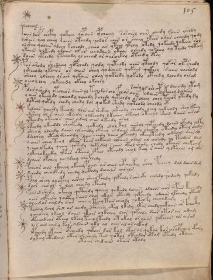

# Voynich Speculative Procedural Protocol — f105r

IMPORTANT: this is NOT a real or validated translation of the Voynich Manuscript. It is a speculative/procedural model that interprets EVA using a user-defined grammar to generate experimental recipes using safe, known edible substitutes.

This file is generated automatically from IVTFF/EVA transliteration plus a user-defined procedural grammar.



## Page / Folio
- currier: B
- folio: f105r
- page_number: 216

## EVA Text (Transliteration)
```text
@199;aiin dar chcphy qokeey qopaiin ypcheeey saraisl aiin cheedy [?:k]aiin arody
dshees yey cheey raiin otchdy qodor ches or cheey okees odar cheody qody
olshey qod[en:a'] odeey kcheody cheeo ar yteey ytchy otedy qokeedy qokeey rol
ykaiin olkeedy odaiin okar eeeodaiin yteey ochedy [q:?]okeeey oy teedy qotam
daiin yteedy yteeeody yl cheod or aiiroekey otchdy otey
par arody shedeeey qopchedy qody qoteody aiin yteody qokor olpshedy
ysheeody ykeeos or aiiin shey qodaiiin qokeed qokeey saiin aiirody
sheey oleeey or air qokaiin chey qokeedy qokedy oteedy lchedy oesal
oeeolchy okee[y:o]dy okeey okchey
sairy ore daiindy ytam
pdar o shedy otcheos oiiin al tchedarchy fchos aiin polaiin polkeeey dyaiin
ya[iir:iin] yteeo dy qoeeody qoeedy kchedy qotchdy otcheey chey teeor ykedy ry
dyteey qokdy chedy chedy dal qoked shedy qoteody cheedy ot
kesoar qoeeedy keeody dlls air shckhy oekeody cheody oeey qokeeody sheo lkeey
lksheey ol r aiin okeedy olkeeody lkaiin okeeol oteeol shod daiin aral
yteody oteeeos aiin odal oiir okeedy oral
lteedy okeeddl sheokedy qokedy shol kol aiirol qokchedy daiin okedy q@145;ky
sheoy oleedy daiin al chedy okeeey chdaiin otedy cheoty oteedy oteey chdy
dsechey oteol daiindy saiin chedy laiin okeeody okeeyteedy odaiin aiir al
s aiin chey teol ykair paiir olkaiin olfaiin odar al airody al teedar dam
ycheo lkedy qoeey qokedy qokedal saiin otol shody chedy okaiin chekaim
olkchokeedy ypair opaiin opail oteodl eeol keey r aiin ylkaiin am ols
dchees opchey aeeod[ch:ee]y chefchedy
pcheor ain ckheey okeeey paiin ar aiiin chpaiikey sheo pcheey dal daiin dam
deeedy cheodkedy chedy decthdy daiiils airols
pdal sheey yqopchy airal sheey fchdy qopchdy raiir oky chdedy qodeedy qokedy
dair cho al r lal cheesy cphedy
pchsed sheefy opchey qoteedy qoeey qokeedy laiiin odaiin aiir opair kechedy
oees olkeedy qockhy r aiin chol okair oteedy qopchedy odaiin ypchedy ytam
oleedar aiildy dar oiin y teey tair cheody qokolky cheolkary
kodeey lchl shx ar aii[j:d]y cpheesy okal lkedy lkar chedy qokaiin or fchoky
ycheochy lkeol daiin qkair olkchey dar qopchdy dair otar ar ajam
okeeodair oteey lkeey teeolteedy ot okal or aiiin qokaiin ar airod
dor ail cheky kar odaiin ykl al oees al ar alkam
ypchedy okaiir opcheedy qokair dar kal otar ol qokal kor orolpchey ofory
dyteey otedaiin otar ol chedy ted qotar oteodar otam ytedy otaiin
otoiir chedaiin otair otaly
```

## Domain Context (Heuristic; Not a Translation)

This section summarizes recurring **basewords** in this IVTFF domain and shows simple substring evidence that the token markers used by the procedural grammar occur inside frequent words.

Any Italian anagram / English gloss is a best-effort lexicon match, not a decipherment.


### Associated basewords (non-generic; top by frequency in this domain)
- `paiin` (count=241) → Italian anagram `piani`; English: plans (arrangements)
- `qokaiin` (count=122) → Italian anagram `ciancio`; English: [n/a]
- `okaiin` (count=109) → Italian anagram `coniai`; English: [n/a]
- `qokain` (count=101) → Italian anagram `acconi`; English: [n/a]
- `okain` (count=69) → Italian anagram `acino`; English: a berry
- `qokep` (count=65) → Italian anagram `pecco`; English: [n/a]
- `otain` (count=54) → Italian anagram `anito`; English: [n/a]
- `qokar` (count=48) → Italian anagram `carco`; English: [n/a]
- `saiin` (count=48) → Italian anagram `asini`; English: [n/a]
- `qokal` (count=46) → Italian anagram `calco`; English: cast (of sculpture)
- `kaiin` (count=45) → Italian anagram `acini`; English: [n/a]
- `qotaiin` (count=40) → Italian anagram `cationi`; English: [n/a]
- `lkaiin` (count=40) → Italian anagram `ancili`; English: [n/a]
- `qokeol` (count=38) → Italian anagram `eccolo`; English: [n/a]
- `qotain` (count=34) → Italian anagram `antico`; English: ancient

### Marker evidence (substring in frequent basewords)
- `qo`: 63 basewords; examples: `qokee`, `qokeep`, `qokaiin`, `qokain`, `qokep`, `qoke`
- `q`: 64 basewords; examples: `qokee`, `qokeep`, `qokaiin`, `qokain`, `qokep`, `qoke`
- `o`: 281 basewords; examples: `qokee`, `ol`, `o`, `qokeep`, `okee`, `qokaiin`
- `k`: 150 basewords; examples: `qokee`, `qokeep`, `okee`, `qokaiin`, `okaiin`, `qokain`
- `t`: 100 basewords; examples: `otaiin`, `otee`, `otal`, `otar`, `oteep`, `otep`
- `p`: 154 basewords; examples: `paiin`, `chep`, `qokeep`, `shep`, `par`, `oteep`
- `ch`: 144 basewords; examples: `chep`, `che`, `chol`, `chee`, `cheol`, `cheo`
- `sh`: 52 basewords; examples: `shep`, `she`, `shee`, `sheol`, `sheep`, `shol`
- `f`: 2 basewords; examples: `fchep`, `f`
- `cth`: 17 basewords; examples: `chcth`, `cthe`, `shcth`, `checth`, `cthol`, `cthee`
- `ckh`: 18 basewords; examples: `chckh`, `shckh`, `checkh`, `chckhe`, `chockh`, `sheckh`
- `cph`: 3 basewords; examples: `cphol`, `cph`, `cphe`
- `iin`: 38 basewords; examples: `aiin`, `paiin`, `qokaiin`, `okaiin`, `otaiin`, `saiin`
- `aiin`: 31 basewords; examples: `aiin`, `paiin`, `qokaiin`, `okaiin`, `otaiin`, `saiin`

## Recipes Index (This Page)
- [f105r.1,@P0](#f105r-1-f105r-1-p0)
- [f105r.2,+P0](#f105r-2-f105r-2-p0)
- [f105r.3,+P0](#f105r-3-f105r-3-p0)
- [f105r.4,+P0](#f105r-4-f105r-4-p0)
- [f105r.5,+P0](#f105r-5-f105r-5-p0)
- [f105r.6,+P0](#f105r-6-f105r-6-p0)
- [f105r.7,+P0](#f105r-7-f105r-7-p0)
- [f105r.8,+P0](#f105r-8-f105r-8-p0)
- [f105r.9,+P0](#f105r-9-f105r-9-p0)
- [f105r.10,+Pr](#f105r-10-f105r-10-pr)
- [f105r.11,*P0](#f105r-11-f105r-11-p0)
- [f105r.12,+P0](#f105r-12-f105r-12-p0)
- [f105r.13,+P0](#f105r-13-f105r-13-p0)
- [f105r.14,+P0](#f105r-14-f105r-14-p0)
- [f105r.15,+P0](#f105r-15-f105r-15-p0)
- [f105r.16,+P0](#f105r-16-f105r-16-p0)
- [f105r.17,+P0](#f105r-17-f105r-17-p0)
- [f105r.18,+P0](#f105r-18-f105r-18-p0)
- [f105r.19,+P0](#f105r-19-f105r-19-p0)
- [f105r.20,+P0](#f105r-20-f105r-20-p0)
- [f105r.21,+P0](#f105r-21-f105r-21-p0)
- [f105r.22,+P0](#f105r-22-f105r-22-p0)
- [f105r.23,+P0](#f105r-23-f105r-23-p0)
- [f105r.24,+P0](#f105r-24-f105r-24-p0)
- [f105r.25,+P0](#f105r-25-f105r-25-p0)
- [f105r.26,+P0](#f105r-26-f105r-26-p0)
- [f105r.27,+P0](#f105r-27-f105r-27-p0)
- [f105r.28,+P0](#f105r-28-f105r-28-p0)
- [f105r.29,+P0](#f105r-29-f105r-29-p0)
- [f105r.30,+P0](#f105r-30-f105r-30-p0)
- [f105r.31,+P0](#f105r-31-f105r-31-p0)
- [f105r.32,+P0](#f105r-32-f105r-32-p0)
- [f105r.33,+P0](#f105r-33-f105r-33-p0)
- [f105r.34,+P0](#f105r-34-f105r-34-p0)
- [f105r.35,+P0](#f105r-35-f105r-35-p0)
- [f105r.36,+P0](#f105r-36-f105r-36-p0)
- [f105r.37,+Pc](#f105r-37-f105r-37-pc)

## Line Glosses (Procedural Gloss Only; Not a Translation)

<a id="f105r-1-f105r-1-p0"></a>

### f105r.1,@P0

EVA: @199;aiin dar chcphy qokeey qopaiin ypcheeey saraisl aiin cheedy [?:k]aiin arody

Direct Gloss (Procedural, Not a Real Translation):
- aiin: tokens: aiin → vowel_run: a (level 1; class a) → suffix: aiin
- dar: tokens: p a r → connectors: r → vowel_run: a (level 1; class a)
- chcphy: tokens: ch cph
- qokeey: tokens: qo k ee → vowel_run: ee (level 2; class e)
- qopaiin: tokens: qo p aiin → vowel_run: a (level 1; class a) → suffix: aiin
- ypcheeey: tokens: p ch eee → vowel_run: eee (level 3; class e)
- saraisl: tokens: s a r a i s l → connectors: s r s l → vowel_run: a (level 1; class a)
- aiin: tokens: aiin → vowel_run: a (level 1; class a) → suffix: aiin
- cheedy: tokens: ch ee p → vowel_run: ee (level 2; class e)
- k: tokens: k
- aiin: tokens: aiin → vowel_run: a (level 1; class a) → suffix: aiin
- arody: tokens: a r o p → connectors: r → vowel_run: a (level 1; class a)

<a id="f105r-2-f105r-2-p0"></a>

### f105r.2,+P0

EVA: dshees yey cheey raiin otchdy qodor ches or cheey okees odar cheody qody

Direct Gloss (Procedural, Not a Real Translation):
- dshees: tokens: p sh ee s → connectors: s → vowel_run: ee (level 2; class e)
- yey: tokens: e → vowel_run: e (level 1; class e)
- cheey: tokens: ch ee → vowel_run: ee (level 2; class e)
- raiin: tokens: r aiin → connectors: r → vowel_run: a (level 1; class a) → suffix: aiin
- otchdy: tokens: o t ch p
- qodor: tokens: qo p o r → connectors: r
- ches: tokens: ch e s → connectors: s → vowel_run: e (level 1; class e)
- or: tokens: o r → connectors: r
- cheey: tokens: ch ee → vowel_run: ee (level 2; class e)
- okees: tokens: o k ee s → connectors: s → vowel_run: ee (level 2; class e)
- odar: tokens: o p a r → connectors: r → vowel_run: a (level 1; class a)
- cheody: tokens: ch e o p → vowel_run: e (level 1; class e)
- qody: tokens: qo p

<a id="f105r-3-f105r-3-p0"></a>

### f105r.3,+P0

EVA: olshey qod[en:a'] odeey kcheody cheeo ar yteey ytchy otedy qokeedy qokeey rol

Direct Gloss (Procedural, Not a Real Translation):
- olshey: tokens: o l sh e → connectors: l → vowel_run: e (level 1; class e)
- qod: tokens: qo p
- en: tokens: e n → connectors: n → vowel_run: e (level 1; class e)
- a: tokens: a → vowel_run: a (level 1; class a)
- odeey: tokens: o p ee → vowel_run: ee (level 2; class e)
- kcheody: tokens: k ch e o p → vowel_run: e (level 1; class e)
- cheeo: tokens: ch ee o → vowel_run: ee (level 2; class e)
- ar: tokens: a r → connectors: r → vowel_run: a (level 1; class a)
- yteey: tokens: t ee → vowel_run: ee (level 2; class e)
- ytchy: tokens: t ch
- otedy: tokens: o t e p → vowel_run: e (level 1; class e)
- qokeedy: tokens: qo k ee p → vowel_run: ee (level 2; class e)
- qokeey: tokens: qo k ee → vowel_run: ee (level 2; class e)
- rol: tokens: r o l → connectors: r l

<a id="f105r-4-f105r-4-p0"></a>

### f105r.4,+P0

EVA: ykaiin olkeedy odaiin okar eeeodaiin yteey ochedy [q:?]okeeey oy teedy qotam

Direct Gloss (Procedural, Not a Real Translation):
- ykaiin: tokens: k aiin → vowel_run: a (level 1; class a) → suffix: aiin
- olkeedy: tokens: o l k ee p → connectors: l → vowel_run: ee (level 2; class e)
- odaiin: tokens: o p aiin → vowel_run: a (level 1; class a) → suffix: aiin (lexicon-context: `opaiin` → `opinai`; [n/a])
- okar: tokens: o k a r → connectors: r → vowel_run: a (level 1; class a)
- eeeodaiin: tokens: eee o p aiin → vowel_run: eee (level 3; class e) → suffix: aiin (lexicon-context: `opaiin` → `opinai`; [n/a])
- yteey: tokens: t ee → vowel_run: ee (level 2; class e)
- ochedy: tokens: o ch e p → vowel_run: e (level 1; class e)
- q: tokens: q
- okeeey: tokens: o k eee → vowel_run: eee (level 3; class e)
- oy: tokens: o
- teedy: tokens: t ee p → vowel_run: ee (level 2; class e)
- qotam: tokens: qo t a m → connectors: m → vowel_run: a (level 1; class a)

<a id="f105r-5-f105r-5-p0"></a>

### f105r.5,+P0

EVA: daiin yteedy yteeeody yl cheod or aiiroekey otchdy otey

Direct Gloss (Procedural, Not a Real Translation):
- daiin: tokens: p aiin → vowel_run: a (level 1; class a) → suffix: aiin (lexicon-context: `paiin` → `piani`; plans (arrangements))
- yteedy: tokens: t ee p → vowel_run: ee (level 2; class e)
- yteeeody: tokens: t eee o p → vowel_run: eee (level 3; class e)
- yl: tokens: l → connectors: l
- cheod: tokens: ch e o p → vowel_run: e (level 1; class e)
- or: tokens: o r → connectors: r
- aiiroekey: tokens: a ii r o e k e → connectors: r → vowel_run: a (level 1; class a)
- otchdy: tokens: o t ch p
- otey: tokens: o t e → vowel_run: e (level 1; class e)

<a id="f105r-6-f105r-6-p0"></a>

### f105r.6,+P0

EVA: par arody shedeeey qopchedy qody qoteody aiin yteody qokor olpshedy

Direct Gloss (Procedural, Not a Real Translation):
- par: tokens: p a r → connectors: r → vowel_run: a (level 1; class a)
- arody: tokens: a r o p → connectors: r → vowel_run: a (level 1; class a)
- shedeeey: tokens: sh e p eee → vowel_run: e (level 1; class e)
- qopchedy: tokens: qo p ch e p → vowel_run: e (level 1; class e)
- qody: tokens: qo p
- qoteody: tokens: qo t e o p → vowel_run: e (level 1; class e)
- aiin: tokens: aiin → vowel_run: a (level 1; class a) → suffix: aiin
- yteody: tokens: t e o p → vowel_run: e (level 1; class e)
- qokor: tokens: qo k o r → connectors: r
- olpshedy: tokens: o l p sh e p → connectors: l → vowel_run: e (level 1; class e)

<a id="f105r-7-f105r-7-p0"></a>

### f105r.7,+P0

EVA: ysheeody ykeeos or aiiin shey qodaiiin qokeed qokeey saiin aiirody

Direct Gloss (Procedural, Not a Real Translation):
- ysheeody: tokens: sh ee o p → vowel_run: ee (level 2; class e)
- ykeeos: tokens: k ee o s → connectors: s → vowel_run: ee (level 2; class e)
- or: tokens: o r → connectors: r
- aiiin: tokens: a iii n → connectors: n → vowel_run: a (level 1; class a) → suffix: iin
- shey: tokens: sh e → vowel_run: e (level 1; class e)
- qodaiiin: tokens: qo p a iii n → connectors: n → vowel_run: a (level 1; class a) → suffix: iin
- qokeed: tokens: qo k ee p → vowel_run: ee (level 2; class e)
- qokeey: tokens: qo k ee → vowel_run: ee (level 2; class e)
- saiin: tokens: s aiin → connectors: s → vowel_run: a (level 1; class a) → suffix: aiin (lexicon-context: `saiin` → `asini`; [n/a])
- aiirody: tokens: a ii r o p → connectors: r → vowel_run: a (level 1; class a)

<a id="f105r-8-f105r-8-p0"></a>

### f105r.8,+P0

EVA: sheey oleeey or air qokaiin chey qokeedy qokedy oteedy lchedy oesal

Direct Gloss (Procedural, Not a Real Translation):
- sheey: tokens: sh ee → vowel_run: ee (level 2; class e)
- oleeey: tokens: o l eee → connectors: l → vowel_run: eee (level 3; class e)
- or: tokens: o r → connectors: r
- air: tokens: a i r → connectors: r → vowel_run: a (level 1; class a)
- qokaiin: tokens: qo k aiin → vowel_run: a (level 1; class a) → suffix: aiin (lexicon-context: `qokaiin` → `conciai`; [n/a])
- chey: tokens: ch e → vowel_run: e (level 1; class e)
- qokeedy: tokens: qo k ee p → vowel_run: ee (level 2; class e)
- qokedy: tokens: qo k e p → vowel_run: e (level 1; class e) (lexicon-context: `qokep` → `pecco`; [n/a])
- oteedy: tokens: o t ee p → vowel_run: ee (level 2; class e)
- lchedy: tokens: l ch e p → connectors: l → vowel_run: e (level 1; class e)
- oesal: tokens: o e s a l → connectors: s l → vowel_run: e (level 1; class e)

<a id="f105r-9-f105r-9-p0"></a>

### f105r.9,+P0

EVA: oeeolchy okee[y:o]dy okeey okchey

Direct Gloss (Procedural, Not a Real Translation):
- oeeolchy: tokens: o ee o l ch → connectors: l → vowel_run: ee (level 2; class e)
- okee: tokens: o k ee → vowel_run: ee (level 2; class e)
- y: [unparsed]
- o: tokens: o
- dy: tokens: p
- okeey: tokens: o k ee → vowel_run: ee (level 2; class e)
- okchey: tokens: o k ch e → vowel_run: e (level 1; class e)

<a id="f105r-10-f105r-10-pr"></a>

### f105r.10,+Pr

EVA: sairy ore daiindy ytam

Direct Gloss (Procedural, Not a Real Translation):
- sairy: tokens: s a i r → connectors: s r → vowel_run: a (level 1; class a)
- ore: tokens: o r e → connectors: r → vowel_run: e (level 1; class e)
- daiindy: tokens: p aiin p → vowel_run: a (level 1; class a) → suffix: aiin (lexicon-context: `paiin` → `piani`; plans (arrangements))
- ytam: tokens: t a m → connectors: m → vowel_run: a (level 1; class a)

<a id="f105r-11-f105r-11-p0"></a>

### f105r.11,*P0

EVA: pdar o shedy otcheos oiiin al tchedarchy fchos aiin polaiin polkeeey dyaiin

Direct Gloss (Procedural, Not a Real Translation):
- pdar: tokens: p p a r → connectors: r → vowel_run: a (level 1; class a)
- o: tokens: o
- shedy: tokens: sh e p → vowel_run: e (level 1; class e)
- otcheos: tokens: o t ch e o s → connectors: s → vowel_run: e (level 1; class e)
- oiiin: tokens: o iii n → connectors: n → vowel_run: iii (level 3; class i) → suffix: iin
- al: tokens: a l → connectors: l → vowel_run: a (level 1; class a)
- tchedarchy: tokens: t ch e p a r ch → connectors: r → vowel_run: e (level 1; class e) (lexicon-context: `chepar` → `capre`; [n/a])
- fchos: tokens: f ch o s → connectors: s
- aiin: tokens: aiin → vowel_run: a (level 1; class a) → suffix: aiin
- polaiin: tokens: p o l aiin → connectors: l → vowel_run: a (level 1; class a) → suffix: aiin
- polkeeey: tokens: p o l k eee → connectors: l → vowel_run: eee (level 3; class e)
- dyaiin: tokens: p aiin → vowel_run: a (level 1; class a) → suffix: aiin (lexicon-context: `paiin` → `piani`; plans (arrangements))

<a id="f105r-12-f105r-12-p0"></a>

### f105r.12,+P0

EVA: ya[iir:iin] yteeo dy qoeeody qoeedy kchedy qotchdy otcheey chey teeor ykedy ry

Direct Gloss (Procedural, Not a Real Translation):
- ya: tokens: a → vowel_run: a (level 1; class a)
- iir: tokens: ii r → connectors: r → vowel_run: ii (level 2; class i)
- iin: tokens: iin → vowel_run: ii (level 2; class i) → suffix: iin
- yteeo: tokens: t ee o → vowel_run: ee (level 2; class e)
- dy: tokens: p
- qoeeody: tokens: qo ee o p → vowel_run: ee (level 2; class e)
- qoeedy: tokens: qo ee p → vowel_run: ee (level 2; class e)
- kchedy: tokens: k ch e p → vowel_run: e (level 1; class e)
- qotchdy: tokens: qo t ch p
- otcheey: tokens: o t ch ee → vowel_run: ee (level 2; class e)
- chey: tokens: ch e → vowel_run: e (level 1; class e)
- teeor: tokens: t ee o r → connectors: r → vowel_run: ee (level 2; class e)
- ykedy: tokens: k e p → vowel_run: e (level 1; class e)
- ry: tokens: r → connectors: r

<a id="f105r-13-f105r-13-p0"></a>

### f105r.13,+P0

EVA: dyteey qokdy chedy chedy dal qoked shedy qoteody cheedy ot

Direct Gloss (Procedural, Not a Real Translation):
- dyteey: tokens: p t ee → vowel_run: ee (level 2; class e)
- qokdy: tokens: qo k p
- chedy: tokens: ch e p → vowel_run: e (level 1; class e)
- chedy: tokens: ch e p → vowel_run: e (level 1; class e)
- dal: tokens: p a l → connectors: l → vowel_run: a (level 1; class a)
- qoked: tokens: qo k e p → vowel_run: e (level 1; class e) (lexicon-context: `qokep` → `pecco`; [n/a])
- shedy: tokens: sh e p → vowel_run: e (level 1; class e)
- qoteody: tokens: qo t e o p → vowel_run: e (level 1; class e)
- cheedy: tokens: ch ee p → vowel_run: ee (level 2; class e)
- ot: tokens: o t

<a id="f105r-14-f105r-14-p0"></a>

### f105r.14,+P0

EVA: kesoar qoeeedy keeody dlls air shckhy oekeody cheody oeey qokeeody sheo lkeey

Direct Gloss (Procedural, Not a Real Translation):
- kesoar: tokens: k e s o a r → connectors: s r → vowel_run: e (level 1; class e)
- qoeeedy: tokens: qo eee p → vowel_run: eee (level 3; class e)
- keeody: tokens: k ee o p → vowel_run: ee (level 2; class e)
- dlls: tokens: p l l s → connectors: l l s
- air: tokens: a i r → connectors: r → vowel_run: a (level 1; class a)
- shckhy: tokens: sh ckh
- oekeody: tokens: o e k e o p → vowel_run: e (level 1; class e)
- cheody: tokens: ch e o p → vowel_run: e (level 1; class e)
- oeey: tokens: o ee → vowel_run: ee (level 2; class e)
- qokeeody: tokens: qo k ee o p → vowel_run: ee (level 2; class e)
- sheo: tokens: sh e o → vowel_run: e (level 1; class e)
- lkeey: tokens: l k ee → connectors: l → vowel_run: ee (level 2; class e)

<a id="f105r-15-f105r-15-p0"></a>

### f105r.15,+P0

EVA: lksheey ol r aiin okeedy olkeeody lkaiin okeeol oteeol shod daiin aral

Direct Gloss (Procedural, Not a Real Translation):
- lksheey: tokens: l k sh ee → connectors: l → vowel_run: ee (level 2; class e)
- ol: tokens: o l → connectors: l
- r: tokens: r → connectors: r
- aiin: tokens: aiin → vowel_run: a (level 1; class a) → suffix: aiin
- okeedy: tokens: o k ee p → vowel_run: ee (level 2; class e)
- olkeeody: tokens: o l k ee o p → connectors: l → vowel_run: ee (level 2; class e)
- lkaiin: tokens: l k aiin → connectors: l → vowel_run: a (level 1; class a) → suffix: aiin (lexicon-context: `lkaiin` → `canili`; [n/a])
- okeeol: tokens: o k ee o l → connectors: l → vowel_run: ee (level 2; class e)
- oteeol: tokens: o t ee o l → connectors: l → vowel_run: ee (level 2; class e)
- shod: tokens: sh o p
- daiin: tokens: p aiin → vowel_run: a (level 1; class a) → suffix: aiin (lexicon-context: `paiin` → `piani`; plans (arrangements))
- aral: tokens: a r a l → connectors: r l → vowel_run: a (level 1; class a)

<a id="f105r-16-f105r-16-p0"></a>

### f105r.16,+P0

EVA: yteody oteeeos aiin odal oiir okeedy oral

Direct Gloss (Procedural, Not a Real Translation):
- yteody: tokens: t e o p → vowel_run: e (level 1; class e)
- oteeeos: tokens: o t eee o s → connectors: s → vowel_run: eee (level 3; class e)
- aiin: tokens: aiin → vowel_run: a (level 1; class a) → suffix: aiin
- odal: tokens: o p a l → connectors: l → vowel_run: a (level 1; class a)
- oiir: tokens: o ii r → connectors: r → vowel_run: ii (level 2; class i)
- okeedy: tokens: o k ee p → vowel_run: ee (level 2; class e)
- oral: tokens: o r a l → connectors: r l → vowel_run: a (level 1; class a)

<a id="f105r-17-f105r-17-p0"></a>

### f105r.17,+P0

EVA: lteedy okeeddl sheokedy qokedy shol kol aiirol qokchedy daiin okedy q@145;ky

Direct Gloss (Procedural, Not a Real Translation):
- lteedy: tokens: l t ee p → connectors: l → vowel_run: ee (level 2; class e)
- okeeddl: tokens: o k ee p p l → connectors: l → vowel_run: ee (level 2; class e)
- sheokedy: tokens: sh e o k e p → vowel_run: e (level 1; class e)
- qokedy: tokens: qo k e p → vowel_run: e (level 1; class e) (lexicon-context: `qokep` → `pecco`; [n/a])
- shol: tokens: sh o l → connectors: l
- kol: tokens: k o l → connectors: l
- aiirol: tokens: a ii r o l → connectors: r l → vowel_run: a (level 1; class a)
- qokchedy: tokens: qo k ch e p → vowel_run: e (level 1; class e)
- daiin: tokens: p aiin → vowel_run: a (level 1; class a) → suffix: aiin (lexicon-context: `paiin` → `piani`; plans (arrangements))
- okedy: tokens: o k e p → vowel_run: e (level 1; class e)
- q: tokens: q
- ky: tokens: k

<a id="f105r-18-f105r-18-p0"></a>

### f105r.18,+P0

EVA: sheoy oleedy daiin al chedy okeeey chdaiin otedy cheoty oteedy oteey chdy

Direct Gloss (Procedural, Not a Real Translation):
- sheoy: tokens: sh e o → vowel_run: e (level 1; class e)
- oleedy: tokens: o l ee p → connectors: l → vowel_run: ee (level 2; class e)
- daiin: tokens: p aiin → vowel_run: a (level 1; class a) → suffix: aiin (lexicon-context: `paiin` → `piani`; plans (arrangements))
- al: tokens: a l → connectors: l → vowel_run: a (level 1; class a)
- chedy: tokens: ch e p → vowel_run: e (level 1; class e)
- okeeey: tokens: o k eee → vowel_run: eee (level 3; class e)
- chdaiin: tokens: ch p aiin → vowel_run: a (level 1; class a) → suffix: aiin (lexicon-context: `paiin` → `piani`; plans (arrangements))
- otedy: tokens: o t e p → vowel_run: e (level 1; class e)
- cheoty: tokens: ch e o t → vowel_run: e (level 1; class e)
- oteedy: tokens: o t ee p → vowel_run: ee (level 2; class e)
- oteey: tokens: o t ee → vowel_run: ee (level 2; class e)
- chdy: tokens: ch p

<a id="f105r-19-f105r-19-p0"></a>

### f105r.19,+P0

EVA: dsechey oteol daiindy saiin chedy laiin okeeody okeeyteedy odaiin aiir al

Direct Gloss (Procedural, Not a Real Translation):
- dsechey: tokens: p s e ch e → connectors: s → vowel_run: e (level 1; class e)
- oteol: tokens: o t e o l → connectors: l → vowel_run: e (level 1; class e)
- daiindy: tokens: p aiin p → vowel_run: a (level 1; class a) → suffix: aiin (lexicon-context: `paiin` → `piani`; plans (arrangements))
- saiin: tokens: s aiin → connectors: s → vowel_run: a (level 1; class a) → suffix: aiin (lexicon-context: `saiin` → `asini`; [n/a])
- chedy: tokens: ch e p → vowel_run: e (level 1; class e)
- laiin: tokens: l aiin → connectors: l → vowel_run: a (level 1; class a) → suffix: aiin
- okeeody: tokens: o k ee o p → vowel_run: ee (level 2; class e)
- okeeyteedy: tokens: o k ee t ee p → vowel_run: ee (level 2; class e)
- odaiin: tokens: o p aiin → vowel_run: a (level 1; class a) → suffix: aiin (lexicon-context: `opaiin` → `opinai`; [n/a])
- aiir: tokens: a ii r → connectors: r → vowel_run: a (level 1; class a)
- al: tokens: a l → connectors: l → vowel_run: a (level 1; class a)

<a id="f105r-20-f105r-20-p0"></a>

### f105r.20,+P0

EVA: s aiin chey teol ykair paiir olkaiin olfaiin odar al airody al teedar dam

Direct Gloss (Procedural, Not a Real Translation):
- s: tokens: s → connectors: s
- aiin: tokens: aiin → vowel_run: a (level 1; class a) → suffix: aiin
- chey: tokens: ch e → vowel_run: e (level 1; class e)
- teol: tokens: t e o l → connectors: l → vowel_run: e (level 1; class e)
- ykair: tokens: k a i r → connectors: r → vowel_run: a (level 1; class a)
- paiir: tokens: p a ii r → connectors: r → vowel_run: a (level 1; class a)
- olkaiin: tokens: o l k aiin → connectors: l → vowel_run: a (level 1; class a) → suffix: aiin (lexicon-context: `lkaiin` → `canili`; [n/a])
- olfaiin: tokens: o l f aiin → connectors: l → vowel_run: a (level 1; class a) → suffix: aiin
- odar: tokens: o p a r → connectors: r → vowel_run: a (level 1; class a)
- al: tokens: a l → connectors: l → vowel_run: a (level 1; class a)
- airody: tokens: a i r o p → connectors: r → vowel_run: a (level 1; class a)
- al: tokens: a l → connectors: l → vowel_run: a (level 1; class a)
- teedar: tokens: t ee p a r → connectors: r → vowel_run: ee (level 2; class e)
- dam: tokens: p a m → connectors: m → vowel_run: a (level 1; class a)

<a id="f105r-21-f105r-21-p0"></a>

### f105r.21,+P0

EVA: ycheo lkedy qoeey qokedy qokedal saiin otol shody chedy okaiin chekaim

Direct Gloss (Procedural, Not a Real Translation):
- ycheo: tokens: ch e o → vowel_run: e (level 1; class e)
- lkedy: tokens: l k e p → connectors: l → vowel_run: e (level 1; class e)
- qoeey: tokens: qo ee → vowel_run: ee (level 2; class e)
- qokedy: tokens: qo k e p → vowel_run: e (level 1; class e) (lexicon-context: `qokep` → `pecco`; [n/a])
- qokedal: tokens: qo k e p a l → connectors: l → vowel_run: e (level 1; class e) (lexicon-context: `qokep` → `pecco`; [n/a])
- saiin: tokens: s aiin → connectors: s → vowel_run: a (level 1; class a) → suffix: aiin (lexicon-context: `saiin` → `asini`; [n/a])
- otol: tokens: o t o l → connectors: l
- shody: tokens: sh o p
- chedy: tokens: ch e p → vowel_run: e (level 1; class e)
- okaiin: tokens: o k aiin → vowel_run: a (level 1; class a) → suffix: aiin (lexicon-context: `okaiin` → `coniai`; [n/a])
- chekaim: tokens: ch e k a i m → connectors: m → vowel_run: e (level 1; class e)

<a id="f105r-22-f105r-22-p0"></a>

### f105r.22,+P0

EVA: olkchokeedy ypair opaiin opail oteodl eeol keey r aiin ylkaiin am ols

Direct Gloss (Procedural, Not a Real Translation):
- olkchokeedy: tokens: o l k ch o k ee p → connectors: l → vowel_run: ee (level 2; class e)
- ypair: tokens: p a i r → connectors: r → vowel_run: a (level 1; class a)
- opaiin: tokens: o p aiin → vowel_run: a (level 1; class a) → suffix: aiin (lexicon-context: `opaiin` → `opinai`; [n/a])
- opail: tokens: o p a i l → connectors: l → vowel_run: a (level 1; class a)
- oteodl: tokens: o t e o p l → connectors: l → vowel_run: e (level 1; class e)
- eeol: tokens: ee o l → connectors: l → vowel_run: ee (level 2; class e)
- keey: tokens: k ee → vowel_run: ee (level 2; class e)
- r: tokens: r → connectors: r
- aiin: tokens: aiin → vowel_run: a (level 1; class a) → suffix: aiin
- ylkaiin: tokens: l k aiin → connectors: l → vowel_run: a (level 1; class a) → suffix: aiin (lexicon-context: `lkaiin` → `canili`; [n/a])
- am: tokens: a m → connectors: m → vowel_run: a (level 1; class a)
- ols: tokens: o l s → connectors: l s

<a id="f105r-23-f105r-23-p0"></a>

### f105r.23,+P0

EVA: dchees opchey aeeod[ch:ee]y chefchedy

Direct Gloss (Procedural, Not a Real Translation):
- dchees: tokens: p ch ee s → connectors: s → vowel_run: ee (level 2; class e)
- opchey: tokens: o p ch e → vowel_run: e (level 1; class e)
- aeeod: tokens: a ee o p → vowel_run: a (level 1; class a)
- ch: tokens: ch
- ee: tokens: ee → vowel_run: ee (level 2; class e)
- y: [unparsed]
- chefchedy: tokens: ch e f ch e p → vowel_run: e (level 1; class e)

<a id="f105r-24-f105r-24-p0"></a>

### f105r.24,+P0

EVA: pcheor ain ckheey okeeey paiin ar aiiin chpaiikey sheo pcheey dal daiin dam

Direct Gloss (Procedural, Not a Real Translation):
- pcheor: tokens: p ch e o r → connectors: r → vowel_run: e (level 1; class e)
- ain: tokens: a i n → connectors: n → vowel_run: a (level 1; class a)
- ckheey: tokens: ckh ee → vowel_run: ee (level 2; class e)
- okeeey: tokens: o k eee → vowel_run: eee (level 3; class e)
- paiin: tokens: p aiin → vowel_run: a (level 1; class a) → suffix: aiin (lexicon-context: `paiin` → `piani`; plans (arrangements))
- ar: tokens: a r → connectors: r → vowel_run: a (level 1; class a)
- aiiin: tokens: a iii n → connectors: n → vowel_run: a (level 1; class a) → suffix: iin
- chpaiikey: tokens: ch p a ii k e → vowel_run: a (level 1; class a)
- sheo: tokens: sh e o → vowel_run: e (level 1; class e)
- pcheey: tokens: p ch ee → vowel_run: ee (level 2; class e)
- dal: tokens: p a l → connectors: l → vowel_run: a (level 1; class a)
- daiin: tokens: p aiin → vowel_run: a (level 1; class a) → suffix: aiin (lexicon-context: `paiin` → `piani`; plans (arrangements))
- dam: tokens: p a m → connectors: m → vowel_run: a (level 1; class a)

<a id="f105r-25-f105r-25-p0"></a>

### f105r.25,+P0

EVA: deeedy cheodkedy chedy decthdy daiiils airols

Direct Gloss (Procedural, Not a Real Translation):
- deeedy: tokens: p eee p → vowel_run: eee (level 3; class e)
- cheodkedy: tokens: ch e o p k e p → vowel_run: e (level 1; class e)
- chedy: tokens: ch e p → vowel_run: e (level 1; class e)
- decthdy: tokens: p e cth p → vowel_run: e (level 1; class e)
- daiiils: tokens: p a iii l s → connectors: l s → vowel_run: a (level 1; class a)
- airols: tokens: a i r o l s → connectors: r l s → vowel_run: a (level 1; class a)

<a id="f105r-26-f105r-26-p0"></a>

### f105r.26,+P0

EVA: pdal sheey yqopchy airal sheey fchdy qopchdy raiir oky chdedy qodeedy qokedy

Direct Gloss (Procedural, Not a Real Translation):
- pdal: tokens: p p a l → connectors: l → vowel_run: a (level 1; class a)
- sheey: tokens: sh ee → vowel_run: ee (level 2; class e)
- yqopchy: tokens: qo p ch
- airal: tokens: a i r a l → connectors: r l → vowel_run: a (level 1; class a)
- sheey: tokens: sh ee → vowel_run: ee (level 2; class e)
- fchdy: tokens: f ch p
- qopchdy: tokens: qo p ch p
- raiir: tokens: r a ii r → connectors: r r → vowel_run: a (level 1; class a)
- oky: tokens: o k
- chdedy: tokens: ch p e p → vowel_run: e (level 1; class e)
- qodeedy: tokens: qo p ee p → vowel_run: ee (level 2; class e)
- qokedy: tokens: qo k e p → vowel_run: e (level 1; class e) (lexicon-context: `qokep` → `pecco`; [n/a])

<a id="f105r-27-f105r-27-p0"></a>

### f105r.27,+P0

EVA: dair cho al r lal cheesy cphedy

Direct Gloss (Procedural, Not a Real Translation):
- dair: tokens: p a i r → connectors: r → vowel_run: a (level 1; class a)
- cho: tokens: ch o
- al: tokens: a l → connectors: l → vowel_run: a (level 1; class a)
- r: tokens: r → connectors: r
- lal: tokens: l a l → connectors: l l → vowel_run: a (level 1; class a)
- cheesy: tokens: ch ee s → connectors: s → vowel_run: ee (level 2; class e)
- cphedy: tokens: cph e p → vowel_run: e (level 1; class e)

<a id="f105r-28-f105r-28-p0"></a>

### f105r.28,+P0

EVA: pchsed sheefy opchey qoteedy qoeey qokeedy laiiin odaiin aiir opair kechedy

Direct Gloss (Procedural, Not a Real Translation):
- pchsed: tokens: p ch s e p → connectors: s → vowel_run: e (level 1; class e)
- sheefy: tokens: sh ee f → vowel_run: ee (level 2; class e)
- opchey: tokens: o p ch e → vowel_run: e (level 1; class e)
- qoteedy: tokens: qo t ee p → vowel_run: ee (level 2; class e)
- qoeey: tokens: qo ee → vowel_run: ee (level 2; class e)
- qokeedy: tokens: qo k ee p → vowel_run: ee (level 2; class e)
- laiiin: tokens: l a iii n → connectors: l n → vowel_run: a (level 1; class a) → suffix: iin
- odaiin: tokens: o p aiin → vowel_run: a (level 1; class a) → suffix: aiin (lexicon-context: `opaiin` → `opinai`; [n/a])
- aiir: tokens: a ii r → connectors: r → vowel_run: a (level 1; class a)
- opair: tokens: o p a i r → connectors: r → vowel_run: a (level 1; class a)
- kechedy: tokens: k e ch e p → vowel_run: e (level 1; class e)

<a id="f105r-29-f105r-29-p0"></a>

### f105r.29,+P0

EVA: oees olkeedy qockhy r aiin chol okair oteedy qopchedy odaiin ypchedy ytam

Direct Gloss (Procedural, Not a Real Translation):
- oees: tokens: o ee s → connectors: s → vowel_run: ee (level 2; class e)
- olkeedy: tokens: o l k ee p → connectors: l → vowel_run: ee (level 2; class e)
- qockhy: tokens: qo ckh
- r: tokens: r → connectors: r
- aiin: tokens: aiin → vowel_run: a (level 1; class a) → suffix: aiin
- chol: tokens: ch o l → connectors: l
- okair: tokens: o k a i r → connectors: r → vowel_run: a (level 1; class a)
- oteedy: tokens: o t ee p → vowel_run: ee (level 2; class e)
- qopchedy: tokens: qo p ch e p → vowel_run: e (level 1; class e)
- odaiin: tokens: o p aiin → vowel_run: a (level 1; class a) → suffix: aiin (lexicon-context: `opaiin` → `opinai`; [n/a])
- ypchedy: tokens: p ch e p → vowel_run: e (level 1; class e)
- ytam: tokens: t a m → connectors: m → vowel_run: a (level 1; class a)

<a id="f105r-30-f105r-30-p0"></a>

### f105r.30,+P0

EVA: oleedar aiildy dar oiin y teey tair cheody qokolky cheolkary

Direct Gloss (Procedural, Not a Real Translation):
- oleedar: tokens: o l ee p a r → connectors: l r → vowel_run: ee (level 2; class e)
- aiildy: tokens: a ii l p → connectors: l → vowel_run: a (level 1; class a)
- dar: tokens: p a r → connectors: r → vowel_run: a (level 1; class a)
- oiin: tokens: o iin → vowel_run: ii (level 2; class i) → suffix: iin
- y: [unparsed]
- teey: tokens: t ee → vowel_run: ee (level 2; class e)
- tair: tokens: t a i r → connectors: r → vowel_run: a (level 1; class a)
- cheody: tokens: ch e o p → vowel_run: e (level 1; class e)
- qokolky: tokens: qo k o l k → connectors: l
- cheolkary: tokens: ch e o l k a r → connectors: l r → vowel_run: e (level 1; class e)

<a id="f105r-31-f105r-31-p0"></a>

### f105r.31,+P0

EVA: kodeey lchl shx ar aii[j:d]y cpheesy okal lkedy lkar chedy qokaiin or fchoky

Direct Gloss (Procedural, Not a Real Translation):
- kodeey: tokens: k o p ee → vowel_run: ee (level 2; class e)
- lchl: tokens: l ch l → connectors: l l
- shx: tokens: sh x
- ar: tokens: a r → connectors: r → vowel_run: a (level 1; class a)
- aii: tokens: a ii → vowel_run: a (level 1; class a)
- j: tokens: j
- d: tokens: p
- y: [unparsed]
- cpheesy: tokens: cph ee s → connectors: s → vowel_run: ee (level 2; class e)
- okal: tokens: o k a l → connectors: l → vowel_run: a (level 1; class a)
- lkedy: tokens: l k e p → connectors: l → vowel_run: e (level 1; class e)
- lkar: tokens: l k a r → connectors: l r → vowel_run: a (level 1; class a)
- chedy: tokens: ch e p → vowel_run: e (level 1; class e)
- qokaiin: tokens: qo k aiin → vowel_run: a (level 1; class a) → suffix: aiin (lexicon-context: `qokaiin` → `conciai`; [n/a])
- or: tokens: o r → connectors: r
- fchoky: tokens: f ch o k

<a id="f105r-32-f105r-32-p0"></a>

### f105r.32,+P0

EVA: ycheochy lkeol daiin qkair olkchey dar qopchdy dair otar ar ajam

Direct Gloss (Procedural, Not a Real Translation):
- ycheochy: tokens: ch e o ch → vowel_run: e (level 1; class e)
- lkeol: tokens: l k e o l → connectors: l l → vowel_run: e (level 1; class e)
- daiin: tokens: p aiin → vowel_run: a (level 1; class a) → suffix: aiin (lexicon-context: `paiin` → `piani`; plans (arrangements))
- qkair: tokens: q k a i r → connectors: r → vowel_run: a (level 1; class a)
- olkchey: tokens: o l k ch e → connectors: l → vowel_run: e (level 1; class e)
- dar: tokens: p a r → connectors: r → vowel_run: a (level 1; class a)
- qopchdy: tokens: qo p ch p
- dair: tokens: p a i r → connectors: r → vowel_run: a (level 1; class a)
- otar: tokens: o t a r → connectors: r → vowel_run: a (level 1; class a)
- ar: tokens: a r → connectors: r → vowel_run: a (level 1; class a)
- ajam: tokens: a j a m → connectors: m → vowel_run: a (level 1; class a)

<a id="f105r-33-f105r-33-p0"></a>

### f105r.33,+P0

EVA: okeeodair oteey lkeey teeolteedy ot okal or aiiin qokaiin ar airod

Direct Gloss (Procedural, Not a Real Translation):
- okeeodair: tokens: o k ee o p a i r → connectors: r → vowel_run: ee (level 2; class e)
- oteey: tokens: o t ee → vowel_run: ee (level 2; class e)
- lkeey: tokens: l k ee → connectors: l → vowel_run: ee (level 2; class e)
- teeolteedy: tokens: t ee o l t ee p → connectors: l → vowel_run: ee (level 2; class e)
- ot: tokens: o t
- okal: tokens: o k a l → connectors: l → vowel_run: a (level 1; class a)
- or: tokens: o r → connectors: r
- aiiin: tokens: a iii n → connectors: n → vowel_run: a (level 1; class a) → suffix: iin
- qokaiin: tokens: qo k aiin → vowel_run: a (level 1; class a) → suffix: aiin (lexicon-context: `qokaiin` → `conciai`; [n/a])
- ar: tokens: a r → connectors: r → vowel_run: a (level 1; class a)
- airod: tokens: a i r o p → connectors: r → vowel_run: a (level 1; class a)

<a id="f105r-34-f105r-34-p0"></a>

### f105r.34,+P0

EVA: dor ail cheky kar odaiin ykl al oees al ar alkam

Direct Gloss (Procedural, Not a Real Translation):
- dor: tokens: p o r → connectors: r
- ail: tokens: a i l → connectors: l → vowel_run: a (level 1; class a)
- cheky: tokens: ch e k → vowel_run: e (level 1; class e)
- kar: tokens: k a r → connectors: r → vowel_run: a (level 1; class a)
- odaiin: tokens: o p aiin → vowel_run: a (level 1; class a) → suffix: aiin (lexicon-context: `opaiin` → `opinai`; [n/a])
- ykl: tokens: k l → connectors: l
- al: tokens: a l → connectors: l → vowel_run: a (level 1; class a)
- oees: tokens: o ee s → connectors: s → vowel_run: ee (level 2; class e)
- al: tokens: a l → connectors: l → vowel_run: a (level 1; class a)
- ar: tokens: a r → connectors: r → vowel_run: a (level 1; class a)
- alkam: tokens: a l k a m → connectors: l m → vowel_run: a (level 1; class a)

<a id="f105r-35-f105r-35-p0"></a>

### f105r.35,+P0

EVA: ypchedy okaiir opcheedy qokair dar kal otar ol qokal kor orolpchey ofory

Direct Gloss (Procedural, Not a Real Translation):
- ypchedy: tokens: p ch e p → vowel_run: e (level 1; class e)
- okaiir: tokens: o k a ii r → connectors: r → vowel_run: a (level 1; class a)
- opcheedy: tokens: o p ch ee p → vowel_run: ee (level 2; class e)
- qokair: tokens: qo k a i r → connectors: r → vowel_run: a (level 1; class a)
- dar: tokens: p a r → connectors: r → vowel_run: a (level 1; class a)
- kal: tokens: k a l → connectors: l → vowel_run: a (level 1; class a)
- otar: tokens: o t a r → connectors: r → vowel_run: a (level 1; class a)
- ol: tokens: o l → connectors: l
- qokal: tokens: qo k a l → connectors: l → vowel_run: a (level 1; class a) (lexicon-context: `qokal` → `calco`; cast (of sculpture))
- kor: tokens: k o r → connectors: r
- orolpchey: tokens: o r o l p ch e → connectors: r l → vowel_run: e (level 1; class e)
- ofory: tokens: o f o r → connectors: r

<a id="f105r-36-f105r-36-p0"></a>

### f105r.36,+P0

EVA: dyteey otedaiin otar ol chedy ted qotar oteodar otam ytedy otaiin

Direct Gloss (Procedural, Not a Real Translation):
- dyteey: tokens: p t ee → vowel_run: ee (level 2; class e)
- otedaiin: tokens: o t e p aiin → vowel_run: e (level 1; class e) → suffix: aiin (lexicon-context: `paiin` → `piani`; plans (arrangements))
- otar: tokens: o t a r → connectors: r → vowel_run: a (level 1; class a)
- ol: tokens: o l → connectors: l
- chedy: tokens: ch e p → vowel_run: e (level 1; class e)
- ted: tokens: t e p → vowel_run: e (level 1; class e)
- qotar: tokens: qo t a r → connectors: r → vowel_run: a (level 1; class a) (lexicon-context: `qotar` → `corta`; [n/a])
- oteodar: tokens: o t e o p a r → connectors: r → vowel_run: e (level 1; class e)
- otam: tokens: o t a m → connectors: m → vowel_run: a (level 1; class a)
- ytedy: tokens: t e p → vowel_run: e (level 1; class e)
- otaiin: tokens: o t aiin → vowel_run: a (level 1; class a) → suffix: aiin

<a id="f105r-37-f105r-37-pc"></a>

### f105r.37,+Pc

EVA: otoiir chedaiin otair otaly

Direct Gloss (Procedural, Not a Real Translation):
- otoiir: tokens: o t o ii r → connectors: r → vowel_run: ii (level 2; class i)
- chedaiin: tokens: ch e p aiin → vowel_run: e (level 1; class e) → suffix: aiin (lexicon-context: `paiin` → `piani`; plans (arrangements))
- otair: tokens: o t a i r → connectors: r → vowel_run: a (level 1; class a) (lexicon-context: `otair` → `atrio`; entrance hall, lobby (of a hotel etc.))
- otaly: tokens: o t a l → connectors: l → vowel_run: a (level 1; class a)
