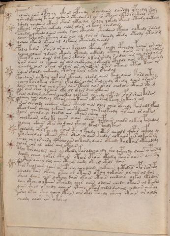

# Voynich Speculative Herbal Ferment Recipe — f105v

IMPORTANT: this is NOT a real or validated translation of the Voynich Manuscript. It is a speculative/procedural model that interprets EVA using a user-defined grammar to generate experimental recipes using safe, known edible substitutes.

This file is generated automatically from IVTFF/EVA transliteration plus a user-defined procedural grammar.



## Page / Folio
- currier: B
- folio: f105v
- page_number: 217

## EVA Text (Transliteration)
```text
polairy oair olpcheey ykaiin olpchedy opchedaiin dairody ypcheddy sairy
ysheod ykeeedy keshed qodaiin oteodair or chkar otaiin chpor or otchy otor
dshedy qoedaiin ytoiin okair qotol dol okoldy qokedy opched oteedy qotaiin
olkeeol orchsey qokeedy chdor olar ol keeol chedaiin
pchedal qopchdy daiin chedy daiin okaildy opchedaiin [o:y]pcheo olkeedy sairom
dcheo fcheeody ckheey dar aiin al dar ar daiiidy otedy oteody ykaiin [g:m]
ycheeo lkaiin otair ol olkaiin okairody lchedr
fodal kedar olpchesd araiin ksheeol opchedy pchedy opcheddl pchdar air odar
lcheey qoeees y daiin okairy otchedy ockhedy otchey daiin or r ail [l:?] okam
ykeey ky che oiiin dal kaiin okairo l kair chedy s odar air al oral odam
roees aiiin ol okaiin os aiin chckhodu qoteedy ckhddl aiir ypar kaiii'hdy
ysheedy aiin okeol ykedor ar ar alkair otar otaiin otal tair am
saiin opchedy qokchdy otar al kair okees lkchdal
pchedaiin chckhdy qokaiir olpchedy olord aiiin [t:k]ail odar kard chtchy
ycheey kar ykeey otaiin ot al dar chdor kalchedy opchdy daiin oraiin r
daiin cheey dal chl okair aiin cpheor aiin okal chodaiin otaiin opaiim
olr aiin chey l raiin lkl dl lklor diiin olkaiin
pchor chedaiin okaiin cholkal qolkaiin oltchdy qopchsd opair orair karaim
ycheey aiin otleey lkaiir cheeo taiin okeed ail kchey rokaix am
porair chopchdy chedain otair otchod aiin alol cheo ypchedy kairodl lpaim
ykeeo daiim sheey qokaiin cheot daiin qoek eeykeody qopaiin or aiikam
daiin cheodaiin chedal air okaiin cheey
tcholkaiin odal kl chees aiiin shees qopdaiin chod[s:r] alkeey paradam
alcheey okaiin otar oto daiin ckheol lkol fchedypaiin
kchdaldy alfo lfcheedy ofoiir opchey fchedy qotor oeeeodr qopar aifhhy dl
lkl sheeodees otaiin otar otal or aiin chedor alkaiin chs alkaiin ry
sheoe arxor eesy qopcheo ain orkchdy daiin oteedy ko lkair otaiilody
oeoar ar al odor aiil otaiin
tdol tor oaldar aiir okokeedy karody qoeedy sho qopchedy daiin opairam
dchedy cheey qokor otaiin otair otair okeedy kaiin aiin s aiin sy
ychtaiir aiichy dol aiin otaiin aiidy okchd otar daiin
poar keeodaiin qoair ar aiphhey qoeedeody qokaiin qotedair apo rairapy
lsheody tair oteey oteeo o l otaiin okeey qokaiin or aiir al dar
sheeo daiin chsd qokeeey dair okaiin otaiin chedaiin olkal lkldain
doee okcheeo l taiin otcheedy chor aiin odaiin chedy otaiin al kaishd
laiin sheod okeeody qoaiin ytaiin otair chdal dy daim chdaiin ockhhy
yshey ckhy sheo qoeeo lkaiin chs okol tchdy sheeey okaiin ar aildy
cheody oaiir ain okshey
```

## Domain Context (Heuristic; Not a Translation)

This section summarizes recurring **basewords** in this IVTFF domain and shows simple substring evidence that the token markers used by the procedural grammar occur inside frequent words.

Any Italian anagram / English gloss is a best-effort lexicon match, not a decipherment.


### Associated basewords (non-generic; top by frequency in this domain)
- `daiin` (count=231) → Italian anagram `piani`; English: plans (arrangements)
- `qokaiin` (count=122) → Italian anagram `ciancio`; English: [n/a]
- `okaiin` (count=109) → Italian anagram `coniai`; English: [n/a]
- `qokain` (count=101) → Italian anagram `acconi`; English: [n/a]
- `okain` (count=69) → Italian anagram `acino`; English: a berry
- `otain` (count=53) → Italian anagram `anito`; English: [n/a]
- `qokar` (count=48) → Italian anagram `carco`; English: [n/a]
- `saiin` (count=46) → Italian anagram `asini`; English: [n/a]
- `qokal` (count=43) → Italian anagram `calco`; English: cast (of sculpture)
- `qotaiin` (count=40) → Italian anagram `cationi`; English: [n/a]
- `lkaiin` (count=39) → Italian anagram `ancili`; English: [n/a]
- `kaiin` (count=37) → Italian anagram `acini`; English: [n/a]
- `qokeol` (count=37) → Italian anagram `eccolo`; English: [n/a]
- `qotain` (count=34) → Italian anagram `antico`; English: ancient
- `qotar` (count=29) → Italian anagram `corta`; English: [n/a]

### Marker evidence (substring in frequent basewords)
- `qo`: 60 basewords; examples: `qokeey`, `qokeedy`, `qokaiin`, `qokain`, `qokedy`, `qokey`
- `q`: 61 basewords; examples: `qokeey`, `qokeedy`, `qokaiin`, `qokain`, `qokedy`, `qokey`
- `o`: 262 basewords; examples: `qokeey`, `ol`, `o`, `qokeedy`, `okeey`, `qokaiin`
- `k`: 147 basewords; examples: `qokeey`, `qokeedy`, `okeey`, `qokaiin`, `okaiin`, `qokain`
- `t`: 102 basewords; examples: `otaiin`, `oteey`, `otar`, `otedy`, `otal`, `oteedy`
- `p`: 17 basewords; examples: `opchedy`, `qopchedy`, `opchey`, `pchedy`, `qopchdy`, `opchdy`
- `ch`: 137 basewords; examples: `chedy`, `chey`, `chol`, `cheey`, `cheol`, `cheody`
- `sh`: 50 basewords; examples: `shedy`, `shey`, `sheey`, `sheol`, `shol`, `sheedy`
- `f`: 1 basewords; examples: `f`
- `cth`: 16 basewords; examples: `chcthy`, `cthey`, `shcthy`, `checthy`, `cthol`, `ctheey`
- `ckh`: 15 basewords; examples: `chckhy`, `shckhy`, `checkhy`, `chckhey`, `chockhy`, `sheckhy`
- `cph`: 2 basewords; examples: `cphol`, `cphy`
- `dy`: 84 basewords; examples: `chedy`, `qokeedy`, `shedy`, `otedy`, `oteedy`, `qokedy`
- `iin`: 39 basewords; examples: `aiin`, `daiin`, `qokaiin`, `okaiin`, `otaiin`, `saiin`
- `aiin`: 33 basewords; examples: `aiin`, `daiin`, `qokaiin`, `okaiin`, `otaiin`, `saiin`

## Recipes Index (This Page)
- [f105v.1,@P0](#f105v-1-f105v-1-p0)
- [f105v.2,+P0](#f105v-2-f105v-2-p0)
- [f105v.3,+P0](#f105v-3-f105v-3-p0)
- [f105v.4,+P0](#f105v-4-f105v-4-p0)
- [f105v.5,+P0](#f105v-5-f105v-5-p0)
- [f105v.6,+P0](#f105v-6-f105v-6-p0)
- [f105v.7,+P0](#f105v-7-f105v-7-p0)
- [f105v.8,+P0](#f105v-8-f105v-8-p0)
- [f105v.9,+P0](#f105v-9-f105v-9-p0)
- [f105v.10,+P0](#f105v-10-f105v-10-p0)
- [f105v.11,+P0](#f105v-11-f105v-11-p0)
- [f105v.12,+P0](#f105v-12-f105v-12-p0)
- [f105v.13,+P0](#f105v-13-f105v-13-p0)
- [f105v.14,+P0](#f105v-14-f105v-14-p0)
- [f105v.15,+P0](#f105v-15-f105v-15-p0)
- [f105v.16,+P0](#f105v-16-f105v-16-p0)
- [f105v.17,+P0](#f105v-17-f105v-17-p0)
- [f105v.18,+P0](#f105v-18-f105v-18-p0)
- [f105v.19,+P0](#f105v-19-f105v-19-p0)
- [f105v.20,+P0](#f105v-20-f105v-20-p0)
- [f105v.21,+P0](#f105v-21-f105v-21-p0)
- [f105v.22,+P0](#f105v-22-f105v-22-p0)
- [f105v.23,+P0](#f105v-23-f105v-23-p0)
- [f105v.24,+P0](#f105v-24-f105v-24-p0)
- [f105v.25,+P0](#f105v-25-f105v-25-p0)
- [f105v.26,+P0](#f105v-26-f105v-26-p0)
- [f105v.27,+P0](#f105v-27-f105v-27-p0)
- [f105v.28,+P0](#f105v-28-f105v-28-p0)
- [f105v.29,+P0](#f105v-29-f105v-29-p0)
- [f105v.30,+P0](#f105v-30-f105v-30-p0)
- [f105v.31,+P0](#f105v-31-f105v-31-p0)
- [f105v.32,+P0](#f105v-32-f105v-32-p0)
- [f105v.33,+P0](#f105v-33-f105v-33-p0)
- [f105v.34,+P0](#f105v-34-f105v-34-p0)
- [f105v.35,+P0](#f105v-35-f105v-35-p0)
- [f105v.36,+P0](#f105v-36-f105v-36-p0)
- [f105v.37,+P0](#f105v-37-f105v-37-p0)
- [f105v.38,+P0](#f105v-38-f105v-38-p0)

## Line Glosses (Procedural Gloss Only; Not a Translation)

<a id="f105v-1-f105v-1-p0"></a>

### f105v.1,@P0

EVA: polairy oair olpcheey ykaiin olpchedy opchedaiin dairody ypcheddy sairy

Direct Gloss (Procedural, Not a Real Translation):
- polairy: mix / transfer → start fermentation (yeast) → duration level 1 → state: fermentation start
- oair: mix / transfer → duration level 1 → state: fermentation start
- olpcheey: add main plant (safe substitute) → mix / transfer → start fermentation (yeast) → duration level 2 → state: active extraction
- ykaiin: add fermentable sugars → duration level 1 → state: fermentation start → long fermentation / aging phase
- olpchedy: add main plant (safe substitute) → mix / transfer → start fermentation (yeast) → duration level 1 → state: active extraction
- opchedaiin: add main plant (safe substitute) → mix / transfer → start fermentation (yeast) → duration level 1 → state: active extraction → long fermentation / aging phase
- dairody: mix / transfer → start fermentation (yeast) → duration level 1 → state: fermentation start
- ypcheddy: add main plant (safe substitute) → start fermentation (yeast) → duration level 1 → state: active extraction
- sairy: duration level 1 → state: fermentation start

<a id="f105v-2-f105v-2-p0"></a>

### f105v.2,+P0

EVA: ysheod ykeeedy keshed qodaiin oteodair or chkar otaiin chpor or otchy otor

Direct Gloss (Procedural, Not a Real Translation):
- ysheod: add secondary herb (safe substitute) → mix / transfer → start fermentation (yeast) → duration level 1 → state: active extraction
- ykeeedy: add fermentable sugars → start fermentation (yeast) → duration level 3 → state: active extraction
- keshed: add fermentable sugars → add secondary herb (safe substitute) → start fermentation (yeast) → duration level 1 → state: active extraction
- qodaiin: prepare liquid base → start fermentation (yeast) → duration level 1 → state: fermentation start → long fermentation / aging phase
- oteodair: apply heat/cooking → mix / transfer → start fermentation (yeast) → duration level 1 → state: active extraction
- or: mix / transfer
- chkar: add fermentable sugars → add main plant (safe substitute) → duration level 1 → state: fermentation start
- otaiin: apply heat/cooking → mix / transfer → duration level 1 → state: fermentation start → long fermentation / aging phase
- chpor: add main plant (safe substitute) → mix / transfer → start fermentation (yeast)
- or: mix / transfer
- otchy: apply heat/cooking → add main plant (safe substitute) → mix / transfer
- otor: apply heat/cooking → mix / transfer

<a id="f105v-3-f105v-3-p0"></a>

### f105v.3,+P0

EVA: dshedy qoedaiin ytoiin okair qotol dol okoldy qokedy opched oteedy qotaiin

Direct Gloss (Procedural, Not a Real Translation):
- dshedy: add secondary herb (safe substitute) → start fermentation (yeast) → duration level 1 → state: active extraction
- qoedaiin: prepare liquid base → start fermentation (yeast) → duration level 1 → state: active extraction → long fermentation / aging phase
- ytoiin: apply heat/cooking → mix / transfer → duration level 2 → state: cooling/rest → medium fermentation phase
- okair: add fermentable sugars → mix / transfer → duration level 1 → state: fermentation start
- qotol: prepare liquid base → apply heat/cooking → mix / transfer
- dol: mix / transfer → start fermentation (yeast)
- okoldy: add fermentable sugars → mix / transfer → start fermentation (yeast)
- qokedy: prepare liquid base → add fermentable sugars → start fermentation (yeast) → duration level 1 → state: active extraction
- opched: add main plant (safe substitute) → mix / transfer → start fermentation (yeast) → duration level 1 → state: active extraction
- oteedy: apply heat/cooking → mix / transfer → start fermentation (yeast) → duration level 2 → state: active extraction
- qotaiin: prepare liquid base → apply heat/cooking → duration level 1 → state: fermentation start → long fermentation / aging phase

<a id="f105v-4-f105v-4-p0"></a>

### f105v.4,+P0

EVA: olkeeol orchsey qokeedy chdor olar ol keeol chedaiin

Direct Gloss (Procedural, Not a Real Translation):
- olkeeol: add fermentable sugars → mix / transfer → duration level 2 → state: active extraction
- orchsey: add main plant (safe substitute) → mix / transfer → duration level 1 → state: active extraction
- qokeedy: prepare liquid base → add fermentable sugars → start fermentation (yeast) → duration level 2 → state: active extraction
- chdor: add main plant (safe substitute) → mix / transfer → start fermentation (yeast)
- olar: mix / transfer → duration level 1 → state: fermentation start
- ol: mix / transfer
- keeol: add fermentable sugars → mix / transfer → duration level 2 → state: active extraction
- chedaiin: add main plant (safe substitute) → start fermentation (yeast) → duration level 1 → state: active extraction → long fermentation / aging phase

<a id="f105v-5-f105v-5-p0"></a>

### f105v.5,+P0

EVA: pchedal qopchdy daiin chedy daiin okaildy opchedaiin [o:y]pcheo olkeedy sairom

Direct Gloss (Procedural, Not a Real Translation):
- pchedal: add main plant (safe substitute) → start fermentation (yeast) → duration level 1 → state: active extraction
- qopchdy: prepare liquid base → add main plant (safe substitute) → start fermentation (yeast)
- daiin: start fermentation (yeast) → duration level 1 → state: fermentation start → long fermentation / aging phase
- chedy: add main plant (safe substitute) → start fermentation (yeast) → duration level 1 → state: active extraction
- daiin: start fermentation (yeast) → duration level 1 → state: fermentation start → long fermentation / aging phase
- okaildy: add fermentable sugars → mix / transfer → start fermentation (yeast) → duration level 1 → state: fermentation start
- opchedaiin: add main plant (safe substitute) → mix / transfer → start fermentation (yeast) → duration level 1 → state: active extraction → long fermentation / aging phase
- o: mix / transfer
- y: [unparsed]
- pcheo: add main plant (safe substitute) → mix / transfer → start fermentation (yeast) → duration level 1 → state: active extraction
- olkeedy: add fermentable sugars → mix / transfer → start fermentation (yeast) → duration level 2 → state: active extraction
- sairom: mix / transfer → duration level 1 → state: fermentation start

<a id="f105v-6-f105v-6-p0"></a>

### f105v.6,+P0

EVA: dcheo fcheeody ckheey dar aiin al dar ar daiiidy otedy oteody ykaiin [g:m]

Direct Gloss (Procedural, Not a Real Translation):
- dcheo: add main plant (safe substitute) → mix / transfer → start fermentation (yeast) → duration level 1 → state: active extraction
- fcheeody: add main plant (safe substitute) → add aroma modifier → mix / transfer → start fermentation (yeast) → duration level 2 → state: active extraction
- ckheey: add complex herbal compound (safe blend) → duration level 2 → state: active extraction
- dar: start fermentation (yeast) → duration level 1 → state: fermentation start
- aiin: duration level 1 → state: fermentation start → long fermentation / aging phase
- al: duration level 1 → state: fermentation start
- dar: start fermentation (yeast) → duration level 1 → state: fermentation start
- ar: duration level 1 → state: fermentation start
- daiiidy: start fermentation (yeast) → duration level 1 → state: fermentation start
- otedy: apply heat/cooking → mix / transfer → start fermentation (yeast) → duration level 1 → state: active extraction
- oteody: apply heat/cooking → mix / transfer → start fermentation (yeast) → duration level 1 → state: active extraction
- ykaiin: add fermentable sugars → duration level 1 → state: fermentation start → long fermentation / aging phase
- g: [unparsed]
- m: [unparsed]

<a id="f105v-7-f105v-7-p0"></a>

### f105v.7,+P0

EVA: ycheeo lkaiin otair ol olkaiin okairody lchedr

Direct Gloss (Procedural, Not a Real Translation):
- ycheeo: add main plant (safe substitute) → mix / transfer → duration level 2 → state: active extraction
- lkaiin: add fermentable sugars → duration level 1 → state: fermentation start → long fermentation / aging phase
- otair: apply heat/cooking → mix / transfer → duration level 1 → state: fermentation start
- ol: mix / transfer
- olkaiin: add fermentable sugars → mix / transfer → duration level 1 → state: fermentation start → long fermentation / aging phase
- okairody: add fermentable sugars → mix / transfer → start fermentation (yeast) → duration level 1 → state: fermentation start
- lchedr: add main plant (safe substitute) → start fermentation (yeast) → duration level 1 → state: active extraction

<a id="f105v-8-f105v-8-p0"></a>

### f105v.8,+P0

EVA: fodal kedar olpchesd araiin ksheeol opchedy pchedy opcheddl pchdar air odar

Direct Gloss (Procedural, Not a Real Translation):
- fodal: add aroma modifier → mix / transfer → start fermentation (yeast) → duration level 1 → state: fermentation start
- kedar: add fermentable sugars → start fermentation (yeast) → duration level 1 → state: active extraction
- olpchesd: add main plant (safe substitute) → mix / transfer → start fermentation (yeast) → duration level 1 → state: active extraction
- araiin: duration level 1 → state: fermentation start → long fermentation / aging phase
- ksheeol: add fermentable sugars → add secondary herb (safe substitute) → mix / transfer → duration level 2 → state: active extraction
- opchedy: add main plant (safe substitute) → mix / transfer → start fermentation (yeast) → duration level 1 → state: active extraction
- pchedy: add main plant (safe substitute) → start fermentation (yeast) → duration level 1 → state: active extraction
- opcheddl: add main plant (safe substitute) → mix / transfer → start fermentation (yeast) → duration level 1 → state: active extraction
- pchdar: add main plant (safe substitute) → start fermentation (yeast) → duration level 1 → state: fermentation start
- air: duration level 1 → state: fermentation start
- odar: mix / transfer → start fermentation (yeast) → duration level 1 → state: fermentation start

<a id="f105v-9-f105v-9-p0"></a>

### f105v.9,+P0

EVA: lcheey qoeees y daiin okairy otchedy ockhedy otchey daiin or r ail [l:?] okam

Direct Gloss (Procedural, Not a Real Translation):
- lcheey: add main plant (safe substitute) → duration level 2 → state: active extraction
- qoeees: prepare liquid base → duration level 3 → state: active extraction
- y: [unparsed]
- daiin: start fermentation (yeast) → duration level 1 → state: fermentation start → long fermentation / aging phase
- okairy: add fermentable sugars → mix / transfer → duration level 1 → state: fermentation start
- otchedy: apply heat/cooking → add main plant (safe substitute) → mix / transfer → start fermentation (yeast) → duration level 1 → state: active extraction
- ockhedy: mix / transfer → start fermentation (yeast) → add complex herbal compound (safe blend) → duration level 1 → state: active extraction
- otchey: apply heat/cooking → add main plant (safe substitute) → mix / transfer → duration level 1 → state: active extraction
- daiin: start fermentation (yeast) → duration level 1 → state: fermentation start → long fermentation / aging phase
- or: mix / transfer
- r: [unparsed]
- ail: duration level 1 → state: fermentation start
- l: [unparsed]
- okam: add fermentable sugars → mix / transfer → duration level 1 → state: fermentation start

<a id="f105v-10-f105v-10-p0"></a>

### f105v.10,+P0

EVA: ykeey ky che oiiin dal kaiin okairo l kair chedy s odar air al oral odam

Direct Gloss (Procedural, Not a Real Translation):
- ykeey: add fermentable sugars → duration level 2 → state: active extraction
- ky: add fermentable sugars
- che: add main plant (safe substitute) → duration level 1 → state: active extraction
- oiiin: mix / transfer → duration level 3 → state: cooling/rest → medium fermentation phase
- dal: start fermentation (yeast) → duration level 1 → state: fermentation start
- kaiin: add fermentable sugars → duration level 1 → state: fermentation start → long fermentation / aging phase
- okairo: add fermentable sugars → mix / transfer → duration level 1 → state: fermentation start
- l: [unparsed]
- kair: add fermentable sugars → duration level 1 → state: fermentation start
- chedy: add main plant (safe substitute) → start fermentation (yeast) → duration level 1 → state: active extraction
- s: [unparsed]
- odar: mix / transfer → start fermentation (yeast) → duration level 1 → state: fermentation start
- air: duration level 1 → state: fermentation start
- al: duration level 1 → state: fermentation start
- oral: mix / transfer → duration level 1 → state: fermentation start
- odam: mix / transfer → start fermentation (yeast) → duration level 1 → state: fermentation start

<a id="f105v-11-f105v-11-p0"></a>

### f105v.11,+P0

EVA: roees aiiin ol okaiin os aiin chckhodu qoteedy ckhddl aiir ypar kaiii'hdy

Direct Gloss (Procedural, Not a Real Translation):
- roees: mix / transfer → duration level 2 → state: active extraction
- aiiin: duration level 1 → state: fermentation start → medium fermentation phase
- ol: mix / transfer
- okaiin: add fermentable sugars → mix / transfer → duration level 1 → state: fermentation start → long fermentation / aging phase
- os: mix / transfer
- aiin: duration level 1 → state: fermentation start → long fermentation / aging phase
- chckhodu: add main plant (safe substitute) → mix / transfer → start fermentation (yeast) → add complex herbal compound (safe blend)
- qoteedy: prepare liquid base → apply heat/cooking → start fermentation (yeast) → duration level 2 → state: active extraction
- ckhddl: start fermentation (yeast) → add complex herbal compound (safe blend)
- aiir: duration level 1 → state: fermentation start
- ypar: start fermentation (yeast) → duration level 1 → state: fermentation start
- kaiii: add fermentable sugars → duration level 1 → state: fermentation start
- hdy: start fermentation (yeast)

<a id="f105v-12-f105v-12-p0"></a>

### f105v.12,+P0

EVA: ysheedy aiin okeol ykedor ar ar alkair otar otaiin otal tair am

Direct Gloss (Procedural, Not a Real Translation):
- ysheedy: add secondary herb (safe substitute) → start fermentation (yeast) → duration level 2 → state: active extraction
- aiin: duration level 1 → state: fermentation start → long fermentation / aging phase
- okeol: add fermentable sugars → mix / transfer → duration level 1 → state: active extraction
- ykedor: add fermentable sugars → mix / transfer → start fermentation (yeast) → duration level 1 → state: active extraction
- ar: duration level 1 → state: fermentation start
- ar: duration level 1 → state: fermentation start
- alkair: add fermentable sugars → duration level 1 → state: fermentation start
- otar: apply heat/cooking → mix / transfer → duration level 1 → state: fermentation start
- otaiin: apply heat/cooking → mix / transfer → duration level 1 → state: fermentation start → long fermentation / aging phase
- otal: apply heat/cooking → mix / transfer → duration level 1 → state: fermentation start
- tair: apply heat/cooking → duration level 1 → state: fermentation start
- am: duration level 1 → state: fermentation start

<a id="f105v-13-f105v-13-p0"></a>

### f105v.13,+P0

EVA: saiin opchedy qokchdy otar al kair okees lkchdal

Direct Gloss (Procedural, Not a Real Translation):
- saiin: duration level 1 → state: fermentation start → long fermentation / aging phase
- opchedy: add main plant (safe substitute) → mix / transfer → start fermentation (yeast) → duration level 1 → state: active extraction
- qokchdy: prepare liquid base → add fermentable sugars → add main plant (safe substitute) → start fermentation (yeast)
- otar: apply heat/cooking → mix / transfer → duration level 1 → state: fermentation start
- al: duration level 1 → state: fermentation start
- kair: add fermentable sugars → duration level 1 → state: fermentation start
- okees: add fermentable sugars → mix / transfer → duration level 2 → state: active extraction
- lkchdal: add fermentable sugars → add main plant (safe substitute) → start fermentation (yeast) → duration level 1 → state: fermentation start

<a id="f105v-14-f105v-14-p0"></a>

### f105v.14,+P0

EVA: pchedaiin chckhdy qokaiir olpchedy olord aiiin [t:k]ail odar kard chtchy

Direct Gloss (Procedural, Not a Real Translation):
- pchedaiin: add main plant (safe substitute) → start fermentation (yeast) → duration level 1 → state: active extraction → long fermentation / aging phase
- chckhdy: add main plant (safe substitute) → start fermentation (yeast) → add complex herbal compound (safe blend)
- qokaiir: prepare liquid base → add fermentable sugars → duration level 1 → state: fermentation start
- olpchedy: add main plant (safe substitute) → mix / transfer → start fermentation (yeast) → duration level 1 → state: active extraction
- olord: mix / transfer → start fermentation (yeast)
- aiiin: duration level 1 → state: fermentation start → medium fermentation phase
- t: apply heat/cooking
- k: add fermentable sugars
- ail: duration level 1 → state: fermentation start
- odar: mix / transfer → start fermentation (yeast) → duration level 1 → state: fermentation start
- kard: add fermentable sugars → start fermentation (yeast) → duration level 1 → state: fermentation start
- chtchy: apply heat/cooking → add main plant (safe substitute)

<a id="f105v-15-f105v-15-p0"></a>

### f105v.15,+P0

EVA: ycheey kar ykeey otaiin ot al dar chdor kalchedy opchdy daiin oraiin r

Direct Gloss (Procedural, Not a Real Translation):
- ycheey: add main plant (safe substitute) → duration level 2 → state: active extraction
- kar: add fermentable sugars → duration level 1 → state: fermentation start
- ykeey: add fermentable sugars → duration level 2 → state: active extraction
- otaiin: apply heat/cooking → mix / transfer → duration level 1 → state: fermentation start → long fermentation / aging phase
- ot: apply heat/cooking → mix / transfer
- al: duration level 1 → state: fermentation start
- dar: start fermentation (yeast) → duration level 1 → state: fermentation start
- chdor: add main plant (safe substitute) → mix / transfer → start fermentation (yeast)
- kalchedy: add fermentable sugars → add main plant (safe substitute) → start fermentation (yeast) → duration level 1 → state: fermentation start
- opchdy: add main plant (safe substitute) → mix / transfer → start fermentation (yeast)
- daiin: start fermentation (yeast) → duration level 1 → state: fermentation start → long fermentation / aging phase
- oraiin: mix / transfer → duration level 1 → state: fermentation start → long fermentation / aging phase
- r: [unparsed]

<a id="f105v-16-f105v-16-p0"></a>

### f105v.16,+P0

EVA: daiin cheey dal chl okair aiin cpheor aiin okal chodaiin otaiin opaiim

Direct Gloss (Procedural, Not a Real Translation):
- daiin: start fermentation (yeast) → duration level 1 → state: fermentation start → long fermentation / aging phase
- cheey: add main plant (safe substitute) → duration level 2 → state: active extraction
- dal: start fermentation (yeast) → duration level 1 → state: fermentation start
- chl: add main plant (safe substitute)
- okair: add fermentable sugars → mix / transfer → duration level 1 → state: fermentation start
- aiin: duration level 1 → state: fermentation start → long fermentation / aging phase
- cpheor: mix / transfer → add complex herbal compound (safe blend) → duration level 1 → state: active extraction
- aiin: duration level 1 → state: fermentation start → long fermentation / aging phase
- okal: add fermentable sugars → mix / transfer → duration level 1 → state: fermentation start
- chodaiin: add main plant (safe substitute) → mix / transfer → start fermentation (yeast) → duration level 1 → state: fermentation start → long fermentation / aging phase
- otaiin: apply heat/cooking → mix / transfer → duration level 1 → state: fermentation start → long fermentation / aging phase
- opaiim: mix / transfer → start fermentation (yeast) → duration level 1 → state: fermentation start

<a id="f105v-17-f105v-17-p0"></a>

### f105v.17,+P0

EVA: olr aiin chey l raiin lkl dl lklor diiin olkaiin

Direct Gloss (Procedural, Not a Real Translation):
- olr: mix / transfer
- aiin: duration level 1 → state: fermentation start → long fermentation / aging phase
- chey: add main plant (safe substitute) → duration level 1 → state: active extraction
- l: [unparsed]
- raiin: duration level 1 → state: fermentation start → long fermentation / aging phase
- lkl: add fermentable sugars
- dl: start fermentation (yeast)
- lklor: add fermentable sugars → mix / transfer
- diiin: start fermentation (yeast) → duration level 3 → state: cooling/rest → medium fermentation phase
- olkaiin: add fermentable sugars → mix / transfer → duration level 1 → state: fermentation start → long fermentation / aging phase

<a id="f105v-18-f105v-18-p0"></a>

### f105v.18,+P0

EVA: pchor chedaiin okaiin cholkal qolkaiin oltchdy qopchsd opair orair karaim

Direct Gloss (Procedural, Not a Real Translation):
- pchor: add main plant (safe substitute) → mix / transfer → start fermentation (yeast)
- chedaiin: add main plant (safe substitute) → start fermentation (yeast) → duration level 1 → state: active extraction → long fermentation / aging phase
- okaiin: add fermentable sugars → mix / transfer → duration level 1 → state: fermentation start → long fermentation / aging phase
- cholkal: add fermentable sugars → add main plant (safe substitute) → mix / transfer → duration level 1 → state: fermentation start
- qolkaiin: prepare liquid base → add fermentable sugars → duration level 1 → state: fermentation start → long fermentation / aging phase
- oltchdy: apply heat/cooking → add main plant (safe substitute) → mix / transfer → start fermentation (yeast)
- qopchsd: prepare liquid base → add main plant (safe substitute) → start fermentation (yeast)
- opair: mix / transfer → start fermentation (yeast) → duration level 1 → state: fermentation start
- orair: mix / transfer → duration level 1 → state: fermentation start
- karaim: add fermentable sugars → duration level 1 → state: fermentation start

<a id="f105v-19-f105v-19-p0"></a>

### f105v.19,+P0

EVA: ycheey aiin otleey lkaiir cheeo taiin okeed ail kchey rokaix am

Direct Gloss (Procedural, Not a Real Translation):
- ycheey: add main plant (safe substitute) → duration level 2 → state: active extraction
- aiin: duration level 1 → state: fermentation start → long fermentation / aging phase
- otleey: apply heat/cooking → mix / transfer → duration level 2 → state: active extraction
- lkaiir: add fermentable sugars → duration level 1 → state: fermentation start
- cheeo: add main plant (safe substitute) → mix / transfer → duration level 2 → state: active extraction
- taiin: apply heat/cooking → duration level 1 → state: fermentation start → long fermentation / aging phase
- okeed: add fermentable sugars → mix / transfer → start fermentation (yeast) → duration level 2 → state: active extraction
- ail: duration level 1 → state: fermentation start
- kchey: add fermentable sugars → add main plant (safe substitute) → duration level 1 → state: active extraction
- rokaix: add fermentable sugars → mix / transfer → duration level 1 → state: fermentation start
- am: duration level 1 → state: fermentation start

<a id="f105v-20-f105v-20-p0"></a>

### f105v.20,+P0

EVA: porair chopchdy chedain otair otchod aiin alol cheo ypchedy kairodl lpaim

Direct Gloss (Procedural, Not a Real Translation):
- porair: mix / transfer → start fermentation (yeast) → duration level 1 → state: fermentation start
- chopchdy: add main plant (safe substitute) → mix / transfer → start fermentation (yeast)
- chedain: add main plant (safe substitute) → start fermentation (yeast) → duration level 1 → state: active extraction
- otair: apply heat/cooking → mix / transfer → duration level 1 → state: fermentation start
- otchod: apply heat/cooking → add main plant (safe substitute) → mix / transfer → start fermentation (yeast)
- aiin: duration level 1 → state: fermentation start → long fermentation / aging phase
- alol: mix / transfer → duration level 1 → state: fermentation start
- cheo: add main plant (safe substitute) → mix / transfer → duration level 1 → state: active extraction
- ypchedy: add main plant (safe substitute) → start fermentation (yeast) → duration level 1 → state: active extraction
- kairodl: add fermentable sugars → mix / transfer → start fermentation (yeast) → duration level 1 → state: fermentation start
- lpaim: start fermentation (yeast) → duration level 1 → state: fermentation start

<a id="f105v-21-f105v-21-p0"></a>

### f105v.21,+P0

EVA: ykeeo daiim sheey qokaiin cheot daiin qoek eeykeody qopaiin or aiikam

Direct Gloss (Procedural, Not a Real Translation):
- ykeeo: add fermentable sugars → mix / transfer → duration level 2 → state: active extraction
- daiim: start fermentation (yeast) → duration level 1 → state: fermentation start
- sheey: add secondary herb (safe substitute) → duration level 2 → state: active extraction
- qokaiin: prepare liquid base → add fermentable sugars → duration level 1 → state: fermentation start → long fermentation / aging phase
- cheot: apply heat/cooking → add main plant (safe substitute) → mix / transfer → duration level 1 → state: active extraction
- daiin: start fermentation (yeast) → duration level 1 → state: fermentation start → long fermentation / aging phase
- qoek: prepare liquid base → add fermentable sugars → duration level 1 → state: active extraction
- eeykeody: add fermentable sugars → mix / transfer → start fermentation (yeast) → duration level 2 → state: active extraction
- qopaiin: prepare liquid base → start fermentation (yeast) → duration level 1 → state: fermentation start → long fermentation / aging phase
- or: mix / transfer
- aiikam: add fermentable sugars → duration level 1 → state: fermentation start

<a id="f105v-22-f105v-22-p0"></a>

### f105v.22,+P0

EVA: daiin cheodaiin chedal air okaiin cheey

Direct Gloss (Procedural, Not a Real Translation):
- daiin: start fermentation (yeast) → duration level 1 → state: fermentation start → long fermentation / aging phase
- cheodaiin: add main plant (safe substitute) → mix / transfer → start fermentation (yeast) → duration level 1 → state: active extraction → long fermentation / aging phase
- chedal: add main plant (safe substitute) → start fermentation (yeast) → duration level 1 → state: active extraction
- air: duration level 1 → state: fermentation start
- okaiin: add fermentable sugars → mix / transfer → duration level 1 → state: fermentation start → long fermentation / aging phase
- cheey: add main plant (safe substitute) → duration level 2 → state: active extraction

<a id="f105v-23-f105v-23-p0"></a>

### f105v.23,+P0

EVA: tcholkaiin odal kl chees aiiin shees qopdaiin chod[s:r] alkeey paradam

Direct Gloss (Procedural, Not a Real Translation):
- tcholkaiin: add fermentable sugars → apply heat/cooking → add main plant (safe substitute) → mix / transfer → duration level 1 → state: fermentation start → long fermentation / aging phase
- odal: mix / transfer → start fermentation (yeast) → duration level 1 → state: fermentation start
- kl: add fermentable sugars
- chees: add main plant (safe substitute) → duration level 2 → state: active extraction
- aiiin: duration level 1 → state: fermentation start → medium fermentation phase
- shees: add secondary herb (safe substitute) → duration level 2 → state: active extraction
- qopdaiin: prepare liquid base → start fermentation (yeast) → duration level 1 → state: fermentation start → long fermentation / aging phase
- chod: add main plant (safe substitute) → mix / transfer → start fermentation (yeast)
- s: [unparsed]
- r: [unparsed]
- alkeey: add fermentable sugars → duration level 1 → state: fermentation start
- paradam: start fermentation (yeast) → duration level 1 → state: fermentation start

<a id="f105v-24-f105v-24-p0"></a>

### f105v.24,+P0

EVA: alcheey okaiin otar oto daiin ckheol lkol fchedypaiin

Direct Gloss (Procedural, Not a Real Translation):
- alcheey: add main plant (safe substitute) → duration level 1 → state: fermentation start
- okaiin: add fermentable sugars → mix / transfer → duration level 1 → state: fermentation start → long fermentation / aging phase
- otar: apply heat/cooking → mix / transfer → duration level 1 → state: fermentation start
- oto: apply heat/cooking → mix / transfer
- daiin: start fermentation (yeast) → duration level 1 → state: fermentation start → long fermentation / aging phase
- ckheol: mix / transfer → add complex herbal compound (safe blend) → duration level 1 → state: active extraction
- lkol: add fermentable sugars → mix / transfer
- fchedypaiin: add main plant (safe substitute) → add aroma modifier → start fermentation (yeast) → duration level 1 → state: active extraction → long fermentation / aging phase

<a id="f105v-25-f105v-25-p0"></a>

### f105v.25,+P0

EVA: kchdaldy alfo lfcheedy ofoiir opchey fchedy qotor oeeeodr qopar aifhhy dl

Direct Gloss (Procedural, Not a Real Translation):
- kchdaldy: add fermentable sugars → add main plant (safe substitute) → start fermentation (yeast) → duration level 1 → state: fermentation start
- alfo: add aroma modifier → mix / transfer → duration level 1 → state: fermentation start
- lfcheedy: add main plant (safe substitute) → add aroma modifier → start fermentation (yeast) → duration level 2 → state: active extraction
- ofoiir: add aroma modifier → mix / transfer → duration level 2 → state: cooling/rest
- opchey: add main plant (safe substitute) → mix / transfer → start fermentation (yeast) → duration level 1 → state: active extraction
- fchedy: add main plant (safe substitute) → add aroma modifier → start fermentation (yeast) → duration level 1 → state: active extraction
- qotor: prepare liquid base → apply heat/cooking → mix / transfer
- oeeeodr: mix / transfer → start fermentation (yeast) → duration level 3 → state: active extraction
- qopar: prepare liquid base → start fermentation (yeast) → duration level 1 → state: fermentation start
- aifhhy: add aroma modifier → duration level 1 → state: fermentation start
- dl: start fermentation (yeast)

<a id="f105v-26-f105v-26-p0"></a>

### f105v.26,+P0

EVA: lkl sheeodees otaiin otar otal or aiin chedor alkaiin chs alkaiin ry

Direct Gloss (Procedural, Not a Real Translation):
- lkl: add fermentable sugars
- sheeodees: add secondary herb (safe substitute) → mix / transfer → start fermentation (yeast) → duration level 2 → state: active extraction
- otaiin: apply heat/cooking → mix / transfer → duration level 1 → state: fermentation start → long fermentation / aging phase
- otar: apply heat/cooking → mix / transfer → duration level 1 → state: fermentation start
- otal: apply heat/cooking → mix / transfer → duration level 1 → state: fermentation start
- or: mix / transfer
- aiin: duration level 1 → state: fermentation start → long fermentation / aging phase
- chedor: add main plant (safe substitute) → mix / transfer → start fermentation (yeast) → duration level 1 → state: active extraction
- alkaiin: add fermentable sugars → duration level 1 → state: fermentation start → long fermentation / aging phase
- chs: add main plant (safe substitute)
- alkaiin: add fermentable sugars → duration level 1 → state: fermentation start → long fermentation / aging phase
- ry: [unparsed]

<a id="f105v-27-f105v-27-p0"></a>

### f105v.27,+P0

EVA: sheoe arxor eesy qopcheo ain orkchdy daiin oteedy ko lkair otaiilody

Direct Gloss (Procedural, Not a Real Translation):
- sheoe: add secondary herb (safe substitute) → mix / transfer → duration level 1 → state: active extraction
- arxor: mix / transfer → duration level 1 → state: fermentation start
- eesy: duration level 2 → state: active extraction
- qopcheo: prepare liquid base → add main plant (safe substitute) → mix / transfer → start fermentation (yeast) → duration level 1 → state: active extraction
- ain: duration level 1 → state: fermentation start
- orkchdy: add fermentable sugars → add main plant (safe substitute) → mix / transfer → start fermentation (yeast)
- daiin: start fermentation (yeast) → duration level 1 → state: fermentation start → long fermentation / aging phase
- oteedy: apply heat/cooking → mix / transfer → start fermentation (yeast) → duration level 2 → state: active extraction
- ko: add fermentable sugars → mix / transfer
- lkair: add fermentable sugars → duration level 1 → state: fermentation start
- otaiilody: apply heat/cooking → mix / transfer → start fermentation (yeast) → duration level 1 → state: fermentation start

<a id="f105v-28-f105v-28-p0"></a>

### f105v.28,+P0

EVA: oeoar ar al odor aiil otaiin

Direct Gloss (Procedural, Not a Real Translation):
- oeoar: mix / transfer → duration level 1 → state: active extraction
- ar: duration level 1 → state: fermentation start
- al: duration level 1 → state: fermentation start
- odor: mix / transfer → start fermentation (yeast)
- aiil: duration level 1 → state: fermentation start
- otaiin: apply heat/cooking → mix / transfer → duration level 1 → state: fermentation start → long fermentation / aging phase

<a id="f105v-29-f105v-29-p0"></a>

### f105v.29,+P0

EVA: tdol tor oaldar aiir okokeedy karody qoeedy sho qopchedy daiin opairam

Direct Gloss (Procedural, Not a Real Translation):
- tdol: apply heat/cooking → mix / transfer → start fermentation (yeast)
- tor: apply heat/cooking → mix / transfer
- oaldar: mix / transfer → start fermentation (yeast) → duration level 1 → state: fermentation start
- aiir: duration level 1 → state: fermentation start
- okokeedy: add fermentable sugars → mix / transfer → start fermentation (yeast) → duration level 2 → state: active extraction
- karody: add fermentable sugars → mix / transfer → start fermentation (yeast) → duration level 1 → state: fermentation start
- qoeedy: prepare liquid base → start fermentation (yeast) → duration level 2 → state: active extraction
- sho: add secondary herb (safe substitute) → mix / transfer
- qopchedy: prepare liquid base → add main plant (safe substitute) → start fermentation (yeast) → duration level 1 → state: active extraction
- daiin: start fermentation (yeast) → duration level 1 → state: fermentation start → long fermentation / aging phase
- opairam: mix / transfer → start fermentation (yeast) → duration level 1 → state: fermentation start

<a id="f105v-30-f105v-30-p0"></a>

### f105v.30,+P0

EVA: dchedy cheey qokor otaiin otair otair okeedy kaiin aiin s aiin sy

Direct Gloss (Procedural, Not a Real Translation):
- dchedy: add main plant (safe substitute) → start fermentation (yeast) → duration level 1 → state: active extraction
- cheey: add main plant (safe substitute) → duration level 2 → state: active extraction
- qokor: prepare liquid base → add fermentable sugars → mix / transfer
- otaiin: apply heat/cooking → mix / transfer → duration level 1 → state: fermentation start → long fermentation / aging phase
- otair: apply heat/cooking → mix / transfer → duration level 1 → state: fermentation start
- otair: apply heat/cooking → mix / transfer → duration level 1 → state: fermentation start
- okeedy: add fermentable sugars → mix / transfer → start fermentation (yeast) → duration level 2 → state: active extraction
- kaiin: add fermentable sugars → duration level 1 → state: fermentation start → long fermentation / aging phase
- aiin: duration level 1 → state: fermentation start → long fermentation / aging phase
- s: [unparsed]
- aiin: duration level 1 → state: fermentation start → long fermentation / aging phase
- sy: [unparsed]

<a id="f105v-31-f105v-31-p0"></a>

### f105v.31,+P0

EVA: ychtaiir aiichy dol aiin otaiin aiidy okchd otar daiin

Direct Gloss (Procedural, Not a Real Translation):
- ychtaiir: apply heat/cooking → add main plant (safe substitute) → duration level 1 → state: fermentation start
- aiichy: add main plant (safe substitute) → duration level 1 → state: fermentation start
- dol: mix / transfer → start fermentation (yeast)
- aiin: duration level 1 → state: fermentation start → long fermentation / aging phase
- otaiin: apply heat/cooking → mix / transfer → duration level 1 → state: fermentation start → long fermentation / aging phase
- aiidy: start fermentation (yeast) → duration level 1 → state: fermentation start
- okchd: add fermentable sugars → add main plant (safe substitute) → mix / transfer → start fermentation (yeast)
- otar: apply heat/cooking → mix / transfer → duration level 1 → state: fermentation start
- daiin: start fermentation (yeast) → duration level 1 → state: fermentation start → long fermentation / aging phase

<a id="f105v-32-f105v-32-p0"></a>

### f105v.32,+P0

EVA: poar keeodaiin qoair ar aiphhey qoeedeody qokaiin qotedair apo rairapy

Direct Gloss (Procedural, Not a Real Translation):
- poar: mix / transfer → start fermentation (yeast) → duration level 1 → state: fermentation start
- keeodaiin: add fermentable sugars → mix / transfer → start fermentation (yeast) → duration level 2 → state: active extraction → long fermentation / aging phase
- qoair: prepare liquid base → duration level 1 → state: fermentation start
- ar: duration level 1 → state: fermentation start
- aiphhey: start fermentation (yeast) → duration level 1 → state: fermentation start
- qoeedeody: prepare liquid base → mix / transfer → start fermentation (yeast) → duration level 2 → state: active extraction
- qokaiin: prepare liquid base → add fermentable sugars → duration level 1 → state: fermentation start → long fermentation / aging phase
- qotedair: prepare liquid base → apply heat/cooking → start fermentation (yeast) → duration level 1 → state: active extraction
- apo: mix / transfer → start fermentation (yeast) → duration level 1 → state: fermentation start
- rairapy: start fermentation (yeast) → duration level 1 → state: fermentation start

<a id="f105v-33-f105v-33-p0"></a>

### f105v.33,+P0

EVA: lsheody tair oteey oteeo o l otaiin okeey qokaiin or aiir al dar

Direct Gloss (Procedural, Not a Real Translation):
- lsheody: add secondary herb (safe substitute) → mix / transfer → start fermentation (yeast) → duration level 1 → state: active extraction
- tair: apply heat/cooking → duration level 1 → state: fermentation start
- oteey: apply heat/cooking → mix / transfer → duration level 2 → state: active extraction
- oteeo: apply heat/cooking → mix / transfer → duration level 2 → state: active extraction
- o: mix / transfer
- l: [unparsed]
- otaiin: apply heat/cooking → mix / transfer → duration level 1 → state: fermentation start → long fermentation / aging phase
- okeey: add fermentable sugars → mix / transfer → duration level 2 → state: active extraction
- qokaiin: prepare liquid base → add fermentable sugars → duration level 1 → state: fermentation start → long fermentation / aging phase
- or: mix / transfer
- aiir: duration level 1 → state: fermentation start
- al: duration level 1 → state: fermentation start
- dar: start fermentation (yeast) → duration level 1 → state: fermentation start

<a id="f105v-34-f105v-34-p0"></a>

### f105v.34,+P0

EVA: sheeo daiin chsd qokeeey dair okaiin otaiin chedaiin olkal lkldain

Direct Gloss (Procedural, Not a Real Translation):
- sheeo: add secondary herb (safe substitute) → mix / transfer → duration level 2 → state: active extraction
- daiin: start fermentation (yeast) → duration level 1 → state: fermentation start → long fermentation / aging phase
- chsd: add main plant (safe substitute) → start fermentation (yeast)
- qokeeey: prepare liquid base → add fermentable sugars → duration level 3 → state: active extraction
- dair: start fermentation (yeast) → duration level 1 → state: fermentation start
- okaiin: add fermentable sugars → mix / transfer → duration level 1 → state: fermentation start → long fermentation / aging phase
- otaiin: apply heat/cooking → mix / transfer → duration level 1 → state: fermentation start → long fermentation / aging phase
- chedaiin: add main plant (safe substitute) → start fermentation (yeast) → duration level 1 → state: active extraction → long fermentation / aging phase
- olkal: add fermentable sugars → mix / transfer → duration level 1 → state: fermentation start
- lkldain: add fermentable sugars → start fermentation (yeast) → duration level 1 → state: fermentation start

<a id="f105v-35-f105v-35-p0"></a>

### f105v.35,+P0

EVA: doee okcheeo l taiin otcheedy chor aiin odaiin chedy otaiin al kaishd

Direct Gloss (Procedural, Not a Real Translation):
- doee: mix / transfer → start fermentation (yeast) → duration level 2 → state: active extraction
- okcheeo: add fermentable sugars → add main plant (safe substitute) → mix / transfer → duration level 2 → state: active extraction
- l: [unparsed]
- taiin: apply heat/cooking → duration level 1 → state: fermentation start → long fermentation / aging phase
- otcheedy: apply heat/cooking → add main plant (safe substitute) → mix / transfer → start fermentation (yeast) → duration level 2 → state: active extraction
- chor: add main plant (safe substitute) → mix / transfer
- aiin: duration level 1 → state: fermentation start → long fermentation / aging phase
- odaiin: mix / transfer → start fermentation (yeast) → duration level 1 → state: fermentation start → long fermentation / aging phase
- chedy: add main plant (safe substitute) → start fermentation (yeast) → duration level 1 → state: active extraction
- otaiin: apply heat/cooking → mix / transfer → duration level 1 → state: fermentation start → long fermentation / aging phase
- al: duration level 1 → state: fermentation start
- kaishd: add fermentable sugars → add secondary herb (safe substitute) → start fermentation (yeast) → duration level 1 → state: fermentation start

<a id="f105v-36-f105v-36-p0"></a>

### f105v.36,+P0

EVA: laiin sheod okeeody qoaiin ytaiin otair chdal dy daim chdaiin ockhhy

Direct Gloss (Procedural, Not a Real Translation):
- laiin: duration level 1 → state: fermentation start → long fermentation / aging phase
- sheod: add secondary herb (safe substitute) → mix / transfer → start fermentation (yeast) → duration level 1 → state: active extraction
- okeeody: add fermentable sugars → mix / transfer → start fermentation (yeast) → duration level 2 → state: active extraction
- qoaiin: prepare liquid base → duration level 1 → state: fermentation start → long fermentation / aging phase
- ytaiin: apply heat/cooking → duration level 1 → state: fermentation start → long fermentation / aging phase
- otair: apply heat/cooking → mix / transfer → duration level 1 → state: fermentation start
- chdal: add main plant (safe substitute) → start fermentation (yeast) → duration level 1 → state: fermentation start
- dy: start fermentation (yeast)
- daim: start fermentation (yeast) → duration level 1 → state: fermentation start
- chdaiin: add main plant (safe substitute) → start fermentation (yeast) → duration level 1 → state: fermentation start → long fermentation / aging phase
- ockhhy: mix / transfer → add complex herbal compound (safe blend)

<a id="f105v-37-f105v-37-p0"></a>

### f105v.37,+P0

EVA: yshey ckhy sheo qoeeo lkaiin chs okol tchdy sheeey okaiin ar aildy

Direct Gloss (Procedural, Not a Real Translation):
- yshey: add secondary herb (safe substitute) → duration level 1 → state: active extraction
- ckhy: add complex herbal compound (safe blend)
- sheo: add secondary herb (safe substitute) → mix / transfer → duration level 1 → state: active extraction
- qoeeo: prepare liquid base → mix / transfer → duration level 2 → state: active extraction
- lkaiin: add fermentable sugars → duration level 1 → state: fermentation start → long fermentation / aging phase
- chs: add main plant (safe substitute)
- okol: add fermentable sugars → mix / transfer
- tchdy: apply heat/cooking → add main plant (safe substitute) → start fermentation (yeast)
- sheeey: add secondary herb (safe substitute) → duration level 3 → state: active extraction
- okaiin: add fermentable sugars → mix / transfer → duration level 1 → state: fermentation start → long fermentation / aging phase
- ar: duration level 1 → state: fermentation start
- aildy: start fermentation (yeast) → duration level 1 → state: fermentation start

<a id="f105v-38-f105v-38-p0"></a>

### f105v.38,+P0

EVA: cheody oaiir ain okshey

Direct Gloss (Procedural, Not a Real Translation):
- cheody: add main plant (safe substitute) → mix / transfer → start fermentation (yeast) → duration level 1 → state: active extraction
- oaiir: mix / transfer → duration level 1 → state: fermentation start
- ain: duration level 1 → state: fermentation start
- okshey: add fermentable sugars → add secondary herb (safe substitute) → mix / transfer → duration level 1 → state: active extraction
