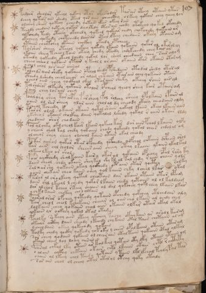

# Voynich Speculative Procedural Protocol — f107r

IMPORTANT: this is NOT a real or validated translation of the Voynich Manuscript. It is a speculative/procedural model that interprets EVA using a user-defined grammar to generate experimental recipes using safe, known edible substitutes.

This file is generated automatically from IVTFF/EVA transliteration plus a user-defined procedural grammar.



## Page / Folio
- currier: B
- folio: f107r
- page_number: 220

## EVA Text (Transliteration)
```text
pchdlar sheolor ykeeol qokchy otor okeesodar tarair oteey otaiin ytar
dchey qoteos aiin shedy oteed qor aiin cheockhy olkeey qotain chey qeeey lor
olcheey cheos qokeeey ycheedy qotain ykain okeey raiin
teeody chedain qoteey qokar deeoltedy otar ain chady otokcho qoked okchedy
olkchedy tedy oteeey okchedy qokeed qokear chedy chokchedy qokain ar
okcheey qokeedy chotchedy daiinar oteey lteey chedaiin ok[che:eee]y otaiin am
ytaiin cheotchey okaiin chckhy okeedy otcheey
torshor sheeey oteeol qokeey qokedy lkaiin qokaiin qokar al okiroley
okaiin sheey tcheol kain okeey chedy okeedy chdykchedy chey kain an
yteedy qokeedy okeol lchedy qokal lor sheal cheedaiin chey sair alo m
cheeo cheeol qokaiin ytain y keeol l oraiin okaiin okar okaiin otaram
y chol chol loraiir aiinal
polchls aiin sheky qokaiin opchal shedy pshedaiin otodal shedy otaral
cthedy lshedy cheolchear or alam chtaiin otarain chey qokaiin otain
ychol oiin chey qockhal ch'al otaraiin sheky okeeey raiin airal
tolshoror olkeedy qotaiin otalar opcheol qeeoy shey kair otaiinam
sair chey losaiin chey
poalosy shey tar aiphy f arsheey fol rolchy sheey opolkaiin ypaiinal
oaiin ol rar sheey ylar aiin cholal dy cheeody okeeey cheodaiin aldy
tcheol kcheedy
taror olal okain okaiin qotal shaiin qokeol lkaiin okeeo lkaiin aiin
yksheol okaiiin shoikhy daiin qotalal lshedy qokal r aiiin okair lldy
chodaiin shar chodaiin
pal alchky okil cheol kair lkain qokeeo kair dar aiinpchod lkaiiin olfy
ycheain chal kal chedy qokaiin chody qokchdy qokal char chdalal om
ol cheor shey cheey olcheol kaiin otair okal cheody
pydar aiiro[d:?] qokiir otiir ofchedy qofchedy qofchol chkaiin chpaiin orol
kar aiin chl cholor sheees aiin cheey otchy lkaiin ykaiin ykalkal
olkeeolkeeo ar shol
pair aiiikheedy shalkaiin kairy okaral qokaiin opaichy opal rary ky
daiin sheol chdy okaiin sheykal shy kl al kal chdy r aiin chain yols
salxar shy qokaiin okal qockhedy okr aiin otar qocthy rolky
yaiin chekain cheo kaiin chey qol kaiiin chky lcheel lkar okal
pairar al oro lkeey qotal cheotain dar okaiin otaiin otar opaim
daiin shl lkeeol lchedy qokor lkaiin chedy qotaiin al ol kaldaim
dar alchor kcheo rkeey chaiin al dal qokchey qokl chey lkaiin lkar
ychklkaiin chckhy cho l olkain
poaral orar ofchey qoteedy qotaiin opchedy qokchey otlchdain aly
tair cheol cheol kchekain cheear [o:a]l oiin cho lkain al oeedy chey
lolkaiin chey qokaiin chal aiin okaiin olkar otair okal okal
qokaiin ar ockhey qokal otal otam
pcholky sokeey aiin oteey ykchey paichy okeey tain ar arodl kairam
okeear aithy daiin sheody ykchedy chykaiin otal taiin chotaiir aram
ycheodain okeey qokeeody qokaiin
podky chedy qockhy qokeedy qokokil y chees opal kaiin otaiin otaram
sar cheey qodaiin qokaiin ol cheor aiin otal taiin qokaiin otal alkal
okain cheey lol loeey [o:a]iinal
fairal chkal lky otain ar kalkal qotain oty lky otaiin ytaiin om
o alain aikhy chkain okair chtl lkaiin okair chtl raithty
chain al lkeey chol taidy qotaiin y taiin lkl lfchal pchdy pal tar
sar ain chol ol cheey otal otal ol otchy qoky otaily
```

## Domain Context (Heuristic; Not a Translation)

This section summarizes recurring **basewords** in this IVTFF domain and shows simple substring evidence that the token markers used by the procedural grammar occur inside frequent words.

Any Italian anagram / English gloss is a best-effort lexicon match, not a decipherment.


### Associated basewords (non-generic; top by frequency in this domain)
- `paiin` (count=241) → Italian anagram `piani`; English: plans (arrangements)
- `qokaiin` (count=122) → Italian anagram `ciancio`; English: [n/a]
- `okaiin` (count=109) → Italian anagram `coniai`; English: [n/a]
- `qokain` (count=101) → Italian anagram `acconi`; English: [n/a]
- `okain` (count=69) → Italian anagram `acino`; English: a berry
- `qokep` (count=65) → Italian anagram `pecco`; English: [n/a]
- `otain` (count=54) → Italian anagram `anito`; English: [n/a]
- `qokar` (count=48) → Italian anagram `carco`; English: [n/a]
- `saiin` (count=48) → Italian anagram `asini`; English: [n/a]
- `qokal` (count=46) → Italian anagram `calco`; English: cast (of sculpture)
- `kaiin` (count=45) → Italian anagram `acini`; English: [n/a]
- `qotaiin` (count=40) → Italian anagram `cationi`; English: [n/a]
- `lkaiin` (count=40) → Italian anagram `ancili`; English: [n/a]
- `qokeol` (count=38) → Italian anagram `eccolo`; English: [n/a]
- `qotain` (count=34) → Italian anagram `antico`; English: ancient

### Marker evidence (substring in frequent basewords)
- `qo`: 63 basewords; examples: `qokee`, `qokeep`, `qokaiin`, `qokain`, `qokep`, `qoke`
- `q`: 64 basewords; examples: `qokee`, `qokeep`, `qokaiin`, `qokain`, `qokep`, `qoke`
- `o`: 281 basewords; examples: `qokee`, `ol`, `o`, `qokeep`, `okee`, `qokaiin`
- `k`: 150 basewords; examples: `qokee`, `qokeep`, `okee`, `qokaiin`, `okaiin`, `qokain`
- `t`: 100 basewords; examples: `otaiin`, `otee`, `otal`, `otar`, `oteep`, `otep`
- `p`: 154 basewords; examples: `paiin`, `chep`, `qokeep`, `shep`, `par`, `oteep`
- `ch`: 144 basewords; examples: `chep`, `che`, `chol`, `chee`, `cheol`, `cheo`
- `sh`: 52 basewords; examples: `shep`, `she`, `shee`, `sheol`, `sheep`, `shol`
- `f`: 2 basewords; examples: `fchep`, `f`
- `cth`: 17 basewords; examples: `chcth`, `cthe`, `shcth`, `checth`, `cthol`, `cthee`
- `ckh`: 18 basewords; examples: `chckh`, `shckh`, `checkh`, `chckhe`, `chockh`, `sheckh`
- `cph`: 3 basewords; examples: `cphol`, `cph`, `cphe`
- `iin`: 38 basewords; examples: `aiin`, `paiin`, `qokaiin`, `okaiin`, `otaiin`, `saiin`
- `aiin`: 31 basewords; examples: `aiin`, `paiin`, `qokaiin`, `okaiin`, `otaiin`, `saiin`

## Recipes Index (This Page)
- [f107r.1,@P0](#f107r-1-f107r-1-p0)
- [f107r.2,+P0](#f107r-2-f107r-2-p0)
- [f107r.3,+P0](#f107r-3-f107r-3-p0)
- [f107r.4,+P0](#f107r-4-f107r-4-p0)
- [f107r.5,+P0](#f107r-5-f107r-5-p0)
- [f107r.6,+P0](#f107r-6-f107r-6-p0)
- [f107r.7,+P0](#f107r-7-f107r-7-p0)
- [f107r.8,+P0](#f107r-8-f107r-8-p0)
- [f107r.9,+P0](#f107r-9-f107r-9-p0)
- [f107r.10,+P0](#f107r-10-f107r-10-p0)
- [f107r.11,+P0](#f107r-11-f107r-11-p0)
- [f107r.12,+P0](#f107r-12-f107r-12-p0)
- [f107r.13,+P0](#f107r-13-f107r-13-p0)
- [f107r.14,+P0](#f107r-14-f107r-14-p0)
- [f107r.15,+P0](#f107r-15-f107r-15-p0)
- [f107r.16,+P0](#f107r-16-f107r-16-p0)
- [f107r.17,+P0](#f107r-17-f107r-17-p0)
- [f107r.18,+P0](#f107r-18-f107r-18-p0)
- [f107r.19,+P0](#f107r-19-f107r-19-p0)
- [f107r.20,+P0](#f107r-20-f107r-20-p0)
- [f107r.21,+P0](#f107r-21-f107r-21-p0)
- [f107r.22,+P0](#f107r-22-f107r-22-p0)
- [f107r.23,+P0](#f107r-23-f107r-23-p0)
- [f107r.24,+P0](#f107r-24-f107r-24-p0)
- [f107r.25,+P0](#f107r-25-f107r-25-p0)
- [f107r.26,+P0](#f107r-26-f107r-26-p0)
- [f107r.27,+P0](#f107r-27-f107r-27-p0)
- [f107r.28,+P0](#f107r-28-f107r-28-p0)
- [f107r.29,+P0](#f107r-29-f107r-29-p0)
- [f107r.30,+P0](#f107r-30-f107r-30-p0)
- [f107r.31,+P0](#f107r-31-f107r-31-p0)
- [f107r.32,+P0](#f107r-32-f107r-32-p0)
- [f107r.33,+P0](#f107r-33-f107r-33-p0)
- [f107r.34,+P0](#f107r-34-f107r-34-p0)
- [f107r.35,+P0](#f107r-35-f107r-35-p0)
- [f107r.36,+P0](#f107r-36-f107r-36-p0)
- [f107r.37,+P0](#f107r-37-f107r-37-p0)
- [f107r.38,+P0](#f107r-38-f107r-38-p0)
- [f107r.39,+P0](#f107r-39-f107r-39-p0)
- [f107r.40,+P0](#f107r-40-f107r-40-p0)
- [f107r.41,+P0](#f107r-41-f107r-41-p0)
- [f107r.42,+P0](#f107r-42-f107r-42-p0)
- [f107r.43,+P0](#f107r-43-f107r-43-p0)
- [f107r.44,+P0](#f107r-44-f107r-44-p0)
- [f107r.45,+P0](#f107r-45-f107r-45-p0)
- [f107r.46,+P0](#f107r-46-f107r-46-p0)
- [f107r.47,+P0](#f107r-47-f107r-47-p0)
- [f107r.48,+P0](#f107r-48-f107r-48-p0)
- [f107r.49,+P0](#f107r-49-f107r-49-p0)
- [f107r.50,+P0](#f107r-50-f107r-50-p0)
- [f107r.51,+P0](#f107r-51-f107r-51-p0)

## Line Glosses (Procedural Gloss Only; Not a Translation)

<a id="f107r-1-f107r-1-p0"></a>

### f107r.1,@P0

EVA: pchdlar sheolor ykeeol qokchy otor okeesodar tarair oteey otaiin ytar

Direct Gloss (Procedural, Not a Real Translation):
- pchdlar: tokens: p ch p l a r → connectors: l r → vowel_run: a (level 1; class a)
- sheolor: tokens: sh e o l o r → connectors: l r → vowel_run: e (level 1; class e)
- ykeeol: tokens: k ee o l → connectors: l → vowel_run: ee (level 2; class e)
- qokchy: tokens: qo k ch
- otor: tokens: o t o r → connectors: r
- okeesodar: tokens: o k ee s o p a r → connectors: s r → vowel_run: ee (level 2; class e)
- tarair: tokens: t a r a i r → connectors: r r → vowel_run: a (level 1; class a)
- oteey: tokens: o t ee → vowel_run: ee (level 2; class e)
- otaiin: tokens: o t aiin → vowel_run: a (level 1; class a) → suffix: aiin
- ytar: tokens: t a r → connectors: r → vowel_run: a (level 1; class a)

<a id="f107r-2-f107r-2-p0"></a>

### f107r.2,+P0

EVA: dchey qoteos aiin shedy oteed qor aiin cheockhy olkeey qotain chey qeeey lor

Direct Gloss (Procedural, Not a Real Translation):
- dchey: tokens: p ch e → vowel_run: e (level 1; class e)
- qoteos: tokens: qo t e o s → connectors: s → vowel_run: e (level 1; class e)
- aiin: tokens: aiin → vowel_run: a (level 1; class a) → suffix: aiin
- shedy: tokens: sh e p → vowel_run: e (level 1; class e)
- oteed: tokens: o t ee p → vowel_run: ee (level 2; class e)
- qor: tokens: qo r → connectors: r
- aiin: tokens: aiin → vowel_run: a (level 1; class a) → suffix: aiin
- cheockhy: tokens: ch e o ckh → vowel_run: e (level 1; class e)
- olkeey: tokens: o l k ee → connectors: l → vowel_run: ee (level 2; class e)
- qotain: tokens: qo t a i n → connectors: n → vowel_run: a (level 1; class a) (lexicon-context: `qotain` → `antico`; ancient)
- chey: tokens: ch e → vowel_run: e (level 1; class e)
- qeeey: tokens: q eee → vowel_run: eee (level 3; class e)
- lor: tokens: l o r → connectors: l r

<a id="f107r-3-f107r-3-p0"></a>

### f107r.3,+P0

EVA: olcheey cheos qokeeey ycheedy qotain ykain okeey raiin

Direct Gloss (Procedural, Not a Real Translation):
- olcheey: tokens: o l ch ee → connectors: l → vowel_run: ee (level 2; class e)
- cheos: tokens: ch e o s → connectors: s → vowel_run: e (level 1; class e)
- qokeeey: tokens: qo k eee → vowel_run: eee (level 3; class e)
- ycheedy: tokens: ch ee p → vowel_run: ee (level 2; class e)
- qotain: tokens: qo t a i n → connectors: n → vowel_run: a (level 1; class a) (lexicon-context: `qotain` → `antico`; ancient)
- ykain: tokens: k a i n → connectors: n → vowel_run: a (level 1; class a)
- okeey: tokens: o k ee → vowel_run: ee (level 2; class e)
- raiin: tokens: r aiin → connectors: r → vowel_run: a (level 1; class a) → suffix: aiin

<a id="f107r-4-f107r-4-p0"></a>

### f107r.4,+P0

EVA: teeody chedain qoteey qokar deeoltedy otar ain chady otokcho qoked okchedy

Direct Gloss (Procedural, Not a Real Translation):
- teeody: tokens: t ee o p → vowel_run: ee (level 2; class e)
- chedain: tokens: ch e p a i n → connectors: n → vowel_run: e (level 1; class e)
- qoteey: tokens: qo t ee → vowel_run: ee (level 2; class e)
- qokar: tokens: qo k a r → connectors: r → vowel_run: a (level 1; class a)
- deeoltedy: tokens: p ee o l t e p → connectors: l → vowel_run: ee (level 2; class e)
- otar: tokens: o t a r → connectors: r → vowel_run: a (level 1; class a)
- ain: tokens: a i n → connectors: n → vowel_run: a (level 1; class a)
- chady: tokens: ch a p → vowel_run: a (level 1; class a)
- otokcho: tokens: o t o k ch o
- qoked: tokens: qo k e p → vowel_run: e (level 1; class e) (lexicon-context: `qokep` → `pecco`; [n/a])
- okchedy: tokens: o k ch e p → vowel_run: e (level 1; class e)

<a id="f107r-5-f107r-5-p0"></a>

### f107r.5,+P0

EVA: olkchedy tedy oteeey okchedy qokeed qokear chedy chokchedy qokain ar

Direct Gloss (Procedural, Not a Real Translation):
- olkchedy: tokens: o l k ch e p → connectors: l → vowel_run: e (level 1; class e)
- tedy: tokens: t e p → vowel_run: e (level 1; class e)
- oteeey: tokens: o t eee → vowel_run: eee (level 3; class e)
- okchedy: tokens: o k ch e p → vowel_run: e (level 1; class e)
- qokeed: tokens: qo k ee p → vowel_run: ee (level 2; class e)
- qokear: tokens: qo k e a r → connectors: r → vowel_run: e (level 1; class e)
- chedy: tokens: ch e p → vowel_run: e (level 1; class e)
- chokchedy: tokens: ch o k ch e p → vowel_run: e (level 1; class e)
- qokain: tokens: qo k a i n → connectors: n → vowel_run: a (level 1; class a) (lexicon-context: `qokain` → `concia`; tanning)
- ar: tokens: a r → connectors: r → vowel_run: a (level 1; class a)

<a id="f107r-6-f107r-6-p0"></a>

### f107r.6,+P0

EVA: okcheey qokeedy chotchedy daiinar oteey lteey chedaiin ok[che:eee]y otaiin am

Direct Gloss (Procedural, Not a Real Translation):
- okcheey: tokens: o k ch ee → vowel_run: ee (level 2; class e)
- qokeedy: tokens: qo k ee p → vowel_run: ee (level 2; class e)
- chotchedy: tokens: ch o t ch e p → vowel_run: e (level 1; class e)
- daiinar: tokens: p aiin a r → connectors: r → vowel_run: a (level 1; class a) → suffix: aiin (lexicon-context: `paiin` → `piani`; plans (arrangements))
- oteey: tokens: o t ee → vowel_run: ee (level 2; class e)
- lteey: tokens: l t ee → connectors: l → vowel_run: ee (level 2; class e)
- chedaiin: tokens: ch e p aiin → vowel_run: e (level 1; class e) → suffix: aiin (lexicon-context: `paiin` → `piani`; plans (arrangements))
- ok: tokens: o k
- che: tokens: ch e → vowel_run: e (level 1; class e)
- eee: tokens: eee → vowel_run: eee (level 3; class e)
- y: [unparsed]
- otaiin: tokens: o t aiin → vowel_run: a (level 1; class a) → suffix: aiin
- am: tokens: a m → connectors: m → vowel_run: a (level 1; class a)

<a id="f107r-7-f107r-7-p0"></a>

### f107r.7,+P0

EVA: ytaiin cheotchey okaiin chckhy okeedy otcheey

Direct Gloss (Procedural, Not a Real Translation):
- ytaiin: tokens: t aiin → vowel_run: a (level 1; class a) → suffix: aiin
- cheotchey: tokens: ch e o t ch e → vowel_run: e (level 1; class e)
- okaiin: tokens: o k aiin → vowel_run: a (level 1; class a) → suffix: aiin (lexicon-context: `okaiin` → `coniai`; [n/a])
- chckhy: tokens: ch ckh
- okeedy: tokens: o k ee p → vowel_run: ee (level 2; class e)
- otcheey: tokens: o t ch ee → vowel_run: ee (level 2; class e)

<a id="f107r-8-f107r-8-p0"></a>

### f107r.8,+P0

EVA: torshor sheeey oteeol qokeey qokedy lkaiin qokaiin qokar al okiroley

Direct Gloss (Procedural, Not a Real Translation):
- torshor: tokens: t o r sh o r → connectors: r r
- sheeey: tokens: sh eee → vowel_run: eee (level 3; class e)
- oteeol: tokens: o t ee o l → connectors: l → vowel_run: ee (level 2; class e)
- qokeey: tokens: qo k ee → vowel_run: ee (level 2; class e)
- qokedy: tokens: qo k e p → vowel_run: e (level 1; class e) (lexicon-context: `qokep` → `pecco`; [n/a])
- lkaiin: tokens: l k aiin → connectors: l → vowel_run: a (level 1; class a) → suffix: aiin (lexicon-context: `lkaiin` → `canili`; [n/a])
- qokaiin: tokens: qo k aiin → vowel_run: a (level 1; class a) → suffix: aiin (lexicon-context: `qokaiin` → `conciai`; [n/a])
- qokar: tokens: qo k a r → connectors: r → vowel_run: a (level 1; class a)
- al: tokens: a l → connectors: l → vowel_run: a (level 1; class a)
- okiroley: tokens: o k i r o l e → connectors: r l → vowel_run: i (level 1; class i)

<a id="f107r-9-f107r-9-p0"></a>

### f107r.9,+P0

EVA: okaiin sheey tcheol kain okeey chedy okeedy chdykchedy chey kain an

Direct Gloss (Procedural, Not a Real Translation):
- okaiin: tokens: o k aiin → vowel_run: a (level 1; class a) → suffix: aiin (lexicon-context: `okaiin` → `coniai`; [n/a])
- sheey: tokens: sh ee → vowel_run: ee (level 2; class e)
- tcheol: tokens: t ch e o l → connectors: l → vowel_run: e (level 1; class e)
- kain: tokens: k a i n → connectors: n → vowel_run: a (level 1; class a)
- okeey: tokens: o k ee → vowel_run: ee (level 2; class e)
- chedy: tokens: ch e p → vowel_run: e (level 1; class e)
- okeedy: tokens: o k ee p → vowel_run: ee (level 2; class e)
- chdykchedy: tokens: ch p k ch e p → vowel_run: e (level 1; class e)
- chey: tokens: ch e → vowel_run: e (level 1; class e)
- kain: tokens: k a i n → connectors: n → vowel_run: a (level 1; class a)
- an: tokens: a n → connectors: n → vowel_run: a (level 1; class a)

<a id="f107r-10-f107r-10-p0"></a>

### f107r.10,+P0

EVA: yteedy qokeedy okeol lchedy qokal lor sheal cheedaiin chey sair alo m

Direct Gloss (Procedural, Not a Real Translation):
- yteedy: tokens: t ee p → vowel_run: ee (level 2; class e)
- qokeedy: tokens: qo k ee p → vowel_run: ee (level 2; class e)
- okeol: tokens: o k e o l → connectors: l → vowel_run: e (level 1; class e)
- lchedy: tokens: l ch e p → connectors: l → vowel_run: e (level 1; class e)
- qokal: tokens: qo k a l → connectors: l → vowel_run: a (level 1; class a) (lexicon-context: `qokal` → `calco`; cast (of sculpture))
- lor: tokens: l o r → connectors: l r
- sheal: tokens: sh e a l → connectors: l → vowel_run: e (level 1; class e)
- cheedaiin: tokens: ch ee p aiin → vowel_run: ee (level 2; class e) → suffix: aiin (lexicon-context: `paiin` → `piani`; plans (arrangements))
- chey: tokens: ch e → vowel_run: e (level 1; class e)
- sair: tokens: s a i r → connectors: s r → vowel_run: a (level 1; class a)
- alo: tokens: a l o → connectors: l → vowel_run: a (level 1; class a)
- m: tokens: m → connectors: m

<a id="f107r-11-f107r-11-p0"></a>

### f107r.11,+P0

EVA: cheeo cheeol qokaiin ytain y keeol l oraiin okaiin okar okaiin otaram

Direct Gloss (Procedural, Not a Real Translation):
- cheeo: tokens: ch ee o → vowel_run: ee (level 2; class e)
- cheeol: tokens: ch ee o l → connectors: l → vowel_run: ee (level 2; class e)
- qokaiin: tokens: qo k aiin → vowel_run: a (level 1; class a) → suffix: aiin (lexicon-context: `qokaiin` → `conciai`; [n/a])
- ytain: tokens: t a i n → connectors: n → vowel_run: a (level 1; class a)
- y: [unparsed]
- keeol: tokens: k ee o l → connectors: l → vowel_run: ee (level 2; class e)
- l: tokens: l → connectors: l
- oraiin: tokens: o r aiin → connectors: r → vowel_run: a (level 1; class a) → suffix: aiin (lexicon-context: `oraiin` → `ironia`; irony)
- okaiin: tokens: o k aiin → vowel_run: a (level 1; class a) → suffix: aiin (lexicon-context: `okaiin` → `coniai`; [n/a])
- okar: tokens: o k a r → connectors: r → vowel_run: a (level 1; class a)
- okaiin: tokens: o k aiin → vowel_run: a (level 1; class a) → suffix: aiin (lexicon-context: `okaiin` → `coniai`; [n/a])
- otaram: tokens: o t a r a m → connectors: r m → vowel_run: a (level 1; class a)

<a id="f107r-12-f107r-12-p0"></a>

### f107r.12,+P0

EVA: y chol chol loraiir aiinal

Direct Gloss (Procedural, Not a Real Translation):
- y: [unparsed]
- chol: tokens: ch o l → connectors: l
- chol: tokens: ch o l → connectors: l
- loraiir: tokens: l o r a ii r → connectors: l r r → vowel_run: a (level 1; class a)
- aiinal: tokens: aiin a l → connectors: l → vowel_run: a (level 1; class a) → suffix: aiin

<a id="f107r-13-f107r-13-p0"></a>

### f107r.13,+P0

EVA: polchls aiin sheky qokaiin opchal shedy pshedaiin otodal shedy otaral

Direct Gloss (Procedural, Not a Real Translation):
- polchls: tokens: p o l ch l s → connectors: l l s
- aiin: tokens: aiin → vowel_run: a (level 1; class a) → suffix: aiin
- sheky: tokens: sh e k → vowel_run: e (level 1; class e)
- qokaiin: tokens: qo k aiin → vowel_run: a (level 1; class a) → suffix: aiin (lexicon-context: `qokaiin` → `conciai`; [n/a])
- opchal: tokens: o p ch a l → connectors: l → vowel_run: a (level 1; class a)
- shedy: tokens: sh e p → vowel_run: e (level 1; class e)
- pshedaiin: tokens: p sh e p aiin → vowel_run: e (level 1; class e) → suffix: aiin (lexicon-context: `paiin` → `piani`; plans (arrangements))
- otodal: tokens: o t o p a l → connectors: l → vowel_run: a (level 1; class a)
- shedy: tokens: sh e p → vowel_run: e (level 1; class e)
- otaral: tokens: o t a r a l → connectors: r l → vowel_run: a (level 1; class a)

<a id="f107r-14-f107r-14-p0"></a>

### f107r.14,+P0

EVA: cthedy lshedy cheolchear or alam chtaiin otarain chey qokaiin otain

Direct Gloss (Procedural, Not a Real Translation):
- cthedy: tokens: cth e p → vowel_run: e (level 1; class e)
- lshedy: tokens: l sh e p → connectors: l → vowel_run: e (level 1; class e)
- cheolchear: tokens: ch e o l ch e a r → connectors: l r → vowel_run: e (level 1; class e)
- or: tokens: o r → connectors: r
- alam: tokens: a l a m → connectors: l m → vowel_run: a (level 1; class a)
- chtaiin: tokens: ch t aiin → vowel_run: a (level 1; class a) → suffix: aiin
- otarain: tokens: o t a r a i n → connectors: r n → vowel_run: a (level 1; class a)
- chey: tokens: ch e → vowel_run: e (level 1; class e)
- qokaiin: tokens: qo k aiin → vowel_run: a (level 1; class a) → suffix: aiin (lexicon-context: `qokaiin` → `conciai`; [n/a])
- otain: tokens: o t a i n → connectors: n → vowel_run: a (level 1; class a) (lexicon-context: `otain` → `notai`; [n/a])

<a id="f107r-15-f107r-15-p0"></a>

### f107r.15,+P0

EVA: ychol oiin chey qockhal ch'al otaraiin sheky okeeey raiin airal

Direct Gloss (Procedural, Not a Real Translation):
- ychol: tokens: ch o l → connectors: l
- oiin: tokens: o iin → vowel_run: ii (level 2; class i) → suffix: iin
- chey: tokens: ch e → vowel_run: e (level 1; class e)
- qockhal: tokens: qo ckh a l → connectors: l → vowel_run: a (level 1; class a)
- ch: tokens: ch
- al: tokens: a l → connectors: l → vowel_run: a (level 1; class a)
- otaraiin: tokens: o t a r aiin → connectors: r → vowel_run: a (level 1; class a) → suffix: aiin
- sheky: tokens: sh e k → vowel_run: e (level 1; class e)
- okeeey: tokens: o k eee → vowel_run: eee (level 3; class e)
- raiin: tokens: r aiin → connectors: r → vowel_run: a (level 1; class a) → suffix: aiin
- airal: tokens: a i r a l → connectors: r l → vowel_run: a (level 1; class a)

<a id="f107r-16-f107r-16-p0"></a>

### f107r.16,+P0

EVA: tolshoror olkeedy qotaiin otalar opcheol qeeoy shey kair otaiinam

Direct Gloss (Procedural, Not a Real Translation):
- tolshoror: tokens: t o l sh o r o r → connectors: l r r
- olkeedy: tokens: o l k ee p → connectors: l → vowel_run: ee (level 2; class e)
- qotaiin: tokens: qo t aiin → vowel_run: a (level 1; class a) → suffix: aiin (lexicon-context: `qotaiin` → `coniati`; [n/a])
- otalar: tokens: o t a l a r → connectors: l r → vowel_run: a (level 1; class a)
- opcheol: tokens: o p ch e o l → connectors: l → vowel_run: e (level 1; class e)
- qeeoy: tokens: q ee o → vowel_run: ee (level 2; class e)
- shey: tokens: sh e → vowel_run: e (level 1; class e)
- kair: tokens: k a i r → connectors: r → vowel_run: a (level 1; class a)
- otaiinam: tokens: o t aiin a m → connectors: m → vowel_run: a (level 1; class a) → suffix: aiin

<a id="f107r-17-f107r-17-p0"></a>

### f107r.17,+P0

EVA: sair chey losaiin chey

Direct Gloss (Procedural, Not a Real Translation):
- sair: tokens: s a i r → connectors: s r → vowel_run: a (level 1; class a)
- chey: tokens: ch e → vowel_run: e (level 1; class e)
- losaiin: tokens: l o s aiin → connectors: l s → vowel_run: a (level 1; class a) → suffix: aiin (lexicon-context: `saiin` → `asini`; [n/a])
- chey: tokens: ch e → vowel_run: e (level 1; class e)

<a id="f107r-18-f107r-18-p0"></a>

### f107r.18,+P0

EVA: poalosy shey tar aiphy f arsheey fol rolchy sheey opolkaiin ypaiinal

Direct Gloss (Procedural, Not a Real Translation):
- poalosy: tokens: p o a l o s → connectors: l s → vowel_run: a (level 1; class a)
- shey: tokens: sh e → vowel_run: e (level 1; class e)
- tar: tokens: t a r → connectors: r → vowel_run: a (level 1; class a)
- aiphy: tokens: a i p h → vowel_run: a (level 1; class a) → unmodeled_tokens: h
- f: tokens: f
- arsheey: tokens: a r sh ee → connectors: r → vowel_run: a (level 1; class a)
- fol: tokens: f o l → connectors: l
- rolchy: tokens: r o l ch → connectors: r l
- sheey: tokens: sh ee → vowel_run: ee (level 2; class e)
- opolkaiin: tokens: o p o l k aiin → connectors: l → vowel_run: a (level 1; class a) → suffix: aiin (lexicon-context: `lkaiin` → `canili`; [n/a])
- ypaiinal: tokens: p aiin a l → connectors: l → vowel_run: a (level 1; class a) → suffix: aiin (lexicon-context: `paiin` → `piani`; plans (arrangements))

<a id="f107r-19-f107r-19-p0"></a>

### f107r.19,+P0

EVA: oaiin ol rar sheey ylar aiin cholal dy cheeody okeeey cheodaiin aldy

Direct Gloss (Procedural, Not a Real Translation):
- oaiin: tokens: o aiin → vowel_run: a (level 1; class a) → suffix: aiin
- ol: tokens: o l → connectors: l
- rar: tokens: r a r → connectors: r r → vowel_run: a (level 1; class a)
- sheey: tokens: sh ee → vowel_run: ee (level 2; class e)
- ylar: tokens: l a r → connectors: l r → vowel_run: a (level 1; class a)
- aiin: tokens: aiin → vowel_run: a (level 1; class a) → suffix: aiin
- cholal: tokens: ch o l a l → connectors: l l → vowel_run: a (level 1; class a)
- dy: tokens: p
- cheeody: tokens: ch ee o p → vowel_run: ee (level 2; class e)
- okeeey: tokens: o k eee → vowel_run: eee (level 3; class e)
- cheodaiin: tokens: ch e o p aiin → vowel_run: e (level 1; class e) → suffix: aiin (lexicon-context: `opaiin` → `opinai`; [n/a])
- aldy: tokens: a l p → connectors: l → vowel_run: a (level 1; class a)

<a id="f107r-20-f107r-20-p0"></a>

### f107r.20,+P0

EVA: tcheol kcheedy

Direct Gloss (Procedural, Not a Real Translation):
- tcheol: tokens: t ch e o l → connectors: l → vowel_run: e (level 1; class e)
- kcheedy: tokens: k ch ee p → vowel_run: ee (level 2; class e)

<a id="f107r-21-f107r-21-p0"></a>

### f107r.21,+P0

EVA: taror olal okain okaiin qotal shaiin qokeol lkaiin okeeo lkaiin aiin

Direct Gloss (Procedural, Not a Real Translation):
- taror: tokens: t a r o r → connectors: r r → vowel_run: a (level 1; class a)
- olal: tokens: o l a l → connectors: l l → vowel_run: a (level 1; class a)
- okain: tokens: o k a i n → connectors: n → vowel_run: a (level 1; class a) (lexicon-context: `okain` → `conia`; [n/a])
- okaiin: tokens: o k aiin → vowel_run: a (level 1; class a) → suffix: aiin (lexicon-context: `okaiin` → `coniai`; [n/a])
- qotal: tokens: qo t a l → connectors: l → vowel_run: a (level 1; class a) (lexicon-context: `qotal` → `colta`; [n/a])
- shaiin: tokens: sh aiin → vowel_run: a (level 1; class a) → suffix: aiin
- qokeol: tokens: qo k e o l → connectors: l → vowel_run: e (level 1; class e)
- lkaiin: tokens: l k aiin → connectors: l → vowel_run: a (level 1; class a) → suffix: aiin (lexicon-context: `lkaiin` → `canili`; [n/a])
- okeeo: tokens: o k ee o → vowel_run: ee (level 2; class e)
- lkaiin: tokens: l k aiin → connectors: l → vowel_run: a (level 1; class a) → suffix: aiin (lexicon-context: `lkaiin` → `canili`; [n/a])
- aiin: tokens: aiin → vowel_run: a (level 1; class a) → suffix: aiin

<a id="f107r-22-f107r-22-p0"></a>

### f107r.22,+P0

EVA: yksheol okaiiin shoikhy daiin qotalal lshedy qokal r aiiin okair lldy

Direct Gloss (Procedural, Not a Real Translation):
- yksheol: tokens: k sh e o l → connectors: l → vowel_run: e (level 1; class e)
- okaiiin: tokens: o k a iii n → connectors: n → vowel_run: a (level 1; class a) → suffix: iin
- shoikhy: tokens: sh o i k h → vowel_run: i (level 1; class i) → unmodeled_tokens: h
- daiin: tokens: p aiin → vowel_run: a (level 1; class a) → suffix: aiin (lexicon-context: `paiin` → `piani`; plans (arrangements))
- qotalal: tokens: qo t a l a l → connectors: l l → vowel_run: a (level 1; class a) (lexicon-context: `qotal` → `colta`; [n/a])
- lshedy: tokens: l sh e p → connectors: l → vowel_run: e (level 1; class e)
- qokal: tokens: qo k a l → connectors: l → vowel_run: a (level 1; class a) (lexicon-context: `qokal` → `calco`; cast (of sculpture))
- r: tokens: r → connectors: r
- aiiin: tokens: a iii n → connectors: n → vowel_run: a (level 1; class a) → suffix: iin
- okair: tokens: o k a i r → connectors: r → vowel_run: a (level 1; class a)
- lldy: tokens: l l p → connectors: l l

<a id="f107r-23-f107r-23-p0"></a>

### f107r.23,+P0

EVA: chodaiin shar chodaiin

Direct Gloss (Procedural, Not a Real Translation):
- chodaiin: tokens: ch o p aiin → vowel_run: a (level 1; class a) → suffix: aiin
- shar: tokens: sh a r → connectors: r → vowel_run: a (level 1; class a)
- chodaiin: tokens: ch o p aiin → vowel_run: a (level 1; class a) → suffix: aiin

<a id="f107r-24-f107r-24-p0"></a>

### f107r.24,+P0

EVA: pal alchky okil cheol kair lkain qokeeo kair dar aiinpchod lkaiiin olfy

Direct Gloss (Procedural, Not a Real Translation):
- pal: tokens: p a l → connectors: l → vowel_run: a (level 1; class a)
- alchky: tokens: a l ch k → connectors: l → vowel_run: a (level 1; class a)
- okil: tokens: o k i l → connectors: l → vowel_run: i (level 1; class i)
- cheol: tokens: ch e o l → connectors: l → vowel_run: e (level 1; class e)
- kair: tokens: k a i r → connectors: r → vowel_run: a (level 1; class a)
- lkain: tokens: l k a i n → connectors: l n → vowel_run: a (level 1; class a) (lexicon-context: `lkain` → `lanci`; [n/a])
- qokeeo: tokens: qo k ee o → vowel_run: ee (level 2; class e)
- kair: tokens: k a i r → connectors: r → vowel_run: a (level 1; class a)
- dar: tokens: p a r → connectors: r → vowel_run: a (level 1; class a)
- aiinpchod: tokens: aiin p ch o p → vowel_run: a (level 1; class a) → suffix: aiin
- lkaiiin: tokens: l k a iii n → connectors: l n → vowel_run: a (level 1; class a) → suffix: iin
- olfy: tokens: o l f → connectors: l

<a id="f107r-25-f107r-25-p0"></a>

### f107r.25,+P0

EVA: ycheain chal kal chedy qokaiin chody qokchdy qokal char chdalal om

Direct Gloss (Procedural, Not a Real Translation):
- ycheain: tokens: ch e a i n → connectors: n → vowel_run: e (level 1; class e)
- chal: tokens: ch a l → connectors: l → vowel_run: a (level 1; class a)
- kal: tokens: k a l → connectors: l → vowel_run: a (level 1; class a)
- chedy: tokens: ch e p → vowel_run: e (level 1; class e)
- qokaiin: tokens: qo k aiin → vowel_run: a (level 1; class a) → suffix: aiin (lexicon-context: `qokaiin` → `conciai`; [n/a])
- chody: tokens: ch o p
- qokchdy: tokens: qo k ch p
- qokal: tokens: qo k a l → connectors: l → vowel_run: a (level 1; class a) (lexicon-context: `qokal` → `calco`; cast (of sculpture))
- char: tokens: ch a r → connectors: r → vowel_run: a (level 1; class a)
- chdalal: tokens: ch p a l a l → connectors: l l → vowel_run: a (level 1; class a)
- om: tokens: o m → connectors: m

<a id="f107r-26-f107r-26-p0"></a>

### f107r.26,+P0

EVA: ol cheor shey cheey olcheol kaiin otair okal cheody

Direct Gloss (Procedural, Not a Real Translation):
- ol: tokens: o l → connectors: l
- cheor: tokens: ch e o r → connectors: r → vowel_run: e (level 1; class e)
- shey: tokens: sh e → vowel_run: e (level 1; class e)
- cheey: tokens: ch ee → vowel_run: ee (level 2; class e)
- olcheol: tokens: o l ch e o l → connectors: l l → vowel_run: e (level 1; class e)
- kaiin: tokens: k aiin → vowel_run: a (level 1; class a) → suffix: aiin
- otair: tokens: o t a i r → connectors: r → vowel_run: a (level 1; class a) (lexicon-context: `otair` → `atrio`; entrance hall, lobby (of a hotel etc.))
- okal: tokens: o k a l → connectors: l → vowel_run: a (level 1; class a)
- cheody: tokens: ch e o p → vowel_run: e (level 1; class e)

<a id="f107r-27-f107r-27-p0"></a>

### f107r.27,+P0

EVA: pydar aiiro[d:?] qokiir otiir ofchedy qofchedy qofchol chkaiin chpaiin orol

Direct Gloss (Procedural, Not a Real Translation):
- pydar: tokens: p p a r → connectors: r → vowel_run: a (level 1; class a)
- aiiro: tokens: a ii r o → connectors: r → vowel_run: a (level 1; class a)
- d: tokens: p
- qokiir: tokens: qo k ii r → connectors: r → vowel_run: ii (level 2; class i)
- otiir: tokens: o t ii r → connectors: r → vowel_run: ii (level 2; class i)
- ofchedy: tokens: o f ch e p → vowel_run: e (level 1; class e)
- qofchedy: tokens: qo f ch e p → vowel_run: e (level 1; class e)
- qofchol: tokens: qo f ch o l → connectors: l
- chkaiin: tokens: ch k aiin → vowel_run: a (level 1; class a) → suffix: aiin
- chpaiin: tokens: ch p aiin → vowel_run: a (level 1; class a) → suffix: aiin (lexicon-context: `paiin` → `piani`; plans (arrangements))
- orol: tokens: o r o l → connectors: r l

<a id="f107r-28-f107r-28-p0"></a>

### f107r.28,+P0

EVA: kar aiin chl cholor sheees aiin cheey otchy lkaiin ykaiin ykalkal

Direct Gloss (Procedural, Not a Real Translation):
- kar: tokens: k a r → connectors: r → vowel_run: a (level 1; class a)
- aiin: tokens: aiin → vowel_run: a (level 1; class a) → suffix: aiin
- chl: tokens: ch l → connectors: l
- cholor: tokens: ch o l o r → connectors: l r
- sheees: tokens: sh eee s → connectors: s → vowel_run: eee (level 3; class e)
- aiin: tokens: aiin → vowel_run: a (level 1; class a) → suffix: aiin
- cheey: tokens: ch ee → vowel_run: ee (level 2; class e)
- otchy: tokens: o t ch
- lkaiin: tokens: l k aiin → connectors: l → vowel_run: a (level 1; class a) → suffix: aiin (lexicon-context: `lkaiin` → `canili`; [n/a])
- ykaiin: tokens: k aiin → vowel_run: a (level 1; class a) → suffix: aiin
- ykalkal: tokens: k a l k a l → connectors: l l → vowel_run: a (level 1; class a)

<a id="f107r-29-f107r-29-p0"></a>

### f107r.29,+P0

EVA: olkeeolkeeo ar shol

Direct Gloss (Procedural, Not a Real Translation):
- olkeeolkeeo: tokens: o l k ee o l k ee o → connectors: l l → vowel_run: ee (level 2; class e)
- ar: tokens: a r → connectors: r → vowel_run: a (level 1; class a)
- shol: tokens: sh o l → connectors: l

<a id="f107r-30-f107r-30-p0"></a>

### f107r.30,+P0

EVA: pair aiiikheedy shalkaiin kairy okaral qokaiin opaichy opal rary ky

Direct Gloss (Procedural, Not a Real Translation):
- pair: tokens: p a i r → connectors: r → vowel_run: a (level 1; class a)
- aiiikheedy: tokens: a iii k h ee p → vowel_run: a (level 1; class a) → unmodeled_tokens: h
- shalkaiin: tokens: sh a l k aiin → connectors: l → vowel_run: a (level 1; class a) → suffix: aiin (lexicon-context: `lkaiin` → `canili`; [n/a])
- kairy: tokens: k a i r → connectors: r → vowel_run: a (level 1; class a)
- okaral: tokens: o k a r a l → connectors: r l → vowel_run: a (level 1; class a)
- qokaiin: tokens: qo k aiin → vowel_run: a (level 1; class a) → suffix: aiin (lexicon-context: `qokaiin` → `conciai`; [n/a])
- opaichy: tokens: o p a i ch → vowel_run: a (level 1; class a)
- opal: tokens: o p a l → connectors: l → vowel_run: a (level 1; class a)
- rary: tokens: r a r → connectors: r r → vowel_run: a (level 1; class a)
- ky: tokens: k

<a id="f107r-31-f107r-31-p0"></a>

### f107r.31,+P0

EVA: daiin sheol chdy okaiin sheykal shy kl al kal chdy r aiin chain yols

Direct Gloss (Procedural, Not a Real Translation):
- daiin: tokens: p aiin → vowel_run: a (level 1; class a) → suffix: aiin (lexicon-context: `paiin` → `piani`; plans (arrangements))
- sheol: tokens: sh e o l → connectors: l → vowel_run: e (level 1; class e)
- chdy: tokens: ch p
- okaiin: tokens: o k aiin → vowel_run: a (level 1; class a) → suffix: aiin (lexicon-context: `okaiin` → `coniai`; [n/a])
- sheykal: tokens: sh e k a l → connectors: l → vowel_run: e (level 1; class e)
- shy: tokens: sh
- kl: tokens: k l → connectors: l
- al: tokens: a l → connectors: l → vowel_run: a (level 1; class a)
- kal: tokens: k a l → connectors: l → vowel_run: a (level 1; class a)
- chdy: tokens: ch p
- r: tokens: r → connectors: r
- aiin: tokens: aiin → vowel_run: a (level 1; class a) → suffix: aiin
- chain: tokens: ch a i n → connectors: n → vowel_run: a (level 1; class a)
- yols: tokens: o l s → connectors: l s

<a id="f107r-32-f107r-32-p0"></a>

### f107r.32,+P0

EVA: salxar shy qokaiin okal qockhedy okr aiin otar qocthy rolky

Direct Gloss (Procedural, Not a Real Translation):
- salxar: tokens: s a l x a r → connectors: s l r → vowel_run: a (level 1; class a)
- shy: tokens: sh
- qokaiin: tokens: qo k aiin → vowel_run: a (level 1; class a) → suffix: aiin (lexicon-context: `qokaiin` → `conciai`; [n/a])
- okal: tokens: o k a l → connectors: l → vowel_run: a (level 1; class a)
- qockhedy: tokens: qo ckh e p → vowel_run: e (level 1; class e)
- okr: tokens: o k r → connectors: r
- aiin: tokens: aiin → vowel_run: a (level 1; class a) → suffix: aiin
- otar: tokens: o t a r → connectors: r → vowel_run: a (level 1; class a)
- qocthy: tokens: qo cth
- rolky: tokens: r o l k → connectors: r l

<a id="f107r-33-f107r-33-p0"></a>

### f107r.33,+P0

EVA: yaiin chekain cheo kaiin chey qol kaiiin chky lcheel lkar okal

Direct Gloss (Procedural, Not a Real Translation):
- yaiin: tokens: aiin → vowel_run: a (level 1; class a) → suffix: aiin
- chekain: tokens: ch e k a i n → connectors: n → vowel_run: e (level 1; class e)
- cheo: tokens: ch e o → vowel_run: e (level 1; class e)
- kaiin: tokens: k aiin → vowel_run: a (level 1; class a) → suffix: aiin
- chey: tokens: ch e → vowel_run: e (level 1; class e)
- qol: tokens: qo l → connectors: l
- kaiiin: tokens: k a iii n → connectors: n → vowel_run: a (level 1; class a) → suffix: iin
- chky: tokens: ch k
- lcheel: tokens: l ch ee l → connectors: l l → vowel_run: ee (level 2; class e)
- lkar: tokens: l k a r → connectors: l r → vowel_run: a (level 1; class a)
- okal: tokens: o k a l → connectors: l → vowel_run: a (level 1; class a)

<a id="f107r-34-f107r-34-p0"></a>

### f107r.34,+P0

EVA: pairar al oro lkeey qotal cheotain dar okaiin otaiin otar opaim

Direct Gloss (Procedural, Not a Real Translation):
- pairar: tokens: p a i r a r → connectors: r r → vowel_run: a (level 1; class a)
- al: tokens: a l → connectors: l → vowel_run: a (level 1; class a)
- oro: tokens: o r o → connectors: r
- lkeey: tokens: l k ee → connectors: l → vowel_run: ee (level 2; class e)
- qotal: tokens: qo t a l → connectors: l → vowel_run: a (level 1; class a) (lexicon-context: `qotal` → `colta`; [n/a])
- cheotain: tokens: ch e o t a i n → connectors: n → vowel_run: e (level 1; class e) (lexicon-context: `otain` → `notai`; [n/a])
- dar: tokens: p a r → connectors: r → vowel_run: a (level 1; class a)
- okaiin: tokens: o k aiin → vowel_run: a (level 1; class a) → suffix: aiin (lexicon-context: `okaiin` → `coniai`; [n/a])
- otaiin: tokens: o t aiin → vowel_run: a (level 1; class a) → suffix: aiin
- otar: tokens: o t a r → connectors: r → vowel_run: a (level 1; class a)
- opaim: tokens: o p a i m → connectors: m → vowel_run: a (level 1; class a)

<a id="f107r-35-f107r-35-p0"></a>

### f107r.35,+P0

EVA: daiin shl lkeeol lchedy qokor lkaiin chedy qotaiin al ol kaldaim

Direct Gloss (Procedural, Not a Real Translation):
- daiin: tokens: p aiin → vowel_run: a (level 1; class a) → suffix: aiin (lexicon-context: `paiin` → `piani`; plans (arrangements))
- shl: tokens: sh l → connectors: l
- lkeeol: tokens: l k ee o l → connectors: l l → vowel_run: ee (level 2; class e)
- lchedy: tokens: l ch e p → connectors: l → vowel_run: e (level 1; class e)
- qokor: tokens: qo k o r → connectors: r
- lkaiin: tokens: l k aiin → connectors: l → vowel_run: a (level 1; class a) → suffix: aiin (lexicon-context: `lkaiin` → `canili`; [n/a])
- chedy: tokens: ch e p → vowel_run: e (level 1; class e)
- qotaiin: tokens: qo t aiin → vowel_run: a (level 1; class a) → suffix: aiin (lexicon-context: `qotaiin` → `coniati`; [n/a])
- al: tokens: a l → connectors: l → vowel_run: a (level 1; class a)
- ol: tokens: o l → connectors: l
- kaldaim: tokens: k a l p a i m → connectors: l m → vowel_run: a (level 1; class a)

<a id="f107r-36-f107r-36-p0"></a>

### f107r.36,+P0

EVA: dar alchor kcheo rkeey chaiin al dal qokchey qokl chey lkaiin lkar

Direct Gloss (Procedural, Not a Real Translation):
- dar: tokens: p a r → connectors: r → vowel_run: a (level 1; class a)
- alchor: tokens: a l ch o r → connectors: l r → vowel_run: a (level 1; class a)
- kcheo: tokens: k ch e o → vowel_run: e (level 1; class e)
- rkeey: tokens: r k ee → connectors: r → vowel_run: ee (level 2; class e)
- chaiin: tokens: ch aiin → vowel_run: a (level 1; class a) → suffix: aiin
- al: tokens: a l → connectors: l → vowel_run: a (level 1; class a)
- dal: tokens: p a l → connectors: l → vowel_run: a (level 1; class a)
- qokchey: tokens: qo k ch e → vowel_run: e (level 1; class e)
- qokl: tokens: qo k l → connectors: l
- chey: tokens: ch e → vowel_run: e (level 1; class e)
- lkaiin: tokens: l k aiin → connectors: l → vowel_run: a (level 1; class a) → suffix: aiin (lexicon-context: `lkaiin` → `canili`; [n/a])
- lkar: tokens: l k a r → connectors: l r → vowel_run: a (level 1; class a)

<a id="f107r-37-f107r-37-p0"></a>

### f107r.37,+P0

EVA: ychklkaiin chckhy cho l olkain

Direct Gloss (Procedural, Not a Real Translation):
- ychklkaiin: tokens: ch k l k aiin → connectors: l → vowel_run: a (level 1; class a) → suffix: aiin (lexicon-context: `lkaiin` → `canili`; [n/a])
- chckhy: tokens: ch ckh
- cho: tokens: ch o
- l: tokens: l → connectors: l
- olkain: tokens: o l k a i n → connectors: l n → vowel_run: a (level 1; class a) (lexicon-context: `lkain` → `lanci`; [n/a])

<a id="f107r-38-f107r-38-p0"></a>

### f107r.38,+P0

EVA: poaral orar ofchey qoteedy qotaiin opchedy qokchey otlchdain aly

Direct Gloss (Procedural, Not a Real Translation):
- poaral: tokens: p o a r a l → connectors: r l → vowel_run: a (level 1; class a)
- orar: tokens: o r a r → connectors: r r → vowel_run: a (level 1; class a)
- ofchey: tokens: o f ch e → vowel_run: e (level 1; class e)
- qoteedy: tokens: qo t ee p → vowel_run: ee (level 2; class e)
- qotaiin: tokens: qo t aiin → vowel_run: a (level 1; class a) → suffix: aiin (lexicon-context: `qotaiin` → `coniati`; [n/a])
- opchedy: tokens: o p ch e p → vowel_run: e (level 1; class e)
- qokchey: tokens: qo k ch e → vowel_run: e (level 1; class e)
- otlchdain: tokens: o t l ch p a i n → connectors: l n → vowel_run: a (level 1; class a)
- aly: tokens: a l → connectors: l → vowel_run: a (level 1; class a)

<a id="f107r-39-f107r-39-p0"></a>

### f107r.39,+P0

EVA: tair cheol cheol kchekain cheear [o:a]l oiin cho lkain al oeedy chey

Direct Gloss (Procedural, Not a Real Translation):
- tair: tokens: t a i r → connectors: r → vowel_run: a (level 1; class a)
- cheol: tokens: ch e o l → connectors: l → vowel_run: e (level 1; class e)
- cheol: tokens: ch e o l → connectors: l → vowel_run: e (level 1; class e)
- kchekain: tokens: k ch e k a i n → connectors: n → vowel_run: e (level 1; class e)
- cheear: tokens: ch ee a r → connectors: r → vowel_run: ee (level 2; class e)
- o: tokens: o
- a: tokens: a → vowel_run: a (level 1; class a)
- l: tokens: l → connectors: l
- oiin: tokens: o iin → vowel_run: ii (level 2; class i) → suffix: iin
- cho: tokens: ch o
- lkain: tokens: l k a i n → connectors: l n → vowel_run: a (level 1; class a) (lexicon-context: `lkain` → `lanci`; [n/a])
- al: tokens: a l → connectors: l → vowel_run: a (level 1; class a)
- oeedy: tokens: o ee p → vowel_run: ee (level 2; class e)
- chey: tokens: ch e → vowel_run: e (level 1; class e)

<a id="f107r-40-f107r-40-p0"></a>

### f107r.40,+P0

EVA: lolkaiin chey qokaiin chal aiin okaiin olkar otair okal okal

Direct Gloss (Procedural, Not a Real Translation):
- lolkaiin: tokens: l o l k aiin → connectors: l l → vowel_run: a (level 1; class a) → suffix: aiin (lexicon-context: `lkaiin` → `canili`; [n/a])
- chey: tokens: ch e → vowel_run: e (level 1; class e)
- qokaiin: tokens: qo k aiin → vowel_run: a (level 1; class a) → suffix: aiin (lexicon-context: `qokaiin` → `conciai`; [n/a])
- chal: tokens: ch a l → connectors: l → vowel_run: a (level 1; class a)
- aiin: tokens: aiin → vowel_run: a (level 1; class a) → suffix: aiin
- okaiin: tokens: o k aiin → vowel_run: a (level 1; class a) → suffix: aiin (lexicon-context: `okaiin` → `coniai`; [n/a])
- olkar: tokens: o l k a r → connectors: l r → vowel_run: a (level 1; class a)
- otair: tokens: o t a i r → connectors: r → vowel_run: a (level 1; class a) (lexicon-context: `otair` → `atrio`; entrance hall, lobby (of a hotel etc.))
- okal: tokens: o k a l → connectors: l → vowel_run: a (level 1; class a)
- okal: tokens: o k a l → connectors: l → vowel_run: a (level 1; class a)

<a id="f107r-41-f107r-41-p0"></a>

### f107r.41,+P0

EVA: qokaiin ar ockhey qokal otal otam

Direct Gloss (Procedural, Not a Real Translation):
- qokaiin: tokens: qo k aiin → vowel_run: a (level 1; class a) → suffix: aiin (lexicon-context: `qokaiin` → `conciai`; [n/a])
- ar: tokens: a r → connectors: r → vowel_run: a (level 1; class a)
- ockhey: tokens: o ckh e → vowel_run: e (level 1; class e)
- qokal: tokens: qo k a l → connectors: l → vowel_run: a (level 1; class a) (lexicon-context: `qokal` → `calco`; cast (of sculpture))
- otal: tokens: o t a l → connectors: l → vowel_run: a (level 1; class a)
- otam: tokens: o t a m → connectors: m → vowel_run: a (level 1; class a)

<a id="f107r-42-f107r-42-p0"></a>

### f107r.42,+P0

EVA: pcholky sokeey aiin oteey ykchey paichy okeey tain ar arodl kairam

Direct Gloss (Procedural, Not a Real Translation):
- pcholky: tokens: p ch o l k → connectors: l
- sokeey: tokens: s o k ee → connectors: s → vowel_run: ee (level 2; class e)
- aiin: tokens: aiin → vowel_run: a (level 1; class a) → suffix: aiin
- oteey: tokens: o t ee → vowel_run: ee (level 2; class e)
- ykchey: tokens: k ch e → vowel_run: e (level 1; class e)
- paichy: tokens: p a i ch → vowel_run: a (level 1; class a)
- okeey: tokens: o k ee → vowel_run: ee (level 2; class e)
- tain: tokens: t a i n → connectors: n → vowel_run: a (level 1; class a)
- ar: tokens: a r → connectors: r → vowel_run: a (level 1; class a)
- arodl: tokens: a r o p l → connectors: r l → vowel_run: a (level 1; class a)
- kairam: tokens: k a i r a m → connectors: r m → vowel_run: a (level 1; class a)

<a id="f107r-43-f107r-43-p0"></a>

### f107r.43,+P0

EVA: okeear aithy daiin sheody ykchedy chykaiin otal taiin chotaiir aram

Direct Gloss (Procedural, Not a Real Translation):
- okeear: tokens: o k ee a r → connectors: r → vowel_run: ee (level 2; class e)
- aithy: tokens: a i t h → vowel_run: a (level 1; class a) → unmodeled_tokens: h
- daiin: tokens: p aiin → vowel_run: a (level 1; class a) → suffix: aiin (lexicon-context: `paiin` → `piani`; plans (arrangements))
- sheody: tokens: sh e o p → vowel_run: e (level 1; class e)
- ykchedy: tokens: k ch e p → vowel_run: e (level 1; class e)
- chykaiin: tokens: ch k aiin → vowel_run: a (level 1; class a) → suffix: aiin
- otal: tokens: o t a l → connectors: l → vowel_run: a (level 1; class a)
- taiin: tokens: t aiin → vowel_run: a (level 1; class a) → suffix: aiin
- chotaiir: tokens: ch o t a ii r → connectors: r → vowel_run: a (level 1; class a)
- aram: tokens: a r a m → connectors: r m → vowel_run: a (level 1; class a)

<a id="f107r-44-f107r-44-p0"></a>

### f107r.44,+P0

EVA: ycheodain okeey qokeeody qokaiin

Direct Gloss (Procedural, Not a Real Translation):
- ycheodain: tokens: ch e o p a i n → connectors: n → vowel_run: e (level 1; class e)
- okeey: tokens: o k ee → vowel_run: ee (level 2; class e)
- qokeeody: tokens: qo k ee o p → vowel_run: ee (level 2; class e)
- qokaiin: tokens: qo k aiin → vowel_run: a (level 1; class a) → suffix: aiin (lexicon-context: `qokaiin` → `conciai`; [n/a])

<a id="f107r-45-f107r-45-p0"></a>

### f107r.45,+P0

EVA: podky chedy qockhy qokeedy qokokil y chees opal kaiin otaiin otaram

Direct Gloss (Procedural, Not a Real Translation):
- podky: tokens: p o p k
- chedy: tokens: ch e p → vowel_run: e (level 1; class e)
- qockhy: tokens: qo ckh
- qokeedy: tokens: qo k ee p → vowel_run: ee (level 2; class e)
- qokokil: tokens: qo k o k i l → connectors: l → vowel_run: i (level 1; class i)
- y: [unparsed]
- chees: tokens: ch ee s → connectors: s → vowel_run: ee (level 2; class e)
- opal: tokens: o p a l → connectors: l → vowel_run: a (level 1; class a)
- kaiin: tokens: k aiin → vowel_run: a (level 1; class a) → suffix: aiin
- otaiin: tokens: o t aiin → vowel_run: a (level 1; class a) → suffix: aiin
- otaram: tokens: o t a r a m → connectors: r m → vowel_run: a (level 1; class a)

<a id="f107r-46-f107r-46-p0"></a>

### f107r.46,+P0

EVA: sar cheey qodaiin qokaiin ol cheor aiin otal taiin qokaiin otal alkal

Direct Gloss (Procedural, Not a Real Translation):
- sar: tokens: s a r → connectors: s r → vowel_run: a (level 1; class a)
- cheey: tokens: ch ee → vowel_run: ee (level 2; class e)
- qodaiin: tokens: qo p aiin → vowel_run: a (level 1; class a) → suffix: aiin
- qokaiin: tokens: qo k aiin → vowel_run: a (level 1; class a) → suffix: aiin (lexicon-context: `qokaiin` → `conciai`; [n/a])
- ol: tokens: o l → connectors: l
- cheor: tokens: ch e o r → connectors: r → vowel_run: e (level 1; class e)
- aiin: tokens: aiin → vowel_run: a (level 1; class a) → suffix: aiin
- otal: tokens: o t a l → connectors: l → vowel_run: a (level 1; class a)
- taiin: tokens: t aiin → vowel_run: a (level 1; class a) → suffix: aiin
- qokaiin: tokens: qo k aiin → vowel_run: a (level 1; class a) → suffix: aiin (lexicon-context: `qokaiin` → `conciai`; [n/a])
- otal: tokens: o t a l → connectors: l → vowel_run: a (level 1; class a)
- alkal: tokens: a l k a l → connectors: l l → vowel_run: a (level 1; class a)

<a id="f107r-47-f107r-47-p0"></a>

### f107r.47,+P0

EVA: okain cheey lol loeey [o:a]iinal

Direct Gloss (Procedural, Not a Real Translation):
- okain: tokens: o k a i n → connectors: n → vowel_run: a (level 1; class a) (lexicon-context: `okain` → `conia`; [n/a])
- cheey: tokens: ch ee → vowel_run: ee (level 2; class e)
- lol: tokens: l o l → connectors: l l
- loeey: tokens: l o ee → connectors: l → vowel_run: ee (level 2; class e)
- o: tokens: o
- a: tokens: a → vowel_run: a (level 1; class a)
- iinal: tokens: iin a l → connectors: l → vowel_run: ii (level 2; class i) → suffix: iin

<a id="f107r-48-f107r-48-p0"></a>

### f107r.48,+P0

EVA: fairal chkal lky otain ar kalkal qotain oty lky otaiin ytaiin om

Direct Gloss (Procedural, Not a Real Translation):
- fairal: tokens: f a i r a l → connectors: r l → vowel_run: a (level 1; class a)
- chkal: tokens: ch k a l → connectors: l → vowel_run: a (level 1; class a)
- lky: tokens: l k → connectors: l
- otain: tokens: o t a i n → connectors: n → vowel_run: a (level 1; class a) (lexicon-context: `otain` → `notai`; [n/a])
- ar: tokens: a r → connectors: r → vowel_run: a (level 1; class a)
- kalkal: tokens: k a l k a l → connectors: l l → vowel_run: a (level 1; class a)
- qotain: tokens: qo t a i n → connectors: n → vowel_run: a (level 1; class a) (lexicon-context: `qotain` → `antico`; ancient)
- oty: tokens: o t
- lky: tokens: l k → connectors: l
- otaiin: tokens: o t aiin → vowel_run: a (level 1; class a) → suffix: aiin
- ytaiin: tokens: t aiin → vowel_run: a (level 1; class a) → suffix: aiin
- om: tokens: o m → connectors: m

<a id="f107r-49-f107r-49-p0"></a>

### f107r.49,+P0

EVA: o alain aikhy chkain okair chtl lkaiin okair chtl raithty

Direct Gloss (Procedural, Not a Real Translation):
- o: tokens: o
- alain: tokens: a l a i n → connectors: l n → vowel_run: a (level 1; class a)
- aikhy: tokens: a i k h → vowel_run: a (level 1; class a) → unmodeled_tokens: h
- chkain: tokens: ch k a i n → connectors: n → vowel_run: a (level 1; class a)
- okair: tokens: o k a i r → connectors: r → vowel_run: a (level 1; class a)
- chtl: tokens: ch t l → connectors: l
- lkaiin: tokens: l k aiin → connectors: l → vowel_run: a (level 1; class a) → suffix: aiin (lexicon-context: `lkaiin` → `canili`; [n/a])
- okair: tokens: o k a i r → connectors: r → vowel_run: a (level 1; class a)
- chtl: tokens: ch t l → connectors: l
- raithty: tokens: r a i t h t → connectors: r → vowel_run: a (level 1; class a) → unmodeled_tokens: h

<a id="f107r-50-f107r-50-p0"></a>

### f107r.50,+P0

EVA: chain al lkeey chol taidy qotaiin y taiin lkl lfchal pchdy pal tar

Direct Gloss (Procedural, Not a Real Translation):
- chain: tokens: ch a i n → connectors: n → vowel_run: a (level 1; class a)
- al: tokens: a l → connectors: l → vowel_run: a (level 1; class a)
- lkeey: tokens: l k ee → connectors: l → vowel_run: ee (level 2; class e)
- chol: tokens: ch o l → connectors: l
- taidy: tokens: t a i p → vowel_run: a (level 1; class a)
- qotaiin: tokens: qo t aiin → vowel_run: a (level 1; class a) → suffix: aiin (lexicon-context: `qotaiin` → `coniati`; [n/a])
- y: [unparsed]
- taiin: tokens: t aiin → vowel_run: a (level 1; class a) → suffix: aiin
- lkl: tokens: l k l → connectors: l l
- lfchal: tokens: l f ch a l → connectors: l l → vowel_run: a (level 1; class a)
- pchdy: tokens: p ch p
- pal: tokens: p a l → connectors: l → vowel_run: a (level 1; class a)
- tar: tokens: t a r → connectors: r → vowel_run: a (level 1; class a)

<a id="f107r-51-f107r-51-p0"></a>

### f107r.51,+P0

EVA: sar ain chol ol cheey otal otal ol otchy qoky otaily

Direct Gloss (Procedural, Not a Real Translation):
- sar: tokens: s a r → connectors: s r → vowel_run: a (level 1; class a)
- ain: tokens: a i n → connectors: n → vowel_run: a (level 1; class a)
- chol: tokens: ch o l → connectors: l
- ol: tokens: o l → connectors: l
- cheey: tokens: ch ee → vowel_run: ee (level 2; class e)
- otal: tokens: o t a l → connectors: l → vowel_run: a (level 1; class a)
- otal: tokens: o t a l → connectors: l → vowel_run: a (level 1; class a)
- ol: tokens: o l → connectors: l
- otchy: tokens: o t ch
- qoky: tokens: qo k
- otaily: tokens: o t a i l → connectors: l → vowel_run: a (level 1; class a)
