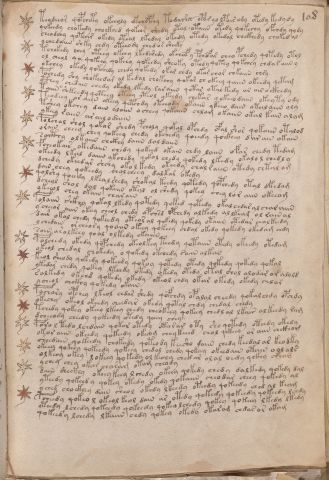

# Voynich Speculative Procedural Protocol — f108r

IMPORTANT: this is NOT a real or validated translation of the Voynich Manuscript. It is a speculative/procedural model that interprets EVA using a user-defined grammar to generate experimental recipes using safe, known edible substitutes.

This file is generated automatically from IVTFF/EVA transliteration plus a user-defined procedural grammar.



## Page / Folio
- currier: B
- folio: f108r
- page_number: 222

## EVA Text (Transliteration)
```text
teodeeor qopchety okeeoly okchdpchy todai'hx opar yo lpair ody otedy kedydy
qokeedy chokedy chockhed qokeor shedy otal otaiin otedy qokechy ofchdy qody
cheodchy qote[ci:a]r okedy oteal lkedal okedy otedy okedal chckhedy chokedal
ychedaiin shky chdy oteeody chedor sheeky
tchokedy chey oteey okeey lkedch'edy okchecf y pchofar cheo pchedy qotedy otol
ol cheol qo qokeey qokeey qokeedy sheoky otedy qotey qokchey chdar aiin y
ok[che:eee]y okedy qokchedy chedy qokedy okar chdy okar char chkaiin chsy
pochedy shy shokeedar al kedal chokchy qokar ch okeey qaiin okeedy qetam
cthey chedain chedy okedy lkedy raraiin qokar otal kedy ar air ockhedy
taiin shkeedy qoteey oteey ykeol ykeedy chekar qokeeodaiin okeyty ody
te[o:a]deey ar aiin okeey qetchdy oteeody okaiin ykeeo dain otalaiin oly
tshey okchey dain aloiin ocheey qokaiin chlam okaiin okal kain alam
ykeey raiin ar ail odaiin
polchal shol qokar shedy pcholy qokal opchdy ofal shor qokaiin otalod
orain cheey chey qokeey chedy okchedy qoeedy qockhey d iirain okain
saithy olkaiin chckhy daiin dal daiin
fcheokair okedaiin chedy qokeed okain chdy laiin ofar chedy tedam
okeedy lkal daiin ykchedy qokol chedy qokedy lkedy okalo l chedl y
dchedy okeedar shchy okol kedy okeedy chal raiin otedy chtal om
dain chey qokeedy cholcheey dalkar okedy
qolshy qoeedy lkealshedy shokal keedy qotedy qopchedy otal dkedam
dcheol shol dal qokaiin otal ol shedy qokey chey lor aiin okeeam
ykeol chey okain charain
folaiin c'hkhy qokal lkedy qotedy qoked qotedy okal chdar al char aiin
y cheeor aiin okeey cheol chedy opchsd opchedy alkedy al lkeam ol rain al
dair okal chedy qokeedy oteor al qokedy qokedy otaiin otedar chalkeedy
ychedain orcheory qoaiin okeey qokeey chdal okedy qokedy okedam chdy
sain arolkeey qoal olkedy okaiin
polchedy okedy qopchedy okeolkey teedy qotaiin otedy okeedy otedam
ykeol chedal chokedy o qokedy okchedy saiin alkan
keol sheody qokedy qokeedy qokoy qoiiedy otedy qokedy qokedy qokal
ykedar chedy qokey lkeedy otedy [o:y]kedy otedy otal shol alodar or alold
solkedy okchd qokedy okedy okeol chdy okar okedy okedy chlar
ycheol chckhy qokedy okain
pychory opchey lkeol chdar shedy qofchdy opalal cheedy qokalchdy opchdy
okechy okeol okeedy cheedar okedy qotal chdy chedal chedy
tchedy qokey okeey lkeey chedy cheokeey qokeey chedl al lkair alkeedy ram
dcheeody cheedy qokeedy otedy qeeey chey
poro l tedo lchdain qokar otedy otarar yty sho qotedy oteedy okedy
okor aiin okeedy qokeedy okeeom cheykeeed chol qekeey or aiin chckhom
sheedain qokeedy chokeedy qoteody keesho daiin chedy keedal as keodky
okeey qokeey qokeedy qokeey chedal chedy qokeey okeedain otain oolals
olke?y okey lokeey qokedy ol kechy chedar olal oedy qckhy cheam
ychey chey okar charam otam cheody
dain sheckhy okeey keey lchedy okeey qokedy chedy dalkedy qokedy dal
yteedy qokeed y qokey otedy okedy qokaiin cheodar cheey qokedy al
yched chockhey dain sheol okedy lkeedy oteedy qokeedy ched al keam
pcheedy qokeo l okeol keol dain ar otedy qokedy qokeedy qokeedy lchdy
oteedy lchedy qokeedy qokeedy qokeo lchedy qokey qokeey lkedy lkedy
qokeedy lchedy lkaiin chdy qokey okedy okaram chdar ar okam
```

## Domain Context (Heuristic; Not a Translation)

This section summarizes recurring **basewords** in this IVTFF domain and shows simple substring evidence that the token markers used by the procedural grammar occur inside frequent words.

Any Italian anagram / English gloss is a best-effort lexicon match, not a decipherment.


### Associated basewords (non-generic; top by frequency in this domain)
- `daiin` (count=231) → Italian anagram `piani`; English: plans (arrangements)
- `qokaiin` (count=122) → Italian anagram `ciancio`; English: [n/a]
- `okaiin` (count=109) → Italian anagram `coniai`; English: [n/a]
- `qokain` (count=101) → Italian anagram `acconi`; English: [n/a]
- `okain` (count=69) → Italian anagram `acino`; English: a berry
- `otain` (count=53) → Italian anagram `anito`; English: [n/a]
- `qokar` (count=48) → Italian anagram `carco`; English: [n/a]
- `saiin` (count=46) → Italian anagram `asini`; English: [n/a]
- `qokal` (count=43) → Italian anagram `calco`; English: cast (of sculpture)
- `qotaiin` (count=40) → Italian anagram `cationi`; English: [n/a]
- `lkaiin` (count=39) → Italian anagram `ancili`; English: [n/a]
- `kaiin` (count=37) → Italian anagram `acini`; English: [n/a]
- `qokeol` (count=37) → Italian anagram `eccolo`; English: [n/a]
- `qotain` (count=34) → Italian anagram `antico`; English: ancient
- `qotar` (count=29) → Italian anagram `corta`; English: [n/a]

### Marker evidence (substring in frequent basewords)
- `qo`: 60 basewords; examples: `qokeey`, `qokeedy`, `qokaiin`, `qokain`, `qokedy`, `qokey`
- `q`: 61 basewords; examples: `qokeey`, `qokeedy`, `qokaiin`, `qokain`, `qokedy`, `qokey`
- `o`: 262 basewords; examples: `qokeey`, `ol`, `o`, `qokeedy`, `okeey`, `qokaiin`
- `k`: 147 basewords; examples: `qokeey`, `qokeedy`, `okeey`, `qokaiin`, `okaiin`, `qokain`
- `t`: 102 basewords; examples: `otaiin`, `oteey`, `otar`, `otedy`, `otal`, `oteedy`
- `p`: 17 basewords; examples: `opchedy`, `qopchedy`, `opchey`, `pchedy`, `qopchdy`, `opchdy`
- `ch`: 137 basewords; examples: `chedy`, `chey`, `chol`, `cheey`, `cheol`, `cheody`
- `sh`: 50 basewords; examples: `shedy`, `shey`, `sheey`, `sheol`, `shol`, `sheedy`
- `f`: 1 basewords; examples: `f`
- `cth`: 16 basewords; examples: `chcthy`, `cthey`, `shcthy`, `checthy`, `cthol`, `ctheey`
- `ckh`: 15 basewords; examples: `chckhy`, `shckhy`, `checkhy`, `chckhey`, `chockhy`, `sheckhy`
- `cph`: 2 basewords; examples: `cphol`, `cphy`
- `dy`: 84 basewords; examples: `chedy`, `qokeedy`, `shedy`, `otedy`, `oteedy`, `qokedy`
- `iin`: 39 basewords; examples: `aiin`, `daiin`, `qokaiin`, `okaiin`, `otaiin`, `saiin`
- `aiin`: 33 basewords; examples: `aiin`, `daiin`, `qokaiin`, `okaiin`, `otaiin`, `saiin`

## Recipes Index (This Page)
- [f108r.1,@P0](#f108r-1-f108r-1-p0)
- [f108r.2,+P0](#f108r-2-f108r-2-p0)
- [f108r.3,+P0](#f108r-3-f108r-3-p0)
- [f108r.4,+P0](#f108r-4-f108r-4-p0)
- [f108r.5,+P0](#f108r-5-f108r-5-p0)
- [f108r.6,+P0](#f108r-6-f108r-6-p0)
- [f108r.7,+P0](#f108r-7-f108r-7-p0)
- [f108r.8,+P0](#f108r-8-f108r-8-p0)
- [f108r.9,+P0](#f108r-9-f108r-9-p0)
- [f108r.10,+P0](#f108r-10-f108r-10-p0)
- [f108r.11,+P0](#f108r-11-f108r-11-p0)
- [f108r.12,+P0](#f108r-12-f108r-12-p0)
- [f108r.13,+P0](#f108r-13-f108r-13-p0)
- [f108r.14,+P0](#f108r-14-f108r-14-p0)
- [f108r.15,+P0](#f108r-15-f108r-15-p0)
- [f108r.16,+P0](#f108r-16-f108r-16-p0)
- [f108r.17,+P0](#f108r-17-f108r-17-p0)
- [f108r.18,+P0](#f108r-18-f108r-18-p0)
- [f108r.19,+P0](#f108r-19-f108r-19-p0)
- [f108r.20,+P0](#f108r-20-f108r-20-p0)
- [f108r.21,+P0](#f108r-21-f108r-21-p0)
- [f108r.22,+P0](#f108r-22-f108r-22-p0)
- [f108r.23,+P0](#f108r-23-f108r-23-p0)
- [f108r.24,+P0](#f108r-24-f108r-24-p0)
- [f108r.25,+P0](#f108r-25-f108r-25-p0)
- [f108r.26,+P0](#f108r-26-f108r-26-p0)
- [f108r.27,+P0](#f108r-27-f108r-27-p0)
- [f108r.28,+P0](#f108r-28-f108r-28-p0)
- [f108r.29,+P0](#f108r-29-f108r-29-p0)
- [f108r.30,+P0](#f108r-30-f108r-30-p0)
- [f108r.31,+P0](#f108r-31-f108r-31-p0)
- [f108r.32,+P0](#f108r-32-f108r-32-p0)
- [f108r.33,+P0](#f108r-33-f108r-33-p0)
- [f108r.34,+P0](#f108r-34-f108r-34-p0)
- [f108r.35,+P0](#f108r-35-f108r-35-p0)
- [f108r.36,+P0](#f108r-36-f108r-36-p0)
- [f108r.37,+P0](#f108r-37-f108r-37-p0)
- [f108r.38,+P0](#f108r-38-f108r-38-p0)
- [f108r.39,+P0](#f108r-39-f108r-39-p0)
- [f108r.40,+P0](#f108r-40-f108r-40-p0)
- [f108r.41,+P0](#f108r-41-f108r-41-p0)
- [f108r.42,+P0](#f108r-42-f108r-42-p0)
- [f108r.43,+P0](#f108r-43-f108r-43-p0)
- [f108r.44,+P0](#f108r-44-f108r-44-p0)
- [f108r.45,+P0](#f108r-45-f108r-45-p0)
- [f108r.46,+P0](#f108r-46-f108r-46-p0)
- [f108r.47,+P0](#f108r-47-f108r-47-p0)
- [f108r.48,+P0](#f108r-48-f108r-48-p0)
- [f108r.49,+P0](#f108r-49-f108r-49-p0)
- [f108r.50,+P0](#f108r-50-f108r-50-p0)

## Line Glosses (Procedural Gloss Only; Not a Translation)

<a id="f108r-1-f108r-1-p0"></a>

### f108r.1,@P0

EVA: teodeeor qopchety okeeoly okchdpchy todai'hx opar yo lpair ody otedy kedydy

Direct Gloss (Procedural, Not a Real Translation):
- teodeeor: apply heat/cooking → mix / transfer → add starter / activate → duration level 1 → state: active extraction
- qopchety: prepare liquid base → apply heat/cooking → add main plant (safe substitute) → add starter / activate → duration level 1 → state: active extraction
- okeeoly: add fermentable sugars → mix / transfer → duration level 2 → state: active extraction
- okchdpchy: add fermentable sugars → add main plant (safe substitute) → mix / transfer → add starter / activate
- todai: apply heat/cooking → mix / transfer → add starter / activate → duration level 1 → state: phase transition/start
- hx: unmodeled token(s) present: h
- opar: mix / transfer → add starter / activate → duration level 1 → state: phase transition/start
- yo: mix / transfer
- lpair: add starter / activate → duration level 1 → state: phase transition/start
- ody: mix / transfer → add starter / activate
- otedy: apply heat/cooking → mix / transfer → add starter / activate → duration level 1 → state: active extraction
- kedydy: add fermentable sugars → add starter / activate → duration level 1 → state: active extraction

<a id="f108r-2-f108r-2-p0"></a>

### f108r.2,+P0

EVA: qokeedy chokedy chockhed qokeor shedy otal otaiin otedy qokechy ofchdy qody

Direct Gloss (Procedural, Not a Real Translation):
- qokeedy: prepare liquid base → add fermentable sugars → add starter / activate → duration level 2 → state: active extraction
- chokedy: add fermentable sugars → add main plant (safe substitute) → mix / transfer → add starter / activate → duration level 1 → state: active extraction
- chockhed: add main plant (safe substitute) → mix / transfer → add starter / activate → add complex herbal compound (safe blend) → duration level 1 → state: active extraction
- qokeor: prepare liquid base → add fermentable sugars → mix / transfer → duration level 1 → state: active extraction
- shedy: add secondary herb (safe substitute) → add starter / activate → duration level 1 → state: active extraction
- otal: apply heat/cooking → mix / transfer → duration level 1 → state: phase transition/start
- otaiin: apply heat/cooking → mix / transfer → duration level 1 → state: phase transition/start → long phase
- otedy: apply heat/cooking → mix / transfer → add starter / activate → duration level 1 → state: active extraction
- qokechy: prepare liquid base → add fermentable sugars → add main plant (safe substitute) → duration level 1 → state: active extraction
- ofchdy: add main plant (safe substitute) → add aroma modifier → mix / transfer → add starter / activate
- qody: prepare liquid base → add starter / activate

<a id="f108r-3-f108r-3-p0"></a>

### f108r.3,+P0

EVA: cheodchy qote[ci:a]r okedy oteal lkedal okedy otedy okedal chckhedy chokedal

Direct Gloss (Procedural, Not a Real Translation):
- cheodchy: add main plant (safe substitute) → mix / transfer → add starter / activate → duration level 1 → state: active extraction
- qote: prepare liquid base → apply heat/cooking → duration level 1 → state: active extraction
- ci: duration level 1 → state: cooling/rest
- a: duration level 1 → state: phase transition/start
- r: [unparsed]
- okedy: add fermentable sugars → mix / transfer → add starter / activate → duration level 1 → state: active extraction
- oteal: apply heat/cooking → mix / transfer → duration level 1 → state: active extraction
- lkedal: add fermentable sugars → add starter / activate → duration level 1 → state: active extraction
- okedy: add fermentable sugars → mix / transfer → add starter / activate → duration level 1 → state: active extraction
- otedy: apply heat/cooking → mix / transfer → add starter / activate → duration level 1 → state: active extraction
- okedal: add fermentable sugars → mix / transfer → add starter / activate → duration level 1 → state: active extraction
- chckhedy: add main plant (safe substitute) → add starter / activate → add complex herbal compound (safe blend) → duration level 1 → state: active extraction
- chokedal: add fermentable sugars → add main plant (safe substitute) → mix / transfer → add starter / activate → duration level 1 → state: active extraction

<a id="f108r-4-f108r-4-p0"></a>

### f108r.4,+P0

EVA: ychedaiin shky chdy oteeody chedor sheeky

Direct Gloss (Procedural, Not a Real Translation):
- ychedaiin: add main plant (safe substitute) → add starter / activate → duration level 1 → state: active extraction → long phase
- shky: add fermentable sugars → add secondary herb (safe substitute)
- chdy: add main plant (safe substitute) → add starter / activate
- oteeody: apply heat/cooking → mix / transfer → add starter / activate → duration level 2 → state: active extraction
- chedor: add main plant (safe substitute) → mix / transfer → add starter / activate → duration level 1 → state: active extraction
- sheeky: add fermentable sugars → add secondary herb (safe substitute) → duration level 2 → state: active extraction

<a id="f108r-5-f108r-5-p0"></a>

### f108r.5,+P0

EVA: tchokedy chey oteey okeey lkedch'edy okchecf y pchofar cheo pchedy qotedy otol

Direct Gloss (Procedural, Not a Real Translation):
- tchokedy: add fermentable sugars → apply heat/cooking → add main plant (safe substitute) → mix / transfer → add starter / activate → duration level 1 → state: active extraction
- chey: add main plant (safe substitute) → duration level 1 → state: active extraction
- oteey: apply heat/cooking → mix / transfer → duration level 2 → state: active extraction
- okeey: add fermentable sugars → mix / transfer → duration level 2 → state: active extraction
- lkedch: add fermentable sugars → add main plant (safe substitute) → add starter / activate → duration level 1 → state: active extraction
- edy: add starter / activate → duration level 1 → state: active extraction
- okchecf: add fermentable sugars → add main plant (safe substitute) → add aroma modifier → mix / transfer → duration level 1 → state: active extraction
- y: [unparsed]
- pchofar: add main plant (safe substitute) → add aroma modifier → mix / transfer → add starter / activate → duration level 1 → state: phase transition/start
- cheo: add main plant (safe substitute) → mix / transfer → duration level 1 → state: active extraction
- pchedy: add main plant (safe substitute) → add starter / activate → duration level 1 → state: active extraction
- qotedy: prepare liquid base → apply heat/cooking → add starter / activate → duration level 1 → state: active extraction
- otol: apply heat/cooking → mix / transfer

<a id="f108r-6-f108r-6-p0"></a>

### f108r.6,+P0

EVA: ol cheol qo qokeey qokeey qokeedy sheoky otedy qotey qokchey chdar aiin y

Direct Gloss (Procedural, Not a Real Translation):
- ol: mix / transfer
- cheol: add main plant (safe substitute) → mix / transfer → duration level 1 → state: active extraction
- qo: prepare liquid base
- qokeey: prepare liquid base → add fermentable sugars → duration level 2 → state: active extraction
- qokeey: prepare liquid base → add fermentable sugars → duration level 2 → state: active extraction
- qokeedy: prepare liquid base → add fermentable sugars → add starter / activate → duration level 2 → state: active extraction
- sheoky: add fermentable sugars → add secondary herb (safe substitute) → mix / transfer → duration level 1 → state: active extraction
- otedy: apply heat/cooking → mix / transfer → add starter / activate → duration level 1 → state: active extraction
- qotey: prepare liquid base → apply heat/cooking → duration level 1 → state: active extraction
- qokchey: prepare liquid base → add fermentable sugars → add main plant (safe substitute) → duration level 1 → state: active extraction
- chdar: add main plant (safe substitute) → add starter / activate → duration level 1 → state: phase transition/start
- aiin: duration level 1 → state: phase transition/start → long phase
- y: [unparsed]

<a id="f108r-7-f108r-7-p0"></a>

### f108r.7,+P0

EVA: ok[che:eee]y okedy qokchedy chedy qokedy okar chdy okar char chkaiin chsy

Direct Gloss (Procedural, Not a Real Translation):
- ok: add fermentable sugars → mix / transfer
- che: add main plant (safe substitute) → duration level 1 → state: active extraction
- eee: duration level 3 → state: active extraction
- y: [unparsed]
- okedy: add fermentable sugars → mix / transfer → add starter / activate → duration level 1 → state: active extraction
- qokchedy: prepare liquid base → add fermentable sugars → add main plant (safe substitute) → add starter / activate → duration level 1 → state: active extraction
- chedy: add main plant (safe substitute) → add starter / activate → duration level 1 → state: active extraction
- qokedy: prepare liquid base → add fermentable sugars → add starter / activate → duration level 1 → state: active extraction
- okar: add fermentable sugars → mix / transfer → duration level 1 → state: phase transition/start
- chdy: add main plant (safe substitute) → add starter / activate
- okar: add fermentable sugars → mix / transfer → duration level 1 → state: phase transition/start
- char: add main plant (safe substitute) → duration level 1 → state: phase transition/start
- chkaiin: add fermentable sugars → add main plant (safe substitute) → duration level 1 → state: phase transition/start → long phase
- chsy: add main plant (safe substitute)

<a id="f108r-8-f108r-8-p0"></a>

### f108r.8,+P0

EVA: pochedy shy shokeedar al kedal chokchy qokar ch okeey qaiin okeedy qetam

Direct Gloss (Procedural, Not a Real Translation):
- pochedy: add main plant (safe substitute) → mix / transfer → add starter / activate → duration level 1 → state: active extraction
- shy: add secondary herb (safe substitute)
- shokeedar: add fermentable sugars → add secondary herb (safe substitute) → mix / transfer → add starter / activate → duration level 2 → state: active extraction
- al: duration level 1 → state: phase transition/start
- kedal: add fermentable sugars → add starter / activate → duration level 1 → state: active extraction
- chokchy: add fermentable sugars → add main plant (safe substitute) → mix / transfer
- qokar: prepare liquid base → add fermentable sugars → duration level 1 → state: phase transition/start
- ch: add main plant (safe substitute)
- okeey: add fermentable sugars → mix / transfer → duration level 2 → state: active extraction
- qaiin: prepare base (generic) → duration level 1 → state: phase transition/start → long phase
- okeedy: add fermentable sugars → mix / transfer → add starter / activate → duration level 2 → state: active extraction
- qetam: prepare base (generic) → apply heat/cooking → duration level 1 → state: active extraction

<a id="f108r-9-f108r-9-p0"></a>

### f108r.9,+P0

EVA: cthey chedain chedy okedy lkedy raraiin qokar otal kedy ar air ockhedy

Direct Gloss (Procedural, Not a Real Translation):
- cthey: add complex herbal compound (safe blend) → duration level 1 → state: active extraction
- chedain: add main plant (safe substitute) → add starter / activate → duration level 1 → state: active extraction
- chedy: add main plant (safe substitute) → add starter / activate → duration level 1 → state: active extraction
- okedy: add fermentable sugars → mix / transfer → add starter / activate → duration level 1 → state: active extraction
- lkedy: add fermentable sugars → add starter / activate → duration level 1 → state: active extraction
- raraiin: duration level 1 → state: phase transition/start → long phase
- qokar: prepare liquid base → add fermentable sugars → duration level 1 → state: phase transition/start
- otal: apply heat/cooking → mix / transfer → duration level 1 → state: phase transition/start
- kedy: add fermentable sugars → add starter / activate → duration level 1 → state: active extraction
- ar: duration level 1 → state: phase transition/start
- air: duration level 1 → state: phase transition/start
- ockhedy: mix / transfer → add starter / activate → add complex herbal compound (safe blend) → duration level 1 → state: active extraction

<a id="f108r-10-f108r-10-p0"></a>

### f108r.10,+P0

EVA: taiin shkeedy qoteey oteey ykeol ykeedy chekar qokeeodaiin okeyty ody

Direct Gloss (Procedural, Not a Real Translation):
- taiin: apply heat/cooking → duration level 1 → state: phase transition/start → long phase
- shkeedy: add fermentable sugars → add secondary herb (safe substitute) → add starter / activate → duration level 2 → state: active extraction
- qoteey: prepare liquid base → apply heat/cooking → duration level 2 → state: active extraction
- oteey: apply heat/cooking → mix / transfer → duration level 2 → state: active extraction
- ykeol: add fermentable sugars → mix / transfer → duration level 1 → state: active extraction
- ykeedy: add fermentable sugars → add starter / activate → duration level 2 → state: active extraction
- chekar: add fermentable sugars → add main plant (safe substitute) → duration level 1 → state: active extraction
- qokeeodaiin: prepare liquid base → add fermentable sugars → mix / transfer → add starter / activate → duration level 2 → state: active extraction → long phase
- okeyty: add fermentable sugars → apply heat/cooking → mix / transfer → duration level 1 → state: active extraction
- ody: mix / transfer → add starter / activate

<a id="f108r-11-f108r-11-p0"></a>

### f108r.11,+P0

EVA: te[o:a]deey ar aiin okeey qetchdy oteeody okaiin ykeeo dain otalaiin oly

Direct Gloss (Procedural, Not a Real Translation):
- te: apply heat/cooking → duration level 1 → state: active extraction
- o: mix / transfer
- a: duration level 1 → state: phase transition/start
- deey: add starter / activate → duration level 2 → state: active extraction
- ar: duration level 1 → state: phase transition/start
- aiin: duration level 1 → state: phase transition/start → long phase
- okeey: add fermentable sugars → mix / transfer → duration level 2 → state: active extraction
- qetchdy: prepare base (generic) → apply heat/cooking → add main plant (safe substitute) → add starter / activate → duration level 1 → state: active extraction
- oteeody: apply heat/cooking → mix / transfer → add starter / activate → duration level 2 → state: active extraction
- okaiin: add fermentable sugars → mix / transfer → duration level 1 → state: phase transition/start → long phase
- ykeeo: add fermentable sugars → mix / transfer → duration level 2 → state: active extraction
- dain: add starter / activate → duration level 1 → state: phase transition/start
- otalaiin: apply heat/cooking → mix / transfer → duration level 1 → state: phase transition/start → long phase
- oly: mix / transfer

<a id="f108r-12-f108r-12-p0"></a>

### f108r.12,+P0

EVA: tshey okchey dain aloiin ocheey qokaiin chlam okaiin okal kain alam

Direct Gloss (Procedural, Not a Real Translation):
- tshey: apply heat/cooking → add secondary herb (safe substitute) → duration level 1 → state: active extraction
- okchey: add fermentable sugars → add main plant (safe substitute) → mix / transfer → duration level 1 → state: active extraction
- dain: add starter / activate → duration level 1 → state: phase transition/start
- aloiin: mix / transfer → duration level 1 → state: phase transition/start → medium phase
- ocheey: add main plant (safe substitute) → mix / transfer → duration level 2 → state: active extraction
- qokaiin: prepare liquid base → add fermentable sugars → duration level 1 → state: phase transition/start → long phase
- chlam: add main plant (safe substitute) → duration level 1 → state: phase transition/start
- okaiin: add fermentable sugars → mix / transfer → duration level 1 → state: phase transition/start → long phase
- okal: add fermentable sugars → mix / transfer → duration level 1 → state: phase transition/start
- kain: add fermentable sugars → duration level 1 → state: phase transition/start
- alam: duration level 1 → state: phase transition/start

<a id="f108r-13-f108r-13-p0"></a>

### f108r.13,+P0

EVA: ykeey raiin ar ail odaiin

Direct Gloss (Procedural, Not a Real Translation):
- ykeey: add fermentable sugars → duration level 2 → state: active extraction
- raiin: duration level 1 → state: phase transition/start → long phase
- ar: duration level 1 → state: phase transition/start
- ail: duration level 1 → state: phase transition/start
- odaiin: mix / transfer → add starter / activate → duration level 1 → state: phase transition/start → long phase

<a id="f108r-14-f108r-14-p0"></a>

### f108r.14,+P0

EVA: polchal shol qokar shedy pcholy qokal opchdy ofal shor qokaiin otalod

Direct Gloss (Procedural, Not a Real Translation):
- polchal: add main plant (safe substitute) → mix / transfer → add starter / activate → duration level 1 → state: phase transition/start
- shol: add secondary herb (safe substitute) → mix / transfer
- qokar: prepare liquid base → add fermentable sugars → duration level 1 → state: phase transition/start
- shedy: add secondary herb (safe substitute) → add starter / activate → duration level 1 → state: active extraction
- pcholy: add main plant (safe substitute) → mix / transfer → add starter / activate
- qokal: prepare liquid base → add fermentable sugars → duration level 1 → state: phase transition/start
- opchdy: add main plant (safe substitute) → mix / transfer → add starter / activate
- ofal: add aroma modifier → mix / transfer → duration level 1 → state: phase transition/start
- shor: add secondary herb (safe substitute) → mix / transfer
- qokaiin: prepare liquid base → add fermentable sugars → duration level 1 → state: phase transition/start → long phase
- otalod: apply heat/cooking → mix / transfer → add starter / activate → duration level 1 → state: phase transition/start

<a id="f108r-15-f108r-15-p0"></a>

### f108r.15,+P0

EVA: orain cheey chey qokeey chedy okchedy qoeedy qockhey d iirain okain

Direct Gloss (Procedural, Not a Real Translation):
- orain: mix / transfer → duration level 1 → state: phase transition/start
- cheey: add main plant (safe substitute) → duration level 2 → state: active extraction
- chey: add main plant (safe substitute) → duration level 1 → state: active extraction
- qokeey: prepare liquid base → add fermentable sugars → duration level 2 → state: active extraction
- chedy: add main plant (safe substitute) → add starter / activate → duration level 1 → state: active extraction
- okchedy: add fermentable sugars → add main plant (safe substitute) → mix / transfer → add starter / activate → duration level 1 → state: active extraction
- qoeedy: prepare liquid base → add starter / activate → duration level 2 → state: active extraction
- qockhey: prepare liquid base → add complex herbal compound (safe blend) → duration level 1 → state: active extraction
- d: add starter / activate
- iirain: duration level 2 → state: cooling/rest
- okain: add fermentable sugars → mix / transfer → duration level 1 → state: phase transition/start

<a id="f108r-16-f108r-16-p0"></a>

### f108r.16,+P0

EVA: saithy olkaiin chckhy daiin dal daiin

Direct Gloss (Procedural, Not a Real Translation):
- saithy: apply heat/cooking → duration level 1 → state: phase transition/start → unmodeled token(s) present: h
- olkaiin: add fermentable sugars → mix / transfer → duration level 1 → state: phase transition/start → long phase
- chckhy: add main plant (safe substitute) → add complex herbal compound (safe blend)
- daiin: add starter / activate → duration level 1 → state: phase transition/start → long phase
- dal: add starter / activate → duration level 1 → state: phase transition/start
- daiin: add starter / activate → duration level 1 → state: phase transition/start → long phase

<a id="f108r-17-f108r-17-p0"></a>

### f108r.17,+P0

EVA: fcheokair okedaiin chedy qokeed okain chdy laiin ofar chedy tedam

Direct Gloss (Procedural, Not a Real Translation):
- fcheokair: add fermentable sugars → add main plant (safe substitute) → add aroma modifier → mix / transfer → duration level 1 → state: active extraction
- okedaiin: add fermentable sugars → mix / transfer → add starter / activate → duration level 1 → state: active extraction → long phase
- chedy: add main plant (safe substitute) → add starter / activate → duration level 1 → state: active extraction
- qokeed: prepare liquid base → add fermentable sugars → add starter / activate → duration level 2 → state: active extraction
- okain: add fermentable sugars → mix / transfer → duration level 1 → state: phase transition/start
- chdy: add main plant (safe substitute) → add starter / activate
- laiin: duration level 1 → state: phase transition/start → long phase
- ofar: add aroma modifier → mix / transfer → duration level 1 → state: phase transition/start
- chedy: add main plant (safe substitute) → add starter / activate → duration level 1 → state: active extraction
- tedam: apply heat/cooking → add starter / activate → duration level 1 → state: active extraction

<a id="f108r-18-f108r-18-p0"></a>

### f108r.18,+P0

EVA: okeedy lkal daiin ykchedy qokol chedy qokedy lkedy okalo l chedl y

Direct Gloss (Procedural, Not a Real Translation):
- okeedy: add fermentable sugars → mix / transfer → add starter / activate → duration level 2 → state: active extraction
- lkal: add fermentable sugars → duration level 1 → state: phase transition/start
- daiin: add starter / activate → duration level 1 → state: phase transition/start → long phase
- ykchedy: add fermentable sugars → add main plant (safe substitute) → add starter / activate → duration level 1 → state: active extraction
- qokol: prepare liquid base → add fermentable sugars → mix / transfer
- chedy: add main plant (safe substitute) → add starter / activate → duration level 1 → state: active extraction
- qokedy: prepare liquid base → add fermentable sugars → add starter / activate → duration level 1 → state: active extraction
- lkedy: add fermentable sugars → add starter / activate → duration level 1 → state: active extraction
- okalo: add fermentable sugars → mix / transfer → duration level 1 → state: phase transition/start
- l: [unparsed]
- chedl: add main plant (safe substitute) → add starter / activate → duration level 1 → state: active extraction
- y: [unparsed]

<a id="f108r-19-f108r-19-p0"></a>

### f108r.19,+P0

EVA: dchedy okeedar shchy okol kedy okeedy chal raiin otedy chtal om

Direct Gloss (Procedural, Not a Real Translation):
- dchedy: add main plant (safe substitute) → add starter / activate → duration level 1 → state: active extraction
- okeedar: add fermentable sugars → mix / transfer → add starter / activate → duration level 2 → state: active extraction
- shchy: add main plant (safe substitute) → add secondary herb (safe substitute)
- okol: add fermentable sugars → mix / transfer
- kedy: add fermentable sugars → add starter / activate → duration level 1 → state: active extraction
- okeedy: add fermentable sugars → mix / transfer → add starter / activate → duration level 2 → state: active extraction
- chal: add main plant (safe substitute) → duration level 1 → state: phase transition/start
- raiin: duration level 1 → state: phase transition/start → long phase
- otedy: apply heat/cooking → mix / transfer → add starter / activate → duration level 1 → state: active extraction
- chtal: apply heat/cooking → add main plant (safe substitute) → duration level 1 → state: phase transition/start
- om: mix / transfer

<a id="f108r-20-f108r-20-p0"></a>

### f108r.20,+P0

EVA: dain chey qokeedy cholcheey dalkar okedy

Direct Gloss (Procedural, Not a Real Translation):
- dain: add starter / activate → duration level 1 → state: phase transition/start
- chey: add main plant (safe substitute) → duration level 1 → state: active extraction
- qokeedy: prepare liquid base → add fermentable sugars → add starter / activate → duration level 2 → state: active extraction
- cholcheey: add main plant (safe substitute) → mix / transfer → duration level 2 → state: active extraction
- dalkar: add fermentable sugars → add starter / activate → duration level 1 → state: phase transition/start
- okedy: add fermentable sugars → mix / transfer → add starter / activate → duration level 1 → state: active extraction

<a id="f108r-21-f108r-21-p0"></a>

### f108r.21,+P0

EVA: qolshy qoeedy lkealshedy shokal keedy qotedy qopchedy otal dkedam

Direct Gloss (Procedural, Not a Real Translation):
- qolshy: prepare liquid base → add secondary herb (safe substitute)
- qoeedy: prepare liquid base → add starter / activate → duration level 2 → state: active extraction
- lkealshedy: add fermentable sugars → add secondary herb (safe substitute) → add starter / activate → duration level 1 → state: active extraction
- shokal: add fermentable sugars → add secondary herb (safe substitute) → mix / transfer → duration level 1 → state: phase transition/start
- keedy: add fermentable sugars → add starter / activate → duration level 2 → state: active extraction
- qotedy: prepare liquid base → apply heat/cooking → add starter / activate → duration level 1 → state: active extraction
- qopchedy: prepare liquid base → add main plant (safe substitute) → add starter / activate → duration level 1 → state: active extraction
- otal: apply heat/cooking → mix / transfer → duration level 1 → state: phase transition/start
- dkedam: add fermentable sugars → add starter / activate → duration level 1 → state: active extraction

<a id="f108r-22-f108r-22-p0"></a>

### f108r.22,+P0

EVA: dcheol shol dal qokaiin otal ol shedy qokey chey lor aiin okeeam

Direct Gloss (Procedural, Not a Real Translation):
- dcheol: add main plant (safe substitute) → mix / transfer → add starter / activate → duration level 1 → state: active extraction
- shol: add secondary herb (safe substitute) → mix / transfer
- dal: add starter / activate → duration level 1 → state: phase transition/start
- qokaiin: prepare liquid base → add fermentable sugars → duration level 1 → state: phase transition/start → long phase
- otal: apply heat/cooking → mix / transfer → duration level 1 → state: phase transition/start
- ol: mix / transfer
- shedy: add secondary herb (safe substitute) → add starter / activate → duration level 1 → state: active extraction
- qokey: prepare liquid base → add fermentable sugars → duration level 1 → state: active extraction
- chey: add main plant (safe substitute) → duration level 1 → state: active extraction
- lor: mix / transfer
- aiin: duration level 1 → state: phase transition/start → long phase
- okeeam: add fermentable sugars → mix / transfer → duration level 2 → state: active extraction

<a id="f108r-23-f108r-23-p0"></a>

### f108r.23,+P0

EVA: ykeol chey okain charain

Direct Gloss (Procedural, Not a Real Translation):
- ykeol: add fermentable sugars → mix / transfer → duration level 1 → state: active extraction
- chey: add main plant (safe substitute) → duration level 1 → state: active extraction
- okain: add fermentable sugars → mix / transfer → duration level 1 → state: phase transition/start
- charain: add main plant (safe substitute) → duration level 1 → state: phase transition/start

<a id="f108r-24-f108r-24-p0"></a>

### f108r.24,+P0

EVA: folaiin c'hkhy qokal lkedy qotedy qoked qotedy okal chdar al char aiin

Direct Gloss (Procedural, Not a Real Translation):
- folaiin: add aroma modifier → mix / transfer → duration level 1 → state: phase transition/start → long phase
- c: [unparsed]
- hkhy: add fermentable sugars → unmodeled token(s) present: h
- qokal: prepare liquid base → add fermentable sugars → duration level 1 → state: phase transition/start
- lkedy: add fermentable sugars → add starter / activate → duration level 1 → state: active extraction
- qotedy: prepare liquid base → apply heat/cooking → add starter / activate → duration level 1 → state: active extraction
- qoked: prepare liquid base → add fermentable sugars → add starter / activate → duration level 1 → state: active extraction
- qotedy: prepare liquid base → apply heat/cooking → add starter / activate → duration level 1 → state: active extraction
- okal: add fermentable sugars → mix / transfer → duration level 1 → state: phase transition/start
- chdar: add main plant (safe substitute) → add starter / activate → duration level 1 → state: phase transition/start
- al: duration level 1 → state: phase transition/start
- char: add main plant (safe substitute) → duration level 1 → state: phase transition/start
- aiin: duration level 1 → state: phase transition/start → long phase

<a id="f108r-25-f108r-25-p0"></a>

### f108r.25,+P0

EVA: y cheeor aiin okeey cheol chedy opchsd opchedy alkedy al lkeam ol rain al

Direct Gloss (Procedural, Not a Real Translation):
- y: [unparsed]
- cheeor: add main plant (safe substitute) → mix / transfer → duration level 2 → state: active extraction
- aiin: duration level 1 → state: phase transition/start → long phase
- okeey: add fermentable sugars → mix / transfer → duration level 2 → state: active extraction
- cheol: add main plant (safe substitute) → mix / transfer → duration level 1 → state: active extraction
- chedy: add main plant (safe substitute) → add starter / activate → duration level 1 → state: active extraction
- opchsd: add main plant (safe substitute) → mix / transfer → add starter / activate
- opchedy: add main plant (safe substitute) → mix / transfer → add starter / activate → duration level 1 → state: active extraction
- alkedy: add fermentable sugars → add starter / activate → duration level 1 → state: phase transition/start
- al: duration level 1 → state: phase transition/start
- lkeam: add fermentable sugars → duration level 1 → state: active extraction
- ol: mix / transfer
- rain: duration level 1 → state: phase transition/start
- al: duration level 1 → state: phase transition/start

<a id="f108r-26-f108r-26-p0"></a>

### f108r.26,+P0

EVA: dair okal chedy qokeedy oteor al qokedy qokedy otaiin otedar chalkeedy

Direct Gloss (Procedural, Not a Real Translation):
- dair: add starter / activate → duration level 1 → state: phase transition/start
- okal: add fermentable sugars → mix / transfer → duration level 1 → state: phase transition/start
- chedy: add main plant (safe substitute) → add starter / activate → duration level 1 → state: active extraction
- qokeedy: prepare liquid base → add fermentable sugars → add starter / activate → duration level 2 → state: active extraction
- oteor: apply heat/cooking → mix / transfer → duration level 1 → state: active extraction
- al: duration level 1 → state: phase transition/start
- qokedy: prepare liquid base → add fermentable sugars → add starter / activate → duration level 1 → state: active extraction
- qokedy: prepare liquid base → add fermentable sugars → add starter / activate → duration level 1 → state: active extraction
- otaiin: apply heat/cooking → mix / transfer → duration level 1 → state: phase transition/start → long phase
- otedar: apply heat/cooking → mix / transfer → add starter / activate → duration level 1 → state: active extraction
- chalkeedy: add fermentable sugars → add main plant (safe substitute) → add starter / activate → duration level 1 → state: phase transition/start

<a id="f108r-27-f108r-27-p0"></a>

### f108r.27,+P0

EVA: ychedain orcheory qoaiin okeey qokeey chdal okedy qokedy okedam chdy

Direct Gloss (Procedural, Not a Real Translation):
- ychedain: add main plant (safe substitute) → add starter / activate → duration level 1 → state: active extraction
- orcheory: add main plant (safe substitute) → mix / transfer → duration level 1 → state: active extraction
- qoaiin: prepare liquid base → duration level 1 → state: phase transition/start → long phase
- okeey: add fermentable sugars → mix / transfer → duration level 2 → state: active extraction
- qokeey: prepare liquid base → add fermentable sugars → duration level 2 → state: active extraction
- chdal: add main plant (safe substitute) → add starter / activate → duration level 1 → state: phase transition/start
- okedy: add fermentable sugars → mix / transfer → add starter / activate → duration level 1 → state: active extraction
- qokedy: prepare liquid base → add fermentable sugars → add starter / activate → duration level 1 → state: active extraction
- okedam: add fermentable sugars → mix / transfer → add starter / activate → duration level 1 → state: active extraction
- chdy: add main plant (safe substitute) → add starter / activate

<a id="f108r-28-f108r-28-p0"></a>

### f108r.28,+P0

EVA: sain arolkeey qoal olkedy okaiin

Direct Gloss (Procedural, Not a Real Translation):
- sain: duration level 1 → state: phase transition/start
- arolkeey: add fermentable sugars → mix / transfer → duration level 1 → state: phase transition/start
- qoal: prepare liquid base → duration level 1 → state: phase transition/start
- olkedy: add fermentable sugars → mix / transfer → add starter / activate → duration level 1 → state: active extraction
- okaiin: add fermentable sugars → mix / transfer → duration level 1 → state: phase transition/start → long phase

<a id="f108r-29-f108r-29-p0"></a>

### f108r.29,+P0

EVA: polchedy okedy qopchedy okeolkey teedy qotaiin otedy okeedy otedam

Direct Gloss (Procedural, Not a Real Translation):
- polchedy: add main plant (safe substitute) → mix / transfer → add starter / activate → duration level 1 → state: active extraction
- okedy: add fermentable sugars → mix / transfer → add starter / activate → duration level 1 → state: active extraction
- qopchedy: prepare liquid base → add main plant (safe substitute) → add starter / activate → duration level 1 → state: active extraction
- okeolkey: add fermentable sugars → mix / transfer → duration level 1 → state: active extraction
- teedy: apply heat/cooking → add starter / activate → duration level 2 → state: active extraction
- qotaiin: prepare liquid base → apply heat/cooking → duration level 1 → state: phase transition/start → long phase
- otedy: apply heat/cooking → mix / transfer → add starter / activate → duration level 1 → state: active extraction
- okeedy: add fermentable sugars → mix / transfer → add starter / activate → duration level 2 → state: active extraction
- otedam: apply heat/cooking → mix / transfer → add starter / activate → duration level 1 → state: active extraction

<a id="f108r-30-f108r-30-p0"></a>

### f108r.30,+P0

EVA: ykeol chedal chokedy o qokedy okchedy saiin alkan

Direct Gloss (Procedural, Not a Real Translation):
- ykeol: add fermentable sugars → mix / transfer → duration level 1 → state: active extraction
- chedal: add main plant (safe substitute) → add starter / activate → duration level 1 → state: active extraction
- chokedy: add fermentable sugars → add main plant (safe substitute) → mix / transfer → add starter / activate → duration level 1 → state: active extraction
- o: mix / transfer
- qokedy: prepare liquid base → add fermentable sugars → add starter / activate → duration level 1 → state: active extraction
- okchedy: add fermentable sugars → add main plant (safe substitute) → mix / transfer → add starter / activate → duration level 1 → state: active extraction
- saiin: duration level 1 → state: phase transition/start → long phase
- alkan: add fermentable sugars → duration level 1 → state: phase transition/start

<a id="f108r-31-f108r-31-p0"></a>

### f108r.31,+P0

EVA: keol sheody qokedy qokeedy qokoy qoiiedy otedy qokedy qokedy qokal

Direct Gloss (Procedural, Not a Real Translation):
- keol: add fermentable sugars → mix / transfer → duration level 1 → state: active extraction
- sheody: add secondary herb (safe substitute) → mix / transfer → add starter / activate → duration level 1 → state: active extraction
- qokedy: prepare liquid base → add fermentable sugars → add starter / activate → duration level 1 → state: active extraction
- qokeedy: prepare liquid base → add fermentable sugars → add starter / activate → duration level 2 → state: active extraction
- qokoy: prepare liquid base → add fermentable sugars → mix / transfer
- qoiiedy: prepare liquid base → add starter / activate → duration level 2 → state: cooling/rest
- otedy: apply heat/cooking → mix / transfer → add starter / activate → duration level 1 → state: active extraction
- qokedy: prepare liquid base → add fermentable sugars → add starter / activate → duration level 1 → state: active extraction
- qokedy: prepare liquid base → add fermentable sugars → add starter / activate → duration level 1 → state: active extraction
- qokal: prepare liquid base → add fermentable sugars → duration level 1 → state: phase transition/start

<a id="f108r-32-f108r-32-p0"></a>

### f108r.32,+P0

EVA: ykedar chedy qokey lkeedy otedy [o:y]kedy otedy otal shol alodar or alold

Direct Gloss (Procedural, Not a Real Translation):
- ykedar: add fermentable sugars → add starter / activate → duration level 1 → state: active extraction
- chedy: add main plant (safe substitute) → add starter / activate → duration level 1 → state: active extraction
- qokey: prepare liquid base → add fermentable sugars → duration level 1 → state: active extraction
- lkeedy: add fermentable sugars → add starter / activate → duration level 2 → state: active extraction
- otedy: apply heat/cooking → mix / transfer → add starter / activate → duration level 1 → state: active extraction
- o: mix / transfer
- y: [unparsed]
- kedy: add fermentable sugars → add starter / activate → duration level 1 → state: active extraction
- otedy: apply heat/cooking → mix / transfer → add starter / activate → duration level 1 → state: active extraction
- otal: apply heat/cooking → mix / transfer → duration level 1 → state: phase transition/start
- shol: add secondary herb (safe substitute) → mix / transfer
- alodar: mix / transfer → add starter / activate → duration level 1 → state: phase transition/start
- or: mix / transfer
- alold: mix / transfer → add starter / activate → duration level 1 → state: phase transition/start

<a id="f108r-33-f108r-33-p0"></a>

### f108r.33,+P0

EVA: solkedy okchd qokedy okedy okeol chdy okar okedy okedy chlar

Direct Gloss (Procedural, Not a Real Translation):
- solkedy: add fermentable sugars → mix / transfer → add starter / activate → duration level 1 → state: active extraction
- okchd: add fermentable sugars → add main plant (safe substitute) → mix / transfer → add starter / activate
- qokedy: prepare liquid base → add fermentable sugars → add starter / activate → duration level 1 → state: active extraction
- okedy: add fermentable sugars → mix / transfer → add starter / activate → duration level 1 → state: active extraction
- okeol: add fermentable sugars → mix / transfer → duration level 1 → state: active extraction
- chdy: add main plant (safe substitute) → add starter / activate
- okar: add fermentable sugars → mix / transfer → duration level 1 → state: phase transition/start
- okedy: add fermentable sugars → mix / transfer → add starter / activate → duration level 1 → state: active extraction
- okedy: add fermentable sugars → mix / transfer → add starter / activate → duration level 1 → state: active extraction
- chlar: add main plant (safe substitute) → duration level 1 → state: phase transition/start

<a id="f108r-34-f108r-34-p0"></a>

### f108r.34,+P0

EVA: ycheol chckhy qokedy okain

Direct Gloss (Procedural, Not a Real Translation):
- ycheol: add main plant (safe substitute) → mix / transfer → duration level 1 → state: active extraction
- chckhy: add main plant (safe substitute) → add complex herbal compound (safe blend)
- qokedy: prepare liquid base → add fermentable sugars → add starter / activate → duration level 1 → state: active extraction
- okain: add fermentable sugars → mix / transfer → duration level 1 → state: phase transition/start

<a id="f108r-35-f108r-35-p0"></a>

### f108r.35,+P0

EVA: pychory opchey lkeol chdar shedy qofchdy opalal cheedy qokalchdy opchdy

Direct Gloss (Procedural, Not a Real Translation):
- pychory: add main plant (safe substitute) → mix / transfer → add starter / activate
- opchey: add main plant (safe substitute) → mix / transfer → add starter / activate → duration level 1 → state: active extraction
- lkeol: add fermentable sugars → mix / transfer → duration level 1 → state: active extraction
- chdar: add main plant (safe substitute) → add starter / activate → duration level 1 → state: phase transition/start
- shedy: add secondary herb (safe substitute) → add starter / activate → duration level 1 → state: active extraction
- qofchdy: prepare liquid base → add main plant (safe substitute) → add aroma modifier → add starter / activate
- opalal: mix / transfer → add starter / activate → duration level 1 → state: phase transition/start
- cheedy: add main plant (safe substitute) → add starter / activate → duration level 2 → state: active extraction
- qokalchdy: prepare liquid base → add fermentable sugars → add main plant (safe substitute) → add starter / activate → duration level 1 → state: phase transition/start
- opchdy: add main plant (safe substitute) → mix / transfer → add starter / activate

<a id="f108r-36-f108r-36-p0"></a>

### f108r.36,+P0

EVA: okechy okeol okeedy cheedar okedy qotal chdy chedal chedy

Direct Gloss (Procedural, Not a Real Translation):
- okechy: add fermentable sugars → add main plant (safe substitute) → mix / transfer → duration level 1 → state: active extraction
- okeol: add fermentable sugars → mix / transfer → duration level 1 → state: active extraction
- okeedy: add fermentable sugars → mix / transfer → add starter / activate → duration level 2 → state: active extraction
- cheedar: add main plant (safe substitute) → add starter / activate → duration level 2 → state: active extraction
- okedy: add fermentable sugars → mix / transfer → add starter / activate → duration level 1 → state: active extraction
- qotal: prepare liquid base → apply heat/cooking → duration level 1 → state: phase transition/start
- chdy: add main plant (safe substitute) → add starter / activate
- chedal: add main plant (safe substitute) → add starter / activate → duration level 1 → state: active extraction
- chedy: add main plant (safe substitute) → add starter / activate → duration level 1 → state: active extraction

<a id="f108r-37-f108r-37-p0"></a>

### f108r.37,+P0

EVA: tchedy qokey okeey lkeey chedy cheokeey qokeey chedl al lkair alkeedy ram

Direct Gloss (Procedural, Not a Real Translation):
- tchedy: apply heat/cooking → add main plant (safe substitute) → add starter / activate → duration level 1 → state: active extraction
- qokey: prepare liquid base → add fermentable sugars → duration level 1 → state: active extraction
- okeey: add fermentable sugars → mix / transfer → duration level 2 → state: active extraction
- lkeey: add fermentable sugars → duration level 2 → state: active extraction
- chedy: add main plant (safe substitute) → add starter / activate → duration level 1 → state: active extraction
- cheokeey: add fermentable sugars → add main plant (safe substitute) → mix / transfer → duration level 1 → state: active extraction
- qokeey: prepare liquid base → add fermentable sugars → duration level 2 → state: active extraction
- chedl: add main plant (safe substitute) → add starter / activate → duration level 1 → state: active extraction
- al: duration level 1 → state: phase transition/start
- lkair: add fermentable sugars → duration level 1 → state: phase transition/start
- alkeedy: add fermentable sugars → add starter / activate → duration level 1 → state: phase transition/start
- ram: duration level 1 → state: phase transition/start

<a id="f108r-38-f108r-38-p0"></a>

### f108r.38,+P0

EVA: dcheeody cheedy qokeedy otedy qeeey chey

Direct Gloss (Procedural, Not a Real Translation):
- dcheeody: add main plant (safe substitute) → mix / transfer → add starter / activate → duration level 2 → state: active extraction
- cheedy: add main plant (safe substitute) → add starter / activate → duration level 2 → state: active extraction
- qokeedy: prepare liquid base → add fermentable sugars → add starter / activate → duration level 2 → state: active extraction
- otedy: apply heat/cooking → mix / transfer → add starter / activate → duration level 1 → state: active extraction
- qeeey: prepare base (generic) → duration level 3 → state: active extraction
- chey: add main plant (safe substitute) → duration level 1 → state: active extraction

<a id="f108r-39-f108r-39-p0"></a>

### f108r.39,+P0

EVA: poro l tedo lchdain qokar otedy otarar yty sho qotedy oteedy okedy

Direct Gloss (Procedural, Not a Real Translation):
- poro: mix / transfer → add starter / activate
- l: [unparsed]
- tedo: apply heat/cooking → mix / transfer → add starter / activate → duration level 1 → state: active extraction
- lchdain: add main plant (safe substitute) → add starter / activate → duration level 1 → state: phase transition/start
- qokar: prepare liquid base → add fermentable sugars → duration level 1 → state: phase transition/start
- otedy: apply heat/cooking → mix / transfer → add starter / activate → duration level 1 → state: active extraction
- otarar: apply heat/cooking → mix / transfer → duration level 1 → state: phase transition/start
- yty: apply heat/cooking
- sho: add secondary herb (safe substitute) → mix / transfer
- qotedy: prepare liquid base → apply heat/cooking → add starter / activate → duration level 1 → state: active extraction
- oteedy: apply heat/cooking → mix / transfer → add starter / activate → duration level 2 → state: active extraction
- okedy: add fermentable sugars → mix / transfer → add starter / activate → duration level 1 → state: active extraction

<a id="f108r-40-f108r-40-p0"></a>

### f108r.40,+P0

EVA: okor aiin okeedy qokeedy okeeom cheykeeed chol qekeey or aiin chckhom

Direct Gloss (Procedural, Not a Real Translation):
- okor: add fermentable sugars → mix / transfer
- aiin: duration level 1 → state: phase transition/start → long phase
- okeedy: add fermentable sugars → mix / transfer → add starter / activate → duration level 2 → state: active extraction
- qokeedy: prepare liquid base → add fermentable sugars → add starter / activate → duration level 2 → state: active extraction
- okeeom: add fermentable sugars → mix / transfer → duration level 2 → state: active extraction
- cheykeeed: add fermentable sugars → add main plant (safe substitute) → add starter / activate → duration level 1 → state: active extraction
- chol: add main plant (safe substitute) → mix / transfer
- qekeey: prepare base (generic) → add fermentable sugars → duration level 1 → state: active extraction
- or: mix / transfer
- aiin: duration level 1 → state: phase transition/start → long phase
- chckhom: add main plant (safe substitute) → mix / transfer → add complex herbal compound (safe blend)

<a id="f108r-41-f108r-41-p0"></a>

### f108r.41,+P0

EVA: sheedain qokeedy chokeedy qoteody keesho daiin chedy keedal as keodky

Direct Gloss (Procedural, Not a Real Translation):
- sheedain: add secondary herb (safe substitute) → add starter / activate → duration level 2 → state: active extraction
- qokeedy: prepare liquid base → add fermentable sugars → add starter / activate → duration level 2 → state: active extraction
- chokeedy: add fermentable sugars → add main plant (safe substitute) → mix / transfer → add starter / activate → duration level 2 → state: active extraction
- qoteody: prepare liquid base → apply heat/cooking → mix / transfer → add starter / activate → duration level 1 → state: active extraction
- keesho: add fermentable sugars → add secondary herb (safe substitute) → mix / transfer → duration level 2 → state: active extraction
- daiin: add starter / activate → duration level 1 → state: phase transition/start → long phase
- chedy: add main plant (safe substitute) → add starter / activate → duration level 1 → state: active extraction
- keedal: add fermentable sugars → add starter / activate → duration level 2 → state: active extraction
- as: duration level 1 → state: phase transition/start
- keodky: add fermentable sugars → mix / transfer → add starter / activate → duration level 1 → state: active extraction

<a id="f108r-42-f108r-42-p0"></a>

### f108r.42,+P0

EVA: okeey qokeey qokeedy qokeey chedal chedy qokeey okeedain otain oolals

Direct Gloss (Procedural, Not a Real Translation):
- okeey: add fermentable sugars → mix / transfer → duration level 2 → state: active extraction
- qokeey: prepare liquid base → add fermentable sugars → duration level 2 → state: active extraction
- qokeedy: prepare liquid base → add fermentable sugars → add starter / activate → duration level 2 → state: active extraction
- qokeey: prepare liquid base → add fermentable sugars → duration level 2 → state: active extraction
- chedal: add main plant (safe substitute) → add starter / activate → duration level 1 → state: active extraction
- chedy: add main plant (safe substitute) → add starter / activate → duration level 1 → state: active extraction
- qokeey: prepare liquid base → add fermentable sugars → duration level 2 → state: active extraction
- okeedain: add fermentable sugars → mix / transfer → add starter / activate → duration level 2 → state: active extraction
- otain: apply heat/cooking → mix / transfer → duration level 1 → state: phase transition/start
- oolals: mix / transfer → duration level 1 → state: phase transition/start

<a id="f108r-43-f108r-43-p0"></a>

### f108r.43,+P0

EVA: olke?y okey lokeey qokedy ol kechy chedar olal oedy qckhy cheam

Direct Gloss (Procedural, Not a Real Translation):
- olke: add fermentable sugars → mix / transfer → duration level 1 → state: active extraction
- y: [unparsed]
- okey: add fermentable sugars → mix / transfer → duration level 1 → state: active extraction
- lokeey: add fermentable sugars → mix / transfer → duration level 2 → state: active extraction
- qokedy: prepare liquid base → add fermentable sugars → add starter / activate → duration level 1 → state: active extraction
- ol: mix / transfer
- kechy: add fermentable sugars → add main plant (safe substitute) → duration level 1 → state: active extraction
- chedar: add main plant (safe substitute) → add starter / activate → duration level 1 → state: active extraction
- olal: mix / transfer → duration level 1 → state: phase transition/start
- oedy: mix / transfer → add starter / activate → duration level 1 → state: active extraction
- qckhy: prepare base (generic) → add complex herbal compound (safe blend)
- cheam: add main plant (safe substitute) → duration level 1 → state: active extraction

<a id="f108r-44-f108r-44-p0"></a>

### f108r.44,+P0

EVA: ychey chey okar charam otam cheody

Direct Gloss (Procedural, Not a Real Translation):
- ychey: add main plant (safe substitute) → duration level 1 → state: active extraction
- chey: add main plant (safe substitute) → duration level 1 → state: active extraction
- okar: add fermentable sugars → mix / transfer → duration level 1 → state: phase transition/start
- charam: add main plant (safe substitute) → duration level 1 → state: phase transition/start
- otam: apply heat/cooking → mix / transfer → duration level 1 → state: phase transition/start
- cheody: add main plant (safe substitute) → mix / transfer → add starter / activate → duration level 1 → state: active extraction

<a id="f108r-45-f108r-45-p0"></a>

### f108r.45,+P0

EVA: dain sheckhy okeey keey lchedy okeey qokedy chedy dalkedy qokedy dal

Direct Gloss (Procedural, Not a Real Translation):
- dain: add starter / activate → duration level 1 → state: phase transition/start
- sheckhy: add secondary herb (safe substitute) → add complex herbal compound (safe blend) → duration level 1 → state: active extraction
- okeey: add fermentable sugars → mix / transfer → duration level 2 → state: active extraction
- keey: add fermentable sugars → duration level 2 → state: active extraction
- lchedy: add main plant (safe substitute) → add starter / activate → duration level 1 → state: active extraction
- okeey: add fermentable sugars → mix / transfer → duration level 2 → state: active extraction
- qokedy: prepare liquid base → add fermentable sugars → add starter / activate → duration level 1 → state: active extraction
- chedy: add main plant (safe substitute) → add starter / activate → duration level 1 → state: active extraction
- dalkedy: add fermentable sugars → add starter / activate → duration level 1 → state: phase transition/start
- qokedy: prepare liquid base → add fermentable sugars → add starter / activate → duration level 1 → state: active extraction
- dal: add starter / activate → duration level 1 → state: phase transition/start

<a id="f108r-46-f108r-46-p0"></a>

### f108r.46,+P0

EVA: yteedy qokeed y qokey otedy okedy qokaiin cheodar cheey qokedy al

Direct Gloss (Procedural, Not a Real Translation):
- yteedy: apply heat/cooking → add starter / activate → duration level 2 → state: active extraction
- qokeed: prepare liquid base → add fermentable sugars → add starter / activate → duration level 2 → state: active extraction
- y: [unparsed]
- qokey: prepare liquid base → add fermentable sugars → duration level 1 → state: active extraction
- otedy: apply heat/cooking → mix / transfer → add starter / activate → duration level 1 → state: active extraction
- okedy: add fermentable sugars → mix / transfer → add starter / activate → duration level 1 → state: active extraction
- qokaiin: prepare liquid base → add fermentable sugars → duration level 1 → state: phase transition/start → long phase
- cheodar: add main plant (safe substitute) → mix / transfer → add starter / activate → duration level 1 → state: active extraction
- cheey: add main plant (safe substitute) → duration level 2 → state: active extraction
- qokedy: prepare liquid base → add fermentable sugars → add starter / activate → duration level 1 → state: active extraction
- al: duration level 1 → state: phase transition/start

<a id="f108r-47-f108r-47-p0"></a>

### f108r.47,+P0

EVA: yched chockhey dain sheol okedy lkeedy oteedy qokeedy ched al keam

Direct Gloss (Procedural, Not a Real Translation):
- yched: add main plant (safe substitute) → add starter / activate → duration level 1 → state: active extraction
- chockhey: add main plant (safe substitute) → mix / transfer → add complex herbal compound (safe blend) → duration level 1 → state: active extraction
- dain: add starter / activate → duration level 1 → state: phase transition/start
- sheol: add secondary herb (safe substitute) → mix / transfer → duration level 1 → state: active extraction
- okedy: add fermentable sugars → mix / transfer → add starter / activate → duration level 1 → state: active extraction
- lkeedy: add fermentable sugars → add starter / activate → duration level 2 → state: active extraction
- oteedy: apply heat/cooking → mix / transfer → add starter / activate → duration level 2 → state: active extraction
- qokeedy: prepare liquid base → add fermentable sugars → add starter / activate → duration level 2 → state: active extraction
- ched: add main plant (safe substitute) → add starter / activate → duration level 1 → state: active extraction
- al: duration level 1 → state: phase transition/start
- keam: add fermentable sugars → duration level 1 → state: active extraction

<a id="f108r-48-f108r-48-p0"></a>

### f108r.48,+P0

EVA: pcheedy qokeo l okeol keol dain ar otedy qokedy qokeedy qokeedy lchdy

Direct Gloss (Procedural, Not a Real Translation):
- pcheedy: add main plant (safe substitute) → add starter / activate → duration level 2 → state: active extraction
- qokeo: prepare liquid base → add fermentable sugars → mix / transfer → duration level 1 → state: active extraction
- l: [unparsed]
- okeol: add fermentable sugars → mix / transfer → duration level 1 → state: active extraction
- keol: add fermentable sugars → mix / transfer → duration level 1 → state: active extraction
- dain: add starter / activate → duration level 1 → state: phase transition/start
- ar: duration level 1 → state: phase transition/start
- otedy: apply heat/cooking → mix / transfer → add starter / activate → duration level 1 → state: active extraction
- qokedy: prepare liquid base → add fermentable sugars → add starter / activate → duration level 1 → state: active extraction
- qokeedy: prepare liquid base → add fermentable sugars → add starter / activate → duration level 2 → state: active extraction
- qokeedy: prepare liquid base → add fermentable sugars → add starter / activate → duration level 2 → state: active extraction
- lchdy: add main plant (safe substitute) → add starter / activate

<a id="f108r-49-f108r-49-p0"></a>

### f108r.49,+P0

EVA: oteedy lchedy qokeedy qokeedy qokeo lchedy qokey qokeey lkedy lkedy

Direct Gloss (Procedural, Not a Real Translation):
- oteedy: apply heat/cooking → mix / transfer → add starter / activate → duration level 2 → state: active extraction
- lchedy: add main plant (safe substitute) → add starter / activate → duration level 1 → state: active extraction
- qokeedy: prepare liquid base → add fermentable sugars → add starter / activate → duration level 2 → state: active extraction
- qokeedy: prepare liquid base → add fermentable sugars → add starter / activate → duration level 2 → state: active extraction
- qokeo: prepare liquid base → add fermentable sugars → mix / transfer → duration level 1 → state: active extraction
- lchedy: add main plant (safe substitute) → add starter / activate → duration level 1 → state: active extraction
- qokey: prepare liquid base → add fermentable sugars → duration level 1 → state: active extraction
- qokeey: prepare liquid base → add fermentable sugars → duration level 2 → state: active extraction
- lkedy: add fermentable sugars → add starter / activate → duration level 1 → state: active extraction
- lkedy: add fermentable sugars → add starter / activate → duration level 1 → state: active extraction

<a id="f108r-50-f108r-50-p0"></a>

### f108r.50,+P0

EVA: qokeedy lchedy lkaiin chdy qokey okedy okaram chdar ar okam

Direct Gloss (Procedural, Not a Real Translation):
- qokeedy: prepare liquid base → add fermentable sugars → add starter / activate → duration level 2 → state: active extraction
- lchedy: add main plant (safe substitute) → add starter / activate → duration level 1 → state: active extraction
- lkaiin: add fermentable sugars → duration level 1 → state: phase transition/start → long phase
- chdy: add main plant (safe substitute) → add starter / activate
- qokey: prepare liquid base → add fermentable sugars → duration level 1 → state: active extraction
- okedy: add fermentable sugars → mix / transfer → add starter / activate → duration level 1 → state: active extraction
- okaram: add fermentable sugars → mix / transfer → duration level 1 → state: phase transition/start
- chdar: add main plant (safe substitute) → add starter / activate → duration level 1 → state: phase transition/start
- ar: duration level 1 → state: phase transition/start
- okam: add fermentable sugars → mix / transfer → duration level 1 → state: phase transition/start
