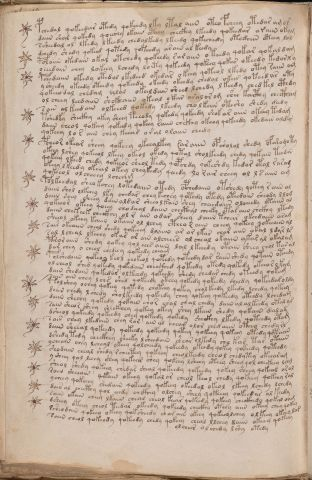

# Voynich Speculative Procedural Protocol — f108v

IMPORTANT: this is NOT a real or validated translation of the Voynich Manuscript. It is a speculative/procedural model that interprets EVA using a user-defined grammar to generate experimental recipes using safe, known edible substitutes.

This file is generated automatically from IVTFF/EVA transliteration plus a user-defined procedural grammar.



## Page / Folio
- currier: B
- folio: f108v
- page_number: 223

## EVA Text (Transliteration)
```text
pchedal qokeedar otedy qokeedy lky ltal aiin oteo fcheey otedar am ol
daiin shal qokedy qoee[ch:?]y okain oteey checkhy lkeedy qokeedar araiin okam
ssheedal ol lkedy lkeedy chedalkedy lkeedy qokechedy otedain oteey lol
dchedy shedy qokeed qoteedy qoteedy arain al keedy
polaiin okedain okal otchedy qokeedy raraiin o keedy qokar qokal dam
oeeedain chey lokeey lchedy loety qokeedy qokeey qokar okeedy kedarxy
pchedaiin okedy otedal lkedeed okedar okeey qoteol lkedy otey [r:s]aiin am
ysheedy okeedy oteedy qokeedy okeedy okeedy chedal okar qoteedar oty
qokeeo dar chedam chlal okaldain sheed lchedy l keedy ched kel cthdy
ol cheey leedaiin shckhaiin okeal okar aralor om shee kaithy chectham
sain al keed ain olkeeed qokedy lkeedy cho lkain oteshy shedy d[ee:a]dy
tshedky sheckhy akey sheey teeody qokedy qokeedy shok ar aiin okeey tedam
daiin cheol qokeey qokeedy qokeey raiin chckhy okeey qokeedy okedain ald[or:?]
qokeey lo r aiin chey keear a ral olaiin chedy
pcheor okear sheey qokeey ykeealkey [r:?]ar aiin opsholal shedy ofaramoty
okeey lshey qokeeal lkeey okeol okedy qotal sholkeedy chedy qokain teedu
qokeey lkeed chedy qokeeos sheol tedy qopchdy qokeshdy kedar otal raram
okeey l keedy okeal okey cheykedy qoeedy lo rair cheey ol l s aiin am
qokeeol olcheeey lcheam
polkeedal sheo kchey lotedaiin otedy opchedaiin otshedy qotey r aiin ol
daiin shol olkeeey lky chedar chey kechey qotedy otedy oteedain cheody llod
daiin shey sheey dain alsar sheeo lkain shey cheee[g:d]aiin oloeeedy otaiin al
qokeeor okeey qoeey chodaal daiin checthal cheeky otar aiin chckhy lteedy
daiin chekeek checkhy ol r ain odar sheey daiin tchar okeedaiin oram
sheeol okeey kaiin okaiin ol lchey ctheo r aiin cheey qokeey qokeeaiin al
sair okeaiin cheol shedy qokeeey dlaiin ar or lkar char aiin okal ldyr ls
sal lcheal lkeeey okar ar ain olcheees [o:a]l cheal okaiin ykar al okalam
paror aiin shedy qokey qol eees aiin lal lkeeedy otain sheey chol tan al
dar chey o cheol chedeey qokeedy chea[?:m]
polshedaiin qokeoy keol chokeol qotedy qoteedy dar raiin shedy qotain oteedy
ol cheol shed qokedy qokedain checkhed qoteedy otedy qokedy okeea r l kam
dain shedain qokedar olkeedy qokeedy shedy chedar chedy oteedy qokam
sain ain chey lchs shed qokeedy oteey qokedy qokeedy cheedy qokeedar oldy
tolshey ochey qokeey qotedy chot[ee:ch]y qokey cholkeedy lkedy lchedy qokeey
daiin chedy lchedy sholkeedy qokeedy chey qokeey qokeedy oteedy lchedam
daiin shechy qokedy qokain chor chal chal chedy dain alal keedy otalys
sain sheor sheey sheckhey qokey okey shey lkain shedy qokain dalam
dsheol qokeedy qokeedy chey qokeedy qokedy sheckhy lkedy qoteedy otam
sain chey lkedain chey rar ain al chear olor chedaiin oteey chedy rl
daiin sheeal qokeedy qokeedy qokeedy qotey qokeey qokeey otedy qotaiin
dshedy tedy checkhey sheeky lsheedain shear olkedy chy kar tar otaiin
ycheain chey lcheal ykeey qolcheedy qokeedy okeedy qokey qokeedy qoteedy
shodain cheal shedy rcheetey qokeey cheolkeedy cheol chedytey okeearam
y shey qol lchey shey qoke[a:?]r shey qokeey lsheey oteey sheey qol cheekeey lchg
sheol shedy qokeey chedar sheal qokeedy qokeedy qokey sheey qokeal aral
saiin sheeain qkain okeey qokalor cheol keol chedy qokeey qokeey ral
ycheey qokeeey shedain qokeedy qokeey okeedal okeol lkeey lchedy lchedy
da[ir:is] al checthy qol eeedy chckhey olchey sheey qokeeey qokeedar al keedy
saiin okain cheey lkaiin cheal cheol keear qokeedy qokeey checkhedy qokal oam
dsheey oteey cheol teedar okeedy qokeedy checkhy oteey aiin okeey chey qokey
ssheodain qokeeo okeey qoksheedy char air okeey qokeeolchey olkeey okeey lar
saiin cheol qokeedy qokeedy chedy qokeey cheal llchey daiin okeey qokeey
olchar ol chedy lshy otedy
```

## Domain Context (Heuristic; Not a Translation)

This section summarizes recurring **basewords** in this IVTFF domain and shows simple substring evidence that the token markers used by the procedural grammar occur inside frequent words.

Any Italian anagram / English gloss is a best-effort lexicon match, not a decipherment.


### Associated basewords (non-generic; top by frequency in this domain)
- `daiin` (count=231) → Italian anagram `piani`; English: plans (arrangements)
- `qokaiin` (count=122) → Italian anagram `ciancio`; English: [n/a]
- `okaiin` (count=109) → Italian anagram `coniai`; English: [n/a]
- `qokain` (count=101) → Italian anagram `acconi`; English: [n/a]
- `okain` (count=69) → Italian anagram `acino`; English: a berry
- `otain` (count=53) → Italian anagram `anito`; English: [n/a]
- `qokar` (count=48) → Italian anagram `carco`; English: [n/a]
- `saiin` (count=46) → Italian anagram `asini`; English: [n/a]
- `qokal` (count=43) → Italian anagram `calco`; English: cast (of sculpture)
- `qotaiin` (count=40) → Italian anagram `cationi`; English: [n/a]
- `lkaiin` (count=39) → Italian anagram `ancili`; English: [n/a]
- `kaiin` (count=37) → Italian anagram `acini`; English: [n/a]
- `qokeol` (count=37) → Italian anagram `eccolo`; English: [n/a]
- `qotain` (count=34) → Italian anagram `antico`; English: ancient
- `qotar` (count=29) → Italian anagram `corta`; English: [n/a]

### Marker evidence (substring in frequent basewords)
- `qo`: 60 basewords; examples: `qokeey`, `qokeedy`, `qokaiin`, `qokain`, `qokedy`, `qokey`
- `q`: 61 basewords; examples: `qokeey`, `qokeedy`, `qokaiin`, `qokain`, `qokedy`, `qokey`
- `o`: 262 basewords; examples: `qokeey`, `ol`, `o`, `qokeedy`, `okeey`, `qokaiin`
- `k`: 147 basewords; examples: `qokeey`, `qokeedy`, `okeey`, `qokaiin`, `okaiin`, `qokain`
- `t`: 102 basewords; examples: `otaiin`, `oteey`, `otar`, `otedy`, `otal`, `oteedy`
- `p`: 17 basewords; examples: `opchedy`, `qopchedy`, `opchey`, `pchedy`, `qopchdy`, `opchdy`
- `ch`: 137 basewords; examples: `chedy`, `chey`, `chol`, `cheey`, `cheol`, `cheody`
- `sh`: 50 basewords; examples: `shedy`, `shey`, `sheey`, `sheol`, `shol`, `sheedy`
- `f`: 1 basewords; examples: `f`
- `cth`: 16 basewords; examples: `chcthy`, `cthey`, `shcthy`, `checthy`, `cthol`, `ctheey`
- `ckh`: 15 basewords; examples: `chckhy`, `shckhy`, `checkhy`, `chckhey`, `chockhy`, `sheckhy`
- `cph`: 2 basewords; examples: `cphol`, `cphy`
- `dy`: 84 basewords; examples: `chedy`, `qokeedy`, `shedy`, `otedy`, `oteedy`, `qokedy`
- `iin`: 39 basewords; examples: `aiin`, `daiin`, `qokaiin`, `okaiin`, `otaiin`, `saiin`
- `aiin`: 33 basewords; examples: `aiin`, `daiin`, `qokaiin`, `okaiin`, `otaiin`, `saiin`

## Recipes Index (This Page)
- [f108v.1,@P0](#f108v-1-f108v-1-p0)
- [f108v.2,+P0](#f108v-2-f108v-2-p0)
- [f108v.3,+P0](#f108v-3-f108v-3-p0)
- [f108v.4,+P0](#f108v-4-f108v-4-p0)
- [f108v.5,+P0](#f108v-5-f108v-5-p0)
- [f108v.6,+P0](#f108v-6-f108v-6-p0)
- [f108v.7,+P0](#f108v-7-f108v-7-p0)
- [f108v.8,+P0](#f108v-8-f108v-8-p0)
- [f108v.9,+P0](#f108v-9-f108v-9-p0)
- [f108v.10,+P0](#f108v-10-f108v-10-p0)
- [f108v.11,+P0](#f108v-11-f108v-11-p0)
- [f108v.12,+P0](#f108v-12-f108v-12-p0)
- [f108v.13,+P0](#f108v-13-f108v-13-p0)
- [f108v.14,+P0](#f108v-14-f108v-14-p0)
- [f108v.15,+P0](#f108v-15-f108v-15-p0)
- [f108v.16,+P0](#f108v-16-f108v-16-p0)
- [f108v.17,+P0](#f108v-17-f108v-17-p0)
- [f108v.18,+P0](#f108v-18-f108v-18-p0)
- [f108v.19,+P0](#f108v-19-f108v-19-p0)
- [f108v.20,+P0](#f108v-20-f108v-20-p0)
- [f108v.21,+P0](#f108v-21-f108v-21-p0)
- [f108v.22,+P0](#f108v-22-f108v-22-p0)
- [f108v.23,+P0](#f108v-23-f108v-23-p0)
- [f108v.24,+P0](#f108v-24-f108v-24-p0)
- [f108v.25,+P0](#f108v-25-f108v-25-p0)
- [f108v.26,+P0](#f108v-26-f108v-26-p0)
- [f108v.27,+P0](#f108v-27-f108v-27-p0)
- [f108v.28,+P0](#f108v-28-f108v-28-p0)
- [f108v.29,+P0](#f108v-29-f108v-29-p0)
- [f108v.30,+P0](#f108v-30-f108v-30-p0)
- [f108v.31,+P0](#f108v-31-f108v-31-p0)
- [f108v.32,+P0](#f108v-32-f108v-32-p0)
- [f108v.33,+P0](#f108v-33-f108v-33-p0)
- [f108v.34,+P0](#f108v-34-f108v-34-p0)
- [f108v.35,+P0](#f108v-35-f108v-35-p0)
- [f108v.36,+P0](#f108v-36-f108v-36-p0)
- [f108v.37,+P0](#f108v-37-f108v-37-p0)
- [f108v.38,+P0](#f108v-38-f108v-38-p0)
- [f108v.39,+P0](#f108v-39-f108v-39-p0)
- [f108v.40,+P0](#f108v-40-f108v-40-p0)
- [f108v.41,+P0](#f108v-41-f108v-41-p0)
- [f108v.42,+P0](#f108v-42-f108v-42-p0)
- [f108v.43,+P0](#f108v-43-f108v-43-p0)
- [f108v.44,+P0](#f108v-44-f108v-44-p0)
- [f108v.45,+P0](#f108v-45-f108v-45-p0)
- [f108v.46,+P0](#f108v-46-f108v-46-p0)
- [f108v.47,+P0](#f108v-47-f108v-47-p0)
- [f108v.48,+P0](#f108v-48-f108v-48-p0)
- [f108v.49,+P0](#f108v-49-f108v-49-p0)
- [f108v.50,+P0](#f108v-50-f108v-50-p0)
- [f108v.51,+P0](#f108v-51-f108v-51-p0)
- [f108v.52,+P0](#f108v-52-f108v-52-p0)
- [f108v.53,+Pr](#f108v-53-f108v-53-pr)

## Line Glosses (Procedural Gloss Only; Not a Translation)

<a id="f108v-1-f108v-1-p0"></a>

### f108v.1,@P0

EVA: pchedal qokeedar otedy qokeedy lky ltal aiin oteo fcheey otedar am ol

Direct Gloss (Procedural, Not a Real Translation):
- pchedal: tokens: p ch e p a l → connectors: l → vowel_run: e (level 1; class e)
- qokeedar: tokens: qo k ee p a r → connectors: r → vowel_run: ee (level 2; class e)
- otedy: tokens: o t e p → vowel_run: e (level 1; class e)
- qokeedy: tokens: qo k ee p → vowel_run: ee (level 2; class e)
- lky: tokens: l k → connectors: l
- ltal: tokens: l t a l → connectors: l l → vowel_run: a (level 1; class a)
- aiin: tokens: aiin → vowel_run: a (level 1; class a) → suffix: aiin
- oteo: tokens: o t e o → vowel_run: e (level 1; class e)
- fcheey: tokens: f ch ee → vowel_run: ee (level 2; class e)
- otedar: tokens: o t e p a r → connectors: r → vowel_run: e (level 1; class e)
- am: tokens: a m → connectors: m → vowel_run: a (level 1; class a)
- ol: tokens: o l → connectors: l

<a id="f108v-2-f108v-2-p0"></a>

### f108v.2,+P0

EVA: daiin shal qokedy qoee[ch:?]y okain oteey checkhy lkeedy qokeedar araiin okam

Direct Gloss (Procedural, Not a Real Translation):
- daiin: tokens: p aiin → vowel_run: a (level 1; class a) → suffix: aiin
- shal: tokens: sh a l → connectors: l → vowel_run: a (level 1; class a)
- qokedy: tokens: qo k e p → vowel_run: e (level 1; class e)
- qoee: tokens: qo ee → vowel_run: ee (level 2; class e)
- ch: tokens: ch
- y: [unparsed]
- okain: tokens: o k a i n → connectors: n → vowel_run: a (level 1; class a)
- oteey: tokens: o t ee → vowel_run: ee (level 2; class e)
- checkhy: tokens: ch e ckh → vowel_run: e (level 1; class e)
- lkeedy: tokens: l k ee p → connectors: l → vowel_run: ee (level 2; class e)
- qokeedar: tokens: qo k ee p a r → connectors: r → vowel_run: ee (level 2; class e)
- araiin: tokens: a r aiin → connectors: r → vowel_run: a (level 1; class a) → suffix: aiin
- okam: tokens: o k a m → connectors: m → vowel_run: a (level 1; class a)

<a id="f108v-3-f108v-3-p0"></a>

### f108v.3,+P0

EVA: ssheedal ol lkedy lkeedy chedalkedy lkeedy qokechedy otedain oteey lol

Direct Gloss (Procedural, Not a Real Translation):
- ssheedal: tokens: s sh ee p a l → connectors: s l → vowel_run: ee (level 2; class e)
- ol: tokens: o l → connectors: l
- lkedy: tokens: l k e p → connectors: l → vowel_run: e (level 1; class e)
- lkeedy: tokens: l k ee p → connectors: l → vowel_run: ee (level 2; class e)
- chedalkedy: tokens: ch e p a l k e p → connectors: l → vowel_run: e (level 1; class e)
- lkeedy: tokens: l k ee p → connectors: l → vowel_run: ee (level 2; class e)
- qokechedy: tokens: qo k e ch e p → vowel_run: e (level 1; class e)
- otedain: tokens: o t e p a i n → connectors: n → vowel_run: e (level 1; class e)
- oteey: tokens: o t ee → vowel_run: ee (level 2; class e)
- lol: tokens: l o l → connectors: l l

<a id="f108v-4-f108v-4-p0"></a>

### f108v.4,+P0

EVA: dchedy shedy qokeed qoteedy qoteedy arain al keedy

Direct Gloss (Procedural, Not a Real Translation):
- dchedy: tokens: p ch e p → vowel_run: e (level 1; class e)
- shedy: tokens: sh e p → vowel_run: e (level 1; class e)
- qokeed: tokens: qo k ee p → vowel_run: ee (level 2; class e)
- qoteedy: tokens: qo t ee p → vowel_run: ee (level 2; class e)
- qoteedy: tokens: qo t ee p → vowel_run: ee (level 2; class e)
- arain: tokens: a r a i n → connectors: r n → vowel_run: a (level 1; class a)
- al: tokens: a l → connectors: l → vowel_run: a (level 1; class a)
- keedy: tokens: k ee p → vowel_run: ee (level 2; class e)

<a id="f108v-5-f108v-5-p0"></a>

### f108v.5,+P0

EVA: polaiin okedain okal otchedy qokeedy raraiin o keedy qokar qokal dam

Direct Gloss (Procedural, Not a Real Translation):
- polaiin: tokens: p o l aiin → connectors: l → vowel_run: a (level 1; class a) → suffix: aiin
- okedain: tokens: o k e p a i n → connectors: n → vowel_run: e (level 1; class e)
- okal: tokens: o k a l → connectors: l → vowel_run: a (level 1; class a)
- otchedy: tokens: o t ch e p → vowel_run: e (level 1; class e)
- qokeedy: tokens: qo k ee p → vowel_run: ee (level 2; class e)
- raraiin: tokens: r a r aiin → connectors: r r → vowel_run: a (level 1; class a) → suffix: aiin
- o: tokens: o
- keedy: tokens: k ee p → vowel_run: ee (level 2; class e)
- qokar: tokens: qo k a r → connectors: r → vowel_run: a (level 1; class a)
- qokal: tokens: qo k a l → connectors: l → vowel_run: a (level 1; class a)
- dam: tokens: p a m → connectors: m → vowel_run: a (level 1; class a)

<a id="f108v-6-f108v-6-p0"></a>

### f108v.6,+P0

EVA: oeeedain chey lokeey lchedy loety qokeedy qokeey qokar okeedy kedarxy

Direct Gloss (Procedural, Not a Real Translation):
- oeeedain: tokens: o eee p a i n → connectors: n → vowel_run: eee (level 3; class e)
- chey: tokens: ch e → vowel_run: e (level 1; class e)
- lokeey: tokens: l o k ee → connectors: l → vowel_run: ee (level 2; class e)
- lchedy: tokens: l ch e p → connectors: l → vowel_run: e (level 1; class e)
- loety: tokens: l o e t → connectors: l → vowel_run: e (level 1; class e)
- qokeedy: tokens: qo k ee p → vowel_run: ee (level 2; class e)
- qokeey: tokens: qo k ee → vowel_run: ee (level 2; class e)
- qokar: tokens: qo k a r → connectors: r → vowel_run: a (level 1; class a)
- okeedy: tokens: o k ee p → vowel_run: ee (level 2; class e)
- kedarxy: tokens: k e p a r x → connectors: r → vowel_run: e (level 1; class e)

<a id="f108v-7-f108v-7-p0"></a>

### f108v.7,+P0

EVA: pchedaiin okedy otedal lkedeed okedar okeey qoteol lkedy otey [r:s]aiin am

Direct Gloss (Procedural, Not a Real Translation):
- pchedaiin: tokens: p ch e p aiin → vowel_run: e (level 1; class e) → suffix: aiin
- okedy: tokens: o k e p → vowel_run: e (level 1; class e)
- otedal: tokens: o t e p a l → connectors: l → vowel_run: e (level 1; class e)
- lkedeed: tokens: l k e p ee p → connectors: l → vowel_run: e (level 1; class e)
- okedar: tokens: o k e p a r → connectors: r → vowel_run: e (level 1; class e)
- okeey: tokens: o k ee → vowel_run: ee (level 2; class e)
- qoteol: tokens: qo t e o l → connectors: l → vowel_run: e (level 1; class e)
- lkedy: tokens: l k e p → connectors: l → vowel_run: e (level 1; class e)
- otey: tokens: o t e → vowel_run: e (level 1; class e)
- r: tokens: r → connectors: r
- s: tokens: s → connectors: s
- aiin: tokens: aiin → vowel_run: a (level 1; class a) → suffix: aiin
- am: tokens: a m → connectors: m → vowel_run: a (level 1; class a)

<a id="f108v-8-f108v-8-p0"></a>

### f108v.8,+P0

EVA: ysheedy okeedy oteedy qokeedy okeedy okeedy chedal okar qoteedar oty

Direct Gloss (Procedural, Not a Real Translation):
- ysheedy: tokens: sh ee p → vowel_run: ee (level 2; class e)
- okeedy: tokens: o k ee p → vowel_run: ee (level 2; class e)
- oteedy: tokens: o t ee p → vowel_run: ee (level 2; class e)
- qokeedy: tokens: qo k ee p → vowel_run: ee (level 2; class e)
- okeedy: tokens: o k ee p → vowel_run: ee (level 2; class e)
- okeedy: tokens: o k ee p → vowel_run: ee (level 2; class e)
- chedal: tokens: ch e p a l → connectors: l → vowel_run: e (level 1; class e)
- okar: tokens: o k a r → connectors: r → vowel_run: a (level 1; class a)
- qoteedar: tokens: qo t ee p a r → connectors: r → vowel_run: ee (level 2; class e)
- oty: tokens: o t

<a id="f108v-9-f108v-9-p0"></a>

### f108v.9,+P0

EVA: qokeeo dar chedam chlal okaldain sheed lchedy l keedy ched kel cthdy

Direct Gloss (Procedural, Not a Real Translation):
- qokeeo: tokens: qo k ee o → vowel_run: ee (level 2; class e)
- dar: tokens: p a r → connectors: r → vowel_run: a (level 1; class a)
- chedam: tokens: ch e p a m → connectors: m → vowel_run: e (level 1; class e)
- chlal: tokens: ch l a l → connectors: l l → vowel_run: a (level 1; class a)
- okaldain: tokens: o k a l p a i n → connectors: l n → vowel_run: a (level 1; class a)
- sheed: tokens: sh ee p → vowel_run: ee (level 2; class e)
- lchedy: tokens: l ch e p → connectors: l → vowel_run: e (level 1; class e)
- l: tokens: l → connectors: l
- keedy: tokens: k ee p → vowel_run: ee (level 2; class e)
- ched: tokens: ch e p → vowel_run: e (level 1; class e)
- kel: tokens: k e l → connectors: l → vowel_run: e (level 1; class e)
- cthdy: tokens: cth p

<a id="f108v-10-f108v-10-p0"></a>

### f108v.10,+P0

EVA: ol cheey leedaiin shckhaiin okeal okar aralor om shee kaithy chectham

Direct Gloss (Procedural, Not a Real Translation):
- ol: tokens: o l → connectors: l
- cheey: tokens: ch ee → vowel_run: ee (level 2; class e)
- leedaiin: tokens: l ee p aiin → connectors: l → vowel_run: ee (level 2; class e) → suffix: aiin
- shckhaiin: tokens: sh ckh aiin → vowel_run: a (level 1; class a) → suffix: aiin
- okeal: tokens: o k e a l → connectors: l → vowel_run: e (level 1; class e)
- okar: tokens: o k a r → connectors: r → vowel_run: a (level 1; class a)
- aralor: tokens: a r a l o r → connectors: r l r → vowel_run: a (level 1; class a)
- om: tokens: o m → connectors: m
- shee: tokens: sh ee → vowel_run: ee (level 2; class e)
- kaithy: tokens: k a i t h → vowel_run: a (level 1; class a) → unmodeled_tokens: h
- chectham: tokens: ch e cth a m → connectors: m → vowel_run: e (level 1; class e)

<a id="f108v-11-f108v-11-p0"></a>

### f108v.11,+P0

EVA: sain al keed ain olkeeed qokedy lkeedy cho lkain oteshy shedy d[ee:a]dy

Direct Gloss (Procedural, Not a Real Translation):
- sain: tokens: s a i n → connectors: s n → vowel_run: a (level 1; class a)
- al: tokens: a l → connectors: l → vowel_run: a (level 1; class a)
- keed: tokens: k ee p → vowel_run: ee (level 2; class e)
- ain: tokens: a i n → connectors: n → vowel_run: a (level 1; class a)
- olkeeed: tokens: o l k eee p → connectors: l → vowel_run: eee (level 3; class e)
- qokedy: tokens: qo k e p → vowel_run: e (level 1; class e)
- lkeedy: tokens: l k ee p → connectors: l → vowel_run: ee (level 2; class e)
- cho: tokens: ch o
- lkain: tokens: l k a i n → connectors: l n → vowel_run: a (level 1; class a)
- oteshy: tokens: o t e sh → vowel_run: e (level 1; class e)
- shedy: tokens: sh e p → vowel_run: e (level 1; class e)
- d: tokens: p
- ee: tokens: ee → vowel_run: ee (level 2; class e)
- a: tokens: a → vowel_run: a (level 1; class a)
- dy: tokens: p

<a id="f108v-12-f108v-12-p0"></a>

### f108v.12,+P0

EVA: tshedky sheckhy akey sheey teeody qokedy qokeedy shok ar aiin okeey tedam

Direct Gloss (Procedural, Not a Real Translation):
- tshedky: tokens: t sh e p k → vowel_run: e (level 1; class e)
- sheckhy: tokens: sh e ckh → vowel_run: e (level 1; class e)
- akey: tokens: a k e → vowel_run: a (level 1; class a)
- sheey: tokens: sh ee → vowel_run: ee (level 2; class e)
- teeody: tokens: t ee o p → vowel_run: ee (level 2; class e)
- qokedy: tokens: qo k e p → vowel_run: e (level 1; class e)
- qokeedy: tokens: qo k ee p → vowel_run: ee (level 2; class e)
- shok: tokens: sh o k
- ar: tokens: a r → connectors: r → vowel_run: a (level 1; class a)
- aiin: tokens: aiin → vowel_run: a (level 1; class a) → suffix: aiin
- okeey: tokens: o k ee → vowel_run: ee (level 2; class e)
- tedam: tokens: t e p a m → connectors: m → vowel_run: e (level 1; class e)

<a id="f108v-13-f108v-13-p0"></a>

### f108v.13,+P0

EVA: daiin cheol qokeey qokeedy qokeey raiin chckhy okeey qokeedy okedain ald[or:?]

Direct Gloss (Procedural, Not a Real Translation):
- daiin: tokens: p aiin → vowel_run: a (level 1; class a) → suffix: aiin
- cheol: tokens: ch e o l → connectors: l → vowel_run: e (level 1; class e)
- qokeey: tokens: qo k ee → vowel_run: ee (level 2; class e)
- qokeedy: tokens: qo k ee p → vowel_run: ee (level 2; class e)
- qokeey: tokens: qo k ee → vowel_run: ee (level 2; class e)
- raiin: tokens: r aiin → connectors: r → vowel_run: a (level 1; class a) → suffix: aiin
- chckhy: tokens: ch ckh
- okeey: tokens: o k ee → vowel_run: ee (level 2; class e)
- qokeedy: tokens: qo k ee p → vowel_run: ee (level 2; class e)
- okedain: tokens: o k e p a i n → connectors: n → vowel_run: e (level 1; class e)
- ald: tokens: a l p → connectors: l → vowel_run: a (level 1; class a)
- or: tokens: o r → connectors: r

<a id="f108v-14-f108v-14-p0"></a>

### f108v.14,+P0

EVA: qokeey lo r aiin chey keear a ral olaiin chedy

Direct Gloss (Procedural, Not a Real Translation):
- qokeey: tokens: qo k ee → vowel_run: ee (level 2; class e)
- lo: tokens: l o → connectors: l
- r: tokens: r → connectors: r
- aiin: tokens: aiin → vowel_run: a (level 1; class a) → suffix: aiin
- chey: tokens: ch e → vowel_run: e (level 1; class e)
- keear: tokens: k ee a r → connectors: r → vowel_run: ee (level 2; class e)
- a: tokens: a → vowel_run: a (level 1; class a)
- ral: tokens: r a l → connectors: r l → vowel_run: a (level 1; class a)
- olaiin: tokens: o l aiin → connectors: l → vowel_run: a (level 1; class a) → suffix: aiin
- chedy: tokens: ch e p → vowel_run: e (level 1; class e)

<a id="f108v-15-f108v-15-p0"></a>

### f108v.15,+P0

EVA: pcheor okear sheey qokeey ykeealkey [r:?]ar aiin opsholal shedy ofaramoty

Direct Gloss (Procedural, Not a Real Translation):
- pcheor: tokens: p ch e o r → connectors: r → vowel_run: e (level 1; class e)
- okear: tokens: o k e a r → connectors: r → vowel_run: e (level 1; class e)
- sheey: tokens: sh ee → vowel_run: ee (level 2; class e)
- qokeey: tokens: qo k ee → vowel_run: ee (level 2; class e)
- ykeealkey: tokens: k ee a l k e → connectors: l → vowel_run: ee (level 2; class e)
- r: tokens: r → connectors: r
- ar: tokens: a r → connectors: r → vowel_run: a (level 1; class a)
- aiin: tokens: aiin → vowel_run: a (level 1; class a) → suffix: aiin
- opsholal: tokens: o p sh o l a l → connectors: l l → vowel_run: a (level 1; class a)
- shedy: tokens: sh e p → vowel_run: e (level 1; class e)
- ofaramoty: tokens: o f a r a m o t → connectors: r m → vowel_run: a (level 1; class a)

<a id="f108v-16-f108v-16-p0"></a>

### f108v.16,+P0

EVA: okeey lshey qokeeal lkeey okeol okedy qotal sholkeedy chedy qokain teedu

Direct Gloss (Procedural, Not a Real Translation):
- okeey: tokens: o k ee → vowel_run: ee (level 2; class e)
- lshey: tokens: l sh e → connectors: l → vowel_run: e (level 1; class e)
- qokeeal: tokens: qo k ee a l → connectors: l → vowel_run: ee (level 2; class e)
- lkeey: tokens: l k ee → connectors: l → vowel_run: ee (level 2; class e)
- okeol: tokens: o k e o l → connectors: l → vowel_run: e (level 1; class e)
- okedy: tokens: o k e p → vowel_run: e (level 1; class e)
- qotal: tokens: qo t a l → connectors: l → vowel_run: a (level 1; class a)
- sholkeedy: tokens: sh o l k ee p → connectors: l → vowel_run: ee (level 2; class e)
- chedy: tokens: ch e p → vowel_run: e (level 1; class e)
- qokain: tokens: qo k a i n → connectors: n → vowel_run: a (level 1; class a)
- teedu: tokens: t ee p u → vowel_run: ee (level 2; class e) → unmodeled_tokens: u

<a id="f108v-17-f108v-17-p0"></a>

### f108v.17,+P0

EVA: qokeey lkeed chedy qokeeos sheol tedy qopchdy qokeshdy kedar otal raram

Direct Gloss (Procedural, Not a Real Translation):
- qokeey: tokens: qo k ee → vowel_run: ee (level 2; class e)
- lkeed: tokens: l k ee p → connectors: l → vowel_run: ee (level 2; class e)
- chedy: tokens: ch e p → vowel_run: e (level 1; class e)
- qokeeos: tokens: qo k ee o s → connectors: s → vowel_run: ee (level 2; class e)
- sheol: tokens: sh e o l → connectors: l → vowel_run: e (level 1; class e)
- tedy: tokens: t e p → vowel_run: e (level 1; class e)
- qopchdy: tokens: qo p ch p
- qokeshdy: tokens: qo k e sh p → vowel_run: e (level 1; class e)
- kedar: tokens: k e p a r → connectors: r → vowel_run: e (level 1; class e)
- otal: tokens: o t a l → connectors: l → vowel_run: a (level 1; class a)
- raram: tokens: r a r a m → connectors: r r m → vowel_run: a (level 1; class a)

<a id="f108v-18-f108v-18-p0"></a>

### f108v.18,+P0

EVA: okeey l keedy okeal okey cheykedy qoeedy lo rair cheey ol l s aiin am

Direct Gloss (Procedural, Not a Real Translation):
- okeey: tokens: o k ee → vowel_run: ee (level 2; class e)
- l: tokens: l → connectors: l
- keedy: tokens: k ee p → vowel_run: ee (level 2; class e)
- okeal: tokens: o k e a l → connectors: l → vowel_run: e (level 1; class e)
- okey: tokens: o k e → vowel_run: e (level 1; class e)
- cheykedy: tokens: ch e k e p → vowel_run: e (level 1; class e)
- qoeedy: tokens: qo ee p → vowel_run: ee (level 2; class e)
- lo: tokens: l o → connectors: l
- rair: tokens: r a i r → connectors: r r → vowel_run: a (level 1; class a)
- cheey: tokens: ch ee → vowel_run: ee (level 2; class e)
- ol: tokens: o l → connectors: l
- l: tokens: l → connectors: l
- s: tokens: s → connectors: s
- aiin: tokens: aiin → vowel_run: a (level 1; class a) → suffix: aiin
- am: tokens: a m → connectors: m → vowel_run: a (level 1; class a)

<a id="f108v-19-f108v-19-p0"></a>

### f108v.19,+P0

EVA: qokeeol olcheeey lcheam

Direct Gloss (Procedural, Not a Real Translation):
- qokeeol: tokens: qo k ee o l → connectors: l → vowel_run: ee (level 2; class e)
- olcheeey: tokens: o l ch eee → connectors: l → vowel_run: eee (level 3; class e)
- lcheam: tokens: l ch e a m → connectors: l m → vowel_run: e (level 1; class e)

<a id="f108v-20-f108v-20-p0"></a>

### f108v.20,+P0

EVA: polkeedal sheo kchey lotedaiin otedy opchedaiin otshedy qotey r aiin ol

Direct Gloss (Procedural, Not a Real Translation):
- polkeedal: tokens: p o l k ee p a l → connectors: l l → vowel_run: ee (level 2; class e)
- sheo: tokens: sh e o → vowel_run: e (level 1; class e)
- kchey: tokens: k ch e → vowel_run: e (level 1; class e)
- lotedaiin: tokens: l o t e p aiin → connectors: l → vowel_run: e (level 1; class e) → suffix: aiin
- otedy: tokens: o t e p → vowel_run: e (level 1; class e)
- opchedaiin: tokens: o p ch e p aiin → vowel_run: e (level 1; class e) → suffix: aiin
- otshedy: tokens: o t sh e p → vowel_run: e (level 1; class e)
- qotey: tokens: qo t e → vowel_run: e (level 1; class e)
- r: tokens: r → connectors: r
- aiin: tokens: aiin → vowel_run: a (level 1; class a) → suffix: aiin
- ol: tokens: o l → connectors: l

<a id="f108v-21-f108v-21-p0"></a>

### f108v.21,+P0

EVA: daiin shol olkeeey lky chedar chey kechey qotedy otedy oteedain cheody llod

Direct Gloss (Procedural, Not a Real Translation):
- daiin: tokens: p aiin → vowel_run: a (level 1; class a) → suffix: aiin
- shol: tokens: sh o l → connectors: l
- olkeeey: tokens: o l k eee → connectors: l → vowel_run: eee (level 3; class e)
- lky: tokens: l k → connectors: l
- chedar: tokens: ch e p a r → connectors: r → vowel_run: e (level 1; class e)
- chey: tokens: ch e → vowel_run: e (level 1; class e)
- kechey: tokens: k e ch e → vowel_run: e (level 1; class e)
- qotedy: tokens: qo t e p → vowel_run: e (level 1; class e)
- otedy: tokens: o t e p → vowel_run: e (level 1; class e)
- oteedain: tokens: o t ee p a i n → connectors: n → vowel_run: ee (level 2; class e)
- cheody: tokens: ch e o p → vowel_run: e (level 1; class e)
- llod: tokens: l l o p → connectors: l l

<a id="f108v-22-f108v-22-p0"></a>

### f108v.22,+P0

EVA: daiin shey sheey dain alsar sheeo lkain shey cheee[g:d]aiin oloeeedy otaiin al

Direct Gloss (Procedural, Not a Real Translation):
- daiin: tokens: p aiin → vowel_run: a (level 1; class a) → suffix: aiin
- shey: tokens: sh e → vowel_run: e (level 1; class e)
- sheey: tokens: sh ee → vowel_run: ee (level 2; class e)
- dain: tokens: p a i n → connectors: n → vowel_run: a (level 1; class a)
- alsar: tokens: a l s a r → connectors: l s r → vowel_run: a (level 1; class a)
- sheeo: tokens: sh ee o → vowel_run: ee (level 2; class e)
- lkain: tokens: l k a i n → connectors: l n → vowel_run: a (level 1; class a)
- shey: tokens: sh e → vowel_run: e (level 1; class e)
- cheee: tokens: ch eee → vowel_run: eee (level 3; class e)
- g: tokens: g
- d: tokens: p
- aiin: tokens: aiin → vowel_run: a (level 1; class a) → suffix: aiin
- oloeeedy: tokens: o l o eee p → connectors: l → vowel_run: eee (level 3; class e)
- otaiin: tokens: o t aiin → vowel_run: a (level 1; class a) → suffix: aiin
- al: tokens: a l → connectors: l → vowel_run: a (level 1; class a)

<a id="f108v-23-f108v-23-p0"></a>

### f108v.23,+P0

EVA: qokeeor okeey qoeey chodaal daiin checthal cheeky otar aiin chckhy lteedy

Direct Gloss (Procedural, Not a Real Translation):
- qokeeor: tokens: qo k ee o r → connectors: r → vowel_run: ee (level 2; class e)
- okeey: tokens: o k ee → vowel_run: ee (level 2; class e)
- qoeey: tokens: qo ee → vowel_run: ee (level 2; class e)
- chodaal: tokens: ch o p a a l → connectors: l → vowel_run: aa (level 2; class a)
- daiin: tokens: p aiin → vowel_run: a (level 1; class a) → suffix: aiin
- checthal: tokens: ch e cth a l → connectors: l → vowel_run: e (level 1; class e)
- cheeky: tokens: ch ee k → vowel_run: ee (level 2; class e)
- otar: tokens: o t a r → connectors: r → vowel_run: a (level 1; class a)
- aiin: tokens: aiin → vowel_run: a (level 1; class a) → suffix: aiin
- chckhy: tokens: ch ckh
- lteedy: tokens: l t ee p → connectors: l → vowel_run: ee (level 2; class e)

<a id="f108v-24-f108v-24-p0"></a>

### f108v.24,+P0

EVA: daiin chekeek checkhy ol r ain odar sheey daiin tchar okeedaiin oram

Direct Gloss (Procedural, Not a Real Translation):
- daiin: tokens: p aiin → vowel_run: a (level 1; class a) → suffix: aiin
- chekeek: tokens: ch e k ee k → vowel_run: e (level 1; class e)
- checkhy: tokens: ch e ckh → vowel_run: e (level 1; class e)
- ol: tokens: o l → connectors: l
- r: tokens: r → connectors: r
- ain: tokens: a i n → connectors: n → vowel_run: a (level 1; class a)
- odar: tokens: o p a r → connectors: r → vowel_run: a (level 1; class a)
- sheey: tokens: sh ee → vowel_run: ee (level 2; class e)
- daiin: tokens: p aiin → vowel_run: a (level 1; class a) → suffix: aiin
- tchar: tokens: t ch a r → connectors: r → vowel_run: a (level 1; class a)
- okeedaiin: tokens: o k ee p aiin → vowel_run: ee (level 2; class e) → suffix: aiin
- oram: tokens: o r a m → connectors: r m → vowel_run: a (level 1; class a)

<a id="f108v-25-f108v-25-p0"></a>

### f108v.25,+P0

EVA: sheeol okeey kaiin okaiin ol lchey ctheo r aiin cheey qokeey qokeeaiin al

Direct Gloss (Procedural, Not a Real Translation):
- sheeol: tokens: sh ee o l → connectors: l → vowel_run: ee (level 2; class e)
- okeey: tokens: o k ee → vowel_run: ee (level 2; class e)
- kaiin: tokens: k aiin → vowel_run: a (level 1; class a) → suffix: aiin
- okaiin: tokens: o k aiin → vowel_run: a (level 1; class a) → suffix: aiin
- ol: tokens: o l → connectors: l
- lchey: tokens: l ch e → connectors: l → vowel_run: e (level 1; class e)
- ctheo: tokens: cth e o → vowel_run: e (level 1; class e)
- r: tokens: r → connectors: r
- aiin: tokens: aiin → vowel_run: a (level 1; class a) → suffix: aiin
- cheey: tokens: ch ee → vowel_run: ee (level 2; class e)
- qokeey: tokens: qo k ee → vowel_run: ee (level 2; class e)
- qokeeaiin: tokens: qo k ee aiin → vowel_run: ee (level 2; class e) → suffix: aiin
- al: tokens: a l → connectors: l → vowel_run: a (level 1; class a)

<a id="f108v-26-f108v-26-p0"></a>

### f108v.26,+P0

EVA: sair okeaiin cheol shedy qokeeey dlaiin ar or lkar char aiin okal ldyr ls

Direct Gloss (Procedural, Not a Real Translation):
- sair: tokens: s a i r → connectors: s r → vowel_run: a (level 1; class a)
- okeaiin: tokens: o k e aiin → vowel_run: e (level 1; class e) → suffix: aiin
- cheol: tokens: ch e o l → connectors: l → vowel_run: e (level 1; class e)
- shedy: tokens: sh e p → vowel_run: e (level 1; class e)
- qokeeey: tokens: qo k eee → vowel_run: eee (level 3; class e)
- dlaiin: tokens: p l aiin → connectors: l → vowel_run: a (level 1; class a) → suffix: aiin
- ar: tokens: a r → connectors: r → vowel_run: a (level 1; class a)
- or: tokens: o r → connectors: r
- lkar: tokens: l k a r → connectors: l r → vowel_run: a (level 1; class a)
- char: tokens: ch a r → connectors: r → vowel_run: a (level 1; class a)
- aiin: tokens: aiin → vowel_run: a (level 1; class a) → suffix: aiin
- okal: tokens: o k a l → connectors: l → vowel_run: a (level 1; class a)
- ldyr: tokens: l p r → connectors: l r
- ls: tokens: l s → connectors: l s

<a id="f108v-27-f108v-27-p0"></a>

### f108v.27,+P0

EVA: sal lcheal lkeeey okar ar ain olcheees [o:a]l cheal okaiin ykar al okalam

Direct Gloss (Procedural, Not a Real Translation):
- sal: tokens: s a l → connectors: s l → vowel_run: a (level 1; class a)
- lcheal: tokens: l ch e a l → connectors: l l → vowel_run: e (level 1; class e)
- lkeeey: tokens: l k eee → connectors: l → vowel_run: eee (level 3; class e)
- okar: tokens: o k a r → connectors: r → vowel_run: a (level 1; class a)
- ar: tokens: a r → connectors: r → vowel_run: a (level 1; class a)
- ain: tokens: a i n → connectors: n → vowel_run: a (level 1; class a)
- olcheees: tokens: o l ch eee s → connectors: l s → vowel_run: eee (level 3; class e)
- o: tokens: o
- a: tokens: a → vowel_run: a (level 1; class a)
- l: tokens: l → connectors: l
- cheal: tokens: ch e a l → connectors: l → vowel_run: e (level 1; class e)
- okaiin: tokens: o k aiin → vowel_run: a (level 1; class a) → suffix: aiin
- ykar: tokens: k a r → connectors: r → vowel_run: a (level 1; class a)
- al: tokens: a l → connectors: l → vowel_run: a (level 1; class a)
- okalam: tokens: o k a l a m → connectors: l m → vowel_run: a (level 1; class a)

<a id="f108v-28-f108v-28-p0"></a>

### f108v.28,+P0

EVA: paror aiin shedy qokey qol eees aiin lal lkeeedy otain sheey chol tan al

Direct Gloss (Procedural, Not a Real Translation):
- paror: tokens: p a r o r → connectors: r r → vowel_run: a (level 1; class a)
- aiin: tokens: aiin → vowel_run: a (level 1; class a) → suffix: aiin
- shedy: tokens: sh e p → vowel_run: e (level 1; class e)
- qokey: tokens: qo k e → vowel_run: e (level 1; class e)
- qol: tokens: qo l → connectors: l
- eees: tokens: eee s → connectors: s → vowel_run: eee (level 3; class e)
- aiin: tokens: aiin → vowel_run: a (level 1; class a) → suffix: aiin
- lal: tokens: l a l → connectors: l l → vowel_run: a (level 1; class a)
- lkeeedy: tokens: l k eee p → connectors: l → vowel_run: eee (level 3; class e)
- otain: tokens: o t a i n → connectors: n → vowel_run: a (level 1; class a)
- sheey: tokens: sh ee → vowel_run: ee (level 2; class e)
- chol: tokens: ch o l → connectors: l
- tan: tokens: t a n → connectors: n → vowel_run: a (level 1; class a)
- al: tokens: a l → connectors: l → vowel_run: a (level 1; class a)

<a id="f108v-29-f108v-29-p0"></a>

### f108v.29,+P0

EVA: dar chey o cheol chedeey qokeedy chea[?:m]

Direct Gloss (Procedural, Not a Real Translation):
- dar: tokens: p a r → connectors: r → vowel_run: a (level 1; class a)
- chey: tokens: ch e → vowel_run: e (level 1; class e)
- o: tokens: o
- cheol: tokens: ch e o l → connectors: l → vowel_run: e (level 1; class e)
- chedeey: tokens: ch e p ee → vowel_run: e (level 1; class e)
- qokeedy: tokens: qo k ee p → vowel_run: ee (level 2; class e)
- chea: tokens: ch e a → vowel_run: e (level 1; class e)
- m: tokens: m → connectors: m

<a id="f108v-30-f108v-30-p0"></a>

### f108v.30,+P0

EVA: polshedaiin qokeoy keol chokeol qotedy qoteedy dar raiin shedy qotain oteedy

Direct Gloss (Procedural, Not a Real Translation):
- polshedaiin: tokens: p o l sh e p aiin → connectors: l → vowel_run: e (level 1; class e) → suffix: aiin
- qokeoy: tokens: qo k e o → vowel_run: e (level 1; class e)
- keol: tokens: k e o l → connectors: l → vowel_run: e (level 1; class e)
- chokeol: tokens: ch o k e o l → connectors: l → vowel_run: e (level 1; class e)
- qotedy: tokens: qo t e p → vowel_run: e (level 1; class e)
- qoteedy: tokens: qo t ee p → vowel_run: ee (level 2; class e)
- dar: tokens: p a r → connectors: r → vowel_run: a (level 1; class a)
- raiin: tokens: r aiin → connectors: r → vowel_run: a (level 1; class a) → suffix: aiin
- shedy: tokens: sh e p → vowel_run: e (level 1; class e)
- qotain: tokens: qo t a i n → connectors: n → vowel_run: a (level 1; class a)
- oteedy: tokens: o t ee p → vowel_run: ee (level 2; class e)

<a id="f108v-31-f108v-31-p0"></a>

### f108v.31,+P0

EVA: ol cheol shed qokedy qokedain checkhed qoteedy otedy qokedy okeea r l kam

Direct Gloss (Procedural, Not a Real Translation):
- ol: tokens: o l → connectors: l
- cheol: tokens: ch e o l → connectors: l → vowel_run: e (level 1; class e)
- shed: tokens: sh e p → vowel_run: e (level 1; class e)
- qokedy: tokens: qo k e p → vowel_run: e (level 1; class e)
- qokedain: tokens: qo k e p a i n → connectors: n → vowel_run: e (level 1; class e)
- checkhed: tokens: ch e ckh e p → vowel_run: e (level 1; class e)
- qoteedy: tokens: qo t ee p → vowel_run: ee (level 2; class e)
- otedy: tokens: o t e p → vowel_run: e (level 1; class e)
- qokedy: tokens: qo k e p → vowel_run: e (level 1; class e)
- okeea: tokens: o k ee a → vowel_run: ee (level 2; class e)
- r: tokens: r → connectors: r
- l: tokens: l → connectors: l
- kam: tokens: k a m → connectors: m → vowel_run: a (level 1; class a)

<a id="f108v-32-f108v-32-p0"></a>

### f108v.32,+P0

EVA: dain shedain qokedar olkeedy qokeedy shedy chedar chedy oteedy qokam

Direct Gloss (Procedural, Not a Real Translation):
- dain: tokens: p a i n → connectors: n → vowel_run: a (level 1; class a)
- shedain: tokens: sh e p a i n → connectors: n → vowel_run: e (level 1; class e)
- qokedar: tokens: qo k e p a r → connectors: r → vowel_run: e (level 1; class e)
- olkeedy: tokens: o l k ee p → connectors: l → vowel_run: ee (level 2; class e)
- qokeedy: tokens: qo k ee p → vowel_run: ee (level 2; class e)
- shedy: tokens: sh e p → vowel_run: e (level 1; class e)
- chedar: tokens: ch e p a r → connectors: r → vowel_run: e (level 1; class e)
- chedy: tokens: ch e p → vowel_run: e (level 1; class e)
- oteedy: tokens: o t ee p → vowel_run: ee (level 2; class e)
- qokam: tokens: qo k a m → connectors: m → vowel_run: a (level 1; class a)

<a id="f108v-33-f108v-33-p0"></a>

### f108v.33,+P0

EVA: sain ain chey lchs shed qokeedy oteey qokedy qokeedy cheedy qokeedar oldy

Direct Gloss (Procedural, Not a Real Translation):
- sain: tokens: s a i n → connectors: s n → vowel_run: a (level 1; class a)
- ain: tokens: a i n → connectors: n → vowel_run: a (level 1; class a)
- chey: tokens: ch e → vowel_run: e (level 1; class e)
- lchs: tokens: l ch s → connectors: l s
- shed: tokens: sh e p → vowel_run: e (level 1; class e)
- qokeedy: tokens: qo k ee p → vowel_run: ee (level 2; class e)
- oteey: tokens: o t ee → vowel_run: ee (level 2; class e)
- qokedy: tokens: qo k e p → vowel_run: e (level 1; class e)
- qokeedy: tokens: qo k ee p → vowel_run: ee (level 2; class e)
- cheedy: tokens: ch ee p → vowel_run: ee (level 2; class e)
- qokeedar: tokens: qo k ee p a r → connectors: r → vowel_run: ee (level 2; class e)
- oldy: tokens: o l p → connectors: l

<a id="f108v-34-f108v-34-p0"></a>

### f108v.34,+P0

EVA: tolshey ochey qokeey qotedy chot[ee:ch]y qokey cholkeedy lkedy lchedy qokeey

Direct Gloss (Procedural, Not a Real Translation):
- tolshey: tokens: t o l sh e → connectors: l → vowel_run: e (level 1; class e)
- ochey: tokens: o ch e → vowel_run: e (level 1; class e)
- qokeey: tokens: qo k ee → vowel_run: ee (level 2; class e)
- qotedy: tokens: qo t e p → vowel_run: e (level 1; class e)
- chot: tokens: ch o t
- ee: tokens: ee → vowel_run: ee (level 2; class e)
- ch: tokens: ch
- y: [unparsed]
- qokey: tokens: qo k e → vowel_run: e (level 1; class e)
- cholkeedy: tokens: ch o l k ee p → connectors: l → vowel_run: ee (level 2; class e)
- lkedy: tokens: l k e p → connectors: l → vowel_run: e (level 1; class e)
- lchedy: tokens: l ch e p → connectors: l → vowel_run: e (level 1; class e)
- qokeey: tokens: qo k ee → vowel_run: ee (level 2; class e)

<a id="f108v-35-f108v-35-p0"></a>

### f108v.35,+P0

EVA: daiin chedy lchedy sholkeedy qokeedy chey qokeey qokeedy oteedy lchedam

Direct Gloss (Procedural, Not a Real Translation):
- daiin: tokens: p aiin → vowel_run: a (level 1; class a) → suffix: aiin
- chedy: tokens: ch e p → vowel_run: e (level 1; class e)
- lchedy: tokens: l ch e p → connectors: l → vowel_run: e (level 1; class e)
- sholkeedy: tokens: sh o l k ee p → connectors: l → vowel_run: ee (level 2; class e)
- qokeedy: tokens: qo k ee p → vowel_run: ee (level 2; class e)
- chey: tokens: ch e → vowel_run: e (level 1; class e)
- qokeey: tokens: qo k ee → vowel_run: ee (level 2; class e)
- qokeedy: tokens: qo k ee p → vowel_run: ee (level 2; class e)
- oteedy: tokens: o t ee p → vowel_run: ee (level 2; class e)
- lchedam: tokens: l ch e p a m → connectors: l m → vowel_run: e (level 1; class e)

<a id="f108v-36-f108v-36-p0"></a>

### f108v.36,+P0

EVA: daiin shechy qokedy qokain chor chal chal chedy dain alal keedy otalys

Direct Gloss (Procedural, Not a Real Translation):
- daiin: tokens: p aiin → vowel_run: a (level 1; class a) → suffix: aiin
- shechy: tokens: sh e ch → vowel_run: e (level 1; class e)
- qokedy: tokens: qo k e p → vowel_run: e (level 1; class e)
- qokain: tokens: qo k a i n → connectors: n → vowel_run: a (level 1; class a)
- chor: tokens: ch o r → connectors: r
- chal: tokens: ch a l → connectors: l → vowel_run: a (level 1; class a)
- chal: tokens: ch a l → connectors: l → vowel_run: a (level 1; class a)
- chedy: tokens: ch e p → vowel_run: e (level 1; class e)
- dain: tokens: p a i n → connectors: n → vowel_run: a (level 1; class a)
- alal: tokens: a l a l → connectors: l l → vowel_run: a (level 1; class a)
- keedy: tokens: k ee p → vowel_run: ee (level 2; class e)
- otalys: tokens: o t a l s → connectors: l s → vowel_run: a (level 1; class a)

<a id="f108v-37-f108v-37-p0"></a>

### f108v.37,+P0

EVA: sain sheor sheey sheckhey qokey okey shey lkain shedy qokain dalam

Direct Gloss (Procedural, Not a Real Translation):
- sain: tokens: s a i n → connectors: s n → vowel_run: a (level 1; class a)
- sheor: tokens: sh e o r → connectors: r → vowel_run: e (level 1; class e)
- sheey: tokens: sh ee → vowel_run: ee (level 2; class e)
- sheckhey: tokens: sh e ckh e → vowel_run: e (level 1; class e)
- qokey: tokens: qo k e → vowel_run: e (level 1; class e)
- okey: tokens: o k e → vowel_run: e (level 1; class e)
- shey: tokens: sh e → vowel_run: e (level 1; class e)
- lkain: tokens: l k a i n → connectors: l n → vowel_run: a (level 1; class a)
- shedy: tokens: sh e p → vowel_run: e (level 1; class e)
- qokain: tokens: qo k a i n → connectors: n → vowel_run: a (level 1; class a)
- dalam: tokens: p a l a m → connectors: l m → vowel_run: a (level 1; class a)

<a id="f108v-38-f108v-38-p0"></a>

### f108v.38,+P0

EVA: dsheol qokeedy qokeedy chey qokeedy qokedy sheckhy lkedy qoteedy otam

Direct Gloss (Procedural, Not a Real Translation):
- dsheol: tokens: p sh e o l → connectors: l → vowel_run: e (level 1; class e)
- qokeedy: tokens: qo k ee p → vowel_run: ee (level 2; class e)
- qokeedy: tokens: qo k ee p → vowel_run: ee (level 2; class e)
- chey: tokens: ch e → vowel_run: e (level 1; class e)
- qokeedy: tokens: qo k ee p → vowel_run: ee (level 2; class e)
- qokedy: tokens: qo k e p → vowel_run: e (level 1; class e)
- sheckhy: tokens: sh e ckh → vowel_run: e (level 1; class e)
- lkedy: tokens: l k e p → connectors: l → vowel_run: e (level 1; class e)
- qoteedy: tokens: qo t ee p → vowel_run: ee (level 2; class e)
- otam: tokens: o t a m → connectors: m → vowel_run: a (level 1; class a)

<a id="f108v-39-f108v-39-p0"></a>

### f108v.39,+P0

EVA: sain chey lkedain chey rar ain al chear olor chedaiin oteey chedy rl

Direct Gloss (Procedural, Not a Real Translation):
- sain: tokens: s a i n → connectors: s n → vowel_run: a (level 1; class a)
- chey: tokens: ch e → vowel_run: e (level 1; class e)
- lkedain: tokens: l k e p a i n → connectors: l n → vowel_run: e (level 1; class e)
- chey: tokens: ch e → vowel_run: e (level 1; class e)
- rar: tokens: r a r → connectors: r r → vowel_run: a (level 1; class a)
- ain: tokens: a i n → connectors: n → vowel_run: a (level 1; class a)
- al: tokens: a l → connectors: l → vowel_run: a (level 1; class a)
- chear: tokens: ch e a r → connectors: r → vowel_run: e (level 1; class e)
- olor: tokens: o l o r → connectors: l r
- chedaiin: tokens: ch e p aiin → vowel_run: e (level 1; class e) → suffix: aiin
- oteey: tokens: o t ee → vowel_run: ee (level 2; class e)
- chedy: tokens: ch e p → vowel_run: e (level 1; class e)
- rl: tokens: r l → connectors: r l

<a id="f108v-40-f108v-40-p0"></a>

### f108v.40,+P0

EVA: daiin sheeal qokeedy qokeedy qokeedy qotey qokeey qokeey otedy qotaiin

Direct Gloss (Procedural, Not a Real Translation):
- daiin: tokens: p aiin → vowel_run: a (level 1; class a) → suffix: aiin
- sheeal: tokens: sh ee a l → connectors: l → vowel_run: ee (level 2; class e)
- qokeedy: tokens: qo k ee p → vowel_run: ee (level 2; class e)
- qokeedy: tokens: qo k ee p → vowel_run: ee (level 2; class e)
- qokeedy: tokens: qo k ee p → vowel_run: ee (level 2; class e)
- qotey: tokens: qo t e → vowel_run: e (level 1; class e)
- qokeey: tokens: qo k ee → vowel_run: ee (level 2; class e)
- qokeey: tokens: qo k ee → vowel_run: ee (level 2; class e)
- otedy: tokens: o t e p → vowel_run: e (level 1; class e)
- qotaiin: tokens: qo t aiin → vowel_run: a (level 1; class a) → suffix: aiin

<a id="f108v-41-f108v-41-p0"></a>

### f108v.41,+P0

EVA: dshedy tedy checkhey sheeky lsheedain shear olkedy chy kar tar otaiin

Direct Gloss (Procedural, Not a Real Translation):
- dshedy: tokens: p sh e p → vowel_run: e (level 1; class e)
- tedy: tokens: t e p → vowel_run: e (level 1; class e)
- checkhey: tokens: ch e ckh e → vowel_run: e (level 1; class e)
- sheeky: tokens: sh ee k → vowel_run: ee (level 2; class e)
- lsheedain: tokens: l sh ee p a i n → connectors: l n → vowel_run: ee (level 2; class e)
- shear: tokens: sh e a r → connectors: r → vowel_run: e (level 1; class e)
- olkedy: tokens: o l k e p → connectors: l → vowel_run: e (level 1; class e)
- chy: tokens: ch
- kar: tokens: k a r → connectors: r → vowel_run: a (level 1; class a)
- tar: tokens: t a r → connectors: r → vowel_run: a (level 1; class a)
- otaiin: tokens: o t aiin → vowel_run: a (level 1; class a) → suffix: aiin

<a id="f108v-42-f108v-42-p0"></a>

### f108v.42,+P0

EVA: ycheain chey lcheal ykeey qolcheedy qokeedy okeedy qokey qokeedy qoteedy

Direct Gloss (Procedural, Not a Real Translation):
- ycheain: tokens: ch e a i n → connectors: n → vowel_run: e (level 1; class e)
- chey: tokens: ch e → vowel_run: e (level 1; class e)
- lcheal: tokens: l ch e a l → connectors: l l → vowel_run: e (level 1; class e)
- ykeey: tokens: k ee → vowel_run: ee (level 2; class e)
- qolcheedy: tokens: qo l ch ee p → connectors: l → vowel_run: ee (level 2; class e)
- qokeedy: tokens: qo k ee p → vowel_run: ee (level 2; class e)
- okeedy: tokens: o k ee p → vowel_run: ee (level 2; class e)
- qokey: tokens: qo k e → vowel_run: e (level 1; class e)
- qokeedy: tokens: qo k ee p → vowel_run: ee (level 2; class e)
- qoteedy: tokens: qo t ee p → vowel_run: ee (level 2; class e)

<a id="f108v-43-f108v-43-p0"></a>

### f108v.43,+P0

EVA: shodain cheal shedy rcheetey qokeey cheolkeedy cheol chedytey okeearam

Direct Gloss (Procedural, Not a Real Translation):
- shodain: tokens: sh o p a i n → connectors: n → vowel_run: a (level 1; class a)
- cheal: tokens: ch e a l → connectors: l → vowel_run: e (level 1; class e)
- shedy: tokens: sh e p → vowel_run: e (level 1; class e)
- rcheetey: tokens: r ch ee t e → connectors: r → vowel_run: ee (level 2; class e)
- qokeey: tokens: qo k ee → vowel_run: ee (level 2; class e)
- cheolkeedy: tokens: ch e o l k ee p → connectors: l → vowel_run: e (level 1; class e)
- cheol: tokens: ch e o l → connectors: l → vowel_run: e (level 1; class e)
- chedytey: tokens: ch e p t e → vowel_run: e (level 1; class e)
- okeearam: tokens: o k ee a r a m → connectors: r m → vowel_run: ee (level 2; class e)

<a id="f108v-44-f108v-44-p0"></a>

### f108v.44,+P0

EVA: y shey qol lchey shey qoke[a:?]r shey qokeey lsheey oteey sheey qol cheekeey lchg

Direct Gloss (Procedural, Not a Real Translation):
- y: [unparsed]
- shey: tokens: sh e → vowel_run: e (level 1; class e)
- qol: tokens: qo l → connectors: l
- lchey: tokens: l ch e → connectors: l → vowel_run: e (level 1; class e)
- shey: tokens: sh e → vowel_run: e (level 1; class e)
- qoke: tokens: qo k e → vowel_run: e (level 1; class e)
- a: tokens: a → vowel_run: a (level 1; class a)
- r: tokens: r → connectors: r
- shey: tokens: sh e → vowel_run: e (level 1; class e)
- qokeey: tokens: qo k ee → vowel_run: ee (level 2; class e)
- lsheey: tokens: l sh ee → connectors: l → vowel_run: ee (level 2; class e)
- oteey: tokens: o t ee → vowel_run: ee (level 2; class e)
- sheey: tokens: sh ee → vowel_run: ee (level 2; class e)
- qol: tokens: qo l → connectors: l
- cheekeey: tokens: ch ee k ee → vowel_run: ee (level 2; class e)
- lchg: tokens: l ch g → connectors: l

<a id="f108v-45-f108v-45-p0"></a>

### f108v.45,+P0

EVA: sheol shedy qokeey chedar sheal qokeedy qokeedy qokey sheey qokeal aral

Direct Gloss (Procedural, Not a Real Translation):
- sheol: tokens: sh e o l → connectors: l → vowel_run: e (level 1; class e)
- shedy: tokens: sh e p → vowel_run: e (level 1; class e)
- qokeey: tokens: qo k ee → vowel_run: ee (level 2; class e)
- chedar: tokens: ch e p a r → connectors: r → vowel_run: e (level 1; class e)
- sheal: tokens: sh e a l → connectors: l → vowel_run: e (level 1; class e)
- qokeedy: tokens: qo k ee p → vowel_run: ee (level 2; class e)
- qokeedy: tokens: qo k ee p → vowel_run: ee (level 2; class e)
- qokey: tokens: qo k e → vowel_run: e (level 1; class e)
- sheey: tokens: sh ee → vowel_run: ee (level 2; class e)
- qokeal: tokens: qo k e a l → connectors: l → vowel_run: e (level 1; class e)
- aral: tokens: a r a l → connectors: r l → vowel_run: a (level 1; class a)

<a id="f108v-46-f108v-46-p0"></a>

### f108v.46,+P0

EVA: saiin sheeain qkain okeey qokalor cheol keol chedy qokeey qokeey ral

Direct Gloss (Procedural, Not a Real Translation):
- saiin: tokens: s aiin → connectors: s → vowel_run: a (level 1; class a) → suffix: aiin
- sheeain: tokens: sh ee a i n → connectors: n → vowel_run: ee (level 2; class e)
- qkain: tokens: q k a i n → connectors: n → vowel_run: a (level 1; class a)
- okeey: tokens: o k ee → vowel_run: ee (level 2; class e)
- qokalor: tokens: qo k a l o r → connectors: l r → vowel_run: a (level 1; class a)
- cheol: tokens: ch e o l → connectors: l → vowel_run: e (level 1; class e)
- keol: tokens: k e o l → connectors: l → vowel_run: e (level 1; class e)
- chedy: tokens: ch e p → vowel_run: e (level 1; class e)
- qokeey: tokens: qo k ee → vowel_run: ee (level 2; class e)
- qokeey: tokens: qo k ee → vowel_run: ee (level 2; class e)
- ral: tokens: r a l → connectors: r l → vowel_run: a (level 1; class a)

<a id="f108v-47-f108v-47-p0"></a>

### f108v.47,+P0

EVA: ycheey qokeeey shedain qokeedy qokeey okeedal okeol lkeey lchedy lchedy

Direct Gloss (Procedural, Not a Real Translation):
- ycheey: tokens: ch ee → vowel_run: ee (level 2; class e)
- qokeeey: tokens: qo k eee → vowel_run: eee (level 3; class e)
- shedain: tokens: sh e p a i n → connectors: n → vowel_run: e (level 1; class e)
- qokeedy: tokens: qo k ee p → vowel_run: ee (level 2; class e)
- qokeey: tokens: qo k ee → vowel_run: ee (level 2; class e)
- okeedal: tokens: o k ee p a l → connectors: l → vowel_run: ee (level 2; class e)
- okeol: tokens: o k e o l → connectors: l → vowel_run: e (level 1; class e)
- lkeey: tokens: l k ee → connectors: l → vowel_run: ee (level 2; class e)
- lchedy: tokens: l ch e p → connectors: l → vowel_run: e (level 1; class e)
- lchedy: tokens: l ch e p → connectors: l → vowel_run: e (level 1; class e)

<a id="f108v-48-f108v-48-p0"></a>

### f108v.48,+P0

EVA: da[ir:is] al checthy qol eeedy chckhey olchey sheey qokeeey qokeedar al keedy

Direct Gloss (Procedural, Not a Real Translation):
- da: tokens: p a → vowel_run: a (level 1; class a)
- ir: tokens: i r → connectors: r → vowel_run: i (level 1; class i)
- is: tokens: i s → connectors: s → vowel_run: i (level 1; class i)
- al: tokens: a l → connectors: l → vowel_run: a (level 1; class a)
- checthy: tokens: ch e cth → vowel_run: e (level 1; class e)
- qol: tokens: qo l → connectors: l
- eeedy: tokens: eee p → vowel_run: eee (level 3; class e)
- chckhey: tokens: ch ckh e → vowel_run: e (level 1; class e)
- olchey: tokens: o l ch e → connectors: l → vowel_run: e (level 1; class e)
- sheey: tokens: sh ee → vowel_run: ee (level 2; class e)
- qokeeey: tokens: qo k eee → vowel_run: eee (level 3; class e)
- qokeedar: tokens: qo k ee p a r → connectors: r → vowel_run: ee (level 2; class e)
- al: tokens: a l → connectors: l → vowel_run: a (level 1; class a)
- keedy: tokens: k ee p → vowel_run: ee (level 2; class e)

<a id="f108v-49-f108v-49-p0"></a>

### f108v.49,+P0

EVA: saiin okain cheey lkaiin cheal cheol keear qokeedy qokeey checkhedy qokal oam

Direct Gloss (Procedural, Not a Real Translation):
- saiin: tokens: s aiin → connectors: s → vowel_run: a (level 1; class a) → suffix: aiin
- okain: tokens: o k a i n → connectors: n → vowel_run: a (level 1; class a)
- cheey: tokens: ch ee → vowel_run: ee (level 2; class e)
- lkaiin: tokens: l k aiin → connectors: l → vowel_run: a (level 1; class a) → suffix: aiin
- cheal: tokens: ch e a l → connectors: l → vowel_run: e (level 1; class e)
- cheol: tokens: ch e o l → connectors: l → vowel_run: e (level 1; class e)
- keear: tokens: k ee a r → connectors: r → vowel_run: ee (level 2; class e)
- qokeedy: tokens: qo k ee p → vowel_run: ee (level 2; class e)
- qokeey: tokens: qo k ee → vowel_run: ee (level 2; class e)
- checkhedy: tokens: ch e ckh e p → vowel_run: e (level 1; class e)
- qokal: tokens: qo k a l → connectors: l → vowel_run: a (level 1; class a)
- oam: tokens: o a m → connectors: m → vowel_run: a (level 1; class a)

<a id="f108v-50-f108v-50-p0"></a>

### f108v.50,+P0

EVA: dsheey oteey cheol teedar okeedy qokeedy checkhy oteey aiin okeey chey qokey

Direct Gloss (Procedural, Not a Real Translation):
- dsheey: tokens: p sh ee → vowel_run: ee (level 2; class e)
- oteey: tokens: o t ee → vowel_run: ee (level 2; class e)
- cheol: tokens: ch e o l → connectors: l → vowel_run: e (level 1; class e)
- teedar: tokens: t ee p a r → connectors: r → vowel_run: ee (level 2; class e)
- okeedy: tokens: o k ee p → vowel_run: ee (level 2; class e)
- qokeedy: tokens: qo k ee p → vowel_run: ee (level 2; class e)
- checkhy: tokens: ch e ckh → vowel_run: e (level 1; class e)
- oteey: tokens: o t ee → vowel_run: ee (level 2; class e)
- aiin: tokens: aiin → vowel_run: a (level 1; class a) → suffix: aiin
- okeey: tokens: o k ee → vowel_run: ee (level 2; class e)
- chey: tokens: ch e → vowel_run: e (level 1; class e)
- qokey: tokens: qo k e → vowel_run: e (level 1; class e)

<a id="f108v-51-f108v-51-p0"></a>

### f108v.51,+P0

EVA: ssheodain qokeeo okeey qoksheedy char air okeey qokeeolchey olkeey okeey lar

Direct Gloss (Procedural, Not a Real Translation):
- ssheodain: tokens: s sh e o p a i n → connectors: s n → vowel_run: e (level 1; class e)
- qokeeo: tokens: qo k ee o → vowel_run: ee (level 2; class e)
- okeey: tokens: o k ee → vowel_run: ee (level 2; class e)
- qoksheedy: tokens: qo k sh ee p → vowel_run: ee (level 2; class e)
- char: tokens: ch a r → connectors: r → vowel_run: a (level 1; class a)
- air: tokens: a i r → connectors: r → vowel_run: a (level 1; class a)
- okeey: tokens: o k ee → vowel_run: ee (level 2; class e)
- qokeeolchey: tokens: qo k ee o l ch e → connectors: l → vowel_run: ee (level 2; class e)
- olkeey: tokens: o l k ee → connectors: l → vowel_run: ee (level 2; class e)
- okeey: tokens: o k ee → vowel_run: ee (level 2; class e)
- lar: tokens: l a r → connectors: l r → vowel_run: a (level 1; class a)

<a id="f108v-52-f108v-52-p0"></a>

### f108v.52,+P0

EVA: saiin cheol qokeedy qokeedy chedy qokeey cheal llchey daiin okeey qokeey

Direct Gloss (Procedural, Not a Real Translation):
- saiin: tokens: s aiin → connectors: s → vowel_run: a (level 1; class a) → suffix: aiin
- cheol: tokens: ch e o l → connectors: l → vowel_run: e (level 1; class e)
- qokeedy: tokens: qo k ee p → vowel_run: ee (level 2; class e)
- qokeedy: tokens: qo k ee p → vowel_run: ee (level 2; class e)
- chedy: tokens: ch e p → vowel_run: e (level 1; class e)
- qokeey: tokens: qo k ee → vowel_run: ee (level 2; class e)
- cheal: tokens: ch e a l → connectors: l → vowel_run: e (level 1; class e)
- llchey: tokens: l l ch e → connectors: l l → vowel_run: e (level 1; class e)
- daiin: tokens: p aiin → vowel_run: a (level 1; class a) → suffix: aiin
- okeey: tokens: o k ee → vowel_run: ee (level 2; class e)
- qokeey: tokens: qo k ee → vowel_run: ee (level 2; class e)

<a id="f108v-53-f108v-53-pr"></a>

### f108v.53,+Pr

EVA: olchar ol chedy lshy otedy

Direct Gloss (Procedural, Not a Real Translation):
- olchar: tokens: o l ch a r → connectors: l r → vowel_run: a (level 1; class a)
- ol: tokens: o l → connectors: l
- chedy: tokens: ch e p → vowel_run: e (level 1; class e)
- lshy: tokens: l sh → connectors: l
- otedy: tokens: o t e p → vowel_run: e (level 1; class e)
