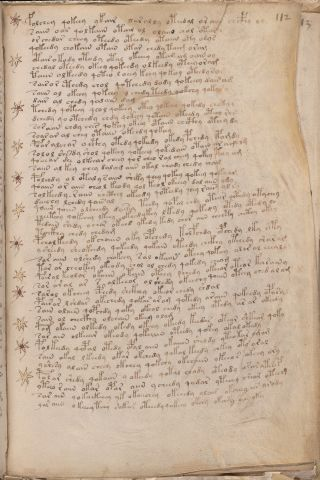

# Voynich Speculative Procedural Protocol — f112r

IMPORTANT: this is NOT a real or validated translation of the Voynich Manuscript. It is a speculative/procedural model that interprets EVA using a user-defined grammar to generate experimental recipes using safe, known edible substitutes.

This file is generated automatically from IVTFF/EVA transliteration plus a user-defined procedural grammar.



## Page / Folio
- currier: B
- folio: f112r
- page_number: 226

## EVA Text (Transliteration)
```text
folchey qokeey ykair @185;arally oteedal or aiin chcphy
saiin oar qolkaiin otail ol olaiin chol otar
or chedar cheey oteedy oteedy otaiin oty odys
qokeedy chokain otain otar chedy taim oram
otair o kody otody otal okeeey otar am oain oy
chedal oteedy okeey qokeedy olkeedy oteeyoram
taiin olkeedy qoteo l oeey keey qokeey oteedyram
sairo r ethedy chol qotchedy dody qokeeey dairam
saiin ol okeey qokeey [y:o] chedy teedy qokchy qokar y
dair al chedy qodain dam
tchedy qoteey qeol qokeey otey qokeey qokedy chotyr
dchedy qo otchedy chdy qokeey qotain oteedy oteey ror
sor aiin chdy ches qokeey okeey otaiin chcthy oteey dy
soarar al chey otaiin okeedy qokeey
poar alchar octhy otedy qokeedy okedy pchedy opamdy
solol she?dy shol qokeey qokeeey qokedain otain ar amchg
qoeeea[r:n] she olkeear cheey qor cheo ral cheey qokey t[ee:a]y am
saiin al key chey dalchd aiin okal chody chedy cham
polchdy o l otal y raiin sheky qeey qokey qokeey qoky am
qoaiin or aiin cheol keody qol keol okeeey dal aiin ody
sol keedy raiin chcthey okeedy qoteedy qeey rair al sy
daichy lchedy qoinal
qoain qoiin olcheedy dairiy teedy qopol chdy oteor octhdy otychey
cheeteey qokeeey lkeey okeedykey lkedy qokedy otedy otedy lo
tedain shedy ochor okchd ykedy kedy chor aiin cheety chcthy okey
tockhy chedy chedam
pcholkeedy okchoiiin aky opchedy kolfchdy opchedy lky shty
ysheedy sheokeedy qokeedy qokain oteedy chckhy ytchedy shara[m:r]
sar aiin olshedy chokeey sal okaiin oteey qokeey olor al chealy
tar ar cheokey okeody chol ol chedy qokedy cheom
pair al keolor okaiin otain oteey lchedy okeeor oteor karainy
sor ar al ar s alkeeor ol shedy okeechy qoiiin oteey ched alam
sarol okcheey cphedy shckhey okeeor chedy shdal
pair ar l shdar okechedy qokar aram qotedy araiin qokchdy opary
sain olaiin qopchdy qoky okeal chedy okeey otedy ar ar okeedy
sain ol checkhy olchain okeey olam
pam okaiin olkedy okedy okeey okeedy keedar otear shkear qoky
sar ain olkeear okeody qok[?:a]iin oteedy qokey okal okedy
polkeedy qopal otedy opal aiin okaiiin sheody yteokar ogom
sain okal lkeedy okar okchedy qokal keedy chkey oty oral
yshesy alain cheey okchey qokchy okchaiin ykeeor okeey ory
pol ar shedy qokaiin [y:o] okeedy qotal chody oteody araryteop
yteeo r aiin okar opor aiin ycheedy q[ee:o]dar yteeey sheor oteeg
sar ain qok[o:a]ekeeey yk [?:a]koeechey okeeedy alair [a:o]kcheey ar arody
yor aiin o keeey teey shkar oteeedyqokeey okeey okary oin yky
```

## Domain Context (Heuristic; Not a Translation)

This section summarizes recurring **basewords** in this IVTFF domain and shows simple substring evidence that the token markers used by the procedural grammar occur inside frequent words.

Any Italian anagram / English gloss is a best-effort lexicon match, not a decipherment.


### Associated basewords (non-generic; top by frequency in this domain)
- `daiin` (count=231) → Italian anagram `piani`; English: plans (arrangements)
- `qokaiin` (count=122) → Italian anagram `ciancio`; English: [n/a]
- `okaiin` (count=109) → Italian anagram `coniai`; English: [n/a]
- `qokain` (count=101) → Italian anagram `acconi`; English: [n/a]
- `okain` (count=69) → Italian anagram `acino`; English: a berry
- `otain` (count=53) → Italian anagram `anito`; English: [n/a]
- `qokar` (count=48) → Italian anagram `carco`; English: [n/a]
- `saiin` (count=46) → Italian anagram `asini`; English: [n/a]
- `qokal` (count=43) → Italian anagram `calco`; English: cast (of sculpture)
- `qotaiin` (count=40) → Italian anagram `cationi`; English: [n/a]
- `lkaiin` (count=39) → Italian anagram `ancili`; English: [n/a]
- `kaiin` (count=37) → Italian anagram `acini`; English: [n/a]
- `qokeol` (count=37) → Italian anagram `eccolo`; English: [n/a]
- `qotain` (count=34) → Italian anagram `antico`; English: ancient
- `qotar` (count=29) → Italian anagram `corta`; English: [n/a]

### Marker evidence (substring in frequent basewords)
- `qo`: 60 basewords; examples: `qokeey`, `qokeedy`, `qokaiin`, `qokain`, `qokedy`, `qokey`
- `q`: 61 basewords; examples: `qokeey`, `qokeedy`, `qokaiin`, `qokain`, `qokedy`, `qokey`
- `o`: 262 basewords; examples: `qokeey`, `ol`, `o`, `qokeedy`, `okeey`, `qokaiin`
- `k`: 147 basewords; examples: `qokeey`, `qokeedy`, `okeey`, `qokaiin`, `okaiin`, `qokain`
- `t`: 102 basewords; examples: `otaiin`, `oteey`, `otar`, `otedy`, `otal`, `oteedy`
- `p`: 17 basewords; examples: `opchedy`, `qopchedy`, `opchey`, `pchedy`, `qopchdy`, `opchdy`
- `ch`: 137 basewords; examples: `chedy`, `chey`, `chol`, `cheey`, `cheol`, `cheody`
- `sh`: 50 basewords; examples: `shedy`, `shey`, `sheey`, `sheol`, `shol`, `sheedy`
- `f`: 1 basewords; examples: `f`
- `cth`: 16 basewords; examples: `chcthy`, `cthey`, `shcthy`, `checthy`, `cthol`, `ctheey`
- `ckh`: 15 basewords; examples: `chckhy`, `shckhy`, `checkhy`, `chckhey`, `chockhy`, `sheckhy`
- `cph`: 2 basewords; examples: `cphol`, `cphy`
- `dy`: 84 basewords; examples: `chedy`, `qokeedy`, `shedy`, `otedy`, `oteedy`, `qokedy`
- `iin`: 39 basewords; examples: `aiin`, `daiin`, `qokaiin`, `okaiin`, `otaiin`, `saiin`
- `aiin`: 33 basewords; examples: `aiin`, `daiin`, `qokaiin`, `okaiin`, `otaiin`, `saiin`

## Recipes Index (This Page)
- [f112r.1,@P0](#f112r-1-f112r-1-p0)
- [f112r.2,+P0](#f112r-2-f112r-2-p0)
- [f112r.3,+P0](#f112r-3-f112r-3-p0)
- [f112r.4,+P0](#f112r-4-f112r-4-p0)
- [f112r.5,+P0](#f112r-5-f112r-5-p0)
- [f112r.6,+P0](#f112r-6-f112r-6-p0)
- [f112r.7,+P0](#f112r-7-f112r-7-p0)
- [f112r.8,+P0](#f112r-8-f112r-8-p0)
- [f112r.9,+P0](#f112r-9-f112r-9-p0)
- [f112r.10,+P0](#f112r-10-f112r-10-p0)
- [f112r.11,+P0](#f112r-11-f112r-11-p0)
- [f112r.12,+P0](#f112r-12-f112r-12-p0)
- [f112r.13,+P0](#f112r-13-f112r-13-p0)
- [f112r.14,+P0](#f112r-14-f112r-14-p0)
- [f112r.15,+P0](#f112r-15-f112r-15-p0)
- [f112r.16,+P0](#f112r-16-f112r-16-p0)
- [f112r.17,+P0](#f112r-17-f112r-17-p0)
- [f112r.18,+P0](#f112r-18-f112r-18-p0)
- [f112r.19,+P0](#f112r-19-f112r-19-p0)
- [f112r.20,+P0](#f112r-20-f112r-20-p0)
- [f112r.21,+P0](#f112r-21-f112r-21-p0)
- [f112r.22,+P0](#f112r-22-f112r-22-p0)
- [f112r.23,+P0](#f112r-23-f112r-23-p0)
- [f112r.24,+P0](#f112r-24-f112r-24-p0)
- [f112r.25,+P0](#f112r-25-f112r-25-p0)
- [f112r.26,+P0](#f112r-26-f112r-26-p0)
- [f112r.27,+P0](#f112r-27-f112r-27-p0)
- [f112r.28,+P0](#f112r-28-f112r-28-p0)
- [f112r.29,+P0](#f112r-29-f112r-29-p0)
- [f112r.30,+P0](#f112r-30-f112r-30-p0)
- [f112r.31,+P0](#f112r-31-f112r-31-p0)
- [f112r.32,+P0](#f112r-32-f112r-32-p0)
- [f112r.33,+P0](#f112r-33-f112r-33-p0)
- [f112r.34,+P0](#f112r-34-f112r-34-p0)
- [f112r.35,+P0](#f112r-35-f112r-35-p0)
- [f112r.36,+P0](#f112r-36-f112r-36-p0)
- [f112r.37,+P0](#f112r-37-f112r-37-p0)
- [f112r.38,+P0](#f112r-38-f112r-38-p0)
- [f112r.39,+P0](#f112r-39-f112r-39-p0)
- [f112r.40,+P0](#f112r-40-f112r-40-p0)
- [f112r.41,+P0](#f112r-41-f112r-41-p0)
- [f112r.42,+P0](#f112r-42-f112r-42-p0)
- [f112r.43,+P0](#f112r-43-f112r-43-p0)
- [f112r.44,+P0](#f112r-44-f112r-44-p0)
- [f112r.45,+P0](#f112r-45-f112r-45-p0)

## Line Glosses (Procedural Gloss Only; Not a Translation)

<a id="f112r-1-f112r-1-p0"></a>

### f112r.1,@P0

EVA: folchey qokeey ykair @185;arally oteedal or aiin chcphy

Direct Gloss (Procedural, Not a Real Translation):
- folchey: add main plant (safe substitute) → add aroma modifier → mix / transfer → duration level 1 → state: active extraction
- qokeey: prepare liquid base → add fermentable sugars → duration level 2 → state: active extraction
- ykair: add fermentable sugars → duration level 1 → state: phase transition/start
- arally: duration level 1 → state: phase transition/start
- oteedal: apply heat/cooking → mix / transfer → add starter / activate → duration level 2 → state: active extraction
- or: mix / transfer
- aiin: duration level 1 → state: phase transition/start → long phase
- chcphy: add main plant (safe substitute) → add complex herbal compound (safe blend)

<a id="f112r-2-f112r-2-p0"></a>

### f112r.2,+P0

EVA: saiin oar qolkaiin otail ol olaiin chol otar

Direct Gloss (Procedural, Not a Real Translation):
- saiin: duration level 1 → state: phase transition/start → long phase
- oar: mix / transfer → duration level 1 → state: phase transition/start
- qolkaiin: prepare liquid base → add fermentable sugars → duration level 1 → state: phase transition/start → long phase
- otail: apply heat/cooking → mix / transfer → duration level 1 → state: phase transition/start
- ol: mix / transfer
- olaiin: mix / transfer → duration level 1 → state: phase transition/start → long phase
- chol: add main plant (safe substitute) → mix / transfer
- otar: apply heat/cooking → mix / transfer → duration level 1 → state: phase transition/start

<a id="f112r-3-f112r-3-p0"></a>

### f112r.3,+P0

EVA: or chedar cheey oteedy oteedy otaiin oty odys

Direct Gloss (Procedural, Not a Real Translation):
- or: mix / transfer
- chedar: add main plant (safe substitute) → add starter / activate → duration level 1 → state: active extraction
- cheey: add main plant (safe substitute) → duration level 2 → state: active extraction
- oteedy: apply heat/cooking → mix / transfer → add starter / activate → duration level 2 → state: active extraction
- oteedy: apply heat/cooking → mix / transfer → add starter / activate → duration level 2 → state: active extraction
- otaiin: apply heat/cooking → mix / transfer → duration level 1 → state: phase transition/start → long phase
- oty: apply heat/cooking → mix / transfer
- odys: mix / transfer → add starter / activate

<a id="f112r-4-f112r-4-p0"></a>

### f112r.4,+P0

EVA: qokeedy chokain otain otar chedy taim oram

Direct Gloss (Procedural, Not a Real Translation):
- qokeedy: prepare liquid base → add fermentable sugars → add starter / activate → duration level 2 → state: active extraction
- chokain: add fermentable sugars → add main plant (safe substitute) → mix / transfer → duration level 1 → state: phase transition/start
- otain: apply heat/cooking → mix / transfer → duration level 1 → state: phase transition/start
- otar: apply heat/cooking → mix / transfer → duration level 1 → state: phase transition/start
- chedy: add main plant (safe substitute) → add starter / activate → duration level 1 → state: active extraction
- taim: apply heat/cooking → duration level 1 → state: phase transition/start
- oram: mix / transfer → duration level 1 → state: phase transition/start

<a id="f112r-5-f112r-5-p0"></a>

### f112r.5,+P0

EVA: otair o kody otody otal okeeey otar am oain oy

Direct Gloss (Procedural, Not a Real Translation):
- otair: apply heat/cooking → mix / transfer → duration level 1 → state: phase transition/start
- o: mix / transfer
- kody: add fermentable sugars → mix / transfer → add starter / activate
- otody: apply heat/cooking → mix / transfer → add starter / activate
- otal: apply heat/cooking → mix / transfer → duration level 1 → state: phase transition/start
- okeeey: add fermentable sugars → mix / transfer → duration level 3 → state: active extraction
- otar: apply heat/cooking → mix / transfer → duration level 1 → state: phase transition/start
- am: duration level 1 → state: phase transition/start
- oain: mix / transfer → duration level 1 → state: phase transition/start
- oy: mix / transfer

<a id="f112r-6-f112r-6-p0"></a>

### f112r.6,+P0

EVA: chedal oteedy okeey qokeedy olkeedy oteeyoram

Direct Gloss (Procedural, Not a Real Translation):
- chedal: add main plant (safe substitute) → add starter / activate → duration level 1 → state: active extraction
- oteedy: apply heat/cooking → mix / transfer → add starter / activate → duration level 2 → state: active extraction
- okeey: add fermentable sugars → mix / transfer → duration level 2 → state: active extraction
- qokeedy: prepare liquid base → add fermentable sugars → add starter / activate → duration level 2 → state: active extraction
- olkeedy: add fermentable sugars → mix / transfer → add starter / activate → duration level 2 → state: active extraction
- oteeyoram: apply heat/cooking → mix / transfer → duration level 2 → state: active extraction

<a id="f112r-7-f112r-7-p0"></a>

### f112r.7,+P0

EVA: taiin olkeedy qoteo l oeey keey qokeey oteedyram

Direct Gloss (Procedural, Not a Real Translation):
- taiin: apply heat/cooking → duration level 1 → state: phase transition/start → long phase
- olkeedy: add fermentable sugars → mix / transfer → add starter / activate → duration level 2 → state: active extraction
- qoteo: prepare liquid base → apply heat/cooking → mix / transfer → duration level 1 → state: active extraction
- l: [unparsed]
- oeey: mix / transfer → duration level 2 → state: active extraction
- keey: add fermentable sugars → duration level 2 → state: active extraction
- qokeey: prepare liquid base → add fermentable sugars → duration level 2 → state: active extraction
- oteedyram: apply heat/cooking → mix / transfer → add starter / activate → duration level 2 → state: active extraction

<a id="f112r-8-f112r-8-p0"></a>

### f112r.8,+P0

EVA: sairo r ethedy chol qotchedy dody qokeeey dairam

Direct Gloss (Procedural, Not a Real Translation):
- sairo: mix / transfer → duration level 1 → state: phase transition/start
- r: [unparsed]
- ethedy: apply heat/cooking → add starter / activate → duration level 1 → state: active extraction → unmodeled token(s) present: h
- chol: add main plant (safe substitute) → mix / transfer
- qotchedy: prepare liquid base → apply heat/cooking → add main plant (safe substitute) → add starter / activate → duration level 1 → state: active extraction
- dody: mix / transfer → add starter / activate
- qokeeey: prepare liquid base → add fermentable sugars → duration level 3 → state: active extraction
- dairam: add starter / activate → duration level 1 → state: phase transition/start

<a id="f112r-9-f112r-9-p0"></a>

### f112r.9,+P0

EVA: saiin ol okeey qokeey [y:o] chedy teedy qokchy qokar y

Direct Gloss (Procedural, Not a Real Translation):
- saiin: duration level 1 → state: phase transition/start → long phase
- ol: mix / transfer
- okeey: add fermentable sugars → mix / transfer → duration level 2 → state: active extraction
- qokeey: prepare liquid base → add fermentable sugars → duration level 2 → state: active extraction
- y: [unparsed]
- o: mix / transfer
- chedy: add main plant (safe substitute) → add starter / activate → duration level 1 → state: active extraction
- teedy: apply heat/cooking → add starter / activate → duration level 2 → state: active extraction
- qokchy: prepare liquid base → add fermentable sugars → add main plant (safe substitute)
- qokar: prepare liquid base → add fermentable sugars → duration level 1 → state: phase transition/start
- y: [unparsed]

<a id="f112r-10-f112r-10-p0"></a>

### f112r.10,+P0

EVA: dair al chedy qodain dam

Direct Gloss (Procedural, Not a Real Translation):
- dair: add starter / activate → duration level 1 → state: phase transition/start
- al: duration level 1 → state: phase transition/start
- chedy: add main plant (safe substitute) → add starter / activate → duration level 1 → state: active extraction
- qodain: prepare liquid base → add starter / activate → duration level 1 → state: phase transition/start
- dam: add starter / activate → duration level 1 → state: phase transition/start

<a id="f112r-11-f112r-11-p0"></a>

### f112r.11,+P0

EVA: tchedy qoteey qeol qokeey otey qokeey qokedy chotyr

Direct Gloss (Procedural, Not a Real Translation):
- tchedy: apply heat/cooking → add main plant (safe substitute) → add starter / activate → duration level 1 → state: active extraction
- qoteey: prepare liquid base → apply heat/cooking → duration level 2 → state: active extraction
- qeol: prepare base (generic) → mix / transfer → duration level 1 → state: active extraction
- qokeey: prepare liquid base → add fermentable sugars → duration level 2 → state: active extraction
- otey: apply heat/cooking → mix / transfer → duration level 1 → state: active extraction
- qokeey: prepare liquid base → add fermentable sugars → duration level 2 → state: active extraction
- qokedy: prepare liquid base → add fermentable sugars → add starter / activate → duration level 1 → state: active extraction
- chotyr: apply heat/cooking → add main plant (safe substitute) → mix / transfer

<a id="f112r-12-f112r-12-p0"></a>

### f112r.12,+P0

EVA: dchedy qo otchedy chdy qokeey qotain oteedy oteey ror

Direct Gloss (Procedural, Not a Real Translation):
- dchedy: add main plant (safe substitute) → add starter / activate → duration level 1 → state: active extraction
- qo: prepare liquid base
- otchedy: apply heat/cooking → add main plant (safe substitute) → mix / transfer → add starter / activate → duration level 1 → state: active extraction
- chdy: add main plant (safe substitute) → add starter / activate
- qokeey: prepare liquid base → add fermentable sugars → duration level 2 → state: active extraction
- qotain: prepare liquid base → apply heat/cooking → duration level 1 → state: phase transition/start
- oteedy: apply heat/cooking → mix / transfer → add starter / activate → duration level 2 → state: active extraction
- oteey: apply heat/cooking → mix / transfer → duration level 2 → state: active extraction
- ror: mix / transfer

<a id="f112r-13-f112r-13-p0"></a>

### f112r.13,+P0

EVA: sor aiin chdy ches qokeey okeey otaiin chcthy oteey dy

Direct Gloss (Procedural, Not a Real Translation):
- sor: mix / transfer
- aiin: duration level 1 → state: phase transition/start → long phase
- chdy: add main plant (safe substitute) → add starter / activate
- ches: add main plant (safe substitute) → duration level 1 → state: active extraction
- qokeey: prepare liquid base → add fermentable sugars → duration level 2 → state: active extraction
- okeey: add fermentable sugars → mix / transfer → duration level 2 → state: active extraction
- otaiin: apply heat/cooking → mix / transfer → duration level 1 → state: phase transition/start → long phase
- chcthy: add main plant (safe substitute) → add complex herbal compound (safe blend)
- oteey: apply heat/cooking → mix / transfer → duration level 2 → state: active extraction
- dy: add starter / activate

<a id="f112r-14-f112r-14-p0"></a>

### f112r.14,+P0

EVA: soarar al chey otaiin okeedy qokeey

Direct Gloss (Procedural, Not a Real Translation):
- soarar: mix / transfer → duration level 1 → state: phase transition/start
- al: duration level 1 → state: phase transition/start
- chey: add main plant (safe substitute) → duration level 1 → state: active extraction
- otaiin: apply heat/cooking → mix / transfer → duration level 1 → state: phase transition/start → long phase
- okeedy: add fermentable sugars → mix / transfer → add starter / activate → duration level 2 → state: active extraction
- qokeey: prepare liquid base → add fermentable sugars → duration level 2 → state: active extraction

<a id="f112r-15-f112r-15-p0"></a>

### f112r.15,+P0

EVA: poar alchar octhy otedy qokeedy okedy pchedy opamdy

Direct Gloss (Procedural, Not a Real Translation):
- poar: mix / transfer → add starter / activate → duration level 1 → state: phase transition/start
- alchar: add main plant (safe substitute) → duration level 1 → state: phase transition/start
- octhy: mix / transfer → add complex herbal compound (safe blend)
- otedy: apply heat/cooking → mix / transfer → add starter / activate → duration level 1 → state: active extraction
- qokeedy: prepare liquid base → add fermentable sugars → add starter / activate → duration level 2 → state: active extraction
- okedy: add fermentable sugars → mix / transfer → add starter / activate → duration level 1 → state: active extraction
- pchedy: add main plant (safe substitute) → add starter / activate → duration level 1 → state: active extraction
- opamdy: mix / transfer → add starter / activate → duration level 1 → state: phase transition/start

<a id="f112r-16-f112r-16-p0"></a>

### f112r.16,+P0

EVA: solol she?dy shol qokeey qokeeey qokedain otain ar amchg

Direct Gloss (Procedural, Not a Real Translation):
- solol: mix / transfer
- she: add secondary herb (safe substitute) → duration level 1 → state: active extraction
- dy: add starter / activate
- shol: add secondary herb (safe substitute) → mix / transfer
- qokeey: prepare liquid base → add fermentable sugars → duration level 2 → state: active extraction
- qokeeey: prepare liquid base → add fermentable sugars → duration level 3 → state: active extraction
- qokedain: prepare liquid base → add fermentable sugars → add starter / activate → duration level 1 → state: active extraction
- otain: apply heat/cooking → mix / transfer → duration level 1 → state: phase transition/start
- ar: duration level 1 → state: phase transition/start
- amchg: add main plant (safe substitute) → duration level 1 → state: phase transition/start

<a id="f112r-17-f112r-17-p0"></a>

### f112r.17,+P0

EVA: qoeeea[r:n] she olkeear cheey qor cheo ral cheey qokey t[ee:a]y am

Direct Gloss (Procedural, Not a Real Translation):
- qoeeea: prepare liquid base → duration level 3 → state: active extraction
- r: [unparsed]
- n: [unparsed]
- she: add secondary herb (safe substitute) → duration level 1 → state: active extraction
- olkeear: add fermentable sugars → mix / transfer → duration level 2 → state: active extraction
- cheey: add main plant (safe substitute) → duration level 2 → state: active extraction
- qor: prepare liquid base
- cheo: add main plant (safe substitute) → mix / transfer → duration level 1 → state: active extraction
- ral: duration level 1 → state: phase transition/start
- cheey: add main plant (safe substitute) → duration level 2 → state: active extraction
- qokey: prepare liquid base → add fermentable sugars → duration level 1 → state: active extraction
- t: apply heat/cooking
- ee: duration level 2 → state: active extraction
- a: duration level 1 → state: phase transition/start
- y: [unparsed]
- am: duration level 1 → state: phase transition/start

<a id="f112r-18-f112r-18-p0"></a>

### f112r.18,+P0

EVA: saiin al key chey dalchd aiin okal chody chedy cham

Direct Gloss (Procedural, Not a Real Translation):
- saiin: duration level 1 → state: phase transition/start → long phase
- al: duration level 1 → state: phase transition/start
- key: add fermentable sugars → duration level 1 → state: active extraction
- chey: add main plant (safe substitute) → duration level 1 → state: active extraction
- dalchd: add main plant (safe substitute) → add starter / activate → duration level 1 → state: phase transition/start
- aiin: duration level 1 → state: phase transition/start → long phase
- okal: add fermentable sugars → mix / transfer → duration level 1 → state: phase transition/start
- chody: add main plant (safe substitute) → mix / transfer → add starter / activate
- chedy: add main plant (safe substitute) → add starter / activate → duration level 1 → state: active extraction
- cham: add main plant (safe substitute) → duration level 1 → state: phase transition/start

<a id="f112r-19-f112r-19-p0"></a>

### f112r.19,+P0

EVA: polchdy o l otal y raiin sheky qeey qokey qokeey qoky am

Direct Gloss (Procedural, Not a Real Translation):
- polchdy: add main plant (safe substitute) → mix / transfer → add starter / activate
- o: mix / transfer
- l: [unparsed]
- otal: apply heat/cooking → mix / transfer → duration level 1 → state: phase transition/start
- y: [unparsed]
- raiin: duration level 1 → state: phase transition/start → long phase
- sheky: add fermentable sugars → add secondary herb (safe substitute) → duration level 1 → state: active extraction
- qeey: prepare base (generic) → duration level 2 → state: active extraction
- qokey: prepare liquid base → add fermentable sugars → duration level 1 → state: active extraction
- qokeey: prepare liquid base → add fermentable sugars → duration level 2 → state: active extraction
- qoky: prepare liquid base → add fermentable sugars
- am: duration level 1 → state: phase transition/start

<a id="f112r-20-f112r-20-p0"></a>

### f112r.20,+P0

EVA: qoaiin or aiin cheol keody qol keol okeeey dal aiin ody

Direct Gloss (Procedural, Not a Real Translation):
- qoaiin: prepare liquid base → duration level 1 → state: phase transition/start → long phase
- or: mix / transfer
- aiin: duration level 1 → state: phase transition/start → long phase
- cheol: add main plant (safe substitute) → mix / transfer → duration level 1 → state: active extraction
- keody: add fermentable sugars → mix / transfer → add starter / activate → duration level 1 → state: active extraction
- qol: prepare liquid base
- keol: add fermentable sugars → mix / transfer → duration level 1 → state: active extraction
- okeeey: add fermentable sugars → mix / transfer → duration level 3 → state: active extraction
- dal: add starter / activate → duration level 1 → state: phase transition/start
- aiin: duration level 1 → state: phase transition/start → long phase
- ody: mix / transfer → add starter / activate

<a id="f112r-21-f112r-21-p0"></a>

### f112r.21,+P0

EVA: sol keedy raiin chcthey okeedy qoteedy qeey rair al sy

Direct Gloss (Procedural, Not a Real Translation):
- sol: mix / transfer
- keedy: add fermentable sugars → add starter / activate → duration level 2 → state: active extraction
- raiin: duration level 1 → state: phase transition/start → long phase
- chcthey: add main plant (safe substitute) → add complex herbal compound (safe blend) → duration level 1 → state: active extraction
- okeedy: add fermentable sugars → mix / transfer → add starter / activate → duration level 2 → state: active extraction
- qoteedy: prepare liquid base → apply heat/cooking → add starter / activate → duration level 2 → state: active extraction
- qeey: prepare base (generic) → duration level 2 → state: active extraction
- rair: duration level 1 → state: phase transition/start
- al: duration level 1 → state: phase transition/start
- sy: [unparsed]

<a id="f112r-22-f112r-22-p0"></a>

### f112r.22,+P0

EVA: daichy lchedy qoinal

Direct Gloss (Procedural, Not a Real Translation):
- daichy: add main plant (safe substitute) → add starter / activate → duration level 1 → state: phase transition/start
- lchedy: add main plant (safe substitute) → add starter / activate → duration level 1 → state: active extraction
- qoinal: prepare liquid base → duration level 1 → state: cooling/rest

<a id="f112r-23-f112r-23-p0"></a>

### f112r.23,+P0

EVA: qoain qoiin olcheedy dairiy teedy qopol chdy oteor octhdy otychey

Direct Gloss (Procedural, Not a Real Translation):
- qoain: prepare liquid base → duration level 1 → state: phase transition/start
- qoiin: prepare liquid base → duration level 2 → state: cooling/rest → medium phase
- olcheedy: add main plant (safe substitute) → mix / transfer → add starter / activate → duration level 2 → state: active extraction
- dairiy: add starter / activate → duration level 1 → state: phase transition/start
- teedy: apply heat/cooking → add starter / activate → duration level 2 → state: active extraction
- qopol: prepare liquid base → mix / transfer → add starter / activate
- chdy: add main plant (safe substitute) → add starter / activate
- oteor: apply heat/cooking → mix / transfer → duration level 1 → state: active extraction
- octhdy: mix / transfer → add starter / activate → add complex herbal compound (safe blend)
- otychey: apply heat/cooking → add main plant (safe substitute) → mix / transfer → duration level 1 → state: active extraction

<a id="f112r-24-f112r-24-p0"></a>

### f112r.24,+P0

EVA: cheeteey qokeeey lkeey okeedykey lkedy qokedy otedy otedy lo

Direct Gloss (Procedural, Not a Real Translation):
- cheeteey: apply heat/cooking → add main plant (safe substitute) → duration level 2 → state: active extraction
- qokeeey: prepare liquid base → add fermentable sugars → duration level 3 → state: active extraction
- lkeey: add fermentable sugars → duration level 2 → state: active extraction
- okeedykey: add fermentable sugars → mix / transfer → add starter / activate → duration level 2 → state: active extraction
- lkedy: add fermentable sugars → add starter / activate → duration level 1 → state: active extraction
- qokedy: prepare liquid base → add fermentable sugars → add starter / activate → duration level 1 → state: active extraction
- otedy: apply heat/cooking → mix / transfer → add starter / activate → duration level 1 → state: active extraction
- otedy: apply heat/cooking → mix / transfer → add starter / activate → duration level 1 → state: active extraction
- lo: mix / transfer

<a id="f112r-25-f112r-25-p0"></a>

### f112r.25,+P0

EVA: tedain shedy ochor okchd ykedy kedy chor aiin cheety chcthy okey

Direct Gloss (Procedural, Not a Real Translation):
- tedain: apply heat/cooking → add starter / activate → duration level 1 → state: active extraction
- shedy: add secondary herb (safe substitute) → add starter / activate → duration level 1 → state: active extraction
- ochor: add main plant (safe substitute) → mix / transfer
- okchd: add fermentable sugars → add main plant (safe substitute) → mix / transfer → add starter / activate
- ykedy: add fermentable sugars → add starter / activate → duration level 1 → state: active extraction
- kedy: add fermentable sugars → add starter / activate → duration level 1 → state: active extraction
- chor: add main plant (safe substitute) → mix / transfer
- aiin: duration level 1 → state: phase transition/start → long phase
- cheety: apply heat/cooking → add main plant (safe substitute) → duration level 2 → state: active extraction
- chcthy: add main plant (safe substitute) → add complex herbal compound (safe blend)
- okey: add fermentable sugars → mix / transfer → duration level 1 → state: active extraction

<a id="f112r-26-f112r-26-p0"></a>

### f112r.26,+P0

EVA: tockhy chedy chedam

Direct Gloss (Procedural, Not a Real Translation):
- tockhy: apply heat/cooking → mix / transfer → add complex herbal compound (safe blend)
- chedy: add main plant (safe substitute) → add starter / activate → duration level 1 → state: active extraction
- chedam: add main plant (safe substitute) → add starter / activate → duration level 1 → state: active extraction

<a id="f112r-27-f112r-27-p0"></a>

### f112r.27,+P0

EVA: pcholkeedy okchoiiin aky opchedy kolfchdy opchedy lky shty

Direct Gloss (Procedural, Not a Real Translation):
- pcholkeedy: add fermentable sugars → add main plant (safe substitute) → mix / transfer → add starter / activate → duration level 2 → state: active extraction
- okchoiiin: add fermentable sugars → add main plant (safe substitute) → mix / transfer → duration level 3 → state: cooling/rest → medium phase
- aky: add fermentable sugars → duration level 1 → state: phase transition/start
- opchedy: add main plant (safe substitute) → mix / transfer → add starter / activate → duration level 1 → state: active extraction
- kolfchdy: add fermentable sugars → add main plant (safe substitute) → add aroma modifier → mix / transfer → add starter / activate
- opchedy: add main plant (safe substitute) → mix / transfer → add starter / activate → duration level 1 → state: active extraction
- lky: add fermentable sugars
- shty: apply heat/cooking → add secondary herb (safe substitute)

<a id="f112r-28-f112r-28-p0"></a>

### f112r.28,+P0

EVA: ysheedy sheokeedy qokeedy qokain oteedy chckhy ytchedy shara[m:r]

Direct Gloss (Procedural, Not a Real Translation):
- ysheedy: add secondary herb (safe substitute) → add starter / activate → duration level 2 → state: active extraction
- sheokeedy: add fermentable sugars → add secondary herb (safe substitute) → mix / transfer → add starter / activate → duration level 1 → state: active extraction
- qokeedy: prepare liquid base → add fermentable sugars → add starter / activate → duration level 2 → state: active extraction
- qokain: prepare liquid base → add fermentable sugars → duration level 1 → state: phase transition/start
- oteedy: apply heat/cooking → mix / transfer → add starter / activate → duration level 2 → state: active extraction
- chckhy: add main plant (safe substitute) → add complex herbal compound (safe blend)
- ytchedy: apply heat/cooking → add main plant (safe substitute) → add starter / activate → duration level 1 → state: active extraction
- shara: add secondary herb (safe substitute) → duration level 1 → state: phase transition/start
- m: [unparsed]
- r: [unparsed]

<a id="f112r-29-f112r-29-p0"></a>

### f112r.29,+P0

EVA: sar aiin olshedy chokeey sal okaiin oteey qokeey olor al chealy

Direct Gloss (Procedural, Not a Real Translation):
- sar: duration level 1 → state: phase transition/start
- aiin: duration level 1 → state: phase transition/start → long phase
- olshedy: add secondary herb (safe substitute) → mix / transfer → add starter / activate → duration level 1 → state: active extraction
- chokeey: add fermentable sugars → add main plant (safe substitute) → mix / transfer → duration level 2 → state: active extraction
- sal: duration level 1 → state: phase transition/start
- okaiin: add fermentable sugars → mix / transfer → duration level 1 → state: phase transition/start → long phase
- oteey: apply heat/cooking → mix / transfer → duration level 2 → state: active extraction
- qokeey: prepare liquid base → add fermentable sugars → duration level 2 → state: active extraction
- olor: mix / transfer
- al: duration level 1 → state: phase transition/start
- chealy: add main plant (safe substitute) → duration level 1 → state: active extraction

<a id="f112r-30-f112r-30-p0"></a>

### f112r.30,+P0

EVA: tar ar cheokey okeody chol ol chedy qokedy cheom

Direct Gloss (Procedural, Not a Real Translation):
- tar: apply heat/cooking → duration level 1 → state: phase transition/start
- ar: duration level 1 → state: phase transition/start
- cheokey: add fermentable sugars → add main plant (safe substitute) → mix / transfer → duration level 1 → state: active extraction
- okeody: add fermentable sugars → mix / transfer → add starter / activate → duration level 1 → state: active extraction
- chol: add main plant (safe substitute) → mix / transfer
- ol: mix / transfer
- chedy: add main plant (safe substitute) → add starter / activate → duration level 1 → state: active extraction
- qokedy: prepare liquid base → add fermentable sugars → add starter / activate → duration level 1 → state: active extraction
- cheom: add main plant (safe substitute) → mix / transfer → duration level 1 → state: active extraction

<a id="f112r-31-f112r-31-p0"></a>

### f112r.31,+P0

EVA: pair al keolor okaiin otain oteey lchedy okeeor oteor karainy

Direct Gloss (Procedural, Not a Real Translation):
- pair: add starter / activate → duration level 1 → state: phase transition/start
- al: duration level 1 → state: phase transition/start
- keolor: add fermentable sugars → mix / transfer → duration level 1 → state: active extraction
- okaiin: add fermentable sugars → mix / transfer → duration level 1 → state: phase transition/start → long phase
- otain: apply heat/cooking → mix / transfer → duration level 1 → state: phase transition/start
- oteey: apply heat/cooking → mix / transfer → duration level 2 → state: active extraction
- lchedy: add main plant (safe substitute) → add starter / activate → duration level 1 → state: active extraction
- okeeor: add fermentable sugars → mix / transfer → duration level 2 → state: active extraction
- oteor: apply heat/cooking → mix / transfer → duration level 1 → state: active extraction
- karainy: add fermentable sugars → duration level 1 → state: phase transition/start

<a id="f112r-32-f112r-32-p0"></a>

### f112r.32,+P0

EVA: sor ar al ar s alkeeor ol shedy okeechy qoiiin oteey ched alam

Direct Gloss (Procedural, Not a Real Translation):
- sor: mix / transfer
- ar: duration level 1 → state: phase transition/start
- al: duration level 1 → state: phase transition/start
- ar: duration level 1 → state: phase transition/start
- s: [unparsed]
- alkeeor: add fermentable sugars → mix / transfer → duration level 1 → state: phase transition/start
- ol: mix / transfer
- shedy: add secondary herb (safe substitute) → add starter / activate → duration level 1 → state: active extraction
- okeechy: add fermentable sugars → add main plant (safe substitute) → mix / transfer → duration level 2 → state: active extraction
- qoiiin: prepare liquid base → duration level 3 → state: cooling/rest → medium phase
- oteey: apply heat/cooking → mix / transfer → duration level 2 → state: active extraction
- ched: add main plant (safe substitute) → add starter / activate → duration level 1 → state: active extraction
- alam: duration level 1 → state: phase transition/start

<a id="f112r-33-f112r-33-p0"></a>

### f112r.33,+P0

EVA: sarol okcheey cphedy shckhey okeeor chedy shdal

Direct Gloss (Procedural, Not a Real Translation):
- sarol: mix / transfer → duration level 1 → state: phase transition/start
- okcheey: add fermentable sugars → add main plant (safe substitute) → mix / transfer → duration level 2 → state: active extraction
- cphedy: add starter / activate → add complex herbal compound (safe blend) → duration level 1 → state: active extraction
- shckhey: add secondary herb (safe substitute) → add complex herbal compound (safe blend) → duration level 1 → state: active extraction
- okeeor: add fermentable sugars → mix / transfer → duration level 2 → state: active extraction
- chedy: add main plant (safe substitute) → add starter / activate → duration level 1 → state: active extraction
- shdal: add secondary herb (safe substitute) → add starter / activate → duration level 1 → state: phase transition/start

<a id="f112r-34-f112r-34-p0"></a>

### f112r.34,+P0

EVA: pair ar l shdar okechedy qokar aram qotedy araiin qokchdy opary

Direct Gloss (Procedural, Not a Real Translation):
- pair: add starter / activate → duration level 1 → state: phase transition/start
- ar: duration level 1 → state: phase transition/start
- l: [unparsed]
- shdar: add secondary herb (safe substitute) → add starter / activate → duration level 1 → state: phase transition/start
- okechedy: add fermentable sugars → add main plant (safe substitute) → mix / transfer → add starter / activate → duration level 1 → state: active extraction
- qokar: prepare liquid base → add fermentable sugars → duration level 1 → state: phase transition/start
- aram: duration level 1 → state: phase transition/start
- qotedy: prepare liquid base → apply heat/cooking → add starter / activate → duration level 1 → state: active extraction
- araiin: duration level 1 → state: phase transition/start → long phase
- qokchdy: prepare liquid base → add fermentable sugars → add main plant (safe substitute) → add starter / activate
- opary: mix / transfer → add starter / activate → duration level 1 → state: phase transition/start

<a id="f112r-35-f112r-35-p0"></a>

### f112r.35,+P0

EVA: sain olaiin qopchdy qoky okeal chedy okeey otedy ar ar okeedy

Direct Gloss (Procedural, Not a Real Translation):
- sain: duration level 1 → state: phase transition/start
- olaiin: mix / transfer → duration level 1 → state: phase transition/start → long phase
- qopchdy: prepare liquid base → add main plant (safe substitute) → add starter / activate
- qoky: prepare liquid base → add fermentable sugars
- okeal: add fermentable sugars → mix / transfer → duration level 1 → state: active extraction
- chedy: add main plant (safe substitute) → add starter / activate → duration level 1 → state: active extraction
- okeey: add fermentable sugars → mix / transfer → duration level 2 → state: active extraction
- otedy: apply heat/cooking → mix / transfer → add starter / activate → duration level 1 → state: active extraction
- ar: duration level 1 → state: phase transition/start
- ar: duration level 1 → state: phase transition/start
- okeedy: add fermentable sugars → mix / transfer → add starter / activate → duration level 2 → state: active extraction

<a id="f112r-36-f112r-36-p0"></a>

### f112r.36,+P0

EVA: sain ol checkhy olchain okeey olam

Direct Gloss (Procedural, Not a Real Translation):
- sain: duration level 1 → state: phase transition/start
- ol: mix / transfer
- checkhy: add main plant (safe substitute) → add complex herbal compound (safe blend) → duration level 1 → state: active extraction
- olchain: add main plant (safe substitute) → mix / transfer → duration level 1 → state: phase transition/start
- okeey: add fermentable sugars → mix / transfer → duration level 2 → state: active extraction
- olam: mix / transfer → duration level 1 → state: phase transition/start

<a id="f112r-37-f112r-37-p0"></a>

### f112r.37,+P0

EVA: pam okaiin olkedy okedy okeey okeedy keedar otear shkear qoky

Direct Gloss (Procedural, Not a Real Translation):
- pam: add starter / activate → duration level 1 → state: phase transition/start
- okaiin: add fermentable sugars → mix / transfer → duration level 1 → state: phase transition/start → long phase
- olkedy: add fermentable sugars → mix / transfer → add starter / activate → duration level 1 → state: active extraction
- okedy: add fermentable sugars → mix / transfer → add starter / activate → duration level 1 → state: active extraction
- okeey: add fermentable sugars → mix / transfer → duration level 2 → state: active extraction
- okeedy: add fermentable sugars → mix / transfer → add starter / activate → duration level 2 → state: active extraction
- keedar: add fermentable sugars → add starter / activate → duration level 2 → state: active extraction
- otear: apply heat/cooking → mix / transfer → duration level 1 → state: active extraction
- shkear: add fermentable sugars → add secondary herb (safe substitute) → duration level 1 → state: active extraction
- qoky: prepare liquid base → add fermentable sugars

<a id="f112r-38-f112r-38-p0"></a>

### f112r.38,+P0

EVA: sar ain olkeear okeody qok[?:a]iin oteedy qokey okal okedy

Direct Gloss (Procedural, Not a Real Translation):
- sar: duration level 1 → state: phase transition/start
- ain: duration level 1 → state: phase transition/start
- olkeear: add fermentable sugars → mix / transfer → duration level 2 → state: active extraction
- okeody: add fermentable sugars → mix / transfer → add starter / activate → duration level 1 → state: active extraction
- qok: prepare liquid base → add fermentable sugars
- a: duration level 1 → state: phase transition/start
- iin: duration level 2 → state: cooling/rest → medium phase
- oteedy: apply heat/cooking → mix / transfer → add starter / activate → duration level 2 → state: active extraction
- qokey: prepare liquid base → add fermentable sugars → duration level 1 → state: active extraction
- okal: add fermentable sugars → mix / transfer → duration level 1 → state: phase transition/start
- okedy: add fermentable sugars → mix / transfer → add starter / activate → duration level 1 → state: active extraction

<a id="f112r-39-f112r-39-p0"></a>

### f112r.39,+P0

EVA: polkeedy qopal otedy opal aiin okaiiin sheody yteokar ogom

Direct Gloss (Procedural, Not a Real Translation):
- polkeedy: add fermentable sugars → mix / transfer → add starter / activate → duration level 2 → state: active extraction
- qopal: prepare liquid base → add starter / activate → duration level 1 → state: phase transition/start
- otedy: apply heat/cooking → mix / transfer → add starter / activate → duration level 1 → state: active extraction
- opal: mix / transfer → add starter / activate → duration level 1 → state: phase transition/start
- aiin: duration level 1 → state: phase transition/start → long phase
- okaiiin: add fermentable sugars → mix / transfer → duration level 1 → state: phase transition/start → medium phase
- sheody: add secondary herb (safe substitute) → mix / transfer → add starter / activate → duration level 1 → state: active extraction
- yteokar: add fermentable sugars → apply heat/cooking → mix / transfer → duration level 1 → state: active extraction
- ogom: mix / transfer

<a id="f112r-40-f112r-40-p0"></a>

### f112r.40,+P0

EVA: sain okal lkeedy okar okchedy qokal keedy chkey oty oral

Direct Gloss (Procedural, Not a Real Translation):
- sain: duration level 1 → state: phase transition/start
- okal: add fermentable sugars → mix / transfer → duration level 1 → state: phase transition/start
- lkeedy: add fermentable sugars → add starter / activate → duration level 2 → state: active extraction
- okar: add fermentable sugars → mix / transfer → duration level 1 → state: phase transition/start
- okchedy: add fermentable sugars → add main plant (safe substitute) → mix / transfer → add starter / activate → duration level 1 → state: active extraction
- qokal: prepare liquid base → add fermentable sugars → duration level 1 → state: phase transition/start
- keedy: add fermentable sugars → add starter / activate → duration level 2 → state: active extraction
- chkey: add fermentable sugars → add main plant (safe substitute) → duration level 1 → state: active extraction
- oty: apply heat/cooking → mix / transfer
- oral: mix / transfer → duration level 1 → state: phase transition/start

<a id="f112r-41-f112r-41-p0"></a>

### f112r.41,+P0

EVA: yshesy alain cheey okchey qokchy okchaiin ykeeor okeey ory

Direct Gloss (Procedural, Not a Real Translation):
- yshesy: add secondary herb (safe substitute) → duration level 1 → state: active extraction
- alain: duration level 1 → state: phase transition/start
- cheey: add main plant (safe substitute) → duration level 2 → state: active extraction
- okchey: add fermentable sugars → add main plant (safe substitute) → mix / transfer → duration level 1 → state: active extraction
- qokchy: prepare liquid base → add fermentable sugars → add main plant (safe substitute)
- okchaiin: add fermentable sugars → add main plant (safe substitute) → mix / transfer → duration level 1 → state: phase transition/start → long phase
- ykeeor: add fermentable sugars → mix / transfer → duration level 2 → state: active extraction
- okeey: add fermentable sugars → mix / transfer → duration level 2 → state: active extraction
- ory: mix / transfer

<a id="f112r-42-f112r-42-p0"></a>

### f112r.42,+P0

EVA: pol ar shedy qokaiin [y:o] okeedy qotal chody oteody araryteop

Direct Gloss (Procedural, Not a Real Translation):
- pol: mix / transfer → add starter / activate
- ar: duration level 1 → state: phase transition/start
- shedy: add secondary herb (safe substitute) → add starter / activate → duration level 1 → state: active extraction
- qokaiin: prepare liquid base → add fermentable sugars → duration level 1 → state: phase transition/start → long phase
- y: [unparsed]
- o: mix / transfer
- okeedy: add fermentable sugars → mix / transfer → add starter / activate → duration level 2 → state: active extraction
- qotal: prepare liquid base → apply heat/cooking → duration level 1 → state: phase transition/start
- chody: add main plant (safe substitute) → mix / transfer → add starter / activate
- oteody: apply heat/cooking → mix / transfer → add starter / activate → duration level 1 → state: active extraction
- araryteop: apply heat/cooking → mix / transfer → add starter / activate → duration level 1 → state: phase transition/start

<a id="f112r-43-f112r-43-p0"></a>

### f112r.43,+P0

EVA: yteeo r aiin okar opor aiin ycheedy q[ee:o]dar yteeey sheor oteeg

Direct Gloss (Procedural, Not a Real Translation):
- yteeo: apply heat/cooking → mix / transfer → duration level 2 → state: active extraction
- r: [unparsed]
- aiin: duration level 1 → state: phase transition/start → long phase
- okar: add fermentable sugars → mix / transfer → duration level 1 → state: phase transition/start
- opor: mix / transfer → add starter / activate
- aiin: duration level 1 → state: phase transition/start → long phase
- ycheedy: add main plant (safe substitute) → add starter / activate → duration level 2 → state: active extraction
- q: prepare base (generic)
- ee: duration level 2 → state: active extraction
- o: mix / transfer
- dar: add starter / activate → duration level 1 → state: phase transition/start
- yteeey: apply heat/cooking → duration level 3 → state: active extraction
- sheor: add secondary herb (safe substitute) → mix / transfer → duration level 1 → state: active extraction
- oteeg: apply heat/cooking → mix / transfer → duration level 2 → state: active extraction

<a id="f112r-44-f112r-44-p0"></a>

### f112r.44,+P0

EVA: sar ain qok[o:a]ekeeey yk [?:a]koeechey okeeedy alair [a:o]kcheey ar arody

Direct Gloss (Procedural, Not a Real Translation):
- sar: duration level 1 → state: phase transition/start
- ain: duration level 1 → state: phase transition/start
- qok: prepare liquid base → add fermentable sugars
- o: mix / transfer
- a: duration level 1 → state: phase transition/start
- ekeeey: add fermentable sugars → duration level 1 → state: active extraction
- yk: add fermentable sugars
- a: duration level 1 → state: phase transition/start
- koeechey: add fermentable sugars → add main plant (safe substitute) → mix / transfer → duration level 2 → state: active extraction
- okeeedy: add fermentable sugars → mix / transfer → add starter / activate → duration level 3 → state: active extraction
- alair: duration level 1 → state: phase transition/start
- a: duration level 1 → state: phase transition/start
- o: mix / transfer
- kcheey: add fermentable sugars → add main plant (safe substitute) → duration level 2 → state: active extraction
- ar: duration level 1 → state: phase transition/start
- arody: mix / transfer → add starter / activate → duration level 1 → state: phase transition/start

<a id="f112r-45-f112r-45-p0"></a>

### f112r.45,+P0

EVA: yor aiin o keeey teey shkar oteeedyqokeey okeey okary oin yky

Direct Gloss (Procedural, Not a Real Translation):
- yor: mix / transfer
- aiin: duration level 1 → state: phase transition/start → long phase
- o: mix / transfer
- keeey: add fermentable sugars → duration level 3 → state: active extraction
- teey: apply heat/cooking → duration level 2 → state: active extraction
- shkar: add fermentable sugars → add secondary herb (safe substitute) → duration level 1 → state: phase transition/start
- oteeedyqokeey: prepare liquid base → add fermentable sugars → apply heat/cooking → mix / transfer → add starter / activate → duration level 3 → state: active extraction
- okeey: add fermentable sugars → mix / transfer → duration level 2 → state: active extraction
- okary: add fermentable sugars → mix / transfer → duration level 1 → state: phase transition/start
- oin: mix / transfer → duration level 1 → state: cooling/rest
- yky: add fermentable sugars
