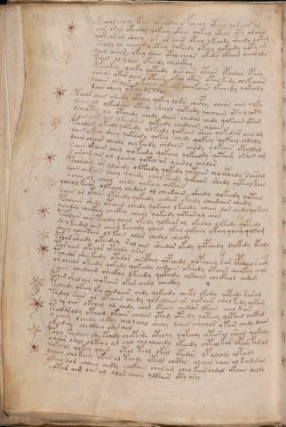

# Voynich Speculative Herbal Ferment Recipe — f112v

IMPORTANT: this is NOT a real or validated translation of the Voynich Manuscript. It is a speculative/procedural model that interprets EVA using a user-defined grammar to generate experimental recipes using safe, known edible substitutes.

This file is generated automatically from IVTFF/EVA transliteration plus a user-defined procedural grammar.



## Page / Folio
- currier: B
- folio: f112v
- page_number: 227

## EVA Text (Transliteration)
```text
keeoal chool opal otalair y fcheol oteey qor eees am
oar o[r:s]al okeeshy qokeey okain qokal okeol oty oraiin
qokeeor ar sheey or ar aiiin okeey l keeody sheedy qotam
shody qo oeeeody oteey qokeedy okeey qokeedy qoky am
sain aiiin okey daiin otal chear okedy okaiin cheeoldy
saiin [o:a]l oaiin okeeedy cheaikhy
pcheokeey oeeeky qoteedy oees aiin oteor opchdar opary
ocheor okar aiiin otaiin okal okar otal kedy chekaiiin
soaiin ar aiin okaiin otaiin cheekain okchedy qokchdy
dain sheey okchedy oror
tchor aiin odeedy oteeey qokey lody chcfhy ochos aiin olky
daiin al olkeedain oteey sheeol qokeedy qochaiin oteey qoty
dcheoty oy otchedy chedy daiin chedal chedy qokaiin otam
sain air a@175; ykeedain qokeedy chedaiin al[o:a]in
pchodain okeedy qokeedy olkeedy qokain sheey qokedar aiin am
sa[iin:ir] okeey sheey qoteedy qokey chedy qokeey qokeey chdaly
daiin ch[ear:eeir] chedy chy keedy chdaiin cheedy qokain otaldal
saiin or aiin chey qokeedy qokeeey qokeeody qotam olaiin am
s arain ain al qoeeey qoteo ar aiiinol chalor
pchoraiin ar alchedy olkeedy qokedy qotaiin chocthedy saisal
saiin chekain cheol qoeedy chol keedy qokaiin shedy qokeol kain
[s:e]oiin ol cheol chedy qokeey chetain
ycheol keeor olkeeey chedain ol cheedaiin sheedy qokeedy qotain
soiin or okain otchedy qokeedy eeed[ee:a][g:d] ckhedy cheedaiin cheedy
pchdaiin shedy otaiin cheedy qokeeey l keeedy cheey lor eeedy qokeey
ychedal checkhey checkhy cheeol qokeedy qoteosam chos
pchodain aiin teeedy qoeey okeedy qokeear al okedal olkeedy qotedy
shey keedal aiin cheol keeeody qoiin ykeey qokeeey ykeey qoeey qokaim
sheey qoeekain ol kain alor chedal sheody
polor sheedy okeedey sal aiin sheedar okedy qopchedy dalkedy opchdy
tar aiin okeear oteody arar
tchedor shee keedy otedar checphey qopchedy qopcheey kar opcheeo r aify
or cheeor okeedy qokedy qokeedy chedaiin okeeedy otaiin cheekey chol
saiin chedaiin checkhy lkeedy qokeedy chkaiin checkhol chdam
pched shedain qokaiin okees chedy checkhy
tchede okeey lky shedaiiin chdy qokeedy cheky lkedy qotedy raram
teedal sain ar otaiin shedy qokedaiin ar qokaiin chol kedy qokam
sa ar oiin okchey al chedy chol otaiin chedar lkain cheo dain
teodarody opcheed okaiin chaiin otam oteedy qoteey qotain chcthd
y cheol lchedy chckhy cheolchal shchy daiin cheolor okain chedy daiin
ykeedan checkhey oain chol
p[o:a]ly keedain she kchdy chotshe otechy qokchdy otara[y:g] shain qokedy
ooeeor oeeal olkeol al chol chl olchedy ykeedy chtal kar opchy famam
qokchal qokey qaiin otol teol okal otedar epalchdy alpchdy
ycheey chokeey okasal tchdy oteol chcthy alaiin char al kamdam
ykeey lor chaiin cheky chokain char am chey kain chdal okaiin daldy
[?:e] otar aig oaral alor aiiin olkaiin oty ary
```

## Recipes Index (This Page)
- [f112v.1,@P0](#f112v-1-f112v-1-p0)
- [f112v.2,+P0](#f112v-2-f112v-2-p0)
- [f112v.3,+P0](#f112v-3-f112v-3-p0)
- [f112v.4,+P0](#f112v-4-f112v-4-p0)
- [f112v.5,+P0](#f112v-5-f112v-5-p0)
- [f112v.6,+P0](#f112v-6-f112v-6-p0)
- [f112v.7,+P0](#f112v-7-f112v-7-p0)
- [f112v.8,+P0](#f112v-8-f112v-8-p0)
- [f112v.9,+P0](#f112v-9-f112v-9-p0)
- [f112v.10,+P0](#f112v-10-f112v-10-p0)
- [f112v.11,+P0](#f112v-11-f112v-11-p0)
- [f112v.12,+P0](#f112v-12-f112v-12-p0)
- [f112v.13,+P0](#f112v-13-f112v-13-p0)
- [f112v.14,+P0](#f112v-14-f112v-14-p0)
- [f112v.15,+P0](#f112v-15-f112v-15-p0)
- [f112v.16,+P0](#f112v-16-f112v-16-p0)
- [f112v.17,+P0](#f112v-17-f112v-17-p0)
- [f112v.18,+P0](#f112v-18-f112v-18-p0)
- [f112v.19,+P0](#f112v-19-f112v-19-p0)
- [f112v.20,+P0](#f112v-20-f112v-20-p0)
- [f112v.21,+P0](#f112v-21-f112v-21-p0)
- [f112v.22,+P0](#f112v-22-f112v-22-p0)
- [f112v.23,+P0](#f112v-23-f112v-23-p0)
- [f112v.24,+P0](#f112v-24-f112v-24-p0)
- [f112v.25,+P0](#f112v-25-f112v-25-p0)
- [f112v.26,+P0](#f112v-26-f112v-26-p0)
- [f112v.27,+P0](#f112v-27-f112v-27-p0)
- [f112v.28,+P0](#f112v-28-f112v-28-p0)
- [f112v.29,+P0](#f112v-29-f112v-29-p0)
- [f112v.30,+P0](#f112v-30-f112v-30-p0)
- [f112v.31,+P0](#f112v-31-f112v-31-p0)
- [f112v.32,+P0](#f112v-32-f112v-32-p0)
- [f112v.33,+P0](#f112v-33-f112v-33-p0)
- [f112v.34,+P0](#f112v-34-f112v-34-p0)
- [f112v.35,+P0](#f112v-35-f112v-35-p0)
- [f112v.36,+P0](#f112v-36-f112v-36-p0)
- [f112v.37,+P0](#f112v-37-f112v-37-p0)
- [f112v.38,+P0](#f112v-38-f112v-38-p0)
- [f112v.39,+P0](#f112v-39-f112v-39-p0)
- [f112v.40,+P0](#f112v-40-f112v-40-p0)
- [f112v.41,+P0](#f112v-41-f112v-41-p0)
- [f112v.42,+P0](#f112v-42-f112v-42-p0)
- [f112v.43,+P0](#f112v-43-f112v-43-p0)
- [f112v.44,+P0](#f112v-44-f112v-44-p0)
- [f112v.45,+P0](#f112v-45-f112v-45-p0)
- [f112v.46,+P0](#f112v-46-f112v-46-p0)
- [f112v.47,+P0](#f112v-47-f112v-47-p0)

## Line Glosses (Procedural Gloss Only; Not a Translation)

<a id="f112v-1-f112v-1-p0"></a>

### f112v.1,@P0

EVA: keeoal chool opal otalair y fcheol oteey qor eees am

Direct Gloss (Procedural, Not a Real Translation):
- keeoal: add fermentable sugars → mix / transfer → duration level 2 → state: active extraction
- chool: add main plant (safe substitute) → mix / transfer
- opal: mix / transfer → start fermentation (yeast) → duration level 1 → state: fermentation start
- otalair: apply heat/cooking → mix / transfer → duration level 1 → state: fermentation start
- y: [unparsed]
- fcheol: add main plant (safe substitute) → add aroma modifier → mix / transfer → duration level 1 → state: active extraction
- oteey: apply heat/cooking → mix / transfer → duration level 2 → state: active extraction
- qor: prepare liquid base
- eees: duration level 3 → state: active extraction
- am: duration level 1 → state: fermentation start

<a id="f112v-2-f112v-2-p0"></a>

### f112v.2,+P0

EVA: oar o[r:s]al okeeshy qokeey okain qokal okeol oty oraiin

Direct Gloss (Procedural, Not a Real Translation):
- oar: mix / transfer → duration level 1 → state: fermentation start
- o: mix / transfer
- r: [unparsed]
- s: [unparsed]
- al: duration level 1 → state: fermentation start
- okeeshy: add fermentable sugars → add secondary herb (safe substitute) → mix / transfer → duration level 2 → state: active extraction
- qokeey: prepare liquid base → add fermentable sugars → duration level 2 → state: active extraction
- okain: add fermentable sugars → mix / transfer → duration level 1 → state: fermentation start
- qokal: prepare liquid base → add fermentable sugars → duration level 1 → state: fermentation start
- okeol: add fermentable sugars → mix / transfer → duration level 1 → state: active extraction
- oty: apply heat/cooking → mix / transfer
- oraiin: mix / transfer → duration level 1 → state: fermentation start → long fermentation / aging phase

<a id="f112v-3-f112v-3-p0"></a>

### f112v.3,+P0

EVA: qokeeor ar sheey or ar aiiin okeey l keeody sheedy qotam

Direct Gloss (Procedural, Not a Real Translation):
- qokeeor: prepare liquid base → add fermentable sugars → mix / transfer → duration level 2 → state: active extraction
- ar: duration level 1 → state: fermentation start
- sheey: add secondary herb (safe substitute) → duration level 2 → state: active extraction
- or: mix / transfer
- ar: duration level 1 → state: fermentation start
- aiiin: duration level 1 → state: fermentation start → medium fermentation phase
- okeey: add fermentable sugars → mix / transfer → duration level 2 → state: active extraction
- l: [unparsed]
- keeody: add fermentable sugars → mix / transfer → start fermentation (yeast) → duration level 2 → state: active extraction
- sheedy: add secondary herb (safe substitute) → start fermentation (yeast) → duration level 2 → state: active extraction
- qotam: prepare liquid base → apply heat/cooking → duration level 1 → state: fermentation start

<a id="f112v-4-f112v-4-p0"></a>

### f112v.4,+P0

EVA: shody qo oeeeody oteey qokeedy okeey qokeedy qoky am

Direct Gloss (Procedural, Not a Real Translation):
- shody: add secondary herb (safe substitute) → mix / transfer → start fermentation (yeast)
- qo: prepare liquid base
- oeeeody: mix / transfer → start fermentation (yeast) → duration level 3 → state: active extraction
- oteey: apply heat/cooking → mix / transfer → duration level 2 → state: active extraction
- qokeedy: prepare liquid base → add fermentable sugars → start fermentation (yeast) → duration level 2 → state: active extraction
- okeey: add fermentable sugars → mix / transfer → duration level 2 → state: active extraction
- qokeedy: prepare liquid base → add fermentable sugars → start fermentation (yeast) → duration level 2 → state: active extraction
- qoky: prepare liquid base → add fermentable sugars
- am: duration level 1 → state: fermentation start

<a id="f112v-5-f112v-5-p0"></a>

### f112v.5,+P0

EVA: sain aiiin okey daiin otal chear okedy okaiin cheeoldy

Direct Gloss (Procedural, Not a Real Translation):
- sain: duration level 1 → state: fermentation start
- aiiin: duration level 1 → state: fermentation start → medium fermentation phase
- okey: add fermentable sugars → mix / transfer → duration level 1 → state: active extraction
- daiin: start fermentation (yeast) → duration level 1 → state: fermentation start → long fermentation / aging phase
- otal: apply heat/cooking → mix / transfer → duration level 1 → state: fermentation start
- chear: add main plant (safe substitute) → duration level 1 → state: active extraction
- okedy: add fermentable sugars → mix / transfer → start fermentation (yeast) → duration level 1 → state: active extraction
- okaiin: add fermentable sugars → mix / transfer → duration level 1 → state: fermentation start → long fermentation / aging phase
- cheeoldy: add main plant (safe substitute) → mix / transfer → start fermentation (yeast) → duration level 2 → state: active extraction

<a id="f112v-6-f112v-6-p0"></a>

### f112v.6,+P0

EVA: saiin [o:a]l oaiin okeeedy cheaikhy

Direct Gloss (Procedural, Not a Real Translation):
- saiin: duration level 1 → state: fermentation start → long fermentation / aging phase
- o: mix / transfer
- a: duration level 1 → state: fermentation start
- l: [unparsed]
- oaiin: mix / transfer → duration level 1 → state: fermentation start → long fermentation / aging phase
- okeeedy: add fermentable sugars → mix / transfer → start fermentation (yeast) → duration level 3 → state: active extraction
- cheaikhy: add fermentable sugars → add main plant (safe substitute) → duration level 1 → state: active extraction

<a id="f112v-7-f112v-7-p0"></a>

### f112v.7,+P0

EVA: pcheokeey oeeeky qoteedy oees aiin oteor opchdar opary

Direct Gloss (Procedural, Not a Real Translation):
- pcheokeey: add fermentable sugars → add main plant (safe substitute) → mix / transfer → start fermentation (yeast) → duration level 1 → state: active extraction
- oeeeky: add fermentable sugars → mix / transfer → duration level 3 → state: active extraction
- qoteedy: prepare liquid base → apply heat/cooking → start fermentation (yeast) → duration level 2 → state: active extraction
- oees: mix / transfer → duration level 2 → state: active extraction
- aiin: duration level 1 → state: fermentation start → long fermentation / aging phase
- oteor: apply heat/cooking → mix / transfer → duration level 1 → state: active extraction
- opchdar: add main plant (safe substitute) → mix / transfer → start fermentation (yeast) → duration level 1 → state: fermentation start
- opary: mix / transfer → start fermentation (yeast) → duration level 1 → state: fermentation start

<a id="f112v-8-f112v-8-p0"></a>

### f112v.8,+P0

EVA: ocheor okar aiiin otaiin okal okar otal kedy chekaiiin

Direct Gloss (Procedural, Not a Real Translation):
- ocheor: add main plant (safe substitute) → mix / transfer → duration level 1 → state: active extraction
- okar: add fermentable sugars → mix / transfer → duration level 1 → state: fermentation start
- aiiin: duration level 1 → state: fermentation start → medium fermentation phase
- otaiin: apply heat/cooking → mix / transfer → duration level 1 → state: fermentation start → long fermentation / aging phase
- okal: add fermentable sugars → mix / transfer → duration level 1 → state: fermentation start
- okar: add fermentable sugars → mix / transfer → duration level 1 → state: fermentation start
- otal: apply heat/cooking → mix / transfer → duration level 1 → state: fermentation start
- kedy: add fermentable sugars → start fermentation (yeast) → duration level 1 → state: active extraction
- chekaiiin: add fermentable sugars → add main plant (safe substitute) → duration level 1 → state: active extraction → medium fermentation phase

<a id="f112v-9-f112v-9-p0"></a>

### f112v.9,+P0

EVA: soaiin ar aiin okaiin otaiin cheekain okchedy qokchdy

Direct Gloss (Procedural, Not a Real Translation):
- soaiin: mix / transfer → duration level 1 → state: fermentation start → long fermentation / aging phase
- ar: duration level 1 → state: fermentation start
- aiin: duration level 1 → state: fermentation start → long fermentation / aging phase
- okaiin: add fermentable sugars → mix / transfer → duration level 1 → state: fermentation start → long fermentation / aging phase
- otaiin: apply heat/cooking → mix / transfer → duration level 1 → state: fermentation start → long fermentation / aging phase
- cheekain: add fermentable sugars → add main plant (safe substitute) → duration level 2 → state: active extraction
- okchedy: add fermentable sugars → add main plant (safe substitute) → mix / transfer → start fermentation (yeast) → duration level 1 → state: active extraction
- qokchdy: prepare liquid base → add fermentable sugars → add main plant (safe substitute) → start fermentation (yeast)

<a id="f112v-10-f112v-10-p0"></a>

### f112v.10,+P0

EVA: dain sheey okchedy oror

Direct Gloss (Procedural, Not a Real Translation):
- dain: start fermentation (yeast) → duration level 1 → state: fermentation start
- sheey: add secondary herb (safe substitute) → duration level 2 → state: active extraction
- okchedy: add fermentable sugars → add main plant (safe substitute) → mix / transfer → start fermentation (yeast) → duration level 1 → state: active extraction
- oror: mix / transfer

<a id="f112v-11-f112v-11-p0"></a>

### f112v.11,+P0

EVA: tchor aiin odeedy oteeey qokey lody chcfhy ochos aiin olky

Direct Gloss (Procedural, Not a Real Translation):
- tchor: apply heat/cooking → add main plant (safe substitute) → mix / transfer
- aiin: duration level 1 → state: fermentation start → long fermentation / aging phase
- odeedy: mix / transfer → start fermentation (yeast) → duration level 2 → state: active extraction
- oteeey: apply heat/cooking → mix / transfer → duration level 3 → state: active extraction
- qokey: prepare liquid base → add fermentable sugars → duration level 1 → state: active extraction
- lody: mix / transfer → start fermentation (yeast)
- chcfhy: add main plant (safe substitute) → add complex herbal compound (safe blend)
- ochos: add main plant (safe substitute) → mix / transfer
- aiin: duration level 1 → state: fermentation start → long fermentation / aging phase
- olky: add fermentable sugars → mix / transfer

<a id="f112v-12-f112v-12-p0"></a>

### f112v.12,+P0

EVA: daiin al olkeedain oteey sheeol qokeedy qochaiin oteey qoty

Direct Gloss (Procedural, Not a Real Translation):
- daiin: start fermentation (yeast) → duration level 1 → state: fermentation start → long fermentation / aging phase
- al: duration level 1 → state: fermentation start
- olkeedain: add fermentable sugars → mix / transfer → start fermentation (yeast) → duration level 2 → state: active extraction
- oteey: apply heat/cooking → mix / transfer → duration level 2 → state: active extraction
- sheeol: add secondary herb (safe substitute) → mix / transfer → duration level 2 → state: active extraction
- qokeedy: prepare liquid base → add fermentable sugars → start fermentation (yeast) → duration level 2 → state: active extraction
- qochaiin: prepare liquid base → add main plant (safe substitute) → duration level 1 → state: fermentation start → long fermentation / aging phase
- oteey: apply heat/cooking → mix / transfer → duration level 2 → state: active extraction
- qoty: prepare liquid base → apply heat/cooking

<a id="f112v-13-f112v-13-p0"></a>

### f112v.13,+P0

EVA: dcheoty oy otchedy chedy daiin chedal chedy qokaiin otam

Direct Gloss (Procedural, Not a Real Translation):
- dcheoty: apply heat/cooking → add main plant (safe substitute) → mix / transfer → start fermentation (yeast) → duration level 1 → state: active extraction
- oy: mix / transfer
- otchedy: apply heat/cooking → add main plant (safe substitute) → mix / transfer → start fermentation (yeast) → duration level 1 → state: active extraction
- chedy: add main plant (safe substitute) → start fermentation (yeast) → duration level 1 → state: active extraction
- daiin: start fermentation (yeast) → duration level 1 → state: fermentation start → long fermentation / aging phase
- chedal: add main plant (safe substitute) → start fermentation (yeast) → duration level 1 → state: active extraction
- chedy: add main plant (safe substitute) → start fermentation (yeast) → duration level 1 → state: active extraction
- qokaiin: prepare liquid base → add fermentable sugars → duration level 1 → state: fermentation start → long fermentation / aging phase
- otam: apply heat/cooking → mix / transfer → duration level 1 → state: fermentation start

<a id="f112v-14-f112v-14-p0"></a>

### f112v.14,+P0

EVA: sain air a@175; ykeedain qokeedy chedaiin al[o:a]in

Direct Gloss (Procedural, Not a Real Translation):
- sain: duration level 1 → state: fermentation start
- air: duration level 1 → state: fermentation start
- a: duration level 1 → state: fermentation start
- ykeedain: add fermentable sugars → start fermentation (yeast) → duration level 2 → state: active extraction
- qokeedy: prepare liquid base → add fermentable sugars → start fermentation (yeast) → duration level 2 → state: active extraction
- chedaiin: add main plant (safe substitute) → start fermentation (yeast) → duration level 1 → state: active extraction → long fermentation / aging phase
- al: duration level 1 → state: fermentation start
- o: mix / transfer
- a: duration level 1 → state: fermentation start
- in: duration level 1 → state: cooling/rest

<a id="f112v-15-f112v-15-p0"></a>

### f112v.15,+P0

EVA: pchodain okeedy qokeedy olkeedy qokain sheey qokedar aiin am

Direct Gloss (Procedural, Not a Real Translation):
- pchodain: add main plant (safe substitute) → mix / transfer → start fermentation (yeast) → duration level 1 → state: fermentation start
- okeedy: add fermentable sugars → mix / transfer → start fermentation (yeast) → duration level 2 → state: active extraction
- qokeedy: prepare liquid base → add fermentable sugars → start fermentation (yeast) → duration level 2 → state: active extraction
- olkeedy: add fermentable sugars → mix / transfer → start fermentation (yeast) → duration level 2 → state: active extraction
- qokain: prepare liquid base → add fermentable sugars → duration level 1 → state: fermentation start
- sheey: add secondary herb (safe substitute) → duration level 2 → state: active extraction
- qokedar: prepare liquid base → add fermentable sugars → start fermentation (yeast) → duration level 1 → state: active extraction
- aiin: duration level 1 → state: fermentation start → long fermentation / aging phase
- am: duration level 1 → state: fermentation start

<a id="f112v-16-f112v-16-p0"></a>

### f112v.16,+P0

EVA: sa[iin:ir] okeey sheey qoteedy qokey chedy qokeey qokeey chdaly

Direct Gloss (Procedural, Not a Real Translation):
- sa: duration level 1 → state: fermentation start
- iin: duration level 2 → state: cooling/rest → medium fermentation phase
- ir: duration level 1 → state: cooling/rest
- okeey: add fermentable sugars → mix / transfer → duration level 2 → state: active extraction
- sheey: add secondary herb (safe substitute) → duration level 2 → state: active extraction
- qoteedy: prepare liquid base → apply heat/cooking → start fermentation (yeast) → duration level 2 → state: active extraction
- qokey: prepare liquid base → add fermentable sugars → duration level 1 → state: active extraction
- chedy: add main plant (safe substitute) → start fermentation (yeast) → duration level 1 → state: active extraction
- qokeey: prepare liquid base → add fermentable sugars → duration level 2 → state: active extraction
- qokeey: prepare liquid base → add fermentable sugars → duration level 2 → state: active extraction
- chdaly: add main plant (safe substitute) → start fermentation (yeast) → duration level 1 → state: fermentation start

<a id="f112v-17-f112v-17-p0"></a>

### f112v.17,+P0

EVA: daiin ch[ear:eeir] chedy chy keedy chdaiin cheedy qokain otaldal

Direct Gloss (Procedural, Not a Real Translation):
- daiin: start fermentation (yeast) → duration level 1 → state: fermentation start → long fermentation / aging phase
- ch: add main plant (safe substitute)
- ear: duration level 1 → state: active extraction
- eeir: duration level 2 → state: active extraction
- chedy: add main plant (safe substitute) → start fermentation (yeast) → duration level 1 → state: active extraction
- chy: add main plant (safe substitute)
- keedy: add fermentable sugars → start fermentation (yeast) → duration level 2 → state: active extraction
- chdaiin: add main plant (safe substitute) → start fermentation (yeast) → duration level 1 → state: fermentation start → long fermentation / aging phase
- cheedy: add main plant (safe substitute) → start fermentation (yeast) → duration level 2 → state: active extraction
- qokain: prepare liquid base → add fermentable sugars → duration level 1 → state: fermentation start
- otaldal: apply heat/cooking → mix / transfer → start fermentation (yeast) → duration level 1 → state: fermentation start

<a id="f112v-18-f112v-18-p0"></a>

### f112v.18,+P0

EVA: saiin or aiin chey qokeedy qokeeey qokeeody qotam olaiin am

Direct Gloss (Procedural, Not a Real Translation):
- saiin: duration level 1 → state: fermentation start → long fermentation / aging phase
- or: mix / transfer
- aiin: duration level 1 → state: fermentation start → long fermentation / aging phase
- chey: add main plant (safe substitute) → duration level 1 → state: active extraction
- qokeedy: prepare liquid base → add fermentable sugars → start fermentation (yeast) → duration level 2 → state: active extraction
- qokeeey: prepare liquid base → add fermentable sugars → duration level 3 → state: active extraction
- qokeeody: prepare liquid base → add fermentable sugars → mix / transfer → start fermentation (yeast) → duration level 2 → state: active extraction
- qotam: prepare liquid base → apply heat/cooking → duration level 1 → state: fermentation start
- olaiin: mix / transfer → duration level 1 → state: fermentation start → long fermentation / aging phase
- am: duration level 1 → state: fermentation start

<a id="f112v-19-f112v-19-p0"></a>

### f112v.19,+P0

EVA: s arain ain al qoeeey qoteo ar aiiinol chalor

Direct Gloss (Procedural, Not a Real Translation):
- s: [unparsed]
- arain: duration level 1 → state: fermentation start
- ain: duration level 1 → state: fermentation start
- al: duration level 1 → state: fermentation start
- qoeeey: prepare liquid base → duration level 3 → state: active extraction
- qoteo: prepare liquid base → apply heat/cooking → mix / transfer → duration level 1 → state: active extraction
- ar: duration level 1 → state: fermentation start
- aiiinol: mix / transfer → duration level 1 → state: fermentation start → medium fermentation phase
- chalor: add main plant (safe substitute) → mix / transfer → duration level 1 → state: fermentation start

<a id="f112v-20-f112v-20-p0"></a>

### f112v.20,+P0

EVA: pchoraiin ar alchedy olkeedy qokedy qotaiin chocthedy saisal

Direct Gloss (Procedural, Not a Real Translation):
- pchoraiin: add main plant (safe substitute) → mix / transfer → start fermentation (yeast) → duration level 1 → state: fermentation start → long fermentation / aging phase
- ar: duration level 1 → state: fermentation start
- alchedy: add main plant (safe substitute) → start fermentation (yeast) → duration level 1 → state: fermentation start
- olkeedy: add fermentable sugars → mix / transfer → start fermentation (yeast) → duration level 2 → state: active extraction
- qokedy: prepare liquid base → add fermentable sugars → start fermentation (yeast) → duration level 1 → state: active extraction
- qotaiin: prepare liquid base → apply heat/cooking → duration level 1 → state: fermentation start → long fermentation / aging phase
- chocthedy: add main plant (safe substitute) → mix / transfer → start fermentation (yeast) → add complex herbal compound (safe blend) → duration level 1 → state: active extraction
- saisal: duration level 1 → state: fermentation start

<a id="f112v-21-f112v-21-p0"></a>

### f112v.21,+P0

EVA: saiin chekain cheol qoeedy chol keedy qokaiin shedy qokeol kain

Direct Gloss (Procedural, Not a Real Translation):
- saiin: duration level 1 → state: fermentation start → long fermentation / aging phase
- chekain: add fermentable sugars → add main plant (safe substitute) → duration level 1 → state: active extraction
- cheol: add main plant (safe substitute) → mix / transfer → duration level 1 → state: active extraction
- qoeedy: prepare liquid base → start fermentation (yeast) → duration level 2 → state: active extraction
- chol: add main plant (safe substitute) → mix / transfer
- keedy: add fermentable sugars → start fermentation (yeast) → duration level 2 → state: active extraction
- qokaiin: prepare liquid base → add fermentable sugars → duration level 1 → state: fermentation start → long fermentation / aging phase
- shedy: add secondary herb (safe substitute) → start fermentation (yeast) → duration level 1 → state: active extraction
- qokeol: prepare liquid base → add fermentable sugars → mix / transfer → duration level 1 → state: active extraction
- kain: add fermentable sugars → duration level 1 → state: fermentation start

<a id="f112v-22-f112v-22-p0"></a>

### f112v.22,+P0

EVA: [s:e]oiin ol cheol chedy qokeey chetain

Direct Gloss (Procedural, Not a Real Translation):
- s: [unparsed]
- e: duration level 1 → state: active extraction
- oiin: mix / transfer → duration level 2 → state: cooling/rest → medium fermentation phase
- ol: mix / transfer
- cheol: add main plant (safe substitute) → mix / transfer → duration level 1 → state: active extraction
- chedy: add main plant (safe substitute) → start fermentation (yeast) → duration level 1 → state: active extraction
- qokeey: prepare liquid base → add fermentable sugars → duration level 2 → state: active extraction
- chetain: apply heat/cooking → add main plant (safe substitute) → duration level 1 → state: active extraction

<a id="f112v-23-f112v-23-p0"></a>

### f112v.23,+P0

EVA: ycheol keeor olkeeey chedain ol cheedaiin sheedy qokeedy qotain

Direct Gloss (Procedural, Not a Real Translation):
- ycheol: add main plant (safe substitute) → mix / transfer → duration level 1 → state: active extraction
- keeor: add fermentable sugars → mix / transfer → duration level 2 → state: active extraction
- olkeeey: add fermentable sugars → mix / transfer → duration level 3 → state: active extraction
- chedain: add main plant (safe substitute) → start fermentation (yeast) → duration level 1 → state: active extraction
- ol: mix / transfer
- cheedaiin: add main plant (safe substitute) → start fermentation (yeast) → duration level 2 → state: active extraction → long fermentation / aging phase
- sheedy: add secondary herb (safe substitute) → start fermentation (yeast) → duration level 2 → state: active extraction
- qokeedy: prepare liquid base → add fermentable sugars → start fermentation (yeast) → duration level 2 → state: active extraction
- qotain: prepare liquid base → apply heat/cooking → duration level 1 → state: fermentation start

<a id="f112v-24-f112v-24-p0"></a>

### f112v.24,+P0

EVA: soiin or okain otchedy qokeedy eeed[ee:a][g:d] ckhedy cheedaiin cheedy

Direct Gloss (Procedural, Not a Real Translation):
- soiin: mix / transfer → duration level 2 → state: cooling/rest → medium fermentation phase
- or: mix / transfer
- okain: add fermentable sugars → mix / transfer → duration level 1 → state: fermentation start
- otchedy: apply heat/cooking → add main plant (safe substitute) → mix / transfer → start fermentation (yeast) → duration level 1 → state: active extraction
- qokeedy: prepare liquid base → add fermentable sugars → start fermentation (yeast) → duration level 2 → state: active extraction
- eeed: start fermentation (yeast) → duration level 3 → state: active extraction
- ee: duration level 2 → state: active extraction
- a: duration level 1 → state: fermentation start
- g: [unparsed]
- d: start fermentation (yeast)
- ckhedy: start fermentation (yeast) → add complex herbal compound (safe blend) → duration level 1 → state: active extraction
- cheedaiin: add main plant (safe substitute) → start fermentation (yeast) → duration level 2 → state: active extraction → long fermentation / aging phase
- cheedy: add main plant (safe substitute) → start fermentation (yeast) → duration level 2 → state: active extraction

<a id="f112v-25-f112v-25-p0"></a>

### f112v.25,+P0

EVA: pchdaiin shedy otaiin cheedy qokeeey l keeedy cheey lor eeedy qokeey

Direct Gloss (Procedural, Not a Real Translation):
- pchdaiin: add main plant (safe substitute) → start fermentation (yeast) → duration level 1 → state: fermentation start → long fermentation / aging phase
- shedy: add secondary herb (safe substitute) → start fermentation (yeast) → duration level 1 → state: active extraction
- otaiin: apply heat/cooking → mix / transfer → duration level 1 → state: fermentation start → long fermentation / aging phase
- cheedy: add main plant (safe substitute) → start fermentation (yeast) → duration level 2 → state: active extraction
- qokeeey: prepare liquid base → add fermentable sugars → duration level 3 → state: active extraction
- l: [unparsed]
- keeedy: add fermentable sugars → start fermentation (yeast) → duration level 3 → state: active extraction
- cheey: add main plant (safe substitute) → duration level 2 → state: active extraction
- lor: mix / transfer
- eeedy: start fermentation (yeast) → duration level 3 → state: active extraction
- qokeey: prepare liquid base → add fermentable sugars → duration level 2 → state: active extraction

<a id="f112v-26-f112v-26-p0"></a>

### f112v.26,+P0

EVA: ychedal checkhey checkhy cheeol qokeedy qoteosam chos

Direct Gloss (Procedural, Not a Real Translation):
- ychedal: add main plant (safe substitute) → start fermentation (yeast) → duration level 1 → state: active extraction
- checkhey: add main plant (safe substitute) → add complex herbal compound (safe blend) → duration level 1 → state: active extraction
- checkhy: add main plant (safe substitute) → add complex herbal compound (safe blend) → duration level 1 → state: active extraction
- cheeol: add main plant (safe substitute) → mix / transfer → duration level 2 → state: active extraction
- qokeedy: prepare liquid base → add fermentable sugars → start fermentation (yeast) → duration level 2 → state: active extraction
- qoteosam: prepare liquid base → apply heat/cooking → mix / transfer → duration level 1 → state: active extraction
- chos: add main plant (safe substitute) → mix / transfer

<a id="f112v-27-f112v-27-p0"></a>

### f112v.27,+P0

EVA: pchodain aiin teeedy qoeey okeedy qokeear al okedal olkeedy qotedy

Direct Gloss (Procedural, Not a Real Translation):
- pchodain: add main plant (safe substitute) → mix / transfer → start fermentation (yeast) → duration level 1 → state: fermentation start
- aiin: duration level 1 → state: fermentation start → long fermentation / aging phase
- teeedy: apply heat/cooking → start fermentation (yeast) → duration level 3 → state: active extraction
- qoeey: prepare liquid base → duration level 2 → state: active extraction
- okeedy: add fermentable sugars → mix / transfer → start fermentation (yeast) → duration level 2 → state: active extraction
- qokeear: prepare liquid base → add fermentable sugars → duration level 2 → state: active extraction
- al: duration level 1 → state: fermentation start
- okedal: add fermentable sugars → mix / transfer → start fermentation (yeast) → duration level 1 → state: active extraction
- olkeedy: add fermentable sugars → mix / transfer → start fermentation (yeast) → duration level 2 → state: active extraction
- qotedy: prepare liquid base → apply heat/cooking → start fermentation (yeast) → duration level 1 → state: active extraction

<a id="f112v-28-f112v-28-p0"></a>

### f112v.28,+P0

EVA: shey keedal aiin cheol keeeody qoiin ykeey qokeeey ykeey qoeey qokaim

Direct Gloss (Procedural, Not a Real Translation):
- shey: add secondary herb (safe substitute) → duration level 1 → state: active extraction
- keedal: add fermentable sugars → start fermentation (yeast) → duration level 2 → state: active extraction
- aiin: duration level 1 → state: fermentation start → long fermentation / aging phase
- cheol: add main plant (safe substitute) → mix / transfer → duration level 1 → state: active extraction
- keeeody: add fermentable sugars → mix / transfer → start fermentation (yeast) → duration level 3 → state: active extraction
- qoiin: prepare liquid base → duration level 2 → state: cooling/rest → medium fermentation phase
- ykeey: add fermentable sugars → duration level 2 → state: active extraction
- qokeeey: prepare liquid base → add fermentable sugars → duration level 3 → state: active extraction
- ykeey: add fermentable sugars → duration level 2 → state: active extraction
- qoeey: prepare liquid base → duration level 2 → state: active extraction
- qokaim: prepare liquid base → add fermentable sugars → duration level 1 → state: fermentation start

<a id="f112v-29-f112v-29-p0"></a>

### f112v.29,+P0

EVA: sheey qoeekain ol kain alor chedal sheody

Direct Gloss (Procedural, Not a Real Translation):
- sheey: add secondary herb (safe substitute) → duration level 2 → state: active extraction
- qoeekain: prepare liquid base → add fermentable sugars → duration level 2 → state: active extraction
- ol: mix / transfer
- kain: add fermentable sugars → duration level 1 → state: fermentation start
- alor: mix / transfer → duration level 1 → state: fermentation start
- chedal: add main plant (safe substitute) → start fermentation (yeast) → duration level 1 → state: active extraction
- sheody: add secondary herb (safe substitute) → mix / transfer → start fermentation (yeast) → duration level 1 → state: active extraction

<a id="f112v-30-f112v-30-p0"></a>

### f112v.30,+P0

EVA: polor sheedy okeedey sal aiin sheedar okedy qopchedy dalkedy opchdy

Direct Gloss (Procedural, Not a Real Translation):
- polor: mix / transfer → start fermentation (yeast)
- sheedy: add secondary herb (safe substitute) → start fermentation (yeast) → duration level 2 → state: active extraction
- okeedey: add fermentable sugars → mix / transfer → start fermentation (yeast) → duration level 2 → state: active extraction
- sal: duration level 1 → state: fermentation start
- aiin: duration level 1 → state: fermentation start → long fermentation / aging phase
- sheedar: add secondary herb (safe substitute) → start fermentation (yeast) → duration level 2 → state: active extraction
- okedy: add fermentable sugars → mix / transfer → start fermentation (yeast) → duration level 1 → state: active extraction
- qopchedy: prepare liquid base → add main plant (safe substitute) → start fermentation (yeast) → duration level 1 → state: active extraction
- dalkedy: add fermentable sugars → start fermentation (yeast) → duration level 1 → state: fermentation start
- opchdy: add main plant (safe substitute) → mix / transfer → start fermentation (yeast)

<a id="f112v-31-f112v-31-p0"></a>

### f112v.31,+P0

EVA: tar aiin okeear oteody arar

Direct Gloss (Procedural, Not a Real Translation):
- tar: apply heat/cooking → duration level 1 → state: fermentation start
- aiin: duration level 1 → state: fermentation start → long fermentation / aging phase
- okeear: add fermentable sugars → mix / transfer → duration level 2 → state: active extraction
- oteody: apply heat/cooking → mix / transfer → start fermentation (yeast) → duration level 1 → state: active extraction
- arar: duration level 1 → state: fermentation start

<a id="f112v-32-f112v-32-p0"></a>

### f112v.32,+P0

EVA: tchedor shee keedy otedar checphey qopchedy qopcheey kar opcheeo r aify

Direct Gloss (Procedural, Not a Real Translation):
- tchedor: apply heat/cooking → add main plant (safe substitute) → mix / transfer → start fermentation (yeast) → duration level 1 → state: active extraction
- shee: add secondary herb (safe substitute) → duration level 2 → state: active extraction
- keedy: add fermentable sugars → start fermentation (yeast) → duration level 2 → state: active extraction
- otedar: apply heat/cooking → mix / transfer → start fermentation (yeast) → duration level 1 → state: active extraction
- checphey: add main plant (safe substitute) → add complex herbal compound (safe blend) → duration level 1 → state: active extraction
- qopchedy: prepare liquid base → add main plant (safe substitute) → start fermentation (yeast) → duration level 1 → state: active extraction
- qopcheey: prepare liquid base → add main plant (safe substitute) → start fermentation (yeast) → duration level 2 → state: active extraction
- kar: add fermentable sugars → duration level 1 → state: fermentation start
- opcheeo: add main plant (safe substitute) → mix / transfer → start fermentation (yeast) → duration level 2 → state: active extraction
- r: [unparsed]
- aify: add aroma modifier → duration level 1 → state: fermentation start

<a id="f112v-33-f112v-33-p0"></a>

### f112v.33,+P0

EVA: or cheeor okeedy qokedy qokeedy chedaiin okeeedy otaiin cheekey chol

Direct Gloss (Procedural, Not a Real Translation):
- or: mix / transfer
- cheeor: add main plant (safe substitute) → mix / transfer → duration level 2 → state: active extraction
- okeedy: add fermentable sugars → mix / transfer → start fermentation (yeast) → duration level 2 → state: active extraction
- qokedy: prepare liquid base → add fermentable sugars → start fermentation (yeast) → duration level 1 → state: active extraction
- qokeedy: prepare liquid base → add fermentable sugars → start fermentation (yeast) → duration level 2 → state: active extraction
- chedaiin: add main plant (safe substitute) → start fermentation (yeast) → duration level 1 → state: active extraction → long fermentation / aging phase
- okeeedy: add fermentable sugars → mix / transfer → start fermentation (yeast) → duration level 3 → state: active extraction
- otaiin: apply heat/cooking → mix / transfer → duration level 1 → state: fermentation start → long fermentation / aging phase
- cheekey: add fermentable sugars → add main plant (safe substitute) → duration level 2 → state: active extraction
- chol: add main plant (safe substitute) → mix / transfer

<a id="f112v-34-f112v-34-p0"></a>

### f112v.34,+P0

EVA: saiin chedaiin checkhy lkeedy qokeedy chkaiin checkhol chdam

Direct Gloss (Procedural, Not a Real Translation):
- saiin: duration level 1 → state: fermentation start → long fermentation / aging phase
- chedaiin: add main plant (safe substitute) → start fermentation (yeast) → duration level 1 → state: active extraction → long fermentation / aging phase
- checkhy: add main plant (safe substitute) → add complex herbal compound (safe blend) → duration level 1 → state: active extraction
- lkeedy: add fermentable sugars → start fermentation (yeast) → duration level 2 → state: active extraction
- qokeedy: prepare liquid base → add fermentable sugars → start fermentation (yeast) → duration level 2 → state: active extraction
- chkaiin: add fermentable sugars → add main plant (safe substitute) → duration level 1 → state: fermentation start → long fermentation / aging phase
- checkhol: add main plant (safe substitute) → mix / transfer → add complex herbal compound (safe blend) → duration level 1 → state: active extraction
- chdam: add main plant (safe substitute) → start fermentation (yeast) → duration level 1 → state: fermentation start

<a id="f112v-35-f112v-35-p0"></a>

### f112v.35,+P0

EVA: pched shedain qokaiin okees chedy checkhy

Direct Gloss (Procedural, Not a Real Translation):
- pched: add main plant (safe substitute) → start fermentation (yeast) → duration level 1 → state: active extraction
- shedain: add secondary herb (safe substitute) → start fermentation (yeast) → duration level 1 → state: active extraction
- qokaiin: prepare liquid base → add fermentable sugars → duration level 1 → state: fermentation start → long fermentation / aging phase
- okees: add fermentable sugars → mix / transfer → duration level 2 → state: active extraction
- chedy: add main plant (safe substitute) → start fermentation (yeast) → duration level 1 → state: active extraction
- checkhy: add main plant (safe substitute) → add complex herbal compound (safe blend) → duration level 1 → state: active extraction

<a id="f112v-36-f112v-36-p0"></a>

### f112v.36,+P0

EVA: tchede okeey lky shedaiiin chdy qokeedy cheky lkedy qotedy raram

Direct Gloss (Procedural, Not a Real Translation):
- tchede: apply heat/cooking → add main plant (safe substitute) → start fermentation (yeast) → duration level 1 → state: active extraction
- okeey: add fermentable sugars → mix / transfer → duration level 2 → state: active extraction
- lky: add fermentable sugars
- shedaiiin: add secondary herb (safe substitute) → start fermentation (yeast) → duration level 1 → state: active extraction → medium fermentation phase
- chdy: add main plant (safe substitute) → start fermentation (yeast)
- qokeedy: prepare liquid base → add fermentable sugars → start fermentation (yeast) → duration level 2 → state: active extraction
- cheky: add fermentable sugars → add main plant (safe substitute) → duration level 1 → state: active extraction
- lkedy: add fermentable sugars → start fermentation (yeast) → duration level 1 → state: active extraction
- qotedy: prepare liquid base → apply heat/cooking → start fermentation (yeast) → duration level 1 → state: active extraction
- raram: duration level 1 → state: fermentation start

<a id="f112v-37-f112v-37-p0"></a>

### f112v.37,+P0

EVA: teedal sain ar otaiin shedy qokedaiin ar qokaiin chol kedy qokam

Direct Gloss (Procedural, Not a Real Translation):
- teedal: apply heat/cooking → start fermentation (yeast) → duration level 2 → state: active extraction
- sain: duration level 1 → state: fermentation start
- ar: duration level 1 → state: fermentation start
- otaiin: apply heat/cooking → mix / transfer → duration level 1 → state: fermentation start → long fermentation / aging phase
- shedy: add secondary herb (safe substitute) → start fermentation (yeast) → duration level 1 → state: active extraction
- qokedaiin: prepare liquid base → add fermentable sugars → start fermentation (yeast) → duration level 1 → state: active extraction → long fermentation / aging phase
- ar: duration level 1 → state: fermentation start
- qokaiin: prepare liquid base → add fermentable sugars → duration level 1 → state: fermentation start → long fermentation / aging phase
- chol: add main plant (safe substitute) → mix / transfer
- kedy: add fermentable sugars → start fermentation (yeast) → duration level 1 → state: active extraction
- qokam: prepare liquid base → add fermentable sugars → duration level 1 → state: fermentation start

<a id="f112v-38-f112v-38-p0"></a>

### f112v.38,+P0

EVA: sa ar oiin okchey al chedy chol otaiin chedar lkain cheo dain

Direct Gloss (Procedural, Not a Real Translation):
- sa: duration level 1 → state: fermentation start
- ar: duration level 1 → state: fermentation start
- oiin: mix / transfer → duration level 2 → state: cooling/rest → medium fermentation phase
- okchey: add fermentable sugars → add main plant (safe substitute) → mix / transfer → duration level 1 → state: active extraction
- al: duration level 1 → state: fermentation start
- chedy: add main plant (safe substitute) → start fermentation (yeast) → duration level 1 → state: active extraction
- chol: add main plant (safe substitute) → mix / transfer
- otaiin: apply heat/cooking → mix / transfer → duration level 1 → state: fermentation start → long fermentation / aging phase
- chedar: add main plant (safe substitute) → start fermentation (yeast) → duration level 1 → state: active extraction
- lkain: add fermentable sugars → duration level 1 → state: fermentation start
- cheo: add main plant (safe substitute) → mix / transfer → duration level 1 → state: active extraction
- dain: start fermentation (yeast) → duration level 1 → state: fermentation start

<a id="f112v-39-f112v-39-p0"></a>

### f112v.39,+P0

EVA: teodarody opcheed okaiin chaiin otam oteedy qoteey qotain chcthd

Direct Gloss (Procedural, Not a Real Translation):
- teodarody: apply heat/cooking → mix / transfer → start fermentation (yeast) → duration level 1 → state: active extraction
- opcheed: add main plant (safe substitute) → mix / transfer → start fermentation (yeast) → duration level 2 → state: active extraction
- okaiin: add fermentable sugars → mix / transfer → duration level 1 → state: fermentation start → long fermentation / aging phase
- chaiin: add main plant (safe substitute) → duration level 1 → state: fermentation start → long fermentation / aging phase
- otam: apply heat/cooking → mix / transfer → duration level 1 → state: fermentation start
- oteedy: apply heat/cooking → mix / transfer → start fermentation (yeast) → duration level 2 → state: active extraction
- qoteey: prepare liquid base → apply heat/cooking → duration level 2 → state: active extraction
- qotain: prepare liquid base → apply heat/cooking → duration level 1 → state: fermentation start
- chcthd: add main plant (safe substitute) → start fermentation (yeast) → add complex herbal compound (safe blend)

<a id="f112v-40-f112v-40-p0"></a>

### f112v.40,+P0

EVA: y cheol lchedy chckhy cheolchal shchy daiin cheolor okain chedy daiin

Direct Gloss (Procedural, Not a Real Translation):
- y: [unparsed]
- cheol: add main plant (safe substitute) → mix / transfer → duration level 1 → state: active extraction
- lchedy: add main plant (safe substitute) → start fermentation (yeast) → duration level 1 → state: active extraction
- chckhy: add main plant (safe substitute) → add complex herbal compound (safe blend)
- cheolchal: add main plant (safe substitute) → mix / transfer → duration level 1 → state: active extraction
- shchy: add main plant (safe substitute) → add secondary herb (safe substitute)
- daiin: start fermentation (yeast) → duration level 1 → state: fermentation start → long fermentation / aging phase
- cheolor: add main plant (safe substitute) → mix / transfer → duration level 1 → state: active extraction
- okain: add fermentable sugars → mix / transfer → duration level 1 → state: fermentation start
- chedy: add main plant (safe substitute) → start fermentation (yeast) → duration level 1 → state: active extraction
- daiin: start fermentation (yeast) → duration level 1 → state: fermentation start → long fermentation / aging phase

<a id="f112v-41-f112v-41-p0"></a>

### f112v.41,+P0

EVA: ykeedan checkhey oain chol

Direct Gloss (Procedural, Not a Real Translation):
- ykeedan: add fermentable sugars → start fermentation (yeast) → duration level 2 → state: active extraction
- checkhey: add main plant (safe substitute) → add complex herbal compound (safe blend) → duration level 1 → state: active extraction
- oain: mix / transfer → duration level 1 → state: fermentation start
- chol: add main plant (safe substitute) → mix / transfer

<a id="f112v-42-f112v-42-p0"></a>

### f112v.42,+P0

EVA: p[o:a]ly keedain she kchdy chotshe otechy qokchdy otara[y:g] shain qokedy

Direct Gloss (Procedural, Not a Real Translation):
- p: start fermentation (yeast)
- o: mix / transfer
- a: duration level 1 → state: fermentation start
- ly: [unparsed]
- keedain: add fermentable sugars → start fermentation (yeast) → duration level 2 → state: active extraction
- she: add secondary herb (safe substitute) → duration level 1 → state: active extraction
- kchdy: add fermentable sugars → add main plant (safe substitute) → start fermentation (yeast)
- chotshe: apply heat/cooking → add main plant (safe substitute) → add secondary herb (safe substitute) → mix / transfer → duration level 1 → state: active extraction
- otechy: apply heat/cooking → add main plant (safe substitute) → mix / transfer → duration level 1 → state: active extraction
- qokchdy: prepare liquid base → add fermentable sugars → add main plant (safe substitute) → start fermentation (yeast)
- otara: apply heat/cooking → mix / transfer → duration level 1 → state: fermentation start
- y: [unparsed]
- g: [unparsed]
- shain: add secondary herb (safe substitute) → duration level 1 → state: fermentation start
- qokedy: prepare liquid base → add fermentable sugars → start fermentation (yeast) → duration level 1 → state: active extraction

<a id="f112v-43-f112v-43-p0"></a>

### f112v.43,+P0

EVA: ooeeor oeeal olkeol al chol chl olchedy ykeedy chtal kar opchy famam

Direct Gloss (Procedural, Not a Real Translation):
- ooeeor: mix / transfer → duration level 2 → state: active extraction
- oeeal: mix / transfer → duration level 2 → state: active extraction
- olkeol: add fermentable sugars → mix / transfer → duration level 1 → state: active extraction
- al: duration level 1 → state: fermentation start
- chol: add main plant (safe substitute) → mix / transfer
- chl: add main plant (safe substitute)
- olchedy: add main plant (safe substitute) → mix / transfer → start fermentation (yeast) → duration level 1 → state: active extraction
- ykeedy: add fermentable sugars → start fermentation (yeast) → duration level 2 → state: active extraction
- chtal: apply heat/cooking → add main plant (safe substitute) → duration level 1 → state: fermentation start
- kar: add fermentable sugars → duration level 1 → state: fermentation start
- opchy: add main plant (safe substitute) → mix / transfer → start fermentation (yeast)
- famam: add aroma modifier → duration level 1 → state: fermentation start

<a id="f112v-44-f112v-44-p0"></a>

### f112v.44,+P0

EVA: qokchal qokey qaiin otol teol okal otedar epalchdy alpchdy

Direct Gloss (Procedural, Not a Real Translation):
- qokchal: prepare liquid base → add fermentable sugars → add main plant (safe substitute) → duration level 1 → state: fermentation start
- qokey: prepare liquid base → add fermentable sugars → duration level 1 → state: active extraction
- qaiin: prepare base (generic) → duration level 1 → state: fermentation start → long fermentation / aging phase
- otol: apply heat/cooking → mix / transfer
- teol: apply heat/cooking → mix / transfer → duration level 1 → state: active extraction
- okal: add fermentable sugars → mix / transfer → duration level 1 → state: fermentation start
- otedar: apply heat/cooking → mix / transfer → start fermentation (yeast) → duration level 1 → state: active extraction
- epalchdy: add main plant (safe substitute) → start fermentation (yeast) → duration level 1 → state: active extraction
- alpchdy: add main plant (safe substitute) → start fermentation (yeast) → duration level 1 → state: fermentation start

<a id="f112v-45-f112v-45-p0"></a>

### f112v.45,+P0

EVA: ycheey chokeey okasal tchdy oteol chcthy alaiin char al kamdam

Direct Gloss (Procedural, Not a Real Translation):
- ycheey: add main plant (safe substitute) → duration level 2 → state: active extraction
- chokeey: add fermentable sugars → add main plant (safe substitute) → mix / transfer → duration level 2 → state: active extraction
- okasal: add fermentable sugars → mix / transfer → duration level 1 → state: fermentation start
- tchdy: apply heat/cooking → add main plant (safe substitute) → start fermentation (yeast)
- oteol: apply heat/cooking → mix / transfer → duration level 1 → state: active extraction
- chcthy: add main plant (safe substitute) → add complex herbal compound (safe blend)
- alaiin: duration level 1 → state: fermentation start → long fermentation / aging phase
- char: add main plant (safe substitute) → duration level 1 → state: fermentation start
- al: duration level 1 → state: fermentation start
- kamdam: add fermentable sugars → start fermentation (yeast) → duration level 1 → state: fermentation start

<a id="f112v-46-f112v-46-p0"></a>

### f112v.46,+P0

EVA: ykeey lor chaiin cheky chokain char am chey kain chdal okaiin daldy

Direct Gloss (Procedural, Not a Real Translation):
- ykeey: add fermentable sugars → duration level 2 → state: active extraction
- lor: mix / transfer
- chaiin: add main plant (safe substitute) → duration level 1 → state: fermentation start → long fermentation / aging phase
- cheky: add fermentable sugars → add main plant (safe substitute) → duration level 1 → state: active extraction
- chokain: add fermentable sugars → add main plant (safe substitute) → mix / transfer → duration level 1 → state: fermentation start
- char: add main plant (safe substitute) → duration level 1 → state: fermentation start
- am: duration level 1 → state: fermentation start
- chey: add main plant (safe substitute) → duration level 1 → state: active extraction
- kain: add fermentable sugars → duration level 1 → state: fermentation start
- chdal: add main plant (safe substitute) → start fermentation (yeast) → duration level 1 → state: fermentation start
- okaiin: add fermentable sugars → mix / transfer → duration level 1 → state: fermentation start → long fermentation / aging phase
- daldy: start fermentation (yeast) → duration level 1 → state: fermentation start

<a id="f112v-47-f112v-47-p0"></a>

### f112v.47,+P0

EVA: [?:e] otar aig oaral alor aiiin olkaiin oty ary

Direct Gloss (Procedural, Not a Real Translation):
- e: duration level 1 → state: active extraction
- otar: apply heat/cooking → mix / transfer → duration level 1 → state: fermentation start
- aig: duration level 1 → state: fermentation start
- oaral: mix / transfer → duration level 1 → state: fermentation start
- alor: mix / transfer → duration level 1 → state: fermentation start
- aiiin: duration level 1 → state: fermentation start → medium fermentation phase
- olkaiin: add fermentable sugars → mix / transfer → duration level 1 → state: fermentation start → long fermentation / aging phase
- oty: apply heat/cooking → mix / transfer
- ary: duration level 1 → state: fermentation start
