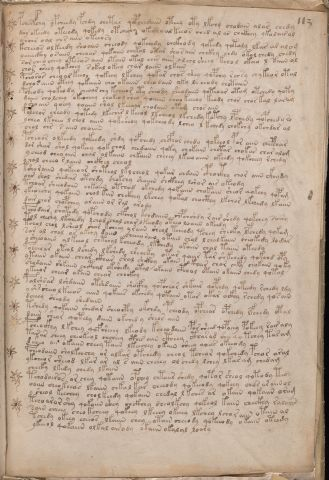

# Voynich Speculative Procedural Protocol — f113r

IMPORTANT: this is NOT a real or validated translation of the Voynich Manuscript. It is a speculative/procedural model that interprets EVA using a user-defined grammar to generate experimental recipes using safe, known edible substitutes.

This file is generated automatically from IVTFF/EVA transliteration plus a user-defined procedural grammar.



## Page / Folio
- currier: B
- folio: f113r
- page_number: 228

## EVA Text (Transliteration)
```text
pches@186;chy ypcheedy fchdy chetar qopchedaiin oteey oty lkchy chodain alar chedy
dar okeedy oteeody qokedy otchechy okeorl al keeos ched al ar chckhhy ykolairol
shchs oal chs aiin oteeosy
kcheeos olkeedy shoaiin cheeody qokchedy chckhody qokedy qotaly lkar ar al om
ycheeckhy osaiin cheoar qokaiin chekal otar shos aiin chckhy chd[o:y] okol chedy chedy
sor cheo cheey oteeos aiin otain otal ches aiin alchl sheey kchol okeeo l kaiin ol
chos sheey qokchey sokal okeey char laiin olkain
pchosos cheoarkeeol qokeey lkchey qokar chos shey qopchy rchsy chykeor otal
dchos aiin oteey qokaiin cho okaiin cheodaiin [a:?]ky le chody chotaiin
pcheody qokeody cheoar chy kcheeor ety sheody sheodaiin qoteoar otam otchedy qoty
daiin cholchey okecheey chokeo l sheo qoaiin shoo keeeol keody chor chor kal laram
y shoain qoeey qoaiin shol lkeeoar chodaiin otam chos aiin
polchor cheody qotedy lkeches l keeol lkcheol lkchedy kotchy lpchedy qopchedy ro
ycheo lkchey l chol oiiin qoksheoy qokcheody lcheo l kchedy chokchy okchdar al
chol chs s aiin chaiiin
pcheoor olkeedy qokeedy shdy qofchedy chcfhor chedy qokeeol por aiin chepchar
dor shar shol qokeey qok chol chedaiin qoky chokain chotar chokar char alom
ycheod cheoaiin chal olkaiin chkaiin cheeey lkeeo aiiin okeedy qokcheey rchedy
yhal cheeo rlaiin chckhey cheol
kshoraiin qokeeoar shoteol lklcheol qokar chdain cphoithy chor aiin ckhydy
oiir shol shedair otchdy shokchy shaiiin shckhey lshor air okeody
tchoar sheeodaiin chkaiin otchod okchedy qokaiin cho[k:t]ain sheor qokchy qopam
ykeoeshy qokaiin chal kiin chckhey lkchey qokal chocthy lkchor lkchedy lkaiin
dair chor chopchey araiin or ral arody
pchedair shotedy qopchody chfchol kchdaiin chpchshdy rair shedy qokchey sairy
tol cheshy lkchedy lchod chal char lkeeody oteeo loaiin okeedy
tchol chol lsheol shor kcheey y raiin sheol tcheody tchey sheoky lpchedy qokam
sar al chal os akchy daiin cheeeo rain otain chol lcholkaiin cheokedy loda[s:r]
y sheeoaiin olkeeol chtchol kcheody lkchedy okaiin chal taiin oteedy
folchear oteol lshedy lkshedy sheeeky otar qchar tar shkchedy qokchd opy
ytaiin okaiin chear ckhar shal shckhy okain o khar chor cky chokain qoky
shodaiin shkaiin chcthal okshedy otal okaiin cphoal otain okaiin chedy qotal
ykeeor chear okain chear chockhy
palshsar lshdaiin otshsaiin shocfhy qopchear shkair qopchdy qoteedy rchedy ldy
y sh s sheeo lkeeos aiin qokeees okchedy qotaiin otar okar ockhy rchdy qosain
dcheey sheody shedain
tshedy qokaiin shedar sheocphy okchdy pcheody opchear opchedy lfchedy otal
daiin sheor qoteey daiin okchedy sheo[s:r] aiin
pcheockhy l kchey qofsheeey lkeody kcheodaiin por shed qopoeey pokeey rair aly
tarar cheey cheokeol chcheey cthes aiin ctheey ctharad shee qo tchey taram
dsheo oin okaiin cheey taiin lkeechey okain sheey qoees [o:e]keeody
pcheodaiin sholkeechy ar alkar otchedy cheol tcheor qokchedy pchor aral
ykcheor sheeod lkar ar al s aiin cheeey ol chedy lchey lkar am chedam
cheeky lkedy chedy lkaiin
tchodairos or chey qotaiin opchey chtaiir shedy qotor sheol qotody tedy
oaiin cheokeeas lkaiin chkal kar cheeody qokeeody qokeey chos araiinol
y sheol keechey cholkeedy qokaiin chedal l kches ar okain qokaiin oram
tcho arorshy qokaiin shey chckhhy sheolkchy qokeol kaiin checkhy ralchs
sain cheeey cheo kcheey qokeey lkeeey okeeey lkchey lcho r aiin otain al
tchedy okeey cheeos lkaiin chey otain cheeody qokeeody okaiin oteedy
ykeeol qokaiin olkal airody okaiin okalal loary
```

## Domain Context (Heuristic; Not a Translation)

This section summarizes recurring **basewords** in this IVTFF domain and shows simple substring evidence that the token markers used by the procedural grammar occur inside frequent words.

Any Italian anagram / English gloss is a best-effort lexicon match, not a decipherment.


### Associated basewords (non-generic; top by frequency in this domain)
- `daiin` (count=231) → Italian anagram `piani`; English: plans (arrangements)
- `qokaiin` (count=122) → Italian anagram `ciancio`; English: [n/a]
- `okaiin` (count=109) → Italian anagram `coniai`; English: [n/a]
- `qokain` (count=101) → Italian anagram `acconi`; English: [n/a]
- `okain` (count=69) → Italian anagram `acino`; English: a berry
- `otain` (count=53) → Italian anagram `anito`; English: [n/a]
- `qokar` (count=48) → Italian anagram `carco`; English: [n/a]
- `saiin` (count=46) → Italian anagram `asini`; English: [n/a]
- `qokal` (count=43) → Italian anagram `calco`; English: cast (of sculpture)
- `qotaiin` (count=40) → Italian anagram `cationi`; English: [n/a]
- `lkaiin` (count=39) → Italian anagram `ancili`; English: [n/a]
- `kaiin` (count=37) → Italian anagram `acini`; English: [n/a]
- `qokeol` (count=37) → Italian anagram `eccolo`; English: [n/a]
- `qotain` (count=34) → Italian anagram `antico`; English: ancient
- `qotar` (count=29) → Italian anagram `corta`; English: [n/a]

### Marker evidence (substring in frequent basewords)
- `qo`: 60 basewords; examples: `qokeey`, `qokeedy`, `qokaiin`, `qokain`, `qokedy`, `qokey`
- `q`: 61 basewords; examples: `qokeey`, `qokeedy`, `qokaiin`, `qokain`, `qokedy`, `qokey`
- `o`: 262 basewords; examples: `qokeey`, `ol`, `o`, `qokeedy`, `okeey`, `qokaiin`
- `k`: 147 basewords; examples: `qokeey`, `qokeedy`, `okeey`, `qokaiin`, `okaiin`, `qokain`
- `t`: 102 basewords; examples: `otaiin`, `oteey`, `otar`, `otedy`, `otal`, `oteedy`
- `p`: 17 basewords; examples: `opchedy`, `qopchedy`, `opchey`, `pchedy`, `qopchdy`, `opchdy`
- `ch`: 137 basewords; examples: `chedy`, `chey`, `chol`, `cheey`, `cheol`, `cheody`
- `sh`: 50 basewords; examples: `shedy`, `shey`, `sheey`, `sheol`, `shol`, `sheedy`
- `f`: 1 basewords; examples: `f`
- `cth`: 16 basewords; examples: `chcthy`, `cthey`, `shcthy`, `checthy`, `cthol`, `ctheey`
- `ckh`: 15 basewords; examples: `chckhy`, `shckhy`, `checkhy`, `chckhey`, `chockhy`, `sheckhy`
- `cph`: 2 basewords; examples: `cphol`, `cphy`
- `dy`: 84 basewords; examples: `chedy`, `qokeedy`, `shedy`, `otedy`, `oteedy`, `qokedy`
- `iin`: 39 basewords; examples: `aiin`, `daiin`, `qokaiin`, `okaiin`, `otaiin`, `saiin`
- `aiin`: 33 basewords; examples: `aiin`, `daiin`, `qokaiin`, `okaiin`, `otaiin`, `saiin`

## Recipes Index (This Page)
- [f113r.1,@P0](#f113r-1-f113r-1-p0)
- [f113r.2,+P0](#f113r-2-f113r-2-p0)
- [f113r.3,+P0](#f113r-3-f113r-3-p0)
- [f113r.4,+P0](#f113r-4-f113r-4-p0)
- [f113r.5,+P0](#f113r-5-f113r-5-p0)
- [f113r.6,+P0](#f113r-6-f113r-6-p0)
- [f113r.7,+P0](#f113r-7-f113r-7-p0)
- [f113r.8,+P0](#f113r-8-f113r-8-p0)
- [f113r.9,+P0](#f113r-9-f113r-9-p0)
- [f113r.10,+P0](#f113r-10-f113r-10-p0)
- [f113r.11,+P0](#f113r-11-f113r-11-p0)
- [f113r.12,+P0](#f113r-12-f113r-12-p0)
- [f113r.13,+P0](#f113r-13-f113r-13-p0)
- [f113r.14,+P0](#f113r-14-f113r-14-p0)
- [f113r.15,+P0](#f113r-15-f113r-15-p0)
- [f113r.16,+P0](#f113r-16-f113r-16-p0)
- [f113r.17,+P0](#f113r-17-f113r-17-p0)
- [f113r.18,+P0](#f113r-18-f113r-18-p0)
- [f113r.19,+P0](#f113r-19-f113r-19-p0)
- [f113r.20,+P0](#f113r-20-f113r-20-p0)
- [f113r.21,+P0](#f113r-21-f113r-21-p0)
- [f113r.22,+P0](#f113r-22-f113r-22-p0)
- [f113r.23,+P0](#f113r-23-f113r-23-p0)
- [f113r.24,+P0](#f113r-24-f113r-24-p0)
- [f113r.25,+P0](#f113r-25-f113r-25-p0)
- [f113r.26,+P0](#f113r-26-f113r-26-p0)
- [f113r.27,+P0](#f113r-27-f113r-27-p0)
- [f113r.28,+P0](#f113r-28-f113r-28-p0)
- [f113r.29,+P0](#f113r-29-f113r-29-p0)
- [f113r.30,+P0](#f113r-30-f113r-30-p0)
- [f113r.31,+P0](#f113r-31-f113r-31-p0)
- [f113r.32,+P0](#f113r-32-f113r-32-p0)
- [f113r.33,+P0](#f113r-33-f113r-33-p0)
- [f113r.34,+P0](#f113r-34-f113r-34-p0)
- [f113r.35,+P0](#f113r-35-f113r-35-p0)
- [f113r.36,+P0](#f113r-36-f113r-36-p0)
- [f113r.37,+P0](#f113r-37-f113r-37-p0)
- [f113r.38,+P0](#f113r-38-f113r-38-p0)
- [f113r.39,+P0](#f113r-39-f113r-39-p0)
- [f113r.40,+P0](#f113r-40-f113r-40-p0)
- [f113r.41,+P0](#f113r-41-f113r-41-p0)
- [f113r.42,+P0](#f113r-42-f113r-42-p0)
- [f113r.43,+P0](#f113r-43-f113r-43-p0)
- [f113r.44,+P0](#f113r-44-f113r-44-p0)
- [f113r.45,+P0](#f113r-45-f113r-45-p0)
- [f113r.46,+P0](#f113r-46-f113r-46-p0)
- [f113r.47,+P0](#f113r-47-f113r-47-p0)
- [f113r.48,+P0](#f113r-48-f113r-48-p0)
- [f113r.49,+P0](#f113r-49-f113r-49-p0)
- [f113r.50,+P0](#f113r-50-f113r-50-p0)
- [f113r.51,+P0](#f113r-51-f113r-51-p0)

## Line Glosses (Procedural Gloss Only; Not a Translation)

<a id="f113r-1-f113r-1-p0"></a>

### f113r.1,@P0

EVA: pches@186;chy ypcheedy fchdy chetar qopchedaiin oteey oty lkchy chodain alar chedy

Direct Gloss (Procedural, Not a Real Translation):
- pches: add main plant (safe substitute) → add starter / activate → duration level 1 → state: active extraction
- chy: add main plant (safe substitute)
- ypcheedy: add main plant (safe substitute) → add starter / activate → duration level 2 → state: active extraction
- fchdy: add main plant (safe substitute) → add aroma modifier → add starter / activate
- chetar: apply heat/cooking → add main plant (safe substitute) → duration level 1 → state: active extraction
- qopchedaiin: prepare liquid base → add main plant (safe substitute) → add starter / activate → duration level 1 → state: active extraction → long phase
- oteey: apply heat/cooking → mix / transfer → duration level 2 → state: active extraction
- oty: apply heat/cooking → mix / transfer
- lkchy: add fermentable sugars → add main plant (safe substitute)
- chodain: add main plant (safe substitute) → mix / transfer → add starter / activate → duration level 1 → state: phase transition/start
- alar: duration level 1 → state: phase transition/start
- chedy: add main plant (safe substitute) → add starter / activate → duration level 1 → state: active extraction

<a id="f113r-2-f113r-2-p0"></a>

### f113r.2,+P0

EVA: dar okeedy oteeody qokedy otchechy okeorl al keeos ched al ar chckhhy ykolairol

Direct Gloss (Procedural, Not a Real Translation):
- dar: add starter / activate → duration level 1 → state: phase transition/start
- okeedy: add fermentable sugars → mix / transfer → add starter / activate → duration level 2 → state: active extraction
- oteeody: apply heat/cooking → mix / transfer → add starter / activate → duration level 2 → state: active extraction
- qokedy: prepare liquid base → add fermentable sugars → add starter / activate → duration level 1 → state: active extraction
- otchechy: apply heat/cooking → add main plant (safe substitute) → mix / transfer → duration level 1 → state: active extraction
- okeorl: add fermentable sugars → mix / transfer → duration level 1 → state: active extraction
- al: duration level 1 → state: phase transition/start
- keeos: add fermentable sugars → mix / transfer → duration level 2 → state: active extraction
- ched: add main plant (safe substitute) → add starter / activate → duration level 1 → state: active extraction
- al: duration level 1 → state: phase transition/start
- ar: duration level 1 → state: phase transition/start
- chckhhy: add main plant (safe substitute) → add complex herbal compound (safe blend) → unmodeled token(s) present: h
- ykolairol: add fermentable sugars → mix / transfer → duration level 1 → state: phase transition/start

<a id="f113r-3-f113r-3-p0"></a>

### f113r.3,+P0

EVA: shchs oal chs aiin oteeosy

Direct Gloss (Procedural, Not a Real Translation):
- shchs: add main plant (safe substitute) → add secondary herb (safe substitute)
- oal: mix / transfer → duration level 1 → state: phase transition/start
- chs: add main plant (safe substitute)
- aiin: duration level 1 → state: phase transition/start → long phase
- oteeosy: apply heat/cooking → mix / transfer → duration level 2 → state: active extraction

<a id="f113r-4-f113r-4-p0"></a>

### f113r.4,+P0

EVA: kcheeos olkeedy shoaiin cheeody qokchedy chckhody qokedy qotaly lkar ar al om

Direct Gloss (Procedural, Not a Real Translation):
- kcheeos: add fermentable sugars → add main plant (safe substitute) → mix / transfer → duration level 2 → state: active extraction
- olkeedy: add fermentable sugars → mix / transfer → add starter / activate → duration level 2 → state: active extraction
- shoaiin: add secondary herb (safe substitute) → mix / transfer → duration level 1 → state: phase transition/start → long phase
- cheeody: add main plant (safe substitute) → mix / transfer → add starter / activate → duration level 2 → state: active extraction
- qokchedy: prepare liquid base → add fermentable sugars → add main plant (safe substitute) → add starter / activate → duration level 1 → state: active extraction
- chckhody: add main plant (safe substitute) → mix / transfer → add starter / activate → add complex herbal compound (safe blend)
- qokedy: prepare liquid base → add fermentable sugars → add starter / activate → duration level 1 → state: active extraction
- qotaly: prepare liquid base → apply heat/cooking → duration level 1 → state: phase transition/start
- lkar: add fermentable sugars → duration level 1 → state: phase transition/start
- ar: duration level 1 → state: phase transition/start
- al: duration level 1 → state: phase transition/start
- om: mix / transfer

<a id="f113r-5-f113r-5-p0"></a>

### f113r.5,+P0

EVA: ycheeckhy osaiin cheoar qokaiin chekal otar shos aiin chckhy chd[o:y] okol chedy chedy

Direct Gloss (Procedural, Not a Real Translation):
- ycheeckhy: add main plant (safe substitute) → add complex herbal compound (safe blend) → duration level 2 → state: active extraction
- osaiin: mix / transfer → duration level 1 → state: phase transition/start → long phase
- cheoar: add main plant (safe substitute) → mix / transfer → duration level 1 → state: active extraction
- qokaiin: prepare liquid base → add fermentable sugars → duration level 1 → state: phase transition/start → long phase
- chekal: add fermentable sugars → add main plant (safe substitute) → duration level 1 → state: active extraction
- otar: apply heat/cooking → mix / transfer → duration level 1 → state: phase transition/start
- shos: add secondary herb (safe substitute) → mix / transfer
- aiin: duration level 1 → state: phase transition/start → long phase
- chckhy: add main plant (safe substitute) → add complex herbal compound (safe blend)
- chd: add main plant (safe substitute) → add starter / activate
- o: mix / transfer
- y: [unparsed]
- okol: add fermentable sugars → mix / transfer
- chedy: add main plant (safe substitute) → add starter / activate → duration level 1 → state: active extraction
- chedy: add main plant (safe substitute) → add starter / activate → duration level 1 → state: active extraction

<a id="f113r-6-f113r-6-p0"></a>

### f113r.6,+P0

EVA: sor cheo cheey oteeos aiin otain otal ches aiin alchl sheey kchol okeeo l kaiin ol

Direct Gloss (Procedural, Not a Real Translation):
- sor: mix / transfer
- cheo: add main plant (safe substitute) → mix / transfer → duration level 1 → state: active extraction
- cheey: add main plant (safe substitute) → duration level 2 → state: active extraction
- oteeos: apply heat/cooking → mix / transfer → duration level 2 → state: active extraction
- aiin: duration level 1 → state: phase transition/start → long phase
- otain: apply heat/cooking → mix / transfer → duration level 1 → state: phase transition/start
- otal: apply heat/cooking → mix / transfer → duration level 1 → state: phase transition/start
- ches: add main plant (safe substitute) → duration level 1 → state: active extraction
- aiin: duration level 1 → state: phase transition/start → long phase
- alchl: add main plant (safe substitute) → duration level 1 → state: phase transition/start
- sheey: add secondary herb (safe substitute) → duration level 2 → state: active extraction
- kchol: add fermentable sugars → add main plant (safe substitute) → mix / transfer
- okeeo: add fermentable sugars → mix / transfer → duration level 2 → state: active extraction
- l: [unparsed]
- kaiin: add fermentable sugars → duration level 1 → state: phase transition/start → long phase
- ol: mix / transfer

<a id="f113r-7-f113r-7-p0"></a>

### f113r.7,+P0

EVA: chos sheey qokchey sokal okeey char laiin olkain

Direct Gloss (Procedural, Not a Real Translation):
- chos: add main plant (safe substitute) → mix / transfer
- sheey: add secondary herb (safe substitute) → duration level 2 → state: active extraction
- qokchey: prepare liquid base → add fermentable sugars → add main plant (safe substitute) → duration level 1 → state: active extraction
- sokal: add fermentable sugars → mix / transfer → duration level 1 → state: phase transition/start
- okeey: add fermentable sugars → mix / transfer → duration level 2 → state: active extraction
- char: add main plant (safe substitute) → duration level 1 → state: phase transition/start
- laiin: duration level 1 → state: phase transition/start → long phase
- olkain: add fermentable sugars → mix / transfer → duration level 1 → state: phase transition/start

<a id="f113r-8-f113r-8-p0"></a>

### f113r.8,+P0

EVA: pchosos cheoarkeeol qokeey lkchey qokar chos shey qopchy rchsy chykeor otal

Direct Gloss (Procedural, Not a Real Translation):
- pchosos: add main plant (safe substitute) → mix / transfer → add starter / activate
- cheoarkeeol: add fermentable sugars → add main plant (safe substitute) → mix / transfer → duration level 1 → state: active extraction
- qokeey: prepare liquid base → add fermentable sugars → duration level 2 → state: active extraction
- lkchey: add fermentable sugars → add main plant (safe substitute) → duration level 1 → state: active extraction
- qokar: prepare liquid base → add fermentable sugars → duration level 1 → state: phase transition/start
- chos: add main plant (safe substitute) → mix / transfer
- shey: add secondary herb (safe substitute) → duration level 1 → state: active extraction
- qopchy: prepare liquid base → add main plant (safe substitute) → add starter / activate
- rchsy: add main plant (safe substitute)
- chykeor: add fermentable sugars → add main plant (safe substitute) → mix / transfer → duration level 1 → state: active extraction
- otal: apply heat/cooking → mix / transfer → duration level 1 → state: phase transition/start

<a id="f113r-9-f113r-9-p0"></a>

### f113r.9,+P0

EVA: dchos aiin oteey qokaiin cho okaiin cheodaiin [a:?]ky le chody chotaiin

Direct Gloss (Procedural, Not a Real Translation):
- dchos: add main plant (safe substitute) → mix / transfer → add starter / activate
- aiin: duration level 1 → state: phase transition/start → long phase
- oteey: apply heat/cooking → mix / transfer → duration level 2 → state: active extraction
- qokaiin: prepare liquid base → add fermentable sugars → duration level 1 → state: phase transition/start → long phase
- cho: add main plant (safe substitute) → mix / transfer
- okaiin: add fermentable sugars → mix / transfer → duration level 1 → state: phase transition/start → long phase
- cheodaiin: add main plant (safe substitute) → mix / transfer → add starter / activate → duration level 1 → state: active extraction → long phase
- a: duration level 1 → state: phase transition/start
- ky: add fermentable sugars
- le: duration level 1 → state: active extraction
- chody: add main plant (safe substitute) → mix / transfer → add starter / activate
- chotaiin: apply heat/cooking → add main plant (safe substitute) → mix / transfer → duration level 1 → state: phase transition/start → long phase

<a id="f113r-10-f113r-10-p0"></a>

### f113r.10,+P0

EVA: pcheody qokeody cheoar chy kcheeor ety sheody sheodaiin qoteoar otam otchedy qoty

Direct Gloss (Procedural, Not a Real Translation):
- pcheody: add main plant (safe substitute) → mix / transfer → add starter / activate → duration level 1 → state: active extraction
- qokeody: prepare liquid base → add fermentable sugars → mix / transfer → add starter / activate → duration level 1 → state: active extraction
- cheoar: add main plant (safe substitute) → mix / transfer → duration level 1 → state: active extraction
- chy: add main plant (safe substitute)
- kcheeor: add fermentable sugars → add main plant (safe substitute) → mix / transfer → duration level 2 → state: active extraction
- ety: apply heat/cooking → duration level 1 → state: active extraction
- sheody: add secondary herb (safe substitute) → mix / transfer → add starter / activate → duration level 1 → state: active extraction
- sheodaiin: add secondary herb (safe substitute) → mix / transfer → add starter / activate → duration level 1 → state: active extraction → long phase
- qoteoar: prepare liquid base → apply heat/cooking → mix / transfer → duration level 1 → state: active extraction
- otam: apply heat/cooking → mix / transfer → duration level 1 → state: phase transition/start
- otchedy: apply heat/cooking → add main plant (safe substitute) → mix / transfer → add starter / activate → duration level 1 → state: active extraction
- qoty: prepare liquid base → apply heat/cooking

<a id="f113r-11-f113r-11-p0"></a>

### f113r.11,+P0

EVA: daiin cholchey okecheey chokeo l sheo qoaiin shoo keeeol keody chor chor kal laram

Direct Gloss (Procedural, Not a Real Translation):
- daiin: add starter / activate → duration level 1 → state: phase transition/start → long phase
- cholchey: add main plant (safe substitute) → mix / transfer → duration level 1 → state: active extraction
- okecheey: add fermentable sugars → add main plant (safe substitute) → mix / transfer → duration level 1 → state: active extraction
- chokeo: add fermentable sugars → add main plant (safe substitute) → mix / transfer → duration level 1 → state: active extraction
- l: [unparsed]
- sheo: add secondary herb (safe substitute) → mix / transfer → duration level 1 → state: active extraction
- qoaiin: prepare liquid base → duration level 1 → state: phase transition/start → long phase
- shoo: add secondary herb (safe substitute) → mix / transfer
- keeeol: add fermentable sugars → mix / transfer → duration level 3 → state: active extraction
- keody: add fermentable sugars → mix / transfer → add starter / activate → duration level 1 → state: active extraction
- chor: add main plant (safe substitute) → mix / transfer
- chor: add main plant (safe substitute) → mix / transfer
- kal: add fermentable sugars → duration level 1 → state: phase transition/start
- laram: duration level 1 → state: phase transition/start

<a id="f113r-12-f113r-12-p0"></a>

### f113r.12,+P0

EVA: y shoain qoeey qoaiin shol lkeeoar chodaiin otam chos aiin

Direct Gloss (Procedural, Not a Real Translation):
- y: [unparsed]
- shoain: add secondary herb (safe substitute) → mix / transfer → duration level 1 → state: phase transition/start
- qoeey: prepare liquid base → duration level 2 → state: active extraction
- qoaiin: prepare liquid base → duration level 1 → state: phase transition/start → long phase
- shol: add secondary herb (safe substitute) → mix / transfer
- lkeeoar: add fermentable sugars → mix / transfer → duration level 2 → state: active extraction
- chodaiin: add main plant (safe substitute) → mix / transfer → add starter / activate → duration level 1 → state: phase transition/start → long phase
- otam: apply heat/cooking → mix / transfer → duration level 1 → state: phase transition/start
- chos: add main plant (safe substitute) → mix / transfer
- aiin: duration level 1 → state: phase transition/start → long phase

<a id="f113r-13-f113r-13-p0"></a>

### f113r.13,+P0

EVA: polchor cheody qotedy lkeches l keeol lkcheol lkchedy kotchy lpchedy qopchedy ro

Direct Gloss (Procedural, Not a Real Translation):
- polchor: add main plant (safe substitute) → mix / transfer → add starter / activate
- cheody: add main plant (safe substitute) → mix / transfer → add starter / activate → duration level 1 → state: active extraction
- qotedy: prepare liquid base → apply heat/cooking → add starter / activate → duration level 1 → state: active extraction
- lkeches: add fermentable sugars → add main plant (safe substitute) → duration level 1 → state: active extraction
- l: [unparsed]
- keeol: add fermentable sugars → mix / transfer → duration level 2 → state: active extraction
- lkcheol: add fermentable sugars → add main plant (safe substitute) → mix / transfer → duration level 1 → state: active extraction
- lkchedy: add fermentable sugars → add main plant (safe substitute) → add starter / activate → duration level 1 → state: active extraction
- kotchy: add fermentable sugars → apply heat/cooking → add main plant (safe substitute) → mix / transfer
- lpchedy: add main plant (safe substitute) → add starter / activate → duration level 1 → state: active extraction
- qopchedy: prepare liquid base → add main plant (safe substitute) → add starter / activate → duration level 1 → state: active extraction
- ro: mix / transfer

<a id="f113r-14-f113r-14-p0"></a>

### f113r.14,+P0

EVA: ycheo lkchey l chol oiiin qoksheoy qokcheody lcheo l kchedy chokchy okchdar al

Direct Gloss (Procedural, Not a Real Translation):
- ycheo: add main plant (safe substitute) → mix / transfer → duration level 1 → state: active extraction
- lkchey: add fermentable sugars → add main plant (safe substitute) → duration level 1 → state: active extraction
- l: [unparsed]
- chol: add main plant (safe substitute) → mix / transfer
- oiiin: mix / transfer → duration level 3 → state: cooling/rest → medium phase
- qoksheoy: prepare liquid base → add fermentable sugars → add secondary herb (safe substitute) → mix / transfer → duration level 1 → state: active extraction
- qokcheody: prepare liquid base → add fermentable sugars → add main plant (safe substitute) → mix / transfer → add starter / activate → duration level 1 → state: active extraction
- lcheo: add main plant (safe substitute) → mix / transfer → duration level 1 → state: active extraction
- l: [unparsed]
- kchedy: add fermentable sugars → add main plant (safe substitute) → add starter / activate → duration level 1 → state: active extraction
- chokchy: add fermentable sugars → add main plant (safe substitute) → mix / transfer
- okchdar: add fermentable sugars → add main plant (safe substitute) → mix / transfer → add starter / activate → duration level 1 → state: phase transition/start
- al: duration level 1 → state: phase transition/start

<a id="f113r-15-f113r-15-p0"></a>

### f113r.15,+P0

EVA: chol chs s aiin chaiiin

Direct Gloss (Procedural, Not a Real Translation):
- chol: add main plant (safe substitute) → mix / transfer
- chs: add main plant (safe substitute)
- s: [unparsed]
- aiin: duration level 1 → state: phase transition/start → long phase
- chaiiin: add main plant (safe substitute) → duration level 1 → state: phase transition/start → medium phase

<a id="f113r-16-f113r-16-p0"></a>

### f113r.16,+P0

EVA: pcheoor olkeedy qokeedy shdy qofchedy chcfhor chedy qokeeol por aiin chepchar

Direct Gloss (Procedural, Not a Real Translation):
- pcheoor: add main plant (safe substitute) → mix / transfer → add starter / activate → duration level 1 → state: active extraction
- olkeedy: add fermentable sugars → mix / transfer → add starter / activate → duration level 2 → state: active extraction
- qokeedy: prepare liquid base → add fermentable sugars → add starter / activate → duration level 2 → state: active extraction
- shdy: add secondary herb (safe substitute) → add starter / activate
- qofchedy: prepare liquid base → add main plant (safe substitute) → add aroma modifier → add starter / activate → duration level 1 → state: active extraction
- chcfhor: add main plant (safe substitute) → mix / transfer → add complex herbal compound (safe blend)
- chedy: add main plant (safe substitute) → add starter / activate → duration level 1 → state: active extraction
- qokeeol: prepare liquid base → add fermentable sugars → mix / transfer → duration level 2 → state: active extraction
- por: mix / transfer → add starter / activate
- aiin: duration level 1 → state: phase transition/start → long phase
- chepchar: add main plant (safe substitute) → add starter / activate → duration level 1 → state: active extraction

<a id="f113r-17-f113r-17-p0"></a>

### f113r.17,+P0

EVA: dor shar shol qokeey qok chol chedaiin qoky chokain chotar chokar char alom

Direct Gloss (Procedural, Not a Real Translation):
- dor: mix / transfer → add starter / activate
- shar: add secondary herb (safe substitute) → duration level 1 → state: phase transition/start
- shol: add secondary herb (safe substitute) → mix / transfer
- qokeey: prepare liquid base → add fermentable sugars → duration level 2 → state: active extraction
- qok: prepare liquid base → add fermentable sugars
- chol: add main plant (safe substitute) → mix / transfer
- chedaiin: add main plant (safe substitute) → add starter / activate → duration level 1 → state: active extraction → long phase
- qoky: prepare liquid base → add fermentable sugars
- chokain: add fermentable sugars → add main plant (safe substitute) → mix / transfer → duration level 1 → state: phase transition/start
- chotar: apply heat/cooking → add main plant (safe substitute) → mix / transfer → duration level 1 → state: phase transition/start
- chokar: add fermentable sugars → add main plant (safe substitute) → mix / transfer → duration level 1 → state: phase transition/start
- char: add main plant (safe substitute) → duration level 1 → state: phase transition/start
- alom: mix / transfer → duration level 1 → state: phase transition/start

<a id="f113r-18-f113r-18-p0"></a>

### f113r.18,+P0

EVA: ycheod cheoaiin chal olkaiin chkaiin cheeey lkeeo aiiin okeedy qokcheey rchedy

Direct Gloss (Procedural, Not a Real Translation):
- ycheod: add main plant (safe substitute) → mix / transfer → add starter / activate → duration level 1 → state: active extraction
- cheoaiin: add main plant (safe substitute) → mix / transfer → duration level 1 → state: active extraction → long phase
- chal: add main plant (safe substitute) → duration level 1 → state: phase transition/start
- olkaiin: add fermentable sugars → mix / transfer → duration level 1 → state: phase transition/start → long phase
- chkaiin: add fermentable sugars → add main plant (safe substitute) → duration level 1 → state: phase transition/start → long phase
- cheeey: add main plant (safe substitute) → duration level 3 → state: active extraction
- lkeeo: add fermentable sugars → mix / transfer → duration level 2 → state: active extraction
- aiiin: duration level 1 → state: phase transition/start → medium phase
- okeedy: add fermentable sugars → mix / transfer → add starter / activate → duration level 2 → state: active extraction
- qokcheey: prepare liquid base → add fermentable sugars → add main plant (safe substitute) → duration level 2 → state: active extraction
- rchedy: add main plant (safe substitute) → add starter / activate → duration level 1 → state: active extraction

<a id="f113r-19-f113r-19-p0"></a>

### f113r.19,+P0

EVA: yhal cheeo rlaiin chckhey cheol

Direct Gloss (Procedural, Not a Real Translation):
- yhal: duration level 1 → state: phase transition/start → unmodeled token(s) present: h
- cheeo: add main plant (safe substitute) → mix / transfer → duration level 2 → state: active extraction
- rlaiin: duration level 1 → state: phase transition/start → long phase
- chckhey: add main plant (safe substitute) → add complex herbal compound (safe blend) → duration level 1 → state: active extraction
- cheol: add main plant (safe substitute) → mix / transfer → duration level 1 → state: active extraction

<a id="f113r-20-f113r-20-p0"></a>

### f113r.20,+P0

EVA: kshoraiin qokeeoar shoteol lklcheol qokar chdain cphoithy chor aiin ckhydy

Direct Gloss (Procedural, Not a Real Translation):
- kshoraiin: add fermentable sugars → add secondary herb (safe substitute) → mix / transfer → duration level 1 → state: phase transition/start → long phase
- qokeeoar: prepare liquid base → add fermentable sugars → mix / transfer → duration level 2 → state: active extraction
- shoteol: apply heat/cooking → add secondary herb (safe substitute) → mix / transfer → duration level 1 → state: active extraction
- lklcheol: add fermentable sugars → add main plant (safe substitute) → mix / transfer → duration level 1 → state: active extraction
- qokar: prepare liquid base → add fermentable sugars → duration level 1 → state: phase transition/start
- chdain: add main plant (safe substitute) → add starter / activate → duration level 1 → state: phase transition/start
- cphoithy: apply heat/cooking → mix / transfer → add complex herbal compound (safe blend) → duration level 1 → state: cooling/rest → unmodeled token(s) present: h
- chor: add main plant (safe substitute) → mix / transfer
- aiin: duration level 1 → state: phase transition/start → long phase
- ckhydy: add starter / activate → add complex herbal compound (safe blend)

<a id="f113r-21-f113r-21-p0"></a>

### f113r.21,+P0

EVA: oiir shol shedair otchdy shokchy shaiiin shckhey lshor air okeody

Direct Gloss (Procedural, Not a Real Translation):
- oiir: mix / transfer → duration level 2 → state: cooling/rest
- shol: add secondary herb (safe substitute) → mix / transfer
- shedair: add secondary herb (safe substitute) → add starter / activate → duration level 1 → state: active extraction
- otchdy: apply heat/cooking → add main plant (safe substitute) → mix / transfer → add starter / activate
- shokchy: add fermentable sugars → add main plant (safe substitute) → add secondary herb (safe substitute) → mix / transfer
- shaiiin: add secondary herb (safe substitute) → duration level 1 → state: phase transition/start → medium phase
- shckhey: add secondary herb (safe substitute) → add complex herbal compound (safe blend) → duration level 1 → state: active extraction
- lshor: add secondary herb (safe substitute) → mix / transfer
- air: duration level 1 → state: phase transition/start
- okeody: add fermentable sugars → mix / transfer → add starter / activate → duration level 1 → state: active extraction

<a id="f113r-22-f113r-22-p0"></a>

### f113r.22,+P0

EVA: tchoar sheeodaiin chkaiin otchod okchedy qokaiin cho[k:t]ain sheor qokchy qopam

Direct Gloss (Procedural, Not a Real Translation):
- tchoar: apply heat/cooking → add main plant (safe substitute) → mix / transfer → duration level 1 → state: phase transition/start
- sheeodaiin: add secondary herb (safe substitute) → mix / transfer → add starter / activate → duration level 2 → state: active extraction → long phase
- chkaiin: add fermentable sugars → add main plant (safe substitute) → duration level 1 → state: phase transition/start → long phase
- otchod: apply heat/cooking → add main plant (safe substitute) → mix / transfer → add starter / activate
- okchedy: add fermentable sugars → add main plant (safe substitute) → mix / transfer → add starter / activate → duration level 1 → state: active extraction
- qokaiin: prepare liquid base → add fermentable sugars → duration level 1 → state: phase transition/start → long phase
- cho: add main plant (safe substitute) → mix / transfer
- k: add fermentable sugars
- t: apply heat/cooking
- ain: duration level 1 → state: phase transition/start
- sheor: add secondary herb (safe substitute) → mix / transfer → duration level 1 → state: active extraction
- qokchy: prepare liquid base → add fermentable sugars → add main plant (safe substitute)
- qopam: prepare liquid base → add starter / activate → duration level 1 → state: phase transition/start

<a id="f113r-23-f113r-23-p0"></a>

### f113r.23,+P0

EVA: ykeoeshy qokaiin chal kiin chckhey lkchey qokal chocthy lkchor lkchedy lkaiin

Direct Gloss (Procedural, Not a Real Translation):
- ykeoeshy: add fermentable sugars → add secondary herb (safe substitute) → mix / transfer → duration level 1 → state: active extraction
- qokaiin: prepare liquid base → add fermentable sugars → duration level 1 → state: phase transition/start → long phase
- chal: add main plant (safe substitute) → duration level 1 → state: phase transition/start
- kiin: add fermentable sugars → duration level 2 → state: cooling/rest → medium phase
- chckhey: add main plant (safe substitute) → add complex herbal compound (safe blend) → duration level 1 → state: active extraction
- lkchey: add fermentable sugars → add main plant (safe substitute) → duration level 1 → state: active extraction
- qokal: prepare liquid base → add fermentable sugars → duration level 1 → state: phase transition/start
- chocthy: add main plant (safe substitute) → mix / transfer → add complex herbal compound (safe blend)
- lkchor: add fermentable sugars → add main plant (safe substitute) → mix / transfer
- lkchedy: add fermentable sugars → add main plant (safe substitute) → add starter / activate → duration level 1 → state: active extraction
- lkaiin: add fermentable sugars → duration level 1 → state: phase transition/start → long phase

<a id="f113r-24-f113r-24-p0"></a>

### f113r.24,+P0

EVA: dair chor chopchey araiin or ral arody

Direct Gloss (Procedural, Not a Real Translation):
- dair: add starter / activate → duration level 1 → state: phase transition/start
- chor: add main plant (safe substitute) → mix / transfer
- chopchey: add main plant (safe substitute) → mix / transfer → add starter / activate → duration level 1 → state: active extraction
- araiin: duration level 1 → state: phase transition/start → long phase
- or: mix / transfer
- ral: duration level 1 → state: phase transition/start
- arody: mix / transfer → add starter / activate → duration level 1 → state: phase transition/start

<a id="f113r-25-f113r-25-p0"></a>

### f113r.25,+P0

EVA: pchedair shotedy qopchody chfchol kchdaiin chpchshdy rair shedy qokchey sairy

Direct Gloss (Procedural, Not a Real Translation):
- pchedair: add main plant (safe substitute) → add starter / activate → duration level 1 → state: active extraction
- shotedy: apply heat/cooking → add secondary herb (safe substitute) → mix / transfer → add starter / activate → duration level 1 → state: active extraction
- qopchody: prepare liquid base → add main plant (safe substitute) → mix / transfer → add starter / activate
- chfchol: add main plant (safe substitute) → add aroma modifier → mix / transfer
- kchdaiin: add fermentable sugars → add main plant (safe substitute) → add starter / activate → duration level 1 → state: phase transition/start → long phase
- chpchshdy: add main plant (safe substitute) → add secondary herb (safe substitute) → add starter / activate
- rair: duration level 1 → state: phase transition/start
- shedy: add secondary herb (safe substitute) → add starter / activate → duration level 1 → state: active extraction
- qokchey: prepare liquid base → add fermentable sugars → add main plant (safe substitute) → duration level 1 → state: active extraction
- sairy: duration level 1 → state: phase transition/start

<a id="f113r-26-f113r-26-p0"></a>

### f113r.26,+P0

EVA: tol cheshy lkchedy lchod chal char lkeeody oteeo loaiin okeedy

Direct Gloss (Procedural, Not a Real Translation):
- tol: apply heat/cooking → mix / transfer
- cheshy: add main plant (safe substitute) → add secondary herb (safe substitute) → duration level 1 → state: active extraction
- lkchedy: add fermentable sugars → add main plant (safe substitute) → add starter / activate → duration level 1 → state: active extraction
- lchod: add main plant (safe substitute) → mix / transfer → add starter / activate
- chal: add main plant (safe substitute) → duration level 1 → state: phase transition/start
- char: add main plant (safe substitute) → duration level 1 → state: phase transition/start
- lkeeody: add fermentable sugars → mix / transfer → add starter / activate → duration level 2 → state: active extraction
- oteeo: apply heat/cooking → mix / transfer → duration level 2 → state: active extraction
- loaiin: mix / transfer → duration level 1 → state: phase transition/start → long phase
- okeedy: add fermentable sugars → mix / transfer → add starter / activate → duration level 2 → state: active extraction

<a id="f113r-27-f113r-27-p0"></a>

### f113r.27,+P0

EVA: tchol chol lsheol shor kcheey y raiin sheol tcheody tchey sheoky lpchedy qokam

Direct Gloss (Procedural, Not a Real Translation):
- tchol: apply heat/cooking → add main plant (safe substitute) → mix / transfer
- chol: add main plant (safe substitute) → mix / transfer
- lsheol: add secondary herb (safe substitute) → mix / transfer → duration level 1 → state: active extraction
- shor: add secondary herb (safe substitute) → mix / transfer
- kcheey: add fermentable sugars → add main plant (safe substitute) → duration level 2 → state: active extraction
- y: [unparsed]
- raiin: duration level 1 → state: phase transition/start → long phase
- sheol: add secondary herb (safe substitute) → mix / transfer → duration level 1 → state: active extraction
- tcheody: apply heat/cooking → add main plant (safe substitute) → mix / transfer → add starter / activate → duration level 1 → state: active extraction
- tchey: apply heat/cooking → add main plant (safe substitute) → duration level 1 → state: active extraction
- sheoky: add fermentable sugars → add secondary herb (safe substitute) → mix / transfer → duration level 1 → state: active extraction
- lpchedy: add main plant (safe substitute) → add starter / activate → duration level 1 → state: active extraction
- qokam: prepare liquid base → add fermentable sugars → duration level 1 → state: phase transition/start

<a id="f113r-28-f113r-28-p0"></a>

### f113r.28,+P0

EVA: sar al chal os akchy daiin cheeeo rain otain chol lcholkaiin cheokedy loda[s:r]

Direct Gloss (Procedural, Not a Real Translation):
- sar: duration level 1 → state: phase transition/start
- al: duration level 1 → state: phase transition/start
- chal: add main plant (safe substitute) → duration level 1 → state: phase transition/start
- os: mix / transfer
- akchy: add fermentable sugars → add main plant (safe substitute) → duration level 1 → state: phase transition/start
- daiin: add starter / activate → duration level 1 → state: phase transition/start → long phase
- cheeeo: add main plant (safe substitute) → mix / transfer → duration level 3 → state: active extraction
- rain: duration level 1 → state: phase transition/start
- otain: apply heat/cooking → mix / transfer → duration level 1 → state: phase transition/start
- chol: add main plant (safe substitute) → mix / transfer
- lcholkaiin: add fermentable sugars → add main plant (safe substitute) → mix / transfer → duration level 1 → state: phase transition/start → long phase
- cheokedy: add fermentable sugars → add main plant (safe substitute) → mix / transfer → add starter / activate → duration level 1 → state: active extraction
- loda: mix / transfer → add starter / activate → duration level 1 → state: phase transition/start
- s: [unparsed]
- r: [unparsed]

<a id="f113r-29-f113r-29-p0"></a>

### f113r.29,+P0

EVA: y sheeoaiin olkeeol chtchol kcheody lkchedy okaiin chal taiin oteedy

Direct Gloss (Procedural, Not a Real Translation):
- y: [unparsed]
- sheeoaiin: add secondary herb (safe substitute) → mix / transfer → duration level 2 → state: active extraction → long phase
- olkeeol: add fermentable sugars → mix / transfer → duration level 2 → state: active extraction
- chtchol: apply heat/cooking → add main plant (safe substitute) → mix / transfer
- kcheody: add fermentable sugars → add main plant (safe substitute) → mix / transfer → add starter / activate → duration level 1 → state: active extraction
- lkchedy: add fermentable sugars → add main plant (safe substitute) → add starter / activate → duration level 1 → state: active extraction
- okaiin: add fermentable sugars → mix / transfer → duration level 1 → state: phase transition/start → long phase
- chal: add main plant (safe substitute) → duration level 1 → state: phase transition/start
- taiin: apply heat/cooking → duration level 1 → state: phase transition/start → long phase
- oteedy: apply heat/cooking → mix / transfer → add starter / activate → duration level 2 → state: active extraction

<a id="f113r-30-f113r-30-p0"></a>

### f113r.30,+P0

EVA: folchear oteol lshedy lkshedy sheeeky otar qchar tar shkchedy qokchd opy

Direct Gloss (Procedural, Not a Real Translation):
- folchear: add main plant (safe substitute) → add aroma modifier → mix / transfer → duration level 1 → state: active extraction
- oteol: apply heat/cooking → mix / transfer → duration level 1 → state: active extraction
- lshedy: add secondary herb (safe substitute) → add starter / activate → duration level 1 → state: active extraction
- lkshedy: add fermentable sugars → add secondary herb (safe substitute) → add starter / activate → duration level 1 → state: active extraction
- sheeeky: add fermentable sugars → add secondary herb (safe substitute) → duration level 3 → state: active extraction
- otar: apply heat/cooking → mix / transfer → duration level 1 → state: phase transition/start
- qchar: prepare base (generic) → add main plant (safe substitute) → duration level 1 → state: phase transition/start
- tar: apply heat/cooking → duration level 1 → state: phase transition/start
- shkchedy: add fermentable sugars → add main plant (safe substitute) → add secondary herb (safe substitute) → add starter / activate → duration level 1 → state: active extraction
- qokchd: prepare liquid base → add fermentable sugars → add main plant (safe substitute) → add starter / activate
- opy: mix / transfer → add starter / activate

<a id="f113r-31-f113r-31-p0"></a>

### f113r.31,+P0

EVA: ytaiin okaiin chear ckhar shal shckhy okain o khar chor cky chokain qoky

Direct Gloss (Procedural, Not a Real Translation):
- ytaiin: apply heat/cooking → duration level 1 → state: phase transition/start → long phase
- okaiin: add fermentable sugars → mix / transfer → duration level 1 → state: phase transition/start → long phase
- chear: add main plant (safe substitute) → duration level 1 → state: active extraction
- ckhar: add complex herbal compound (safe blend) → duration level 1 → state: phase transition/start
- shal: add secondary herb (safe substitute) → duration level 1 → state: phase transition/start
- shckhy: add secondary herb (safe substitute) → add complex herbal compound (safe blend)
- okain: add fermentable sugars → mix / transfer → duration level 1 → state: phase transition/start
- o: mix / transfer
- khar: add fermentable sugars → duration level 1 → state: phase transition/start → unmodeled token(s) present: h
- chor: add main plant (safe substitute) → mix / transfer
- cky: add fermentable sugars
- chokain: add fermentable sugars → add main plant (safe substitute) → mix / transfer → duration level 1 → state: phase transition/start
- qoky: prepare liquid base → add fermentable sugars

<a id="f113r-32-f113r-32-p0"></a>

### f113r.32,+P0

EVA: shodaiin shkaiin chcthal okshedy otal okaiin cphoal otain okaiin chedy qotal

Direct Gloss (Procedural, Not a Real Translation):
- shodaiin: add secondary herb (safe substitute) → mix / transfer → add starter / activate → duration level 1 → state: phase transition/start → long phase
- shkaiin: add fermentable sugars → add secondary herb (safe substitute) → duration level 1 → state: phase transition/start → long phase
- chcthal: add main plant (safe substitute) → add complex herbal compound (safe blend) → duration level 1 → state: phase transition/start
- okshedy: add fermentable sugars → add secondary herb (safe substitute) → mix / transfer → add starter / activate → duration level 1 → state: active extraction
- otal: apply heat/cooking → mix / transfer → duration level 1 → state: phase transition/start
- okaiin: add fermentable sugars → mix / transfer → duration level 1 → state: phase transition/start → long phase
- cphoal: mix / transfer → add complex herbal compound (safe blend) → duration level 1 → state: phase transition/start
- otain: apply heat/cooking → mix / transfer → duration level 1 → state: phase transition/start
- okaiin: add fermentable sugars → mix / transfer → duration level 1 → state: phase transition/start → long phase
- chedy: add main plant (safe substitute) → add starter / activate → duration level 1 → state: active extraction
- qotal: prepare liquid base → apply heat/cooking → duration level 1 → state: phase transition/start

<a id="f113r-33-f113r-33-p0"></a>

### f113r.33,+P0

EVA: ykeeor chear okain chear chockhy

Direct Gloss (Procedural, Not a Real Translation):
- ykeeor: add fermentable sugars → mix / transfer → duration level 2 → state: active extraction
- chear: add main plant (safe substitute) → duration level 1 → state: active extraction
- okain: add fermentable sugars → mix / transfer → duration level 1 → state: phase transition/start
- chear: add main plant (safe substitute) → duration level 1 → state: active extraction
- chockhy: add main plant (safe substitute) → mix / transfer → add complex herbal compound (safe blend)

<a id="f113r-34-f113r-34-p0"></a>

### f113r.34,+P0

EVA: palshsar lshdaiin otshsaiin shocfhy qopchear shkair qopchdy qoteedy rchedy ldy

Direct Gloss (Procedural, Not a Real Translation):
- palshsar: add secondary herb (safe substitute) → add starter / activate → duration level 1 → state: phase transition/start
- lshdaiin: add secondary herb (safe substitute) → add starter / activate → duration level 1 → state: phase transition/start → long phase
- otshsaiin: apply heat/cooking → add secondary herb (safe substitute) → mix / transfer → duration level 1 → state: phase transition/start → long phase
- shocfhy: add secondary herb (safe substitute) → mix / transfer → add complex herbal compound (safe blend)
- qopchear: prepare liquid base → add main plant (safe substitute) → add starter / activate → duration level 1 → state: active extraction
- shkair: add fermentable sugars → add secondary herb (safe substitute) → duration level 1 → state: phase transition/start
- qopchdy: prepare liquid base → add main plant (safe substitute) → add starter / activate
- qoteedy: prepare liquid base → apply heat/cooking → add starter / activate → duration level 2 → state: active extraction
- rchedy: add main plant (safe substitute) → add starter / activate → duration level 1 → state: active extraction
- ldy: add starter / activate

<a id="f113r-35-f113r-35-p0"></a>

### f113r.35,+P0

EVA: y sh s sheeo lkeeos aiin qokeees okchedy qotaiin otar okar ockhy rchdy qosain

Direct Gloss (Procedural, Not a Real Translation):
- y: [unparsed]
- sh: add secondary herb (safe substitute)
- s: [unparsed]
- sheeo: add secondary herb (safe substitute) → mix / transfer → duration level 2 → state: active extraction
- lkeeos: add fermentable sugars → mix / transfer → duration level 2 → state: active extraction
- aiin: duration level 1 → state: phase transition/start → long phase
- qokeees: prepare liquid base → add fermentable sugars → duration level 3 → state: active extraction
- okchedy: add fermentable sugars → add main plant (safe substitute) → mix / transfer → add starter / activate → duration level 1 → state: active extraction
- qotaiin: prepare liquid base → apply heat/cooking → duration level 1 → state: phase transition/start → long phase
- otar: apply heat/cooking → mix / transfer → duration level 1 → state: phase transition/start
- okar: add fermentable sugars → mix / transfer → duration level 1 → state: phase transition/start
- ockhy: mix / transfer → add complex herbal compound (safe blend)
- rchdy: add main plant (safe substitute) → add starter / activate
- qosain: prepare liquid base → duration level 1 → state: phase transition/start

<a id="f113r-36-f113r-36-p0"></a>

### f113r.36,+P0

EVA: dcheey sheody shedain

Direct Gloss (Procedural, Not a Real Translation):
- dcheey: add main plant (safe substitute) → add starter / activate → duration level 2 → state: active extraction
- sheody: add secondary herb (safe substitute) → mix / transfer → add starter / activate → duration level 1 → state: active extraction
- shedain: add secondary herb (safe substitute) → add starter / activate → duration level 1 → state: active extraction

<a id="f113r-37-f113r-37-p0"></a>

### f113r.37,+P0

EVA: tshedy qokaiin shedar sheocphy okchdy pcheody opchear opchedy lfchedy otal

Direct Gloss (Procedural, Not a Real Translation):
- tshedy: apply heat/cooking → add secondary herb (safe substitute) → add starter / activate → duration level 1 → state: active extraction
- qokaiin: prepare liquid base → add fermentable sugars → duration level 1 → state: phase transition/start → long phase
- shedar: add secondary herb (safe substitute) → add starter / activate → duration level 1 → state: active extraction
- sheocphy: add secondary herb (safe substitute) → mix / transfer → add complex herbal compound (safe blend) → duration level 1 → state: active extraction
- okchdy: add fermentable sugars → add main plant (safe substitute) → mix / transfer → add starter / activate
- pcheody: add main plant (safe substitute) → mix / transfer → add starter / activate → duration level 1 → state: active extraction
- opchear: add main plant (safe substitute) → mix / transfer → add starter / activate → duration level 1 → state: active extraction
- opchedy: add main plant (safe substitute) → mix / transfer → add starter / activate → duration level 1 → state: active extraction
- lfchedy: add main plant (safe substitute) → add aroma modifier → add starter / activate → duration level 1 → state: active extraction
- otal: apply heat/cooking → mix / transfer → duration level 1 → state: phase transition/start

<a id="f113r-38-f113r-38-p0"></a>

### f113r.38,+P0

EVA: daiin sheor qoteey daiin okchedy sheo[s:r] aiin

Direct Gloss (Procedural, Not a Real Translation):
- daiin: add starter / activate → duration level 1 → state: phase transition/start → long phase
- sheor: add secondary herb (safe substitute) → mix / transfer → duration level 1 → state: active extraction
- qoteey: prepare liquid base → apply heat/cooking → duration level 2 → state: active extraction
- daiin: add starter / activate → duration level 1 → state: phase transition/start → long phase
- okchedy: add fermentable sugars → add main plant (safe substitute) → mix / transfer → add starter / activate → duration level 1 → state: active extraction
- sheo: add secondary herb (safe substitute) → mix / transfer → duration level 1 → state: active extraction
- s: [unparsed]
- r: [unparsed]
- aiin: duration level 1 → state: phase transition/start → long phase

<a id="f113r-39-f113r-39-p0"></a>

### f113r.39,+P0

EVA: pcheockhy l kchey qofsheeey lkeody kcheodaiin por shed qopoeey pokeey rair aly

Direct Gloss (Procedural, Not a Real Translation):
- pcheockhy: add main plant (safe substitute) → mix / transfer → add starter / activate → add complex herbal compound (safe blend) → duration level 1 → state: active extraction
- l: [unparsed]
- kchey: add fermentable sugars → add main plant (safe substitute) → duration level 1 → state: active extraction
- qofsheeey: prepare liquid base → add secondary herb (safe substitute) → add aroma modifier → duration level 3 → state: active extraction
- lkeody: add fermentable sugars → mix / transfer → add starter / activate → duration level 1 → state: active extraction
- kcheodaiin: add fermentable sugars → add main plant (safe substitute) → mix / transfer → add starter / activate → duration level 1 → state: active extraction → long phase
- por: mix / transfer → add starter / activate
- shed: add secondary herb (safe substitute) → add starter / activate → duration level 1 → state: active extraction
- qopoeey: prepare liquid base → mix / transfer → add starter / activate → duration level 2 → state: active extraction
- pokeey: add fermentable sugars → mix / transfer → add starter / activate → duration level 2 → state: active extraction
- rair: duration level 1 → state: phase transition/start
- aly: duration level 1 → state: phase transition/start

<a id="f113r-40-f113r-40-p0"></a>

### f113r.40,+P0

EVA: tarar cheey cheokeol chcheey cthes aiin ctheey ctharad shee qo tchey taram

Direct Gloss (Procedural, Not a Real Translation):
- tarar: apply heat/cooking → duration level 1 → state: phase transition/start
- cheey: add main plant (safe substitute) → duration level 2 → state: active extraction
- cheokeol: add fermentable sugars → add main plant (safe substitute) → mix / transfer → duration level 1 → state: active extraction
- chcheey: add main plant (safe substitute) → duration level 2 → state: active extraction
- cthes: add complex herbal compound (safe blend) → duration level 1 → state: active extraction
- aiin: duration level 1 → state: phase transition/start → long phase
- ctheey: add complex herbal compound (safe blend) → duration level 2 → state: active extraction
- ctharad: add starter / activate → add complex herbal compound (safe blend) → duration level 1 → state: phase transition/start
- shee: add secondary herb (safe substitute) → duration level 2 → state: active extraction
- qo: prepare liquid base
- tchey: apply heat/cooking → add main plant (safe substitute) → duration level 1 → state: active extraction
- taram: apply heat/cooking → duration level 1 → state: phase transition/start

<a id="f113r-41-f113r-41-p0"></a>

### f113r.41,+P0

EVA: dsheo oin okaiin cheey taiin lkeechey okain sheey qoees [o:e]keeody

Direct Gloss (Procedural, Not a Real Translation):
- dsheo: add secondary herb (safe substitute) → mix / transfer → add starter / activate → duration level 1 → state: active extraction
- oin: mix / transfer → duration level 1 → state: cooling/rest
- okaiin: add fermentable sugars → mix / transfer → duration level 1 → state: phase transition/start → long phase
- cheey: add main plant (safe substitute) → duration level 2 → state: active extraction
- taiin: apply heat/cooking → duration level 1 → state: phase transition/start → long phase
- lkeechey: add fermentable sugars → add main plant (safe substitute) → duration level 2 → state: active extraction
- okain: add fermentable sugars → mix / transfer → duration level 1 → state: phase transition/start
- sheey: add secondary herb (safe substitute) → duration level 2 → state: active extraction
- qoees: prepare liquid base → duration level 2 → state: active extraction
- o: mix / transfer
- e: duration level 1 → state: active extraction
- keeody: add fermentable sugars → mix / transfer → add starter / activate → duration level 2 → state: active extraction

<a id="f113r-42-f113r-42-p0"></a>

### f113r.42,+P0

EVA: pcheodaiin sholkeechy ar alkar otchedy cheol tcheor qokchedy pchor aral

Direct Gloss (Procedural, Not a Real Translation):
- pcheodaiin: add main plant (safe substitute) → mix / transfer → add starter / activate → duration level 1 → state: active extraction → long phase
- sholkeechy: add fermentable sugars → add main plant (safe substitute) → add secondary herb (safe substitute) → mix / transfer → duration level 2 → state: active extraction
- ar: duration level 1 → state: phase transition/start
- alkar: add fermentable sugars → duration level 1 → state: phase transition/start
- otchedy: apply heat/cooking → add main plant (safe substitute) → mix / transfer → add starter / activate → duration level 1 → state: active extraction
- cheol: add main plant (safe substitute) → mix / transfer → duration level 1 → state: active extraction
- tcheor: apply heat/cooking → add main plant (safe substitute) → mix / transfer → duration level 1 → state: active extraction
- qokchedy: prepare liquid base → add fermentable sugars → add main plant (safe substitute) → add starter / activate → duration level 1 → state: active extraction
- pchor: add main plant (safe substitute) → mix / transfer → add starter / activate
- aral: duration level 1 → state: phase transition/start

<a id="f113r-43-f113r-43-p0"></a>

### f113r.43,+P0

EVA: ykcheor sheeod lkar ar al s aiin cheeey ol chedy lchey lkar am chedam

Direct Gloss (Procedural, Not a Real Translation):
- ykcheor: add fermentable sugars → add main plant (safe substitute) → mix / transfer → duration level 1 → state: active extraction
- sheeod: add secondary herb (safe substitute) → mix / transfer → add starter / activate → duration level 2 → state: active extraction
- lkar: add fermentable sugars → duration level 1 → state: phase transition/start
- ar: duration level 1 → state: phase transition/start
- al: duration level 1 → state: phase transition/start
- s: [unparsed]
- aiin: duration level 1 → state: phase transition/start → long phase
- cheeey: add main plant (safe substitute) → duration level 3 → state: active extraction
- ol: mix / transfer
- chedy: add main plant (safe substitute) → add starter / activate → duration level 1 → state: active extraction
- lchey: add main plant (safe substitute) → duration level 1 → state: active extraction
- lkar: add fermentable sugars → duration level 1 → state: phase transition/start
- am: duration level 1 → state: phase transition/start
- chedam: add main plant (safe substitute) → add starter / activate → duration level 1 → state: active extraction

<a id="f113r-44-f113r-44-p0"></a>

### f113r.44,+P0

EVA: cheeky lkedy chedy lkaiin

Direct Gloss (Procedural, Not a Real Translation):
- cheeky: add fermentable sugars → add main plant (safe substitute) → duration level 2 → state: active extraction
- lkedy: add fermentable sugars → add starter / activate → duration level 1 → state: active extraction
- chedy: add main plant (safe substitute) → add starter / activate → duration level 1 → state: active extraction
- lkaiin: add fermentable sugars → duration level 1 → state: phase transition/start → long phase

<a id="f113r-45-f113r-45-p0"></a>

### f113r.45,+P0

EVA: tchodairos or chey qotaiin opchey chtaiir shedy qotor sheol qotody tedy

Direct Gloss (Procedural, Not a Real Translation):
- tchodairos: apply heat/cooking → add main plant (safe substitute) → mix / transfer → add starter / activate → duration level 1 → state: phase transition/start
- or: mix / transfer
- chey: add main plant (safe substitute) → duration level 1 → state: active extraction
- qotaiin: prepare liquid base → apply heat/cooking → duration level 1 → state: phase transition/start → long phase
- opchey: add main plant (safe substitute) → mix / transfer → add starter / activate → duration level 1 → state: active extraction
- chtaiir: apply heat/cooking → add main plant (safe substitute) → duration level 1 → state: phase transition/start
- shedy: add secondary herb (safe substitute) → add starter / activate → duration level 1 → state: active extraction
- qotor: prepare liquid base → apply heat/cooking → mix / transfer
- sheol: add secondary herb (safe substitute) → mix / transfer → duration level 1 → state: active extraction
- qotody: prepare liquid base → apply heat/cooking → mix / transfer → add starter / activate
- tedy: apply heat/cooking → add starter / activate → duration level 1 → state: active extraction

<a id="f113r-46-f113r-46-p0"></a>

### f113r.46,+P0

EVA: oaiin cheokeeas lkaiin chkal kar cheeody qokeeody qokeey chos araiinol

Direct Gloss (Procedural, Not a Real Translation):
- oaiin: mix / transfer → duration level 1 → state: phase transition/start → long phase
- cheokeeas: add fermentable sugars → add main plant (safe substitute) → mix / transfer → duration level 1 → state: active extraction
- lkaiin: add fermentable sugars → duration level 1 → state: phase transition/start → long phase
- chkal: add fermentable sugars → add main plant (safe substitute) → duration level 1 → state: phase transition/start
- kar: add fermentable sugars → duration level 1 → state: phase transition/start
- cheeody: add main plant (safe substitute) → mix / transfer → add starter / activate → duration level 2 → state: active extraction
- qokeeody: prepare liquid base → add fermentable sugars → mix / transfer → add starter / activate → duration level 2 → state: active extraction
- qokeey: prepare liquid base → add fermentable sugars → duration level 2 → state: active extraction
- chos: add main plant (safe substitute) → mix / transfer
- araiinol: mix / transfer → duration level 1 → state: phase transition/start → long phase

<a id="f113r-47-f113r-47-p0"></a>

### f113r.47,+P0

EVA: y sheol keechey cholkeedy qokaiin chedal l kches ar okain qokaiin oram

Direct Gloss (Procedural, Not a Real Translation):
- y: [unparsed]
- sheol: add secondary herb (safe substitute) → mix / transfer → duration level 1 → state: active extraction
- keechey: add fermentable sugars → add main plant (safe substitute) → duration level 2 → state: active extraction
- cholkeedy: add fermentable sugars → add main plant (safe substitute) → mix / transfer → add starter / activate → duration level 2 → state: active extraction
- qokaiin: prepare liquid base → add fermentable sugars → duration level 1 → state: phase transition/start → long phase
- chedal: add main plant (safe substitute) → add starter / activate → duration level 1 → state: active extraction
- l: [unparsed]
- kches: add fermentable sugars → add main plant (safe substitute) → duration level 1 → state: active extraction
- ar: duration level 1 → state: phase transition/start
- okain: add fermentable sugars → mix / transfer → duration level 1 → state: phase transition/start
- qokaiin: prepare liquid base → add fermentable sugars → duration level 1 → state: phase transition/start → long phase
- oram: mix / transfer → duration level 1 → state: phase transition/start

<a id="f113r-48-f113r-48-p0"></a>

### f113r.48,+P0

EVA: tcho arorshy qokaiin shey chckhhy sheolkchy qokeol kaiin checkhy ralchs

Direct Gloss (Procedural, Not a Real Translation):
- tcho: apply heat/cooking → add main plant (safe substitute) → mix / transfer
- arorshy: add secondary herb (safe substitute) → mix / transfer → duration level 1 → state: phase transition/start
- qokaiin: prepare liquid base → add fermentable sugars → duration level 1 → state: phase transition/start → long phase
- shey: add secondary herb (safe substitute) → duration level 1 → state: active extraction
- chckhhy: add main plant (safe substitute) → add complex herbal compound (safe blend) → unmodeled token(s) present: h
- sheolkchy: add fermentable sugars → add main plant (safe substitute) → add secondary herb (safe substitute) → mix / transfer → duration level 1 → state: active extraction
- qokeol: prepare liquid base → add fermentable sugars → mix / transfer → duration level 1 → state: active extraction
- kaiin: add fermentable sugars → duration level 1 → state: phase transition/start → long phase
- checkhy: add main plant (safe substitute) → add complex herbal compound (safe blend) → duration level 1 → state: active extraction
- ralchs: add main plant (safe substitute) → duration level 1 → state: phase transition/start

<a id="f113r-49-f113r-49-p0"></a>

### f113r.49,+P0

EVA: sain cheeey cheo kcheey qokeey lkeeey okeeey lkchey lcho r aiin otain al

Direct Gloss (Procedural, Not a Real Translation):
- sain: duration level 1 → state: phase transition/start
- cheeey: add main plant (safe substitute) → duration level 3 → state: active extraction
- cheo: add main plant (safe substitute) → mix / transfer → duration level 1 → state: active extraction
- kcheey: add fermentable sugars → add main plant (safe substitute) → duration level 2 → state: active extraction
- qokeey: prepare liquid base → add fermentable sugars → duration level 2 → state: active extraction
- lkeeey: add fermentable sugars → duration level 3 → state: active extraction
- okeeey: add fermentable sugars → mix / transfer → duration level 3 → state: active extraction
- lkchey: add fermentable sugars → add main plant (safe substitute) → duration level 1 → state: active extraction
- lcho: add main plant (safe substitute) → mix / transfer
- r: [unparsed]
- aiin: duration level 1 → state: phase transition/start → long phase
- otain: apply heat/cooking → mix / transfer → duration level 1 → state: phase transition/start
- al: duration level 1 → state: phase transition/start

<a id="f113r-50-f113r-50-p0"></a>

### f113r.50,+P0

EVA: tchedy okeey cheeos lkaiin chey otain cheeody qokeeody okaiin oteedy

Direct Gloss (Procedural, Not a Real Translation):
- tchedy: apply heat/cooking → add main plant (safe substitute) → add starter / activate → duration level 1 → state: active extraction
- okeey: add fermentable sugars → mix / transfer → duration level 2 → state: active extraction
- cheeos: add main plant (safe substitute) → mix / transfer → duration level 2 → state: active extraction
- lkaiin: add fermentable sugars → duration level 1 → state: phase transition/start → long phase
- chey: add main plant (safe substitute) → duration level 1 → state: active extraction
- otain: apply heat/cooking → mix / transfer → duration level 1 → state: phase transition/start
- cheeody: add main plant (safe substitute) → mix / transfer → add starter / activate → duration level 2 → state: active extraction
- qokeeody: prepare liquid base → add fermentable sugars → mix / transfer → add starter / activate → duration level 2 → state: active extraction
- okaiin: add fermentable sugars → mix / transfer → duration level 1 → state: phase transition/start → long phase
- oteedy: apply heat/cooking → mix / transfer → add starter / activate → duration level 2 → state: active extraction

<a id="f113r-51-f113r-51-p0"></a>

### f113r.51,+P0

EVA: ykeeol qokaiin olkal airody okaiin okalal loary

Direct Gloss (Procedural, Not a Real Translation):
- ykeeol: add fermentable sugars → mix / transfer → duration level 2 → state: active extraction
- qokaiin: prepare liquid base → add fermentable sugars → duration level 1 → state: phase transition/start → long phase
- olkal: add fermentable sugars → mix / transfer → duration level 1 → state: phase transition/start
- airody: mix / transfer → add starter / activate → duration level 1 → state: phase transition/start
- okaiin: add fermentable sugars → mix / transfer → duration level 1 → state: phase transition/start → long phase
- okalal: add fermentable sugars → mix / transfer → duration level 1 → state: phase transition/start
- loary: mix / transfer → duration level 1 → state: phase transition/start
