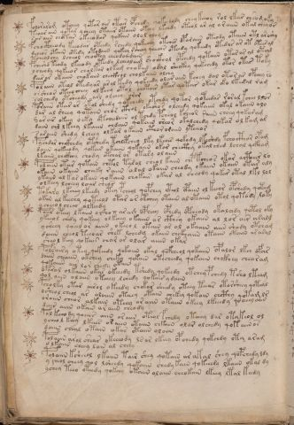

# Voynich Speculative Herbal Ferment Recipe — f113v

IMPORTANT: this is NOT a real or validated translation of the Voynich Manuscript. It is a speculative/procedural model that interprets EVA using a user-defined grammar to generate experimental recipes using safe, known edible substitutes.

This file is generated automatically from IVTFF/EVA transliteration plus a user-defined procedural grammar.



## Page / Folio
- currier: B
- folio: f113v
- page_number: 229

## EVA Text (Transliteration)
```text
folorarom otchey qotar air otair opchedy qokeedody chey keeoy rol lkar ch[s:r]om oky
teoar ain qotar ycheey otaiir otaiin okchy lkchdy oteol ar al ar aiin okal cheyor
sar aiin chotar okeeodar qokain olol olam
fchoctheody keeodar oteedy rchedy qokechy otcher oparaiin oteody otaiin otl aroshy
dcheos otaiin otedy otodaiin qokeey rcheey qoeear oteedy qokeedy otedar ar ot otees al
tcheolchy lcheol chockhy cheoda?daiin
fcheshd teody lkeeody oteedy lchealaim shockhol opchedy qotaiin otar ar al oteal
ycheody qokeeor choltar olkam chokam odal sheckhy qokchedy otor otar toky
dair ar okaiin chokaiin checkhol cholkaiin olchy
polaiin oteol otedyar aral kedy qokeedy olar aiin kchey dal otor ar opchey ro
orsheor oteeo cheey olkeey otal chotair otar qotar okar oko lkedal ram
solchedy otsheody arl olchey oror
poraiin otar ar okol shedy qokchedy otchdy qotor qoteedar roral fchee llor
dar al sheey qotaiin chor cthol okeshos olchedy qokaiin okal o kaiin olo
@187;ar ar okeey oeky otcheedaiin ol tchdy pche[o:a]l kcheor @206;aiin cheey qokaram
daiin chl l keey lkaiin chdain qokain ch'eor okalchedy qokar olkam ar
saraiin shedy lcheey olkar okaiin cthororaiin yteeeor
pychdar chckhedy otshedy tcheepchey lky lkches qokody lkeshdy fchocthor opam
daiin qokeeody qokar okaiin qokaiin okar checthy okal ched lchal qckham
lkaiin chckhhy chody otchar ar otary ol aiin
polaiin otar qotain chtol tarol cheol kaiin chp kcheos okar aithar lo
okaiin okaiin ch[ee:a]ky raiin olal okaiin cheody okaiin okaiin otar aly
ykaiin al kar okain qokaiin chakair okar al cheody qokor otal lkl lol
olkeey lcheey loar cheos
tokary lkchey lkeedy otey pcheol qopchey cthol opaiin ol keeor opshedy qotam
okiin al keechy qoteeol otar ar otchey otaiin al otaiin otol qotody loty
y cheeo l cheeo alkeedy
paiir oteey l kaiin oi'hox arash opheey cphedy opcheody okalchdy qotol oky
ykeeol chedy qokeey olkeeey okaiin a r cthey okaiin al lor air aralg
ysheey qoeey or aiiin okeeo l otain ar ol okaiiin aiin shody otcham
daiiin cheol teeoar shek lchedy okaiin chckhaiin otaiin otaiin araral
sheo l keey qokain char ar olar aiiin okar
pol[s:r]airy oteo qokeedy qokaiin okal qofcheol qokaiin opalor lkch ofch[r:s]
daiin cheaiin okchey cheky qokain otecheedy qokaiin chckhey chearam
qokaiin air lo r chedy otain
ofaral olkaiin okar okeeedy tshedy qokeedy otchey p chedy tsho lteam
qol aiin olaiin oteeey lchedy qokair y daiin
pcholky otar airol okeedy chokor sheedy oteey teear otorsheey qoteal
osheol cheol ar aloiiin oteeey otain chekey qokain chcthy qotam lr
oraiin cheor alkain oteey ar aiin otaiin okeey lkeeedy qo oeeey aiin
dair aiin okain a r aiin cheody
pol keeo dy qoeees aiin or aiin oteol fchedy otchey dar otakeol ol
ycheo l keey lkeees or aiin otaiin chkain olar olchedy qok aiinos
daiin cheal otain okar otaiin oloiin
polaiin arol shear okeeeody ls ar lkeey opchedy qokchdy ota aram
o lkaiin cheey lain al cheey
polaiin ksheeol lkaiin tair shey qotain ar akal shey qopchedy ldy
y cheol cheey qol lsheedy qokaiin chedy kain qokeeedy lkaiin okal dy
yshey teeo oteedy qokeey otaiin olaiin cheokain lkeey ltal keedy
```

## Recipes Index (This Page)
- [f113v.1,@P0](#f113v-1-f113v-1-p0)
- [f113v.2,+P0](#f113v-2-f113v-2-p0)
- [f113v.3,+P0](#f113v-3-f113v-3-p0)
- [f113v.4,+P0](#f113v-4-f113v-4-p0)
- [f113v.5,+P0](#f113v-5-f113v-5-p0)
- [f113v.6,+P0](#f113v-6-f113v-6-p0)
- [f113v.7,+P0](#f113v-7-f113v-7-p0)
- [f113v.8,+P0](#f113v-8-f113v-8-p0)
- [f113v.9,+P0](#f113v-9-f113v-9-p0)
- [f113v.10,+P0](#f113v-10-f113v-10-p0)
- [f113v.11,+P0](#f113v-11-f113v-11-p0)
- [f113v.12,+P0](#f113v-12-f113v-12-p0)
- [f113v.13,+P0](#f113v-13-f113v-13-p0)
- [f113v.14,+P0](#f113v-14-f113v-14-p0)
- [f113v.15,+P0](#f113v-15-f113v-15-p0)
- [f113v.16,+P0](#f113v-16-f113v-16-p0)
- [f113v.17,+P0](#f113v-17-f113v-17-p0)
- [f113v.18,+P0](#f113v-18-f113v-18-p0)
- [f113v.19,+P0](#f113v-19-f113v-19-p0)
- [f113v.20,+P0](#f113v-20-f113v-20-p0)
- [f113v.21,+P0](#f113v-21-f113v-21-p0)
- [f113v.22,+P0](#f113v-22-f113v-22-p0)
- [f113v.23,+P0](#f113v-23-f113v-23-p0)
- [f113v.24,+P0](#f113v-24-f113v-24-p0)
- [f113v.25,+P0](#f113v-25-f113v-25-p0)
- [f113v.26,+P0](#f113v-26-f113v-26-p0)
- [f113v.27,+P0](#f113v-27-f113v-27-p0)
- [f113v.28,+P0](#f113v-28-f113v-28-p0)
- [f113v.29,+P0](#f113v-29-f113v-29-p0)
- [f113v.30,+P0](#f113v-30-f113v-30-p0)
- [f113v.31,+P0](#f113v-31-f113v-31-p0)
- [f113v.32,+P0](#f113v-32-f113v-32-p0)
- [f113v.33,+P0](#f113v-33-f113v-33-p0)
- [f113v.34,+P0](#f113v-34-f113v-34-p0)
- [f113v.35,+P0](#f113v-35-f113v-35-p0)
- [f113v.36,+P0](#f113v-36-f113v-36-p0)
- [f113v.37,+P0](#f113v-37-f113v-37-p0)
- [f113v.38,+P0](#f113v-38-f113v-38-p0)
- [f113v.39,+P0](#f113v-39-f113v-39-p0)
- [f113v.40,+P0](#f113v-40-f113v-40-p0)
- [f113v.41,+P0](#f113v-41-f113v-41-p0)
- [f113v.42,+P0](#f113v-42-f113v-42-p0)
- [f113v.43,+P0](#f113v-43-f113v-43-p0)
- [f113v.44,+P0](#f113v-44-f113v-44-p0)
- [f113v.45,+P0](#f113v-45-f113v-45-p0)
- [f113v.46,+P0](#f113v-46-f113v-46-p0)
- [f113v.47,+P0](#f113v-47-f113v-47-p0)
- [f113v.48,+P0](#f113v-48-f113v-48-p0)
- [f113v.49,+P0](#f113v-49-f113v-49-p0)

## Line Glosses (Procedural Gloss Only; Not a Translation)

<a id="f113v-1-f113v-1-p0"></a>

### f113v.1,@P0

EVA: folorarom otchey qotar air otair opchedy qokeedody chey keeoy rol lkar ch[s:r]om oky

Direct Gloss (Procedural, Not a Real Translation):
- folorarom: add aroma modifier → mix / transfer → duration level 1 → state: fermentation start
- otchey: apply heat/cooking → add main plant (safe substitute) → mix / transfer → duration level 1 → state: active extraction
- qotar: prepare liquid base → apply heat/cooking → duration level 1 → state: fermentation start
- air: duration level 1 → state: fermentation start
- otair: apply heat/cooking → mix / transfer → duration level 1 → state: fermentation start
- opchedy: add main plant (safe substitute) → mix / transfer → start fermentation (yeast) → duration level 1 → state: active extraction
- qokeedody: prepare liquid base → add fermentable sugars → mix / transfer → start fermentation (yeast) → duration level 2 → state: active extraction
- chey: add main plant (safe substitute) → duration level 1 → state: active extraction
- keeoy: add fermentable sugars → mix / transfer → duration level 2 → state: active extraction
- rol: mix / transfer
- lkar: add fermentable sugars → duration level 1 → state: fermentation start
- ch: add main plant (safe substitute)
- s: [unparsed]
- r: [unparsed]
- om: mix / transfer
- oky: add fermentable sugars → mix / transfer

<a id="f113v-2-f113v-2-p0"></a>

### f113v.2,+P0

EVA: teoar ain qotar ycheey otaiir otaiin okchy lkchdy oteol ar al ar aiin okal cheyor

Direct Gloss (Procedural, Not a Real Translation):
- teoar: apply heat/cooking → mix / transfer → duration level 1 → state: active extraction
- ain: duration level 1 → state: fermentation start
- qotar: prepare liquid base → apply heat/cooking → duration level 1 → state: fermentation start
- ycheey: add main plant (safe substitute) → duration level 2 → state: active extraction
- otaiir: apply heat/cooking → mix / transfer → duration level 1 → state: fermentation start
- otaiin: apply heat/cooking → mix / transfer → duration level 1 → state: fermentation start → long fermentation / aging phase
- okchy: add fermentable sugars → add main plant (safe substitute) → mix / transfer
- lkchdy: add fermentable sugars → add main plant (safe substitute) → start fermentation (yeast)
- oteol: apply heat/cooking → mix / transfer → duration level 1 → state: active extraction
- ar: duration level 1 → state: fermentation start
- al: duration level 1 → state: fermentation start
- ar: duration level 1 → state: fermentation start
- aiin: duration level 1 → state: fermentation start → long fermentation / aging phase
- okal: add fermentable sugars → mix / transfer → duration level 1 → state: fermentation start
- cheyor: add main plant (safe substitute) → mix / transfer → duration level 1 → state: active extraction

<a id="f113v-3-f113v-3-p0"></a>

### f113v.3,+P0

EVA: sar aiin chotar okeeodar qokain olol olam

Direct Gloss (Procedural, Not a Real Translation):
- sar: duration level 1 → state: fermentation start
- aiin: duration level 1 → state: fermentation start → long fermentation / aging phase
- chotar: apply heat/cooking → add main plant (safe substitute) → mix / transfer → duration level 1 → state: fermentation start
- okeeodar: add fermentable sugars → mix / transfer → start fermentation (yeast) → duration level 2 → state: active extraction
- qokain: prepare liquid base → add fermentable sugars → duration level 1 → state: fermentation start
- olol: mix / transfer
- olam: mix / transfer → duration level 1 → state: fermentation start

<a id="f113v-4-f113v-4-p0"></a>

### f113v.4,+P0

EVA: fchoctheody keeodar oteedy rchedy qokechy otcher oparaiin oteody otaiin otl aroshy

Direct Gloss (Procedural, Not a Real Translation):
- fchoctheody: add main plant (safe substitute) → add aroma modifier → mix / transfer → start fermentation (yeast) → add complex herbal compound (safe blend) → duration level 1 → state: active extraction
- keeodar: add fermentable sugars → mix / transfer → start fermentation (yeast) → duration level 2 → state: active extraction
- oteedy: apply heat/cooking → mix / transfer → start fermentation (yeast) → duration level 2 → state: active extraction
- rchedy: add main plant (safe substitute) → start fermentation (yeast) → duration level 1 → state: active extraction
- qokechy: prepare liquid base → add fermentable sugars → add main plant (safe substitute) → duration level 1 → state: active extraction
- otcher: apply heat/cooking → add main plant (safe substitute) → mix / transfer → duration level 1 → state: active extraction
- oparaiin: mix / transfer → start fermentation (yeast) → duration level 1 → state: fermentation start → long fermentation / aging phase
- oteody: apply heat/cooking → mix / transfer → start fermentation (yeast) → duration level 1 → state: active extraction
- otaiin: apply heat/cooking → mix / transfer → duration level 1 → state: fermentation start → long fermentation / aging phase
- otl: apply heat/cooking → mix / transfer
- aroshy: add secondary herb (safe substitute) → mix / transfer → duration level 1 → state: fermentation start

<a id="f113v-5-f113v-5-p0"></a>

### f113v.5,+P0

EVA: dcheos otaiin otedy otodaiin qokeey rcheey qoeear oteedy qokeedy otedar ar ot otees al

Direct Gloss (Procedural, Not a Real Translation):
- dcheos: add main plant (safe substitute) → mix / transfer → start fermentation (yeast) → duration level 1 → state: active extraction
- otaiin: apply heat/cooking → mix / transfer → duration level 1 → state: fermentation start → long fermentation / aging phase
- otedy: apply heat/cooking → mix / transfer → start fermentation (yeast) → duration level 1 → state: active extraction
- otodaiin: apply heat/cooking → mix / transfer → start fermentation (yeast) → duration level 1 → state: fermentation start → long fermentation / aging phase
- qokeey: prepare liquid base → add fermentable sugars → duration level 2 → state: active extraction
- rcheey: add main plant (safe substitute) → duration level 2 → state: active extraction
- qoeear: prepare liquid base → duration level 2 → state: active extraction
- oteedy: apply heat/cooking → mix / transfer → start fermentation (yeast) → duration level 2 → state: active extraction
- qokeedy: prepare liquid base → add fermentable sugars → start fermentation (yeast) → duration level 2 → state: active extraction
- otedar: apply heat/cooking → mix / transfer → start fermentation (yeast) → duration level 1 → state: active extraction
- ar: duration level 1 → state: fermentation start
- ot: apply heat/cooking → mix / transfer
- otees: apply heat/cooking → mix / transfer → duration level 2 → state: active extraction
- al: duration level 1 → state: fermentation start

<a id="f113v-6-f113v-6-p0"></a>

### f113v.6,+P0

EVA: tcheolchy lcheol chockhy cheoda?daiin

Direct Gloss (Procedural, Not a Real Translation):
- tcheolchy: apply heat/cooking → add main plant (safe substitute) → mix / transfer → duration level 1 → state: active extraction
- lcheol: add main plant (safe substitute) → mix / transfer → duration level 1 → state: active extraction
- chockhy: add main plant (safe substitute) → mix / transfer → add complex herbal compound (safe blend)
- cheoda: add main plant (safe substitute) → mix / transfer → start fermentation (yeast) → duration level 1 → state: active extraction
- daiin: start fermentation (yeast) → duration level 1 → state: fermentation start → long fermentation / aging phase

<a id="f113v-7-f113v-7-p0"></a>

### f113v.7,+P0

EVA: fcheshd teody lkeeody oteedy lchealaim shockhol opchedy qotaiin otar ar al oteal

Direct Gloss (Procedural, Not a Real Translation):
- fcheshd: add main plant (safe substitute) → add secondary herb (safe substitute) → add aroma modifier → start fermentation (yeast) → duration level 1 → state: active extraction
- teody: apply heat/cooking → mix / transfer → start fermentation (yeast) → duration level 1 → state: active extraction
- lkeeody: add fermentable sugars → mix / transfer → start fermentation (yeast) → duration level 2 → state: active extraction
- oteedy: apply heat/cooking → mix / transfer → start fermentation (yeast) → duration level 2 → state: active extraction
- lchealaim: add main plant (safe substitute) → duration level 1 → state: active extraction
- shockhol: add secondary herb (safe substitute) → mix / transfer → add complex herbal compound (safe blend)
- opchedy: add main plant (safe substitute) → mix / transfer → start fermentation (yeast) → duration level 1 → state: active extraction
- qotaiin: prepare liquid base → apply heat/cooking → duration level 1 → state: fermentation start → long fermentation / aging phase
- otar: apply heat/cooking → mix / transfer → duration level 1 → state: fermentation start
- ar: duration level 1 → state: fermentation start
- al: duration level 1 → state: fermentation start
- oteal: apply heat/cooking → mix / transfer → duration level 1 → state: active extraction

<a id="f113v-8-f113v-8-p0"></a>

### f113v.8,+P0

EVA: ycheody qokeeor choltar olkam chokam odal sheckhy qokchedy otor otar toky

Direct Gloss (Procedural, Not a Real Translation):
- ycheody: add main plant (safe substitute) → mix / transfer → start fermentation (yeast) → duration level 1 → state: active extraction
- qokeeor: prepare liquid base → add fermentable sugars → mix / transfer → duration level 2 → state: active extraction
- choltar: apply heat/cooking → add main plant (safe substitute) → mix / transfer → duration level 1 → state: fermentation start
- olkam: add fermentable sugars → mix / transfer → duration level 1 → state: fermentation start
- chokam: add fermentable sugars → add main plant (safe substitute) → mix / transfer → duration level 1 → state: fermentation start
- odal: mix / transfer → start fermentation (yeast) → duration level 1 → state: fermentation start
- sheckhy: add secondary herb (safe substitute) → add complex herbal compound (safe blend) → duration level 1 → state: active extraction
- qokchedy: prepare liquid base → add fermentable sugars → add main plant (safe substitute) → start fermentation (yeast) → duration level 1 → state: active extraction
- otor: apply heat/cooking → mix / transfer
- otar: apply heat/cooking → mix / transfer → duration level 1 → state: fermentation start
- toky: add fermentable sugars → apply heat/cooking → mix / transfer

<a id="f113v-9-f113v-9-p0"></a>

### f113v.9,+P0

EVA: dair ar okaiin chokaiin checkhol cholkaiin olchy

Direct Gloss (Procedural, Not a Real Translation):
- dair: start fermentation (yeast) → duration level 1 → state: fermentation start
- ar: duration level 1 → state: fermentation start
- okaiin: add fermentable sugars → mix / transfer → duration level 1 → state: fermentation start → long fermentation / aging phase
- chokaiin: add fermentable sugars → add main plant (safe substitute) → mix / transfer → duration level 1 → state: fermentation start → long fermentation / aging phase
- checkhol: add main plant (safe substitute) → mix / transfer → add complex herbal compound (safe blend) → duration level 1 → state: active extraction
- cholkaiin: add fermentable sugars → add main plant (safe substitute) → mix / transfer → duration level 1 → state: fermentation start → long fermentation / aging phase
- olchy: add main plant (safe substitute) → mix / transfer

<a id="f113v-10-f113v-10-p0"></a>

### f113v.10,+P0

EVA: polaiin oteol otedyar aral kedy qokeedy olar aiin kchey dal otor ar opchey ro

Direct Gloss (Procedural, Not a Real Translation):
- polaiin: mix / transfer → start fermentation (yeast) → duration level 1 → state: fermentation start → long fermentation / aging phase
- oteol: apply heat/cooking → mix / transfer → duration level 1 → state: active extraction
- otedyar: apply heat/cooking → mix / transfer → start fermentation (yeast) → duration level 1 → state: active extraction
- aral: duration level 1 → state: fermentation start
- kedy: add fermentable sugars → start fermentation (yeast) → duration level 1 → state: active extraction
- qokeedy: prepare liquid base → add fermentable sugars → start fermentation (yeast) → duration level 2 → state: active extraction
- olar: mix / transfer → duration level 1 → state: fermentation start
- aiin: duration level 1 → state: fermentation start → long fermentation / aging phase
- kchey: add fermentable sugars → add main plant (safe substitute) → duration level 1 → state: active extraction
- dal: start fermentation (yeast) → duration level 1 → state: fermentation start
- otor: apply heat/cooking → mix / transfer
- ar: duration level 1 → state: fermentation start
- opchey: add main plant (safe substitute) → mix / transfer → start fermentation (yeast) → duration level 1 → state: active extraction
- ro: mix / transfer

<a id="f113v-11-f113v-11-p0"></a>

### f113v.11,+P0

EVA: orsheor oteeo cheey olkeey otal chotair otar qotar okar oko lkedal ram

Direct Gloss (Procedural, Not a Real Translation):
- orsheor: add secondary herb (safe substitute) → mix / transfer → duration level 1 → state: active extraction
- oteeo: apply heat/cooking → mix / transfer → duration level 2 → state: active extraction
- cheey: add main plant (safe substitute) → duration level 2 → state: active extraction
- olkeey: add fermentable sugars → mix / transfer → duration level 2 → state: active extraction
- otal: apply heat/cooking → mix / transfer → duration level 1 → state: fermentation start
- chotair: apply heat/cooking → add main plant (safe substitute) → mix / transfer → duration level 1 → state: fermentation start
- otar: apply heat/cooking → mix / transfer → duration level 1 → state: fermentation start
- qotar: prepare liquid base → apply heat/cooking → duration level 1 → state: fermentation start
- okar: add fermentable sugars → mix / transfer → duration level 1 → state: fermentation start
- oko: add fermentable sugars → mix / transfer
- lkedal: add fermentable sugars → start fermentation (yeast) → duration level 1 → state: active extraction
- ram: duration level 1 → state: fermentation start

<a id="f113v-12-f113v-12-p0"></a>

### f113v.12,+P0

EVA: solchedy otsheody arl olchey oror

Direct Gloss (Procedural, Not a Real Translation):
- solchedy: add main plant (safe substitute) → mix / transfer → start fermentation (yeast) → duration level 1 → state: active extraction
- otsheody: apply heat/cooking → add secondary herb (safe substitute) → mix / transfer → start fermentation (yeast) → duration level 1 → state: active extraction
- arl: duration level 1 → state: fermentation start
- olchey: add main plant (safe substitute) → mix / transfer → duration level 1 → state: active extraction
- oror: mix / transfer

<a id="f113v-13-f113v-13-p0"></a>

### f113v.13,+P0

EVA: poraiin otar ar okol shedy qokchedy otchdy qotor qoteedar roral fchee llor

Direct Gloss (Procedural, Not a Real Translation):
- poraiin: mix / transfer → start fermentation (yeast) → duration level 1 → state: fermentation start → long fermentation / aging phase
- otar: apply heat/cooking → mix / transfer → duration level 1 → state: fermentation start
- ar: duration level 1 → state: fermentation start
- okol: add fermentable sugars → mix / transfer
- shedy: add secondary herb (safe substitute) → start fermentation (yeast) → duration level 1 → state: active extraction
- qokchedy: prepare liquid base → add fermentable sugars → add main plant (safe substitute) → start fermentation (yeast) → duration level 1 → state: active extraction
- otchdy: apply heat/cooking → add main plant (safe substitute) → mix / transfer → start fermentation (yeast)
- qotor: prepare liquid base → apply heat/cooking → mix / transfer
- qoteedar: prepare liquid base → apply heat/cooking → start fermentation (yeast) → duration level 2 → state: active extraction
- roral: mix / transfer → duration level 1 → state: fermentation start
- fchee: add main plant (safe substitute) → add aroma modifier → duration level 2 → state: active extraction
- llor: mix / transfer

<a id="f113v-14-f113v-14-p0"></a>

### f113v.14,+P0

EVA: dar al sheey qotaiin chor cthol okeshos olchedy qokaiin okal o kaiin olo

Direct Gloss (Procedural, Not a Real Translation):
- dar: start fermentation (yeast) → duration level 1 → state: fermentation start
- al: duration level 1 → state: fermentation start
- sheey: add secondary herb (safe substitute) → duration level 2 → state: active extraction
- qotaiin: prepare liquid base → apply heat/cooking → duration level 1 → state: fermentation start → long fermentation / aging phase
- chor: add main plant (safe substitute) → mix / transfer
- cthol: mix / transfer → add complex herbal compound (safe blend)
- okeshos: add fermentable sugars → add secondary herb (safe substitute) → mix / transfer → duration level 1 → state: active extraction
- olchedy: add main plant (safe substitute) → mix / transfer → start fermentation (yeast) → duration level 1 → state: active extraction
- qokaiin: prepare liquid base → add fermentable sugars → duration level 1 → state: fermentation start → long fermentation / aging phase
- okal: add fermentable sugars → mix / transfer → duration level 1 → state: fermentation start
- o: mix / transfer
- kaiin: add fermentable sugars → duration level 1 → state: fermentation start → long fermentation / aging phase
- olo: mix / transfer

<a id="f113v-15-f113v-15-p0"></a>

### f113v.15,+P0

EVA: @187;ar ar okeey oeky otcheedaiin ol tchdy pche[o:a]l kcheor @206;aiin cheey qokaram

Direct Gloss (Procedural, Not a Real Translation):
- ar: duration level 1 → state: fermentation start
- ar: duration level 1 → state: fermentation start
- okeey: add fermentable sugars → mix / transfer → duration level 2 → state: active extraction
- oeky: add fermentable sugars → mix / transfer → duration level 1 → state: active extraction
- otcheedaiin: apply heat/cooking → add main plant (safe substitute) → mix / transfer → start fermentation (yeast) → duration level 2 → state: active extraction → long fermentation / aging phase
- ol: mix / transfer
- tchdy: apply heat/cooking → add main plant (safe substitute) → start fermentation (yeast)
- pche: add main plant (safe substitute) → start fermentation (yeast) → duration level 1 → state: active extraction
- o: mix / transfer
- a: duration level 1 → state: fermentation start
- l: [unparsed]
- kcheor: add fermentable sugars → add main plant (safe substitute) → mix / transfer → duration level 1 → state: active extraction
- aiin: duration level 1 → state: fermentation start → long fermentation / aging phase
- cheey: add main plant (safe substitute) → duration level 2 → state: active extraction
- qokaram: prepare liquid base → add fermentable sugars → duration level 1 → state: fermentation start

<a id="f113v-16-f113v-16-p0"></a>

### f113v.16,+P0

EVA: daiin chl l keey lkaiin chdain qokain ch'eor okalchedy qokar olkam ar

Direct Gloss (Procedural, Not a Real Translation):
- daiin: start fermentation (yeast) → duration level 1 → state: fermentation start → long fermentation / aging phase
- chl: add main plant (safe substitute)
- l: [unparsed]
- keey: add fermentable sugars → duration level 2 → state: active extraction
- lkaiin: add fermentable sugars → duration level 1 → state: fermentation start → long fermentation / aging phase
- chdain: add main plant (safe substitute) → start fermentation (yeast) → duration level 1 → state: fermentation start
- qokain: prepare liquid base → add fermentable sugars → duration level 1 → state: fermentation start
- ch: add main plant (safe substitute)
- eor: mix / transfer → duration level 1 → state: active extraction
- okalchedy: add fermentable sugars → add main plant (safe substitute) → mix / transfer → start fermentation (yeast) → duration level 1 → state: fermentation start
- qokar: prepare liquid base → add fermentable sugars → duration level 1 → state: fermentation start
- olkam: add fermentable sugars → mix / transfer → duration level 1 → state: fermentation start
- ar: duration level 1 → state: fermentation start

<a id="f113v-17-f113v-17-p0"></a>

### f113v.17,+P0

EVA: saraiin shedy lcheey olkar okaiin cthororaiin yteeeor

Direct Gloss (Procedural, Not a Real Translation):
- saraiin: duration level 1 → state: fermentation start → long fermentation / aging phase
- shedy: add secondary herb (safe substitute) → start fermentation (yeast) → duration level 1 → state: active extraction
- lcheey: add main plant (safe substitute) → duration level 2 → state: active extraction
- olkar: add fermentable sugars → mix / transfer → duration level 1 → state: fermentation start
- okaiin: add fermentable sugars → mix / transfer → duration level 1 → state: fermentation start → long fermentation / aging phase
- cthororaiin: mix / transfer → add complex herbal compound (safe blend) → duration level 1 → state: fermentation start → long fermentation / aging phase
- yteeeor: apply heat/cooking → mix / transfer → duration level 3 → state: active extraction

<a id="f113v-18-f113v-18-p0"></a>

### f113v.18,+P0

EVA: pychdar chckhedy otshedy tcheepchey lky lkches qokody lkeshdy fchocthor opam

Direct Gloss (Procedural, Not a Real Translation):
- pychdar: add main plant (safe substitute) → start fermentation (yeast) → duration level 1 → state: fermentation start
- chckhedy: add main plant (safe substitute) → start fermentation (yeast) → add complex herbal compound (safe blend) → duration level 1 → state: active extraction
- otshedy: apply heat/cooking → add secondary herb (safe substitute) → mix / transfer → start fermentation (yeast) → duration level 1 → state: active extraction
- tcheepchey: apply heat/cooking → add main plant (safe substitute) → start fermentation (yeast) → duration level 2 → state: active extraction
- lky: add fermentable sugars
- lkches: add fermentable sugars → add main plant (safe substitute) → duration level 1 → state: active extraction
- qokody: prepare liquid base → add fermentable sugars → mix / transfer → start fermentation (yeast)
- lkeshdy: add fermentable sugars → add secondary herb (safe substitute) → start fermentation (yeast) → duration level 1 → state: active extraction
- fchocthor: add main plant (safe substitute) → add aroma modifier → mix / transfer → add complex herbal compound (safe blend)
- opam: mix / transfer → start fermentation (yeast) → duration level 1 → state: fermentation start

<a id="f113v-19-f113v-19-p0"></a>

### f113v.19,+P0

EVA: daiin qokeeody qokar okaiin qokaiin okar checthy okal ched lchal qckham

Direct Gloss (Procedural, Not a Real Translation):
- daiin: start fermentation (yeast) → duration level 1 → state: fermentation start → long fermentation / aging phase
- qokeeody: prepare liquid base → add fermentable sugars → mix / transfer → start fermentation (yeast) → duration level 2 → state: active extraction
- qokar: prepare liquid base → add fermentable sugars → duration level 1 → state: fermentation start
- okaiin: add fermentable sugars → mix / transfer → duration level 1 → state: fermentation start → long fermentation / aging phase
- qokaiin: prepare liquid base → add fermentable sugars → duration level 1 → state: fermentation start → long fermentation / aging phase
- okar: add fermentable sugars → mix / transfer → duration level 1 → state: fermentation start
- checthy: add main plant (safe substitute) → add complex herbal compound (safe blend) → duration level 1 → state: active extraction
- okal: add fermentable sugars → mix / transfer → duration level 1 → state: fermentation start
- ched: add main plant (safe substitute) → start fermentation (yeast) → duration level 1 → state: active extraction
- lchal: add main plant (safe substitute) → duration level 1 → state: fermentation start
- qckham: prepare base (generic) → add complex herbal compound (safe blend) → duration level 1 → state: fermentation start

<a id="f113v-20-f113v-20-p0"></a>

### f113v.20,+P0

EVA: lkaiin chckhhy chody otchar ar otary ol aiin

Direct Gloss (Procedural, Not a Real Translation):
- lkaiin: add fermentable sugars → duration level 1 → state: fermentation start → long fermentation / aging phase
- chckhhy: add main plant (safe substitute) → add complex herbal compound (safe blend)
- chody: add main plant (safe substitute) → mix / transfer → start fermentation (yeast)
- otchar: apply heat/cooking → add main plant (safe substitute) → mix / transfer → duration level 1 → state: fermentation start
- ar: duration level 1 → state: fermentation start
- otary: apply heat/cooking → mix / transfer → duration level 1 → state: fermentation start
- ol: mix / transfer
- aiin: duration level 1 → state: fermentation start → long fermentation / aging phase

<a id="f113v-21-f113v-21-p0"></a>

### f113v.21,+P0

EVA: polaiin otar qotain chtol tarol cheol kaiin chp kcheos okar aithar lo

Direct Gloss (Procedural, Not a Real Translation):
- polaiin: mix / transfer → start fermentation (yeast) → duration level 1 → state: fermentation start → long fermentation / aging phase
- otar: apply heat/cooking → mix / transfer → duration level 1 → state: fermentation start
- qotain: prepare liquid base → apply heat/cooking → duration level 1 → state: fermentation start
- chtol: apply heat/cooking → add main plant (safe substitute) → mix / transfer
- tarol: apply heat/cooking → mix / transfer → duration level 1 → state: fermentation start
- cheol: add main plant (safe substitute) → mix / transfer → duration level 1 → state: active extraction
- kaiin: add fermentable sugars → duration level 1 → state: fermentation start → long fermentation / aging phase
- chp: add main plant (safe substitute) → start fermentation (yeast)
- kcheos: add fermentable sugars → add main plant (safe substitute) → mix / transfer → duration level 1 → state: active extraction
- okar: add fermentable sugars → mix / transfer → duration level 1 → state: fermentation start
- aithar: apply heat/cooking → duration level 1 → state: fermentation start
- lo: mix / transfer

<a id="f113v-22-f113v-22-p0"></a>

### f113v.22,+P0

EVA: okaiin okaiin ch[ee:a]ky raiin olal okaiin cheody okaiin okaiin otar aly

Direct Gloss (Procedural, Not a Real Translation):
- okaiin: add fermentable sugars → mix / transfer → duration level 1 → state: fermentation start → long fermentation / aging phase
- okaiin: add fermentable sugars → mix / transfer → duration level 1 → state: fermentation start → long fermentation / aging phase
- ch: add main plant (safe substitute)
- ee: duration level 2 → state: active extraction
- a: duration level 1 → state: fermentation start
- ky: add fermentable sugars
- raiin: duration level 1 → state: fermentation start → long fermentation / aging phase
- olal: mix / transfer → duration level 1 → state: fermentation start
- okaiin: add fermentable sugars → mix / transfer → duration level 1 → state: fermentation start → long fermentation / aging phase
- cheody: add main plant (safe substitute) → mix / transfer → start fermentation (yeast) → duration level 1 → state: active extraction
- okaiin: add fermentable sugars → mix / transfer → duration level 1 → state: fermentation start → long fermentation / aging phase
- okaiin: add fermentable sugars → mix / transfer → duration level 1 → state: fermentation start → long fermentation / aging phase
- otar: apply heat/cooking → mix / transfer → duration level 1 → state: fermentation start
- aly: duration level 1 → state: fermentation start

<a id="f113v-23-f113v-23-p0"></a>

### f113v.23,+P0

EVA: ykaiin al kar okain qokaiin chakair okar al cheody qokor otal lkl lol

Direct Gloss (Procedural, Not a Real Translation):
- ykaiin: add fermentable sugars → duration level 1 → state: fermentation start → long fermentation / aging phase
- al: duration level 1 → state: fermentation start
- kar: add fermentable sugars → duration level 1 → state: fermentation start
- okain: add fermentable sugars → mix / transfer → duration level 1 → state: fermentation start
- qokaiin: prepare liquid base → add fermentable sugars → duration level 1 → state: fermentation start → long fermentation / aging phase
- chakair: add fermentable sugars → add main plant (safe substitute) → duration level 1 → state: fermentation start
- okar: add fermentable sugars → mix / transfer → duration level 1 → state: fermentation start
- al: duration level 1 → state: fermentation start
- cheody: add main plant (safe substitute) → mix / transfer → start fermentation (yeast) → duration level 1 → state: active extraction
- qokor: prepare liquid base → add fermentable sugars → mix / transfer
- otal: apply heat/cooking → mix / transfer → duration level 1 → state: fermentation start
- lkl: add fermentable sugars
- lol: mix / transfer

<a id="f113v-24-f113v-24-p0"></a>

### f113v.24,+P0

EVA: olkeey lcheey loar cheos

Direct Gloss (Procedural, Not a Real Translation):
- olkeey: add fermentable sugars → mix / transfer → duration level 2 → state: active extraction
- lcheey: add main plant (safe substitute) → duration level 2 → state: active extraction
- loar: mix / transfer → duration level 1 → state: fermentation start
- cheos: add main plant (safe substitute) → mix / transfer → duration level 1 → state: active extraction

<a id="f113v-25-f113v-25-p0"></a>

### f113v.25,+P0

EVA: tokary lkchey lkeedy otey pcheol qopchey cthol opaiin ol keeor opshedy qotam

Direct Gloss (Procedural, Not a Real Translation):
- tokary: add fermentable sugars → apply heat/cooking → mix / transfer → duration level 1 → state: fermentation start
- lkchey: add fermentable sugars → add main plant (safe substitute) → duration level 1 → state: active extraction
- lkeedy: add fermentable sugars → start fermentation (yeast) → duration level 2 → state: active extraction
- otey: apply heat/cooking → mix / transfer → duration level 1 → state: active extraction
- pcheol: add main plant (safe substitute) → mix / transfer → start fermentation (yeast) → duration level 1 → state: active extraction
- qopchey: prepare liquid base → add main plant (safe substitute) → start fermentation (yeast) → duration level 1 → state: active extraction
- cthol: mix / transfer → add complex herbal compound (safe blend)
- opaiin: mix / transfer → start fermentation (yeast) → duration level 1 → state: fermentation start → long fermentation / aging phase
- ol: mix / transfer
- keeor: add fermentable sugars → mix / transfer → duration level 2 → state: active extraction
- opshedy: add secondary herb (safe substitute) → mix / transfer → start fermentation (yeast) → duration level 1 → state: active extraction
- qotam: prepare liquid base → apply heat/cooking → duration level 1 → state: fermentation start

<a id="f113v-26-f113v-26-p0"></a>

### f113v.26,+P0

EVA: okiin al keechy qoteeol otar ar otchey otaiin al otaiin otol qotody loty

Direct Gloss (Procedural, Not a Real Translation):
- okiin: add fermentable sugars → mix / transfer → duration level 2 → state: cooling/rest → medium fermentation phase
- al: duration level 1 → state: fermentation start
- keechy: add fermentable sugars → add main plant (safe substitute) → duration level 2 → state: active extraction
- qoteeol: prepare liquid base → apply heat/cooking → mix / transfer → duration level 2 → state: active extraction
- otar: apply heat/cooking → mix / transfer → duration level 1 → state: fermentation start
- ar: duration level 1 → state: fermentation start
- otchey: apply heat/cooking → add main plant (safe substitute) → mix / transfer → duration level 1 → state: active extraction
- otaiin: apply heat/cooking → mix / transfer → duration level 1 → state: fermentation start → long fermentation / aging phase
- al: duration level 1 → state: fermentation start
- otaiin: apply heat/cooking → mix / transfer → duration level 1 → state: fermentation start → long fermentation / aging phase
- otol: apply heat/cooking → mix / transfer
- qotody: prepare liquid base → apply heat/cooking → mix / transfer → start fermentation (yeast)
- loty: apply heat/cooking → mix / transfer

<a id="f113v-27-f113v-27-p0"></a>

### f113v.27,+P0

EVA: y cheeo l cheeo alkeedy

Direct Gloss (Procedural, Not a Real Translation):
- y: [unparsed]
- cheeo: add main plant (safe substitute) → mix / transfer → duration level 2 → state: active extraction
- l: [unparsed]
- cheeo: add main plant (safe substitute) → mix / transfer → duration level 2 → state: active extraction
- alkeedy: add fermentable sugars → start fermentation (yeast) → duration level 1 → state: fermentation start

<a id="f113v-28-f113v-28-p0"></a>

### f113v.28,+P0

EVA: paiir oteey l kaiin oi'hox arash opheey cphedy opcheody okalchdy qotol oky

Direct Gloss (Procedural, Not a Real Translation):
- paiir: start fermentation (yeast) → duration level 1 → state: fermentation start
- oteey: apply heat/cooking → mix / transfer → duration level 2 → state: active extraction
- l: [unparsed]
- kaiin: add fermentable sugars → duration level 1 → state: fermentation start → long fermentation / aging phase
- oi: mix / transfer → duration level 1 → state: cooling/rest
- hox: mix / transfer
- arash: add secondary herb (safe substitute) → duration level 1 → state: fermentation start
- opheey: mix / transfer → start fermentation (yeast) → duration level 2 → state: active extraction
- cphedy: start fermentation (yeast) → add complex herbal compound (safe blend) → duration level 1 → state: active extraction
- opcheody: add main plant (safe substitute) → mix / transfer → start fermentation (yeast) → duration level 1 → state: active extraction
- okalchdy: add fermentable sugars → add main plant (safe substitute) → mix / transfer → start fermentation (yeast) → duration level 1 → state: fermentation start
- qotol: prepare liquid base → apply heat/cooking → mix / transfer
- oky: add fermentable sugars → mix / transfer

<a id="f113v-29-f113v-29-p0"></a>

### f113v.29,+P0

EVA: ykeeol chedy qokeey olkeeey okaiin a r cthey okaiin al lor air aralg

Direct Gloss (Procedural, Not a Real Translation):
- ykeeol: add fermentable sugars → mix / transfer → duration level 2 → state: active extraction
- chedy: add main plant (safe substitute) → start fermentation (yeast) → duration level 1 → state: active extraction
- qokeey: prepare liquid base → add fermentable sugars → duration level 2 → state: active extraction
- olkeeey: add fermentable sugars → mix / transfer → duration level 3 → state: active extraction
- okaiin: add fermentable sugars → mix / transfer → duration level 1 → state: fermentation start → long fermentation / aging phase
- a: duration level 1 → state: fermentation start
- r: [unparsed]
- cthey: add complex herbal compound (safe blend) → duration level 1 → state: active extraction
- okaiin: add fermentable sugars → mix / transfer → duration level 1 → state: fermentation start → long fermentation / aging phase
- al: duration level 1 → state: fermentation start
- lor: mix / transfer
- air: duration level 1 → state: fermentation start
- aralg: duration level 1 → state: fermentation start

<a id="f113v-30-f113v-30-p0"></a>

### f113v.30,+P0

EVA: ysheey qoeey or aiiin okeeo l otain ar ol okaiiin aiin shody otcham

Direct Gloss (Procedural, Not a Real Translation):
- ysheey: add secondary herb (safe substitute) → duration level 2 → state: active extraction
- qoeey: prepare liquid base → duration level 2 → state: active extraction
- or: mix / transfer
- aiiin: duration level 1 → state: fermentation start → medium fermentation phase
- okeeo: add fermentable sugars → mix / transfer → duration level 2 → state: active extraction
- l: [unparsed]
- otain: apply heat/cooking → mix / transfer → duration level 1 → state: fermentation start
- ar: duration level 1 → state: fermentation start
- ol: mix / transfer
- okaiiin: add fermentable sugars → mix / transfer → duration level 1 → state: fermentation start → medium fermentation phase
- aiin: duration level 1 → state: fermentation start → long fermentation / aging phase
- shody: add secondary herb (safe substitute) → mix / transfer → start fermentation (yeast)
- otcham: apply heat/cooking → add main plant (safe substitute) → mix / transfer → duration level 1 → state: fermentation start

<a id="f113v-31-f113v-31-p0"></a>

### f113v.31,+P0

EVA: daiiin cheol teeoar shek lchedy okaiin chckhaiin otaiin otaiin araral

Direct Gloss (Procedural, Not a Real Translation):
- daiiin: start fermentation (yeast) → duration level 1 → state: fermentation start → medium fermentation phase
- cheol: add main plant (safe substitute) → mix / transfer → duration level 1 → state: active extraction
- teeoar: apply heat/cooking → mix / transfer → duration level 2 → state: active extraction
- shek: add fermentable sugars → add secondary herb (safe substitute) → duration level 1 → state: active extraction
- lchedy: add main plant (safe substitute) → start fermentation (yeast) → duration level 1 → state: active extraction
- okaiin: add fermentable sugars → mix / transfer → duration level 1 → state: fermentation start → long fermentation / aging phase
- chckhaiin: add main plant (safe substitute) → add complex herbal compound (safe blend) → duration level 1 → state: fermentation start → long fermentation / aging phase
- otaiin: apply heat/cooking → mix / transfer → duration level 1 → state: fermentation start → long fermentation / aging phase
- otaiin: apply heat/cooking → mix / transfer → duration level 1 → state: fermentation start → long fermentation / aging phase
- araral: duration level 1 → state: fermentation start

<a id="f113v-32-f113v-32-p0"></a>

### f113v.32,+P0

EVA: sheo l keey qokain char ar olar aiiin okar

Direct Gloss (Procedural, Not a Real Translation):
- sheo: add secondary herb (safe substitute) → mix / transfer → duration level 1 → state: active extraction
- l: [unparsed]
- keey: add fermentable sugars → duration level 2 → state: active extraction
- qokain: prepare liquid base → add fermentable sugars → duration level 1 → state: fermentation start
- char: add main plant (safe substitute) → duration level 1 → state: fermentation start
- ar: duration level 1 → state: fermentation start
- olar: mix / transfer → duration level 1 → state: fermentation start
- aiiin: duration level 1 → state: fermentation start → medium fermentation phase
- okar: add fermentable sugars → mix / transfer → duration level 1 → state: fermentation start

<a id="f113v-33-f113v-33-p0"></a>

### f113v.33,+P0

EVA: pol[s:r]airy oteo qokeedy qokaiin okal qofcheol qokaiin opalor lkch ofch[r:s]

Direct Gloss (Procedural, Not a Real Translation):
- pol: mix / transfer → start fermentation (yeast)
- s: [unparsed]
- r: [unparsed]
- airy: duration level 1 → state: fermentation start
- oteo: apply heat/cooking → mix / transfer → duration level 1 → state: active extraction
- qokeedy: prepare liquid base → add fermentable sugars → start fermentation (yeast) → duration level 2 → state: active extraction
- qokaiin: prepare liquid base → add fermentable sugars → duration level 1 → state: fermentation start → long fermentation / aging phase
- okal: add fermentable sugars → mix / transfer → duration level 1 → state: fermentation start
- qofcheol: prepare liquid base → add main plant (safe substitute) → add aroma modifier → mix / transfer → duration level 1 → state: active extraction
- qokaiin: prepare liquid base → add fermentable sugars → duration level 1 → state: fermentation start → long fermentation / aging phase
- opalor: mix / transfer → start fermentation (yeast) → duration level 1 → state: fermentation start
- lkch: add fermentable sugars → add main plant (safe substitute)
- ofch: add main plant (safe substitute) → add aroma modifier → mix / transfer
- r: [unparsed]
- s: [unparsed]

<a id="f113v-34-f113v-34-p0"></a>

### f113v.34,+P0

EVA: daiin cheaiin okchey cheky qokain otecheedy qokaiin chckhey chearam

Direct Gloss (Procedural, Not a Real Translation):
- daiin: start fermentation (yeast) → duration level 1 → state: fermentation start → long fermentation / aging phase
- cheaiin: add main plant (safe substitute) → duration level 1 → state: active extraction → long fermentation / aging phase
- okchey: add fermentable sugars → add main plant (safe substitute) → mix / transfer → duration level 1 → state: active extraction
- cheky: add fermentable sugars → add main plant (safe substitute) → duration level 1 → state: active extraction
- qokain: prepare liquid base → add fermentable sugars → duration level 1 → state: fermentation start
- otecheedy: apply heat/cooking → add main plant (safe substitute) → mix / transfer → start fermentation (yeast) → duration level 1 → state: active extraction
- qokaiin: prepare liquid base → add fermentable sugars → duration level 1 → state: fermentation start → long fermentation / aging phase
- chckhey: add main plant (safe substitute) → add complex herbal compound (safe blend) → duration level 1 → state: active extraction
- chearam: add main plant (safe substitute) → duration level 1 → state: active extraction

<a id="f113v-35-f113v-35-p0"></a>

### f113v.35,+P0

EVA: qokaiin air lo r chedy otain

Direct Gloss (Procedural, Not a Real Translation):
- qokaiin: prepare liquid base → add fermentable sugars → duration level 1 → state: fermentation start → long fermentation / aging phase
- air: duration level 1 → state: fermentation start
- lo: mix / transfer
- r: [unparsed]
- chedy: add main plant (safe substitute) → start fermentation (yeast) → duration level 1 → state: active extraction
- otain: apply heat/cooking → mix / transfer → duration level 1 → state: fermentation start

<a id="f113v-36-f113v-36-p0"></a>

### f113v.36,+P0

EVA: ofaral olkaiin okar okeeedy tshedy qokeedy otchey p chedy tsho lteam

Direct Gloss (Procedural, Not a Real Translation):
- ofaral: add aroma modifier → mix / transfer → duration level 1 → state: fermentation start
- olkaiin: add fermentable sugars → mix / transfer → duration level 1 → state: fermentation start → long fermentation / aging phase
- okar: add fermentable sugars → mix / transfer → duration level 1 → state: fermentation start
- okeeedy: add fermentable sugars → mix / transfer → start fermentation (yeast) → duration level 3 → state: active extraction
- tshedy: apply heat/cooking → add secondary herb (safe substitute) → start fermentation (yeast) → duration level 1 → state: active extraction
- qokeedy: prepare liquid base → add fermentable sugars → start fermentation (yeast) → duration level 2 → state: active extraction
- otchey: apply heat/cooking → add main plant (safe substitute) → mix / transfer → duration level 1 → state: active extraction
- p: start fermentation (yeast)
- chedy: add main plant (safe substitute) → start fermentation (yeast) → duration level 1 → state: active extraction
- tsho: apply heat/cooking → add secondary herb (safe substitute) → mix / transfer
- lteam: apply heat/cooking → duration level 1 → state: active extraction

<a id="f113v-37-f113v-37-p0"></a>

### f113v.37,+P0

EVA: qol aiin olaiin oteeey lchedy qokair y daiin

Direct Gloss (Procedural, Not a Real Translation):
- qol: prepare liquid base
- aiin: duration level 1 → state: fermentation start → long fermentation / aging phase
- olaiin: mix / transfer → duration level 1 → state: fermentation start → long fermentation / aging phase
- oteeey: apply heat/cooking → mix / transfer → duration level 3 → state: active extraction
- lchedy: add main plant (safe substitute) → start fermentation (yeast) → duration level 1 → state: active extraction
- qokair: prepare liquid base → add fermentable sugars → duration level 1 → state: fermentation start
- y: [unparsed]
- daiin: start fermentation (yeast) → duration level 1 → state: fermentation start → long fermentation / aging phase

<a id="f113v-38-f113v-38-p0"></a>

### f113v.38,+P0

EVA: pcholky otar airol okeedy chokor sheedy oteey teear otorsheey qoteal

Direct Gloss (Procedural, Not a Real Translation):
- pcholky: add fermentable sugars → add main plant (safe substitute) → mix / transfer → start fermentation (yeast)
- otar: apply heat/cooking → mix / transfer → duration level 1 → state: fermentation start
- airol: mix / transfer → duration level 1 → state: fermentation start
- okeedy: add fermentable sugars → mix / transfer → start fermentation (yeast) → duration level 2 → state: active extraction
- chokor: add fermentable sugars → add main plant (safe substitute) → mix / transfer
- sheedy: add secondary herb (safe substitute) → start fermentation (yeast) → duration level 2 → state: active extraction
- oteey: apply heat/cooking → mix / transfer → duration level 2 → state: active extraction
- teear: apply heat/cooking → duration level 2 → state: active extraction
- otorsheey: apply heat/cooking → add secondary herb (safe substitute) → mix / transfer → duration level 2 → state: active extraction
- qoteal: prepare liquid base → apply heat/cooking → duration level 1 → state: active extraction

<a id="f113v-39-f113v-39-p0"></a>

### f113v.39,+P0

EVA: osheol cheol ar aloiiin oteeey otain chekey qokain chcthy qotam lr

Direct Gloss (Procedural, Not a Real Translation):
- osheol: add secondary herb (safe substitute) → mix / transfer → duration level 1 → state: active extraction
- cheol: add main plant (safe substitute) → mix / transfer → duration level 1 → state: active extraction
- ar: duration level 1 → state: fermentation start
- aloiiin: mix / transfer → duration level 1 → state: fermentation start → medium fermentation phase
- oteeey: apply heat/cooking → mix / transfer → duration level 3 → state: active extraction
- otain: apply heat/cooking → mix / transfer → duration level 1 → state: fermentation start
- chekey: add fermentable sugars → add main plant (safe substitute) → duration level 1 → state: active extraction
- qokain: prepare liquid base → add fermentable sugars → duration level 1 → state: fermentation start
- chcthy: add main plant (safe substitute) → add complex herbal compound (safe blend)
- qotam: prepare liquid base → apply heat/cooking → duration level 1 → state: fermentation start
- lr: [unparsed]

<a id="f113v-40-f113v-40-p0"></a>

### f113v.40,+P0

EVA: oraiin cheor alkain oteey ar aiin otaiin okeey lkeeedy qo oeeey aiin

Direct Gloss (Procedural, Not a Real Translation):
- oraiin: mix / transfer → duration level 1 → state: fermentation start → long fermentation / aging phase
- cheor: add main plant (safe substitute) → mix / transfer → duration level 1 → state: active extraction
- alkain: add fermentable sugars → duration level 1 → state: fermentation start
- oteey: apply heat/cooking → mix / transfer → duration level 2 → state: active extraction
- ar: duration level 1 → state: fermentation start
- aiin: duration level 1 → state: fermentation start → long fermentation / aging phase
- otaiin: apply heat/cooking → mix / transfer → duration level 1 → state: fermentation start → long fermentation / aging phase
- okeey: add fermentable sugars → mix / transfer → duration level 2 → state: active extraction
- lkeeedy: add fermentable sugars → start fermentation (yeast) → duration level 3 → state: active extraction
- qo: prepare liquid base
- oeeey: mix / transfer → duration level 3 → state: active extraction
- aiin: duration level 1 → state: fermentation start → long fermentation / aging phase

<a id="f113v-41-f113v-41-p0"></a>

### f113v.41,+P0

EVA: dair aiin okain a r aiin cheody

Direct Gloss (Procedural, Not a Real Translation):
- dair: start fermentation (yeast) → duration level 1 → state: fermentation start
- aiin: duration level 1 → state: fermentation start → long fermentation / aging phase
- okain: add fermentable sugars → mix / transfer → duration level 1 → state: fermentation start
- a: duration level 1 → state: fermentation start
- r: [unparsed]
- aiin: duration level 1 → state: fermentation start → long fermentation / aging phase
- cheody: add main plant (safe substitute) → mix / transfer → start fermentation (yeast) → duration level 1 → state: active extraction

<a id="f113v-42-f113v-42-p0"></a>

### f113v.42,+P0

EVA: pol keeo dy qoeees aiin or aiin oteol fchedy otchey dar otakeol ol

Direct Gloss (Procedural, Not a Real Translation):
- pol: mix / transfer → start fermentation (yeast)
- keeo: add fermentable sugars → mix / transfer → duration level 2 → state: active extraction
- dy: start fermentation (yeast)
- qoeees: prepare liquid base → duration level 3 → state: active extraction
- aiin: duration level 1 → state: fermentation start → long fermentation / aging phase
- or: mix / transfer
- aiin: duration level 1 → state: fermentation start → long fermentation / aging phase
- oteol: apply heat/cooking → mix / transfer → duration level 1 → state: active extraction
- fchedy: add main plant (safe substitute) → add aroma modifier → start fermentation (yeast) → duration level 1 → state: active extraction
- otchey: apply heat/cooking → add main plant (safe substitute) → mix / transfer → duration level 1 → state: active extraction
- dar: start fermentation (yeast) → duration level 1 → state: fermentation start
- otakeol: add fermentable sugars → apply heat/cooking → mix / transfer → duration level 1 → state: fermentation start
- ol: mix / transfer

<a id="f113v-43-f113v-43-p0"></a>

### f113v.43,+P0

EVA: ycheo l keey lkeees or aiin otaiin chkain olar olchedy qok aiinos

Direct Gloss (Procedural, Not a Real Translation):
- ycheo: add main plant (safe substitute) → mix / transfer → duration level 1 → state: active extraction
- l: [unparsed]
- keey: add fermentable sugars → duration level 2 → state: active extraction
- lkeees: add fermentable sugars → duration level 3 → state: active extraction
- or: mix / transfer
- aiin: duration level 1 → state: fermentation start → long fermentation / aging phase
- otaiin: apply heat/cooking → mix / transfer → duration level 1 → state: fermentation start → long fermentation / aging phase
- chkain: add fermentable sugars → add main plant (safe substitute) → duration level 1 → state: fermentation start
- olar: mix / transfer → duration level 1 → state: fermentation start
- olchedy: add main plant (safe substitute) → mix / transfer → start fermentation (yeast) → duration level 1 → state: active extraction
- qok: prepare liquid base → add fermentable sugars
- aiinos: mix / transfer → duration level 1 → state: fermentation start → long fermentation / aging phase

<a id="f113v-44-f113v-44-p0"></a>

### f113v.44,+P0

EVA: daiin cheal otain okar otaiin oloiin

Direct Gloss (Procedural, Not a Real Translation):
- daiin: start fermentation (yeast) → duration level 1 → state: fermentation start → long fermentation / aging phase
- cheal: add main plant (safe substitute) → duration level 1 → state: active extraction
- otain: apply heat/cooking → mix / transfer → duration level 1 → state: fermentation start
- okar: add fermentable sugars → mix / transfer → duration level 1 → state: fermentation start
- otaiin: apply heat/cooking → mix / transfer → duration level 1 → state: fermentation start → long fermentation / aging phase
- oloiin: mix / transfer → duration level 2 → state: cooling/rest → medium fermentation phase

<a id="f113v-45-f113v-45-p0"></a>

### f113v.45,+P0

EVA: polaiin arol shear okeeeody ls ar lkeey opchedy qokchdy ota aram

Direct Gloss (Procedural, Not a Real Translation):
- polaiin: mix / transfer → start fermentation (yeast) → duration level 1 → state: fermentation start → long fermentation / aging phase
- arol: mix / transfer → duration level 1 → state: fermentation start
- shear: add secondary herb (safe substitute) → duration level 1 → state: active extraction
- okeeeody: add fermentable sugars → mix / transfer → start fermentation (yeast) → duration level 3 → state: active extraction
- ls: [unparsed]
- ar: duration level 1 → state: fermentation start
- lkeey: add fermentable sugars → duration level 2 → state: active extraction
- opchedy: add main plant (safe substitute) → mix / transfer → start fermentation (yeast) → duration level 1 → state: active extraction
- qokchdy: prepare liquid base → add fermentable sugars → add main plant (safe substitute) → start fermentation (yeast)
- ota: apply heat/cooking → mix / transfer → duration level 1 → state: fermentation start
- aram: duration level 1 → state: fermentation start

<a id="f113v-46-f113v-46-p0"></a>

### f113v.46,+P0

EVA: o lkaiin cheey lain al cheey

Direct Gloss (Procedural, Not a Real Translation):
- o: mix / transfer
- lkaiin: add fermentable sugars → duration level 1 → state: fermentation start → long fermentation / aging phase
- cheey: add main plant (safe substitute) → duration level 2 → state: active extraction
- lain: duration level 1 → state: fermentation start
- al: duration level 1 → state: fermentation start
- cheey: add main plant (safe substitute) → duration level 2 → state: active extraction

<a id="f113v-47-f113v-47-p0"></a>

### f113v.47,+P0

EVA: polaiin ksheeol lkaiin tair shey qotain ar akal shey qopchedy ldy

Direct Gloss (Procedural, Not a Real Translation):
- polaiin: mix / transfer → start fermentation (yeast) → duration level 1 → state: fermentation start → long fermentation / aging phase
- ksheeol: add fermentable sugars → add secondary herb (safe substitute) → mix / transfer → duration level 2 → state: active extraction
- lkaiin: add fermentable sugars → duration level 1 → state: fermentation start → long fermentation / aging phase
- tair: apply heat/cooking → duration level 1 → state: fermentation start
- shey: add secondary herb (safe substitute) → duration level 1 → state: active extraction
- qotain: prepare liquid base → apply heat/cooking → duration level 1 → state: fermentation start
- ar: duration level 1 → state: fermentation start
- akal: add fermentable sugars → duration level 1 → state: fermentation start
- shey: add secondary herb (safe substitute) → duration level 1 → state: active extraction
- qopchedy: prepare liquid base → add main plant (safe substitute) → start fermentation (yeast) → duration level 1 → state: active extraction
- ldy: start fermentation (yeast)

<a id="f113v-48-f113v-48-p0"></a>

### f113v.48,+P0

EVA: y cheol cheey qol lsheedy qokaiin chedy kain qokeeedy lkaiin okal dy

Direct Gloss (Procedural, Not a Real Translation):
- y: [unparsed]
- cheol: add main plant (safe substitute) → mix / transfer → duration level 1 → state: active extraction
- cheey: add main plant (safe substitute) → duration level 2 → state: active extraction
- qol: prepare liquid base
- lsheedy: add secondary herb (safe substitute) → start fermentation (yeast) → duration level 2 → state: active extraction
- qokaiin: prepare liquid base → add fermentable sugars → duration level 1 → state: fermentation start → long fermentation / aging phase
- chedy: add main plant (safe substitute) → start fermentation (yeast) → duration level 1 → state: active extraction
- kain: add fermentable sugars → duration level 1 → state: fermentation start
- qokeeedy: prepare liquid base → add fermentable sugars → start fermentation (yeast) → duration level 3 → state: active extraction
- lkaiin: add fermentable sugars → duration level 1 → state: fermentation start → long fermentation / aging phase
- okal: add fermentable sugars → mix / transfer → duration level 1 → state: fermentation start
- dy: start fermentation (yeast)

<a id="f113v-49-f113v-49-p0"></a>

### f113v.49,+P0

EVA: yshey teeo oteedy qokeey otaiin olaiin cheokain lkeey ltal keedy

Direct Gloss (Procedural, Not a Real Translation):
- yshey: add secondary herb (safe substitute) → duration level 1 → state: active extraction
- teeo: apply heat/cooking → mix / transfer → duration level 2 → state: active extraction
- oteedy: apply heat/cooking → mix / transfer → start fermentation (yeast) → duration level 2 → state: active extraction
- qokeey: prepare liquid base → add fermentable sugars → duration level 2 → state: active extraction
- otaiin: apply heat/cooking → mix / transfer → duration level 1 → state: fermentation start → long fermentation / aging phase
- olaiin: mix / transfer → duration level 1 → state: fermentation start → long fermentation / aging phase
- cheokain: add fermentable sugars → add main plant (safe substitute) → mix / transfer → duration level 1 → state: active extraction
- lkeey: add fermentable sugars → duration level 2 → state: active extraction
- ltal: apply heat/cooking → duration level 1 → state: fermentation start
- keedy: add fermentable sugars → start fermentation (yeast) → duration level 2 → state: active extraction
