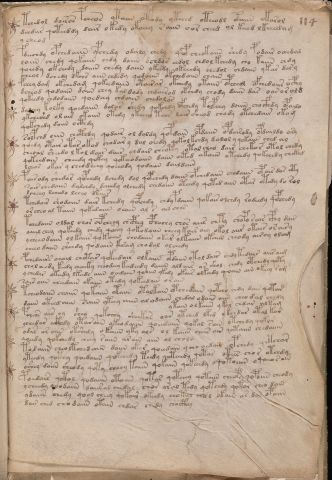

# Voynich Speculative Herbal Ferment Recipe — f114r

IMPORTANT: this is NOT a real or validated translation of the Voynich Manuscript. It is a speculative/procedural model that interprets EVA using a user-defined grammar to generate experimental recipes using safe, known edible substitutes.

This file is generated automatically from IVTFF/EVA transliteration plus a user-defined procedural grammar.



## Page / Folio
- currier: B
- folio: f114r
- page_number: 230

## EVA Text (Transliteration)
```text
tchedol dairor pcheos ytaiin otody yteeed oteeodl o@188;aiin okarol
deedar qoteeddy dair o kedy okoeey r aiin oor cheed ol keeed lkeeedam
ycheod
fdeechdy opchedaiin ypchedy odaly chedy qop cheokaiin shedy podair ochedal
loiin chedy qokaiin chdy daiin dchd?s eedol chdol kchedy cho kaiin chdy
qoeedy okchedy doiiin chedy daiin ykeedy okeeedy chedol chdaiin ykar dary
cheol dchedy dkchs aiin chdedy qodaiin okchedaiin chain
fchey dam okchedam qokeedaiin otairar okchedy otaiin opcheol ofcheda[iir:iis] ocphy
dcheod qodaiin daiin chey kal dody chdairod okchdy chody daiin dar oarorold
qokeedy chdodaiin qoedeey chdaiin chedalos
da[l:?]chy kolky qoedaiin dolor shedy qokchdy ofchedy tolpchy doiiin chocfhdy opailo
ykcheshd ol air okaiin otedy ykeeey teos lair sheod chody otchedair okam
qokchedy daiin octhdy
solpchd oiin chcthdy qodair ol daldy qopdain opdaiin opdairody opdaildo ary
qoedy otair otar okod chodar y dal oeedy qokolkchdy dalol y qokaiin ched al
cheoal sheedo l kol dair dair chdair cheoty otal cheo dair chekar otol chedy
qokeedain cheedy qokey qokeeodaiin daiin oeted akaiin otchedy qokchedy chckhd
lcheos okar y cheodeeey qoeeody qodaiin daildain
pairody shedar qopchdy dchedy dol qopchedy daiin ofchedaiin chodaiin opair dar oty
sair chedaiin dalchdy daiidy olchedy chedaiin oteedy qoted aiin otar otedy do rol
lcheey lchedo lcheo dkair
tchedair shodaiin dair kchedy qopchdy chdy pdaiin qokair olchdy rodeedy qcphhedy
or cheo al taiin qokedaiin oeain al s ain ches
tchedaiin oldal chor chpcheey chcphey cphochy chos aiir chty chopo sair cphy dair
oaiil chey qokeedy chedy qoeey qokodaiin cheey kais aiy okol aiir otair or airy
ycheeodaiin olkaiir qokaiin chodaiin okar olkaiin okaiin cheody airoy olam
cheeo daiin sheedy qodaiin ksam chodal olchedy
pchedairs oeail chotar qokeedair olkaiin opdaiin otoldair chdy tedair aiir aim
ch[o:?]l oeedy keedy cheecky cheodeey keedeedy daiiin ald air ar shol chedy otchedy qoty
y chedar okeedy lkeedy aiin oeedaiin qoaiin ykedy okair olkeedy qoain ain okeey ram
sair aiin cheedain okaiin otedy qokeedain orain
tcheodaiin chaiin qokaiin otaiin otalkain otchedain qotcho chdy dair qotar
daiin oteed aiin saiin yteey aiin al odaiin chedal odaii[s:r] aiin cheo dal chedy
ytain o l kaiin y kar chdar alkam
pcheos air oy sheo qok[oh:ch]ey sheeka[s:r] oar ytched lked o kchdar otal kar
ychedar aikhdy otar ain ykeodaiin qoeedaiin qokal sain otchedy qokar
odar or aiin otshedy okaiin yky ols ol kaiin chees air qotaiin chedaiiin
qoeedy qokchedy cheey raiin ar ain aiin al chol?
todaiin cheoltchedaiin daiin okar qoeedain [q:y]cho oeda[?:ir] opchedy qetchar
yteedy qotey qoedaiin qokchedy teedy qoteeedy qotar otees chos otchdy
oshey daiin sheody qoty cheey taiin qokaiin qokeeedy oqotaiiin o qoeeo[s:r]ain
poedair qotol qodaiin otaiin qotar qotchey qotaiin cheopy qopaiin cheody
ycheedy qoodaiin daiiral chedal chos oral tedy qotchdy qotar cheo dain
ydaiin chedy qoal cheey qokair okeedy chotal chol okain ar da[?:r] opaiin
dain ched chodaiin otain chdar chedy chocthy
```

## Recipes Index (This Page)
- [f114r.1,@P0](#f114r-1-f114r-1-p0)
- [f114r.2,+P0](#f114r-2-f114r-2-p0)
- [f114r.3,+P0](#f114r-3-f114r-3-p0)
- [f114r.4,+P0](#f114r-4-f114r-4-p0)
- [f114r.5,+P0](#f114r-5-f114r-5-p0)
- [f114r.6,+P0](#f114r-6-f114r-6-p0)
- [f114r.7,+P0](#f114r-7-f114r-7-p0)
- [f114r.8,+P0](#f114r-8-f114r-8-p0)
- [f114r.9,+P0](#f114r-9-f114r-9-p0)
- [f114r.10,+P0](#f114r-10-f114r-10-p0)
- [f114r.11,+P0](#f114r-11-f114r-11-p0)
- [f114r.12,+P0](#f114r-12-f114r-12-p0)
- [f114r.13,+P0](#f114r-13-f114r-13-p0)
- [f114r.14,+P0](#f114r-14-f114r-14-p0)
- [f114r.15,+P0](#f114r-15-f114r-15-p0)
- [f114r.16,+P0](#f114r-16-f114r-16-p0)
- [f114r.17,+P0](#f114r-17-f114r-17-p0)
- [f114r.18,+P0](#f114r-18-f114r-18-p0)
- [f114r.19,+P0](#f114r-19-f114r-19-p0)
- [f114r.20,+P0](#f114r-20-f114r-20-p0)
- [f114r.21,+P0](#f114r-21-f114r-21-p0)
- [f114r.22,+P0](#f114r-22-f114r-22-p0)
- [f114r.23,+P0](#f114r-23-f114r-23-p0)
- [f114r.24,+P0](#f114r-24-f114r-24-p0)
- [f114r.25,+P0](#f114r-25-f114r-25-p0)
- [f114r.26,+P0](#f114r-26-f114r-26-p0)
- [f114r.27,+P0](#f114r-27-f114r-27-p0)
- [f114r.28,+P0](#f114r-28-f114r-28-p0)
- [f114r.29,+P0](#f114r-29-f114r-29-p0)
- [f114r.30,+P0](#f114r-30-f114r-30-p0)
- [f114r.31,+P0](#f114r-31-f114r-31-p0)
- [f114r.32,+P0](#f114r-32-f114r-32-p0)
- [f114r.33,+P0](#f114r-33-f114r-33-p0)
- [f114r.34,+Pr](#f114r-34-f114r-34-pr)
- [f114r.35,*P0](#f114r-35-f114r-35-p0)
- [f114r.36,+P0](#f114r-36-f114r-36-p0)
- [f114r.37,+P0](#f114r-37-f114r-37-p0)
- [f114r.38,+P0](#f114r-38-f114r-38-p0)
- [f114r.39,+P0](#f114r-39-f114r-39-p0)
- [f114r.40,+P0](#f114r-40-f114r-40-p0)
- [f114r.41,+P0](#f114r-41-f114r-41-p0)
- [f114r.42,+P0](#f114r-42-f114r-42-p0)
- [f114r.43,+P0](#f114r-43-f114r-43-p0)
- [f114r.44,+P0](#f114r-44-f114r-44-p0)
- [f114r.45,+P0](#f114r-45-f114r-45-p0)

## Line Glosses (Procedural Gloss Only; Not a Translation)

<a id="f114r-1-f114r-1-p0"></a>

### f114r.1,@P0

EVA: tchedol dairor pcheos ytaiin otody yteeed oteeodl o@188;aiin okarol

Direct Gloss (Procedural, Not a Real Translation):
- tchedol: apply heat/cooking → add main plant (safe substitute) → mix / transfer → start fermentation (yeast) → duration level 1 → state: active extraction
- dairor: mix / transfer → start fermentation (yeast) → duration level 1 → state: fermentation start
- pcheos: add main plant (safe substitute) → mix / transfer → start fermentation (yeast) → duration level 1 → state: active extraction
- ytaiin: apply heat/cooking → duration level 1 → state: fermentation start → long fermentation / aging phase
- otody: apply heat/cooking → mix / transfer → start fermentation (yeast)
- yteeed: apply heat/cooking → start fermentation (yeast) → duration level 3 → state: active extraction
- oteeodl: apply heat/cooking → mix / transfer → start fermentation (yeast) → duration level 2 → state: active extraction
- o: mix / transfer
- aiin: duration level 1 → state: fermentation start → long fermentation / aging phase
- okarol: add fermentable sugars → mix / transfer → duration level 1 → state: fermentation start

<a id="f114r-2-f114r-2-p0"></a>

### f114r.2,+P0

EVA: deedar qoteeddy dair o kedy okoeey r aiin oor cheed ol keeed lkeeedam

Direct Gloss (Procedural, Not a Real Translation):
- deedar: start fermentation (yeast) → duration level 2 → state: active extraction
- qoteeddy: prepare liquid base → apply heat/cooking → start fermentation (yeast) → duration level 2 → state: active extraction
- dair: start fermentation (yeast) → duration level 1 → state: fermentation start
- o: mix / transfer
- kedy: add fermentable sugars → start fermentation (yeast) → duration level 1 → state: active extraction
- okoeey: add fermentable sugars → mix / transfer → duration level 2 → state: active extraction
- r: [unparsed]
- aiin: duration level 1 → state: fermentation start → long fermentation / aging phase
- oor: mix / transfer
- cheed: add main plant (safe substitute) → start fermentation (yeast) → duration level 2 → state: active extraction
- ol: mix / transfer
- keeed: add fermentable sugars → start fermentation (yeast) → duration level 3 → state: active extraction
- lkeeedam: add fermentable sugars → start fermentation (yeast) → duration level 3 → state: active extraction

<a id="f114r-3-f114r-3-p0"></a>

### f114r.3,+P0

EVA: ycheod

Direct Gloss (Procedural, Not a Real Translation):
- ycheod: add main plant (safe substitute) → mix / transfer → start fermentation (yeast) → duration level 1 → state: active extraction

<a id="f114r-4-f114r-4-p0"></a>

### f114r.4,+P0

EVA: fdeechdy opchedaiin ypchedy odaly chedy qop cheokaiin shedy podair ochedal

Direct Gloss (Procedural, Not a Real Translation):
- fdeechdy: add main plant (safe substitute) → add aroma modifier → start fermentation (yeast) → duration level 2 → state: active extraction
- opchedaiin: add main plant (safe substitute) → mix / transfer → start fermentation (yeast) → duration level 1 → state: active extraction → long fermentation / aging phase
- ypchedy: add main plant (safe substitute) → start fermentation (yeast) → duration level 1 → state: active extraction
- odaly: mix / transfer → start fermentation (yeast) → duration level 1 → state: fermentation start
- chedy: add main plant (safe substitute) → start fermentation (yeast) → duration level 1 → state: active extraction
- qop: prepare liquid base → start fermentation (yeast)
- cheokaiin: add fermentable sugars → add main plant (safe substitute) → mix / transfer → duration level 1 → state: active extraction → long fermentation / aging phase
- shedy: add secondary herb (safe substitute) → start fermentation (yeast) → duration level 1 → state: active extraction
- podair: mix / transfer → start fermentation (yeast) → duration level 1 → state: fermentation start
- ochedal: add main plant (safe substitute) → mix / transfer → start fermentation (yeast) → duration level 1 → state: active extraction

<a id="f114r-5-f114r-5-p0"></a>

### f114r.5,+P0

EVA: loiin chedy qokaiin chdy daiin dchd?s eedol chdol kchedy cho kaiin chdy

Direct Gloss (Procedural, Not a Real Translation):
- loiin: mix / transfer → duration level 2 → state: cooling/rest → medium fermentation phase
- chedy: add main plant (safe substitute) → start fermentation (yeast) → duration level 1 → state: active extraction
- qokaiin: prepare liquid base → add fermentable sugars → duration level 1 → state: fermentation start → long fermentation / aging phase
- chdy: add main plant (safe substitute) → start fermentation (yeast)
- daiin: start fermentation (yeast) → duration level 1 → state: fermentation start → long fermentation / aging phase
- dchd: add main plant (safe substitute) → start fermentation (yeast)
- s: [unparsed]
- eedol: mix / transfer → start fermentation (yeast) → duration level 2 → state: active extraction
- chdol: add main plant (safe substitute) → mix / transfer → start fermentation (yeast)
- kchedy: add fermentable sugars → add main plant (safe substitute) → start fermentation (yeast) → duration level 1 → state: active extraction
- cho: add main plant (safe substitute) → mix / transfer
- kaiin: add fermentable sugars → duration level 1 → state: fermentation start → long fermentation / aging phase
- chdy: add main plant (safe substitute) → start fermentation (yeast)

<a id="f114r-6-f114r-6-p0"></a>

### f114r.6,+P0

EVA: qoeedy okchedy doiiin chedy daiin ykeedy okeeedy chedol chdaiin ykar dary

Direct Gloss (Procedural, Not a Real Translation):
- qoeedy: prepare liquid base → start fermentation (yeast) → duration level 2 → state: active extraction
- okchedy: add fermentable sugars → add main plant (safe substitute) → mix / transfer → start fermentation (yeast) → duration level 1 → state: active extraction
- doiiin: mix / transfer → start fermentation (yeast) → duration level 3 → state: cooling/rest → medium fermentation phase
- chedy: add main plant (safe substitute) → start fermentation (yeast) → duration level 1 → state: active extraction
- daiin: start fermentation (yeast) → duration level 1 → state: fermentation start → long fermentation / aging phase
- ykeedy: add fermentable sugars → start fermentation (yeast) → duration level 2 → state: active extraction
- okeeedy: add fermentable sugars → mix / transfer → start fermentation (yeast) → duration level 3 → state: active extraction
- chedol: add main plant (safe substitute) → mix / transfer → start fermentation (yeast) → duration level 1 → state: active extraction
- chdaiin: add main plant (safe substitute) → start fermentation (yeast) → duration level 1 → state: fermentation start → long fermentation / aging phase
- ykar: add fermentable sugars → duration level 1 → state: fermentation start
- dary: start fermentation (yeast) → duration level 1 → state: fermentation start

<a id="f114r-7-f114r-7-p0"></a>

### f114r.7,+P0

EVA: cheol dchedy dkchs aiin chdedy qodaiin okchedaiin chain

Direct Gloss (Procedural, Not a Real Translation):
- cheol: add main plant (safe substitute) → mix / transfer → duration level 1 → state: active extraction
- dchedy: add main plant (safe substitute) → start fermentation (yeast) → duration level 1 → state: active extraction
- dkchs: add fermentable sugars → add main plant (safe substitute) → start fermentation (yeast)
- aiin: duration level 1 → state: fermentation start → long fermentation / aging phase
- chdedy: add main plant (safe substitute) → start fermentation (yeast) → duration level 1 → state: active extraction
- qodaiin: prepare liquid base → start fermentation (yeast) → duration level 1 → state: fermentation start → long fermentation / aging phase
- okchedaiin: add fermentable sugars → add main plant (safe substitute) → mix / transfer → start fermentation (yeast) → duration level 1 → state: active extraction → long fermentation / aging phase
- chain: add main plant (safe substitute) → duration level 1 → state: fermentation start

<a id="f114r-8-f114r-8-p0"></a>

### f114r.8,+P0

EVA: fchey dam okchedam qokeedaiin otairar okchedy otaiin opcheol ofcheda[iir:iis] ocphy

Direct Gloss (Procedural, Not a Real Translation):
- fchey: add main plant (safe substitute) → add aroma modifier → duration level 1 → state: active extraction
- dam: start fermentation (yeast) → duration level 1 → state: fermentation start
- okchedam: add fermentable sugars → add main plant (safe substitute) → mix / transfer → start fermentation (yeast) → duration level 1 → state: active extraction
- qokeedaiin: prepare liquid base → add fermentable sugars → start fermentation (yeast) → duration level 2 → state: active extraction → long fermentation / aging phase
- otairar: apply heat/cooking → mix / transfer → duration level 1 → state: fermentation start
- okchedy: add fermentable sugars → add main plant (safe substitute) → mix / transfer → start fermentation (yeast) → duration level 1 → state: active extraction
- otaiin: apply heat/cooking → mix / transfer → duration level 1 → state: fermentation start → long fermentation / aging phase
- opcheol: add main plant (safe substitute) → mix / transfer → start fermentation (yeast) → duration level 1 → state: active extraction
- ofcheda: add main plant (safe substitute) → add aroma modifier → mix / transfer → start fermentation (yeast) → duration level 1 → state: active extraction
- iir: duration level 2 → state: cooling/rest
- iis: duration level 2 → state: cooling/rest
- ocphy: mix / transfer → add complex herbal compound (safe blend)

<a id="f114r-9-f114r-9-p0"></a>

### f114r.9,+P0

EVA: dcheod qodaiin daiin chey kal dody chdairod okchdy chody daiin dar oarorold

Direct Gloss (Procedural, Not a Real Translation):
- dcheod: add main plant (safe substitute) → mix / transfer → start fermentation (yeast) → duration level 1 → state: active extraction
- qodaiin: prepare liquid base → start fermentation (yeast) → duration level 1 → state: fermentation start → long fermentation / aging phase
- daiin: start fermentation (yeast) → duration level 1 → state: fermentation start → long fermentation / aging phase
- chey: add main plant (safe substitute) → duration level 1 → state: active extraction
- kal: add fermentable sugars → duration level 1 → state: fermentation start
- dody: mix / transfer → start fermentation (yeast)
- chdairod: add main plant (safe substitute) → mix / transfer → start fermentation (yeast) → duration level 1 → state: fermentation start
- okchdy: add fermentable sugars → add main plant (safe substitute) → mix / transfer → start fermentation (yeast)
- chody: add main plant (safe substitute) → mix / transfer → start fermentation (yeast)
- daiin: start fermentation (yeast) → duration level 1 → state: fermentation start → long fermentation / aging phase
- dar: start fermentation (yeast) → duration level 1 → state: fermentation start
- oarorold: mix / transfer → start fermentation (yeast) → duration level 1 → state: fermentation start

<a id="f114r-10-f114r-10-p0"></a>

### f114r.10,+P0

EVA: qokeedy chdodaiin qoedeey chdaiin chedalos

Direct Gloss (Procedural, Not a Real Translation):
- qokeedy: prepare liquid base → add fermentable sugars → start fermentation (yeast) → duration level 2 → state: active extraction
- chdodaiin: add main plant (safe substitute) → mix / transfer → start fermentation (yeast) → duration level 1 → state: fermentation start → long fermentation / aging phase
- qoedeey: prepare liquid base → start fermentation (yeast) → duration level 1 → state: active extraction
- chdaiin: add main plant (safe substitute) → start fermentation (yeast) → duration level 1 → state: fermentation start → long fermentation / aging phase
- chedalos: add main plant (safe substitute) → mix / transfer → start fermentation (yeast) → duration level 1 → state: active extraction

<a id="f114r-11-f114r-11-p0"></a>

### f114r.11,+P0

EVA: da[l:?]chy kolky qoedaiin dolor shedy qokchdy ofchedy tolpchy doiiin chocfhdy opailo

Direct Gloss (Procedural, Not a Real Translation):
- da: start fermentation (yeast) → duration level 1 → state: fermentation start
- l: [unparsed]
- chy: add main plant (safe substitute)
- kolky: add fermentable sugars → mix / transfer
- qoedaiin: prepare liquid base → start fermentation (yeast) → duration level 1 → state: active extraction → long fermentation / aging phase
- dolor: mix / transfer → start fermentation (yeast)
- shedy: add secondary herb (safe substitute) → start fermentation (yeast) → duration level 1 → state: active extraction
- qokchdy: prepare liquid base → add fermentable sugars → add main plant (safe substitute) → start fermentation (yeast)
- ofchedy: add main plant (safe substitute) → add aroma modifier → mix / transfer → start fermentation (yeast) → duration level 1 → state: active extraction
- tolpchy: apply heat/cooking → add main plant (safe substitute) → mix / transfer → start fermentation (yeast)
- doiiin: mix / transfer → start fermentation (yeast) → duration level 3 → state: cooling/rest → medium fermentation phase
- chocfhdy: add main plant (safe substitute) → mix / transfer → start fermentation (yeast) → add complex herbal compound (safe blend)
- opailo: mix / transfer → start fermentation (yeast) → duration level 1 → state: fermentation start

<a id="f114r-12-f114r-12-p0"></a>

### f114r.12,+P0

EVA: ykcheshd ol air okaiin otedy ykeeey teos lair sheod chody otchedair okam

Direct Gloss (Procedural, Not a Real Translation):
- ykcheshd: add fermentable sugars → add main plant (safe substitute) → add secondary herb (safe substitute) → start fermentation (yeast) → duration level 1 → state: active extraction
- ol: mix / transfer
- air: duration level 1 → state: fermentation start
- okaiin: add fermentable sugars → mix / transfer → duration level 1 → state: fermentation start → long fermentation / aging phase
- otedy: apply heat/cooking → mix / transfer → start fermentation (yeast) → duration level 1 → state: active extraction
- ykeeey: add fermentable sugars → duration level 3 → state: active extraction
- teos: apply heat/cooking → mix / transfer → duration level 1 → state: active extraction
- lair: duration level 1 → state: fermentation start
- sheod: add secondary herb (safe substitute) → mix / transfer → start fermentation (yeast) → duration level 1 → state: active extraction
- chody: add main plant (safe substitute) → mix / transfer → start fermentation (yeast)
- otchedair: apply heat/cooking → add main plant (safe substitute) → mix / transfer → start fermentation (yeast) → duration level 1 → state: active extraction
- okam: add fermentable sugars → mix / transfer → duration level 1 → state: fermentation start

<a id="f114r-13-f114r-13-p0"></a>

### f114r.13,+P0

EVA: qokchedy daiin octhdy

Direct Gloss (Procedural, Not a Real Translation):
- qokchedy: prepare liquid base → add fermentable sugars → add main plant (safe substitute) → start fermentation (yeast) → duration level 1 → state: active extraction
- daiin: start fermentation (yeast) → duration level 1 → state: fermentation start → long fermentation / aging phase
- octhdy: mix / transfer → start fermentation (yeast) → add complex herbal compound (safe blend)

<a id="f114r-14-f114r-14-p0"></a>

### f114r.14,+P0

EVA: solpchd oiin chcthdy qodair ol daldy qopdain opdaiin opdairody opdaildo ary

Direct Gloss (Procedural, Not a Real Translation):
- solpchd: add main plant (safe substitute) → mix / transfer → start fermentation (yeast)
- oiin: mix / transfer → duration level 2 → state: cooling/rest → medium fermentation phase
- chcthdy: add main plant (safe substitute) → start fermentation (yeast) → add complex herbal compound (safe blend)
- qodair: prepare liquid base → start fermentation (yeast) → duration level 1 → state: fermentation start
- ol: mix / transfer
- daldy: start fermentation (yeast) → duration level 1 → state: fermentation start
- qopdain: prepare liquid base → start fermentation (yeast) → duration level 1 → state: fermentation start
- opdaiin: mix / transfer → start fermentation (yeast) → duration level 1 → state: fermentation start → long fermentation / aging phase
- opdairody: mix / transfer → start fermentation (yeast) → duration level 1 → state: fermentation start
- opdaildo: mix / transfer → start fermentation (yeast) → duration level 1 → state: fermentation start
- ary: duration level 1 → state: fermentation start

<a id="f114r-15-f114r-15-p0"></a>

### f114r.15,+P0

EVA: qoedy otair otar okod chodar y dal oeedy qokolkchdy dalol y qokaiin ched al

Direct Gloss (Procedural, Not a Real Translation):
- qoedy: prepare liquid base → start fermentation (yeast) → duration level 1 → state: active extraction
- otair: apply heat/cooking → mix / transfer → duration level 1 → state: fermentation start
- otar: apply heat/cooking → mix / transfer → duration level 1 → state: fermentation start
- okod: add fermentable sugars → mix / transfer → start fermentation (yeast)
- chodar: add main plant (safe substitute) → mix / transfer → start fermentation (yeast) → duration level 1 → state: fermentation start
- y: [unparsed]
- dal: start fermentation (yeast) → duration level 1 → state: fermentation start
- oeedy: mix / transfer → start fermentation (yeast) → duration level 2 → state: active extraction
- qokolkchdy: prepare liquid base → add fermentable sugars → add main plant (safe substitute) → mix / transfer → start fermentation (yeast)
- dalol: mix / transfer → start fermentation (yeast) → duration level 1 → state: fermentation start
- y: [unparsed]
- qokaiin: prepare liquid base → add fermentable sugars → duration level 1 → state: fermentation start → long fermentation / aging phase
- ched: add main plant (safe substitute) → start fermentation (yeast) → duration level 1 → state: active extraction
- al: duration level 1 → state: fermentation start

<a id="f114r-16-f114r-16-p0"></a>

### f114r.16,+P0

EVA: cheoal sheedo l kol dair dair chdair cheoty otal cheo dair chekar otol chedy

Direct Gloss (Procedural, Not a Real Translation):
- cheoal: add main plant (safe substitute) → mix / transfer → duration level 1 → state: active extraction
- sheedo: add secondary herb (safe substitute) → mix / transfer → start fermentation (yeast) → duration level 2 → state: active extraction
- l: [unparsed]
- kol: add fermentable sugars → mix / transfer
- dair: start fermentation (yeast) → duration level 1 → state: fermentation start
- dair: start fermentation (yeast) → duration level 1 → state: fermentation start
- chdair: add main plant (safe substitute) → start fermentation (yeast) → duration level 1 → state: fermentation start
- cheoty: apply heat/cooking → add main plant (safe substitute) → mix / transfer → duration level 1 → state: active extraction
- otal: apply heat/cooking → mix / transfer → duration level 1 → state: fermentation start
- cheo: add main plant (safe substitute) → mix / transfer → duration level 1 → state: active extraction
- dair: start fermentation (yeast) → duration level 1 → state: fermentation start
- chekar: add fermentable sugars → add main plant (safe substitute) → duration level 1 → state: active extraction
- otol: apply heat/cooking → mix / transfer
- chedy: add main plant (safe substitute) → start fermentation (yeast) → duration level 1 → state: active extraction

<a id="f114r-17-f114r-17-p0"></a>

### f114r.17,+P0

EVA: qokeedain cheedy qokey qokeeodaiin daiin oeted akaiin otchedy qokchedy chckhd

Direct Gloss (Procedural, Not a Real Translation):
- qokeedain: prepare liquid base → add fermentable sugars → start fermentation (yeast) → duration level 2 → state: active extraction
- cheedy: add main plant (safe substitute) → start fermentation (yeast) → duration level 2 → state: active extraction
- qokey: prepare liquid base → add fermentable sugars → duration level 1 → state: active extraction
- qokeeodaiin: prepare liquid base → add fermentable sugars → mix / transfer → start fermentation (yeast) → duration level 2 → state: active extraction → long fermentation / aging phase
- daiin: start fermentation (yeast) → duration level 1 → state: fermentation start → long fermentation / aging phase
- oeted: apply heat/cooking → mix / transfer → start fermentation (yeast) → duration level 1 → state: active extraction
- akaiin: add fermentable sugars → duration level 1 → state: fermentation start → long fermentation / aging phase
- otchedy: apply heat/cooking → add main plant (safe substitute) → mix / transfer → start fermentation (yeast) → duration level 1 → state: active extraction
- qokchedy: prepare liquid base → add fermentable sugars → add main plant (safe substitute) → start fermentation (yeast) → duration level 1 → state: active extraction
- chckhd: add main plant (safe substitute) → start fermentation (yeast) → add complex herbal compound (safe blend)

<a id="f114r-18-f114r-18-p0"></a>

### f114r.18,+P0

EVA: lcheos okar y cheodeeey qoeeody qodaiin daildain

Direct Gloss (Procedural, Not a Real Translation):
- lcheos: add main plant (safe substitute) → mix / transfer → duration level 1 → state: active extraction
- okar: add fermentable sugars → mix / transfer → duration level 1 → state: fermentation start
- y: [unparsed]
- cheodeeey: add main plant (safe substitute) → mix / transfer → start fermentation (yeast) → duration level 1 → state: active extraction
- qoeeody: prepare liquid base → mix / transfer → start fermentation (yeast) → duration level 2 → state: active extraction
- qodaiin: prepare liquid base → start fermentation (yeast) → duration level 1 → state: fermentation start → long fermentation / aging phase
- daildain: start fermentation (yeast) → duration level 1 → state: fermentation start

<a id="f114r-19-f114r-19-p0"></a>

### f114r.19,+P0

EVA: pairody shedar qopchdy dchedy dol qopchedy daiin ofchedaiin chodaiin opair dar oty

Direct Gloss (Procedural, Not a Real Translation):
- pairody: mix / transfer → start fermentation (yeast) → duration level 1 → state: fermentation start
- shedar: add secondary herb (safe substitute) → start fermentation (yeast) → duration level 1 → state: active extraction
- qopchdy: prepare liquid base → add main plant (safe substitute) → start fermentation (yeast)
- dchedy: add main plant (safe substitute) → start fermentation (yeast) → duration level 1 → state: active extraction
- dol: mix / transfer → start fermentation (yeast)
- qopchedy: prepare liquid base → add main plant (safe substitute) → start fermentation (yeast) → duration level 1 → state: active extraction
- daiin: start fermentation (yeast) → duration level 1 → state: fermentation start → long fermentation / aging phase
- ofchedaiin: add main plant (safe substitute) → add aroma modifier → mix / transfer → start fermentation (yeast) → duration level 1 → state: active extraction → long fermentation / aging phase
- chodaiin: add main plant (safe substitute) → mix / transfer → start fermentation (yeast) → duration level 1 → state: fermentation start → long fermentation / aging phase
- opair: mix / transfer → start fermentation (yeast) → duration level 1 → state: fermentation start
- dar: start fermentation (yeast) → duration level 1 → state: fermentation start
- oty: apply heat/cooking → mix / transfer

<a id="f114r-20-f114r-20-p0"></a>

### f114r.20,+P0

EVA: sair chedaiin dalchdy daiidy olchedy chedaiin oteedy qoted aiin otar otedy do rol

Direct Gloss (Procedural, Not a Real Translation):
- sair: duration level 1 → state: fermentation start
- chedaiin: add main plant (safe substitute) → start fermentation (yeast) → duration level 1 → state: active extraction → long fermentation / aging phase
- dalchdy: add main plant (safe substitute) → start fermentation (yeast) → duration level 1 → state: fermentation start
- daiidy: start fermentation (yeast) → duration level 1 → state: fermentation start
- olchedy: add main plant (safe substitute) → mix / transfer → start fermentation (yeast) → duration level 1 → state: active extraction
- chedaiin: add main plant (safe substitute) → start fermentation (yeast) → duration level 1 → state: active extraction → long fermentation / aging phase
- oteedy: apply heat/cooking → mix / transfer → start fermentation (yeast) → duration level 2 → state: active extraction
- qoted: prepare liquid base → apply heat/cooking → start fermentation (yeast) → duration level 1 → state: active extraction
- aiin: duration level 1 → state: fermentation start → long fermentation / aging phase
- otar: apply heat/cooking → mix / transfer → duration level 1 → state: fermentation start
- otedy: apply heat/cooking → mix / transfer → start fermentation (yeast) → duration level 1 → state: active extraction
- do: mix / transfer → start fermentation (yeast)
- rol: mix / transfer

<a id="f114r-21-f114r-21-p0"></a>

### f114r.21,+P0

EVA: lcheey lchedo lcheo dkair

Direct Gloss (Procedural, Not a Real Translation):
- lcheey: add main plant (safe substitute) → duration level 2 → state: active extraction
- lchedo: add main plant (safe substitute) → mix / transfer → start fermentation (yeast) → duration level 1 → state: active extraction
- lcheo: add main plant (safe substitute) → mix / transfer → duration level 1 → state: active extraction
- dkair: add fermentable sugars → start fermentation (yeast) → duration level 1 → state: fermentation start

<a id="f114r-22-f114r-22-p0"></a>

### f114r.22,+P0

EVA: tchedair shodaiin dair kchedy qopchdy chdy pdaiin qokair olchdy rodeedy qcphhedy

Direct Gloss (Procedural, Not a Real Translation):
- tchedair: apply heat/cooking → add main plant (safe substitute) → start fermentation (yeast) → duration level 1 → state: active extraction
- shodaiin: add secondary herb (safe substitute) → mix / transfer → start fermentation (yeast) → duration level 1 → state: fermentation start → long fermentation / aging phase
- dair: start fermentation (yeast) → duration level 1 → state: fermentation start
- kchedy: add fermentable sugars → add main plant (safe substitute) → start fermentation (yeast) → duration level 1 → state: active extraction
- qopchdy: prepare liquid base → add main plant (safe substitute) → start fermentation (yeast)
- chdy: add main plant (safe substitute) → start fermentation (yeast)
- pdaiin: start fermentation (yeast) → duration level 1 → state: fermentation start → long fermentation / aging phase
- qokair: prepare liquid base → add fermentable sugars → duration level 1 → state: fermentation start
- olchdy: add main plant (safe substitute) → mix / transfer → start fermentation (yeast)
- rodeedy: mix / transfer → start fermentation (yeast) → duration level 2 → state: active extraction
- qcphhedy: prepare base (generic) → start fermentation (yeast) → add complex herbal compound (safe blend) → duration level 1 → state: active extraction

<a id="f114r-23-f114r-23-p0"></a>

### f114r.23,+P0

EVA: or cheo al taiin qokedaiin oeain al s ain ches

Direct Gloss (Procedural, Not a Real Translation):
- or: mix / transfer
- cheo: add main plant (safe substitute) → mix / transfer → duration level 1 → state: active extraction
- al: duration level 1 → state: fermentation start
- taiin: apply heat/cooking → duration level 1 → state: fermentation start → long fermentation / aging phase
- qokedaiin: prepare liquid base → add fermentable sugars → start fermentation (yeast) → duration level 1 → state: active extraction → long fermentation / aging phase
- oeain: mix / transfer → duration level 1 → state: active extraction
- al: duration level 1 → state: fermentation start
- s: [unparsed]
- ain: duration level 1 → state: fermentation start
- ches: add main plant (safe substitute) → duration level 1 → state: active extraction

<a id="f114r-24-f114r-24-p0"></a>

### f114r.24,+P0

EVA: tchedaiin oldal chor chpcheey chcphey cphochy chos aiir chty chopo sair cphy dair

Direct Gloss (Procedural, Not a Real Translation):
- tchedaiin: apply heat/cooking → add main plant (safe substitute) → start fermentation (yeast) → duration level 1 → state: active extraction → long fermentation / aging phase
- oldal: mix / transfer → start fermentation (yeast) → duration level 1 → state: fermentation start
- chor: add main plant (safe substitute) → mix / transfer
- chpcheey: add main plant (safe substitute) → start fermentation (yeast) → duration level 2 → state: active extraction
- chcphey: add main plant (safe substitute) → add complex herbal compound (safe blend) → duration level 1 → state: active extraction
- cphochy: add main plant (safe substitute) → mix / transfer → add complex herbal compound (safe blend)
- chos: add main plant (safe substitute) → mix / transfer
- aiir: duration level 1 → state: fermentation start
- chty: apply heat/cooking → add main plant (safe substitute)
- chopo: add main plant (safe substitute) → mix / transfer → start fermentation (yeast)
- sair: duration level 1 → state: fermentation start
- cphy: add complex herbal compound (safe blend)
- dair: start fermentation (yeast) → duration level 1 → state: fermentation start

<a id="f114r-25-f114r-25-p0"></a>

### f114r.25,+P0

EVA: oaiil chey qokeedy chedy qoeey qokodaiin cheey kais aiy okol aiir otair or airy

Direct Gloss (Procedural, Not a Real Translation):
- oaiil: mix / transfer → duration level 1 → state: fermentation start
- chey: add main plant (safe substitute) → duration level 1 → state: active extraction
- qokeedy: prepare liquid base → add fermentable sugars → start fermentation (yeast) → duration level 2 → state: active extraction
- chedy: add main plant (safe substitute) → start fermentation (yeast) → duration level 1 → state: active extraction
- qoeey: prepare liquid base → duration level 2 → state: active extraction
- qokodaiin: prepare liquid base → add fermentable sugars → mix / transfer → start fermentation (yeast) → duration level 1 → state: fermentation start → long fermentation / aging phase
- cheey: add main plant (safe substitute) → duration level 2 → state: active extraction
- kais: add fermentable sugars → duration level 1 → state: fermentation start
- aiy: duration level 1 → state: fermentation start
- okol: add fermentable sugars → mix / transfer
- aiir: duration level 1 → state: fermentation start
- otair: apply heat/cooking → mix / transfer → duration level 1 → state: fermentation start
- or: mix / transfer
- airy: duration level 1 → state: fermentation start

<a id="f114r-26-f114r-26-p0"></a>

### f114r.26,+P0

EVA: ycheeodaiin olkaiir qokaiin chodaiin okar olkaiin okaiin cheody airoy olam

Direct Gloss (Procedural, Not a Real Translation):
- ycheeodaiin: add main plant (safe substitute) → mix / transfer → start fermentation (yeast) → duration level 2 → state: active extraction → long fermentation / aging phase
- olkaiir: add fermentable sugars → mix / transfer → duration level 1 → state: fermentation start
- qokaiin: prepare liquid base → add fermentable sugars → duration level 1 → state: fermentation start → long fermentation / aging phase
- chodaiin: add main plant (safe substitute) → mix / transfer → start fermentation (yeast) → duration level 1 → state: fermentation start → long fermentation / aging phase
- okar: add fermentable sugars → mix / transfer → duration level 1 → state: fermentation start
- olkaiin: add fermentable sugars → mix / transfer → duration level 1 → state: fermentation start → long fermentation / aging phase
- okaiin: add fermentable sugars → mix / transfer → duration level 1 → state: fermentation start → long fermentation / aging phase
- cheody: add main plant (safe substitute) → mix / transfer → start fermentation (yeast) → duration level 1 → state: active extraction
- airoy: mix / transfer → duration level 1 → state: fermentation start
- olam: mix / transfer → duration level 1 → state: fermentation start

<a id="f114r-27-f114r-27-p0"></a>

### f114r.27,+P0

EVA: cheeo daiin sheedy qodaiin ksam chodal olchedy

Direct Gloss (Procedural, Not a Real Translation):
- cheeo: add main plant (safe substitute) → mix / transfer → duration level 2 → state: active extraction
- daiin: start fermentation (yeast) → duration level 1 → state: fermentation start → long fermentation / aging phase
- sheedy: add secondary herb (safe substitute) → start fermentation (yeast) → duration level 2 → state: active extraction
- qodaiin: prepare liquid base → start fermentation (yeast) → duration level 1 → state: fermentation start → long fermentation / aging phase
- ksam: add fermentable sugars → duration level 1 → state: fermentation start
- chodal: add main plant (safe substitute) → mix / transfer → start fermentation (yeast) → duration level 1 → state: fermentation start
- olchedy: add main plant (safe substitute) → mix / transfer → start fermentation (yeast) → duration level 1 → state: active extraction

<a id="f114r-28-f114r-28-p0"></a>

### f114r.28,+P0

EVA: pchedairs oeail chotar qokeedair olkaiin opdaiin otoldair chdy tedair aiir aim

Direct Gloss (Procedural, Not a Real Translation):
- pchedairs: add main plant (safe substitute) → start fermentation (yeast) → duration level 1 → state: active extraction
- oeail: mix / transfer → duration level 1 → state: active extraction
- chotar: apply heat/cooking → add main plant (safe substitute) → mix / transfer → duration level 1 → state: fermentation start
- qokeedair: prepare liquid base → add fermentable sugars → start fermentation (yeast) → duration level 2 → state: active extraction
- olkaiin: add fermentable sugars → mix / transfer → duration level 1 → state: fermentation start → long fermentation / aging phase
- opdaiin: mix / transfer → start fermentation (yeast) → duration level 1 → state: fermentation start → long fermentation / aging phase
- otoldair: apply heat/cooking → mix / transfer → start fermentation (yeast) → duration level 1 → state: fermentation start
- chdy: add main plant (safe substitute) → start fermentation (yeast)
- tedair: apply heat/cooking → start fermentation (yeast) → duration level 1 → state: active extraction
- aiir: duration level 1 → state: fermentation start
- aim: duration level 1 → state: fermentation start

<a id="f114r-29-f114r-29-p0"></a>

### f114r.29,+P0

EVA: ch[o:?]l oeedy keedy cheecky cheodeey keedeedy daiiin ald air ar shol chedy otchedy qoty

Direct Gloss (Procedural, Not a Real Translation):
- ch: add main plant (safe substitute)
- o: mix / transfer
- l: [unparsed]
- oeedy: mix / transfer → start fermentation (yeast) → duration level 2 → state: active extraction
- keedy: add fermentable sugars → start fermentation (yeast) → duration level 2 → state: active extraction
- cheecky: add fermentable sugars → add main plant (safe substitute) → duration level 2 → state: active extraction
- cheodeey: add main plant (safe substitute) → mix / transfer → start fermentation (yeast) → duration level 1 → state: active extraction
- keedeedy: add fermentable sugars → start fermentation (yeast) → duration level 2 → state: active extraction
- daiiin: start fermentation (yeast) → duration level 1 → state: fermentation start → medium fermentation phase
- ald: start fermentation (yeast) → duration level 1 → state: fermentation start
- air: duration level 1 → state: fermentation start
- ar: duration level 1 → state: fermentation start
- shol: add secondary herb (safe substitute) → mix / transfer
- chedy: add main plant (safe substitute) → start fermentation (yeast) → duration level 1 → state: active extraction
- otchedy: apply heat/cooking → add main plant (safe substitute) → mix / transfer → start fermentation (yeast) → duration level 1 → state: active extraction
- qoty: prepare liquid base → apply heat/cooking

<a id="f114r-30-f114r-30-p0"></a>

### f114r.30,+P0

EVA: y chedar okeedy lkeedy aiin oeedaiin qoaiin ykedy okair olkeedy qoain ain okeey ram

Direct Gloss (Procedural, Not a Real Translation):
- y: [unparsed]
- chedar: add main plant (safe substitute) → start fermentation (yeast) → duration level 1 → state: active extraction
- okeedy: add fermentable sugars → mix / transfer → start fermentation (yeast) → duration level 2 → state: active extraction
- lkeedy: add fermentable sugars → start fermentation (yeast) → duration level 2 → state: active extraction
- aiin: duration level 1 → state: fermentation start → long fermentation / aging phase
- oeedaiin: mix / transfer → start fermentation (yeast) → duration level 2 → state: active extraction → long fermentation / aging phase
- qoaiin: prepare liquid base → duration level 1 → state: fermentation start → long fermentation / aging phase
- ykedy: add fermentable sugars → start fermentation (yeast) → duration level 1 → state: active extraction
- okair: add fermentable sugars → mix / transfer → duration level 1 → state: fermentation start
- olkeedy: add fermentable sugars → mix / transfer → start fermentation (yeast) → duration level 2 → state: active extraction
- qoain: prepare liquid base → duration level 1 → state: fermentation start
- ain: duration level 1 → state: fermentation start
- okeey: add fermentable sugars → mix / transfer → duration level 2 → state: active extraction
- ram: duration level 1 → state: fermentation start

<a id="f114r-31-f114r-31-p0"></a>

### f114r.31,+P0

EVA: sair aiin cheedain okaiin otedy qokeedain orain

Direct Gloss (Procedural, Not a Real Translation):
- sair: duration level 1 → state: fermentation start
- aiin: duration level 1 → state: fermentation start → long fermentation / aging phase
- cheedain: add main plant (safe substitute) → start fermentation (yeast) → duration level 2 → state: active extraction
- okaiin: add fermentable sugars → mix / transfer → duration level 1 → state: fermentation start → long fermentation / aging phase
- otedy: apply heat/cooking → mix / transfer → start fermentation (yeast) → duration level 1 → state: active extraction
- qokeedain: prepare liquid base → add fermentable sugars → start fermentation (yeast) → duration level 2 → state: active extraction
- orain: mix / transfer → duration level 1 → state: fermentation start

<a id="f114r-32-f114r-32-p0"></a>

### f114r.32,+P0

EVA: tcheodaiin chaiin qokaiin otaiin otalkain otchedain qotcho chdy dair qotar

Direct Gloss (Procedural, Not a Real Translation):
- tcheodaiin: apply heat/cooking → add main plant (safe substitute) → mix / transfer → start fermentation (yeast) → duration level 1 → state: active extraction → long fermentation / aging phase
- chaiin: add main plant (safe substitute) → duration level 1 → state: fermentation start → long fermentation / aging phase
- qokaiin: prepare liquid base → add fermentable sugars → duration level 1 → state: fermentation start → long fermentation / aging phase
- otaiin: apply heat/cooking → mix / transfer → duration level 1 → state: fermentation start → long fermentation / aging phase
- otalkain: add fermentable sugars → apply heat/cooking → mix / transfer → duration level 1 → state: fermentation start
- otchedain: apply heat/cooking → add main plant (safe substitute) → mix / transfer → start fermentation (yeast) → duration level 1 → state: active extraction
- qotcho: prepare liquid base → apply heat/cooking → add main plant (safe substitute) → mix / transfer
- chdy: add main plant (safe substitute) → start fermentation (yeast)
- dair: start fermentation (yeast) → duration level 1 → state: fermentation start
- qotar: prepare liquid base → apply heat/cooking → duration level 1 → state: fermentation start

<a id="f114r-33-f114r-33-p0"></a>

### f114r.33,+P0

EVA: daiin oteed aiin saiin yteey aiin al odaiin chedal odaii[s:r] aiin cheo dal chedy

Direct Gloss (Procedural, Not a Real Translation):
- daiin: start fermentation (yeast) → duration level 1 → state: fermentation start → long fermentation / aging phase
- oteed: apply heat/cooking → mix / transfer → start fermentation (yeast) → duration level 2 → state: active extraction
- aiin: duration level 1 → state: fermentation start → long fermentation / aging phase
- saiin: duration level 1 → state: fermentation start → long fermentation / aging phase
- yteey: apply heat/cooking → duration level 2 → state: active extraction
- aiin: duration level 1 → state: fermentation start → long fermentation / aging phase
- al: duration level 1 → state: fermentation start
- odaiin: mix / transfer → start fermentation (yeast) → duration level 1 → state: fermentation start → long fermentation / aging phase
- chedal: add main plant (safe substitute) → start fermentation (yeast) → duration level 1 → state: active extraction
- odaii: mix / transfer → start fermentation (yeast) → duration level 1 → state: fermentation start
- s: [unparsed]
- r: [unparsed]
- aiin: duration level 1 → state: fermentation start → long fermentation / aging phase
- cheo: add main plant (safe substitute) → mix / transfer → duration level 1 → state: active extraction
- dal: start fermentation (yeast) → duration level 1 → state: fermentation start
- chedy: add main plant (safe substitute) → start fermentation (yeast) → duration level 1 → state: active extraction

<a id="f114r-34-f114r-34-pr"></a>

### f114r.34,+Pr

EVA: ytain o l kaiin y kar chdar alkam

Direct Gloss (Procedural, Not a Real Translation):
- ytain: apply heat/cooking → duration level 1 → state: fermentation start
- o: mix / transfer
- l: [unparsed]
- kaiin: add fermentable sugars → duration level 1 → state: fermentation start → long fermentation / aging phase
- y: [unparsed]
- kar: add fermentable sugars → duration level 1 → state: fermentation start
- chdar: add main plant (safe substitute) → start fermentation (yeast) → duration level 1 → state: fermentation start
- alkam: add fermentable sugars → duration level 1 → state: fermentation start

<a id="f114r-35-f114r-35-p0"></a>

### f114r.35,*P0

EVA: pcheos air oy sheo qok[oh:ch]ey sheeka[s:r] oar ytched lked o kchdar otal kar

Direct Gloss (Procedural, Not a Real Translation):
- pcheos: add main plant (safe substitute) → mix / transfer → start fermentation (yeast) → duration level 1 → state: active extraction
- air: duration level 1 → state: fermentation start
- oy: mix / transfer
- sheo: add secondary herb (safe substitute) → mix / transfer → duration level 1 → state: active extraction
- qok: prepare liquid base → add fermentable sugars
- oh: mix / transfer
- ch: add main plant (safe substitute)
- ey: duration level 1 → state: active extraction
- sheeka: add fermentable sugars → add secondary herb (safe substitute) → duration level 2 → state: active extraction
- s: [unparsed]
- r: [unparsed]
- oar: mix / transfer → duration level 1 → state: fermentation start
- ytched: apply heat/cooking → add main plant (safe substitute) → start fermentation (yeast) → duration level 1 → state: active extraction
- lked: add fermentable sugars → start fermentation (yeast) → duration level 1 → state: active extraction
- o: mix / transfer
- kchdar: add fermentable sugars → add main plant (safe substitute) → start fermentation (yeast) → duration level 1 → state: fermentation start
- otal: apply heat/cooking → mix / transfer → duration level 1 → state: fermentation start
- kar: add fermentable sugars → duration level 1 → state: fermentation start

<a id="f114r-36-f114r-36-p0"></a>

### f114r.36,+P0

EVA: ychedar aikhdy otar ain ykeodaiin qoeedaiin qokal sain otchedy qokar

Direct Gloss (Procedural, Not a Real Translation):
- ychedar: add main plant (safe substitute) → start fermentation (yeast) → duration level 1 → state: active extraction
- aikhdy: add fermentable sugars → start fermentation (yeast) → duration level 1 → state: fermentation start
- otar: apply heat/cooking → mix / transfer → duration level 1 → state: fermentation start
- ain: duration level 1 → state: fermentation start
- ykeodaiin: add fermentable sugars → mix / transfer → start fermentation (yeast) → duration level 1 → state: active extraction → long fermentation / aging phase
- qoeedaiin: prepare liquid base → start fermentation (yeast) → duration level 2 → state: active extraction → long fermentation / aging phase
- qokal: prepare liquid base → add fermentable sugars → duration level 1 → state: fermentation start
- sain: duration level 1 → state: fermentation start
- otchedy: apply heat/cooking → add main plant (safe substitute) → mix / transfer → start fermentation (yeast) → duration level 1 → state: active extraction
- qokar: prepare liquid base → add fermentable sugars → duration level 1 → state: fermentation start

<a id="f114r-37-f114r-37-p0"></a>

### f114r.37,+P0

EVA: odar or aiin otshedy okaiin yky ols ol kaiin chees air qotaiin chedaiiin

Direct Gloss (Procedural, Not a Real Translation):
- odar: mix / transfer → start fermentation (yeast) → duration level 1 → state: fermentation start
- or: mix / transfer
- aiin: duration level 1 → state: fermentation start → long fermentation / aging phase
- otshedy: apply heat/cooking → add secondary herb (safe substitute) → mix / transfer → start fermentation (yeast) → duration level 1 → state: active extraction
- okaiin: add fermentable sugars → mix / transfer → duration level 1 → state: fermentation start → long fermentation / aging phase
- yky: add fermentable sugars
- ols: mix / transfer
- ol: mix / transfer
- kaiin: add fermentable sugars → duration level 1 → state: fermentation start → long fermentation / aging phase
- chees: add main plant (safe substitute) → duration level 2 → state: active extraction
- air: duration level 1 → state: fermentation start
- qotaiin: prepare liquid base → apply heat/cooking → duration level 1 → state: fermentation start → long fermentation / aging phase
- chedaiiin: add main plant (safe substitute) → start fermentation (yeast) → duration level 1 → state: active extraction → medium fermentation phase

<a id="f114r-38-f114r-38-p0"></a>

### f114r.38,+P0

EVA: qoeedy qokchedy cheey raiin ar ain aiin al chol?

Direct Gloss (Procedural, Not a Real Translation):
- qoeedy: prepare liquid base → start fermentation (yeast) → duration level 2 → state: active extraction
- qokchedy: prepare liquid base → add fermentable sugars → add main plant (safe substitute) → start fermentation (yeast) → duration level 1 → state: active extraction
- cheey: add main plant (safe substitute) → duration level 2 → state: active extraction
- raiin: duration level 1 → state: fermentation start → long fermentation / aging phase
- ar: duration level 1 → state: fermentation start
- ain: duration level 1 → state: fermentation start
- aiin: duration level 1 → state: fermentation start → long fermentation / aging phase
- al: duration level 1 → state: fermentation start
- chol: add main plant (safe substitute) → mix / transfer

<a id="f114r-39-f114r-39-p0"></a>

### f114r.39,+P0

EVA: todaiin cheoltchedaiin daiin okar qoeedain [q:y]cho oeda[?:ir] opchedy qetchar

Direct Gloss (Procedural, Not a Real Translation):
- todaiin: apply heat/cooking → mix / transfer → start fermentation (yeast) → duration level 1 → state: fermentation start → long fermentation / aging phase
- cheoltchedaiin: apply heat/cooking → add main plant (safe substitute) → mix / transfer → start fermentation (yeast) → duration level 1 → state: active extraction → long fermentation / aging phase
- daiin: start fermentation (yeast) → duration level 1 → state: fermentation start → long fermentation / aging phase
- okar: add fermentable sugars → mix / transfer → duration level 1 → state: fermentation start
- qoeedain: prepare liquid base → start fermentation (yeast) → duration level 2 → state: active extraction
- q: prepare base (generic)
- y: [unparsed]
- cho: add main plant (safe substitute) → mix / transfer
- oeda: mix / transfer → start fermentation (yeast) → duration level 1 → state: active extraction
- ir: duration level 1 → state: cooling/rest
- opchedy: add main plant (safe substitute) → mix / transfer → start fermentation (yeast) → duration level 1 → state: active extraction
- qetchar: prepare base (generic) → apply heat/cooking → add main plant (safe substitute) → duration level 1 → state: active extraction

<a id="f114r-40-f114r-40-p0"></a>

### f114r.40,+P0

EVA: yteedy qotey qoedaiin qokchedy teedy qoteeedy qotar otees chos otchdy

Direct Gloss (Procedural, Not a Real Translation):
- yteedy: apply heat/cooking → start fermentation (yeast) → duration level 2 → state: active extraction
- qotey: prepare liquid base → apply heat/cooking → duration level 1 → state: active extraction
- qoedaiin: prepare liquid base → start fermentation (yeast) → duration level 1 → state: active extraction → long fermentation / aging phase
- qokchedy: prepare liquid base → add fermentable sugars → add main plant (safe substitute) → start fermentation (yeast) → duration level 1 → state: active extraction
- teedy: apply heat/cooking → start fermentation (yeast) → duration level 2 → state: active extraction
- qoteeedy: prepare liquid base → apply heat/cooking → start fermentation (yeast) → duration level 3 → state: active extraction
- qotar: prepare liquid base → apply heat/cooking → duration level 1 → state: fermentation start
- otees: apply heat/cooking → mix / transfer → duration level 2 → state: active extraction
- chos: add main plant (safe substitute) → mix / transfer
- otchdy: apply heat/cooking → add main plant (safe substitute) → mix / transfer → start fermentation (yeast)

<a id="f114r-41-f114r-41-p0"></a>

### f114r.41,+P0

EVA: oshey daiin sheody qoty cheey taiin qokaiin qokeeedy oqotaiiin o qoeeo[s:r]ain

Direct Gloss (Procedural, Not a Real Translation):
- oshey: add secondary herb (safe substitute) → mix / transfer → duration level 1 → state: active extraction
- daiin: start fermentation (yeast) → duration level 1 → state: fermentation start → long fermentation / aging phase
- sheody: add secondary herb (safe substitute) → mix / transfer → start fermentation (yeast) → duration level 1 → state: active extraction
- qoty: prepare liquid base → apply heat/cooking
- cheey: add main plant (safe substitute) → duration level 2 → state: active extraction
- taiin: apply heat/cooking → duration level 1 → state: fermentation start → long fermentation / aging phase
- qokaiin: prepare liquid base → add fermentable sugars → duration level 1 → state: fermentation start → long fermentation / aging phase
- qokeeedy: prepare liquid base → add fermentable sugars → start fermentation (yeast) → duration level 3 → state: active extraction
- oqotaiiin: prepare liquid base → apply heat/cooking → mix / transfer → duration level 1 → state: fermentation start → medium fermentation phase
- o: mix / transfer
- qoeeo: prepare liquid base → mix / transfer → duration level 2 → state: active extraction
- s: [unparsed]
- r: [unparsed]
- ain: duration level 1 → state: fermentation start

<a id="f114r-42-f114r-42-p0"></a>

### f114r.42,+P0

EVA: poedair qotol qodaiin otaiin qotar qotchey qotaiin cheopy qopaiin cheody

Direct Gloss (Procedural, Not a Real Translation):
- poedair: mix / transfer → start fermentation (yeast) → duration level 1 → state: active extraction
- qotol: prepare liquid base → apply heat/cooking → mix / transfer
- qodaiin: prepare liquid base → start fermentation (yeast) → duration level 1 → state: fermentation start → long fermentation / aging phase
- otaiin: apply heat/cooking → mix / transfer → duration level 1 → state: fermentation start → long fermentation / aging phase
- qotar: prepare liquid base → apply heat/cooking → duration level 1 → state: fermentation start
- qotchey: prepare liquid base → apply heat/cooking → add main plant (safe substitute) → duration level 1 → state: active extraction
- qotaiin: prepare liquid base → apply heat/cooking → duration level 1 → state: fermentation start → long fermentation / aging phase
- cheopy: add main plant (safe substitute) → mix / transfer → start fermentation (yeast) → duration level 1 → state: active extraction
- qopaiin: prepare liquid base → start fermentation (yeast) → duration level 1 → state: fermentation start → long fermentation / aging phase
- cheody: add main plant (safe substitute) → mix / transfer → start fermentation (yeast) → duration level 1 → state: active extraction

<a id="f114r-43-f114r-43-p0"></a>

### f114r.43,+P0

EVA: ycheedy qoodaiin daiiral chedal chos oral tedy qotchdy qotar cheo dain

Direct Gloss (Procedural, Not a Real Translation):
- ycheedy: add main plant (safe substitute) → start fermentation (yeast) → duration level 2 → state: active extraction
- qoodaiin: prepare liquid base → mix / transfer → start fermentation (yeast) → duration level 1 → state: fermentation start → long fermentation / aging phase
- daiiral: start fermentation (yeast) → duration level 1 → state: fermentation start
- chedal: add main plant (safe substitute) → start fermentation (yeast) → duration level 1 → state: active extraction
- chos: add main plant (safe substitute) → mix / transfer
- oral: mix / transfer → duration level 1 → state: fermentation start
- tedy: apply heat/cooking → start fermentation (yeast) → duration level 1 → state: active extraction
- qotchdy: prepare liquid base → apply heat/cooking → add main plant (safe substitute) → start fermentation (yeast)
- qotar: prepare liquid base → apply heat/cooking → duration level 1 → state: fermentation start
- cheo: add main plant (safe substitute) → mix / transfer → duration level 1 → state: active extraction
- dain: start fermentation (yeast) → duration level 1 → state: fermentation start

<a id="f114r-44-f114r-44-p0"></a>

### f114r.44,+P0

EVA: ydaiin chedy qoal cheey qokair okeedy chotal chol okain ar da[?:r] opaiin

Direct Gloss (Procedural, Not a Real Translation):
- ydaiin: start fermentation (yeast) → duration level 1 → state: fermentation start → long fermentation / aging phase
- chedy: add main plant (safe substitute) → start fermentation (yeast) → duration level 1 → state: active extraction
- qoal: prepare liquid base → duration level 1 → state: fermentation start
- cheey: add main plant (safe substitute) → duration level 2 → state: active extraction
- qokair: prepare liquid base → add fermentable sugars → duration level 1 → state: fermentation start
- okeedy: add fermentable sugars → mix / transfer → start fermentation (yeast) → duration level 2 → state: active extraction
- chotal: apply heat/cooking → add main plant (safe substitute) → mix / transfer → duration level 1 → state: fermentation start
- chol: add main plant (safe substitute) → mix / transfer
- okain: add fermentable sugars → mix / transfer → duration level 1 → state: fermentation start
- ar: duration level 1 → state: fermentation start
- da: start fermentation (yeast) → duration level 1 → state: fermentation start
- r: [unparsed]
- opaiin: mix / transfer → start fermentation (yeast) → duration level 1 → state: fermentation start → long fermentation / aging phase

<a id="f114r-45-f114r-45-p0"></a>

### f114r.45,+P0

EVA: dain ched chodaiin otain chdar chedy chocthy

Direct Gloss (Procedural, Not a Real Translation):
- dain: start fermentation (yeast) → duration level 1 → state: fermentation start
- ched: add main plant (safe substitute) → start fermentation (yeast) → duration level 1 → state: active extraction
- chodaiin: add main plant (safe substitute) → mix / transfer → start fermentation (yeast) → duration level 1 → state: fermentation start → long fermentation / aging phase
- otain: apply heat/cooking → mix / transfer → duration level 1 → state: fermentation start
- chdar: add main plant (safe substitute) → start fermentation (yeast) → duration level 1 → state: fermentation start
- chedy: add main plant (safe substitute) → start fermentation (yeast) → duration level 1 → state: active extraction
- chocthy: add main plant (safe substitute) → mix / transfer → add complex herbal compound (safe blend)
