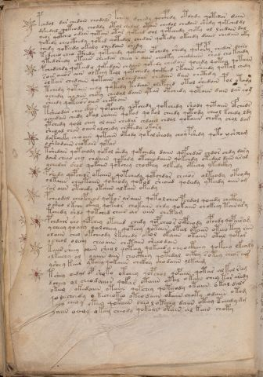

# Voynich Speculative Herbal Ferment Recipe — f114v

IMPORTANT: this is NOT a real or validated translation of the Voynich Manuscript. It is a speculative/procedural model that interprets EVA using a user-defined grammar to generate experimental recipes using safe, known edible substitutes.

This file is generated automatically from IVTFF/EVA transliteration plus a user-defined procedural grammar.



## Page / Folio
- currier: B
- folio: f114v
- page_number: 231

## EVA Text (Transliteration)
```text
pchdol dar chedain chodalr fcheey dchedy qocphdy otdady qotedar daiin
dshedal qoteody choddy otol chedal otain chedol chedain shedy qotched dl
oeos qotcheo odain qotain otar qotchd dol qotchedy choty ol lchdaiin dal
qokedy cheocthedy qoted qotedol chedar qotedy okeedy daiin chedaiin oky
chedy qokeedy okaly cheedain shedy
tedcheo cheo cthedy qotchedy qotaiin opchedy shedy qepoepy chedar dairy
ytedshedy otaiin cheedar ch[ee:eo]y s aiin chedky chedaiin shod chokchedy
pchedchdy qoteedy qokedain chdaiin qokedy chedain qoeedy qotey qotaiin
soes oeeos aiin olkeey keol qotcheedy qockhed skaiin sheedy qotal chedy
olkees chedaiin qotaiin olchedaiin chedain dain chcthdy
tchedy qotaiin chdy qotedy tedaiin chepched otol shedain pol otam
ochedy choaiin chcty chedal daiin ytar otchedy qotaiin dain dar [y:q]og
sheedy qoteeo s oiiin chcthain
tsheodar cheo ckhor qopchedy qopchedy qokchedy shody qotaiin ofcheds
ochedain chedy okal chaiin qokod qokol cheedy qotody cheol kchedy ldy
ytchedy qool chey ol aiin chedar chdaiin chdal qokaiin choky chol dam
sheoal chos oaiir alchedy chcphedy okary
dorkcheky cheo aiin qotaiin otody qokalsheody choypshedy qoto @189;shxam
o sh[s:?]odaiin chotain qotar
tshedain qotchody qokol shedy qokchedy daiin qofchdar chdor chdy dary
dair cheeo chy chdaiin qokedy otcheodaiin qokchdy otedal dain aral
ychedar shod qokaiin qotchey chockhy olkedy otechy ykedckhy
pshedy qopcheos okaiin qotchedy qotchdar cheeos olteody otoydy
olkaiin cheotaiin qoteody qokod sheoeed qodeedy yteedy aiin am
sor aiin otchedy otaiin alkain okeedy
pcheodal chopcheod qoto s araiin qota l cheo pchdal qoeedy chcthey
o sheeo l kchee okeey qoteor chokaiin chdy qokaiin chokeey tainary
tchedy shdo qotched chees ar aiin chetam
pchdair sho qopchey otcheed chedy qopcheo r ocpheody opchdy qopairam
y cheey qooeey qolcheey qoteey qotaiin otal otaiin oteeo teey rain
olaiin cheo otcheody lkchedy okol okaiin otaiin otal qotar
y cheol oleey cheoaiin chetaiin sheeodain
kaiin sheey oaiin sheol qoteey qokeeedy cheo ctheey qokeeo lkealy
olkeechy ol oaiin aiin chocthey qotedal octhy sotey cheos air
yshey kair yteeey qokaiin chckhy chodaiin olkaim
tshey oidal op shoko otchey qopchol qopaiin qotar al kal ram
dcheey ol cheodaiiin qokar otaiin otal o kaiin chey tar arody
oteey okedaiin otaiin qotchey qoteeody otaiin okal dals
qo [?:o]eecheedy o kecheokeo oteo daiin okaiin choty odaiin otam
eeo cheo y ot[ee:a]y qotaiin cheo l oteeey daiin oteey teeedy dm
yaiin o?oy [o:a]keey cheody qokaiin otain al kain choty
```

## Domain Context (Heuristic; Not a Translation)

This section summarizes recurring **basewords** in this IVTFF domain and shows simple substring evidence that the token markers used by the procedural grammar occur inside frequent words.

Any Italian anagram / English gloss is a best-effort lexicon match, not a decipherment.


### Associated basewords (non-generic; top by frequency in this domain)
- `daiin` (count=231) → Italian anagram `piani`; English: plans (arrangements)
- `qokaiin` (count=122) → Italian anagram `ciancio`; English: [n/a]
- `okaiin` (count=109) → Italian anagram `coniai`; English: [n/a]
- `qokain` (count=101) → Italian anagram `acconi`; English: [n/a]
- `okain` (count=69) → Italian anagram `acino`; English: a berry
- `otain` (count=53) → Italian anagram `anito`; English: [n/a]
- `qokar` (count=48) → Italian anagram `carco`; English: [n/a]
- `saiin` (count=46) → Italian anagram `asini`; English: [n/a]
- `qokal` (count=43) → Italian anagram `calco`; English: cast (of sculpture)
- `qotaiin` (count=40) → Italian anagram `cationi`; English: [n/a]
- `lkaiin` (count=39) → Italian anagram `ancili`; English: [n/a]
- `kaiin` (count=37) → Italian anagram `acini`; English: [n/a]
- `qokeol` (count=37) → Italian anagram `eccolo`; English: [n/a]
- `qotain` (count=34) → Italian anagram `antico`; English: ancient
- `qotar` (count=29) → Italian anagram `corta`; English: [n/a]

### Marker evidence (substring in frequent basewords)
- `qo`: 60 basewords; examples: `qokeey`, `qokeedy`, `qokaiin`, `qokain`, `qokedy`, `qokey`
- `q`: 61 basewords; examples: `qokeey`, `qokeedy`, `qokaiin`, `qokain`, `qokedy`, `qokey`
- `o`: 262 basewords; examples: `qokeey`, `ol`, `o`, `qokeedy`, `okeey`, `qokaiin`
- `k`: 147 basewords; examples: `qokeey`, `qokeedy`, `okeey`, `qokaiin`, `okaiin`, `qokain`
- `t`: 102 basewords; examples: `otaiin`, `oteey`, `otar`, `otedy`, `otal`, `oteedy`
- `p`: 17 basewords; examples: `opchedy`, `qopchedy`, `opchey`, `pchedy`, `qopchdy`, `opchdy`
- `ch`: 137 basewords; examples: `chedy`, `chey`, `chol`, `cheey`, `cheol`, `cheody`
- `sh`: 50 basewords; examples: `shedy`, `shey`, `sheey`, `sheol`, `shol`, `sheedy`
- `f`: 1 basewords; examples: `f`
- `cth`: 16 basewords; examples: `chcthy`, `cthey`, `shcthy`, `checthy`, `cthol`, `ctheey`
- `ckh`: 15 basewords; examples: `chckhy`, `shckhy`, `checkhy`, `chckhey`, `chockhy`, `sheckhy`
- `cph`: 2 basewords; examples: `cphol`, `cphy`
- `dy`: 84 basewords; examples: `chedy`, `qokeedy`, `shedy`, `otedy`, `oteedy`, `qokedy`
- `iin`: 39 basewords; examples: `aiin`, `daiin`, `qokaiin`, `okaiin`, `otaiin`, `saiin`
- `aiin`: 33 basewords; examples: `aiin`, `daiin`, `qokaiin`, `okaiin`, `otaiin`, `saiin`

## Recipes Index (This Page)
- [f114v.1,@P0](#f114v-1-f114v-1-p0)
- [f114v.2,+P0](#f114v-2-f114v-2-p0)
- [f114v.3,+P0](#f114v-3-f114v-3-p0)
- [f114v.4,+P0](#f114v-4-f114v-4-p0)
- [f114v.5,+P0](#f114v-5-f114v-5-p0)
- [f114v.6,+P0](#f114v-6-f114v-6-p0)
- [f114v.7,+P0](#f114v-7-f114v-7-p0)
- [f114v.8,+P0](#f114v-8-f114v-8-p0)
- [f114v.9,+P0](#f114v-9-f114v-9-p0)
- [f114v.10,+P0](#f114v-10-f114v-10-p0)
- [f114v.11,+P0](#f114v-11-f114v-11-p0)
- [f114v.12,+P0](#f114v-12-f114v-12-p0)
- [f114v.13,+P0](#f114v-13-f114v-13-p0)
- [f114v.14,+P0](#f114v-14-f114v-14-p0)
- [f114v.15,+P0](#f114v-15-f114v-15-p0)
- [f114v.16,+P0](#f114v-16-f114v-16-p0)
- [f114v.17,+P0](#f114v-17-f114v-17-p0)
- [f114v.18,+P0](#f114v-18-f114v-18-p0)
- [f114v.19,+P0](#f114v-19-f114v-19-p0)
- [f114v.20,+P0](#f114v-20-f114v-20-p0)
- [f114v.21,+P0](#f114v-21-f114v-21-p0)
- [f114v.22,+P0](#f114v-22-f114v-22-p0)
- [f114v.23,+P0](#f114v-23-f114v-23-p0)
- [f114v.24,+P0](#f114v-24-f114v-24-p0)
- [f114v.25,+P0](#f114v-25-f114v-25-p0)
- [f114v.26,+P0](#f114v-26-f114v-26-p0)
- [f114v.27,+P0](#f114v-27-f114v-27-p0)
- [f114v.28,+P0](#f114v-28-f114v-28-p0)
- [f114v.29,+P0](#f114v-29-f114v-29-p0)
- [f114v.30,+P0](#f114v-30-f114v-30-p0)
- [f114v.31,+P0](#f114v-31-f114v-31-p0)
- [f114v.32,+P0](#f114v-32-f114v-32-p0)
- [f114v.33,+P0](#f114v-33-f114v-33-p0)
- [f114v.34,+P0](#f114v-34-f114v-34-p0)
- [f114v.35,+P0](#f114v-35-f114v-35-p0)
- [f114v.36,+P0](#f114v-36-f114v-36-p0)
- [f114v.37,+P0](#f114v-37-f114v-37-p0)
- [f114v.38,+P0](#f114v-38-f114v-38-p0)
- [f114v.39,+P0](#f114v-39-f114v-39-p0)
- [f114v.40,+P0](#f114v-40-f114v-40-p0)
- [f114v.41,+P0](#f114v-41-f114v-41-p0)

## Line Glosses (Procedural Gloss Only; Not a Translation)

<a id="f114v-1-f114v-1-p0"></a>

### f114v.1,@P0

EVA: pchdol dar chedain chodalr fcheey dchedy qocphdy otdady qotedar daiin

Direct Gloss (Procedural, Not a Real Translation):
- pchdol: add main plant (safe substitute) → mix / transfer → start fermentation (yeast)
- dar: start fermentation (yeast) → duration level 1 → state: fermentation start
- chedain: add main plant (safe substitute) → start fermentation (yeast) → duration level 1 → state: active extraction
- chodalr: add main plant (safe substitute) → mix / transfer → start fermentation (yeast) → duration level 1 → state: fermentation start
- fcheey: add main plant (safe substitute) → add aroma modifier → duration level 2 → state: active extraction
- dchedy: add main plant (safe substitute) → start fermentation (yeast) → duration level 1 → state: active extraction
- qocphdy: prepare liquid base → start fermentation (yeast) → add complex herbal compound (safe blend)
- otdady: apply heat/cooking → mix / transfer → start fermentation (yeast) → duration level 1 → state: fermentation start
- qotedar: prepare liquid base → apply heat/cooking → start fermentation (yeast) → duration level 1 → state: active extraction
- daiin: start fermentation (yeast) → duration level 1 → state: fermentation start → long fermentation / aging phase

<a id="f114v-2-f114v-2-p0"></a>

### f114v.2,+P0

EVA: dshedal qoteody choddy otol chedal otain chedol chedain shedy qotched dl

Direct Gloss (Procedural, Not a Real Translation):
- dshedal: add secondary herb (safe substitute) → start fermentation (yeast) → duration level 1 → state: active extraction
- qoteody: prepare liquid base → apply heat/cooking → mix / transfer → start fermentation (yeast) → duration level 1 → state: active extraction
- choddy: add main plant (safe substitute) → mix / transfer → start fermentation (yeast)
- otol: apply heat/cooking → mix / transfer
- chedal: add main plant (safe substitute) → start fermentation (yeast) → duration level 1 → state: active extraction
- otain: apply heat/cooking → mix / transfer → duration level 1 → state: fermentation start
- chedol: add main plant (safe substitute) → mix / transfer → start fermentation (yeast) → duration level 1 → state: active extraction
- chedain: add main plant (safe substitute) → start fermentation (yeast) → duration level 1 → state: active extraction
- shedy: add secondary herb (safe substitute) → start fermentation (yeast) → duration level 1 → state: active extraction
- qotched: prepare liquid base → apply heat/cooking → add main plant (safe substitute) → start fermentation (yeast) → duration level 1 → state: active extraction
- dl: start fermentation (yeast)

<a id="f114v-3-f114v-3-p0"></a>

### f114v.3,+P0

EVA: oeos qotcheo odain qotain otar qotchd dol qotchedy choty ol lchdaiin dal

Direct Gloss (Procedural, Not a Real Translation):
- oeos: mix / transfer → duration level 1 → state: active extraction
- qotcheo: prepare liquid base → apply heat/cooking → add main plant (safe substitute) → mix / transfer → duration level 1 → state: active extraction
- odain: mix / transfer → start fermentation (yeast) → duration level 1 → state: fermentation start
- qotain: prepare liquid base → apply heat/cooking → duration level 1 → state: fermentation start
- otar: apply heat/cooking → mix / transfer → duration level 1 → state: fermentation start
- qotchd: prepare liquid base → apply heat/cooking → add main plant (safe substitute) → start fermentation (yeast)
- dol: mix / transfer → start fermentation (yeast)
- qotchedy: prepare liquid base → apply heat/cooking → add main plant (safe substitute) → start fermentation (yeast) → duration level 1 → state: active extraction
- choty: apply heat/cooking → add main plant (safe substitute) → mix / transfer
- ol: mix / transfer
- lchdaiin: add main plant (safe substitute) → start fermentation (yeast) → duration level 1 → state: fermentation start → long fermentation / aging phase
- dal: start fermentation (yeast) → duration level 1 → state: fermentation start

<a id="f114v-4-f114v-4-p0"></a>

### f114v.4,+P0

EVA: qokedy cheocthedy qoted qotedol chedar qotedy okeedy daiin chedaiin oky

Direct Gloss (Procedural, Not a Real Translation):
- qokedy: prepare liquid base → add fermentable sugars → start fermentation (yeast) → duration level 1 → state: active extraction
- cheocthedy: add main plant (safe substitute) → mix / transfer → start fermentation (yeast) → add complex herbal compound (safe blend) → duration level 1 → state: active extraction
- qoted: prepare liquid base → apply heat/cooking → start fermentation (yeast) → duration level 1 → state: active extraction
- qotedol: prepare liquid base → apply heat/cooking → mix / transfer → start fermentation (yeast) → duration level 1 → state: active extraction
- chedar: add main plant (safe substitute) → start fermentation (yeast) → duration level 1 → state: active extraction
- qotedy: prepare liquid base → apply heat/cooking → start fermentation (yeast) → duration level 1 → state: active extraction
- okeedy: add fermentable sugars → mix / transfer → start fermentation (yeast) → duration level 2 → state: active extraction
- daiin: start fermentation (yeast) → duration level 1 → state: fermentation start → long fermentation / aging phase
- chedaiin: add main plant (safe substitute) → start fermentation (yeast) → duration level 1 → state: active extraction → long fermentation / aging phase
- oky: add fermentable sugars → mix / transfer

<a id="f114v-5-f114v-5-p0"></a>

### f114v.5,+P0

EVA: chedy qokeedy okaly cheedain shedy

Direct Gloss (Procedural, Not a Real Translation):
- chedy: add main plant (safe substitute) → start fermentation (yeast) → duration level 1 → state: active extraction
- qokeedy: prepare liquid base → add fermentable sugars → start fermentation (yeast) → duration level 2 → state: active extraction
- okaly: add fermentable sugars → mix / transfer → duration level 1 → state: fermentation start
- cheedain: add main plant (safe substitute) → start fermentation (yeast) → duration level 2 → state: active extraction
- shedy: add secondary herb (safe substitute) → start fermentation (yeast) → duration level 1 → state: active extraction

<a id="f114v-6-f114v-6-p0"></a>

### f114v.6,+P0

EVA: tedcheo cheo cthedy qotchedy qotaiin opchedy shedy qepoepy chedar dairy

Direct Gloss (Procedural, Not a Real Translation):
- tedcheo: apply heat/cooking → add main plant (safe substitute) → mix / transfer → start fermentation (yeast) → duration level 1 → state: active extraction
- cheo: add main plant (safe substitute) → mix / transfer → duration level 1 → state: active extraction
- cthedy: start fermentation (yeast) → add complex herbal compound (safe blend) → duration level 1 → state: active extraction
- qotchedy: prepare liquid base → apply heat/cooking → add main plant (safe substitute) → start fermentation (yeast) → duration level 1 → state: active extraction
- qotaiin: prepare liquid base → apply heat/cooking → duration level 1 → state: fermentation start → long fermentation / aging phase
- opchedy: add main plant (safe substitute) → mix / transfer → start fermentation (yeast) → duration level 1 → state: active extraction
- shedy: add secondary herb (safe substitute) → start fermentation (yeast) → duration level 1 → state: active extraction
- qepoepy: prepare base (generic) → mix / transfer → start fermentation (yeast) → duration level 1 → state: active extraction
- chedar: add main plant (safe substitute) → start fermentation (yeast) → duration level 1 → state: active extraction
- dairy: start fermentation (yeast) → duration level 1 → state: fermentation start

<a id="f114v-7-f114v-7-p0"></a>

### f114v.7,+P0

EVA: ytedshedy otaiin cheedar ch[ee:eo]y s aiin chedky chedaiin shod chokchedy

Direct Gloss (Procedural, Not a Real Translation):
- ytedshedy: apply heat/cooking → add secondary herb (safe substitute) → start fermentation (yeast) → duration level 1 → state: active extraction
- otaiin: apply heat/cooking → mix / transfer → duration level 1 → state: fermentation start → long fermentation / aging phase
- cheedar: add main plant (safe substitute) → start fermentation (yeast) → duration level 2 → state: active extraction
- ch: add main plant (safe substitute)
- ee: duration level 2 → state: active extraction
- eo: mix / transfer → duration level 1 → state: active extraction
- y: [unparsed]
- s: [unparsed]
- aiin: duration level 1 → state: fermentation start → long fermentation / aging phase
- chedky: add fermentable sugars → add main plant (safe substitute) → start fermentation (yeast) → duration level 1 → state: active extraction
- chedaiin: add main plant (safe substitute) → start fermentation (yeast) → duration level 1 → state: active extraction → long fermentation / aging phase
- shod: add secondary herb (safe substitute) → mix / transfer → start fermentation (yeast)
- chokchedy: add fermentable sugars → add main plant (safe substitute) → mix / transfer → start fermentation (yeast) → duration level 1 → state: active extraction

<a id="f114v-8-f114v-8-p0"></a>

### f114v.8,+P0

EVA: pchedchdy qoteedy qokedain chdaiin qokedy chedain qoeedy qotey qotaiin

Direct Gloss (Procedural, Not a Real Translation):
- pchedchdy: add main plant (safe substitute) → start fermentation (yeast) → duration level 1 → state: active extraction
- qoteedy: prepare liquid base → apply heat/cooking → start fermentation (yeast) → duration level 2 → state: active extraction
- qokedain: prepare liquid base → add fermentable sugars → start fermentation (yeast) → duration level 1 → state: active extraction
- chdaiin: add main plant (safe substitute) → start fermentation (yeast) → duration level 1 → state: fermentation start → long fermentation / aging phase
- qokedy: prepare liquid base → add fermentable sugars → start fermentation (yeast) → duration level 1 → state: active extraction
- chedain: add main plant (safe substitute) → start fermentation (yeast) → duration level 1 → state: active extraction
- qoeedy: prepare liquid base → start fermentation (yeast) → duration level 2 → state: active extraction
- qotey: prepare liquid base → apply heat/cooking → duration level 1 → state: active extraction
- qotaiin: prepare liquid base → apply heat/cooking → duration level 1 → state: fermentation start → long fermentation / aging phase

<a id="f114v-9-f114v-9-p0"></a>

### f114v.9,+P0

EVA: soes oeeos aiin olkeey keol qotcheedy qockhed skaiin sheedy qotal chedy

Direct Gloss (Procedural, Not a Real Translation):
- soes: mix / transfer → duration level 1 → state: active extraction
- oeeos: mix / transfer → duration level 2 → state: active extraction
- aiin: duration level 1 → state: fermentation start → long fermentation / aging phase
- olkeey: add fermentable sugars → mix / transfer → duration level 2 → state: active extraction
- keol: add fermentable sugars → mix / transfer → duration level 1 → state: active extraction
- qotcheedy: prepare liquid base → apply heat/cooking → add main plant (safe substitute) → start fermentation (yeast) → duration level 2 → state: active extraction
- qockhed: prepare liquid base → start fermentation (yeast) → add complex herbal compound (safe blend) → duration level 1 → state: active extraction
- skaiin: add fermentable sugars → duration level 1 → state: fermentation start → long fermentation / aging phase
- sheedy: add secondary herb (safe substitute) → start fermentation (yeast) → duration level 2 → state: active extraction
- qotal: prepare liquid base → apply heat/cooking → duration level 1 → state: fermentation start
- chedy: add main plant (safe substitute) → start fermentation (yeast) → duration level 1 → state: active extraction

<a id="f114v-10-f114v-10-p0"></a>

### f114v.10,+P0

EVA: olkees chedaiin qotaiin olchedaiin chedain dain chcthdy

Direct Gloss (Procedural, Not a Real Translation):
- olkees: add fermentable sugars → mix / transfer → duration level 2 → state: active extraction
- chedaiin: add main plant (safe substitute) → start fermentation (yeast) → duration level 1 → state: active extraction → long fermentation / aging phase
- qotaiin: prepare liquid base → apply heat/cooking → duration level 1 → state: fermentation start → long fermentation / aging phase
- olchedaiin: add main plant (safe substitute) → mix / transfer → start fermentation (yeast) → duration level 1 → state: active extraction → long fermentation / aging phase
- chedain: add main plant (safe substitute) → start fermentation (yeast) → duration level 1 → state: active extraction
- dain: start fermentation (yeast) → duration level 1 → state: fermentation start
- chcthdy: add main plant (safe substitute) → start fermentation (yeast) → add complex herbal compound (safe blend)

<a id="f114v-11-f114v-11-p0"></a>

### f114v.11,+P0

EVA: tchedy qotaiin chdy qotedy tedaiin chepched otol shedain pol otam

Direct Gloss (Procedural, Not a Real Translation):
- tchedy: apply heat/cooking → add main plant (safe substitute) → start fermentation (yeast) → duration level 1 → state: active extraction
- qotaiin: prepare liquid base → apply heat/cooking → duration level 1 → state: fermentation start → long fermentation / aging phase
- chdy: add main plant (safe substitute) → start fermentation (yeast)
- qotedy: prepare liquid base → apply heat/cooking → start fermentation (yeast) → duration level 1 → state: active extraction
- tedaiin: apply heat/cooking → start fermentation (yeast) → duration level 1 → state: active extraction → long fermentation / aging phase
- chepched: add main plant (safe substitute) → start fermentation (yeast) → duration level 1 → state: active extraction
- otol: apply heat/cooking → mix / transfer
- shedain: add secondary herb (safe substitute) → start fermentation (yeast) → duration level 1 → state: active extraction
- pol: mix / transfer → start fermentation (yeast)
- otam: apply heat/cooking → mix / transfer → duration level 1 → state: fermentation start

<a id="f114v-12-f114v-12-p0"></a>

### f114v.12,+P0

EVA: ochedy choaiin chcty chedal daiin ytar otchedy qotaiin dain dar [y:q]og

Direct Gloss (Procedural, Not a Real Translation):
- ochedy: add main plant (safe substitute) → mix / transfer → start fermentation (yeast) → duration level 1 → state: active extraction
- choaiin: add main plant (safe substitute) → mix / transfer → duration level 1 → state: fermentation start → long fermentation / aging phase
- chcty: apply heat/cooking → add main plant (safe substitute)
- chedal: add main plant (safe substitute) → start fermentation (yeast) → duration level 1 → state: active extraction
- daiin: start fermentation (yeast) → duration level 1 → state: fermentation start → long fermentation / aging phase
- ytar: apply heat/cooking → duration level 1 → state: fermentation start
- otchedy: apply heat/cooking → add main plant (safe substitute) → mix / transfer → start fermentation (yeast) → duration level 1 → state: active extraction
- qotaiin: prepare liquid base → apply heat/cooking → duration level 1 → state: fermentation start → long fermentation / aging phase
- dain: start fermentation (yeast) → duration level 1 → state: fermentation start
- dar: start fermentation (yeast) → duration level 1 → state: fermentation start
- y: [unparsed]
- q: prepare base (generic)
- og: mix / transfer

<a id="f114v-13-f114v-13-p0"></a>

### f114v.13,+P0

EVA: sheedy qoteeo s oiiin chcthain

Direct Gloss (Procedural, Not a Real Translation):
- sheedy: add secondary herb (safe substitute) → start fermentation (yeast) → duration level 2 → state: active extraction
- qoteeo: prepare liquid base → apply heat/cooking → mix / transfer → duration level 2 → state: active extraction
- s: [unparsed]
- oiiin: mix / transfer → duration level 3 → state: cooling/rest → medium fermentation phase
- chcthain: add main plant (safe substitute) → add complex herbal compound (safe blend) → duration level 1 → state: fermentation start

<a id="f114v-14-f114v-14-p0"></a>

### f114v.14,+P0

EVA: tsheodar cheo ckhor qopchedy qopchedy qokchedy shody qotaiin ofcheds

Direct Gloss (Procedural, Not a Real Translation):
- tsheodar: apply heat/cooking → add secondary herb (safe substitute) → mix / transfer → start fermentation (yeast) → duration level 1 → state: active extraction
- cheo: add main plant (safe substitute) → mix / transfer → duration level 1 → state: active extraction
- ckhor: mix / transfer → add complex herbal compound (safe blend)
- qopchedy: prepare liquid base → add main plant (safe substitute) → start fermentation (yeast) → duration level 1 → state: active extraction
- qopchedy: prepare liquid base → add main plant (safe substitute) → start fermentation (yeast) → duration level 1 → state: active extraction
- qokchedy: prepare liquid base → add fermentable sugars → add main plant (safe substitute) → start fermentation (yeast) → duration level 1 → state: active extraction
- shody: add secondary herb (safe substitute) → mix / transfer → start fermentation (yeast)
- qotaiin: prepare liquid base → apply heat/cooking → duration level 1 → state: fermentation start → long fermentation / aging phase
- ofcheds: add main plant (safe substitute) → add aroma modifier → mix / transfer → start fermentation (yeast) → duration level 1 → state: active extraction

<a id="f114v-15-f114v-15-p0"></a>

### f114v.15,+P0

EVA: ochedain chedy okal chaiin qokod qokol cheedy qotody cheol kchedy ldy

Direct Gloss (Procedural, Not a Real Translation):
- ochedain: add main plant (safe substitute) → mix / transfer → start fermentation (yeast) → duration level 1 → state: active extraction
- chedy: add main plant (safe substitute) → start fermentation (yeast) → duration level 1 → state: active extraction
- okal: add fermentable sugars → mix / transfer → duration level 1 → state: fermentation start
- chaiin: add main plant (safe substitute) → duration level 1 → state: fermentation start → long fermentation / aging phase
- qokod: prepare liquid base → add fermentable sugars → mix / transfer → start fermentation (yeast)
- qokol: prepare liquid base → add fermentable sugars → mix / transfer
- cheedy: add main plant (safe substitute) → start fermentation (yeast) → duration level 2 → state: active extraction
- qotody: prepare liquid base → apply heat/cooking → mix / transfer → start fermentation (yeast)
- cheol: add main plant (safe substitute) → mix / transfer → duration level 1 → state: active extraction
- kchedy: add fermentable sugars → add main plant (safe substitute) → start fermentation (yeast) → duration level 1 → state: active extraction
- ldy: start fermentation (yeast)

<a id="f114v-16-f114v-16-p0"></a>

### f114v.16,+P0

EVA: ytchedy qool chey ol aiin chedar chdaiin chdal qokaiin choky chol dam

Direct Gloss (Procedural, Not a Real Translation):
- ytchedy: apply heat/cooking → add main plant (safe substitute) → start fermentation (yeast) → duration level 1 → state: active extraction
- qool: prepare liquid base → mix / transfer
- chey: add main plant (safe substitute) → duration level 1 → state: active extraction
- ol: mix / transfer
- aiin: duration level 1 → state: fermentation start → long fermentation / aging phase
- chedar: add main plant (safe substitute) → start fermentation (yeast) → duration level 1 → state: active extraction
- chdaiin: add main plant (safe substitute) → start fermentation (yeast) → duration level 1 → state: fermentation start → long fermentation / aging phase
- chdal: add main plant (safe substitute) → start fermentation (yeast) → duration level 1 → state: fermentation start
- qokaiin: prepare liquid base → add fermentable sugars → duration level 1 → state: fermentation start → long fermentation / aging phase
- choky: add fermentable sugars → add main plant (safe substitute) → mix / transfer
- chol: add main plant (safe substitute) → mix / transfer
- dam: start fermentation (yeast) → duration level 1 → state: fermentation start

<a id="f114v-17-f114v-17-p0"></a>

### f114v.17,+P0

EVA: sheoal chos oaiir alchedy chcphedy okary

Direct Gloss (Procedural, Not a Real Translation):
- sheoal: add secondary herb (safe substitute) → mix / transfer → duration level 1 → state: active extraction
- chos: add main plant (safe substitute) → mix / transfer
- oaiir: mix / transfer → duration level 1 → state: fermentation start
- alchedy: add main plant (safe substitute) → start fermentation (yeast) → duration level 1 → state: fermentation start
- chcphedy: add main plant (safe substitute) → start fermentation (yeast) → add complex herbal compound (safe blend) → duration level 1 → state: active extraction
- okary: add fermentable sugars → mix / transfer → duration level 1 → state: fermentation start

<a id="f114v-18-f114v-18-p0"></a>

### f114v.18,+P0

EVA: dorkcheky cheo aiin qotaiin otody qokalsheody choypshedy qoto @189;shxam

Direct Gloss (Procedural, Not a Real Translation):
- dorkcheky: add fermentable sugars → add main plant (safe substitute) → mix / transfer → start fermentation (yeast) → duration level 1 → state: active extraction
- cheo: add main plant (safe substitute) → mix / transfer → duration level 1 → state: active extraction
- aiin: duration level 1 → state: fermentation start → long fermentation / aging phase
- qotaiin: prepare liquid base → apply heat/cooking → duration level 1 → state: fermentation start → long fermentation / aging phase
- otody: apply heat/cooking → mix / transfer → start fermentation (yeast)
- qokalsheody: prepare liquid base → add fermentable sugars → add secondary herb (safe substitute) → mix / transfer → start fermentation (yeast) → duration level 1 → state: fermentation start
- choypshedy: add main plant (safe substitute) → add secondary herb (safe substitute) → mix / transfer → start fermentation (yeast) → duration level 1 → state: active extraction
- qoto: prepare liquid base → apply heat/cooking → mix / transfer
- shxam: add secondary herb (safe substitute) → duration level 1 → state: fermentation start

<a id="f114v-19-f114v-19-p0"></a>

### f114v.19,+P0

EVA: o sh[s:?]odaiin chotain qotar

Direct Gloss (Procedural, Not a Real Translation):
- o: mix / transfer
- sh: add secondary herb (safe substitute)
- s: [unparsed]
- odaiin: mix / transfer → start fermentation (yeast) → duration level 1 → state: fermentation start → long fermentation / aging phase
- chotain: apply heat/cooking → add main plant (safe substitute) → mix / transfer → duration level 1 → state: fermentation start
- qotar: prepare liquid base → apply heat/cooking → duration level 1 → state: fermentation start

<a id="f114v-20-f114v-20-p0"></a>

### f114v.20,+P0

EVA: tshedain qotchody qokol shedy qokchedy daiin qofchdar chdor chdy dary

Direct Gloss (Procedural, Not a Real Translation):
- tshedain: apply heat/cooking → add secondary herb (safe substitute) → start fermentation (yeast) → duration level 1 → state: active extraction
- qotchody: prepare liquid base → apply heat/cooking → add main plant (safe substitute) → mix / transfer → start fermentation (yeast)
- qokol: prepare liquid base → add fermentable sugars → mix / transfer
- shedy: add secondary herb (safe substitute) → start fermentation (yeast) → duration level 1 → state: active extraction
- qokchedy: prepare liquid base → add fermentable sugars → add main plant (safe substitute) → start fermentation (yeast) → duration level 1 → state: active extraction
- daiin: start fermentation (yeast) → duration level 1 → state: fermentation start → long fermentation / aging phase
- qofchdar: prepare liquid base → add main plant (safe substitute) → add aroma modifier → start fermentation (yeast) → duration level 1 → state: fermentation start
- chdor: add main plant (safe substitute) → mix / transfer → start fermentation (yeast)
- chdy: add main plant (safe substitute) → start fermentation (yeast)
- dary: start fermentation (yeast) → duration level 1 → state: fermentation start

<a id="f114v-21-f114v-21-p0"></a>

### f114v.21,+P0

EVA: dair cheeo chy chdaiin qokedy otcheodaiin qokchdy otedal dain aral

Direct Gloss (Procedural, Not a Real Translation):
- dair: start fermentation (yeast) → duration level 1 → state: fermentation start
- cheeo: add main plant (safe substitute) → mix / transfer → duration level 2 → state: active extraction
- chy: add main plant (safe substitute)
- chdaiin: add main plant (safe substitute) → start fermentation (yeast) → duration level 1 → state: fermentation start → long fermentation / aging phase
- qokedy: prepare liquid base → add fermentable sugars → start fermentation (yeast) → duration level 1 → state: active extraction
- otcheodaiin: apply heat/cooking → add main plant (safe substitute) → mix / transfer → start fermentation (yeast) → duration level 1 → state: active extraction → long fermentation / aging phase
- qokchdy: prepare liquid base → add fermentable sugars → add main plant (safe substitute) → start fermentation (yeast)
- otedal: apply heat/cooking → mix / transfer → start fermentation (yeast) → duration level 1 → state: active extraction
- dain: start fermentation (yeast) → duration level 1 → state: fermentation start
- aral: duration level 1 → state: fermentation start

<a id="f114v-22-f114v-22-p0"></a>

### f114v.22,+P0

EVA: ychedar shod qokaiin qotchey chockhy olkedy otechy ykedckhy

Direct Gloss (Procedural, Not a Real Translation):
- ychedar: add main plant (safe substitute) → start fermentation (yeast) → duration level 1 → state: active extraction
- shod: add secondary herb (safe substitute) → mix / transfer → start fermentation (yeast)
- qokaiin: prepare liquid base → add fermentable sugars → duration level 1 → state: fermentation start → long fermentation / aging phase
- qotchey: prepare liquid base → apply heat/cooking → add main plant (safe substitute) → duration level 1 → state: active extraction
- chockhy: add main plant (safe substitute) → mix / transfer → add complex herbal compound (safe blend)
- olkedy: add fermentable sugars → mix / transfer → start fermentation (yeast) → duration level 1 → state: active extraction
- otechy: apply heat/cooking → add main plant (safe substitute) → mix / transfer → duration level 1 → state: active extraction
- ykedckhy: add fermentable sugars → start fermentation (yeast) → add complex herbal compound (safe blend) → duration level 1 → state: active extraction

<a id="f114v-23-f114v-23-p0"></a>

### f114v.23,+P0

EVA: pshedy qopcheos okaiin qotchedy qotchdar cheeos olteody otoydy

Direct Gloss (Procedural, Not a Real Translation):
- pshedy: add secondary herb (safe substitute) → start fermentation (yeast) → duration level 1 → state: active extraction
- qopcheos: prepare liquid base → add main plant (safe substitute) → mix / transfer → start fermentation (yeast) → duration level 1 → state: active extraction
- okaiin: add fermentable sugars → mix / transfer → duration level 1 → state: fermentation start → long fermentation / aging phase
- qotchedy: prepare liquid base → apply heat/cooking → add main plant (safe substitute) → start fermentation (yeast) → duration level 1 → state: active extraction
- qotchdar: prepare liquid base → apply heat/cooking → add main plant (safe substitute) → start fermentation (yeast) → duration level 1 → state: fermentation start
- cheeos: add main plant (safe substitute) → mix / transfer → duration level 2 → state: active extraction
- olteody: apply heat/cooking → mix / transfer → start fermentation (yeast) → duration level 1 → state: active extraction
- otoydy: apply heat/cooking → mix / transfer → start fermentation (yeast)

<a id="f114v-24-f114v-24-p0"></a>

### f114v.24,+P0

EVA: olkaiin cheotaiin qoteody qokod sheoeed qodeedy yteedy aiin am

Direct Gloss (Procedural, Not a Real Translation):
- olkaiin: add fermentable sugars → mix / transfer → duration level 1 → state: fermentation start → long fermentation / aging phase
- cheotaiin: apply heat/cooking → add main plant (safe substitute) → mix / transfer → duration level 1 → state: active extraction → long fermentation / aging phase
- qoteody: prepare liquid base → apply heat/cooking → mix / transfer → start fermentation (yeast) → duration level 1 → state: active extraction
- qokod: prepare liquid base → add fermentable sugars → mix / transfer → start fermentation (yeast)
- sheoeed: add secondary herb (safe substitute) → mix / transfer → start fermentation (yeast) → duration level 1 → state: active extraction
- qodeedy: prepare liquid base → start fermentation (yeast) → duration level 2 → state: active extraction
- yteedy: apply heat/cooking → start fermentation (yeast) → duration level 2 → state: active extraction
- aiin: duration level 1 → state: fermentation start → long fermentation / aging phase
- am: duration level 1 → state: fermentation start

<a id="f114v-25-f114v-25-p0"></a>

### f114v.25,+P0

EVA: sor aiin otchedy otaiin alkain okeedy

Direct Gloss (Procedural, Not a Real Translation):
- sor: mix / transfer
- aiin: duration level 1 → state: fermentation start → long fermentation / aging phase
- otchedy: apply heat/cooking → add main plant (safe substitute) → mix / transfer → start fermentation (yeast) → duration level 1 → state: active extraction
- otaiin: apply heat/cooking → mix / transfer → duration level 1 → state: fermentation start → long fermentation / aging phase
- alkain: add fermentable sugars → duration level 1 → state: fermentation start
- okeedy: add fermentable sugars → mix / transfer → start fermentation (yeast) → duration level 2 → state: active extraction

<a id="f114v-26-f114v-26-p0"></a>

### f114v.26,+P0

EVA: pcheodal chopcheod qoto s araiin qota l cheo pchdal qoeedy chcthey

Direct Gloss (Procedural, Not a Real Translation):
- pcheodal: add main plant (safe substitute) → mix / transfer → start fermentation (yeast) → duration level 1 → state: active extraction
- chopcheod: add main plant (safe substitute) → mix / transfer → start fermentation (yeast) → duration level 1 → state: active extraction
- qoto: prepare liquid base → apply heat/cooking → mix / transfer
- s: [unparsed]
- araiin: duration level 1 → state: fermentation start → long fermentation / aging phase
- qota: prepare liquid base → apply heat/cooking → duration level 1 → state: fermentation start
- l: [unparsed]
- cheo: add main plant (safe substitute) → mix / transfer → duration level 1 → state: active extraction
- pchdal: add main plant (safe substitute) → start fermentation (yeast) → duration level 1 → state: fermentation start
- qoeedy: prepare liquid base → start fermentation (yeast) → duration level 2 → state: active extraction
- chcthey: add main plant (safe substitute) → add complex herbal compound (safe blend) → duration level 1 → state: active extraction

<a id="f114v-27-f114v-27-p0"></a>

### f114v.27,+P0

EVA: o sheeo l kchee okeey qoteor chokaiin chdy qokaiin chokeey tainary

Direct Gloss (Procedural, Not a Real Translation):
- o: mix / transfer
- sheeo: add secondary herb (safe substitute) → mix / transfer → duration level 2 → state: active extraction
- l: [unparsed]
- kchee: add fermentable sugars → add main plant (safe substitute) → duration level 2 → state: active extraction
- okeey: add fermentable sugars → mix / transfer → duration level 2 → state: active extraction
- qoteor: prepare liquid base → apply heat/cooking → mix / transfer → duration level 1 → state: active extraction
- chokaiin: add fermentable sugars → add main plant (safe substitute) → mix / transfer → duration level 1 → state: fermentation start → long fermentation / aging phase
- chdy: add main plant (safe substitute) → start fermentation (yeast)
- qokaiin: prepare liquid base → add fermentable sugars → duration level 1 → state: fermentation start → long fermentation / aging phase
- chokeey: add fermentable sugars → add main plant (safe substitute) → mix / transfer → duration level 2 → state: active extraction
- tainary: apply heat/cooking → duration level 1 → state: fermentation start

<a id="f114v-28-f114v-28-p0"></a>

### f114v.28,+P0

EVA: tchedy shdo qotched chees ar aiin chetam

Direct Gloss (Procedural, Not a Real Translation):
- tchedy: apply heat/cooking → add main plant (safe substitute) → start fermentation (yeast) → duration level 1 → state: active extraction
- shdo: add secondary herb (safe substitute) → mix / transfer → start fermentation (yeast)
- qotched: prepare liquid base → apply heat/cooking → add main plant (safe substitute) → start fermentation (yeast) → duration level 1 → state: active extraction
- chees: add main plant (safe substitute) → duration level 2 → state: active extraction
- ar: duration level 1 → state: fermentation start
- aiin: duration level 1 → state: fermentation start → long fermentation / aging phase
- chetam: apply heat/cooking → add main plant (safe substitute) → duration level 1 → state: active extraction

<a id="f114v-29-f114v-29-p0"></a>

### f114v.29,+P0

EVA: pchdair sho qopchey otcheed chedy qopcheo r ocpheody opchdy qopairam

Direct Gloss (Procedural, Not a Real Translation):
- pchdair: add main plant (safe substitute) → start fermentation (yeast) → duration level 1 → state: fermentation start
- sho: add secondary herb (safe substitute) → mix / transfer
- qopchey: prepare liquid base → add main plant (safe substitute) → start fermentation (yeast) → duration level 1 → state: active extraction
- otcheed: apply heat/cooking → add main plant (safe substitute) → mix / transfer → start fermentation (yeast) → duration level 2 → state: active extraction
- chedy: add main plant (safe substitute) → start fermentation (yeast) → duration level 1 → state: active extraction
- qopcheo: prepare liquid base → add main plant (safe substitute) → mix / transfer → start fermentation (yeast) → duration level 1 → state: active extraction
- r: [unparsed]
- ocpheody: mix / transfer → start fermentation (yeast) → add complex herbal compound (safe blend) → duration level 1 → state: active extraction
- opchdy: add main plant (safe substitute) → mix / transfer → start fermentation (yeast)
- qopairam: prepare liquid base → start fermentation (yeast) → duration level 1 → state: fermentation start

<a id="f114v-30-f114v-30-p0"></a>

### f114v.30,+P0

EVA: y cheey qooeey qolcheey qoteey qotaiin otal otaiin oteeo teey rain

Direct Gloss (Procedural, Not a Real Translation):
- y: [unparsed]
- cheey: add main plant (safe substitute) → duration level 2 → state: active extraction
- qooeey: prepare liquid base → mix / transfer → duration level 2 → state: active extraction
- qolcheey: prepare liquid base → add main plant (safe substitute) → duration level 2 → state: active extraction
- qoteey: prepare liquid base → apply heat/cooking → duration level 2 → state: active extraction
- qotaiin: prepare liquid base → apply heat/cooking → duration level 1 → state: fermentation start → long fermentation / aging phase
- otal: apply heat/cooking → mix / transfer → duration level 1 → state: fermentation start
- otaiin: apply heat/cooking → mix / transfer → duration level 1 → state: fermentation start → long fermentation / aging phase
- oteeo: apply heat/cooking → mix / transfer → duration level 2 → state: active extraction
- teey: apply heat/cooking → duration level 2 → state: active extraction
- rain: duration level 1 → state: fermentation start

<a id="f114v-31-f114v-31-p0"></a>

### f114v.31,+P0

EVA: olaiin cheo otcheody lkchedy okol okaiin otaiin otal qotar

Direct Gloss (Procedural, Not a Real Translation):
- olaiin: mix / transfer → duration level 1 → state: fermentation start → long fermentation / aging phase
- cheo: add main plant (safe substitute) → mix / transfer → duration level 1 → state: active extraction
- otcheody: apply heat/cooking → add main plant (safe substitute) → mix / transfer → start fermentation (yeast) → duration level 1 → state: active extraction
- lkchedy: add fermentable sugars → add main plant (safe substitute) → start fermentation (yeast) → duration level 1 → state: active extraction
- okol: add fermentable sugars → mix / transfer
- okaiin: add fermentable sugars → mix / transfer → duration level 1 → state: fermentation start → long fermentation / aging phase
- otaiin: apply heat/cooking → mix / transfer → duration level 1 → state: fermentation start → long fermentation / aging phase
- otal: apply heat/cooking → mix / transfer → duration level 1 → state: fermentation start
- qotar: prepare liquid base → apply heat/cooking → duration level 1 → state: fermentation start

<a id="f114v-32-f114v-32-p0"></a>

### f114v.32,+P0

EVA: y cheol oleey cheoaiin chetaiin sheeodain

Direct Gloss (Procedural, Not a Real Translation):
- y: [unparsed]
- cheol: add main plant (safe substitute) → mix / transfer → duration level 1 → state: active extraction
- oleey: mix / transfer → duration level 2 → state: active extraction
- cheoaiin: add main plant (safe substitute) → mix / transfer → duration level 1 → state: active extraction → long fermentation / aging phase
- chetaiin: apply heat/cooking → add main plant (safe substitute) → duration level 1 → state: active extraction → long fermentation / aging phase
- sheeodain: add secondary herb (safe substitute) → mix / transfer → start fermentation (yeast) → duration level 2 → state: active extraction

<a id="f114v-33-f114v-33-p0"></a>

### f114v.33,+P0

EVA: kaiin sheey oaiin sheol qoteey qokeeedy cheo ctheey qokeeo lkealy

Direct Gloss (Procedural, Not a Real Translation):
- kaiin: add fermentable sugars → duration level 1 → state: fermentation start → long fermentation / aging phase
- sheey: add secondary herb (safe substitute) → duration level 2 → state: active extraction
- oaiin: mix / transfer → duration level 1 → state: fermentation start → long fermentation / aging phase
- sheol: add secondary herb (safe substitute) → mix / transfer → duration level 1 → state: active extraction
- qoteey: prepare liquid base → apply heat/cooking → duration level 2 → state: active extraction
- qokeeedy: prepare liquid base → add fermentable sugars → start fermentation (yeast) → duration level 3 → state: active extraction
- cheo: add main plant (safe substitute) → mix / transfer → duration level 1 → state: active extraction
- ctheey: add complex herbal compound (safe blend) → duration level 2 → state: active extraction
- qokeeo: prepare liquid base → add fermentable sugars → mix / transfer → duration level 2 → state: active extraction
- lkealy: add fermentable sugars → duration level 1 → state: active extraction

<a id="f114v-34-f114v-34-p0"></a>

### f114v.34,+P0

EVA: olkeechy ol oaiin aiin chocthey qotedal octhy sotey cheos air

Direct Gloss (Procedural, Not a Real Translation):
- olkeechy: add fermentable sugars → add main plant (safe substitute) → mix / transfer → duration level 2 → state: active extraction
- ol: mix / transfer
- oaiin: mix / transfer → duration level 1 → state: fermentation start → long fermentation / aging phase
- aiin: duration level 1 → state: fermentation start → long fermentation / aging phase
- chocthey: add main plant (safe substitute) → mix / transfer → add complex herbal compound (safe blend) → duration level 1 → state: active extraction
- qotedal: prepare liquid base → apply heat/cooking → start fermentation (yeast) → duration level 1 → state: active extraction
- octhy: mix / transfer → add complex herbal compound (safe blend)
- sotey: apply heat/cooking → mix / transfer → duration level 1 → state: active extraction
- cheos: add main plant (safe substitute) → mix / transfer → duration level 1 → state: active extraction
- air: duration level 1 → state: fermentation start

<a id="f114v-35-f114v-35-p0"></a>

### f114v.35,+P0

EVA: yshey kair yteeey qokaiin chckhy chodaiin olkaim

Direct Gloss (Procedural, Not a Real Translation):
- yshey: add secondary herb (safe substitute) → duration level 1 → state: active extraction
- kair: add fermentable sugars → duration level 1 → state: fermentation start
- yteeey: apply heat/cooking → duration level 3 → state: active extraction
- qokaiin: prepare liquid base → add fermentable sugars → duration level 1 → state: fermentation start → long fermentation / aging phase
- chckhy: add main plant (safe substitute) → add complex herbal compound (safe blend)
- chodaiin: add main plant (safe substitute) → mix / transfer → start fermentation (yeast) → duration level 1 → state: fermentation start → long fermentation / aging phase
- olkaim: add fermentable sugars → mix / transfer → duration level 1 → state: fermentation start

<a id="f114v-36-f114v-36-p0"></a>

### f114v.36,+P0

EVA: tshey oidal op shoko otchey qopchol qopaiin qotar al kal ram

Direct Gloss (Procedural, Not a Real Translation):
- tshey: apply heat/cooking → add secondary herb (safe substitute) → duration level 1 → state: active extraction
- oidal: mix / transfer → start fermentation (yeast) → duration level 1 → state: cooling/rest
- op: mix / transfer → start fermentation (yeast)
- shoko: add fermentable sugars → add secondary herb (safe substitute) → mix / transfer
- otchey: apply heat/cooking → add main plant (safe substitute) → mix / transfer → duration level 1 → state: active extraction
- qopchol: prepare liquid base → add main plant (safe substitute) → mix / transfer → start fermentation (yeast)
- qopaiin: prepare liquid base → start fermentation (yeast) → duration level 1 → state: fermentation start → long fermentation / aging phase
- qotar: prepare liquid base → apply heat/cooking → duration level 1 → state: fermentation start
- al: duration level 1 → state: fermentation start
- kal: add fermentable sugars → duration level 1 → state: fermentation start
- ram: duration level 1 → state: fermentation start

<a id="f114v-37-f114v-37-p0"></a>

### f114v.37,+P0

EVA: dcheey ol cheodaiiin qokar otaiin otal o kaiin chey tar arody

Direct Gloss (Procedural, Not a Real Translation):
- dcheey: add main plant (safe substitute) → start fermentation (yeast) → duration level 2 → state: active extraction
- ol: mix / transfer
- cheodaiiin: add main plant (safe substitute) → mix / transfer → start fermentation (yeast) → duration level 1 → state: active extraction → medium fermentation phase
- qokar: prepare liquid base → add fermentable sugars → duration level 1 → state: fermentation start
- otaiin: apply heat/cooking → mix / transfer → duration level 1 → state: fermentation start → long fermentation / aging phase
- otal: apply heat/cooking → mix / transfer → duration level 1 → state: fermentation start
- o: mix / transfer
- kaiin: add fermentable sugars → duration level 1 → state: fermentation start → long fermentation / aging phase
- chey: add main plant (safe substitute) → duration level 1 → state: active extraction
- tar: apply heat/cooking → duration level 1 → state: fermentation start
- arody: mix / transfer → start fermentation (yeast) → duration level 1 → state: fermentation start

<a id="f114v-38-f114v-38-p0"></a>

### f114v.38,+P0

EVA: oteey okedaiin otaiin qotchey qoteeody otaiin okal dals

Direct Gloss (Procedural, Not a Real Translation):
- oteey: apply heat/cooking → mix / transfer → duration level 2 → state: active extraction
- okedaiin: add fermentable sugars → mix / transfer → start fermentation (yeast) → duration level 1 → state: active extraction → long fermentation / aging phase
- otaiin: apply heat/cooking → mix / transfer → duration level 1 → state: fermentation start → long fermentation / aging phase
- qotchey: prepare liquid base → apply heat/cooking → add main plant (safe substitute) → duration level 1 → state: active extraction
- qoteeody: prepare liquid base → apply heat/cooking → mix / transfer → start fermentation (yeast) → duration level 2 → state: active extraction
- otaiin: apply heat/cooking → mix / transfer → duration level 1 → state: fermentation start → long fermentation / aging phase
- okal: add fermentable sugars → mix / transfer → duration level 1 → state: fermentation start
- dals: start fermentation (yeast) → duration level 1 → state: fermentation start

<a id="f114v-39-f114v-39-p0"></a>

### f114v.39,+P0

EVA: qo [?:o]eecheedy o kecheokeo oteo daiin okaiin choty odaiin otam

Direct Gloss (Procedural, Not a Real Translation):
- qo: prepare liquid base
- o: mix / transfer
- eecheedy: add main plant (safe substitute) → start fermentation (yeast) → duration level 2 → state: active extraction
- o: mix / transfer
- kecheokeo: add fermentable sugars → add main plant (safe substitute) → mix / transfer → duration level 1 → state: active extraction
- oteo: apply heat/cooking → mix / transfer → duration level 1 → state: active extraction
- daiin: start fermentation (yeast) → duration level 1 → state: fermentation start → long fermentation / aging phase
- okaiin: add fermentable sugars → mix / transfer → duration level 1 → state: fermentation start → long fermentation / aging phase
- choty: apply heat/cooking → add main plant (safe substitute) → mix / transfer
- odaiin: mix / transfer → start fermentation (yeast) → duration level 1 → state: fermentation start → long fermentation / aging phase
- otam: apply heat/cooking → mix / transfer → duration level 1 → state: fermentation start

<a id="f114v-40-f114v-40-p0"></a>

### f114v.40,+P0

EVA: eeo cheo y ot[ee:a]y qotaiin cheo l oteeey daiin oteey teeedy dm

Direct Gloss (Procedural, Not a Real Translation):
- eeo: mix / transfer → duration level 2 → state: active extraction
- cheo: add main plant (safe substitute) → mix / transfer → duration level 1 → state: active extraction
- y: [unparsed]
- ot: apply heat/cooking → mix / transfer
- ee: duration level 2 → state: active extraction
- a: duration level 1 → state: fermentation start
- y: [unparsed]
- qotaiin: prepare liquid base → apply heat/cooking → duration level 1 → state: fermentation start → long fermentation / aging phase
- cheo: add main plant (safe substitute) → mix / transfer → duration level 1 → state: active extraction
- l: [unparsed]
- oteeey: apply heat/cooking → mix / transfer → duration level 3 → state: active extraction
- daiin: start fermentation (yeast) → duration level 1 → state: fermentation start → long fermentation / aging phase
- oteey: apply heat/cooking → mix / transfer → duration level 2 → state: active extraction
- teeedy: apply heat/cooking → start fermentation (yeast) → duration level 3 → state: active extraction
- dm: start fermentation (yeast)

<a id="f114v-41-f114v-41-p0"></a>

### f114v.41,+P0

EVA: yaiin o?oy [o:a]keey cheody qokaiin otain al kain choty

Direct Gloss (Procedural, Not a Real Translation):
- yaiin: duration level 1 → state: fermentation start → long fermentation / aging phase
- o: mix / transfer
- oy: mix / transfer
- o: mix / transfer
- a: duration level 1 → state: fermentation start
- keey: add fermentable sugars → duration level 2 → state: active extraction
- cheody: add main plant (safe substitute) → mix / transfer → start fermentation (yeast) → duration level 1 → state: active extraction
- qokaiin: prepare liquid base → add fermentable sugars → duration level 1 → state: fermentation start → long fermentation / aging phase
- otain: apply heat/cooking → mix / transfer → duration level 1 → state: fermentation start
- al: duration level 1 → state: fermentation start
- kain: add fermentable sugars → duration level 1 → state: fermentation start
- choty: apply heat/cooking → add main plant (safe substitute) → mix / transfer
