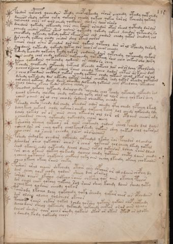

# Voynich Speculative Procedural Protocol — f115r

IMPORTANT: this is NOT a real or validated translation of the Voynich Manuscript. It is a speculative/procedural model that interprets EVA using a user-defined grammar to generate experimental recipes using safe, known edible substitutes.

This file is generated automatically from IVTFF/EVA transliteration plus a user-defined procedural grammar.



## Page / Folio
- currier: B
- folio: f115r
- page_number: 232

## EVA Text (Transliteration)
```text
<@H=2>fc'hhdar qopchol qochedain otedy cheop ol teeedy oroiir oechedy oteedy qotchedy
dcheeos shedy qokeeo qoky qokeeor cheody qokeeo qokeo rorol kcheody qokchy
qol cheol chor od qol chedy qockheos cholor daar oraro
dchedain qokeedy olkeechdy chor chey kchor orchedar otar sheod qoteedy dardyr
ycheedy chedar olkees sheed qodain qoteedy qokedy qokeed lchedar qotchedy ro
cheo ckhdy qotchdy qokedy qokar okeeeosaiin chl chedar chody qotar chedam chd
dar chedy qotchy chedy chedar shey otain chorar
kcheor cheol orair ot chedar lor aiin qokain qoteeol dar ar al opchedy darom
dchedaiin qoteeedy qokeedy qoteo lor cheo r ar cheor cheody
tchedy kechedy qokchey keedy qokor chedaiin dair qotchedy qotcheedy qekor
daiin chedy chol chedy qok[o:a]iin qokcheedy qototeeey rain cheo chkain cho lory
dsheo qokeedaiin qokechdy qodaiin or chol o ro chey
<@H=3>tchedy qoolkeedy qokchedy qotchd lpchedy qotcho lar airorlchy cpholrory
ycheeo rcheeo qo lkain cheey saiin cheedy tcheo lodar chtar as kaiin dam
y cheo lkeodain chcthed qokar chedy qotain chody qotain cheol lkar air om
dshedy qotshedy dar oltedy qotar chodar cheocthy chdy qotor otchdy qotolchd
qol cheey qotchy daiin daiin cheocthy dolkeedy qotaiin chol oteeedchey okeedain
cheol lcheey okcho keedor ykechey chchdy
pcheodain qokchey qotchedy darailchedy polchedy chol pchody qotchedy qofchedy ram
lcheod lkchedy chockhy chedy qokchedy qoky chor al alor cheey qol keo r shey
yches oaiin or al chy cheody rodaiin cheockhy oeeody
psheody chsho tchdy dar chedy okchdar chdor cheedy y@162;hy cheedy qepchey lkam
dchey keey qokeod chody qokcho [s:r] checthy qokeeey keeey lol chedy qokchedy ldy
dcheol qokeol or ar aiin cheey okeeeo or chl lor ol otlaiin cheeor ary
y cheodain cheey qotchedy qokeeody choar cheey
ksheoary otchey qoteeo s ar aiiin chotchdy qodair sheol pchedy dal dalom
ysheeo los ar chey qoky chol kchedshedy qokaiin shey qoetar chol qokaram
cheo chos al saiin cheody llsan arorochees
fshedy shdalky cheedar qopchedy qopchedyd lksho ror pchodar ol chedyo
dsheodar sheo qokecheos cheos r char qokchar qolcheey lkedy qotal
shod ykaiin chdy qotchedy dchol daiin qopol qokair[o:a]r lchea raiin dlchd
sor chey okaiin qokeey qokeedy qoaiin chedy qotaiin chety laiin chedy
y cheey qotaiin chokeeey chckhey qoky aiin cheey lkeedy okohy chokchaiin
cheeo l keeey okeey raiin cheky
posheos aral chaiin shkchedy otais chsi chpchar ar al odaiin chcphy dy
daiin cheey qoek chody qodain sheey dar oranol
sorols cheos lkshey qokcho [r:s]aiin chkshy qos aiin okchey pchar
dor cheol chot qotchy qokchy sol raiin shey kchedy daiin shedy qoty
y chey keey qodain cheody qok[o:a]r
paiinody lkcheo lchy qokchedy qokl sheedy qokar aiir ar opchdain
dar olchy olchey qolcheor okchor
tcheodl raiin chkar qokol lchdy qorshy qokain qokain chep chotchdy
dcheo dain sheol qotchedy qokchedy qokchedy chotar orar oiin olchdy
dcheos shedar qoor cheor shody qokain otar ar otar ytar ar aloky
y dchedy kody qokeedy chols
```

## Domain Context (Heuristic; Not a Translation)

This section summarizes recurring **basewords** in this IVTFF domain and shows simple substring evidence that the token markers used by the procedural grammar occur inside frequent words.

Any Italian anagram / English gloss is a best-effort lexicon match, not a decipherment.


### Associated basewords (non-generic; top by frequency in this domain)
- `daiin` (count=231) → Italian anagram `piani`; English: plans (arrangements)
- `qokaiin` (count=122) → Italian anagram `ciancio`; English: [n/a]
- `okaiin` (count=109) → Italian anagram `coniai`; English: [n/a]
- `qokain` (count=101) → Italian anagram `acconi`; English: [n/a]
- `okain` (count=69) → Italian anagram `acino`; English: a berry
- `otain` (count=53) → Italian anagram `anito`; English: [n/a]
- `qokar` (count=48) → Italian anagram `carco`; English: [n/a]
- `saiin` (count=46) → Italian anagram `asini`; English: [n/a]
- `qokal` (count=43) → Italian anagram `calco`; English: cast (of sculpture)
- `qotaiin` (count=40) → Italian anagram `cationi`; English: [n/a]
- `lkaiin` (count=39) → Italian anagram `ancili`; English: [n/a]
- `kaiin` (count=37) → Italian anagram `acini`; English: [n/a]
- `qokeol` (count=37) → Italian anagram `eccolo`; English: [n/a]
- `qotain` (count=34) → Italian anagram `antico`; English: ancient
- `qotar` (count=29) → Italian anagram `corta`; English: [n/a]

### Marker evidence (substring in frequent basewords)
- `qo`: 60 basewords; examples: `qokeey`, `qokeedy`, `qokaiin`, `qokain`, `qokedy`, `qokey`
- `q`: 61 basewords; examples: `qokeey`, `qokeedy`, `qokaiin`, `qokain`, `qokedy`, `qokey`
- `o`: 262 basewords; examples: `qokeey`, `ol`, `o`, `qokeedy`, `okeey`, `qokaiin`
- `k`: 147 basewords; examples: `qokeey`, `qokeedy`, `okeey`, `qokaiin`, `okaiin`, `qokain`
- `t`: 102 basewords; examples: `otaiin`, `oteey`, `otar`, `otedy`, `otal`, `oteedy`
- `p`: 17 basewords; examples: `opchedy`, `qopchedy`, `opchey`, `pchedy`, `qopchdy`, `opchdy`
- `ch`: 137 basewords; examples: `chedy`, `chey`, `chol`, `cheey`, `cheol`, `cheody`
- `sh`: 50 basewords; examples: `shedy`, `shey`, `sheey`, `sheol`, `shol`, `sheedy`
- `f`: 1 basewords; examples: `f`
- `cth`: 16 basewords; examples: `chcthy`, `cthey`, `shcthy`, `checthy`, `cthol`, `ctheey`
- `ckh`: 15 basewords; examples: `chckhy`, `shckhy`, `checkhy`, `chckhey`, `chockhy`, `sheckhy`
- `cph`: 2 basewords; examples: `cphol`, `cphy`
- `dy`: 84 basewords; examples: `chedy`, `qokeedy`, `shedy`, `otedy`, `oteedy`, `qokedy`
- `iin`: 39 basewords; examples: `aiin`, `daiin`, `qokaiin`, `okaiin`, `otaiin`, `saiin`
- `aiin`: 33 basewords; examples: `aiin`, `daiin`, `qokaiin`, `okaiin`, `otaiin`, `saiin`

## Recipes Index (This Page)
- [f115r.1,@P0](#f115r-1-f115r-1-p0)
- [f115r.2,+P0](#f115r-2-f115r-2-p0)
- [f115r.3,+P0](#f115r-3-f115r-3-p0)
- [f115r.4,+P0](#f115r-4-f115r-4-p0)
- [f115r.5,+P0](#f115r-5-f115r-5-p0)
- [f115r.6,+P0](#f115r-6-f115r-6-p0)
- [f115r.7,+P0](#f115r-7-f115r-7-p0)
- [f115r.8,+P0](#f115r-8-f115r-8-p0)
- [f115r.9,+P0](#f115r-9-f115r-9-p0)
- [f115r.10,+P0](#f115r-10-f115r-10-p0)
- [f115r.11,+P0](#f115r-11-f115r-11-p0)
- [f115r.12,+P0](#f115r-12-f115r-12-p0)
- [f115r.13,+P0](#f115r-13-f115r-13-p0)
- [f115r.14,+P0](#f115r-14-f115r-14-p0)
- [f115r.15,+P0](#f115r-15-f115r-15-p0)
- [f115r.16,+P0](#f115r-16-f115r-16-p0)
- [f115r.17,+P0](#f115r-17-f115r-17-p0)
- [f115r.18,+P0](#f115r-18-f115r-18-p0)
- [f115r.19,+P0](#f115r-19-f115r-19-p0)
- [f115r.20,+P0](#f115r-20-f115r-20-p0)
- [f115r.21,+P0](#f115r-21-f115r-21-p0)
- [f115r.22,+P0](#f115r-22-f115r-22-p0)
- [f115r.23,+P0](#f115r-23-f115r-23-p0)
- [f115r.24,+P0](#f115r-24-f115r-24-p0)
- [f115r.25,+P0](#f115r-25-f115r-25-p0)
- [f115r.26,+P0](#f115r-26-f115r-26-p0)
- [f115r.27,+P0](#f115r-27-f115r-27-p0)
- [f115r.28,+P0](#f115r-28-f115r-28-p0)
- [f115r.29,+P0](#f115r-29-f115r-29-p0)
- [f115r.30,+P0](#f115r-30-f115r-30-p0)
- [f115r.31,+P0](#f115r-31-f115r-31-p0)
- [f115r.32,+P0](#f115r-32-f115r-32-p0)
- [f115r.33,+P0](#f115r-33-f115r-33-p0)
- [f115r.34,+P0](#f115r-34-f115r-34-p0)
- [f115r.35,+P0](#f115r-35-f115r-35-p0)
- [f115r.36,+P0](#f115r-36-f115r-36-p0)
- [f115r.37,+P0](#f115r-37-f115r-37-p0)
- [f115r.38,+P0](#f115r-38-f115r-38-p0)
- [f115r.39,+P0](#f115r-39-f115r-39-p0)
- [f115r.40,+P0](#f115r-40-f115r-40-p0)
- [f115r.41,+P0](#f115r-41-f115r-41-p0)
- [f115r.42,+P0](#f115r-42-f115r-42-p0)
- [f115r.43,+P0](#f115r-43-f115r-43-p0)
- [f115r.44,+P0](#f115r-44-f115r-44-p0)
- [f115r.45,+P0](#f115r-45-f115r-45-p0)

## Line Glosses (Procedural Gloss Only; Not a Translation)

<a id="f115r-1-f115r-1-p0"></a>

### f115r.1,@P0

EVA: <@H=2>fc'hhdar qopchol qochedain otedy cheop ol teeedy oroiir oechedy oteedy qotchedy

Direct Gloss (Procedural, Not a Real Translation):
- H: tokens: h → unmodeled_tokens: h
- fc: tokens: f c
- hhdar: tokens: h h p a r → connectors: r → vowel_run: a (level 1; class a) → unmodeled_tokens: h
- qopchol: tokens: qo p ch o l → connectors: l
- qochedain: tokens: qo ch e p a i n → connectors: n → vowel_run: e (level 1; class e)
- otedy: tokens: o t e p → vowel_run: e (level 1; class e)
- cheop: tokens: ch e o p → vowel_run: e (level 1; class e)
- ol: tokens: o l → connectors: l
- teeedy: tokens: t eee p → vowel_run: eee (level 3; class e)
- oroiir: tokens: o r o ii r → connectors: r r → vowel_run: ii (level 2; class i)
- oechedy: tokens: o e ch e p → vowel_run: e (level 1; class e)
- oteedy: tokens: o t ee p → vowel_run: ee (level 2; class e)
- qotchedy: tokens: qo t ch e p → vowel_run: e (level 1; class e)

<a id="f115r-2-f115r-2-p0"></a>

### f115r.2,+P0

EVA: dcheeos shedy qokeeo qoky qokeeor cheody qokeeo qokeo rorol kcheody qokchy

Direct Gloss (Procedural, Not a Real Translation):
- dcheeos: tokens: p ch ee o s → connectors: s → vowel_run: ee (level 2; class e)
- shedy: tokens: sh e p → vowel_run: e (level 1; class e)
- qokeeo: tokens: qo k ee o → vowel_run: ee (level 2; class e)
- qoky: tokens: qo k
- qokeeor: tokens: qo k ee o r → connectors: r → vowel_run: ee (level 2; class e)
- cheody: tokens: ch e o p → vowel_run: e (level 1; class e)
- qokeeo: tokens: qo k ee o → vowel_run: ee (level 2; class e)
- qokeo: tokens: qo k e o → vowel_run: e (level 1; class e)
- rorol: tokens: r o r o l → connectors: r r l
- kcheody: tokens: k ch e o p → vowel_run: e (level 1; class e)
- qokchy: tokens: qo k ch

<a id="f115r-3-f115r-3-p0"></a>

### f115r.3,+P0

EVA: qol cheol chor od qol chedy qockheos cholor daar oraro

Direct Gloss (Procedural, Not a Real Translation):
- qol: tokens: qo l → connectors: l
- cheol: tokens: ch e o l → connectors: l → vowel_run: e (level 1; class e)
- chor: tokens: ch o r → connectors: r
- od: tokens: o p
- qol: tokens: qo l → connectors: l
- chedy: tokens: ch e p → vowel_run: e (level 1; class e)
- qockheos: tokens: qo ckh e o s → connectors: s → vowel_run: e (level 1; class e)
- cholor: tokens: ch o l o r → connectors: l r
- daar: tokens: p a a r → connectors: r → vowel_run: aa (level 2; class a)
- oraro: tokens: o r a r o → connectors: r r → vowel_run: a (level 1; class a)

<a id="f115r-4-f115r-4-p0"></a>

### f115r.4,+P0

EVA: dchedain qokeedy olkeechdy chor chey kchor orchedar otar sheod qoteedy dardyr

Direct Gloss (Procedural, Not a Real Translation):
- dchedain: tokens: p ch e p a i n → connectors: n → vowel_run: e (level 1; class e)
- qokeedy: tokens: qo k ee p → vowel_run: ee (level 2; class e)
- olkeechdy: tokens: o l k ee ch p → connectors: l → vowel_run: ee (level 2; class e)
- chor: tokens: ch o r → connectors: r
- chey: tokens: ch e → vowel_run: e (level 1; class e)
- kchor: tokens: k ch o r → connectors: r
- orchedar: tokens: o r ch e p a r → connectors: r r → vowel_run: e (level 1; class e)
- otar: tokens: o t a r → connectors: r → vowel_run: a (level 1; class a)
- sheod: tokens: sh e o p → vowel_run: e (level 1; class e)
- qoteedy: tokens: qo t ee p → vowel_run: ee (level 2; class e)
- dardyr: tokens: p a r p r → connectors: r r → vowel_run: a (level 1; class a)

<a id="f115r-5-f115r-5-p0"></a>

### f115r.5,+P0

EVA: ycheedy chedar olkees sheed qodain qoteedy qokedy qokeed lchedar qotchedy ro

Direct Gloss (Procedural, Not a Real Translation):
- ycheedy: tokens: ch ee p → vowel_run: ee (level 2; class e)
- chedar: tokens: ch e p a r → connectors: r → vowel_run: e (level 1; class e)
- olkees: tokens: o l k ee s → connectors: l s → vowel_run: ee (level 2; class e)
- sheed: tokens: sh ee p → vowel_run: ee (level 2; class e)
- qodain: tokens: qo p a i n → connectors: n → vowel_run: a (level 1; class a)
- qoteedy: tokens: qo t ee p → vowel_run: ee (level 2; class e)
- qokedy: tokens: qo k e p → vowel_run: e (level 1; class e)
- qokeed: tokens: qo k ee p → vowel_run: ee (level 2; class e)
- lchedar: tokens: l ch e p a r → connectors: l r → vowel_run: e (level 1; class e)
- qotchedy: tokens: qo t ch e p → vowel_run: e (level 1; class e)
- ro: tokens: r o → connectors: r

<a id="f115r-6-f115r-6-p0"></a>

### f115r.6,+P0

EVA: cheo ckhdy qotchdy qokedy qokar okeeeosaiin chl chedar chody qotar chedam chd

Direct Gloss (Procedural, Not a Real Translation):
- cheo: tokens: ch e o → vowel_run: e (level 1; class e)
- ckhdy: tokens: ckh p
- qotchdy: tokens: qo t ch p
- qokedy: tokens: qo k e p → vowel_run: e (level 1; class e)
- qokar: tokens: qo k a r → connectors: r → vowel_run: a (level 1; class a)
- okeeeosaiin: tokens: o k eee o s aiin → connectors: s → vowel_run: eee (level 3; class e) → suffix: aiin
- chl: tokens: ch l → connectors: l
- chedar: tokens: ch e p a r → connectors: r → vowel_run: e (level 1; class e)
- chody: tokens: ch o p
- qotar: tokens: qo t a r → connectors: r → vowel_run: a (level 1; class a)
- chedam: tokens: ch e p a m → connectors: m → vowel_run: e (level 1; class e)
- chd: tokens: ch p

<a id="f115r-7-f115r-7-p0"></a>

### f115r.7,+P0

EVA: dar chedy qotchy chedy chedar shey otain chorar

Direct Gloss (Procedural, Not a Real Translation):
- dar: tokens: p a r → connectors: r → vowel_run: a (level 1; class a)
- chedy: tokens: ch e p → vowel_run: e (level 1; class e)
- qotchy: tokens: qo t ch
- chedy: tokens: ch e p → vowel_run: e (level 1; class e)
- chedar: tokens: ch e p a r → connectors: r → vowel_run: e (level 1; class e)
- shey: tokens: sh e → vowel_run: e (level 1; class e)
- otain: tokens: o t a i n → connectors: n → vowel_run: a (level 1; class a)
- chorar: tokens: ch o r a r → connectors: r r → vowel_run: a (level 1; class a)

<a id="f115r-8-f115r-8-p0"></a>

### f115r.8,+P0

EVA: kcheor cheol orair ot chedar lor aiin qokain qoteeol dar ar al opchedy darom

Direct Gloss (Procedural, Not a Real Translation):
- kcheor: tokens: k ch e o r → connectors: r → vowel_run: e (level 1; class e)
- cheol: tokens: ch e o l → connectors: l → vowel_run: e (level 1; class e)
- orair: tokens: o r a i r → connectors: r r → vowel_run: a (level 1; class a)
- ot: tokens: o t
- chedar: tokens: ch e p a r → connectors: r → vowel_run: e (level 1; class e)
- lor: tokens: l o r → connectors: l r
- aiin: tokens: aiin → vowel_run: a (level 1; class a) → suffix: aiin
- qokain: tokens: qo k a i n → connectors: n → vowel_run: a (level 1; class a)
- qoteeol: tokens: qo t ee o l → connectors: l → vowel_run: ee (level 2; class e)
- dar: tokens: p a r → connectors: r → vowel_run: a (level 1; class a)
- ar: tokens: a r → connectors: r → vowel_run: a (level 1; class a)
- al: tokens: a l → connectors: l → vowel_run: a (level 1; class a)
- opchedy: tokens: o p ch e p → vowel_run: e (level 1; class e)
- darom: tokens: p a r o m → connectors: r m → vowel_run: a (level 1; class a)

<a id="f115r-9-f115r-9-p0"></a>

### f115r.9,+P0

EVA: dchedaiin qoteeedy qokeedy qoteo lor cheo r ar cheor cheody

Direct Gloss (Procedural, Not a Real Translation):
- dchedaiin: tokens: p ch e p aiin → vowel_run: e (level 1; class e) → suffix: aiin
- qoteeedy: tokens: qo t eee p → vowel_run: eee (level 3; class e)
- qokeedy: tokens: qo k ee p → vowel_run: ee (level 2; class e)
- qoteo: tokens: qo t e o → vowel_run: e (level 1; class e)
- lor: tokens: l o r → connectors: l r
- cheo: tokens: ch e o → vowel_run: e (level 1; class e)
- r: tokens: r → connectors: r
- ar: tokens: a r → connectors: r → vowel_run: a (level 1; class a)
- cheor: tokens: ch e o r → connectors: r → vowel_run: e (level 1; class e)
- cheody: tokens: ch e o p → vowel_run: e (level 1; class e)

<a id="f115r-10-f115r-10-p0"></a>

### f115r.10,+P0

EVA: tchedy kechedy qokchey keedy qokor chedaiin dair qotchedy qotcheedy qekor

Direct Gloss (Procedural, Not a Real Translation):
- tchedy: tokens: t ch e p → vowel_run: e (level 1; class e)
- kechedy: tokens: k e ch e p → vowel_run: e (level 1; class e)
- qokchey: tokens: qo k ch e → vowel_run: e (level 1; class e)
- keedy: tokens: k ee p → vowel_run: ee (level 2; class e)
- qokor: tokens: qo k o r → connectors: r
- chedaiin: tokens: ch e p aiin → vowel_run: e (level 1; class e) → suffix: aiin
- dair: tokens: p a i r → connectors: r → vowel_run: a (level 1; class a)
- qotchedy: tokens: qo t ch e p → vowel_run: e (level 1; class e)
- qotcheedy: tokens: qo t ch ee p → vowel_run: ee (level 2; class e)
- qekor: tokens: q e k o r → connectors: r → vowel_run: e (level 1; class e)

<a id="f115r-11-f115r-11-p0"></a>

### f115r.11,+P0

EVA: daiin chedy chol chedy qok[o:a]iin qokcheedy qototeeey rain cheo chkain cho lory

Direct Gloss (Procedural, Not a Real Translation):
- daiin: tokens: p aiin → vowel_run: a (level 1; class a) → suffix: aiin
- chedy: tokens: ch e p → vowel_run: e (level 1; class e)
- chol: tokens: ch o l → connectors: l
- chedy: tokens: ch e p → vowel_run: e (level 1; class e)
- qok: tokens: qo k
- o: tokens: o
- a: tokens: a → vowel_run: a (level 1; class a)
- iin: tokens: iin → vowel_run: ii (level 2; class i) → suffix: iin
- qokcheedy: tokens: qo k ch ee p → vowel_run: ee (level 2; class e)
- qototeeey: tokens: qo t o t eee → vowel_run: eee (level 3; class e)
- rain: tokens: r a i n → connectors: r n → vowel_run: a (level 1; class a)
- cheo: tokens: ch e o → vowel_run: e (level 1; class e)
- chkain: tokens: ch k a i n → connectors: n → vowel_run: a (level 1; class a)
- cho: tokens: ch o
- lory: tokens: l o r → connectors: l r

<a id="f115r-12-f115r-12-p0"></a>

### f115r.12,+P0

EVA: dsheo qokeedaiin qokechdy qodaiin or chol o ro chey

Direct Gloss (Procedural, Not a Real Translation):
- dsheo: tokens: p sh e o → vowel_run: e (level 1; class e)
- qokeedaiin: tokens: qo k ee p aiin → vowel_run: ee (level 2; class e) → suffix: aiin
- qokechdy: tokens: qo k e ch p → vowel_run: e (level 1; class e)
- qodaiin: tokens: qo p aiin → vowel_run: a (level 1; class a) → suffix: aiin
- or: tokens: o r → connectors: r
- chol: tokens: ch o l → connectors: l
- o: tokens: o
- ro: tokens: r o → connectors: r
- chey: tokens: ch e → vowel_run: e (level 1; class e)

<a id="f115r-13-f115r-13-p0"></a>

### f115r.13,+P0

EVA: <@H=3>tchedy qoolkeedy qokchedy qotchd lpchedy qotcho lar airorlchy cpholrory

Direct Gloss (Procedural, Not a Real Translation):
- H: tokens: h → unmodeled_tokens: h
- tchedy: tokens: t ch e p → vowel_run: e (level 1; class e)
- qoolkeedy: tokens: qo o l k ee p → connectors: l → vowel_run: ee (level 2; class e)
- qokchedy: tokens: qo k ch e p → vowel_run: e (level 1; class e)
- qotchd: tokens: qo t ch p
- lpchedy: tokens: l p ch e p → connectors: l → vowel_run: e (level 1; class e)
- qotcho: tokens: qo t ch o
- lar: tokens: l a r → connectors: l r → vowel_run: a (level 1; class a)
- airorlchy: tokens: a i r o r l ch → connectors: r r l → vowel_run: a (level 1; class a)
- cpholrory: tokens: cph o l r o r → connectors: l r r

<a id="f115r-14-f115r-14-p0"></a>

### f115r.14,+P0

EVA: ycheeo rcheeo qo lkain cheey saiin cheedy tcheo lodar chtar as kaiin dam

Direct Gloss (Procedural, Not a Real Translation):
- ycheeo: tokens: ch ee o → vowel_run: ee (level 2; class e)
- rcheeo: tokens: r ch ee o → connectors: r → vowel_run: ee (level 2; class e)
- qo: tokens: qo
- lkain: tokens: l k a i n → connectors: l n → vowel_run: a (level 1; class a)
- cheey: tokens: ch ee → vowel_run: ee (level 2; class e)
- saiin: tokens: s aiin → connectors: s → vowel_run: a (level 1; class a) → suffix: aiin
- cheedy: tokens: ch ee p → vowel_run: ee (level 2; class e)
- tcheo: tokens: t ch e o → vowel_run: e (level 1; class e)
- lodar: tokens: l o p a r → connectors: l r → vowel_run: a (level 1; class a)
- chtar: tokens: ch t a r → connectors: r → vowel_run: a (level 1; class a)
- as: tokens: a s → connectors: s → vowel_run: a (level 1; class a)
- kaiin: tokens: k aiin → vowel_run: a (level 1; class a) → suffix: aiin
- dam: tokens: p a m → connectors: m → vowel_run: a (level 1; class a)

<a id="f115r-15-f115r-15-p0"></a>

### f115r.15,+P0

EVA: y cheo lkeodain chcthed qokar chedy qotain chody qotain cheol lkar air om

Direct Gloss (Procedural, Not a Real Translation):
- y: [unparsed]
- cheo: tokens: ch e o → vowel_run: e (level 1; class e)
- lkeodain: tokens: l k e o p a i n → connectors: l n → vowel_run: e (level 1; class e)
- chcthed: tokens: ch cth e p → vowel_run: e (level 1; class e)
- qokar: tokens: qo k a r → connectors: r → vowel_run: a (level 1; class a)
- chedy: tokens: ch e p → vowel_run: e (level 1; class e)
- qotain: tokens: qo t a i n → connectors: n → vowel_run: a (level 1; class a)
- chody: tokens: ch o p
- qotain: tokens: qo t a i n → connectors: n → vowel_run: a (level 1; class a)
- cheol: tokens: ch e o l → connectors: l → vowel_run: e (level 1; class e)
- lkar: tokens: l k a r → connectors: l r → vowel_run: a (level 1; class a)
- air: tokens: a i r → connectors: r → vowel_run: a (level 1; class a)
- om: tokens: o m → connectors: m

<a id="f115r-16-f115r-16-p0"></a>

### f115r.16,+P0

EVA: dshedy qotshedy dar oltedy qotar chodar cheocthy chdy qotor otchdy qotolchd

Direct Gloss (Procedural, Not a Real Translation):
- dshedy: tokens: p sh e p → vowel_run: e (level 1; class e)
- qotshedy: tokens: qo t sh e p → vowel_run: e (level 1; class e)
- dar: tokens: p a r → connectors: r → vowel_run: a (level 1; class a)
- oltedy: tokens: o l t e p → connectors: l → vowel_run: e (level 1; class e)
- qotar: tokens: qo t a r → connectors: r → vowel_run: a (level 1; class a)
- chodar: tokens: ch o p a r → connectors: r → vowel_run: a (level 1; class a)
- cheocthy: tokens: ch e o cth → vowel_run: e (level 1; class e)
- chdy: tokens: ch p
- qotor: tokens: qo t o r → connectors: r
- otchdy: tokens: o t ch p
- qotolchd: tokens: qo t o l ch p → connectors: l

<a id="f115r-17-f115r-17-p0"></a>

### f115r.17,+P0

EVA: qol cheey qotchy daiin daiin cheocthy dolkeedy qotaiin chol oteeedchey okeedain

Direct Gloss (Procedural, Not a Real Translation):
- qol: tokens: qo l → connectors: l
- cheey: tokens: ch ee → vowel_run: ee (level 2; class e)
- qotchy: tokens: qo t ch
- daiin: tokens: p aiin → vowel_run: a (level 1; class a) → suffix: aiin
- daiin: tokens: p aiin → vowel_run: a (level 1; class a) → suffix: aiin
- cheocthy: tokens: ch e o cth → vowel_run: e (level 1; class e)
- dolkeedy: tokens: p o l k ee p → connectors: l → vowel_run: ee (level 2; class e)
- qotaiin: tokens: qo t aiin → vowel_run: a (level 1; class a) → suffix: aiin
- chol: tokens: ch o l → connectors: l
- oteeedchey: tokens: o t eee p ch e → vowel_run: eee (level 3; class e)
- okeedain: tokens: o k ee p a i n → connectors: n → vowel_run: ee (level 2; class e)

<a id="f115r-18-f115r-18-p0"></a>

### f115r.18,+P0

EVA: cheol lcheey okcho keedor ykechey chchdy

Direct Gloss (Procedural, Not a Real Translation):
- cheol: tokens: ch e o l → connectors: l → vowel_run: e (level 1; class e)
- lcheey: tokens: l ch ee → connectors: l → vowel_run: ee (level 2; class e)
- okcho: tokens: o k ch o
- keedor: tokens: k ee p o r → connectors: r → vowel_run: ee (level 2; class e)
- ykechey: tokens: k e ch e → vowel_run: e (level 1; class e)
- chchdy: tokens: ch ch p

<a id="f115r-19-f115r-19-p0"></a>

### f115r.19,+P0

EVA: pcheodain qokchey qotchedy darailchedy polchedy chol pchody qotchedy qofchedy ram

Direct Gloss (Procedural, Not a Real Translation):
- pcheodain: tokens: p ch e o p a i n → connectors: n → vowel_run: e (level 1; class e)
- qokchey: tokens: qo k ch e → vowel_run: e (level 1; class e)
- qotchedy: tokens: qo t ch e p → vowel_run: e (level 1; class e)
- darailchedy: tokens: p a r a i l ch e p → connectors: r l → vowel_run: a (level 1; class a)
- polchedy: tokens: p o l ch e p → connectors: l → vowel_run: e (level 1; class e)
- chol: tokens: ch o l → connectors: l
- pchody: tokens: p ch o p
- qotchedy: tokens: qo t ch e p → vowel_run: e (level 1; class e)
- qofchedy: tokens: qo f ch e p → vowel_run: e (level 1; class e)
- ram: tokens: r a m → connectors: r m → vowel_run: a (level 1; class a)

<a id="f115r-20-f115r-20-p0"></a>

### f115r.20,+P0

EVA: lcheod lkchedy chockhy chedy qokchedy qoky chor al alor cheey qol keo r shey

Direct Gloss (Procedural, Not a Real Translation):
- lcheod: tokens: l ch e o p → connectors: l → vowel_run: e (level 1; class e)
- lkchedy: tokens: l k ch e p → connectors: l → vowel_run: e (level 1; class e)
- chockhy: tokens: ch o ckh
- chedy: tokens: ch e p → vowel_run: e (level 1; class e)
- qokchedy: tokens: qo k ch e p → vowel_run: e (level 1; class e)
- qoky: tokens: qo k
- chor: tokens: ch o r → connectors: r
- al: tokens: a l → connectors: l → vowel_run: a (level 1; class a)
- alor: tokens: a l o r → connectors: l r → vowel_run: a (level 1; class a)
- cheey: tokens: ch ee → vowel_run: ee (level 2; class e)
- qol: tokens: qo l → connectors: l
- keo: tokens: k e o → vowel_run: e (level 1; class e)
- r: tokens: r → connectors: r
- shey: tokens: sh e → vowel_run: e (level 1; class e)

<a id="f115r-21-f115r-21-p0"></a>

### f115r.21,+P0

EVA: yches oaiin or al chy cheody rodaiin cheockhy oeeody

Direct Gloss (Procedural, Not a Real Translation):
- yches: tokens: ch e s → connectors: s → vowel_run: e (level 1; class e)
- oaiin: tokens: o aiin → vowel_run: a (level 1; class a) → suffix: aiin
- or: tokens: o r → connectors: r
- al: tokens: a l → connectors: l → vowel_run: a (level 1; class a)
- chy: tokens: ch
- cheody: tokens: ch e o p → vowel_run: e (level 1; class e)
- rodaiin: tokens: r o p aiin → connectors: r → vowel_run: a (level 1; class a) → suffix: aiin
- cheockhy: tokens: ch e o ckh → vowel_run: e (level 1; class e)
- oeeody: tokens: o ee o p → vowel_run: ee (level 2; class e)

<a id="f115r-22-f115r-22-p0"></a>

### f115r.22,+P0

EVA: psheody chsho tchdy dar chedy okchdar chdor cheedy y@162;hy cheedy qepchey lkam

Direct Gloss (Procedural, Not a Real Translation):
- psheody: tokens: p sh e o p → vowel_run: e (level 1; class e)
- chsho: tokens: ch sh o
- tchdy: tokens: t ch p
- dar: tokens: p a r → connectors: r → vowel_run: a (level 1; class a)
- chedy: tokens: ch e p → vowel_run: e (level 1; class e)
- okchdar: tokens: o k ch p a r → connectors: r → vowel_run: a (level 1; class a)
- chdor: tokens: ch p o r → connectors: r
- cheedy: tokens: ch ee p → vowel_run: ee (level 2; class e)
- y: [unparsed]
- hy: tokens: h → unmodeled_tokens: h
- cheedy: tokens: ch ee p → vowel_run: ee (level 2; class e)
- qepchey: tokens: q e p ch e → vowel_run: e (level 1; class e)
- lkam: tokens: l k a m → connectors: l m → vowel_run: a (level 1; class a)

<a id="f115r-23-f115r-23-p0"></a>

### f115r.23,+P0

EVA: dchey keey qokeod chody qokcho [s:r] checthy qokeeey keeey lol chedy qokchedy ldy

Direct Gloss (Procedural, Not a Real Translation):
- dchey: tokens: p ch e → vowel_run: e (level 1; class e)
- keey: tokens: k ee → vowel_run: ee (level 2; class e)
- qokeod: tokens: qo k e o p → vowel_run: e (level 1; class e)
- chody: tokens: ch o p
- qokcho: tokens: qo k ch o
- s: tokens: s → connectors: s
- r: tokens: r → connectors: r
- checthy: tokens: ch e cth → vowel_run: e (level 1; class e)
- qokeeey: tokens: qo k eee → vowel_run: eee (level 3; class e)
- keeey: tokens: k eee → vowel_run: eee (level 3; class e)
- lol: tokens: l o l → connectors: l l
- chedy: tokens: ch e p → vowel_run: e (level 1; class e)
- qokchedy: tokens: qo k ch e p → vowel_run: e (level 1; class e)
- ldy: tokens: l p → connectors: l

<a id="f115r-24-f115r-24-p0"></a>

### f115r.24,+P0

EVA: dcheol qokeol or ar aiin cheey okeeeo or chl lor ol otlaiin cheeor ary

Direct Gloss (Procedural, Not a Real Translation):
- dcheol: tokens: p ch e o l → connectors: l → vowel_run: e (level 1; class e)
- qokeol: tokens: qo k e o l → connectors: l → vowel_run: e (level 1; class e)
- or: tokens: o r → connectors: r
- ar: tokens: a r → connectors: r → vowel_run: a (level 1; class a)
- aiin: tokens: aiin → vowel_run: a (level 1; class a) → suffix: aiin
- cheey: tokens: ch ee → vowel_run: ee (level 2; class e)
- okeeeo: tokens: o k eee o → vowel_run: eee (level 3; class e)
- or: tokens: o r → connectors: r
- chl: tokens: ch l → connectors: l
- lor: tokens: l o r → connectors: l r
- ol: tokens: o l → connectors: l
- otlaiin: tokens: o t l aiin → connectors: l → vowel_run: a (level 1; class a) → suffix: aiin
- cheeor: tokens: ch ee o r → connectors: r → vowel_run: ee (level 2; class e)
- ary: tokens: a r → connectors: r → vowel_run: a (level 1; class a)

<a id="f115r-25-f115r-25-p0"></a>

### f115r.25,+P0

EVA: y cheodain cheey qotchedy qokeeody choar cheey

Direct Gloss (Procedural, Not a Real Translation):
- y: [unparsed]
- cheodain: tokens: ch e o p a i n → connectors: n → vowel_run: e (level 1; class e)
- cheey: tokens: ch ee → vowel_run: ee (level 2; class e)
- qotchedy: tokens: qo t ch e p → vowel_run: e (level 1; class e)
- qokeeody: tokens: qo k ee o p → vowel_run: ee (level 2; class e)
- choar: tokens: ch o a r → connectors: r → vowel_run: a (level 1; class a)
- cheey: tokens: ch ee → vowel_run: ee (level 2; class e)

<a id="f115r-26-f115r-26-p0"></a>

### f115r.26,+P0

EVA: ksheoary otchey qoteeo s ar aiiin chotchdy qodair sheol pchedy dal dalom

Direct Gloss (Procedural, Not a Real Translation):
- ksheoary: tokens: k sh e o a r → connectors: r → vowel_run: e (level 1; class e)
- otchey: tokens: o t ch e → vowel_run: e (level 1; class e)
- qoteeo: tokens: qo t ee o → vowel_run: ee (level 2; class e)
- s: tokens: s → connectors: s
- ar: tokens: a r → connectors: r → vowel_run: a (level 1; class a)
- aiiin: tokens: a iii n → connectors: n → vowel_run: a (level 1; class a) → suffix: iin
- chotchdy: tokens: ch o t ch p
- qodair: tokens: qo p a i r → connectors: r → vowel_run: a (level 1; class a)
- sheol: tokens: sh e o l → connectors: l → vowel_run: e (level 1; class e)
- pchedy: tokens: p ch e p → vowel_run: e (level 1; class e)
- dal: tokens: p a l → connectors: l → vowel_run: a (level 1; class a)
- dalom: tokens: p a l o m → connectors: l m → vowel_run: a (level 1; class a)

<a id="f115r-27-f115r-27-p0"></a>

### f115r.27,+P0

EVA: ysheeo los ar chey qoky chol kchedshedy qokaiin shey qoetar chol qokaram

Direct Gloss (Procedural, Not a Real Translation):
- ysheeo: tokens: sh ee o → vowel_run: ee (level 2; class e)
- los: tokens: l o s → connectors: l s
- ar: tokens: a r → connectors: r → vowel_run: a (level 1; class a)
- chey: tokens: ch e → vowel_run: e (level 1; class e)
- qoky: tokens: qo k
- chol: tokens: ch o l → connectors: l
- kchedshedy: tokens: k ch e p sh e p → vowel_run: e (level 1; class e)
- qokaiin: tokens: qo k aiin → vowel_run: a (level 1; class a) → suffix: aiin
- shey: tokens: sh e → vowel_run: e (level 1; class e)
- qoetar: tokens: qo e t a r → connectors: r → vowel_run: e (level 1; class e)
- chol: tokens: ch o l → connectors: l
- qokaram: tokens: qo k a r a m → connectors: r m → vowel_run: a (level 1; class a)

<a id="f115r-28-f115r-28-p0"></a>

### f115r.28,+P0

EVA: cheo chos al saiin cheody llsan arorochees

Direct Gloss (Procedural, Not a Real Translation):
- cheo: tokens: ch e o → vowel_run: e (level 1; class e)
- chos: tokens: ch o s → connectors: s
- al: tokens: a l → connectors: l → vowel_run: a (level 1; class a)
- saiin: tokens: s aiin → connectors: s → vowel_run: a (level 1; class a) → suffix: aiin
- cheody: tokens: ch e o p → vowel_run: e (level 1; class e)
- llsan: tokens: l l s a n → connectors: l l s n → vowel_run: a (level 1; class a)
- arorochees: tokens: a r o r o ch ee s → connectors: r r s → vowel_run: a (level 1; class a)

<a id="f115r-29-f115r-29-p0"></a>

### f115r.29,+P0

EVA: fshedy shdalky cheedar qopchedy qopchedyd lksho ror pchodar ol chedyo

Direct Gloss (Procedural, Not a Real Translation):
- fshedy: tokens: f sh e p → vowel_run: e (level 1; class e)
- shdalky: tokens: sh p a l k → connectors: l → vowel_run: a (level 1; class a)
- cheedar: tokens: ch ee p a r → connectors: r → vowel_run: ee (level 2; class e)
- qopchedy: tokens: qo p ch e p → vowel_run: e (level 1; class e)
- qopchedyd: tokens: qo p ch e p p → vowel_run: e (level 1; class e)
- lksho: tokens: l k sh o → connectors: l
- ror: tokens: r o r → connectors: r r
- pchodar: tokens: p ch o p a r → connectors: r → vowel_run: a (level 1; class a)
- ol: tokens: o l → connectors: l
- chedyo: tokens: ch e p o → vowel_run: e (level 1; class e)

<a id="f115r-30-f115r-30-p0"></a>

### f115r.30,+P0

EVA: dsheodar sheo qokecheos cheos r char qokchar qolcheey lkedy qotal

Direct Gloss (Procedural, Not a Real Translation):
- dsheodar: tokens: p sh e o p a r → connectors: r → vowel_run: e (level 1; class e)
- sheo: tokens: sh e o → vowel_run: e (level 1; class e)
- qokecheos: tokens: qo k e ch e o s → connectors: s → vowel_run: e (level 1; class e)
- cheos: tokens: ch e o s → connectors: s → vowel_run: e (level 1; class e)
- r: tokens: r → connectors: r
- char: tokens: ch a r → connectors: r → vowel_run: a (level 1; class a)
- qokchar: tokens: qo k ch a r → connectors: r → vowel_run: a (level 1; class a)
- qolcheey: tokens: qo l ch ee → connectors: l → vowel_run: ee (level 2; class e)
- lkedy: tokens: l k e p → connectors: l → vowel_run: e (level 1; class e)
- qotal: tokens: qo t a l → connectors: l → vowel_run: a (level 1; class a)

<a id="f115r-31-f115r-31-p0"></a>

### f115r.31,+P0

EVA: shod ykaiin chdy qotchedy dchol daiin qopol qokair[o:a]r lchea raiin dlchd

Direct Gloss (Procedural, Not a Real Translation):
- shod: tokens: sh o p
- ykaiin: tokens: k aiin → vowel_run: a (level 1; class a) → suffix: aiin
- chdy: tokens: ch p
- qotchedy: tokens: qo t ch e p → vowel_run: e (level 1; class e)
- dchol: tokens: p ch o l → connectors: l
- daiin: tokens: p aiin → vowel_run: a (level 1; class a) → suffix: aiin
- qopol: tokens: qo p o l → connectors: l
- qokair: tokens: qo k a i r → connectors: r → vowel_run: a (level 1; class a)
- o: tokens: o
- a: tokens: a → vowel_run: a (level 1; class a)
- r: tokens: r → connectors: r
- lchea: tokens: l ch e a → connectors: l → vowel_run: e (level 1; class e)
- raiin: tokens: r aiin → connectors: r → vowel_run: a (level 1; class a) → suffix: aiin
- dlchd: tokens: p l ch p → connectors: l

<a id="f115r-32-f115r-32-p0"></a>

### f115r.32,+P0

EVA: sor chey okaiin qokeey qokeedy qoaiin chedy qotaiin chety laiin chedy

Direct Gloss (Procedural, Not a Real Translation):
- sor: tokens: s o r → connectors: s r
- chey: tokens: ch e → vowel_run: e (level 1; class e)
- okaiin: tokens: o k aiin → vowel_run: a (level 1; class a) → suffix: aiin
- qokeey: tokens: qo k ee → vowel_run: ee (level 2; class e)
- qokeedy: tokens: qo k ee p → vowel_run: ee (level 2; class e)
- qoaiin: tokens: qo aiin → vowel_run: a (level 1; class a) → suffix: aiin
- chedy: tokens: ch e p → vowel_run: e (level 1; class e)
- qotaiin: tokens: qo t aiin → vowel_run: a (level 1; class a) → suffix: aiin
- chety: tokens: ch e t → vowel_run: e (level 1; class e)
- laiin: tokens: l aiin → connectors: l → vowel_run: a (level 1; class a) → suffix: aiin
- chedy: tokens: ch e p → vowel_run: e (level 1; class e)

<a id="f115r-33-f115r-33-p0"></a>

### f115r.33,+P0

EVA: y cheey qotaiin chokeeey chckhey qoky aiin cheey lkeedy okohy chokchaiin

Direct Gloss (Procedural, Not a Real Translation):
- y: [unparsed]
- cheey: tokens: ch ee → vowel_run: ee (level 2; class e)
- qotaiin: tokens: qo t aiin → vowel_run: a (level 1; class a) → suffix: aiin
- chokeeey: tokens: ch o k eee → vowel_run: eee (level 3; class e)
- chckhey: tokens: ch ckh e → vowel_run: e (level 1; class e)
- qoky: tokens: qo k
- aiin: tokens: aiin → vowel_run: a (level 1; class a) → suffix: aiin
- cheey: tokens: ch ee → vowel_run: ee (level 2; class e)
- lkeedy: tokens: l k ee p → connectors: l → vowel_run: ee (level 2; class e)
- okohy: tokens: o k o h → unmodeled_tokens: h
- chokchaiin: tokens: ch o k ch aiin → vowel_run: a (level 1; class a) → suffix: aiin

<a id="f115r-34-f115r-34-p0"></a>

### f115r.34,+P0

EVA: cheeo l keeey okeey raiin cheky

Direct Gloss (Procedural, Not a Real Translation):
- cheeo: tokens: ch ee o → vowel_run: ee (level 2; class e)
- l: tokens: l → connectors: l
- keeey: tokens: k eee → vowel_run: eee (level 3; class e)
- okeey: tokens: o k ee → vowel_run: ee (level 2; class e)
- raiin: tokens: r aiin → connectors: r → vowel_run: a (level 1; class a) → suffix: aiin
- cheky: tokens: ch e k → vowel_run: e (level 1; class e)

<a id="f115r-35-f115r-35-p0"></a>

### f115r.35,+P0

EVA: posheos aral chaiin shkchedy otais chsi chpchar ar al odaiin chcphy dy

Direct Gloss (Procedural, Not a Real Translation):
- posheos: tokens: p o sh e o s → connectors: s → vowel_run: e (level 1; class e)
- aral: tokens: a r a l → connectors: r l → vowel_run: a (level 1; class a)
- chaiin: tokens: ch aiin → vowel_run: a (level 1; class a) → suffix: aiin
- shkchedy: tokens: sh k ch e p → vowel_run: e (level 1; class e)
- otais: tokens: o t a i s → connectors: s → vowel_run: a (level 1; class a)
- chsi: tokens: ch s i → connectors: s → vowel_run: i (level 1; class i)
- chpchar: tokens: ch p ch a r → connectors: r → vowel_run: a (level 1; class a)
- ar: tokens: a r → connectors: r → vowel_run: a (level 1; class a)
- al: tokens: a l → connectors: l → vowel_run: a (level 1; class a)
- odaiin: tokens: o p aiin → vowel_run: a (level 1; class a) → suffix: aiin
- chcphy: tokens: ch cph
- dy: tokens: p

<a id="f115r-36-f115r-36-p0"></a>

### f115r.36,+P0

EVA: daiin cheey qoek chody qodain sheey dar oranol

Direct Gloss (Procedural, Not a Real Translation):
- daiin: tokens: p aiin → vowel_run: a (level 1; class a) → suffix: aiin
- cheey: tokens: ch ee → vowel_run: ee (level 2; class e)
- qoek: tokens: qo e k → vowel_run: e (level 1; class e)
- chody: tokens: ch o p
- qodain: tokens: qo p a i n → connectors: n → vowel_run: a (level 1; class a)
- sheey: tokens: sh ee → vowel_run: ee (level 2; class e)
- dar: tokens: p a r → connectors: r → vowel_run: a (level 1; class a)
- oranol: tokens: o r a n o l → connectors: r n l → vowel_run: a (level 1; class a)

<a id="f115r-37-f115r-37-p0"></a>

### f115r.37,+P0

EVA: sorols cheos lkshey qokcho [r:s]aiin chkshy qos aiin okchey pchar

Direct Gloss (Procedural, Not a Real Translation):
- sorols: tokens: s o r o l s → connectors: s r l s
- cheos: tokens: ch e o s → connectors: s → vowel_run: e (level 1; class e)
- lkshey: tokens: l k sh e → connectors: l → vowel_run: e (level 1; class e)
- qokcho: tokens: qo k ch o
- r: tokens: r → connectors: r
- s: tokens: s → connectors: s
- aiin: tokens: aiin → vowel_run: a (level 1; class a) → suffix: aiin
- chkshy: tokens: ch k sh
- qos: tokens: qo s → connectors: s
- aiin: tokens: aiin → vowel_run: a (level 1; class a) → suffix: aiin
- okchey: tokens: o k ch e → vowel_run: e (level 1; class e)
- pchar: tokens: p ch a r → connectors: r → vowel_run: a (level 1; class a)

<a id="f115r-38-f115r-38-p0"></a>

### f115r.38,+P0

EVA: dor cheol chot qotchy qokchy sol raiin shey kchedy daiin shedy qoty

Direct Gloss (Procedural, Not a Real Translation):
- dor: tokens: p o r → connectors: r
- cheol: tokens: ch e o l → connectors: l → vowel_run: e (level 1; class e)
- chot: tokens: ch o t
- qotchy: tokens: qo t ch
- qokchy: tokens: qo k ch
- sol: tokens: s o l → connectors: s l
- raiin: tokens: r aiin → connectors: r → vowel_run: a (level 1; class a) → suffix: aiin
- shey: tokens: sh e → vowel_run: e (level 1; class e)
- kchedy: tokens: k ch e p → vowel_run: e (level 1; class e)
- daiin: tokens: p aiin → vowel_run: a (level 1; class a) → suffix: aiin
- shedy: tokens: sh e p → vowel_run: e (level 1; class e)
- qoty: tokens: qo t

<a id="f115r-39-f115r-39-p0"></a>

### f115r.39,+P0

EVA: y chey keey qodain cheody qok[o:a]r

Direct Gloss (Procedural, Not a Real Translation):
- y: [unparsed]
- chey: tokens: ch e → vowel_run: e (level 1; class e)
- keey: tokens: k ee → vowel_run: ee (level 2; class e)
- qodain: tokens: qo p a i n → connectors: n → vowel_run: a (level 1; class a)
- cheody: tokens: ch e o p → vowel_run: e (level 1; class e)
- qok: tokens: qo k
- o: tokens: o
- a: tokens: a → vowel_run: a (level 1; class a)
- r: tokens: r → connectors: r

<a id="f115r-40-f115r-40-p0"></a>

### f115r.40,+P0

EVA: paiinody lkcheo lchy qokchedy qokl sheedy qokar aiir ar opchdain

Direct Gloss (Procedural, Not a Real Translation):
- paiinody: tokens: p aiin o p → vowel_run: a (level 1; class a) → suffix: aiin
- lkcheo: tokens: l k ch e o → connectors: l → vowel_run: e (level 1; class e)
- lchy: tokens: l ch → connectors: l
- qokchedy: tokens: qo k ch e p → vowel_run: e (level 1; class e)
- qokl: tokens: qo k l → connectors: l
- sheedy: tokens: sh ee p → vowel_run: ee (level 2; class e)
- qokar: tokens: qo k a r → connectors: r → vowel_run: a (level 1; class a)
- aiir: tokens: a ii r → connectors: r → vowel_run: a (level 1; class a)
- ar: tokens: a r → connectors: r → vowel_run: a (level 1; class a)
- opchdain: tokens: o p ch p a i n → connectors: n → vowel_run: a (level 1; class a)

<a id="f115r-41-f115r-41-p0"></a>

### f115r.41,+P0

EVA: dar olchy olchey qolcheor okchor

Direct Gloss (Procedural, Not a Real Translation):
- dar: tokens: p a r → connectors: r → vowel_run: a (level 1; class a)
- olchy: tokens: o l ch → connectors: l
- olchey: tokens: o l ch e → connectors: l → vowel_run: e (level 1; class e)
- qolcheor: tokens: qo l ch e o r → connectors: l r → vowel_run: e (level 1; class e)
- okchor: tokens: o k ch o r → connectors: r

<a id="f115r-42-f115r-42-p0"></a>

### f115r.42,+P0

EVA: tcheodl raiin chkar qokol lchdy qorshy qokain qokain chep chotchdy

Direct Gloss (Procedural, Not a Real Translation):
- tcheodl: tokens: t ch e o p l → connectors: l → vowel_run: e (level 1; class e)
- raiin: tokens: r aiin → connectors: r → vowel_run: a (level 1; class a) → suffix: aiin
- chkar: tokens: ch k a r → connectors: r → vowel_run: a (level 1; class a)
- qokol: tokens: qo k o l → connectors: l
- lchdy: tokens: l ch p → connectors: l
- qorshy: tokens: qo r sh → connectors: r
- qokain: tokens: qo k a i n → connectors: n → vowel_run: a (level 1; class a)
- qokain: tokens: qo k a i n → connectors: n → vowel_run: a (level 1; class a)
- chep: tokens: ch e p → vowel_run: e (level 1; class e)
- chotchdy: tokens: ch o t ch p

<a id="f115r-43-f115r-43-p0"></a>

### f115r.43,+P0

EVA: dcheo dain sheol qotchedy qokchedy qokchedy chotar orar oiin olchdy

Direct Gloss (Procedural, Not a Real Translation):
- dcheo: tokens: p ch e o → vowel_run: e (level 1; class e)
- dain: tokens: p a i n → connectors: n → vowel_run: a (level 1; class a)
- sheol: tokens: sh e o l → connectors: l → vowel_run: e (level 1; class e)
- qotchedy: tokens: qo t ch e p → vowel_run: e (level 1; class e)
- qokchedy: tokens: qo k ch e p → vowel_run: e (level 1; class e)
- qokchedy: tokens: qo k ch e p → vowel_run: e (level 1; class e)
- chotar: tokens: ch o t a r → connectors: r → vowel_run: a (level 1; class a)
- orar: tokens: o r a r → connectors: r r → vowel_run: a (level 1; class a)
- oiin: tokens: o iin → vowel_run: ii (level 2; class i) → suffix: iin
- olchdy: tokens: o l ch p → connectors: l

<a id="f115r-44-f115r-44-p0"></a>

### f115r.44,+P0

EVA: dcheos shedar qoor cheor shody qokain otar ar otar ytar ar aloky

Direct Gloss (Procedural, Not a Real Translation):
- dcheos: tokens: p ch e o s → connectors: s → vowel_run: e (level 1; class e)
- shedar: tokens: sh e p a r → connectors: r → vowel_run: e (level 1; class e)
- qoor: tokens: qo o r → connectors: r
- cheor: tokens: ch e o r → connectors: r → vowel_run: e (level 1; class e)
- shody: tokens: sh o p
- qokain: tokens: qo k a i n → connectors: n → vowel_run: a (level 1; class a)
- otar: tokens: o t a r → connectors: r → vowel_run: a (level 1; class a)
- ar: tokens: a r → connectors: r → vowel_run: a (level 1; class a)
- otar: tokens: o t a r → connectors: r → vowel_run: a (level 1; class a)
- ytar: tokens: t a r → connectors: r → vowel_run: a (level 1; class a)
- ar: tokens: a r → connectors: r → vowel_run: a (level 1; class a)
- aloky: tokens: a l o k → connectors: l → vowel_run: a (level 1; class a)

<a id="f115r-45-f115r-45-p0"></a>

### f115r.45,+P0

EVA: y dchedy kody qokeedy chols

Direct Gloss (Procedural, Not a Real Translation):
- y: [unparsed]
- dchedy: tokens: p ch e p → vowel_run: e (level 1; class e)
- kody: tokens: k o p
- qokeedy: tokens: qo k ee p → vowel_run: ee (level 2; class e)
- chols: tokens: ch o l s → connectors: l s
