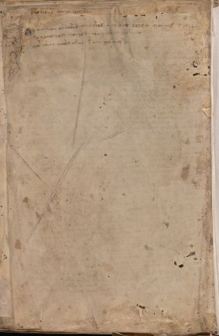

# Voynich Speculative Procedural Protocol — f116v

IMPORTANT: this is NOT a real or validated translation of the Voynich Manuscript. It is a speculative/procedural model that interprets EVA using a user-defined grammar to generate experimental recipes using safe, known edible substitutes.

This file is generated automatically from IVTFF/EVA transliteration plus a user-defined procedural grammar.



## Page / Folio
- folio: f116v
- page_number: 235

## EVA Text (Transliteration)
```text
oror sheey
```

## Domain Context (Heuristic; Not a Translation)

This section summarizes recurring **basewords** in this IVTFF domain and shows simple substring evidence that the token markers used by the procedural grammar occur inside frequent words.

Any Italian anagram / English gloss is a best-effort lexicon match, not a decipherment.


### Associated basewords (non-generic; top by frequency in this domain)
- `paiin` (count=241) → Italian anagram `piani`; English: plans (arrangements)
- `qokaiin` (count=122) → Italian anagram `ciancio`; English: [n/a]
- `okaiin` (count=109) → Italian anagram `coniai`; English: [n/a]
- `qokain` (count=101) → Italian anagram `acconi`; English: [n/a]
- `okain` (count=69) → Italian anagram `acino`; English: a berry
- `qokep` (count=65) → Italian anagram `pecco`; English: [n/a]
- `otain` (count=54) → Italian anagram `anito`; English: [n/a]
- `qokar` (count=48) → Italian anagram `carco`; English: [n/a]
- `saiin` (count=48) → Italian anagram `asini`; English: [n/a]
- `qokal` (count=46) → Italian anagram `calco`; English: cast (of sculpture)
- `kaiin` (count=45) → Italian anagram `acini`; English: [n/a]
- `qotaiin` (count=40) → Italian anagram `cationi`; English: [n/a]
- `lkaiin` (count=40) → Italian anagram `ancili`; English: [n/a]
- `qokeol` (count=38) → Italian anagram `eccolo`; English: [n/a]
- `qotain` (count=34) → Italian anagram `antico`; English: ancient

### Marker evidence (substring in frequent basewords)
- `qo`: 63 basewords; examples: `qokee`, `qokeep`, `qokaiin`, `qokain`, `qokep`, `qoke`
- `q`: 64 basewords; examples: `qokee`, `qokeep`, `qokaiin`, `qokain`, `qokep`, `qoke`
- `o`: 281 basewords; examples: `qokee`, `ol`, `o`, `qokeep`, `okee`, `qokaiin`
- `k`: 150 basewords; examples: `qokee`, `qokeep`, `okee`, `qokaiin`, `okaiin`, `qokain`
- `t`: 100 basewords; examples: `otaiin`, `otee`, `otal`, `otar`, `oteep`, `otep`
- `p`: 154 basewords; examples: `paiin`, `chep`, `qokeep`, `shep`, `par`, `oteep`
- `ch`: 144 basewords; examples: `chep`, `che`, `chol`, `chee`, `cheol`, `cheo`
- `sh`: 52 basewords; examples: `shep`, `she`, `shee`, `sheol`, `sheep`, `shol`
- `f`: 2 basewords; examples: `fchep`, `f`
- `cth`: 17 basewords; examples: `chcth`, `cthe`, `shcth`, `checth`, `cthol`, `cthee`
- `ckh`: 18 basewords; examples: `chckh`, `shckh`, `checkh`, `chckhe`, `chockh`, `sheckh`
- `cph`: 3 basewords; examples: `cphol`, `cph`, `cphe`
- `iin`: 38 basewords; examples: `aiin`, `paiin`, `qokaiin`, `okaiin`, `otaiin`, `saiin`
- `aiin`: 31 basewords; examples: `aiin`, `paiin`, `qokaiin`, `okaiin`, `otaiin`, `saiin`

## Recipes Index (This Page)
- [f116v.1,@Lx](#f116v-1-f116v-1-lx)

## Line Glosses (Procedural Gloss Only; Not a Translation)

<a id="f116v-1-f116v-1-lx"></a>

### f116v.1,@Lx

EVA: oror sheey

Direct Gloss (Procedural, Not a Real Translation):
- oror: tokens: o r o r → connectors: r r
- sheey: tokens: sh ee → vowel_run: ee (level 2; class e)
