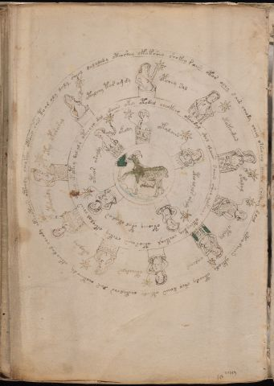

# Voynich Speculative Procedural Protocol — f70v1

IMPORTANT: this is NOT a real or validated translation of the Voynich Manuscript. It is a speculative/procedural model that interprets EVA using a user-defined grammar to generate experimental recipes using safe, known edible substitutes.

This file is generated automatically from IVTFF/EVA transliteration plus a user-defined procedural grammar.



## Page / Folio
- folio: f70v1
- page_number: 136

## EVA Text (Transliteration)
```text
dalalody oteoshey okoksheo shokey raiin otor ochy s a[ir:is] cheody cheey oteo [ch:ee]y daiir chcthy dlal oteodaiin ykeody oteody sheo daiin oteedy chetalchs zar shoteeody okeeo dal cheody okchoteees oteeody cheokeo otaiin shes to ar oly daly sheal
otalchy tar am dy
opchey sal
otakaizan
okalal
otaly
oalcheg
otchodals
okolshy
otshshdy
otal ypsharal
daiin okey otodal cheokeeo okeodal shol olaiin saiin sheo qokeeol otchykey chekeal oteosaiin chekey okeolol chees o?eey opotey dal al s otecheo dal
okoly
otalaiin
oteo alals araly
oteoeey otal okealar
otear araydy
```

## Domain Context (Heuristic; Not a Translation)

This section summarizes recurring **basewords** in this IVTFF domain and shows simple substring evidence that the token markers used by the procedural grammar occur inside frequent words.

Any Italian anagram / English gloss is a best-effort lexicon match, not a decipherment.


### Associated basewords (non-generic; top by frequency in this domain)
- `daiin` (count=231) → Italian anagram `piani`; English: plans (arrangements)
- `qokaiin` (count=122) → Italian anagram `ciancio`; English: [n/a]
- `okaiin` (count=109) → Italian anagram `coniai`; English: [n/a]
- `qokain` (count=101) → Italian anagram `acconi`; English: [n/a]
- `okain` (count=69) → Italian anagram `acino`; English: a berry
- `otain` (count=53) → Italian anagram `anito`; English: [n/a]
- `qokar` (count=48) → Italian anagram `carco`; English: [n/a]
- `saiin` (count=46) → Italian anagram `asini`; English: [n/a]
- `qokal` (count=43) → Italian anagram `calco`; English: cast (of sculpture)
- `qotaiin` (count=40) → Italian anagram `cationi`; English: [n/a]
- `lkaiin` (count=39) → Italian anagram `ancili`; English: [n/a]
- `kaiin` (count=37) → Italian anagram `acini`; English: [n/a]
- `qokeol` (count=37) → Italian anagram `eccolo`; English: [n/a]
- `qotain` (count=34) → Italian anagram `antico`; English: ancient
- `qotar` (count=29) → Italian anagram `corta`; English: [n/a]

### Marker evidence (substring in frequent basewords)
- `qo`: 60 basewords; examples: `qokeey`, `qokeedy`, `qokaiin`, `qokain`, `qokedy`, `qokey`
- `q`: 61 basewords; examples: `qokeey`, `qokeedy`, `qokaiin`, `qokain`, `qokedy`, `qokey`
- `o`: 262 basewords; examples: `qokeey`, `ol`, `o`, `qokeedy`, `okeey`, `qokaiin`
- `k`: 147 basewords; examples: `qokeey`, `qokeedy`, `okeey`, `qokaiin`, `okaiin`, `qokain`
- `t`: 102 basewords; examples: `otaiin`, `oteey`, `otar`, `otedy`, `otal`, `oteedy`
- `p`: 17 basewords; examples: `opchedy`, `qopchedy`, `opchey`, `pchedy`, `qopchdy`, `opchdy`
- `ch`: 137 basewords; examples: `chedy`, `chey`, `chol`, `cheey`, `cheol`, `cheody`
- `sh`: 50 basewords; examples: `shedy`, `shey`, `sheey`, `sheol`, `shol`, `sheedy`
- `f`: 1 basewords; examples: `f`
- `cth`: 16 basewords; examples: `chcthy`, `cthey`, `shcthy`, `checthy`, `cthol`, `ctheey`
- `ckh`: 15 basewords; examples: `chckhy`, `shckhy`, `checkhy`, `chckhey`, `chockhy`, `sheckhy`
- `cph`: 2 basewords; examples: `cphol`, `cphy`
- `dy`: 84 basewords; examples: `chedy`, `qokeedy`, `shedy`, `otedy`, `oteedy`, `qokedy`
- `iin`: 39 basewords; examples: `aiin`, `daiin`, `qokaiin`, `okaiin`, `otaiin`, `saiin`
- `aiin`: 33 basewords; examples: `aiin`, `daiin`, `qokaiin`, `okaiin`, `otaiin`, `saiin`

## Recipes Index (This Page)
- [f70v1.1,@Cc](#f70v1-1-f70v1-1-cc)
- [f70v1.2,@Lz](#f70v1-2-f70v1-2-lz)
- [f70v1.3,&Lz](#f70v1-3-f70v1-3-lz)
- [f70v1.4,&Lz](#f70v1-4-f70v1-4-lz)
- [f70v1.5,&Lz](#f70v1-5-f70v1-5-lz)
- [f70v1.6,&Lz](#f70v1-6-f70v1-6-lz)
- [f70v1.7,&Lz](#f70v1-7-f70v1-7-lz)
- [f70v1.8,&Lz](#f70v1-8-f70v1-8-lz)
- [f70v1.9,&Lz](#f70v1-9-f70v1-9-lz)
- [f70v1.10,&Lz](#f70v1-10-f70v1-10-lz)
- [f70v1.11,&Lz](#f70v1-11-f70v1-11-lz)
- [f70v1.12,@Cc](#f70v1-12-f70v1-12-cc)
- [f70v1.13,@Lz](#f70v1-13-f70v1-13-lz)
- [f70v1.14,&Lz](#f70v1-14-f70v1-14-lz)
- [f70v1.15,&Lz](#f70v1-15-f70v1-15-lz)
- [f70v1.16,&Lz](#f70v1-16-f70v1-16-lz)
- [f70v1.17,&Lz](#f70v1-17-f70v1-17-lz)

## Line Glosses (Procedural Gloss Only; Not a Translation)

<a id="f70v1-1-f70v1-1-cc"></a>

### f70v1.1,@Cc

EVA: dalalody oteoshey okoksheo shokey raiin otor ochy s a[ir:is] cheody cheey oteo [ch:ee]y daiir chcthy dlal oteodaiin ykeody oteody sheo daiin oteedy chetalchs zar shoteeody okeeo dal cheody okchoteees oteeody cheokeo otaiin shes to ar oly daly sheal

Direct Gloss (Procedural, Not a Real Translation):
- dalalody: tokens: p a l a l o p → connectors: l l → vowel_run: a (level 1; class a)
- oteoshey: tokens: o t e o sh e → vowel_run: e (level 1; class e)
- okoksheo: tokens: o k o k sh e o → vowel_run: e (level 1; class e)
- shokey: tokens: sh o k e → vowel_run: e (level 1; class e)
- raiin: tokens: r aiin → connectors: r → vowel_run: a (level 1; class a) → suffix: aiin
- otor: tokens: o t o r → connectors: r
- ochy: tokens: o ch
- s: tokens: s → connectors: s
- a: tokens: a → vowel_run: a (level 1; class a)
- ir: tokens: i r → connectors: r → vowel_run: i (level 1; class i)
- is: tokens: i s → connectors: s → vowel_run: i (level 1; class i)
- cheody: tokens: ch e o p → vowel_run: e (level 1; class e)
- cheey: tokens: ch ee → vowel_run: ee (level 2; class e)
- oteo: tokens: o t e o → vowel_run: e (level 1; class e)
- ch: tokens: ch
- ee: tokens: ee → vowel_run: ee (level 2; class e)
- y: [unparsed]
- daiir: tokens: p a ii r → connectors: r → vowel_run: a (level 1; class a)
- chcthy: tokens: ch cth
- dlal: tokens: p l a l → connectors: l l → vowel_run: a (level 1; class a)
- oteodaiin: tokens: o t e o p aiin → vowel_run: e (level 1; class e) → suffix: aiin
- ykeody: tokens: k e o p → vowel_run: e (level 1; class e)
- oteody: tokens: o t e o p → vowel_run: e (level 1; class e)
- sheo: tokens: sh e o → vowel_run: e (level 1; class e)
- daiin: tokens: p aiin → vowel_run: a (level 1; class a) → suffix: aiin
- oteedy: tokens: o t ee p → vowel_run: ee (level 2; class e)
- chetalchs: tokens: ch e t a l ch s → connectors: l s → vowel_run: e (level 1; class e)
- zar: tokens: z a r → connectors: r → vowel_run: a (level 1; class a) → unmodeled_tokens: z
- shoteeody: tokens: sh o t ee o p → vowel_run: ee (level 2; class e)
- okeeo: tokens: o k ee o → vowel_run: ee (level 2; class e)
- dal: tokens: p a l → connectors: l → vowel_run: a (level 1; class a)
- cheody: tokens: ch e o p → vowel_run: e (level 1; class e)
- okchoteees: tokens: o k ch o t eee s → connectors: s → vowel_run: eee (level 3; class e)
- oteeody: tokens: o t ee o p → vowel_run: ee (level 2; class e)
- cheokeo: tokens: ch e o k e o → vowel_run: e (level 1; class e)
- otaiin: tokens: o t aiin → vowel_run: a (level 1; class a) → suffix: aiin
- shes: tokens: sh e s → connectors: s → vowel_run: e (level 1; class e)
- to: tokens: t o
- ar: tokens: a r → connectors: r → vowel_run: a (level 1; class a)
- oly: tokens: o l → connectors: l
- daly: tokens: p a l → connectors: l → vowel_run: a (level 1; class a)
- sheal: tokens: sh e a l → connectors: l → vowel_run: e (level 1; class e)

<a id="f70v1-2-f70v1-2-lz"></a>

### f70v1.2,@Lz

EVA: otalchy tar am dy

Direct Gloss (Procedural, Not a Real Translation):
- otalchy: tokens: o t a l ch → connectors: l → vowel_run: a (level 1; class a)
- tar: tokens: t a r → connectors: r → vowel_run: a (level 1; class a)
- am: tokens: a m → connectors: m → vowel_run: a (level 1; class a)
- dy: tokens: p

<a id="f70v1-3-f70v1-3-lz"></a>

### f70v1.3,&Lz

EVA: opchey sal

Direct Gloss (Procedural, Not a Real Translation):
- opchey: tokens: o p ch e → vowel_run: e (level 1; class e)
- sal: tokens: s a l → connectors: s l → vowel_run: a (level 1; class a)

<a id="f70v1-4-f70v1-4-lz"></a>

### f70v1.4,&Lz

EVA: otakaizan

Direct Gloss (Procedural, Not a Real Translation):
- otakaizan: tokens: o t a k a i z a n → connectors: n → vowel_run: a (level 1; class a) → unmodeled_tokens: z

<a id="f70v1-5-f70v1-5-lz"></a>

### f70v1.5,&Lz

EVA: okalal

Direct Gloss (Procedural, Not a Real Translation):
- okalal: tokens: o k a l a l → connectors: l l → vowel_run: a (level 1; class a)

<a id="f70v1-6-f70v1-6-lz"></a>

### f70v1.6,&Lz

EVA: otaly

Direct Gloss (Procedural, Not a Real Translation):
- otaly: tokens: o t a l → connectors: l → vowel_run: a (level 1; class a)

<a id="f70v1-7-f70v1-7-lz"></a>

### f70v1.7,&Lz

EVA: oalcheg

Direct Gloss (Procedural, Not a Real Translation):
- oalcheg: tokens: o a l ch e g → connectors: l → vowel_run: a (level 1; class a)

<a id="f70v1-8-f70v1-8-lz"></a>

### f70v1.8,&Lz

EVA: otchodals

Direct Gloss (Procedural, Not a Real Translation):
- otchodals: tokens: o t ch o p a l s → connectors: l s → vowel_run: a (level 1; class a)

<a id="f70v1-9-f70v1-9-lz"></a>

### f70v1.9,&Lz

EVA: okolshy

Direct Gloss (Procedural, Not a Real Translation):
- okolshy: tokens: o k o l sh → connectors: l

<a id="f70v1-10-f70v1-10-lz"></a>

### f70v1.10,&Lz

EVA: otshshdy

Direct Gloss (Procedural, Not a Real Translation):
- otshshdy: tokens: o t sh sh p

<a id="f70v1-11-f70v1-11-lz"></a>

### f70v1.11,&Lz

EVA: otal ypsharal

Direct Gloss (Procedural, Not a Real Translation):
- otal: tokens: o t a l → connectors: l → vowel_run: a (level 1; class a)
- ypsharal: tokens: p sh a r a l → connectors: r l → vowel_run: a (level 1; class a)

<a id="f70v1-12-f70v1-12-cc"></a>

### f70v1.12,@Cc

EVA: daiin okey otodal cheokeeo okeodal shol olaiin saiin sheo qokeeol otchykey chekeal oteosaiin chekey okeolol chees o?eey opotey dal al s otecheo dal

Direct Gloss (Procedural, Not a Real Translation):
- daiin: tokens: p aiin → vowel_run: a (level 1; class a) → suffix: aiin
- okey: tokens: o k e → vowel_run: e (level 1; class e)
- otodal: tokens: o t o p a l → connectors: l → vowel_run: a (level 1; class a)
- cheokeeo: tokens: ch e o k ee o → vowel_run: e (level 1; class e)
- okeodal: tokens: o k e o p a l → connectors: l → vowel_run: e (level 1; class e)
- shol: tokens: sh o l → connectors: l
- olaiin: tokens: o l aiin → connectors: l → vowel_run: a (level 1; class a) → suffix: aiin
- saiin: tokens: s aiin → connectors: s → vowel_run: a (level 1; class a) → suffix: aiin
- sheo: tokens: sh e o → vowel_run: e (level 1; class e)
- qokeeol: tokens: qo k ee o l → connectors: l → vowel_run: ee (level 2; class e)
- otchykey: tokens: o t ch k e → vowel_run: e (level 1; class e)
- chekeal: tokens: ch e k e a l → connectors: l → vowel_run: e (level 1; class e)
- oteosaiin: tokens: o t e o s aiin → connectors: s → vowel_run: e (level 1; class e) → suffix: aiin
- chekey: tokens: ch e k e → vowel_run: e (level 1; class e)
- okeolol: tokens: o k e o l o l → connectors: l l → vowel_run: e (level 1; class e)
- chees: tokens: ch ee s → connectors: s → vowel_run: ee (level 2; class e)
- o: tokens: o
- eey: tokens: ee → vowel_run: ee (level 2; class e)
- opotey: tokens: o p o t e → vowel_run: e (level 1; class e)
- dal: tokens: p a l → connectors: l → vowel_run: a (level 1; class a)
- al: tokens: a l → connectors: l → vowel_run: a (level 1; class a)
- s: tokens: s → connectors: s
- otecheo: tokens: o t e ch e o → vowel_run: e (level 1; class e)
- dal: tokens: p a l → connectors: l → vowel_run: a (level 1; class a)

<a id="f70v1-13-f70v1-13-lz"></a>

### f70v1.13,@Lz

EVA: okoly

Direct Gloss (Procedural, Not a Real Translation):
- okoly: tokens: o k o l → connectors: l

<a id="f70v1-14-f70v1-14-lz"></a>

### f70v1.14,&Lz

EVA: otalaiin

Direct Gloss (Procedural, Not a Real Translation):
- otalaiin: tokens: o t a l aiin → connectors: l → vowel_run: a (level 1; class a) → suffix: aiin

<a id="f70v1-15-f70v1-15-lz"></a>

### f70v1.15,&Lz

EVA: oteo alals araly

Direct Gloss (Procedural, Not a Real Translation):
- oteo: tokens: o t e o → vowel_run: e (level 1; class e)
- alals: tokens: a l a l s → connectors: l l s → vowel_run: a (level 1; class a)
- araly: tokens: a r a l → connectors: r l → vowel_run: a (level 1; class a)

<a id="f70v1-16-f70v1-16-lz"></a>

### f70v1.16,&Lz

EVA: oteoeey otal okealar

Direct Gloss (Procedural, Not a Real Translation):
- oteoeey: tokens: o t e o ee → vowel_run: e (level 1; class e)
- otal: tokens: o t a l → connectors: l → vowel_run: a (level 1; class a)
- okealar: tokens: o k e a l a r → connectors: l r → vowel_run: e (level 1; class e)

<a id="f70v1-17-f70v1-17-lz"></a>

### f70v1.17,&Lz

EVA: otear araydy

Direct Gloss (Procedural, Not a Real Translation):
- otear: tokens: o t e a r → connectors: r → vowel_run: e (level 1; class e)
- araydy: tokens: a r a p → connectors: r → vowel_run: a (level 1; class a)
