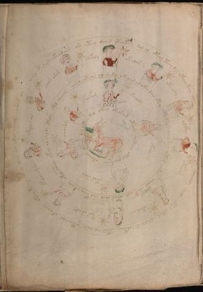

# Voynich Speculative Procedural Protocol — f71v

IMPORTANT: this is NOT a real or validated translation of the Voynich Manuscript. It is a speculative/procedural model that interprets EVA using a user-defined grammar to generate experimental recipes using safe, known edible substitutes.

This file is generated automatically from IVTFF/EVA transliteration plus a user-defined procedural grammar.



## Page / Folio
- folio: f71v
- page_number: 138

## EVA Text (Transliteration)
```text
osheo parar oteeodaiin she ateey daiin oteokeey dal al oteey teey dy otchy keey sheeo ochey ?chey otcheodal sheealody cheol otar okam oteodar chpchy cpar al aiin oteoshar okeodaly oteey teeey oteey keor or arol cheols okaikaly
char arom
chfaly
okolar
otchody
alcphy
otaiin
okaraiin
otar ar aly
opalar am dan
opalor ar
chal oteeos al sheky okalar ar okeo dar oty oto kaiin chey tal otchr chtos cheor shepchol otor sheo shopcho ar aly okeo cheey otal al shldy otaly okol sheeor
ofaifom
otalody
otalaiin
otar sh[a:o]r
sholshdy
okeey okeosar otaiin chkeeal okal cheekaiin okaiin okchor dar oteey kal
```

## Domain Context (Heuristic; Not a Translation)

This section summarizes recurring **basewords** in this IVTFF domain and shows simple substring evidence that the token markers used by the procedural grammar occur inside frequent words.

Any Italian anagram / English gloss is a best-effort lexicon match, not a decipherment.


### Associated basewords (non-generic; top by frequency in this domain)
- `paiin` (count=241) → Italian anagram `piani`; English: plans (arrangements)
- `qokaiin` (count=122) → Italian anagram `ciancio`; English: [n/a]
- `okaiin` (count=109) → Italian anagram `coniai`; English: [n/a]
- `qokain` (count=101) → Italian anagram `acconi`; English: [n/a]
- `okain` (count=69) → Italian anagram `acino`; English: a berry
- `qokep` (count=65) → Italian anagram `pecco`; English: [n/a]
- `otain` (count=54) → Italian anagram `anito`; English: [n/a]
- `qokar` (count=48) → Italian anagram `carco`; English: [n/a]
- `saiin` (count=48) → Italian anagram `asini`; English: [n/a]
- `qokal` (count=46) → Italian anagram `calco`; English: cast (of sculpture)
- `kaiin` (count=45) → Italian anagram `acini`; English: [n/a]
- `qotaiin` (count=40) → Italian anagram `cationi`; English: [n/a]
- `lkaiin` (count=40) → Italian anagram `ancili`; English: [n/a]
- `qokeol` (count=38) → Italian anagram `eccolo`; English: [n/a]
- `qotain` (count=34) → Italian anagram `antico`; English: ancient

### Marker evidence (substring in frequent basewords)
- `qo`: 63 basewords; examples: `qokee`, `qokeep`, `qokaiin`, `qokain`, `qokep`, `qoke`
- `q`: 64 basewords; examples: `qokee`, `qokeep`, `qokaiin`, `qokain`, `qokep`, `qoke`
- `o`: 281 basewords; examples: `qokee`, `ol`, `o`, `qokeep`, `okee`, `qokaiin`
- `k`: 150 basewords; examples: `qokee`, `qokeep`, `okee`, `qokaiin`, `okaiin`, `qokain`
- `t`: 100 basewords; examples: `otaiin`, `otee`, `otal`, `otar`, `oteep`, `otep`
- `p`: 154 basewords; examples: `paiin`, `chep`, `qokeep`, `shep`, `par`, `oteep`
- `ch`: 144 basewords; examples: `chep`, `che`, `chol`, `chee`, `cheol`, `cheo`
- `sh`: 52 basewords; examples: `shep`, `she`, `shee`, `sheol`, `sheep`, `shol`
- `f`: 2 basewords; examples: `fchep`, `f`
- `cth`: 17 basewords; examples: `chcth`, `cthe`, `shcth`, `checth`, `cthol`, `cthee`
- `ckh`: 18 basewords; examples: `chckh`, `shckh`, `checkh`, `chckhe`, `chockh`, `sheckh`
- `cph`: 3 basewords; examples: `cphol`, `cph`, `cphe`
- `iin`: 38 basewords; examples: `aiin`, `paiin`, `qokaiin`, `okaiin`, `otaiin`, `saiin`
- `aiin`: 31 basewords; examples: `aiin`, `paiin`, `qokaiin`, `okaiin`, `otaiin`, `saiin`

## Recipes Index (This Page)
- [f71v.1,@Cc](#f71v-1-f71v-1-cc)
- [f71v.2,@Lz](#f71v-2-f71v-2-lz)
- [f71v.3,&Lz](#f71v-3-f71v-3-lz)
- [f71v.4,&Lz](#f71v-4-f71v-4-lz)
- [f71v.5,&Lz](#f71v-5-f71v-5-lz)
- [f71v.6,&Lz](#f71v-6-f71v-6-lz)
- [f71v.7,&Lz](#f71v-7-f71v-7-lz)
- [f71v.8,&Lz](#f71v-8-f71v-8-lz)
- [f71v.9,&Lz](#f71v-9-f71v-9-lz)
- [f71v.10,&Lz](#f71v-10-f71v-10-lz)
- [f71v.11,&Lz](#f71v-11-f71v-11-lz)
- [f71v.12,@Cc](#f71v-12-f71v-12-cc)
- [f71v.13,@Lz](#f71v-13-f71v-13-lz)
- [f71v.14,&Lz](#f71v-14-f71v-14-lz)
- [f71v.15,&Lz](#f71v-15-f71v-15-lz)
- [f71v.16,&Lz](#f71v-16-f71v-16-lz)
- [f71v.17,&Lz](#f71v-17-f71v-17-lz)
- [f71v.18,@Cc](#f71v-18-f71v-18-cc)

## Line Glosses (Procedural Gloss Only; Not a Translation)

<a id="f71v-1-f71v-1-cc"></a>

### f71v.1,@Cc

EVA (original line):
```text
osheo parar oteeodaiin she ateey daiin oteokeey dal al oteey teey dy otchy keey sheeo ochey ?chey otcheodal sheealody cheol otar okam oteodar chpchy cpar al aiin oteoshar okeodaly oteey teeey oteey keor or arol cheols okaikaly
```

English structural gloss (generated):

- osheo: tokens: o sh e o → vowel_run: e (level 1; class e)
- parar: tokens: p a r a r → connectors: r r → vowel_run: a (level 1; class a)
- oteeodaiin: tokens: o t ee o p aiin → vowel_run: ee (level 2; class e) → suffix: aiin (lexicon-context: `opaiin` → `opinai`; [n/a])
- she: tokens: sh e → vowel_run: e (level 1; class e)
- ateey: tokens: a t ee → vowel_run: a (level 1; class a)
- daiin: tokens: p aiin → vowel_run: a (level 1; class a) → suffix: aiin (lexicon-context: `paiin` → `piani`; plans (arrangements))
- oteokeey: tokens: o t e o k ee → vowel_run: e (level 1; class e)
- dal: tokens: p a l → connectors: l → vowel_run: a (level 1; class a)
- al: tokens: a l → connectors: l → vowel_run: a (level 1; class a)
- oteey: tokens: o t ee → vowel_run: ee (level 2; class e)
- teey: tokens: t ee → vowel_run: ee (level 2; class e)
- dy: tokens: p
- otchy: tokens: o t ch
- keey: tokens: k ee → vowel_run: ee (level 2; class e)
- sheeo: tokens: sh ee o → vowel_run: ee (level 2; class e)
- ochey: tokens: o ch e → vowel_run: e (level 1; class e)
- chey: tokens: ch e → vowel_run: e (level 1; class e)
- otcheodal: tokens: o t ch e o p a l → connectors: l → vowel_run: e (level 1; class e)
- sheealody: tokens: sh ee a l o p → connectors: l → vowel_run: ee (level 2; class e)
- cheol: tokens: ch e o l → connectors: l → vowel_run: e (level 1; class e)
- otar: tokens: o t a r → connectors: r → vowel_run: a (level 1; class a)
- okam: tokens: o k a m → connectors: m → vowel_run: a (level 1; class a)
- oteodar: tokens: o t e o p a r → connectors: r → vowel_run: e (level 1; class e)
- chpchy: tokens: ch p ch
- cpar: tokens: c p a r → connectors: r → vowel_run: a (level 1; class a)
- al: tokens: a l → connectors: l → vowel_run: a (level 1; class a)
- aiin: tokens: aiin → vowel_run: a (level 1; class a) → suffix: aiin
- oteoshar: tokens: o t e o sh a r → connectors: r → vowel_run: e (level 1; class e)
- okeodaly: tokens: o k e o p a l → connectors: l → vowel_run: e (level 1; class e)
- oteey: tokens: o t ee → vowel_run: ee (level 2; class e)
- teeey: tokens: t eee → vowel_run: eee (level 3; class e)
- oteey: tokens: o t ee → vowel_run: ee (level 2; class e)
- keor: tokens: k e o r → connectors: r → vowel_run: e (level 1; class e)
- or: tokens: o r → connectors: r
- arol: tokens: a r o l → connectors: r l → vowel_run: a (level 1; class a)
- cheols: tokens: ch e o l s → connectors: l s → vowel_run: e (level 1; class e)
- okaikaly: tokens: o k a i k a l → connectors: l → vowel_run: a (level 1; class a)

<a id="f71v-2-f71v-2-lz"></a>

### f71v.2,@Lz

EVA (original line):
```text
char arom
```

English structural gloss (generated):

- char: tokens: ch a r → connectors: r → vowel_run: a (level 1; class a)
- arom: tokens: a r o m → connectors: r m → vowel_run: a (level 1; class a)

<a id="f71v-3-f71v-3-lz"></a>

### f71v.3,&Lz

EVA (original line):
```text
chfaly
```

English structural gloss (generated):

- chfaly: tokens: ch f a l → connectors: l → vowel_run: a (level 1; class a)

<a id="f71v-4-f71v-4-lz"></a>

### f71v.4,&Lz

EVA (original line):
```text
okolar
```

English structural gloss (generated):

- okolar: tokens: o k o l a r → connectors: l r → vowel_run: a (level 1; class a)

<a id="f71v-5-f71v-5-lz"></a>

### f71v.5,&Lz

EVA (original line):
```text
otchody
```

English structural gloss (generated):

- otchody: tokens: o t ch o p

<a id="f71v-6-f71v-6-lz"></a>

### f71v.6,&Lz

EVA (original line):
```text
alcphy
```

English structural gloss (generated):

- alcphy: tokens: a l cph → connectors: l → vowel_run: a (level 1; class a)

<a id="f71v-7-f71v-7-lz"></a>

### f71v.7,&Lz

EVA (original line):
```text
otaiin
```

English structural gloss (generated):

- otaiin: tokens: o t aiin → vowel_run: a (level 1; class a) → suffix: aiin

<a id="f71v-8-f71v-8-lz"></a>

### f71v.8,&Lz

EVA (original line):
```text
okaraiin
```

English structural gloss (generated):

- okaraiin: tokens: o k a r aiin → connectors: r → vowel_run: a (level 1; class a) → suffix: aiin

<a id="f71v-9-f71v-9-lz"></a>

### f71v.9,&Lz

EVA (original line):
```text
otar ar aly
```

English structural gloss (generated):

- otar: tokens: o t a r → connectors: r → vowel_run: a (level 1; class a)
- ar: tokens: a r → connectors: r → vowel_run: a (level 1; class a)
- aly: tokens: a l → connectors: l → vowel_run: a (level 1; class a)

<a id="f71v-10-f71v-10-lz"></a>

### f71v.10,&Lz

EVA (original line):
```text
opalar am dan
```

English structural gloss (generated):

- opalar: tokens: o p a l a r → connectors: l r → vowel_run: a (level 1; class a)
- am: tokens: a m → connectors: m → vowel_run: a (level 1; class a)
- dan: tokens: p a n → connectors: n → vowel_run: a (level 1; class a)

<a id="f71v-11-f71v-11-lz"></a>

### f71v.11,&Lz

EVA (original line):
```text
opalor ar
```

English structural gloss (generated):

- opalor: tokens: o p a l o r → connectors: l r → vowel_run: a (level 1; class a)
- ar: tokens: a r → connectors: r → vowel_run: a (level 1; class a)

<a id="f71v-12-f71v-12-cc"></a>

### f71v.12,@Cc

EVA (original line):
```text
chal oteeos al sheky okalar ar okeo dar oty oto kaiin chey tal otchr chtos cheor shepchol otor sheo shopcho ar aly okeo cheey otal al shldy otaly okol sheeor
```

English structural gloss (generated):

- chal: tokens: ch a l → connectors: l → vowel_run: a (level 1; class a)
- oteeos: tokens: o t ee o s → connectors: s → vowel_run: ee (level 2; class e)
- al: tokens: a l → connectors: l → vowel_run: a (level 1; class a)
- sheky: tokens: sh e k → vowel_run: e (level 1; class e)
- okalar: tokens: o k a l a r → connectors: l r → vowel_run: a (level 1; class a)
- ar: tokens: a r → connectors: r → vowel_run: a (level 1; class a)
- okeo: tokens: o k e o → vowel_run: e (level 1; class e)
- dar: tokens: p a r → connectors: r → vowel_run: a (level 1; class a)
- oty: tokens: o t
- oto: tokens: o t o
- kaiin: tokens: k aiin → vowel_run: a (level 1; class a) → suffix: aiin
- chey: tokens: ch e → vowel_run: e (level 1; class e)
- tal: tokens: t a l → connectors: l → vowel_run: a (level 1; class a)
- otchr: tokens: o t ch r → connectors: r
- chtos: tokens: ch t o s → connectors: s
- cheor: tokens: ch e o r → connectors: r → vowel_run: e (level 1; class e)
- shepchol: tokens: sh e p ch o l → connectors: l → vowel_run: e (level 1; class e)
- otor: tokens: o t o r → connectors: r
- sheo: tokens: sh e o → vowel_run: e (level 1; class e)
- shopcho: tokens: sh o p ch o
- ar: tokens: a r → connectors: r → vowel_run: a (level 1; class a)
- aly: tokens: a l → connectors: l → vowel_run: a (level 1; class a)
- okeo: tokens: o k e o → vowel_run: e (level 1; class e)
- cheey: tokens: ch ee → vowel_run: ee (level 2; class e)
- otal: tokens: o t a l → connectors: l → vowel_run: a (level 1; class a)
- al: tokens: a l → connectors: l → vowel_run: a (level 1; class a)
- shldy: tokens: sh l p → connectors: l
- otaly: tokens: o t a l → connectors: l → vowel_run: a (level 1; class a)
- okol: tokens: o k o l → connectors: l
- sheeor: tokens: sh ee o r → connectors: r → vowel_run: ee (level 2; class e)

<a id="f71v-13-f71v-13-lz"></a>

### f71v.13,@Lz

EVA (original line):
```text
ofaifom
```

English structural gloss (generated):

- ofaifom: tokens: o f a i f o m → connectors: m → vowel_run: a (level 1; class a)

<a id="f71v-14-f71v-14-lz"></a>

### f71v.14,&Lz

EVA (original line):
```text
otalody
```

English structural gloss (generated):

- otalody: tokens: o t a l o p → connectors: l → vowel_run: a (level 1; class a)

<a id="f71v-15-f71v-15-lz"></a>

### f71v.15,&Lz

EVA (original line):
```text
otalaiin
```

English structural gloss (generated):

- otalaiin: tokens: o t a l aiin → connectors: l → vowel_run: a (level 1; class a) → suffix: aiin

<a id="f71v-16-f71v-16-lz"></a>

### f71v.16,&Lz

EVA (original line):
```text
otar sh[a:o]r
```

English structural gloss (generated):

- otar: tokens: o t a r → connectors: r → vowel_run: a (level 1; class a)
- sh: tokens: sh
- a: tokens: a → vowel_run: a (level 1; class a)
- o: tokens: o
- r: tokens: r → connectors: r

<a id="f71v-17-f71v-17-lz"></a>

### f71v.17,&Lz

EVA (original line):
```text
sholshdy
```

English structural gloss (generated):

- sholshdy: tokens: sh o l sh p → connectors: l

<a id="f71v-18-f71v-18-cc"></a>

### f71v.18,@Cc

EVA (original line):
```text
okeey okeosar otaiin chkeeal okal cheekaiin okaiin okchor dar oteey kal
```

English structural gloss (generated):

- okeey: tokens: o k ee → vowel_run: ee (level 2; class e)
- okeosar: tokens: o k e o s a r → connectors: s r → vowel_run: e (level 1; class e)
- otaiin: tokens: o t aiin → vowel_run: a (level 1; class a) → suffix: aiin
- chkeeal: tokens: ch k ee a l → connectors: l → vowel_run: ee (level 2; class e)
- okal: tokens: o k a l → connectors: l → vowel_run: a (level 1; class a)
- cheekaiin: tokens: ch ee k aiin → vowel_run: ee (level 2; class e) → suffix: aiin
- okaiin: tokens: o k aiin → vowel_run: a (level 1; class a) → suffix: aiin (lexicon-context: `okaiin` → `coniai`; [n/a])
- okchor: tokens: o k ch o r → connectors: r
- dar: tokens: p a r → connectors: r → vowel_run: a (level 1; class a)
- oteey: tokens: o t ee → vowel_run: ee (level 2; class e)
- kal: tokens: k a l → connectors: l → vowel_run: a (level 1; class a)
