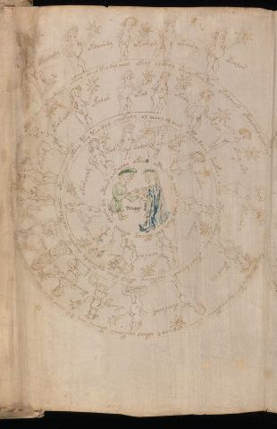

# Voynich Speculative Procedural Protocol — f72r2

IMPORTANT: this is NOT a real or validated translation of the Voynich Manuscript. It is a speculative/procedural model that interprets EVA using a user-defined grammar to generate experimental recipes using safe, known edible substitutes.

This file is generated automatically from IVTFF/EVA transliteration plus a user-defined procedural grammar.



## Page / Folio
- folio: f72r2
- page_number: 140

## EVA Text (Transliteration)
```text
ofchdamy
oklairdy
okaram
okairy
okealar
oteos aiin okeo daiin okeey cheo keodal chol okeol olckhhy oteeykeey tey okalaiin okalchal chey al o keey daiin otar al chotaiin otchey qoeeeo s [ckh:?]al chekaiin otaiin chy d r aiin al y chho chekaiin okedal qokeodal saiin otois otees
otaraldy
okalar
okal
okaly
okal
okeey ary
oteeary
otair dy
okaircham
okeal
otarcr
okaly
orary
okyd
otolam
oteey tey teodal chokaly ol cheol ol aiin oteo daiin shokal otey otaiin otaly dal okaly dalchdy ch'eteeey okal shey qoteeody sheycthy chotal chas otoees aiin
otal
ralal
okam
otalshy
okaldy
chosar
otam
ainaly
okarcham
otoar air aloy oka[iin:ii?] otees chs chchs ar aly taly dar otchey okaiin olaiin @211;y
```

## Domain Context (Heuristic; Not a Translation)

This section summarizes recurring **basewords** in this IVTFF domain and shows simple substring evidence that the token markers used by the procedural grammar occur inside frequent words.

Any Italian anagram / English gloss is a best-effort lexicon match, not a decipherment.


### Associated basewords (non-generic; top by frequency in this domain)
- `paiin` (count=241) → Italian anagram `piani`; English: plans (arrangements)
- `qokaiin` (count=122) → Italian anagram `ciancio`; English: [n/a]
- `okaiin` (count=109) → Italian anagram `coniai`; English: [n/a]
- `qokain` (count=101) → Italian anagram `acconi`; English: [n/a]
- `okain` (count=69) → Italian anagram `acino`; English: a berry
- `qokep` (count=65) → Italian anagram `pecco`; English: [n/a]
- `otain` (count=54) → Italian anagram `anito`; English: [n/a]
- `qokar` (count=48) → Italian anagram `carco`; English: [n/a]
- `saiin` (count=48) → Italian anagram `asini`; English: [n/a]
- `qokal` (count=46) → Italian anagram `calco`; English: cast (of sculpture)
- `kaiin` (count=45) → Italian anagram `acini`; English: [n/a]
- `qotaiin` (count=40) → Italian anagram `cationi`; English: [n/a]
- `lkaiin` (count=40) → Italian anagram `ancili`; English: [n/a]
- `qokeol` (count=38) → Italian anagram `eccolo`; English: [n/a]
- `qotain` (count=34) → Italian anagram `antico`; English: ancient

### Marker evidence (substring in frequent basewords)
- `qo`: 63 basewords; examples: `qokee`, `qokeep`, `qokaiin`, `qokain`, `qokep`, `qoke`
- `q`: 64 basewords; examples: `qokee`, `qokeep`, `qokaiin`, `qokain`, `qokep`, `qoke`
- `o`: 281 basewords; examples: `qokee`, `ol`, `o`, `qokeep`, `okee`, `qokaiin`
- `k`: 150 basewords; examples: `qokee`, `qokeep`, `okee`, `qokaiin`, `okaiin`, `qokain`
- `t`: 100 basewords; examples: `otaiin`, `otee`, `otal`, `otar`, `oteep`, `otep`
- `p`: 154 basewords; examples: `paiin`, `chep`, `qokeep`, `shep`, `par`, `oteep`
- `ch`: 144 basewords; examples: `chep`, `che`, `chol`, `chee`, `cheol`, `cheo`
- `sh`: 52 basewords; examples: `shep`, `she`, `shee`, `sheol`, `sheep`, `shol`
- `f`: 2 basewords; examples: `fchep`, `f`
- `cth`: 17 basewords; examples: `chcth`, `cthe`, `shcth`, `checth`, `cthol`, `cthee`
- `ckh`: 18 basewords; examples: `chckh`, `shckh`, `checkh`, `chckhe`, `chockh`, `sheckh`
- `cph`: 3 basewords; examples: `cphol`, `cph`, `cphe`
- `iin`: 38 basewords; examples: `aiin`, `paiin`, `qokaiin`, `okaiin`, `otaiin`, `saiin`
- `aiin`: 31 basewords; examples: `aiin`, `paiin`, `qokaiin`, `okaiin`, `otaiin`, `saiin`

## Recipes Index (This Page)
- [f72r2.1,@Lz](#f72r2-1-f72r2-1-lz)
- [f72r2.2,&Lz](#f72r2-2-f72r2-2-lz)
- [f72r2.3,&Lz](#f72r2-3-f72r2-3-lz)
- [f72r2.4,&Lz](#f72r2-4-f72r2-4-lz)
- [f72r2.5,&Lz](#f72r2-5-f72r2-5-lz)
- [f72r2.6,@Cc](#f72r2-6-f72r2-6-cc)
- [f72r2.7,@Lz](#f72r2-7-f72r2-7-lz)
- [f72r2.8,&Lz](#f72r2-8-f72r2-8-lz)
- [f72r2.9,&Lz](#f72r2-9-f72r2-9-lz)
- [f72r2.10,&Lz](#f72r2-10-f72r2-10-lz)
- [f72r2.11,&Lz](#f72r2-11-f72r2-11-lz)
- [f72r2.12,&Lz](#f72r2-12-f72r2-12-lz)
- [f72r2.13,&Lz](#f72r2-13-f72r2-13-lz)
- [f72r2.14,&Lz](#f72r2-14-f72r2-14-lz)
- [f72r2.15,&Lz](#f72r2-15-f72r2-15-lz)
- [f72r2.16,&Lz](#f72r2-16-f72r2-16-lz)
- [f72r2.17,&Lz](#f72r2-17-f72r2-17-lz)
- [f72r2.18,&Lz](#f72r2-18-f72r2-18-lz)
- [f72r2.19,&Lz](#f72r2-19-f72r2-19-lz)
- [f72r2.20,&Lz](#f72r2-20-f72r2-20-lz)
- [f72r2.21,&Lz](#f72r2-21-f72r2-21-lz)
- [f72r2.22,@Cc](#f72r2-22-f72r2-22-cc)
- [f72r2.23,@Lz](#f72r2-23-f72r2-23-lz)
- [f72r2.24,&Lz](#f72r2-24-f72r2-24-lz)
- [f72r2.25,&Lz](#f72r2-25-f72r2-25-lz)
- [f72r2.26,&Lz](#f72r2-26-f72r2-26-lz)
- [f72r2.27,&Lz](#f72r2-27-f72r2-27-lz)
- [f72r2.28,&Lz](#f72r2-28-f72r2-28-lz)
- [f72r2.29,&Lz](#f72r2-29-f72r2-29-lz)
- [f72r2.30,&Lz](#f72r2-30-f72r2-30-lz)
- [f72r2.31,&Lz](#f72r2-31-f72r2-31-lz)
- [f72r2.32,@Cc](#f72r2-32-f72r2-32-cc)

## Line Glosses (Procedural Gloss Only; Not a Translation)

<a id="f72r2-1-f72r2-1-lz"></a>

### f72r2.1,@Lz

EVA (original line):
```text
ofchdamy
```

English structural gloss (generated):

- ofchdamy: tokens: o f ch p a m → connectors: m → vowel_run: a (level 1; class a)

<a id="f72r2-2-f72r2-2-lz"></a>

### f72r2.2,&Lz

EVA (original line):
```text
oklairdy
```

English structural gloss (generated):

- oklairdy: tokens: o k l a i r p → connectors: l r → vowel_run: a (level 1; class a)

<a id="f72r2-3-f72r2-3-lz"></a>

### f72r2.3,&Lz

EVA (original line):
```text
okaram
```

English structural gloss (generated):

- okaram: tokens: o k a r a m → connectors: r m → vowel_run: a (level 1; class a)

<a id="f72r2-4-f72r2-4-lz"></a>

### f72r2.4,&Lz

EVA (original line):
```text
okairy
```

English structural gloss (generated):

- okairy: tokens: o k a i r → connectors: r → vowel_run: a (level 1; class a)

<a id="f72r2-5-f72r2-5-lz"></a>

### f72r2.5,&Lz

EVA (original line):
```text
okealar
```

English structural gloss (generated):

- okealar: tokens: o k e a l a r → connectors: l r → vowel_run: e (level 1; class e)

<a id="f72r2-6-f72r2-6-cc"></a>

### f72r2.6,@Cc

EVA (original line):
```text
oteos aiin okeo daiin okeey cheo keodal chol okeol olckhhy oteeykeey tey okalaiin okalchal chey al o keey daiin otar al chotaiin otchey qoeeeo s [ckh:?]al chekaiin otaiin chy d r aiin al y chho chekaiin okedal qokeodal saiin otois otees
```

English structural gloss (generated):

- oteos: tokens: o t e o s → connectors: s → vowel_run: e (level 1; class e)
- aiin: tokens: aiin → vowel_run: a (level 1; class a) → suffix: aiin
- okeo: tokens: o k e o → vowel_run: e (level 1; class e)
- daiin: tokens: p aiin → vowel_run: a (level 1; class a) → suffix: aiin (lexicon-context: `paiin` → `piani`; plans (arrangements))
- okeey: tokens: o k ee → vowel_run: ee (level 2; class e)
- cheo: tokens: ch e o → vowel_run: e (level 1; class e)
- keodal: tokens: k e o p a l → connectors: l → vowel_run: e (level 1; class e)
- chol: tokens: ch o l → connectors: l
- okeol: tokens: o k e o l → connectors: l → vowel_run: e (level 1; class e)
- olckhhy: tokens: o l ckh h → connectors: l → unmodeled_tokens: h
- oteeykeey: tokens: o t ee k ee → vowel_run: ee (level 2; class e)
- tey: tokens: t e → vowel_run: e (level 1; class e)
- okalaiin: tokens: o k a l aiin → connectors: l → vowel_run: a (level 1; class a) → suffix: aiin
- okalchal: tokens: o k a l ch a l → connectors: l l → vowel_run: a (level 1; class a)
- chey: tokens: ch e → vowel_run: e (level 1; class e)
- al: tokens: a l → connectors: l → vowel_run: a (level 1; class a)
- o: tokens: o
- keey: tokens: k ee → vowel_run: ee (level 2; class e)
- daiin: tokens: p aiin → vowel_run: a (level 1; class a) → suffix: aiin (lexicon-context: `paiin` → `piani`; plans (arrangements))
- otar: tokens: o t a r → connectors: r → vowel_run: a (level 1; class a)
- al: tokens: a l → connectors: l → vowel_run: a (level 1; class a)
- chotaiin: tokens: ch o t aiin → vowel_run: a (level 1; class a) → suffix: aiin
- otchey: tokens: o t ch e → vowel_run: e (level 1; class e)
- qoeeeo: tokens: qo eee o → vowel_run: eee (level 3; class e)
- s: tokens: s → connectors: s
- ckh: tokens: ckh
- al: tokens: a l → connectors: l → vowel_run: a (level 1; class a)
- chekaiin: tokens: ch e k aiin → vowel_run: e (level 1; class e) → suffix: aiin
- otaiin: tokens: o t aiin → vowel_run: a (level 1; class a) → suffix: aiin
- chy: tokens: ch
- d: tokens: p
- r: tokens: r → connectors: r
- aiin: tokens: aiin → vowel_run: a (level 1; class a) → suffix: aiin
- al: tokens: a l → connectors: l → vowel_run: a (level 1; class a)
- y: [unparsed]
- chho: tokens: ch h o → unmodeled_tokens: h
- chekaiin: tokens: ch e k aiin → vowel_run: e (level 1; class e) → suffix: aiin
- okedal: tokens: o k e p a l → connectors: l → vowel_run: e (level 1; class e)
- qokeodal: tokens: qo k e o p a l → connectors: l → vowel_run: e (level 1; class e)
- saiin: tokens: s aiin → connectors: s → vowel_run: a (level 1; class a) → suffix: aiin (lexicon-context: `saiin` → `asini`; [n/a])
- otois: tokens: o t o i s → connectors: s → vowel_run: i (level 1; class i)
- otees: tokens: o t ee s → connectors: s → vowel_run: ee (level 2; class e)

<a id="f72r2-7-f72r2-7-lz"></a>

### f72r2.7,@Lz

EVA (original line):
```text
otaraldy
```

English structural gloss (generated):

- otaraldy: tokens: o t a r a l p → connectors: r l → vowel_run: a (level 1; class a)

<a id="f72r2-8-f72r2-8-lz"></a>

### f72r2.8,&Lz

EVA (original line):
```text
okalar
```

English structural gloss (generated):

- okalar: tokens: o k a l a r → connectors: l r → vowel_run: a (level 1; class a)

<a id="f72r2-9-f72r2-9-lz"></a>

### f72r2.9,&Lz

EVA (original line):
```text
okal
```

English structural gloss (generated):

- okal: tokens: o k a l → connectors: l → vowel_run: a (level 1; class a)

<a id="f72r2-10-f72r2-10-lz"></a>

### f72r2.10,&Lz

EVA (original line):
```text
okaly
```

English structural gloss (generated):

- okaly: tokens: o k a l → connectors: l → vowel_run: a (level 1; class a)

<a id="f72r2-11-f72r2-11-lz"></a>

### f72r2.11,&Lz

EVA (original line):
```text
okal
```

English structural gloss (generated):

- okal: tokens: o k a l → connectors: l → vowel_run: a (level 1; class a)

<a id="f72r2-12-f72r2-12-lz"></a>

### f72r2.12,&Lz

EVA (original line):
```text
okeey ary
```

English structural gloss (generated):

- okeey: tokens: o k ee → vowel_run: ee (level 2; class e)
- ary: tokens: a r → connectors: r → vowel_run: a (level 1; class a)

<a id="f72r2-13-f72r2-13-lz"></a>

### f72r2.13,&Lz

EVA (original line):
```text
oteeary
```

English structural gloss (generated):

- oteeary: tokens: o t ee a r → connectors: r → vowel_run: ee (level 2; class e)

<a id="f72r2-14-f72r2-14-lz"></a>

### f72r2.14,&Lz

EVA (original line):
```text
otair dy
```

English structural gloss (generated):

- otair: tokens: o t a i r → connectors: r → vowel_run: a (level 1; class a) (lexicon-context: `otair` → `atrio`; entrance hall, lobby (of a hotel etc.))
- dy: tokens: p

<a id="f72r2-15-f72r2-15-lz"></a>

### f72r2.15,&Lz

EVA (original line):
```text
okaircham
```

English structural gloss (generated):

- okaircham: tokens: o k a i r ch a m → connectors: r m → vowel_run: a (level 1; class a)

<a id="f72r2-16-f72r2-16-lz"></a>

### f72r2.16,&Lz

EVA (original line):
```text
okeal
```

English structural gloss (generated):

- okeal: tokens: o k e a l → connectors: l → vowel_run: e (level 1; class e)

<a id="f72r2-17-f72r2-17-lz"></a>

### f72r2.17,&Lz

EVA (original line):
```text
otarcr
```

English structural gloss (generated):

- otarcr: tokens: o t a r c r → connectors: r r → vowel_run: a (level 1; class a)

<a id="f72r2-18-f72r2-18-lz"></a>

### f72r2.18,&Lz

EVA (original line):
```text
okaly
```

English structural gloss (generated):

- okaly: tokens: o k a l → connectors: l → vowel_run: a (level 1; class a)

<a id="f72r2-19-f72r2-19-lz"></a>

### f72r2.19,&Lz

EVA (original line):
```text
orary
```

English structural gloss (generated):

- orary: tokens: o r a r → connectors: r r → vowel_run: a (level 1; class a)

<a id="f72r2-20-f72r2-20-lz"></a>

### f72r2.20,&Lz

EVA (original line):
```text
okyd
```

English structural gloss (generated):

- okyd: tokens: o k p

<a id="f72r2-21-f72r2-21-lz"></a>

### f72r2.21,&Lz

EVA (original line):
```text
otolam
```

English structural gloss (generated):

- otolam: tokens: o t o l a m → connectors: l m → vowel_run: a (level 1; class a)

<a id="f72r2-22-f72r2-22-cc"></a>

### f72r2.22,@Cc

EVA (original line):
```text
oteey tey teodal chokaly ol cheol ol aiin oteo daiin shokal otey otaiin otaly dal okaly dalchdy ch'eteeey okal shey qoteeody sheycthy chotal chas otoees aiin
```

English structural gloss (generated):

- oteey: tokens: o t ee → vowel_run: ee (level 2; class e)
- tey: tokens: t e → vowel_run: e (level 1; class e)
- teodal: tokens: t e o p a l → connectors: l → vowel_run: e (level 1; class e)
- chokaly: tokens: ch o k a l → connectors: l → vowel_run: a (level 1; class a)
- ol: tokens: o l → connectors: l
- cheol: tokens: ch e o l → connectors: l → vowel_run: e (level 1; class e)
- ol: tokens: o l → connectors: l
- aiin: tokens: aiin → vowel_run: a (level 1; class a) → suffix: aiin
- oteo: tokens: o t e o → vowel_run: e (level 1; class e)
- daiin: tokens: p aiin → vowel_run: a (level 1; class a) → suffix: aiin (lexicon-context: `paiin` → `piani`; plans (arrangements))
- shokal: tokens: sh o k a l → connectors: l → vowel_run: a (level 1; class a)
- otey: tokens: o t e → vowel_run: e (level 1; class e)
- otaiin: tokens: o t aiin → vowel_run: a (level 1; class a) → suffix: aiin
- otaly: tokens: o t a l → connectors: l → vowel_run: a (level 1; class a)
- dal: tokens: p a l → connectors: l → vowel_run: a (level 1; class a)
- okaly: tokens: o k a l → connectors: l → vowel_run: a (level 1; class a)
- dalchdy: tokens: p a l ch p → connectors: l → vowel_run: a (level 1; class a)
- ch: tokens: ch
- eteeey: tokens: e t eee → vowel_run: e (level 1; class e)
- okal: tokens: o k a l → connectors: l → vowel_run: a (level 1; class a)
- shey: tokens: sh e → vowel_run: e (level 1; class e)
- qoteeody: tokens: qo t ee o p → vowel_run: ee (level 2; class e)
- sheycthy: tokens: sh e cth → vowel_run: e (level 1; class e)
- chotal: tokens: ch o t a l → connectors: l → vowel_run: a (level 1; class a)
- chas: tokens: ch a s → connectors: s → vowel_run: a (level 1; class a)
- otoees: tokens: o t o ee s → connectors: s → vowel_run: ee (level 2; class e)
- aiin: tokens: aiin → vowel_run: a (level 1; class a) → suffix: aiin

<a id="f72r2-23-f72r2-23-lz"></a>

### f72r2.23,@Lz

EVA (original line):
```text
otal
```

English structural gloss (generated):

- otal: tokens: o t a l → connectors: l → vowel_run: a (level 1; class a)

<a id="f72r2-24-f72r2-24-lz"></a>

### f72r2.24,&Lz

EVA (original line):
```text
ralal
```

English structural gloss (generated):

- ralal: tokens: r a l a l → connectors: r l l → vowel_run: a (level 1; class a)

<a id="f72r2-25-f72r2-25-lz"></a>

### f72r2.25,&Lz

EVA (original line):
```text
okam
```

English structural gloss (generated):

- okam: tokens: o k a m → connectors: m → vowel_run: a (level 1; class a)

<a id="f72r2-26-f72r2-26-lz"></a>

### f72r2.26,&Lz

EVA (original line):
```text
otalshy
```

English structural gloss (generated):

- otalshy: tokens: o t a l sh → connectors: l → vowel_run: a (level 1; class a)

<a id="f72r2-27-f72r2-27-lz"></a>

### f72r2.27,&Lz

EVA (original line):
```text
okaldy
```

English structural gloss (generated):

- okaldy: tokens: o k a l p → connectors: l → vowel_run: a (level 1; class a)

<a id="f72r2-28-f72r2-28-lz"></a>

### f72r2.28,&Lz

EVA (original line):
```text
chosar
```

English structural gloss (generated):

- chosar: tokens: ch o s a r → connectors: s r → vowel_run: a (level 1; class a)

<a id="f72r2-29-f72r2-29-lz"></a>

### f72r2.29,&Lz

EVA (original line):
```text
otam
```

English structural gloss (generated):

- otam: tokens: o t a m → connectors: m → vowel_run: a (level 1; class a)

<a id="f72r2-30-f72r2-30-lz"></a>

### f72r2.30,&Lz

EVA (original line):
```text
ainaly
```

English structural gloss (generated):

- ainaly: tokens: a i n a l → connectors: n l → vowel_run: a (level 1; class a)

<a id="f72r2-31-f72r2-31-lz"></a>

### f72r2.31,&Lz

EVA (original line):
```text
okarcham
```

English structural gloss (generated):

- okarcham: tokens: o k a r ch a m → connectors: r m → vowel_run: a (level 1; class a)

<a id="f72r2-32-f72r2-32-cc"></a>

### f72r2.32,@Cc

EVA (original line):
```text
otoar air aloy oka[iin:ii?] otees chs chchs ar aly taly dar otchey okaiin olaiin @211;y
```

English structural gloss (generated):

- otoar: tokens: o t o a r → connectors: r → vowel_run: a (level 1; class a)
- air: tokens: a i r → connectors: r → vowel_run: a (level 1; class a)
- aloy: tokens: a l o → connectors: l → vowel_run: a (level 1; class a)
- oka: tokens: o k a → vowel_run: a (level 1; class a)
- iin: tokens: iin → vowel_run: ii (level 2; class i) → suffix: iin
- ii: tokens: ii → vowel_run: ii (level 2; class i)
- otees: tokens: o t ee s → connectors: s → vowel_run: ee (level 2; class e)
- chs: tokens: ch s → connectors: s
- chchs: tokens: ch ch s → connectors: s
- ar: tokens: a r → connectors: r → vowel_run: a (level 1; class a)
- aly: tokens: a l → connectors: l → vowel_run: a (level 1; class a)
- taly: tokens: t a l → connectors: l → vowel_run: a (level 1; class a)
- dar: tokens: p a r → connectors: r → vowel_run: a (level 1; class a)
- otchey: tokens: o t ch e → vowel_run: e (level 1; class e)
- okaiin: tokens: o k aiin → vowel_run: a (level 1; class a) → suffix: aiin (lexicon-context: `okaiin` → `coniai`; [n/a])
- olaiin: tokens: o l aiin → connectors: l → vowel_run: a (level 1; class a) → suffix: aiin
- y: [unparsed]
