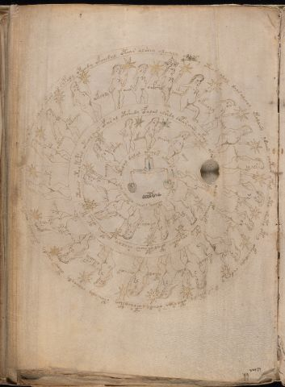

# Voynich Speculative Procedural Protocol — f72v1

IMPORTANT: this is NOT a real or validated translation of the Voynich Manuscript. It is a speculative/procedural model that interprets EVA using a user-defined grammar to generate experimental recipes using safe, known edible substitutes.

This file is generated automatically from IVTFF/EVA transliteration plus a user-defined procedural grammar.



## Page / Folio
- folio: f72v1
- page_number: 144

## EVA Text (Transliteration)
```text
oteos alar otar air chpaly oteody okchesal otear alshey oleealy sh?tey oteos alal dals alchol ytolaiin ydaiin chotar y tal oto shoty otey okchedaly chdar y s ar otedy otorar shedy opsheytey opairaly choshydy otar cheedy otaraiin cheeky okolar ychey otechety
oeeoty
octhy
oteoly
okeoly
oeees
ocfh'hy
oees
okeeoly
odal
aiinod
od[?:ch]dy
oteod
yteod
ok[?:ch]ody
okal
ytaly
oeeeos
oteofy
cheoepy
ykeedy
otar ar otol topar oteolaiin ofa[r:s]al otshedy ofalar alshdy chpar aiin okaly oka? yaly opcheolfy opar cheockey otolopaiin shaldy chepchy otey tea[n:r]
oeeoly
okydy
okeey
oiiny
oeey
okedy
ypaim
okalair
oeeody
okeol
otalal dalal ykeols oteo r aiin yotoam oteey saiin oteeos am
```

## Domain Context (Heuristic; Not a Translation)

This section summarizes recurring **basewords** in this IVTFF domain and shows simple substring evidence that the token markers used by the procedural grammar occur inside frequent words.

Any Italian anagram / English gloss is a best-effort lexicon match, not a decipherment.


### Associated basewords (non-generic; top by frequency in this domain)
- `paiin` (count=241) → Italian anagram `piani`; English: plans (arrangements)
- `qokaiin` (count=122) → Italian anagram `ciancio`; English: [n/a]
- `okaiin` (count=109) → Italian anagram `coniai`; English: [n/a]
- `qokain` (count=101) → Italian anagram `acconi`; English: [n/a]
- `okain` (count=69) → Italian anagram `acino`; English: a berry
- `qokep` (count=65) → Italian anagram `pecco`; English: [n/a]
- `otain` (count=54) → Italian anagram `anito`; English: [n/a]
- `qokar` (count=48) → Italian anagram `carco`; English: [n/a]
- `saiin` (count=48) → Italian anagram `asini`; English: [n/a]
- `qokal` (count=46) → Italian anagram `calco`; English: cast (of sculpture)
- `kaiin` (count=45) → Italian anagram `acini`; English: [n/a]
- `qotaiin` (count=40) → Italian anagram `cationi`; English: [n/a]
- `lkaiin` (count=40) → Italian anagram `ancili`; English: [n/a]
- `qokeol` (count=38) → Italian anagram `eccolo`; English: [n/a]
- `qotain` (count=34) → Italian anagram `antico`; English: ancient

### Marker evidence (substring in frequent basewords)
- `qo`: 63 basewords; examples: `qokee`, `qokeep`, `qokaiin`, `qokain`, `qokep`, `qoke`
- `q`: 64 basewords; examples: `qokee`, `qokeep`, `qokaiin`, `qokain`, `qokep`, `qoke`
- `o`: 281 basewords; examples: `qokee`, `ol`, `o`, `qokeep`, `okee`, `qokaiin`
- `k`: 150 basewords; examples: `qokee`, `qokeep`, `okee`, `qokaiin`, `okaiin`, `qokain`
- `t`: 100 basewords; examples: `otaiin`, `otee`, `otal`, `otar`, `oteep`, `otep`
- `p`: 154 basewords; examples: `paiin`, `chep`, `qokeep`, `shep`, `par`, `oteep`
- `ch`: 144 basewords; examples: `chep`, `che`, `chol`, `chee`, `cheol`, `cheo`
- `sh`: 52 basewords; examples: `shep`, `she`, `shee`, `sheol`, `sheep`, `shol`
- `f`: 2 basewords; examples: `fchep`, `f`
- `cth`: 17 basewords; examples: `chcth`, `cthe`, `shcth`, `checth`, `cthol`, `cthee`
- `ckh`: 18 basewords; examples: `chckh`, `shckh`, `checkh`, `chckhe`, `chockh`, `sheckh`
- `cph`: 3 basewords; examples: `cphol`, `cph`, `cphe`
- `iin`: 38 basewords; examples: `aiin`, `paiin`, `qokaiin`, `okaiin`, `otaiin`, `saiin`
- `aiin`: 31 basewords; examples: `aiin`, `paiin`, `qokaiin`, `okaiin`, `otaiin`, `saiin`

## Recipes Index (This Page)
- [f72v1.1,@Cc](#f72v1-1-f72v1-1-cc)
- [f72v1.2,@Lz](#f72v1-2-f72v1-2-lz)
- [f72v1.3,&Lz](#f72v1-3-f72v1-3-lz)
- [f72v1.4,&Lz](#f72v1-4-f72v1-4-lz)
- [f72v1.5,&Lz](#f72v1-5-f72v1-5-lz)
- [f72v1.6,&Lz](#f72v1-6-f72v1-6-lz)
- [f72v1.7,&Lz](#f72v1-7-f72v1-7-lz)
- [f72v1.8,&Lz](#f72v1-8-f72v1-8-lz)
- [f72v1.9,&Lz](#f72v1-9-f72v1-9-lz)
- [f72v1.10,&Lz](#f72v1-10-f72v1-10-lz)
- [f72v1.11,&Lz](#f72v1-11-f72v1-11-lz)
- [f72v1.12,&Lz](#f72v1-12-f72v1-12-lz)
- [f72v1.13,&Lz](#f72v1-13-f72v1-13-lz)
- [f72v1.14,&Lz](#f72v1-14-f72v1-14-lz)
- [f72v1.15,&Lz](#f72v1-15-f72v1-15-lz)
- [f72v1.16,&Lz](#f72v1-16-f72v1-16-lz)
- [f72v1.17,&Lz](#f72v1-17-f72v1-17-lz)
- [f72v1.18,&Lz](#f72v1-18-f72v1-18-lz)
- [f72v1.19,&Lz](#f72v1-19-f72v1-19-lz)
- [f72v1.20,&Lz](#f72v1-20-f72v1-20-lz)
- [f72v1.21,&Lz](#f72v1-21-f72v1-21-lz)
- [f72v1.22,@Cc](#f72v1-22-f72v1-22-cc)
- [f72v1.23,@Lz](#f72v1-23-f72v1-23-lz)
- [f72v1.24,&Lz](#f72v1-24-f72v1-24-lz)
- [f72v1.25,&Lz](#f72v1-25-f72v1-25-lz)
- [f72v1.26,&Lz](#f72v1-26-f72v1-26-lz)
- [f72v1.27,&Lz](#f72v1-27-f72v1-27-lz)
- [f72v1.28,&Lz](#f72v1-28-f72v1-28-lz)
- [f72v1.29,&Lz](#f72v1-29-f72v1-29-lz)
- [f72v1.30,&Lz](#f72v1-30-f72v1-30-lz)
- [f72v1.31,&Lz](#f72v1-31-f72v1-31-lz)
- [f72v1.32,&Lz](#f72v1-32-f72v1-32-lz)
- [f72v1.33,@Cc](#f72v1-33-f72v1-33-cc)

## Line Glosses (Procedural Gloss Only; Not a Translation)

<a id="f72v1-1-f72v1-1-cc"></a>

### f72v1.1,@Cc

EVA: oteos alar otar air chpaly oteody okchesal otear alshey oleealy sh?tey oteos alal dals alchol ytolaiin ydaiin chotar y tal oto shoty otey okchedaly chdar y s ar otedy otorar shedy opsheytey opairaly choshydy otar cheedy otaraiin cheeky okolar ychey otechety

Direct Gloss (Procedural, Not a Real Translation):
- oteos: tokens: o t e o s → connectors: s → vowel_run: e (level 1; class e)
- alar: tokens: a l a r → connectors: l r → vowel_run: a (level 1; class a)
- otar: tokens: o t a r → connectors: r → vowel_run: a (level 1; class a)
- air: tokens: a i r → connectors: r → vowel_run: a (level 1; class a)
- chpaly: tokens: ch p a l → connectors: l → vowel_run: a (level 1; class a)
- oteody: tokens: o t e o p → vowel_run: e (level 1; class e)
- okchesal: tokens: o k ch e s a l → connectors: s l → vowel_run: e (level 1; class e)
- otear: tokens: o t e a r → connectors: r → vowel_run: e (level 1; class e)
- alshey: tokens: a l sh e → connectors: l → vowel_run: a (level 1; class a)
- oleealy: tokens: o l ee a l → connectors: l l → vowel_run: ee (level 2; class e)
- sh: tokens: sh
- tey: tokens: t e → vowel_run: e (level 1; class e)
- oteos: tokens: o t e o s → connectors: s → vowel_run: e (level 1; class e)
- alal: tokens: a l a l → connectors: l l → vowel_run: a (level 1; class a)
- dals: tokens: p a l s → connectors: l s → vowel_run: a (level 1; class a)
- alchol: tokens: a l ch o l → connectors: l l → vowel_run: a (level 1; class a)
- ytolaiin: tokens: t o l aiin → connectors: l → vowel_run: a (level 1; class a) → suffix: aiin
- ydaiin: tokens: p aiin → vowel_run: a (level 1; class a) → suffix: aiin (lexicon-context: `paiin` → `piani`; plans (arrangements))
- chotar: tokens: ch o t a r → connectors: r → vowel_run: a (level 1; class a)
- y: [unparsed]
- tal: tokens: t a l → connectors: l → vowel_run: a (level 1; class a)
- oto: tokens: o t o
- shoty: tokens: sh o t
- otey: tokens: o t e → vowel_run: e (level 1; class e)
- okchedaly: tokens: o k ch e p a l → connectors: l → vowel_run: e (level 1; class e)
- chdar: tokens: ch p a r → connectors: r → vowel_run: a (level 1; class a)
- y: [unparsed]
- s: tokens: s → connectors: s
- ar: tokens: a r → connectors: r → vowel_run: a (level 1; class a)
- otedy: tokens: o t e p → vowel_run: e (level 1; class e)
- otorar: tokens: o t o r a r → connectors: r r → vowel_run: a (level 1; class a)
- shedy: tokens: sh e p → vowel_run: e (level 1; class e)
- opsheytey: tokens: o p sh e t e → vowel_run: e (level 1; class e)
- opairaly: tokens: o p a i r a l → connectors: r l → vowel_run: a (level 1; class a)
- choshydy: tokens: ch o sh p
- otar: tokens: o t a r → connectors: r → vowel_run: a (level 1; class a)
- cheedy: tokens: ch ee p → vowel_run: ee (level 2; class e)
- otaraiin: tokens: o t a r aiin → connectors: r → vowel_run: a (level 1; class a) → suffix: aiin
- cheeky: tokens: ch ee k → vowel_run: ee (level 2; class e)
- okolar: tokens: o k o l a r → connectors: l r → vowel_run: a (level 1; class a)
- ychey: tokens: ch e → vowel_run: e (level 1; class e)
- otechety: tokens: o t e ch e t → vowel_run: e (level 1; class e)

<a id="f72v1-2-f72v1-2-lz"></a>

### f72v1.2,@Lz

EVA: oeeoty

Direct Gloss (Procedural, Not a Real Translation):
- oeeoty: tokens: o ee o t → vowel_run: ee (level 2; class e)

<a id="f72v1-3-f72v1-3-lz"></a>

### f72v1.3,&Lz

EVA: octhy

Direct Gloss (Procedural, Not a Real Translation):
- octhy: tokens: o cth

<a id="f72v1-4-f72v1-4-lz"></a>

### f72v1.4,&Lz

EVA: oteoly

Direct Gloss (Procedural, Not a Real Translation):
- oteoly: tokens: o t e o l → connectors: l → vowel_run: e (level 1; class e)

<a id="f72v1-5-f72v1-5-lz"></a>

### f72v1.5,&Lz

EVA: okeoly

Direct Gloss (Procedural, Not a Real Translation):
- okeoly: tokens: o k e o l → connectors: l → vowel_run: e (level 1; class e)

<a id="f72v1-6-f72v1-6-lz"></a>

### f72v1.6,&Lz

EVA: oeees

Direct Gloss (Procedural, Not a Real Translation):
- oeees: tokens: o eee s → connectors: s → vowel_run: eee (level 3; class e)

<a id="f72v1-7-f72v1-7-lz"></a>

### f72v1.7,&Lz

EVA: ocfh'hy

Direct Gloss (Procedural, Not a Real Translation):
- ocfh: tokens: o cfh
- hy: tokens: h → unmodeled_tokens: h

<a id="f72v1-8-f72v1-8-lz"></a>

### f72v1.8,&Lz

EVA: oees

Direct Gloss (Procedural, Not a Real Translation):
- oees: tokens: o ee s → connectors: s → vowel_run: ee (level 2; class e)

<a id="f72v1-9-f72v1-9-lz"></a>

### f72v1.9,&Lz

EVA: okeeoly

Direct Gloss (Procedural, Not a Real Translation):
- okeeoly: tokens: o k ee o l → connectors: l → vowel_run: ee (level 2; class e)

<a id="f72v1-10-f72v1-10-lz"></a>

### f72v1.10,&Lz

EVA: odal

Direct Gloss (Procedural, Not a Real Translation):
- odal: tokens: o p a l → connectors: l → vowel_run: a (level 1; class a)

<a id="f72v1-11-f72v1-11-lz"></a>

### f72v1.11,&Lz

EVA: aiinod

Direct Gloss (Procedural, Not a Real Translation):
- aiinod: tokens: aiin o p → vowel_run: a (level 1; class a) → suffix: aiin

<a id="f72v1-12-f72v1-12-lz"></a>

### f72v1.12,&Lz

EVA: od[?:ch]dy

Direct Gloss (Procedural, Not a Real Translation):
- od: tokens: o p
- ch: tokens: ch
- dy: tokens: p

<a id="f72v1-13-f72v1-13-lz"></a>

### f72v1.13,&Lz

EVA: oteod

Direct Gloss (Procedural, Not a Real Translation):
- oteod: tokens: o t e o p → vowel_run: e (level 1; class e)

<a id="f72v1-14-f72v1-14-lz"></a>

### f72v1.14,&Lz

EVA: yteod

Direct Gloss (Procedural, Not a Real Translation):
- yteod: tokens: t e o p → vowel_run: e (level 1; class e)

<a id="f72v1-15-f72v1-15-lz"></a>

### f72v1.15,&Lz

EVA: ok[?:ch]ody

Direct Gloss (Procedural, Not a Real Translation):
- ok: tokens: o k
- ch: tokens: ch
- ody: tokens: o p

<a id="f72v1-16-f72v1-16-lz"></a>

### f72v1.16,&Lz

EVA: okal

Direct Gloss (Procedural, Not a Real Translation):
- okal: tokens: o k a l → connectors: l → vowel_run: a (level 1; class a)

<a id="f72v1-17-f72v1-17-lz"></a>

### f72v1.17,&Lz

EVA: ytaly

Direct Gloss (Procedural, Not a Real Translation):
- ytaly: tokens: t a l → connectors: l → vowel_run: a (level 1; class a)

<a id="f72v1-18-f72v1-18-lz"></a>

### f72v1.18,&Lz

EVA: oeeeos

Direct Gloss (Procedural, Not a Real Translation):
- oeeeos: tokens: o eee o s → connectors: s → vowel_run: eee (level 3; class e)

<a id="f72v1-19-f72v1-19-lz"></a>

### f72v1.19,&Lz

EVA: oteofy

Direct Gloss (Procedural, Not a Real Translation):
- oteofy: tokens: o t e o f → vowel_run: e (level 1; class e)

<a id="f72v1-20-f72v1-20-lz"></a>

### f72v1.20,&Lz

EVA: cheoepy

Direct Gloss (Procedural, Not a Real Translation):
- cheoepy: tokens: ch e o e p → vowel_run: e (level 1; class e)

<a id="f72v1-21-f72v1-21-lz"></a>

### f72v1.21,&Lz

EVA: ykeedy

Direct Gloss (Procedural, Not a Real Translation):
- ykeedy: tokens: k ee p → vowel_run: ee (level 2; class e)

<a id="f72v1-22-f72v1-22-cc"></a>

### f72v1.22,@Cc

EVA: otar ar otol topar oteolaiin ofa[r:s]al otshedy ofalar alshdy chpar aiin okaly oka? yaly opcheolfy opar cheockey otolopaiin shaldy chepchy otey tea[n:r]

Direct Gloss (Procedural, Not a Real Translation):
- otar: tokens: o t a r → connectors: r → vowel_run: a (level 1; class a)
- ar: tokens: a r → connectors: r → vowel_run: a (level 1; class a)
- otol: tokens: o t o l → connectors: l
- topar: tokens: t o p a r → connectors: r → vowel_run: a (level 1; class a)
- oteolaiin: tokens: o t e o l aiin → connectors: l → vowel_run: e (level 1; class e) → suffix: aiin
- ofa: tokens: o f a → vowel_run: a (level 1; class a)
- r: tokens: r → connectors: r
- s: tokens: s → connectors: s
- al: tokens: a l → connectors: l → vowel_run: a (level 1; class a)
- otshedy: tokens: o t sh e p → vowel_run: e (level 1; class e)
- ofalar: tokens: o f a l a r → connectors: l r → vowel_run: a (level 1; class a)
- alshdy: tokens: a l sh p → connectors: l → vowel_run: a (level 1; class a)
- chpar: tokens: ch p a r → connectors: r → vowel_run: a (level 1; class a)
- aiin: tokens: aiin → vowel_run: a (level 1; class a) → suffix: aiin
- okaly: tokens: o k a l → connectors: l → vowel_run: a (level 1; class a)
- oka: tokens: o k a → vowel_run: a (level 1; class a)
- yaly: tokens: a l → connectors: l → vowel_run: a (level 1; class a)
- opcheolfy: tokens: o p ch e o l f → connectors: l → vowel_run: e (level 1; class e)
- opar: tokens: o p a r → connectors: r → vowel_run: a (level 1; class a)
- cheockey: tokens: ch e o c k e → vowel_run: e (level 1; class e)
- otolopaiin: tokens: o t o l o p aiin → connectors: l → vowel_run: a (level 1; class a) → suffix: aiin (lexicon-context: `opaiin` → `opinai`; [n/a])
- shaldy: tokens: sh a l p → connectors: l → vowel_run: a (level 1; class a)
- chepchy: tokens: ch e p ch → vowel_run: e (level 1; class e)
- otey: tokens: o t e → vowel_run: e (level 1; class e)
- tea: tokens: t e a → vowel_run: e (level 1; class e)
- n: tokens: n → connectors: n
- r: tokens: r → connectors: r

<a id="f72v1-23-f72v1-23-lz"></a>

### f72v1.23,@Lz

EVA: oeeoly

Direct Gloss (Procedural, Not a Real Translation):
- oeeoly: tokens: o ee o l → connectors: l → vowel_run: ee (level 2; class e)

<a id="f72v1-24-f72v1-24-lz"></a>

### f72v1.24,&Lz

EVA: okydy

Direct Gloss (Procedural, Not a Real Translation):
- okydy: tokens: o k p

<a id="f72v1-25-f72v1-25-lz"></a>

### f72v1.25,&Lz

EVA: okeey

Direct Gloss (Procedural, Not a Real Translation):
- okeey: tokens: o k ee → vowel_run: ee (level 2; class e)

<a id="f72v1-26-f72v1-26-lz"></a>

### f72v1.26,&Lz

EVA: oiiny

Direct Gloss (Procedural, Not a Real Translation):
- oiiny: tokens: o iin → vowel_run: ii (level 2; class i) → suffix: iin

<a id="f72v1-27-f72v1-27-lz"></a>

### f72v1.27,&Lz

EVA: oeey

Direct Gloss (Procedural, Not a Real Translation):
- oeey: tokens: o ee → vowel_run: ee (level 2; class e)

<a id="f72v1-28-f72v1-28-lz"></a>

### f72v1.28,&Lz

EVA: okedy

Direct Gloss (Procedural, Not a Real Translation):
- okedy: tokens: o k e p → vowel_run: e (level 1; class e)

<a id="f72v1-29-f72v1-29-lz"></a>

### f72v1.29,&Lz

EVA: ypaim

Direct Gloss (Procedural, Not a Real Translation):
- ypaim: tokens: p a i m → connectors: m → vowel_run: a (level 1; class a)

<a id="f72v1-30-f72v1-30-lz"></a>

### f72v1.30,&Lz

EVA: okalair

Direct Gloss (Procedural, Not a Real Translation):
- okalair: tokens: o k a l a i r → connectors: l r → vowel_run: a (level 1; class a)

<a id="f72v1-31-f72v1-31-lz"></a>

### f72v1.31,&Lz

EVA: oeeody

Direct Gloss (Procedural, Not a Real Translation):
- oeeody: tokens: o ee o p → vowel_run: ee (level 2; class e)

<a id="f72v1-32-f72v1-32-lz"></a>

### f72v1.32,&Lz

EVA: okeol

Direct Gloss (Procedural, Not a Real Translation):
- okeol: tokens: o k e o l → connectors: l → vowel_run: e (level 1; class e)

<a id="f72v1-33-f72v1-33-cc"></a>

### f72v1.33,@Cc

EVA: otalal dalal ykeols oteo r aiin yotoam oteey saiin oteeos am

Direct Gloss (Procedural, Not a Real Translation):
- otalal: tokens: o t a l a l → connectors: l l → vowel_run: a (level 1; class a)
- dalal: tokens: p a l a l → connectors: l l → vowel_run: a (level 1; class a)
- ykeols: tokens: k e o l s → connectors: l s → vowel_run: e (level 1; class e)
- oteo: tokens: o t e o → vowel_run: e (level 1; class e)
- r: tokens: r → connectors: r
- aiin: tokens: aiin → vowel_run: a (level 1; class a) → suffix: aiin
- yotoam: tokens: o t o a m → connectors: m → vowel_run: a (level 1; class a)
- oteey: tokens: o t ee → vowel_run: ee (level 2; class e)
- saiin: tokens: s aiin → connectors: s → vowel_run: a (level 1; class a) → suffix: aiin (lexicon-context: `saiin` → `asini`; [n/a])
- oteeos: tokens: o t ee o s → connectors: s → vowel_run: ee (level 2; class e)
- am: tokens: a m → connectors: m → vowel_run: a (level 1; class a)
