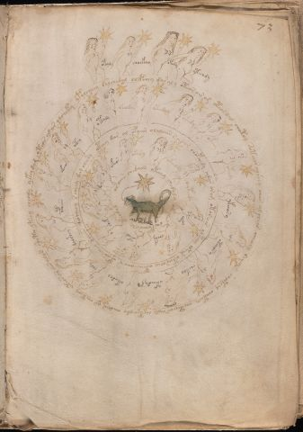

# Voynich Speculative Procedural Protocol — f73r

IMPORTANT: this is NOT a real or validated translation of the Voynich Manuscript. It is a speculative/procedural model that interprets EVA using a user-defined grammar to generate experimental recipes using safe, known edible substitutes.

This file is generated automatically from IVTFF/EVA transliteration plus a user-defined procedural grammar.



## Page / Folio
- folio: f73r
- page_number: 145

## EVA Text (Transliteration)
```text
otaly
chockhy
otedy
yteeody
ypolcheey salchedal chepchey daraly oteos air ar oteosdal chot[oe:ee]y soteees alshey [oh:ch]es al chees che[o:a]ly jeiii? choteey cheteey cheteeeos aiin chetchody chedar ar cheteey otecos ar airalor shetee yteey cheody ykeydam oteos alar alcheky
otaly
okeody
oteedyl
[y:o]keedy
okeey
okeedy
ykeeory
oteeosy
shekal
oteedyy
oked[a:o]l
chdy
dalshey
opaiin
okeos
otey
oteey dar al opaiin olalaiin s air am chopchedy chdar oram otareees olteey okees otar chey oteas ochor oparchey daiin qocheey s cheey dal cheesy
okary
okeeody
oyteedy
oky
chefy
otal
chek
ar
kar
okeeos
osaiin chedain oteey chedaly okechs chepcheesaly oteodal
```

## Domain Context (Heuristic; Not a Translation)

This section summarizes recurring **basewords** in this IVTFF domain and shows simple substring evidence that the token markers used by the procedural grammar occur inside frequent words.

Any Italian anagram / English gloss is a best-effort lexicon match, not a decipherment.


### Associated basewords (non-generic; top by frequency in this domain)
- `paiin` (count=241) → Italian anagram `piani`; English: plans (arrangements)
- `qokaiin` (count=122) → Italian anagram `ciancio`; English: [n/a]
- `okaiin` (count=109) → Italian anagram `coniai`; English: [n/a]
- `qokain` (count=101) → Italian anagram `acconi`; English: [n/a]
- `okain` (count=69) → Italian anagram `acino`; English: a berry
- `qokep` (count=65) → Italian anagram `pecco`; English: [n/a]
- `otain` (count=54) → Italian anagram `anito`; English: [n/a]
- `qokar` (count=48) → Italian anagram `carco`; English: [n/a]
- `saiin` (count=48) → Italian anagram `asini`; English: [n/a]
- `qokal` (count=46) → Italian anagram `calco`; English: cast (of sculpture)
- `kaiin` (count=45) → Italian anagram `acini`; English: [n/a]
- `qotaiin` (count=40) → Italian anagram `cationi`; English: [n/a]
- `lkaiin` (count=40) → Italian anagram `ancili`; English: [n/a]
- `qokeol` (count=38) → Italian anagram `eccolo`; English: [n/a]
- `qotain` (count=34) → Italian anagram `antico`; English: ancient

### Marker evidence (substring in frequent basewords)
- `qo`: 63 basewords; examples: `qokee`, `qokeep`, `qokaiin`, `qokain`, `qokep`, `qoke`
- `q`: 64 basewords; examples: `qokee`, `qokeep`, `qokaiin`, `qokain`, `qokep`, `qoke`
- `o`: 281 basewords; examples: `qokee`, `ol`, `o`, `qokeep`, `okee`, `qokaiin`
- `k`: 150 basewords; examples: `qokee`, `qokeep`, `okee`, `qokaiin`, `okaiin`, `qokain`
- `t`: 100 basewords; examples: `otaiin`, `otee`, `otal`, `otar`, `oteep`, `otep`
- `p`: 154 basewords; examples: `paiin`, `chep`, `qokeep`, `shep`, `par`, `oteep`
- `ch`: 144 basewords; examples: `chep`, `che`, `chol`, `chee`, `cheol`, `cheo`
- `sh`: 52 basewords; examples: `shep`, `she`, `shee`, `sheol`, `sheep`, `shol`
- `f`: 2 basewords; examples: `fchep`, `f`
- `cth`: 17 basewords; examples: `chcth`, `cthe`, `shcth`, `checth`, `cthol`, `cthee`
- `ckh`: 18 basewords; examples: `chckh`, `shckh`, `checkh`, `chckhe`, `chockh`, `sheckh`
- `cph`: 3 basewords; examples: `cphol`, `cph`, `cphe`
- `iin`: 38 basewords; examples: `aiin`, `paiin`, `qokaiin`, `okaiin`, `otaiin`, `saiin`
- `aiin`: 31 basewords; examples: `aiin`, `paiin`, `qokaiin`, `okaiin`, `otaiin`, `saiin`

## Recipes Index (This Page)
- [f73r.1,@Lz](#f73r-1-f73r-1-lz)
- [f73r.2,&Lz](#f73r-2-f73r-2-lz)
- [f73r.3,&Lz](#f73r-3-f73r-3-lz)
- [f73r.4,&Lz](#f73r-4-f73r-4-lz)
- [f73r.5,@Cc](#f73r-5-f73r-5-cc)
- [f73r.6,@Lz](#f73r-6-f73r-6-lz)
- [f73r.7,&Lz](#f73r-7-f73r-7-lz)
- [f73r.8,&Lz](#f73r-8-f73r-8-lz)
- [f73r.9,&Lz](#f73r-9-f73r-9-lz)
- [f73r.10,&Lz](#f73r-10-f73r-10-lz)
- [f73r.11,&Lz](#f73r-11-f73r-11-lz)
- [f73r.12,&Lz](#f73r-12-f73r-12-lz)
- [f73r.13,&Lz](#f73r-13-f73r-13-lz)
- [f73r.14,&Lz](#f73r-14-f73r-14-lz)
- [f73r.15,&Lz](#f73r-15-f73r-15-lz)
- [f73r.16,&Lz](#f73r-16-f73r-16-lz)
- [f73r.17,&Lz](#f73r-17-f73r-17-lz)
- [f73r.18,&Lz](#f73r-18-f73r-18-lz)
- [f73r.19,&Lz](#f73r-19-f73r-19-lz)
- [f73r.20,&Lz](#f73r-20-f73r-20-lz)
- [f73r.21,&Lz](#f73r-21-f73r-21-lz)
- [f73r.22,@Cc](#f73r-22-f73r-22-cc)
- [f73r.23,@Lz](#f73r-23-f73r-23-lz)
- [f73r.24,&Lz](#f73r-24-f73r-24-lz)
- [f73r.25,&Lz](#f73r-25-f73r-25-lz)
- [f73r.26,&Lz](#f73r-26-f73r-26-lz)
- [f73r.27,&Lz](#f73r-27-f73r-27-lz)
- [f73r.28,&Lz](#f73r-28-f73r-28-lz)
- [f73r.29,&Lz](#f73r-29-f73r-29-lz)
- [f73r.30,&Lz](#f73r-30-f73r-30-lz)
- [f73r.31,&Lz](#f73r-31-f73r-31-lz)
- [f73r.32,&Lz](#f73r-32-f73r-32-lz)
- [f73r.33,@Cc](#f73r-33-f73r-33-cc)

## Line Glosses (Procedural Gloss Only; Not a Translation)

<a id="f73r-1-f73r-1-lz"></a>

### f73r.1,@Lz

EVA (original line):
```text
otaly
```

English structural gloss (generated):

- otaly: tokens: o t a l → connectors: l → vowel_run: a (level 1; class a)

<a id="f73r-2-f73r-2-lz"></a>

### f73r.2,&Lz

EVA (original line):
```text
chockhy
```

English structural gloss (generated):

- chockhy: tokens: ch o ckh

<a id="f73r-3-f73r-3-lz"></a>

### f73r.3,&Lz

EVA (original line):
```text
otedy
```

English structural gloss (generated):

- otedy: tokens: o t e p → vowel_run: e (level 1; class e)

<a id="f73r-4-f73r-4-lz"></a>

### f73r.4,&Lz

EVA (original line):
```text
yteeody
```

English structural gloss (generated):

- yteeody: tokens: t ee o p → vowel_run: ee (level 2; class e)

<a id="f73r-5-f73r-5-cc"></a>

### f73r.5,@Cc

EVA (original line):
```text
ypolcheey salchedal chepchey daraly oteos air ar oteosdal chot[oe:ee]y soteees alshey [oh:ch]es al chees che[o:a]ly jeiii? choteey cheteey cheteeeos aiin chetchody chedar ar cheteey otecos ar airalor shetee yteey cheody ykeydam oteos alar alcheky
```

English structural gloss (generated):

- ypolcheey: tokens: p o l ch ee → connectors: l → vowel_run: ee (level 2; class e)
- salchedal: tokens: s a l ch e p a l → connectors: s l l → vowel_run: a (level 1; class a)
- chepchey: tokens: ch e p ch e → vowel_run: e (level 1; class e)
- daraly: tokens: p a r a l → connectors: r l → vowel_run: a (level 1; class a)
- oteos: tokens: o t e o s → connectors: s → vowel_run: e (level 1; class e)
- air: tokens: a i r → connectors: r → vowel_run: a (level 1; class a)
- ar: tokens: a r → connectors: r → vowel_run: a (level 1; class a)
- oteosdal: tokens: o t e o s p a l → connectors: s l → vowel_run: e (level 1; class e)
- chot: tokens: ch o t
- oe: tokens: o e → vowel_run: e (level 1; class e)
- ee: tokens: ee → vowel_run: ee (level 2; class e)
- y: [unparsed]
- soteees: tokens: s o t eee s → connectors: s s → vowel_run: eee (level 3; class e)
- alshey: tokens: a l sh e → connectors: l → vowel_run: a (level 1; class a)
- oh: tokens: o h → unmodeled_tokens: h
- ch: tokens: ch
- es: tokens: e s → connectors: s → vowel_run: e (level 1; class e)
- al: tokens: a l → connectors: l → vowel_run: a (level 1; class a)
- chees: tokens: ch ee s → connectors: s → vowel_run: ee (level 2; class e)
- che: tokens: ch e → vowel_run: e (level 1; class e)
- o: tokens: o
- a: tokens: a → vowel_run: a (level 1; class a)
- ly: tokens: l → connectors: l
- jeiii: tokens: j e iii → vowel_run: e (level 1; class e)
- choteey: tokens: ch o t ee → vowel_run: ee (level 2; class e)
- cheteey: tokens: ch e t ee → vowel_run: e (level 1; class e)
- cheteeeos: tokens: ch e t eee o s → connectors: s → vowel_run: e (level 1; class e)
- aiin: tokens: aiin → vowel_run: a (level 1; class a) → suffix: aiin
- chetchody: tokens: ch e t ch o p → vowel_run: e (level 1; class e)
- chedar: tokens: ch e p a r → connectors: r → vowel_run: e (level 1; class e) (lexicon-context: `chepar` → `capre`; [n/a])
- ar: tokens: a r → connectors: r → vowel_run: a (level 1; class a)
- cheteey: tokens: ch e t ee → vowel_run: e (level 1; class e)
- otecos: tokens: o t e c o s → connectors: s → vowel_run: e (level 1; class e)
- ar: tokens: a r → connectors: r → vowel_run: a (level 1; class a)
- airalor: tokens: a i r a l o r → connectors: r l r → vowel_run: a (level 1; class a)
- shetee: tokens: sh e t ee → vowel_run: e (level 1; class e)
- yteey: tokens: t ee → vowel_run: ee (level 2; class e)
- cheody: tokens: ch e o p → vowel_run: e (level 1; class e)
- ykeydam: tokens: k e p a m → connectors: m → vowel_run: e (level 1; class e)
- oteos: tokens: o t e o s → connectors: s → vowel_run: e (level 1; class e)
- alar: tokens: a l a r → connectors: l r → vowel_run: a (level 1; class a)
- alcheky: tokens: a l ch e k → connectors: l → vowel_run: a (level 1; class a)

<a id="f73r-6-f73r-6-lz"></a>

### f73r.6,@Lz

EVA (original line):
```text
otaly
```

English structural gloss (generated):

- otaly: tokens: o t a l → connectors: l → vowel_run: a (level 1; class a)

<a id="f73r-7-f73r-7-lz"></a>

### f73r.7,&Lz

EVA (original line):
```text
okeody
```

English structural gloss (generated):

- okeody: tokens: o k e o p → vowel_run: e (level 1; class e)

<a id="f73r-8-f73r-8-lz"></a>

### f73r.8,&Lz

EVA (original line):
```text
oteedyl
```

English structural gloss (generated):

- oteedyl: tokens: o t ee p l → connectors: l → vowel_run: ee (level 2; class e)

<a id="f73r-9-f73r-9-lz"></a>

### f73r.9,&Lz

EVA (original line):
```text
[y:o]keedy
```

English structural gloss (generated):

- y: [unparsed]
- o: tokens: o
- keedy: tokens: k ee p → vowel_run: ee (level 2; class e)

<a id="f73r-10-f73r-10-lz"></a>

### f73r.10,&Lz

EVA (original line):
```text
okeey
```

English structural gloss (generated):

- okeey: tokens: o k ee → vowel_run: ee (level 2; class e)

<a id="f73r-11-f73r-11-lz"></a>

### f73r.11,&Lz

EVA (original line):
```text
okeedy
```

English structural gloss (generated):

- okeedy: tokens: o k ee p → vowel_run: ee (level 2; class e)

<a id="f73r-12-f73r-12-lz"></a>

### f73r.12,&Lz

EVA (original line):
```text
ykeeory
```

English structural gloss (generated):

- ykeeory: tokens: k ee o r → connectors: r → vowel_run: ee (level 2; class e)

<a id="f73r-13-f73r-13-lz"></a>

### f73r.13,&Lz

EVA (original line):
```text
oteeosy
```

English structural gloss (generated):

- oteeosy: tokens: o t ee o s → connectors: s → vowel_run: ee (level 2; class e)

<a id="f73r-14-f73r-14-lz"></a>

### f73r.14,&Lz

EVA (original line):
```text
shekal
```

English structural gloss (generated):

- shekal: tokens: sh e k a l → connectors: l → vowel_run: e (level 1; class e)

<a id="f73r-15-f73r-15-lz"></a>

### f73r.15,&Lz

EVA (original line):
```text
oteedyy
```

English structural gloss (generated):

- oteedyy: tokens: o t ee p → vowel_run: ee (level 2; class e)

<a id="f73r-16-f73r-16-lz"></a>

### f73r.16,&Lz

EVA (original line):
```text
oked[a:o]l
```

English structural gloss (generated):

- oked: tokens: o k e p → vowel_run: e (level 1; class e)
- a: tokens: a → vowel_run: a (level 1; class a)
- o: tokens: o
- l: tokens: l → connectors: l

<a id="f73r-17-f73r-17-lz"></a>

### f73r.17,&Lz

EVA (original line):
```text
chdy
```

English structural gloss (generated):

- chdy: tokens: ch p

<a id="f73r-18-f73r-18-lz"></a>

### f73r.18,&Lz

EVA (original line):
```text
dalshey
```

English structural gloss (generated):

- dalshey: tokens: p a l sh e → connectors: l → vowel_run: a (level 1; class a)

<a id="f73r-19-f73r-19-lz"></a>

### f73r.19,&Lz

EVA (original line):
```text
opaiin
```

English structural gloss (generated):

- opaiin: tokens: o p aiin → vowel_run: a (level 1; class a) → suffix: aiin (lexicon-context: `opaiin` → `opinai`; [n/a])

<a id="f73r-20-f73r-20-lz"></a>

### f73r.20,&Lz

EVA (original line):
```text
okeos
```

English structural gloss (generated):

- okeos: tokens: o k e o s → connectors: s → vowel_run: e (level 1; class e)

<a id="f73r-21-f73r-21-lz"></a>

### f73r.21,&Lz

EVA (original line):
```text
otey
```

English structural gloss (generated):

- otey: tokens: o t e → vowel_run: e (level 1; class e)

<a id="f73r-22-f73r-22-cc"></a>

### f73r.22,@Cc

EVA (original line):
```text
oteey dar al opaiin olalaiin s air am chopchedy chdar oram otareees olteey okees otar chey oteas ochor oparchey daiin qocheey s cheey dal cheesy
```

English structural gloss (generated):

- oteey: tokens: o t ee → vowel_run: ee (level 2; class e)
- dar: tokens: p a r → connectors: r → vowel_run: a (level 1; class a)
- al: tokens: a l → connectors: l → vowel_run: a (level 1; class a)
- opaiin: tokens: o p aiin → vowel_run: a (level 1; class a) → suffix: aiin (lexicon-context: `opaiin` → `opinai`; [n/a])
- olalaiin: tokens: o l a l aiin → connectors: l l → vowel_run: a (level 1; class a) → suffix: aiin
- s: tokens: s → connectors: s
- air: tokens: a i r → connectors: r → vowel_run: a (level 1; class a)
- am: tokens: a m → connectors: m → vowel_run: a (level 1; class a)
- chopchedy: tokens: ch o p ch e p → vowel_run: e (level 1; class e)
- chdar: tokens: ch p a r → connectors: r → vowel_run: a (level 1; class a)
- oram: tokens: o r a m → connectors: r m → vowel_run: a (level 1; class a)
- otareees: tokens: o t a r eee s → connectors: r s → vowel_run: a (level 1; class a)
- olteey: tokens: o l t ee → connectors: l → vowel_run: ee (level 2; class e)
- okees: tokens: o k ee s → connectors: s → vowel_run: ee (level 2; class e)
- otar: tokens: o t a r → connectors: r → vowel_run: a (level 1; class a)
- chey: tokens: ch e → vowel_run: e (level 1; class e)
- oteas: tokens: o t e a s → connectors: s → vowel_run: e (level 1; class e)
- ochor: tokens: o ch o r → connectors: r
- oparchey: tokens: o p a r ch e → connectors: r → vowel_run: a (level 1; class a)
- daiin: tokens: p aiin → vowel_run: a (level 1; class a) → suffix: aiin (lexicon-context: `paiin` → `piani`; plans (arrangements))
- qocheey: tokens: qo ch ee → vowel_run: ee (level 2; class e)
- s: tokens: s → connectors: s
- cheey: tokens: ch ee → vowel_run: ee (level 2; class e)
- dal: tokens: p a l → connectors: l → vowel_run: a (level 1; class a)
- cheesy: tokens: ch ee s → connectors: s → vowel_run: ee (level 2; class e)

<a id="f73r-23-f73r-23-lz"></a>

### f73r.23,@Lz

EVA (original line):
```text
okary
```

English structural gloss (generated):

- okary: tokens: o k a r → connectors: r → vowel_run: a (level 1; class a)

<a id="f73r-24-f73r-24-lz"></a>

### f73r.24,&Lz

EVA (original line):
```text
okeeody
```

English structural gloss (generated):

- okeeody: tokens: o k ee o p → vowel_run: ee (level 2; class e)

<a id="f73r-25-f73r-25-lz"></a>

### f73r.25,&Lz

EVA (original line):
```text
oyteedy
```

English structural gloss (generated):

- oyteedy: tokens: o t ee p → vowel_run: ee (level 2; class e)

<a id="f73r-26-f73r-26-lz"></a>

### f73r.26,&Lz

EVA (original line):
```text
oky
```

English structural gloss (generated):

- oky: tokens: o k

<a id="f73r-27-f73r-27-lz"></a>

### f73r.27,&Lz

EVA (original line):
```text
chefy
```

English structural gloss (generated):

- chefy: tokens: ch e f → vowel_run: e (level 1; class e)

<a id="f73r-28-f73r-28-lz"></a>

### f73r.28,&Lz

EVA (original line):
```text
otal
```

English structural gloss (generated):

- otal: tokens: o t a l → connectors: l → vowel_run: a (level 1; class a)

<a id="f73r-29-f73r-29-lz"></a>

### f73r.29,&Lz

EVA (original line):
```text
chek
```

English structural gloss (generated):

- chek: tokens: ch e k → vowel_run: e (level 1; class e)

<a id="f73r-30-f73r-30-lz"></a>

### f73r.30,&Lz

EVA (original line):
```text
ar
```

English structural gloss (generated):

- ar: tokens: a r → connectors: r → vowel_run: a (level 1; class a)

<a id="f73r-31-f73r-31-lz"></a>

### f73r.31,&Lz

EVA (original line):
```text
kar
```

English structural gloss (generated):

- kar: tokens: k a r → connectors: r → vowel_run: a (level 1; class a)

<a id="f73r-32-f73r-32-lz"></a>

### f73r.32,&Lz

EVA (original line):
```text
okeeos
```

English structural gloss (generated):

- okeeos: tokens: o k ee o s → connectors: s → vowel_run: ee (level 2; class e)

<a id="f73r-33-f73r-33-cc"></a>

### f73r.33,@Cc

EVA (original line):
```text
osaiin chedain oteey chedaly okechs chepcheesaly oteodal
```

English structural gloss (generated):

- osaiin: tokens: o s aiin → connectors: s → vowel_run: a (level 1; class a) → suffix: aiin (lexicon-context: `saiin` → `asini`; [n/a])
- chedain: tokens: ch e p a i n → connectors: n → vowel_run: e (level 1; class e)
- oteey: tokens: o t ee → vowel_run: ee (level 2; class e)
- chedaly: tokens: ch e p a l → connectors: l → vowel_run: e (level 1; class e)
- okechs: tokens: o k e ch s → connectors: s → vowel_run: e (level 1; class e)
- chepcheesaly: tokens: ch e p ch ee s a l → connectors: s l → vowel_run: e (level 1; class e)
- oteodal: tokens: o t e o p a l → connectors: l → vowel_run: e (level 1; class e)
