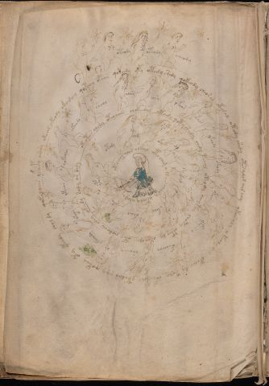

# Voynich Speculative Procedural Protocol — f73v

IMPORTANT: this is NOT a real or validated translation of the Voynich Manuscript. It is a speculative/procedural model that interprets EVA using a user-defined grammar to generate experimental recipes using safe, known edible substitutes.

This file is generated automatically from IVTFF/EVA transliteration plus a user-defined procedural grammar.



## Page / Folio
- folio: f73v
- page_number: 146

## EVA Text (Transliteration)
```text
okol
oteody
oteedy
eeeody
otoar ykeody okodeey qopchey opaiin qoteedy dpy otedy shedy qokeody cheor al okegal oteody shedy otesalod air chy ykeesaly y keoly dys opchey dy toly chfaikchy ytedar eeey qokeey oty yteedy choldy qokalaiin ykaipy orary
okeody
sheol
odees
ee[r:n]y
okeor
ofals
ykeody
oteody
ypaiin
yfaiin y
ofcheesy
oraiiny
ykeeody
okeos
ykeear
qokeoly
oteoto[s:r] alshy oteolain chokeedam otody qoty shedy chdy tchol oteody cheytey choty o[k:t]ey dy okecholy otey chodaiin chey okeedy saly ar daly
otedy
eeed
oky
oia?
okal
ykey
ykeee
okeod
ykey
ypal
otedchor alar olkcho otolam o kees char y ytaly alaly otaram
```

## Domain Context (Heuristic; Not a Translation)

This section summarizes recurring **basewords** in this IVTFF domain and shows simple substring evidence that the token markers used by the procedural grammar occur inside frequent words.

Any Italian anagram / English gloss is a best-effort lexicon match, not a decipherment.


### Associated basewords (non-generic; top by frequency in this domain)
- `paiin` (count=241) → Italian anagram `piani`; English: plans (arrangements)
- `qokaiin` (count=122) → Italian anagram `ciancio`; English: [n/a]
- `okaiin` (count=109) → Italian anagram `coniai`; English: [n/a]
- `qokain` (count=101) → Italian anagram `acconi`; English: [n/a]
- `okain` (count=69) → Italian anagram `acino`; English: a berry
- `qokep` (count=65) → Italian anagram `pecco`; English: [n/a]
- `otain` (count=54) → Italian anagram `anito`; English: [n/a]
- `qokar` (count=48) → Italian anagram `carco`; English: [n/a]
- `saiin` (count=48) → Italian anagram `asini`; English: [n/a]
- `qokal` (count=46) → Italian anagram `calco`; English: cast (of sculpture)
- `kaiin` (count=45) → Italian anagram `acini`; English: [n/a]
- `qotaiin` (count=40) → Italian anagram `cationi`; English: [n/a]
- `lkaiin` (count=40) → Italian anagram `ancili`; English: [n/a]
- `qokeol` (count=38) → Italian anagram `eccolo`; English: [n/a]
- `qotain` (count=34) → Italian anagram `antico`; English: ancient

### Marker evidence (substring in frequent basewords)
- `qo`: 63 basewords; examples: `qokee`, `qokeep`, `qokaiin`, `qokain`, `qokep`, `qoke`
- `q`: 64 basewords; examples: `qokee`, `qokeep`, `qokaiin`, `qokain`, `qokep`, `qoke`
- `o`: 281 basewords; examples: `qokee`, `ol`, `o`, `qokeep`, `okee`, `qokaiin`
- `k`: 150 basewords; examples: `qokee`, `qokeep`, `okee`, `qokaiin`, `okaiin`, `qokain`
- `t`: 100 basewords; examples: `otaiin`, `otee`, `otal`, `otar`, `oteep`, `otep`
- `p`: 154 basewords; examples: `paiin`, `chep`, `qokeep`, `shep`, `par`, `oteep`
- `ch`: 144 basewords; examples: `chep`, `che`, `chol`, `chee`, `cheol`, `cheo`
- `sh`: 52 basewords; examples: `shep`, `she`, `shee`, `sheol`, `sheep`, `shol`
- `f`: 2 basewords; examples: `fchep`, `f`
- `cth`: 17 basewords; examples: `chcth`, `cthe`, `shcth`, `checth`, `cthol`, `cthee`
- `ckh`: 18 basewords; examples: `chckh`, `shckh`, `checkh`, `chckhe`, `chockh`, `sheckh`
- `cph`: 3 basewords; examples: `cphol`, `cph`, `cphe`
- `iin`: 38 basewords; examples: `aiin`, `paiin`, `qokaiin`, `okaiin`, `otaiin`, `saiin`
- `aiin`: 31 basewords; examples: `aiin`, `paiin`, `qokaiin`, `okaiin`, `otaiin`, `saiin`

## Recipes Index (This Page)
- [f73v.1,@Lz](#f73v-1-f73v-1-lz)
- [f73v.2,&Lz](#f73v-2-f73v-2-lz)
- [f73v.3,&Lz](#f73v-3-f73v-3-lz)
- [f73v.4,&Lz](#f73v-4-f73v-4-lz)
- [f73v.5,@Cc](#f73v-5-f73v-5-cc)
- [f73v.6,@Lz](#f73v-6-f73v-6-lz)
- [f73v.7,&Lz](#f73v-7-f73v-7-lz)
- [f73v.8,&Lz](#f73v-8-f73v-8-lz)
- [f73v.9,&Lz](#f73v-9-f73v-9-lz)
- [f73v.10,&Lz](#f73v-10-f73v-10-lz)
- [f73v.11,&Lz](#f73v-11-f73v-11-lz)
- [f73v.12,&Lz](#f73v-12-f73v-12-lz)
- [f73v.13,&Lz](#f73v-13-f73v-13-lz)
- [f73v.14,&Lz](#f73v-14-f73v-14-lz)
- [f73v.15,&Lz](#f73v-15-f73v-15-lz)
- [f73v.16,&Lz](#f73v-16-f73v-16-lz)
- [f73v.17,&Lz](#f73v-17-f73v-17-lz)
- [f73v.18,&Lz](#f73v-18-f73v-18-lz)
- [f73v.19,&Lz](#f73v-19-f73v-19-lz)
- [f73v.20,&Lz](#f73v-20-f73v-20-lz)
- [f73v.21,&Lz](#f73v-21-f73v-21-lz)
- [f73v.22,@Cc](#f73v-22-f73v-22-cc)
- [f73v.23,@Lz](#f73v-23-f73v-23-lz)
- [f73v.24,&Lz](#f73v-24-f73v-24-lz)
- [f73v.25,&Lz](#f73v-25-f73v-25-lz)
- [f73v.26,&Lz](#f73v-26-f73v-26-lz)
- [f73v.27,&Lz](#f73v-27-f73v-27-lz)
- [f73v.28,&Lz](#f73v-28-f73v-28-lz)
- [f73v.29,&Lz](#f73v-29-f73v-29-lz)
- [f73v.30,&Lz](#f73v-30-f73v-30-lz)
- [f73v.31,&Lz](#f73v-31-f73v-31-lz)
- [f73v.32,&Lz](#f73v-32-f73v-32-lz)
- [f73v.33,@Cc](#f73v-33-f73v-33-cc)

## Line Glosses (Procedural Gloss Only; Not a Translation)

<a id="f73v-1-f73v-1-lz"></a>

### f73v.1,@Lz

EVA (original line):
```text
okol
```

English structural gloss (generated):

- okol: tokens: o k o l → connectors: l

<a id="f73v-2-f73v-2-lz"></a>

### f73v.2,&Lz

EVA (original line):
```text
oteody
```

English structural gloss (generated):

- oteody: tokens: o t e o p → vowel_run: e (level 1; class e)

<a id="f73v-3-f73v-3-lz"></a>

### f73v.3,&Lz

EVA (original line):
```text
oteedy
```

English structural gloss (generated):

- oteedy: tokens: o t ee p → vowel_run: ee (level 2; class e)

<a id="f73v-4-f73v-4-lz"></a>

### f73v.4,&Lz

EVA (original line):
```text
eeeody
```

English structural gloss (generated):

- eeeody: tokens: eee o p → vowel_run: eee (level 3; class e)

<a id="f73v-5-f73v-5-cc"></a>

### f73v.5,@Cc

EVA (original line):
```text
otoar ykeody okodeey qopchey opaiin qoteedy dpy otedy shedy qokeody cheor al okegal oteody shedy otesalod air chy ykeesaly y keoly dys opchey dy toly chfaikchy ytedar eeey qokeey oty yteedy choldy qokalaiin ykaipy orary
```

English structural gloss (generated):

- otoar: tokens: o t o a r → connectors: r → vowel_run: a (level 1; class a)
- ykeody: tokens: k e o p → vowel_run: e (level 1; class e)
- okodeey: tokens: o k o p ee → vowel_run: ee (level 2; class e)
- qopchey: tokens: qo p ch e → vowel_run: e (level 1; class e)
- opaiin: tokens: o p aiin → vowel_run: a (level 1; class a) → suffix: aiin (lexicon-context: `opaiin` → `opinai`; [n/a])
- qoteedy: tokens: qo t ee p → vowel_run: ee (level 2; class e)
- dpy: tokens: p p
- otedy: tokens: o t e p → vowel_run: e (level 1; class e)
- shedy: tokens: sh e p → vowel_run: e (level 1; class e)
- qokeody: tokens: qo k e o p → vowel_run: e (level 1; class e)
- cheor: tokens: ch e o r → connectors: r → vowel_run: e (level 1; class e)
- al: tokens: a l → connectors: l → vowel_run: a (level 1; class a)
- okegal: tokens: o k e g a l → connectors: l → vowel_run: e (level 1; class e)
- oteody: tokens: o t e o p → vowel_run: e (level 1; class e)
- shedy: tokens: sh e p → vowel_run: e (level 1; class e)
- otesalod: tokens: o t e s a l o p → connectors: s l → vowel_run: e (level 1; class e)
- air: tokens: a i r → connectors: r → vowel_run: a (level 1; class a)
- chy: tokens: ch
- ykeesaly: tokens: k ee s a l → connectors: s l → vowel_run: ee (level 2; class e)
- y: [unparsed]
- keoly: tokens: k e o l → connectors: l → vowel_run: e (level 1; class e)
- dys: tokens: p s → connectors: s
- opchey: tokens: o p ch e → vowel_run: e (level 1; class e)
- dy: tokens: p
- toly: tokens: t o l → connectors: l
- chfaikchy: tokens: ch f a i k ch → vowel_run: a (level 1; class a)
- ytedar: tokens: t e p a r → connectors: r → vowel_run: e (level 1; class e)
- eeey: tokens: eee → vowel_run: eee (level 3; class e)
- qokeey: tokens: qo k ee → vowel_run: ee (level 2; class e)
- oty: tokens: o t
- yteedy: tokens: t ee p → vowel_run: ee (level 2; class e)
- choldy: tokens: ch o l p → connectors: l
- qokalaiin: tokens: qo k a l aiin → connectors: l → vowel_run: a (level 1; class a) → suffix: aiin (lexicon-context: `qokal` → `calco`; cast (of sculpture))
- ykaipy: tokens: k a i p → vowel_run: a (level 1; class a)
- orary: tokens: o r a r → connectors: r r → vowel_run: a (level 1; class a)

<a id="f73v-6-f73v-6-lz"></a>

### f73v.6,@Lz

EVA (original line):
```text
okeody
```

English structural gloss (generated):

- okeody: tokens: o k e o p → vowel_run: e (level 1; class e)

<a id="f73v-7-f73v-7-lz"></a>

### f73v.7,&Lz

EVA (original line):
```text
sheol
```

English structural gloss (generated):

- sheol: tokens: sh e o l → connectors: l → vowel_run: e (level 1; class e)

<a id="f73v-8-f73v-8-lz"></a>

### f73v.8,&Lz

EVA (original line):
```text
odees
```

English structural gloss (generated):

- odees: tokens: o p ee s → connectors: s → vowel_run: ee (level 2; class e)

<a id="f73v-9-f73v-9-lz"></a>

### f73v.9,&Lz

EVA (original line):
```text
ee[r:n]y
```

English structural gloss (generated):

- ee: tokens: ee → vowel_run: ee (level 2; class e)
- r: tokens: r → connectors: r
- n: tokens: n → connectors: n
- y: [unparsed]

<a id="f73v-10-f73v-10-lz"></a>

### f73v.10,&Lz

EVA (original line):
```text
okeor
```

English structural gloss (generated):

- okeor: tokens: o k e o r → connectors: r → vowel_run: e (level 1; class e)

<a id="f73v-11-f73v-11-lz"></a>

### f73v.11,&Lz

EVA (original line):
```text
ofals
```

English structural gloss (generated):

- ofals: tokens: o f a l s → connectors: l s → vowel_run: a (level 1; class a)

<a id="f73v-12-f73v-12-lz"></a>

### f73v.12,&Lz

EVA (original line):
```text
ykeody
```

English structural gloss (generated):

- ykeody: tokens: k e o p → vowel_run: e (level 1; class e)

<a id="f73v-13-f73v-13-lz"></a>

### f73v.13,&Lz

EVA (original line):
```text
oteody
```

English structural gloss (generated):

- oteody: tokens: o t e o p → vowel_run: e (level 1; class e)

<a id="f73v-14-f73v-14-lz"></a>

### f73v.14,&Lz

EVA (original line):
```text
ypaiin
```

English structural gloss (generated):

- ypaiin: tokens: p aiin → vowel_run: a (level 1; class a) → suffix: aiin (lexicon-context: `paiin` → `piani`; plans (arrangements))

<a id="f73v-15-f73v-15-lz"></a>

### f73v.15,&Lz

EVA (original line):
```text
yfaiin y
```

English structural gloss (generated):

- yfaiin: tokens: f aiin → vowel_run: a (level 1; class a) → suffix: aiin
- y: [unparsed]

<a id="f73v-16-f73v-16-lz"></a>

### f73v.16,&Lz

EVA (original line):
```text
ofcheesy
```

English structural gloss (generated):

- ofcheesy: tokens: o f ch ee s → connectors: s → vowel_run: ee (level 2; class e)

<a id="f73v-17-f73v-17-lz"></a>

### f73v.17,&Lz

EVA (original line):
```text
oraiiny
```

English structural gloss (generated):

- oraiiny: tokens: o r aiin → connectors: r → vowel_run: a (level 1; class a) → suffix: aiin (lexicon-context: `oraiin` → `ironia`; irony)

<a id="f73v-18-f73v-18-lz"></a>

### f73v.18,&Lz

EVA (original line):
```text
ykeeody
```

English structural gloss (generated):

- ykeeody: tokens: k ee o p → vowel_run: ee (level 2; class e)

<a id="f73v-19-f73v-19-lz"></a>

### f73v.19,&Lz

EVA (original line):
```text
okeos
```

English structural gloss (generated):

- okeos: tokens: o k e o s → connectors: s → vowel_run: e (level 1; class e)

<a id="f73v-20-f73v-20-lz"></a>

### f73v.20,&Lz

EVA (original line):
```text
ykeear
```

English structural gloss (generated):

- ykeear: tokens: k ee a r → connectors: r → vowel_run: ee (level 2; class e)

<a id="f73v-21-f73v-21-lz"></a>

### f73v.21,&Lz

EVA (original line):
```text
qokeoly
```

English structural gloss (generated):

- qokeoly: tokens: qo k e o l → connectors: l → vowel_run: e (level 1; class e)

<a id="f73v-22-f73v-22-cc"></a>

### f73v.22,@Cc

EVA (original line):
```text
oteoto[s:r] alshy oteolain chokeedam otody qoty shedy chdy tchol oteody cheytey choty o[k:t]ey dy okecholy otey chodaiin chey okeedy saly ar daly
```

English structural gloss (generated):

- oteoto: tokens: o t e o t o → vowel_run: e (level 1; class e)
- s: tokens: s → connectors: s
- r: tokens: r → connectors: r
- alshy: tokens: a l sh → connectors: l → vowel_run: a (level 1; class a)
- oteolain: tokens: o t e o l a i n → connectors: l n → vowel_run: e (level 1; class e)
- chokeedam: tokens: ch o k ee p a m → connectors: m → vowel_run: ee (level 2; class e)
- otody: tokens: o t o p
- qoty: tokens: qo t
- shedy: tokens: sh e p → vowel_run: e (level 1; class e)
- chdy: tokens: ch p
- tchol: tokens: t ch o l → connectors: l
- oteody: tokens: o t e o p → vowel_run: e (level 1; class e)
- cheytey: tokens: ch e t e → vowel_run: e (level 1; class e)
- choty: tokens: ch o t
- o: tokens: o
- k: tokens: k
- t: tokens: t
- ey: tokens: e → vowel_run: e (level 1; class e)
- dy: tokens: p
- okecholy: tokens: o k e ch o l → connectors: l → vowel_run: e (level 1; class e)
- otey: tokens: o t e → vowel_run: e (level 1; class e)
- chodaiin: tokens: ch o p aiin → vowel_run: a (level 1; class a) → suffix: aiin
- chey: tokens: ch e → vowel_run: e (level 1; class e)
- okeedy: tokens: o k ee p → vowel_run: ee (level 2; class e)
- saly: tokens: s a l → connectors: s l → vowel_run: a (level 1; class a)
- ar: tokens: a r → connectors: r → vowel_run: a (level 1; class a)
- daly: tokens: p a l → connectors: l → vowel_run: a (level 1; class a)

<a id="f73v-23-f73v-23-lz"></a>

### f73v.23,@Lz

EVA (original line):
```text
otedy
```

English structural gloss (generated):

- otedy: tokens: o t e p → vowel_run: e (level 1; class e)

<a id="f73v-24-f73v-24-lz"></a>

### f73v.24,&Lz

EVA (original line):
```text
eeed
```

English structural gloss (generated):

- eeed: tokens: eee p → vowel_run: eee (level 3; class e)

<a id="f73v-25-f73v-25-lz"></a>

### f73v.25,&Lz

EVA (original line):
```text
oky
```

English structural gloss (generated):

- oky: tokens: o k

<a id="f73v-26-f73v-26-lz"></a>

### f73v.26,&Lz

EVA (original line):
```text
oia?
```

English structural gloss (generated):

- oia: tokens: o i a → vowel_run: i (level 1; class i)

<a id="f73v-27-f73v-27-lz"></a>

### f73v.27,&Lz

EVA (original line):
```text
okal
```

English structural gloss (generated):

- okal: tokens: o k a l → connectors: l → vowel_run: a (level 1; class a)

<a id="f73v-28-f73v-28-lz"></a>

### f73v.28,&Lz

EVA (original line):
```text
ykey
```

English structural gloss (generated):

- ykey: tokens: k e → vowel_run: e (level 1; class e)

<a id="f73v-29-f73v-29-lz"></a>

### f73v.29,&Lz

EVA (original line):
```text
ykeee
```

English structural gloss (generated):

- ykeee: tokens: k eee → vowel_run: eee (level 3; class e)

<a id="f73v-30-f73v-30-lz"></a>

### f73v.30,&Lz

EVA (original line):
```text
okeod
```

English structural gloss (generated):

- okeod: tokens: o k e o p → vowel_run: e (level 1; class e)

<a id="f73v-31-f73v-31-lz"></a>

### f73v.31,&Lz

EVA (original line):
```text
ykey
```

English structural gloss (generated):

- ykey: tokens: k e → vowel_run: e (level 1; class e)

<a id="f73v-32-f73v-32-lz"></a>

### f73v.32,&Lz

EVA (original line):
```text
ypal
```

English structural gloss (generated):

- ypal: tokens: p a l → connectors: l → vowel_run: a (level 1; class a)

<a id="f73v-33-f73v-33-cc"></a>

### f73v.33,@Cc

EVA (original line):
```text
otedchor alar olkcho otolam o kees char y ytaly alaly otaram
```

English structural gloss (generated):

- otedchor: tokens: o t e p ch o r → connectors: r → vowel_run: e (level 1; class e)
- alar: tokens: a l a r → connectors: l r → vowel_run: a (level 1; class a)
- olkcho: tokens: o l k ch o → connectors: l
- otolam: tokens: o t o l a m → connectors: l m → vowel_run: a (level 1; class a)
- o: tokens: o
- kees: tokens: k ee s → connectors: s → vowel_run: ee (level 2; class e)
- char: tokens: ch a r → connectors: r → vowel_run: a (level 1; class a)
- y: [unparsed]
- ytaly: tokens: t a l → connectors: l → vowel_run: a (level 1; class a)
- alaly: tokens: a l a l → connectors: l l → vowel_run: a (level 1; class a)
- otaram: tokens: o t a r a m → connectors: r m → vowel_run: a (level 1; class a)
