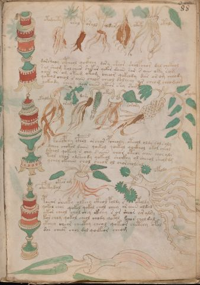

# Voynich Speculative Procedural Protocol — f88r

IMPORTANT: this is NOT a real or validated translation of the Voynich Manuscript. It is a speculative/procedural model that interprets EVA using a user-defined grammar to generate experimental recipes using safe, known edible substitutes.

This file is generated automatically from IVTFF/EVA transliteration plus a user-defined procedural grammar.



## Page / Folio
- currier: A
- folio: f88r
- page_number: 181

## EVA Text (Transliteration)
```text
otorchety
osal
orald
oldar
otoky
otaly
dorsheoy ctheol qockhey dory sheor sholfchor dal chcthol
[r:s]al sheom keol chear shekor qokor daiin sar s aiin oky sam
oain or om otam okeom cheeor qokeody dar or om cheody
qokeol cheol saiin cheos cheol doleeey or cheom cheo[j:m]am
yokeody cheom qoor cheeb ykeor shy sam
otaldy
oram
dary
okol
sorory
otyda
koaiphhy cphol orchor pcheoly otchol oldy salsaly
dchey chokol daiin qoekol qoekol qockhol okol cheol
dsheol qokeey s chy s aiin chor oteor aiin chosals
teol chor olsheody qokeol shoikhy ol sheeol sheoldg
ychey okaiin chol cheor ol chorcholsal
ofyskydal
otor am
ofaldo
poeear sheoky olkeey cthol poldy s okoldy
qokol chol qokol qokol chol cheey or aiin oldal
ykar cheol chol chey ckhey s or shear ar alsy
kor chey qokol cheol chody qokol kchor chol dal
ykeeey cheor cheotey cheol qokeor chetchy ofal
dar chear chol dol qoekeor cheom
```

## Domain Context (Heuristic; Not a Translation)

This section summarizes recurring **basewords** in this IVTFF domain and shows simple substring evidence that the token markers used by the procedural grammar occur inside frequent words.

Any Italian anagram / English gloss is a best-effort lexicon match, not a decipherment.


### Associated basewords (non-generic; top by frequency in this domain)
- `paiin` (count=241) → Italian anagram `piani`; English: plans (arrangements)
- `qokaiin` (count=122) → Italian anagram `ciancio`; English: [n/a]
- `okaiin` (count=109) → Italian anagram `coniai`; English: [n/a]
- `qokain` (count=101) → Italian anagram `acconi`; English: [n/a]
- `okain` (count=69) → Italian anagram `acino`; English: a berry
- `qokep` (count=65) → Italian anagram `pecco`; English: [n/a]
- `otain` (count=54) → Italian anagram `anito`; English: [n/a]
- `qokar` (count=48) → Italian anagram `carco`; English: [n/a]
- `saiin` (count=48) → Italian anagram `asini`; English: [n/a]
- `qokal` (count=46) → Italian anagram `calco`; English: cast (of sculpture)
- `kaiin` (count=45) → Italian anagram `acini`; English: [n/a]
- `qotaiin` (count=40) → Italian anagram `cationi`; English: [n/a]
- `lkaiin` (count=40) → Italian anagram `ancili`; English: [n/a]
- `qokeol` (count=38) → Italian anagram `eccolo`; English: [n/a]
- `qotain` (count=34) → Italian anagram `antico`; English: ancient

### Marker evidence (substring in frequent basewords)
- `qo`: 63 basewords; examples: `qokee`, `qokeep`, `qokaiin`, `qokain`, `qokep`, `qoke`
- `q`: 64 basewords; examples: `qokee`, `qokeep`, `qokaiin`, `qokain`, `qokep`, `qoke`
- `o`: 281 basewords; examples: `qokee`, `ol`, `o`, `qokeep`, `okee`, `qokaiin`
- `k`: 150 basewords; examples: `qokee`, `qokeep`, `okee`, `qokaiin`, `okaiin`, `qokain`
- `t`: 100 basewords; examples: `otaiin`, `otee`, `otal`, `otar`, `oteep`, `otep`
- `p`: 154 basewords; examples: `paiin`, `chep`, `qokeep`, `shep`, `par`, `oteep`
- `ch`: 144 basewords; examples: `chep`, `che`, `chol`, `chee`, `cheol`, `cheo`
- `sh`: 52 basewords; examples: `shep`, `she`, `shee`, `sheol`, `sheep`, `shol`
- `f`: 2 basewords; examples: `fchep`, `f`
- `cth`: 17 basewords; examples: `chcth`, `cthe`, `shcth`, `checth`, `cthol`, `cthee`
- `ckh`: 18 basewords; examples: `chckh`, `shckh`, `checkh`, `chckhe`, `chockh`, `sheckh`
- `cph`: 3 basewords; examples: `cphol`, `cph`, `cphe`
- `iin`: 38 basewords; examples: `aiin`, `paiin`, `qokaiin`, `okaiin`, `otaiin`, `saiin`
- `aiin`: 31 basewords; examples: `aiin`, `paiin`, `qokaiin`, `okaiin`, `otaiin`, `saiin`

## Recipes Index (This Page)
- [f88r.1,@Lc](#f88r-1-f88r-1-lc)
- [f88r.2,@Lf](#f88r-2-f88r-2-lf)
- [f88r.3,@Lf](#f88r-3-f88r-3-lf)
- [f88r.4,@Lf](#f88r-4-f88r-4-lf)
- [f88r.5,@Lf](#f88r-5-f88r-5-lf)
- [f88r.6,@Lf](#f88r-6-f88r-6-lf)
- [f88r.7,@P0](#f88r-7-f88r-7-p0)
- [f88r.8,+P0](#f88r-8-f88r-8-p0)
- [f88r.9,+P0](#f88r-9-f88r-9-p0)
- [f88r.10,+P0](#f88r-10-f88r-10-p0)
- [f88r.11,+P0](#f88r-11-f88r-11-p0)
- [f88r.12,@Lc](#f88r-12-f88r-12-lc)
- [f88r.13,@Lf](#f88r-13-f88r-13-lf)
- [f88r.14,@Lf](#f88r-14-f88r-14-lf)
- [f88r.15,@Lf](#f88r-15-f88r-15-lf)
- [f88r.16,@Lf](#f88r-16-f88r-16-lf)
- [f88r.17,@Lf](#f88r-17-f88r-17-lf)
- [f88r.18,@P0](#f88r-18-f88r-18-p0)
- [f88r.19,+P0](#f88r-19-f88r-19-p0)
- [f88r.20,+P0](#f88r-20-f88r-20-p0)
- [f88r.21,+P0](#f88r-21-f88r-21-p0)
- [f88r.22,+P0](#f88r-22-f88r-22-p0)
- [f88r.23,@Lc](#f88r-23-f88r-23-lc)
- [f88r.24,@Lf](#f88r-24-f88r-24-lf)
- [f88r.25,@Lf](#f88r-25-f88r-25-lf)
- [f88r.26,@P0](#f88r-26-f88r-26-p0)
- [f88r.27,+P0](#f88r-27-f88r-27-p0)
- [f88r.28,+P0](#f88r-28-f88r-28-p0)
- [f88r.29,+P0](#f88r-29-f88r-29-p0)
- [f88r.30,+P0](#f88r-30-f88r-30-p0)
- [f88r.31,+P0](#f88r-31-f88r-31-p0)

## Line Glosses (Procedural Gloss Only; Not a Translation)

<a id="f88r-1-f88r-1-lc"></a>

### f88r.1,@Lc

EVA (original line):
```text
otorchety
```

English structural gloss (generated):

- otorchety: tokens: o t o r ch e t → connectors: r → vowel_run: e (level 1; class e)

<a id="f88r-2-f88r-2-lf"></a>

### f88r.2,@Lf

EVA (original line):
```text
osal
```

English structural gloss (generated):

- osal: tokens: o s a l → connectors: s l → vowel_run: a (level 1; class a)

<a id="f88r-3-f88r-3-lf"></a>

### f88r.3,@Lf

EVA (original line):
```text
orald
```

English structural gloss (generated):

- orald: tokens: o r a l p → connectors: r l → vowel_run: a (level 1; class a)

<a id="f88r-4-f88r-4-lf"></a>

### f88r.4,@Lf

EVA (original line):
```text
oldar
```

English structural gloss (generated):

- oldar: tokens: o l p a r → connectors: l r → vowel_run: a (level 1; class a)

<a id="f88r-5-f88r-5-lf"></a>

### f88r.5,@Lf

EVA (original line):
```text
otoky
```

English structural gloss (generated):

- otoky: tokens: o t o k

<a id="f88r-6-f88r-6-lf"></a>

### f88r.6,@Lf

EVA (original line):
```text
otaly
```

English structural gloss (generated):

- otaly: tokens: o t a l → connectors: l → vowel_run: a (level 1; class a)

<a id="f88r-7-f88r-7-p0"></a>

### f88r.7,@P0

EVA (original line):
```text
dorsheoy ctheol qockhey dory sheor sholfchor dal chcthol
```

English structural gloss (generated):

- dorsheoy: tokens: p o r sh e o → connectors: r → vowel_run: e (level 1; class e)
- ctheol: tokens: cth e o l → connectors: l → vowel_run: e (level 1; class e)
- qockhey: tokens: qo ckh e → vowel_run: e (level 1; class e)
- dory: tokens: p o r → connectors: r
- sheor: tokens: sh e o r → connectors: r → vowel_run: e (level 1; class e)
- sholfchor: tokens: sh o l f ch o r → connectors: l r
- dal: tokens: p a l → connectors: l → vowel_run: a (level 1; class a)
- chcthol: tokens: ch cth o l → connectors: l

<a id="f88r-8-f88r-8-p0"></a>

### f88r.8,+P0

EVA (original line):
```text
[r:s]al sheom keol chear shekor qokor daiin sar s aiin oky sam
```

English structural gloss (generated):

- r: tokens: r → connectors: r
- s: tokens: s → connectors: s
- al: tokens: a l → connectors: l → vowel_run: a (level 1; class a)
- sheom: tokens: sh e o m → connectors: m → vowel_run: e (level 1; class e)
- keol: tokens: k e o l → connectors: l → vowel_run: e (level 1; class e)
- chear: tokens: ch e a r → connectors: r → vowel_run: e (level 1; class e)
- shekor: tokens: sh e k o r → connectors: r → vowel_run: e (level 1; class e)
- qokor: tokens: qo k o r → connectors: r
- daiin: tokens: p aiin → vowel_run: a (level 1; class a) → suffix: aiin (lexicon-context: `paiin` → `piani`; plans (arrangements))
- sar: tokens: s a r → connectors: s r → vowel_run: a (level 1; class a)
- s: tokens: s → connectors: s
- aiin: tokens: aiin → vowel_run: a (level 1; class a) → suffix: aiin
- oky: tokens: o k
- sam: tokens: s a m → connectors: s m → vowel_run: a (level 1; class a)

<a id="f88r-9-f88r-9-p0"></a>

### f88r.9,+P0

EVA (original line):
```text
oain or om otam okeom cheeor qokeody dar or om cheody
```

English structural gloss (generated):

- oain: tokens: o a i n → connectors: n → vowel_run: a (level 1; class a)
- or: tokens: o r → connectors: r
- om: tokens: o m → connectors: m
- otam: tokens: o t a m → connectors: m → vowel_run: a (level 1; class a)
- okeom: tokens: o k e o m → connectors: m → vowel_run: e (level 1; class e)
- cheeor: tokens: ch ee o r → connectors: r → vowel_run: ee (level 2; class e)
- qokeody: tokens: qo k e o p → vowel_run: e (level 1; class e)
- dar: tokens: p a r → connectors: r → vowel_run: a (level 1; class a)
- or: tokens: o r → connectors: r
- om: tokens: o m → connectors: m
- cheody: tokens: ch e o p → vowel_run: e (level 1; class e)

<a id="f88r-10-f88r-10-p0"></a>

### f88r.10,+P0

EVA (original line):
```text
qokeol cheol saiin cheos cheol doleeey or cheom cheo[j:m]am
```

English structural gloss (generated):

- qokeol: tokens: qo k e o l → connectors: l → vowel_run: e (level 1; class e)
- cheol: tokens: ch e o l → connectors: l → vowel_run: e (level 1; class e)
- saiin: tokens: s aiin → connectors: s → vowel_run: a (level 1; class a) → suffix: aiin (lexicon-context: `saiin` → `asini`; [n/a])
- cheos: tokens: ch e o s → connectors: s → vowel_run: e (level 1; class e)
- cheol: tokens: ch e o l → connectors: l → vowel_run: e (level 1; class e)
- doleeey: tokens: p o l eee → connectors: l → vowel_run: eee (level 3; class e)
- or: tokens: o r → connectors: r
- cheom: tokens: ch e o m → connectors: m → vowel_run: e (level 1; class e)
- cheo: tokens: ch e o → vowel_run: e (level 1; class e)
- j: tokens: j
- m: tokens: m → connectors: m
- am: tokens: a m → connectors: m → vowel_run: a (level 1; class a)

<a id="f88r-11-f88r-11-p0"></a>

### f88r.11,+P0

EVA (original line):
```text
yokeody cheom qoor cheeb ykeor shy sam
```

English structural gloss (generated):

- yokeody: tokens: o k e o p → vowel_run: e (level 1; class e)
- cheom: tokens: ch e o m → connectors: m → vowel_run: e (level 1; class e)
- qoor: tokens: qo o r → connectors: r
- cheeb: tokens: ch ee b → vowel_run: ee (level 2; class e) → unmodeled_tokens: b
- ykeor: tokens: k e o r → connectors: r → vowel_run: e (level 1; class e)
- shy: tokens: sh
- sam: tokens: s a m → connectors: s m → vowel_run: a (level 1; class a)

<a id="f88r-12-f88r-12-lc"></a>

### f88r.12,@Lc

EVA (original line):
```text
otaldy
```

English structural gloss (generated):

- otaldy: tokens: o t a l p → connectors: l → vowel_run: a (level 1; class a)

<a id="f88r-13-f88r-13-lf"></a>

### f88r.13,@Lf

EVA (original line):
```text
oram
```

English structural gloss (generated):

- oram: tokens: o r a m → connectors: r m → vowel_run: a (level 1; class a)

<a id="f88r-14-f88r-14-lf"></a>

### f88r.14,@Lf

EVA (original line):
```text
dary
```

English structural gloss (generated):

- dary: tokens: p a r → connectors: r → vowel_run: a (level 1; class a)

<a id="f88r-15-f88r-15-lf"></a>

### f88r.15,@Lf

EVA (original line):
```text
okol
```

English structural gloss (generated):

- okol: tokens: o k o l → connectors: l

<a id="f88r-16-f88r-16-lf"></a>

### f88r.16,@Lf

EVA (original line):
```text
sorory
```

English structural gloss (generated):

- sorory: tokens: s o r o r → connectors: s r r

<a id="f88r-17-f88r-17-lf"></a>

### f88r.17,@Lf

EVA (original line):
```text
otyda
```

English structural gloss (generated):

- otyda: tokens: o t p a → vowel_run: a (level 1; class a)

<a id="f88r-18-f88r-18-p0"></a>

### f88r.18,@P0

EVA (original line):
```text
koaiphhy cphol orchor pcheoly otchol oldy salsaly
```

English structural gloss (generated):

- koaiphhy: tokens: k o a i p h h → vowel_run: a (level 1; class a) → unmodeled_tokens: h
- cphol: tokens: cph o l → connectors: l
- orchor: tokens: o r ch o r → connectors: r r
- pcheoly: tokens: p ch e o l → connectors: l → vowel_run: e (level 1; class e)
- otchol: tokens: o t ch o l → connectors: l
- oldy: tokens: o l p → connectors: l
- salsaly: tokens: s a l s a l → connectors: s l s l → vowel_run: a (level 1; class a)

<a id="f88r-19-f88r-19-p0"></a>

### f88r.19,+P0

EVA (original line):
```text
dchey chokol daiin qoekol qoekol qockhol okol cheol
```

English structural gloss (generated):

- dchey: tokens: p ch e → vowel_run: e (level 1; class e)
- chokol: tokens: ch o k o l → connectors: l
- daiin: tokens: p aiin → vowel_run: a (level 1; class a) → suffix: aiin (lexicon-context: `paiin` → `piani`; plans (arrangements))
- qoekol: tokens: qo e k o l → connectors: l → vowel_run: e (level 1; class e)
- qoekol: tokens: qo e k o l → connectors: l → vowel_run: e (level 1; class e)
- qockhol: tokens: qo ckh o l → connectors: l
- okol: tokens: o k o l → connectors: l
- cheol: tokens: ch e o l → connectors: l → vowel_run: e (level 1; class e)

<a id="f88r-20-f88r-20-p0"></a>

### f88r.20,+P0

EVA (original line):
```text
dsheol qokeey s chy s aiin chor oteor aiin chosals
```

English structural gloss (generated):

- dsheol: tokens: p sh e o l → connectors: l → vowel_run: e (level 1; class e)
- qokeey: tokens: qo k ee → vowel_run: ee (level 2; class e)
- s: tokens: s → connectors: s
- chy: tokens: ch
- s: tokens: s → connectors: s
- aiin: tokens: aiin → vowel_run: a (level 1; class a) → suffix: aiin
- chor: tokens: ch o r → connectors: r
- oteor: tokens: o t e o r → connectors: r → vowel_run: e (level 1; class e)
- aiin: tokens: aiin → vowel_run: a (level 1; class a) → suffix: aiin
- chosals: tokens: ch o s a l s → connectors: s l s → vowel_run: a (level 1; class a)

<a id="f88r-21-f88r-21-p0"></a>

### f88r.21,+P0

EVA (original line):
```text
teol chor olsheody qokeol shoikhy ol sheeol sheoldg
```

English structural gloss (generated):

- teol: tokens: t e o l → connectors: l → vowel_run: e (level 1; class e)
- chor: tokens: ch o r → connectors: r
- olsheody: tokens: o l sh e o p → connectors: l → vowel_run: e (level 1; class e)
- qokeol: tokens: qo k e o l → connectors: l → vowel_run: e (level 1; class e)
- shoikhy: tokens: sh o i k h → vowel_run: i (level 1; class i) → unmodeled_tokens: h
- ol: tokens: o l → connectors: l
- sheeol: tokens: sh ee o l → connectors: l → vowel_run: ee (level 2; class e)
- sheoldg: tokens: sh e o l p g → connectors: l → vowel_run: e (level 1; class e)

<a id="f88r-22-f88r-22-p0"></a>

### f88r.22,+P0

EVA (original line):
```text
ychey okaiin chol cheor ol chorcholsal
```

English structural gloss (generated):

- ychey: tokens: ch e → vowel_run: e (level 1; class e)
- okaiin: tokens: o k aiin → vowel_run: a (level 1; class a) → suffix: aiin (lexicon-context: `okaiin` → `coniai`; [n/a])
- chol: tokens: ch o l → connectors: l
- cheor: tokens: ch e o r → connectors: r → vowel_run: e (level 1; class e)
- ol: tokens: o l → connectors: l
- chorcholsal: tokens: ch o r ch o l s a l → connectors: r l s l → vowel_run: a (level 1; class a)

<a id="f88r-23-f88r-23-lc"></a>

### f88r.23,@Lc

EVA (original line):
```text
ofyskydal
```

English structural gloss (generated):

- ofyskydal: tokens: o f s k p a l → connectors: s l → vowel_run: a (level 1; class a)

<a id="f88r-24-f88r-24-lf"></a>

### f88r.24,@Lf

EVA (original line):
```text
otor am
```

English structural gloss (generated):

- otor: tokens: o t o r → connectors: r
- am: tokens: a m → connectors: m → vowel_run: a (level 1; class a)

<a id="f88r-25-f88r-25-lf"></a>

### f88r.25,@Lf

EVA (original line):
```text
ofaldo
```

English structural gloss (generated):

- ofaldo: tokens: o f a l p o → connectors: l → vowel_run: a (level 1; class a)

<a id="f88r-26-f88r-26-p0"></a>

### f88r.26,@P0

EVA (original line):
```text
poeear sheoky olkeey cthol poldy s okoldy
```

English structural gloss (generated):

- poeear: tokens: p o ee a r → connectors: r → vowel_run: ee (level 2; class e)
- sheoky: tokens: sh e o k → vowel_run: e (level 1; class e)
- olkeey: tokens: o l k ee → connectors: l → vowel_run: ee (level 2; class e)
- cthol: tokens: cth o l → connectors: l
- poldy: tokens: p o l p → connectors: l
- s: tokens: s → connectors: s
- okoldy: tokens: o k o l p → connectors: l

<a id="f88r-27-f88r-27-p0"></a>

### f88r.27,+P0

EVA (original line):
```text
qokol chol qokol qokol chol cheey or aiin oldal
```

English structural gloss (generated):

- qokol: tokens: qo k o l → connectors: l
- chol: tokens: ch o l → connectors: l
- qokol: tokens: qo k o l → connectors: l
- qokol: tokens: qo k o l → connectors: l
- chol: tokens: ch o l → connectors: l
- cheey: tokens: ch ee → vowel_run: ee (level 2; class e)
- or: tokens: o r → connectors: r
- aiin: tokens: aiin → vowel_run: a (level 1; class a) → suffix: aiin
- oldal: tokens: o l p a l → connectors: l l → vowel_run: a (level 1; class a)

<a id="f88r-28-f88r-28-p0"></a>

### f88r.28,+P0

EVA (original line):
```text
ykar cheol chol chey ckhey s or shear ar alsy
```

English structural gloss (generated):

- ykar: tokens: k a r → connectors: r → vowel_run: a (level 1; class a)
- cheol: tokens: ch e o l → connectors: l → vowel_run: e (level 1; class e)
- chol: tokens: ch o l → connectors: l
- chey: tokens: ch e → vowel_run: e (level 1; class e)
- ckhey: tokens: ckh e → vowel_run: e (level 1; class e)
- s: tokens: s → connectors: s
- or: tokens: o r → connectors: r
- shear: tokens: sh e a r → connectors: r → vowel_run: e (level 1; class e)
- ar: tokens: a r → connectors: r → vowel_run: a (level 1; class a)
- alsy: tokens: a l s → connectors: l s → vowel_run: a (level 1; class a)

<a id="f88r-29-f88r-29-p0"></a>

### f88r.29,+P0

EVA (original line):
```text
kor chey qokol cheol chody qokol kchor chol dal
```

English structural gloss (generated):

- kor: tokens: k o r → connectors: r
- chey: tokens: ch e → vowel_run: e (level 1; class e)
- qokol: tokens: qo k o l → connectors: l
- cheol: tokens: ch e o l → connectors: l → vowel_run: e (level 1; class e)
- chody: tokens: ch o p
- qokol: tokens: qo k o l → connectors: l
- kchor: tokens: k ch o r → connectors: r
- chol: tokens: ch o l → connectors: l
- dal: tokens: p a l → connectors: l → vowel_run: a (level 1; class a)

<a id="f88r-30-f88r-30-p0"></a>

### f88r.30,+P0

EVA (original line):
```text
ykeeey cheor cheotey cheol qokeor chetchy ofal
```

English structural gloss (generated):

- ykeeey: tokens: k eee → vowel_run: eee (level 3; class e)
- cheor: tokens: ch e o r → connectors: r → vowel_run: e (level 1; class e)
- cheotey: tokens: ch e o t e → vowel_run: e (level 1; class e)
- cheol: tokens: ch e o l → connectors: l → vowel_run: e (level 1; class e)
- qokeor: tokens: qo k e o r → connectors: r → vowel_run: e (level 1; class e)
- chetchy: tokens: ch e t ch → vowel_run: e (level 1; class e)
- ofal: tokens: o f a l → connectors: l → vowel_run: a (level 1; class a)

<a id="f88r-31-f88r-31-p0"></a>

### f88r.31,+P0

EVA (original line):
```text
dar chear chol dol qoekeor cheom
```

English structural gloss (generated):

- dar: tokens: p a r → connectors: r → vowel_run: a (level 1; class a)
- chear: tokens: ch e a r → connectors: r → vowel_run: e (level 1; class e)
- chol: tokens: ch o l → connectors: l
- dol: tokens: p o l → connectors: l
- qoekeor: tokens: qo e k e o r → connectors: r → vowel_run: e (level 1; class e)
- cheom: tokens: ch e o m → connectors: m → vowel_run: e (level 1; class e)
