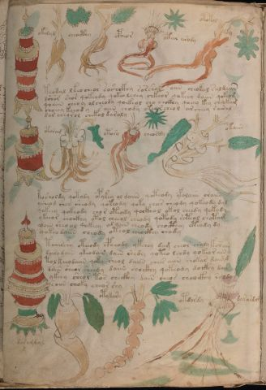

# Voynich Speculative Procedural Protocol — f88v

IMPORTANT: this is NOT a real or validated translation of the Voynich Manuscript. It is a speculative/procedural model that interprets EVA using a user-defined grammar to generate experimental recipes using safe, known edible substitutes.

This file is generated automatically from IVTFF/EVA transliteration plus a user-defined procedural grammar.



## Page / Folio
- currier: A
- folio: f88v
- page_number: 182

## EVA Text (Transliteration)
```text
okalyd
cheocthy
cpheor
otar arody
otokol
teodal lkeo cheor roshckhy sorshy aiin cheokal saldaiin
dshor shor qokeody qokeo lchey chkeor qokeey daiin qokeom
qoaiin cheoy olcheody qoekeol cho chckhy qoeey key cheokam
choeey keeod y s aiin chody okearcheol archeey sairal
dar cheorol chekol daraly
otoram
otor[a:y]
cheosdy
okaiin
kosholdy qotody opykey oldaiin qoteody yfolaiin oraiin
ysheod sheo sheody qokeody qoky chees cheody qokeody dal
qokeey qokeody chor oteody qockhol okol cheedy qokody
ykeeor chockhy otol cheeol cheody qotody soteol ch[o:e]tam
odaiin sheo ol qokeey olaiin cheody chocthey oteody dy
[s:]qokeodaiin cheody oteol cheockhy chody
toairch'y oteeody cpheody ykchey dam cheor chaly korain
dairodain ykeodain dain shedy qoteo lchdy qokeo r ain
tol keeodaiin qoky sheol daiin chees aiin chokar daim[d:g]
daiin sheor sheedy daiin shoikhy qokeody doikhy dair
ykeey sheor tos checkhy dain cheos cheockhy saldy
saiin choky cheor shy
daramdal
otydary
otdordy
dararda[?:]
```

## Domain Context (Heuristic; Not a Translation)

This section summarizes recurring **basewords** in this IVTFF domain and shows simple substring evidence that the token markers used by the procedural grammar occur inside frequent words.

Any Italian anagram / English gloss is a best-effort lexicon match, not a decipherment.


### Associated basewords (non-generic; top by frequency in this domain)
- `daiin` (count=231) → Italian anagram `piani`; English: plans (arrangements)
- `qokaiin` (count=122) → Italian anagram `ciancio`; English: [n/a]
- `okaiin` (count=109) → Italian anagram `coniai`; English: [n/a]
- `qokain` (count=101) → Italian anagram `acconi`; English: [n/a]
- `okain` (count=69) → Italian anagram `acino`; English: a berry
- `otain` (count=53) → Italian anagram `anito`; English: [n/a]
- `qokar` (count=48) → Italian anagram `carco`; English: [n/a]
- `saiin` (count=46) → Italian anagram `asini`; English: [n/a]
- `qokal` (count=43) → Italian anagram `calco`; English: cast (of sculpture)
- `qotaiin` (count=40) → Italian anagram `cationi`; English: [n/a]
- `lkaiin` (count=39) → Italian anagram `ancili`; English: [n/a]
- `kaiin` (count=37) → Italian anagram `acini`; English: [n/a]
- `qokeol` (count=37) → Italian anagram `eccolo`; English: [n/a]
- `qotain` (count=34) → Italian anagram `antico`; English: ancient
- `qotar` (count=29) → Italian anagram `corta`; English: [n/a]

### Marker evidence (substring in frequent basewords)
- `qo`: 60 basewords; examples: `qokeey`, `qokeedy`, `qokaiin`, `qokain`, `qokedy`, `qokey`
- `q`: 61 basewords; examples: `qokeey`, `qokeedy`, `qokaiin`, `qokain`, `qokedy`, `qokey`
- `o`: 262 basewords; examples: `qokeey`, `ol`, `o`, `qokeedy`, `okeey`, `qokaiin`
- `k`: 147 basewords; examples: `qokeey`, `qokeedy`, `okeey`, `qokaiin`, `okaiin`, `qokain`
- `t`: 102 basewords; examples: `otaiin`, `oteey`, `otar`, `otedy`, `otal`, `oteedy`
- `p`: 17 basewords; examples: `opchedy`, `qopchedy`, `opchey`, `pchedy`, `qopchdy`, `opchdy`
- `ch`: 137 basewords; examples: `chedy`, `chey`, `chol`, `cheey`, `cheol`, `cheody`
- `sh`: 50 basewords; examples: `shedy`, `shey`, `sheey`, `sheol`, `shol`, `sheedy`
- `f`: 1 basewords; examples: `f`
- `cth`: 16 basewords; examples: `chcthy`, `cthey`, `shcthy`, `checthy`, `cthol`, `ctheey`
- `ckh`: 15 basewords; examples: `chckhy`, `shckhy`, `checkhy`, `chckhey`, `chockhy`, `sheckhy`
- `cph`: 2 basewords; examples: `cphol`, `cphy`
- `dy`: 84 basewords; examples: `chedy`, `qokeedy`, `shedy`, `otedy`, `oteedy`, `qokedy`
- `iin`: 39 basewords; examples: `aiin`, `daiin`, `qokaiin`, `okaiin`, `otaiin`, `saiin`
- `aiin`: 33 basewords; examples: `aiin`, `daiin`, `qokaiin`, `okaiin`, `otaiin`, `saiin`

## Recipes Index (This Page)
- [f88v.1,@Lc](#f88v-1-f88v-1-lc)
- [f88v.2,@Lf](#f88v-2-f88v-2-lf)
- [f88v.3,@Lf](#f88v-3-f88v-3-lf)
- [f88v.4,@Lf](#f88v-4-f88v-4-lf)
- [f88v.5,@Lf](#f88v-5-f88v-5-lf)
- [f88v.6,@P0](#f88v-6-f88v-6-p0)
- [f88v.7,+P0](#f88v-7-f88v-7-p0)
- [f88v.8,+P0](#f88v-8-f88v-8-p0)
- [f88v.9,+P0](#f88v-9-f88v-9-p0)
- [f88v.10,+P0](#f88v-10-f88v-10-p0)
- [f88v.11,@Lc](#f88v-11-f88v-11-lc)
- [f88v.12,@Lf](#f88v-12-f88v-12-lf)
- [f88v.13,@Lf](#f88v-13-f88v-13-lf)
- [f88v.14,@Lf](#f88v-14-f88v-14-lf)
- [f88v.15,@P0](#f88v-15-f88v-15-p0)
- [f88v.16,+P0](#f88v-16-f88v-16-p0)
- [f88v.17,+P0](#f88v-17-f88v-17-p0)
- [f88v.18,+P0](#f88v-18-f88v-18-p0)
- [f88v.19,+P0](#f88v-19-f88v-19-p0)
- [f88v.20,+P0](#f88v-20-f88v-20-p0)
- [f88v.21,+P0](#f88v-21-f88v-21-p0)
- [f88v.22,+P0](#f88v-22-f88v-22-p0)
- [f88v.23,+P0](#f88v-23-f88v-23-p0)
- [f88v.24,+P0](#f88v-24-f88v-24-p0)
- [f88v.25,+P0](#f88v-25-f88v-25-p0)
- [f88v.26,+P0](#f88v-26-f88v-26-p0)
- [f88v.27,@Lc](#f88v-27-f88v-27-lc)
- [f88v.28,@Lf](#f88v-28-f88v-28-lf)
- [f88v.29,@Lf](#f88v-29-f88v-29-lf)
- [f88v.30,@Lf](#f88v-30-f88v-30-lf)

## Line Glosses (Procedural Gloss Only; Not a Translation)

<a id="f88v-1-f88v-1-lc"></a>

### f88v.1,@Lc

EVA: okalyd

Direct Gloss (Procedural, Not a Real Translation):
- okalyd: tokens: o k a l p → connectors: l → vowel_run: a (level 1; class a)

<a id="f88v-2-f88v-2-lf"></a>

### f88v.2,@Lf

EVA: cheocthy

Direct Gloss (Procedural, Not a Real Translation):
- cheocthy: tokens: ch e o cth → vowel_run: e (level 1; class e)

<a id="f88v-3-f88v-3-lf"></a>

### f88v.3,@Lf

EVA: cpheor

Direct Gloss (Procedural, Not a Real Translation):
- cpheor: tokens: cph e o r → connectors: r → vowel_run: e (level 1; class e)

<a id="f88v-4-f88v-4-lf"></a>

### f88v.4,@Lf

EVA: otar arody

Direct Gloss (Procedural, Not a Real Translation):
- otar: tokens: o t a r → connectors: r → vowel_run: a (level 1; class a)
- arody: tokens: a r o p → connectors: r → vowel_run: a (level 1; class a)

<a id="f88v-5-f88v-5-lf"></a>

### f88v.5,@Lf

EVA: otokol

Direct Gloss (Procedural, Not a Real Translation):
- otokol: tokens: o t o k o l → connectors: l

<a id="f88v-6-f88v-6-p0"></a>

### f88v.6,@P0

EVA: teodal lkeo cheor roshckhy sorshy aiin cheokal saldaiin

Direct Gloss (Procedural, Not a Real Translation):
- teodal: tokens: t e o p a l → connectors: l → vowel_run: e (level 1; class e)
- lkeo: tokens: l k e o → connectors: l → vowel_run: e (level 1; class e)
- cheor: tokens: ch e o r → connectors: r → vowel_run: e (level 1; class e)
- roshckhy: tokens: r o sh ckh → connectors: r
- sorshy: tokens: s o r sh → connectors: s r
- aiin: tokens: aiin → vowel_run: a (level 1; class a) → suffix: aiin
- cheokal: tokens: ch e o k a l → connectors: l → vowel_run: e (level 1; class e)
- saldaiin: tokens: s a l p aiin → connectors: s l → vowel_run: a (level 1; class a) → suffix: aiin (lexicon-context: `daiin` → `piani`; plans (arrangements))

<a id="f88v-7-f88v-7-p0"></a>

### f88v.7,+P0

EVA: dshor shor qokeody qokeo lchey chkeor qokeey daiin qokeom

Direct Gloss (Procedural, Not a Real Translation):
- dshor: tokens: p sh o r → connectors: r
- shor: tokens: sh o r → connectors: r
- qokeody: tokens: qo k e o p → vowel_run: e (level 1; class e)
- qokeo: tokens: qo k e o → vowel_run: e (level 1; class e)
- lchey: tokens: l ch e → connectors: l → vowel_run: e (level 1; class e)
- chkeor: tokens: ch k e o r → connectors: r → vowel_run: e (level 1; class e)
- qokeey: tokens: qo k ee → vowel_run: ee (level 2; class e)
- daiin: tokens: p aiin → vowel_run: a (level 1; class a) → suffix: aiin (lexicon-context: `daiin` → `piani`; plans (arrangements))
- qokeom: tokens: qo k e o m → connectors: m → vowel_run: e (level 1; class e)

<a id="f88v-8-f88v-8-p0"></a>

### f88v.8,+P0

EVA: qoaiin cheoy olcheody qoekeol cho chckhy qoeey key cheokam

Direct Gloss (Procedural, Not a Real Translation):
- qoaiin: tokens: qo aiin → vowel_run: a (level 1; class a) → suffix: aiin
- cheoy: tokens: ch e o → vowel_run: e (level 1; class e)
- olcheody: tokens: o l ch e o p → connectors: l → vowel_run: e (level 1; class e)
- qoekeol: tokens: qo e k e o l → connectors: l → vowel_run: e (level 1; class e)
- cho: tokens: ch o
- chckhy: tokens: ch ckh
- qoeey: tokens: qo ee → vowel_run: ee (level 2; class e)
- key: tokens: k e → vowel_run: e (level 1; class e)
- cheokam: tokens: ch e o k a m → connectors: m → vowel_run: e (level 1; class e)

<a id="f88v-9-f88v-9-p0"></a>

### f88v.9,+P0

EVA: choeey keeod y s aiin chody okearcheol archeey sairal

Direct Gloss (Procedural, Not a Real Translation):
- choeey: tokens: ch o ee → vowel_run: ee (level 2; class e)
- keeod: tokens: k ee o p → vowel_run: ee (level 2; class e)
- y: [unparsed]
- s: tokens: s → connectors: s
- aiin: tokens: aiin → vowel_run: a (level 1; class a) → suffix: aiin
- chody: tokens: ch o p
- okearcheol: tokens: o k e a r ch e o l → connectors: r l → vowel_run: e (level 1; class e)
- archeey: tokens: a r ch ee → connectors: r → vowel_run: a (level 1; class a)
- sairal: tokens: s a i r a l → connectors: s r l → vowel_run: a (level 1; class a)

<a id="f88v-10-f88v-10-p0"></a>

### f88v.10,+P0

EVA: dar cheorol chekol daraly

Direct Gloss (Procedural, Not a Real Translation):
- dar: tokens: p a r → connectors: r → vowel_run: a (level 1; class a)
- cheorol: tokens: ch e o r o l → connectors: r l → vowel_run: e (level 1; class e)
- chekol: tokens: ch e k o l → connectors: l → vowel_run: e (level 1; class e)
- daraly: tokens: p a r a l → connectors: r l → vowel_run: a (level 1; class a)

<a id="f88v-11-f88v-11-lc"></a>

### f88v.11,@Lc

EVA: otoram

Direct Gloss (Procedural, Not a Real Translation):
- otoram: tokens: o t o r a m → connectors: r m → vowel_run: a (level 1; class a)

<a id="f88v-12-f88v-12-lf"></a>

### f88v.12,@Lf

EVA: otor[a:y]

Direct Gloss (Procedural, Not a Real Translation):
- otor: tokens: o t o r → connectors: r
- a: tokens: a → vowel_run: a (level 1; class a)
- y: [unparsed]

<a id="f88v-13-f88v-13-lf"></a>

### f88v.13,@Lf

EVA: cheosdy

Direct Gloss (Procedural, Not a Real Translation):
- cheosdy: tokens: ch e o s p → connectors: s → vowel_run: e (level 1; class e)

<a id="f88v-14-f88v-14-lf"></a>

### f88v.14,@Lf

EVA: okaiin

Direct Gloss (Procedural, Not a Real Translation):
- okaiin: tokens: o k aiin → vowel_run: a (level 1; class a) → suffix: aiin (lexicon-context: `okaiin` → `coniai`; [n/a])

<a id="f88v-15-f88v-15-p0"></a>

### f88v.15,@P0

EVA: kosholdy qotody opykey oldaiin qoteody yfolaiin oraiin

Direct Gloss (Procedural, Not a Real Translation):
- kosholdy: tokens: k o sh o l p → connectors: l
- qotody: tokens: qo t o p
- opykey: tokens: o p k e → vowel_run: e (level 1; class e)
- oldaiin: tokens: o l p aiin → connectors: l → vowel_run: a (level 1; class a) → suffix: aiin (lexicon-context: `daiin` → `piani`; plans (arrangements))
- qoteody: tokens: qo t e o p → vowel_run: e (level 1; class e)
- yfolaiin: tokens: f o l aiin → connectors: l → vowel_run: a (level 1; class a) → suffix: aiin (lexicon-context: `olaiin` → `ialino`; hyaline, glassy)
- oraiin: tokens: o r aiin → connectors: r → vowel_run: a (level 1; class a) → suffix: aiin (lexicon-context: `oraiin` → `aironi`; [n/a])

<a id="f88v-16-f88v-16-p0"></a>

### f88v.16,+P0

EVA: ysheod sheo sheody qokeody qoky chees cheody qokeody dal

Direct Gloss (Procedural, Not a Real Translation):
- ysheod: tokens: sh e o p → vowel_run: e (level 1; class e)
- sheo: tokens: sh e o → vowel_run: e (level 1; class e)
- sheody: tokens: sh e o p → vowel_run: e (level 1; class e)
- qokeody: tokens: qo k e o p → vowel_run: e (level 1; class e)
- qoky: tokens: qo k
- chees: tokens: ch ee s → connectors: s → vowel_run: ee (level 2; class e)
- cheody: tokens: ch e o p → vowel_run: e (level 1; class e)
- qokeody: tokens: qo k e o p → vowel_run: e (level 1; class e)
- dal: tokens: p a l → connectors: l → vowel_run: a (level 1; class a)

<a id="f88v-17-f88v-17-p0"></a>

### f88v.17,+P0

EVA: qokeey qokeody chor oteody qockhol okol cheedy qokody

Direct Gloss (Procedural, Not a Real Translation):
- qokeey: tokens: qo k ee → vowel_run: ee (level 2; class e)
- qokeody: tokens: qo k e o p → vowel_run: e (level 1; class e)
- chor: tokens: ch o r → connectors: r
- oteody: tokens: o t e o p → vowel_run: e (level 1; class e)
- qockhol: tokens: qo ckh o l → connectors: l
- okol: tokens: o k o l → connectors: l
- cheedy: tokens: ch ee p → vowel_run: ee (level 2; class e)
- qokody: tokens: qo k o p

<a id="f88v-18-f88v-18-p0"></a>

### f88v.18,+P0

EVA: ykeeor chockhy otol cheeol cheody qotody soteol ch[o:e]tam

Direct Gloss (Procedural, Not a Real Translation):
- ykeeor: tokens: k ee o r → connectors: r → vowel_run: ee (level 2; class e)
- chockhy: tokens: ch o ckh
- otol: tokens: o t o l → connectors: l
- cheeol: tokens: ch ee o l → connectors: l → vowel_run: ee (level 2; class e)
- cheody: tokens: ch e o p → vowel_run: e (level 1; class e)
- qotody: tokens: qo t o p
- soteol: tokens: s o t e o l → connectors: s l → vowel_run: e (level 1; class e)
- ch: tokens: ch
- o: tokens: o
- e: tokens: e → vowel_run: e (level 1; class e)
- tam: tokens: t a m → connectors: m → vowel_run: a (level 1; class a)

<a id="f88v-19-f88v-19-p0"></a>

### f88v.19,+P0

EVA: odaiin sheo ol qokeey olaiin cheody chocthey oteody dy

Direct Gloss (Procedural, Not a Real Translation):
- odaiin: tokens: o p aiin → vowel_run: a (level 1; class a) → suffix: aiin (lexicon-context: `odaiin` → `inopia`; poverty)
- sheo: tokens: sh e o → vowel_run: e (level 1; class e)
- ol: tokens: o l → connectors: l
- qokeey: tokens: qo k ee → vowel_run: ee (level 2; class e)
- olaiin: tokens: o l aiin → connectors: l → vowel_run: a (level 1; class a) → suffix: aiin (lexicon-context: `olaiin` → `ialino`; hyaline, glassy)
- cheody: tokens: ch e o p → vowel_run: e (level 1; class e)
- chocthey: tokens: ch o cth e → vowel_run: e (level 1; class e)
- oteody: tokens: o t e o p → vowel_run: e (level 1; class e)
- dy: tokens: p

<a id="f88v-20-f88v-20-p0"></a>

### f88v.20,+P0

EVA: [s:]qokeodaiin cheody oteol cheockhy chody

Direct Gloss (Procedural, Not a Real Translation):
- s: tokens: s → connectors: s
- qokeodaiin: tokens: qo k e o p aiin → vowel_run: e (level 1; class e) → suffix: aiin (lexicon-context: `odaiin` → `inopia`; poverty)
- cheody: tokens: ch e o p → vowel_run: e (level 1; class e)
- oteol: tokens: o t e o l → connectors: l → vowel_run: e (level 1; class e)
- cheockhy: tokens: ch e o ckh → vowel_run: e (level 1; class e)
- chody: tokens: ch o p

<a id="f88v-21-f88v-21-p0"></a>

### f88v.21,+P0

EVA: toairch'y oteeody cpheody ykchey dam cheor chaly korain

Direct Gloss (Procedural, Not a Real Translation):
- toairch: tokens: t o a i r ch → connectors: r → vowel_run: a (level 1; class a)
- y: [unparsed]
- oteeody: tokens: o t ee o p → vowel_run: ee (level 2; class e)
- cpheody: tokens: cph e o p → vowel_run: e (level 1; class e)
- ykchey: tokens: k ch e → vowel_run: e (level 1; class e)
- dam: tokens: p a m → connectors: m → vowel_run: a (level 1; class a)
- cheor: tokens: ch e o r → connectors: r → vowel_run: e (level 1; class e)
- chaly: tokens: ch a l → connectors: l → vowel_run: a (level 1; class a)
- korain: tokens: k o r a i n → connectors: r n → vowel_run: a (level 1; class a)

<a id="f88v-22-f88v-22-p0"></a>

### f88v.22,+P0

EVA: dairodain ykeodain dain shedy qoteo lchdy qokeo r ain

Direct Gloss (Procedural, Not a Real Translation):
- dairodain: tokens: p a i r o p a i n → connectors: r n → vowel_run: a (level 1; class a)
- ykeodain: tokens: k e o p a i n → connectors: n → vowel_run: e (level 1; class e)
- dain: tokens: p a i n → connectors: n → vowel_run: a (level 1; class a)
- shedy: tokens: sh e p → vowel_run: e (level 1; class e)
- qoteo: tokens: qo t e o → vowel_run: e (level 1; class e)
- lchdy: tokens: l ch p → connectors: l
- qokeo: tokens: qo k e o → vowel_run: e (level 1; class e)
- r: tokens: r → connectors: r
- ain: tokens: a i n → connectors: n → vowel_run: a (level 1; class a)

<a id="f88v-23-f88v-23-p0"></a>

### f88v.23,+P0

EVA: tol keeodaiin qoky sheol daiin chees aiin chokar daim[d:g]

Direct Gloss (Procedural, Not a Real Translation):
- tol: tokens: t o l → connectors: l
- keeodaiin: tokens: k ee o p aiin → vowel_run: ee (level 2; class e) → suffix: aiin (lexicon-context: `odaiin` → `inopia`; poverty)
- qoky: tokens: qo k
- sheol: tokens: sh e o l → connectors: l → vowel_run: e (level 1; class e)
- daiin: tokens: p aiin → vowel_run: a (level 1; class a) → suffix: aiin (lexicon-context: `daiin` → `piani`; plans (arrangements))
- chees: tokens: ch ee s → connectors: s → vowel_run: ee (level 2; class e)
- aiin: tokens: aiin → vowel_run: a (level 1; class a) → suffix: aiin
- chokar: tokens: ch o k a r → connectors: r → vowel_run: a (level 1; class a)
- daim: tokens: p a i m → connectors: m → vowel_run: a (level 1; class a)
- d: tokens: p
- g: tokens: g

<a id="f88v-24-f88v-24-p0"></a>

### f88v.24,+P0

EVA: daiin sheor sheedy daiin shoikhy qokeody doikhy dair

Direct Gloss (Procedural, Not a Real Translation):
- daiin: tokens: p aiin → vowel_run: a (level 1; class a) → suffix: aiin (lexicon-context: `daiin` → `piani`; plans (arrangements))
- sheor: tokens: sh e o r → connectors: r → vowel_run: e (level 1; class e)
- sheedy: tokens: sh ee p → vowel_run: ee (level 2; class e)
- daiin: tokens: p aiin → vowel_run: a (level 1; class a) → suffix: aiin (lexicon-context: `daiin` → `piani`; plans (arrangements))
- shoikhy: tokens: sh o i k h → vowel_run: i (level 1; class i) → unmodeled_tokens: h
- qokeody: tokens: qo k e o p → vowel_run: e (level 1; class e)
- doikhy: tokens: p o i k h → vowel_run: i (level 1; class i) → unmodeled_tokens: h
- dair: tokens: p a i r → connectors: r → vowel_run: a (level 1; class a)

<a id="f88v-25-f88v-25-p0"></a>

### f88v.25,+P0

EVA: ykeey sheor tos checkhy dain cheos cheockhy saldy

Direct Gloss (Procedural, Not a Real Translation):
- ykeey: tokens: k ee → vowel_run: ee (level 2; class e)
- sheor: tokens: sh e o r → connectors: r → vowel_run: e (level 1; class e)
- tos: tokens: t o s → connectors: s
- checkhy: tokens: ch e ckh → vowel_run: e (level 1; class e)
- dain: tokens: p a i n → connectors: n → vowel_run: a (level 1; class a)
- cheos: tokens: ch e o s → connectors: s → vowel_run: e (level 1; class e)
- cheockhy: tokens: ch e o ckh → vowel_run: e (level 1; class e)
- saldy: tokens: s a l p → connectors: s l → vowel_run: a (level 1; class a)

<a id="f88v-26-f88v-26-p0"></a>

### f88v.26,+P0

EVA: saiin choky cheor shy

Direct Gloss (Procedural, Not a Real Translation):
- saiin: tokens: s aiin → connectors: s → vowel_run: a (level 1; class a) → suffix: aiin (lexicon-context: `saiin` → `asini`; [n/a])
- choky: tokens: ch o k
- cheor: tokens: ch e o r → connectors: r → vowel_run: e (level 1; class e)
- shy: tokens: sh

<a id="f88v-27-f88v-27-lc"></a>

### f88v.27,@Lc

EVA: daramdal

Direct Gloss (Procedural, Not a Real Translation):
- daramdal: tokens: p a r a m p a l → connectors: r m l → vowel_run: a (level 1; class a)

<a id="f88v-28-f88v-28-lf"></a>

### f88v.28,@Lf

EVA: otydary

Direct Gloss (Procedural, Not a Real Translation):
- otydary: tokens: o t p a r → connectors: r → vowel_run: a (level 1; class a)

<a id="f88v-29-f88v-29-lf"></a>

### f88v.29,@Lf

EVA: otdordy

Direct Gloss (Procedural, Not a Real Translation):
- otdordy: tokens: o t p o r p → connectors: r

<a id="f88v-30-f88v-30-lf"></a>

### f88v.30,@Lf

EVA: dararda[?:]

Direct Gloss (Procedural, Not a Real Translation):
- dararda: tokens: p a r a r p a → connectors: r r → vowel_run: a (level 1; class a)
