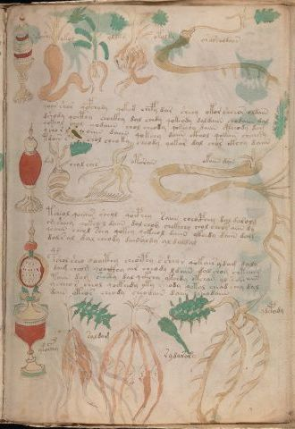

# Voynich Speculative Procedural Protocol — f89r1

IMPORTANT: this is NOT a real or validated translation of the Voynich Manuscript. It is a speculative/procedural model that interprets EVA using a user-defined grammar to generate experimental recipes using safe, known edible substitutes.

This file is generated automatically from IVTFF/EVA transliteration plus a user-defined procedural grammar.



## Page / Folio
- currier: A
- folio: f89r1
- page_number: 183

## EVA Text (Transliteration)
```text
okchshy
qkol
oldam
otoldy
ararchodaiin
qoar shar qopcholy qokod chepy dar sheey okor sheeos oldain
dshody qocthy chockhy dal chedy qokeody daldaiin chodaiin dal
qokeol chol qodaiin chol cheody qokechy daiin ctheody dam
yshor s oiiin daiin qokeey daiin ckhol qokain cheamy
tdain s chol cheoky cheody qokar dal chor ckhhy daiin
ykyd
chol ches
otorain
okaiin dan
tcheol qoeair sheol qocphey saiin cheocphey dal darolg
om sheey qokey l daiin dalchom chckhhhy chol cheos aiin dy
qeaiin cheyl seey qotey qokeeol daiin ykhedy daiin dam
dals al dal cheody dainaldy al daldal
pshol sheo qoaithy cheocphy s sheyr qokair ydam daly
daim cheom qoaithy air cheody ldain dal chom chtaii@197;
taiin dam shoety dal qokchy ykchdy otcham ol sshr aiin
ycheeo r sheol qockhedy yty sheody qotol chead chey dal
dain oteos cheody cheodain daiin chodaiin
ykocfhy
saldam
[s:r]ydarary
ydcpody
```

## Domain Context (Heuristic; Not a Translation)

This section summarizes recurring **basewords** in this IVTFF domain and shows simple substring evidence that the token markers used by the procedural grammar occur inside frequent words.

Any Italian anagram / English gloss is a best-effort lexicon match, not a decipherment.


### Associated basewords (non-generic; top by frequency in this domain)
- `daiin` (count=231) → Italian anagram `piani`; English: plans (arrangements)
- `qokaiin` (count=122) → Italian anagram `ciancio`; English: [n/a]
- `okaiin` (count=109) → Italian anagram `coniai`; English: [n/a]
- `qokain` (count=101) → Italian anagram `acconi`; English: [n/a]
- `okain` (count=69) → Italian anagram `acino`; English: a berry
- `otain` (count=53) → Italian anagram `anito`; English: [n/a]
- `qokar` (count=48) → Italian anagram `carco`; English: [n/a]
- `saiin` (count=46) → Italian anagram `asini`; English: [n/a]
- `qokal` (count=43) → Italian anagram `calco`; English: cast (of sculpture)
- `qotaiin` (count=40) → Italian anagram `cationi`; English: [n/a]
- `lkaiin` (count=39) → Italian anagram `ancili`; English: [n/a]
- `kaiin` (count=37) → Italian anagram `acini`; English: [n/a]
- `qokeol` (count=37) → Italian anagram `eccolo`; English: [n/a]
- `qotain` (count=34) → Italian anagram `antico`; English: ancient
- `qotar` (count=29) → Italian anagram `corta`; English: [n/a]

### Marker evidence (substring in frequent basewords)
- `qo`: 60 basewords; examples: `qokeey`, `qokeedy`, `qokaiin`, `qokain`, `qokedy`, `qokey`
- `q`: 61 basewords; examples: `qokeey`, `qokeedy`, `qokaiin`, `qokain`, `qokedy`, `qokey`
- `o`: 262 basewords; examples: `qokeey`, `ol`, `o`, `qokeedy`, `okeey`, `qokaiin`
- `k`: 147 basewords; examples: `qokeey`, `qokeedy`, `okeey`, `qokaiin`, `okaiin`, `qokain`
- `t`: 102 basewords; examples: `otaiin`, `oteey`, `otar`, `otedy`, `otal`, `oteedy`
- `p`: 17 basewords; examples: `opchedy`, `qopchedy`, `opchey`, `pchedy`, `qopchdy`, `opchdy`
- `ch`: 137 basewords; examples: `chedy`, `chey`, `chol`, `cheey`, `cheol`, `cheody`
- `sh`: 50 basewords; examples: `shedy`, `shey`, `sheey`, `sheol`, `shol`, `sheedy`
- `f`: 1 basewords; examples: `f`
- `cth`: 16 basewords; examples: `chcthy`, `cthey`, `shcthy`, `checthy`, `cthol`, `ctheey`
- `ckh`: 15 basewords; examples: `chckhy`, `shckhy`, `checkhy`, `chckhey`, `chockhy`, `sheckhy`
- `cph`: 2 basewords; examples: `cphol`, `cphy`
- `dy`: 84 basewords; examples: `chedy`, `qokeedy`, `shedy`, `otedy`, `oteedy`, `qokedy`
- `iin`: 39 basewords; examples: `aiin`, `daiin`, `qokaiin`, `okaiin`, `otaiin`, `saiin`
- `aiin`: 33 basewords; examples: `aiin`, `daiin`, `qokaiin`, `okaiin`, `otaiin`, `saiin`

## Recipes Index (This Page)
- [f89r1.1,@Lc](#f89r1-1-f89r1-1-lc)
- [f89r1.2,@Lf](#f89r1-2-f89r1-2-lf)
- [f89r1.3,@Lf](#f89r1-3-f89r1-3-lf)
- [f89r1.4,@Lf](#f89r1-4-f89r1-4-lf)
- [f89r1.5,@Lf](#f89r1-5-f89r1-5-lf)
- [f89r1.6,@P0](#f89r1-6-f89r1-6-p0)
- [f89r1.7,+P0](#f89r1-7-f89r1-7-p0)
- [f89r1.8,+P0](#f89r1-8-f89r1-8-p0)
- [f89r1.9,+P0](#f89r1-9-f89r1-9-p0)
- [f89r1.10,+P0](#f89r1-10-f89r1-10-p0)
- [f89r1.11,@Lc](#f89r1-11-f89r1-11-lc)
- [f89r1.12,@Lf](#f89r1-12-f89r1-12-lf)
- [f89r1.13,@Lf](#f89r1-13-f89r1-13-lf)
- [f89r1.14,@Lf](#f89r1-14-f89r1-14-lf)
- [f89r1.15,@P0](#f89r1-15-f89r1-15-p0)
- [f89r1.16,+P0](#f89r1-16-f89r1-16-p0)
- [f89r1.17,+P0](#f89r1-17-f89r1-17-p0)
- [f89r1.18,+P0](#f89r1-18-f89r1-18-p0)
- [f89r1.19,+P0](#f89r1-19-f89r1-19-p0)
- [f89r1.20,+P0](#f89r1-20-f89r1-20-p0)
- [f89r1.21,+P0](#f89r1-21-f89r1-21-p0)
- [f89r1.22,+P0](#f89r1-22-f89r1-22-p0)
- [f89r1.23,+P0](#f89r1-23-f89r1-23-p0)
- [f89r1.24,@Lc](#f89r1-24-f89r1-24-lc)
- [f89r1.25,@Lf](#f89r1-25-f89r1-25-lf)
- [f89r1.26,@Lf](#f89r1-26-f89r1-26-lf)
- [f89r1.27,@Lf](#f89r1-27-f89r1-27-lf)

## Line Glosses (Procedural Gloss Only; Not a Translation)

<a id="f89r1-1-f89r1-1-lc"></a>

### f89r1.1,@Lc

EVA: okchshy

Direct Gloss (Procedural, Not a Real Translation):
- okchshy: add fermentable sugars → add main plant (safe substitute) → add secondary herb (safe substitute) → mix / transfer

<a id="f89r1-2-f89r1-2-lf"></a>

### f89r1.2,@Lf

EVA: qkol

Direct Gloss (Procedural, Not a Real Translation):
- qkol: prepare base (generic) → add fermentable sugars → mix / transfer

<a id="f89r1-3-f89r1-3-lf"></a>

### f89r1.3,@Lf

EVA: oldam

Direct Gloss (Procedural, Not a Real Translation):
- oldam: mix / transfer → add starter / activate → duration level 1 → state: phase transition/start

<a id="f89r1-4-f89r1-4-lf"></a>

### f89r1.4,@Lf

EVA: otoldy

Direct Gloss (Procedural, Not a Real Translation):
- otoldy: apply heat/cooking → mix / transfer → add starter / activate

<a id="f89r1-5-f89r1-5-lf"></a>

### f89r1.5,@Lf

EVA: ararchodaiin

Direct Gloss (Procedural, Not a Real Translation):
- ararchodaiin: add main plant (safe substitute) → mix / transfer → add starter / activate → duration level 1 → state: phase transition/start → long phase

<a id="f89r1-6-f89r1-6-p0"></a>

### f89r1.6,@P0

EVA: qoar shar qopcholy qokod chepy dar sheey okor sheeos oldain

Direct Gloss (Procedural, Not a Real Translation):
- qoar: prepare liquid base → duration level 1 → state: phase transition/start
- shar: add secondary herb (safe substitute) → duration level 1 → state: phase transition/start
- qopcholy: prepare liquid base → add main plant (safe substitute) → mix / transfer → add starter / activate
- qokod: prepare liquid base → add fermentable sugars → mix / transfer → add starter / activate
- chepy: add main plant (safe substitute) → add starter / activate → duration level 1 → state: active extraction
- dar: add starter / activate → duration level 1 → state: phase transition/start
- sheey: add secondary herb (safe substitute) → duration level 2 → state: active extraction
- okor: add fermentable sugars → mix / transfer
- sheeos: add secondary herb (safe substitute) → mix / transfer → duration level 2 → state: active extraction
- oldain: mix / transfer → add starter / activate → duration level 1 → state: phase transition/start

<a id="f89r1-7-f89r1-7-p0"></a>

### f89r1.7,+P0

EVA: dshody qocthy chockhy dal chedy qokeody daldaiin chodaiin dal

Direct Gloss (Procedural, Not a Real Translation):
- dshody: add secondary herb (safe substitute) → mix / transfer → add starter / activate
- qocthy: prepare liquid base → add complex herbal compound (safe blend)
- chockhy: add main plant (safe substitute) → mix / transfer → add complex herbal compound (safe blend)
- dal: add starter / activate → duration level 1 → state: phase transition/start
- chedy: add main plant (safe substitute) → add starter / activate → duration level 1 → state: active extraction
- qokeody: prepare liquid base → add fermentable sugars → mix / transfer → add starter / activate → duration level 1 → state: active extraction
- daldaiin: add starter / activate → duration level 1 → state: phase transition/start → long phase
- chodaiin: add main plant (safe substitute) → mix / transfer → add starter / activate → duration level 1 → state: phase transition/start → long phase
- dal: add starter / activate → duration level 1 → state: phase transition/start

<a id="f89r1-8-f89r1-8-p0"></a>

### f89r1.8,+P0

EVA: qokeol chol qodaiin chol cheody qokechy daiin ctheody dam

Direct Gloss (Procedural, Not a Real Translation):
- qokeol: prepare liquid base → add fermentable sugars → mix / transfer → duration level 1 → state: active extraction
- chol: add main plant (safe substitute) → mix / transfer
- qodaiin: prepare liquid base → add starter / activate → duration level 1 → state: phase transition/start → long phase
- chol: add main plant (safe substitute) → mix / transfer
- cheody: add main plant (safe substitute) → mix / transfer → add starter / activate → duration level 1 → state: active extraction
- qokechy: prepare liquid base → add fermentable sugars → add main plant (safe substitute) → duration level 1 → state: active extraction
- daiin: add starter / activate → duration level 1 → state: phase transition/start → long phase
- ctheody: mix / transfer → add starter / activate → add complex herbal compound (safe blend) → duration level 1 → state: active extraction
- dam: add starter / activate → duration level 1 → state: phase transition/start

<a id="f89r1-9-f89r1-9-p0"></a>

### f89r1.9,+P0

EVA: yshor s oiiin daiin qokeey daiin ckhol qokain cheamy

Direct Gloss (Procedural, Not a Real Translation):
- yshor: add secondary herb (safe substitute) → mix / transfer
- s: [unparsed]
- oiiin: mix / transfer → duration level 3 → state: cooling/rest → medium phase
- daiin: add starter / activate → duration level 1 → state: phase transition/start → long phase
- qokeey: prepare liquid base → add fermentable sugars → duration level 2 → state: active extraction
- daiin: add starter / activate → duration level 1 → state: phase transition/start → long phase
- ckhol: mix / transfer → add complex herbal compound (safe blend)
- qokain: prepare liquid base → add fermentable sugars → duration level 1 → state: phase transition/start
- cheamy: add main plant (safe substitute) → duration level 1 → state: active extraction

<a id="f89r1-10-f89r1-10-p0"></a>

### f89r1.10,+P0

EVA: tdain s chol cheoky cheody qokar dal chor ckhhy daiin

Direct Gloss (Procedural, Not a Real Translation):
- tdain: apply heat/cooking → add starter / activate → duration level 1 → state: phase transition/start
- s: [unparsed]
- chol: add main plant (safe substitute) → mix / transfer
- cheoky: add fermentable sugars → add main plant (safe substitute) → mix / transfer → duration level 1 → state: active extraction
- cheody: add main plant (safe substitute) → mix / transfer → add starter / activate → duration level 1 → state: active extraction
- qokar: prepare liquid base → add fermentable sugars → duration level 1 → state: phase transition/start
- dal: add starter / activate → duration level 1 → state: phase transition/start
- chor: add main plant (safe substitute) → mix / transfer
- ckhhy: add complex herbal compound (safe blend) → unmodeled token(s) present: h
- daiin: add starter / activate → duration level 1 → state: phase transition/start → long phase

<a id="f89r1-11-f89r1-11-lc"></a>

### f89r1.11,@Lc

EVA: ykyd

Direct Gloss (Procedural, Not a Real Translation):
- ykyd: add fermentable sugars → add starter / activate

<a id="f89r1-12-f89r1-12-lf"></a>

### f89r1.12,@Lf

EVA: chol ches

Direct Gloss (Procedural, Not a Real Translation):
- chol: add main plant (safe substitute) → mix / transfer
- ches: add main plant (safe substitute) → duration level 1 → state: active extraction

<a id="f89r1-13-f89r1-13-lf"></a>

### f89r1.13,@Lf

EVA: otorain

Direct Gloss (Procedural, Not a Real Translation):
- otorain: apply heat/cooking → mix / transfer → duration level 1 → state: phase transition/start

<a id="f89r1-14-f89r1-14-lf"></a>

### f89r1.14,@Lf

EVA: okaiin dan

Direct Gloss (Procedural, Not a Real Translation):
- okaiin: add fermentable sugars → mix / transfer → duration level 1 → state: phase transition/start → long phase
- dan: add starter / activate → duration level 1 → state: phase transition/start

<a id="f89r1-15-f89r1-15-p0"></a>

### f89r1.15,@P0

EVA: tcheol qoeair sheol qocphey saiin cheocphey dal darolg

Direct Gloss (Procedural, Not a Real Translation):
- tcheol: apply heat/cooking → add main plant (safe substitute) → mix / transfer → duration level 1 → state: active extraction
- qoeair: prepare liquid base → duration level 1 → state: active extraction
- sheol: add secondary herb (safe substitute) → mix / transfer → duration level 1 → state: active extraction
- qocphey: prepare liquid base → add complex herbal compound (safe blend) → duration level 1 → state: active extraction
- saiin: duration level 1 → state: phase transition/start → long phase
- cheocphey: add main plant (safe substitute) → mix / transfer → add complex herbal compound (safe blend) → duration level 1 → state: active extraction
- dal: add starter / activate → duration level 1 → state: phase transition/start
- darolg: mix / transfer → add starter / activate → duration level 1 → state: phase transition/start

<a id="f89r1-16-f89r1-16-p0"></a>

### f89r1.16,+P0

EVA: om sheey qokey l daiin dalchom chckhhhy chol cheos aiin dy

Direct Gloss (Procedural, Not a Real Translation):
- om: mix / transfer
- sheey: add secondary herb (safe substitute) → duration level 2 → state: active extraction
- qokey: prepare liquid base → add fermentable sugars → duration level 1 → state: active extraction
- l: [unparsed]
- daiin: add starter / activate → duration level 1 → state: phase transition/start → long phase
- dalchom: add main plant (safe substitute) → mix / transfer → add starter / activate → duration level 1 → state: phase transition/start
- chckhhhy: add main plant (safe substitute) → add complex herbal compound (safe blend) → unmodeled token(s) present: h
- chol: add main plant (safe substitute) → mix / transfer
- cheos: add main plant (safe substitute) → mix / transfer → duration level 1 → state: active extraction
- aiin: duration level 1 → state: phase transition/start → long phase
- dy: add starter / activate

<a id="f89r1-17-f89r1-17-p0"></a>

### f89r1.17,+P0

EVA: qeaiin cheyl seey qotey qokeeol daiin ykhedy daiin dam

Direct Gloss (Procedural, Not a Real Translation):
- qeaiin: prepare base (generic) → duration level 1 → state: active extraction → long phase
- cheyl: add main plant (safe substitute) → duration level 1 → state: active extraction
- seey: duration level 2 → state: active extraction
- qotey: prepare liquid base → apply heat/cooking → duration level 1 → state: active extraction
- qokeeol: prepare liquid base → add fermentable sugars → mix / transfer → duration level 2 → state: active extraction
- daiin: add starter / activate → duration level 1 → state: phase transition/start → long phase
- ykhedy: add fermentable sugars → add starter / activate → duration level 1 → state: active extraction → unmodeled token(s) present: h
- daiin: add starter / activate → duration level 1 → state: phase transition/start → long phase
- dam: add starter / activate → duration level 1 → state: phase transition/start

<a id="f89r1-18-f89r1-18-p0"></a>

### f89r1.18,+P0

EVA: dals al dal cheody dainaldy al daldal

Direct Gloss (Procedural, Not a Real Translation):
- dals: add starter / activate → duration level 1 → state: phase transition/start
- al: duration level 1 → state: phase transition/start
- dal: add starter / activate → duration level 1 → state: phase transition/start
- cheody: add main plant (safe substitute) → mix / transfer → add starter / activate → duration level 1 → state: active extraction
- dainaldy: add starter / activate → duration level 1 → state: phase transition/start
- al: duration level 1 → state: phase transition/start
- daldal: add starter / activate → duration level 1 → state: phase transition/start

<a id="f89r1-19-f89r1-19-p0"></a>

### f89r1.19,+P0

EVA: pshol sheo qoaithy cheocphy s sheyr qokair ydam daly

Direct Gloss (Procedural, Not a Real Translation):
- pshol: add secondary herb (safe substitute) → mix / transfer → add starter / activate
- sheo: add secondary herb (safe substitute) → mix / transfer → duration level 1 → state: active extraction
- qoaithy: prepare liquid base → apply heat/cooking → duration level 1 → state: phase transition/start → unmodeled token(s) present: h
- cheocphy: add main plant (safe substitute) → mix / transfer → add complex herbal compound (safe blend) → duration level 1 → state: active extraction
- s: [unparsed]
- sheyr: add secondary herb (safe substitute) → duration level 1 → state: active extraction
- qokair: prepare liquid base → add fermentable sugars → duration level 1 → state: phase transition/start
- ydam: add starter / activate → duration level 1 → state: phase transition/start
- daly: add starter / activate → duration level 1 → state: phase transition/start

<a id="f89r1-20-f89r1-20-p0"></a>

### f89r1.20,+P0

EVA: daim cheom qoaithy air cheody ldain dal chom chtaii@197;

Direct Gloss (Procedural, Not a Real Translation):
- daim: add starter / activate → duration level 1 → state: phase transition/start
- cheom: add main plant (safe substitute) → mix / transfer → duration level 1 → state: active extraction
- qoaithy: prepare liquid base → apply heat/cooking → duration level 1 → state: phase transition/start → unmodeled token(s) present: h
- air: duration level 1 → state: phase transition/start
- cheody: add main plant (safe substitute) → mix / transfer → add starter / activate → duration level 1 → state: active extraction
- ldain: add starter / activate → duration level 1 → state: phase transition/start
- dal: add starter / activate → duration level 1 → state: phase transition/start
- chom: add main plant (safe substitute) → mix / transfer
- chtaii: apply heat/cooking → add main plant (safe substitute) → duration level 1 → state: phase transition/start

<a id="f89r1-21-f89r1-21-p0"></a>

### f89r1.21,+P0

EVA: taiin dam shoety dal qokchy ykchdy otcham ol sshr aiin

Direct Gloss (Procedural, Not a Real Translation):
- taiin: apply heat/cooking → duration level 1 → state: phase transition/start → long phase
- dam: add starter / activate → duration level 1 → state: phase transition/start
- shoety: apply heat/cooking → add secondary herb (safe substitute) → mix / transfer → duration level 1 → state: active extraction
- dal: add starter / activate → duration level 1 → state: phase transition/start
- qokchy: prepare liquid base → add fermentable sugars → add main plant (safe substitute)
- ykchdy: add fermentable sugars → add main plant (safe substitute) → add starter / activate
- otcham: apply heat/cooking → add main plant (safe substitute) → mix / transfer → duration level 1 → state: phase transition/start
- ol: mix / transfer
- sshr: add secondary herb (safe substitute)
- aiin: duration level 1 → state: phase transition/start → long phase

<a id="f89r1-22-f89r1-22-p0"></a>

### f89r1.22,+P0

EVA: ycheeo r sheol qockhedy yty sheody qotol chead chey dal

Direct Gloss (Procedural, Not a Real Translation):
- ycheeo: add main plant (safe substitute) → mix / transfer → duration level 2 → state: active extraction
- r: [unparsed]
- sheol: add secondary herb (safe substitute) → mix / transfer → duration level 1 → state: active extraction
- qockhedy: prepare liquid base → add starter / activate → add complex herbal compound (safe blend) → duration level 1 → state: active extraction
- yty: apply heat/cooking
- sheody: add secondary herb (safe substitute) → mix / transfer → add starter / activate → duration level 1 → state: active extraction
- qotol: prepare liquid base → apply heat/cooking → mix / transfer
- chead: add main plant (safe substitute) → add starter / activate → duration level 1 → state: active extraction
- chey: add main plant (safe substitute) → duration level 1 → state: active extraction
- dal: add starter / activate → duration level 1 → state: phase transition/start

<a id="f89r1-23-f89r1-23-p0"></a>

### f89r1.23,+P0

EVA: dain oteos cheody cheodain daiin chodaiin

Direct Gloss (Procedural, Not a Real Translation):
- dain: add starter / activate → duration level 1 → state: phase transition/start
- oteos: apply heat/cooking → mix / transfer → duration level 1 → state: active extraction
- cheody: add main plant (safe substitute) → mix / transfer → add starter / activate → duration level 1 → state: active extraction
- cheodain: add main plant (safe substitute) → mix / transfer → add starter / activate → duration level 1 → state: active extraction
- daiin: add starter / activate → duration level 1 → state: phase transition/start → long phase
- chodaiin: add main plant (safe substitute) → mix / transfer → add starter / activate → duration level 1 → state: phase transition/start → long phase

<a id="f89r1-24-f89r1-24-lc"></a>

### f89r1.24,@Lc

EVA: ykocfhy

Direct Gloss (Procedural, Not a Real Translation):
- ykocfhy: add fermentable sugars → mix / transfer → add complex herbal compound (safe blend)

<a id="f89r1-25-f89r1-25-lf"></a>

### f89r1.25,@Lf

EVA: saldam

Direct Gloss (Procedural, Not a Real Translation):
- saldam: add starter / activate → duration level 1 → state: phase transition/start

<a id="f89r1-26-f89r1-26-lf"></a>

### f89r1.26,@Lf

EVA: [s:r]ydarary

Direct Gloss (Procedural, Not a Real Translation):
- s: [unparsed]
- r: [unparsed]
- ydarary: add starter / activate → duration level 1 → state: phase transition/start

<a id="f89r1-27-f89r1-27-lf"></a>

### f89r1.27,@Lf

EVA: ydcpody

Direct Gloss (Procedural, Not a Real Translation):
- ydcpody: mix / transfer → add starter / activate
