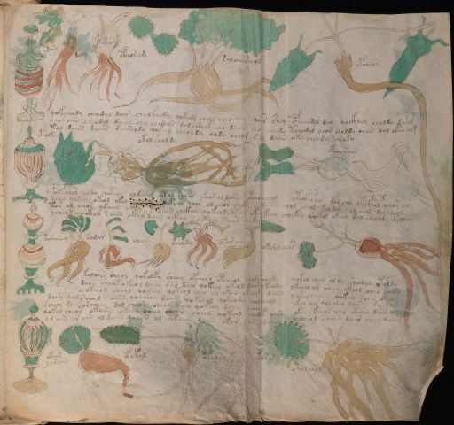

# Voynich Speculative Procedural Protocol — f89r2

IMPORTANT: this is NOT a real or validated translation of the Voynich Manuscript. It is a speculative/procedural model that interprets EVA using a user-defined grammar to generate experimental recipes using safe, known edible substitutes.

This file is generated automatically from IVTFF/EVA transliteration plus a user-defined procedural grammar.



## Page / Folio
- currier: A
- folio: f89r2
- page_number: 184

## EVA Text (Transliteration)
```text
odory
doly
opchosam
saloiinsheol
opcheor
qokcheody cheodal dair cholkeedy qokedy cheal cheo dal qoaii[s:r] shey cpheeedol deey qockhey chaldy daim
chos aiin cheodal daiin chy chedain dolchsyckheol daiin chody cheedy tchodol chor choldy chos dol okcheeg
tol daiin daiin daiinody qokeey cheoldy qody cheor sain daiin oky cheody cheoky
otold[:y]
okol shol dy
opchoroiin
porachol [y:q]ody qoteol oldaiin otol sheor shor oldaiin otchol cheol otolpchy dar cho lkeopol oeeor or
daiin olkey okeol okey okeeol qoor ol chor cheky chol daiin chol cheol koldam olcheol dol cheol
tos ol chor ydaiin chey s oiiin chckhy qokeol okey okeey keey caeky qokol okeey dal cheeody oeckhy
ycheo keeo ckho saiin okeo daiin ockhy s ockhey saiin chchky
korainy
sodar
cheys
cheody
oporain
okshdchos
kolches sheol qokeoefy sheey opcheor opcheol shody sholdy qokal chey oldy sheodal ytoldy
daiin cheok o keol daiin dal dair qokeey okeol daiin ykeody okeeey as cheey okeol cheo cheky
yokeeol cheol qokeey qokeol chey cheokor okeey ky daiin qokeol cheey qokeey saiin oteos
daiin dal sheol s aiin qocheey daiiin qokeeyl qokeody chol cheol ykeo qo qol cheo loiiin doigom
scheor sy sorcheey dol cheor cheey keey qokeey daiin ycheary okeey keeokechy cthey daiin dy
qokol cheor okoiin okeoy qoeey cheor cheey qokeol cheal s aiin ocheol soiiin dair chey daiin
o r ain ar ain ol daiin qoaiin ol chkaiin daiin okar dair y?dair
okain
yorain
ofakal
otalsy
ytarem
otolarol
```

## Domain Context (Heuristic; Not a Translation)

This section summarizes recurring **basewords** in this IVTFF domain and shows simple substring evidence that the token markers used by the procedural grammar occur inside frequent words.

Any Italian anagram / English gloss is a best-effort lexicon match, not a decipherment.


### Associated basewords (non-generic; top by frequency in this domain)
- `daiin` (count=231) → Italian anagram `piani`; English: plans (arrangements)
- `qokaiin` (count=122) → Italian anagram `ciancio`; English: [n/a]
- `okaiin` (count=109) → Italian anagram `coniai`; English: [n/a]
- `qokain` (count=101) → Italian anagram `acconi`; English: [n/a]
- `okain` (count=69) → Italian anagram `acino`; English: a berry
- `otain` (count=53) → Italian anagram `anito`; English: [n/a]
- `qokar` (count=48) → Italian anagram `carco`; English: [n/a]
- `saiin` (count=46) → Italian anagram `asini`; English: [n/a]
- `qokal` (count=43) → Italian anagram `calco`; English: cast (of sculpture)
- `qotaiin` (count=40) → Italian anagram `cationi`; English: [n/a]
- `lkaiin` (count=39) → Italian anagram `ancili`; English: [n/a]
- `kaiin` (count=37) → Italian anagram `acini`; English: [n/a]
- `qokeol` (count=37) → Italian anagram `eccolo`; English: [n/a]
- `qotain` (count=34) → Italian anagram `antico`; English: ancient
- `qotar` (count=29) → Italian anagram `corta`; English: [n/a]

### Marker evidence (substring in frequent basewords)
- `qo`: 60 basewords; examples: `qokeey`, `qokeedy`, `qokaiin`, `qokain`, `qokedy`, `qokey`
- `q`: 61 basewords; examples: `qokeey`, `qokeedy`, `qokaiin`, `qokain`, `qokedy`, `qokey`
- `o`: 262 basewords; examples: `qokeey`, `ol`, `o`, `qokeedy`, `okeey`, `qokaiin`
- `k`: 147 basewords; examples: `qokeey`, `qokeedy`, `okeey`, `qokaiin`, `okaiin`, `qokain`
- `t`: 102 basewords; examples: `otaiin`, `oteey`, `otar`, `otedy`, `otal`, `oteedy`
- `p`: 17 basewords; examples: `opchedy`, `qopchedy`, `opchey`, `pchedy`, `qopchdy`, `opchdy`
- `ch`: 137 basewords; examples: `chedy`, `chey`, `chol`, `cheey`, `cheol`, `cheody`
- `sh`: 50 basewords; examples: `shedy`, `shey`, `sheey`, `sheol`, `shol`, `sheedy`
- `f`: 1 basewords; examples: `f`
- `cth`: 16 basewords; examples: `chcthy`, `cthey`, `shcthy`, `checthy`, `cthol`, `ctheey`
- `ckh`: 15 basewords; examples: `chckhy`, `shckhy`, `checkhy`, `chckhey`, `chockhy`, `sheckhy`
- `cph`: 2 basewords; examples: `cphol`, `cphy`
- `dy`: 84 basewords; examples: `chedy`, `qokeedy`, `shedy`, `otedy`, `oteedy`, `qokedy`
- `iin`: 39 basewords; examples: `aiin`, `daiin`, `qokaiin`, `okaiin`, `otaiin`, `saiin`
- `aiin`: 33 basewords; examples: `aiin`, `daiin`, `qokaiin`, `okaiin`, `otaiin`, `saiin`

## Recipes Index (This Page)
- [f89r2.1,@Lc](#f89r2-1-f89r2-1-lc)
- [f89r2.2,@Lf](#f89r2-2-f89r2-2-lf)
- [f89r2.3,@Lf](#f89r2-3-f89r2-3-lf)
- [f89r2.4,@Lf](#f89r2-4-f89r2-4-lf)
- [f89r2.5,@Lf](#f89r2-5-f89r2-5-lf)
- [f89r2.6,@P0](#f89r2-6-f89r2-6-p0)
- [f89r2.7,+P0](#f89r2-7-f89r2-7-p0)
- [f89r2.8,+P0](#f89r2-8-f89r2-8-p0)
- [f89r2.9,@Lc](#f89r2-9-f89r2-9-lc)
- [f89r2.10,@Lf](#f89r2-10-f89r2-10-lf)
- [f89r2.11,@Lf](#f89r2-11-f89r2-11-lf)
- [f89r2.12,@P0](#f89r2-12-f89r2-12-p0)
- [f89r2.13,+P0](#f89r2-13-f89r2-13-p0)
- [f89r2.14,+P0](#f89r2-14-f89r2-14-p0)
- [f89r2.15,+P0](#f89r2-15-f89r2-15-p0)
- [f89r2.16,@Lc](#f89r2-16-f89r2-16-lc)
- [f89r2.17,@Lf](#f89r2-17-f89r2-17-lf)
- [f89r2.18,@Lf](#f89r2-18-f89r2-18-lf)
- [f89r2.19,@Lf](#f89r2-19-f89r2-19-lf)
- [f89r2.20,@Lf](#f89r2-20-f89r2-20-lf)
- [f89r2.21,@Lf](#f89r2-21-f89r2-21-lf)
- [f89r2.22,@P0](#f89r2-22-f89r2-22-p0)
- [f89r2.23,+P0](#f89r2-23-f89r2-23-p0)
- [f89r2.24,+P0](#f89r2-24-f89r2-24-p0)
- [f89r2.25,+P0](#f89r2-25-f89r2-25-p0)
- [f89r2.26,+P0](#f89r2-26-f89r2-26-p0)
- [f89r2.27,+P0](#f89r2-27-f89r2-27-p0)
- [f89r2.28,+P0](#f89r2-28-f89r2-28-p0)
- [f89r2.29,@Lc](#f89r2-29-f89r2-29-lc)
- [f89r2.30,+Lc](#f89r2-30-f89r2-30-lc)
- [f89r2.31,@Lf](#f89r2-31-f89r2-31-lf)
- [f89r2.32,@Lf](#f89r2-32-f89r2-32-lf)
- [f89r2.33,@Lf](#f89r2-33-f89r2-33-lf)
- [f89r2.34,@Lf](#f89r2-34-f89r2-34-lf)

## Line Glosses (Procedural Gloss Only; Not a Translation)

<a id="f89r2-1-f89r2-1-lc"></a>

### f89r2.1,@Lc

EVA: odory

Direct Gloss (Procedural, Not a Real Translation):
- odory: mix / transfer → add starter / activate

<a id="f89r2-2-f89r2-2-lf"></a>

### f89r2.2,@Lf

EVA: doly

Direct Gloss (Procedural, Not a Real Translation):
- doly: mix / transfer → add starter / activate

<a id="f89r2-3-f89r2-3-lf"></a>

### f89r2.3,@Lf

EVA: opchosam

Direct Gloss (Procedural, Not a Real Translation):
- opchosam: add main plant (safe substitute) → mix / transfer → add starter / activate → duration level 1 → state: phase transition/start

<a id="f89r2-4-f89r2-4-lf"></a>

### f89r2.4,@Lf

EVA: saloiinsheol

Direct Gloss (Procedural, Not a Real Translation):
- saloiinsheol: add secondary herb (safe substitute) → mix / transfer → duration level 1 → state: phase transition/start → medium phase

<a id="f89r2-5-f89r2-5-lf"></a>

### f89r2.5,@Lf

EVA: opcheor

Direct Gloss (Procedural, Not a Real Translation):
- opcheor: add main plant (safe substitute) → mix / transfer → add starter / activate → duration level 1 → state: active extraction

<a id="f89r2-6-f89r2-6-p0"></a>

### f89r2.6,@P0

EVA: qokcheody cheodal dair cholkeedy qokedy cheal cheo dal qoaii[s:r] shey cpheeedol deey qockhey chaldy daim

Direct Gloss (Procedural, Not a Real Translation):
- qokcheody: prepare liquid base → add fermentable sugars → add main plant (safe substitute) → mix / transfer → add starter / activate → duration level 1 → state: active extraction
- cheodal: add main plant (safe substitute) → mix / transfer → add starter / activate → duration level 1 → state: active extraction
- dair: add starter / activate → duration level 1 → state: phase transition/start
- cholkeedy: add fermentable sugars → add main plant (safe substitute) → mix / transfer → add starter / activate → duration level 2 → state: active extraction
- qokedy: prepare liquid base → add fermentable sugars → add starter / activate → duration level 1 → state: active extraction
- cheal: add main plant (safe substitute) → duration level 1 → state: active extraction
- cheo: add main plant (safe substitute) → mix / transfer → duration level 1 → state: active extraction
- dal: add starter / activate → duration level 1 → state: phase transition/start
- qoaii: prepare liquid base → duration level 1 → state: phase transition/start
- s: [unparsed]
- r: [unparsed]
- shey: add secondary herb (safe substitute) → duration level 1 → state: active extraction
- cpheeedol: mix / transfer → add starter / activate → add complex herbal compound (safe blend) → duration level 3 → state: active extraction
- deey: add starter / activate → duration level 2 → state: active extraction
- qockhey: prepare liquid base → add complex herbal compound (safe blend) → duration level 1 → state: active extraction
- chaldy: add main plant (safe substitute) → add starter / activate → duration level 1 → state: phase transition/start
- daim: add starter / activate → duration level 1 → state: phase transition/start

<a id="f89r2-7-f89r2-7-p0"></a>

### f89r2.7,+P0

EVA: chos aiin cheodal daiin chy chedain dolchsyckheol daiin chody cheedy tchodol chor choldy chos dol okcheeg

Direct Gloss (Procedural, Not a Real Translation):
- chos: add main plant (safe substitute) → mix / transfer
- aiin: duration level 1 → state: phase transition/start → long phase
- cheodal: add main plant (safe substitute) → mix / transfer → add starter / activate → duration level 1 → state: active extraction
- daiin: add starter / activate → duration level 1 → state: phase transition/start → long phase
- chy: add main plant (safe substitute)
- chedain: add main plant (safe substitute) → add starter / activate → duration level 1 → state: active extraction
- dolchsyckheol: add main plant (safe substitute) → mix / transfer → add starter / activate → add complex herbal compound (safe blend) → duration level 1 → state: active extraction
- daiin: add starter / activate → duration level 1 → state: phase transition/start → long phase
- chody: add main plant (safe substitute) → mix / transfer → add starter / activate
- cheedy: add main plant (safe substitute) → add starter / activate → duration level 2 → state: active extraction
- tchodol: apply heat/cooking → add main plant (safe substitute) → mix / transfer → add starter / activate
- chor: add main plant (safe substitute) → mix / transfer
- choldy: add main plant (safe substitute) → mix / transfer → add starter / activate
- chos: add main plant (safe substitute) → mix / transfer
- dol: mix / transfer → add starter / activate
- okcheeg: add fermentable sugars → add main plant (safe substitute) → mix / transfer → duration level 2 → state: active extraction

<a id="f89r2-8-f89r2-8-p0"></a>

### f89r2.8,+P0

EVA: tol daiin daiin daiinody qokeey cheoldy qody cheor sain daiin oky cheody cheoky

Direct Gloss (Procedural, Not a Real Translation):
- tol: apply heat/cooking → mix / transfer
- daiin: add starter / activate → duration level 1 → state: phase transition/start → long phase
- daiin: add starter / activate → duration level 1 → state: phase transition/start → long phase
- daiinody: mix / transfer → add starter / activate → duration level 1 → state: phase transition/start → long phase
- qokeey: prepare liquid base → add fermentable sugars → duration level 2 → state: active extraction
- cheoldy: add main plant (safe substitute) → mix / transfer → add starter / activate → duration level 1 → state: active extraction
- qody: prepare liquid base → add starter / activate
- cheor: add main plant (safe substitute) → mix / transfer → duration level 1 → state: active extraction
- sain: duration level 1 → state: phase transition/start
- daiin: add starter / activate → duration level 1 → state: phase transition/start → long phase
- oky: add fermentable sugars → mix / transfer
- cheody: add main plant (safe substitute) → mix / transfer → add starter / activate → duration level 1 → state: active extraction
- cheoky: add fermentable sugars → add main plant (safe substitute) → mix / transfer → duration level 1 → state: active extraction

<a id="f89r2-9-f89r2-9-lc"></a>

### f89r2.9,@Lc

EVA: otold[:y]

Direct Gloss (Procedural, Not a Real Translation):
- otold: apply heat/cooking → mix / transfer → add starter / activate
- y: [unparsed]

<a id="f89r2-10-f89r2-10-lf"></a>

### f89r2.10,@Lf

EVA: okol shol dy

Direct Gloss (Procedural, Not a Real Translation):
- okol: add fermentable sugars → mix / transfer
- shol: add secondary herb (safe substitute) → mix / transfer
- dy: add starter / activate

<a id="f89r2-11-f89r2-11-lf"></a>

### f89r2.11,@Lf

EVA: opchoroiin

Direct Gloss (Procedural, Not a Real Translation):
- opchoroiin: add main plant (safe substitute) → mix / transfer → add starter / activate → duration level 2 → state: cooling/rest → medium phase

<a id="f89r2-12-f89r2-12-p0"></a>

### f89r2.12,@P0

EVA: porachol [y:q]ody qoteol oldaiin otol sheor shor oldaiin otchol cheol otolpchy dar cho lkeopol oeeor or

Direct Gloss (Procedural, Not a Real Translation):
- porachol: add main plant (safe substitute) → mix / transfer → add starter / activate → duration level 1 → state: phase transition/start
- y: [unparsed]
- q: prepare base (generic)
- ody: mix / transfer → add starter / activate
- qoteol: prepare liquid base → apply heat/cooking → mix / transfer → duration level 1 → state: active extraction
- oldaiin: mix / transfer → add starter / activate → duration level 1 → state: phase transition/start → long phase
- otol: apply heat/cooking → mix / transfer
- sheor: add secondary herb (safe substitute) → mix / transfer → duration level 1 → state: active extraction
- shor: add secondary herb (safe substitute) → mix / transfer
- oldaiin: mix / transfer → add starter / activate → duration level 1 → state: phase transition/start → long phase
- otchol: apply heat/cooking → add main plant (safe substitute) → mix / transfer
- cheol: add main plant (safe substitute) → mix / transfer → duration level 1 → state: active extraction
- otolpchy: apply heat/cooking → add main plant (safe substitute) → mix / transfer → add starter / activate
- dar: add starter / activate → duration level 1 → state: phase transition/start
- cho: add main plant (safe substitute) → mix / transfer
- lkeopol: add fermentable sugars → mix / transfer → add starter / activate → duration level 1 → state: active extraction
- oeeor: mix / transfer → duration level 2 → state: active extraction
- or: mix / transfer

<a id="f89r2-13-f89r2-13-p0"></a>

### f89r2.13,+P0

EVA: daiin olkey okeol okey okeeol qoor ol chor cheky chol daiin chol cheol koldam olcheol dol cheol

Direct Gloss (Procedural, Not a Real Translation):
- daiin: add starter / activate → duration level 1 → state: phase transition/start → long phase
- olkey: add fermentable sugars → mix / transfer → duration level 1 → state: active extraction
- okeol: add fermentable sugars → mix / transfer → duration level 1 → state: active extraction
- okey: add fermentable sugars → mix / transfer → duration level 1 → state: active extraction
- okeeol: add fermentable sugars → mix / transfer → duration level 2 → state: active extraction
- qoor: prepare liquid base → mix / transfer
- ol: mix / transfer
- chor: add main plant (safe substitute) → mix / transfer
- cheky: add fermentable sugars → add main plant (safe substitute) → duration level 1 → state: active extraction
- chol: add main plant (safe substitute) → mix / transfer
- daiin: add starter / activate → duration level 1 → state: phase transition/start → long phase
- chol: add main plant (safe substitute) → mix / transfer
- cheol: add main plant (safe substitute) → mix / transfer → duration level 1 → state: active extraction
- koldam: add fermentable sugars → mix / transfer → add starter / activate → duration level 1 → state: phase transition/start
- olcheol: add main plant (safe substitute) → mix / transfer → duration level 1 → state: active extraction
- dol: mix / transfer → add starter / activate
- cheol: add main plant (safe substitute) → mix / transfer → duration level 1 → state: active extraction

<a id="f89r2-14-f89r2-14-p0"></a>

### f89r2.14,+P0

EVA: tos ol chor ydaiin chey s oiiin chckhy qokeol okey okeey keey caeky qokol okeey dal cheeody oeckhy

Direct Gloss (Procedural, Not a Real Translation):
- tos: apply heat/cooking → mix / transfer
- ol: mix / transfer
- chor: add main plant (safe substitute) → mix / transfer
- ydaiin: add starter / activate → duration level 1 → state: phase transition/start → long phase
- chey: add main plant (safe substitute) → duration level 1 → state: active extraction
- s: [unparsed]
- oiiin: mix / transfer → duration level 3 → state: cooling/rest → medium phase
- chckhy: add main plant (safe substitute) → add complex herbal compound (safe blend)
- qokeol: prepare liquid base → add fermentable sugars → mix / transfer → duration level 1 → state: active extraction
- okey: add fermentable sugars → mix / transfer → duration level 1 → state: active extraction
- okeey: add fermentable sugars → mix / transfer → duration level 2 → state: active extraction
- keey: add fermentable sugars → duration level 2 → state: active extraction
- caeky: add fermentable sugars → duration level 1 → state: phase transition/start
- qokol: prepare liquid base → add fermentable sugars → mix / transfer
- okeey: add fermentable sugars → mix / transfer → duration level 2 → state: active extraction
- dal: add starter / activate → duration level 1 → state: phase transition/start
- cheeody: add main plant (safe substitute) → mix / transfer → add starter / activate → duration level 2 → state: active extraction
- oeckhy: mix / transfer → add complex herbal compound (safe blend) → duration level 1 → state: active extraction

<a id="f89r2-15-f89r2-15-p0"></a>

### f89r2.15,+P0

EVA: ycheo keeo ckho saiin okeo daiin ockhy s ockhey saiin chchky

Direct Gloss (Procedural, Not a Real Translation):
- ycheo: add main plant (safe substitute) → mix / transfer → duration level 1 → state: active extraction
- keeo: add fermentable sugars → mix / transfer → duration level 2 → state: active extraction
- ckho: mix / transfer → add complex herbal compound (safe blend)
- saiin: duration level 1 → state: phase transition/start → long phase
- okeo: add fermentable sugars → mix / transfer → duration level 1 → state: active extraction
- daiin: add starter / activate → duration level 1 → state: phase transition/start → long phase
- ockhy: mix / transfer → add complex herbal compound (safe blend)
- s: [unparsed]
- ockhey: mix / transfer → add complex herbal compound (safe blend) → duration level 1 → state: active extraction
- saiin: duration level 1 → state: phase transition/start → long phase
- chchky: add fermentable sugars → add main plant (safe substitute)

<a id="f89r2-16-f89r2-16-lc"></a>

### f89r2.16,@Lc

EVA: korainy

Direct Gloss (Procedural, Not a Real Translation):
- korainy: add fermentable sugars → mix / transfer → duration level 1 → state: phase transition/start

<a id="f89r2-17-f89r2-17-lf"></a>

### f89r2.17,@Lf

EVA: sodar

Direct Gloss (Procedural, Not a Real Translation):
- sodar: mix / transfer → add starter / activate → duration level 1 → state: phase transition/start

<a id="f89r2-18-f89r2-18-lf"></a>

### f89r2.18,@Lf

EVA: cheys

Direct Gloss (Procedural, Not a Real Translation):
- cheys: add main plant (safe substitute) → duration level 1 → state: active extraction

<a id="f89r2-19-f89r2-19-lf"></a>

### f89r2.19,@Lf

EVA: cheody

Direct Gloss (Procedural, Not a Real Translation):
- cheody: add main plant (safe substitute) → mix / transfer → add starter / activate → duration level 1 → state: active extraction

<a id="f89r2-20-f89r2-20-lf"></a>

### f89r2.20,@Lf

EVA: oporain

Direct Gloss (Procedural, Not a Real Translation):
- oporain: mix / transfer → add starter / activate → duration level 1 → state: phase transition/start

<a id="f89r2-21-f89r2-21-lf"></a>

### f89r2.21,@Lf

EVA: okshdchos

Direct Gloss (Procedural, Not a Real Translation):
- okshdchos: add fermentable sugars → add main plant (safe substitute) → add secondary herb (safe substitute) → mix / transfer → add starter / activate

<a id="f89r2-22-f89r2-22-p0"></a>

### f89r2.22,@P0

EVA: kolches sheol qokeoefy sheey opcheor opcheol shody sholdy qokal chey oldy sheodal ytoldy

Direct Gloss (Procedural, Not a Real Translation):
- kolches: add fermentable sugars → add main plant (safe substitute) → mix / transfer → duration level 1 → state: active extraction
- sheol: add secondary herb (safe substitute) → mix / transfer → duration level 1 → state: active extraction
- qokeoefy: prepare liquid base → add fermentable sugars → add aroma modifier → mix / transfer → duration level 1 → state: active extraction
- sheey: add secondary herb (safe substitute) → duration level 2 → state: active extraction
- opcheor: add main plant (safe substitute) → mix / transfer → add starter / activate → duration level 1 → state: active extraction
- opcheol: add main plant (safe substitute) → mix / transfer → add starter / activate → duration level 1 → state: active extraction
- shody: add secondary herb (safe substitute) → mix / transfer → add starter / activate
- sholdy: add secondary herb (safe substitute) → mix / transfer → add starter / activate
- qokal: prepare liquid base → add fermentable sugars → duration level 1 → state: phase transition/start
- chey: add main plant (safe substitute) → duration level 1 → state: active extraction
- oldy: mix / transfer → add starter / activate
- sheodal: add secondary herb (safe substitute) → mix / transfer → add starter / activate → duration level 1 → state: active extraction
- ytoldy: apply heat/cooking → mix / transfer → add starter / activate

<a id="f89r2-23-f89r2-23-p0"></a>

### f89r2.23,+P0

EVA: daiin cheok o keol daiin dal dair qokeey okeol daiin ykeody okeeey as cheey okeol cheo cheky

Direct Gloss (Procedural, Not a Real Translation):
- daiin: add starter / activate → duration level 1 → state: phase transition/start → long phase
- cheok: add fermentable sugars → add main plant (safe substitute) → mix / transfer → duration level 1 → state: active extraction
- o: mix / transfer
- keol: add fermentable sugars → mix / transfer → duration level 1 → state: active extraction
- daiin: add starter / activate → duration level 1 → state: phase transition/start → long phase
- dal: add starter / activate → duration level 1 → state: phase transition/start
- dair: add starter / activate → duration level 1 → state: phase transition/start
- qokeey: prepare liquid base → add fermentable sugars → duration level 2 → state: active extraction
- okeol: add fermentable sugars → mix / transfer → duration level 1 → state: active extraction
- daiin: add starter / activate → duration level 1 → state: phase transition/start → long phase
- ykeody: add fermentable sugars → mix / transfer → add starter / activate → duration level 1 → state: active extraction
- okeeey: add fermentable sugars → mix / transfer → duration level 3 → state: active extraction
- as: duration level 1 → state: phase transition/start
- cheey: add main plant (safe substitute) → duration level 2 → state: active extraction
- okeol: add fermentable sugars → mix / transfer → duration level 1 → state: active extraction
- cheo: add main plant (safe substitute) → mix / transfer → duration level 1 → state: active extraction
- cheky: add fermentable sugars → add main plant (safe substitute) → duration level 1 → state: active extraction

<a id="f89r2-24-f89r2-24-p0"></a>

### f89r2.24,+P0

EVA: yokeeol cheol qokeey qokeol chey cheokor okeey ky daiin qokeol cheey qokeey saiin oteos

Direct Gloss (Procedural, Not a Real Translation):
- yokeeol: add fermentable sugars → mix / transfer → duration level 2 → state: active extraction
- cheol: add main plant (safe substitute) → mix / transfer → duration level 1 → state: active extraction
- qokeey: prepare liquid base → add fermentable sugars → duration level 2 → state: active extraction
- qokeol: prepare liquid base → add fermentable sugars → mix / transfer → duration level 1 → state: active extraction
- chey: add main plant (safe substitute) → duration level 1 → state: active extraction
- cheokor: add fermentable sugars → add main plant (safe substitute) → mix / transfer → duration level 1 → state: active extraction
- okeey: add fermentable sugars → mix / transfer → duration level 2 → state: active extraction
- ky: add fermentable sugars
- daiin: add starter / activate → duration level 1 → state: phase transition/start → long phase
- qokeol: prepare liquid base → add fermentable sugars → mix / transfer → duration level 1 → state: active extraction
- cheey: add main plant (safe substitute) → duration level 2 → state: active extraction
- qokeey: prepare liquid base → add fermentable sugars → duration level 2 → state: active extraction
- saiin: duration level 1 → state: phase transition/start → long phase
- oteos: apply heat/cooking → mix / transfer → duration level 1 → state: active extraction

<a id="f89r2-25-f89r2-25-p0"></a>

### f89r2.25,+P0

EVA: daiin dal sheol s aiin qocheey daiiin qokeeyl qokeody chol cheol ykeo qo qol cheo loiiin doigom

Direct Gloss (Procedural, Not a Real Translation):
- daiin: add starter / activate → duration level 1 → state: phase transition/start → long phase
- dal: add starter / activate → duration level 1 → state: phase transition/start
- sheol: add secondary herb (safe substitute) → mix / transfer → duration level 1 → state: active extraction
- s: [unparsed]
- aiin: duration level 1 → state: phase transition/start → long phase
- qocheey: prepare liquid base → add main plant (safe substitute) → duration level 2 → state: active extraction
- daiiin: add starter / activate → duration level 1 → state: phase transition/start → medium phase
- qokeeyl: prepare liquid base → add fermentable sugars → duration level 2 → state: active extraction
- qokeody: prepare liquid base → add fermentable sugars → mix / transfer → add starter / activate → duration level 1 → state: active extraction
- chol: add main plant (safe substitute) → mix / transfer
- cheol: add main plant (safe substitute) → mix / transfer → duration level 1 → state: active extraction
- ykeo: add fermentable sugars → mix / transfer → duration level 1 → state: active extraction
- qo: prepare liquid base
- qol: prepare liquid base
- cheo: add main plant (safe substitute) → mix / transfer → duration level 1 → state: active extraction
- loiiin: mix / transfer → duration level 3 → state: cooling/rest → medium phase
- doigom: mix / transfer → add starter / activate → duration level 1 → state: cooling/rest

<a id="f89r2-26-f89r2-26-p0"></a>

### f89r2.26,+P0

EVA: scheor sy sorcheey dol cheor cheey keey qokeey daiin ycheary okeey keeokechy cthey daiin dy

Direct Gloss (Procedural, Not a Real Translation):
- scheor: add main plant (safe substitute) → mix / transfer → duration level 1 → state: active extraction
- sy: [unparsed]
- sorcheey: add main plant (safe substitute) → mix / transfer → duration level 2 → state: active extraction
- dol: mix / transfer → add starter / activate
- cheor: add main plant (safe substitute) → mix / transfer → duration level 1 → state: active extraction
- cheey: add main plant (safe substitute) → duration level 2 → state: active extraction
- keey: add fermentable sugars → duration level 2 → state: active extraction
- qokeey: prepare liquid base → add fermentable sugars → duration level 2 → state: active extraction
- daiin: add starter / activate → duration level 1 → state: phase transition/start → long phase
- ycheary: add main plant (safe substitute) → duration level 1 → state: active extraction
- okeey: add fermentable sugars → mix / transfer → duration level 2 → state: active extraction
- keeokechy: add fermentable sugars → add main plant (safe substitute) → mix / transfer → duration level 2 → state: active extraction
- cthey: add complex herbal compound (safe blend) → duration level 1 → state: active extraction
- daiin: add starter / activate → duration level 1 → state: phase transition/start → long phase
- dy: add starter / activate

<a id="f89r2-27-f89r2-27-p0"></a>

### f89r2.27,+P0

EVA: qokol cheor okoiin okeoy qoeey cheor cheey qokeol cheal s aiin ocheol soiiin dair chey daiin

Direct Gloss (Procedural, Not a Real Translation):
- qokol: prepare liquid base → add fermentable sugars → mix / transfer
- cheor: add main plant (safe substitute) → mix / transfer → duration level 1 → state: active extraction
- okoiin: add fermentable sugars → mix / transfer → duration level 2 → state: cooling/rest → medium phase
- okeoy: add fermentable sugars → mix / transfer → duration level 1 → state: active extraction
- qoeey: prepare liquid base → duration level 2 → state: active extraction
- cheor: add main plant (safe substitute) → mix / transfer → duration level 1 → state: active extraction
- cheey: add main plant (safe substitute) → duration level 2 → state: active extraction
- qokeol: prepare liquid base → add fermentable sugars → mix / transfer → duration level 1 → state: active extraction
- cheal: add main plant (safe substitute) → duration level 1 → state: active extraction
- s: [unparsed]
- aiin: duration level 1 → state: phase transition/start → long phase
- ocheol: add main plant (safe substitute) → mix / transfer → duration level 1 → state: active extraction
- soiiin: mix / transfer → duration level 3 → state: cooling/rest → medium phase
- dair: add starter / activate → duration level 1 → state: phase transition/start
- chey: add main plant (safe substitute) → duration level 1 → state: active extraction
- daiin: add starter / activate → duration level 1 → state: phase transition/start → long phase

<a id="f89r2-28-f89r2-28-p0"></a>

### f89r2.28,+P0

EVA: o r ain ar ain ol daiin qoaiin ol chkaiin daiin okar dair y?dair

Direct Gloss (Procedural, Not a Real Translation):
- o: mix / transfer
- r: [unparsed]
- ain: duration level 1 → state: phase transition/start
- ar: duration level 1 → state: phase transition/start
- ain: duration level 1 → state: phase transition/start
- ol: mix / transfer
- daiin: add starter / activate → duration level 1 → state: phase transition/start → long phase
- qoaiin: prepare liquid base → duration level 1 → state: phase transition/start → long phase
- ol: mix / transfer
- chkaiin: add fermentable sugars → add main plant (safe substitute) → duration level 1 → state: phase transition/start → long phase
- daiin: add starter / activate → duration level 1 → state: phase transition/start → long phase
- okar: add fermentable sugars → mix / transfer → duration level 1 → state: phase transition/start
- dair: add starter / activate → duration level 1 → state: phase transition/start
- y: [unparsed]
- dair: add starter / activate → duration level 1 → state: phase transition/start

<a id="f89r2-29-f89r2-29-lc"></a>

### f89r2.29,@Lc

EVA: okain

Direct Gloss (Procedural, Not a Real Translation):
- okain: add fermentable sugars → mix / transfer → duration level 1 → state: phase transition/start

<a id="f89r2-30-f89r2-30-lc"></a>

### f89r2.30,+Lc

EVA: yorain

Direct Gloss (Procedural, Not a Real Translation):
- yorain: mix / transfer → duration level 1 → state: phase transition/start

<a id="f89r2-31-f89r2-31-lf"></a>

### f89r2.31,@Lf

EVA: ofakal

Direct Gloss (Procedural, Not a Real Translation):
- ofakal: add fermentable sugars → add aroma modifier → mix / transfer → duration level 1 → state: phase transition/start

<a id="f89r2-32-f89r2-32-lf"></a>

### f89r2.32,@Lf

EVA: otalsy

Direct Gloss (Procedural, Not a Real Translation):
- otalsy: apply heat/cooking → mix / transfer → duration level 1 → state: phase transition/start

<a id="f89r2-33-f89r2-33-lf"></a>

### f89r2.33,@Lf

EVA: ytarem

Direct Gloss (Procedural, Not a Real Translation):
- ytarem: apply heat/cooking → duration level 1 → state: phase transition/start

<a id="f89r2-34-f89r2-34-lf"></a>

### f89r2.34,@Lf

EVA: otolarol

Direct Gloss (Procedural, Not a Real Translation):
- otolarol: apply heat/cooking → mix / transfer → duration level 1 → state: phase transition/start
