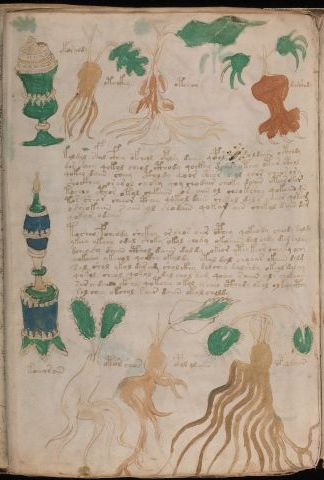

# Voynich Speculative Procedural Protocol — f89v1

IMPORTANT: this is NOT a real or validated translation of the Voynich Manuscript. It is a speculative/procedural model that interprets EVA using a user-defined grammar to generate experimental recipes using safe, known edible substitutes.

This file is generated automatically from IVTFF/EVA transliteration plus a user-defined procedural grammar.



## Page / Folio
- currier: A
- folio: f89v1
- page_number: 186

## EVA Text (Transliteration)
```text
okoraldy
otoikhy
otchar
darshody
koldal sfal cfhey ofcheol opolsy daiin qopol oldaiin octhody
dor sheey qokol cheol cthody qockhy dain yteey otar cthol
qokey daiin cheey ctho dy qoor shear s ol chor chearory
shockhey orarol cheoky qoy chodair choky daiin otarokar
tochho cthor okol chekaiin os aiin ol cheokchey qokoiiin du
tor sheor cheeor cthey qokol daiin chekal dals chear qotam
osheokaiin s ain ol shodain qokar ain chekal daiin dar
qokar odaiin
tosheo fcheody shekey or shos oiir cphey qokeody cheody daldy
ykeey ykeey odal shoky okol chody okoaiin dal chdy daldaldy
dcheocy daiin cthol daiin daldy okeor ytey keor cheyty ochy
qokaiin ykchol qockhy okaldy okal dal chodar okaiin dalg
sal shol ykol daram sholckhy dolchey dalshdy okeol dalchy
qokol sheol qokol dal chol dam qoeey saiin ols chokaiin
sar a da[iin:?] ckhy qotchy okol ycheo cthody okol olkaycthy
sol chey okchol sair daiin okal choldy
koeeorain
otorshos
opol olaiin
opaldaiin
```

## Domain Context (Heuristic; Not a Translation)

This section summarizes recurring **basewords** in this IVTFF domain and shows simple substring evidence that the token markers used by the procedural grammar occur inside frequent words.

Any Italian anagram / English gloss is a best-effort lexicon match, not a decipherment.


### Associated basewords (non-generic; top by frequency in this domain)
- `daiin` (count=231) → Italian anagram `piani`; English: plans (arrangements)
- `qokaiin` (count=122) → Italian anagram `ciancio`; English: [n/a]
- `okaiin` (count=109) → Italian anagram `coniai`; English: [n/a]
- `qokain` (count=101) → Italian anagram `acconi`; English: [n/a]
- `okain` (count=69) → Italian anagram `acino`; English: a berry
- `otain` (count=53) → Italian anagram `anito`; English: [n/a]
- `qokar` (count=48) → Italian anagram `carco`; English: [n/a]
- `saiin` (count=46) → Italian anagram `asini`; English: [n/a]
- `qokal` (count=43) → Italian anagram `calco`; English: cast (of sculpture)
- `qotaiin` (count=40) → Italian anagram `cationi`; English: [n/a]
- `lkaiin` (count=39) → Italian anagram `ancili`; English: [n/a]
- `kaiin` (count=37) → Italian anagram `acini`; English: [n/a]
- `qokeol` (count=37) → Italian anagram `eccolo`; English: [n/a]
- `qotain` (count=34) → Italian anagram `antico`; English: ancient
- `qotar` (count=29) → Italian anagram `corta`; English: [n/a]

### Marker evidence (substring in frequent basewords)
- `qo`: 60 basewords; examples: `qokeey`, `qokeedy`, `qokaiin`, `qokain`, `qokedy`, `qokey`
- `q`: 61 basewords; examples: `qokeey`, `qokeedy`, `qokaiin`, `qokain`, `qokedy`, `qokey`
- `o`: 262 basewords; examples: `qokeey`, `ol`, `o`, `qokeedy`, `okeey`, `qokaiin`
- `k`: 147 basewords; examples: `qokeey`, `qokeedy`, `okeey`, `qokaiin`, `okaiin`, `qokain`
- `t`: 102 basewords; examples: `otaiin`, `oteey`, `otar`, `otedy`, `otal`, `oteedy`
- `p`: 17 basewords; examples: `opchedy`, `qopchedy`, `opchey`, `pchedy`, `qopchdy`, `opchdy`
- `ch`: 137 basewords; examples: `chedy`, `chey`, `chol`, `cheey`, `cheol`, `cheody`
- `sh`: 50 basewords; examples: `shedy`, `shey`, `sheey`, `sheol`, `shol`, `sheedy`
- `f`: 1 basewords; examples: `f`
- `cth`: 16 basewords; examples: `chcthy`, `cthey`, `shcthy`, `checthy`, `cthol`, `ctheey`
- `ckh`: 15 basewords; examples: `chckhy`, `shckhy`, `checkhy`, `chckhey`, `chockhy`, `sheckhy`
- `cph`: 2 basewords; examples: `cphol`, `cphy`
- `dy`: 84 basewords; examples: `chedy`, `qokeedy`, `shedy`, `otedy`, `oteedy`, `qokedy`
- `iin`: 39 basewords; examples: `aiin`, `daiin`, `qokaiin`, `okaiin`, `otaiin`, `saiin`
- `aiin`: 33 basewords; examples: `aiin`, `daiin`, `qokaiin`, `okaiin`, `otaiin`, `saiin`

## Recipes Index (This Page)
- [f89v1.1,@Lc](#f89v1-1-f89v1-1-lc)
- [f89v1.2,@Lf](#f89v1-2-f89v1-2-lf)
- [f89v1.3,@Lf](#f89v1-3-f89v1-3-lf)
- [f89v1.4,@Lf](#f89v1-4-f89v1-4-lf)
- [f89v1.5,@P0](#f89v1-5-f89v1-5-p0)
- [f89v1.6,+P0](#f89v1-6-f89v1-6-p0)
- [f89v1.7,+P0](#f89v1-7-f89v1-7-p0)
- [f89v1.8,+P0](#f89v1-8-f89v1-8-p0)
- [f89v1.9,+P0](#f89v1-9-f89v1-9-p0)
- [f89v1.10,+P0](#f89v1-10-f89v1-10-p0)
- [f89v1.11,+P0](#f89v1-11-f89v1-11-p0)
- [f89v1.12,+P0](#f89v1-12-f89v1-12-p0)
- [f89v1.13,+P0](#f89v1-13-f89v1-13-p0)
- [f89v1.14,+P0](#f89v1-14-f89v1-14-p0)
- [f89v1.15,+P0](#f89v1-15-f89v1-15-p0)
- [f89v1.16,+P0](#f89v1-16-f89v1-16-p0)
- [f89v1.17,+P0](#f89v1-17-f89v1-17-p0)
- [f89v1.18,+P0](#f89v1-18-f89v1-18-p0)
- [f89v1.19,+P0](#f89v1-19-f89v1-19-p0)
- [f89v1.20,+P0](#f89v1-20-f89v1-20-p0)
- [f89v1.21,@Lc](#f89v1-21-f89v1-21-lc)
- [f89v1.22,@Lf](#f89v1-22-f89v1-22-lf)
- [f89v1.23,@Lf](#f89v1-23-f89v1-23-lf)
- [f89v1.24,@Lf](#f89v1-24-f89v1-24-lf)

## Line Glosses (Procedural Gloss Only; Not a Translation)

<a id="f89v1-1-f89v1-1-lc"></a>

### f89v1.1,@Lc

EVA: okoraldy

Direct Gloss (Procedural, Not a Real Translation):
- okoraldy: tokens: o k o r a l p → connectors: r l → vowel_run: a (level 1; class a)

<a id="f89v1-2-f89v1-2-lf"></a>

### f89v1.2,@Lf

EVA: otoikhy

Direct Gloss (Procedural, Not a Real Translation):
- otoikhy: tokens: o t o i k h → vowel_run: i (level 1; class i) → unmodeled_tokens: h

<a id="f89v1-3-f89v1-3-lf"></a>

### f89v1.3,@Lf

EVA: otchar

Direct Gloss (Procedural, Not a Real Translation):
- otchar: tokens: o t ch a r → connectors: r → vowel_run: a (level 1; class a)

<a id="f89v1-4-f89v1-4-lf"></a>

### f89v1.4,@Lf

EVA: darshody

Direct Gloss (Procedural, Not a Real Translation):
- darshody: tokens: p a r sh o p → connectors: r → vowel_run: a (level 1; class a)

<a id="f89v1-5-f89v1-5-p0"></a>

### f89v1.5,@P0

EVA: koldal sfal cfhey ofcheol opolsy daiin qopol oldaiin octhody

Direct Gloss (Procedural, Not a Real Translation):
- koldal: tokens: k o l p a l → connectors: l l → vowel_run: a (level 1; class a)
- sfal: tokens: s f a l → connectors: s l → vowel_run: a (level 1; class a)
- cfhey: tokens: cfh e → vowel_run: e (level 1; class e)
- ofcheol: tokens: o f ch e o l → connectors: l → vowel_run: e (level 1; class e)
- opolsy: tokens: o p o l s → connectors: l s
- daiin: tokens: p aiin → vowel_run: a (level 1; class a) → suffix: aiin
- qopol: tokens: qo p o l → connectors: l
- oldaiin: tokens: o l p aiin → connectors: l → vowel_run: a (level 1; class a) → suffix: aiin
- octhody: tokens: o cth o p

<a id="f89v1-6-f89v1-6-p0"></a>

### f89v1.6,+P0

EVA: dor sheey qokol cheol cthody qockhy dain yteey otar cthol

Direct Gloss (Procedural, Not a Real Translation):
- dor: tokens: p o r → connectors: r
- sheey: tokens: sh ee → vowel_run: ee (level 2; class e)
- qokol: tokens: qo k o l → connectors: l
- cheol: tokens: ch e o l → connectors: l → vowel_run: e (level 1; class e)
- cthody: tokens: cth o p
- qockhy: tokens: qo ckh
- dain: tokens: p a i n → connectors: n → vowel_run: a (level 1; class a)
- yteey: tokens: t ee → vowel_run: ee (level 2; class e)
- otar: tokens: o t a r → connectors: r → vowel_run: a (level 1; class a)
- cthol: tokens: cth o l → connectors: l

<a id="f89v1-7-f89v1-7-p0"></a>

### f89v1.7,+P0

EVA: qokey daiin cheey ctho dy qoor shear s ol chor chearory

Direct Gloss (Procedural, Not a Real Translation):
- qokey: tokens: qo k e → vowel_run: e (level 1; class e)
- daiin: tokens: p aiin → vowel_run: a (level 1; class a) → suffix: aiin
- cheey: tokens: ch ee → vowel_run: ee (level 2; class e)
- ctho: tokens: cth o
- dy: tokens: p
- qoor: tokens: qo o r → connectors: r
- shear: tokens: sh e a r → connectors: r → vowel_run: e (level 1; class e)
- s: tokens: s → connectors: s
- ol: tokens: o l → connectors: l
- chor: tokens: ch o r → connectors: r
- chearory: tokens: ch e a r o r → connectors: r r → vowel_run: e (level 1; class e)

<a id="f89v1-8-f89v1-8-p0"></a>

### f89v1.8,+P0

EVA: shockhey orarol cheoky qoy chodair choky daiin otarokar

Direct Gloss (Procedural, Not a Real Translation):
- shockhey: tokens: sh o ckh e → vowel_run: e (level 1; class e)
- orarol: tokens: o r a r o l → connectors: r r l → vowel_run: a (level 1; class a)
- cheoky: tokens: ch e o k → vowel_run: e (level 1; class e)
- qoy: tokens: qo
- chodair: tokens: ch o p a i r → connectors: r → vowel_run: a (level 1; class a)
- choky: tokens: ch o k
- daiin: tokens: p aiin → vowel_run: a (level 1; class a) → suffix: aiin
- otarokar: tokens: o t a r o k a r → connectors: r r → vowel_run: a (level 1; class a)

<a id="f89v1-9-f89v1-9-p0"></a>

### f89v1.9,+P0

EVA: tochho cthor okol chekaiin os aiin ol cheokchey qokoiiin du

Direct Gloss (Procedural, Not a Real Translation):
- tochho: tokens: t o ch h o → unmodeled_tokens: h
- cthor: tokens: cth o r → connectors: r
- okol: tokens: o k o l → connectors: l
- chekaiin: tokens: ch e k aiin → vowel_run: e (level 1; class e) → suffix: aiin
- os: tokens: o s → connectors: s
- aiin: tokens: aiin → vowel_run: a (level 1; class a) → suffix: aiin
- ol: tokens: o l → connectors: l
- cheokchey: tokens: ch e o k ch e → vowel_run: e (level 1; class e)
- qokoiiin: tokens: qo k o iii n → connectors: n → vowel_run: iii (level 3; class i) → suffix: iin
- du: tokens: p u → unmodeled_tokens: u

<a id="f89v1-10-f89v1-10-p0"></a>

### f89v1.10,+P0

EVA: tor sheor cheeor cthey qokol daiin chekal dals chear qotam

Direct Gloss (Procedural, Not a Real Translation):
- tor: tokens: t o r → connectors: r
- sheor: tokens: sh e o r → connectors: r → vowel_run: e (level 1; class e)
- cheeor: tokens: ch ee o r → connectors: r → vowel_run: ee (level 2; class e)
- cthey: tokens: cth e → vowel_run: e (level 1; class e)
- qokol: tokens: qo k o l → connectors: l
- daiin: tokens: p aiin → vowel_run: a (level 1; class a) → suffix: aiin
- chekal: tokens: ch e k a l → connectors: l → vowel_run: e (level 1; class e)
- dals: tokens: p a l s → connectors: l s → vowel_run: a (level 1; class a)
- chear: tokens: ch e a r → connectors: r → vowel_run: e (level 1; class e)
- qotam: tokens: qo t a m → connectors: m → vowel_run: a (level 1; class a)

<a id="f89v1-11-f89v1-11-p0"></a>

### f89v1.11,+P0

EVA: osheokaiin s ain ol shodain qokar ain chekal daiin dar

Direct Gloss (Procedural, Not a Real Translation):
- osheokaiin: tokens: o sh e o k aiin → vowel_run: e (level 1; class e) → suffix: aiin
- s: tokens: s → connectors: s
- ain: tokens: a i n → connectors: n → vowel_run: a (level 1; class a)
- ol: tokens: o l → connectors: l
- shodain: tokens: sh o p a i n → connectors: n → vowel_run: a (level 1; class a)
- qokar: tokens: qo k a r → connectors: r → vowel_run: a (level 1; class a)
- ain: tokens: a i n → connectors: n → vowel_run: a (level 1; class a)
- chekal: tokens: ch e k a l → connectors: l → vowel_run: e (level 1; class e)
- daiin: tokens: p aiin → vowel_run: a (level 1; class a) → suffix: aiin
- dar: tokens: p a r → connectors: r → vowel_run: a (level 1; class a)

<a id="f89v1-12-f89v1-12-p0"></a>

### f89v1.12,+P0

EVA: qokar odaiin

Direct Gloss (Procedural, Not a Real Translation):
- qokar: tokens: qo k a r → connectors: r → vowel_run: a (level 1; class a)
- odaiin: tokens: o p aiin → vowel_run: a (level 1; class a) → suffix: aiin

<a id="f89v1-13-f89v1-13-p0"></a>

### f89v1.13,+P0

EVA: tosheo fcheody shekey or shos oiir cphey qokeody cheody daldy

Direct Gloss (Procedural, Not a Real Translation):
- tosheo: tokens: t o sh e o → vowel_run: e (level 1; class e)
- fcheody: tokens: f ch e o p → vowel_run: e (level 1; class e)
- shekey: tokens: sh e k e → vowel_run: e (level 1; class e)
- or: tokens: o r → connectors: r
- shos: tokens: sh o s → connectors: s
- oiir: tokens: o ii r → connectors: r → vowel_run: ii (level 2; class i)
- cphey: tokens: cph e → vowel_run: e (level 1; class e)
- qokeody: tokens: qo k e o p → vowel_run: e (level 1; class e)
- cheody: tokens: ch e o p → vowel_run: e (level 1; class e)
- daldy: tokens: p a l p → connectors: l → vowel_run: a (level 1; class a)

<a id="f89v1-14-f89v1-14-p0"></a>

### f89v1.14,+P0

EVA: ykeey ykeey odal shoky okol chody okoaiin dal chdy daldaldy

Direct Gloss (Procedural, Not a Real Translation):
- ykeey: tokens: k ee → vowel_run: ee (level 2; class e)
- ykeey: tokens: k ee → vowel_run: ee (level 2; class e)
- odal: tokens: o p a l → connectors: l → vowel_run: a (level 1; class a)
- shoky: tokens: sh o k
- okol: tokens: o k o l → connectors: l
- chody: tokens: ch o p
- okoaiin: tokens: o k o aiin → vowel_run: a (level 1; class a) → suffix: aiin
- dal: tokens: p a l → connectors: l → vowel_run: a (level 1; class a)
- chdy: tokens: ch p
- daldaldy: tokens: p a l p a l p → connectors: l l → vowel_run: a (level 1; class a)

<a id="f89v1-15-f89v1-15-p0"></a>

### f89v1.15,+P0

EVA: dcheocy daiin cthol daiin daldy okeor ytey keor cheyty ochy

Direct Gloss (Procedural, Not a Real Translation):
- dcheocy: tokens: p ch e o c → vowel_run: e (level 1; class e)
- daiin: tokens: p aiin → vowel_run: a (level 1; class a) → suffix: aiin
- cthol: tokens: cth o l → connectors: l
- daiin: tokens: p aiin → vowel_run: a (level 1; class a) → suffix: aiin
- daldy: tokens: p a l p → connectors: l → vowel_run: a (level 1; class a)
- okeor: tokens: o k e o r → connectors: r → vowel_run: e (level 1; class e)
- ytey: tokens: t e → vowel_run: e (level 1; class e)
- keor: tokens: k e o r → connectors: r → vowel_run: e (level 1; class e)
- cheyty: tokens: ch e t → vowel_run: e (level 1; class e)
- ochy: tokens: o ch

<a id="f89v1-16-f89v1-16-p0"></a>

### f89v1.16,+P0

EVA: qokaiin ykchol qockhy okaldy okal dal chodar okaiin dalg

Direct Gloss (Procedural, Not a Real Translation):
- qokaiin: tokens: qo k aiin → vowel_run: a (level 1; class a) → suffix: aiin
- ykchol: tokens: k ch o l → connectors: l
- qockhy: tokens: qo ckh
- okaldy: tokens: o k a l p → connectors: l → vowel_run: a (level 1; class a)
- okal: tokens: o k a l → connectors: l → vowel_run: a (level 1; class a)
- dal: tokens: p a l → connectors: l → vowel_run: a (level 1; class a)
- chodar: tokens: ch o p a r → connectors: r → vowel_run: a (level 1; class a)
- okaiin: tokens: o k aiin → vowel_run: a (level 1; class a) → suffix: aiin
- dalg: tokens: p a l g → connectors: l → vowel_run: a (level 1; class a)

<a id="f89v1-17-f89v1-17-p0"></a>

### f89v1.17,+P0

EVA: sal shol ykol daram sholckhy dolchey dalshdy okeol dalchy

Direct Gloss (Procedural, Not a Real Translation):
- sal: tokens: s a l → connectors: s l → vowel_run: a (level 1; class a)
- shol: tokens: sh o l → connectors: l
- ykol: tokens: k o l → connectors: l
- daram: tokens: p a r a m → connectors: r m → vowel_run: a (level 1; class a)
- sholckhy: tokens: sh o l ckh → connectors: l
- dolchey: tokens: p o l ch e → connectors: l → vowel_run: e (level 1; class e)
- dalshdy: tokens: p a l sh p → connectors: l → vowel_run: a (level 1; class a)
- okeol: tokens: o k e o l → connectors: l → vowel_run: e (level 1; class e)
- dalchy: tokens: p a l ch → connectors: l → vowel_run: a (level 1; class a)

<a id="f89v1-18-f89v1-18-p0"></a>

### f89v1.18,+P0

EVA: qokol sheol qokol dal chol dam qoeey saiin ols chokaiin

Direct Gloss (Procedural, Not a Real Translation):
- qokol: tokens: qo k o l → connectors: l
- sheol: tokens: sh e o l → connectors: l → vowel_run: e (level 1; class e)
- qokol: tokens: qo k o l → connectors: l
- dal: tokens: p a l → connectors: l → vowel_run: a (level 1; class a)
- chol: tokens: ch o l → connectors: l
- dam: tokens: p a m → connectors: m → vowel_run: a (level 1; class a)
- qoeey: tokens: qo ee → vowel_run: ee (level 2; class e)
- saiin: tokens: s aiin → connectors: s → vowel_run: a (level 1; class a) → suffix: aiin
- ols: tokens: o l s → connectors: l s
- chokaiin: tokens: ch o k aiin → vowel_run: a (level 1; class a) → suffix: aiin

<a id="f89v1-19-f89v1-19-p0"></a>

### f89v1.19,+P0

EVA: sar a da[iin:?] ckhy qotchy okol ycheo cthody okol olkaycthy

Direct Gloss (Procedural, Not a Real Translation):
- sar: tokens: s a r → connectors: s r → vowel_run: a (level 1; class a)
- a: tokens: a → vowel_run: a (level 1; class a)
- da: tokens: p a → vowel_run: a (level 1; class a)
- iin: tokens: iin → vowel_run: ii (level 2; class i) → suffix: iin
- ckhy: tokens: ckh
- qotchy: tokens: qo t ch
- okol: tokens: o k o l → connectors: l
- ycheo: tokens: ch e o → vowel_run: e (level 1; class e)
- cthody: tokens: cth o p
- okol: tokens: o k o l → connectors: l
- olkaycthy: tokens: o l k a cth → connectors: l → vowel_run: a (level 1; class a)

<a id="f89v1-20-f89v1-20-p0"></a>

### f89v1.20,+P0

EVA: sol chey okchol sair daiin okal choldy

Direct Gloss (Procedural, Not a Real Translation):
- sol: tokens: s o l → connectors: s l
- chey: tokens: ch e → vowel_run: e (level 1; class e)
- okchol: tokens: o k ch o l → connectors: l
- sair: tokens: s a i r → connectors: s r → vowel_run: a (level 1; class a)
- daiin: tokens: p aiin → vowel_run: a (level 1; class a) → suffix: aiin
- okal: tokens: o k a l → connectors: l → vowel_run: a (level 1; class a)
- choldy: tokens: ch o l p → connectors: l

<a id="f89v1-21-f89v1-21-lc"></a>

### f89v1.21,@Lc

EVA: koeeorain

Direct Gloss (Procedural, Not a Real Translation):
- koeeorain: tokens: k o ee o r a i n → connectors: r n → vowel_run: ee (level 2; class e)

<a id="f89v1-22-f89v1-22-lf"></a>

### f89v1.22,@Lf

EVA: otorshos

Direct Gloss (Procedural, Not a Real Translation):
- otorshos: tokens: o t o r sh o s → connectors: r s

<a id="f89v1-23-f89v1-23-lf"></a>

### f89v1.23,@Lf

EVA: opol olaiin

Direct Gloss (Procedural, Not a Real Translation):
- opol: tokens: o p o l → connectors: l
- olaiin: tokens: o l aiin → connectors: l → vowel_run: a (level 1; class a) → suffix: aiin

<a id="f89v1-24-f89v1-24-lf"></a>

### f89v1.24,@Lf

EVA: opaldaiin

Direct Gloss (Procedural, Not a Real Translation):
- opaldaiin: tokens: o p a l p aiin → connectors: l → vowel_run: a (level 1; class a) → suffix: aiin
