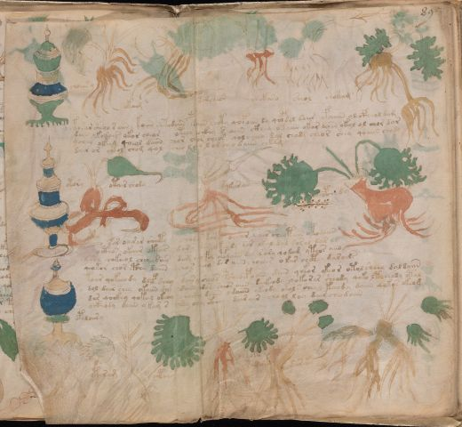

# Voynich Speculative Herbal Ferment Recipe — f89v2

IMPORTANT: this is NOT a real or validated translation of the Voynich Manuscript. It is a speculative/procedural model that interprets EVA using a user-defined grammar to generate experimental recipes using safe, known edible substitutes.

This file is generated automatically from IVTFF/EVA transliteration plus a user-defined procedural grammar.



## Page / Folio
- currier: A
- folio: f89v2
- page_number: 185

## EVA Text (Transliteration)
```text
choeesy
okam
darcheor
chokaro
sheol
chokam
kosar sheol s aiin koiin chtodaiin pdiin choty qofoiin dy qopdal doiir ofaiin ol cfheol dam
dain ykodaiir okor chear otees eeckhy s aiin ckhey otaiin okar dain okol ol chor dar
ychey okeey qoeol daiin chor chos cheos qol e eeey dal chody cheor chey qoaiin chody
dair or cheol chom qol cheo lcho l or cheo daiin chkam
otory
otair chody
dykaran
opcheedey
sor oairar sheety chodor kory oeear eais sheotain ytodaiin
o cthos okaiir okeos dar s siin ykeody dar okal dal dosal dar am
y ch'eo qokeeol chey sair dam chy for opodaiin dam sa[s:r]y qodam yteos aiin
yokor chor cthy daiin chos chey dar aiin choeeer okar chcthy darai[?:l]s
toar qokeeody doef shey dair olsheos psheoepoain daiin qekor okeor otol sheey daldaiin
dol dair chey okaiin shy daiin odor sheos aiin daikeody qokorar sheody qoko ltcheody otal
dar qockhy qokal okeoy chockh[:y] daiin odaiin ykeody okols sheey keeody daiin qokos okeom
ockhody daiin ykam s chty chy cthey dair air chool loy dair cheo daiin
opaloiiry
otaram
chtchy
sada?
daseky
```

## Recipes Index (This Page)
- [f89v2.1,@Lc](#f89v2-1-f89v2-1-lc)
- [f89v2.2,@Lf](#f89v2-2-f89v2-2-lf)
- [f89v2.3,@Lf](#f89v2-3-f89v2-3-lf)
- [f89v2.4,@Lf](#f89v2-4-f89v2-4-lf)
- [f89v2.5,@Lf](#f89v2-5-f89v2-5-lf)
- [f89v2.6,@Lf](#f89v2-6-f89v2-6-lf)
- [f89v2.7,@P0](#f89v2-7-f89v2-7-p0)
- [f89v2.8,+P0](#f89v2-8-f89v2-8-p0)
- [f89v2.9,+P0](#f89v2-9-f89v2-9-p0)
- [f89v2.10,+P0](#f89v2-10-f89v2-10-p0)
- [f89v2.11,@Lc](#f89v2-11-f89v2-11-lc)
- [f89v2.12,@Lf](#f89v2-12-f89v2-12-lf)
- [f89v2.13,@Lf](#f89v2-13-f89v2-13-lf)
- [f89v2.14,@Lf](#f89v2-14-f89v2-14-lf)
- [f89v2.15,@P0](#f89v2-15-f89v2-15-p0)
- [f89v2.16,+P0](#f89v2-16-f89v2-16-p0)
- [f89v2.17,+P0](#f89v2-17-f89v2-17-p0)
- [f89v2.18,+P0](#f89v2-18-f89v2-18-p0)
- [f89v2.19,+P0](#f89v2-19-f89v2-19-p0)
- [f89v2.20,+P0](#f89v2-20-f89v2-20-p0)
- [f89v2.21,+P0](#f89v2-21-f89v2-21-p0)
- [f89v2.22,+P0](#f89v2-22-f89v2-22-p0)
- [f89v2.23,@Lc](#f89v2-23-f89v2-23-lc)
- [f89v2.24,@Lf](#f89v2-24-f89v2-24-lf)
- [f89v2.25,@Lf](#f89v2-25-f89v2-25-lf)
- [f89v2.27,@Lf](#f89v2-26-f89v2-27-lf)
- [f89v2.28,@Lf](#f89v2-27-f89v2-28-lf)

## Line Glosses (Procedural Gloss Only; Not a Translation)

<a id="f89v2-1-f89v2-1-lc"></a>

### f89v2.1,@Lc

EVA: choeesy

Direct Gloss (Procedural, Not a Real Translation):
- choeesy: add main plant (safe substitute) → mix / transfer → duration level 2 → state: active extraction

<a id="f89v2-2-f89v2-2-lf"></a>

### f89v2.2,@Lf

EVA: okam

Direct Gloss (Procedural, Not a Real Translation):
- okam: add fermentable sugars → mix / transfer → duration level 1 → state: fermentation start

<a id="f89v2-3-f89v2-3-lf"></a>

### f89v2.3,@Lf

EVA: darcheor

Direct Gloss (Procedural, Not a Real Translation):
- darcheor: add main plant (safe substitute) → mix / transfer → start fermentation (yeast) → duration level 1 → state: fermentation start

<a id="f89v2-4-f89v2-4-lf"></a>

### f89v2.4,@Lf

EVA: chokaro

Direct Gloss (Procedural, Not a Real Translation):
- chokaro: add fermentable sugars → add main plant (safe substitute) → mix / transfer → duration level 1 → state: fermentation start

<a id="f89v2-5-f89v2-5-lf"></a>

### f89v2.5,@Lf

EVA: sheol

Direct Gloss (Procedural, Not a Real Translation):
- sheol: add secondary herb (safe substitute) → mix / transfer → duration level 1 → state: active extraction

<a id="f89v2-6-f89v2-6-lf"></a>

### f89v2.6,@Lf

EVA: chokam

Direct Gloss (Procedural, Not a Real Translation):
- chokam: add fermentable sugars → add main plant (safe substitute) → mix / transfer → duration level 1 → state: fermentation start

<a id="f89v2-7-f89v2-7-p0"></a>

### f89v2.7,@P0

EVA: kosar sheol s aiin koiin chtodaiin pdiin choty qofoiin dy qopdal doiir ofaiin ol cfheol dam

Direct Gloss (Procedural, Not a Real Translation):
- kosar: add fermentable sugars → mix / transfer → duration level 1 → state: fermentation start
- sheol: add secondary herb (safe substitute) → mix / transfer → duration level 1 → state: active extraction
- s: [unparsed]
- aiin: duration level 1 → state: fermentation start → long fermentation / aging phase
- koiin: add fermentable sugars → mix / transfer → duration level 2 → state: cooling/rest → medium fermentation phase
- chtodaiin: apply heat/cooking → add main plant (safe substitute) → mix / transfer → start fermentation (yeast) → duration level 1 → state: fermentation start → long fermentation / aging phase
- pdiin: start fermentation (yeast) → duration level 2 → state: cooling/rest → medium fermentation phase
- choty: apply heat/cooking → add main plant (safe substitute) → mix / transfer
- qofoiin: prepare liquid base → add aroma modifier → mix / transfer → duration level 2 → state: cooling/rest → medium fermentation phase
- dy: start fermentation (yeast)
- qopdal: prepare liquid base → start fermentation (yeast) → duration level 1 → state: fermentation start
- doiir: mix / transfer → start fermentation (yeast) → duration level 2 → state: cooling/rest
- ofaiin: add aroma modifier → mix / transfer → duration level 1 → state: fermentation start → long fermentation / aging phase
- ol: mix / transfer
- cfheol: mix / transfer → add complex herbal compound (safe blend) → duration level 1 → state: active extraction
- dam: start fermentation (yeast) → duration level 1 → state: fermentation start

<a id="f89v2-8-f89v2-8-p0"></a>

### f89v2.8,+P0

EVA: dain ykodaiir okor chear otees eeckhy s aiin ckhey otaiin okar dain okol ol chor dar

Direct Gloss (Procedural, Not a Real Translation):
- dain: start fermentation (yeast) → duration level 1 → state: fermentation start
- ykodaiir: add fermentable sugars → mix / transfer → start fermentation (yeast) → duration level 1 → state: fermentation start
- okor: add fermentable sugars → mix / transfer
- chear: add main plant (safe substitute) → duration level 1 → state: active extraction
- otees: apply heat/cooking → mix / transfer → duration level 2 → state: active extraction
- eeckhy: add complex herbal compound (safe blend) → duration level 2 → state: active extraction
- s: [unparsed]
- aiin: duration level 1 → state: fermentation start → long fermentation / aging phase
- ckhey: add complex herbal compound (safe blend) → duration level 1 → state: active extraction
- otaiin: apply heat/cooking → mix / transfer → duration level 1 → state: fermentation start → long fermentation / aging phase
- okar: add fermentable sugars → mix / transfer → duration level 1 → state: fermentation start
- dain: start fermentation (yeast) → duration level 1 → state: fermentation start
- okol: add fermentable sugars → mix / transfer
- ol: mix / transfer
- chor: add main plant (safe substitute) → mix / transfer
- dar: start fermentation (yeast) → duration level 1 → state: fermentation start

<a id="f89v2-9-f89v2-9-p0"></a>

### f89v2.9,+P0

EVA: ychey okeey qoeol daiin chor chos cheos qol e eeey dal chody cheor chey qoaiin chody

Direct Gloss (Procedural, Not a Real Translation):
- ychey: add main plant (safe substitute) → duration level 1 → state: active extraction
- okeey: add fermentable sugars → mix / transfer → duration level 2 → state: active extraction
- qoeol: prepare liquid base → mix / transfer → duration level 1 → state: active extraction
- daiin: start fermentation (yeast) → duration level 1 → state: fermentation start → long fermentation / aging phase
- chor: add main plant (safe substitute) → mix / transfer
- chos: add main plant (safe substitute) → mix / transfer
- cheos: add main plant (safe substitute) → mix / transfer → duration level 1 → state: active extraction
- qol: prepare liquid base
- e: duration level 1 → state: active extraction
- eeey: duration level 3 → state: active extraction
- dal: start fermentation (yeast) → duration level 1 → state: fermentation start
- chody: add main plant (safe substitute) → mix / transfer → start fermentation (yeast)
- cheor: add main plant (safe substitute) → mix / transfer → duration level 1 → state: active extraction
- chey: add main plant (safe substitute) → duration level 1 → state: active extraction
- qoaiin: prepare liquid base → duration level 1 → state: fermentation start → long fermentation / aging phase
- chody: add main plant (safe substitute) → mix / transfer → start fermentation (yeast)

<a id="f89v2-10-f89v2-10-p0"></a>

### f89v2.10,+P0

EVA: dair or cheol chom qol cheo lcho l or cheo daiin chkam

Direct Gloss (Procedural, Not a Real Translation):
- dair: start fermentation (yeast) → duration level 1 → state: fermentation start
- or: mix / transfer
- cheol: add main plant (safe substitute) → mix / transfer → duration level 1 → state: active extraction
- chom: add main plant (safe substitute) → mix / transfer
- qol: prepare liquid base
- cheo: add main plant (safe substitute) → mix / transfer → duration level 1 → state: active extraction
- lcho: add main plant (safe substitute) → mix / transfer
- l: [unparsed]
- or: mix / transfer
- cheo: add main plant (safe substitute) → mix / transfer → duration level 1 → state: active extraction
- daiin: start fermentation (yeast) → duration level 1 → state: fermentation start → long fermentation / aging phase
- chkam: add fermentable sugars → add main plant (safe substitute) → duration level 1 → state: fermentation start

<a id="f89v2-11-f89v2-11-lc"></a>

### f89v2.11,@Lc

EVA: otory

Direct Gloss (Procedural, Not a Real Translation):
- otory: apply heat/cooking → mix / transfer

<a id="f89v2-12-f89v2-12-lf"></a>

### f89v2.12,@Lf

EVA: otair chody

Direct Gloss (Procedural, Not a Real Translation):
- otair: apply heat/cooking → mix / transfer → duration level 1 → state: fermentation start
- chody: add main plant (safe substitute) → mix / transfer → start fermentation (yeast)

<a id="f89v2-13-f89v2-13-lf"></a>

### f89v2.13,@Lf

EVA: dykaran

Direct Gloss (Procedural, Not a Real Translation):
- dykaran: add fermentable sugars → start fermentation (yeast) → duration level 1 → state: fermentation start

<a id="f89v2-14-f89v2-14-lf"></a>

### f89v2.14,@Lf

EVA: opcheedey

Direct Gloss (Procedural, Not a Real Translation):
- opcheedey: add main plant (safe substitute) → mix / transfer → start fermentation (yeast) → duration level 2 → state: active extraction

<a id="f89v2-15-f89v2-15-p0"></a>

### f89v2.15,@P0

EVA: sor oairar sheety chodor kory oeear eais sheotain ytodaiin

Direct Gloss (Procedural, Not a Real Translation):
- sor: mix / transfer
- oairar: mix / transfer → duration level 1 → state: fermentation start
- sheety: apply heat/cooking → add secondary herb (safe substitute) → duration level 2 → state: active extraction
- chodor: add main plant (safe substitute) → mix / transfer → start fermentation (yeast)
- kory: add fermentable sugars → mix / transfer
- oeear: mix / transfer → duration level 2 → state: active extraction
- eais: duration level 1 → state: active extraction
- sheotain: apply heat/cooking → add secondary herb (safe substitute) → mix / transfer → duration level 1 → state: active extraction
- ytodaiin: apply heat/cooking → mix / transfer → start fermentation (yeast) → duration level 1 → state: fermentation start → long fermentation / aging phase

<a id="f89v2-16-f89v2-16-p0"></a>

### f89v2.16,+P0

EVA: o cthos okaiir okeos dar s siin ykeody dar okal dal dosal dar am

Direct Gloss (Procedural, Not a Real Translation):
- o: mix / transfer
- cthos: mix / transfer → add complex herbal compound (safe blend)
- okaiir: add fermentable sugars → mix / transfer → duration level 1 → state: fermentation start
- okeos: add fermentable sugars → mix / transfer → duration level 1 → state: active extraction
- dar: start fermentation (yeast) → duration level 1 → state: fermentation start
- s: [unparsed]
- siin: duration level 2 → state: cooling/rest → medium fermentation phase
- ykeody: add fermentable sugars → mix / transfer → start fermentation (yeast) → duration level 1 → state: active extraction
- dar: start fermentation (yeast) → duration level 1 → state: fermentation start
- okal: add fermentable sugars → mix / transfer → duration level 1 → state: fermentation start
- dal: start fermentation (yeast) → duration level 1 → state: fermentation start
- dosal: mix / transfer → start fermentation (yeast) → duration level 1 → state: fermentation start
- dar: start fermentation (yeast) → duration level 1 → state: fermentation start
- am: duration level 1 → state: fermentation start

<a id="f89v2-17-f89v2-17-p0"></a>

### f89v2.17,+P0

EVA: y ch'eo qokeeol chey sair dam chy for opodaiin dam sa[s:r]y qodam yteos aiin

Direct Gloss (Procedural, Not a Real Translation):
- y: [unparsed]
- ch: add main plant (safe substitute)
- eo: mix / transfer → duration level 1 → state: active extraction
- qokeeol: prepare liquid base → add fermentable sugars → mix / transfer → duration level 2 → state: active extraction
- chey: add main plant (safe substitute) → duration level 1 → state: active extraction
- sair: duration level 1 → state: fermentation start
- dam: start fermentation (yeast) → duration level 1 → state: fermentation start
- chy: add main plant (safe substitute)
- for: add aroma modifier → mix / transfer
- opodaiin: mix / transfer → start fermentation (yeast) → duration level 1 → state: fermentation start → long fermentation / aging phase
- dam: start fermentation (yeast) → duration level 1 → state: fermentation start
- sa: duration level 1 → state: fermentation start
- s: [unparsed]
- r: [unparsed]
- y: [unparsed]
- qodam: prepare liquid base → start fermentation (yeast) → duration level 1 → state: fermentation start
- yteos: apply heat/cooking → mix / transfer → duration level 1 → state: active extraction
- aiin: duration level 1 → state: fermentation start → long fermentation / aging phase

<a id="f89v2-18-f89v2-18-p0"></a>

### f89v2.18,+P0

EVA: yokor chor cthy daiin chos chey dar aiin choeeer okar chcthy darai[?:l]s

Direct Gloss (Procedural, Not a Real Translation):
- yokor: add fermentable sugars → mix / transfer
- chor: add main plant (safe substitute) → mix / transfer
- cthy: add complex herbal compound (safe blend)
- daiin: start fermentation (yeast) → duration level 1 → state: fermentation start → long fermentation / aging phase
- chos: add main plant (safe substitute) → mix / transfer
- chey: add main plant (safe substitute) → duration level 1 → state: active extraction
- dar: start fermentation (yeast) → duration level 1 → state: fermentation start
- aiin: duration level 1 → state: fermentation start → long fermentation / aging phase
- choeeer: add main plant (safe substitute) → mix / transfer → duration level 3 → state: active extraction
- okar: add fermentable sugars → mix / transfer → duration level 1 → state: fermentation start
- chcthy: add main plant (safe substitute) → add complex herbal compound (safe blend)
- darai: start fermentation (yeast) → duration level 1 → state: fermentation start
- l: [unparsed]
- s: [unparsed]

<a id="f89v2-19-f89v2-19-p0"></a>

### f89v2.19,+P0

EVA: toar qokeeody doef shey dair olsheos psheoepoain daiin qekor okeor otol sheey daldaiin

Direct Gloss (Procedural, Not a Real Translation):
- toar: apply heat/cooking → mix / transfer → duration level 1 → state: fermentation start
- qokeeody: prepare liquid base → add fermentable sugars → mix / transfer → start fermentation (yeast) → duration level 2 → state: active extraction
- doef: add aroma modifier → mix / transfer → start fermentation (yeast) → duration level 1 → state: active extraction
- shey: add secondary herb (safe substitute) → duration level 1 → state: active extraction
- dair: start fermentation (yeast) → duration level 1 → state: fermentation start
- olsheos: add secondary herb (safe substitute) → mix / transfer → duration level 1 → state: active extraction
- psheoepoain: add secondary herb (safe substitute) → mix / transfer → start fermentation (yeast) → duration level 1 → state: active extraction
- daiin: start fermentation (yeast) → duration level 1 → state: fermentation start → long fermentation / aging phase
- qekor: prepare base (generic) → add fermentable sugars → mix / transfer → duration level 1 → state: active extraction
- okeor: add fermentable sugars → mix / transfer → duration level 1 → state: active extraction
- otol: apply heat/cooking → mix / transfer
- sheey: add secondary herb (safe substitute) → duration level 2 → state: active extraction
- daldaiin: start fermentation (yeast) → duration level 1 → state: fermentation start → long fermentation / aging phase

<a id="f89v2-20-f89v2-20-p0"></a>

### f89v2.20,+P0

EVA: dol dair chey okaiin shy daiin odor sheos aiin daikeody qokorar sheody qoko ltcheody otal

Direct Gloss (Procedural, Not a Real Translation):
- dol: mix / transfer → start fermentation (yeast)
- dair: start fermentation (yeast) → duration level 1 → state: fermentation start
- chey: add main plant (safe substitute) → duration level 1 → state: active extraction
- okaiin: add fermentable sugars → mix / transfer → duration level 1 → state: fermentation start → long fermentation / aging phase
- shy: add secondary herb (safe substitute)
- daiin: start fermentation (yeast) → duration level 1 → state: fermentation start → long fermentation / aging phase
- odor: mix / transfer → start fermentation (yeast)
- sheos: add secondary herb (safe substitute) → mix / transfer → duration level 1 → state: active extraction
- aiin: duration level 1 → state: fermentation start → long fermentation / aging phase
- daikeody: add fermentable sugars → mix / transfer → start fermentation (yeast) → duration level 1 → state: fermentation start
- qokorar: prepare liquid base → add fermentable sugars → mix / transfer → duration level 1 → state: fermentation start
- sheody: add secondary herb (safe substitute) → mix / transfer → start fermentation (yeast) → duration level 1 → state: active extraction
- qoko: prepare liquid base → add fermentable sugars → mix / transfer
- ltcheody: apply heat/cooking → add main plant (safe substitute) → mix / transfer → start fermentation (yeast) → duration level 1 → state: active extraction
- otal: apply heat/cooking → mix / transfer → duration level 1 → state: fermentation start

<a id="f89v2-21-f89v2-21-p0"></a>

### f89v2.21,+P0

EVA: dar qockhy qokal okeoy chockh[:y] daiin odaiin ykeody okols sheey keeody daiin qokos okeom

Direct Gloss (Procedural, Not a Real Translation):
- dar: start fermentation (yeast) → duration level 1 → state: fermentation start
- qockhy: prepare liquid base → add complex herbal compound (safe blend)
- qokal: prepare liquid base → add fermentable sugars → duration level 1 → state: fermentation start
- okeoy: add fermentable sugars → mix / transfer → duration level 1 → state: active extraction
- chockh: add main plant (safe substitute) → mix / transfer → add complex herbal compound (safe blend)
- y: [unparsed]
- daiin: start fermentation (yeast) → duration level 1 → state: fermentation start → long fermentation / aging phase
- odaiin: mix / transfer → start fermentation (yeast) → duration level 1 → state: fermentation start → long fermentation / aging phase
- ykeody: add fermentable sugars → mix / transfer → start fermentation (yeast) → duration level 1 → state: active extraction
- okols: add fermentable sugars → mix / transfer
- sheey: add secondary herb (safe substitute) → duration level 2 → state: active extraction
- keeody: add fermentable sugars → mix / transfer → start fermentation (yeast) → duration level 2 → state: active extraction
- daiin: start fermentation (yeast) → duration level 1 → state: fermentation start → long fermentation / aging phase
- qokos: prepare liquid base → add fermentable sugars → mix / transfer
- okeom: add fermentable sugars → mix / transfer → duration level 1 → state: active extraction

<a id="f89v2-22-f89v2-22-p0"></a>

### f89v2.22,+P0

EVA: ockhody daiin ykam s chty chy cthey dair air chool loy dair cheo daiin

Direct Gloss (Procedural, Not a Real Translation):
- ockhody: mix / transfer → start fermentation (yeast) → add complex herbal compound (safe blend)
- daiin: start fermentation (yeast) → duration level 1 → state: fermentation start → long fermentation / aging phase
- ykam: add fermentable sugars → duration level 1 → state: fermentation start
- s: [unparsed]
- chty: apply heat/cooking → add main plant (safe substitute)
- chy: add main plant (safe substitute)
- cthey: add complex herbal compound (safe blend) → duration level 1 → state: active extraction
- dair: start fermentation (yeast) → duration level 1 → state: fermentation start
- air: duration level 1 → state: fermentation start
- chool: add main plant (safe substitute) → mix / transfer
- loy: mix / transfer
- dair: start fermentation (yeast) → duration level 1 → state: fermentation start
- cheo: add main plant (safe substitute) → mix / transfer → duration level 1 → state: active extraction
- daiin: start fermentation (yeast) → duration level 1 → state: fermentation start → long fermentation / aging phase

<a id="f89v2-23-f89v2-23-lc"></a>

### f89v2.23,@Lc

EVA: opaloiiry

Direct Gloss (Procedural, Not a Real Translation):
- opaloiiry: mix / transfer → start fermentation (yeast) → duration level 1 → state: fermentation start

<a id="f89v2-24-f89v2-24-lf"></a>

### f89v2.24,@Lf

EVA: otaram

Direct Gloss (Procedural, Not a Real Translation):
- otaram: apply heat/cooking → mix / transfer → duration level 1 → state: fermentation start

<a id="f89v2-25-f89v2-25-lf"></a>

### f89v2.25,@Lf

EVA: chtchy

Direct Gloss (Procedural, Not a Real Translation):
- chtchy: apply heat/cooking → add main plant (safe substitute)

<a id="f89v2-26-f89v2-27-lf"></a>

### f89v2.27,@Lf

EVA: sada?

Direct Gloss (Procedural, Not a Real Translation):
- sada: start fermentation (yeast) → duration level 1 → state: fermentation start

<a id="f89v2-27-f89v2-28-lf"></a>

### f89v2.28,@Lf

EVA: daseky

Direct Gloss (Procedural, Not a Real Translation):
- daseky: add fermentable sugars → start fermentation (yeast) → duration level 1 → state: fermentation start
