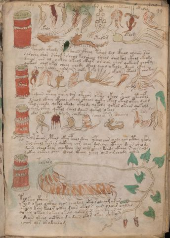

# Voynich Speculative Procedural Protocol — f99r

IMPORTANT: this is NOT a real or validated translation of the Voynich Manuscript. It is a speculative/procedural model that interprets EVA using a user-defined grammar to generate experimental recipes using safe, known edible substitutes.

This file is generated automatically from IVTFF/EVA transliteration plus a user-defined procedural grammar.



## Page / Folio
- currier: A
- folio: f99r
- page_number: 201

## EVA Text (Transliteration)
```text
okaradag
okar y
darar
oky
salo
aro
ain
okor
ralol
skeeal
okary
okolo
otalam
otoldy
pcheody oteody daiin cpheey tshol dal cfheol olaiin sar
saroshy shor s shor sheol kolsheol qoeol sholkol ckhol ckhory
dcheor chr al yckhy okeol ckhor oraiin chor qokeeor chory
qokeor chol ykol cheey chody ckhol daiin okeoly daiin ckhy
oparal
oaro
aloly
aora[?:r]
choky
oky
okeoly
yteold
cheotchy
kodaiin opchey qoky dar otchor opsho okeol sheol oteoefol
dsheol ckhey ckheol okeol ctheol qokey ckhol okeol okeey dald
tol cheody qokol okoly okoldy qokoly qokal okchol qokold
chees okeey qotol sheol daiin qotol okeol
tsholdy
okos
oekey
dar
chockhi[a:y]
r cheyet
saiiny
sory
dam
tsheeor cpheol ckey pchol ckhey ypchol chor choly qotocthey qkory
sol sheol keshey qokeeey chs chey dalchey ctheey daiin cheom
daiin cheeokeey checkhey dor oldy sheey keody okeeey s aiin ols
qokey chkeey chey ckhey ckhey ykeey oiin air chody oeksa
yteoldy
tolsasy
tol keey ctheey
ykeol okeol ockhey chol cheodal okeo r alcheeg orar
okeeey keey keear okeey daiin okeol s aiin olaiir oolsal
qokeeo okeey qokeey okesy qokeeo sar sheseky or al
yshaiin ykhey octhey dy daiin okor okeey shctysh
ychor ols or agairom
```

## Domain Context (Heuristic; Not a Translation)

This section summarizes recurring **basewords** in this IVTFF domain and shows simple substring evidence that the token markers used by the procedural grammar occur inside frequent words.

Any Italian anagram / English gloss is a best-effort lexicon match, not a decipherment.


### Associated basewords (non-generic; top by frequency in this domain)
- `daiin` (count=231) → Italian anagram `piani`; English: plans (arrangements)
- `qokaiin` (count=122) → Italian anagram `ciancio`; English: [n/a]
- `okaiin` (count=109) → Italian anagram `coniai`; English: [n/a]
- `qokain` (count=101) → Italian anagram `acconi`; English: [n/a]
- `okain` (count=69) → Italian anagram `acino`; English: a berry
- `otain` (count=53) → Italian anagram `anito`; English: [n/a]
- `qokar` (count=48) → Italian anagram `carco`; English: [n/a]
- `saiin` (count=46) → Italian anagram `asini`; English: [n/a]
- `qokal` (count=43) → Italian anagram `calco`; English: cast (of sculpture)
- `qotaiin` (count=40) → Italian anagram `cationi`; English: [n/a]
- `lkaiin` (count=39) → Italian anagram `ancili`; English: [n/a]
- `kaiin` (count=37) → Italian anagram `acini`; English: [n/a]
- `qokeol` (count=37) → Italian anagram `eccolo`; English: [n/a]
- `qotain` (count=34) → Italian anagram `antico`; English: ancient
- `qotar` (count=29) → Italian anagram `corta`; English: [n/a]

### Marker evidence (substring in frequent basewords)
- `qo`: 60 basewords; examples: `qokeey`, `qokeedy`, `qokaiin`, `qokain`, `qokedy`, `qokey`
- `q`: 61 basewords; examples: `qokeey`, `qokeedy`, `qokaiin`, `qokain`, `qokedy`, `qokey`
- `o`: 262 basewords; examples: `qokeey`, `ol`, `o`, `qokeedy`, `okeey`, `qokaiin`
- `k`: 147 basewords; examples: `qokeey`, `qokeedy`, `okeey`, `qokaiin`, `okaiin`, `qokain`
- `t`: 102 basewords; examples: `otaiin`, `oteey`, `otar`, `otedy`, `otal`, `oteedy`
- `p`: 17 basewords; examples: `opchedy`, `qopchedy`, `opchey`, `pchedy`, `qopchdy`, `opchdy`
- `ch`: 137 basewords; examples: `chedy`, `chey`, `chol`, `cheey`, `cheol`, `cheody`
- `sh`: 50 basewords; examples: `shedy`, `shey`, `sheey`, `sheol`, `shol`, `sheedy`
- `f`: 1 basewords; examples: `f`
- `cth`: 16 basewords; examples: `chcthy`, `cthey`, `shcthy`, `checthy`, `cthol`, `ctheey`
- `ckh`: 15 basewords; examples: `chckhy`, `shckhy`, `checkhy`, `chckhey`, `chockhy`, `sheckhy`
- `cph`: 2 basewords; examples: `cphol`, `cphy`
- `dy`: 84 basewords; examples: `chedy`, `qokeedy`, `shedy`, `otedy`, `oteedy`, `qokedy`
- `iin`: 39 basewords; examples: `aiin`, `daiin`, `qokaiin`, `okaiin`, `otaiin`, `saiin`
- `aiin`: 33 basewords; examples: `aiin`, `daiin`, `qokaiin`, `okaiin`, `otaiin`, `saiin`

## Recipes Index (This Page)
- [f99r.1,@Lc](#f99r-1-f99r-1-lc)
- [f99r.2,@Lf](#f99r-2-f99r-2-lf)
- [f99r.3,@Lf](#f99r-3-f99r-3-lf)
- [f99r.4,@Lf](#f99r-4-f99r-4-lf)
- [f99r.5,@Lf](#f99r-5-f99r-5-lf)
- [f99r.6,@Lf](#f99r-6-f99r-6-lf)
- [f99r.7,+Lf](#f99r-7-f99r-7-lf)
- [f99r.8,@Lf](#f99r-8-f99r-8-lf)
- [f99r.9,@Lf](#f99r-9-f99r-9-lf)
- [f99r.10,@Lf](#f99r-10-f99r-10-lf)
- [f99r.11,@Lf](#f99r-11-f99r-11-lf)
- [f99r.12,@Lf](#f99r-12-f99r-12-lf)
- [f99r.13,@Lf](#f99r-13-f99r-13-lf)
- [f99r.14,@Lf](#f99r-14-f99r-14-lf)
- [f99r.15,@P0](#f99r-15-f99r-15-p0)
- [f99r.16,+P0](#f99r-16-f99r-16-p0)
- [f99r.17,+P0](#f99r-17-f99r-17-p0)
- [f99r.18,+P0](#f99r-18-f99r-18-p0)
- [f99r.19,@Lc](#f99r-19-f99r-19-lc)
- [f99r.20,@Lf](#f99r-20-f99r-20-lf)
- [f99r.21,@Lf](#f99r-21-f99r-21-lf)
- [f99r.22,@Lf](#f99r-22-f99r-22-lf)
- [f99r.23,@Lf](#f99r-23-f99r-23-lf)
- [f99r.24,@Lf](#f99r-24-f99r-24-lf)
- [f99r.25,@Lf](#f99r-25-f99r-25-lf)
- [f99r.26,@Lf](#f99r-26-f99r-26-lf)
- [f99r.27,@Lf](#f99r-27-f99r-27-lf)
- [f99r.28,@P0](#f99r-28-f99r-28-p0)
- [f99r.29,+P0](#f99r-29-f99r-29-p0)
- [f99r.30,+P0](#f99r-30-f99r-30-p0)
- [f99r.31,+P0](#f99r-31-f99r-31-p0)
- [f99r.32,@Lc](#f99r-32-f99r-32-lc)
- [f99r.33,@Lf](#f99r-33-f99r-33-lf)
- [f99r.34,@Lf](#f99r-34-f99r-34-lf)
- [f99r.35,@Lf](#f99r-35-f99r-35-lf)
- [f99r.36,@Lf](#f99r-36-f99r-36-lf)
- [f99r.37,@Lf](#f99r-37-f99r-37-lf)
- [f99r.38,@Lf](#f99r-38-f99r-38-lf)
- [f99r.39,@Lf](#f99r-39-f99r-39-lf)
- [f99r.40,@Lf](#f99r-40-f99r-40-lf)
- [f99r.41,@P0](#f99r-41-f99r-41-p0)
- [f99r.42,+P0](#f99r-42-f99r-42-p0)
- [f99r.43,+P0](#f99r-43-f99r-43-p0)
- [f99r.44,+P0](#f99r-44-f99r-44-p0)
- [f99r.45,@Lc](#f99r-45-f99r-45-lc)
- [f99r.46,@Lf](#f99r-46-f99r-46-lf)
- [f99r.47,@P0](#f99r-47-f99r-47-p0)
- [f99r.48,+P0](#f99r-48-f99r-48-p0)
- [f99r.49,+P0](#f99r-49-f99r-49-p0)
- [f99r.50,+P0](#f99r-50-f99r-50-p0)
- [f99r.51,+P0](#f99r-51-f99r-51-p0)
- [f99r.52,+P0](#f99r-52-f99r-52-p0)

## Line Glosses (Procedural Gloss Only; Not a Translation)

<a id="f99r-1-f99r-1-lc"></a>

### f99r.1,@Lc

EVA: okaradag

Direct Gloss (Procedural, Not a Real Translation):
- okaradag: tokens: o k a r a p a g → connectors: r → vowel_run: a (level 1; class a)

<a id="f99r-2-f99r-2-lf"></a>

### f99r.2,@Lf

EVA: okar y

Direct Gloss (Procedural, Not a Real Translation):
- okar: tokens: o k a r → connectors: r → vowel_run: a (level 1; class a)
- y: [unparsed]

<a id="f99r-3-f99r-3-lf"></a>

### f99r.3,@Lf

EVA: darar

Direct Gloss (Procedural, Not a Real Translation):
- darar: tokens: p a r a r → connectors: r r → vowel_run: a (level 1; class a)

<a id="f99r-4-f99r-4-lf"></a>

### f99r.4,@Lf

EVA: oky

Direct Gloss (Procedural, Not a Real Translation):
- oky: tokens: o k

<a id="f99r-5-f99r-5-lf"></a>

### f99r.5,@Lf

EVA: salo

Direct Gloss (Procedural, Not a Real Translation):
- salo: tokens: s a l o → connectors: s l → vowel_run: a (level 1; class a)

<a id="f99r-6-f99r-6-lf"></a>

### f99r.6,@Lf

EVA: aro

Direct Gloss (Procedural, Not a Real Translation):
- aro: tokens: a r o → connectors: r → vowel_run: a (level 1; class a)

<a id="f99r-7-f99r-7-lf"></a>

### f99r.7,+Lf

EVA: ain

Direct Gloss (Procedural, Not a Real Translation):
- ain: tokens: a i n → connectors: n → vowel_run: a (level 1; class a)

<a id="f99r-8-f99r-8-lf"></a>

### f99r.8,@Lf

EVA: okor

Direct Gloss (Procedural, Not a Real Translation):
- okor: tokens: o k o r → connectors: r

<a id="f99r-9-f99r-9-lf"></a>

### f99r.9,@Lf

EVA: ralol

Direct Gloss (Procedural, Not a Real Translation):
- ralol: tokens: r a l o l → connectors: r l l → vowel_run: a (level 1; class a)

<a id="f99r-10-f99r-10-lf"></a>

### f99r.10,@Lf

EVA: skeeal

Direct Gloss (Procedural, Not a Real Translation):
- skeeal: tokens: s k ee a l → connectors: s l → vowel_run: ee (level 2; class e)

<a id="f99r-11-f99r-11-lf"></a>

### f99r.11,@Lf

EVA: okary

Direct Gloss (Procedural, Not a Real Translation):
- okary: tokens: o k a r → connectors: r → vowel_run: a (level 1; class a)

<a id="f99r-12-f99r-12-lf"></a>

### f99r.12,@Lf

EVA: okolo

Direct Gloss (Procedural, Not a Real Translation):
- okolo: tokens: o k o l o → connectors: l

<a id="f99r-13-f99r-13-lf"></a>

### f99r.13,@Lf

EVA: otalam

Direct Gloss (Procedural, Not a Real Translation):
- otalam: tokens: o t a l a m → connectors: l m → vowel_run: a (level 1; class a)

<a id="f99r-14-f99r-14-lf"></a>

### f99r.14,@Lf

EVA: otoldy

Direct Gloss (Procedural, Not a Real Translation):
- otoldy: tokens: o t o l p → connectors: l

<a id="f99r-15-f99r-15-p0"></a>

### f99r.15,@P0

EVA: pcheody oteody daiin cpheey tshol dal cfheol olaiin sar

Direct Gloss (Procedural, Not a Real Translation):
- pcheody: tokens: p ch e o p → vowel_run: e (level 1; class e)
- oteody: tokens: o t e o p → vowel_run: e (level 1; class e)
- daiin: tokens: p aiin → vowel_run: a (level 1; class a) → suffix: aiin (lexicon-context: `daiin` → `piani`; plans (arrangements))
- cpheey: tokens: cph ee → vowel_run: ee (level 2; class e)
- tshol: tokens: t sh o l → connectors: l
- dal: tokens: p a l → connectors: l → vowel_run: a (level 1; class a)
- cfheol: tokens: cfh e o l → connectors: l → vowel_run: e (level 1; class e)
- olaiin: tokens: o l aiin → connectors: l → vowel_run: a (level 1; class a) → suffix: aiin (lexicon-context: `olaiin` → `ialino`; hyaline, glassy)
- sar: tokens: s a r → connectors: s r → vowel_run: a (level 1; class a)

<a id="f99r-16-f99r-16-p0"></a>

### f99r.16,+P0

EVA: saroshy shor s shor sheol kolsheol qoeol sholkol ckhol ckhory

Direct Gloss (Procedural, Not a Real Translation):
- saroshy: tokens: s a r o sh → connectors: s r → vowel_run: a (level 1; class a)
- shor: tokens: sh o r → connectors: r
- s: tokens: s → connectors: s
- shor: tokens: sh o r → connectors: r
- sheol: tokens: sh e o l → connectors: l → vowel_run: e (level 1; class e)
- kolsheol: tokens: k o l sh e o l → connectors: l l → vowel_run: e (level 1; class e)
- qoeol: tokens: qo e o l → connectors: l → vowel_run: e (level 1; class e)
- sholkol: tokens: sh o l k o l → connectors: l l
- ckhol: tokens: ckh o l → connectors: l
- ckhory: tokens: ckh o r → connectors: r

<a id="f99r-17-f99r-17-p0"></a>

### f99r.17,+P0

EVA: dcheor chr al yckhy okeol ckhor oraiin chor qokeeor chory

Direct Gloss (Procedural, Not a Real Translation):
- dcheor: tokens: p ch e o r → connectors: r → vowel_run: e (level 1; class e)
- chr: tokens: ch r → connectors: r
- al: tokens: a l → connectors: l → vowel_run: a (level 1; class a)
- yckhy: tokens: ckh
- okeol: tokens: o k e o l → connectors: l → vowel_run: e (level 1; class e)
- ckhor: tokens: ckh o r → connectors: r
- oraiin: tokens: o r aiin → connectors: r → vowel_run: a (level 1; class a) → suffix: aiin (lexicon-context: `oraiin` → `aironi`; [n/a])
- chor: tokens: ch o r → connectors: r
- qokeeor: tokens: qo k ee o r → connectors: r → vowel_run: ee (level 2; class e)
- chory: tokens: ch o r → connectors: r

<a id="f99r-18-f99r-18-p0"></a>

### f99r.18,+P0

EVA: qokeor chol ykol cheey chody ckhol daiin okeoly daiin ckhy

Direct Gloss (Procedural, Not a Real Translation):
- qokeor: tokens: qo k e o r → connectors: r → vowel_run: e (level 1; class e)
- chol: tokens: ch o l → connectors: l
- ykol: tokens: k o l → connectors: l
- cheey: tokens: ch ee → vowel_run: ee (level 2; class e)
- chody: tokens: ch o p
- ckhol: tokens: ckh o l → connectors: l
- daiin: tokens: p aiin → vowel_run: a (level 1; class a) → suffix: aiin (lexicon-context: `daiin` → `piani`; plans (arrangements))
- okeoly: tokens: o k e o l → connectors: l → vowel_run: e (level 1; class e)
- daiin: tokens: p aiin → vowel_run: a (level 1; class a) → suffix: aiin (lexicon-context: `daiin` → `piani`; plans (arrangements))
- ckhy: tokens: ckh

<a id="f99r-19-f99r-19-lc"></a>

### f99r.19,@Lc

EVA: oparal

Direct Gloss (Procedural, Not a Real Translation):
- oparal: tokens: o p a r a l → connectors: r l → vowel_run: a (level 1; class a)

<a id="f99r-20-f99r-20-lf"></a>

### f99r.20,@Lf

EVA: oaro

Direct Gloss (Procedural, Not a Real Translation):
- oaro: tokens: o a r o → connectors: r → vowel_run: a (level 1; class a)

<a id="f99r-21-f99r-21-lf"></a>

### f99r.21,@Lf

EVA: aloly

Direct Gloss (Procedural, Not a Real Translation):
- aloly: tokens: a l o l → connectors: l l → vowel_run: a (level 1; class a)

<a id="f99r-22-f99r-22-lf"></a>

### f99r.22,@Lf

EVA: aora[?:r]

Direct Gloss (Procedural, Not a Real Translation):
- aora: tokens: a o r a → connectors: r → vowel_run: a (level 1; class a)
- r: tokens: r → connectors: r

<a id="f99r-23-f99r-23-lf"></a>

### f99r.23,@Lf

EVA: choky

Direct Gloss (Procedural, Not a Real Translation):
- choky: tokens: ch o k

<a id="f99r-24-f99r-24-lf"></a>

### f99r.24,@Lf

EVA: oky

Direct Gloss (Procedural, Not a Real Translation):
- oky: tokens: o k

<a id="f99r-25-f99r-25-lf"></a>

### f99r.25,@Lf

EVA: okeoly

Direct Gloss (Procedural, Not a Real Translation):
- okeoly: tokens: o k e o l → connectors: l → vowel_run: e (level 1; class e)

<a id="f99r-26-f99r-26-lf"></a>

### f99r.26,@Lf

EVA: yteold

Direct Gloss (Procedural, Not a Real Translation):
- yteold: tokens: t e o l p → connectors: l → vowel_run: e (level 1; class e)

<a id="f99r-27-f99r-27-lf"></a>

### f99r.27,@Lf

EVA: cheotchy

Direct Gloss (Procedural, Not a Real Translation):
- cheotchy: tokens: ch e o t ch → vowel_run: e (level 1; class e)

<a id="f99r-28-f99r-28-p0"></a>

### f99r.28,@P0

EVA: kodaiin opchey qoky dar otchor opsho okeol sheol oteoefol

Direct Gloss (Procedural, Not a Real Translation):
- kodaiin: tokens: k o p aiin → vowel_run: a (level 1; class a) → suffix: aiin (lexicon-context: `odaiin` → `inopia`; poverty)
- opchey: tokens: o p ch e → vowel_run: e (level 1; class e)
- qoky: tokens: qo k
- dar: tokens: p a r → connectors: r → vowel_run: a (level 1; class a)
- otchor: tokens: o t ch o r → connectors: r
- opsho: tokens: o p sh o
- okeol: tokens: o k e o l → connectors: l → vowel_run: e (level 1; class e)
- sheol: tokens: sh e o l → connectors: l → vowel_run: e (level 1; class e)
- oteoefol: tokens: o t e o e f o l → connectors: l → vowel_run: e (level 1; class e)

<a id="f99r-29-f99r-29-p0"></a>

### f99r.29,+P0

EVA: dsheol ckhey ckheol okeol ctheol qokey ckhol okeol okeey dald

Direct Gloss (Procedural, Not a Real Translation):
- dsheol: tokens: p sh e o l → connectors: l → vowel_run: e (level 1; class e)
- ckhey: tokens: ckh e → vowel_run: e (level 1; class e)
- ckheol: tokens: ckh e o l → connectors: l → vowel_run: e (level 1; class e)
- okeol: tokens: o k e o l → connectors: l → vowel_run: e (level 1; class e)
- ctheol: tokens: cth e o l → connectors: l → vowel_run: e (level 1; class e)
- qokey: tokens: qo k e → vowel_run: e (level 1; class e)
- ckhol: tokens: ckh o l → connectors: l
- okeol: tokens: o k e o l → connectors: l → vowel_run: e (level 1; class e)
- okeey: tokens: o k ee → vowel_run: ee (level 2; class e)
- dald: tokens: p a l p → connectors: l → vowel_run: a (level 1; class a)

<a id="f99r-30-f99r-30-p0"></a>

### f99r.30,+P0

EVA: tol cheody qokol okoly okoldy qokoly qokal okchol qokold

Direct Gloss (Procedural, Not a Real Translation):
- tol: tokens: t o l → connectors: l
- cheody: tokens: ch e o p → vowel_run: e (level 1; class e)
- qokol: tokens: qo k o l → connectors: l
- okoly: tokens: o k o l → connectors: l
- okoldy: tokens: o k o l p → connectors: l
- qokoly: tokens: qo k o l → connectors: l
- qokal: tokens: qo k a l → connectors: l → vowel_run: a (level 1; class a) (lexicon-context: `qokal` → `calco`; cast (of sculpture))
- okchol: tokens: o k ch o l → connectors: l
- qokold: tokens: qo k o l p → connectors: l

<a id="f99r-31-f99r-31-p0"></a>

### f99r.31,+P0

EVA: chees okeey qotol sheol daiin qotol okeol

Direct Gloss (Procedural, Not a Real Translation):
- chees: tokens: ch ee s → connectors: s → vowel_run: ee (level 2; class e)
- okeey: tokens: o k ee → vowel_run: ee (level 2; class e)
- qotol: tokens: qo t o l → connectors: l (lexicon-context: `qotol` → `colto`; cultivated)
- sheol: tokens: sh e o l → connectors: l → vowel_run: e (level 1; class e)
- daiin: tokens: p aiin → vowel_run: a (level 1; class a) → suffix: aiin (lexicon-context: `daiin` → `piani`; plans (arrangements))
- qotol: tokens: qo t o l → connectors: l (lexicon-context: `qotol` → `colto`; cultivated)
- okeol: tokens: o k e o l → connectors: l → vowel_run: e (level 1; class e)

<a id="f99r-32-f99r-32-lc"></a>

### f99r.32,@Lc

EVA: tsholdy

Direct Gloss (Procedural, Not a Real Translation):
- tsholdy: tokens: t sh o l p → connectors: l

<a id="f99r-33-f99r-33-lf"></a>

### f99r.33,@Lf

EVA: okos

Direct Gloss (Procedural, Not a Real Translation):
- okos: tokens: o k o s → connectors: s

<a id="f99r-34-f99r-34-lf"></a>

### f99r.34,@Lf

EVA: oekey

Direct Gloss (Procedural, Not a Real Translation):
- oekey: tokens: o e k e → vowel_run: e (level 1; class e)

<a id="f99r-35-f99r-35-lf"></a>

### f99r.35,@Lf

EVA: dar

Direct Gloss (Procedural, Not a Real Translation):
- dar: tokens: p a r → connectors: r → vowel_run: a (level 1; class a)

<a id="f99r-36-f99r-36-lf"></a>

### f99r.36,@Lf

EVA: chockhi[a:y]

Direct Gloss (Procedural, Not a Real Translation):
- chockhi: tokens: ch o ckh i → vowel_run: i (level 1; class i)
- a: tokens: a → vowel_run: a (level 1; class a)
- y: [unparsed]

<a id="f99r-37-f99r-37-lf"></a>

### f99r.37,@Lf

EVA: r cheyet

Direct Gloss (Procedural, Not a Real Translation):
- r: tokens: r → connectors: r
- cheyet: tokens: ch ee t → vowel_run: ee (level 2; class e)

<a id="f99r-38-f99r-38-lf"></a>

### f99r.38,@Lf

EVA: saiiny

Direct Gloss (Procedural, Not a Real Translation):
- saiiny: tokens: s aiin → connectors: s → vowel_run: a (level 1; class a) → suffix: aiin (lexicon-context: `saiin` → `asini`; [n/a])

<a id="f99r-39-f99r-39-lf"></a>

### f99r.39,@Lf

EVA: sory

Direct Gloss (Procedural, Not a Real Translation):
- sory: tokens: s o r → connectors: s r

<a id="f99r-40-f99r-40-lf"></a>

### f99r.40,@Lf

EVA: dam

Direct Gloss (Procedural, Not a Real Translation):
- dam: tokens: p a m → connectors: m → vowel_run: a (level 1; class a)

<a id="f99r-41-f99r-41-p0"></a>

### f99r.41,@P0

EVA: tsheeor cpheol ckey pchol ckhey ypchol chor choly qotocthey qkory

Direct Gloss (Procedural, Not a Real Translation):
- tsheeor: tokens: t sh ee o r → connectors: r → vowel_run: ee (level 2; class e)
- cpheol: tokens: cph e o l → connectors: l → vowel_run: e (level 1; class e)
- ckey: tokens: c k e → vowel_run: e (level 1; class e)
- pchol: tokens: p ch o l → connectors: l
- ckhey: tokens: ckh e → vowel_run: e (level 1; class e)
- ypchol: tokens: p ch o l → connectors: l
- chor: tokens: ch o r → connectors: r
- choly: tokens: ch o l → connectors: l
- qotocthey: tokens: qo t o cth e → vowel_run: e (level 1; class e)
- qkory: tokens: q k o r → connectors: r

<a id="f99r-42-f99r-42-p0"></a>

### f99r.42,+P0

EVA: sol sheol keshey qokeeey chs chey dalchey ctheey daiin cheom

Direct Gloss (Procedural, Not a Real Translation):
- sol: tokens: s o l → connectors: s l
- sheol: tokens: sh e o l → connectors: l → vowel_run: e (level 1; class e)
- keshey: tokens: k e sh e → vowel_run: e (level 1; class e)
- qokeeey: tokens: qo k eee → vowel_run: eee (level 3; class e)
- chs: tokens: ch s → connectors: s
- chey: tokens: ch e → vowel_run: e (level 1; class e)
- dalchey: tokens: p a l ch e → connectors: l → vowel_run: a (level 1; class a)
- ctheey: tokens: cth ee → vowel_run: ee (level 2; class e)
- daiin: tokens: p aiin → vowel_run: a (level 1; class a) → suffix: aiin (lexicon-context: `daiin` → `piani`; plans (arrangements))
- cheom: tokens: ch e o m → connectors: m → vowel_run: e (level 1; class e)

<a id="f99r-43-f99r-43-p0"></a>

### f99r.43,+P0

EVA: daiin cheeokeey checkhey dor oldy sheey keody okeeey s aiin ols

Direct Gloss (Procedural, Not a Real Translation):
- daiin: tokens: p aiin → vowel_run: a (level 1; class a) → suffix: aiin (lexicon-context: `daiin` → `piani`; plans (arrangements))
- cheeokeey: tokens: ch ee o k ee → vowel_run: ee (level 2; class e)
- checkhey: tokens: ch e ckh e → vowel_run: e (level 1; class e)
- dor: tokens: p o r → connectors: r
- oldy: tokens: o l p → connectors: l
- sheey: tokens: sh ee → vowel_run: ee (level 2; class e)
- keody: tokens: k e o p → vowel_run: e (level 1; class e)
- okeeey: tokens: o k eee → vowel_run: eee (level 3; class e)
- s: tokens: s → connectors: s
- aiin: tokens: aiin → vowel_run: a (level 1; class a) → suffix: aiin
- ols: tokens: o l s → connectors: l s

<a id="f99r-44-f99r-44-p0"></a>

### f99r.44,+P0

EVA: qokey chkeey chey ckhey ckhey ykeey oiin air chody oeksa

Direct Gloss (Procedural, Not a Real Translation):
- qokey: tokens: qo k e → vowel_run: e (level 1; class e)
- chkeey: tokens: ch k ee → vowel_run: ee (level 2; class e)
- chey: tokens: ch e → vowel_run: e (level 1; class e)
- ckhey: tokens: ckh e → vowel_run: e (level 1; class e)
- ckhey: tokens: ckh e → vowel_run: e (level 1; class e)
- ykeey: tokens: k ee → vowel_run: ee (level 2; class e)
- oiin: tokens: o iin → vowel_run: ii (level 2; class i) → suffix: iin
- air: tokens: a i r → connectors: r → vowel_run: a (level 1; class a)
- chody: tokens: ch o p
- oeksa: tokens: o e k s a → connectors: s → vowel_run: e (level 1; class e)

<a id="f99r-45-f99r-45-lc"></a>

### f99r.45,@Lc

EVA: yteoldy

Direct Gloss (Procedural, Not a Real Translation):
- yteoldy: tokens: t e o l p → connectors: l → vowel_run: e (level 1; class e)

<a id="f99r-46-f99r-46-lf"></a>

### f99r.46,@Lf

EVA: tolsasy

Direct Gloss (Procedural, Not a Real Translation):
- tolsasy: tokens: t o l s a s → connectors: l s s → vowel_run: a (level 1; class a)

<a id="f99r-47-f99r-47-p0"></a>

### f99r.47,@P0

EVA: tol keey ctheey

Direct Gloss (Procedural, Not a Real Translation):
- tol: tokens: t o l → connectors: l
- keey: tokens: k ee → vowel_run: ee (level 2; class e)
- ctheey: tokens: cth ee → vowel_run: ee (level 2; class e)

<a id="f99r-48-f99r-48-p0"></a>

### f99r.48,+P0

EVA: ykeol okeol ockhey chol cheodal okeo r alcheeg orar

Direct Gloss (Procedural, Not a Real Translation):
- ykeol: tokens: k e o l → connectors: l → vowel_run: e (level 1; class e)
- okeol: tokens: o k e o l → connectors: l → vowel_run: e (level 1; class e)
- ockhey: tokens: o ckh e → vowel_run: e (level 1; class e)
- chol: tokens: ch o l → connectors: l
- cheodal: tokens: ch e o p a l → connectors: l → vowel_run: e (level 1; class e)
- okeo: tokens: o k e o → vowel_run: e (level 1; class e)
- r: tokens: r → connectors: r
- alcheeg: tokens: a l ch ee g → connectors: l → vowel_run: a (level 1; class a)
- orar: tokens: o r a r → connectors: r r → vowel_run: a (level 1; class a)

<a id="f99r-49-f99r-49-p0"></a>

### f99r.49,+P0

EVA: okeeey keey keear okeey daiin okeol s aiin olaiir oolsal

Direct Gloss (Procedural, Not a Real Translation):
- okeeey: tokens: o k eee → vowel_run: eee (level 3; class e)
- keey: tokens: k ee → vowel_run: ee (level 2; class e)
- keear: tokens: k ee a r → connectors: r → vowel_run: ee (level 2; class e)
- okeey: tokens: o k ee → vowel_run: ee (level 2; class e)
- daiin: tokens: p aiin → vowel_run: a (level 1; class a) → suffix: aiin (lexicon-context: `daiin` → `piani`; plans (arrangements))
- okeol: tokens: o k e o l → connectors: l → vowel_run: e (level 1; class e)
- s: tokens: s → connectors: s
- aiin: tokens: aiin → vowel_run: a (level 1; class a) → suffix: aiin
- olaiir: tokens: o l a ii r → connectors: l r → vowel_run: a (level 1; class a)
- oolsal: tokens: o o l s a l → connectors: l s l → vowel_run: a (level 1; class a)

<a id="f99r-50-f99r-50-p0"></a>

### f99r.50,+P0

EVA: qokeeo okeey qokeey okesy qokeeo sar sheseky or al

Direct Gloss (Procedural, Not a Real Translation):
- qokeeo: tokens: qo k ee o → vowel_run: ee (level 2; class e)
- okeey: tokens: o k ee → vowel_run: ee (level 2; class e)
- qokeey: tokens: qo k ee → vowel_run: ee (level 2; class e)
- okesy: tokens: o k e s → connectors: s → vowel_run: e (level 1; class e)
- qokeeo: tokens: qo k ee o → vowel_run: ee (level 2; class e)
- sar: tokens: s a r → connectors: s r → vowel_run: a (level 1; class a)
- sheseky: tokens: sh e s e k → connectors: s → vowel_run: e (level 1; class e)
- or: tokens: o r → connectors: r
- al: tokens: a l → connectors: l → vowel_run: a (level 1; class a)

<a id="f99r-51-f99r-51-p0"></a>

### f99r.51,+P0

EVA: yshaiin ykhey octhey dy daiin okor okeey shctysh

Direct Gloss (Procedural, Not a Real Translation):
- yshaiin: tokens: sh aiin → vowel_run: a (level 1; class a) → suffix: aiin
- ykhey: tokens: k h e → vowel_run: e (level 1; class e) → unmodeled_tokens: h
- octhey: tokens: o cth e → vowel_run: e (level 1; class e)
- dy: tokens: p
- daiin: tokens: p aiin → vowel_run: a (level 1; class a) → suffix: aiin (lexicon-context: `daiin` → `piani`; plans (arrangements))
- okor: tokens: o k o r → connectors: r
- okeey: tokens: o k ee → vowel_run: ee (level 2; class e)
- shctysh: tokens: sh c t sh

<a id="f99r-52-f99r-52-p0"></a>

### f99r.52,+P0

EVA: ychor ols or agairom

Direct Gloss (Procedural, Not a Real Translation):
- ychor: tokens: ch o r → connectors: r
- ols: tokens: o l s → connectors: l s
- or: tokens: o r → connectors: r
- agairom: tokens: a g a i r o m → connectors: r m → vowel_run: a (level 1; class a)
